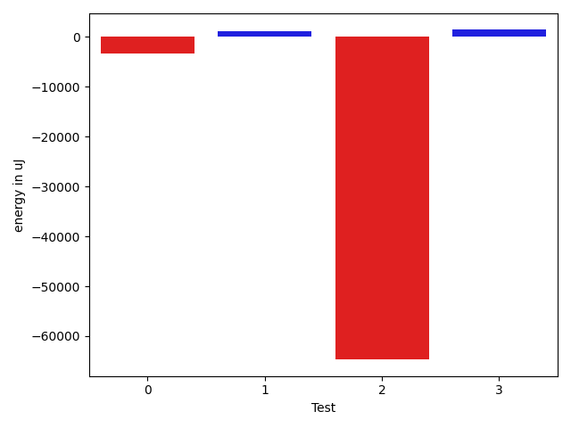

# gson 448063

https://github.com/google/gson/commit/448063

## Delta Energy per test method

| ID | EnergyV1 | EnergyV2 | DeltaEnergy | σV1 | σV2 |
| --- | --- | --- | --- | --- | --- |
| 0 | 34973 | 35462 | 489 | 31451.552037599417 | 24723.770002096026 |
| 1 | 35889 | 36926 | 1037 | 60144.01604323784 | 66283.4352366712 |
| 2 | 226440 | 210266 | -16174 | 753163.2474100146 | 707360.3809512198 |
| 3 | 107177 | 110961 | 3784 | 114124.07400527014 | 112414.85080307563 |

## Delta Duration per test method

| ID | DurationV1 | DurationsV2 | DeltaDuration |
| --- | --- | --- | --- |
| 0 | 1785404.7906976745 | 1650231.0555555555 | -135173.735142119 |
| 1 | 1936212.6610169492 | 1751559.5573770492 | -184653.1036399 |
| 2 | 17525060.818181816 | 15728681.333333334 | -1796379.4848484825 |
| 3 | 4664070.060606061 | 4792500.914285715 | 128430.85367965419 |

## Misc.

| ID | Test Class | Test Method |
| --- | --- | --- |
| 0 | com.google.gson.functional.NamingPolicyTest | testComplexFieldNameStrategy |
| 1 | com.google.gson.GsonTypeAdapterTest | testTypeAdapterThrowsException |
| 2 | com.google.gson.functional.TypeHierarchyAdapterTest | testTypeHierarchy |
| 3 | com.google.gson.JsonParserTest | testParseMixedArray |

| Test | IterationV1 | IterationV2 | DeltaIteration |
| --- | --- | --- | --- |
| 0 | 86 | 90 | 4 |
| 1 | 59 | 61 | 2 |
| 2 | 99 | 99 | 0 |
| 3 | 66 | 70 | 4 |

| Time Label | Time (s) |
| --- | --- |
| Selection | 26.66770076751709 |
| Injection | 10.028136014938354 |
| Total | 977.2348582744598 |

