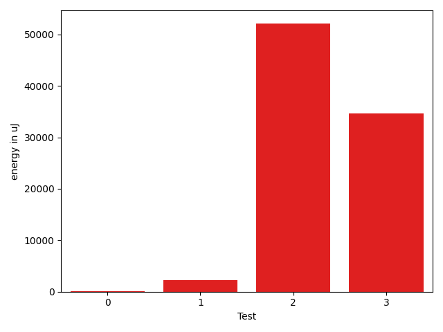

# gson 4c2980

https://github.com/google/gson/commit/4c2980

## Delta Energy per test method

| ID | EnergyV1 | EnergyV2 | DeltaEnergy | σV1 | σV2 |
| --- | --- | --- | --- | --- | --- |
| 0 | 34790 | 34912 | 122 | 37203.56547386816 | 21620.626530751197 |
| 1 | 33631 | 35889 | 2258 | 67192.05861478779 | 11003.145975147288 |
| 2 | 191345 | 243407 | 52062 | 651346.6906760421 | 844817.2819585537 |
| 3 | 76598 | 111206 | 34608 | 112665.13141213066 | 111954.14827381405 |

## Delta Duration per test method

| ID | DurationV1 | DurationsV2 | DeltaDuration |
| --- | --- | --- | --- |
| 0 | 1678525.9777777777 | 1600131.1555555556 | -78394.82222222211 |
| 1 | 1971720.0 | 1360577.76 | -611142.24 |
| 2 | 14402910.222222222 | 19521587.29292929 | 5118677.07070707 |
| 3 | 4130101.1756756757 | 4655167.4677419355 | 525066.2920662598 |

## Misc.

| ID | Test Class | Test Method |
| --- | --- | --- |
| 0 | com.google.gson.functional.NamingPolicyTest | testComplexFieldNameStrategy |
| 1 | com.google.gson.GsonTypeAdapterTest | testTypeAdapterThrowsException |
| 2 | com.google.gson.functional.TypeHierarchyAdapterTest | testTypeHierarchy |
| 3 | com.google.gson.JsonParserTest | testParseMixedArray |

| Test | IterationV1 | IterationV2 | DeltaIteration |
| --- | --- | --- | --- |
| 0 | 90 | 90 | 0 |
| 1 | 62 | 50 | -12 |
| 2 | 99 | 99 | 0 |
| 3 | 74 | 62 | -12 |

| Time Label | Time (s) |
| --- | --- |
| Selection | 27.46254563331604 |
| Injection | 10.144169807434082 |
| Total | 978.877012014389 |

