# gson c7cb50

https://github.com/google/gson/commit/c7cb50

## Delta Energy per test method

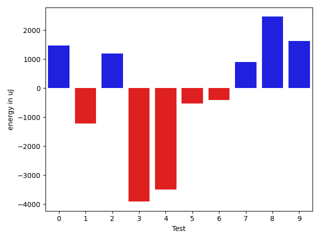

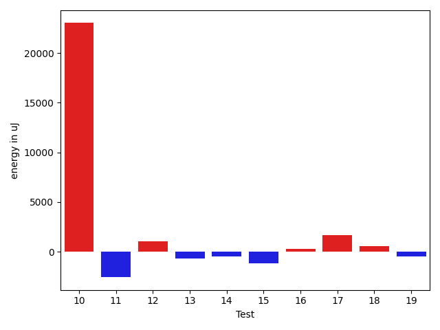

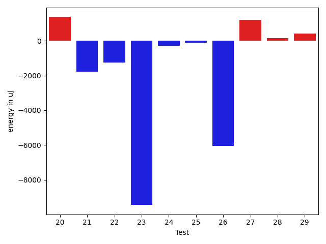

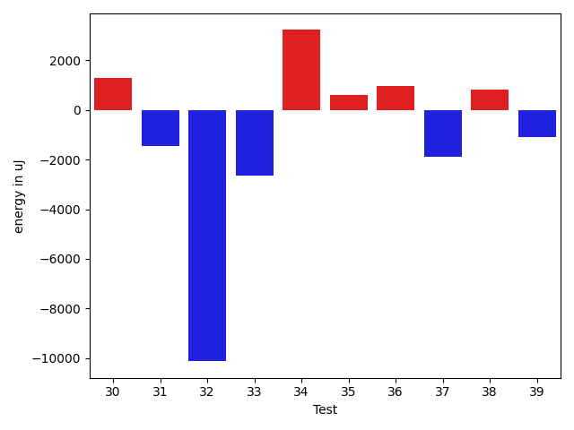

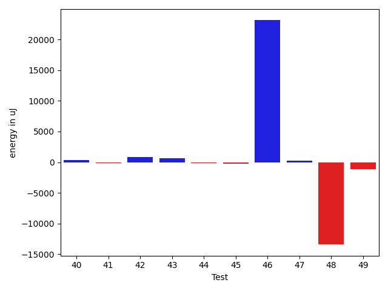

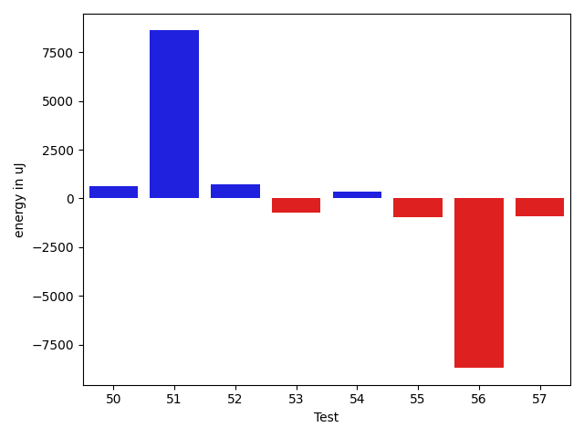

| ID | EnergyV1 | EnergyV2 | DeltaEnergy | σ |
| --- | --- | --- | --- | --- |
| 0 | 40321.0 | 41787.563829787236 | 1466.5638297872356 | 10404.546207937348 | 12703.983137783 |
| 1 | 65038.555555555555 | 63811.89898989899 | -1226.6565656565654 | 65671.17841233774 | 54923.73975244072 |
| 2 | 35369.11627906977 | 36557.5306122449 | 1188.4143331751256 | 4194.540517061419 | 5105.51405435995 |
| 3 | 49524.70769230769 | 45608.11475409836 | -3916.592938209331 | 26520.20195985467 | 21881.372575177196 |
| 4 | 45649.02380952381 | 42147.333333333336 | -3501.6904761904734 | 14808.767215802065 | 11531.448608581039 |
| 5 | 36488.42857142857 | 35949.54838709677 | -538.8801843317997 | 6369.388565791917 | 5521.925253543659 |
| 6 | 105528.77922077922 | 105116.49315068492 | -412.28607009429834 | 59047.49185203544 | 52512.057916572994 |
| 7 | 82100.39583333333 | 82996.1875 | 895.7916666666715 | 29067.97900091238 | 28478.87141860337 |
| 8 | 47193.476744186046 | 49656.03614457831 | 2462.559400392267 | 23804.7973373586 | 38390.66954303545 |
| 9 | 35995.375 | 37615.9 | 1620.5250000000015 | 5573.492429291979 | 4901.244830652719 |
| 10 | 106070.22222222222 | 98483.9797979798 | -7586.242424242417 | 156770.79630219185 | 145740.2290609805 |
| 11 | 38583.148148148146 | 36351.0 | -2232.148148148146 | 4499.60869659758 | 4946.909742455385 |
| 12 | 37533.57142857143 | 35800.0 | -1733.5714285714275 | 5192.876141970877 | 4890.787462157807 |
| 13 | 91307.73913043478 | 97377.84210526316 | 6070.102974828376 | 258299.39838670148 | 281356.5897442459 |
| 14 | 37464.64444444444 | 37109.19047619047 | -355.4539682539689 | 4420.883401692248 | 3994.7829504069023 |
| 15 | 38951.5 | 37152.22222222222 | -1799.277777777781 | 3951.4665718163196 | 3631.915088472822 |
| 16 | 37184.318181818184 | 35818.230769230766 | -1366.087412587418 | 4688.704505960562 | 5106.936552057951 |
| 17 | 36697.82608695652 | 36555.08 | -142.7460869565184 | 4818.433000307247 | 3269.318460107549 |
| 18 | 37761.88461538462 | 37308.30434782609 | -453.58026755852916 | 4812.6348478763775 | 5523.52180056216 |
| 19 | 198164.6447368421 | 191276.1625 | -6888.482236842101 | 458380.0727344844 | 457215.525483919 |
| 20 | 37419.625 | 38789.260869565216 | 1369.6358695652161 | 4146.279726177231 | 4691.445955069543 |
| 21 | 40859.348837209305 | 39089.243902439026 | -1770.1049347702792 | 12024.256934704987 | 8519.334013763786 |
| 22 | 38285.07894736842 | 37030.55263157895 | -1254.5263157894733 | 6320.04129892227 | 7204.7384688914735 |
| 23 | 157120.71717171717 | 147666.48484848486 | -9454.23232323231 | 313479.5888573006 | 265937.7926821873 |
| 24 | 38313.13043478261 | 38024.769230769234 | -288.36120401337394 | 5625.149420013615 | 4755.12124174228 |
| 25 | 42231.655913978495 | 42109.393258426964 | -122.26265555153077 | 12235.070472743619 | 12287.12693456131 |
| 26 | 195964.22222222222 | 189923.05050505052 | -6041.171717171703 | 454943.60026792187 | 412628.98674826085 |
| 27 | 42549.72631578947 | 43765.96842105263 | 1216.2421052631616 | 13253.423674016902 | 14331.879344537172 |
| 28 | 36387.13559322034 | 36534.91803278688 | 147.78243956654478 | 4533.732381123567 | 7406.828936523422 |
| 29 | 36508.93023255814 | 36938.35 | 429.41976744186104 | 4153.777336103033 | 5041.388472187003 |
| 30 | 36990.833333333336 | 38266.879310344826 | 1276.0459770114903 | 4643.650417451226 | 10965.047590313861 |
| 31 | 65538.83333333333 | 64078.63333333333 | -1460.199999999997 | 52500.76410846057 | 53558.64863180881 |
| 32 | 98640.3870967742 | 88513.90476190476 | -10126.482334869434 | 124715.42752969528 | 113627.56090273705 |
| 33 | 41928.413043478264 | 39282.903225806454 | -2645.5098176718093 | 19257.086033543812 | 11519.155225955896 |
| 34 | 46148.06122448979 | 49368.57142857143 | 3220.5102040816346 | 16538.1192313557 | 18651.952237374673 |
| 35 | 39510.655913978495 | 40112.188888888886 | 601.5329749103912 | 10647.710833279225 | 11739.566906543438 |
| 36 | 39025.61363636364 | 39987.76344086022 | 962.1498044965774 | 9982.59629695581 | 11444.58907072697 |
| 37 | 39700.68085106383 | 37826.27368421053 | -1874.4071668532997 | 11267.836041009832 | 9697.916946646035 |
| 38 | 35285.21153846154 | 36117.395833333336 | 832.1842948717967 | 3577.9507259825655 | 3649.524219787557 |
| 39 | 117396.21212121213 | 116306.15151515152 | -1090.0606060606078 | 29414.952243035437 | 23378.93809936223 |
| 40 | 34651.181818181816 | 35029.32 | 378.1381818181835 | 3957.607732828274 | 4105.299469904723 |
| 41 | 39682.645161290326 | 39561.32608695652 | -121.31907433380547 | 11779.307517157658 | 11556.655965765296 |
| 42 | 34436.57894736842 | 35322.311475409835 | 885.7325280414152 | 3831.6459884244814 | 3478.6733694297586 |
| 43 | 34963.06976744186 | 35654.619047619046 | 691.5492801771834 | 4074.7912395968574 | 3735.6516225889527 |
| 44 | 35068.608695652176 | 34964.45714285714 | -104.15155279503233 | 3958.2462491133665 | 3751.5900883519257 |
| 45 | 35321.458333333336 | 35057.3 | -264.15833333333285 | 3224.8897136073597 | 3271.660705207678 |
| 46 | 184084.0202020202 | 207202.65656565657 | 23118.636363636353 | 284998.9746402601 | 362887.8560311045 |
| 47 | 36309.551020408166 | 36583.0 | 273.44897959183436 | 4579.8668283875095 | 4395.807588550204 |
| 48 | 256780.5 | 243376.4871794872 | -13404.012820512813 | 507144.7548505856 | 481121.8670096111 |
| 49 | 36097.0 | 34942.583333333336 | -1154.4166666666642 | 3870.1325024095618 | 4447.617872868076 |
| 50 | 36017.05263157895 | 36631.22222222222 | 614.1695906432724 | 4360.6854540093655 | 4686.055123158919 |
| 51 | 193474.1313131313 | 202078.797979798 | 8604.666666666686 | 70548.29463403516 | 80555.2581241854 |
| 52 | 37016.28571428572 | 37746.77777777778 | 730.4920634920636 | 3960.3201547212266 | 2523.1506661217472 |
| 53 | 38782.791666666664 | 38078.4 | -704.3916666666628 | 5267.460441072518 | 4688.212870593656 |
| 54 | 37546.142857142855 | 37893.56060606061 | 347.41774891775276 | 6234.7540042793635 | 5130.386464646688 |
| 55 | 40355.03571428572 | 39406.692307692305 | -948.3434065934125 | 14124.204969995255 | 9143.963807367876 |
| 56 | 89347.34782608696 | 80662.09523809524 | -8685.252587991723 | 91576.94724234284 | 87448.50637560521 |
| 57 | 39977.9 | 39088.15789473684 | -889.7421052631616 | 4052.5684189165763 | 5164.918007839121 |

## Delta Duration per test method

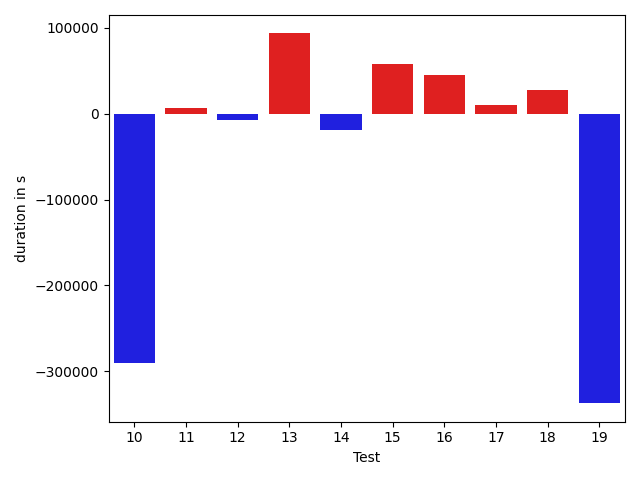

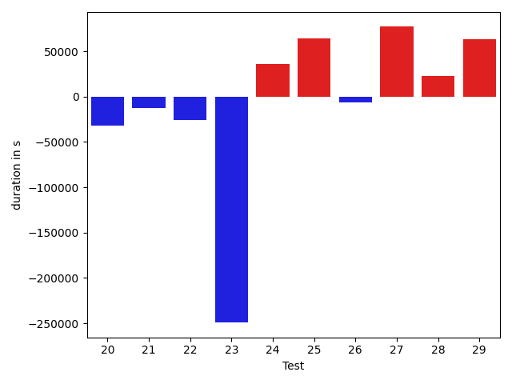

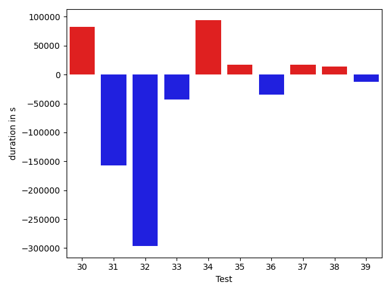

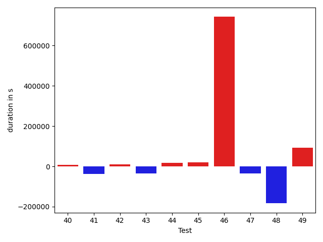

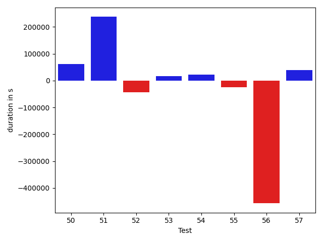

| ID | DurationV1 | DurationsV2 | DeltaDuration |
| --- | --- | --- | --- |
| 0 | 1417135.0689655172 | 1411916.8510638298 | -5218.217901687371 |
| 1 | 2122099.393939394 | 2148000.242424242 | 25900.84848484816 |
| 2 | 750808.4186046511 | 812355.306122449 | 61546.88751779788 |
| 3 | 1456850.4 | 1306365.4426229508 | -150484.95737704914 |
| 4 | 1438891.5952380951 | 1306094.4320987654 | -132797.16313932976 |
| 5 | 1077103.9428571428 | 1026071.6612903225 | -51032.281566820224 |
| 6 | 3108990.1818181816 | 3124663.4109589043 | 15673.229140722658 |
| 7 | 2644123.2708333335 | 2644404.1666666665 | 280.8958333330229 |
| 8 | 1537022.9767441861 | 1653317.5180722892 | 116294.54132810305 |
| 9 | 676538.875 | 678621.4 | 2082.5250000000233 |
| 10 | 3423419.9393939395 | 3133224.2525252528 | -290195.6868686867 |
| 11 | 564172.3333333334 | 570589.6315789474 | 6417.298245614045 |
| 12 | 530118.380952381 | 522883.5 | -7234.880952380947 |
| 13 | 2787045.6195652173 | 2880494.210526316 | 93448.59096109867 |
| 14 | 839397.6444444444 | 820918.2619047619 | -18479.382539682556 |
| 15 | 526320.4545454546 | 583986.0 | 57665.54545454541 |
| 16 | 467791.5909090909 | 512926.6538461539 | 45135.06293706299 |
| 17 | 530522.7391304348 | 540851.84 | 10329.100869565154 |
| 18 | 543052.1923076923 | 570276.1739130435 | 27223.981605351204 |
| 19 | 5616735.131578947 | 5279380.9375 | -337354.1940789474 |
| 20 | 559829.2916666666 | 527784.5652173914 | -32044.726449275273 |
| 21 | 1279355.3604651163 | 1266335.731707317 | -13019.628757799277 |
| 22 | 1143335.4736842106 | 1117639.3684210526 | -25696.10526315798 |
| 23 | 4635825.767676768 | 4386645.94949495 | -249179.81818181835 |
| 24 | 1003418.5797101449 | 1039091.4923076923 | 35672.9125975474 |
| 25 | 1420796.3870967743 | 1485016.4719101123 | 64220.084813338006 |
| 26 | 5791283.686868687 | 5784713.707070707 | -6569.979797979817 |
| 27 | 1386795.8210526316 | 1463717.6631578947 | 76921.84210526315 |
| 28 | 968119.8644067796 | 990766.1475409836 | 22646.283134203986 |
| 29 | 741712.6511627907 | 804955.175 | 63242.52383720933 |
| 30 | 1009944.8181818182 | 1092709.8793103448 | 82765.06112852658 |
| 31 | 1876364.875 | 1719490.5833333333 | -156874.29166666674 |
| 32 | 2812628.64516129 | 2515963.214285714 | -296665.4308755761 |
| 33 | 1400175.8804347827 | 1356634.2795698924 | -43541.600864890264 |
| 34 | 1608750.081632653 | 1702338.6530612244 | 93588.57142857136 |
| 35 | 1321683.3870967743 | 1338751.1555555556 | 17067.7684587813 |
| 36 | 1378416.5795454546 | 1344031.6451612904 | -34384.93438416417 |
| 37 | 1352400.585106383 | 1369701.305263158 | 17300.720156774856 |
| 38 | 813348.9423076923 | 827038.5 | 13689.557692307746 |
| 39 | 3678325.01010101 | 3665348.02020202 | -12976.989898989908 |
| 40 | 582456.4090909091 | 589067.36 | 6610.950909090927 |
| 41 | 1370615.559139785 | 1331994.3152173914 | -38621.243922393536 |
| 42 | 922982.9649122807 | 934261.2131147541 | 11278.24820247339 |
| 43 | 678863.0930232558 | 644172.7380952381 | -34690.35492801771 |
| 44 | 754124.5217391305 | 772314.0571428571 | 18189.535403726622 |
| 45 | 813235.5625 | 834320.6 | 21085.037499999977 |
| 46 | 5399095.343434343 | 6141066.474747474 | 741971.1313131312 |
| 47 | 840142.4693877551 | 806139.2888888889 | -34003.18049886625 |
| 48 | 7067657.7894736845 | 6884549.923076923 | -183107.8663967615 |
| 49 | 566828.9655172414 | 659966.7916666666 | 93137.82614942524 |
| 50 | 577701.8421052631 | 639936.6111111111 | 62234.76900584798 |
| 51 | 5761512.424242424 | 5998903.6161616165 | 237391.19191919267 |
| 52 | 508610.4285714286 | 465715.22222222225 | -42895.20634920633 |
| 53 | 578953.5833333334 | 595839.04 | 16885.456666666665 |
| 54 | 1099785.9428571428 | 1122112.9848484849 | 22327.041991342092 |
| 55 | 1020837.3571428572 | 996224.7692307692 | -24612.58791208791 |
| 56 | 2709799.347826087 | 2252947.5714285714 | -456851.77639751555 |
| 57 | 534881.75 | 574902.7368421053 | 40020.98684210528 |

## Misc.

| ID | Test Class | Test Method |
| --- | --- | --- |
| 0 | com.google.gson.functional.StreamingTypeAdaptersTest | testNullSafe |
| 1 | com.google.gson.functional.CustomDeserializerTest | testDefaultConstructorNotCalledOnObject |
| 2 | com.google.gson.functional.CustomDeserializerTest | testDefaultConstructorNotCalledOnField |
| 3 | com.google.gson.functional.ReadersWritersTest | testReadWriteTwoObjects |
| 4 | com.google.gson.functional.ReadersWritersTest | testReadWriteTwoStrings |
| 5 | com.google.gson.functional.EnumTest | testEnumSubclassAsParameterizedType |
| 6 | com.google.gson.functional.EnumTest | testEnumCaseMapping |
| 7 | com.google.gson.functional.EnumTest | testEnumSubclass |
| 8 | com.google.gson.functional.EnumTest | testEnumSubclassWithRegisteredTypeAdapter |
| 9 | com.google.gson.functional.DelegateTypeAdapterTest | testDelegateInvokedOnStrings |
| 10 | com.google.gson.functional.DelegateTypeAdapterTest | testDelegateInvoked |
| 11 | com.google.gson.functional.TypeAdapterPrecedenceTest | testSerializeNonstreamingTypeAdapterFollowedByStreamingTypeAdapter |
| 12 | com.google.gson.functional.TypeAdapterPrecedenceTest | testNonstreamingHierarchicalFollowedByNonstreaming |
| 13 | com.google.gson.functional.TypeAdapterPrecedenceTest | testNonstreamingFollowedByNonstreaming |
| 14 | com.google.gson.functional.TypeAdapterPrecedenceTest | testStreamingFollowedByStreaming |
| 15 | com.google.gson.functional.TypeAdapterPrecedenceTest | testStreamingHierarchicalFollowedByNonstreaming |
| 16 | com.google.gson.functional.TypeAdapterPrecedenceTest | testStreamingHierarchicalFollowedByNonstreamingHierarchical |
| 17 | com.google.gson.functional.TypeAdapterPrecedenceTest | testStreamingFollowedByNonstreamingHierarchical |
| 18 | com.google.gson.functional.TypeAdapterPrecedenceTest | testStreamingFollowedByNonstreaming |
| 19 | com.google.gson.JsonParserTest | testReadWriteTwoObjects |
| 20 | com.google.gson.JsonParserTest | testParseMixedArray |
| 21 | com.google.gson.functional.ObjectTest | testSingletonLists |
| 22 | com.google.gson.functional.MapAsArrayTypeAdapterTest | testMultipleEnableComplexKeyRegistrationHasNoEffect |
| 23 | com.google.gson.functional.MapAsArrayTypeAdapterTest | testSerializeComplexMapWithTypeAdapter |
| 24 | com.google.gson.functional.CollectionTest | testFieldIsArrayList |
| 25 | com.google.gson.functional.CollectionTest | testWildcardCollectionField |
| 26 | com.google.gson.functional.TypeVariableTest | testAdvancedTypeVariables |
| 27 | com.google.gson.functional.TypeVariableTest | testTypeVariablesViaTypeParameter |
| 28 | com.google.gson.functional.TypeVariableTest | testBasicTypeVariables |
| 29 | com.google.gson.functional.EscapingTest | testGsonDoubleDeserialization |
| 30 | com.google.gson.functional.EscapingTest | testGsonAcceptsEscapedAndNonEscapedJsonDeserialization |
| 31 | com.google.gson.functional.EscapingTest | testEscapingObjectFields |
| 32 | com.google.gson.functional.EscapingTest | testEscapingQuotesInStringArray |
| 33 | com.google.gson.functional.ParameterizedTypesTest | testVariableTypeDeserialization |
| 34 | com.google.gson.functional.ParameterizedTypesTest | testVariableTypeFieldsAndGenericArraysDeserialization |
| 35 | com.google.gson.functional.ParameterizedTypesTest | testParameterizedTypeWithVariableTypeDeserialization |
| 36 | com.google.gson.functional.ParameterizedTypesTest | testVariableTypeArrayDeserialization |
| 37 | com.google.gson.functional.ParameterizedTypesTest | testParameterizedTypeGenericArraysDeserialization |
| 38 | com.google.gson.functional.DefaultTypeAdaptersTest | testTimestampSerialization |
| 39 | com.google.gson.functional.DefaultTypeAdaptersTest | testDefaultDateDeserializationUsingBuilder |
| 40 | com.google.gson.functional.DefaultTypeAdaptersTest | testOverrideBigDecimalTypeAdapter |
| 41 | com.google.gson.functional.DefaultTypeAdaptersTest | testDateSerializationInCollection |
| 42 | com.google.gson.functional.DefaultTypeAdaptersTest | testDateDeserializationWithPattern |
| 43 | com.google.gson.functional.DefaultTypeAdaptersTest | testBitSetDeserialization |
| 44 | com.google.gson.functional.DefaultTypeAdaptersTest | testOverrideBigIntegerTypeAdapter |
| 45 | com.google.gson.functional.DefaultTypeAdaptersTest | testSqlDateSerialization |
| 46 | com.google.gson.functional.TypeHierarchyAdapterTest | testTypeHierarchy |
| 47 | com.google.gson.functional.TypeHierarchyAdapterTest | testRegisterSuperTypeFirst |
| 48 | com.google.gson.OverrideCoreTypeAdaptersTest | testOverrideWrapperBooleanAdapter |
| 49 | com.google.gson.OverrideCoreTypeAdaptersTest | testOverrideStringAdapter |
| 50 | com.google.gson.OverrideCoreTypeAdaptersTest | testOverridePrimitiveBooleanAdapter |
| 51 | com.google.gson.DefaultInetAddressTypeAdapterTest | testInetAddressSerializationAndDeserialization |
| 52 | com.google.gson.functional.StringTest | testEscapingQuotesInStringSerialization |
| 53 | com.google.gson.functional.StringTest | testSingleQuoteInStringSerialization |
| 54 | com.google.gson.functional.NamingPolicyTest | testComplexFieldNameStrategy |
| 55 | com.google.gson.functional.UncategorizedTest | testGsonInstanceReusableForSerializationAndDeserialization |
| 56 | com.google.gson.GsonTypeAdapterTest | testTypeAdapterDoesNotAffectNonAdaptedTypes |
| 57 | com.google.gson.functional.PrimitiveTest | testQuotedStringSerializationAndDeserialization |

| Test | IterationV1 | IterationV2 | DeltaIteration |
| --- | --- | --- | --- |
| 0 | 87 | 94 | 7 |
| 1 | 99 | 99 | 0 |
| 2 | 43 | 49 | 6 |
| 3 | 65 | 61 | -4 |
| 4 | 84 | 81 | -3 |
| 5 | 70 | 62 | -8 |
| 6 | 77 | 73 | -4 |
| 7 | 96 | 96 | 0 |
| 8 | 86 | 83 | -3 |
| 9 | 32 | 30 | -2 |
| 10 | 99 | 99 | 0 |
| 11 | 27 | 19 | -8 |
| 12 | 21 | 20 | -1 |
| 13 | 92 | 95 | 3 |
| 14 | 45 | 42 | -3 |
| 15 | 22 | 27 | 5 |
| 16 | 22 | 26 | 4 |
| 17 | 23 | 25 | 2 |
| 18 | 26 | 23 | -3 |
| 19 | 76 | 80 | 4 |
| 20 | 24 | 23 | -1 |
| 21 | 86 | 82 | -4 |
| 22 | 76 | 76 | 0 |
| 23 | 99 | 99 | 0 |
| 24 | 69 | 65 | -4 |
| 25 | 93 | 89 | -4 |
| 26 | 99 | 99 | 0 |
| 27 | 95 | 95 | 0 |
| 28 | 59 | 61 | 2 |
| 29 | 43 | 40 | -3 |
| 30 | 66 | 58 | -8 |
| 31 | 48 | 60 | 12 |
| 32 | 31 | 42 | 11 |
| 33 | 92 | 93 | 1 |
| 34 | 98 | 98 | 0 |
| 35 | 93 | 90 | -3 |
| 36 | 88 | 93 | 5 |
| 37 | 94 | 95 | 1 |
| 38 | 52 | 48 | -4 |
| 39 | 99 | 99 | 0 |
| 40 | 22 | 25 | 3 |
| 41 | 93 | 92 | -1 |
| 42 | 57 | 61 | 4 |
| 43 | 43 | 42 | -1 |
| 44 | 46 | 35 | -11 |
| 45 | 48 | 50 | 2 |
| 46 | 99 | 99 | 0 |
| 47 | 49 | 45 | -4 |
| 48 | 38 | 39 | 1 |
| 49 | 29 | 24 | -5 |
| 50 | 19 | 18 | -1 |
| 51 | 99 | 99 | 0 |
| 52 | 21 | 9 | -12 |
| 53 | 24 | 25 | 1 |
| 54 | 70 | 66 | -4 |
| 55 | 28 | 39 | 11 |
| 56 | 23 | 21 | -2 |
| 57 | 20 | 19 | -1 |

| Time Label | Time (s) |
| --- | --- |
| Selection | 27.56379246711731 |
| Injection | 13.175897598266602 |
| Total | 1037.4496068954468 |

