# gson 9c4b23

https://github.com/google/gson/commit/9c4b23

## Delta Energy per test method

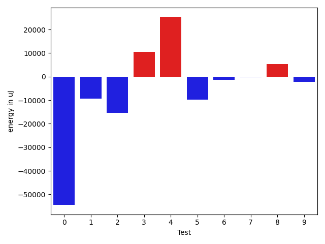

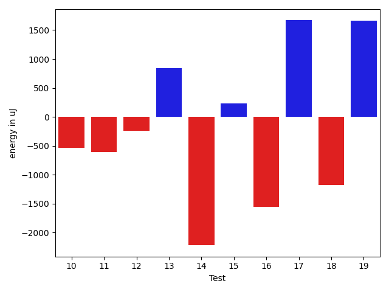

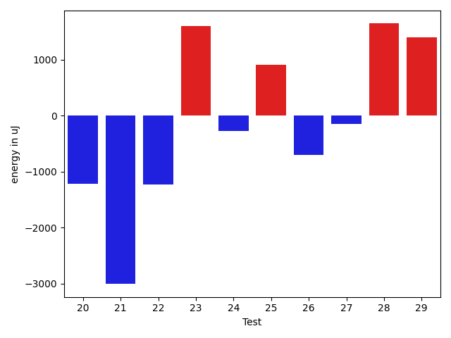

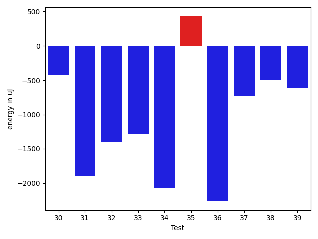

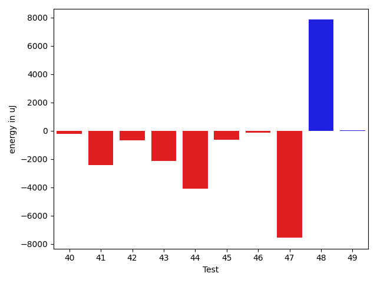

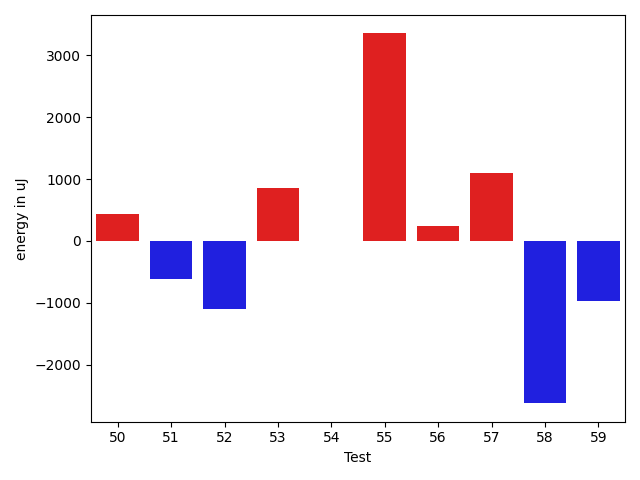

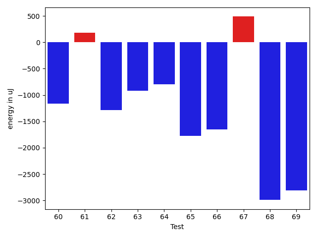

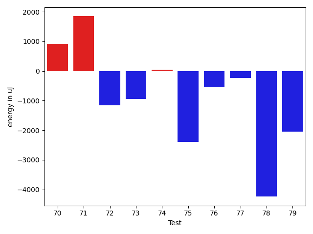

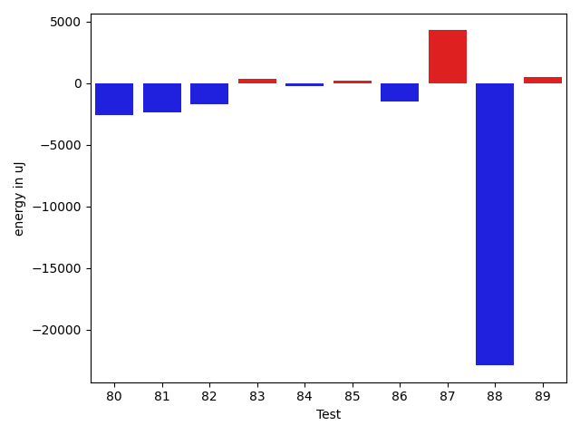

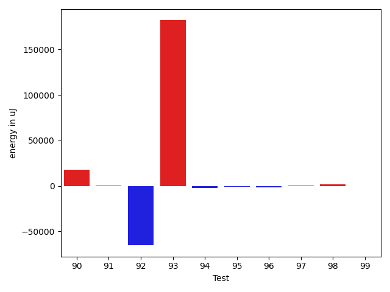

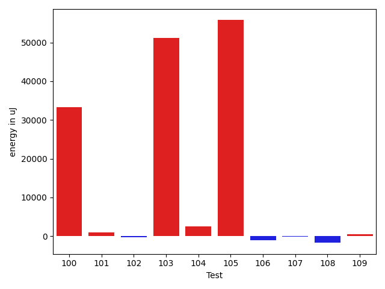

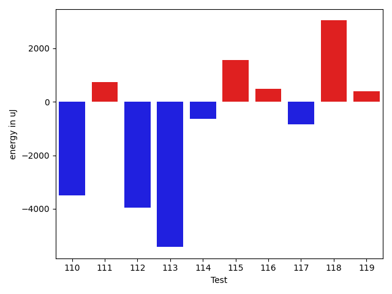

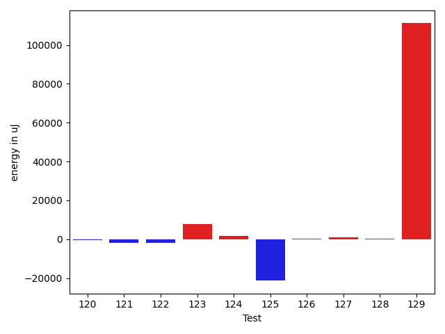

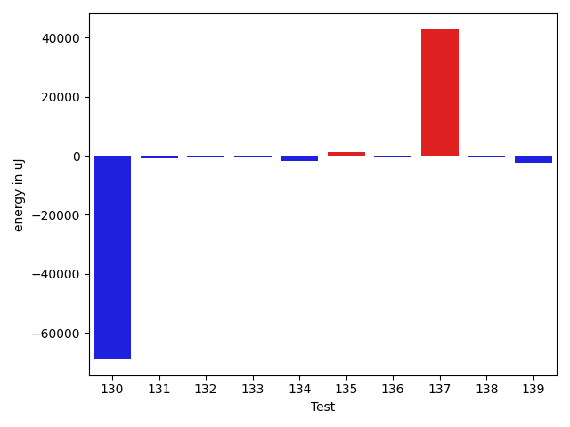

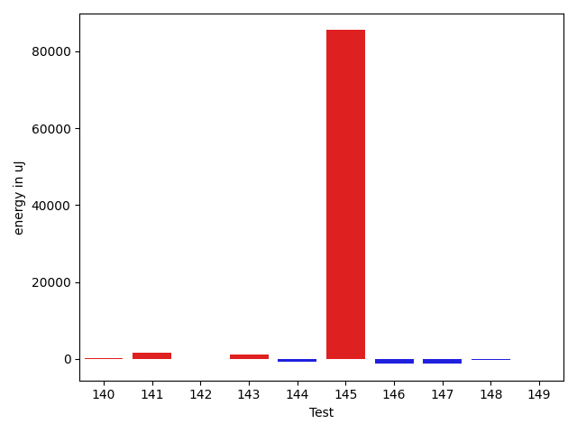

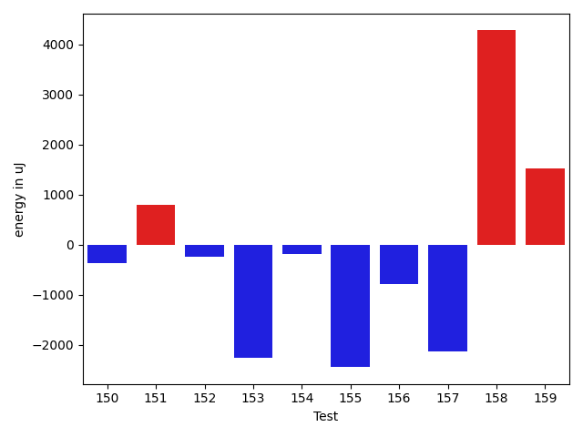

| ID | EnergyV1 | EnergyV2 | DeltaEnergy | σV1 | σV2 |
| --- | --- | --- | --- | --- | --- |
| 0 | 428161 | 375915 | -52246 | 411550.4235661556 | 386245.9675591824 |
| 1 | 74951 | 71289 | -3662 | 83560.64164721349 | 29447.913403461607 |
| 2 | 66711 | 63171 | -3540 | 99737.13114996697 | 20740.717426708117 |
| 3 | 36438 | 35645 | -793 | 105197.86475315619 | 132068.2583911125 |
| 4 | 363403 | 370849 | 7446 | 73273.28709339633 | 155422.9104028786 |
| 5 | 104431 | 104248 | -183 | 58703.7541906853 | 50392.62182783503 |
| 6 | 36682 | 35034 | -1648 | 3926.143837112723 | 3765.777791801991 |
| 7 | 35523 | 37414 | 1891 | 4873.471641432188 | 4257.68816760274 |
| 8 | 41443 | 41077 | -366 | 24252.92647035405 | 35202.12591201142 |
| 9 | 37720 | 35095 | -2625 | 3951.068022805142 | 4102.345968399599 |
| 10 | 37170 | 36072 | -1098 | 5431.783743854315 | 4249.996050194243 |
| 11 | 34363 | 33569 | -794 | 3124.6848576402194 | 3760.449707149399 |
| 12 | 36865 | 36621 | -244 | 4323.430966634187 | 5313.750947347343 |
| 13 | 34363 | 35644 | 1281 | 4788.275208488149 | 4590.84115797126 |
| 14 | 38208 | 36133 | -2075 | 3920.6187754953216 | 4717.086285482953 |
| 15 | 35645 | 36254 | 609 | 4427.504689496128 | 3699.1332918821827 |
| 16 | 34118 | 33630 | -488 | 3761.5220871474758 | 3172.655922268917 |
| 17 | 36133 | 38269 | 2136 | 4671.521384900938 | 4288.281830238721 |
| 18 | 35522 | 35339 | -183 | 3476.6335112330394 | 3954.795649347659 |
| 19 | 34546 | 37109 | 2563 | 4736.62751695497 | 4457.87167633312 |
| 20 | 38757 | 35644 | -3113 | 3704.993049237469 | 5400.107485909424 |
| 21 | 35888 | 36499 | 611 | 4561.761430574923 | 3764.25134488918 |
| 22 | 37231 | 34363 | -2868 | 3808.7831619302215 | 4302.253159602243 |
| 23 | 35522 | 39062 | 3540 | 2824.7458892514514 | 2901.5306305465742 |
| 24 | 36560 | 35279 | -1281 | 3923.3258154379214 | 5250.860171030485 |
| 25 | 36010 | 37415 | 1405 | 4107.035672663305 | 3892.6618427783096 |
| 26 | 39734 | 37719 | -2015 | 3929.6067311150223 | 4247.615360167853 |
| 27 | 34912 | 35889 | 977 | 5413.154446459522 | 3814.610244252426 |
| 28 | 33935 | 38269 | 4334 | 2546.4218084729537 | 4923.186803845204 |
| 29 | 36194 | 36438 | 244 | 3882.2135415536104 | 4370.161478568662 |
| 30 | 35583 | 35157 | -426 | 3620.6714954461195 | 3421.0931417092975 |
| 31 | 38024 | 36133 | -1891 | 4339.13638082027 | 4289.280660448733 |
| 32 | 36499 | 35095 | -1404 | 4066.4606444992355 | 4990.511042452842 |
| 33 | 36621 | 35339 | -1282 | 3950.8909704416624 | 3843.259589207753 |
| 34 | 36804 | 34729 | -2075 | 4738.88725708622 | 3898.1635977524397 |
| 35 | 40650 | 41076 | 426 | 320020.89692072157 | 181092.2613910705 |
| 36 | 77637 | 75379 | -2258 | 20051.76671478208 | 20002.735184732202 |
| 37 | 36560 | 35827 | -733 | 3978.2130150621488 | 7387.0751577084475 |
| 38 | 37354 | 36865 | -489 | 11176.40842239781 | 12215.792079474124 |
| 39 | 36865 | 36255 | -610 | 3156.010280852144 | 5054.57531317824 |
| 40 | 37658 | 37048 | -610 | 3716.8409463546614 | 4836.896786615876 |
| 41 | 38147 | 36987 | -1160 | 15285.575426089352 | 13653.202189138114 |
| 42 | 37414 | 36133 | -1281 | 4232.9385006163275 | 4249.148215935478 |
| 43 | 36743 | 34607 | -2136 | 3434.2211933737317 | 4162.087139233228 |
| 44 | 39063 | 37720 | -1343 | 35143.7121712418 | 28385.841345770485 |
| 45 | 36926 | 36194 | -732 | 4279.945448113937 | 4218.333099755859 |
| 46 | 36071 | 34668 | -1403 | 3486.199530529867 | 4103.115408334294 |
| 47 | 39002 | 38391 | -611 | 25677.95061661056 | 14252.171583306173 |
| 48 | 40344 | 39734 | -610 | 23715.954748422453 | 81371.61780966721 |
| 49 | 35705 | 36682 | 977 | 3949.8521213452877 | 4737.2450625700585 |
| 50 | 38513 | 38941 | 428 | 36724.24608538059 | 47593.58170227147 |
| 51 | 38208 | 37597 | -611 | 14046.624792756335 | 14236.361944309192 |
| 52 | 37720 | 36621 | -1099 | 3905.694414035062 | 4120.029745963705 |
| 53 | 36499 | 37354 | 855 | 4220.475166395993 | 4880.356760360705 |
| 54 | 36437 | 36438 | 1 | 4518.104554806816 | 4109.671953840332 |
| 55 | 37659 | 41015 | 3356 | 16247.110550117985 | 20278.38421067013 |
| 56 | 37353 | 37598 | 245 | 5109.212600664502 | 3662.7502835503865 |
| 57 | 36804 | 37903 | 1099 | 13384.50694157748 | 8672.724341830253 |
| 58 | 41992 | 39367 | -2625 | 89060.39708258875 | 32745.368569812326 |
| 59 | 38391 | 37415 | -976 | 5106.081471894124 | 3474.608087980887 |
| 60 | 38391 | 37232 | -1159 | 4277.774135640586 | 3638.53417375648 |
| 61 | 37964 | 38147 | 183 | 20453.548209422883 | 21085.35290993297 |
| 62 | 41382 | 40100 | -1282 | 11855.697123563497 | 14354.678689436654 |
| 63 | 40283 | 39368 | -915 | 17346.456694802102 | 21379.457459202782 |
| 64 | 37842 | 37048 | -794 | 4342.005757939926 | 4308.227413990256 |
| 65 | 41382 | 39611 | -1771 | 39222.584314573076 | 47728.99137866886 |
| 66 | 38696 | 37048 | -1648 | 10178.6911744658 | 9209.173323904935 |
| 67 | 37903 | 38391 | 488 | 7826.673395356059 | 12617.742515483764 |
| 68 | 39917 | 36926 | -2991 | 3451.172643597674 | 5273.578720438442 |
| 69 | 42602 | 39795 | -2807 | 27991.83803590074 | 44143.938560230155 |
| 70 | 38208 | 35584 | -2624 | 13577.372730563466 | 15430.646291262288 |
| 71 | 38757 | 36132 | -2625 | 24880.421052803602 | 28181.04218538273 |
| 72 | 36621 | 35523 | -1098 | 3230.458594053042 | 3780.9499935509116 |
| 73 | 37659 | 35401 | -2258 | 3965.0182220123525 | 4057.9890362185524 |
| 74 | 37048 | 36376 | -672 | 9638.971218352932 | 10385.690099444282 |
| 75 | 35950 | 34424 | -1526 | 4003.018419784726 | 3382.3992316845156 |
| 76 | 36805 | 35706 | -1099 | 3885.955908960997 | 3968.785160671997 |
| 77 | 35767 | 36072 | 305 | 3462.0287274949064 | 3732.1309970599873 |
| 78 | 36926 | 35217 | -1709 | 8746.436912319194 | 3850.4696380300156 |
| 79 | 37659 | 34302 | -3357 | 3587.8637766782617 | 3385.9511517664337 |
| 80 | 36804 | 34180 | -2624 | 3244.674023006153 | 3906.988899776371 |
| 81 | 36499 | 34119 | -2380 | 2692.4302979076188 | 3419.8706600339356 |
| 82 | 42908 | 41199 | -1709 | 109068.23277916726 | 84444.98462582844 |
| 83 | 39856 | 40161 | 305 | 40435.72421556594 | 39245.53277787386 |
| 84 | 38269 | 38025 | -244 | 6343.377395562536 | 4344.437899754115 |
| 85 | 39123 | 39307 | 184 | 12306.118686221704 | 9777.993071827652 |
| 86 | 39001 | 37537 | -1464 | 4102.726500418968 | 4131.4045724256175 |
| 87 | 109863 | 114135 | 4272 | 271584.77856973873 | 248937.29859559864 |
| 88 | 63659 | 40771 | -22888 | 38298.72937495222 | 27989.929970442412 |
| 89 | 37170 | 37659 | 489 | 4777.020632004193 | 7266.10440929214 |
| 90 | 81421 | 82031 | 610 | 345421.90436920297 | 328982.00030842965 |
| 91 | 36743 | 38025 | 1282 | 9510.53021646591 | 6547.498767811178 |
| 92 | 37476 | 35522 | -1954 | 258486.39229328075 | 5286.81177066223 |
| 93 | 39428 | 38330 | -1098 | 9035.139311920013 | 416208.61064550985 |
| 94 | 40466 | 36926 | -3540 | 4680.34114426146 | 4012.1817801688785 |
| 95 | 39001 | 37598 | -1403 | 4390.58259624378 | 4392.493044531141 |
| 96 | 38269 | 38024 | -245 | 24038.42453201453 | 16565.69069982758 |
| 97 | 36072 | 37109 | 1037 | 10542.932096869798 | 9468.942008535343 |
| 98 | 37110 | 38940 | 1830 | 4291.897977130136 | 4342.194679007379 |
| 99 | 37842 | 38147 | 305 | 5297.29683660902 | 5244.424643208037 |
| 100 | 38391 | 39672 | 1281 | 11324.726697283939 | 147312.3645966148 |
| 101 | 39001 | 40832 | 1831 | 3601.2052187813147 | 5178.373276134335 |
| 102 | 37415 | 37537 | 122 | 3708.0610335046754 | 4089.7349441579636 |
| 103 | 40528 | 38452 | -2076 | 19872.28523037408 | 208218.0814382637 |
| 104 | 39612 | 36194 | -3418 | 8144.033788455203 | 18528.199368050373 |
| 105 | 37109 | 39185 | 2076 | 5170.741943660879 | 207771.3936468958 |
| 106 | 39001 | 36866 | -2135 | 3123.330162383483 | 4505.83686675655 |
| 107 | 37353 | 37049 | -304 | 3064.61238150747 | 4186.95829381333 |
| 108 | 38330 | 36743 | -1587 | 4832.398174359761 | 3675.2640342701907 |
| 109 | 36438 | 37841 | 1403 | 3968.596634517043 | 4468.948172742794 |
| 110 | 38697 | 37658 | -1039 | 20445.7438919907 | 12341.93212270842 |
| 111 | 37659 | 37842 | 183 | 5643.050764337398 | 4494.024595226421 |
| 112 | 38513 | 37597 | -916 | 9339.85559777332 | 4997.974183356693 |
| 113 | 42907 | 41748 | -1159 | 27401.644727617113 | 21182.789617507693 |
| 114 | 38147 | 38636 | 489 | 4301.303617800073 | 4542.236963999028 |
| 115 | 36194 | 39307 | 3113 | 4637.149075401825 | 5366.355549988175 |
| 116 | 38330 | 40649 | 2319 | 4651.189993969285 | 5062.193117612168 |
| 117 | 40833 | 39001 | -1832 | 10657.439201205381 | 13468.481924005304 |
| 118 | 72265 | 66223 | -6042 | 28038.56587967943 | 63423.03618880919 |
| 119 | 36560 | 37780 | 1220 | 4606.379380408387 | 4214.309005645575 |
| 120 | 40100 | 38818 | -1282 | 19373.09751881742 | 20195.518019716917 |
| 121 | 38452 | 38880 | 428 | 26268.603379078526 | 24444.851894129803 |
| 122 | 39978 | 39734 | -244 | 67144.72146411311 | 66465.29938751373 |
| 123 | 38452 | 41504 | 3052 | 14000.805763588904 | 25125.370842235872 |
| 124 | 36132 | 37598 | 1466 | 3599.403817553816 | 7875.19588449302 |
| 125 | 40039 | 39490 | -549 | 306137.6029099562 | 207690.50597514748 |
| 126 | 37232 | 37109 | -123 | 4902.2323108446835 | 4214.813885566645 |
| 127 | 36377 | 36499 | 122 | 3197.7392184752966 | 4723.008012644061 |
| 128 | 37964 | 37964 | 0 | 3578.6281853370697 | 5642.069305042203 |
| 129 | 38024 | 42663 | 4639 | 4677.024913471451 | 357252.5814719442 |
| 130 | 39978 | 37537 | -2441 | 289042.4501012801 | 9163.538400306341 |
| 131 | 37780 | 36621 | -1159 | 4012.3502925841353 | 4930.365433378366 |
| 132 | 37414 | 38330 | 916 | 3898.2397956562227 | 4611.7017371272195 |
| 133 | 223450 | 207336 | -16114 | 64829.98358667371 | 79784.40945413396 |
| 134 | 39429 | 34424 | -5005 | 3955.178835538761 | 5128.1876458074585 |
| 135 | 37231 | 39246 | 2015 | 3466.779909007781 | 4363.468766704368 |
| 136 | 36743 | 36560 | -183 | 3566.624133038298 | 4374.690758374237 |
| 137 | 40161 | 40344 | 183 | 310715.6878969301 | 389396.337224713 |
| 138 | 38025 | 38147 | 122 | 4153.4963651559065 | 3848.7044827520285 |
| 139 | 38880 | 36621 | -2259 | 4434.140607528774 | 5183.351431383415 |
| 140 | 39306 | 40039 | 733 | 2941.8494230292918 | 5204.849821502931 |
| 141 | 39184 | 39368 | 184 | 4066.096651854481 | 2404.941103092249 |
| 142 | 38147 | 37597 | -550 | 3844.0099388529156 | 4005.8428155709153 |
| 143 | 39917 | 40710 | 793 | 7814.072662923648 | 7535.7757683989375 |
| 144 | 38574 | 38574 | 0 | 5783.749762309863 | 4553.686855109824 |
| 145 | 39917 | 39184 | -733 | 172529.76207239195 | 263674.88370910747 |
| 146 | 38452 | 36560 | -1892 | 4177.226920314679 | 3052.515707419754 |
| 147 | 38940 | 37536 | -1404 | 3900.5097416745366 | 2199.2460071579076 |
| 148 | 36071 | 36560 | 489 | 4260.211542932175 | 4462.831397514881 |
| 149 | 37414 | 34973 | -2441 | 3852.453630248427 | 4187.674249395196 |
| 150 | 37049 | 36682 | -367 | 5591.326050976049 | 4258.8079218169205 |
| 151 | 37903 | 38696 | 793 | 7015.392790618831 | 9265.384267893885 |
| 152 | 38269 | 38025 | -244 | 7845.672918239709 | 5814.926003732885 |
| 153 | 40100 | 37842 | -2258 | 14910.319776935723 | 17965.617363487538 |
| 154 | 36072 | 35889 | -183 | 4282.884088310741 | 3504.5623491356523 |
| 155 | 38452 | 36011 | -2441 | 4801.471261742982 | 4615.147812728573 |
| 156 | 39673 | 38880 | -793 | 53654.519185246645 | 51483.67410053063 |
| 157 | 42419 | 40283 | -2136 | 28203.481822994836 | 15164.994519310254 |
| 158 | 36193 | 40466 | 4273 | 5000.929691422058 | 5422.194327714565 |
| 159 | 36194 | 37720 | 1526 | 5931.591174714048 | 3714.8077655854245 |

## Delta Duration per test method

| ID | DurationV1 | DurationsV2 | DeltaDuration |
| --- | --- | --- | --- |
| 0 | 19568648.92929293 | 18373172.696969695 | -1195476.232323233 |
| 1 | 2515707.02020202 | 2305755.787878788 | -209951.2323232321 |
| 2 | 2235038.090909091 | 1817743.6666666667 | -417294.4242424241 |
| 3 | 1139478.9666666666 | 1587985.0862068965 | 448506.1195402299 |
| 4 | 10604827.272727273 | 11276205.444444444 | 671378.1717171706 |
| 5 | 3509481.787878788 | 3330519.707070707 | -178962.0808080812 |
| 6 | 751918.7037037037 | 767989.5185185185 | 16070.814814814832 |
| 7 | 397146.875 | 458347.92307692306 | 61201.04807692306 |
| 8 | 1435344.52 | 1565136.7647058824 | 129792.24470588239 |
| 9 | 358556.5 | 381002.1111111111 | 22445.611111111124 |
| 10 | 453300.0 | 358910.6 | -94389.40000000002 |
| 11 | 671221.7435897436 | 662003.4242424242 | -9218.319347319426 |
| 12 | 529614.0 | 479610.52173913043 | -50003.47826086957 |
| 13 | 564202.5 | 617721.1481481482 | 53518.648148148204 |
| 14 | 581183.2380952381 | 728484.2777777778 | 147301.03968253965 |
| 15 | 353213.64285714284 | 399404.44444444444 | 46190.8015873016 |
| 16 | 415017.47826086957 | 388115.8947368421 | -26901.58352402749 |
| 17 | 377344.45454545453 | 347508.3333333333 | -29836.121212121216 |
| 18 | 290609.14285714284 | 376982.1818181818 | 86373.03896103898 |
| 19 | 402920.9375 | 408377.0 | 5456.0625 |
| 20 | 371331.21428571426 | 463154.9375 | 91823.72321428574 |
| 21 | 379972.17647058825 | 388363.875 | 8391.698529411748 |
| 22 | 436166.28571428574 | 444684.0 | 8517.71428571426 |
| 23 | 424146.2727272727 | 394416.2727272727 | -29730.0 |
| 24 | 329120.4285714286 | 367704.9285714286 | 38584.5 |
| 25 | 382220.54545454547 | 351790.6666666667 | -30429.878787878784 |
| 26 | 305452.28571428574 | 404977.63636363635 | 99525.35064935061 |
| 27 | 376621.14285714284 | 359249.4666666667 | -17371.676190476166 |
| 28 | 406972.8 | 361911.4166666667 | -45061.3833333333 |
| 29 | 357290.3333333333 | 341875.6111111111 | -15414.72222222219 |
| 30 | 939241.131147541 | 887339.0597014925 | -51902.071446048445 |
| 31 | 729098.3111111111 | 731942.5116279069 | 2844.200516795856 |
| 32 | 791946.2448979592 | 783697.046875 | -8249.198022959172 |
| 33 | 851562.2857142857 | 804938.1525423729 | -46624.13317191275 |
| 34 | 477819.14285714284 | 492393.55555555556 | 14574.412698412722 |
| 35 | 3716076.26984127 | 2109038.3225806453 | -1607037.9472606247 |
| 36 | 2574862.1717171716 | 2518833.6868686867 | -56028.48484848486 |
| 37 | 942225.9814814815 | 929670.5217391305 | -12555.45974235097 |
| 38 | 1163836.5205479453 | 1101733.2676056337 | -62103.25294231158 |
| 39 | 785402.679245283 | 727764.7727272727 | -57637.906518010306 |
| 40 | 747878.8421052631 | 721588.95 | -26289.892105263192 |
| 41 | 1089632.5333333334 | 986837.4347826086 | -102795.0985507248 |
| 42 | 686485.225 | 696950.0222222222 | 10464.797222222202 |
| 43 | 698356.7647058824 | 685769.3157894737 | -12587.448916408699 |
| 44 | 1343173.2586206896 | 1325505.0862068965 | -17668.17241379316 |
| 45 | 827497.9215686275 | 828185.6818181818 | 687.760249554296 |
| 46 | 596923.875 | 499474.1935483871 | -97449.68145161291 |
| 47 | 1178509.0363636364 | 911074.26 | -267434.77636363637 |
| 48 | 1637010.0303030303 | 2010479.121212121 | 373469.0909090908 |
| 49 | 876199.3818181818 | 813192.8392857143 | -63006.542532467516 |
| 50 | 1457525.642857143 | 1656251.2711864407 | 198725.62832929776 |
| 51 | 1196921.7662337662 | 1239743.6875 | 42821.92126623378 |
| 52 | 775775.0 | 749866.3720930233 | -25908.627906976733 |
| 53 | 727774.4772727273 | 687633.34375 | -40141.133522727294 |
| 54 | 784959.9215686275 | 736697.2272727273 | -48262.694295900175 |
| 55 | 1058454.2571428572 | 1151765.1333333333 | 93310.87619047612 |
| 56 | 775368.2352941176 | 652517.25 | -122850.98529411759 |
| 57 | 1033321.8444444444 | 923108.8 | -110213.04444444436 |
| 58 | 2581533.2790697673 | 1237924.9473684211 | -1343608.3317013462 |
| 59 | 866766.9512195121 | 806703.7441860465 | -60063.20703346562 |
| 60 | 704114.2333333333 | 616884.9375 | -87229.29583333328 |
| 61 | 1201492.0526315789 | 1104011.2264150945 | -97480.82621648442 |
| 62 | 1345610.9655172413 | 1253553.1320754718 | -92057.83344176947 |
| 63 | 1559434.085106383 | 1583261.9263157896 | 23827.8412094065 |
| 64 | 911227.0909090909 | 886248.895522388 | -24978.195386702893 |
| 65 | 1893529.1397849463 | 1949976.8804347827 | 56447.74064983637 |
| 66 | 1062340.673076923 | 1018856.7333333333 | -43483.939743589726 |
| 67 | 1050345.448275862 | 1040274.393442623 | -10071.05483323906 |
| 68 | 464960.0588235294 | 454671.6818181818 | -10288.377005347575 |
| 69 | 938589.1818181818 | 1281858.0 | 343268.81818181823 |
| 70 | 1336806.90625 | 1410798.1764705882 | 73991.2702205882 |
| 71 | 951271.2307692308 | 1256084.6666666667 | 304813.435897436 |
| 72 | 730859.9285714285 | 750090.6458333334 | 19230.71726190485 |
| 73 | 754425.2452830189 | 809172.0588235294 | 54746.813540510484 |
| 74 | 1234660.8735632184 | 1290914.1904761905 | 56253.316912972135 |
| 75 | 642575.0 | 639776.15625 | -2798.84375 |
| 76 | 833671.2291666666 | 865200.5454545454 | 31529.316287878784 |
| 77 | 766058.25 | 812009.2307692308 | 45950.98076923075 |
| 78 | 835195.7037037037 | 709387.0882352941 | -125808.61546840961 |
| 79 | 597683.16 | 631586.0 | 33902.83999999997 |
| 80 | 470742.4117647059 | 514225.76470588235 | 43483.35294117645 |
| 81 | 391713.8181818182 | 462428.6538461539 | 70714.8356643357 |
| 82 | 2513218.942857143 | 1899438.96 | -613779.982857143 |
| 83 | 1563138.1232876712 | 1512284.276923077 | -50853.8463645943 |
| 84 | 866685.5254237289 | 834344.6315789474 | -32340.893844781443 |
| 85 | 947174.25 | 821439.7674418605 | -125734.48255813948 |
| 86 | 769847.2826086957 | 729140.7872340425 | -40706.49537465314 |
| 87 | 4734739.131313131 | 3991467.606060606 | -743271.5252525252 |
| 88 | 2030863.9404761905 | 1647000.988372093 | -383862.95210409747 |
| 89 | 1011633.075 | 1060448.9142857143 | 48815.83928571432 |
| 90 | 4008689.1616161615 | 4643368.353535353 | 634679.1919191917 |
| 91 | 1107822.5753424657 | 1150883.8666666667 | 43061.29132420104 |
| 92 | 2012686.8823529412 | 635545.9523809524 | -1377140.9299719888 |
| 93 | 589515.4444444445 | 5182703.6 | 4593188.155555556 |
| 94 | 496462.2 | 546612.0 | 50149.79999999999 |
| 95 | 603120.7857142857 | 710591.6551724138 | 107470.86945812812 |
| 96 | 1475424.0555555555 | 1405321.430107527 | -70102.62544802856 |
| 97 | 1144296.1604938272 | 1152208.2926829269 | 7912.132189099677 |
| 98 | 499371.9375 | 536587.48 | 37215.54249999998 |
| 99 | 584205.0 | 557965.7586206896 | -26239.241379310377 |
| 100 | 807568.8148148148 | 1827116.3488372094 | 1019547.5340223946 |
| 101 | 406332.3888888889 | 456825.1538461539 | 50492.764957265 |
| 102 | 619724.5135135135 | 580825.6046511628 | -38898.90886235074 |
| 103 | 830036.34375 | 2251527.129032258 | 1421490.785282258 |
| 104 | 533809.6 | 867178.8666666667 | 333369.2666666667 |
| 105 | 597633.4545454546 | 1900053.0666666667 | 1302419.612121212 |
| 106 | 416261.6538461539 | 447238.57692307694 | 30976.923076923063 |
| 107 | 427270.73333333334 | 466615.0909090909 | 39344.357575757545 |
| 108 | 464373.2 | 397576.24 | -66796.96000000002 |
| 109 | 396727.8 | 425385.7727272727 | 28657.972727272718 |
| 110 | 902858.03125 | 800986.2857142857 | -101871.74553571432 |
| 111 | 413653.8 | 419320.25 | 5666.450000000012 |
| 112 | 752554.6315789474 | 504999.1875 | -247555.44407894742 |
| 113 | 1230529.705882353 | 738721.2142857143 | -491808.4915966387 |
| 114 | 452338.6875 | 376360.7894736842 | -75977.89802631579 |
| 115 | 580094.4 | 555899.25 | -24195.150000000023 |
| 116 | 462114.7 | 477341.7 | 15227.0 |
| 117 | 1180361.3157894737 | 1227688.7763157894 | 47327.46052631573 |
| 118 | 2073562.7272727273 | 2218220.212121212 | 144657.48484848463 |
| 119 | 942955.3265306122 | 928898.1034482758 | -14057.223082336364 |
| 120 | 1238185.8615384616 | 1216566.893939394 | -21618.967599067604 |
| 121 | 1344010.6823529413 | 1280863.4430379746 | -63147.2393149666 |
| 122 | 1921277.1555555556 | 1767981.6 | -153295.5555555555 |
| 123 | 799565.7804878049 | 1232475.861111111 | 432910.0806233061 |
| 124 | 694090.1666666666 | 864627.4166666666 | 170537.25 |
| 125 | 2816446.0 | 2318565.361702128 | -497880.63829787215 |
| 126 | 490832.7826086957 | 580975.0 | 90142.21739130432 |
| 127 | 489227.875 | 467956.45 | -21271.42499999999 |
| 128 | 472385.86666666664 | 527873.8846153846 | 55488.017948717985 |
| 129 | 747889.6041666666 | 4294921.985714286 | 3547032.381547619 |
| 130 | 2989387.6714285715 | 805334.5416666666 | -2184053.129761905 |
| 131 | 575934.4 | 691806.3255813953 | 115871.92558139528 |
| 132 | 509737.96153846156 | 540066.4666666667 | 30328.505128205114 |
| 133 | 6437096.919191919 | 6597520.98989899 | 160424.07070707064 |
| 134 | 453271.25 | 449007.61904761905 | -4263.630952380947 |
| 135 | 417913.6875 | 441802.28571428574 | 23888.59821428574 |
| 136 | 406247.4736842105 | 435509.7272727273 | 29262.25358851679 |
| 137 | 2662444.6615384617 | 3889395.481012658 | 1226950.8194741965 |
| 138 | 448345.70588235295 | 415661.6 | -32684.105882352975 |
| 139 | 431736.64705882355 | 529629.8571428572 | 97893.2100840336 |
| 140 | 409182.94444444444 | 445582.4761904762 | 36399.531746031775 |
| 141 | 394393.13333333336 | 371567.64705882355 | -22825.486274509807 |
| 142 | 843319.15 | 806416.9534883721 | -36902.19651162787 |
| 143 | 866538.8965517242 | 936727.4545454546 | 70188.55799373041 |
| 144 | 933050.3157894737 | 780229.82 | -152820.49578947376 |
| 145 | 2305813.722222222 | 4508290.80952381 | 2202477.0873015877 |
| 146 | 447699.0 | 517205.0 | 69506.0 |
| 147 | 367432.35714285716 | 514733.1666666667 | 147300.80952380953 |
| 148 | 352148.6153846154 | 460805.8181818182 | 108657.2027972028 |
| 149 | 511187.3214285714 | 518544.6666666667 | 7357.345238095266 |
| 150 | 560463.3103448276 | 590880.1666666666 | 30416.856321839034 |
| 151 | 949167.2666666667 | 1084961.018181818 | 135793.75151515135 |
| 152 | 917431.4166666666 | 940699.3666666667 | 23267.95000000007 |
| 153 | 1046381.1132075472 | 1171687.914893617 | 125306.8016860697 |
| 154 | 479170.46153846156 | 493735.82608695654 | 14565.364548494981 |
| 155 | 627748.34375 | 552818.7222222222 | -74929.62152777775 |
| 156 | 1257215.65625 | 1387715.71875 | 130500.0625 |
| 157 | 1626862.95 | 947986.3461538461 | -678876.6038461538 |
| 158 | 434065.5294117647 | 478688.95 | 44623.42058823531 |
| 159 | 964596.5238095238 | 522527.81481481483 | -442068.70899470896 |

## Misc.

| ID | Test Class | Test Method |
| --- | --- | --- |
| 0 | com.google.gson.DefaultDateTypeAdapterTest | testParsingDatesFormattedWithUsLocale |
| 1 | com.google.gson.DefaultDateTypeAdapterTest | testFormattingInEnUs |
| 2 | com.google.gson.DefaultDateTypeAdapterTest | testFormatUsesDefaultTimezone |
| 3 | com.google.gson.DefaultDateTypeAdapterTest | testDateSerialization |
| 4 | com.google.gson.DefaultDateTypeAdapterTest | testParsingDatesFormattedWithSystemLocale |
| 5 | com.google.gson.DefaultDateTypeAdapterTest | testFormattingInFr |
| 6 | com.google.gson.DefaultDateTypeAdapterTest | testDatePattern |
| 7 | com.google.gson.JsonPrimitiveTest | testByteEqualsInteger |
| 8 | com.google.gson.JsonPrimitiveTest | testParsingStringAsNumber |
| 9 | com.google.gson.JsonPrimitiveTest | testDoubleEqualsBigDecimal |
| 10 | com.google.gson.JsonPrimitiveTest | testFloatEqualsBigDecimal |
| 11 | com.google.gson.JsonPrimitiveTest | testEqualsIntegerAndBigInteger |
| 12 | com.google.gson.JsonPrimitiveTest | testValidJsonOnToString |
| 13 | com.google.gson.JsonPrimitiveTest | testEqualsAcrossTypes |
| 14 | com.google.gson.JsonPrimitiveTest | testStringsAndChar |
| 15 | com.google.gson.JsonPrimitiveTest | testFloatEqualsDouble |
| 16 | com.google.gson.JsonPrimitiveTest | testEquals |
| 17 | com.google.gson.JsonPrimitiveTest | testLongEqualsBigInteger |
| 18 | com.google.gson.JsonPrimitiveTest | testParsingStringAsBoolean |
| 19 | com.google.gson.JsonPrimitiveTest | testEqualsDoesNotEquateStringAndNonStringTypes |
| 20 | com.google.gson.JsonPrimitiveTest | testByteEqualsLong |
| 21 | com.google.gson.JsonPrimitiveTest | testBoolean |
| 22 | com.google.gson.JsonPrimitiveTest | testExponential |
| 23 | com.google.gson.JsonPrimitiveTest | testShortEqualsInteger |
| 24 | com.google.gson.JsonPrimitiveTest | testIntegerEqualsLong |
| 25 | com.google.gson.JsonPrimitiveTest | testShortEqualsLong |
| 26 | com.google.gson.JsonPrimitiveTest | testIntegerEqualsBigInteger |
| 27 | com.google.gson.JsonPrimitiveTest | testByteEqualsShort |
| 28 | com.google.gson.JsonPrimitiveTest | testByteEqualsBigInteger |
| 29 | com.google.gson.JsonPrimitiveTest | testShortEqualsBigInteger |
| 30 | com.google.gson.functional.CustomTypeAdaptersTest | testCustomAdapterInvokedForCollectionElementDeserialization |
| 31 | com.google.gson.functional.CustomTypeAdaptersTest | testCustomTypeAdapterAppliesToSubClassesSerializedAsBaseClass |
| 32 | com.google.gson.functional.CustomTypeAdaptersTest | testCustomAdapterInvokedForMapElementDeserialization |
| 33 | com.google.gson.functional.CustomTypeAdaptersTest | testCustomAdapterInvokedForMapElementSerializationWithType |
| 34 | com.google.gson.functional.CustomTypeAdaptersTest | testCustomAdapterInvokedForMapElementSerialization |
| 35 | com.google.gson.functional.CustomTypeAdaptersTest | testCustomSerializers |
| 36 | com.google.gson.functional.CustomTypeAdaptersTest | testCustomTypeAdapterDoesNotAppliesToSubClasses |
| 37 | com.google.gson.functional.CustomTypeAdaptersTest | testRegisterHierarchyAdapterForDate |
| 38 | com.google.gson.functional.CustomTypeAdaptersTest | testCustomAdapterInvokedForCollectionElementSerializationWithType |
| 39 | com.google.gson.functional.CustomTypeAdaptersTest | testCustomByteArrayDeserializerAndInstanceCreator |
| 40 | com.google.gson.functional.CustomTypeAdaptersTest | testCustomByteArraySerializer |
| 41 | com.google.gson.functional.CustomTypeAdaptersTest | testEnsureCustomSerializerNotInvokedForNullValues |
| 42 | com.google.gson.functional.CustomTypeAdaptersTest | testCustomDeserializerInvokedForPrimitives |
| 43 | com.google.gson.functional.CustomTypeAdaptersTest | testCustomSerializerInvokedForPrimitives |
| 44 | com.google.gson.functional.CustomTypeAdaptersTest | testCustomNestedSerializers |
| 45 | com.google.gson.functional.CustomTypeAdaptersTest | testCustomNestedDeserializers |
| 46 | com.google.gson.functional.CustomTypeAdaptersTest | testCustomAdapterInvokedForCollectionElementSerialization |
| 47 | com.google.gson.functional.CustomTypeAdaptersTest | testCustomDeserializers |
| 48 | com.google.gson.functional.CustomDeserializerTest | testDefaultConstructorNotCalledOnObject |
| 49 | com.google.gson.functional.CustomDeserializerTest | testCustomDeserializerReturnsNullForArrayElementsForArrayField |
| 50 | com.google.gson.functional.CustomDeserializerTest | testCustomDeserializerReturnsNull |
| 51 | com.google.gson.functional.CustomDeserializerTest | testJsonTypeFieldBasedDeserialization |
| 52 | com.google.gson.functional.CustomDeserializerTest | testCustomDeserializerReturnsNullForTopLevelObject |
| 53 | com.google.gson.functional.CustomDeserializerTest | testDefaultConstructorNotCalledOnField |
| 54 | com.google.gson.functional.CustomDeserializerTest | testCustomDeserializerReturnsNullForArrayElements |
| 55 | com.google.gson.functional.StreamingTypeAdaptersTest | testFromJsonTree |
| 56 | com.google.gson.functional.JsonParserTest | testBadTypeForDeserializingCustomTree |
| 57 | com.google.gson.functional.JsonParserTest | testChangingCustomTreeAndDeserializing |
| 58 | com.google.gson.functional.JsonParserTest | testDeserializingCustomTree |
| 59 | com.google.gson.functional.JsonParserTest | testBadFieldTypeForDeserializingCustomTree |
| 60 | com.google.gson.functional.JsonParserTest | testBadFieldTypeForCustomDeserializerCustomTree |
| 61 | com.google.gson.functional.ReadersWritersTest | testReadWriteTwoObjects |
| 62 | com.google.gson.functional.ReadersWritersTest | testReadWriteTwoStrings |
| 63 | com.google.gson.functional.MapTest | testInterfaceTypeMapWithSerializer |
| 64 | com.google.gson.functional.MapTest | testGeneralMapField |
| 65 | com.google.gson.functional.MapTest | testInterfaceTypeMap |
| 66 | com.google.gson.functional.MapTest | testCustomSerializerForSpecificMapType |
| 67 | com.google.gson.functional.MapTest | testMapNamePromotionWithJsonElementReader |
| 68 | com.google.gson.LongSerializationPolicyTest | testStringLongSerialization |
| 69 | com.google.gson.LongSerializationPolicyTest | testDefaultLongSerialization |
| 70 | com.google.gson.functional.DefaultTypeAdaptersTest | testDateSerializationWithPattern |
| 71 | com.google.gson.functional.DefaultTypeAdaptersTest | testJsonObjectSerialization |
| 72 | com.google.gson.functional.DefaultTypeAdaptersTest | testSqlDateSerialization |
| 73 | com.google.gson.functional.DefaultTypeAdaptersTest | testTimestampSerialization |
| 74 | com.google.gson.functional.DefaultTypeAdaptersTest | testDateSerializationInCollection |
| 75 | com.google.gson.functional.DefaultTypeAdaptersTest | testJsonArrayDeerialization |
| 76 | com.google.gson.functional.DefaultTypeAdaptersTest | testDateDeserializationWithPattern |
| 77 | com.google.gson.functional.DefaultTypeAdaptersTest | testDateSerializationWithPatternNotOverridenByTypeAdapter |
| 78 | com.google.gson.functional.DefaultTypeAdaptersTest | testJsonPrimitiveDeserialization |
| 79 | com.google.gson.functional.DefaultTypeAdaptersTest | testJsonPrimitiveSerialization |
| 80 | com.google.gson.functional.DefaultTypeAdaptersTest | testJsonArraySerialization |
| 81 | com.google.gson.functional.DefaultTypeAdaptersTest | testJsonObjectDeerialization |
| 82 | com.google.gson.functional.JsonTreeTest | testJsonTreeNull |
| 83 | com.google.gson.functional.JsonTreeTest | testJsonTreeToString |
| 84 | com.google.gson.functional.JsonTreeTest | testToJsonTreeObjectType |
| 85 | com.google.gson.functional.JsonTreeTest | testToJsonTree |
| 86 | com.google.gson.functional.TypeHierarchyAdapterTest | testRegisterSuperTypeFirst |
| 87 | com.google.gson.functional.TypeHierarchyAdapterTest | testTypeHierarchy |
| 88 | com.google.gson.functional.EnumTest | testEnumSubclassWithRegisteredTypeAdapter |
| 89 | com.google.gson.functional.MapAsArrayTypeAdapterTest | testMultipleEnableComplexKeyRegistrationHasNoEffect |
| 90 | com.google.gson.functional.MapAsArrayTypeAdapterTest | testSerializeComplexMapWithTypeAdapter |
| 91 | com.google.gson.functional.MapAsArrayTypeAdapterTest | testMapWithTypeVariableSerialization |
| 92 | com.google.gson.internal.bind.JsonTreeWriterTest | testArray |
| 93 | com.google.gson.internal.bind.JsonTreeWriterTest | testObject |
| 94 | com.google.gson.internal.bind.JsonTreeWriterTest | testWriteAfterClose |
| 95 | com.google.gson.internal.bind.JsonTreeWriterTest | testLenientNansAndInfinities |
| 96 | com.google.gson.functional.ParameterizedTypesTest | testParameterizedTypeWithCustomSerializer |
| 97 | com.google.gson.functional.ParameterizedTypesTest | testParameterizedTypesWithCustomDeserializer |
| 98 | com.google.gson.internal.bind.JsonElementReaderTest | testNumbers |
| 99 | com.google.gson.internal.bind.JsonElementReaderTest | testStrictNansAndInfinities |
| 100 | com.google.gson.internal.bind.JsonElementReaderTest | testObject |
| 101 | com.google.gson.internal.bind.JsonElementReaderTest | testStrings |
| 102 | com.google.gson.internal.bind.JsonElementReaderTest | testWrongType |
| 103 | com.google.gson.internal.bind.JsonElementReaderTest | testLenientNansAndInfinities |
| 104 | com.google.gson.internal.bind.JsonElementReaderTest | testArray |
| 105 | com.google.gson.internal.bind.JsonElementReaderTest | testBooleans |
| 106 | com.google.gson.internal.bind.JsonElementReaderTest | testSkipValue |
| 107 | com.google.gson.internal.bind.JsonElementReaderTest | testNumbersFromStrings |
| 108 | com.google.gson.internal.bind.JsonElementReaderTest | testEarlyClose |
| 109 | com.google.gson.internal.bind.JsonElementReaderTest | testStringsFromNumbers |
| 110 | com.google.gson.JsonObjectTest | testReadPropertyWithEmptyStringName |
| 111 | com.google.gson.JsonObjectTest | testWritePropertyWithEmptyStringName |
| 112 | com.google.gson.JsonObjectTest | testPropertyWithQuotes |
| 113 | com.google.gson.JsonObjectTest | testAddingAndRemovingObjectProperties |
| 114 | com.google.gson.JsonObjectTest | testAddingStringProperties |
| 115 | com.google.gson.JsonObjectTest | testAddingCharacterProperties |
| 116 | com.google.gson.JsonObjectTest | testAddingBooleanProperties |
| 117 | com.google.gson.functional.CollectionTest | testUserCollectionTypeAdapter |
| 118 | com.google.gson.functional.UncategorizedTest | testReturningDerivedClassesDuringDeserialization |
| 119 | com.google.gson.functional.MoreSpecificTypeSerializationTest | testMapOfParameterizedSubclassFields |
| 120 | com.google.gson.functional.MoreSpecificTypeSerializationTest | testMapOfSubclassFields |
| 121 | com.google.gson.functional.TreeTypeAdaptersTest | testDeserializeId |
| 122 | com.google.gson.functional.TreeTypeAdaptersTest | testSerializeId |
| 123 | com.google.gson.functional.ExclusionStrategyFunctionalTest | testExclusionStrategyDeserialization |
| 124 | com.google.gson.functional.ExclusionStrategyFunctionalTest | testExclusionStrategyWithMode |
| 125 | com.google.gson.functional.TypeAdapterPrecedenceTest | testNonstreamingFollowedByNonstreaming |
| 126 | com.google.gson.functional.TypeAdapterPrecedenceTest | testStreamingFollowedByNonstreaming |
| 127 | com.google.gson.functional.TypeAdapterPrecedenceTest | testNonstreamingHierarchicalFollowedByNonstreaming |
| 128 | com.google.gson.functional.TypeAdapterPrecedenceTest | testStreamingHierarchicalFollowedByNonstreaming |
| 129 | com.google.gson.functional.CustomSerializerTest | testBaseClassSerializerInvokedForBaseClassFieldsHoldingSubClassInstances |
| 130 | com.google.gson.functional.CustomSerializerTest | testSubClassSerializerInvokedForBaseClassFieldsHoldingArrayOfSubClassInstances |
| 131 | com.google.gson.functional.CustomSerializerTest | testSubClassSerializerInvokedForBaseClassFieldsHoldingSubClassInstances |
| 132 | com.google.gson.functional.CustomSerializerTest | testBaseClassSerializerInvokedForBaseClassFields |
| 133 | com.google.gson.functional.CircularReferenceTest | testSelfReferenceCustomHandlerSerialization |
| 134 | com.google.gson.JsonParserTest | testParseMixedArray |
| 135 | com.google.gson.JsonParserTest | testParseEmptyString |
| 136 | com.google.gson.JsonParserTest | testParseReader |
| 137 | com.google.gson.JsonParserTest | testReadWriteTwoObjects |
| 138 | com.google.gson.JsonParserTest | testParseUnquotedStringArrayFails |
| 139 | com.google.gson.JsonParserTest | testParseString |
| 140 | com.google.gson.JsonParserTest | testParseUnquotedMultiWordStringFails |
| 141 | com.google.gson.JsonParserTest | testParseUnquotedSingleWordStringFails |
| 142 | com.google.gson.functional.NullObjectAndFieldTest | testCustomTypeAdapterPassesNullDesrialization |
| 143 | com.google.gson.functional.PrimitiveTest | testPrimitiveClassLiteral |
| 144 | com.google.gson.DefaultMapJsonSerializerTest | testNonEmptyMapSerialization |
| 145 | com.google.gson.JsonStreamParserTest | testParseTwoStrings |
| 146 | com.google.gson.JsonStreamParserTest | testCallingNextBeyondAvailableInput |
| 147 | com.google.gson.JsonStreamParserTest | testNoSideEffectForHasNext |
| 148 | com.google.gson.JsonStreamParserTest | testIterator |
| 149 | com.google.gson.functional.InheritanceTest | testBaseSerializedAsBaseWhenSpecifiedWithExplicitType |
| 150 | com.google.gson.functional.InheritanceTest | testBaseSerializedAsSub |
| 151 | com.google.gson.functional.InheritanceTest | testClassWithBaseCollectionFieldSerialization |
| 152 | com.google.gson.functional.InheritanceTest | testClassWithBaseArrayFieldSerialization |
| 153 | com.google.gson.functional.InheritanceTest | testClassWithBaseFieldSerialization |
| 154 | com.google.gson.functional.InheritanceTest | testBaseSerializedAsSubWhenSpecifiedWithExplicitType |
| 155 | com.google.gson.GsonTypeAdapterTest | testTypeAdapterProperlyConvertsTypes |
| 156 | com.google.gson.GsonTypeAdapterTest | testTypeAdapterThrowsException |
| 157 | com.google.gson.functional.PrintFormattingTest | testJsonObjectWithNullValues |
| 158 | com.google.gson.functional.PrintFormattingTest | testJsonObjectWithNullValuesSerialized |
| 159 | com.google.gson.MixedStreamTest | testWriteNulls |

| Test | IterationV1 | IterationV2 | DeltaIteration |
| --- | --- | --- | --- |
| 0 | 99 | 99 | 0 |
| 1 | 99 | 99 | 0 |
| 2 | 99 | 99 | 0 |
| 3 | 60 | 58 | -2 |
| 4 | 99 | 99 | 0 |
| 5 | 99 | 99 | 0 |
| 6 | 54 | 54 | 0 |
| 7 | 16 | 13 | -3 |
| 8 | 50 | 51 | 1 |
| 9 | 12 | 9 | -3 |
| 10 | 5 | 15 | 10 |
| 11 | 39 | 33 | -6 |
| 12 | 23 | 23 | 0 |
| 13 | 30 | 27 | -3 |
| 14 | 21 | 18 | -3 |
| 15 | 14 | 18 | 4 |
| 16 | 23 | 19 | -4 |
| 17 | 11 | 12 | 1 |
| 18 | 7 | 11 | 4 |
| 19 | 16 | 14 | -2 |
| 20 | 14 | 16 | 2 |
| 21 | 17 | 8 | -9 |
| 22 | 21 | 19 | -2 |
| 23 | 11 | 11 | 0 |
| 24 | 14 | 14 | 0 |
| 25 | 11 | 6 | -5 |
| 26 | 7 | 11 | 4 |
| 27 | 7 | 15 | 8 |
| 28 | 15 | 12 | -3 |
| 29 | 15 | 18 | 3 |
| 30 | 61 | 67 | 6 |
| 31 | 45 | 43 | -2 |
| 32 | 49 | 64 | 15 |
| 33 | 42 | 59 | 17 |
| 34 | 21 | 27 | 6 |
| 35 | 63 | 62 | -1 |
| 36 | 99 | 99 | 0 |
| 37 | 54 | 46 | -8 |
| 38 | 73 | 71 | -2 |
| 39 | 53 | 44 | -9 |
| 40 | 38 | 40 | 2 |
| 41 | 45 | 46 | 1 |
| 42 | 40 | 45 | 5 |
| 43 | 34 | 38 | 4 |
| 44 | 58 | 58 | 0 |
| 45 | 51 | 44 | -7 |
| 46 | 24 | 31 | 7 |
| 47 | 55 | 50 | -5 |
| 48 | 99 | 99 | 0 |
| 49 | 55 | 56 | 1 |
| 50 | 70 | 59 | -11 |
| 51 | 77 | 80 | 3 |
| 52 | 51 | 43 | -8 |
| 53 | 44 | 32 | -12 |
| 54 | 51 | 44 | -7 |
| 55 | 35 | 30 | -5 |
| 56 | 34 | 32 | -2 |
| 57 | 45 | 40 | -5 |
| 58 | 43 | 38 | -5 |
| 59 | 41 | 43 | 2 |
| 60 | 30 | 32 | 2 |
| 61 | 57 | 53 | -4 |
| 62 | 58 | 53 | -5 |
| 63 | 94 | 95 | 1 |
| 64 | 55 | 67 | 12 |
| 65 | 93 | 92 | -1 |
| 66 | 52 | 60 | 8 |
| 67 | 58 | 61 | 3 |
| 68 | 17 | 22 | 5 |
| 69 | 22 | 16 | -6 |
| 70 | 64 | 68 | 4 |
| 71 | 26 | 18 | -8 |
| 72 | 42 | 48 | 6 |
| 73 | 53 | 51 | -2 |
| 74 | 87 | 84 | -3 |
| 75 | 27 | 32 | 5 |
| 76 | 48 | 55 | 7 |
| 77 | 40 | 52 | 12 |
| 78 | 27 | 34 | 7 |
| 79 | 25 | 32 | 7 |
| 80 | 17 | 17 | 0 |
| 81 | 11 | 26 | 15 |
| 82 | 35 | 50 | 15 |
| 83 | 73 | 65 | -8 |
| 84 | 59 | 57 | -2 |
| 85 | 40 | 43 | 3 |
| 86 | 46 | 47 | 1 |
| 87 | 99 | 99 | 0 |
| 88 | 84 | 86 | 2 |
| 89 | 80 | 70 | -10 |
| 90 | 99 | 99 | 0 |
| 91 | 73 | 75 | 2 |
| 92 | 17 | 21 | 4 |
| 93 | 18 | 25 | 7 |
| 94 | 15 | 19 | 4 |
| 95 | 28 | 29 | 1 |
| 96 | 90 | 93 | 3 |
| 97 | 81 | 82 | 1 |
| 98 | 16 | 25 | 9 |
| 99 | 26 | 29 | 3 |
| 100 | 27 | 43 | 16 |
| 101 | 18 | 13 | -5 |
| 102 | 37 | 43 | 6 |
| 103 | 32 | 31 | -1 |
| 104 | 20 | 15 | -5 |
| 105 | 22 | 15 | -7 |
| 106 | 26 | 26 | 0 |
| 107 | 15 | 22 | 7 |
| 108 | 15 | 25 | 10 |
| 109 | 20 | 22 | 2 |
| 110 | 32 | 21 | -11 |
| 111 | 15 | 16 | 1 |
| 112 | 19 | 16 | -3 |
| 113 | 17 | 14 | -3 |
| 114 | 16 | 19 | 3 |
| 115 | 20 | 12 | -8 |
| 116 | 10 | 20 | 10 |
| 117 | 76 | 76 | 0 |
| 118 | 99 | 99 | 0 |
| 119 | 49 | 58 | 9 |
| 120 | 65 | 66 | 1 |
| 121 | 85 | 79 | -6 |
| 122 | 90 | 85 | -5 |
| 123 | 41 | 36 | -5 |
| 124 | 36 | 36 | 0 |
| 125 | 93 | 94 | 1 |
| 126 | 23 | 17 | -6 |
| 127 | 16 | 20 | 4 |
| 128 | 15 | 26 | 11 |
| 129 | 48 | 70 | 22 |
| 130 | 70 | 48 | -22 |
| 131 | 25 | 43 | 18 |
| 132 | 26 | 30 | 4 |
| 133 | 99 | 99 | 0 |
| 134 | 16 | 21 | 5 |
| 135 | 16 | 21 | 5 |
| 136 | 19 | 22 | 3 |
| 137 | 65 | 79 | 14 |
| 138 | 17 | 15 | -2 |
| 139 | 17 | 14 | -3 |
| 140 | 18 | 21 | 3 |
| 141 | 15 | 17 | 2 |
| 142 | 40 | 43 | 3 |
| 143 | 29 | 33 | 4 |
| 144 | 57 | 50 | -7 |
| 145 | 18 | 21 | 3 |
| 146 | 11 | 19 | 8 |
| 147 | 14 | 6 | -8 |
| 148 | 13 | 11 | -2 |
| 149 | 28 | 21 | -7 |
| 150 | 29 | 24 | -5 |
| 151 | 60 | 55 | -5 |
| 152 | 60 | 60 | 0 |
| 153 | 53 | 47 | -6 |
| 154 | 26 | 23 | -3 |
| 155 | 32 | 18 | -14 |
| 156 | 32 | 32 | 0 |
| 157 | 20 | 26 | 6 |
| 158 | 17 | 20 | 3 |
| 159 | 21 | 27 | 6 |

| Time Label | Time (s) |
| --- | --- |
| Selection | 26.633599281311035 |
| Injection | 15.362909078598022 |
| Total | 1078.6706595420837 |

