# gson 1a4f69

https://github.com/google/gson/commit/1a4f69

## Delta Energy per test method

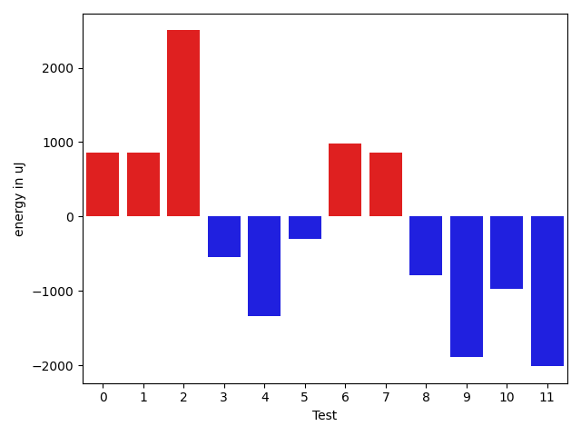

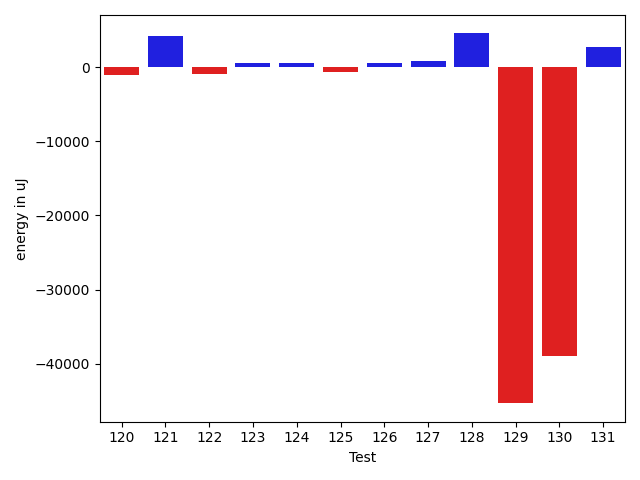

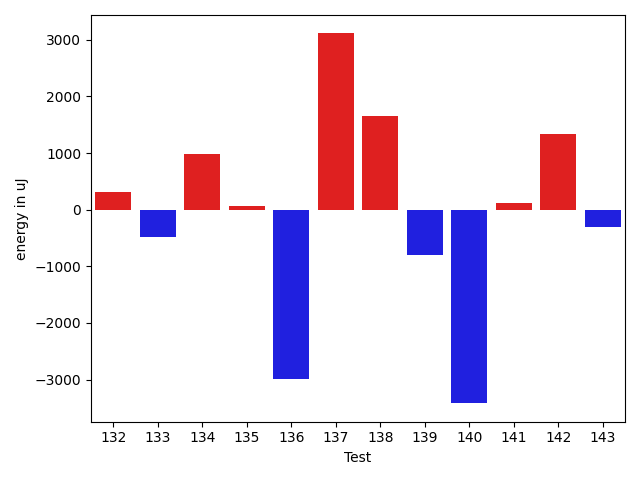

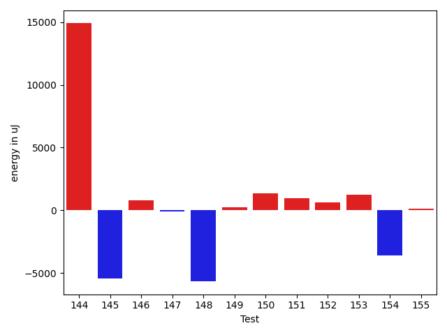

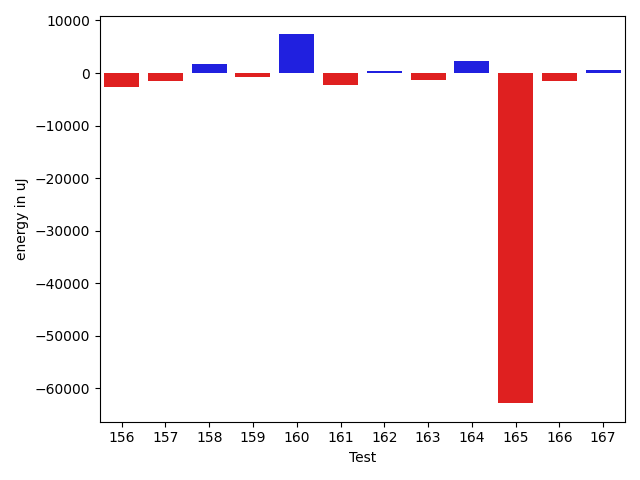

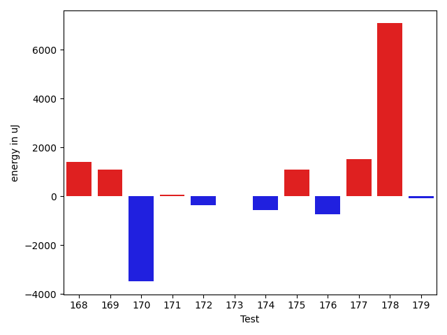

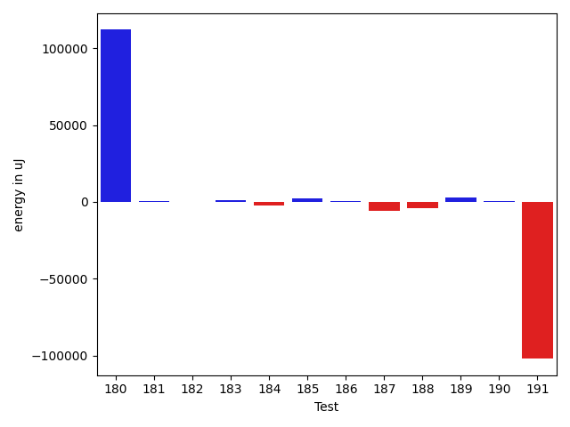

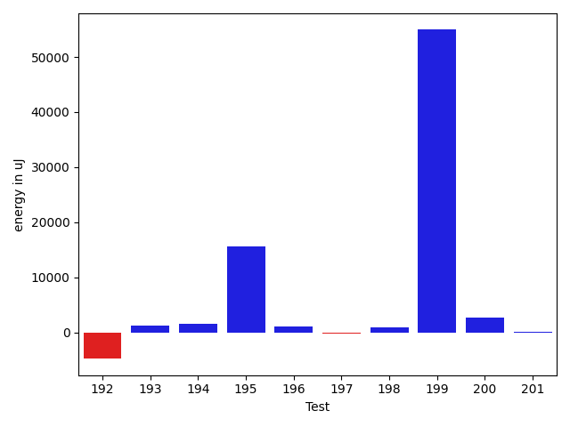

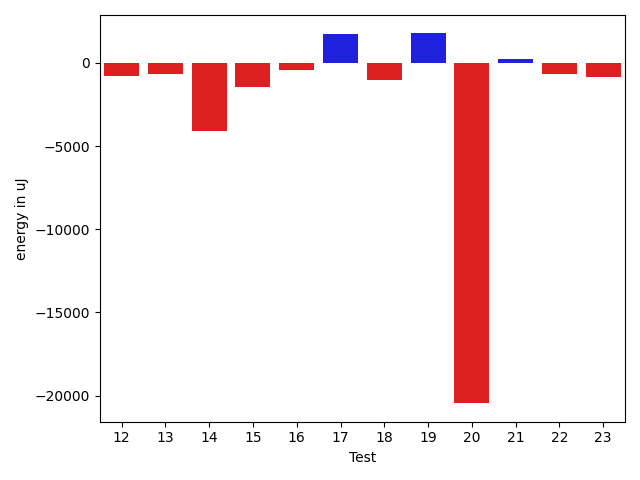

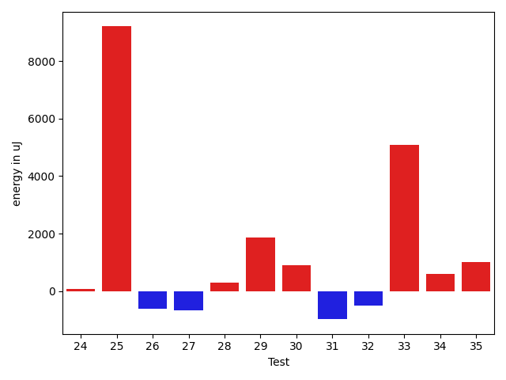

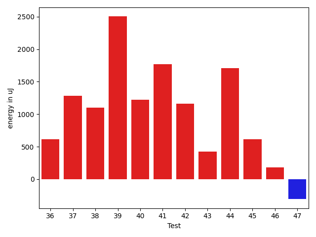

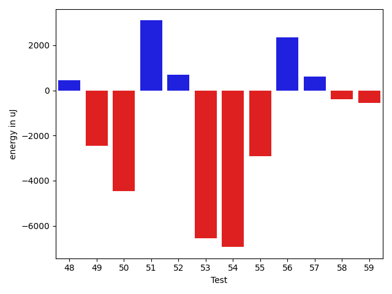

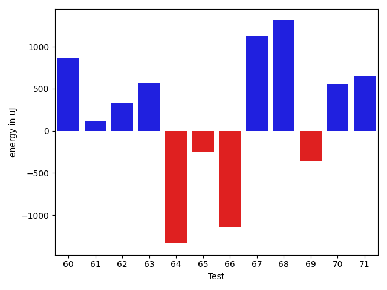

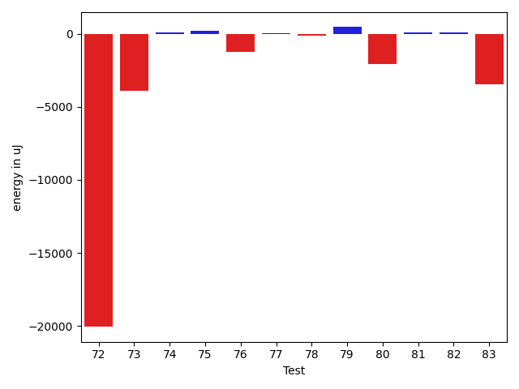

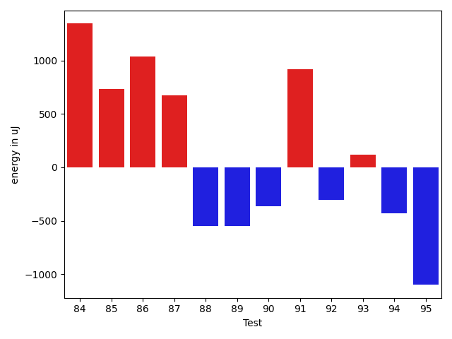

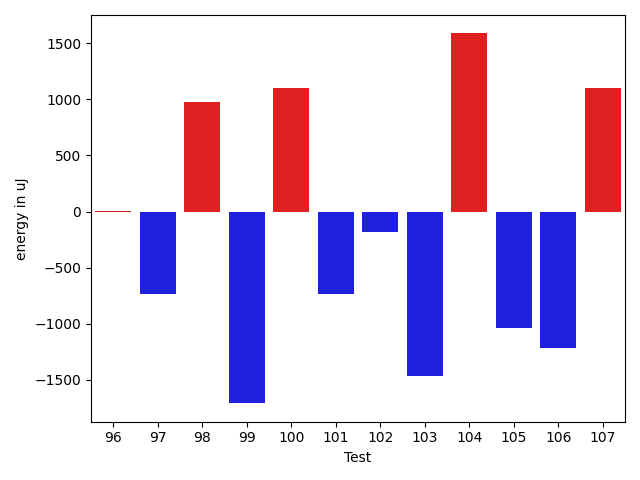

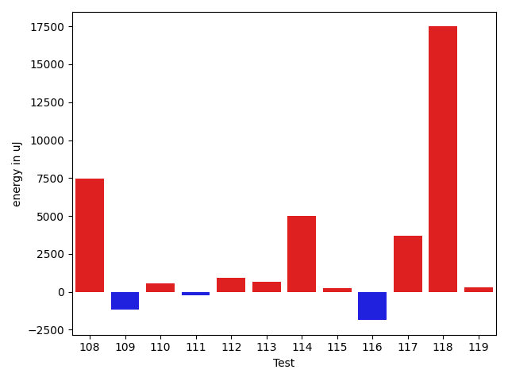

| ID | EnergyV1 | EnergyV2 | DeltaEnergy | σ |
| --- | --- | --- | --- | --- |
| 0 | 38008.31764705882 | 39715.10588235294 | 1706.788235294116 | 8152.169367304507 | 9704.299731105892 |
| 1 | 40908.22727272727 | 40761.58666666667 | -146.6406060606023 | 10110.798453012403 | 9858.62730957792 |
| 2 | 41699.51282051282 | 42294.02631578947 | 594.513495276653 | 18281.904306454195 | 13982.626045592664 |
| 3 | 37563.666666666664 | 37200.9375 | -362.72916666666424 | 5117.6096850862805 | 3634.808161525688 |
| 4 | 37471.4 | 36696.382352941175 | -775.0176470588267 | 3882.568828323159 | 4221.858895116796 |
| 5 | 37559.90476190476 | 38404.555555555555 | 844.6507936507915 | 4830.118217076028 | 8596.84274876036 |
| 6 | 38321.625 | 38066.0 | -255.625 | 9622.294737335413 | 7442.371775761317 |
| 7 | 36439.07272727273 | 36633.42592592593 | 194.35319865319616 | 4126.646227340046 | 4109.278325402667 |
| 8 | 43932.14606741573 | 44997.23529411765 | 1065.0892267019226 | 17882.560153131028 | 19388.52055372673 |
| 9 | 76859.74747474748 | 71045.37373737374 | -5814.373737373739 | 62373.98899443297 | 48811.57374647734 |
| 10 | 38976.03658536585 | 36615.493506493505 | -2360.543078872346 | 8486.90672404051 | 3898.328611628777 |
| 11 | 70172.41414141415 | 68960.88888888889 | -1211.525252525258 | 29370.312697341134 | 31604.386738376466 |
| 12 | 42507.9010989011 | 41694.32967032967 | -813.5714285714275 | 12857.581412591848 | 12595.936621142746 |
| 13 | 38149.63636363636 | 37488.155844155845 | -661.4805194805158 | 8945.843017826035 | 5596.307481747054 |
| 14 | 40366.45121951219 | 36267.75 | -4098.701219512193 | 11058.587581440994 | 6188.578886535132 |
| 15 | 39141.215189873416 | 37718.04878048781 | -1423.1664093856089 | 10127.214415349012 | 6137.237618260052 |
| 16 | 37921.98148148148 | 37494.816666666666 | -427.16481481481605 | 4511.272003797783 | 4736.796837848922 |
| 17 | 81506.37373737374 | 83222.26262626263 | 1715.8888888888905 | 19459.402885970117 | 23213.336759866885 |
| 18 | 44516.74324324324 | 43517.10666666667 | -999.6365765765731 | 14813.213327388647 | 15230.069190977285 |
| 19 | 40968.74418604651 | 42740.21276595745 | 1771.4685799109357 | 9535.254253492418 | 14193.78852149871 |
| 20 | 116908.77272727272 | 96453.58208955223 | -20455.190637720487 | 296121.2118557757 | 241206.99216209518 |
| 21 | 36954.06779661017 | 37182.267857142855 | 228.20006053268298 | 4628.638441908386 | 4832.803236702392 |
| 22 | 37296.3870967742 | 36616.86666666667 | -679.5204301075282 | 4492.913636709511 | 4098.174729749277 |
| 23 | 37045.40625 | 36214.12698412698 | -831.2792658730177 | 5051.494722229346 | 4245.258125874515 |
| 24 | 36869.0 | 36940.782608695656 | 71.78260869565565 | 4555.466825694157 | 4984.822442056284 |
| 25 | 210750.0707070707 | 219960.32323232322 | 9210.252525252523 | 63493.954765971874 | 106977.61027286739 |
| 26 | 40893.40540540541 | 40262.1875 | -631.2179054054068 | 3058.7442349934913 | 2799.425470492785 |
| 27 | 47210.583333333336 | 46525.24324324324 | -685.340090090096 | 24672.246073242117 | 27806.14604957009 |
| 28 | 36459.32432432433 | 36743.204081632655 | 283.8797573083284 | 4234.650405520612 | 4223.82299016285 |
| 29 | 36964.0 | 38815.769230769234 | 1851.7692307692341 | 5729.559490255857 | 7238.458507315642 |
| 30 | 43237.955882352944 | 44139.0 | 901.0441176470558 | 14348.703547127443 | 14791.37998756397 |
| 31 | 37745.76190476191 | 36761.846153846156 | -983.9157509157521 | 3467.1988268940413 | 3320.257431620144 |
| 32 | 36488.93023255814 | 35968.57142857143 | -520.35880398671 | 3994.68465091411 | 5512.645450593171 |
| 33 | 37648.23728813559 | 42748.12903225807 | 5099.891744122477 | 7051.511597388259 | 15325.557644418132 |
| 34 | 36595.0 | 37190.27272727273 | 595.2727272727279 | 4361.396268101238 | 4995.506946536314 |
| 35 | 37008.40277777778 | 38024.840579710144 | 1016.4378019323631 | 4764.70569121338 | 6758.5024960473265 |
| 36 | 38667.582278481015 | 39646.8875 | 979.3052215189819 | 8395.995443289412 | 7310.047713581886 |
| 37 | 40455.857142857145 | 83058.2075471698 | 42602.35040431266 | 11112.205653868972 | 125309.91944674359 |
| 38 | 37058.40740740741 | 37466.527272727275 | 408.1198653198662 | 3683.653724217999 | 5192.667788174696 |
| 39 | 36945.02222222222 | 39842.608695652176 | 2897.586473429954 | 6118.9481139921745 | 7320.614554501321 |
| 40 | 37132.117647058825 | 36976.653846153844 | -155.46380090498133 | 4141.828314896785 | 4539.223929283233 |
| 41 | 35059.846153846156 | 36236.7037037037 | 1176.8575498575447 | 4179.941743174342 | 4310.473479318973 |
| 42 | 35569.96 | 37861.09756097561 | 2291.137560975614 | 4209.462150726623 | 4233.417576937782 |
| 43 | 36437.82352941176 | 37577.653846153844 | 1139.8303167420818 | 4070.796442312055 | 4240.992902995057 |
| 44 | 35366.16 | 37250.92857142857 | 1884.768571428569 | 4727.767935759961 | 4362.888066477553 |
| 45 | 36753.78431372549 | 37102.48148148148 | 348.69716775599227 | 4633.310836369669 | 3768.1569310558802 |
| 46 | 39679.555555555555 | 41026.51111111111 | 1346.9555555555562 | 10750.55754482954 | 10254.295448189772 |
| 47 | 39008.142857142855 | 38158.6935483871 | -849.4493087557566 | 6050.4190694612025 | 6059.98679224769 |
| 48 | 38577.757575757576 | 39025.828571428574 | 448.07099567099795 | 4067.2999981024045 | 4242.715191853405 |
| 49 | 67625.21951219512 | 65166.48648648649 | -2458.733025708636 | 86948.35255932734 | 76267.63922215035 |
| 50 | 44852.25581395349 | 40391.41509433962 | -4460.840719613865 | 18524.841540411344 | 10952.790779770816 |
| 51 | 37388.28571428572 | 40487.982142857145 | 3099.6964285714275 | 3916.188630257115 | 7860.701371585906 |
| 52 | 37743.52173913043 | 38429.333333333336 | 685.8115942029035 | 4132.894678483889 | 5045.091350216182 |
| 53 | 49405.836956521736 | 42844.01052631579 | -6561.826430205947 | 25083.377290321856 | 14545.859715139586 |
| 54 | 56848.441860465115 | 49905.55172413793 | -6942.890136327187 | 36606.914857208314 | 26083.836865952515 |
| 55 | 41827.01851851852 | 38900.70175438596 | -2926.3167641325563 | 15275.881901547531 | 13045.09172059625 |
| 56 | 55443.15151515151 | 57801.28282828283 | 2358.1313131313145 | 18971.63688159096 | 18556.710954130842 |
| 57 | 37399.634146341465 | 38014.76190476191 | 615.1277584204436 | 3685.0998580380524 | 3979.0813477336815 |
| 58 | 37490.725 | 37104.829268292684 | -385.89573170731455 | 3842.154890081216 | 3953.404762322361 |
| 59 | 36682.01960784314 | 36131.23809523809 | -550.7815126050482 | 4004.5176375463066 | 4669.20308694323 |
| 60 | 36958.70212765958 | 37824.30952380953 | 865.6073961499496 | 3630.263350829862 | 3919.7021114225317 |
| 61 | 36401.2 | 36519.66 | 118.4600000000064 | 3708.738021963207 | 3813.949158601881 |
| 62 | 40729.916666666664 | 41062.68571428571 | 332.76904761904734 | 12118.782611840827 | 11335.208510959945 |
| 63 | 35965.9756097561 | 36538.107142857145 | 572.1315331010483 | 3612.5160577771558 | 4226.803624652741 |
| 64 | 40412.796875 | 39073.97297297297 | -1338.8239020270266 | 9906.562261923418 | 9752.47266909432 |
| 65 | 37005.020833333336 | 36754.59459459459 | -250.42623873874254 | 3983.2472331502727 | 4053.9819561156564 |
| 66 | 38303.681818181816 | 37164.243902439026 | -1139.4379157427902 | 4069.9780643407494 | 4458.624439413024 |
| 67 | 36730.085106382976 | 37852.14634146341 | 1122.0612350804367 | 3373.653268451817 | 5079.9242099252015 |
| 68 | 34875.181818181816 | 36189.7 | 1314.518181818181 | 3801.641913656443 | 3172.653969470986 |
| 69 | 36952.916666666664 | 36591.11627906977 | -361.8003875968934 | 4068.204552959724 | 4185.44005193476 |
| 70 | 37261.23529411765 | 37816.04 | 554.8047058823504 | 3677.227539330308 | 4194.032150377487 |
| 71 | 36736.8125 | 37390.3023255814 | 653.4898255813969 | 4425.672983928781 | 3978.9529564358354 |
| 72 | 64042.56896551724 | 43995.32142857143 | -20047.24753694581 | 89750.91525959442 | 35402.08755704505 |
| 73 | 43569.145161290326 | 39659.46666666667 | -3909.6784946236585 | 14648.415405711401 | 11688.131376837882 |
| 74 | 37358.22222222222 | 37468.51612903226 | 110.2939068100386 | 3612.712424443495 | 3970.863377077744 |
| 75 | 37403.625 | 37620.6 | 216.97499999999854 | 4043.949039537343 | 4828.727333596527 |
| 76 | 45355.70909090909 | 44134.50847457627 | -1221.2006163328188 | 17177.685101393745 | 14620.304779420587 |
| 77 | 36861.291666666664 | 36890.260869565216 | 28.969202898551885 | 3829.7383883581247 | 4096.52036561032 |
| 78 | 37012.09090909091 | 36894.44 | -117.65090909090941 | 4257.20460363254 | 4352.492183381838 |
| 79 | 36539.692307692305 | 36988.88888888889 | 449.1965811965856 | 3768.075752912144 | 4261.523389442493 |
| 80 | 40672.52 | 38585.13333333333 | -2087.3866666666654 | 12211.810288798299 | 5136.051334980557 |
| 81 | 37120.02222222222 | 37231.36363636364 | 111.34141414141777 | 4271.802900618004 | 3779.722783791696 |
| 82 | 36532.744680851065 | 36595.28888888889 | 62.54420803782705 | 3655.62608351452 | 4481.936325702802 |
| 83 | 44768.02469135803 | 41292.67105263158 | -3475.3536387264467 | 34689.09058236449 | 10655.104713590716 |
| 84 | 38428.48 | 40273.97260273973 | 1845.4926027397232 | 4608.00473483553 | 8207.903416366453 |
| 85 | 39049.729166666664 | 41560.10256410256 | 2510.3733974358984 | 8590.928405251048 | 11984.326276314949 |
| 86 | 277799.13483146066 | 311748.08235294116 | 33948.9475214805 | 224608.26549406297 | 224210.07751886788 |
| 87 | 57212.514285714286 | 52837.05714285714 | -4375.4571428571435 | 42898.090766953675 | 24905.904835076315 |
| 88 | 39679.434782608696 | 39632.897959183676 | -46.536823425019975 | 9699.329857290622 | 8579.835506355483 |
| 89 | 38778.78431372549 | 39894.704545454544 | 1115.9202317290546 | 9053.972960266898 | 11628.85649146425 |
| 90 | 37740.59375 | 37542.41935483871 | -198.17439516128798 | 4245.7444419337035 | 4483.568234616721 |
| 91 | 146125.1616161616 | 151118.38383838383 | 4993.222222222219 | 77026.52138150531 | 83708.31688314027 |
| 92 | 37209.666666666664 | 38048.448979591834 | 838.7823129251701 | 4231.5131224605175 | 4344.471857059805 |
| 93 | 37003.86363636364 | 37906.4081632653 | 902.5445269016636 | 4311.923956736447 | 4033.359378262626 |
| 94 | 38943.04347826087 | 39211.382352941175 | 268.338874680303 | 7274.839412411143 | 10364.196240266168 |
| 95 | 37233.916666666664 | 37523.57142857143 | 289.6547619047633 | 3614.911086005051 | 3575.7686229533865 |
| 96 | 36994.03703703704 | 37192.2 | 198.1629629629606 | 4046.706429252582 | 4179.988287064929 |
| 97 | 94244.35051546391 | 84280.70707070707 | -9963.643444756846 | 52992.41019669192 | 43684.44747038676 |
| 98 | 38039.38 | 38112.117647058825 | 72.73764705882786 | 8497.074884664722 | 7280.078570053978 |
| 99 | 44089.1320754717 | 41533.755102040814 | -2555.376973430888 | 19709.950430269684 | 17783.81589470493 |
| 100 | 37778.90410958904 | 39312.782051282054 | 1533.877941693012 | 8256.860442121328 | 9340.46648295282 |
| 101 | 39656.72131147541 | 38755.15254237288 | -901.5687691025305 | 6973.54275306964 | 7142.485399956742 |
| 102 | 47219.56862745098 | 44061.891304347824 | -3157.677323103155 | 21601.838160035113 | 16851.47205313976 |
| 103 | 50676.84269662921 | 47449.18947368421 | -3227.653222945002 | 23780.577453936465 | 26072.87843326238 |
| 104 | 48343.36363636364 | 46192.57142857143 | -2150.792207792212 | 17021.959707742553 | 11949.570812461878 |
| 105 | 43020.72727272727 | 42545.818181818184 | -474.90909090908826 | 11766.071233469329 | 13280.552485893744 |
| 106 | 53459.90909090909 | 71227.16326530612 | 17767.254174397036 | 28289.456565468226 | 96526.11370184498 |
| 107 | 40402.35384615385 | 43606.9 | 3204.546153846153 | 10492.969406564596 | 15686.0133359536 |
| 108 | 42912.16176470588 | 50366.03333333333 | 7453.871568627452 | 21873.321681237423 | 27545.943585802655 |
| 109 | 38392.96875 | 37230.20754716981 | -1162.7612028301883 | 4012.361812140505 | 3807.0226734509297 |
| 110 | 36895.708333333336 | 37436.17857142857 | 540.4702380952367 | 3617.593473558154 | 4109.9748135617865 |
| 111 | 37963.703125 | 37736.81690140845 | -226.88622359155124 | 4138.964411086454 | 4220.1932580734965 |
| 112 | 36715.87037037037 | 37662.230769230766 | 946.3603988603936 | 4449.476099190806 | 4649.972101716909 |
| 113 | 82503.8795180723 | 83162.75294117647 | 658.8734231041744 | 78365.73347204752 | 95024.56530998039 |
| 114 | 63427.9756097561 | 68450.07954545454 | 5022.1039356984475 | 33067.95192569961 | 31789.909971283476 |
| 115 | 37800.20754716981 | 38058.21568627451 | 258.0081391046988 | 4025.2025115279557 | 4497.879680487919 |
| 116 | 41118.04 | 39253.58490566038 | -1864.4550943396243 | 17704.27228999825 | 7887.301081865619 |
| 117 | 48221.333333333336 | 51915.846153846156 | 3694.5128205128203 | 26434.14549021738 | 36348.064124755765 |
| 118 | 106018.56962025317 | 123503.11688311688 | 17484.547262863707 | 148797.4027788752 | 187121.10611086918 |
| 119 | 37290.67647058824 | 37567.03571428572 | 276.35924369747954 | 4503.459491916045 | 3393.2533112691094 |
| 120 | 37667.25 | 36574.10256410256 | -1093.1474358974374 | 3990.342946459257 | 3859.7048099886906 |
| 121 | 38847.74074074074 | 43040.5 | 4192.759259259263 | 10961.423480121659 | 16630.12076775151 |
| 122 | 37916.333333333336 | 36995.3 | -921.0333333333328 | 4194.331686490268 | 3928.3005668270007 |
| 123 | 36406.145833333336 | 36910.46511627907 | 504.319282945733 | 4512.300124795849 | 3947.1181382903064 |
| 124 | 36684.34 | 37206.23529411765 | 521.895294117654 | 4541.862008515891 | 3826.2481576924047 |
| 125 | 37391.583333333336 | 36738.08108108108 | -653.5022522522559 | 3408.2042671161726 | 3644.064699475902 |
| 126 | 35728.11111111111 | 36314.029411764706 | 585.9183006535968 | 4172.738902761264 | 4382.439030046638 |
| 127 | 35967.62962962963 | 36858.75862068965 | 891.1289910600244 | 4663.154774979957 | 3813.7374433177242 |
| 128 | 42096.619047619046 | 46646.86666666667 | 4550.247619047623 | 12607.264404288393 | 15186.412738000006 |
| 129 | 84291.70370370371 | 38969.52173913043 | -45322.181964573276 | 212838.21470062475 | 2772.0553176857816 |
| 130 | 81702.8961038961 | 42795.896103896106 | -38906.99999999999 | 242487.81665400334 | 17632.420881576356 |
| 131 | 37182.5 | 39876.208333333336 | 2693.7083333333358 | 4596.741095602405 | 5102.782141302646 |
| 132 | 39558.7868852459 | 40123.03278688525 | 564.2459016393477 | 9729.182588472071 | 9247.624558022355 |
| 133 | 38025.8813559322 | 36965.7037037037 | -1060.1776522285 | 4110.632798350241 | 4197.932130402749 |
| 134 | 37022.58064516129 | 37975.5 | 952.919354838712 | 4183.29427044928 | 3940.6422594123746 |
| 135 | 42830.91428571429 | 40038.96153846154 | -2791.952747252748 | 19898.195816809162 | 10237.831110380488 |
| 136 | 37958.5 | 36633.86842105263 | -1324.6315789473665 | 4396.076480962381 | 4008.4943043429835 |
| 137 | 58200.634146341465 | 103541.03225806452 | 45340.39811172305 | 62193.361896492635 | 122537.78270749771 |
| 138 | 36273.96875 | 39242.2972972973 | 2968.3285472973002 | 3533.7386848454767 | 8304.342572429376 |
| 139 | 46673.393939393936 | 45312.25714285715 | -1361.13679653679 | 17322.287507173394 | 22262.70729826369 |
| 140 | 93156.63636363637 | 97382.9191919192 | 4226.282828282827 | 229784.16681327237 | 238257.06037581078 |
| 141 | 41799.91358024691 | 43487.784810126584 | 1687.8712298796745 | 10117.710217942597 | 13437.910439462297 |
| 142 | 43818.42307692308 | 42814.103896103894 | -1004.3191808191841 | 17110.709630655172 | 14327.112452827292 |
| 143 | 53475.25 | 55222.390625 | 1747.140625 | 34158.09157158081 | 38519.05777769995 |
| 144 | 46048.42307692308 | 60946.22727272727 | 14897.804195804194 | 20391.146086123295 | 53406.38296881735 |
| 145 | 313422.7272727273 | 308016.50505050505 | -5406.222222222248 | 245614.68330173276 | 260677.4717519668 |
| 146 | 38435.420454545456 | 39241.28735632184 | 805.8669017763823 | 8962.245738401212 | 8193.881745964583 |
| 147 | 35211.794117647056 | 35148.94117647059 | -62.85294117646845 | 3569.101170252086 | 4155.481871549326 |
| 148 | 52788.818181818184 | 47125.0 | -5663.818181818184 | 18400.222552103605 | 15252.051197314091 |
| 149 | 37662.25 | 37894.46666666667 | 232.21666666666715 | 2726.790340766961 | 3314.9292977209766 |
| 150 | 34718.97297297297 | 36090.857142857145 | 1371.8841698841716 | 3603.2518307809537 | 4175.331933034835 |
| 151 | 35112.28125 | 36090.875 | 978.59375 | 2475.3184546939488 | 4466.765235813832 |
| 152 | 35427.903225806454 | 36036.096774193546 | 608.1935483870911 | 3996.830085526559 | 5004.921895912376 |
| 153 | 35750.709677419356 | 37022.0 | 1271.290322580644 | 4227.005518999033 | 4617.303941945743 |
| 154 | 47133.02857142857 | 43523.75 | -3609.278571428571 | 23671.801612268806 | 16268.286345678822 |
| 155 | 37733.15555555555 | 37890.181818181816 | 157.0262626262629 | 7300.527168044649 | 4687.6178155993 |
| 156 | 49106.78947368421 | 46436.260416666664 | -2670.5290570175493 | 20455.288902432898 | 17910.414709537014 |
| 157 | 37512.83870967742 | 36049.03703703704 | -1463.8016726403803 | 3385.013661732322 | 3831.602048476266 |
| 158 | 36512.04347826087 | 38137.032258064515 | 1624.9887798036434 | 4603.2186799565525 | 5158.301680278682 |
| 159 | 40251.16279069767 | 39560.58108108108 | -690.581709616592 | 10933.993609499184 | 9175.263528149666 |
| 160 | 50083.70786516854 | 57467.617021276594 | 7383.909156108057 | 48507.067459393606 | 66809.74490824218 |
| 161 | 40679.01315789474 | 38460.2 | -2218.813157894743 | 9636.945075147303 | 7612.145270990739 |
| 162 | 41196.94736842105 | 41633.26829268293 | 436.3209242618759 | 17049.74997493383 | 20031.806261511985 |
| 163 | 48751.65625 | 47400.6129032258 | -1351.0433467741968 | 51964.300432850876 | 45883.954763657646 |
| 164 | 44540.49180327869 | 46919.30508474576 | 2378.8132814670753 | 19051.954577773362 | 19928.004619387088 |
| 165 | 147173.34343434343 | 84310.30303030302 | -62863.04040404041 | 349780.5566182098 | 34662.54451845726 |
| 166 | 40622.215189873416 | 39188.3 | -1433.9151898734126 | 11035.0838126025 | 6571.874740893956 |
| 167 | 37962.94366197183 | 38498.41935483871 | 535.4756928668794 | 7289.084493774882 | 6411.465640776 |
| 168 | 49705.69090909091 | 47674.333333333336 | -2031.3575757575745 | 27909.619846844416 | 26262.842115561823 |
| 169 | 37820.117647058825 | 39253.68918918919 | 1433.5715421303612 | 7254.546575463621 | 8508.771412133317 |
| 170 | 175957.95081967214 | 124650.01694915254 | -51307.9338705196 | 403039.75659880886 | 336798.47239082947 |
| 171 | 37105.805555555555 | 38576.625 | 1470.8194444444453 | 4482.4521055844 | 4405.233855053365 |
| 172 | 37135.63333333333 | 37327.25 | 191.6166666666686 | 4947.108593130155 | 3925.0920792201987 |
| 173 | 37725.94871794872 | 38245.13888888889 | 519.1901709401718 | 5387.0326875616165 | 4687.949469726596 |
| 174 | 43334.849315068495 | 43035.8 | -299.04931506849243 | 13866.802604931801 | 15757.244964595991 |
| 175 | 37588.13461538462 | 38407.96296296296 | 819.8283475783464 | 3985.186488392145 | 3998.627079029348 |
| 176 | 37853.357142857145 | 38253.61363636364 | 400.25649350649473 | 4737.625564720855 | 4225.887137717137 |
| 177 | 39788.903846153844 | 41075.4 | 1286.4961538461575 | 7214.900133270184 | 9865.731013048056 |
| 178 | 108699.06060606061 | 162987.47474747474 | 54288.414141414134 | 47102.70075441496 | 338811.38194130466 |
| 179 | 38739.294117647056 | 37876.52380952381 | -862.7703081232467 | 4194.401152863406 | 4990.621333767184 |
| 180 | 90012.19047619047 | 201985.26666666666 | 111973.07619047619 | 217833.80710589766 | 415735.4112072512 |
| 181 | 37136.0 | 37433.92 | 297.91999999999825 | 3011.0487989345534 | 3718.1406419876052 |
| 182 | 39798.181818181816 | 39774.80597014925 | -23.375848032563226 | 9651.762198198758 | 6694.5137155528755 |
| 183 | 47109.88333333333 | 48144.45714285714 | 1034.573809523812 | 21618.2805707667 | 22418.38241245386 |
| 184 | 650215.6363636364 | 647678.8282828283 | -2536.8080808080267 | 125644.85723806136 | 134468.85403541138 |
| 185 | 63160.416666666664 | 65486.59782608696 | 2326.1811594202954 | 64327.74293796615 | 93646.63670717984 |
| 186 | 52897.37894736842 | 53171.677083333336 | 274.29813596491294 | 53154.66663024226 | 77775.39071147639 |
| 187 | 53427.20731707317 | 47386.16470588235 | -6041.042611190816 | 49401.583353152586 | 40904.302719409694 |
| 188 | 45594.60493827161 | 41510.68571428571 | -4083.9192239858967 | 25269.6262820905 | 13985.976509696988 |
| 189 | 54621.120689655174 | 57740.11111111111 | 3118.9904214559356 | 70260.3407183935 | 71134.57301283118 |
| 190 | 37437.8085106383 | 38074.704545454544 | 636.8960348162436 | 3768.03063093604 | 3785.033568840845 |
| 191 | 173347.6 | 71295.80555555556 | -102051.79444444444 | 458597.7398446705 | 223061.73557084787 |
| 192 | 53302.346153846156 | 48506.82608695652 | -4795.520066889636 | 22899.350316518565 | 22941.039604683727 |
| 193 | 38406.375 | 39567.72222222222 | 1161.347222222219 | 4003.827822768482 | 3215.090664101879 |
| 194 | 41074.27777777778 | 42580.48 | 1506.2022222222222 | 13443.952270261218 | 16943.02443867682 |
| 195 | 93823.171875 | 109465.31034482758 | 15642.13846982758 | 262196.4228589267 | 297742.66333357844 |
| 196 | 55074.56896551724 | 56091.15873015873 | 1016.5897646414887 | 35580.165005680494 | 38383.21888294512 |
| 197 | 38575.16981132075 | 38300.88888888889 | -274.28092243186256 | 4120.097716994004 | 6572.259704437657 |
| 198 | 41385.65957446808 | 42258.119047619046 | 872.4594731509642 | 9681.821000416732 | 10451.702062804756 |
| 199 | 38378.0 | 93315.42307692308 | 54937.42307692308 | 4357.097149643162 | 212194.353201017 |
| 200 | 39405.23809523809 | 42097.72727272727 | 2692.4891774891803 | 6010.383205474006 | 14557.384618317255 |
| 201 | 39314.6 | 39358.857142857145 | 44.25714285714639 | 2567.6767397785884 | 4886.824178443543 |

## Delta Duration per test method

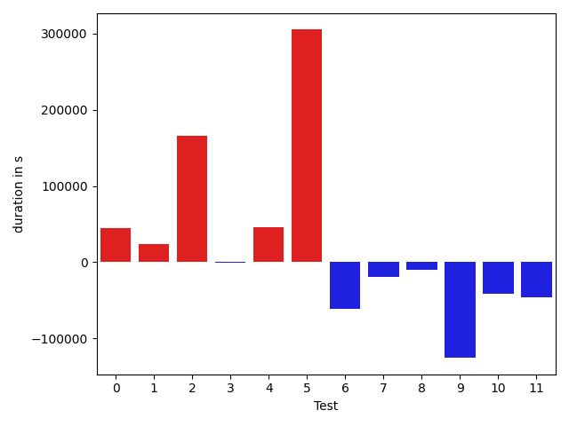

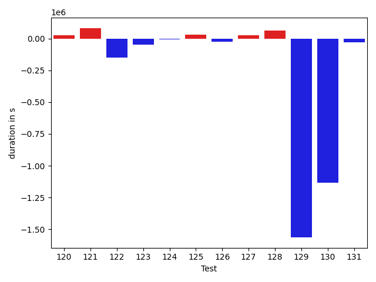

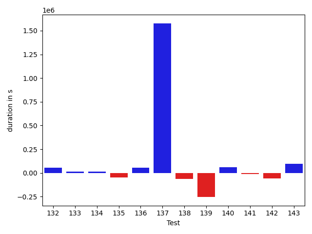

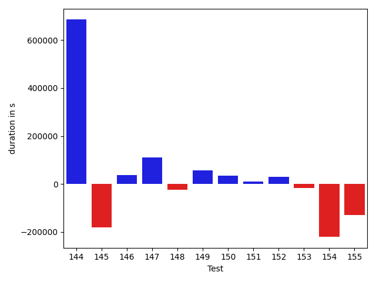

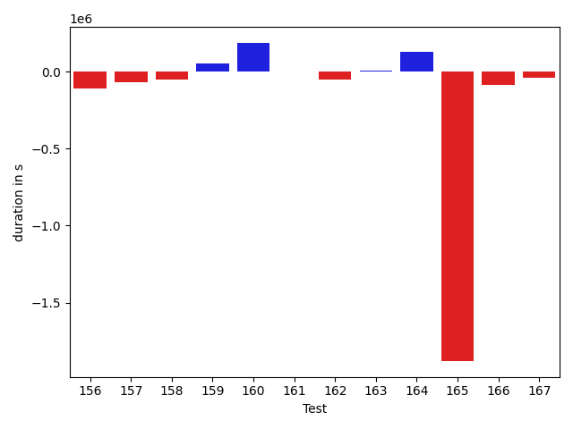

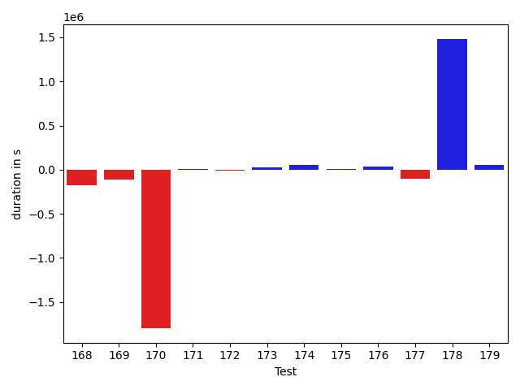

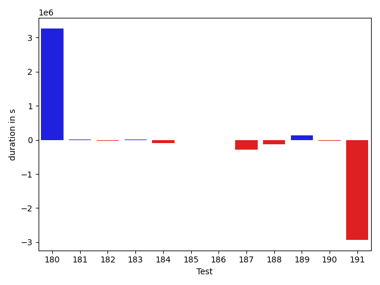

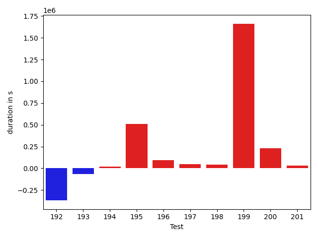

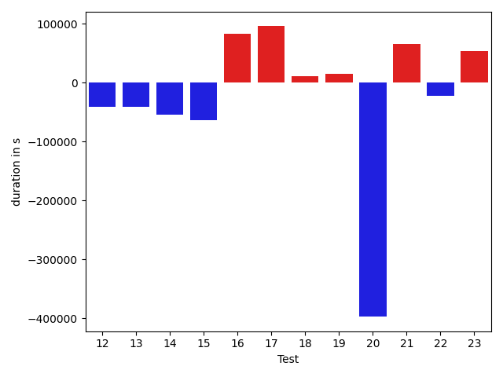

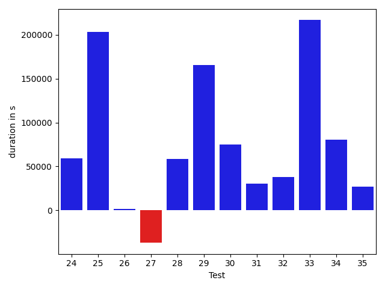

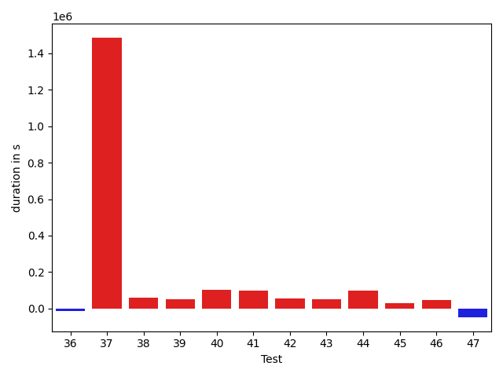

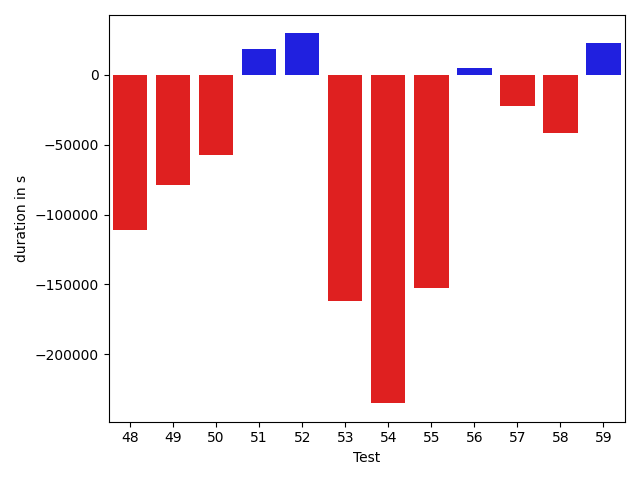

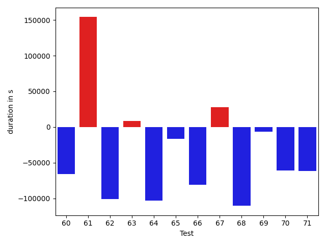

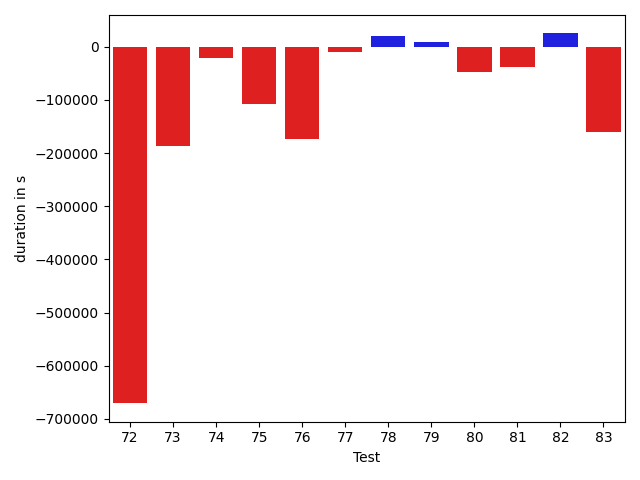

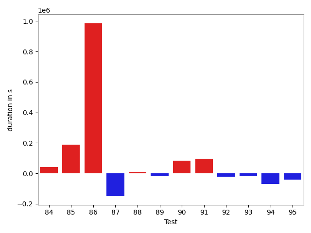

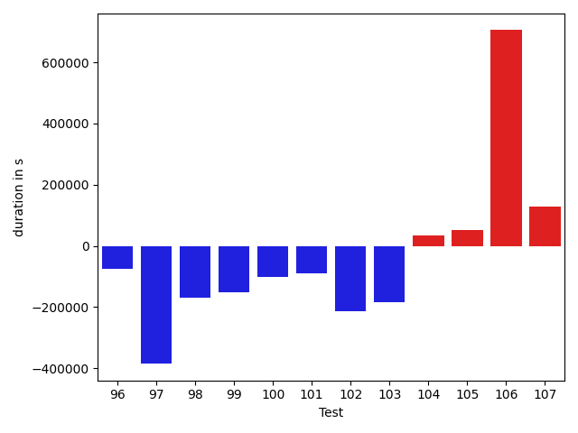

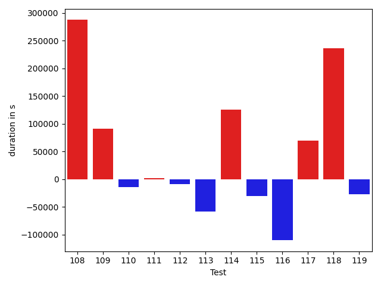

| ID | DurationV1 | DurationsV2 | DeltaDuration |
| --- | --- | --- | --- |
| 0 | 1178021.4235294117 | 1222812.8588235294 | 44791.43529411778 |
| 1 | 1133404.7878787878 | 1157379.2666666666 | 23974.47878787876 |
| 2 | 803409.9487179487 | 969623.4210526316 | 166213.47233468283 |
| 3 | 632636.3333333334 | 632282.34375 | -353.98958333337214 |
| 4 | 600855.8333333334 | 647161.4411764706 | 46305.60784313723 |
| 5 | 466708.0 | 771701.0 | 304993.0 |
| 6 | 1135966.3333333333 | 1074771.0405405406 | -61195.292792792665 |
| 7 | 843622.1272727273 | 824664.5925925926 | -18957.534680134733 |
| 8 | 1351679.393258427 | 1341135.705882353 | -10543.687376074027 |
| 9 | 2301404.212121212 | 2175873.1818181816 | -125531.03030303027 |
| 10 | 1133814.512195122 | 1092854.831168831 | -40959.68102629087 |
| 11 | 2178096.1818181816 | 2131985.797979798 | -46110.38383838348 |
| 12 | 1341716.054945055 | 1300466.087912088 | -41249.9670329669 |
| 13 | 1119924.5568181819 | 1078958.6103896103 | -40965.946428571595 |
| 14 | 1179010.768292683 | 1125091.8157894737 | -53918.952503209235 |
| 15 | 1166439.6582278481 | 1102799.1097560977 | -63640.54847175046 |
| 16 | 776545.0925925926 | 860071.95 | 83526.85740740737 |
| 17 | 2459791.616161616 | 2555342.7474747472 | 95551.13131313119 |
| 18 | 1211434.189189189 | 1222818.24 | 11384.050810810877 |
| 19 | 915234.2790697674 | 929715.2127659575 | 14480.933696190012 |
| 20 | 3100451.5757575757 | 2702984.268656716 | -397467.30710085947 |
| 21 | 819698.6101694915 | 885082.25 | 65383.6398305085 |
| 22 | 640438.8709677419 | 617643.7111111111 | -22795.15985663084 |
| 23 | 946470.890625 | 999857.0952380953 | 53386.204613095266 |
| 24 | 726822.7021276596 | 785891.0869565217 | 59068.38482886215 |
| 25 | 5809766.919191919 | 6013325.565656566 | 203558.6464646468 |
| 26 | 700826.9459459459 | 702016.875 | 1189.9290540540824 |
| 27 | 869839.0555555555 | 832715.8378378379 | -37123.217717717635 |
| 28 | 705678.3243243244 | 764166.306122449 | 58487.981798124616 |
| 29 | 719751.1904761905 | 885609.3461538461 | 165858.1556776556 |
| 30 | 1158738.3823529412 | 1233839.650793651 | 75101.26844070968 |
| 31 | 772792.8333333334 | 803173.4871794871 | 30380.653846153757 |
| 32 | 716931.023255814 | 754941.119047619 | 38010.09579180507 |
| 33 | 887923.3220338983 | 1104660.1129032257 | 216736.79086932738 |
| 34 | 852989.3518518518 | 933511.5818181818 | 80522.22996633 |
| 35 | 952334.4722222222 | 979051.2753623188 | 26716.8031400966 |
| 36 | 1129211.82278481 | 1115125.85 | -14085.972784810001 |
| 37 | 1010882.9 | 2497113.9245283017 | 1486231.0245283018 |
| 38 | 787900.6296296297 | 847204.490909091 | 59303.8612794613 |
| 39 | 818809.7777777778 | 871315.0869565217 | 52505.30917874398 |
| 40 | 750385.6862745098 | 851130.3653846154 | 100744.67911010562 |
| 41 | 564221.1923076923 | 664076.0 | 99854.80769230775 |
| 42 | 674467.14 | 729444.756097561 | 54977.61609756097 |
| 43 | 680952.9411764706 | 731665.4615384615 | 50712.5203619909 |
| 44 | 520394.88 | 619367.5714285715 | 98972.69142857147 |
| 45 | 713687.431372549 | 741265.5 | 27578.068627450964 |
| 46 | 867133.8611111111 | 911404.2 | 44270.33888888883 |
| 47 | 928218.0317460317 | 880036.2741935484 | -48181.75755248335 |
| 48 | 739031.9090909091 | 627828.9428571429 | -111202.96623376617 |
| 49 | 2002251.6585365853 | 1923542.689189189 | -78708.96934739617 |
| 50 | 1064957.3720930233 | 1007625.679245283 | -57331.692847740254 |
| 51 | 869763.5306122449 | 887903.9107142857 | 18140.38010204083 |
| 52 | 717227.8695652174 | 746669.3921568628 | 29441.522591645364 |
| 53 | 1519131.293478261 | 1357292.5684210525 | -161838.72505720844 |
| 54 | 1715290.6395348837 | 1480392.1494252873 | -234898.4901095964 |
| 55 | 1010514.2592592592 | 857739.5614035088 | -152774.69785575045 |
| 56 | 1736455.2828282828 | 1741467.0303030303 | 5011.747474747477 |
| 57 | 756573.8048780488 | 733910.6904761905 | -22663.1144018583 |
| 58 | 747853.375 | 706245.8780487805 | -41607.49695121951 |
| 59 | 709402.8235294118 | 731932.6666666666 | 22529.843137254822 |
| 60 | 757106.6382978724 | 691205.7857142857 | -65900.8525835867 |
| 61 | 707025.5111111111 | 861145.8 | 154120.2888888889 |
| 62 | 1193381.7222222222 | 1092481.1714285715 | -100900.5507936508 |
| 63 | 714057.7073170731 | 722565.5178571428 | 8507.81054006971 |
| 64 | 1052839.21875 | 949515.027027027 | -103324.19172297302 |
| 65 | 735600.3958333334 | 719333.972972973 | -16266.422860360355 |
| 66 | 756681.8409090909 | 675716.6097560975 | -80965.2311529934 |
| 67 | 666190.6170212766 | 693881.1951219512 | 27690.578100674553 |
| 68 | 605533.3636363636 | 495055.0 | -110478.36363636365 |
| 69 | 685281.875 | 678796.9534883721 | -6484.92151162785 |
| 70 | 833026.3921568628 | 772288.14 | -60738.252156862756 |
| 71 | 765098.2291666666 | 703243.8139534884 | -61854.41521317826 |
| 72 | 1756564.1379310344 | 1085991.3035714286 | -670572.8343596058 |
| 73 | 1085994.1290322582 | 899485.55 | -186508.57903225813 |
| 74 | 825655.1428571428 | 805040.6451612903 | -20614.497695852537 |
| 75 | 787752.575 | 680840.4888888889 | -106912.0861111111 |
| 76 | 1303451.8909090909 | 1129660.3898305085 | -173791.50107858237 |
| 77 | 726880.6458333334 | 716412.5652173914 | -10468.080615942017 |
| 78 | 717172.9772727273 | 737205.5 | 20032.522727272706 |
| 79 | 697299.9743589744 | 706036.25 | 8736.275641025626 |
| 80 | 846894.02 | 798800.8444444444 | -48093.175555555616 |
| 81 | 757843.0444444445 | 719745.2045454546 | -38097.839898989885 |
| 82 | 709511.8510638297 | 734311.1111111111 | 24799.260047281394 |
| 83 | 1274368.4444444445 | 1114231.0263157894 | -160137.41812865506 |
| 84 | 1013140.2666666667 | 1053384.082191781 | 40243.81552511419 |
| 85 | 740397.2916666666 | 928704.8461538461 | 188307.5544871795 |
| 86 | 7928004.662921349 | 8913159.835294118 | 985155.1723727696 |
| 87 | 1450924.5714285714 | 1301641.657142857 | -149282.91428571427 |
| 88 | 853951.9565217391 | 864134.8979591837 | 10182.941437444533 |
| 89 | 856213.6470588235 | 837455.3863636364 | -18758.260695187142 |
| 90 | 532816.0 | 614568.0 | 81752.0 |
| 91 | 4148662.6666666665 | 4246062.404040404 | 97399.73737373715 |
| 92 | 829182.3958333334 | 805938.6326530612 | -23243.763180272188 |
| 93 | 750317.4545454546 | 730355.0408163265 | -19962.41372912808 |
| 94 | 733076.8260869565 | 662575.8235294118 | -70501.00255754474 |
| 95 | 593540.5833333334 | 551792.5714285715 | -41748.011904761894 |
| 96 | 587999.4074074074 | 511668.32 | -76331.08740740741 |
| 97 | 2871144.0103092785 | 2485595.3232323234 | -385548.6870769551 |
| 98 | 968964.44 | 799178.4117647059 | -169786.02823529404 |
| 99 | 1066630.566037736 | 914660.9795918367 | -151969.58644589921 |
| 100 | 1165988.6712328766 | 1063121.8717948718 | -102866.79943800485 |
| 101 | 961424.393442623 | 872394.593220339 | -89029.80022228393 |
| 102 | 1178446.3333333333 | 963576.0217391305 | -214870.31159420277 |
| 103 | 1595458.2921348314 | 1411921.5157894737 | -183536.77634535776 |
| 104 | 970418.8484848485 | 1005422.3571428572 | 35003.50865800865 |
| 105 | 1018458.7454545455 | 1070320.9454545456 | 51862.20000000007 |
| 106 | 1593105.2121212122 | 2298090.6836734693 | 704985.4715522572 |
| 107 | 1050868.3384615385 | 1179394.7285714287 | 128526.39010989014 |
| 108 | 1027449.1617647059 | 1314992.0166666666 | 287542.8549019607 |
| 109 | 782944.71875 | 873988.4150943396 | 91043.69634433964 |
| 110 | 835624.6458333334 | 821754.2678571428 | -13870.377976190532 |
| 111 | 895114.59375 | 897075.1971830986 | 1960.603433098644 |
| 112 | 850833.2407407408 | 841686.5538461539 | -9146.686894586892 |
| 113 | 2420037.578313253 | 2361710.317647059 | -58327.260666193906 |
| 114 | 1878131.975609756 | 2004164.6590909092 | 126032.6834811531 |
| 115 | 881865.6037735849 | 851551.3333333334 | -30314.270440251566 |
| 116 | 1005280.04 | 895237.3962264151 | -110042.64377358498 |
| 117 | 1115196.8484848484 | 1184992.6153846155 | 69795.7668997671 |
| 118 | 3101359.1265822784 | 3337555.038961039 | 236195.91237876052 |
| 119 | 547070.3823529412 | 520547.53571428574 | -26522.846638655465 |
| 120 | 553311.6785714285 | 578597.2564102564 | 25285.577838827856 |
| 121 | 669884.4074074074 | 752089.6428571428 | 82205.23544973542 |
| 122 | 612921.5185185185 | 462618.56666666665 | -150302.9518518519 |
| 123 | 795224.0 | 746999.1860465116 | -48224.81395348837 |
| 124 | 790053.78 | 782768.9215686275 | -7284.858431372559 |
| 125 | 550496.8333333334 | 580456.7297297297 | 29959.896396396332 |
| 126 | 590990.4074074074 | 565459.8823529412 | -25530.525054466212 |
| 127 | 528517.2222222222 | 553814.3793103448 | 25297.157088122563 |
| 128 | 829632.8095238095 | 893750.6 | 64117.79047619051 |
| 129 | 2043501.5555555555 | 480122.0869565217 | -1563379.4685990338 |
| 130 | 2302548.5454545454 | 1166697.5974025973 | -1135850.948051948 |
| 131 | 683905.375 | 653594.2916666666 | -30311.083333333372 |
| 132 | 1025367.868852459 | 1078158.68852459 | 52790.819672131096 |
| 133 | 791909.7627118644 | 807268.4629629629 | 15358.70025109849 |
| 134 | 581681.8709677419 | 594065.8888888889 | 12384.017921146937 |
| 135 | 1026750.1428571428 | 978821.3076923077 | -47928.835164835094 |
| 136 | 715597.5882352941 | 772134.7368421053 | 56537.148606811184 |
| 137 | 1450922.0 | 3028125.5483870967 | 1577203.5483870967 |
| 138 | 808914.9375 | 745035.027027027 | -63879.91047297302 |
| 139 | 1341509.7575757576 | 1088588.0 | -252921.75757575757 |
| 140 | 2730689.232323232 | 2791217.383838384 | 60528.15151515184 |
| 141 | 1163955.938271605 | 1150887.6075949366 | -13068.330676668324 |
| 142 | 1261497.6794871795 | 1201547.9350649351 | -59949.744422244374 |
| 143 | 1371418.09375 | 1465939.796875 | 94521.703125 |
| 144 | 877003.1538461539 | 1561768.7727272727 | 684765.6188811188 |
| 145 | 9397436.757575758 | 9216589.202020202 | -180847.55555555597 |
| 146 | 1211588.8522727273 | 1247760.448275862 | 36171.596003134735 |
| 147 | 654485.6176470588 | 764985.4411764706 | 110499.8235294118 |
| 148 | 1404047.5757575757 | 1381384.1960784313 | -22663.37967914436 |
| 149 | 391278.125 | 448673.8 | 57395.67499999999 |
| 150 | 545460.6216216217 | 580185.6857142857 | 34725.06409266405 |
| 151 | 581426.125 | 592642.375 | 11216.25 |
| 152 | 564952.9354838709 | 594317.1935483871 | 29364.258064516238 |
| 153 | 948353.2903225806 | 931853.4461538461 | -16499.844168734504 |
| 154 | 1140140.7142857143 | 919905.90625 | -220234.80803571432 |
| 155 | 860120.8 | 731662.5909090909 | -128458.2090909091 |
| 156 | 1544839.2 | 1436867.3541666667 | -107971.84583333321 |
| 157 | 666437.8709677419 | 596572.5925925926 | -69865.27837514936 |
| 158 | 674303.5652173914 | 621732.0967741936 | -52571.46844319778 |
| 159 | 1129795.3023255814 | 1182671.0945945946 | 52875.79226901312 |
| 160 | 1595106.8988764044 | 1781818.7340425532 | 186711.83516614884 |
| 161 | 1063110.0921052631 | 1062520.6533333333 | -589.4387719298247 |
| 162 | 935722.947368421 | 884395.243902439 | -51327.70346598199 |
| 163 | 1062199.78125 | 1068068.7741935484 | 5868.992943548365 |
| 164 | 1157447.475409836 | 1284309.7457627119 | 126862.27035287581 |
| 165 | 4351470.151515151 | 2472819.9393939395 | -1878650.212121212 |
| 166 | 1091280.8987341772 | 1005286.0125 | -85994.88623417728 |
| 167 | 989567.0845070423 | 951462.1935483871 | -38104.89095865516 |
| 168 | 1318637.9454545456 | 1140292.3333333333 | -178345.6121212123 |
| 169 | 1055590.3382352942 | 940431.2567567568 | -115159.08147853741 |
| 170 | 5091221.950819672 | 3294020.0508474577 | -1797201.8999722144 |
| 171 | 607568.1388888889 | 612348.9166666666 | 4780.777777777752 |
| 172 | 695925.5666666667 | 681138.7857142857 | -14786.78095238097 |
| 173 | 808024.7692307692 | 830640.1111111111 | 22615.341880341875 |
| 174 | 1126873.3698630137 | 1177403.9857142856 | 50530.6158512719 |
| 175 | 784238.3269230769 | 792556.8888888889 | 8318.561965811998 |
| 176 | 768381.9761904762 | 801164.4545454546 | 32782.478354978375 |
| 177 | 1016371.5769230769 | 916919.5272727272 | -99452.04965034965 |
| 178 | 3135259.898989899 | 4616561.363636363 | 1481301.4646464642 |
| 179 | 410163.70588235295 | 467896.4761904762 | 57732.77030812326 |
| 180 | 2186479.904761905 | 5450251.733333333 | 3263771.8285714285 |
| 181 | 468700.2173913043 | 470932.88 | 2232.662608695682 |
| 182 | 987903.0363636364 | 958007.4925373135 | -29895.543826322886 |
| 183 | 1139034.7833333334 | 1145261.357142857 | 6226.573809523601 |
| 184 | 17277466.242424242 | 17175668.686868686 | -101797.55555555597 |
| 185 | 1920781.6145833333 | 1911996.141304348 | -8785.473278985359 |
| 186 | 1657231.1578947369 | 1642942.0 | -14289.157894736854 |
| 187 | 1687461.4024390243 | 1403713.0235294118 | -283748.37890961254 |
| 188 | 1256887.111111111 | 1125514.1857142858 | -131372.9253968252 |
| 189 | 1411669.7241379311 | 1539257.8412698412 | 127588.11713191005 |
| 190 | 713163.2127659575 | 685703.2272727273 | -27459.985493230168 |
| 191 | 4844637.616666666 | 1914661.2916666667 | -2929976.3249999993 |
| 192 | 1278215.9615384615 | 910601.2173913043 | -367614.7441471572 |
| 193 | 467848.5 | 401690.94444444444 | -66157.55555555556 |
| 194 | 1016430.5370370371 | 1034687.68 | 18257.14296296297 |
| 195 | 2484582.078125 | 2994357.9827586208 | 509775.90463362075 |
| 196 | 1389907.7586206896 | 1482932.2222222222 | 93024.46360153263 |
| 197 | 828811.3396226416 | 875740.9365079365 | 46929.596885294886 |
| 198 | 859134.8085106383 | 902512.3333333334 | 43377.524822695064 |
| 199 | 453642.0 | 2114889.153846154 | 1661247.153846154 |
| 200 | 535936.7619047619 | 766001.8181818182 | 230065.05627705634 |
| 201 | 386230.73333333334 | 418853.9285714286 | 32623.195238095243 |

## Misc.

| ID | Test Class | Test Method |
| --- | --- | --- |
| 0 | com.google.gson.functional.StreamingTypeAdaptersTest | testNullSafe |
| 1 | com.google.gson.functional.StreamingTypeAdaptersTest | testSerializeWithCustomTypeAdapter |
| 2 | com.google.gson.functional.StreamingTypeAdaptersTest | testFromJsonTree |
| 3 | com.google.gson.functional.StreamingTypeAdaptersTest | testDeserializeWithCustomTypeAdapter |
| 4 | com.google.gson.functional.StreamingTypeAdaptersTest | testSerializeRecursive |
| 5 | com.google.gson.functional.StreamingTypeAdaptersTest | testDeserializeMap |
| 6 | com.google.gson.functional.ParameterizedTypesTest | testParameterizedTypeGenericArraysSerialization |
| 7 | com.google.gson.functional.ParameterizedTypesTest | testParameterizedTypesWithWriterSerialization |
| 8 | com.google.gson.functional.ParameterizedTypesTest | testParameterizedTypeWithCustomSerializer |
| 9 | com.google.gson.functional.ParameterizedTypesTest | testParameterizedTypesSerialization |
| 10 | com.google.gson.functional.ParameterizedTypesTest | testVariableTypeDeserialization |
| 11 | com.google.gson.functional.ParameterizedTypesTest | testVariableTypeFieldsAndGenericArraysSerialization |
| 12 | com.google.gson.functional.ParameterizedTypesTest | testVariableTypeFieldsAndGenericArraysDeserialization |
| 13 | com.google.gson.functional.ParameterizedTypesTest | testParameterizedTypeWithVariableTypeDeserialization |
| 14 | com.google.gson.functional.ParameterizedTypesTest | testParameterizedTypeGenericArraysDeserialization |
| 15 | com.google.gson.functional.ParameterizedTypesTest | testVariableTypeArrayDeserialization |
| 16 | com.google.gson.functional.CustomTypeAdaptersTest | testCustomAdapterInvokedForMapElementDeserialization |
| 17 | com.google.gson.functional.CustomTypeAdaptersTest | testCustomTypeAdapterDoesNotAppliesToSubClasses |
| 18 | com.google.gson.functional.CustomTypeAdaptersTest | testCustomAdapterInvokedForCollectionElementSerializationWithType |
| 19 | com.google.gson.functional.CustomTypeAdaptersTest | testEnsureCustomSerializerNotInvokedForNullValues |
| 20 | com.google.gson.functional.CustomTypeAdaptersTest | testCustomSerializers |
| 21 | com.google.gson.functional.CustomTypeAdaptersTest | testCustomAdapterInvokedForMapElementSerializationWithType |
| 22 | com.google.gson.functional.CustomTypeAdaptersTest | testEnsureCustomDeserializerNotInvokedForNullValues |
| 23 | com.google.gson.functional.CustomTypeAdaptersTest | testCustomAdapterInvokedForCollectionElementDeserialization |
| 24 | com.google.gson.functional.CustomTypeAdaptersTest | testCustomTypeAdapterAppliesToSubClassesSerializedAsBaseClass |
| 25 | com.google.gson.functional.CircularReferenceTest | testCircularSerialization |
| 26 | com.google.gson.functional.CircularReferenceTest | testDirectedAcyclicGraphSerialization |
| 27 | com.google.gson.functional.CircularReferenceTest | testDirectedAcyclicGraphDeserialization |
| 28 | com.google.gson.functional.CollectionTest | testNullsInListDeserialization |
| 29 | com.google.gson.functional.CollectionTest | testRawCollectionOfBagOfPrimitivesNotAllowed |
| 30 | com.google.gson.functional.CollectionTest | testWildcardPrimitiveCollectionSerilaization |
| 31 | com.google.gson.functional.CollectionTest | testWildcardPrimitiveCollectionDeserilaization |
| 32 | com.google.gson.functional.CollectionTest | testQueueDeserialization |
| 33 | com.google.gson.functional.CollectionTest | testTopLevelCollectionOfIntegersDeserialization |
| 34 | com.google.gson.functional.CollectionTest | testQueueSerialization |
| 35 | com.google.gson.functional.CollectionTest | testSetDeserialization |
| 36 | com.google.gson.functional.CollectionTest | testWildcardCollectionField |
| 37 | com.google.gson.functional.CollectionTest | testSetSerialization |
| 38 | com.google.gson.functional.CollectionTest | testTopLevelListOfIntegerCollectionsDeserialization |
| 39 | com.google.gson.functional.CollectionTest | testTopLevelCollectionOfIntegersSerialization |
| 40 | com.google.gson.functional.CollectionTest | testCollectionOfObjectSerialization |
| 41 | com.google.gson.functional.CollectionTest | testRawCollectionSerialization |
| 42 | com.google.gson.functional.CollectionTest | testCollectionOfStringsDeserialization |
| 43 | com.google.gson.functional.CollectionTest | testNullsInListSerialization |
| 44 | com.google.gson.functional.CollectionTest | testRawCollectionOfIntegersSerialization |
| 45 | com.google.gson.functional.CollectionTest | testCollectionOfObjectWithNullSerialization |
| 46 | com.google.gson.functional.CollectionTest | testRawCollectionDeserializationNotAlllowed |
| 47 | com.google.gson.functional.PrettyPrintingTest | testEmptyMapField |
| 48 | com.google.gson.functional.PrettyPrintingTest | testPrettyPrintListOfPrimitiveArrays |
| 49 | com.google.gson.functional.PrettyPrintingTest | testPrettyPrintList |
| 50 | com.google.gson.functional.ReadersWritersTest | testReadWriteTwoObjects |
| 51 | com.google.gson.functional.ReadersWritersTest | testTypeMismatchThrowsJsonSyntaxExceptionForStrings |
| 52 | com.google.gson.functional.ReadersWritersTest | testTypeMismatchThrowsJsonSyntaxExceptionForReaders |
| 53 | com.google.gson.functional.MapTest | testInterfaceTypeMapWithSerializer |
| 54 | com.google.gson.functional.MapTest | testInterfaceTypeMap |
| 55 | com.google.gson.functional.MapTest | testMapDeserialization |
| 56 | com.google.gson.functional.MapTest | testParameterizedMapSubclassSerialization |
| 57 | com.google.gson.functional.MapTest | testMapDeserializationWithNullValue |
| 58 | com.google.gson.functional.MapTest | testMapSerializationWithNullValue |
| 59 | com.google.gson.functional.MapTest | testMapDeserializationWithIntegerKeys |
| 60 | com.google.gson.functional.MapTest | testMapDeserializationWithNullKey |
| 61 | com.google.gson.functional.MapTest | testMapSerializationWithIntegerKeys |
| 62 | com.google.gson.functional.MapTest | testMapSerializationWithWildcardValues |
| 63 | com.google.gson.functional.MapTest | testMapDeserializationWithWildcardValues |
| 64 | com.google.gson.functional.MapTest | testComplexKeysSerialization |
| 65 | com.google.gson.functional.MapTest | testMapDeserializationWithDuplicateKeys |
| 66 | com.google.gson.functional.MapTest | testMapSerializationEmpty |
| 67 | com.google.gson.functional.MapTest | testReadMapsWithEmptyStringKey |
| 68 | com.google.gson.functional.MapTest | testMapSerializationWithNullValuesSerialized |
| 69 | com.google.gson.functional.MapTest | testStringKeyDeserialization |
| 70 | com.google.gson.functional.MapTest | testGeneralMapField |
| 71 | com.google.gson.functional.MapTest | testMapSerializationWithNullValueButSerializeNulls |
| 72 | com.google.gson.functional.MapTest | testMapSerialization |
| 73 | com.google.gson.functional.MapTest | testMapNamePromotionWithJsonElementReader |
| 74 | com.google.gson.functional.MapTest | testComplexKeysDeserialization |
| 75 | com.google.gson.functional.MapTest | testMapDeserializationEmpty |
| 76 | com.google.gson.functional.MapTest | testMapSerializationWithNullValues |
| 77 | com.google.gson.functional.MapTest | testMapOfMapDeserialization |
| 78 | com.google.gson.functional.MapTest | testDeerializeMapOfMaps |
| 79 | com.google.gson.functional.MapTest | testBooleanKeyDeserialization |
| 80 | com.google.gson.functional.MapTest | testNumberKeyDeserialization |
| 81 | com.google.gson.functional.MapTest | testMapSerializationWithNullKey |
| 82 | com.google.gson.functional.MapTest | testSerializeMapOfMaps |
| 83 | com.google.gson.functional.ObjectTest | testEmptyCollectionInAnObjectDeserialization |
| 84 | com.google.gson.functional.ObjectTest | testSingletonLists |
| 85 | com.google.gson.functional.ObjectTest | testBagOfPrimitiveWrappersSerialization |
| 86 | com.google.gson.functional.ObjectTest | testDateAsMapObjectField |
| 87 | com.google.gson.functional.ObjectTest | testEmptyCollectionInAnObjectSerialization |
| 88 | com.google.gson.functional.ObjectTest | testTruncatedDeserialization |
| 89 | com.google.gson.functional.ObjectTest | testInnerClassSerialization |
| 90 | com.google.gson.functional.ObjectTest | testBagOfPrimitiveWrappersDeserialization |
| 91 | com.google.gson.functional.ExposeFieldsTest | testNullExposeFieldSerialization |
| 92 | com.google.gson.functional.ExposeFieldsTest | testExposedInterfaceFieldSerialization |
| 93 | com.google.gson.functional.ExposeFieldsTest | testArrayWithOneNullExposeFieldObjectSerialization |
| 94 | com.google.gson.functional.ExposeFieldsTest | testExposeAnnotationDeserialization |
| 95 | com.google.gson.functional.ExposeFieldsTest | testExposeAnnotationSerialization |
| 96 | com.google.gson.functional.ExposeFieldsTest | testExposedInterfaceFieldDeserialization |
| 97 | com.google.gson.functional.InheritanceTest | testSubInterfacesOfCollectionSerialization |
| 98 | com.google.gson.functional.InheritanceTest | testClassWithBaseArrayFieldSerialization |
| 99 | com.google.gson.functional.InheritanceTest | testSubClassDeserialization |
| 100 | com.google.gson.functional.InheritanceTest | testSubInterfacesOfCollectionDeserialization |
| 101 | com.google.gson.functional.InheritanceTest | testClassWithBaseCollectionFieldSerialization |
| 102 | com.google.gson.functional.InheritanceTest | testClassWithBaseFieldSerialization |
| 103 | com.google.gson.functional.InheritanceTest | testSubClassSerialization |
| 104 | com.google.gson.functional.PrimitiveTest | testMoreSpecificSerialization |
| 105 | com.google.gson.functional.PrimitiveTest | testStringsAsBooleans |
| 106 | com.google.gson.functional.MoreSpecificTypeSerializationTest | testSubclassFields |
| 107 | com.google.gson.functional.MoreSpecificTypeSerializationTest | testListOfSubclassFields |
| 108 | com.google.gson.functional.MoreSpecificTypeSerializationTest | testMapOfSubclassFields |
| 109 | com.google.gson.functional.MoreSpecificTypeSerializationTest | testParameterizedSubclassFields |
| 110 | com.google.gson.functional.MoreSpecificTypeSerializationTest | testMapOfParameterizedSubclassFields |
| 111 | com.google.gson.functional.MoreSpecificTypeSerializationTest | testListOfParameterizedSubclassFields |
| 112 | com.google.gson.functional.EnumTest | testEnumSubclassAsParameterizedType |
| 113 | com.google.gson.functional.EnumTest | testEnumSubclass |
| 114 | com.google.gson.functional.EnumTest | testEnumSubclassWithRegisteredTypeAdapter |
| 115 | com.google.gson.functional.EnumTest | testCollectionOfEnumsDeserialization |
| 116 | com.google.gson.functional.EnumTest | testCollectionOfEnumsSerialization |
| 117 | com.google.gson.functional.NamingPolicyTest | testGsonWithNonDefaultFieldNamingPolicySerialization |
| 118 | com.google.gson.functional.NamingPolicyTest | testGsonDuplicateNameUsingSerializedNameFieldNamingPolicySerialization |
| 119 | com.google.gson.functional.NamingPolicyTest | testGsonWithUpperCamelCaseSpacesPolicySerialiation |
| 120 | com.google.gson.functional.NamingPolicyTest | testGsonWithLowerCaseDashPolicyDeserialiation |
| 121 | com.google.gson.functional.NamingPolicyTest | testGsonWithNonDefaultFieldNamingPolicyDeserialiation |
| 122 | com.google.gson.functional.NamingPolicyTest | testGsonWithLowerCaseUnderscorePolicySerialization |
| 123 | com.google.gson.functional.NamingPolicyTest | testComplexFieldNameStrategy |
| 124 | com.google.gson.functional.NamingPolicyTest | testDeprecatedNamingStrategy |
| 125 | com.google.gson.functional.NamingPolicyTest | testGsonWithLowerCaseDashPolicySerialization |
| 126 | com.google.gson.functional.NamingPolicyTest | testGsonWithLowerCaseUnderscorePolicyDeserialiation |
| 127 | com.google.gson.functional.NamingPolicyTest | testGsonWithUpperCamelCaseSpacesPolicyDeserialiation |
| 128 | com.google.gson.internal.bind.JsonElementReaderTest | testNestedObjects |
| 129 | com.google.gson.internal.bind.JsonElementReaderTest | testObject |
| 130 | com.google.gson.functional.FieldExclusionTest | testDefaultInnerClassExclusion |
| 131 | com.google.gson.functional.FieldExclusionTest | testDefaultNestedStaticClassIncluded |
| 132 | com.google.gson.functional.JsonParserTest | testExtraCommasInArrays |
| 133 | com.google.gson.functional.JsonParserTest | testExtraCommasInMaps |
| 134 | com.google.gson.functional.JsonParserTest | testBadFieldTypeForCustomDeserializerCustomTree |
| 135 | com.google.gson.functional.JsonParserTest | testChangingCustomTreeAndDeserializing |
| 136 | com.google.gson.functional.JsonParserTest | testBadFieldTypeForDeserializingCustomTree |
| 137 | com.google.gson.functional.JsonParserTest | testDeserializingCustomTree |
| 138 | com.google.gson.functional.ExclusionStrategyFunctionalTest | testExclusionStrategyWithMode |
| 139 | com.google.gson.functional.ExclusionStrategyFunctionalTest | testExclusionStrategyDeserialization |
| 140 | com.google.gson.functional.TypeVariableTest | testAdvancedTypeVariables |
| 141 | com.google.gson.functional.TypeVariableTest | testTypeVariablesViaTypeParameter |
| 142 | com.google.gson.functional.CustomDeserializerTest | testJsonTypeFieldBasedDeserialization |
| 143 | com.google.gson.functional.CustomDeserializerTest | testCustomDeserializerReturnsNull |
| 144 | com.google.gson.functional.DefaultTypeAdaptersTest | testJsonObjectSerialization |
| 145 | com.google.gson.functional.DefaultTypeAdaptersTest | testNullSerialization |
| 146 | com.google.gson.functional.DefaultTypeAdaptersTest | testDateSerializationInCollection |
| 147 | com.google.gson.functional.DefaultTypeAdaptersTest | testSetSerialization |
| 148 | com.google.gson.functional.DefaultTypeAdaptersTest | testBigDecimalFieldSerialization |
| 149 | com.google.gson.functional.DefaultTypeAdaptersTest | testJsonObjectDeerialization |
| 150 | com.google.gson.functional.DefaultTypeAdaptersTest | testBigDecimalFieldDeserialization |
| 151 | com.google.gson.functional.DefaultTypeAdaptersTest | testBadValueForBigDecimalDeserialization |
| 152 | com.google.gson.functional.DefaultTypeAdaptersTest | testBigIntegerFieldDeserialization |
| 153 | com.google.gson.functional.DefaultTypeAdaptersTest | testBigIntegerFieldSerialization |
| 154 | com.google.gson.functional.NullObjectAndFieldTest | testCustomSerializationOfNulls |
| 155 | com.google.gson.functional.NullObjectAndFieldTest | testPrintPrintingObjectWithNulls |
| 156 | com.google.gson.functional.NullObjectAndFieldTest | testExplicitSerializationOfNullArrayMembers |
| 157 | com.google.gson.functional.NullObjectAndFieldTest | testExplicitSerializationOfNullCollectionMembers |
| 158 | com.google.gson.functional.NullObjectAndFieldTest | testExplicitSerializationOfNullStringMembers |
| 159 | com.google.gson.functional.RawSerializationTest | testThreeLevelParameterizedObject |
| 160 | com.google.gson.functional.RawSerializationTest | testParameterizedObject |
| 161 | com.google.gson.functional.RawSerializationTest | testTwoLevelParameterizedObject |
| 162 | com.google.gson.functional.RawSerializationTest | testCollectionOfObjects |
| 163 | com.google.gson.functional.RawSerializationTest | testCollectionOfPrimitives |
| 164 | com.google.gson.functional.InstanceCreatorTest | testInstanceCreatorReturnsSubTypeForField |
| 165 | com.google.gson.functional.MapAsArrayTypeAdapterTest | testSerializeComplexMapWithTypeAdapter |
| 166 | com.google.gson.functional.MapAsArrayTypeAdapterTest | testMapWithTypeVariableSerialization |
| 167 | com.google.gson.functional.MapAsArrayTypeAdapterTest | testMultipleEnableComplexKeyRegistrationHasNoEffect |
| 168 | com.google.gson.functional.MapAsArrayTypeAdapterTest | testTwoTypesCollapseToOneDeserialize |
| 169 | com.google.gson.functional.MapAsArrayTypeAdapterTest | testMapWithTypeVariableDeserialization |
| 170 | com.google.gson.functional.CustomSerializerTest | testSubClassSerializerInvokedForBaseClassFieldsHoldingSubClassInstances |
| 171 | com.google.gson.functional.CustomSerializerTest | testBaseClassSerializerInvokedForBaseClassFields |
| 172 | com.google.gson.functional.CustomSerializerTest | testBaseClassSerializerInvokedForBaseClassFieldsHoldingSubClassInstances |
| 173 | com.google.gson.functional.CustomSerializerTest | testSubClassSerializerInvokedForBaseClassFieldsHoldingArrayOfSubClassInstances |
| 174 | com.google.gson.functional.ArrayTest | testArrayOfCollectionSerialization |
| 175 | com.google.gson.functional.ArrayTest | testArrayOfCollectionDeserialization |
| 176 | com.google.gson.DefaultMapJsonSerializerTest | testNonEmptyMapSerialization |
| 177 | com.google.gson.DefaultMapJsonSerializerTest | testEmptyMapSerialization |
| 178 | com.google.gson.functional.TypeHierarchyAdapterTest | testTypeHierarchy |
| 179 | com.google.gson.JsonObjectTest | testWritePropertyWithEmptyStringName |
| 180 | com.google.gson.JsonObjectTest | testPropertyWithQuotes |
| 181 | com.google.gson.JsonObjectTest | testEqualsNonEmptyObject |
| 182 | com.google.gson.MixedStreamTest | testWriteHtmlSafe |
| 183 | com.google.gson.MixedStreamTest | testWriteLenient |
| 184 | com.google.gson.internal.StringMapTest | testFallbackFromTooManyCollisions |
| 185 | com.google.gson.functional.DelegateTypeAdapterTest | testDelegateInvoked |
| 186 | com.google.gson.ObjectTypeAdapterTest | testSerialize |
| 187 | com.google.gson.functional.TreeTypeAdaptersTest | testSerializeId |
| 188 | com.google.gson.functional.TreeTypeAdaptersTest | testDeserializeId |
| 189 | com.google.gson.functional.InterfaceTest | testSerializingObjectImplementingInterface |
| 190 | com.google.gson.functional.InterfaceTest | testSerializingInterfaceObjectField |
| 191 | com.google.gson.JsonParserTest | testReadWriteTwoObjects |
| 192 | com.google.gson.functional.PrintFormattingTest | testJsonObjectWithNullValues |
| 193 | com.google.gson.functional.PrintFormattingTest | testJsonObjectWithNullValuesSerialized |
| 194 | com.google.gson.functional.UncategorizedTest | testTrailingWhitespace |
| 195 | com.google.gson.CommentsTest | testParseComments |
| 196 | com.google.gson.functional.JsonTreeTest | testJsonTreeToString |
| 197 | com.google.gson.functional.JsonTreeTest | testToJsonTreeObjectType |
| 198 | com.google.gson.functional.JsonTreeTest | testToJsonTree |
| 199 | com.google.gson.internal.bind.JsonTreeWriterTest | testNestedObject |
| 200 | com.google.gson.internal.bind.JsonTreeWriterTest | testObject |
| 201 | com.google.gson.internal.bind.JsonTreeWriterTest | testSerializeNullsTrue |

| Test | IterationV1 | IterationV2 | DeltaIteration |
| --- | --- | --- | --- |
| 0 | 85 | 85 | 0 |
| 1 | 66 | 75 | 9 |
| 2 | 39 | 38 | -1 |
| 3 | 36 | 32 | -4 |
| 4 | 30 | 34 | 4 |
| 5 | 21 | 18 | -3 |
| 6 | 72 | 74 | 2 |
| 7 | 55 | 54 | -1 |
| 8 | 89 | 85 | -4 |
| 9 | 99 | 99 | 0 |
| 10 | 82 | 77 | -5 |
| 11 | 99 | 99 | 0 |
| 12 | 91 | 91 | 0 |
| 13 | 88 | 77 | -11 |
| 14 | 82 | 76 | -6 |
| 15 | 79 | 82 | 3 |
| 16 | 54 | 60 | 6 |
| 17 | 99 | 99 | 0 |
| 18 | 74 | 75 | 1 |
| 19 | 43 | 47 | 4 |
| 20 | 66 | 67 | 1 |
| 21 | 59 | 56 | -3 |
| 22 | 31 | 45 | 14 |
| 23 | 64 | 63 | -1 |
| 24 | 47 | 46 | -1 |
| 25 | 99 | 99 | 0 |
| 26 | 37 | 32 | -5 |
| 27 | 36 | 37 | 1 |
| 28 | 37 | 49 | 12 |
| 29 | 42 | 52 | 10 |
| 30 | 68 | 63 | -5 |
| 31 | 42 | 39 | -3 |
| 32 | 43 | 42 | -1 |
| 33 | 59 | 62 | 3 |
| 34 | 54 | 55 | 1 |
| 35 | 72 | 69 | -3 |
| 36 | 79 | 80 | 1 |
| 37 | 70 | 53 | -17 |
| 38 | 54 | 55 | 1 |
| 39 | 45 | 46 | 1 |
| 40 | 51 | 52 | 1 |
| 41 | 26 | 27 | 1 |
| 42 | 50 | 41 | -9 |
| 43 | 34 | 52 | 18 |
| 44 | 25 | 28 | 3 |
| 45 | 51 | 54 | 3 |
| 46 | 36 | 45 | 9 |
| 47 | 63 | 62 | -1 |
| 48 | 33 | 35 | 2 |
| 49 | 82 | 74 | -8 |
| 50 | 43 | 53 | 10 |
| 51 | 49 | 56 | 7 |
| 52 | 46 | 51 | 5 |
| 53 | 92 | 95 | 3 |
| 54 | 86 | 87 | 1 |
| 55 | 54 | 57 | 3 |
| 56 | 99 | 99 | 0 |
| 57 | 41 | 42 | 1 |
| 58 | 40 | 41 | 1 |
| 59 | 51 | 42 | -9 |
| 60 | 47 | 42 | -5 |
| 61 | 45 | 50 | 5 |
| 62 | 72 | 70 | -2 |
| 63 | 41 | 56 | 15 |
| 64 | 64 | 74 | 10 |
| 65 | 48 | 37 | -11 |
| 66 | 44 | 41 | -3 |
| 67 | 47 | 41 | -6 |
| 68 | 33 | 30 | -3 |
| 69 | 48 | 43 | -5 |
| 70 | 51 | 50 | -1 |
| 71 | 48 | 43 | -5 |
| 72 | 58 | 56 | -2 |
| 73 | 62 | 60 | -2 |
| 74 | 63 | 62 | -1 |
| 75 | 40 | 45 | 5 |
| 76 | 55 | 59 | 4 |
| 77 | 48 | 46 | -2 |
| 78 | 44 | 50 | 6 |
| 79 | 39 | 36 | -3 |
| 80 | 50 | 45 | -5 |
| 81 | 45 | 44 | -1 |
| 82 | 47 | 45 | -2 |
| 83 | 81 | 76 | -5 |
| 84 | 75 | 73 | -2 |
| 85 | 48 | 39 | -9 |
| 86 | 89 | 85 | -4 |
| 87 | 35 | 35 | 0 |
| 88 | 46 | 49 | 3 |
| 89 | 51 | 44 | -7 |
| 90 | 32 | 31 | -1 |
| 91 | 99 | 99 | 0 |
| 92 | 48 | 49 | 1 |
| 93 | 44 | 49 | 5 |
| 94 | 23 | 34 | 11 |
| 95 | 24 | 28 | 4 |
| 96 | 27 | 25 | -2 |
| 97 | 97 | 99 | 2 |
| 98 | 50 | 51 | 1 |
| 99 | 53 | 49 | -4 |
| 100 | 73 | 78 | 5 |
| 101 | 61 | 59 | -2 |
| 102 | 51 | 46 | -5 |
| 103 | 89 | 95 | 6 |
| 104 | 33 | 28 | -5 |
| 105 | 55 | 55 | 0 |
| 106 | 99 | 98 | -1 |
| 107 | 65 | 70 | 5 |
| 108 | 68 | 60 | -8 |
| 109 | 64 | 53 | -11 |
| 110 | 48 | 56 | 8 |
| 111 | 64 | 71 | 7 |
| 112 | 54 | 65 | 11 |
| 113 | 83 | 85 | 2 |
| 114 | 82 | 88 | 6 |
| 115 | 53 | 51 | -2 |
| 116 | 50 | 53 | 3 |
| 117 | 33 | 39 | 6 |
| 118 | 79 | 77 | -2 |
| 119 | 34 | 28 | -6 |
| 120 | 28 | 39 | 11 |
| 121 | 27 | 28 | 1 |
| 122 | 27 | 30 | 3 |
| 123 | 48 | 43 | -5 |
| 124 | 50 | 51 | 1 |
| 125 | 24 | 37 | 13 |
| 126 | 27 | 34 | 7 |
| 127 | 27 | 29 | 2 |
| 128 | 21 | 15 | -6 |
| 129 | 27 | 23 | -4 |
| 130 | 77 | 77 | 0 |
| 131 | 40 | 24 | -16 |
| 132 | 61 | 61 | 0 |
| 133 | 59 | 54 | -5 |
| 134 | 31 | 36 | 5 |
| 135 | 35 | 52 | 17 |
| 136 | 34 | 38 | 4 |
| 137 | 41 | 31 | -10 |
| 138 | 32 | 37 | 5 |
| 139 | 33 | 35 | 2 |
| 140 | 99 | 99 | 0 |
| 141 | 81 | 79 | -2 |
| 142 | 78 | 77 | -1 |
| 143 | 64 | 64 | 0 |
| 144 | 26 | 22 | -4 |
| 145 | 99 | 99 | 0 |
| 146 | 88 | 87 | -1 |
| 147 | 34 | 34 | 0 |
| 148 | 66 | 51 | -15 |
| 149 | 16 | 15 | -1 |
| 150 | 37 | 35 | -2 |
| 151 | 32 | 32 | 0 |
| 152 | 31 | 31 | 0 |
| 153 | 62 | 65 | 3 |
| 154 | 35 | 32 | -3 |
| 155 | 45 | 44 | -1 |
| 156 | 95 | 96 | 1 |
| 157 | 31 | 27 | -4 |
| 158 | 23 | 31 | 8 |
| 159 | 86 | 74 | -12 |
| 160 | 89 | 94 | 5 |
| 161 | 76 | 75 | -1 |
| 162 | 38 | 41 | 3 |
| 163 | 32 | 31 | -1 |
| 164 | 61 | 59 | -2 |
| 165 | 99 | 99 | 0 |
| 166 | 79 | 80 | 1 |
| 167 | 71 | 62 | -9 |
| 168 | 55 | 51 | -4 |
| 169 | 68 | 74 | 6 |
| 170 | 61 | 59 | -2 |
| 171 | 36 | 24 | -12 |
| 172 | 30 | 28 | -2 |
| 173 | 39 | 36 | -3 |
| 174 | 73 | 70 | -3 |
| 175 | 52 | 54 | 2 |
| 176 | 42 | 44 | 2 |
| 177 | 52 | 55 | 3 |
| 178 | 99 | 99 | 0 |
| 179 | 17 | 21 | 4 |
| 180 | 21 | 15 | -6 |
| 181 | 23 | 25 | 2 |
| 182 | 55 | 67 | 12 |
| 183 | 60 | 70 | 10 |
| 184 | 99 | 99 | 0 |
| 185 | 96 | 92 | -4 |
| 186 | 95 | 96 | 1 |
| 187 | 82 | 85 | 3 |
| 188 | 81 | 70 | -11 |
| 189 | 58 | 63 | 5 |
| 190 | 47 | 44 | -3 |
| 191 | 60 | 72 | 12 |
| 192 | 26 | 23 | -3 |
| 193 | 16 | 18 | 2 |
| 194 | 54 | 50 | -4 |
| 195 | 64 | 58 | -6 |
| 196 | 58 | 63 | 5 |
| 197 | 53 | 63 | 10 |
| 198 | 47 | 42 | -5 |
| 199 | 14 | 26 | 12 |
| 200 | 21 | 22 | 1 |
| 201 | 15 | 14 | -1 |

| Time Label | Time (s) |
| --- | --- |
| Selection | 26.197898626327515 |
| Injection | 16.28237771987915 |
| Total | 1100.6455233097076 |

