# gson f406d3

https://github.com/google/gson/commit/f406d3

## Delta Energy per test method

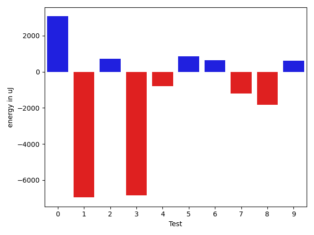

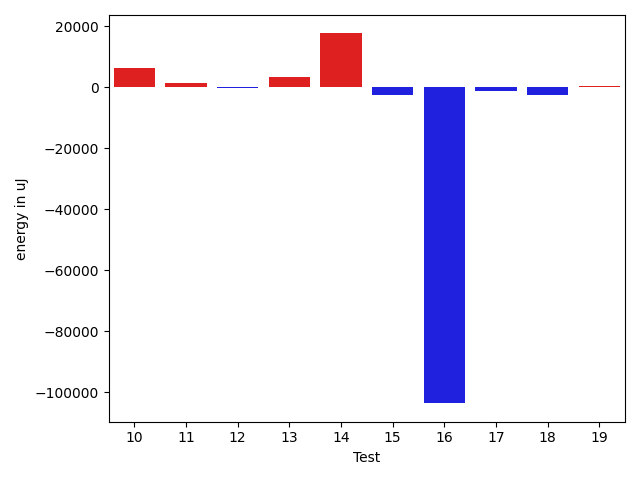

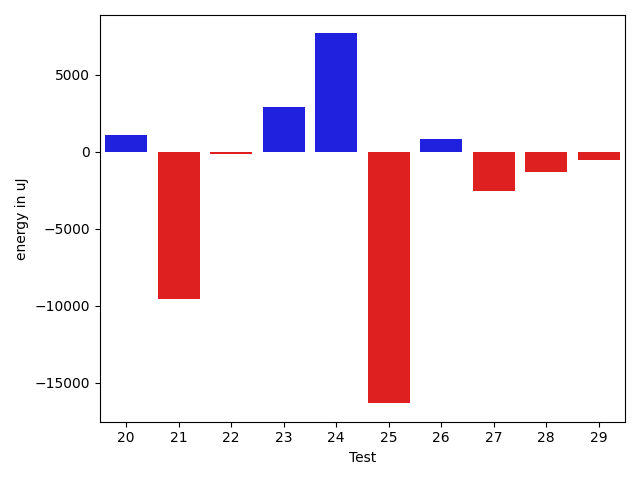

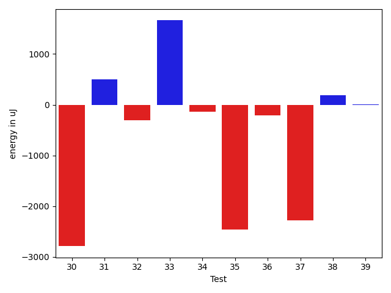

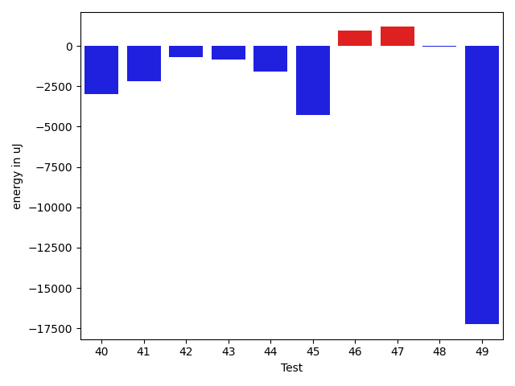

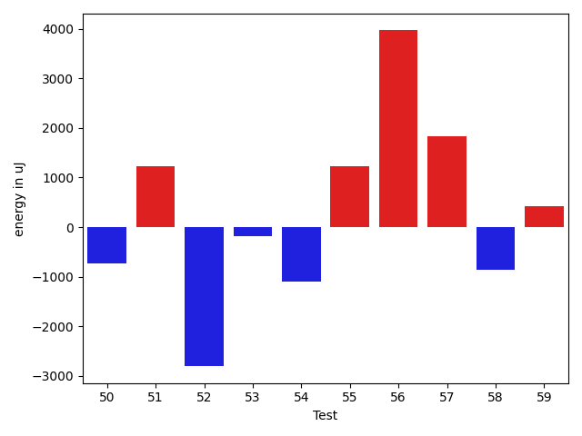

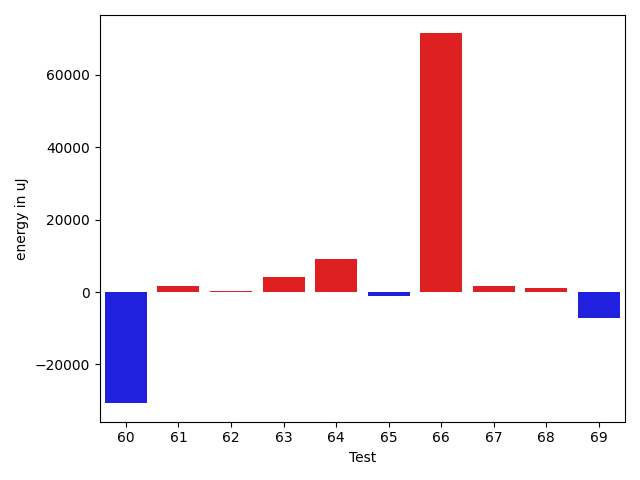

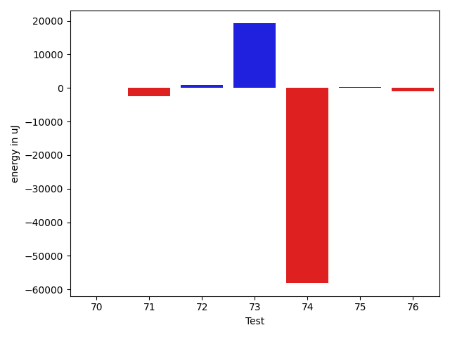

| ID | EnergyV1 | EnergyV2 | DeltaEnergy | σ |
| --- | --- | --- | --- | --- |
| 0 | 36976.09090909091 | 40043.357142857145 | 3067.266233766233 | 4402.5846221704705 | 3961.952986556892 |
| 1 | 70066.9696969697 | 63108.9081632653 | -6958.061533704393 | 78292.40111332634 | 45083.28764157733 |
| 2 | 37009.81481481482 | 37723.50793650794 | 713.6931216931189 | 4186.598009318827 | 5065.2042152316535 |
| 3 | 60862.79104477612 | 54007.159420289856 | -6855.631624486261 | 47826.68220868625 | 34144.70984790725 |
| 4 | 43977.90476190476 | 43171.83529411765 | -806.0694677871143 | 15940.809875628333 | 13672.430045939427 |
| 5 | 37379.88679245283 | 38228.31481481482 | 848.4280223619862 | 4184.996245170324 | 5019.7519631214855 |
| 6 | 37490.22 | 38125.11320754717 | 634.8932075471675 | 4954.046880238418 | 3529.4790553675753 |
| 7 | 39319.545454545456 | 38103.357142857145 | -1216.188311688311 | 4455.202944674565 | 5067.154486172164 |
| 8 | 42362.756097560974 | 40524.944444444445 | -1837.8116531165288 | 12782.414331245627 | 11490.43382866755 |
| 9 | 37224.04 | 37850.6875 | 626.6474999999991 | 5107.879109610954 | 3998.5185754447966 |
| 10 | 71141.4375 | 77539.72413793103 | 6398.286637931029 | 79472.42577798768 | 85288.00717483634 |
| 11 | 37831.53333333333 | 39238.83783783784 | 1407.3045045045073 | 4400.940049075374 | 4476.910605350304 |
| 12 | 37845.42857142857 | 37759.117647058825 | -86.31092436974723 | 4610.213089944312 | 4347.458652046873 |
| 13 | 87891.67676767676 | 91213.48484848485 | 3321.808080808085 | 24389.34346395146 | 24926.78854402342 |
| 14 | 46642.56140350877 | 64264.8125 | 17622.25109649123 | 22473.248984747177 | 140641.5262813074 |
| 15 | 43596.239130434784 | 41066.8 | -2529.439130434781 | 11922.022042139137 | 9163.572026235184 |
| 16 | 171726.306122449 | 68186.39622641509 | -103539.9098960339 | 386668.34542538953 | 188690.28866625912 |
| 17 | 43789.375 | 42726.80357142857 | -1062.5714285714275 | 15511.288401587797 | 12990.209638168226 |
| 18 | 57609.5918367347 | 55003.76530612245 | -2605.8265306122485 | 24215.26925050017 | 24662.5532856468 |
| 19 | 41451.24137931035 | 41806.153846153844 | 354.9124668434961 | 10724.537463396966 | 10159.291583768216 |
| 20 | 77529.71428571429 | 78645.6 | 1115.885714285716 | 177547.34890160934 | 152798.0491966657 |
| 21 | 54262.46153846154 | 44708.107142857145 | -9554.354395604394 | 30843.2850206314 | 14375.235695805097 |
| 22 | 38443.32142857143 | 38295.52173913043 | -147.79968944099528 | 4883.545455722948 | 4493.76826350104 |
| 23 | 37824.925 | 40727.58974358974 | 2902.6647435897394 | 4116.314925922821 | 4686.448826235111 |
| 24 | 52914.7323943662 | 60610.553846153845 | 7695.821451787648 | 33871.382718964756 | 39001.837843888155 |
| 25 | 75958.08333333333 | 59625.102040816324 | -16332.981292517004 | 121565.9664535462 | 63634.48994324167 |
| 26 | 38364.1186440678 | 39194.44262295082 | 830.3239788830178 | 4118.154494861831 | 4121.634513925272 |
| 27 | 40191.607142857145 | 37637.51724137931 | -2554.0899014778333 | 8403.206047775906 | 5086.051534856875 |
| 28 | 40856.16949152543 | 39558.746268656716 | -1297.4232228687106 | 9075.089324213788 | 8033.180426919422 |
| 29 | 38224.793103448275 | 37703.346153846156 | -521.4469496021193 | 4368.514569438989 | 4427.990809717964 |
| 30 | 38682.11538461538 | 35894.181818181816 | -2787.9335664335667 | 5414.8033938804 | 4939.655597456932 |
| 31 | 42898.708333333336 | 43392.921875 | 494.21354166666424 | 14190.985360370998 | 14111.759020964448 |
| 32 | 37888.692307692305 | 37586.882352941175 | -301.80995475113014 | 4120.4387907603195 | 4857.83746225505 |
| 33 | 37906.15094339623 | 39567.08888888889 | 1660.9379454926602 | 4121.103911443413 | 6692.821218198304 |
| 34 | 45182.51515151515 | 45043.8 | -138.71515151514905 | 19333.470006498956 | 15641.113304913522 |
| 35 | 56638.0 | 54172.90476190476 | -2465.0952380952367 | 39284.47677094181 | 33702.97347331998 |
| 36 | 37697.94117647059 | 37490.8125 | -207.12867647058738 | 2995.3823181413604 | 4535.4180791128565 |
| 37 | 38542.05263157895 | 36257.8 | -2284.2526315789437 | 3820.296619424703 | 4070.779883511266 |
| 38 | 36789.666666666664 | 36981.05 | 191.38333333333867 | 3773.6636402627714 | 4653.665861178691 |
| 39 | 36865.23809523809 | 36867.782608695656 | 2.5445134575638804 | 4628.805337025155 | 3886.53915520157 |
| 40 | 46490.67647058824 | 43510.12903225807 | -2980.54743833017 | 23280.71582652322 | 23509.439543740085 |
| 41 | 38696.21052631579 | 36496.44 | -2199.770526315784 | 6714.692292820098 | 4432.42532327393 |
| 42 | 37542.42857142857 | 36850.56 | -691.8685714285748 | 4203.055572992089 | 3841.8854337941934 |
| 43 | 36311.230769230766 | 35484.25 | -826.9807692307659 | 4815.324242678802 | 4685.039280785168 |
| 44 | 40136.5 | 38563.944444444445 | -1572.5555555555547 | 4631.196567842915 | 4855.857407665535 |
| 45 | 77360.63541666667 | 73089.07692307692 | -4271.55849358975 | 68079.34351520166 | 65907.63167139707 |
| 46 | 47202.53333333333 | 48160.04494382023 | 957.5116104868939 | 24252.970985565178 | 21725.411964085186 |
| 47 | 41933.40740740741 | 43105.95 | 1172.5425925925883 | 11684.889337688193 | 10949.99156837575 |
| 48 | 38268.944444444445 | 38235.5 | -33.44444444444525 | 4354.727564794409 | 4747.98420145568 |
| 49 | 169843.1313131313 | 152591.74747474748 | -17251.38383838383 | 378764.189282409 | 329003.91303317086 |
| 50 | 40344.1 | 40411.17283950617 | 67.0728395061742 | 7895.885510188204 | 8933.23469651201 |
| 51 | 38436.16923076923 | 40407.079365079364 | 1970.9101343101356 | 7329.481687140651 | 9994.54881788399 |
| 52 | 78936.12121212122 | 66771.66666666667 | -12164.454545454544 | 57240.93790538672 | 24456.19208943109 |
| 53 | 39932.40677966102 | 39343.22 | -589.1867796610168 | 4149.372814026782 | 5058.931398190729 |
| 54 | 62555.18918918919 | 54085.51898734177 | -8469.670201847417 | 53941.983744468744 | 33135.19162570852 |
| 55 | 36183.666666666664 | 38635.333333333336 | 2451.6666666666715 | 4567.229539520285 | 4816.095786238291 |
| 56 | 173800.52525252526 | 213845.67676767678 | 40045.15151515152 | 313137.52965344395 | 387163.9021880935 |
| 57 | 40862.913043478264 | 46274.642857142855 | 5411.729813664591 | 13253.106031066809 | 21187.72030347208 |
| 58 | 39462.3 | 37575.5641025641 | -1886.7358974359013 | 8894.897158483622 | 8081.445392410088 |
| 59 | 36991.642857142855 | 37849.78947368421 | 858.1466165413585 | 4865.91537329494 | 5157.293895455225 |
| 60 | 122641.14925373135 | 91915.65 | -30725.499253731352 | 326163.7494440646 | 194741.86490384518 |
| 61 | 37138.97435897436 | 38664.89189189189 | 1525.9175329175341 | 4068.5544682209916 | 4688.504687480738 |
| 62 | 38052.10344827586 | 38225.94594594595 | 173.8424976700844 | 4494.183753473828 | 4185.233403972448 |
| 63 | 648674.4747474748 | 652754.5858585859 | 4080.111111111124 | 116965.17020851088 | 132852.9137102884 |
| 64 | 242636.9090909091 | 251680.65656565657 | 9043.747474747477 | 88672.15787724969 | 84443.8510775731 |
| 65 | 42453.063829787236 | 41436.92857142857 | -1016.1352583586631 | 11933.721638485706 | 11385.050146056947 |
| 66 | 154687.26388888888 | 226111.83582089553 | 71424.57193200666 | 395750.74368720024 | 509569.2439349492 |
| 67 | 37353.2 | 39095.307692307695 | 1742.107692307698 | 4197.923791590315 | 4603.1100921779025 |
| 68 | 38470.4 | 39614.57142857143 | 1144.171428571426 | 4653.219244780972 | 5445.373803876606 |
| 69 | 52304.52 | 45118.444444444445 | -7186.075555555552 | 22765.520982608767 | 14993.810127375978 |
| 70 | 35783.90476190476 | 35857.9 | 73.99523809523816 | 3580.7617692430426 | 4717.776053396346 |
| 71 | 44214.01351351351 | 41796.536231884056 | -2417.477281629457 | 17093.857726865048 | 12038.741664201574 |
| 72 | 37658.60344827586 | 38478.955882352944 | 820.3524340770819 | 4683.796205480216 | 3974.965724727638 |
| 73 | 81747.0 | 100919.63157894737 | 19172.631578947374 | 197823.32704714072 | 237918.7772860421 |
| 74 | 103403.44444444444 | 45282.69565217391 | -58120.748792270526 | 264836.7190277021 | 18852.343757958635 |
| 75 | 37875.09090909091 | 38127.92307692308 | 252.8321678321663 | 4471.485180452717 | 4455.653011996515 |
| 76 | 49776.38461538462 | 48691.55263157895 | -1084.8319838056705 | 23082.307128849414 | 21700.655720989496 |

## Delta Duration per test method

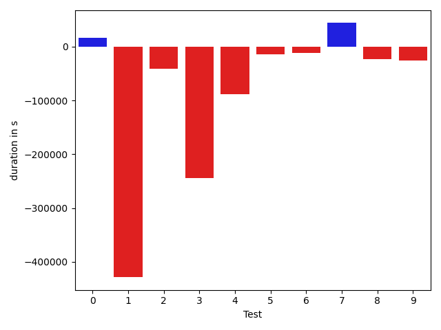

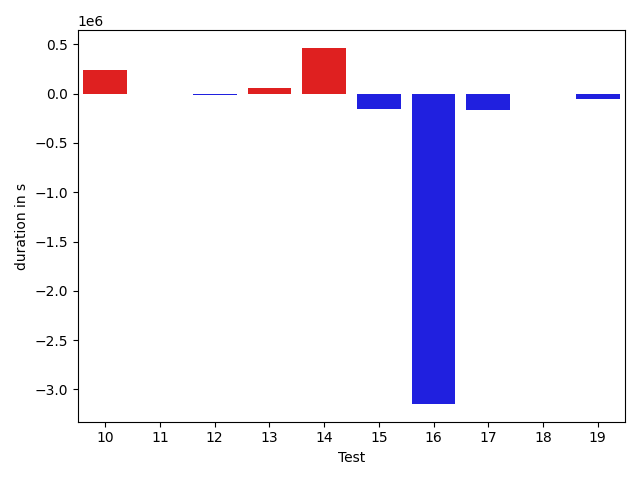

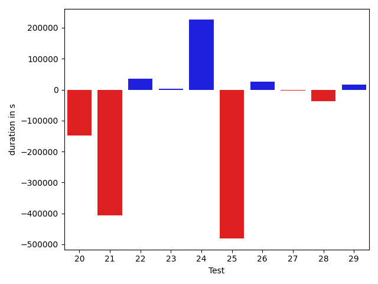

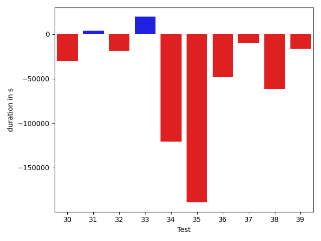

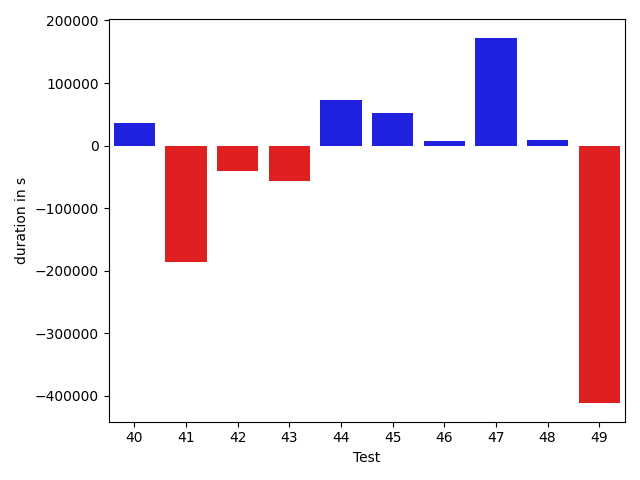

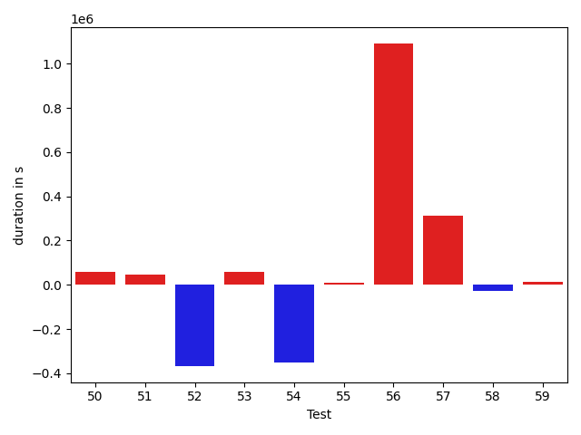

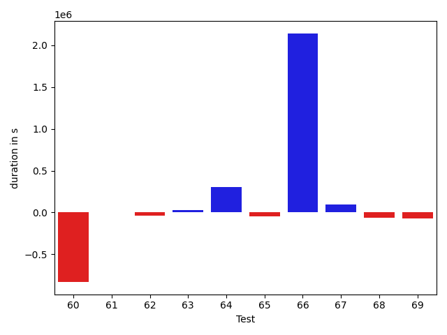

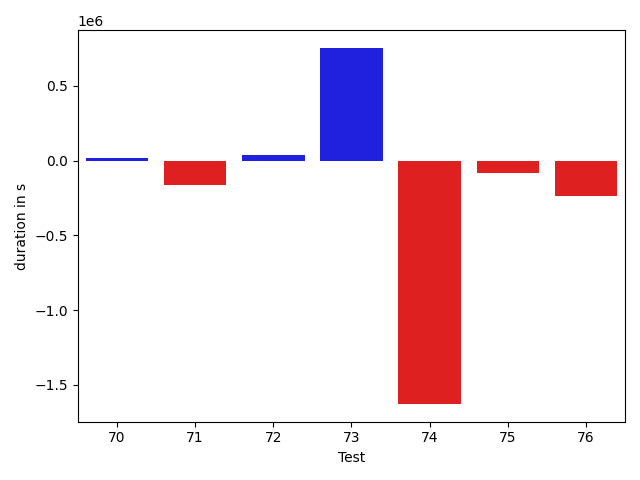

| ID | DurationV1 | DurationsV2 | DeltaDuration |
| --- | --- | --- | --- |
| 0 | 804874.4318181818 | 821098.2857142857 | 16223.853896103916 |
| 1 | 2325881.404040404 | 1897402.081632653 | -428479.3224077511 |
| 2 | 930633.3888888889 | 890193.8095238095 | -40439.57936507941 |
| 3 | 1744937.7164179105 | 1501268.2173913044 | -243669.4990266061 |
| 4 | 1341622.0714285714 | 1253027.0823529412 | -88594.9890756302 |
| 5 | 836600.3962264151 | 821855.6481481482 | -14744.748078266857 |
| 6 | 850813.8 | 839614.1698113207 | -11199.630188679323 |
| 7 | 681456.1212121212 | 725466.0 | 44009.878787878784 |
| 8 | 1079620.4146341463 | 1056932.8148148148 | -22687.59981933143 |
| 9 | 894868.62 | 869370.1666666666 | -25498.453333333367 |
| 10 | 1935446.0416666667 | 2172730.4482758623 | 237284.40660919552 |
| 11 | 714468.5333333333 | 708371.4054054054 | -6097.127927927882 |
| 12 | 780364.3469387755 | 761750.8627450981 | -18613.484193677432 |
| 13 | 2663940.4444444445 | 2720255.6363636362 | 56315.19191919174 |
| 14 | 1215687.50877193 | 1679278.5625 | 463591.0537280701 |
| 15 | 1055414.1956521738 | 898475.66 | -156938.5356521738 |
| 16 | 4857464.204081632 | 1709958.9433962265 | -3147505.2606854057 |
| 17 | 1299422.4107142857 | 1136633.625 | -162788.78571428568 |
| 18 | 1822232.3775510204 | 1819047.2142857143 | -3185.163265306037 |
| 19 | 1143334.0 | 1087996.8 | -55337.19999999995 |
| 20 | 1894007.892857143 | 1745624.1666666667 | -148383.7261904762 |
| 21 | 1277535.3846153845 | 871237.7857142857 | -406297.5989010988 |
| 22 | 499199.9285714286 | 533900.304347826 | 34700.37577639747 |
| 23 | 627514.825 | 630498.3846153846 | 2983.559615384671 |
| 24 | 1463372.9295774647 | 1689130.4923076923 | 225757.5627302276 |
| 25 | 2012577.6875 | 1531201.9387755103 | -481375.7487244897 |
| 26 | 902655.406779661 | 929336.655737705 | 26681.248958043987 |
| 27 | 956596.5892857143 | 953458.1206896552 | -3138.4685960591305 |
| 28 | 1103474.779661017 | 1066160.2835820895 | -37314.496078927536 |
| 29 | 547140.2413793104 | 562902.2307692308 | 15761.989389920374 |
| 30 | 585446.4230769231 | 555372.4090909091 | -30074.013986014063 |
| 31 | 1082904.4583333333 | 1086842.234375 | 3937.7760416667443 |
| 32 | 585569.8846153846 | 566726.5 | -18843.384615384624 |
| 33 | 825450.5660377359 | 844901.2666666667 | 19450.70062893082 |
| 34 | 1147218.393939394 | 1026491.0285714286 | -120727.36536796542 |
| 35 | 1292882.6666666667 | 1103796.9047619049 | -189085.7619047619 |
| 36 | 540375.6470588235 | 492695.8125 | -47679.834558823495 |
| 37 | 453155.05263157893 | 443089.3 | -10065.752631578944 |
| 38 | 505394.3333333333 | 444121.2 | -61273.1333333333 |
| 39 | 640650.619047619 | 624159.9565217391 | -16490.662525879918 |
| 40 | 1029296.7352941176 | 1064783.1612903227 | 35486.42599620507 |
| 41 | 797460.0 | 612190.56 | -185269.43999999994 |
| 42 | 473798.6666666667 | 432886.56 | -40912.10666666669 |
| 43 | 494434.6923076923 | 437623.8125 | -56810.87980769231 |
| 44 | 426655.0 | 498905.1666666667 | 72250.16666666669 |
| 45 | 2393872.7708333335 | 2445797.5164835164 | 51924.745650182944 |
| 46 | 1490108.2 | 1496974.6853932585 | 6866.48539325851 |
| 47 | 791467.7407407408 | 964082.2 | 172614.45925925917 |
| 48 | 484364.5 | 493844.8181818182 | 9480.318181818177 |
| 49 | 4966672.02020202 | 4554679.353535353 | -411992.666666667 |
| 50 | 1109688.6375 | 1167576.4074074074 | 57887.76990740746 |
| 51 | 1077535.1230769232 | 1121670.0952380951 | 44134.97216117196 |
| 52 | 2443717.1616161615 | 2076070.5656565656 | -367646.59595959587 |
| 53 | 906136.1694915254 | 964415.06 | 58278.890508474666 |
| 54 | 1877123.1081081082 | 1525851.1392405063 | -351271.9688676018 |
| 55 | 523431.55555555556 | 532365.4 | 8933.844444444461 |
| 56 | 5081022.5050505055 | 6172296.97979798 | 1091274.4747474743 |
| 57 | 862293.0652173914 | 1176029.4761904762 | 313736.41097308486 |
| 58 | 863430.95 | 836816.1282051282 | -26614.821794871707 |
| 59 | 669237.4761904762 | 681983.1052631579 | 12745.629072681651 |
| 60 | 3345342.8358208956 | 2514193.35 | -831149.4858208955 |
| 61 | 789984.5128205129 | 792455.6216216217 | 2471.108801108785 |
| 62 | 645806.0 | 608468.7837837838 | -37337.21621621621 |
| 63 | 17413114.222222224 | 17440837.17171717 | 27722.949494946748 |
| 64 | 6477746.717171717 | 6784922.3838383835 | 307175.66666666605 |
| 65 | 1009020.1063829787 | 959625.5476190476 | -49394.558763931156 |
| 66 | 4610700.583333333 | 6752258.149253732 | 2141557.5659203986 |
| 67 | 440844.1 | 533234.3846153846 | 92390.28461538465 |
| 68 | 556516.3 | 492606.2380952381 | -63910.06190476194 |
| 69 | 1261732.68 | 1193833.111111111 | -67899.56888888893 |
| 70 | 523840.90476190473 | 542788.3 | 18947.395238095312 |
| 71 | 1251302.7837837837 | 1089455.2753623188 | -161847.50842146482 |
| 72 | 917159.7586206896 | 952218.8235294118 | 35059.06490872218 |
| 73 | 1762702.7307692308 | 2515896.0 | 753193.2692307692 |
| 74 | 2397667.722222222 | 769275.8260869565 | -1628391.8961352655 |
| 75 | 551876.9090909091 | 468734.76923076925 | -83142.13986013981 |
| 76 | 1428740.4615384615 | 1194596.0263157894 | -234144.43522267207 |

## Misc.

| ID | Test Class | Test Method |
| --- | --- | --- |
| 0 | com.google.gson.functional.CustomDeserializerTest | testDefaultConstructorNotCalledOnField |
| 1 | com.google.gson.functional.CustomDeserializerTest | testDefaultConstructorNotCalledOnObject |
| 2 | com.google.gson.functional.CustomDeserializerTest | testCustomDeserializerReturnsNullForArrayElementsForArrayField |
| 3 | com.google.gson.functional.CustomDeserializerTest | testCustomDeserializerReturnsNull |
| 4 | com.google.gson.functional.CustomDeserializerTest | testJsonTypeFieldBasedDeserialization |
| 5 | com.google.gson.functional.CustomDeserializerTest | testCustomDeserializerReturnsNullForArrayElements |
| 6 | com.google.gson.functional.CustomDeserializerTest | testCustomDeserializerReturnsNullForTopLevelObject |
| 7 | com.google.gson.functional.JsonParserTest | testBadTypeForDeserializingCustomTree |
| 8 | com.google.gson.functional.JsonParserTest | testChangingCustomTreeAndDeserializing |
| 9 | com.google.gson.functional.JsonParserTest | testBadFieldTypeForDeserializingCustomTree |
| 10 | com.google.gson.functional.JsonParserTest | testDeserializingCustomTree |
| 11 | com.google.gson.functional.JsonParserTest | testBadFieldTypeForCustomDeserializerCustomTree |
| 12 | com.google.gson.functional.CustomTypeAdaptersTest | testCustomTypeAdapterAppliesToSubClassesSerializedAsBaseClass |
| 13 | com.google.gson.functional.CustomTypeAdaptersTest | testCustomTypeAdapterDoesNotAppliesToSubClasses |
| 14 | com.google.gson.functional.CustomTypeAdaptersTest | testCustomDeserializers |
| 15 | com.google.gson.functional.CustomTypeAdaptersTest | testEnsureCustomSerializerNotInvokedForNullValues |
| 16 | com.google.gson.functional.CustomTypeAdaptersTest | testCustomSerializers |
| 17 | com.google.gson.functional.ReadersWritersTest | testReadWriteTwoObjects |
| 18 | com.google.gson.functional.MapTest | testInterfaceTypeMapWithSerializer |
| 19 | com.google.gson.functional.MapTest | testMapNamePromotionWithJsonElementReader |
| 20 | com.google.gson.internal.bind.JsonElementReaderTest | testObject |
| 21 | com.google.gson.internal.bind.JsonElementReaderTest | testNestedObjects |
| 22 | com.google.gson.internal.bind.JsonElementReaderTest | testSkipValue |
| 23 | com.google.gson.functional.JsonTreeTest | testJsonTreeNull |
| 24 | com.google.gson.functional.JsonTreeTest | testJsonTreeToString |
| 25 | com.google.gson.functional.JsonTreeTest | testToJsonTree |
| 26 | com.google.gson.functional.JsonTreeTest | testToJsonTreeObjectType |
| 27 | com.google.gson.functional.InheritanceTest | testClassWithBaseArrayFieldSerialization |
| 28 | com.google.gson.functional.InheritanceTest | testClassWithBaseCollectionFieldSerialization |
| 29 | com.google.gson.functional.InheritanceTest | testBaseSerializedAsBaseWhenSpecifiedWithExplicitType |
| 30 | com.google.gson.functional.InheritanceTest | testBaseSerializedAsSubWhenSpecifiedWithExplicitType |
| 31 | com.google.gson.functional.InheritanceTest | testClassWithBaseFieldSerialization |
| 32 | com.google.gson.functional.InheritanceTest | testBaseSerializedAsSub |
| 33 | com.google.gson.functional.NullObjectAndFieldTest | testCustomTypeAdapterPassesNullDesrialization |
| 34 | com.google.gson.functional.NullObjectAndFieldTest | testCustomSerializationOfNulls |
| 35 | com.google.gson.JsonObjectTest | testAddingAndRemovingObjectProperties |
| 36 | com.google.gson.JsonObjectTest | testAddingBooleanProperties |
| 37 | com.google.gson.JsonObjectTest | testAddingNullOrEmptyPropertyName |
| 38 | com.google.gson.JsonObjectTest | testEqualsNonEmptyObject |
| 39 | com.google.gson.JsonObjectTest | testAddingCharacterProperties |
| 40 | com.google.gson.JsonObjectTest | testReadPropertyWithEmptyStringName |
| 41 | com.google.gson.JsonObjectTest | testPropertyWithQuotes |
| 42 | com.google.gson.JsonObjectTest | testWritePropertyWithEmptyStringName |
| 43 | com.google.gson.JsonObjectTest | testAddingStringProperties |
| 44 | com.google.gson.JsonObjectTest | testAddingNullPropertyValue |
| 45 | com.google.gson.functional.ParameterizedTypesTest | testParameterizedTypeWithCustomSerializer |
| 46 | com.google.gson.functional.ParameterizedTypesTest | testParameterizedTypesWithCustomDeserializer |
| 47 | com.google.gson.functional.PrintFormattingTest | testJsonObjectWithNullValues |
| 48 | com.google.gson.functional.PrintFormattingTest | testJsonObjectWithNullValuesSerialized |
| 49 | com.google.gson.functional.MapAsArrayTypeAdapterTest | testSerializeComplexMapWithTypeAdapter |
| 50 | com.google.gson.functional.MapAsArrayTypeAdapterTest | testMapWithTypeVariableSerialization |
| 51 | com.google.gson.functional.MapAsArrayTypeAdapterTest | testMultipleEnableComplexKeyRegistrationHasNoEffect |
| 52 | com.google.gson.functional.UncategorizedTest | testReturningDerivedClassesDuringDeserialization |
| 53 | com.google.gson.DefaultMapJsonSerializerTest | testNonEmptyMapSerialization |
| 54 | com.google.gson.ObjectTypeAdapterTest | testDeserialize |
| 55 | com.google.gson.ObjectTypeAdapterTest | testDeserializeNullValue |
| 56 | com.google.gson.functional.TypeHierarchyAdapterTest | testTypeHierarchy |
| 57 | com.google.gson.functional.ExclusionStrategyFunctionalTest | testExclusionStrategyDeserialization |
| 58 | com.google.gson.functional.ExclusionStrategyFunctionalTest | testExclusionStrategyWithMode |
| 59 | com.google.gson.functional.CustomSerializerTest | testBaseClassSerializerInvokedForBaseClassFieldsHoldingSubClassInstances |
| 60 | com.google.gson.functional.CustomSerializerTest | testSubClassSerializerInvokedForBaseClassFieldsHoldingSubClassInstances |
| 61 | com.google.gson.functional.CustomSerializerTest | testSubClassSerializerInvokedForBaseClassFieldsHoldingArrayOfSubClassInstances |
| 62 | com.google.gson.functional.CustomSerializerTest | testBaseClassSerializerInvokedForBaseClassFields |
| 63 | com.google.gson.internal.StringMapTest | testFallbackFromTooManyCollisions |
| 64 | com.google.gson.functional.CircularReferenceTest | testSelfReferenceCustomHandlerSerialization |
| 65 | com.google.gson.functional.CollectionTest | testRawCollectionOfBagOfPrimitivesNotAllowed |
| 66 | com.google.gson.JsonParserTest | testReadWriteTwoObjects |
| 67 | com.google.gson.JsonParserTest | testParseString |
| 68 | com.google.gson.JsonParserTest | testParseReader |
| 69 | com.google.gson.functional.DefaultTypeAdaptersTest | testJsonObjectSerialization |
| 70 | com.google.gson.functional.DefaultTypeAdaptersTest | testJsonObjectDeerialization |
| 71 | com.google.gson.functional.MoreSpecificTypeSerializationTest | testMapOfSubclassFields |
| 72 | com.google.gson.functional.MoreSpecificTypeSerializationTest | testMapOfParameterizedSubclassFields |
| 73 | com.google.gson.internal.bind.JsonTreeWriterTest | testNestedObject |
| 74 | com.google.gson.internal.bind.JsonTreeWriterTest | testObject |
| 75 | com.google.gson.internal.bind.JsonTreeWriterTest | testSerializeNullsTrue |
| 76 | com.google.gson.functional.StreamingTypeAdaptersTest | testFromJsonTree |

| Test | IterationV1 | IterationV2 | DeltaIteration |
| --- | --- | --- | --- |
| 0 | 44 | 42 | -2 |
| 1 | 99 | 98 | -1 |
| 2 | 54 | 63 | 9 |
| 3 | 67 | 69 | 2 |
| 4 | 84 | 85 | 1 |
| 5 | 53 | 54 | 1 |
| 6 | 50 | 53 | 3 |
| 7 | 33 | 28 | -5 |
| 8 | 41 | 54 | 13 |
| 9 | 50 | 48 | -2 |
| 10 | 48 | 58 | 10 |
| 11 | 30 | 37 | 7 |
| 12 | 49 | 51 | 2 |
| 13 | 99 | 99 | 0 |
| 14 | 57 | 48 | -9 |
| 15 | 46 | 50 | 4 |
| 16 | 49 | 53 | 4 |
| 17 | 56 | 56 | 0 |
| 18 | 98 | 98 | 0 |
| 19 | 58 | 65 | 7 |
| 20 | 28 | 30 | 2 |
| 21 | 26 | 28 | 2 |
| 22 | 28 | 23 | -5 |
| 23 | 40 | 39 | -1 |
| 24 | 71 | 65 | -6 |
| 25 | 48 | 49 | 1 |
| 26 | 59 | 61 | 2 |
| 27 | 56 | 58 | 2 |
| 28 | 59 | 67 | 8 |
| 29 | 29 | 26 | -3 |
| 30 | 26 | 22 | -4 |
| 31 | 48 | 64 | 16 |
| 32 | 26 | 34 | 8 |
| 33 | 53 | 45 | -8 |
| 34 | 33 | 35 | 2 |
| 35 | 24 | 21 | -3 |
| 36 | 17 | 16 | -1 |
| 37 | 19 | 20 | 1 |
| 38 | 21 | 20 | -1 |
| 39 | 21 | 23 | 2 |
| 40 | 34 | 31 | -3 |
| 41 | 19 | 25 | 6 |
| 42 | 21 | 25 | 4 |
| 43 | 13 | 16 | 3 |
| 44 | 10 | 18 | 8 |
| 45 | 96 | 91 | -5 |
| 46 | 90 | 89 | -1 |
| 47 | 27 | 20 | -7 |
| 48 | 18 | 22 | 4 |
| 49 | 99 | 99 | 0 |
| 50 | 80 | 81 | 1 |
| 51 | 65 | 63 | -2 |
| 52 | 99 | 99 | 0 |
| 53 | 59 | 50 | -9 |
| 54 | 74 | 79 | 5 |
| 55 | 18 | 15 | -3 |
| 56 | 99 | 99 | 0 |
| 57 | 46 | 42 | -4 |
| 58 | 40 | 39 | -1 |
| 59 | 42 | 38 | -4 |
| 60 | 67 | 60 | -7 |
| 61 | 39 | 37 | -2 |
| 62 | 29 | 37 | 8 |
| 63 | 99 | 99 | 0 |
| 64 | 99 | 99 | 0 |
| 65 | 47 | 42 | -5 |
| 66 | 72 | 67 | -5 |
| 67 | 10 | 13 | 3 |
| 68 | 20 | 21 | 1 |
| 69 | 25 | 18 | -7 |
| 70 | 21 | 10 | -11 |
| 71 | 74 | 69 | -5 |
| 72 | 58 | 68 | 10 |
| 73 | 26 | 19 | -7 |
| 74 | 18 | 23 | 5 |
| 75 | 11 | 13 | 2 |
| 76 | 26 | 38 | 12 |

| Time Label | Time (s) |
| --- | --- |
| Selection | 26.274558305740356 |
| Injection | 13.661790132522583 |
| Total | 1049.4658522605896 |

