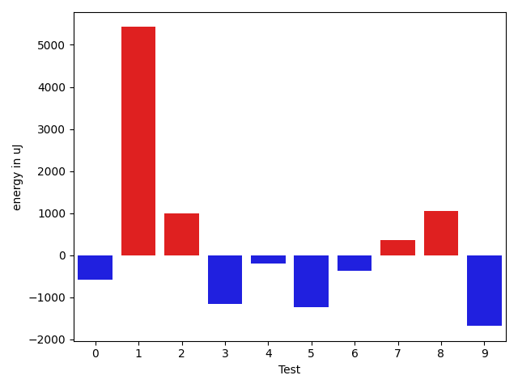
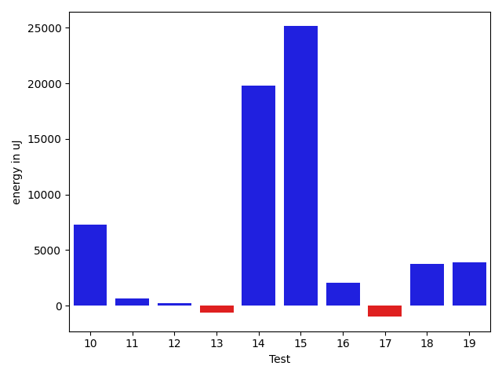
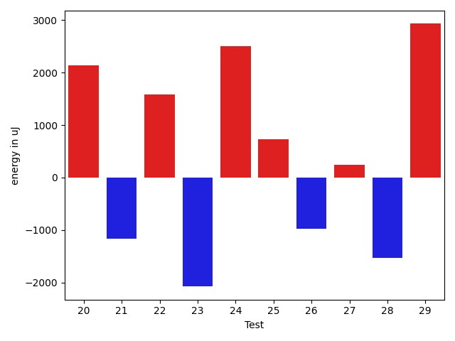
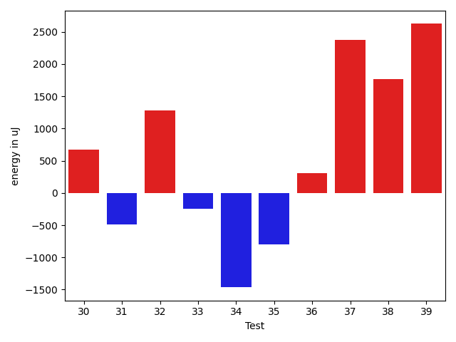
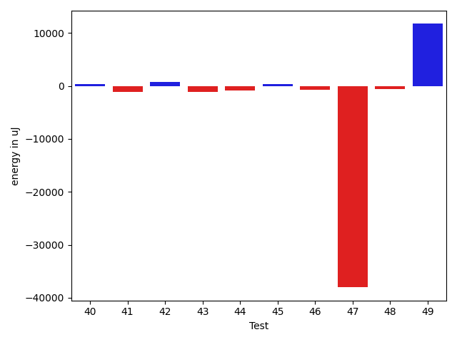
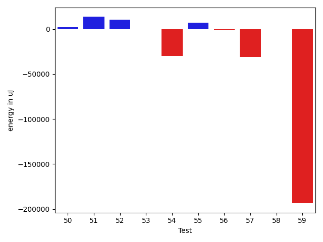
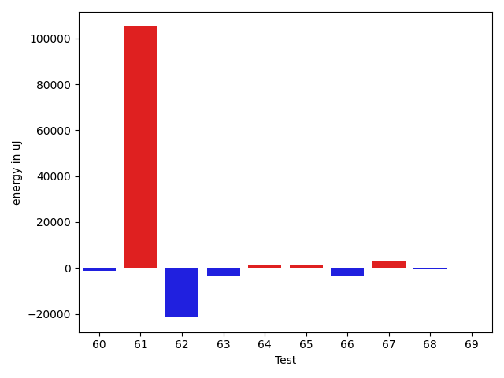
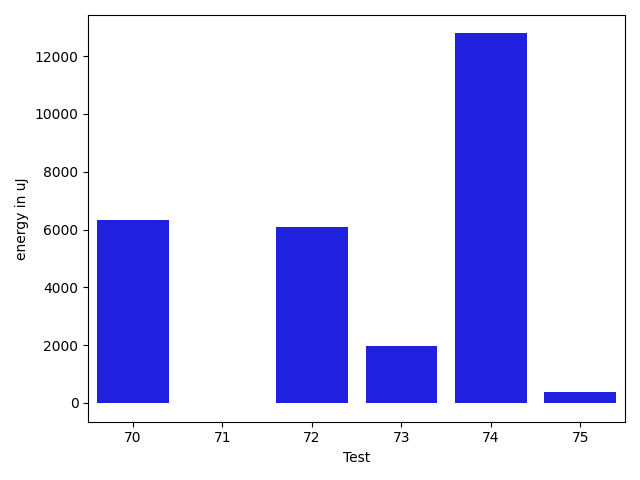

# gson 4aaa4b

https://github.com/google/gson/commit/4aaa4b

## Delta Energy per test method

| ID | EnergyV1 | EnergyV2 | DeltaEnergy | σV1 | σV2 |
| --- | --- | --- | --- | --- | --- |
| 0 | 38574 | 38391 | -183 | 4443.247055130493 | 4828.935103322342 |
| 1 | 44373 | 42969 | -1404 | 67423.8029472425 | 82546.55662052981 |
| 2 | 40832 | 40283 | -549 | 46095.954940826065 | 40873.34571098108 |
| 3 | 40955 | 37781 | -3174 | 13972.060062458066 | 16982.522382389892 |
| 4 | 37232 | 37536 | 304 | 4437.156121146651 | 4735.407865199777 |
| 5 | 37598 | 36865 | -733 | 4884.765152722405 | 4110.988519808831 |
| 6 | 37659 | 37414 | -245 | 3922.008304553613 | 4779.689955575421 |
| 7 | 37109 | 37842 | 733 | 3954.8606987090925 | 4634.523500467862 |
| 8 | 38391 | 38330 | -61 | 7214.252726286762 | 9452.895093123587 |
| 9 | 38819 | 37841 | -978 | 5706.907423898907 | 4613.343334285884 |
| 10 | 40344 | 40222 | -122 | 47836.65515885689 | 60444.527006052 |
| 11 | 36438 | 36926 | 488 | 3485.7938424729336 | 4663.788922348675 |
| 12 | 38636 | 37964 | -672 | 4009.3255324460706 | 5358.631884266498 |
| 13 | 82276 | 83801 | 1525 | 26387.570428871604 | 24852.40610426502 |
| 14 | 38574 | 39368 | 794 | 22714.252727321746 | 155202.08882394328 |
| 15 | 39001 | 39795 | 794 | 11677.633023886492 | 161292.25050342878 |
| 16 | 41137 | 40528 | -609 | 11844.44310950342 | 18192.76262322733 |
| 17 | 39673 | 39184 | -489 | 16439.833692746277 | 12844.605044704098 |
| 18 | 41442 | 44007 | 2565 | 23706.779278992737 | 23952.70019914497 |
| 19 | 37170 | 39978 | 2808 | 9905.756059020758 | 15142.833117353512 |
| 20 | 35767 | 37902 | 2135 | 4254.452389473588 | 5073.003183229058 |
| 21 | 40222 | 39062 | -1160 | 5071.242638219118 | 4944.873369460537 |
| 22 | 42236 | 43823 | 1587 | 41113.55130769458 | 32689.720227944978 |
| 23 | 39246 | 37170 | -2076 | 32910.308590541834 | 24073.696137926367 |
| 24 | 36499 | 39002 | 2503 | 6817.837711468157 | 8210.604572678487 |
| 25 | 36316 | 37048 | 732 | 4042.548943325693 | 3778.131953919091 |
| 26 | 39123 | 38147 | -976 | 4869.268755149642 | 4611.492131050479 |
| 27 | 39429 | 39673 | 244 | 4849.68501870093 | 3577.4523428420575 |
| 28 | 39245 | 37720 | -1525 | 3505.284941562091 | 4388.690441585108 |
| 29 | 35400 | 38330 | 2930 | 4451.365403916384 | 5119.807620957487 |
| 30 | 38330 | 39001 | 671 | 17212.26831611718 | 4738.7493430761 |
| 31 | 41687 | 41199 | -488 | 10451.327752286514 | 7169.5386906677795 |
| 32 | 38818 | 40100 | 1282 | 4302.254942178578 | 4605.751298949801 |
| 33 | 43517 | 43274 | -243 | 430634.8339805788 | 206855.19667331243 |
| 34 | 37963 | 36499 | -1464 | 4062.5810205430307 | 3545.1656473468242 |
| 35 | 40161 | 39368 | -793 | 5230.441413016687 | 4298.114768075221 |
| 36 | 36987 | 37293 | 306 | 3676.092684224703 | 4963.226401462542 |
| 37 | 39429 | 41809 | 2380 | 35023.09404802333 | 38680.42126653922 |
| 38 | 37598 | 39368 | 1770 | 4413.491499257584 | 6477.661554658546 |
| 39 | 38696 | 41320 | 2624 | 86844.6485395522 | 152356.90232580676 |
| 40 | 38757 | 37781 | -976 | 4524.134726463543 | 6245.150666914211 |
| 41 | 38757 | 37842 | -915 | 12884.964251707555 | 13956.445663156332 |
| 42 | 40100 | 39673 | -427 | 9940.32283998175 | 12814.226281744917 |
| 43 | 39002 | 35949 | -3053 | 4161.28346066451 | 4839.846149206733 |
| 44 | 38086 | 36682 | -1404 | 3704.8792350350336 | 5234.001820142446 |
| 45 | 37781 | 37170 | -611 | 4050.88090547004 | 4744.969911304357 |
| 46 | 39001 | 38025 | -976 | 9220.867056248924 | 7951.901684994742 |
| 47 | 85388 | 84960 | -428 | 471762.59551407286 | 399483.53380707226 |
| 48 | 38208 | 38452 | 244 | 9789.551702592049 | 9160.541356421481 |
| 49 | 41137 | 69213 | 28076 | 24981.231629101363 | 32735.814640298 |
| 50 | 39185 | 40039 | 854 | 23239.336881651805 | 49689.42786271638 |
| 51 | 73852 | 77942 | 4090 | 34080.69106043211 | 72840.23759384145 |
| 52 | 39429 | 40588 | 1159 | 29160.148040462827 | 42395.968538372385 |
| 53 | 37475 | 37415 | -60 | 4198.439302952766 | 4510.905657951029 |
| 54 | 122863 | 112304 | -10559 | 365149.64200379106 | 307061.81270467385 |
| 55 | 40284 | 40466 | 182 | 168999.15833312768 | 207645.8876742075 |
| 56 | 39489 | 39551 | 62 | 3882.0497195027474 | 3688.181733591771 |
| 57 | 38452 | 39002 | 550 | 166089.30683398058 | 3664.557650431131 |
| 58 | 38513 | 38147 | -366 | 4268.266599560289 | 4764.01354916702 |
| 59 | 44251 | 39123 | -5128 | 521304.0232812423 | 4474.573899768282 |
| 60 | 38269 | 35766 | -2503 | 4337.8368600364765 | 4674.166541105964 |
| 61 | 36866 | 44250 | 7384 | 4527.967986570681 | 406985.28266625624 |
| 62 | 252319 | 248413 | -3906 | 96351.80486774661 | 80832.6973786513 |
| 63 | 38330 | 37110 | -1220 | 15049.38758686186 | 5121.381995538389 |
| 64 | 39245 | 40100 | 855 | 8057.3580493364325 | 11243.088053699224 |
| 65 | 36926 | 37842 | 916 | 6053.922769812739 | 7302.131327166878 |
| 66 | 40161 | 37475 | -2686 | 16456.289354449797 | 8267.651182554142 |
| 67 | 39123 | 39917 | 794 | 13327.404212021644 | 17495.35425710486 |
| 68 | 37293 | 37414 | 121 | 4568.436023215903 | 2845.962260044143 |
| 69 | 39123 | 38208 | -915 | 4268.481394469297 | 5796.96190961161 |
| 70 | 38513 | 40649 | 2136 | 14744.965296300305 | 24366.245579426526 |
| 71 | 40832 | 39856 | -976 | 5238.929242509837 | 5375.060913726718 |
| 72 | 40833 | 42725 | 1892 | 15255.289181756765 | 19836.591402794107 |
| 73 | 38086 | 41321 | 3235 | 4176.118264608894 | 4252.418368925499 |
| 74 | 38330 | 41137 | 2807 | 3647.781735652935 | 24862.4879511503 |
| 75 | 37964 | 38513 | 549 | 3900.064156323643 | 5753.3685579237645 |

## Delta Duration per test method

| ID | DurationV1 | DurationsV2 | DeltaDuration |
| --- | --- | --- | --- |
| 0 | 753376.2156862745 | 755012.1111111111 | 1635.8954248366645 |
| 1 | 2124112.9595959596 | 2302817.494949495 | 178704.53535353532 |
| 2 | 1659936.6666666667 | 1791251.953125 | 131315.28645833326 |
| 3 | 1288665.012987013 | 1324194.5411764707 | 35529.52818945772 |
| 4 | 895107.3770491803 | 908201.1571428571 | 13093.78009367676 |
| 5 | 804642.5918367347 | 837705.8 | 33063.20816326537 |
| 6 | 761089.3414634146 | 860492.1428571428 | 99402.80139372824 |
| 7 | 770599.5882352941 | 715610.7777777778 | -54988.810457516345 |
| 8 | 985738.0677966102 | 1043619.48 | 57881.4122033898 |
| 9 | 836873.4468085107 | 866314.94 | 29441.49319148925 |
| 10 | 1520162.862745098 | 1856346.391304348 | 336183.5285592498 |
| 11 | 687696.0 | 674440.0333333333 | -13255.966666666674 |
| 12 | 818639.5818181818 | 804003.0 | -14636.581818181789 |
| 13 | 2738841.606060606 | 2718653.474747475 | -20188.13131313119 |
| 14 | 1088052.440677966 | 1673853.6984126985 | 585801.2577347325 |
| 15 | 1034032.5238095238 | 1840136.981818182 | 806104.4580086581 |
| 16 | 1086385.0714285714 | 1073130.255319149 | -13254.816109422361 |
| 17 | 1226629.7205882352 | 1207903.3076923077 | -18726.41289592744 |
| 18 | 1880770.686868687 | 1872187.888888889 | -8582.797979797935 |
| 19 | 1221007.4727272727 | 1215732.0757575757 | -5275.3969696969725 |
| 20 | 500166.1818181818 | 465464.38095238095 | -34701.80086580088 |
| 21 | 554760.5238095238 | 544541.05 | -10219.47380952374 |
| 22 | 1633899.9130434783 | 1225794.705882353 | -408105.20716112526 |
| 23 | 1462638.3333333333 | 1091314.65625 | -371323.67708333326 |
| 24 | 921418.2272727273 | 690773.6 | -230644.62727272732 |
| 25 | 485499.28571428574 | 452122.28571428574 | -33377.0 |
| 26 | 458775.5 | 469022.23529411765 | 10246.73529411765 |
| 27 | 495702.64285714284 | 463051.95238095237 | -32650.690476190473 |
| 28 | 506715.04761904763 | 499841.73913043475 | -6873.308488612878 |
| 29 | 694464.1904761905 | 693903.1304347826 | -561.0600414079381 |
| 30 | 850206.4782608695 | 568555.724137931 | -281650.7541229385 |
| 31 | 684045.7857142857 | 790091.1538461539 | 106045.36813186819 |
| 32 | 520413.9 | 469057.44444444444 | -51356.455555555585 |
| 33 | 4681519.402777778 | 2628296.371794872 | -2053223.030982906 |
| 34 | 491881.5263157895 | 514914.9411764706 | 23033.414860681107 |
| 35 | 537142.6875 | 559459.6521739131 | 22316.964673913084 |
| 36 | 622548.9411764706 | 616392.2258064516 | -6156.7153700189665 |
| 37 | 1507083.9295774647 | 1811231.1285714286 | 304147.1989939639 |
| 38 | 926954.9152542372 | 924691.4032258064 | -2263.5120284308214 |
| 39 | 1624392.4 | 3212340.754716981 | 1587948.3547169813 |
| 40 | 893025.828125 | 944011.4918032787 | 50985.66367827868 |
| 41 | 1056812.0392156863 | 1068460.843137255 | 11648.803921568673 |
| 42 | 1005190.7183098592 | 1084050.4137931035 | 78859.69548324437 |
| 43 | 606945.35 | 583096.3243243244 | -23849.0256756756 |
| 44 | 567662.4411764706 | 600505.8461538461 | 32843.404977375525 |
| 45 | 510698.4193548387 | 513241.60714285716 | 2543.187788018433 |
| 46 | 1112655.5454545454 | 1050115.1866666668 | -62540.35878787865 |
| 47 | 6635008.636363637 | 5465101.656565657 | -1169906.9797979798 |
| 48 | 1226353.5061728396 | 1207385.1666666667 | -18968.339506172808 |
| 49 | 1749751.105263158 | 2006180.752688172 | 256429.64742501406 |
| 50 | 1479505.2471910112 | 1580137.8720930233 | 100632.62490201206 |
| 51 | 2302463.4444444445 | 2680065.737373737 | 377602.29292929266 |
| 52 | 1435696.6835443038 | 1745333.962962963 | 309637.27941865916 |
| 53 | 471424.3181818182 | 526158.448275862 | 54734.13009404385 |
| 54 | 5748600.212121212 | 4889169.202020202 | -859431.0101010101 |
| 55 | 1588915.1666666667 | 1810898.84 | 221983.67333333334 |
| 56 | 493723.44444444444 | 582379.125 | 88655.68055555556 |
| 57 | 1584627.9310344828 | 553764.0666666667 | -1030863.8643678161 |
| 58 | 673401.5454545454 | 642546.4615384615 | -30855.08391608391 |
| 59 | 6501970.831168831 | 824604.5087719298 | -5677366.322396901 |
| 60 | 876698.1739130435 | 739485.8181818182 | -137212.35573122522 |
| 61 | 688712.0645161291 | 3834526.9552238807 | 3145814.8907077517 |
| 62 | 7504839.838383839 | 6689386.919191919 | -815452.9191919193 |
| 63 | 965150.8 | 747599.1612903225 | -217551.6387096775 |
| 64 | 923668.4363636364 | 1013392.1162790698 | 89723.6799154334 |
| 65 | 802894.3428571429 | 752359.5151515151 | -50534.82770562777 |
| 66 | 1017854.0 | 894052.1666666666 | -123801.83333333337 |
| 67 | 1107742.857142857 | 1062191.7083333333 | -45551.14880952379 |
| 68 | 488481.6666666667 | 532510.6842105263 | 44029.017543859605 |
| 69 | 926447.8125 | 1041821.3382352941 | 115373.5257352941 |
| 70 | 1188212.7352941176 | 1550652.7538461538 | 362440.01855203626 |
| 71 | 954266.6296296297 | 976437.3018867924 | 22170.672257162747 |
| 72 | 920521.2068965518 | 1199354.8636363635 | 278833.65673981176 |
| 73 | 510506.3 | 493395.125 | -17111.17499999999 |
| 74 | 783807.7586206896 | 1566961.375 | 783153.6163793104 |
| 75 | 806890.5217391305 | 900500.1454545455 | 93609.62371541501 |

## Misc.

| ID | Test Class | Test Method |
| --- | --- | --- |
| 0 | com.google.gson.functional.CustomDeserializerTest | testDefaultConstructorNotCalledOnField |
| 1 | com.google.gson.functional.CustomDeserializerTest | testDefaultConstructorNotCalledOnObject |
| 2 | com.google.gson.functional.CustomDeserializerTest | testCustomDeserializerReturnsNull |
| 3 | com.google.gson.functional.CustomDeserializerTest | testJsonTypeFieldBasedDeserialization |
| 4 | com.google.gson.functional.CustomDeserializerTest | testCustomDeserializerReturnsNullForArrayElementsForArrayField |
| 5 | com.google.gson.functional.CustomDeserializerTest | testCustomDeserializerReturnsNullForArrayElements |
| 6 | com.google.gson.functional.CustomDeserializerTest | testCustomDeserializerReturnsNullForTopLevelObject |
| 7 | com.google.gson.functional.JsonParserTest | testBadTypeForDeserializingCustomTree |
| 8 | com.google.gson.functional.JsonParserTest | testChangingCustomTreeAndDeserializing |
| 9 | com.google.gson.functional.JsonParserTest | testBadFieldTypeForDeserializingCustomTree |
| 10 | com.google.gson.functional.JsonParserTest | testDeserializingCustomTree |
| 11 | com.google.gson.functional.JsonParserTest | testBadFieldTypeForCustomDeserializerCustomTree |
| 12 | com.google.gson.functional.CustomTypeAdaptersTest | testCustomTypeAdapterAppliesToSubClassesSerializedAsBaseClass |
| 13 | com.google.gson.functional.CustomTypeAdaptersTest | testCustomTypeAdapterDoesNotAppliesToSubClasses |
| 14 | com.google.gson.functional.CustomTypeAdaptersTest | testCustomDeserializers |
| 15 | com.google.gson.functional.CustomTypeAdaptersTest | testCustomSerializers |
| 16 | com.google.gson.functional.CustomTypeAdaptersTest | testEnsureCustomSerializerNotInvokedForNullValues |
| 17 | com.google.gson.functional.ReadersWritersTest | testReadWriteTwoObjects |
| 18 | com.google.gson.functional.MapTest | testInterfaceTypeMapWithSerializer |
| 19 | com.google.gson.functional.MapTest | testMapNamePromotionWithJsonElementReader |
| 20 | com.google.gson.JsonObjectTest | testEqualsNonEmptyObject |
| 21 | com.google.gson.JsonObjectTest | testAddingNullPropertyValue |
| 22 | com.google.gson.JsonObjectTest | testAddingAndRemovingObjectProperties |
| 23 | com.google.gson.JsonObjectTest | testReadPropertyWithEmptyStringName |
| 24 | com.google.gson.JsonObjectTest | testPropertyWithQuotes |
| 25 | com.google.gson.JsonObjectTest | testWritePropertyWithEmptyStringName |
| 26 | com.google.gson.JsonObjectTest | testAddingStringProperties |
| 27 | com.google.gson.JsonObjectTest | testAddingBooleanProperties |
| 28 | com.google.gson.JsonObjectTest | testAddingNullOrEmptyPropertyName |
| 29 | com.google.gson.JsonObjectTest | testAddingCharacterProperties |
| 30 | com.google.gson.internal.bind.JsonElementReaderTest | testObject |
| 31 | com.google.gson.internal.bind.JsonElementReaderTest | testNestedObjects |
| 32 | com.google.gson.internal.bind.JsonElementReaderTest | testSkipValue |
| 33 | com.google.gson.JsonParserTest | testReadWriteTwoObjects |
| 34 | com.google.gson.JsonParserTest | testParseString |
| 35 | com.google.gson.JsonParserTest | testParseReader |
| 36 | com.google.gson.functional.JsonTreeTest | testJsonTreeNull |
| 37 | com.google.gson.functional.JsonTreeTest | testJsonTreeToString |
| 38 | com.google.gson.functional.JsonTreeTest | testToJsonTreeObjectType |
| 39 | com.google.gson.functional.JsonTreeTest | testToJsonTree |
| 40 | com.google.gson.functional.InheritanceTest | testClassWithBaseArrayFieldSerialization |
| 41 | com.google.gson.functional.InheritanceTest | testClassWithBaseFieldSerialization |
| 42 | com.google.gson.functional.InheritanceTest | testClassWithBaseCollectionFieldSerialization |
| 43 | com.google.gson.functional.InheritanceTest | testBaseSerializedAsBaseWhenSpecifiedWithExplicitType |
| 44 | com.google.gson.functional.InheritanceTest | testBaseSerializedAsSub |
| 45 | com.google.gson.functional.InheritanceTest | testBaseSerializedAsSubWhenSpecifiedWithExplicitType |
| 46 | com.google.gson.functional.MapAsArrayTypeAdapterTest | testMultipleEnableComplexKeyRegistrationHasNoEffect |
| 47 | com.google.gson.functional.MapAsArrayTypeAdapterTest | testSerializeComplexMapWithTypeAdapter |
| 48 | com.google.gson.functional.MapAsArrayTypeAdapterTest | testMapWithTypeVariableSerialization |
| 49 | com.google.gson.functional.ParameterizedTypesTest | testParameterizedTypeWithCustomSerializer |
| 50 | com.google.gson.functional.ParameterizedTypesTest | testParameterizedTypesWithCustomDeserializer |
| 51 | com.google.gson.functional.UncategorizedTest | testReturningDerivedClassesDuringDeserialization |
| 52 | com.google.gson.ObjectTypeAdapterTest | testDeserialize |
| 53 | com.google.gson.ObjectTypeAdapterTest | testDeserializeNullValue |
| 54 | com.google.gson.functional.TypeHierarchyAdapterTest | testTypeHierarchy |
| 55 | com.google.gson.internal.bind.JsonTreeWriterTest | testNestedObject |
| 56 | com.google.gson.internal.bind.JsonTreeWriterTest | testObject |
| 57 | com.google.gson.internal.bind.JsonTreeWriterTest | testSerializeNullsTrue |
| 58 | com.google.gson.functional.CustomSerializerTest | testBaseClassSerializerInvokedForBaseClassFields |
| 59 | com.google.gson.functional.CustomSerializerTest | testSubClassSerializerInvokedForBaseClassFieldsHoldingArrayOfSubClassInstances |
| 60 | com.google.gson.functional.CustomSerializerTest | testBaseClassSerializerInvokedForBaseClassFieldsHoldingSubClassInstances |
| 61 | com.google.gson.functional.CustomSerializerTest | testSubClassSerializerInvokedForBaseClassFieldsHoldingSubClassInstances |
| 62 | com.google.gson.functional.CircularReferenceTest | testSelfReferenceCustomHandlerSerialization |
| 63 | com.google.gson.functional.StreamingTypeAdaptersTest | testFromJsonTree |
| 64 | com.google.gson.functional.CollectionTest | testRawCollectionOfBagOfPrimitivesNotAllowed |
| 65 | com.google.gson.functional.ExclusionStrategyFunctionalTest | testExclusionStrategyWithMode |
| 66 | com.google.gson.functional.ExclusionStrategyFunctionalTest | testExclusionStrategyDeserialization |
| 67 | com.google.gson.functional.DefaultTypeAdaptersTest | testJsonObjectSerialization |
| 68 | com.google.gson.functional.DefaultTypeAdaptersTest | testJsonObjectDeerialization |
| 69 | com.google.gson.functional.MoreSpecificTypeSerializationTest | testMapOfParameterizedSubclassFields |
| 70 | com.google.gson.functional.MoreSpecificTypeSerializationTest | testMapOfSubclassFields |
| 71 | com.google.gson.DefaultMapJsonSerializerTest | testNonEmptyMapSerialization |
| 72 | com.google.gson.functional.PrintFormattingTest | testJsonObjectWithNullValues |
| 73 | com.google.gson.functional.PrintFormattingTest | testJsonObjectWithNullValuesSerialized |
| 74 | com.google.gson.functional.NullObjectAndFieldTest | testCustomSerializationOfNulls |
| 75 | com.google.gson.functional.NullObjectAndFieldTest | testCustomTypeAdapterPassesNullDesrialization |

| Test | IterationV1 | IterationV2 | DeltaIteration |
| --- | --- | --- | --- |
| 0 | 51 | 45 | -6 |
| 1 | 99 | 99 | 0 |
| 2 | 60 | 64 | 4 |
| 3 | 77 | 85 | 8 |
| 4 | 61 | 70 | 9 |
| 5 | 49 | 50 | 1 |
| 6 | 41 | 56 | 15 |
| 7 | 34 | 36 | 2 |
| 8 | 59 | 50 | -9 |
| 9 | 47 | 50 | 3 |
| 10 | 51 | 46 | -5 |
| 11 | 30 | 30 | 0 |
| 12 | 55 | 46 | -9 |
| 13 | 99 | 99 | 0 |
| 14 | 59 | 63 | 4 |
| 15 | 63 | 55 | -8 |
| 16 | 42 | 47 | 5 |
| 17 | 68 | 52 | -16 |
| 18 | 99 | 99 | 0 |
| 19 | 55 | 66 | 11 |
| 20 | 22 | 21 | -1 |
| 21 | 21 | 20 | -1 |
| 22 | 23 | 17 | -6 |
| 23 | 36 | 32 | -4 |
| 24 | 22 | 15 | -7 |
| 25 | 14 | 14 | 0 |
| 26 | 18 | 17 | -1 |
| 27 | 14 | 21 | 7 |
| 28 | 21 | 23 | 2 |
| 29 | 21 | 23 | 2 |
| 30 | 23 | 29 | 6 |
| 31 | 28 | 26 | -2 |
| 32 | 20 | 18 | -2 |
| 33 | 72 | 78 | 6 |
| 34 | 19 | 17 | -2 |
| 35 | 16 | 23 | 7 |
| 36 | 34 | 31 | -3 |
| 37 | 71 | 70 | -1 |
| 38 | 59 | 62 | 3 |
| 39 | 55 | 53 | -2 |
| 40 | 64 | 61 | -3 |
| 41 | 51 | 51 | 0 |
| 42 | 71 | 58 | -13 |
| 43 | 20 | 37 | 17 |
| 44 | 34 | 26 | -8 |
| 45 | 31 | 28 | -3 |
| 46 | 77 | 75 | -2 |
| 47 | 99 | 99 | 0 |
| 48 | 81 | 72 | -9 |
| 49 | 95 | 93 | -2 |
| 50 | 89 | 86 | -3 |
| 51 | 99 | 99 | 0 |
| 52 | 79 | 81 | 2 |
| 53 | 22 | 29 | 7 |
| 54 | 99 | 99 | 0 |
| 55 | 24 | 25 | 1 |
| 56 | 27 | 24 | -3 |
| 57 | 29 | 15 | -14 |
| 58 | 33 | 39 | 6 |
| 59 | 77 | 57 | -20 |
| 60 | 46 | 33 | -13 |
| 61 | 31 | 67 | 36 |
| 62 | 99 | 99 | 0 |
| 63 | 35 | 31 | -4 |
| 64 | 55 | 43 | -12 |
| 65 | 35 | 33 | -2 |
| 66 | 31 | 36 | 5 |
| 67 | 28 | 24 | -4 |
| 68 | 27 | 19 | -8 |
| 69 | 48 | 68 | 20 |
| 70 | 68 | 65 | -3 |
| 71 | 54 | 53 | -1 |
| 72 | 29 | 22 | -7 |
| 73 | 20 | 24 | 4 |
| 74 | 29 | 32 | 3 |
| 75 | 46 | 55 | 9 |

| Time Label | Time (s) |
| --- | --- |
| Selection | 25.60656428337097 |
| Injection | 14.174373388290405 |
| Total | 1046.702018737793 |

