# gson b946a2

https://github.com/google/gson/commit/b946a2

## Delta Energy per test method

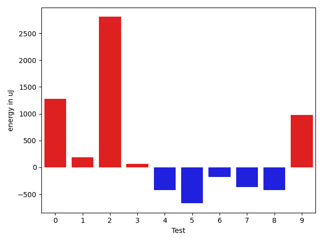

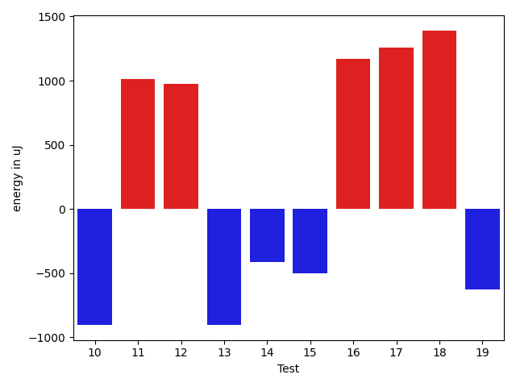

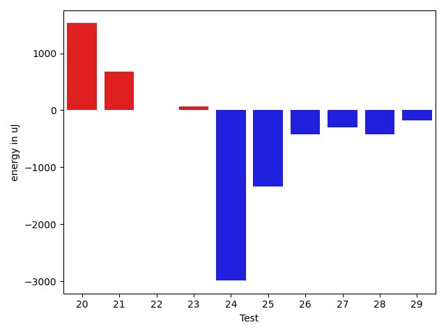

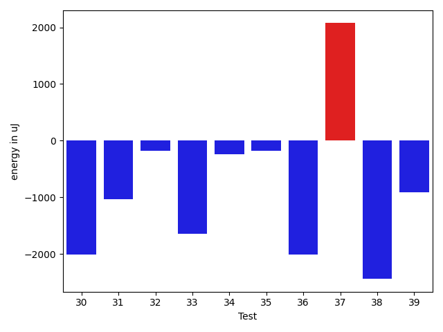

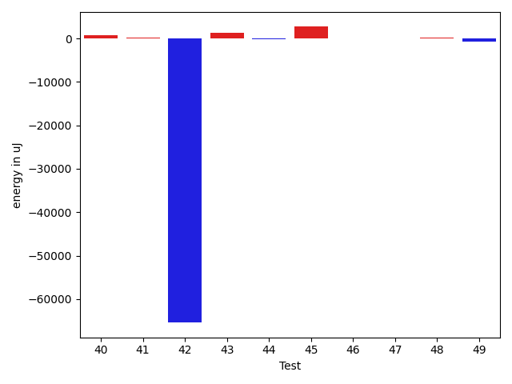

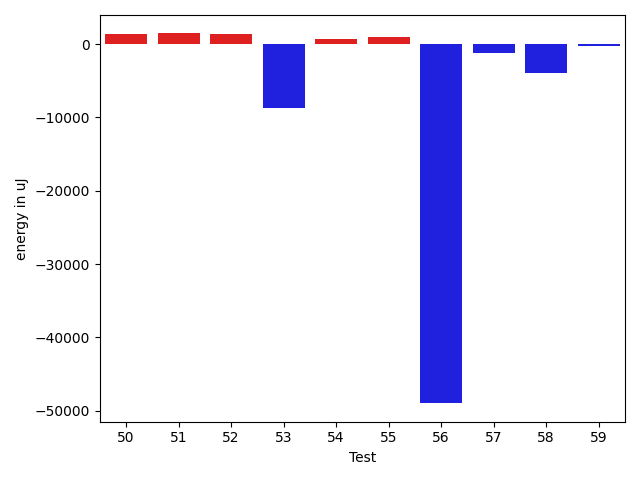

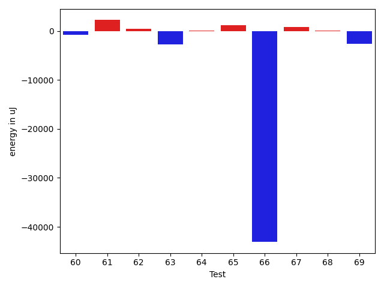

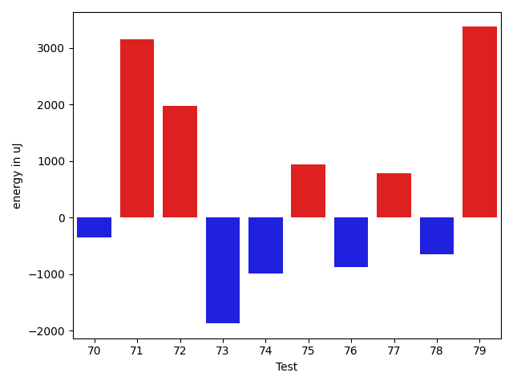

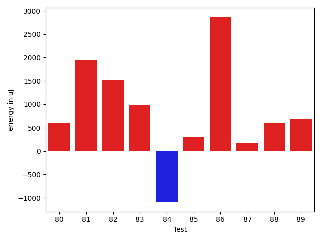

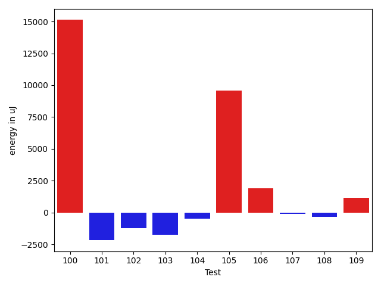

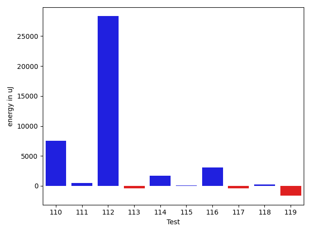

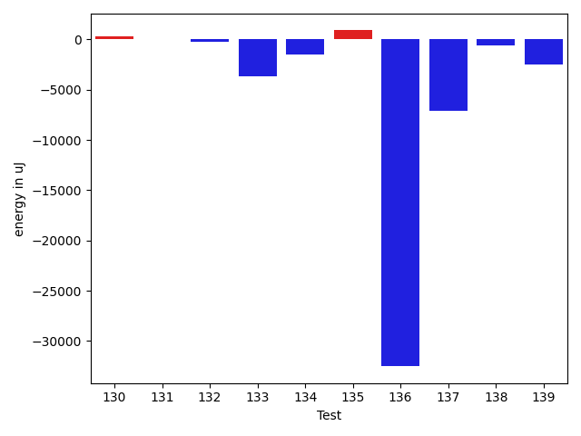

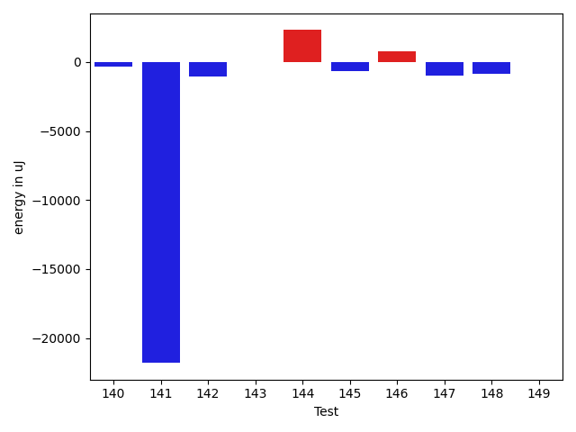

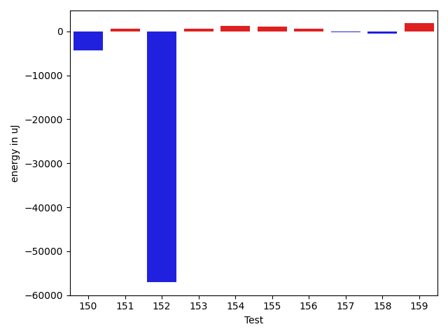

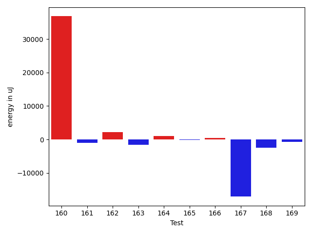

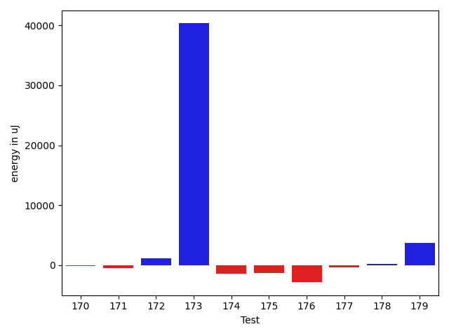

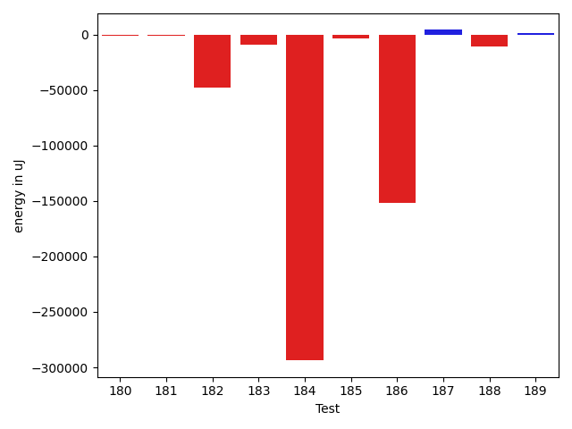

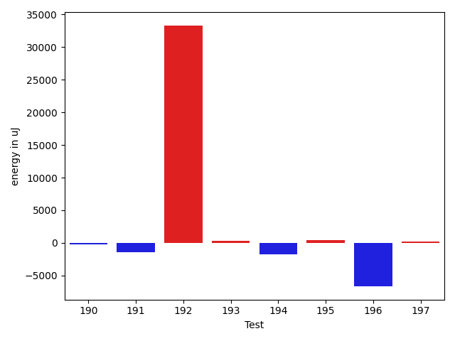

| ID | EnergyV1 | EnergyV2 | DeltaEnergy | σV1 | σV2 |
| --- | --- | --- | --- | --- | --- |
| 0 | 37414 | 38696 | 1282 | 10740.38358558536 | 9882.228025842136 |
| 1 | 38574 | 38757 | 183 | 7880.322917431012 | 6520.462545868006 |
| 2 | 35401 | 38208 | 2807 | 4236.428114526456 | 2969.5999092628203 |
| 3 | 35217 | 35279 | 62 | 3864.0035094371046 | 3955.842874262401 |
| 4 | 36743 | 36316 | -427 | 6854.221719802058 | 9260.21538764599 |
| 5 | 37353 | 36682 | -671 | 2863.141105089709 | 4311.12108564833 |
| 6 | 36499 | 36316 | -183 | 3155.5348366956746 | 2813.2620903220113 |
| 7 | 112121 | 111755 | -366 | 22690.684782455228 | 24514.31908929127 |
| 8 | 36804 | 36377 | -427 | 8666.57313394121 | 10678.952132114837 |
| 9 | 36254 | 37231 | 977 | 3099.0470475655216 | 3668.4013664039016 |
| 10 | 36255 | 35584 | -671 | 3070.314327996782 | 4145.978238886751 |
| 11 | 36316 | 36927 | 611 | 5239.583233561217 | 7740.431409093998 |
| 12 | 35766 | 36376 | 610 | 4002.66062506267 | 3669.481109693849 |
| 13 | 34607 | 34912 | 305 | 3270.8943236908913 | 3640.022199506924 |
| 14 | 36804 | 35462 | -1342 | 3775.3599177413075 | 4184.376594169544 |
| 15 | 36254 | 35950 | -304 | 4204.812995794225 | 3528.371518759676 |
| 16 | 35156 | 36255 | 1099 | 3852.7304567434167 | 4471.227019618225 |
| 17 | 35706 | 36743 | 1037 | 4495.401303554556 | 4558.952142658799 |
| 18 | 36499 | 39368 | 2869 | 4123.665666837693 | 4574.263482791519 |
| 19 | 36865 | 35279 | -1586 | 3463.310420673158 | 4260.126323244418 |
| 20 | 34851 | 36377 | 1526 | 3519.7849446678947 | 3209.0392856339377 |
| 21 | 35767 | 36438 | 671 | 3372.97277597967 | 5338.001954102658 |
| 22 | 36804 | 36804 | 0 | 4355.378575502675 | 4056.9501123034315 |
| 23 | 36010 | 36072 | 62 | 4534.4912331719215 | 4632.252055034074 |
| 24 | 40405 | 37415 | -2990 | 35253.45210367666 | 32076.426515137868 |
| 25 | 41748 | 40405 | -1343 | 300865.93954001373 | 333718.55933721556 |
| 26 | 79529 | 79102 | -427 | 22862.180049488798 | 22856.442422298725 |
| 27 | 39246 | 38941 | -305 | 28246.96186335772 | 26584.528599075504 |
| 28 | 37719 | 37292 | -427 | 15653.766791235294 | 16292.089907342928 |
| 29 | 36437 | 36255 | -182 | 4332.4989647333405 | 4500.279215568575 |
| 30 | 36132 | 34118 | -2014 | 3588.4656646523576 | 5572.163081942658 |
| 31 | 35705 | 34668 | -1037 | 7332.157196427046 | 5945.824605149996 |
| 32 | 38207 | 38025 | -182 | 14195.315437987208 | 12679.383869192689 |
| 33 | 36133 | 34485 | -1648 | 4528.663815528995 | 4456.440401843131 |
| 34 | 36987 | 36744 | -243 | 4308.70831825531 | 4449.727907248097 |
| 35 | 36988 | 36804 | -184 | 6377.38626881509 | 3951.804888687938 |
| 36 | 37536 | 35523 | -2013 | 3847.78552863527 | 4539.469953753973 |
| 37 | 35583 | 37658 | 2075 | 4560.497186894511 | 5158.397087781772 |
| 38 | 39429 | 36987 | -2442 | 5034.144079296014 | 3891.027974699834 |
| 39 | 38513 | 37597 | -916 | 4225.459582352997 | 4255.095904795598 |
| 40 | 36804 | 36926 | 122 | 4843.493930426838 | 3912.658434774352 |
| 41 | 35949 | 36194 | 245 | 4687.077601236643 | 4213.092863226601 |
| 42 | 42114 | 42785 | 671 | 338047.1614752182 | 212433.28250510097 |
| 43 | 36499 | 38513 | 2014 | 4656.793208759575 | 4078.624467797902 |
| 44 | 37353 | 38025 | 672 | 4030.093947397762 | 4613.597270261125 |
| 45 | 36499 | 37049 | 550 | 4989.222608783858 | 4425.871893901188 |
| 46 | 37048 | 36927 | -121 | 4344.552887865572 | 3815.9986716600706 |
| 47 | 38452 | 39673 | 1221 | 26493.788948654194 | 24117.275909790987 |
| 48 | 37170 | 37597 | 427 | 4078.1248026939484 | 4146.092548638417 |
| 49 | 37720 | 37476 | -244 | 4307.682107096863 | 3568.1444191152445 |
| 50 | 35766 | 37170 | 1404 | 4668.91216085236 | 4390.788784899588 |
| 51 | 36987 | 37903 | 916 | 4390.6187984600765 | 4475.887665599052 |
| 52 | 35584 | 38818 | 3234 | 4160.292429193929 | 4476.069065666017 |
| 53 | 41321 | 37780 | -3541 | 30350.562241468673 | 23692.777379463263 |
| 54 | 36865 | 38391 | 1526 | 4582.525003767125 | 3355.480113731982 |
| 55 | 39734 | 39795 | 61 | 5623.6723334901735 | 4328.610355529821 |
| 56 | 40161 | 39185 | -976 | 401048.09705268906 | 340218.77755437844 |
| 57 | 39429 | 38635 | -794 | 11109.142424577605 | 11463.94582380743 |
| 58 | 40893 | 39734 | -1159 | 29711.263411488177 | 23194.04280746762 |
| 59 | 37231 | 38025 | 794 | 6879.438605305037 | 6159.828864751123 |
| 60 | 37597 | 37171 | -426 | 4060.8875354468837 | 3883.255850443027 |
| 61 | 41382 | 41687 | 305 | 43156.62196524194 | 45666.01697910279 |
| 62 | 37842 | 38086 | 244 | 4619.29296910672 | 5693.577394371695 |
| 63 | 40466 | 39856 | -610 | 105671.74636085785 | 98786.42989152104 |
| 64 | 37476 | 36316 | -1160 | 8021.464774035584 | 9571.399952230371 |
| 65 | 37231 | 38452 | 1221 | 5084.5310745173365 | 4222.700418469386 |
| 66 | 40222 | 39490 | -732 | 405579.972437923 | 288527.86695120396 |
| 67 | 38086 | 38758 | 672 | 4593.862448181991 | 4144.607937156544 |
| 68 | 38269 | 37536 | -733 | 4139.809925856769 | 3465.4560105340747 |
| 69 | 40100 | 38269 | -1831 | 4358.325468444147 | 3825.92730861857 |
| 70 | 40405 | 38879 | -1526 | 4407.603231852104 | 3167.7840204155336 |
| 71 | 41931 | 43029 | 1098 | 16629.923022350104 | 18514.496610855556 |
| 72 | 40039 | 40100 | 61 | 5418.0593445646655 | 3934.918889464771 |
| 73 | 39917 | 37964 | -1953 | 3677.732006277782 | 3415.1022296198284 |
| 74 | 40954 | 39185 | -1769 | 4119.162028868153 | 3724.768203907393 |
| 75 | 39978 | 38513 | -1465 | 4265.428037119341 | 4625.313143425046 |
| 76 | 38147 | 38513 | 366 | 4099.384105612876 | 3943.801162333706 |
| 77 | 38330 | 38208 | -122 | 3320.621869008691 | 4109.162880955465 |
| 78 | 36316 | 37048 | 732 | 4732.600127245079 | 5209.777937232396 |
| 79 | 39490 | 40405 | 915 | 15262.131720126417 | 21156.8471944639 |
| 80 | 38147 | 38757 | 610 | 4089.427676311528 | 5280.110945425452 |
| 81 | 39794 | 41748 | 1954 | 40567.7061601093 | 48562.809966207635 |
| 82 | 35889 | 37414 | 1525 | 4885.576110707723 | 3999.5448581440164 |
| 83 | 36621 | 37597 | 976 | 3824.3012433645968 | 3957.588486376521 |
| 84 | 38452 | 37353 | -1099 | 4105.703077719661 | 3563.297958352627 |
| 85 | 37475 | 37781 | 306 | 3911.396701128639 | 6510.333745609696 |
| 86 | 39428 | 42297 | 2869 | 241484.5718977272 | 241912.05382854823 |
| 87 | 37231 | 37414 | 183 | 3988.1112622393075 | 4396.562143003999 |
| 88 | 38391 | 39001 | 610 | 3227.9216234165933 | 4260.3409520065115 |
| 89 | 36804 | 37476 | 672 | 3919.5971269704623 | 4203.4150591777425 |
| 90 | 37414 | 39733 | 2319 | 4594.987304540557 | 5264.9024430087975 |
| 91 | 36805 | 37232 | 427 | 8172.194656016353 | 9024.103742252375 |
| 92 | 37475 | 38025 | 550 | 5574.1323068197535 | 7127.572641001608 |
| 93 | 42297 | 42175 | -122 | 11188.714700113349 | 23302.80739338553 |
| 94 | 36011 | 37415 | 1404 | 4078.9639829876674 | 4132.587125969958 |
| 95 | 153381 | 155639 | 2258 | 69126.81907417071 | 323599.807264353 |
| 96 | 37902 | 36315 | -1587 | 4484.382562071417 | 4128.260376962674 |
| 97 | 39734 | 37842 | -1892 | 23865.845862192873 | 27972.779512590452 |
| 98 | 37110 | 35461 | -1649 | 5100.176926188826 | 5853.703994946222 |
| 99 | 38635 | 37293 | -1342 | 4105.271946339409 | 3942.291075687808 |
| 100 | 38025 | 39002 | 977 | 3385.800356889162 | 31640.87756171076 |
| 101 | 37659 | 35645 | -2014 | 4934.437910126026 | 3900.280145430819 |
| 102 | 37171 | 36377 | -794 | 6063.163560945886 | 3434.373211813866 |
| 103 | 38147 | 37110 | -1037 | 4504.231736933613 | 4652.0305160085745 |
| 104 | 36743 | 37659 | 916 | 5041.483405128533 | 4670.7993997173535 |
| 105 | 108398 | 119141 | 10743 | 413834.65629561926 | 396735.0639239677 |
| 106 | 35461 | 37842 | 2381 | 4324.609633755977 | 4063.34635286402 |
| 107 | 35828 | 36315 | 487 | 4284.881858922665 | 3895.6033104635194 |
| 108 | 36132 | 36926 | 794 | 5665.328729929382 | 4257.046743712997 |
| 109 | 41015 | 39856 | -1159 | 17220.82934700254 | 19018.184529542097 |
| 110 | 38514 | 39612 | 1098 | 29039.141704785707 | 37627.13942461507 |
| 111 | 35889 | 37537 | 1648 | 4184.760728424824 | 4227.208117103547 |
| 112 | 42175 | 40466 | -1709 | 337605.64897313406 | 375452.76470245764 |
| 113 | 36743 | 37353 | 610 | 4690.34408859041 | 4568.1015103412765 |
| 114 | 37659 | 39795 | 2136 | 4006.8248719691496 | 4586.504984170591 |
| 115 | 36926 | 38146 | 1220 | 3754.464819152638 | 4293.499052108157 |
| 116 | 36743 | 38635 | 1892 | 20699.137794689083 | 24201.594290014757 |
| 117 | 36255 | 36255 | 0 | 4204.918922269149 | 4146.010792303005 |
| 118 | 36560 | 36437 | -123 | 3756.301819526088 | 3941.687566893145 |
| 119 | 37170 | 34180 | -2990 | 4054.0117126096625 | 4763.3182260612475 |
| 120 | 35461 | 34424 | -1037 | 4848.349404436524 | 4463.380557808905 |
| 121 | 37353 | 43823 | 6470 | 25198.61037565893 | 27650.13737621333 |
| 122 | 37841 | 37415 | -426 | 3872.75572980124 | 4796.203469715197 |
| 123 | 40161 | 39307 | -854 | 3779.890994129328 | 4740.400818144672 |
| 124 | 40711 | 40223 | -488 | 321341.8903587648 | 398877.7096254491 |
| 125 | 43334 | 41077 | -2257 | 27307.56868720465 | 28123.72719042761 |
| 126 | 39734 | 39795 | 61 | 3919.637667410979 | 14065.718073260145 |
| 127 | 40711 | 39490 | -1221 | 4221.527648090647 | 3859.2974701375642 |
| 128 | 39184 | 40039 | 855 | 13068.495839712317 | 16703.604293102704 |
| 129 | 70251 | 46082 | -24169 | 174563.9396443869 | 40258.16534278814 |
| 130 | 38941 | 38452 | -489 | 10331.822935625216 | 11057.422837822394 |
| 131 | 37964 | 37475 | -489 | 3883.7037059588597 | 3943.6583342482472 |
| 132 | 40344 | 39673 | -671 | 27910.494612970277 | 26110.83947061839 |
| 133 | 39672 | 38452 | -1220 | 52445.416631827335 | 41899.88977627213 |
| 134 | 37841 | 37598 | -243 | 11179.305635978211 | 8929.370966559569 |
| 135 | 36865 | 36499 | -366 | 4412.903446211408 | 7112.205608082222 |
| 136 | 42664 | 43518 | 854 | 285130.14326097874 | 191960.70925527858 |
| 137 | 41504 | 38269 | -3235 | 20963.385196887593 | 17107.69172140287 |
| 138 | 37842 | 37232 | -610 | 4211.4277084545365 | 4180.408923567757 |
| 139 | 39856 | 39612 | -244 | 18983.59824943817 | 18336.55933274977 |
| 140 | 39368 | 38391 | -977 | 9947.94308666992 | 9144.584246117021 |
| 141 | 79468 | 81421 | 1953 | 424167.815609799 | 381475.8340085945 |
| 142 | 38452 | 37780 | -672 | 9611.514572576894 | 9369.448018367406 |
| 143 | 38330 | 37109 | -1221 | 6820.035356933458 | 8017.5197913431175 |
| 144 | 41320 | 41931 | 611 | 30510.503729958826 | 32129.28959723006 |
| 145 | 37597 | 37536 | -61 | 4726.946502934003 | 4426.628290877833 |
| 146 | 36865 | 38086 | 1221 | 4038.9169411613307 | 3730.6339736084165 |
| 147 | 39246 | 38879 | -367 | 4064.7845156170333 | 4551.536885756283 |
| 148 | 37353 | 37049 | -304 | 7663.2362233205395 | 5448.296162937749 |
| 149 | 37536 | 38757 | 1221 | 23536.272834084673 | 19956.991540019473 |
| 150 | 38758 | 38208 | -550 | 16121.602336306401 | 4354.934484119065 |
| 151 | 38879 | 38880 | 1 | 4665.346615332575 | 6782.627553582184 |
| 152 | 40039 | 38207 | -1832 | 301591.40320961294 | 4170.376224054143 |
| 153 | 35034 | 37048 | 2014 | 4530.0063311214035 | 4440.753135340543 |
| 154 | 36072 | 37414 | 1342 | 4644.767316830845 | 4852.562312483972 |
| 155 | 40283 | 39917 | -366 | 3633.031025156827 | 4266.327626237816 |
| 156 | 37781 | 38086 | 305 | 3868.642885154067 | 3460.8201077464023 |
| 157 | 39124 | 39917 | 793 | 5922.804513593322 | 4064.3386732013496 |
| 158 | 36316 | 35584 | -732 | 4849.393175068402 | 4454.653314165793 |
| 159 | 39673 | 41199 | 1526 | 27306.826386339224 | 27569.224384521258 |
| 160 | 85510 | 80444 | -5066 | 325521.3263084918 | 410516.5028742928 |
| 161 | 36804 | 35095 | -1709 | 4561.168376543852 | 4471.838107442129 |
| 162 | 41138 | 41015 | -123 | 39447.871717599206 | 38837.89975611538 |
| 163 | 36621 | 35705 | -916 | 9828.440221398081 | 7638.688245518481 |
| 164 | 35705 | 38086 | 2381 | 4567.6705381768425 | 5270.692079372077 |
| 165 | 37780 | 37537 | -243 | 5126.519472930546 | 4137.463064704866 |
| 166 | 35461 | 36743 | 1282 | 4412.16030258583 | 4811.581260066406 |
| 167 | 43090 | 40833 | -2257 | 236120.04991427404 | 251193.80419008704 |
| 168 | 39307 | 36316 | -2991 | 4369.3534854283 | 3858.8934799262543 |
| 169 | 37719 | 37598 | -121 | 4552.422595717582 | 4205.675449135295 |
| 170 | 37414 | 37963 | 549 | 4485.370474465836 | 3846.1286002889888 |
| 171 | 37902 | 37171 | -731 | 4201.172858930859 | 4066.002751929494 |
| 172 | 63782 | 68969 | 5187 | 31941.625594445777 | 28749.074297996714 |
| 173 | 44922 | 44739 | -183 | 275180.8588781686 | 387773.7485241154 |
| 174 | 38635 | 37658 | -977 | 3784.2132803838113 | 4129.526807835953 |
| 175 | 38879 | 38574 | -305 | 4724.861244008531 | 4458.377432181026 |
| 176 | 39612 | 36255 | -3357 | 4070.722681827362 | 3456.180048455773 |
| 177 | 37170 | 37354 | 184 | 4141.45953733403 | 4066.278476958251 |
| 178 | 40528 | 39245 | -1283 | 13364.929192105803 | 15768.982964320494 |
| 179 | 37231 | 39185 | 1954 | 22308.65016013686 | 21833.938263013068 |
| 180 | 39978 | 37354 | -2624 | 5307.891540717905 | 4697.706141049514 |
| 181 | 40100 | 38391 | -1709 | 6518.232088697839 | 5159.602429862687 |
| 182 | 37964 | 39734 | 1770 | 290970.8350060532 | 3759.398070509691 |
| 183 | 39062 | 39489 | 427 | 222402.39488923925 | 184039.36298154457 |
| 184 | 40283 | 38635 | -1648 | 510979.5698184082 | 4206.429741816629 |
| 185 | 238708 | 226256 | -12452 | 64376.484138257074 | 71642.17714836205 |
| 186 | 41932 | 40161 | -1771 | 494171.1593682595 | 184346.8912325699 |
| 187 | 40100 | 41320 | 1220 | 9133.433993504086 | 14816.408363213846 |
| 188 | 39856 | 37597 | -2259 | 263490.10519838193 | 280834.0293114829 |
| 189 | 37170 | 36804 | -366 | 4335.580160783388 | 4329.012479723291 |
| 190 | 37902 | 37598 | -304 | 4466.042466895686 | 4736.919283416174 |
| 191 | 38208 | 36438 | -1770 | 4822.313146976251 | 6462.7264026535695 |
| 192 | 41138 | 39795 | -1343 | 235397.060378124 | 299568.430772443 |
| 193 | 38391 | 40283 | 1892 | 4435.268657276832 | 4300.6106163113855 |
| 194 | 39001 | 38574 | -427 | 2816.226013512352 | 4052.921144368483 |
| 195 | 38452 | 38879 | 427 | 4262.066092201189 | 3422.5735737307386 |
| 196 | 40283 | 40039 | -244 | 349933.2190285143 | 311002.3508296597 |
| 197 | 39063 | 40466 | 1403 | 4541.307368474243 | 5058.629552844188 |

## Delta Duration per test method

| ID | DurationV1 | DurationsV2 | DeltaDuration |
| --- | --- | --- | --- |
| 0 | 1266059.4175824176 | 1232236.5494505495 | -33822.868131868076 |
| 1 | 1169313.1475409835 | 1079553.2794117648 | -89759.8681292187 |
| 2 | 668586.8529411765 | 644453.34375 | -24133.509191176505 |
| 3 | 749711.4406779661 | 724292.8867924528 | -25418.553885513335 |
| 4 | 1231823.9032258065 | 1237239.7684210527 | 5415.8651952461805 |
| 5 | 644560.1481481482 | 643254.358974359 | -1305.789173789206 |
| 6 | 466213.56 | 463122.36363636365 | -3091.1963636363507 |
| 7 | 3466301.0707070706 | 3444519.0606060605 | -21782.01010101009 |
| 8 | 1215185.6352941177 | 1204461.1666666667 | -10724.468627450988 |
| 9 | 744219.7826086957 | 758299.7619047619 | 14079.979296066216 |
| 10 | 721239.7222222222 | 712440.1923076923 | -8799.529914529994 |
| 11 | 957485.5 | 994866.9666666667 | 37381.466666666674 |
| 12 | 713439.375 | 706143.94 | -7295.435000000056 |
| 13 | 787066.5849056604 | 815361.1612903225 | 28294.576384662185 |
| 14 | 609167.3333333334 | 613567.7058823529 | 4400.372549019521 |
| 15 | 494938.52 | 491296.0588235294 | -3642.4611764706206 |
| 16 | 778073.7352941176 | 685112.5 | -92961.23529411759 |
| 17 | 466761.72 | 483018.07692307694 | 16256.356923076964 |
| 18 | 486989.94736842107 | 485888.15 | -1101.7973684210447 |
| 19 | 487065.7826086957 | 498719.3 | 11653.51739130431 |
| 20 | 474847.82608695654 | 468530.2413793103 | -6317.584707646223 |
| 21 | 487973.15 | 424887.04347826086 | -63086.10652173916 |
| 22 | 731536.6470588235 | 707326.7142857143 | -24209.932773109176 |
| 23 | 830213.8653846154 | 815914.8103448276 | -14299.055039787781 |
| 24 | 1344325.754385965 | 1201581.06779661 | -142744.68658935488 |
| 25 | 3602954.896551724 | 3392613.0166666666 | -210341.87988505745 |
| 26 | 2546329.5353535353 | 2451156.717171717 | -95172.81818181835 |
| 27 | 1186511.326923077 | 1073853.843137255 | -112657.48378582206 |
| 28 | 960725.033898305 | 968715.0930232558 | 7990.059124950785 |
| 29 | 754216.9682539683 | 786632.4772727273 | 32415.50901875901 |
| 30 | 457399.7083333333 | 493023.4705882353 | 35623.76225490199 |
| 31 | 935505.220338983 | 860643.9230769231 | -74861.29726205987 |
| 32 | 1226835.7564102565 | 1148942.5625 | -77893.1939102565 |
| 33 | 759449.7142857143 | 756674.716981132 | -2774.99730458227 |
| 34 | 717621.756097561 | 684153.6585365854 | -33468.097560975584 |
| 35 | 968408.4090909091 | 923725.3888888889 | -44683.02020202018 |
| 36 | 710161.2 | 674339.243902439 | -35821.956097560935 |
| 37 | 537303.1351351351 | 604443.0789473684 | 67139.94381223328 |
| 38 | 673416.4722222222 | 675418.3863636364 | 2001.914141414105 |
| 39 | 861901.0 | 766733.8181818182 | -95167.18181818177 |
| 40 | 563862.6428571428 | 560353.5714285715 | -3509.071428571362 |
| 41 | 768203.1132075472 | 716359.75 | -51843.36320754723 |
| 42 | 4692446.521739131 | 2764765.347826087 | -1927681.173913044 |
| 43 | 833940.2916666666 | 807423.5476190476 | -26516.744047619053 |
| 44 | 843096.5576923077 | 750198.5471698113 | -92898.01052249642 |
| 45 | 629268.8333333334 | 563510.6571428571 | -65758.17619047628 |
| 46 | 835761.3389830509 | 783129.5614035088 | -52631.77757954213 |
| 47 | 1098910.303030303 | 1121943.4054054054 | 23033.102375102462 |
| 48 | 582813.3548387097 | 595941.8125 | 13128.457661290304 |
| 49 | 533496.1111111111 | 550239.3928571428 | 16743.281746031716 |
| 50 | 538545.0689655172 | 532950.84 | -5594.22896551725 |
| 51 | 539887.8235294118 | 514232.3703703704 | -25655.45315904141 |
| 52 | 584211.3913043478 | 523936.64285714284 | -60274.74844720494 |
| 53 | 1130435.5833333333 | 801430.1428571428 | -329005.4404761904 |
| 54 | 613936.9629629629 | 557786.5238095238 | -56150.43915343913 |
| 55 | 490344.6818181818 | 493642.4 | 3297.7181818182 |
| 56 | 5475358.333333333 | 3343071.2564102565 | -2132287.0769230765 |
| 57 | 1100299.6818181819 | 1089555.0298507463 | -10744.65196743561 |
| 58 | 1671588.0833333333 | 1587244.8723404256 | -84343.21099290764 |
| 59 | 878838.5614035088 | 860267.7727272727 | -18570.788676236058 |
| 60 | 737257.1764705882 | 724009.081632653 | -13248.094837935176 |
| 61 | 1861927.2580645161 | 1968544.597826087 | 106617.3397615708 |
| 62 | 802528.4821428572 | 828238.0 | 25709.51785714284 |
| 63 | 2039071.4901960783 | 2002690.0 | -36381.49019607832 |
| 64 | 642706.71875 | 624031.3 | -18675.418749999953 |
| 65 | 639708.9047619047 | 640376.7419354839 | 667.8371735791443 |
| 66 | 4253991.202380952 | 2823222.06097561 | -1430769.1414053426 |
| 67 | 507730.17391304346 | 477074.4347826087 | -30655.739130434755 |
| 68 | 396271.55555555556 | 397233.1538461539 | 961.598290598311 |
| 69 | 412571.13333333336 | 456037.2083333333 | 43466.07499999995 |
| 70 | 442812.38095238095 | 517288.88 | 74476.49904761906 |
| 71 | 972438.7307692308 | 1145768.0322580645 | 173329.30148883373 |
| 72 | 421662.7619047619 | 414387.5 | -7275.261904761894 |
| 73 | 449489.65 | 432190.70588235295 | -17298.944117647072 |
| 74 | 427036.4117647059 | 430227.0 | 3190.588235294097 |
| 75 | 406173.5 | 368362.17647058825 | -37811.32352941175 |
| 76 | 380945.7619047619 | 389310.6666666667 | 8364.904761904792 |
| 77 | 348532.85714285716 | 401642.6 | 53109.74285714282 |
| 78 | 854716.3018867924 | 836742.234375 | -17974.06751179241 |
| 79 | 1301376.8266666667 | 1282621.8717948718 | -18754.954871794907 |
| 80 | 792868.7659574468 | 754760.6734693878 | -38108.09248805896 |
| 81 | 1535811.396825397 | 1610843.6935483871 | 75032.29672299023 |
| 82 | 747749.7105263158 | 725419.4347826086 | -22330.2757437072 |
| 83 | 485270.44444444444 | 484847.7 | -422.74444444442634 |
| 84 | 427094.4090909091 | 475298.8 | 48204.39090909087 |
| 85 | 420041.8 | 479576.8947368421 | 59535.09473684209 |
| 86 | 2314107.597826087 | 2347536.6703296704 | 33429.072503583506 |
| 87 | 670596.175 | 688340.75 | 17744.574999999953 |
| 88 | 425233.23529411765 | 421758.875 | -3474.3602941176505 |
| 89 | 475774.64285714284 | 423463.7083333333 | -52310.93452380953 |
| 90 | 421125.13333333336 | 469909.52 | 48784.38666666666 |
| 91 | 1116130.5733333332 | 1124166.6666666667 | 8036.093333333498 |
| 92 | 1022704.9180327869 | 1075658.7704918033 | 52953.85245901637 |
| 93 | 952810.8076923077 | 1163099.9090909092 | 210289.10139860143 |
| 94 | 710636.1224489796 | 706948.875 | -3687.247448979644 |
| 95 | 4793738.595959596 | 6803276.696969697 | 2009538.101010101 |
| 96 | 758983.25 | 680953.425 | -78029.82499999995 |
| 97 | 1037425.6923076923 | 1035186.975 | -2238.7173076922772 |
| 98 | 854597.695652174 | 909407.0 | 54809.30434782605 |
| 99 | 841829.9523809524 | 824981.9795918367 | -16847.972789115738 |
| 100 | 562692.9130434783 | 1253251.5925925926 | 690558.6795491143 |
| 101 | 590796.5666666667 | 604214.2068965518 | 13417.640229885117 |
| 102 | 409004.82352941175 | 441021.1111111111 | 32016.287581699376 |
| 103 | 660247.25 | 604953.125 | -55294.125 |
| 104 | 771974.9038461539 | 775563.66 | 3588.7561538461596 |
| 105 | 5950887.121212121 | 6077420.090909091 | 126532.96969696973 |
| 106 | 386333.9375 | 360834.4166666667 | -25499.520833333314 |
| 107 | 763412.6851851852 | 770056.619047619 | 6643.933862433885 |
| 108 | 903065.0285714286 | 917832.7647058824 | 14767.736134453793 |
| 109 | 1487761.6020408163 | 1478195.4444444445 | -9566.157596371835 |
| 110 | 1100171.1219512196 | 1294196.6153846155 | 194025.49343339587 |
| 111 | 573393.3333333334 | 582585.4285714285 | 9192.09523809515 |
| 112 | 3822233.888888889 | 4947202.7272727275 | 1124968.8383838385 |
| 113 | 761962.675 | 695708.1276595745 | -66254.54734042555 |
| 114 | 584077.3548387097 | 605920.3333333334 | 21842.978494623676 |
| 115 | 570985.5 | 607092.4871794871 | 36106.98717948713 |
| 116 | 923332.9696969697 | 923344.1860465116 | 11.21634954190813 |
| 117 | 750908.5535714285 | 748111.3965517242 | -2797.1570197043475 |
| 118 | 517671.125 | 524630.8125 | 6959.6875 |
| 119 | 461903.1153846154 | 462718.04545454547 | 814.9300699300948 |
| 120 | 492742.1 | 467197.39285714284 | -25544.707142857136 |
| 121 | 823545.6842105263 | 1063071.2857142857 | 239525.6015037594 |
| 122 | 487344.125 | 499805.81481481483 | 12461.689814814832 |
| 123 | 469586.15 | 468530.44444444444 | -1055.7055555555853 |
| 124 | 2842409.487804878 | 4331998.742857143 | 1489589.2550522652 |
| 125 | 894537.6 | 1008088.2916666666 | 113550.69166666665 |
| 126 | 616461.8461538461 | 670663.9090909091 | 54202.06293706293 |
| 127 | 567030.03125 | 562846.9285714285 | -4183.1026785714785 |
| 128 | 1205618.835443038 | 1213583.698630137 | 7964.863187098876 |
| 129 | 2442710.9595959596 | 1969211.4848484849 | -473499.4747474748 |
| 130 | 1242363.3902439023 | 1180728.463414634 | -61634.926829268225 |
| 131 | 838295.5737704918 | 826612.568627451 | -11683.005143040791 |
| 132 | 1514866.0652173914 | 1475758.868131868 | -39107.19708552328 |
| 133 | 1532151.5064935065 | 1490646.3614457832 | -41505.145047723316 |
| 134 | 1134998.0 | 1155555.511627907 | 20557.511627906933 |
| 135 | 905936.5737704918 | 975872.5072463768 | 69935.93347588507 |
| 136 | 3202610.1369863013 | 2260772.117647059 | -941838.0193392425 |
| 137 | 1261140.796875 | 975122.9384615384 | -286017.8584134616 |
| 138 | 827630.0943396227 | 804610.5849056604 | -23019.50943396229 |
| 139 | 1621910.7676767677 | 1527282.9393939395 | -94627.82828282821 |
| 140 | 1042626.1690140845 | 1059662.027027027 | 17035.85801294248 |
| 141 | 5367204.080808081 | 4733488.96969697 | -633715.111111111 |
| 142 | 1112057.0555555555 | 1137602.2 | 25545.14444444445 |
| 143 | 1021148.5538461539 | 1049329.6290322582 | 28181.07518610428 |
| 144 | 1361526.4242424243 | 1549732.365079365 | 188205.94083694066 |
| 145 | 470834.92 | 494121.0 | 23286.080000000016 |
| 146 | 495066.96 | 475523.6818181818 | -19543.278181818197 |
| 147 | 538119.72 | 515715.44 | -22404.27999999997 |
| 148 | 916037.7741935484 | 891598.8507462686 | -24438.923447279725 |
| 149 | 1199064.7611940298 | 1206826.8070175438 | 7762.045823513996 |
| 150 | 796914.65 | 591233.6785714285 | -205680.9714285715 |
| 151 | 744445.1063829787 | 757090.2448979592 | 12645.138514980441 |
| 152 | 2088620.1333333333 | 612239.1935483871 | -1476380.9397849462 |
| 153 | 430948.8 | 412547.7586206897 | -18401.041379310307 |
| 154 | 432249.35 | 396685.17647058825 | -35564.173529411724 |
| 155 | 514041.2272727273 | 511745.08 | -2296.1472727272776 |
| 156 | 481930.2105263158 | 416424.5909090909 | -65505.619617224904 |
| 157 | 868204.9074074074 | 843439.8333333334 | -24765.074074074044 |
| 158 | 564657.2 | 530057.0384615385 | -34600.161538461456 |
| 159 | 1272023.488372093 | 1488100.3714285714 | 216076.88305647834 |
| 160 | 5154795.626262627 | 6144338.595959596 | 989542.9696969697 |
| 161 | 551633.5 | 606583.1923076923 | 54949.692307692254 |
| 162 | 1343357.6857142858 | 1449145.8421052631 | 105788.15639097732 |
| 163 | 813038.6315789474 | 918932.4333333333 | 105893.80175438593 |
| 164 | 500167.0 | 545459.8 | 45292.80000000005 |
| 165 | 553803.9090909091 | 582245.5925925926 | 28441.683501683525 |
| 166 | 415912.9285714286 | 455014.8 | 39101.87142857141 |
| 167 | 3000782.194029851 | 2510363.901639344 | -490418.2923905067 |
| 168 | 583923.5757575758 | 548256.5862068966 | -35666.98955067922 |
| 169 | 869211.76 | 716313.0869565217 | -152898.67304347828 |
| 170 | 690219.75 | 617522.875 | -72696.875 |
| 171 | 712371.9555555555 | 651560.5641025641 | -60811.391452991404 |
| 172 | 1985151.5151515151 | 1949926.9292929294 | -35224.58585858578 |
| 173 | 3601151.9411764704 | 4723207.555555556 | 1122055.6143790856 |
| 174 | 736092.4186046511 | 749148.9166666666 | 13056.498062015511 |
| 175 | 761643.1219512195 | 730017.2195121951 | -31625.902439024416 |
| 176 | 562606.53125 | 633469.28125 | 70862.75 |
| 177 | 713706.0 | 686855.695652174 | -26850.30434782605 |
| 178 | 1174667.7945205478 | 1209002.7945205478 | 34335.0 |
| 179 | 1039132.754385965 | 1216522.0634920634 | 177389.3091060985 |
| 180 | 442340.5 | 436495.22222222225 | -5845.277777777752 |
| 181 | 749914.6923076923 | 682255.9655172414 | -67658.72679045086 |
| 182 | 2074369.6216216215 | 633186.695652174 | -1441182.9259694475 |
| 183 | 1711789.7407407407 | 1524038.3064516129 | -187751.43428912782 |
| 184 | 8394144.25 | 365729.8333333333 | -8028414.416666667 |
| 185 | 6651044.03030303 | 6647987.656565657 | -3056.3737373733893 |
| 186 | 5900486.733333333 | 1845658.1363636365 | -4054828.5969696967 |
| 187 | 1186951.361111111 | 1238300.5616438356 | 51349.200532724615 |
| 188 | 2352845.98 | 1973004.8205128205 | -379841.1594871795 |
| 189 | 469009.2272727273 | 476774.4 | 7765.172727272729 |
| 190 | 495845.36363636365 | 465917.2 | -29928.163636363635 |
| 191 | 680222.8 | 812779.7777777778 | 132556.9777777777 |
| 192 | 2069526.4285714286 | 3080623.015151515 | 1011096.5865800865 |
| 193 | 508046.8 | 379858.4210526316 | -128188.37894736842 |
| 194 | 422473.85714285716 | 448297.94444444444 | 25824.08730158728 |
| 195 | 879052.5434782609 | 808987.3 | -70065.24347826082 |
| 196 | 3281454.9285714286 | 3010573.5185185187 | -270881.41005291 |
| 197 | 421919.2631578947 | 457579.4736842105 | 35660.21052631579 |

## Misc.

| ID | Test Class | Test Method |
| --- | --- | --- |
| 0 | com.google.gson.functional.StreamingTypeAdaptersTest | testNullSafe |
| 1 | com.google.gson.functional.StreamingTypeAdaptersTest | testSerializeWithCustomTypeAdapter |
| 2 | com.google.gson.functional.StreamingTypeAdaptersTest | testDeserializeWithCustomTypeAdapter |
| 3 | com.google.gson.functional.DefaultTypeAdaptersTest | testDateSerializationWithPatternNotOverridenByTypeAdapter |
| 4 | com.google.gson.functional.DefaultTypeAdaptersTest | testDateSerializationWithPattern |
| 5 | com.google.gson.functional.DefaultTypeAdaptersTest | testOverrideBigIntegerTypeAdapter |
| 6 | com.google.gson.functional.DefaultTypeAdaptersTest | testDefaultGregorianCalendarDeserialization |
| 7 | com.google.gson.functional.DefaultTypeAdaptersTest | testDefaultDateDeserializationUsingBuilder |
| 8 | com.google.gson.functional.DefaultTypeAdaptersTest | testDateSerializationInCollection |
| 9 | com.google.gson.functional.DefaultTypeAdaptersTest | testDefaultDateSerializationUsingBuilder |
| 10 | com.google.gson.functional.DefaultTypeAdaptersTest | testSqlDateSerialization |
| 11 | com.google.gson.functional.DefaultTypeAdaptersTest | testClassSerialization |
| 12 | com.google.gson.functional.DefaultTypeAdaptersTest | testTimestampSerialization |
| 13 | com.google.gson.functional.DefaultTypeAdaptersTest | testDateDeserializationWithPattern |
| 14 | com.google.gson.functional.DefaultTypeAdaptersTest | testBitSetDeserialization |
| 15 | com.google.gson.functional.DefaultTypeAdaptersTest | testDefaultCalendarSerialization |
| 16 | com.google.gson.functional.DefaultTypeAdaptersTest | testSetSerialization |
| 17 | com.google.gson.functional.DefaultTypeAdaptersTest | testClassDeserialization |
| 18 | com.google.gson.functional.DefaultTypeAdaptersTest | testOverrideBigDecimalTypeAdapter |
| 19 | com.google.gson.functional.DefaultTypeAdaptersTest | testDefaultCalendarDeserialization |
| 20 | com.google.gson.functional.DefaultTypeAdaptersTest | testDefaultGregorianCalendarSerialization |
| 21 | com.google.gson.functional.DefaultTypeAdaptersTest | testBitSetSerialization |
| 22 | com.google.gson.functional.CustomTypeAdaptersTest | testCustomTypeAdapterAppliesToSubClassesSerializedAsBaseClass |
| 23 | com.google.gson.functional.CustomTypeAdaptersTest | testCustomAdapterInvokedForMapElementSerializationWithType |
| 24 | com.google.gson.functional.CustomTypeAdaptersTest | testCustomNestedSerializers |
| 25 | com.google.gson.functional.CustomTypeAdaptersTest | testCustomSerializers |
| 26 | com.google.gson.functional.CustomTypeAdaptersTest | testCustomTypeAdapterDoesNotAppliesToSubClasses |
| 27 | com.google.gson.functional.CustomTypeAdaptersTest | testCustomDeserializers |
| 28 | com.google.gson.functional.CustomTypeAdaptersTest | testEnsureCustomSerializerNotInvokedForNullValues |
| 29 | com.google.gson.functional.CustomTypeAdaptersTest | testCustomAdapterInvokedForMapElementDeserialization |
| 30 | com.google.gson.functional.CustomTypeAdaptersTest | testCustomAdapterInvokedForMapElementSerialization |
| 31 | com.google.gson.functional.CustomTypeAdaptersTest | testRegisterHierarchyAdapterForDate |
| 32 | com.google.gson.functional.CustomTypeAdaptersTest | testCustomAdapterInvokedForCollectionElementSerializationWithType |
| 33 | com.google.gson.functional.CustomTypeAdaptersTest | testCustomByteArrayDeserializerAndInstanceCreator |
| 34 | com.google.gson.functional.CustomTypeAdaptersTest | testCustomSerializerInvokedForPrimitives |
| 35 | com.google.gson.functional.CustomTypeAdaptersTest | testCustomAdapterInvokedForCollectionElementDeserialization |
| 36 | com.google.gson.functional.CustomTypeAdaptersTest | testCustomByteArraySerializer |
| 37 | com.google.gson.functional.CustomTypeAdaptersTest | testEnsureCustomDeserializerNotInvokedForNullValues |
| 38 | com.google.gson.functional.CustomTypeAdaptersTest | testCustomDeserializerInvokedForPrimitives |
| 39 | com.google.gson.functional.CustomTypeAdaptersTest | testCustomNestedDeserializers |
| 40 | com.google.gson.functional.CustomTypeAdaptersTest | testCustomAdapterInvokedForCollectionElementSerialization |
| 41 | com.google.gson.functional.NamingPolicyTest | testAtSignInSerializedName |
| 42 | com.google.gson.functional.NamingPolicyTest | testGsonDuplicateNameUsingSerializedNameFieldNamingPolicySerialization |
| 43 | com.google.gson.functional.NamingPolicyTest | testGsonWithSerializedNameFieldNamingPolicySerialization |
| 44 | com.google.gson.functional.NamingPolicyTest | testComplexFieldNameStrategy |
| 45 | com.google.gson.functional.NamingPolicyTest | testGsonWithLowerCaseUnderscorePolicyDeserialiation |
| 46 | com.google.gson.functional.NamingPolicyTest | testDeprecatedNamingStrategy |
| 47 | com.google.gson.functional.NamingPolicyTest | testGsonWithNonDefaultFieldNamingPolicySerialization |
| 48 | com.google.gson.functional.NamingPolicyTest | testGsonWithLowerCaseDashPolicyDeserialiation |
| 49 | com.google.gson.functional.NamingPolicyTest | testGsonWithSerializedNameFieldNamingPolicyDeserialization |
| 50 | com.google.gson.functional.NamingPolicyTest | testGsonWithUpperCamelCaseSpacesPolicySerialiation |
| 51 | com.google.gson.functional.NamingPolicyTest | testGsonWithUpperCamelCaseSpacesPolicyDeserialiation |
| 52 | com.google.gson.functional.NamingPolicyTest | testGsonWithLowerCaseUnderscorePolicySerialization |
| 53 | com.google.gson.functional.NamingPolicyTest | testGsonWithNonDefaultFieldNamingPolicyDeserialiation |
| 54 | com.google.gson.functional.NamingPolicyTest | testGsonWithLowerCaseDashPolicySerialization |
| 55 | com.google.gson.LongSerializationPolicyTest | testDefaultLongSerializationIntegration |
| 56 | com.google.gson.LongSerializationPolicyTest | testStringLongSerializationIntegration |
| 57 | com.google.gson.functional.MapTest | testSerializeMaps |
| 58 | com.google.gson.functional.MapTest | testInterfaceTypeMapWithSerializer |
| 59 | com.google.gson.functional.MapTest | testGeneralMapField |
| 60 | com.google.gson.functional.MapTest | testMapSerializationWithNullValueButSerializeNulls |
| 61 | com.google.gson.functional.MapTest | testInterfaceTypeMap |
| 62 | com.google.gson.functional.MapTest | testMapSubclassDeserialization |
| 63 | com.google.gson.functional.MapTest | testCustomSerializerForSpecificMapType |
| 64 | com.google.gson.functional.MapTest | testMapSerializationWithNullValuesSerialized |
| 65 | com.google.gson.functional.FieldExclusionTest | testDefaultNestedStaticClassIncluded |
| 66 | com.google.gson.functional.FieldExclusionTest | testDefaultInnerClassExclusion |
| 67 | com.google.gson.functional.FieldExclusionTest | testInnerClassExclusion |
| 68 | com.google.gson.functional.PrimitiveTest | testDoubleInfinitySerialization |
| 69 | com.google.gson.functional.PrimitiveTest | testLongAsStringDeserialization |
| 70 | com.google.gson.functional.PrimitiveTest | testLongAsStringSerialization |
| 71 | com.google.gson.functional.PrimitiveTest | testMoreSpecificSerialization |
| 72 | com.google.gson.functional.PrimitiveTest | testDoubleNaNSerialization |
| 73 | com.google.gson.functional.PrimitiveTest | testHtmlCharacterSerialization |
| 74 | com.google.gson.functional.PrimitiveTest | testNegativeInfinitySerialization |
| 75 | com.google.gson.functional.PrimitiveTest | testFloatInfinitySerialization |
| 76 | com.google.gson.functional.PrimitiveTest | testFloatNaNSerialization |
| 77 | com.google.gson.functional.PrimitiveTest | testNegativeInfinityFloatSerialization |
| 78 | com.google.gson.functional.CustomDeserializerTest | testCustomDeserializerReturnsNullForArrayElementsForArrayField |
| 79 | com.google.gson.functional.CustomDeserializerTest | testJsonTypeFieldBasedDeserialization |
| 80 | com.google.gson.functional.CustomDeserializerTest | testCustomDeserializerReturnsNullForTopLevelObject |
| 81 | com.google.gson.functional.CustomDeserializerTest | testCustomDeserializerReturnsNull |
| 82 | com.google.gson.functional.CustomDeserializerTest | testCustomDeserializerReturnsNullForArrayElements |
| 83 | com.google.gson.functional.TypeAdapterPrecedenceTest | testSerializeNonstreamingTypeAdapterFollowedByStreamingTypeAdapter |
| 84 | com.google.gson.functional.TypeAdapterPrecedenceTest | testNonstreamingHierarchicalFollowedByNonstreaming |
| 85 | com.google.gson.functional.TypeAdapterPrecedenceTest | testStreamingHierarchicalFollowedByNonstreamingHierarchical |
| 86 | com.google.gson.functional.TypeAdapterPrecedenceTest | testNonstreamingFollowedByNonstreaming |
| 87 | com.google.gson.functional.TypeAdapterPrecedenceTest | testStreamingFollowedByStreaming |
| 88 | com.google.gson.functional.TypeAdapterPrecedenceTest | testStreamingFollowedByNonstreamingHierarchical |
| 89 | com.google.gson.functional.TypeAdapterPrecedenceTest | testStreamingHierarchicalFollowedByNonstreaming |
| 90 | com.google.gson.functional.TypeAdapterPrecedenceTest | testStreamingFollowedByNonstreaming |
| 91 | com.google.gson.functional.ObjectTest | testSingletonLists |
| 92 | com.google.gson.functional.ObjectTest | testInnerClassDeserialization |
| 93 | com.google.gson.functional.ObjectTest | testJsonObjectSerialization |
| 94 | com.google.gson.functional.VersioningTest | testVersionedGsonMixingSinceAndUntilDeserialization |
| 95 | com.google.gson.functional.VersioningTest | testVersionedUntilSerialization |
| 96 | com.google.gson.functional.VersioningTest | testVersionedClassesDeserialization |
| 97 | com.google.gson.functional.VersioningTest | testVersionedGsonWithUnversionedClassesSerialization |
| 98 | com.google.gson.functional.VersioningTest | testVersionedGsonMixingSinceAndUntilSerialization |
| 99 | com.google.gson.functional.VersioningTest | testVersionedClassesSerialization |
| 100 | com.google.gson.functional.VersioningTest | testVersionedUntilDeserialization |
| 101 | com.google.gson.functional.VersioningTest | testVersionedGsonWithUnversionedClassesDeserialization |
| 102 | com.google.gson.functional.VersioningTest | testIgnoreLaterVersionClassDeserialization |
| 103 | com.google.gson.functional.VersioningTest | testIgnoreLaterVersionClassSerialization |
| 104 | com.google.gson.functional.TypeHierarchyAdapterTest | testRegisterSuperTypeFirst |
| 105 | com.google.gson.functional.TypeHierarchyAdapterTest | testTypeHierarchy |
| 106 | com.google.gson.functional.TypeHierarchyAdapterTest | testRegisterSubTypeFirstAllowed |
| 107 | com.google.gson.functional.NullObjectAndFieldTest | testCustomTypeAdapterPassesNullDesrialization |
| 108 | com.google.gson.functional.NullObjectAndFieldTest | testAbsentJsonElementsAreSetToNull |
| 109 | com.google.gson.functional.NullObjectAndFieldTest | testExplicitSerializationOfNullArrayMembers |
| 110 | com.google.gson.functional.NullObjectAndFieldTest | testExplicitSerializationOfNulls |
| 111 | com.google.gson.functional.NullObjectAndFieldTest | testExplicitSerializationOfNullStringMembers |
| 112 | com.google.gson.functional.NullObjectAndFieldTest | testTopLevelNullObjectSerialization |
| 113 | com.google.gson.functional.NullObjectAndFieldTest | testNullWrappedPrimitiveMemberSerialization |
| 114 | com.google.gson.functional.NullObjectAndFieldTest | testExplicitDeserializationOfNulls |
| 115 | com.google.gson.functional.NullObjectAndFieldTest | testExplicitSerializationOfNullCollectionMembers |
| 116 | com.google.gson.functional.NullObjectAndFieldTest | testCustomSerializationOfNulls |
| 117 | com.google.gson.functional.NullObjectAndFieldTest | testPrintPrintingObjectWithNulls |
| 118 | com.google.gson.functional.NullObjectAndFieldTest | testExplicitNullSetsFieldToNullDuringDeserialization |
| 119 | com.google.gson.functional.NullObjectAndFieldTest | testCustomTypeAdapterPassesNullSerialization |
| 120 | com.google.gson.functional.NullObjectAndFieldTest | testPrintPrintingArraysWithNulls |
| 121 | com.google.gson.functional.NullObjectAndFieldTest | testTopLevelNullObjectDeserialization |
| 122 | com.google.gson.functional.NullObjectAndFieldTest | testNullWrappedPrimitiveMemberDeserialization |
| 123 | com.google.gson.functional.SecurityTest | testJsonWithNonExectuableTokenSerialization |
| 124 | com.google.gson.functional.SecurityTest | testNonExecutableJsonSerialization |
| 125 | com.google.gson.functional.SecurityTest | testNonExecutableJsonDeserialization |
| 126 | com.google.gson.functional.SecurityTest | testJsonWithNonExectuableTokenWithConfiguredGsonDeserialization |
| 127 | com.google.gson.functional.SecurityTest | testJsonWithNonExectuableTokenWithRegularGsonDeserialization |
| 128 | com.google.gson.functional.EnumTest | testEnumSubclassWithRegisteredTypeAdapter |
| 129 | com.google.gson.functional.TypeVariableTest | testAdvancedTypeVariables |
| 130 | com.google.gson.functional.TypeVariableTest | testTypeVariablesViaTypeParameter |
| 131 | com.google.gson.functional.TypeVariableTest | testBasicTypeVariables |
| 132 | com.google.gson.functional.ParameterizedTypesTest | testParameterizedTypeWithCustomSerializer |
| 133 | com.google.gson.functional.ParameterizedTypesTest | testParameterizedTypeDeserialization |
| 134 | com.google.gson.functional.ParameterizedTypesTest | testParameterizedTypesWithCustomDeserializer |
| 135 | com.google.gson.functional.ParameterizedTypesTest | testParameterizedTypeWithReaderDeserialization |
| 136 | com.google.gson.functional.InstanceCreatorTest | testInstanceCreatorReturnsBaseType |
| 137 | com.google.gson.functional.InstanceCreatorTest | testInstanceCreatorReturnsSubTypeForField |
| 138 | com.google.gson.functional.InstanceCreatorTest | testInstanceCreatorReturnsSubTypeForTopLevelObject |
| 139 | com.google.gson.functional.InstanceCreatorTest | testInstanceCreatorForCollectionType |
| 140 | com.google.gson.functional.MapAsArrayTypeAdapterTest | testMapWithTypeVariableDeserialization |
| 141 | com.google.gson.functional.MapAsArrayTypeAdapterTest | testSerializeComplexMapWithTypeAdapter |
| 142 | com.google.gson.functional.MapAsArrayTypeAdapterTest | testMapWithTypeVariableSerialization |
| 143 | com.google.gson.functional.MapAsArrayTypeAdapterTest | testMultipleEnableComplexKeyRegistrationHasNoEffect |
| 144 | com.google.gson.functional.MapAsArrayTypeAdapterTest | testTwoTypesCollapseToOneDeserialize |
| 145 | com.google.gson.MixedStreamTest | testWriteClosed |
| 146 | com.google.gson.MixedStreamTest | testWriteInvalidState |
| 147 | com.google.gson.MixedStreamTest | testWriteDoesNotMutateState |
| 148 | com.google.gson.MixedStreamTest | testWriteHtmlSafe |
| 149 | com.google.gson.MixedStreamTest | testWriteLenient |
| 150 | com.google.gson.MixedStreamTest | testReadMixedStreamed |
| 151 | com.google.gson.MixedStreamTest | testReadClosed |
| 152 | com.google.gson.MixedStreamTest | testWriteMixedStreamed |
| 153 | com.google.gson.MixedStreamTest | testReadNulls |
| 154 | com.google.gson.MixedStreamTest | testWriteNulls |
| 155 | com.google.gson.MixedStreamTest | testReaderDoesNotMutateState |
| 156 | com.google.gson.MixedStreamTest | testReadInvalidState |
| 157 | com.google.gson.functional.EscapingTest | testGsonAcceptsEscapedAndNonEscapedJsonDeserialization |
| 158 | com.google.gson.functional.ExclusionStrategyFunctionalTest | testExcludeTopLevelClassDeserializationDoesNotImpactSerialization |
| 159 | com.google.gson.functional.ExclusionStrategyFunctionalTest | testExclusionStrategyDeserialization |
| 160 | com.google.gson.functional.ExclusionStrategyFunctionalTest | testExclusionStrategySerialization |
| 161 | com.google.gson.functional.ExclusionStrategyFunctionalTest | testExclusionStrategySerializationDoesNotImpactSerialization |
| 162 | com.google.gson.functional.ExclusionStrategyFunctionalTest | testExclusionStrategySerializationDoesNotImpactDeserialization |
| 163 | com.google.gson.functional.ExclusionStrategyFunctionalTest | testExclusionStrategyWithMode |
| 164 | com.google.gson.functional.ExclusionStrategyFunctionalTest | testExcludeTopLevelClassSerialization |
| 165 | com.google.gson.functional.ExclusionStrategyFunctionalTest | testExcludeTopLevelClassSerializationDoesNotImpactDeserialization |
| 166 | com.google.gson.functional.ExclusionStrategyFunctionalTest | testExcludeTopLevelClassDeserialization |
| 167 | com.google.gson.functional.CustomSerializerTest | testSubClassSerializerInvokedForBaseClassFieldsHoldingSubClassInstances |
| 168 | com.google.gson.functional.CustomSerializerTest | testBaseClassSerializerInvokedForBaseClassFields |
| 169 | com.google.gson.functional.CustomSerializerTest | testSubClassSerializerInvokedForBaseClassFieldsHoldingArrayOfSubClassInstances |
| 170 | com.google.gson.functional.CustomSerializerTest | testBaseClassSerializerInvokedForBaseClassFieldsHoldingSubClassInstances |
| 171 | com.google.gson.functional.CustomSerializerTest | testSerializerReturnsNull |
| 172 | com.google.gson.functional.UncategorizedTest | testReturningDerivedClassesDuringDeserialization |
| 173 | com.google.gson.functional.FieldNamingTest | testUpperCamelCase |
| 174 | com.google.gson.functional.FieldNamingTest | testLowerCaseWithUnderscores |
| 175 | com.google.gson.functional.FieldNamingTest | testUpperCamelCaseWithSpaces |
| 176 | com.google.gson.functional.FieldNamingTest | testIdentity |
| 177 | com.google.gson.functional.FieldNamingTest | testLowerCaseWithDashes |
| 178 | com.google.gson.functional.ReadersWritersTest | testReadWriteTwoStrings |
| 179 | com.google.gson.functional.ReadersWritersTest | testReadWriteTwoObjects |
| 180 | com.google.gson.functional.ReadersWritersTest | testTopLevelNullObjectDeserializationWithReaderAndSerializeNulls |
| 181 | com.google.gson.functional.ReadersWritersTest | testTopLevelNullObjectSerializationWithWriterAndSerializeNulls |
| 182 | com.google.gson.GsonBuilderTest | testTransientFieldExclusion |
| 183 | com.google.gson.GsonBuilderTest | testExcludeFieldsWithModifiers |
| 184 | com.google.gson.GsonBuilderTest | testCreatingMoreThanOnce |
| 185 | com.google.gson.functional.CircularReferenceTest | testSelfReferenceCustomHandlerSerialization |
| 186 | com.google.gson.CommentsTest | testParseComments |
| 187 | com.google.gson.functional.CollectionTest | testUserCollectionTypeAdapter |
| 188 | com.google.gson.OverrideCoreTypeAdaptersTest | testOverrideWrapperBooleanAdapter |
| 189 | com.google.gson.OverrideCoreTypeAdaptersTest | testOverrideStringAdapter |
| 190 | com.google.gson.OverrideCoreTypeAdaptersTest | testOverridePrimitiveBooleanAdapter |
| 191 | com.google.gson.functional.PrintFormattingTest | testJsonObjectWithNullValuesSerialized |
| 192 | com.google.gson.JsonParserTest | testReadWriteTwoObjects |
| 193 | com.google.gson.functional.ArrayTest | testArrayElementsAreArrays |
| 194 | com.google.gson.functional.ArrayTest | testNullsInArrayWithSerializeNullPropertySetSerialization |
| 195 | com.google.gson.DefaultMapJsonSerializerTest | testNonEmptyMapSerialization |
| 196 | com.google.gson.JsonObjectTest | testPropertyWithQuotes |
| 197 | com.google.gson.JsonObjectTest | testWritePropertyWithEmptyStringName |

| Test | IterationV1 | IterationV2 | DeltaIteration |
| --- | --- | --- | --- |
| 0 | 91 | 91 | 0 |
| 1 | 61 | 68 | 7 |
| 2 | 34 | 32 | -2 |
| 3 | 59 | 53 | -6 |
| 4 | 93 | 95 | 2 |
| 5 | 27 | 39 | 12 |
| 6 | 25 | 22 | -3 |
| 7 | 99 | 99 | 0 |
| 8 | 85 | 90 | 5 |
| 9 | 46 | 42 | -4 |
| 10 | 54 | 52 | -2 |
| 11 | 56 | 60 | 4 |
| 12 | 48 | 50 | 2 |
| 13 | 53 | 62 | 9 |
| 14 | 36 | 34 | -2 |
| 15 | 25 | 34 | 9 |
| 16 | 34 | 46 | 12 |
| 17 | 25 | 26 | 1 |
| 18 | 19 | 20 | 1 |
| 19 | 23 | 30 | 7 |
| 20 | 23 | 29 | 6 |
| 21 | 20 | 23 | 3 |
| 22 | 51 | 42 | -9 |
| 23 | 52 | 58 | 6 |
| 24 | 57 | 59 | 2 |
| 25 | 58 | 60 | 2 |
| 26 | 99 | 99 | 0 |
| 27 | 52 | 51 | -1 |
| 28 | 59 | 43 | -16 |
| 29 | 63 | 44 | -19 |
| 30 | 24 | 17 | -7 |
| 31 | 59 | 52 | -7 |
| 32 | 78 | 80 | 2 |
| 33 | 56 | 53 | -3 |
| 34 | 41 | 41 | 0 |
| 35 | 66 | 54 | -12 |
| 36 | 40 | 41 | 1 |
| 37 | 37 | 38 | 1 |
| 38 | 36 | 44 | 8 |
| 39 | 54 | 55 | 1 |
| 40 | 28 | 21 | -7 |
| 41 | 53 | 56 | 3 |
| 42 | 69 | 69 | 0 |
| 43 | 48 | 42 | -6 |
| 44 | 52 | 53 | 1 |
| 45 | 30 | 35 | 5 |
| 46 | 59 | 57 | -2 |
| 47 | 33 | 37 | 4 |
| 48 | 31 | 32 | 1 |
| 49 | 27 | 28 | 1 |
| 50 | 29 | 25 | -4 |
| 51 | 34 | 27 | -7 |
| 52 | 23 | 28 | 5 |
| 53 | 24 | 28 | 4 |
| 54 | 27 | 21 | -6 |
| 55 | 22 | 20 | -2 |
| 56 | 33 | 39 | 6 |
| 57 | 66 | 67 | 1 |
| 58 | 96 | 94 | -2 |
| 59 | 57 | 66 | 9 |
| 60 | 51 | 49 | -2 |
| 61 | 93 | 92 | -1 |
| 62 | 56 | 43 | -13 |
| 63 | 51 | 50 | -1 |
| 64 | 32 | 30 | -2 |
| 65 | 42 | 31 | -11 |
| 66 | 84 | 82 | -2 |
| 67 | 23 | 23 | 0 |
| 68 | 18 | 13 | -5 |
| 69 | 15 | 24 | 9 |
| 70 | 21 | 25 | 4 |
| 71 | 26 | 31 | 5 |
| 72 | 21 | 18 | -3 |
| 73 | 20 | 17 | -3 |
| 74 | 17 | 18 | 1 |
| 75 | 16 | 17 | 1 |
| 76 | 21 | 18 | -3 |
| 77 | 14 | 15 | 1 |
| 78 | 53 | 64 | 11 |
| 79 | 75 | 78 | 3 |
| 80 | 47 | 49 | 2 |
| 81 | 63 | 62 | -1 |
| 82 | 38 | 46 | 8 |
| 83 | 18 | 20 | 2 |
| 84 | 22 | 20 | -2 |
| 85 | 25 | 19 | -6 |
| 86 | 92 | 91 | -1 |
| 87 | 40 | 28 | -12 |
| 88 | 17 | 16 | -1 |
| 89 | 28 | 24 | -4 |
| 90 | 15 | 25 | 10 |
| 91 | 75 | 75 | 0 |
| 92 | 61 | 61 | 0 |
| 93 | 26 | 22 | -4 |
| 94 | 49 | 48 | -1 |
| 95 | 99 | 99 | 0 |
| 96 | 28 | 40 | 12 |
| 97 | 39 | 40 | 1 |
| 98 | 69 | 57 | -12 |
| 99 | 42 | 49 | 7 |
| 100 | 23 | 27 | 4 |
| 101 | 30 | 29 | -1 |
| 102 | 17 | 18 | 1 |
| 103 | 20 | 32 | 12 |
| 104 | 52 | 50 | -2 |
| 105 | 99 | 99 | 0 |
| 106 | 16 | 12 | -4 |
| 107 | 54 | 42 | -12 |
| 108 | 70 | 68 | -2 |
| 109 | 98 | 99 | 1 |
| 110 | 41 | 39 | -2 |
| 111 | 36 | 35 | -1 |
| 112 | 18 | 22 | 4 |
| 113 | 40 | 47 | 7 |
| 114 | 31 | 27 | -4 |
| 115 | 38 | 39 | 1 |
| 116 | 33 | 43 | 10 |
| 117 | 56 | 58 | 2 |
| 118 | 32 | 32 | 0 |
| 119 | 26 | 22 | -4 |
| 120 | 20 | 28 | 8 |
| 121 | 19 | 14 | -5 |
| 122 | 24 | 27 | 3 |
| 123 | 20 | 18 | -2 |
| 124 | 41 | 35 | -6 |
| 125 | 25 | 24 | -1 |
| 126 | 26 | 33 | 7 |
| 127 | 32 | 28 | -4 |
| 128 | 79 | 73 | -6 |
| 129 | 99 | 99 | 0 |
| 130 | 82 | 82 | 0 |
| 131 | 61 | 51 | -10 |
| 132 | 92 | 91 | -1 |
| 133 | 77 | 83 | 6 |
| 134 | 77 | 86 | 9 |
| 135 | 61 | 69 | 8 |
| 136 | 73 | 68 | -5 |
| 137 | 64 | 65 | 1 |
| 138 | 53 | 53 | 0 |
| 139 | 99 | 99 | 0 |
| 140 | 71 | 74 | 3 |
| 141 | 99 | 99 | 0 |
| 142 | 72 | 75 | 3 |
| 143 | 65 | 62 | -3 |
| 144 | 66 | 63 | -3 |
| 145 | 25 | 25 | 0 |
| 146 | 25 | 22 | -3 |
| 147 | 25 | 25 | 0 |
| 148 | 62 | 67 | 5 |
| 149 | 67 | 57 | -10 |
| 150 | 20 | 28 | 8 |
| 151 | 47 | 49 | 2 |
| 152 | 30 | 31 | 1 |
| 153 | 25 | 29 | 4 |
| 154 | 20 | 17 | -3 |
| 155 | 22 | 25 | 3 |
| 156 | 19 | 22 | 3 |
| 157 | 54 | 54 | 0 |
| 158 | 25 | 26 | 1 |
| 159 | 43 | 35 | -8 |
| 160 | 99 | 99 | 0 |
| 161 | 28 | 26 | -2 |
| 162 | 35 | 38 | 3 |
| 163 | 38 | 30 | -8 |
| 164 | 17 | 15 | -2 |
| 165 | 33 | 27 | -6 |
| 166 | 14 | 15 | 1 |
| 167 | 67 | 61 | -6 |
| 168 | 33 | 29 | -4 |
| 169 | 50 | 46 | -4 |
| 170 | 36 | 32 | -4 |
| 171 | 45 | 39 | -6 |
| 172 | 99 | 99 | 0 |
| 173 | 85 | 90 | 5 |
| 174 | 43 | 36 | -7 |
| 175 | 41 | 41 | 0 |
| 176 | 32 | 32 | 0 |
| 177 | 40 | 46 | 6 |
| 178 | 73 | 73 | 0 |
| 179 | 57 | 63 | 6 |
| 180 | 18 | 9 | -9 |
| 181 | 13 | 29 | 16 |
| 182 | 37 | 46 | 9 |
| 183 | 54 | 62 | 8 |
| 184 | 12 | 18 | 6 |
| 185 | 99 | 99 | 0 |
| 186 | 60 | 66 | 6 |
| 187 | 72 | 73 | 1 |
| 188 | 50 | 39 | -11 |
| 189 | 22 | 25 | 3 |
| 190 | 22 | 25 | 3 |
| 191 | 20 | 18 | -2 |
| 192 | 63 | 66 | 3 |
| 193 | 15 | 19 | 4 |
| 194 | 14 | 18 | 4 |
| 195 | 46 | 50 | 4 |
| 196 | 14 | 27 | 13 |
| 197 | 19 | 19 | 0 |

| Time Label | Time (s) |
| --- | --- |
| Selection | 25.694676637649536 |
| Injection | 15.653522491455078 |
| Total | 1081.9241280555725 |

