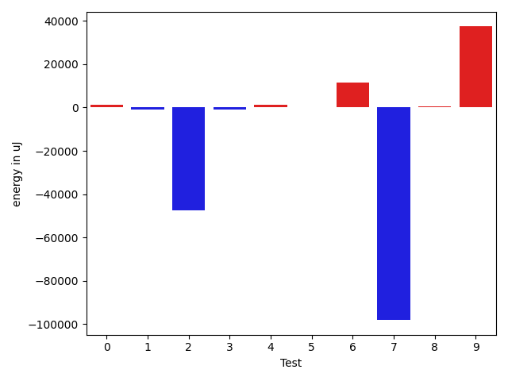
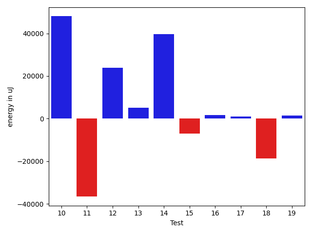
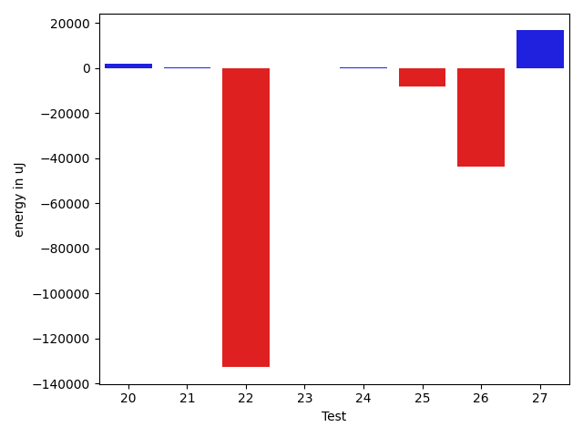
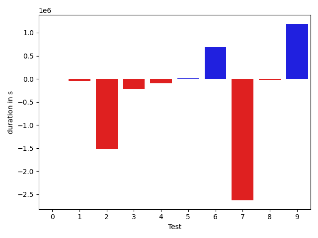
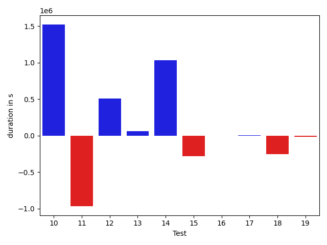
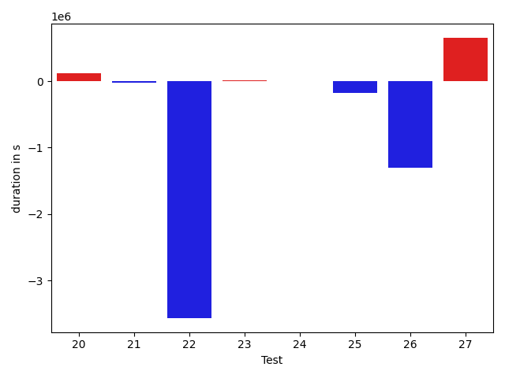

# gson 582b0a

https://github.com/google/gson/commit/582b0a

## Delta Energy per test method

| ID | EnergyV1 | EnergyV2 | DeltaEnergy | σ |
| --- | --- | --- | --- | --- |
| 0 | 34099.730769230766 | 35408.46666666667 | 1308.7358974359013 | 3637.004595476172 | 3832.98733568943 |
| 1 | 35638.205128205125 | 34524.13333333333 | -1114.0717948717938 | 9737.11146601045 | 2983.5185015161023 |
| 2 | 82103.84615384616 | 34673.40909090909 | -47430.43706293707 | 164080.15767082875 | 2269.303210220564 |
| 3 | 77356.34090909091 | 76552.72413793103 | -803.6167711598828 | 188135.5658298924 | 223454.2400205583 |
| 4 | 33375.35294117647 | 34496.8 | 1121.4470588235345 | 2453.2903221682286 | 3968.417538515825 |
| 5 | 34200.69565217391 | 34329.791666666664 | 129.09601449275215 | 2420.919595934796 | 3315.074747512826 |
| 6 | 80406.66666666667 | 92071.32142857143 | 11664.654761904763 | 191528.88882457407 | 209799.88592313623 |
| 7 | 140060.08333333334 | 41938.4 | -98121.68333333335 | 297242.0791688686 | 14740.106043037818 |
| 8 | 35059.41379310345 | 35591.433333333334 | 532.019540229885 | 3327.796874160413 | 4669.824548333933 |
| 9 | 179156.3260869565 | 216515.0487804878 | 37358.72269353128 | 373139.50097167905 | 366220.42580570886 |
| 10 | 74176.90909090909 | 122194.72727272728 | 48017.81818181819 | 184925.36685743084 | 277857.7913583889 |
| 11 | 71474.54166666667 | 34861.892857142855 | -36612.64880952382 | 180961.46181691546 | 3812.228073106008 |
| 12 | 46811.125 | 70621.0 | 23809.875 | 24905.546877674493 | 158026.78545219143 |
| 13 | 58124.31034482759 | 63153.58064516129 | 5029.270300333701 | 120248.83675718203 | 141225.68704617035 |
| 14 | 34251.217391304344 | 73871.96 | 39620.74260869566 | 3134.8678490491257 | 194316.27247566893 |
| 15 | 40545.88888888889 | 33618.38461538462 | -6927.504273504273 | 17086.845108604226 | 3408.8831701094746 |
| 16 | 32790.28571428572 | 34443.22727272727 | 1652.9415584415547 | 2448.640383537598 | 4011.631927417367 |
| 17 | 34633.64 | 35648.71428571428 | 1015.0742857142832 | 2596.846408704219 | 3839.5870393380924 |
| 18 | 423933.37209302327 | 405215.90476190473 | -18717.467331118532 | 407211.87313691556 | 393986.2557091367 |
| 19 | 33388.82608695652 | 34914.90476190476 | 1526.0786749482431 | 2971.1981575609166 | 2818.5707439318876 |
| 20 | 57326.06976744186 | 59182.97368421053 | 1856.9039167686642 | 24727.746875792625 | 27052.870127416914 |
| 21 | 34417.31578947369 | 34811.13043478261 | 393.8146453089212 | 4241.076502525863 | 3431.528057451042 |
| 22 | 167288.41379310345 | 34545.818181818184 | -132742.59561128527 | 333959.5973163384 | 4353.089306733403 |
| 23 | 34838.7 | 34768.41176470588 | -70.28823529411602 | 3416.063247365306 | 4720.611065365355 |
| 24 | 34779.34482758621 | 35288.333333333336 | 508.9885057471256 | 3598.103928612115 | 3428.981627247367 |
| 25 | 54937.850746268654 | 46734.5 | -8203.350746268654 | 56443.85520731456 | 18447.058128149685 |
| 26 | 157330.7619047619 | 113761.26315789473 | -43569.49874686716 | 267648.72425632545 | 198539.44856464115 |
| 27 | 41365.114285714284 | 58098.43661971831 | 16733.322334004028 | 19288.580356220293 | 72637.91181495744 |

## Delta Duration per test method

| ID | DurationV1 | DurationsV2 | DeltaDuration |
| --- | --- | --- | --- |
| 0 | 720006.8846153846 | 720518.4333333333 | 511.5487179487245 |
| 1 | 869507.0256410256 | 823033.8 | -46473.22564102558 |
| 2 | 2167903.6923076925 | 638976.1363636364 | -1528927.5559440563 |
| 3 | 2014830.5454545454 | 1806232.0689655172 | -208598.4764890282 |
| 4 | 594165.2941176471 | 496952.0 | -97213.2941176471 |
| 5 | 575530.3478260869 | 590932.625 | 15402.277173913084 |
| 6 | 1958965.076923077 | 2647640.714285714 | 688675.6373626371 |
| 7 | 3729134.0555555555 | 1099853.88 | -2629280.1755555556 |
| 8 | 649102.724137931 | 631083.8333333334 | -18018.890804597642 |
| 9 | 4739361.304347826 | 5933053.073170732 | 1193691.7688229056 |
| 10 | 1737106.7272727273 | 3258360.6363636362 | 1521253.909090909 |
| 11 | 1575241.5416666667 | 608804.0714285715 | -966437.4702380953 |
| 12 | 1191941.0416666667 | 1699159.4411764706 | 507218.39950980386 |
| 13 | 1445242.2068965517 | 1502260.8064516129 | 57018.5995550612 |
| 14 | 612384.8260869565 | 1641849.28 | 1029464.4539130435 |
| 15 | 834287.2777777778 | 554754.5769230769 | -279532.7008547009 |
| 16 | 557118.8571428572 | 553769.6818181818 | -3349.175324675394 |
| 17 | 646378.28 | 651796.6785714285 | 5418.398571428494 |
| 18 | 11168028.488372093 | 10915678.357142856 | -252350.13122923672 |
| 19 | 562058.2608695652 | 546433.7619047619 | -15624.498964803293 |
| 20 | 1698294.441860465 | 1816289.5263157894 | 117995.08445532434 |
| 21 | 578459.3157894737 | 555184.2608695652 | -23275.05491990852 |
| 22 | 4104383.4137931033 | 539162.6666666666 | -3565220.747126437 |
| 23 | 598509.15 | 605695.9411764706 | 7186.791176470579 |
| 24 | 627513.7586206896 | 630641.1666666666 | 3127.408045977005 |
| 25 | 1839143.134328358 | 1662700.0166666666 | -176443.1176616915 |
| 26 | 4772917.19047619 | 3470295.8947368423 | -1302621.295739348 |
| 27 | 1475110.4285714286 | 2127984.8169014086 | 652874.38832998 |

## Misc.

| ID | Test Class | Test Method |
| --- | --- | --- |
| 0 | com.google.gson.internal.bind.JsonElementReaderTest | testLenientNansAndInfinities |
| 1 | com.google.gson.internal.bind.JsonElementReaderTest | testWrongType |
| 2 | com.google.gson.internal.bind.JsonElementReaderTest | testStringsFromNumbers |
| 3 | com.google.gson.internal.bind.JsonElementReaderTest | testStrictNansAndInfinities |
| 4 | com.google.gson.internal.bind.JsonElementReaderTest | testEmptyArray |
| 5 | com.google.gson.internal.bind.JsonElementReaderTest | testStrings |
| 6 | com.google.gson.internal.bind.JsonElementReaderTest | testNumbers |
| 7 | com.google.gson.internal.bind.JsonElementReaderTest | testEmptyObject |
| 8 | com.google.gson.internal.bind.JsonElementReaderTest | testArray |
| 9 | com.google.gson.internal.bind.JsonElementReaderTest | testNumbersFromStrings |
| 10 | com.google.gson.internal.bind.JsonElementReaderTest | testBooleans |
| 11 | com.google.gson.internal.bind.JsonElementReaderTest | testEarlyClose |
| 12 | com.google.gson.internal.bind.JsonElementReaderTest | testNestedObjects |
| 13 | com.google.gson.internal.bind.JsonElementReaderTest | testSkipValue |
| 14 | com.google.gson.internal.bind.JsonElementReaderTest | testNulls |
| 15 | com.google.gson.internal.bind.JsonElementReaderTest | testObject |
| 16 | com.google.gson.internal.bind.JsonElementReaderTest | testNestedArrays |
| 17 | com.google.gson.JsonParserTest | testParseUnquotedMultiWordStringFails |
| 18 | com.google.gson.JsonParserTest | testParseUnquotedStringArrayFails |
| 19 | com.google.gson.JsonParserTest | testParseReader |
| 20 | com.google.gson.JsonParserTest | testParseMixedArray |
| 21 | com.google.gson.JsonParserTest | testParseUnquotedSingleWordStringFails |
| 22 | com.google.gson.JsonParserTest | testParseString |
| 23 | com.google.gson.JsonParserTest | testParseEmptyString |
| 24 | com.google.gson.JsonParserTest | testParseEmptyWhitespaceInput |
| 25 | com.google.gson.functional.JsonParserTest | testChangingCustomTreeAndDeserializing |
| 26 | com.google.gson.JsonObjectTest | testReadPropertyWithEmptyStringName |
| 27 | com.google.gson.functional.MapTest | testMapNamePromotionWithJsonElementReader |

| Test | IterationV1 | IterationV2 | DeltaIteration |
| --- | --- | --- | --- |
| 0 | 26 | 30 | 4 |
| 1 | 39 | 45 | 6 |
| 2 | 26 | 22 | -4 |
| 3 | 44 | 29 | -15 |
| 4 | 17 | 15 | -2 |
| 5 | 23 | 24 | 1 |
| 6 | 39 | 28 | -11 |
| 7 | 36 | 25 | -11 |
| 8 | 29 | 30 | 1 |
| 9 | 46 | 41 | -5 |
| 10 | 22 | 22 | 0 |
| 11 | 24 | 28 | 4 |
| 12 | 24 | 34 | 10 |
| 13 | 29 | 31 | 2 |
| 14 | 23 | 25 | 2 |
| 15 | 36 | 26 | -10 |
| 16 | 21 | 22 | 1 |
| 17 | 25 | 28 | 3 |
| 18 | 43 | 42 | -1 |
| 19 | 23 | 21 | -2 |
| 20 | 43 | 38 | -5 |
| 21 | 19 | 23 | 4 |
| 22 | 29 | 33 | 4 |
| 23 | 20 | 17 | -3 |
| 24 | 29 | 18 | -11 |
| 25 | 67 | 60 | -7 |
| 26 | 42 | 38 | -4 |
| 27 | 70 | 71 | 1 |

| Time Label | Time (s) |
| --- | --- |
| Selection | 26.264881372451782 |
| Injection | 11.023849487304688 |
| Total | 980.1628499031067 |

