# gson dc4e43

https://github.com/google/gson/commit/dc4e43

## Delta Energy per test method

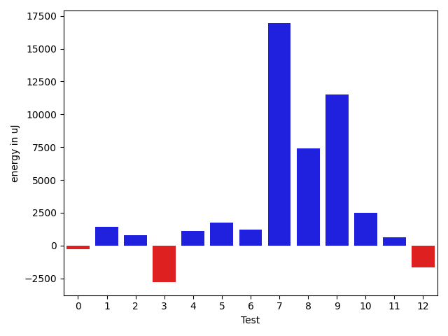

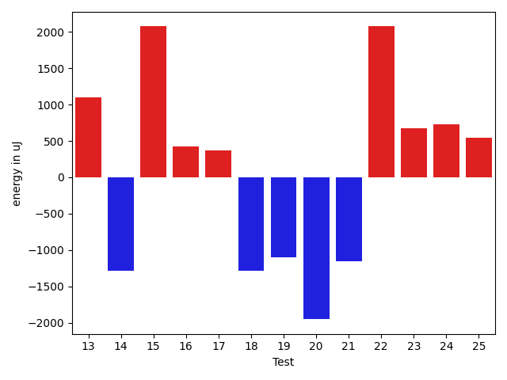

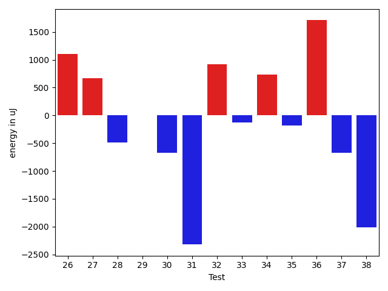

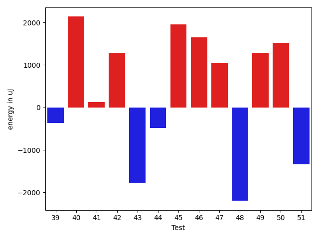

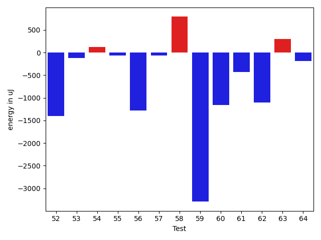

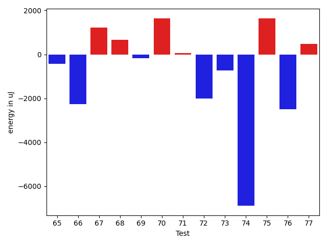

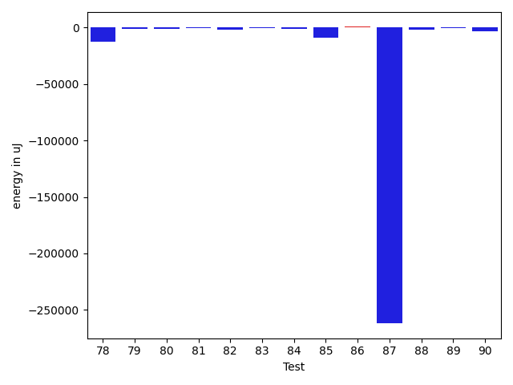

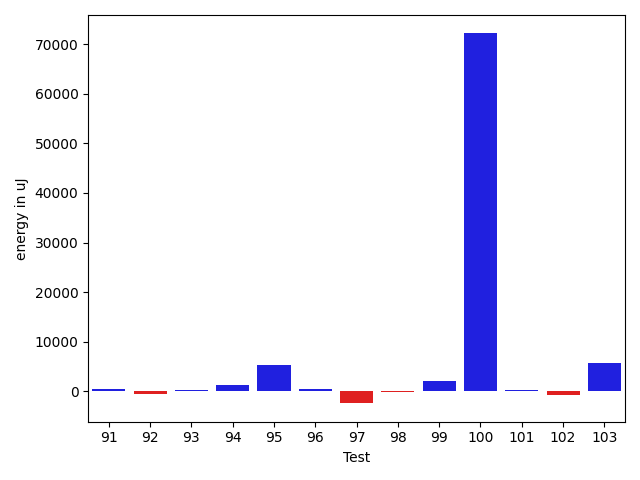

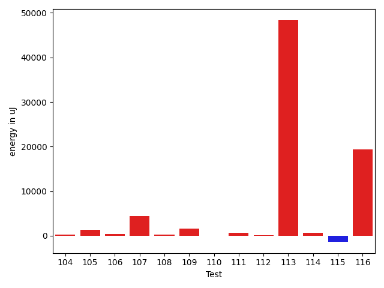

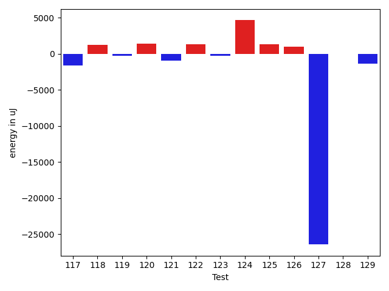

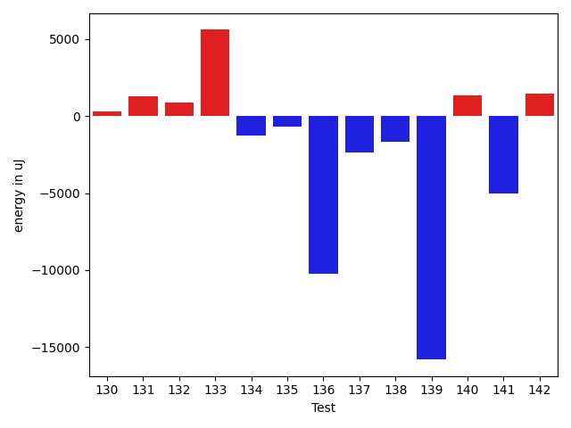

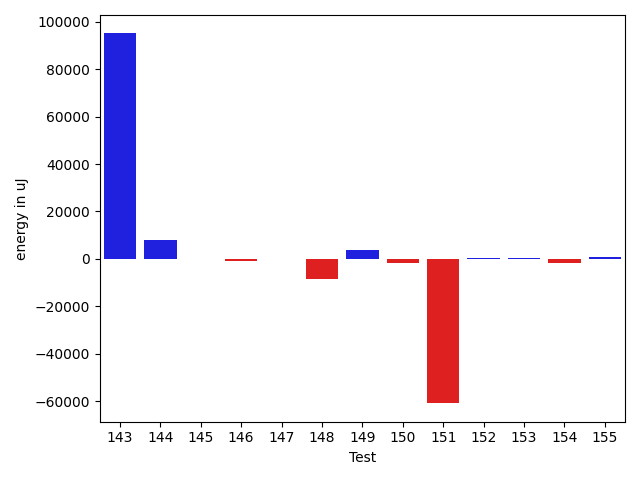

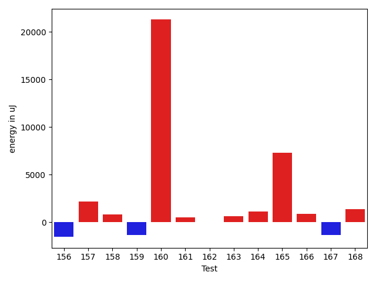

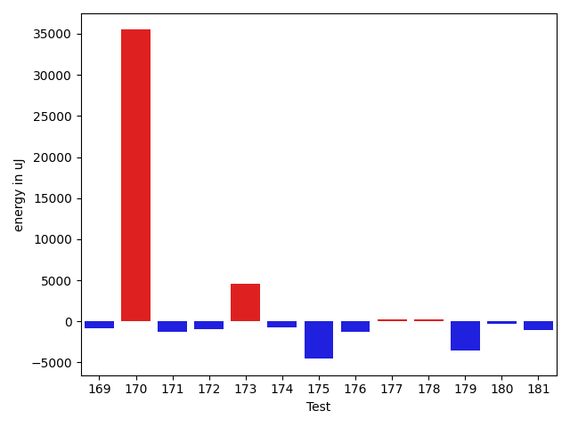

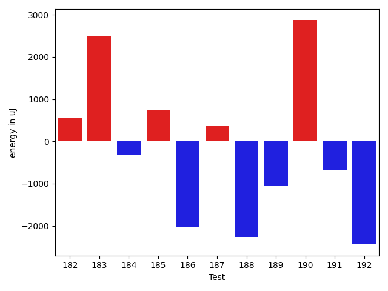

| ID | EnergyV1 | EnergyV2 | DeltaEnergy | σV1 | σV2 |
| --- | --- | --- | --- | --- | --- |
| 0 | 40538.88764044944 | 40277.471264367814 | -261.41637608162273 | 10307.097268374588 | 8419.64802393042 |
| 1 | 38770.73529411765 | 40197.67692307692 | 1426.94162895927 | 6014.417886891971 | 5428.460864477128 |
| 2 | 37351.89743589744 | 38168.48387096774 | 816.586435070305 | 4352.8595363653485 | 4803.505788759194 |
| 3 | 39161.09523809524 | 36366.34782608696 | -2794.747412008277 | 4602.970033987496 | 4471.493725801992 |
| 4 | 37233.936170212764 | 38342.34090909091 | 1108.4047388781473 | 4718.6866384271 | 7866.253601600324 |
| 5 | 37314.32 | 39054.833333333336 | 1740.513333333336 | 3305.2668602701356 | 4360.3154479413015 |
| 6 | 36364.6 | 37563.25 | 1198.6500000000015 | 3821.8494179301897 | 4786.07230670411 |
| 7 | 134788.11111111112 | 151714.52525252526 | 16926.414141414134 | 232357.32192417685 | 286551.65944582917 |
| 8 | 42945.357142857145 | 50326.22580645161 | 7380.868663594469 | 17905.279632158286 | 31519.185991934708 |
| 9 | 42624.282051282054 | 54149.4375 | 11525.155448717946 | 14286.815095993708 | 33454.64753301989 |
| 10 | 35724.84210526316 | 38234.142857142855 | 2509.300751879695 | 4756.357233531139 | 4151.273244562492 |
| 11 | 36923.1 | 37561.958333333336 | 638.8583333333372 | 5676.183038803452 | 5251.362699966287 |
| 12 | 39057.692307692305 | 37382.565217391304 | -1675.1270903010009 | 3839.902360229316 | 3919.2132953492523 |
| 13 | 38394.71875 | 39559.47619047619 | 1164.7574404761908 | 4712.741208908934 | 4451.91226562942 |
| 14 | 37408.10344827586 | 36779.72 | -628.3834482758612 | 4363.316180698659 | 3954.986033047399 |
| 15 | 37050.72 | 38494.52173913043 | 1443.801739130431 | 4368.715101903533 | 3640.288209678927 |
| 16 | 39138.0447761194 | 38456.509090909094 | -681.5356852103068 | 8647.395981834752 | 6352.149668699071 |
| 17 | 47929.05084745763 | 44485.092307692306 | -3443.958539765321 | 22135.91762879057 | 17958.62385401345 |
| 18 | 44562.24324324324 | 37433.44827586207 | -7128.794967381167 | 21797.713430052027 | 4711.669003553704 |
| 19 | 38548.604651162794 | 38574.0 | 25.395348837206257 | 4422.485295909587 | 6627.176633202073 |
| 20 | 40854.179487179485 | 38037.84848484849 | -2816.331002330997 | 12310.57980861156 | 4120.911329932296 |
| 21 | 37078.833333333336 | 36865.13333333333 | -213.70000000000437 | 4722.554172973209 | 3959.726974875358 |
| 22 | 36617.68421052631 | 38856.63157894737 | 2238.9473684210534 | 4299.677956760942 | 5493.831557306376 |
| 23 | 37784.166666666664 | 37406.13333333333 | -378.03333333333285 | 3754.283453603364 | 4642.005096459456 |
| 24 | 35387.698113207545 | 36385.52380952381 | 997.8256963162639 | 3590.4597203149333 | 4074.5499444028305 |
| 25 | 40209.51546391752 | 40231.11578947368 | 21.600325556159078 | 12586.202878109667 | 11046.643640646464 |
| 26 | 35794.27272727273 | 36086.51515151515 | 292.242424242424 | 3659.003716634777 | 3977.394183657772 |
| 27 | 35623.40625 | 36315.8 | 692.3937500000029 | 3403.3994114283646 | 4631.093434600516 |
| 28 | 36513.84905660377 | 36201.717391304344 | -312.1316652994283 | 3627.2514954409157 | 3688.617277535353 |
| 29 | 39023.386666666665 | 37825.22222222222 | -1198.1644444444464 | 10142.23520123427 | 5972.729166524213 |
| 30 | 35727.8 | 35873.12727272727 | 145.3272727272706 | 3721.0729019757437 | 4068.8774241665924 |
| 31 | 113844.46464646465 | 113100.9494949495 | -743.515151515152 | 22287.469816796358 | 20197.720568647503 |
| 32 | 34510.885714285716 | 35585.62962962963 | 1074.7439153439118 | 3317.4490868861326 | 4220.591578230852 |
| 33 | 36361.04347826087 | 35289.05882352941 | -1071.9846547314592 | 4327.574021452795 | 4950.673625829213 |
| 34 | 35093.083333333336 | 36398.03636363636 | 1304.953030303026 | 3404.3360845235134 | 3631.5604207539736 |
| 35 | 40353.7191011236 | 41067.21978021978 | 713.5006790961779 | 11275.253709982166 | 12029.084565758034 |
| 36 | 36854.40350877193 | 37356.04347826087 | 501.63996948894055 | 3383.8716114525832 | 3808.5670873675317 |
| 37 | 36673.52777777778 | 35538.07692307692 | -1135.450854700859 | 3555.7169732239436 | 3804.3701954234725 |
| 38 | 37378.55172413793 | 35733.458333333336 | -1645.0933908045918 | 4973.742652315512 | 3965.9039425580163 |
| 39 | 35158.206896551725 | 35490.969696969696 | 332.76280041797145 | 3319.9661545772788 | 3879.2284181643454 |
| 40 | 35742.16 | 36542.25 | 800.0899999999965 | 3712.6181347399574 | 4116.342209717263 |
| 41 | 35863.80952380953 | 35821.90697674418 | -41.90254706534324 | 4118.338304740184 | 4283.918613725183 |
| 42 | 36075.11111111111 | 36055.09090909091 | -20.020202020197758 | 3460.056885994938 | 4064.7627226857326 |
| 43 | 37781.93877551021 | 36778.47368421053 | -1003.4650912996804 | 4580.675564685259 | 4853.847484954817 |
| 44 | 45279.51724137931 | 49580.754385964916 | 4301.237144585604 | 22449.291737726715 | 31277.800768630295 |
| 45 | 110673.27692307692 | 124005.68253968254 | 13332.405616605625 | 272629.5704008256 | 298855.1463783945 |
| 46 | 79841.83838383839 | 82892.9191919192 | 3051.0808080808056 | 20298.299066276006 | 20320.00571893897 |
| 47 | 40038.140845070426 | 42373.44736842105 | 2335.3065233506277 | 10528.896167945333 | 13356.603074681761 |
| 48 | 43944.12280701754 | 44873.51612903226 | 929.3933220147155 | 17450.929230846312 | 23529.094671410363 |
| 49 | 36271.03333333333 | 37704.17021276596 | 1433.1368794326263 | 4853.3289192974435 | 4187.028161129496 |
| 50 | 35950.9375 | 38012.53333333333 | 2061.595833333333 | 4032.478220680233 | 4265.7088331119 |
| 51 | 38296.079365079364 | 36305.14035087719 | -1990.939014202173 | 8926.44769513711 | 3944.842662188752 |
| 52 | 36598.125 | 35854.97959183674 | -743.1454081632619 | 4314.883283732266 | 3766.9716657012104 |
| 53 | 36419.45283018868 | 35951.811320754714 | -467.64150943396817 | 4363.164900148539 | 3305.086640354409 |
| 54 | 38716.549019607846 | 37336.895833333336 | -1379.6531862745105 | 9993.10824737106 | 7152.828465135267 |
| 55 | 41907.47727272727 | 42627.40909090909 | 719.9318181818162 | 13724.213598084485 | 12774.810773048268 |
| 56 | 35786.916666666664 | 36392.42857142857 | 605.5119047619082 | 4420.399318154916 | 3263.4211959293293 |
| 57 | 35985.59090909091 | 35845.529411764706 | -140.06149732620543 | 4546.242541015112 | 3515.6966696039576 |
| 58 | 35234.67857142857 | 35729.16129032258 | 494.48271889401076 | 3782.970724685367 | 3156.018981675349 |
| 59 | 38613.891304347824 | 36588.02 | -2025.8713043478274 | 3844.846309068695 | 4471.08836186448 |
| 60 | 43398.83870967742 | 42210.2962962963 | -1188.5424133811175 | 17159.747561111795 | 16836.04814371216 |
| 61 | 39569.8125 | 40374.88888888889 | 805.0763888888905 | 4581.522921185024 | 4607.732364537884 |
| 62 | 39584.4 | 40140.72222222222 | 556.3222222222175 | 5264.105977276673 | 2848.3730405961683 |
| 63 | 44162.46666666667 | 43641.64473684211 | -520.8219298245604 | 17491.05402833752 | 13559.13455717501 |
| 64 | 50256.38144329897 | 52402.26530612245 | 2145.8838628234807 | 23365.397609110372 | 27087.21277483537 |
| 65 | 66660.0 | 58026.793650793654 | -8633.206349206346 | 97675.56239193428 | 80775.7008062152 |
| 66 | 39236.23728813559 | 37385.660377358494 | -1850.5769107770975 | 7980.698666027405 | 7045.226642961473 |
| 67 | 37459.09756097561 | 39248.102040816324 | 1789.0044798407107 | 4186.118382515368 | 4681.222861537741 |
| 68 | 60626.84375 | 65134.8064516129 | 4507.962701612902 | 43488.63516251692 | 47393.680703768 |
| 69 | 41934.4 | 42908.529411764706 | 974.1294117647049 | 10752.124440446973 | 12212.582955911386 |
| 70 | 37957.416666666664 | 38964.78333333333 | 1007.3666666666686 | 3932.7701318183126 | 4158.108693030469 |
| 71 | 38797.34482758621 | 37906.53125 | -890.8135775862102 | 8610.426699650805 | 4326.060260100804 |
| 72 | 131565.39705882352 | 75673.0923076923 | -55892.30475113122 | 376582.2759596437 | 219417.90577075118 |
| 73 | 37828.979166666664 | 37414.434782608696 | -414.5443840579683 | 3714.286357485016 | 4369.156896344777 |
| 74 | 60862.0 | 41370.882352941175 | -19491.117647058825 | 40869.45455145362 | 15500.58759752391 |
| 75 | 36727.725 | 38400.4358974359 | 1672.7108974358998 | 4129.738314878437 | 3857.8579800983875 |
| 76 | 48223.897959183676 | 42922.916666666664 | -5300.981292517012 | 20028.677966136966 | 16508.880351865846 |
| 77 | 36970.545454545456 | 36972.0 | 1.4545454545441316 | 3936.6509246413175 | 4272.9290624497 |
| 78 | 57473.45945945946 | 44985.333333333336 | -12488.126126126124 | 44052.94930985899 | 27658.2210166445 |
| 79 | 38141.35555555556 | 37259.87234042553 | -881.4832151300288 | 4176.833548970137 | 4630.064420382781 |
| 80 | 37315.92307692308 | 35858.03333333333 | -1457.8897435897452 | 4292.103535949897 | 3269.528584605976 |
| 81 | 38364.391304347824 | 38183.65 | -180.74130434782273 | 4568.02219345795 | 4984.466303176298 |
| 82 | 38399.48837209302 | 36821.78846153846 | -1577.699910554562 | 5418.734093872604 | 3654.6199388663067 |
| 83 | 37088.01515151515 | 36763.34848484849 | -324.66666666666424 | 4005.4748119876385 | 4461.336233082966 |
| 84 | 37103.53125 | 35955.7 | -1147.831250000003 | 3371.9196404308686 | 3356.7702349133165 |
| 85 | 51586.41463414634 | 42385.83870967742 | -9200.575924468925 | 34029.91262789584 | 20947.19768323288 |
| 86 | 37139.846153846156 | 37728.09090909091 | 588.2447552447557 | 3537.6210682441965 | 3694.006040614873 |
| 87 | 301143.4736842105 | 39145.142857142855 | -261998.33082706766 | 513887.4883324854 | 4956.158576633186 |
| 88 | 38889.333333333336 | 37109.24137931035 | -1780.091954022988 | 4208.907693478467 | 4235.8375278598305 |
| 89 | 37217.13953488372 | 36437.8431372549 | -779.2963976288156 | 4828.3411787765735 | 4615.922958597534 |
| 90 | 230721.48484848486 | 227580.36363636365 | -3141.1212121212156 | 274961.39114066056 | 288003.5594095931 |
| 91 | 37799.09090909091 | 38311.6 | 512.5090909090868 | 4266.205697378128 | 4228.065409459351 |
| 92 | 37884.348837209305 | 37339.77777777778 | -544.5710594315242 | 4106.732775286813 | 3671.261950089211 |
| 93 | 37428.69642857143 | 37649.818181818184 | 221.12175324675627 | 4484.942123848753 | 4252.023907787525 |
| 94 | 36081.833333333336 | 37292.40677966102 | 1210.5734463276822 | 4269.282430599108 | 4887.371298296423 |
| 95 | 50591.833333333336 | 55936.32142857143 | 5344.488095238092 | 26456.83730542174 | 30343.382125095104 |
| 96 | 55051.944444444445 | 55396.22727272727 | 344.2828282828268 | 34154.47303139765 | 35720.60452689077 |
| 97 | 38771.857142857145 | 36344.03846153846 | -2427.818681318684 | 4596.828692393364 | 4186.079058395349 |
| 98 | 37356.181818181816 | 37166.354838709674 | -189.82697947214183 | 4272.55363960545 | 5002.833413617934 |
| 99 | 37020.333333333336 | 38981.083333333336 | 1960.75 | 4047.7566376920195 | 4433.858743145373 |
| 100 | 83976.63076923077 | 156156.4605263158 | 72179.82975708501 | 157716.34795656402 | 335394.08709615655 |
| 101 | 36604.90476190476 | 36756.44 | 151.53523809523904 | 3451.006760004445 | 4159.772677250525 |
| 102 | 36819.444444444445 | 36136.55319148936 | -682.8912529550871 | 4064.760280238241 | 3885.1050250516146 |
| 103 | 43643.72727272727 | 49289.24444444444 | 5645.517171717169 | 20172.438446182303 | 26941.38807622169 |
| 104 | 36486.76 | 36777.565217391304 | 290.805217391302 | 3818.011663470922 | 3798.9697782664016 |
| 105 | 36817.666666666664 | 38115.71428571428 | 1298.0476190476184 | 4305.164215906976 | 4378.247235726057 |
| 106 | 35917.76190476191 | 36381.791666666664 | 464.029761904756 | 4440.918586924513 | 3481.113961784439 |
| 107 | 42231.5 | 46731.94285714286 | 4500.442857142858 | 17159.945975013576 | 23921.890393460435 |
| 108 | 36672.914893617024 | 37004.36842105263 | 331.45352743560943 | 4364.688182324955 | 3546.555559687475 |
| 109 | 37391.17647058824 | 39037.0 | 1645.8235294117621 | 3988.671358253554 | 3896.130099213834 |
| 110 | 36392.25 | 36445.708333333336 | 53.45833333333576 | 3712.4697961734314 | 4629.303416634503 |
| 111 | 37501.75 | 38198.16 | 696.4100000000035 | 3724.624608361799 | 3972.978234825859 |
| 112 | 37227.206896551725 | 37359.45 | 132.24310344827245 | 3877.569318434267 | 4777.1814595533215 |
| 113 | 69536.22972972973 | 117918.16455696203 | 48381.9348272323 | 202759.67048177918 | 327170.892079138 |
| 114 | 37748.28125 | 38456.395348837206 | 708.1140988372063 | 4417.583758645493 | 4916.039468210322 |
| 115 | 38048.09523809524 | 36666.18518518518 | -1381.9100529100542 | 5939.4813378238905 | 4681.3955661947575 |
| 116 | 42796.05172413793 | 62148.68421052631 | 19352.632486388386 | 13838.566695542562 | 41328.01228221026 |
| 117 | 60030.65151515151 | 39274.729166666664 | -20755.922348484848 | 36845.65937491821 | 6470.333671649603 |
| 118 | 37133.229508196724 | 37197.903225806454 | 64.67371760973037 | 4318.828686810177 | 3718.9700434640695 |
| 119 | 45350.5 | 42621.01388888889 | -2729.4861111111095 | 17307.324776666093 | 11460.999329238575 |
| 120 | 37625.4375 | 37739.9375 | 114.5 | 4118.226554528913 | 3892.6023878968704 |
| 121 | 42639.51898734177 | 40979.16455696202 | -1660.3544303797462 | 14584.55346309903 | 12448.607505300432 |
| 122 | 38031.95652173913 | 39732.89705882353 | 1700.9405370844033 | 4717.991384927973 | 8247.473934376916 |
| 123 | 39356.68493150685 | 39942.305555555555 | 585.6206240487081 | 7550.20542925949 | 8628.134574748425 |
| 124 | 105422.28282828283 | 209959.1616161616 | 104536.87878787878 | 180894.07990156882 | 447423.3174624736 |
| 125 | 48149.793650793654 | 55456.55882352941 | 7306.765172735759 | 22178.053913049233 | 28522.195188382448 |
| 126 | 39450.02597402597 | 41362.63636363636 | 1912.6103896103887 | 8196.558264048925 | 10673.512137449794 |
| 127 | 127254.9494949495 | 118272.22222222222 | -8982.72727272728 | 307391.72292795003 | 329107.3040293175 |
| 128 | 42194.54878048781 | 40687.71604938272 | -1506.832731105089 | 10768.335652988597 | 8764.566237933577 |
| 129 | 39432.683333333334 | 38010.34920634921 | -1422.3341269841258 | 3975.0408320404567 | 4562.082485906371 |
| 130 | 37348.68253968254 | 37628.54666666667 | 279.8641269841319 | 4020.2430228421526 | 4709.778229154979 |
| 131 | 50898.677083333336 | 52175.593406593405 | 1276.9163232600695 | 28490.076096589757 | 31263.270262306574 |
| 132 | 39272.75903614458 | 40169.425 | 896.6659638554265 | 9091.6917436313 | 10622.596833843172 |
| 133 | 51343.4125 | 56951.641975308645 | 5608.229475308646 | 46319.102283964276 | 52663.76478745009 |
| 134 | 39270.0 | 37989.94285714286 | -1280.057142857142 | 4286.4296751492375 | 4409.164999944398 |
| 135 | 37832.10526315789 | 37152.0 | -680.1052631578932 | 4617.631095733838 | 4348.561193084443 |
| 136 | 133638.46153846153 | 123396.5 | -10241.961538461532 | 242104.13964847827 | 286746.4941270231 |
| 137 | 40220.35135135135 | 37842.958333333336 | -2377.3930180180178 | 3716.331496983436 | 4552.440746266104 |
| 138 | 39753.10526315789 | 38076.068181818184 | -1677.0370813397094 | 4859.633735329366 | 4776.112604303588 |
| 139 | 100098.28169014085 | 84276.875 | -15821.406690140851 | 249656.12458560625 | 213305.39794282487 |
| 140 | 43842.955882352944 | 45198.666666666664 | 1355.71078431372 | 20093.275180600787 | 22368.63679351068 |
| 141 | 50315.64646464647 | 45313.232323232325 | -5002.414141414141 | 18391.850794378726 | 15902.15044147167 |
| 142 | 38093.4375 | 39560.313725490196 | 1466.8762254901958 | 3978.95725403366 | 7601.277048254552 |
| 143 | 53408.81578947369 | 148493.13513513515 | 95084.31934566147 | 41665.10861358525 | 354781.80139958294 |
| 144 | 38993.51612903226 | 47166.78125 | 8173.265120967742 | 4589.5361482606795 | 20713.221536518613 |
| 145 | 38110.818181818184 | 37857.57894736842 | -253.2392344497639 | 4135.978873213621 | 4845.716331986749 |
| 146 | 37586.40740740741 | 36665.73333333333 | -920.6740740740788 | 4518.225358431644 | 4097.061417921656 |
| 147 | 38189.192307692305 | 37972.851851851854 | -216.3404558404509 | 3764.8560705886916 | 4063.240676217314 |
| 148 | 69675.32727272727 | 61203.91803278688 | -8471.409239940389 | 171819.68182498286 | 151897.18183447502 |
| 149 | 38978.529411764706 | 42666.90740740741 | 3688.3779956427024 | 4282.795103223334 | 10178.461721200565 |
| 150 | 37062.666666666664 | 35352.0 | -1710.6666666666642 | 3392.8134319657165 | 3579.265182967029 |
| 151 | 120531.37362637362 | 59635.26373626374 | -60896.10989010988 | 342679.0541057731 | 133957.9972298054 |
| 152 | 37890.916666666664 | 38445.48648648649 | 554.5698198198224 | 4779.569218007228 | 4437.408031002014 |
| 153 | 36812.13333333333 | 37280.76190476191 | 468.62857142857683 | 3353.3169423058653 | 4840.062533094282 |
| 154 | 38775.17647058824 | 36897.58823529412 | -1877.588235294119 | 3409.5705307490343 | 3293.129658561425 |
| 155 | 36739.9 | 37647.82352941176 | 907.9235294117607 | 4449.00984377423 | 5055.034057432186 |
| 156 | 39076.76470588235 | 37546.28 | -1530.4847058823507 | 3948.615848763623 | 4570.529216797548 |
| 157 | 36068.0 | 38259.26315789474 | 2191.2631578947403 | 3865.5663309305055 | 4492.397002212156 |
| 158 | 42652.2676056338 | 43479.45205479452 | 827.1844491607189 | 10997.664303826281 | 14499.910480631646 |
| 159 | 65750.78787878787 | 64425.21212121212 | -1325.5757575757525 | 24609.161060188897 | 28456.974268722985 |
| 160 | 138532.1717171717 | 159800.75757575757 | 21268.585858585866 | 192240.4669907168 | 243804.672871298 |
| 161 | 38253.981132075474 | 38754.901960784315 | 500.9208287088404 | 4537.246257744624 | 4681.669390773547 |
| 162 | 36006.0 | 36041.3125 | 35.3125 | 3407.166203527726 | 3633.1747260273282 |
| 163 | 38488.8 | 39120.35 | 631.5499999999956 | 4161.2697293013825 | 3989.7851355054195 |
| 164 | 40430.181818181816 | 41562.375 | 1132.1931818181838 | 3905.9570080532544 | 4017.8859056774704 |
| 165 | 239339.12121212122 | 246613.47474747474 | 7274.353535353526 | 77128.66707255707 | 86746.14205951155 |
| 166 | 39102.01298701299 | 40003.536231884056 | 901.5232448710667 | 8314.28799068442 | 6601.880510708502 |
| 167 | 39841.28 | 38485.12280701754 | -1356.1571929824568 | 9470.80913130446 | 5143.154305772734 |
| 168 | 47287.846153846156 | 48666.470588235294 | 1378.6244343891376 | 14686.734301330225 | 13481.091398991346 |
| 169 | 39870.48 | 39004.23809523809 | -866.2419047619114 | 4638.544738341972 | 4512.678624928002 |
| 170 | 173484.7142857143 | 208973.37931034484 | 35488.66502463055 | 422745.30969335174 | 431467.91083793953 |
| 171 | 38384.22222222222 | 37112.52631578947 | -1271.6959064327457 | 4167.541422250394 | 4483.1023606006665 |
| 172 | 38243.583333333336 | 37295.142857142855 | -948.4404761904807 | 4113.5969349287925 | 3601.9867307033855 |
| 173 | 50979.96296296296 | 55577.32258064516 | 4597.359617682196 | 18272.170704595763 | 24013.238494478745 |
| 174 | 39128.153846153844 | 38360.45 | -767.7038461538468 | 3494.4671178693075 | 4225.1659905262895 |
| 175 | 39351.739130434784 | 34798.2 | -4553.539130434787 | 4343.604406054365 | 3890.5876711194505 |
| 176 | 38598.53333333333 | 37310.294117647056 | -1288.239215686277 | 3950.210540661795 | 4225.286579416915 |
| 177 | 36658.22222222222 | 36842.0625 | 183.840277777781 | 3884.3435675307196 | 4756.700963755631 |
| 178 | 37433.230769230766 | 37644.46153846154 | 211.23076923077315 | 5635.337504790588 | 3405.253037370455 |
| 179 | 39870.875 | 36350.642857142855 | -3520.232142857145 | 4568.683876060479 | 4277.271336580682 |
| 180 | 37658.6 | 37399.76190476191 | -258.8380952380903 | 4161.190002871775 | 3883.635629821034 |
| 181 | 38112.295454545456 | 37003.260869565216 | -1109.0345849802397 | 4185.3330734164865 | 3833.9068644126646 |
| 182 | 37367.25714285715 | 37001.60526315789 | -365.6518796992532 | 4215.775884141153 | 4672.876661281704 |
| 183 | 37741.229166666664 | 38142.916666666664 | 401.6875 | 4995.432318793771 | 3992.9362151248492 |
| 184 | 167357.0606060606 | 177856.07352941178 | 10499.012923351169 | 384775.619314996 | 454358.0263902193 |
| 185 | 37951.58 | 37297.754385964916 | -653.8256140350859 | 4207.8706971103575 | 4249.21286944408 |
| 186 | 76404.40625 | 38776.83870967742 | -37627.56754032258 | 197124.21333892804 | 4786.338664647029 |
| 187 | 41660.55172413793 | 91546.12280701754 | 49885.571082879615 | 11988.788683991123 | 267557.04100949544 |
| 188 | 334389.1176470588 | 166701.9375 | -167687.1801470588 | 463536.68083282857 | 339738.6718386407 |
| 189 | 140836.7619047619 | 173525.63157894736 | 32688.869674185466 | 312182.36428681435 | 390456.0119155159 |
| 190 | 38091.71428571428 | 39175.25 | 1083.5357142857174 | 4211.395325190217 | 3514.4436810823986 |
| 191 | 39202.11538461538 | 38859.82 | -342.2953846153832 | 6268.6782763865185 | 4055.4878655471284 |
| 192 | 40005.63636363636 | 38542.58620689655 | -1463.0501567398096 | 4414.751949641056 | 5227.1244650957815 |

## Delta Duration per test method

| ID | DurationV1 | DurationsV2 | DeltaDuration |
| --- | --- | --- | --- |
| 0 | 1207916.3258426967 | 1169206.2758620689 | -38710.04998062784 |
| 1 | 1098599.0 | 1015310.4307692308 | -83288.56923076918 |
| 2 | 624968.7435897436 | 606384.4516129033 | -18584.29197684035 |
| 3 | 494450.14285714284 | 624241.4782608695 | 129791.33540372667 |
| 4 | 765179.4893617021 | 796833.5227272727 | 31654.03336557059 |
| 5 | 466892.52 | 523166.3333333333 | 56273.813333333295 |
| 6 | 513421.0333333333 | 583444.03125 | 70022.99791666667 |
| 7 | 3832964.101010101 | 4231711.01010101 | 398746.9090909092 |
| 8 | 891309.9047619047 | 1167135.7741935484 | 275825.86943164363 |
| 9 | 979381.4615384615 | 1400155.6875 | 420774.2259615385 |
| 10 | 398127.2105263158 | 403248.78571428574 | 5121.575187969953 |
| 11 | 550613.75 | 540191.0 | -10422.75 |
| 12 | 514493.1153846154 | 512577.52173913043 | -1915.5936454849434 |
| 13 | 481061.96875 | 500368.38095238095 | 19306.412202380947 |
| 14 | 546413.2068965518 | 527936.0 | -18477.20689655177 |
| 15 | 517379.4 | 528303.304347826 | 10923.904347826028 |
| 16 | 960741.0447761194 | 965396.2181818181 | 4655.173405698733 |
| 17 | 1271936.3898305085 | 1122709.276923077 | -149227.11290743155 |
| 18 | 773727.027027027 | 633749.448275862 | -139977.57875116495 |
| 19 | 809784.7906976744 | 767526.1702127659 | -42258.62048490846 |
| 20 | 720044.7948717949 | 642801.8181818182 | -77242.97668997664 |
| 21 | 447411.8888888889 | 434897.4 | -12514.488888888853 |
| 22 | 519959.7368421053 | 451462.84210526315 | -68496.89473684214 |
| 23 | 450861.3888888889 | 449706.0 | -1155.388888888876 |
| 24 | 786634.7735849057 | 766885.4523809524 | -19749.321203953237 |
| 25 | 1337079.3505154639 | 1282866.8105263158 | -54212.539989148034 |
| 26 | 658791.4545454546 | 606631.1818181818 | -52160.27272727282 |
| 27 | 512447.03125 | 488825.16 | -23621.871250000026 |
| 28 | 725160.4339622641 | 710700.2826086957 | -14460.15135356842 |
| 29 | 1120210.0133333334 | 1003514.3333333334 | -116695.68000000005 |
| 30 | 732105.0909090909 | 726859.6181818182 | -5245.472727272776 |
| 31 | 3446384.9696969697 | 3395281.5555555555 | -51103.41414141422 |
| 32 | 514167.0571428572 | 495819.55555555556 | -18347.50158730161 |
| 33 | 524022.5652173913 | 526290.7352941176 | 2268.1700767262955 |
| 34 | 849577.8 | 819256.2 | -30321.600000000093 |
| 35 | 1310878.1797752809 | 1245518.3406593406 | -65359.83911594027 |
| 36 | 792601.245614035 | 753325.4565217391 | -39275.78909229592 |
| 37 | 641969.9166666666 | 628808.8205128205 | -13161.096153846127 |
| 38 | 490718.6206896552 | 475353.625 | -15364.995689655188 |
| 39 | 509862.724137931 | 500252.48484848486 | -9610.239289446152 |
| 40 | 500404.72 | 429023.9166666667 | -71380.80333333329 |
| 41 | 783318.6428571428 | 730146.6976744186 | -53171.945182724274 |
| 42 | 472647.8888888889 | 458104.63636363635 | -14543.252525252523 |
| 43 | 770809.1428571428 | 710797.947368421 | -60011.19548872183 |
| 44 | 1133136.1206896552 | 1280963.105263158 | 147826.9845735028 |
| 45 | 2971406.4153846153 | 3357603.095238095 | 386196.67985347984 |
| 46 | 2476853.393939394 | 2489134.393939394 | 12281.0 |
| 47 | 1118508.7323943663 | 1140602.5263157894 | 22093.793921423145 |
| 48 | 946157.7192982456 | 1098916.2903225806 | 152758.571024335 |
| 49 | 764448.2666666667 | 723928.1276595745 | -40520.13900709222 |
| 50 | 714810.5833333334 | 709740.7555555556 | -5069.8277777777985 |
| 51 | 944412.0476190476 | 901730.9824561403 | -42681.06516290724 |
| 52 | 772205.7678571428 | 784239.918367347 | 12034.150510204141 |
| 53 | 814193.5660377359 | 819773.4339622641 | 5579.867924528196 |
| 54 | 874993.5490196078 | 898189.375 | 23195.82598039217 |
| 55 | 931608.4090909091 | 992517.7045454546 | 60909.29545454553 |
| 56 | 595700.3333333334 | 618268.2285714286 | 22567.895238095196 |
| 57 | 499058.0909090909 | 418097.35294117645 | -80960.73796791444 |
| 58 | 544610.3928571428 | 542980.7096774194 | -1629.6831797234481 |
| 59 | 811917.7173913043 | 834283.46 | 22365.74260869564 |
| 60 | 957154.4193548387 | 1005018.2777777778 | 47863.85842293908 |
| 61 | 463433.125 | 418688.27777777775 | -44744.84722222225 |
| 62 | 535050.6 | 462044.3333333333 | -73006.26666666666 |
| 63 | 1139431.08 | 1127832.9868421052 | -11598.09315789491 |
| 64 | 1581667.4948453608 | 1652851.724489796 | 71184.22964443523 |
| 65 | 1854580.9516129033 | 1555568.5238095238 | -299012.4278033795 |
| 66 | 877445.5254237289 | 930681.8301886793 | 53236.304764950415 |
| 67 | 727496.9512195121 | 774835.1428571428 | 47338.19163763069 |
| 68 | 1787500.0520833333 | 1941487.6021505375 | 153987.55006720428 |
| 69 | 1067948.6714285715 | 1112379.8088235294 | 44431.13739495794 |
| 70 | 862138.1666666666 | 818077.7 | -44060.466666666674 |
| 71 | 726057.0 | 651160.5 | -74896.5 |
| 72 | 3476701.1470588236 | 2005601.5076923077 | -1471099.639366516 |
| 73 | 640107.3541666666 | 508189.52173913043 | -131917.8324275362 |
| 74 | 1289183.2916666667 | 594333.1176470588 | -694850.174019608 |
| 75 | 622398.375 | 574389.358974359 | -48009.016025641 |
| 76 | 1497181.142857143 | 1428891.3645833333 | -68289.7782738097 |
| 77 | 796796.0545454546 | 771174.3863636364 | -25621.66818181821 |
| 78 | 1253460.027027027 | 920314.5833333334 | -333145.4436936936 |
| 79 | 764915.088888889 | 668560.5531914893 | -96354.53569739964 |
| 80 | 479579.6538461539 | 439225.0333333333 | -40354.62051282055 |
| 81 | 549058.6086956522 | 593977.1 | 44918.49130434776 |
| 82 | 785220.2093023256 | 697866.0192307692 | -87354.19007155637 |
| 83 | 913794.7121212122 | 859308.2424242424 | -54486.469696969725 |
| 84 | 512581.09375 | 516217.6 | 3636.5062499999767 |
| 85 | 1173224.3902439023 | 713500.5161290322 | -459723.8741148701 |
| 86 | 548688.5 | 458714.0909090909 | -89974.40909090912 |
| 87 | 8004924.315789473 | 445397.35714285716 | -7559526.958646616 |
| 88 | 498689.9166666667 | 453417.8275862069 | -45272.08908045979 |
| 89 | 726011.8139534884 | 732856.1568627451 | 6844.342909256695 |
| 90 | 6458074.171717172 | 6359301.666666667 | -98772.50505050458 |
| 91 | 604560.1515151515 | 562893.7333333333 | -41666.41818181821 |
| 92 | 675212.3720930233 | 689607.2222222222 | 14394.850129198981 |
| 93 | 789083.9464285715 | 802004.1818181818 | 12920.235389610287 |
| 94 | 890566.05 | 914293.5084745763 | 23727.45847457624 |
| 95 | 1059411.9333333333 | 1350717.4642857143 | 291305.53095238097 |
| 96 | 1301141.25 | 1355987.6590909092 | 54846.409090909176 |
| 97 | 446967.5714285714 | 451145.6153846154 | 4178.043956043955 |
| 98 | 555040.2272727273 | 590951.5806451613 | 35911.35337243404 |
| 99 | 549179.4848484849 | 611754.25 | 62574.76515151514 |
| 100 | 2380226.4153846153 | 4190861.25 | 1810634.8346153847 |
| 101 | 778031.2142857143 | 843107.5 | 65076.28571428568 |
| 102 | 741805.3888888889 | 739218.6808510638 | -2586.7080378250685 |
| 103 | 860917.6666666666 | 1133306.1333333333 | 272388.4666666667 |
| 104 | 513217.36 | 545323.7826086957 | 32106.42260869569 |
| 105 | 776847.4444444445 | 826741.4693877551 | 49894.02494331065 |
| 106 | 526276.9523809524 | 605148.5833333334 | 78871.63095238095 |
| 107 | 602474.9615384615 | 908352.2285714286 | 305877.26703296707 |
| 108 | 803095.085106383 | 881106.4385964912 | 78011.35349010827 |
| 109 | 540266.0882352941 | 604957.4166666666 | 64691.32843137253 |
| 110 | 529706.15 | 561425.75 | 31719.599999999977 |
| 111 | 496784.78571428574 | 551563.64 | 54778.854285714275 |
| 112 | 530873.3103448276 | 556454.75 | 25581.439655172406 |
| 113 | 2037102.0675675676 | 3390582.7721518986 | 1353480.704584331 |
| 114 | 635300.375 | 642968.6744186047 | 7668.2994186047 |
| 115 | 584099.0476190476 | 494817.0 | -89282.04761904757 |
| 116 | 1105703.6206896552 | 1681621.5614035088 | 575917.9407138536 |
| 117 | 1596652.4090909092 | 804486.625 | -792165.7840909092 |
| 118 | 881256.5573770492 | 767305.1935483871 | -113951.36382866208 |
| 119 | 1317566.875 | 1260092.875 | -57474.0 |
| 120 | 792610.9166666666 | 687648.125 | -104962.79166666663 |
| 121 | 1200571.0886075948 | 1135223.3670886075 | -65347.721518987324 |
| 122 | 969236.6376811594 | 1032627.3088235294 | 63390.671142369974 |
| 123 | 1027582.4657534247 | 1094559.1805555555 | 66976.71480213082 |
| 124 | 3128719.4242424243 | 5753850.98989899 | 2625131.5656565656 |
| 125 | 1202660.0793650793 | 1478621.3676470588 | 275961.2882819795 |
| 126 | 1051255.961038961 | 1153519.2727272727 | 102263.31168831163 |
| 127 | 3757606.585858586 | 3426455.393939394 | -331151.19191919174 |
| 128 | 1251727.6707317072 | 1145877.024691358 | -105850.64604034927 |
| 129 | 861949.2333333333 | 806356.7777777778 | -55592.45555555553 |
| 130 | 981586.126984127 | 997232.3333333334 | 15646.20634920639 |
| 131 | 1504676.09375 | 1584037.2637362638 | 79361.16998626385 |
| 132 | 1204139.373493976 | 1198526.425 | -5612.948493975913 |
| 133 | 1616561.2375 | 1722900.2716049382 | 106339.03410493815 |
| 134 | 542995.96 | 574304.0285714286 | 31308.068571428652 |
| 135 | 704720.5263157894 | 658807.625 | -45912.90131578944 |
| 136 | 3595565.4835164836 | 3603205.2444444443 | 7639.760927960742 |
| 137 | 707044.2702702703 | 706558.8125 | -485.45777027029544 |
| 138 | 735356.3421052631 | 723819.0227272727 | -11537.31937799044 |
| 139 | 2639389.3098591547 | 2180327.78125 | -459061.52860915475 |
| 140 | 1069487.0588235294 | 1056453.8333333333 | -13033.225490196142 |
| 141 | 1552664.888888889 | 1484815.1414141415 | -67849.74747474748 |
| 142 | 804433.75 | 782091.5098039216 | -22342.240196078434 |
| 143 | 1105028.2105263157 | 3876467.108108108 | 2771438.8975817924 |
| 144 | 605582.5806451613 | 892781.8125 | 287199.23185483867 |
| 145 | 447663.04545454547 | 443790.1052631579 | -3872.940191387548 |
| 146 | 580193.3703703703 | 631868.8666666667 | 51675.49629629636 |
| 147 | 576241.2307692308 | 561991.5555555555 | -14249.675213675248 |
| 148 | 1884861.0727272728 | 1598472.5573770492 | -286388.5153502235 |
| 149 | 852302.3725490196 | 967561.7222222222 | 115259.34967320261 |
| 150 | 437923.8095238095 | 433869.125 | -4054.6845238095266 |
| 151 | 3389682.5494505493 | 1777967.978021978 | -1611714.5714285714 |
| 152 | 799947.5833333334 | 715761.4054054054 | -84186.17792792793 |
| 153 | 450501.93333333335 | 465834.61904761905 | 15332.685714285704 |
| 154 | 456540.35294117645 | 426680.70588235295 | -29859.647058823495 |
| 155 | 444119.1 | 433953.35294117645 | -10165.74705882353 |
| 156 | 439363.9411764706 | 431006.04 | -8357.901176470623 |
| 157 | 457775.1176470588 | 474418.0 | 16642.882352941204 |
| 158 | 1192215.5070422536 | 1279974.8904109588 | 87759.38336870517 |
| 159 | 1917892.898989899 | 2002314.5858585858 | 84421.6868686867 |
| 160 | 4080766.3232323234 | 4645337.939393939 | 564571.616161616 |
| 161 | 753362.716981132 | 756763.8627450981 | 3401.145763966022 |
| 162 | 321764.76923076925 | 390430.3125 | 68665.54326923075 |
| 163 | 470953.6666666667 | 564943.95 | 93990.28333333327 |
| 164 | 484504.6818181818 | 509867.375 | 25362.693181818177 |
| 165 | 6130671.696969697 | 6393839.080808081 | 263167.3838383835 |
| 166 | 1062921.1948051949 | 1051664.4782608696 | -11256.71654432523 |
| 167 | 1003881.58 | 942177.8070175438 | -61703.77298245614 |
| 168 | 944920.2307692308 | 1155532.5882352942 | 210612.35746606346 |
| 169 | 555316.28 | 489676.1904761905 | -65640.08952380955 |
| 170 | 4499767.380952381 | 5577104.655172414 | 1077337.2742200335 |
| 171 | 557121.8888888889 | 498221.3157894737 | -58900.57309941517 |
| 172 | 466105.5833333333 | 476629.8095238095 | 10524.226190476213 |
| 173 | 1567758.4444444445 | 1534695.0 | -33063.444444444496 |
| 174 | 452375.1538461539 | 468212.75 | 15837.596153846127 |
| 175 | 468202.39130434784 | 464387.4 | -3814.9913043478155 |
| 176 | 437520.3333333333 | 449029.0588235294 | 11508.725490196084 |
| 177 | 480725.8333333333 | 512679.5 | 31953.666666666686 |
| 178 | 416211.07692307694 | 416000.46153846156 | -210.61538461537566 |
| 179 | 432097.0 | 489829.78571428574 | 57732.78571428574 |
| 180 | 441562.0 | 452628.4761904762 | 11066.476190476213 |
| 181 | 684283.7045454546 | 654178.1739130435 | -30105.53063241113 |
| 182 | 638115.8285714285 | 607839.9736842106 | -30275.85488721798 |
| 183 | 718919.1041666666 | 652954.5625 | -65964.54166666663 |
| 184 | 4690640.166666667 | 5080569.926470588 | 389929.759803921 |
| 185 | 907886.04 | 760504.9298245613 | -147381.1101754387 |
| 186 | 1864427.0625 | 641150.0322580645 | -1223277.0302419355 |
| 187 | 1014828.1206896552 | 2492743.5789473685 | 1477915.4582577134 |
| 188 | 8690132.176470589 | 3850340.75 | -4839791.426470589 |
| 189 | 3788773.285714286 | 4266278.578947368 | 477505.29323308216 |
| 190 | 410869.0 | 394577.3 | -16291.700000000012 |
| 191 | 897063.5576923077 | 808475.7 | -88587.85769230779 |
| 192 | 520771.04545454547 | 772194.4827586206 | 251423.43730407517 |

## Misc.

| ID | Test Class | Test Method |
| --- | --- | --- |
| 0 | com.google.gson.functional.StreamingTypeAdaptersTest | testNullSafe |
| 1 | com.google.gson.functional.StreamingTypeAdaptersTest | testSerializeWithCustomTypeAdapter |
| 2 | com.google.gson.functional.StreamingTypeAdaptersTest | testDeserializeWithCustomTypeAdapter |
| 3 | com.google.gson.functional.ExclusionStrategyFunctionalTest | testExclusionStrategySerializationDoesNotImpactSerialization |
| 4 | com.google.gson.functional.ExclusionStrategyFunctionalTest | testExclusionStrategyWithMode |
| 5 | com.google.gson.functional.ExclusionStrategyFunctionalTest | testExcludeTopLevelClassSerialization |
| 6 | com.google.gson.functional.ExclusionStrategyFunctionalTest | testExcludeTopLevelClassSerializationDoesNotImpactDeserialization |
| 7 | com.google.gson.functional.ExclusionStrategyFunctionalTest | testExclusionStrategySerialization |
| 8 | com.google.gson.functional.ExclusionStrategyFunctionalTest | testExclusionStrategySerializationDoesNotImpactDeserialization |
| 9 | com.google.gson.functional.ExclusionStrategyFunctionalTest | testExclusionStrategyDeserialization |
| 10 | com.google.gson.functional.ExclusionStrategyFunctionalTest | testExcludeTopLevelClassDeserialization |
| 11 | com.google.gson.functional.ExclusionStrategyFunctionalTest | testExcludeTopLevelClassDeserializationDoesNotImpactSerialization |
| 12 | com.google.gson.MixedStreamTest | testReaderDoesNotMutateState |
| 13 | com.google.gson.MixedStreamTest | testWriteClosed |
| 14 | com.google.gson.MixedStreamTest | testWriteInvalidState |
| 15 | com.google.gson.MixedStreamTest | testWriteDoesNotMutateState |
| 16 | com.google.gson.MixedStreamTest | testWriteHtmlSafe |
| 17 | com.google.gson.MixedStreamTest | testWriteLenient |
| 18 | com.google.gson.MixedStreamTest | testReadMixedStreamed |
| 19 | com.google.gson.MixedStreamTest | testReadClosed |
| 20 | com.google.gson.MixedStreamTest | testWriteMixedStreamed |
| 21 | com.google.gson.MixedStreamTest | testReadNulls |
| 22 | com.google.gson.MixedStreamTest | testReadInvalidState |
| 23 | com.google.gson.MixedStreamTest | testWriteNulls |
| 24 | com.google.gson.functional.DefaultTypeAdaptersTest | testDateSerializationWithPatternNotOverridenByTypeAdapter |
| 25 | com.google.gson.functional.DefaultTypeAdaptersTest | testDateSerializationWithPattern |
| 26 | com.google.gson.functional.DefaultTypeAdaptersTest | testBitSetDeserialization |
| 27 | com.google.gson.functional.DefaultTypeAdaptersTest | testDefaultGregorianCalendarDeserialization |
| 28 | com.google.gson.functional.DefaultTypeAdaptersTest | testSqlDateSerialization |
| 29 | com.google.gson.functional.DefaultTypeAdaptersTest | testClassSerialization |
| 30 | com.google.gson.functional.DefaultTypeAdaptersTest | testTimestampSerialization |
| 31 | com.google.gson.functional.DefaultTypeAdaptersTest | testDefaultDateDeserializationUsingBuilder |
| 32 | com.google.gson.functional.DefaultTypeAdaptersTest | testDefaultCalendarSerialization |
| 33 | com.google.gson.functional.DefaultTypeAdaptersTest | testClassDeserialization |
| 34 | com.google.gson.functional.DefaultTypeAdaptersTest | testDateDeserializationWithPattern |
| 35 | com.google.gson.functional.DefaultTypeAdaptersTest | testDateSerializationInCollection |
| 36 | com.google.gson.functional.DefaultTypeAdaptersTest | testDefaultDateSerializationUsingBuilder |
| 37 | com.google.gson.functional.DefaultTypeAdaptersTest | testOverrideBigIntegerTypeAdapter |
| 38 | com.google.gson.functional.DefaultTypeAdaptersTest | testOverrideBigDecimalTypeAdapter |
| 39 | com.google.gson.functional.DefaultTypeAdaptersTest | testDefaultCalendarDeserialization |
| 40 | com.google.gson.functional.DefaultTypeAdaptersTest | testDefaultGregorianCalendarSerialization |
| 41 | com.google.gson.functional.DefaultTypeAdaptersTest | testSetSerialization |
| 42 | com.google.gson.functional.DefaultTypeAdaptersTest | testBitSetSerialization |
| 43 | com.google.gson.functional.CustomTypeAdaptersTest | testCustomTypeAdapterAppliesToSubClassesSerializedAsBaseClass |
| 44 | com.google.gson.functional.CustomTypeAdaptersTest | testCustomNestedSerializers |
| 45 | com.google.gson.functional.CustomTypeAdaptersTest | testCustomSerializers |
| 46 | com.google.gson.functional.CustomTypeAdaptersTest | testCustomTypeAdapterDoesNotAppliesToSubClasses |
| 47 | com.google.gson.functional.CustomTypeAdaptersTest | testCustomAdapterInvokedForCollectionElementSerializationWithType |
| 48 | com.google.gson.functional.CustomTypeAdaptersTest | testCustomDeserializers |
| 49 | com.google.gson.functional.CustomTypeAdaptersTest | testCustomByteArrayDeserializerAndInstanceCreator |
| 50 | com.google.gson.functional.CustomTypeAdaptersTest | testCustomByteArraySerializer |
| 51 | com.google.gson.functional.CustomTypeAdaptersTest | testCustomAdapterInvokedForCollectionElementDeserialization |
| 52 | com.google.gson.functional.CustomTypeAdaptersTest | testCustomAdapterInvokedForMapElementDeserialization |
| 53 | com.google.gson.functional.CustomTypeAdaptersTest | testCustomAdapterInvokedForMapElementSerializationWithType |
| 54 | com.google.gson.functional.CustomTypeAdaptersTest | testRegisterHierarchyAdapterForDate |
| 55 | com.google.gson.functional.CustomTypeAdaptersTest | testEnsureCustomSerializerNotInvokedForNullValues |
| 56 | com.google.gson.functional.CustomTypeAdaptersTest | testEnsureCustomDeserializerNotInvokedForNullValues |
| 57 | com.google.gson.functional.CustomTypeAdaptersTest | testCustomAdapterInvokedForMapElementSerialization |
| 58 | com.google.gson.functional.CustomTypeAdaptersTest | testCustomAdapterInvokedForCollectionElementSerialization |
| 59 | com.google.gson.functional.CustomTypeAdaptersTest | testCustomNestedDeserializers |
| 60 | com.google.gson.functional.ReadersWritersTest | testReadWriteTwoObjects |
| 61 | com.google.gson.functional.ReadersWritersTest | testTopLevelNullObjectDeserializationWithReaderAndSerializeNulls |
| 62 | com.google.gson.functional.ReadersWritersTest | testTopLevelNullObjectSerializationWithWriterAndSerializeNulls |
| 63 | com.google.gson.functional.ReadersWritersTest | testReadWriteTwoStrings |
| 64 | com.google.gson.functional.MapTest | testInterfaceTypeMapWithSerializer |
| 65 | com.google.gson.functional.MapTest | testCustomSerializerForSpecificMapType |
| 66 | com.google.gson.functional.MapTest | testGeneralMapField |
| 67 | com.google.gson.functional.MapTest | testMapSerializationWithNullValueButSerializeNulls |
| 68 | com.google.gson.functional.MapTest | testInterfaceTypeMap |
| 69 | com.google.gson.functional.MapTest | testSerializeMaps |
| 70 | com.google.gson.functional.MapTest | testMapSubclassDeserialization |
| 71 | com.google.gson.functional.MapTest | testMapSerializationWithNullValuesSerialized |
| 72 | com.google.gson.JsonParserTest | testReadWriteTwoObjects |
| 73 | com.google.gson.functional.NullObjectAndFieldTest | testExplicitSerializationOfNullStringMembers |
| 74 | com.google.gson.functional.NullObjectAndFieldTest | testTopLevelNullObjectDeserialization |
| 75 | com.google.gson.functional.NullObjectAndFieldTest | testExplicitSerializationOfNullCollectionMembers |
| 76 | com.google.gson.functional.NullObjectAndFieldTest | testExplicitSerializationOfNullArrayMembers |
| 77 | com.google.gson.functional.NullObjectAndFieldTest | testPrintPrintingObjectWithNulls |
| 78 | com.google.gson.functional.NullObjectAndFieldTest | testExplicitSerializationOfNulls |
| 79 | com.google.gson.functional.NullObjectAndFieldTest | testNullWrappedPrimitiveMemberSerialization |
| 80 | com.google.gson.functional.NullObjectAndFieldTest | testCustomTypeAdapterPassesNullSerialization |
| 81 | com.google.gson.functional.NullObjectAndFieldTest | testExplicitDeserializationOfNulls |
| 82 | com.google.gson.functional.NullObjectAndFieldTest | testCustomTypeAdapterPassesNullDesrialization |
| 83 | com.google.gson.functional.NullObjectAndFieldTest | testAbsentJsonElementsAreSetToNull |
| 84 | com.google.gson.functional.NullObjectAndFieldTest | testExplicitNullSetsFieldToNullDuringDeserialization |
| 85 | com.google.gson.functional.NullObjectAndFieldTest | testCustomSerializationOfNulls |
| 86 | com.google.gson.functional.NullObjectAndFieldTest | testPrintPrintingArraysWithNulls |
| 87 | com.google.gson.functional.NullObjectAndFieldTest | testTopLevelNullObjectSerialization |
| 88 | com.google.gson.functional.NullObjectAndFieldTest | testNullWrappedPrimitiveMemberDeserialization |
| 89 | com.google.gson.functional.VersioningTest | testVersionedGsonMixingSinceAndUntilDeserialization |
| 90 | com.google.gson.functional.VersioningTest | testVersionedUntilSerialization |
| 91 | com.google.gson.functional.VersioningTest | testIgnoreLaterVersionClassSerialization |
| 92 | com.google.gson.functional.VersioningTest | testVersionedClassesDeserialization |
| 93 | com.google.gson.functional.VersioningTest | testVersionedClassesSerialization |
| 94 | com.google.gson.functional.VersioningTest | testVersionedGsonMixingSinceAndUntilSerialization |
| 95 | com.google.gson.functional.VersioningTest | testVersionedUntilDeserialization |
| 96 | com.google.gson.functional.VersioningTest | testVersionedGsonWithUnversionedClassesSerialization |
| 97 | com.google.gson.functional.VersioningTest | testIgnoreLaterVersionClassDeserialization |
| 98 | com.google.gson.functional.VersioningTest | testVersionedGsonWithUnversionedClassesDeserialization |
| 99 | com.google.gson.functional.NamingPolicyTest | testGsonWithLowerCaseDashPolicyDeserialiation |
| 100 | com.google.gson.functional.NamingPolicyTest | testGsonDuplicateNameUsingSerializedNameFieldNamingPolicySerialization |
| 101 | com.google.gson.functional.NamingPolicyTest | testComplexFieldNameStrategy |
| 102 | com.google.gson.functional.NamingPolicyTest | testAtSignInSerializedName |
| 103 | com.google.gson.functional.NamingPolicyTest | testGsonWithNonDefaultFieldNamingPolicySerialization |
| 104 | com.google.gson.functional.NamingPolicyTest | testGsonWithUpperCamelCaseSpacesPolicyDeserialiation |
| 105 | com.google.gson.functional.NamingPolicyTest | testGsonWithSerializedNameFieldNamingPolicySerialization |
| 106 | com.google.gson.functional.NamingPolicyTest | testGsonWithSerializedNameFieldNamingPolicyDeserialization |
| 107 | com.google.gson.functional.NamingPolicyTest | testGsonWithNonDefaultFieldNamingPolicyDeserialiation |
| 108 | com.google.gson.functional.NamingPolicyTest | testDeprecatedNamingStrategy |
| 109 | com.google.gson.functional.NamingPolicyTest | testGsonWithLowerCaseUnderscorePolicyDeserialiation |
| 110 | com.google.gson.functional.NamingPolicyTest | testGsonWithUpperCamelCaseSpacesPolicySerialiation |
| 111 | com.google.gson.functional.NamingPolicyTest | testGsonWithLowerCaseUnderscorePolicySerialization |
| 112 | com.google.gson.functional.NamingPolicyTest | testGsonWithLowerCaseDashPolicySerialization |
| 113 | com.google.gson.functional.FieldExclusionTest | testDefaultInnerClassExclusion |
| 114 | com.google.gson.functional.FieldExclusionTest | testDefaultNestedStaticClassIncluded |
| 115 | com.google.gson.functional.FieldExclusionTest | testInnerClassExclusion |
| 116 | com.google.gson.functional.CustomDeserializerTest | testCustomDeserializerReturnsNull |
| 117 | com.google.gson.functional.CustomDeserializerTest | testCustomDeserializerReturnsNullForTopLevelObject |
| 118 | com.google.gson.functional.CustomDeserializerTest | testCustomDeserializerReturnsNullForArrayElementsForArrayField |
| 119 | com.google.gson.functional.CustomDeserializerTest | testJsonTypeFieldBasedDeserialization |
| 120 | com.google.gson.functional.CustomDeserializerTest | testCustomDeserializerReturnsNullForArrayElements |
| 121 | com.google.gson.functional.EnumTest | testEnumSubclassWithRegisteredTypeAdapter |
| 122 | com.google.gson.functional.MapAsArrayTypeAdapterTest | testMultipleEnableComplexKeyRegistrationHasNoEffect |
| 123 | com.google.gson.functional.MapAsArrayTypeAdapterTest | testMapWithTypeVariableDeserialization |
| 124 | com.google.gson.functional.MapAsArrayTypeAdapterTest | testSerializeComplexMapWithTypeAdapter |
| 125 | com.google.gson.functional.MapAsArrayTypeAdapterTest | testTwoTypesCollapseToOneDeserialize |
| 126 | com.google.gson.functional.MapAsArrayTypeAdapterTest | testMapWithTypeVariableSerialization |
| 127 | com.google.gson.functional.TypeVariableTest | testAdvancedTypeVariables |
| 128 | com.google.gson.functional.TypeVariableTest | testTypeVariablesViaTypeParameter |
| 129 | com.google.gson.functional.TypeVariableTest | testBasicTypeVariables |
| 130 | com.google.gson.functional.ParameterizedTypesTest | testParameterizedTypeWithReaderDeserialization |
| 131 | com.google.gson.functional.ParameterizedTypesTest | testParameterizedTypeWithCustomSerializer |
| 132 | com.google.gson.functional.ParameterizedTypesTest | testParameterizedTypesWithCustomDeserializer |
| 133 | com.google.gson.functional.ParameterizedTypesTest | testParameterizedTypeDeserialization |
| 134 | com.google.gson.functional.FieldNamingTest | testIdentity |
| 135 | com.google.gson.functional.FieldNamingTest | testLowerCaseWithDashes |
| 136 | com.google.gson.functional.FieldNamingTest | testUpperCamelCase |
| 137 | com.google.gson.functional.FieldNamingTest | testLowerCaseWithUnderscores |
| 138 | com.google.gson.functional.FieldNamingTest | testUpperCamelCaseWithSpaces |
| 139 | com.google.gson.functional.InstanceCreatorTest | testInstanceCreatorReturnsBaseType |
| 140 | com.google.gson.functional.InstanceCreatorTest | testInstanceCreatorReturnsSubTypeForField |
| 141 | com.google.gson.functional.InstanceCreatorTest | testInstanceCreatorForCollectionType |
| 142 | com.google.gson.functional.InstanceCreatorTest | testInstanceCreatorReturnsSubTypeForTopLevelObject |
| 143 | com.google.gson.functional.SecurityTest | testNonExecutableJsonSerialization |
| 144 | com.google.gson.functional.SecurityTest | testNonExecutableJsonDeserialization |
| 145 | com.google.gson.functional.SecurityTest | testJsonWithNonExectuableTokenSerialization |
| 146 | com.google.gson.functional.SecurityTest | testJsonWithNonExectuableTokenWithRegularGsonDeserialization |
| 147 | com.google.gson.functional.SecurityTest | testJsonWithNonExectuableTokenWithConfiguredGsonDeserialization |
| 148 | com.google.gson.CommentsTest | testParseComments |
| 149 | com.google.gson.functional.EscapingTest | testGsonAcceptsEscapedAndNonEscapedJsonDeserialization |
| 150 | com.google.gson.functional.TypeAdapterPrecedenceTest | testNonstreamingHierarchicalFollowedByNonstreaming |
| 151 | com.google.gson.functional.TypeAdapterPrecedenceTest | testNonstreamingFollowedByNonstreaming |
| 152 | com.google.gson.functional.TypeAdapterPrecedenceTest | testStreamingFollowedByStreaming |
| 153 | com.google.gson.functional.TypeAdapterPrecedenceTest | testStreamingFollowedByNonstreamingHierarchical |
| 154 | com.google.gson.functional.TypeAdapterPrecedenceTest | testStreamingHierarchicalFollowedByNonstreamingHierarchical |
| 155 | com.google.gson.functional.TypeAdapterPrecedenceTest | testStreamingHierarchicalFollowedByNonstreaming |
| 156 | com.google.gson.functional.TypeAdapterPrecedenceTest | testStreamingFollowedByNonstreaming |
| 157 | com.google.gson.functional.TypeAdapterPrecedenceTest | testSerializeNonstreamingTypeAdapterFollowedByStreamingTypeAdapter |
| 158 | com.google.gson.functional.CollectionTest | testUserCollectionTypeAdapter |
| 159 | com.google.gson.functional.UncategorizedTest | testReturningDerivedClassesDuringDeserialization |
| 160 | com.google.gson.functional.TypeHierarchyAdapterTest | testTypeHierarchy |
| 161 | com.google.gson.functional.TypeHierarchyAdapterTest | testRegisterSuperTypeFirst |
| 162 | com.google.gson.functional.TypeHierarchyAdapterTest | testRegisterSubTypeFirstAllowed |
| 163 | com.google.gson.functional.ArrayTest | testNullsInArrayWithSerializeNullPropertySetSerialization |
| 164 | com.google.gson.functional.ArrayTest | testArrayElementsAreArrays |
| 165 | com.google.gson.functional.CircularReferenceTest | testSelfReferenceCustomHandlerSerialization |
| 166 | com.google.gson.functional.ObjectTest | testSingletonLists |
| 167 | com.google.gson.functional.ObjectTest | testInnerClassDeserialization |
| 168 | com.google.gson.functional.ObjectTest | testJsonObjectSerialization |
| 169 | com.google.gson.LongSerializationPolicyTest | testStringLongSerializationIntegration |
| 170 | com.google.gson.LongSerializationPolicyTest | testDefaultLongSerializationIntegration |
| 171 | com.google.gson.functional.PrimitiveTest | testLongAsStringSerialization |
| 172 | com.google.gson.functional.PrimitiveTest | testHtmlCharacterSerialization |
| 173 | com.google.gson.functional.PrimitiveTest | testMoreSpecificSerialization |
| 174 | com.google.gson.functional.PrimitiveTest | testNegativeInfinityFloatSerialization |
| 175 | com.google.gson.functional.PrimitiveTest | testDoubleNaNSerialization |
| 176 | com.google.gson.functional.PrimitiveTest | testDoubleInfinitySerialization |
| 177 | com.google.gson.functional.PrimitiveTest | testLongAsStringDeserialization |
| 178 | com.google.gson.functional.PrimitiveTest | testFloatInfinitySerialization |
| 179 | com.google.gson.functional.PrimitiveTest | testFloatNaNSerialization |
| 180 | com.google.gson.functional.PrimitiveTest | testNegativeInfinitySerialization |
| 181 | com.google.gson.functional.CustomSerializerTest | testBaseClassSerializerInvokedForBaseClassFieldsHoldingSubClassInstances |
| 182 | com.google.gson.functional.CustomSerializerTest | testBaseClassSerializerInvokedForBaseClassFields |
| 183 | com.google.gson.functional.CustomSerializerTest | testSerializerReturnsNull |
| 184 | com.google.gson.functional.CustomSerializerTest | testSubClassSerializerInvokedForBaseClassFieldsHoldingSubClassInstances |
| 185 | com.google.gson.functional.CustomSerializerTest | testSubClassSerializerInvokedForBaseClassFieldsHoldingArrayOfSubClassInstances |
| 186 | com.google.gson.GsonBuilderTest | testTransientFieldExclusion |
| 187 | com.google.gson.GsonBuilderTest | testExcludeFieldsWithModifiers |
| 188 | com.google.gson.GsonBuilderTest | testCreatingMoreThanOnce |
| 189 | com.google.gson.JsonObjectTest | testPropertyWithQuotes |
| 190 | com.google.gson.JsonObjectTest | testWritePropertyWithEmptyStringName |
| 191 | com.google.gson.DefaultMapJsonSerializerTest | testNonEmptyMapSerialization |
| 192 | com.google.gson.functional.PrintFormattingTest | testJsonObjectWithNullValuesSerialized |

| Test | IterationV1 | IterationV2 | DeltaIteration |
| --- | --- | --- | --- |
| 0 | 89 | 87 | -2 |
| 1 | 68 | 65 | -3 |
| 2 | 39 | 31 | -8 |
| 3 | 21 | 23 | 2 |
| 4 | 47 | 44 | -3 |
| 5 | 25 | 24 | -1 |
| 6 | 30 | 32 | 2 |
| 7 | 99 | 99 | 0 |
| 8 | 42 | 31 | -11 |
| 9 | 39 | 32 | -7 |
| 10 | 19 | 14 | -5 |
| 11 | 20 | 24 | 4 |
| 12 | 26 | 23 | -3 |
| 13 | 32 | 21 | -11 |
| 14 | 29 | 25 | -4 |
| 15 | 25 | 23 | -2 |
| 16 | 67 | 55 | -12 |
| 17 | 59 | 65 | 6 |
| 18 | 37 | 29 | -8 |
| 19 | 43 | 47 | 4 |
| 20 | 39 | 33 | -6 |
| 21 | 18 | 15 | -3 |
| 22 | 19 | 19 | 0 |
| 23 | 18 | 15 | -3 |
| 24 | 53 | 42 | -11 |
| 25 | 97 | 95 | -2 |
| 26 | 33 | 33 | 0 |
| 27 | 32 | 25 | -7 |
| 28 | 53 | 46 | -7 |
| 29 | 75 | 63 | -12 |
| 30 | 55 | 55 | 0 |
| 31 | 99 | 99 | 0 |
| 32 | 35 | 27 | -8 |
| 33 | 23 | 34 | 11 |
| 34 | 60 | 55 | -5 |
| 35 | 89 | 91 | 2 |
| 36 | 57 | 46 | -11 |
| 37 | 36 | 39 | 3 |
| 38 | 29 | 24 | -5 |
| 39 | 29 | 33 | 4 |
| 40 | 25 | 24 | -1 |
| 41 | 42 | 43 | 1 |
| 42 | 18 | 22 | 4 |
| 43 | 49 | 38 | -11 |
| 44 | 58 | 57 | -1 |
| 45 | 65 | 63 | -2 |
| 46 | 99 | 99 | 0 |
| 47 | 71 | 76 | 5 |
| 48 | 57 | 62 | 5 |
| 49 | 60 | 47 | -13 |
| 50 | 48 | 45 | -3 |
| 51 | 63 | 57 | -6 |
| 52 | 56 | 49 | -7 |
| 53 | 53 | 53 | 0 |
| 54 | 51 | 48 | -3 |
| 55 | 44 | 44 | 0 |
| 56 | 36 | 35 | -1 |
| 57 | 22 | 17 | -5 |
| 58 | 28 | 31 | 3 |
| 59 | 46 | 50 | 4 |
| 60 | 62 | 54 | -8 |
| 61 | 16 | 18 | 2 |
| 62 | 20 | 18 | -2 |
| 63 | 75 | 76 | 1 |
| 64 | 97 | 98 | 1 |
| 65 | 62 | 63 | 1 |
| 66 | 59 | 53 | -6 |
| 67 | 41 | 49 | 8 |
| 68 | 96 | 93 | -3 |
| 69 | 70 | 68 | -2 |
| 70 | 48 | 60 | 12 |
| 71 | 29 | 32 | 3 |
| 72 | 68 | 65 | -3 |
| 73 | 48 | 23 | -25 |
| 74 | 24 | 17 | -7 |
| 75 | 40 | 39 | -1 |
| 76 | 98 | 96 | -2 |
| 77 | 55 | 44 | -11 |
| 78 | 37 | 24 | -13 |
| 79 | 45 | 47 | 2 |
| 80 | 26 | 30 | 4 |
| 81 | 23 | 20 | -3 |
| 82 | 43 | 52 | 9 |
| 83 | 66 | 66 | 0 |
| 84 | 32 | 30 | -2 |
| 85 | 41 | 31 | -10 |
| 86 | 26 | 22 | -4 |
| 87 | 19 | 14 | -5 |
| 88 | 24 | 29 | 5 |
| 89 | 43 | 51 | 8 |
| 90 | 99 | 99 | 0 |
| 91 | 33 | 30 | -3 |
| 92 | 43 | 45 | 2 |
| 93 | 56 | 55 | -1 |
| 94 | 60 | 59 | -1 |
| 95 | 30 | 28 | -2 |
| 96 | 36 | 44 | 8 |
| 97 | 21 | 26 | 5 |
| 98 | 22 | 31 | 9 |
| 99 | 33 | 36 | 3 |
| 100 | 65 | 76 | 11 |
| 101 | 42 | 50 | 8 |
| 102 | 36 | 47 | 11 |
| 103 | 33 | 45 | 12 |
| 104 | 25 | 23 | -2 |
| 105 | 54 | 49 | -5 |
| 106 | 21 | 24 | 3 |
| 107 | 26 | 35 | 9 |
| 108 | 47 | 57 | 10 |
| 109 | 34 | 24 | -10 |
| 110 | 20 | 24 | 4 |
| 111 | 28 | 25 | -3 |
| 112 | 29 | 40 | 11 |
| 113 | 74 | 79 | 5 |
| 114 | 32 | 43 | 11 |
| 115 | 21 | 27 | 6 |
| 116 | 58 | 57 | -1 |
| 117 | 66 | 48 | -18 |
| 118 | 61 | 62 | 1 |
| 119 | 80 | 72 | -8 |
| 120 | 48 | 48 | 0 |
| 121 | 79 | 79 | 0 |
| 122 | 69 | 68 | -1 |
| 123 | 73 | 72 | -1 |
| 124 | 99 | 99 | 0 |
| 125 | 63 | 68 | 5 |
| 126 | 77 | 77 | 0 |
| 127 | 99 | 99 | 0 |
| 128 | 82 | 81 | -1 |
| 129 | 60 | 63 | 3 |
| 130 | 63 | 75 | 12 |
| 131 | 96 | 91 | -5 |
| 132 | 83 | 80 | -3 |
| 133 | 80 | 81 | 1 |
| 134 | 25 | 35 | 10 |
| 135 | 38 | 40 | 2 |
| 136 | 91 | 90 | -1 |
| 137 | 37 | 48 | 11 |
| 138 | 38 | 44 | 6 |
| 139 | 71 | 64 | -7 |
| 140 | 68 | 54 | -14 |
| 141 | 99 | 99 | 0 |
| 142 | 48 | 51 | 3 |
| 143 | 38 | 37 | -1 |
| 144 | 31 | 32 | 1 |
| 145 | 22 | 19 | -3 |
| 146 | 27 | 30 | 3 |
| 147 | 26 | 27 | 1 |
| 148 | 55 | 61 | 6 |
| 149 | 51 | 54 | 3 |
| 150 | 21 | 24 | 3 |
| 151 | 91 | 91 | 0 |
| 152 | 36 | 37 | 1 |
| 153 | 15 | 21 | 6 |
| 154 | 17 | 17 | 0 |
| 155 | 20 | 17 | -3 |
| 156 | 17 | 25 | 8 |
| 157 | 17 | 19 | 2 |
| 158 | 71 | 73 | 2 |
| 159 | 99 | 99 | 0 |
| 160 | 99 | 99 | 0 |
| 161 | 53 | 51 | -2 |
| 162 | 13 | 16 | 3 |
| 163 | 15 | 20 | 5 |
| 164 | 22 | 24 | 2 |
| 165 | 99 | 99 | 0 |
| 166 | 77 | 69 | -8 |
| 167 | 50 | 57 | 7 |
| 168 | 13 | 17 | 4 |
| 169 | 25 | 21 | -4 |
| 170 | 21 | 29 | 8 |
| 171 | 18 | 19 | 1 |
| 172 | 24 | 21 | -3 |
| 173 | 27 | 31 | 4 |
| 174 | 13 | 20 | 7 |
| 175 | 23 | 15 | -8 |
| 176 | 15 | 17 | 2 |
| 177 | 18 | 16 | -2 |
| 178 | 13 | 13 | 0 |
| 179 | 8 | 14 | 6 |
| 180 | 10 | 21 | 11 |
| 181 | 44 | 46 | 2 |
| 182 | 35 | 38 | 3 |
| 183 | 48 | 48 | 0 |
| 184 | 66 | 68 | 2 |
| 185 | 50 | 57 | 7 |
| 186 | 32 | 31 | -1 |
| 187 | 58 | 57 | -1 |
| 188 | 17 | 16 | -1 |
| 189 | 21 | 19 | -2 |
| 190 | 21 | 20 | -1 |
| 191 | 52 | 50 | -2 |
| 192 | 22 | 29 | 7 |

| Time Label | Time (s) |
| --- | --- |
| Selection | 26.02989959716797 |
| Injection | 15.710965633392334 |
| Total | 1080.0336511135101 |

