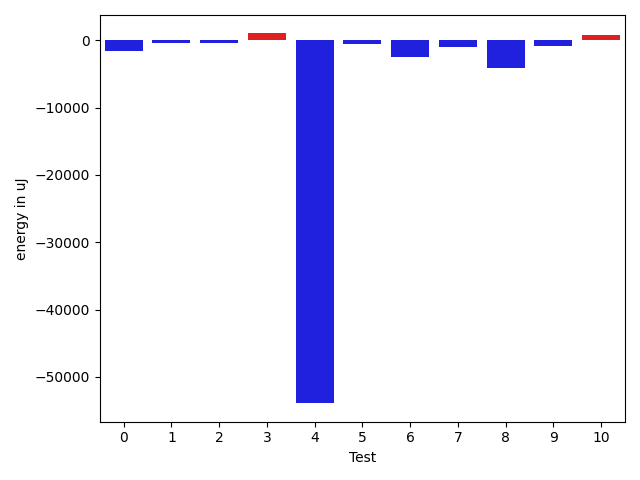
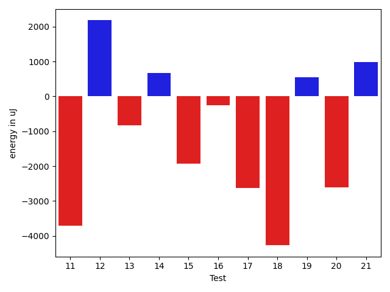
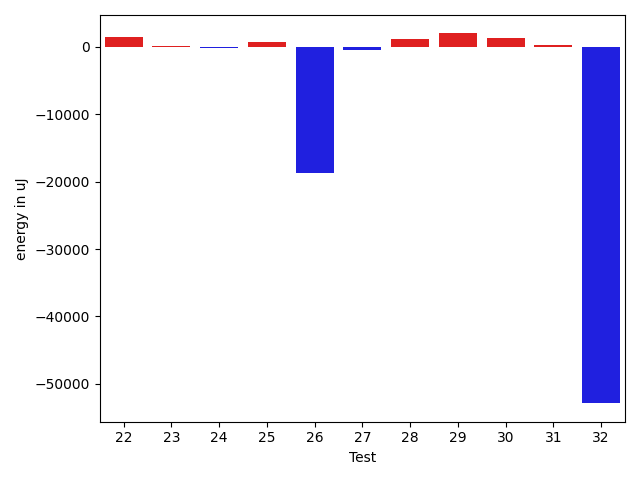
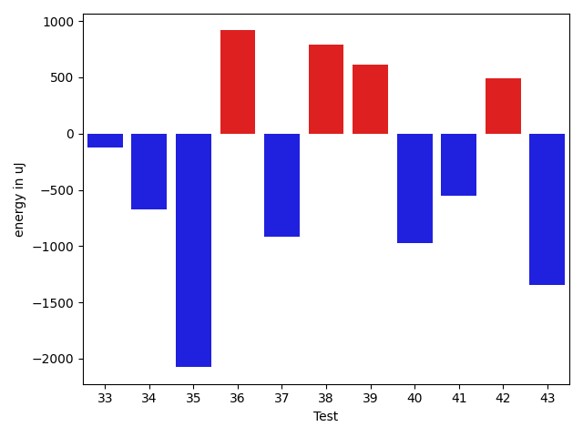
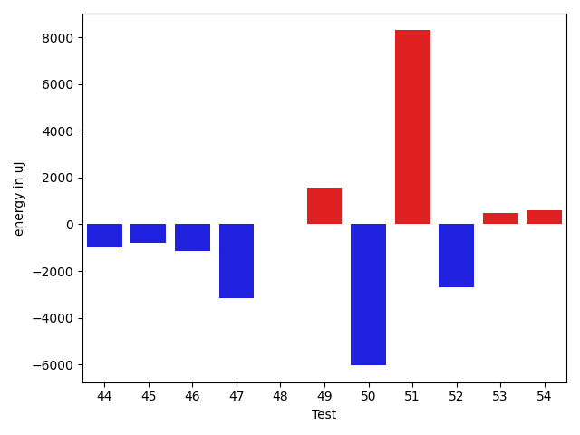
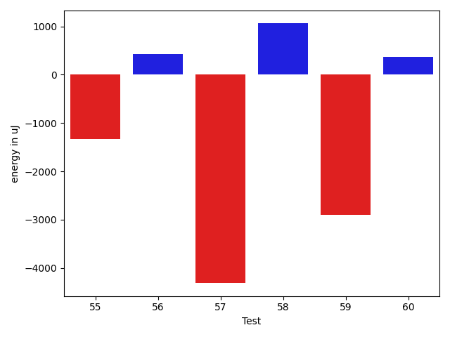

# gson 3df2db

https://github.com/google/gson/commit/3df2db

## Delta Energy per test method

| ID | EnergyV1 | EnergyV2 | DeltaEnergy | σV1 | σV2 |
| --- | --- | --- | --- | --- | --- |
| 0 | 37048 | 35889 | -1159 | 7192.0210009681805 | 4035.244598787016 |
| 1 | 37903 | 35705 | -2198 | 4297.4853682124385 | 4812.90855300573 |
| 2 | 35644 | 36316 | 672 | 5444.838409777994 | 4030.095445255212 |
| 3 | 36316 | 36560 | 244 | 4213.164820006109 | 6537.889757470169 |
| 4 | 41687 | 41748 | 61 | 461169.2234911964 | 402542.6695117486 |
| 5 | 36865 | 36865 | 0 | 5906.8996983473035 | 5163.126694222379 |
| 6 | 87402 | 86059 | -1343 | 26826.46047101857 | 26399.381076172584 |
| 7 | 37293 | 36133 | -1160 | 4364.6506636817985 | 4872.386166236426 |
| 8 | 39367 | 39001 | -366 | 23803.774851889484 | 18624.456206945215 |
| 9 | 38819 | 38513 | -306 | 34021.69780753829 | 36926.322163416015 |
| 10 | 36010 | 37842 | 1832 | 4677.409430953687 | 4736.410318247999 |
| 11 | 38452 | 37903 | -549 | 19013.32357238121 | 15251.884840529066 |
| 12 | 39184 | 40893 | 1709 | 18757.149232222404 | 19119.681360413233 |
| 13 | 38513 | 36743 | -1770 | 4217.6798698129005 | 4321.708905005056 |
| 14 | 35339 | 35645 | 306 | 3829.8685681735183 | 3982.108801513194 |
| 15 | 37170 | 35766 | -1404 | 4137.837701163008 | 4079.7301992765265 |
| 16 | 36865 | 36865 | 0 | 3843.0763924131406 | 4194.939832690892 |
| 17 | 37048 | 34485 | -2563 | 3959.5197657826216 | 3810.054592784728 |
| 18 | 40711 | 40649 | -62 | 17056.6433506283 | 10589.615094293657 |
| 19 | 41687 | 39795 | -1892 | 9608.58242776786 | 8806.849929216083 |
| 20 | 40527 | 36804 | -3723 | 4884.854028269423 | 5064.654482492071 |
| 21 | 43029 | 45288 | 2259 | 37596.631193671434 | 32251.78807393354 |
| 22 | 38818 | 40955 | 2137 | 16863.194069974368 | 15238.399215610576 |
| 23 | 39246 | 39795 | 549 | 17294.40444536692 | 15042.03899522225 |
| 24 | 37292 | 36926 | -366 | 4099.327943978928 | 5195.53186507112 |
| 25 | 37842 | 39307 | 1465 | 4170.092340529694 | 4200.029854339579 |
| 26 | 42907 | 40284 | -2623 | 443725.9027188173 | 416610.771390991 |
| 27 | 40161 | 39428 | -733 | 5051.424828637462 | 4850.379513031358 |
| 28 | 37598 | 38635 | 1037 | 5098.656676311179 | 4108.557329871428 |
| 29 | 38086 | 40039 | 1953 | 3919.7333116393265 | 4435.226642305896 |
| 30 | 37964 | 39124 | 1160 | 4525.645777852839 | 4992.124486063397 |
| 31 | 37354 | 38147 | 793 | 4739.242906165115 | 3883.567030199013 |
| 32 | 43335 | 43946 | 611 | 604469.0140388292 | 481232.67129575426 |
| 33 | 38025 | 37902 | -123 | 4797.19784139964 | 5020.589095710948 |
| 34 | 39001 | 38330 | -671 | 6927.935363552868 | 7975.791485058541 |
| 35 | 38818 | 36743 | -2075 | 4364.447786189417 | 3694.1163995376937 |
| 36 | 36987 | 37903 | 916 | 5128.585634741118 | 15361.750410713836 |
| 37 | 41443 | 40527 | -916 | 36761.23484885876 | 48524.80939691067 |
| 38 | 38757 | 39551 | 794 | 10476.227996380001 | 70165.10384861314 |
| 39 | 40588 | 41199 | 611 | 42812.70498288234 | 60012.94085549054 |
| 40 | 43456 | 42480 | -976 | 22796.473620518314 | 20276.005524418662 |
| 41 | 38513 | 37964 | -549 | 4347.768232858434 | 4684.675978986779 |
| 42 | 42664 | 43152 | 488 | 39630.494695788235 | 42325.43062229641 |
| 43 | 41260 | 39917 | -1343 | 21724.31714137301 | 22769.99503312624 |
| 44 | 37963 | 36988 | -975 | 4791.709702025023 | 4368.681824697853 |
| 45 | 40772 | 39978 | -794 | 23417.72646515316 | 24743.41877927075 |
| 46 | 39429 | 38269 | -1160 | 4373.412602945152 | 5056.121143108393 |
| 47 | 45349 | 42176 | -3173 | 20789.9127625152 | 22260.07651252427 |
| 48 | 44311 | 44311 | 0 | 392574.8987353264 | 491131.46994253434 |
| 49 | 40406 | 41992 | 1586 | 16295.84239535885 | 13631.864314419676 |
| 50 | 80566 | 74523 | -6043 | 36123.54020706892 | 36050.03625328379 |
| 51 | 277221 | 285522 | 8301 | 77921.52202501192 | 84190.67579917918 |
| 52 | 40222 | 37536 | -2686 | 8591.48867307061 | 15925.388907723433 |
| 53 | 38880 | 39367 | 487 | 4845.035062429665 | 6523.730419772636 |
| 54 | 41748 | 42358 | 610 | 18216.282640659014 | 22796.1584076285 |
| 55 | 39917 | 39246 | -671 | 4926.872135521738 | 4834.0691576655945 |
| 56 | 37110 | 36255 | -855 | 4204.897290508447 | 4279.357111451319 |
| 57 | 38269 | 36071 | -2198 | 15289.991436015309 | 6307.162676639301 |
| 58 | 35401 | 35645 | 244 | 3960.1817413465574 | 4684.220382788401 |
| 59 | 35644 | 36560 | 916 | 12556.352018847852 | 3962.9178638416865 |
| 60 | 36743 | 37781 | 1038 | 4199.116457385242 | 4346.444543885468 |

## Delta Duration per test method

| ID | DurationV1 | DurationsV2 | DeltaDuration |
| --- | --- | --- | --- |
| 0 | 1069912.7857142857 | 1072357.9452054794 | 2445.1594911937136 |
| 1 | 894444.76 | 830780.2586206896 | -63664.501379310386 |
| 2 | 922266.75 | 876435.5967741936 | -45831.153225806425 |
| 3 | 1000521.828125 | 936429.15 | -64092.67812499998 |
| 4 | 6459432.986842105 | 4827813.464788732 | -1631619.522053373 |
| 5 | 1010784.2537313433 | 990770.8 | -20013.453731343267 |
| 6 | 2810028.737373737 | 2761613.262626263 | -48415.474747474305 |
| 7 | 627294.1515151515 | 620301.6666666666 | -6992.484848484863 |
| 8 | 1479018.4117647058 | 1417276.987654321 | -61741.42411038489 |
| 9 | 1515619.9538461538 | 1402050.6333333333 | -113569.3205128205 |
| 10 | 870610.7457627119 | 843405.2678571428 | -27205.477905569016 |
| 11 | 1327334.6037735848 | 1120178.490909091 | -207156.11286449386 |
| 12 | 1442018.905882353 | 1446670.6933333334 | 4651.787450980395 |
| 13 | 891621.6666666666 | 845248.64 | -46373.026666666614 |
| 14 | 726704.9545454546 | 650852.7173913043 | -75852.23715415027 |
| 15 | 731074.2926829269 | 707848.0666666667 | -23226.226016260218 |
| 16 | 747495.7209302326 | 715761.5227272727 | -31734.198202959844 |
| 17 | 493483.7894736842 | 581769.64 | 88285.8505263158 |
| 18 | 1378191.2197802197 | 1392266.0957446808 | 14074.875964461127 |
| 19 | 1256961.3766233767 | 1346207.4133333333 | 89246.03670995659 |
| 20 | 721357.925 | 803561.027027027 | 82203.10202702694 |
| 21 | 2022878.5555555555 | 2023077.1313131314 | 198.57575757591985 |
| 22 | 1221180.4225352113 | 1351917.9074074074 | 130737.4848721961 |
| 23 | 1257409.5 | 1258002.634920635 | 593.1349206350278 |
| 24 | 593394.3636363636 | 587487.5714285715 | -5906.7922077921685 |
| 25 | 619034.1739130435 | 591029.1875 | -28004.986413043458 |
| 26 | 5297345.958762887 | 4849115.87628866 | -448230.08247422706 |
| 27 | 916511.2 | 883956.716981132 | -32554.483018867904 |
| 28 | 616904.7272727273 | 603443.5384615385 | -13461.188811188797 |
| 29 | 617611.3333333334 | 595418.8695652174 | -22192.463768115966 |
| 30 | 606443.2083333334 | 568934.9047619047 | -37508.30357142864 |
| 31 | 874780.509090909 | 900399.5609756098 | 25619.051884700777 |
| 32 | 7991227.109756097 | 6711161.140845071 | -1280065.9689110266 |
| 33 | 847424.1020408163 | 838381.8775510204 | -9042.224489795975 |
| 34 | 1069357.6037735848 | 997441.2816901408 | -71916.32208344399 |
| 35 | 725305.3235294118 | 720430.8333333334 | -4874.490196078434 |
| 36 | 1070508.8767123288 | 1164431.68 | 93922.80328767118 |
| 37 | 1700950.2340425532 | 1963580.8125 | 262630.57845744677 |
| 38 | 1291790.0 | 1614658.3139534884 | 322868.31395348837 |
| 39 | 1706918.7840909092 | 2169121.3829787234 | 462202.5988878142 |
| 40 | 1720952.9333333333 | 1776727.914893617 | 55774.98156028357 |
| 41 | 878644.8518518518 | 924734.0645161291 | 46089.21266427729 |
| 42 | 1623061.9692307692 | 1929263.186440678 | 306201.2172099089 |
| 43 | 1319090.2727272727 | 1441137.4375 | 122047.1647727273 |
| 44 | 998468.5555555555 | 1020250.3939393939 | 21781.838383838418 |
| 45 | 1310049.9571428571 | 1396702.7971014492 | 86652.83995859209 |
| 46 | 985657.6071428572 | 991755.0 | 6097.3928571428405 |
| 47 | 1756340.111111111 | 1820699.4646464647 | 64359.35353535367 |
| 48 | 4587862.818181818 | 7556051.0 | 2968188.1818181816 |
| 49 | 1419548.775 | 1390948.7701149425 | -28600.004885057453 |
| 50 | 2617993.3333333335 | 2429516.111111111 | -188477.22222222248 |
| 51 | 7781498.666666667 | 7996842.333333333 | 215343.66666666605 |
| 52 | 1103295.0 | 1096911.9705882352 | -6383.029411764815 |
| 53 | 939417.5370370371 | 922394.6538461539 | -17022.883190883207 |
| 54 | 1120879.2 | 1258521.7142857143 | 137642.51428571437 |
| 55 | 603968.6296296297 | 614639.21875 | 10670.589120370336 |
| 56 | 778081.2580645161 | 789685.5609756098 | 11604.302911093691 |
| 57 | 1238739.6956521738 | 1064797.5142857144 | -173942.18136645947 |
| 58 | 613632.5862068966 | 554293.1379310344 | -59339.448275862145 |
| 59 | 823239.9714285714 | 587473.0 | -235766.97142857139 |
| 60 | 897341.8039215687 | 873638.1803278689 | -23703.62359369977 |

## Misc.

| ID | Test Class | Test Method |
| --- | --- | --- |
| 0 | com.google.gson.functional.CustomTypeAdaptersTest | testCustomAdapterInvokedForCollectionElementDeserialization |
| 1 | com.google.gson.functional.CustomTypeAdaptersTest | testCustomTypeAdapterAppliesToSubClassesSerializedAsBaseClass |
| 2 | com.google.gson.functional.CustomTypeAdaptersTest | testCustomAdapterInvokedForMapElementDeserialization |
| 3 | com.google.gson.functional.CustomTypeAdaptersTest | testCustomAdapterInvokedForMapElementSerializationWithType |
| 4 | com.google.gson.functional.CustomTypeAdaptersTest | testCustomSerializers |
| 5 | com.google.gson.functional.CustomTypeAdaptersTest | testCustomNestedDeserializers |
| 6 | com.google.gson.functional.CustomTypeAdaptersTest | testCustomTypeAdapterDoesNotAppliesToSubClasses |
| 7 | com.google.gson.functional.CustomTypeAdaptersTest | testCustomAdapterInvokedForCollectionElementSerialization |
| 8 | com.google.gson.functional.CustomTypeAdaptersTest | testCustomAdapterInvokedForCollectionElementSerializationWithType |
| 9 | com.google.gson.functional.CustomTypeAdaptersTest | testCustomDeserializers |
| 10 | com.google.gson.functional.CustomTypeAdaptersTest | testCustomByteArraySerializer |
| 11 | com.google.gson.functional.CustomTypeAdaptersTest | testEnsureCustomSerializerNotInvokedForNullValues |
| 12 | com.google.gson.functional.CustomTypeAdaptersTest | testCustomNestedSerializers |
| 13 | com.google.gson.functional.CustomTypeAdaptersTest | testCustomByteArrayDeserializerAndInstanceCreator |
| 14 | com.google.gson.functional.CustomTypeAdaptersTest | testEnsureCustomDeserializerNotInvokedForNullValues |
| 15 | com.google.gson.functional.CustomTypeAdaptersTest | testCustomDeserializerForbiddenForPrimitives |
| 16 | com.google.gson.functional.CustomTypeAdaptersTest | testCustomSerializerForbiddenForPrimitives |
| 17 | com.google.gson.functional.CustomTypeAdaptersTest | testCustomAdapterInvokedForMapElementSerialization |
| 18 | com.google.gson.functional.StreamingTypeAdaptersTest | testNullSafe |
| 19 | com.google.gson.functional.StreamingTypeAdaptersTest | testSerializeWithCustomTypeAdapter |
| 20 | com.google.gson.functional.StreamingTypeAdaptersTest | testDeserializeWithCustomTypeAdapter |
| 21 | com.google.gson.functional.MapTest | testInterfaceTypeMapWithSerializer |
| 22 | com.google.gson.functional.MapTest | testMapSubclassDeserialization |
| 23 | com.google.gson.functional.MapTest | testCustomSerializerForSpecificMapType |
| 24 | com.google.gson.functional.TypeAdapterPrecedenceTest | testStreamingHierarchicalFollowedByNonstreaming |
| 25 | com.google.gson.functional.TypeAdapterPrecedenceTest | testSerializeNonstreamingTypeAdapterFollowedByStreamingTypeAdapter |
| 26 | com.google.gson.functional.TypeAdapterPrecedenceTest | testNonstreamingFollowedByNonstreaming |
| 27 | com.google.gson.functional.TypeAdapterPrecedenceTest | testStreamingFollowedByStreaming |
| 28 | com.google.gson.functional.TypeAdapterPrecedenceTest | testStreamingFollowedByNonstreamingHierarchical |
| 29 | com.google.gson.functional.TypeAdapterPrecedenceTest | testStreamingFollowedByNonstreaming |
| 30 | com.google.gson.functional.TypeAdapterPrecedenceTest | testNonstreamingHierarchicalFollowedByNonstreaming |
| 31 | com.google.gson.functional.CustomSerializerTest | testSerializerReturnsNull |
| 32 | com.google.gson.functional.CustomSerializerTest | testSubClassSerializerInvokedForBaseClassFieldsHoldingSubClassInstances |
| 33 | com.google.gson.functional.CustomSerializerTest | testBaseClassSerializerInvokedForBaseClassFieldsHoldingSubClassInstances |
| 34 | com.google.gson.functional.CustomSerializerTest | testSubClassSerializerInvokedForBaseClassFieldsHoldingArrayOfSubClassInstances |
| 35 | com.google.gson.functional.CustomSerializerTest | testBaseClassSerializerInvokedForBaseClassFields |
| 36 | com.google.gson.functional.ParameterizedTypesTest | testParameterizedTypeWithReaderDeserialization |
| 37 | com.google.gson.functional.ParameterizedTypesTest | testParameterizedTypeWithCustomSerializer |
| 38 | com.google.gson.functional.ParameterizedTypesTest | testParameterizedTypesWithCustomDeserializer |
| 39 | com.google.gson.functional.ParameterizedTypesTest | testParameterizedTypeDeserialization |
| 40 | com.google.gson.functional.CustomDeserializerTest | testJsonTypeFieldBasedDeserialization |
| 41 | com.google.gson.functional.CustomDeserializerTest | testCustomDeserializerReturnsNullForArrayElements |
| 42 | com.google.gson.functional.CustomDeserializerTest | testCustomDeserializerReturnsNullForTopLevelObject |
| 43 | com.google.gson.functional.CustomDeserializerTest | testCustomDeserializerReturnsNull |
| 44 | com.google.gson.functional.CustomDeserializerTest | testCustomDeserializerReturnsNullForArrayElementsForArrayField |
| 45 | com.google.gson.functional.InstanceCreatorTest | testInstanceCreatorReturnsSubTypeForField |
| 46 | com.google.gson.functional.InstanceCreatorTest | testInstanceCreatorReturnsSubTypeForTopLevelObject |
| 47 | com.google.gson.functional.InstanceCreatorTest | testInstanceCreatorForCollectionType |
| 48 | com.google.gson.functional.InstanceCreatorTest | testInstanceCreatorReturnsBaseType |
| 49 | com.google.gson.functional.CollectionTest | testUserCollectionTypeAdapter |
| 50 | com.google.gson.functional.UncategorizedTest | testReturningDerivedClassesDuringDeserialization |
| 51 | com.google.gson.functional.CircularReferenceTest | testSelfReferenceCustomHandlerSerialization |
| 52 | com.google.gson.functional.ObjectTest | testInnerClassDeserialization |
| 53 | com.google.gson.functional.NullObjectAndFieldTest | testCustomTypeAdapterPassesNullDesrialization |
| 54 | com.google.gson.functional.NullObjectAndFieldTest | testCustomSerializationOfNulls |
| 55 | com.google.gson.functional.NullObjectAndFieldTest | testCustomTypeAdapterPassesNullSerialization |
| 56 | com.google.gson.functional.DefaultTypeAdaptersTest | testOverrideBigIntegerTypeAdapter |
| 57 | com.google.gson.functional.DefaultTypeAdaptersTest | testClassSerialization |
| 58 | com.google.gson.functional.DefaultTypeAdaptersTest | testOverrideBigDecimalTypeAdapter |
| 59 | com.google.gson.functional.DefaultTypeAdaptersTest | testClassDeserialization |
| 60 | com.google.gson.functional.DefaultTypeAdaptersTest | testDateSerializationWithPatternNotOverridenByTypeAdapter |

| Test | IterationV1 | IterationV2 | DeltaIteration |
| --- | --- | --- | --- |
| 0 | 70 | 73 | 3 |
| 1 | 50 | 58 | 8 |
| 2 | 64 | 62 | -2 |
| 3 | 64 | 60 | -4 |
| 4 | 76 | 71 | -5 |
| 5 | 67 | 65 | -2 |
| 6 | 99 | 99 | 0 |
| 7 | 33 | 36 | 3 |
| 8 | 85 | 81 | -4 |
| 9 | 65 | 60 | -5 |
| 10 | 59 | 56 | -3 |
| 11 | 53 | 55 | 2 |
| 12 | 85 | 75 | -10 |
| 13 | 54 | 50 | -4 |
| 14 | 44 | 46 | 2 |
| 15 | 41 | 30 | -11 |
| 16 | 43 | 44 | 1 |
| 17 | 19 | 25 | 6 |
| 18 | 91 | 94 | 3 |
| 19 | 77 | 75 | -2 |
| 20 | 40 | 37 | -3 |
| 21 | 99 | 99 | 0 |
| 22 | 71 | 54 | -17 |
| 23 | 62 | 63 | 1 |
| 24 | 33 | 28 | -5 |
| 25 | 23 | 32 | 9 |
| 26 | 97 | 97 | 0 |
| 27 | 40 | 53 | 13 |
| 28 | 22 | 26 | 4 |
| 29 | 24 | 23 | -1 |
| 30 | 24 | 21 | -3 |
| 31 | 55 | 41 | -14 |
| 32 | 82 | 71 | -11 |
| 33 | 49 | 49 | 0 |
| 34 | 53 | 71 | 18 |
| 35 | 34 | 30 | -4 |
| 36 | 73 | 75 | 2 |
| 37 | 94 | 96 | 2 |
| 38 | 92 | 86 | -6 |
| 39 | 88 | 94 | 6 |
| 40 | 90 | 94 | 4 |
| 41 | 54 | 62 | 8 |
| 42 | 65 | 59 | -6 |
| 43 | 66 | 64 | -2 |
| 44 | 63 | 66 | 3 |
| 45 | 70 | 69 | -1 |
| 46 | 56 | 62 | 6 |
| 47 | 99 | 99 | 0 |
| 48 | 77 | 67 | -10 |
| 49 | 80 | 87 | 7 |
| 50 | 99 | 99 | 0 |
| 51 | 99 | 99 | 0 |
| 52 | 58 | 68 | 10 |
| 53 | 54 | 52 | -2 |
| 54 | 40 | 42 | 2 |
| 55 | 27 | 32 | 5 |
| 56 | 31 | 41 | 10 |
| 57 | 69 | 70 | 1 |
| 58 | 29 | 29 | 0 |
| 59 | 35 | 30 | -5 |
| 60 | 51 | 61 | 10 |

| Time Label | Time (s) |
| --- | --- |
| Selection | 27.437263250350952 |
| Injection | 14.208300352096558 |
| Total | 1151.504441022873 |

