# gson a991e5

https://github.com/google/gson/commit/a991e5

## Delta Energy per test method

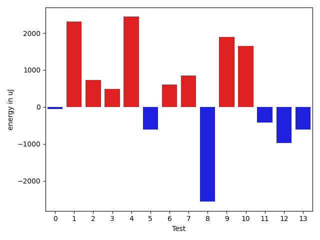

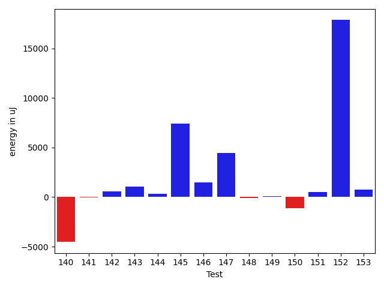

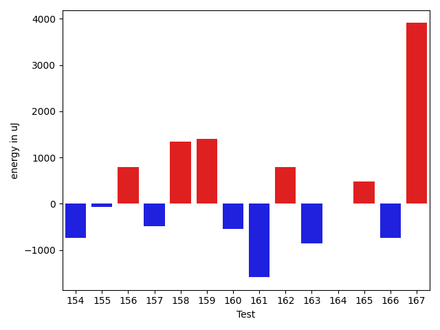

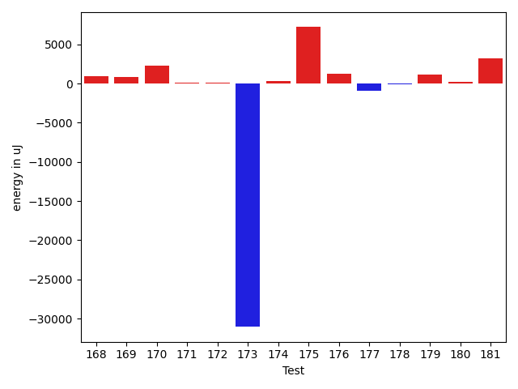

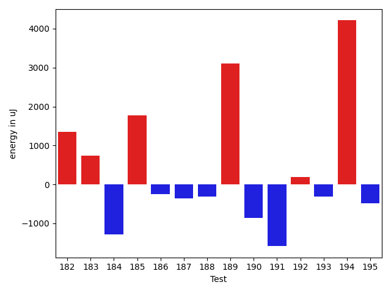

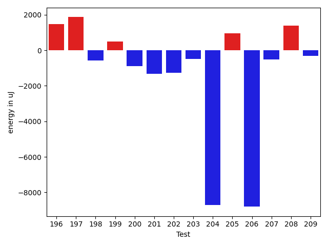

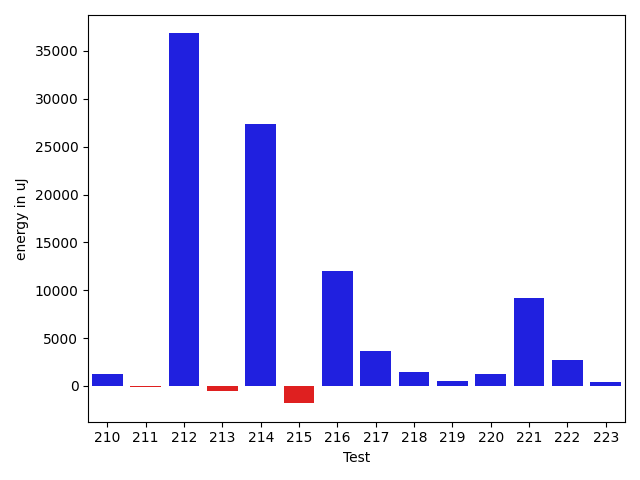

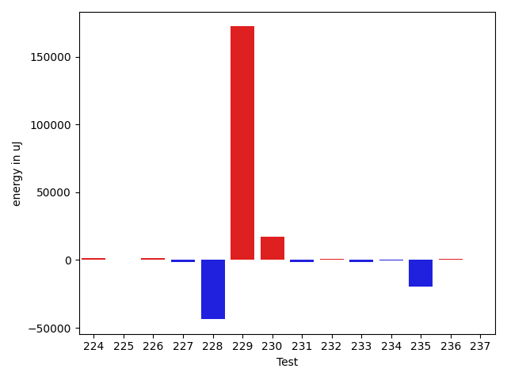

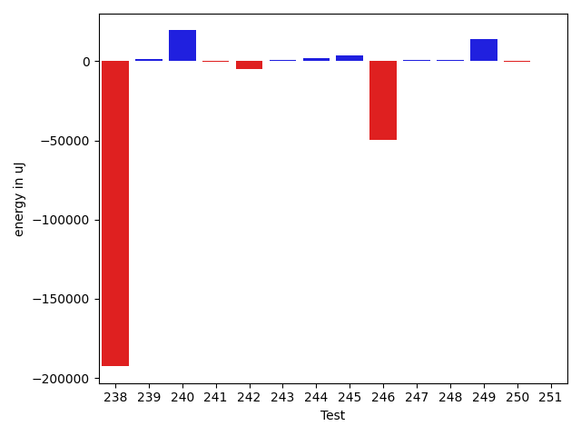

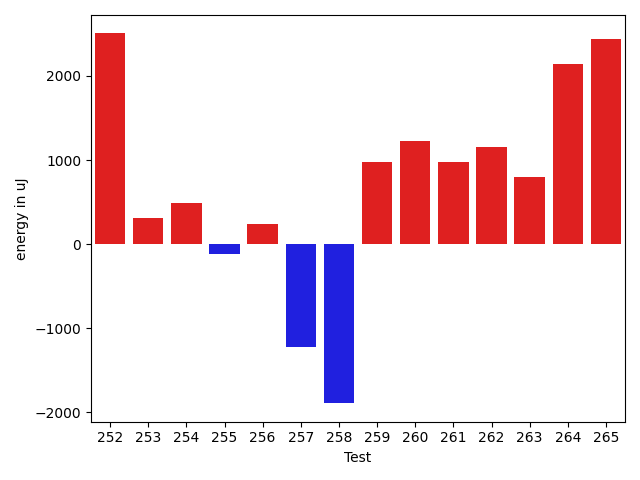

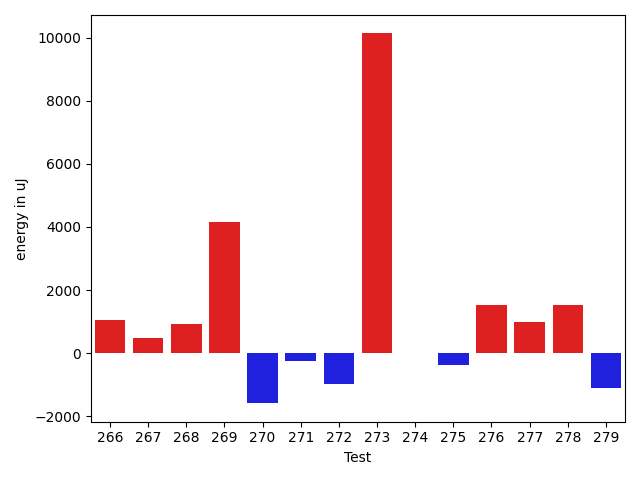

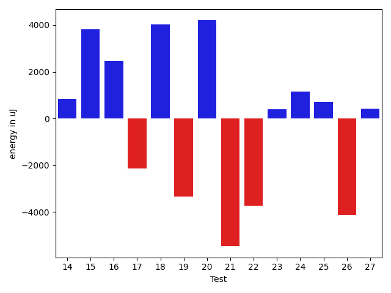

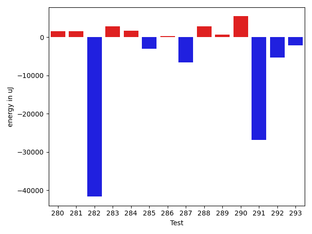

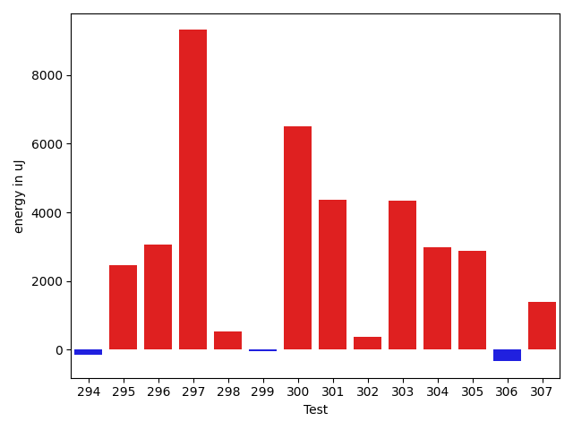

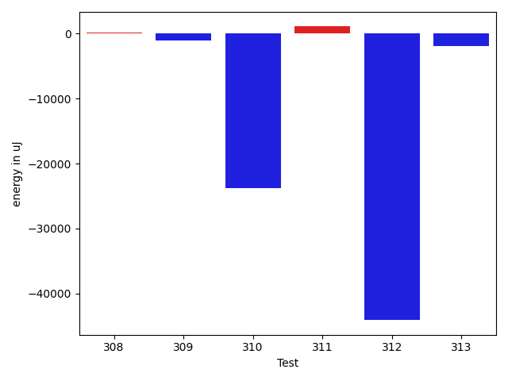

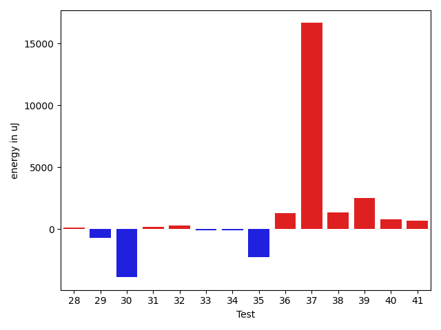

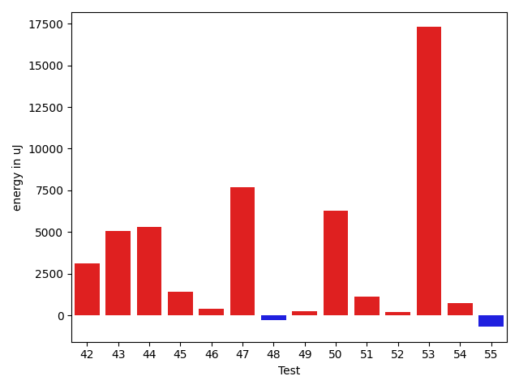

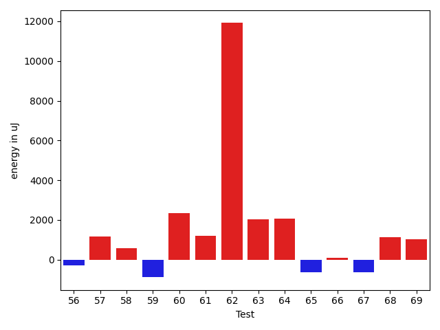

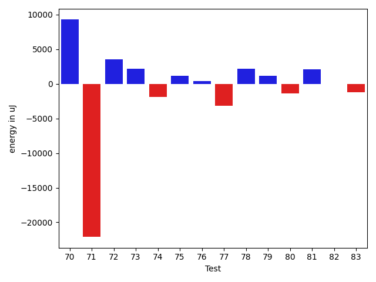

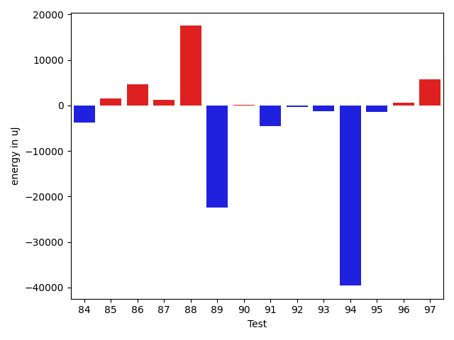

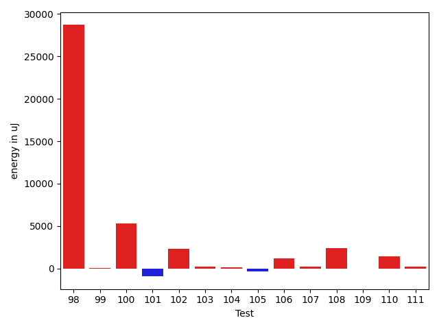

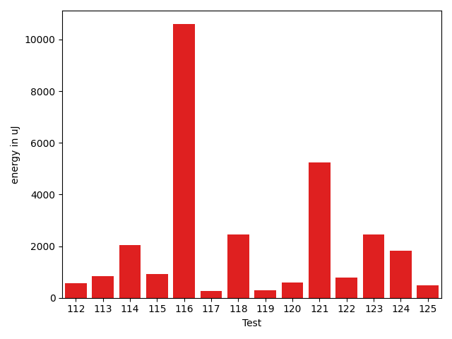

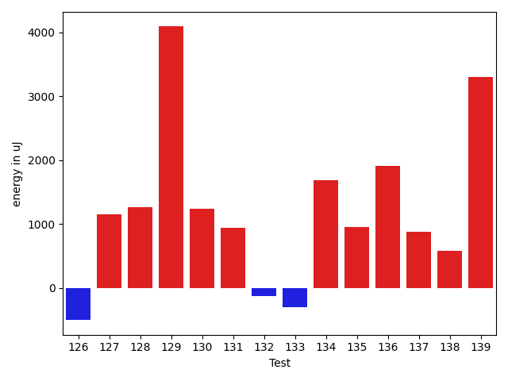

| ID | EnergyV1 | EnergyV2 | DeltaEnergy | σ |
| --- | --- | --- | --- | --- |
| 0 | 40246.892857142855 | 41522.91860465116 | 1276.0257475083054 | 10258.511003085448 | 13114.90175797294 |
| 1 | 35854.61111111111 | 37420.25 | 1565.6388888888905 | 3921.594710189677 | 3687.0296818713027 |
| 2 | 41276.45 | 47013.56756756757 | 5737.1175675675695 | 10105.136181541544 | 31845.5870433774 |
| 3 | 39312.57746478873 | 41148.71212121212 | 1836.13465642339 | 9252.37903424276 | 10807.288250352938 |
| 4 | 39746.13333333333 | 39655.28571428572 | -90.84761904761399 | 7943.341596302878 | 3513.0220085637184 |
| 5 | 36857.375 | 37462.34782608696 | 604.9728260869597 | 3673.5395205952254 | 4279.491686685268 |
| 6 | 36803.9375 | 37302.555555555555 | 498.61805555555475 | 4911.636577668766 | 4204.290034162489 |
| 7 | 37511.32352941176 | 38487.21212121212 | 975.888591800358 | 3582.9109650623486 | 4934.440429161547 |
| 8 | 47382.87096774193 | 51240.23809523809 | 3857.36712749616 | 19069.631793968758 | 25848.512525877642 |
| 9 | 36739.066666666666 | 38361.31428571429 | 1622.2476190476227 | 4483.66825217428 | 4361.090674665348 |
| 10 | 54543.489795918365 | 58560.878787878784 | 4017.388991960419 | 55331.89109646552 | 63345.27438359379 |
| 11 | 38313.224137931036 | 38085.80487804878 | -227.41925988225557 | 6132.502715303963 | 5899.804375506403 |
| 12 | 37677.791666666664 | 37442.26315789474 | -235.52850877192395 | 3239.5267977381964 | 4009.8184170564964 |
| 13 | 44343.25396825397 | 44727.85294117647 | 384.5989729224966 | 14984.972221368405 | 15572.57242082705 |
| 14 | 37883.16071428572 | 38733.34782608696 | 850.1871118012423 | 3880.459075275141 | 6587.7857077466415 |
| 15 | 40561.33823529412 | 44372.46031746032 | 3811.122082166199 | 9596.936963259339 | 27566.037429235497 |
| 16 | 40321.361445783135 | 42784.107142857145 | 2462.7456970740095 | 9889.812979067057 | 18239.037760501415 |
| 17 | 39282.2 | 37150.765957446805 | -2131.434042553192 | 9482.435684757136 | 3689.1491045276075 |
| 18 | 37750.07407407407 | 41767.857142857145 | 4017.783068783072 | 3961.166690517907 | 25301.766384252012 |
| 19 | 43456.967741935485 | 40132.607142857145 | -3324.36059907834 | 14086.205467862179 | 9692.81600074172 |
| 20 | 51878.28947368421 | 56071.46428571428 | 4193.174812030069 | 34650.26569648864 | 31942.78865798546 |
| 21 | 57889.47826086957 | 52432.55072463768 | -5456.927536231888 | 61015.68995428433 | 52036.386902537866 |
| 22 | 41956.65789473684 | 38221.916666666664 | -3734.7412280701756 | 32281.864076057773 | 3841.622849533196 |
| 23 | 36517.583333333336 | 36911.86666666667 | 394.28333333333285 | 3662.2256467208576 | 4908.790691085625 |
| 24 | 35874.681818181816 | 37014.17647058824 | 1139.4946524064217 | 3160.381843822093 | 3859.8343188352183 |
| 25 | 36737.05 | 37444.857142857145 | 707.807142857142 | 3739.0348951968876 | 4223.957705029437 |
| 26 | 41519.46511627907 | 37398.769230769234 | -4120.695885509835 | 29821.02415329005 | 3882.375855076231 |
| 27 | 37478.19565217391 | 37899.08 | 420.88434782608965 | 3829.046462181716 | 4584.27462894622 |
| 28 | 40837.41935483871 | 42954.818181818184 | 2117.398826979472 | 10784.121769540185 | 15882.364119122716 |
| 29 | 83259.05970149254 | 62465.015384615384 | -20794.04431687716 | 184302.8917175721 | 132406.7517675965 |
| 30 | 83884.87878787878 | 79100.14141414141 | -4784.737373737371 | 22809.181781042942 | 25679.16163591477 |
| 31 | 37774.333333333336 | 38124.510204081635 | 350.1768707482988 | 3757.940245518666 | 4772.058231004726 |
| 32 | 40253.753246753244 | 40857.30985915493 | 603.5566124016841 | 9858.334476644546 | 12054.836539268976 |
| 33 | 37806.041666666664 | 37752.307692307695 | -53.733974358969135 | 4585.108818039533 | 4460.813488843545 |
| 34 | 37930.545454545456 | 37811.24 | -119.3054545454579 | 5739.1123159602475 | 4553.466839936358 |
| 35 | 42831.7027027027 | 38398.903225806454 | -4432.799476896245 | 14033.245493248398 | 7192.594687974116 |
| 36 | 36531.730769230766 | 38461.38461538462 | 1929.6538461538512 | 3590.464953367592 | 4687.459703022057 |
| 37 | 202152.8383838384 | 215105.88888888888 | 12953.050505050487 | 77244.13582223168 | 86591.4923900795 |
| 38 | 123015.75757575757 | 115924.63636363637 | -7091.121212121201 | 35889.62493959594 | 32405.940481865866 |
| 39 | 106547.9898989899 | 109792.70707070707 | 3244.717171717173 | 38161.1133899617 | 39152.34308874037 |
| 40 | 40952.48275862069 | 40999.2 | 46.71724137930869 | 2498.4553934683345 | 3455.129282675252 |
| 41 | 36583.71428571428 | 37734.05454545454 | 1150.34025974026 | 3981.7902803556462 | 6528.2441365282675 |
| 42 | 46882.28571428572 | 50017.510416666664 | 3135.224702380947 | 25021.10686902829 | 24718.297820556443 |
| 43 | 39688.32727272727 | 44734.8253968254 | 5046.498124098129 | 15440.098903421509 | 22701.52496279006 |
| 44 | 36725.42105263158 | 42026.26829268293 | 5300.847240051349 | 4999.813952494312 | 24455.159174396966 |
| 45 | 40537.02 | 41963.43137254902 | 1426.4113725490242 | 8872.496768080562 | 10964.109806688977 |
| 46 | 37880.55172413793 | 38252.795918367345 | 372.2441942294172 | 7798.867471212184 | 3680.5402663506125 |
| 47 | 52230.693181818184 | 59903.494505494506 | 7672.801323676322 | 27701.749186385467 | 38802.26266693922 |
| 48 | 55510.969696969696 | 55239.78787878788 | -271.1818181818162 | 20326.78048083988 | 21192.735314883772 |
| 49 | 36804.230769230766 | 37032.05263157895 | 227.82186234818073 | 3962.4762489721797 | 4035.484611525795 |
| 50 | 43239.454545454544 | 49516.73134328358 | 6277.276797829036 | 12192.926379769515 | 18086.351960560103 |
| 51 | 37558.357142857145 | 38698.56 | 1140.2028571428527 | 3841.9463651187248 | 4620.354463285257 |
| 52 | 37664.52380952381 | 37885.10526315789 | 220.58145363408403 | 2888.1471588784857 | 4147.078304373318 |
| 53 | 41701.85964912281 | 58992.93220338983 | 17291.07255426702 | 9037.163979220426 | 81154.35573632788 |
| 54 | 37369.63157894737 | 38118.23529411765 | 748.603715170284 | 4698.5254373386715 | 3382.3800970776874 |
| 55 | 38435.0 | 37748.96551724138 | -686.0344827586232 | 5147.489974735259 | 3247.811257497606 |
| 56 | 36663.434782608696 | 36373.68421052631 | -289.75057208238286 | 3704.1786489231317 | 3582.6641226978677 |
| 57 | 37606.8717948718 | 38791.64102564102 | 1184.7692307692269 | 3415.142788466498 | 3677.2830723530565 |
| 58 | 37383.39215686275 | 37954.017857142855 | 570.6257002801067 | 4035.8465257670946 | 3343.6569879777667 |
| 59 | 37505.944444444445 | 36625.0 | -880.9444444444453 | 4092.314306819855 | 3641.23100750282 |
| 60 | 37348.029411764706 | 39696.43548387097 | 2348.4060721062633 | 5876.017381172458 | 9461.273358719656 |
| 61 | 37770.171428571426 | 38976.96666666667 | 1206.795238095241 | 3682.9573868658035 | 4672.904817372405 |
| 62 | 59448.77011494253 | 71358.35 | 11909.57988505748 | 74397.85393544643 | 104441.1030863927 |
| 63 | 34983.94117647059 | 37019.8 | 2035.8588235294155 | 4883.350302098998 | 4259.86649556063 |
| 64 | 35505.09523809524 | 37569.03333333333 | 2063.938095238096 | 4042.0609418459258 | 4316.051362710545 |
| 65 | 37393.269230769234 | 36745.32142857143 | -647.9478021978066 | 4602.488963407085 | 4267.248938581687 |
| 66 | 38899.666666666664 | 38996.086956521736 | 96.42028985507204 | 4305.3448607945875 | 4409.283436934075 |
| 67 | 40005.65909090909 | 39380.86956521739 | -624.7895256916963 | 5914.784065616588 | 5062.18478185017 |
| 68 | 35982.818181818184 | 37118.28571428572 | 1135.4675324675336 | 3623.9853706854487 | 2598.990557575642 |
| 69 | 36175.45 | 37195.529411764706 | 1020.0794117647092 | 3665.1592390372343 | 3889.8100682143863 |
| 70 | 52948.72972972973 | 62220.857142857145 | 9272.127413127419 | 23985.81304522462 | 29312.665440462588 |
| 71 | 60603.9375 | 38499.0 | -22104.9375 | 36123.7194602373 | 2650.0402899694823 |
| 72 | 44941.03703703704 | 48496.936170212764 | 3555.899133175728 | 24264.39554158785 | 22807.475560032017 |
| 73 | 36709.34482758621 | 38922.41176470588 | 2213.066937119671 | 3348.829000441406 | 3542.7239944762932 |
| 74 | 38674.21428571428 | 36759.818181818184 | -1914.3961038960988 | 3187.3781249209337 | 3502.870117182657 |
| 75 | 37360.333333333336 | 38525.4 | 1165.0666666666657 | 3514.0604560662996 | 3460.1163911059407 |
| 76 | 35345.78947368421 | 35738.38461538462 | 392.5951417004035 | 3174.521672695827 | 3710.3691199013015 |
| 77 | 37499.7 | 34362.833333333336 | -3136.8666666666613 | 4117.415986999614 | 4862.818504278723 |
| 78 | 36945.3125 | 39092.8125 | 2147.5 | 3591.3383772409625 | 8868.780519459468 |
| 79 | 37581.26666666667 | 38759.82608695652 | 1178.55942028985 | 4532.420581641657 | 4277.634277639046 |
| 80 | 37799.8125 | 36445.625 | -1354.1875 | 3038.9919837577313 | 4221.89708358399 |
| 81 | 37630.38461538462 | 39759.333333333336 | 2128.9487179487187 | 3874.371066349133 | 3120.4492554046697 |
| 82 | 36865.083333333336 | 36844.666666666664 | -20.416666666671517 | 4925.574475096506 | 2858.148740395122 |
| 83 | 38175.333333333336 | 36962.0 | -1213.3333333333358 | 2976.7526527334376 | 3163.956647406324 |
| 84 | 39459.1 | 35741.0 | -3718.0999999999985 | 4509.792399878292 | 2877.1034044677644 |
| 85 | 35495.333333333336 | 37048.0 | 1552.6666666666642 | 3580.039292149366 | 2347.3114103464964 |
| 86 | 42412.65454545455 | 47004.17647058824 | 4591.521925133689 | 18487.608730978493 | 23911.503386942444 |
| 87 | 42194.63888888889 | 43358.45714285714 | 1163.818253968253 | 12173.235376688706 | 14865.246065606196 |
| 88 | 50615.15625 | 68218.60606060606 | 17603.449810606064 | 34458.77800821346 | 88750.53260102736 |
| 89 | 160567.63636363635 | 138172.8686868687 | -22394.76767676766 | 101581.96010083865 | 89927.57791079415 |
| 90 | 37875.313725490196 | 38044.41935483871 | 169.10562934851623 | 4022.4203838874887 | 4024.169974719239 |
| 91 | 41796.270833333336 | 37270.46 | -4525.810833333337 | 11677.9834388255 | 3799.171979313386 |
| 92 | 37683.0 | 37302.541666666664 | -380.45833333333576 | 4225.4055332003345 | 3851.8252272912414 |
| 93 | 39165.77777777778 | 37900.705882352944 | -1265.0718954248368 | 4398.108988285704 | 4594.9217271027255 |
| 94 | 99780.39743589744 | 60169.24 | -39611.15743589744 | 282602.55998039054 | 148625.4991085841 |
| 95 | 86390.72448979592 | 84968.72727272728 | -1421.9972170686378 | 56466.34832263798 | 48616.30630502282 |
| 96 | 37310.17647058824 | 37881.434782608696 | 571.2583120204581 | 3955.422536145332 | 3662.251681163035 |
| 97 | 47180.75862068965 | 52930.60240963855 | 5749.8437889489 | 25395.30998919846 | 30718.68602193478 |
| 98 | 63696.76271186441 | 92441.0 | 28744.23728813559 | 63413.85856241681 | 116788.2652365448 |
| 99 | 38275.2 | 38362.294117647056 | 87.09411764705874 | 3852.929646385981 | 4348.946617078748 |
| 100 | 52021.084210526315 | 57348.62244897959 | 5327.538238453279 | 34728.02919095245 | 74629.32189659243 |
| 101 | 37874.89473684211 | 36926.22222222222 | -948.6725146198878 | 5610.924543649977 | 4149.930247814822 |
| 102 | 43261.15873015873 | 45535.90625 | 2274.747519841272 | 18525.05464568454 | 21443.451939577288 |
| 103 | 37398.24444444444 | 37590.660377358494 | 192.41593291405297 | 4138.771992622157 | 4309.538638982471 |
| 104 | 40585.734042553195 | 40753.655913978495 | 167.9218714253002 | 11325.794142627772 | 12225.254075680314 |
| 105 | 37109.1724137931 | 36776.67741935484 | -332.4949944382606 | 3691.589061347388 | 3651.9402654470323 |
| 106 | 35702.44262295082 | 36915.232142857145 | 1212.7895199063278 | 3944.162952294042 | 4102.787232005785 |
| 107 | 36318.192307692305 | 36515.13333333333 | 196.9410256410265 | 3386.82832136534 | 4635.558152177818 |
| 108 | 115258.74747474748 | 117671.83838383839 | 2413.0909090909117 | 24752.51911324143 | 33489.14254377551 |
| 109 | 35714.28571428572 | 35666.94736842105 | -47.33834586466401 | 3872.761585654315 | 4643.936130773505 |
| 110 | 38740.0 | 40201.85882352941 | 1461.8588235294083 | 9529.400046543267 | 10830.935668834072 |
| 111 | 36313.53846153846 | 36508.1320754717 | 194.5936139332407 | 5539.295280995514 | 3777.53570485098 |
| 112 | 37052.96078431373 | 37631.232142857145 | 578.2713585434176 | 2861.240495822174 | 4752.248663193455 |
| 113 | 35211.12 | 36059.73170731707 | 848.6117073170681 | 3372.5873903577353 | 4009.8580537153507 |
| 114 | 35290.0 | 37322.77777777778 | 2032.777777777781 | 2259.4230883806804 | 4732.72554261584 |
| 115 | 36566.46808510638 | 37488.717391304344 | 922.2493061979621 | 3790.706922512699 | 4265.739645651168 |
| 116 | 45768.34782608696 | 56357.63157894737 | 10589.283752860407 | 20474.85919600934 | 28664.733307692015 |
| 117 | 36777.11538461538 | 37041.72340425532 | 264.60801963993435 | 3496.1390773573144 | 3577.9519798766587 |
| 118 | 36007.542372881355 | 38456.333333333336 | 2448.790960451981 | 6359.662101465352 | 7377.044469122795 |
| 119 | 36817.96226415094 | 37114.0 | 296.03773584905866 | 3946.783122676483 | 4021.1523415367087 |
| 120 | 36327.57142857143 | 36923.434782608696 | 595.8633540372684 | 3266.2709707588206 | 2833.629364645538 |
| 121 | 41964.1875 | 47209.11363636364 | 5244.92613636364 | 15127.260621221007 | 16188.18618653165 |
| 122 | 36395.085106382976 | 37184.29824561404 | 789.2131392310621 | 3420.2073025997856 | 3237.2432606453 |
| 123 | 35795.619047619046 | 38261.125 | 2465.505952380954 | 3726.8543543697556 | 4175.215576395427 |
| 124 | 34934.31578947369 | 36756.07142857143 | 1821.7556390977406 | 2375.5762747424283 | 4529.3741678117985 |
| 125 | 36172.89473684211 | 36666.9 | 494.00526315789466 | 3354.319052312874 | 4164.453846544586 |
| 126 | 36199.933333333334 | 35700.34285714286 | -499.5904761904749 | 3287.1322144926808 | 3734.216459736 |
| 127 | 34536.38461538462 | 35695.92307692308 | 1159.538461538461 | 4313.321735105387 | 3313.3613530101575 |
| 128 | 37216.05 | 38483.95652173913 | 1267.9065217391253 | 3737.8321588187987 | 3587.9474994736483 |
| 129 | 33413.5 | 37502.48 | 4088.980000000003 | 2671.9068378220077 | 3688.4896867959387 |
| 130 | 35181.5 | 36425.6 | 1244.0999999999985 | 4419.329483454852 | 4436.811607449657 |
| 131 | 35893.153846153844 | 36839.346153846156 | 946.1923076923122 | 4206.496273552169 | 3961.9926313594706 |
| 132 | 36518.62903225807 | 36398.12698412698 | -120.50204813108576 | 3900.472433064053 | 3830.5516677253063 |
| 133 | 35977.36363636364 | 35679.42857142857 | -297.9350649350672 | 2735.9096633387608 | 3706.0279027992397 |
| 134 | 35397.0 | 37088.75 | 1691.75 | 3366.74520318332 | 3445.5051304803865 |
| 135 | 36471.805555555555 | 37423.22857142857 | 951.4230158730134 | 3920.6801976431793 | 4415.303180567166 |
| 136 | 36920.95652173913 | 38837.25 | 1916.2934782608718 | 2649.6113493222865 | 4508.870222960514 |
| 137 | 36558.06451612903 | 37437.21568627451 | 879.1511701454801 | 4131.020282748903 | 5033.190401737858 |
| 138 | 38085.0987654321 | 38665.27710843374 | 580.1783430016367 | 7790.359827194053 | 7246.89333574025 |
| 139 | 43492.1 | 46798.1976744186 | 3306.0976744186046 | 18004.6769615564 | 23359.038196401092 |
| 140 | 84621.64646464646 | 80092.74747474748 | -4528.898989898982 | 64990.64645293169 | 70033.22286252424 |
| 141 | 37075.416666666664 | 37014.620689655174 | -60.79597701149032 | 4130.155992312317 | 3395.8023318228225 |
| 142 | 37979.75 | 38541.62337662338 | 561.8733766233781 | 6860.741381698309 | 7113.38534861532 |
| 143 | 72068.09090909091 | 73136.0 | 1067.9090909090883 | 28159.490940033644 | 30070.743359987333 |
| 144 | 38606.28378378379 | 38907.65476190476 | 301.37097812097636 | 9167.887658679587 | 8146.926654667081 |
| 145 | 68450.41414141415 | 75844.26262626263 | 7393.84848484848 | 25613.243053099966 | 39715.160193605596 |
| 146 | 37401.45238095238 | 38870.79746835443 | 1469.345087402049 | 6557.064582433867 | 7955.343411470302 |
| 147 | 40084.05434782609 | 44505.26373626374 | 4421.209388437652 | 11511.42263746539 | 15628.140184383774 |
| 148 | 37528.15 | 37453.36111111111 | -74.78888888889196 | 6917.154324756679 | 6605.198264972731 |
| 149 | 37183.333333333336 | 37296.82142857143 | 113.48809523809177 | 2751.208237788766 | 4370.026463254063 |
| 150 | 39468.40579710145 | 38366.64 | -1101.7657971014487 | 6344.182384293801 | 5880.007774688739 |
| 151 | 37451.816326530614 | 37982.854166666664 | 531.0378401360504 | 3819.6861056709745 | 4390.34380767224 |
| 152 | 308626.7011494253 | 326475.4222222222 | 17848.721072796907 | 223053.83722239532 | 218324.8212252142 |
| 153 | 37644.63636363636 | 38385.782608695656 | 741.1462450592953 | 4722.6780783158365 | 3053.2604234834907 |
| 154 | 38719.380952380954 | 38132.137931034486 | -587.2430213464686 | 2778.1531288350966 | 2518.489814649301 |
| 155 | 36474.98039215686 | 40243.6875 | 3768.70710784314 | 3383.8781237624794 | 22139.336997145536 |
| 156 | 42338.94736842105 | 40222.05 | -2116.8973684210505 | 18948.430258477558 | 10305.782330686983 |
| 157 | 48235.11224489796 | 52133.707070707074 | 3898.5948258091157 | 16680.80007372686 | 21844.067215844992 |
| 158 | 38465.47826086957 | 45070.76 | 6605.281739130434 | 6497.838315260433 | 31324.637476950946 |
| 159 | 36315.87804878049 | 38349.21875 | 2033.3407012195094 | 3608.3174593661965 | 4685.132006774029 |
| 160 | 36398.17391304348 | 37177.875 | 779.7010869565202 | 4320.741237255417 | 3823.7788716628215 |
| 161 | 36854.09090909091 | 37126.333333333336 | 272.242424242424 | 4300.194392108031 | 4242.819908713753 |
| 162 | 37031.08 | 37249.19512195122 | 218.1151219512176 | 3871.1574074945597 | 4698.466258412379 |
| 163 | 38624.916666666664 | 38118.05263157895 | -506.86403508771764 | 4689.588529539547 | 3006.433583495028 |
| 164 | 36138.57142857143 | 37874.05882352941 | 1735.487394957985 | 4431.662007606161 | 3481.3836409340643 |
| 165 | 42994.95348837209 | 60879.96551724138 | 17885.012028869285 | 16421.696651223752 | 155837.21369292226 |
| 166 | 37369.52631578947 | 37292.46341463415 | -77.06290115532465 | 4461.938059779346 | 4367.928001827562 |
| 167 | 36345.04761904762 | 38516.8125 | 2171.7648809523816 | 4212.193665291626 | 3675.094084148561 |
| 168 | 37700.846153846156 | 38622.142857142855 | 921.296703296699 | 4662.680490977989 | 3580.650576504277 |
| 169 | 37692.333333333336 | 38565.933333333334 | 873.5999999999985 | 4968.428859642989 | 3928.6168128518493 |
| 170 | 36516.23809523809 | 38811.89473684211 | 2295.656641604015 | 4752.834181079166 | 4038.3583545106526 |
| 171 | 38460.71428571428 | 38550.333333333336 | 89.61904761905316 | 3555.824365511793 | 3831.7777858325762 |
| 172 | 36153.0 | 36298.380952380954 | 145.3809523809541 | 3942.820902179893 | 2741.456433847674 |
| 173 | 66205.44897959183 | 35156.09090909091 | -31049.358070500923 | 37769.711886675796 | 3711.4854280523086 |
| 174 | 37699.333333333336 | 37998.0 | 298.66666666666424 | 2804.2753074546727 | 3884.4594218500984 |
| 175 | 37739.045454545456 | 44944.21052631579 | 7205.1650717703305 | 2892.901052219707 | 35603.41654743847 |
| 176 | 37030.23529411765 | 38281.92857142857 | 1251.693277310922 | 3553.6622125783515 | 3513.0931317061345 |
| 177 | 37088.916666666664 | 36128.6 | -960.3166666666657 | 2974.2693068587823 | 4765.803056498803 |
| 178 | 36808.57142857143 | 36758.5 | -50.07142857142753 | 3995.6678811340826 | 4037.854133076132 |
| 179 | 36892.44736842105 | 38032.58974358974 | 1140.142375168689 | 3707.7482292410905 | 4775.793303509221 |
| 180 | 37525.25 | 37785.53846153846 | 260.288461538461 | 3208.2600521934005 | 3875.1590263226544 |
| 181 | 45553.09375 | 48819.73333333333 | 3266.63958333333 | 17740.24200328059 | 22403.190225104598 |
| 182 | 36942.46666666667 | 37800.28 | 857.8133333333317 | 2110.265129209018 | 3806.245935511787 |
| 183 | 43546.46875 | 55967.242424242424 | 12420.773674242424 | 13223.19571809415 | 46353.48875499461 |
| 184 | 53898.916666666664 | 47949.52631578947 | -5949.390350877191 | 26448.441622202536 | 22307.44299760537 |
| 185 | 38278.38461538462 | 38495.642857142855 | 217.258241758238 | 4129.767893244244 | 4144.20413877955 |
| 186 | 37353.42857142857 | 37073.22727272727 | -280.2012987013004 | 3037.087531413836 | 3548.541825131944 |
| 187 | 37435.0 | 37382.10526315789 | -52.894736842106795 | 4528.361293006556 | 4357.009390743257 |
| 188 | 37569.90909090909 | 37464.705882352944 | -105.20320855614409 | 3586.4531593850224 | 4133.525382765345 |
| 189 | 37373.86666666667 | 40431.8125 | 3057.9458333333314 | 4237.288737965457 | 2801.5189232528396 |
| 190 | 37963.769230769234 | 36956.833333333336 | -1006.9358974358984 | 3388.8043535656584 | 3468.704421121972 |
| 191 | 37927.94117647059 | 35949.65 | -1978.291176470586 | 3420.6391640536185 | 3562.6603721797565 |
| 192 | 36865.125 | 46977.454545454544 | 10112.329545454544 | 3222.784003679893 | 45090.2412862022 |
| 193 | 37794.769230769234 | 39048.833333333336 | 1254.0641025641016 | 4200.282465846721 | 3295.295961248735 |
| 194 | 37105.0 | 39868.92857142857 | 2763.9285714285725 | 3036.240414911648 | 3376.1473915076153 |
| 195 | 39140.181818181816 | 50018.357142857145 | 10878.175324675329 | 4203.511558386345 | 47863.49913572247 |
| 196 | 36323.5 | 37790.72222222222 | 1467.222222222219 | 3407.4851308063935 | 2566.225347460861 |
| 197 | 38146.833333333336 | 40008.7 | 1861.8666666666613 | 3012.861177057818 | 2821.2833267858796 |
| 198 | 38472.416666666664 | 37898.07692307692 | -574.3397435897423 | 3168.954203369868 | 4618.1636620487425 |
| 199 | 52780.0 | 53283.53333333333 | 503.53333333333285 | 34427.464925550354 | 51103.626049908526 |
| 200 | 38883.92307692308 | 37987.47222222222 | -896.450854700859 | 9315.491801665832 | 5545.607468408924 |
| 201 | 38716.5 | 37396.470588235294 | -1320.0294117647063 | 4287.183720112774 | 3803.6726542776596 |
| 202 | 38579.72727272727 | 37310.6 | -1269.1272727272735 | 4066.9883673506233 | 3474.129393099802 |
| 203 | 50858.818181818184 | 50359.5 | -499.3181818181838 | 20000.339043269494 | 22584.183950378756 |
| 204 | 47993.666666666664 | 39297.4 | -8696.266666666663 | 38409.378348986014 | 3525.408747932642 |
| 205 | 37887.0 | 38838.57142857143 | 951.5714285714275 | 4042.9218348816694 | 4313.1868625837005 |
| 206 | 48216.791666666664 | 39413.86363636364 | -8802.928030303025 | 20934.399747211326 | 7807.407777788839 |
| 207 | 39367.38888888889 | 38862.24 | -505.14888888889254 | 5276.691515406736 | 4140.902203916436 |
| 208 | 37713.21052631579 | 39096.444444444445 | 1383.2339181286588 | 3630.859004915146 | 2664.8208241252087 |
| 209 | 37458.61111111111 | 37133.73333333333 | -324.87777777777956 | 4229.775475245425 | 3390.1728661267734 |
| 210 | 36913.9 | 38135.375 | 1221.4749999999985 | 3303.5191977647114 | 3984.6307525760776 |
| 211 | 38369.41176470588 | 38280.045454545456 | -89.3663101604252 | 4199.4490543238635 | 5931.407103310867 |
| 212 | 37507.34782608696 | 74337.6 | 36830.252173913046 | 3969.2768874760795 | 151841.50545269233 |
| 213 | 38024.833333333336 | 37536.46666666667 | -488.3666666666686 | 3361.7038710550733 | 4444.428645194141 |
| 214 | 82001.90476190476 | 109321.25 | 27319.345238095237 | 166589.89092862137 | 260486.36739508557 |
| 215 | 41491.6 | 39677.833333333336 | -1813.7666666666628 | 15472.83373981638 | 2666.037316359661 |
| 216 | 61978.188679245286 | 73990.1551724138 | 12011.966493168511 | 42543.43633434201 | 51080.76611730773 |
| 217 | 72331.50515463918 | 75996.44680851063 | 3664.9416538714577 | 28530.451689568436 | 26450.41958948736 |
| 218 | 43955.454545454544 | 45419.16216216216 | 1463.7076167076157 | 19879.586507984855 | 17774.699556534135 |
| 219 | 42582.35227272727 | 43094.692307692305 | 512.3400349650328 | 23981.225293322397 | 12168.68016057536 |
| 220 | 39248.78947368421 | 40507.18965517241 | 1258.4001814881995 | 12151.634535547193 | 10776.961262352102 |
| 221 | 39197.54285714286 | 48350.4126984127 | 9152.869841269843 | 3913.5934225127035 | 43628.28982042589 |
| 222 | 35694.8 | 38429.94827586207 | 2735.1482758620696 | 3798.993762827204 | 5797.526284077201 |
| 223 | 36976.08163265306 | 37378.166666666664 | 402.0850340136021 | 3777.6715365730342 | 4361.634348097962 |
| 224 | 160472.0606060606 | 161793.31313131313 | 1321.252525252523 | 275938.30110124766 | 281943.978793182 |
| 225 | 37666.660377358494 | 37814.86 | 148.19962264150672 | 3804.114966337019 | 3848.215290287174 |
| 226 | 124321.49494949495 | 125757.9696969697 | 1436.474747474742 | 328715.00840468536 | 329761.8765379764 |
| 227 | 41689.975 | 40079.88157894737 | -1610.093421052632 | 12825.700755684853 | 9357.8647249071 |
| 228 | 80484.24137931035 | 36807.1 | -43677.14137931035 | 54596.883465845516 | 3966.940973848741 |
| 229 | 91729.33333333333 | 263955.94444444444 | 172226.61111111112 | 210172.10884761316 | 485619.5744318652 |
| 230 | 157795.8282828283 | 175174.7676767677 | 17378.939393939392 | 62774.254554470834 | 130596.57616869757 |
| 231 | 51269.444444444445 | 49649.333333333336 | -1620.1111111111095 | 32839.66155973634 | 31964.56786265794 |
| 232 | 39421.51162790698 | 40460.269230769234 | 1038.757602862257 | 4583.303964020821 | 6740.252298163579 |
| 233 | 39189.018867924526 | 37431.09090909091 | -1757.927958833614 | 5877.924786189155 | 4064.8095550724465 |
| 234 | 37863.50847457627 | 37408.532258064515 | -454.97621651175723 | 5368.921964741851 | 4122.734246627382 |
| 235 | 131640.15151515152 | 112176.75757575757 | -19463.39393939395 | 269427.1935152844 | 168537.8796798261 |
| 236 | 38321.320512820515 | 38949.885714285716 | 628.5652014652005 | 6784.78765515006 | 9253.042030354678 |
| 237 | 39045.0 | 39125.242424242424 | 80.24242424242402 | 4869.693800875545 | 4485.2668582499455 |
| 238 | 232382.91666666666 | 39722.818181818184 | -192660.09848484848 | 436958.5732767769 | 3799.6745032408385 |
| 239 | 36124.77419354839 | 37791.2 | 1666.4258064516107 | 3688.2843262948277 | 6384.465462802215 |
| 240 | 40759.730769230766 | 60265.84 | 19506.10923076923 | 10403.177220141384 | 57914.65684724722 |
| 241 | 37905.07692307692 | 37759.61538461538 | -145.46153846153902 | 4720.3536204160755 | 5119.659379271566 |
| 242 | 54448.166666666664 | 49645.84 | -4802.326666666668 | 31616.046639940436 | 19361.65372622907 |
| 243 | 62777.19117647059 | 63622.01754385965 | 844.8263673890615 | 75113.77481865471 | 77643.72965758435 |
| 244 | 36337.35294117647 | 38417.07142857143 | 2079.718487394959 | 4087.5476315436867 | 2868.5668513409696 |
| 245 | 46885.27118644068 | 50435.596774193546 | 3550.3255877528645 | 46155.23687232054 | 60433.373841392786 |
| 246 | 310147.797979798 | 260651.58585858587 | -49496.21212121213 | 140706.33170938224 | 111197.54109019342 |
| 247 | 37852.391304347824 | 38732.64 | 880.2486956521752 | 3171.185812212296 | 3563.028250014305 |
| 248 | 37240.84210526316 | 38126.583333333336 | 885.7412280701756 | 3280.148219744088 | 4062.23033549442 |
| 249 | 92911.93181818182 | 106944.13333333333 | 14032.201515151508 | 151889.02206094988 | 214078.28755840182 |
| 250 | 38525.37777777778 | 37957.28947368421 | -568.088304093566 | 3250.9054484961157 | 3830.0774549533367 |
| 251 | 38442.12903225807 | 38486.34146341463 | 44.21243115656398 | 4105.824570376274 | 4736.441679767815 |
| 252 | 39165.36363636364 | 41233.07692307692 | 2067.7132867132823 | 11441.681357359723 | 12162.422228142766 |
| 253 | 40290.51515151515 | 43029.0 | 2738.484848484848 | 8942.976148983378 | 13987.235516163135 |
| 254 | 38829.92647058824 | 38155.88 | -674.0464705882405 | 8257.129971257598 | 4100.0270241711005 |
| 255 | 40964.0 | 49766.91780821918 | 8802.91780821918 | 13273.594632093556 | 34423.61070057117 |
| 256 | 44895.969696969696 | 59703.0 | 14807.030303030304 | 30693.95513134699 | 86002.44348717487 |
| 257 | 38507.58823529412 | 37819.3 | -688.288235294116 | 4046.577036558524 | 4763.657258521719 |
| 258 | 38755.3125 | 39543.24 | 787.927499999998 | 5817.73091740618 | 9179.751553413633 |
| 259 | 51999.607142857145 | 69708.3448275862 | 17708.737684729058 | 35166.3141396293 | 74221.0803242703 |
| 260 | 37106.434782608696 | 37367.055555555555 | 260.6207729468588 | 4739.295231279114 | 5645.811480619182 |
| 261 | 52685.11111111111 | 41176.67924528302 | -11508.43186582809 | 40391.94374967046 | 9072.01128866387 |
| 262 | 39662.59090909091 | 44660.52631578947 | 4997.935406698562 | 16911.15657745472 | 18425.791564424668 |
| 263 | 38585.90476190476 | 38559.44827586207 | -26.456486042690813 | 4545.698729932578 | 4569.677552845472 |
| 264 | 38081.04 | 165955.9705882353 | 127874.9305882353 | 4662.494529583922 | 412804.9437122379 |
| 265 | 37260.477611940296 | 40208.275 | 2947.7973880597056 | 5516.258634629602 | 7732.30123245176 |
| 266 | 56190.291666666664 | 54309.5625 | -1880.7291666666642 | 54679.4341590748 | 64226.06957066651 |
| 267 | 57514.31481481482 | 40784.88888888889 | -16729.425925925927 | 37179.60573866233 | 6338.477012619529 |
| 268 | 38532.85294117647 | 38030.382352941175 | -502.4705882352937 | 3514.8078278348303 | 4628.768054973958 |
| 269 | 54089.85106382979 | 62376.16216216216 | 8286.311098332371 | 43904.37680114554 | 50653.96516189381 |
| 270 | 57967.19672131148 | 57219.232142857145 | -747.9645784543318 | 38635.040288479686 | 48751.570063724634 |
| 271 | 91006.04545454546 | 164997.7619047619 | 73991.71645021644 | 234639.99681358624 | 323044.98649980256 |
| 272 | 40257.94117647059 | 38722.9375 | -1535.0036764705874 | 4562.836030759665 | 3295.1049958375756 |
| 273 | 199554.81818181818 | 213883.9292929293 | 14329.111111111124 | 45087.27813119875 | 85686.41723747701 |
| 274 | 156307.54545454544 | 152266.91919191918 | -4040.6262626262615 | 234416.9915776771 | 302013.4652296044 |
| 275 | 37277.15625 | 37005.35294117647 | -271.80330882353155 | 3603.591065775352 | 3436.7553942837435 |
| 276 | 37423.25 | 38393.583333333336 | 970.3333333333358 | 3612.214473392425 | 4302.804491614226 |
| 277 | 46552.42105263158 | 44878.3085106383 | -1674.1125419932796 | 20343.565416213725 | 17020.6930522611 |
| 278 | 36613.375 | 37960.692307692305 | 1347.317307692305 | 4763.676917680466 | 4105.981185425602 |
| 279 | 48964.36666666667 | 43376.875 | -5587.491666666669 | 24991.09535078889 | 19253.038824673236 |
| 280 | 37065.71428571428 | 38661.7 | 1595.9857142857145 | 4185.181119626919 | 4859.345485076496 |
| 281 | 36997.40476190476 | 38488.26190476191 | 1490.857142857145 | 4067.522265923919 | 4080.279705979105 |
| 282 | 83371.5 | 41728.21428571428 | -41643.28571428572 | 69915.55500153794 | 15114.077504473255 |
| 283 | 35675.03571428572 | 38539.666666666664 | 2864.630952380947 | 4075.3256879677974 | 4721.347479504365 |
| 284 | 35845.0 | 37490.65 | 1645.6500000000015 | 4148.580394028093 | 3910.3878615170647 |
| 285 | 60921.802083333336 | 57924.85106382979 | -2996.9510195035473 | 46213.92341005481 | 67140.99397092174 |
| 286 | 37224.5 | 37533.35 | 308.84999999999854 | 4041.738251811199 | 5284.785636854158 |
| 287 | 57283.675 | 50649.79746835443 | -6633.877531645572 | 47167.44265003536 | 37277.19621538749 |
| 288 | 37504.36842105263 | 40290.75 | 2786.3815789473665 | 4130.846252162233 | 3390.792744698502 |
| 289 | 37162.26666666667 | 37824.833333333336 | 662.5666666666657 | 4898.606012144906 | 4043.9966651541367 |
| 290 | 35827.53333333333 | 41252.0 | 5424.466666666667 | 3278.027290239597 | 3745.2950150822567 |
| 291 | 65692.94736842105 | 38787.71428571428 | -26905.23308270677 | 45825.33290024506 | 4236.597867369042 |
| 292 | 45626.07692307692 | 40320.692307692305 | -5305.384615384617 | 18543.89158170644 | 3273.094569237436 |
| 293 | 39660.0 | 37492.09090909091 | -2167.9090909090883 | 3581.1770631867307 | 4974.2690363792135 |
| 294 | 38037.92857142857 | 37896.31578947369 | -141.61278195488558 | 4320.194728816973 | 3211.8124912927865 |
| 295 | 36323.375 | 38793.7 | 2470.324999999997 | 5837.721000902236 | 2056.94667164708 |
| 296 | 35502.0 | 38569.61538461538 | 3067.615384615383 | 3643.478100204071 | 2948.46015974601 |
| 297 | 47169.54285714286 | 56480.36363636364 | 9310.820779220783 | 44589.197063762214 | 74847.27884406535 |
| 298 | 38273.206896551725 | 38798.645161290326 | 525.438264738601 | 4043.5401899249923 | 4368.846496822607 |
| 299 | 37905.18 | 37855.448979591834 | -49.73102040816593 | 3878.588257033737 | 4423.376187987874 |
| 300 | 48582.15492957747 | 55097.92727272727 | 6515.772343149802 | 38108.62453996613 | 58649.22323901797 |
| 301 | 48278.57142857143 | 52638.357142857145 | 4359.785714285717 | 29677.45596941097 | 56639.804662706876 |
| 302 | 36966.04081632653 | 37350.181818181816 | 384.14100185528514 | 3982.5704137371945 | 4302.568227089529 |
| 303 | 36731.88333333333 | 41067.46808510638 | 4335.584751773051 | 4031.210579514408 | 24667.978898357946 |
| 304 | 37507.09259259259 | 40487.36956521739 | 2980.2769726248007 | 4143.287857391082 | 24603.117360238768 |
| 305 | 36673.23809523809 | 39555.791666666664 | 2882.5535714285725 | 4313.954973656915 | 4085.5411614126742 |
| 306 | 51619.55263157895 | 51285.0 | -334.5526315789466 | 30195.84223792667 | 33031.287367417826 |
| 307 | 36033.5 | 37429.0 | 1395.5 | 3905.8704855640053 | 3954.4380030542898 |
| 308 | 37765.88888888889 | 37932.07692307692 | 166.18803418803145 | 3919.7699038037217 | 3330.2594022674166 |
| 309 | 37319.51851851852 | 36252.46153846154 | -1067.0569800569792 | 4264.6182180768965 | 4360.916419487018 |
| 310 | 109742.85483870968 | 85935.4776119403 | -23807.377226769386 | 305553.3392531806 | 223559.6985051469 |
| 311 | 38606.63333333333 | 39699.64 | 1093.006666666668 | 4522.055317981955 | 4264.9686880913905 |
| 312 | 125701.60714285714 | 81623.46428571429 | -44078.142857142855 | 185558.40002838906 | 146475.4805130689 |
| 313 | 49072.166666666664 | 47111.3125 | -1960.8541666666642 | 17223.053532176637 | 28853.570101286317 |

## Delta Duration per test method

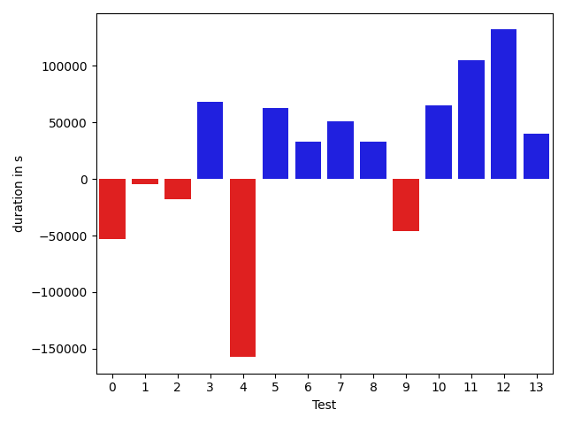

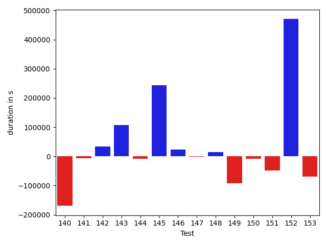

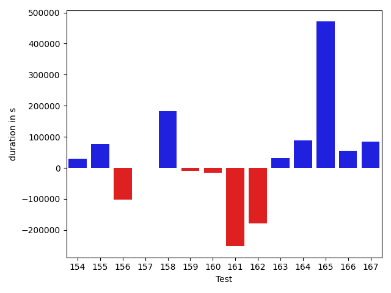

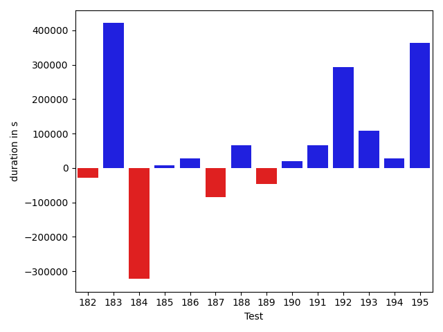

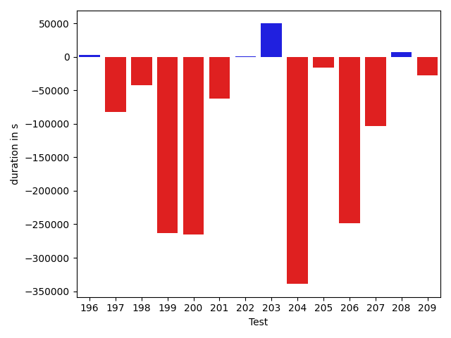

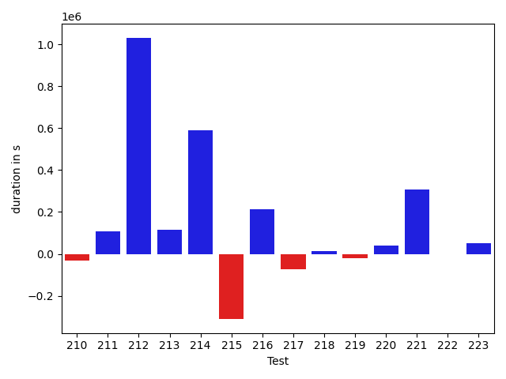

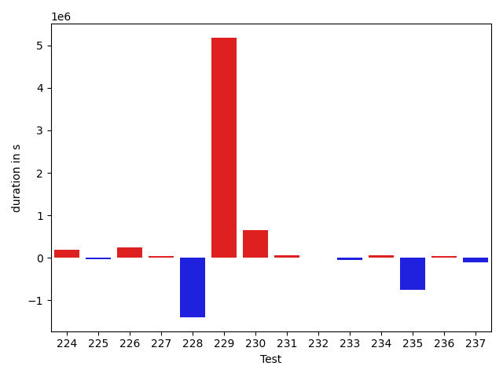

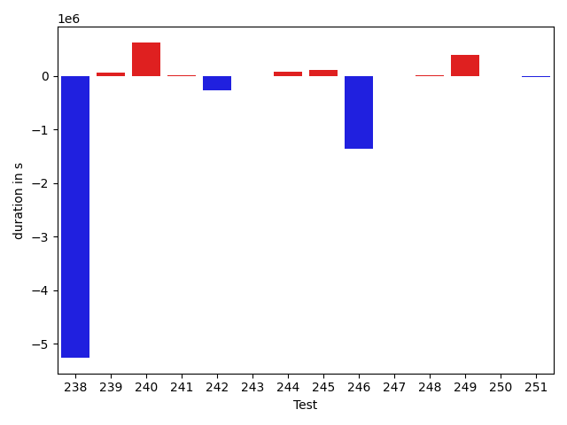

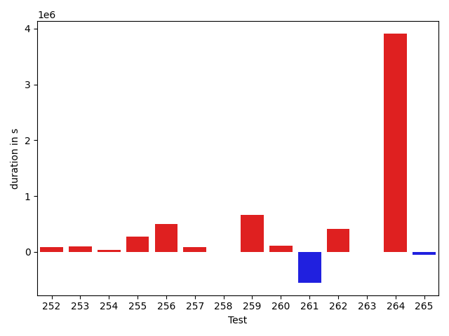

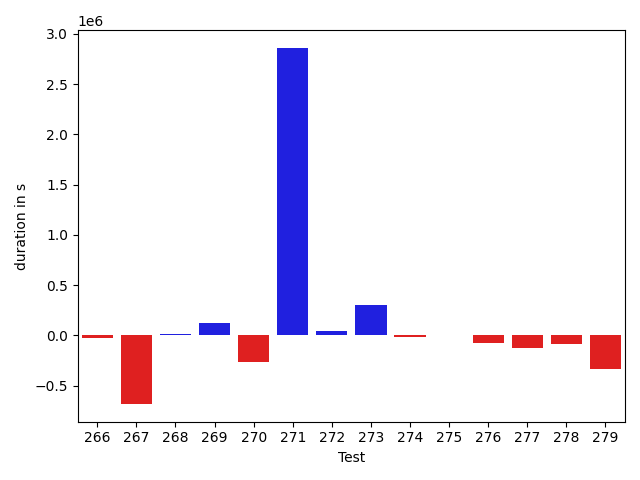

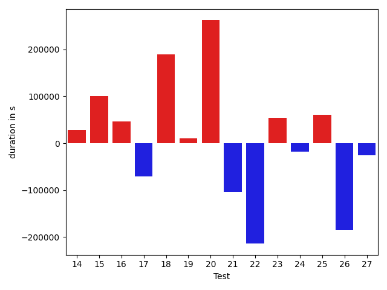

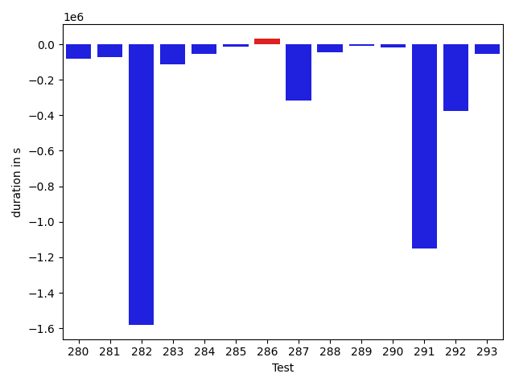

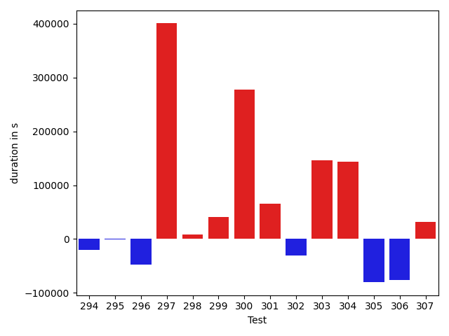

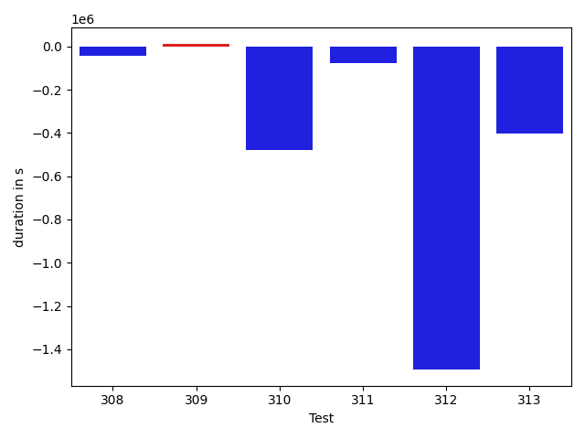

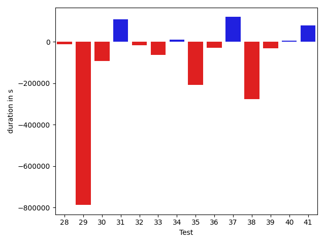

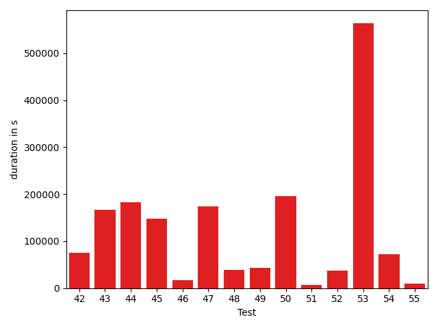

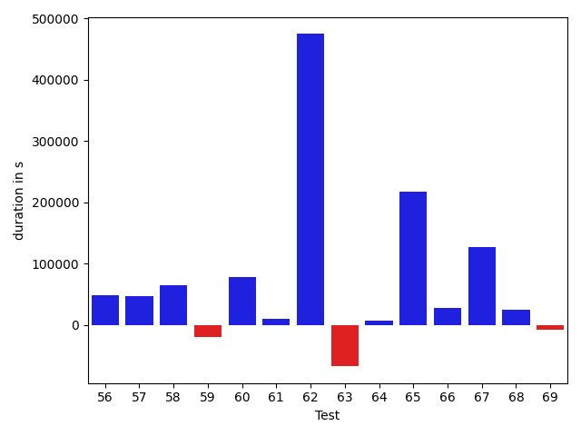

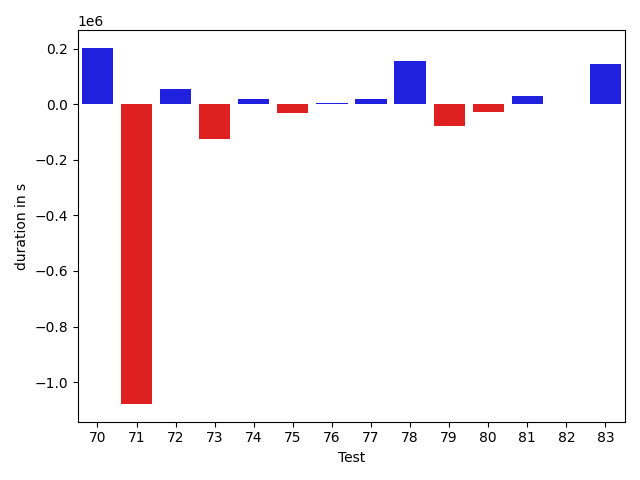

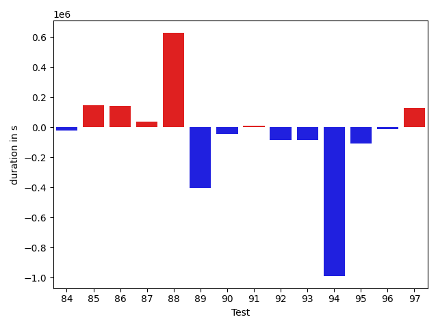

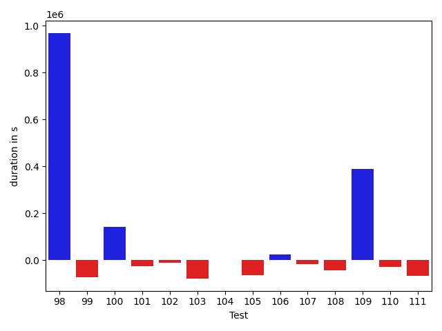

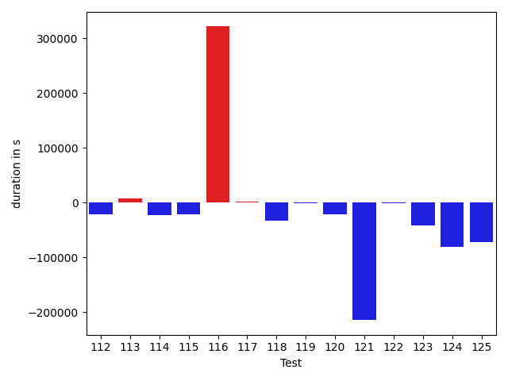

| ID | DurationV1 | DurationsV2 | DeltaDuration |
| --- | --- | --- | --- |
| 0 | 1220717.5833333333 | 1167581.965116279 | -53135.61821705429 |
| 1 | 550259.8611111111 | 545955.75 | -4304.111111111124 |
| 2 | 917053.175 | 898797.2972972973 | -18255.877702702768 |
| 3 | 1077990.1549295774 | 1146574.0757575757 | 68583.92082799831 |
| 4 | 540546.9333333333 | 383192.0 | -157354.93333333335 |
| 5 | 372190.5 | 434939.60869565216 | 62749.10869565216 |
| 6 | 569258.09375 | 601939.9444444445 | 32681.850694444496 |
| 7 | 651360.1764705882 | 702220.3636363636 | 50860.18716577545 |
| 8 | 975224.2580645161 | 1008520.3333333334 | 33296.07526881725 |
| 9 | 637894.7666666667 | 592122.5714285715 | -45772.19523809524 |
| 10 | 1695523.8265306123 | 1760800.3636363635 | 65276.537105751224 |
| 11 | 706363.4310344828 | 811676.3170731707 | 105312.8860386879 |
| 12 | 789815.5833333334 | 921819.1052631579 | 132003.5219298245 |
| 13 | 1299899.9047619049 | 1339928.3823529412 | 40028.47759103635 |
| 14 | 891687.625 | 920088.1521739131 | 28400.527173913084 |
| 15 | 1057234.4411764706 | 1157200.0634920634 | 99965.62231559283 |
| 16 | 1108591.4096385543 | 1154459.357142857 | 45867.94750430272 |
| 17 | 894643.9333333333 | 823703.7872340425 | -70940.14609929081 |
| 18 | 688002.925925926 | 877364.0408163265 | 189361.11489040055 |
| 19 | 1059935.1612903227 | 1070269.642857143 | 10334.481566820294 |
| 20 | 1132455.1578947369 | 1394519.6785714286 | 262064.52067669178 |
| 21 | 1566436.579710145 | 1461667.536231884 | -104769.04347826098 |
| 22 | 873663.8947368421 | 659711.9166666666 | -213951.9780701755 |
| 23 | 519088.47222222225 | 573778.6 | 54690.12777777773 |
| 24 | 551468.5454545454 | 533599.7352941176 | -17868.81016042782 |
| 25 | 392561.7 | 452859.35714285716 | 60297.65714285715 |
| 26 | 849228.8604651163 | 663325.5897435897 | -185903.27072152658 |
| 27 | 787995.1521739131 | 762876.62 | -25118.53217391309 |
| 28 | 964925.8064516129 | 953772.4318181818 | -11153.374633431085 |
| 29 | 2323229.3283582088 | 1536122.8153846154 | -787106.5129735933 |
| 30 | 2420712.4242424243 | 2329063.212121212 | -91649.21212121239 |
| 31 | 698770.125 | 806128.6530612245 | 107358.5280612245 |
| 32 | 1047724.012987013 | 1030887.2957746478 | -16836.717212365125 |
| 33 | 430922.9583333333 | 368534.53846153844 | -62388.419871794875 |
| 34 | 876068.1272727273 | 886947.28 | 10879.15272727271 |
| 35 | 902070.2432432432 | 693474.2580645161 | -208595.98517872707 |
| 36 | 504202.6538461539 | 474525.3461538461 | -29677.307692307746 |
| 37 | 5701659.515151516 | 5821235.242424242 | 119575.7272727266 |
| 38 | 3437451.3535353537 | 3159791.4646464647 | -277659.888888889 |
| 39 | 3053737.0404040404 | 3023243.1414141413 | -30493.898989899084 |
| 40 | 638407.724137931 | 643295.1666666666 | 4887.442528735613 |
| 41 | 780336.224489796 | 860642.7454545455 | 80306.5209647495 |
| 42 | 1333229.8901098901 | 1408884.6354166667 | 75654.7453067766 |
| 43 | 903245.6363636364 | 1070745.349206349 | 167499.71284271276 |
| 44 | 668026.7631578947 | 851227.2195121951 | 183200.45635430038 |
| 45 | 876512.2 | 1024832.5882352941 | 148320.38823529414 |
| 46 | 777214.3965517242 | 794654.5918367347 | 17440.1952850105 |
| 47 | 1594486.0568181819 | 1768458.5934065934 | 173972.53658841155 |
| 48 | 1652018.7373737374 | 1690757.1818181819 | 38738.444444444496 |
| 49 | 383542.76923076925 | 426731.15789473685 | 43188.388663967606 |
| 50 | 1061106.5818181818 | 1257482.014925373 | 196375.43310719123 |
| 51 | 510916.96428571426 | 517143.32 | 6226.355714285746 |
| 52 | 647413.0476190476 | 685468.9736842106 | 38055.92606516299 |
| 53 | 870937.2807017544 | 1434214.06779661 | 563276.7870948557 |
| 54 | 375893.6842105263 | 448052.5882352941 | 72158.9040247678 |
| 55 | 599551.12 | 609913.8965517242 | 10362.776551724179 |
| 56 | 370087.0869565217 | 418345.4736842105 | 48258.386727688776 |
| 57 | 648897.2307692308 | 696747.3333333334 | 47850.10256410262 |
| 58 | 662993.3529411765 | 727444.6071428572 | 64451.254201680655 |
| 59 | 510519.77777777775 | 491731.25 | -18788.527777777752 |
| 60 | 900809.6323529412 | 978730.7419354839 | 77921.10958254267 |
| 61 | 668582.4285714285 | 678835.8666666667 | 10253.438095238176 |
| 62 | 1692966.287356322 | 2168584.4125 | 475618.12514367816 |
| 63 | 461036.29411764705 | 393543.6666666667 | -67492.62745098036 |
| 64 | 475984.4761904762 | 482669.4666666667 | 6684.990476190462 |
| 65 | 452835.96153846156 | 671052.5714285715 | 218216.60989010992 |
| 66 | 452948.7037037037 | 481330.8695652174 | 28382.1658615137 |
| 67 | 722564.7272727273 | 849554.3695652174 | 126989.64229249011 |
| 68 | 300662.2727272727 | 325724.85714285716 | 25062.584415584453 |
| 69 | 404177.65 | 396304.23529411765 | -7873.414705882373 |
| 70 | 1380064.3243243243 | 1582116.2653061224 | 202051.9409817981 |
| 71 | 1474919.2083333333 | 396609.8461538461 | -1078309.362179487 |
| 72 | 997852.2777777778 | 1051633.3404255318 | 53781.06264775409 |
| 73 | 458713.9655172414 | 334393.9411764706 | -124320.02434077079 |
| 74 | 322134.21428571426 | 339601.1818181818 | 17466.967532467563 |
| 75 | 384313.77777777775 | 353126.4 | -31187.37777777773 |
| 76 | 373054.3157894737 | 375912.8461538461 | 2858.5303643724183 |
| 77 | 304105.0 | 321334.5 | 17229.5 |
| 78 | 469781.4375 | 623932.625 | 154151.1875 |
| 79 | 542068.0666666667 | 464057.4347826087 | -78010.63188405795 |
| 80 | 336382.0625 | 308558.75 | -27823.3125 |
| 81 | 336038.1538461539 | 366693.5833333333 | 30655.42948717944 |
| 82 | 324543.4166666667 | 326087.3333333333 | 1543.9166666666279 |
| 83 | 345097.4 | 488090.0 | 142992.59999999998 |
| 84 | 357136.5 | 335200.75 | -21935.75 |
| 85 | 301842.55555555556 | 448806.5714285714 | 146964.01587301586 |
| 86 | 909628.8545454545 | 1052093.137254902 | 142464.28270944743 |
| 87 | 1095951.2083333333 | 1131180.842857143 | 35229.634523809655 |
| 88 | 1049388.46875 | 1677655.4242424243 | 628266.9554924243 |
| 89 | 4318019.2727272725 | 3915193.97979798 | -402825.29292929266 |
| 90 | 726674.2941176471 | 679884.2258064516 | -46790.06831119547 |
| 91 | 879191.9583333334 | 890368.72 | 11176.7616666666 |
| 92 | 623626.6 | 537837.75 | -85788.84999999998 |
| 93 | 632257.1388888889 | 547799.4117647059 | -84457.72712418297 |
| 94 | 2636031.564102564 | 1646475.92 | -989555.6441025641 |
| 95 | 2666004.43877551 | 2556576.8383838385 | -109427.60039167153 |
| 96 | 481253.76470588235 | 466930.4347826087 | -14323.329923273646 |
| 97 | 1449850.7701149425 | 1577993.2048192772 | 128142.43470433471 |
| 98 | 1771490.593220339 | 2740588.4423076925 | 969097.8490873536 |
| 99 | 515787.15 | 443771.76470588235 | -72015.38529411767 |
| 100 | 1581860.547368421 | 1725087.612244898 | 143227.064876477 |
| 101 | 892175.2280701754 | 865589.574074074 | -26585.653996101348 |
| 102 | 1102853.0476190476 | 1092799.21875 | -10053.828869047575 |
| 103 | 830248.1777777778 | 751596.2264150943 | -78651.95136268344 |
| 104 | 1242533.8510638298 | 1244515.4731182796 | 1981.6220544497482 |
| 105 | 534437.275862069 | 471092.87096774194 | -63344.404894327046 |
| 106 | 864465.8852459016 | 889177.6428571428 | 24711.75761124119 |
| 107 | 589555.5384615385 | 573924.1333333333 | -15631.405128205195 |
| 108 | 3400188.393939394 | 3356586.9696969697 | -43601.42424242431 |
| 109 | 477851.09523809527 | 868027.1052631579 | 390176.0100250626 |
| 110 | 1186494.6235294119 | 1158529.0705882353 | -27965.552941176575 |
| 111 | 900821.6346153846 | 833227.2641509434 | -67594.37046444125 |
| 112 | 898002.5294117647 | 876066.4107142857 | -21936.118697479018 |
| 113 | 682149.28 | 689592.6097560975 | 7443.329756097519 |
| 114 | 431739.8076923077 | 408512.0 | -23227.807692307688 |
| 115 | 758630.9787234042 | 737458.8695652174 | -21172.109158186824 |
| 116 | 1168573.347826087 | 1489854.105263158 | 321280.75743707106 |
| 117 | 678411.0 | 680612.0212765958 | 2201.0212765957695 |
| 118 | 975596.6440677966 | 942448.4561403509 | -33148.187927445746 |
| 119 | 676618.962264151 | 674617.1923076923 | -2001.7699564587092 |
| 120 | 430170.95238095237 | 409058.2173913043 | -21112.734989648045 |
| 121 | 1285758.3333333333 | 1071004.4318181819 | -214753.90151515137 |
| 122 | 704081.8297872341 | 703029.6666666666 | -1052.1631205674494 |
| 123 | 437282.28571428574 | 395514.625 | -41767.66071428574 |
| 124 | 499000.2105263158 | 418220.85714285716 | -80779.35338345863 |
| 125 | 648356.2368421053 | 575480.1 | -72876.1368421053 |
| 126 | 744252.7333333333 | 620248.1428571428 | -124004.59047619044 |
| 127 | 315337.6923076923 | 326075.6923076923 | 10738.0 |
| 128 | 438230.25 | 463511.5652173913 | 25281.315217391297 |
| 129 | 513972.65 | 442157.8 | -71814.85000000003 |
| 130 | 386635.3333333333 | 363836.1 | -22799.233333333337 |
| 131 | 470048.8461538461 | 445344.26923076925 | -24704.57692307688 |
| 132 | 767459.0 | 747359.5079365079 | -20099.49206349207 |
| 133 | 296230.0909090909 | 324402.78571428574 | 28172.694805194857 |
| 134 | 444853.2631578947 | 467620.9583333333 | 22767.695175438595 |
| 135 | 711951.6944444445 | 485716.5142857143 | -226235.1801587302 |
| 136 | 387778.73913043475 | 356128.6875 | -31650.051630434755 |
| 137 | 810550.6774193548 | 774712.5490196078 | -35838.12839974696 |
| 138 | 1083315.12345679 | 1103061.373493976 | 19746.250037185848 |
| 139 | 1305486.7444444445 | 1411864.488372093 | 106377.74392764852 |
| 140 | 2515128.787878788 | 2345099.585858586 | -170029.2020202023 |
| 141 | 574845.4444444445 | 568282.2068965518 | -6563.237547892728 |
| 142 | 1053534.6785714286 | 1086747.012987013 | 33212.33441558434 |
| 143 | 2132645.383838384 | 2240370.262626263 | 107724.8787878789 |
| 144 | 1130070.5810810812 | 1121489.8095238095 | -8580.771557271713 |
| 145 | 2122328.3333333335 | 2366742.1414141413 | 244413.8080808078 |
| 146 | 1071661.369047619 | 1094817.8734177216 | 23156.50437010266 |
| 147 | 1285959.793478261 | 1284551.5714285714 | -1408.2220496896189 |
| 148 | 1053899.45 | 1069097.6805555555 | 15198.23055555555 |
| 149 | 681570.2727272727 | 589584.1071428572 | -91986.16558441555 |
| 150 | 967133.0434782609 | 959452.88 | -7680.16347826086 |
| 151 | 782009.6734693878 | 733322.7291666666 | -48686.94430272118 |
| 152 | 8718718.022988506 | 9189513.244444445 | 470795.2214559391 |
| 153 | 508693.04545454547 | 439520.0869565217 | -69172.95849802374 |
| 154 | 496043.5238095238 | 526349.1379310344 | 30305.614121510647 |
| 155 | 723874.568627451 | 800293.7083333334 | 76419.13970588241 |
| 156 | 873454.7105263158 | 772190.75 | -101263.96052631584 |
| 157 | 1581384.7551020407 | 1581115.7474747475 | -269.0076272932347 |
| 158 | 663429.5652173914 | 846117.32 | 182687.7547826086 |
| 159 | 700589.4390243902 | 690592.21875 | -9997.220274390187 |
| 160 | 447391.0869565217 | 432738.9583333333 | -14652.128623188415 |
| 161 | 784342.8636363636 | 532369.3888888889 | -251973.47474747477 |
| 162 | 752692.08 | 574956.3170731707 | -177735.76292682928 |
| 163 | 459686.0833333333 | 492101.6842105263 | 32415.600877192977 |
| 164 | 397226.2380952381 | 485563.8823529412 | 88337.6442577031 |
| 165 | 1303051.2441860465 | 1773633.632183908 | 470582.3879978615 |
| 166 | 686991.447368421 | 742755.9512195121 | 55764.50385109114 |
| 167 | 376606.71428571426 | 460390.6875 | 83783.97321428574 |
| 168 | 411769.07692307694 | 382334.5714285714 | -29434.505494505516 |
| 169 | 363168.1666666667 | 395780.6 | 32612.43333333329 |
| 170 | 430402.8095238095 | 368824.2631578947 | -61578.54636591481 |
| 171 | 401916.5 | 474969.22222222225 | 73052.72222222225 |
| 172 | 446397.5833333333 | 457068.61904761905 | 10671.03571428574 |
| 173 | 1746594.081632653 | 523516.9090909091 | -1223077.1725417438 |
| 174 | 393573.94444444444 | 406476.0 | 12902.055555555562 |
| 175 | 459735.0 | 715464.2631578947 | 255729.26315789472 |
| 176 | 332048.70588235295 | 347463.78571428574 | 15415.079831932788 |
| 177 | 374921.0 | 376000.06666666665 | 1079.0666666666511 |
| 178 | 327750.14285714284 | 345509.75 | 17759.60714285716 |
| 179 | 707082.3421052631 | 657352.0256410256 | -49730.31646423752 |
| 180 | 378283.9375 | 410763.07692307694 | 32479.139423076937 |
| 181 | 1000127.8125 | 1020880.6 | 20752.787499999977 |
| 182 | 473420.26666666666 | 445875.28 | -27544.986666666635 |
| 183 | 1083478.75 | 1504160.121212121 | 420681.3712121211 |
| 184 | 1169348.0416666667 | 847033.7894736842 | -322314.2521929826 |
| 185 | 348276.1538461539 | 356107.21428571426 | 7831.060439560388 |
| 186 | 371453.0 | 398427.5 | 26974.5 |
| 187 | 455643.95238095237 | 370676.1052631579 | -84967.84711779444 |
| 188 | 272686.7272727273 | 338716.9411764706 | 66030.21390374331 |
| 189 | 408528.13333333336 | 362396.25 | -46131.88333333336 |
| 190 | 380013.0 | 400671.27777777775 | 20658.277777777752 |
| 191 | 435309.64705882355 | 500743.7 | 65434.05294117646 |
| 192 | 370916.9375 | 664900.6818181818 | 293983.74431818177 |
| 193 | 317185.0 | 425456.77777777775 | 108271.77777777775 |
| 194 | 332276.28571428574 | 360923.14285714284 | 28646.8571428571 |
| 195 | 386585.2727272727 | 749505.2857142857 | 362920.012987013 |
| 196 | 389790.1666666667 | 392713.77777777775 | 2923.611111111066 |
| 197 | 424848.3333333333 | 342373.6 | -82474.73333333334 |
| 198 | 396987.25 | 354762.92307692306 | -42224.32692307694 |
| 199 | 1340478.75 | 1077702.0666666667 | -262776.68333333335 |
| 200 | 985337.9743589744 | 720016.7222222222 | -265321.2521367521 |
| 201 | 427619.72222222225 | 365106.76470588235 | -62512.9575163399 |
| 202 | 333637.36363636365 | 334601.6 | 964.2363636363298 |
| 203 | 1251264.4848484849 | 1300926.9545454546 | 49662.469696969725 |
| 204 | 753813.1333333333 | 414673.9 | -339139.2333333333 |
| 205 | 457609.44444444444 | 441719.4285714286 | -15890.015873015858 |
| 206 | 1258356.388888889 | 1009827.3484848485 | -248529.04040404048 |
| 207 | 508598.0 | 405037.68 | -103560.32 |
| 208 | 388904.36842105264 | 396223.8888888889 | 7319.520467836235 |
| 209 | 388256.3333333333 | 360494.5333333333 | -27761.79999999999 |
| 210 | 444428.65 | 410969.9375 | -33458.71250000002 |
| 211 | 513090.17647058825 | 622131.0454545454 | 109040.86898395716 |
| 212 | 562966.0434782609 | 1594165.05 | 1031199.0065217392 |
| 213 | 367052.6111111111 | 481050.4666666667 | 113997.85555555555 |
| 214 | 1755053.142857143 | 2344296.25 | 589243.107142857 |
| 215 | 621382.7 | 310655.4166666667 | -310727.28333333327 |
| 216 | 1621507.2264150945 | 1834981.051724138 | 213473.82530904352 |
| 217 | 2260370.3608247424 | 2187891.404255319 | -72478.95656942343 |
| 218 | 1152311.7272727273 | 1164818.6621621621 | 12506.934889434837 |
| 219 | 1307575.3409090908 | 1285206.4835164836 | -22368.857392607257 |
| 220 | 843793.2280701754 | 882028.8448275862 | 38235.61675741081 |
| 221 | 987678.4285714285 | 1295473.0793650793 | 307794.65079365077 |
| 222 | 761768.85 | 759971.0 | -1797.8499999999767 |
| 223 | 708412.5714285715 | 757722.3571428572 | 49309.78571428568 |
| 224 | 4548655.939393939 | 4733203.777777778 | 184547.83838383853 |
| 225 | 815546.4150943396 | 773119.76 | -42426.65509433963 |
| 226 | 3499043.1818181816 | 3734932.8181818184 | 235889.6363636367 |
| 227 | 1108535.575 | 1146404.75 | 37869.17500000005 |
| 228 | 1862455.6551724137 | 456866.35 | -1405589.3051724136 |
| 229 | 2235029.076923077 | 7420524.416666667 | 5185495.33974359 |
| 230 | 4261034.919191919 | 4902233.202020202 | 641198.2828282826 |
| 231 | 941974.5555555555 | 1005828.3333333334 | 63853.77777777787 |
| 232 | 704901.0697674418 | 706958.7307692308 | 2057.661001788918 |
| 233 | 868967.1698113207 | 818022.2727272727 | -50944.89708404802 |
| 234 | 934611.1186440678 | 995898.9193548387 | 61287.80071077088 |
| 235 | 3979674.8181818184 | 3213687.3131313133 | -765987.505050505 |
| 236 | 1033775.358974359 | 1067600.8857142858 | 33825.526739926776 |
| 237 | 560117.3928571428 | 449456.6060606061 | -110660.78679653676 |
| 238 | 5779608.041666667 | 519944.0 | -5259664.041666667 |
| 239 | 546023.3548387097 | 612860.9142857143 | 66837.55944700458 |
| 240 | 649965.0769230769 | 1274656.24 | 624691.1630769231 |
| 241 | 585250.5 | 592587.0384615385 | 7336.538461538497 |
| 242 | 1275603.9166666667 | 1001999.52 | -273604.3966666667 |
| 243 | 1743911.1470588236 | 1743258.7894736843 | -652.3575851393398 |
| 244 | 363877.5882352941 | 438739.4285714286 | 74861.84033613448 |
| 245 | 1161766.186440678 | 1271776.5483870967 | 110010.36194641865 |
| 246 | 8718853.838383839 | 7367285.222222222 | -1351568.6161616165 |
| 247 | 507132.17391304346 | 500573.04 | -6559.133913043479 |
| 248 | 610142.4736842106 | 626148.5555555555 | 16006.08187134494 |
| 249 | 2612804.25 | 3007995.711111111 | 395191.4611111111 |
| 250 | 648922.2444444444 | 649129.2105263158 | 206.96608187141828 |
| 251 | 674120.6129032258 | 655073.3902439025 | -19047.222659323364 |
| 252 | 1043005.9610389611 | 1123621.8205128205 | 80615.85947385943 |
| 253 | 991612.1363636364 | 1086572.217948718 | 94960.08158508164 |
| 254 | 982015.5588235294 | 1019525.3466666667 | 37509.78784313728 |
| 255 | 1016907.9428571429 | 1285167.7534246575 | 268259.8105675146 |
| 256 | 895921.9393939395 | 1399545.205882353 | 503623.26648841356 |
| 257 | 534300.8529411765 | 622028.2333333333 | 87727.38039215677 |
| 258 | 657570.0625 | 656085.16 | -1484.9024999999674 |
| 259 | 1069583.6785714286 | 1729589.2413793104 | 660005.5628078817 |
| 260 | 467155.6956521739 | 580044.3333333334 | 112888.63768115948 |
| 261 | 1541118.9583333333 | 987322.358490566 | -553796.5998427672 |
| 262 | 899205.8939393939 | 1305389.0526315789 | 406183.15869218495 |
| 263 | 535718.619047619 | 535731.7586206896 | 13.139573070569895 |
| 264 | 601774.24 | 4513667.176470588 | 3911892.9364705877 |
| 265 | 944518.0447761194 | 889403.625 | -55114.41977611941 |
| 266 | 1329762.5 | 1300936.0 | -28826.5 |
| 267 | 1423306.9074074074 | 740131.4814814815 | -683175.425925926 |
| 268 | 568122.7647058824 | 579018.3823529412 | 10895.617647058796 |
| 269 | 1337988.8936170214 | 1462041.8918918918 | 124052.99827487045 |
| 270 | 1561848.6065573771 | 1297443.1964285714 | -264405.4101288058 |
| 271 | 2110475.5454545454 | 4970027.952380952 | 2859552.406926407 |
| 272 | 368744.35294117645 | 412718.8125 | 43974.45955882355 |
| 273 | 5581386.898989899 | 5881352.373737373 | 299965.4747474743 |
| 274 | 4497363.0 | 4478682.535353536 | -18680.464646464214 |
| 275 | 589165.875 | 592743.4705882353 | 3577.595588235301 |
| 276 | 595908.5 | 521575.5833333333 | -74332.91666666669 |
| 277 | 1418202.347368421 | 1294463.9468085107 | -123738.40055991034 |
| 278 | 749262.4166666666 | 660073.717948718 | -89188.69871794863 |
| 279 | 1128812.9 | 790385.0 | -338427.8999999999 |
| 280 | 596560.8571428572 | 516738.06666666665 | -79822.79047619051 |
| 281 | 685121.8095238095 | 611304.619047619 | -73817.19047619042 |
| 282 | 2300531.076923077 | 719756.4642857143 | -1580774.6126373627 |
| 283 | 612766.3928571428 | 500242.36666666664 | -112524.0261904762 |
| 284 | 464060.71428571426 | 408317.0 | -55743.71428571426 |
| 285 | 1839850.15625 | 1827075.5106382978 | -12774.645611702232 |
| 286 | 684175.9615384615 | 716253.45 | 32077.48846153845 |
| 287 | 1780691.3125 | 1465107.4810126582 | -315583.8314873418 |
| 288 | 399349.4210526316 | 354670.25 | -44679.17105263157 |
| 289 | 336837.8 | 329498.3888888889 | -7339.411111111112 |
| 290 | 377649.0 | 358749.875 | -18899.125 |
| 291 | 1556062.4736842106 | 405005.9285714286 | -1151056.545112782 |
| 292 | 719903.1538461539 | 343688.76923076925 | -376214.3846153846 |
| 293 | 405700.8947368421 | 351212.1818181818 | -54488.712918660254 |
| 294 | 460491.0714285714 | 440415.5263157895 | -20075.545112781925 |
| 295 | 371343.875 | 371162.5 | -181.375 |
| 296 | 368409.3333333333 | 321226.76923076925 | -47182.564102564065 |
| 297 | 1184161.657142857 | 1584800.1168831168 | 400638.4597402597 |
| 298 | 520896.3103448276 | 529023.1935483871 | 8126.883203559555 |
| 299 | 624681.88 | 665530.4693877551 | 40848.58938775514 |
| 300 | 1138041.9295774647 | 1415176.6545454545 | 277134.72496798984 |
| 301 | 1235303.7142857143 | 1300466.0357142857 | 65162.32142857136 |
| 302 | 711619.8979591837 | 681181.8545454545 | -30438.043413729174 |
| 303 | 745167.2166666667 | 891589.5531914893 | 146422.33652482263 |
| 304 | 768918.8888888889 | 912894.3478260869 | 143975.45893719804 |
| 305 | 567099.7619047619 | 486787.3333333333 | -80312.42857142858 |
| 306 | 1239052.3684210526 | 1163580.4680851065 | -75471.90033594612 |
| 307 | 524410.65625 | 555643.48 | 31232.82374999998 |
| 308 | 753824.2407407408 | 711786.2115384615 | -42038.029202279286 |
| 309 | 505853.1111111111 | 518155.0 | 12301.888888888876 |
| 310 | 2903065.64516129 | 2422664.029850746 | -480401.61531054415 |
| 311 | 788923.9 | 714305.88 | -74618.02000000002 |
| 312 | 3413712.6071428573 | 1920080.392857143 | -1493632.2142857143 |
| 313 | 1137921.1666666667 | 736729.1875 | -401191.97916666674 |

## Misc.

| ID | Test Class | Test Method |
| --- | --- | --- |
| 0 | com.google.gson.functional.StreamingTypeAdaptersTest | testNullSafe |
| 1 | com.google.gson.functional.StreamingTypeAdaptersTest | testSerialize2dArray |
| 2 | com.google.gson.functional.StreamingTypeAdaptersTest | testSerializeNullObject |
| 3 | com.google.gson.functional.StreamingTypeAdaptersTest | testSerializeWithCustomTypeAdapter |
| 4 | com.google.gson.functional.StreamingTypeAdaptersTest | testSerializeNullField |
| 5 | com.google.gson.functional.StreamingTypeAdaptersTest | testSerialize |
| 6 | com.google.gson.functional.StreamingTypeAdaptersTest | testSerializeRecursive |
| 7 | com.google.gson.functional.StreamingTypeAdaptersTest | testSerialize1dArray |
| 8 | com.google.gson.functional.StreamingTypeAdaptersTest | testSerializeMap |
| 9 | com.google.gson.functional.CustomDeserializerTest | testDefaultConstructorNotCalledOnField |
| 10 | com.google.gson.functional.CustomDeserializerTest | testDefaultConstructorNotCalledOnObject |
| 11 | com.google.gson.functional.CollectionTest | testCollectionOfObjectSerialization |
| 12 | com.google.gson.functional.CollectionTest | testFieldIsArrayList |
| 13 | com.google.gson.functional.CollectionTest | testWildcardPrimitiveCollectionSerilaization |
| 14 | com.google.gson.functional.CollectionTest | testQueueSerialization |
| 15 | com.google.gson.functional.CollectionTest | testUserCollectionTypeAdapter |
| 16 | com.google.gson.functional.CollectionTest | testWildcardCollectionField |
| 17 | com.google.gson.functional.CollectionTest | testTopLevelCollectionOfIntegersSerialization |
| 18 | com.google.gson.functional.CollectionTest | testCollectionOfObjectWithNullSerialization |
| 19 | com.google.gson.functional.CollectionTest | testLinkedListSerialization |
| 20 | com.google.gson.functional.CollectionTest | testCollectionOfBagOfPrimitivesSerialization |
| 21 | com.google.gson.functional.CollectionTest | testSetSerialization |
| 22 | com.google.gson.functional.CollectionTest | testNullsInListSerialization |
| 23 | com.google.gson.functional.CollectionTest | testRawCollectionSerialization |
| 24 | com.google.gson.functional.CollectionTest | testRawCollectionOfIntegersSerialization |
| 25 | com.google.gson.functional.CollectionTest | testCollectionOfStringsSerialization |
| 26 | com.google.gson.functional.CustomTypeAdaptersTest | testCustomTypeAdapterAppliesToSubClassesSerializedAsBaseClass |
| 27 | com.google.gson.functional.CustomTypeAdaptersTest | testCustomAdapterInvokedForMapElementSerializationWithType |
| 28 | com.google.gson.functional.CustomTypeAdaptersTest | testCustomNestedSerializers |
| 29 | com.google.gson.functional.CustomTypeAdaptersTest | testCustomSerializers |
| 30 | com.google.gson.functional.CustomTypeAdaptersTest | testCustomTypeAdapterDoesNotAppliesToSubClasses |
| 31 | com.google.gson.functional.CustomTypeAdaptersTest | testCustomByteArraySerializer |
| 32 | com.google.gson.functional.CustomTypeAdaptersTest | testCustomAdapterInvokedForCollectionElementSerializationWithType |
| 33 | com.google.gson.functional.CustomTypeAdaptersTest | testCustomAdapterInvokedForMapElementSerialization |
| 34 | com.google.gson.functional.CustomTypeAdaptersTest | testRegisterHierarchyAdapterForDate |
| 35 | com.google.gson.functional.CustomTypeAdaptersTest | testEnsureCustomSerializerNotInvokedForNullValues |
| 36 | com.google.gson.functional.CustomTypeAdaptersTest | testCustomAdapterInvokedForCollectionElementSerialization |
| 37 | com.google.gson.functional.CircularReferenceTest | testCircularSerialization |
| 38 | com.google.gson.functional.CircularReferenceTest | testSelfReferenceArrayFieldSerialization |
| 39 | com.google.gson.functional.CircularReferenceTest | testSelfReferenceSerialization |
| 40 | com.google.gson.functional.CircularReferenceTest | testDirectedAcyclicGraphSerialization |
| 41 | com.google.gson.functional.MapTest | testSerializeMaps |
| 42 | com.google.gson.functional.MapTest | testInterfaceTypeMapWithSerializer |
| 43 | com.google.gson.functional.MapTest | testComplexKeysSerialization |
| 44 | com.google.gson.functional.MapTest | testMapSerializationWithIntegerKeys |
| 45 | com.google.gson.functional.MapTest | testCustomSerializerForSpecificMapType |
| 46 | com.google.gson.functional.MapTest | testGeneralMapField |
| 47 | com.google.gson.functional.MapTest | testInterfaceTypeMap |
| 48 | com.google.gson.functional.MapTest | testParameterizedMapSubclassSerialization |
| 49 | com.google.gson.functional.MapTest | testWriteMapsWithEmptyStringKey |
| 50 | com.google.gson.functional.MapTest | testMapSerializationWithNullValues |
| 51 | com.google.gson.functional.MapTest | testMapSerializationWithNullValuesSerialized |
| 52 | com.google.gson.functional.MapTest | testSerializeMapOfMaps |
| 53 | com.google.gson.functional.MapTest | testMapSerialization |
| 54 | com.google.gson.functional.MapTest | testMapOfMapSerialization |
| 55 | com.google.gson.functional.MapTest | testMapSubclassSerialization |
| 56 | com.google.gson.functional.MapTest | testMapWithQuotes |
| 57 | com.google.gson.functional.MapTest | testMapSerializationWithNullValueButSerializeNulls |
| 58 | com.google.gson.functional.MapTest | testMapSerializationWithNullKey |
| 59 | com.google.gson.functional.MapTest | testRawMapSerialization |
| 60 | com.google.gson.functional.PrettyPrintingTest | testEmptyMapField |
| 61 | com.google.gson.functional.PrettyPrintingTest | testPrettyPrintListOfPrimitiveArrays |
| 62 | com.google.gson.functional.PrettyPrintingTest | testPrettyPrintList |
| 63 | com.google.gson.functional.PrettyPrintingTest | testPrettyPrintArrayOfPrimitives |
| 64 | com.google.gson.functional.PrettyPrintingTest | testMap |
| 65 | com.google.gson.functional.PrettyPrintingTest | testMultipleArrays |
| 66 | com.google.gson.functional.PrettyPrintingTest | testPrettyPrintArrayOfPrimitiveArrays |
| 67 | com.google.gson.functional.PrettyPrintingTest | testPrettyPrintArrayOfObjects |
| 68 | com.google.gson.stream.JsonWriterTest | testWriterCloseIsIdempotent |
| 69 | com.google.gson.stream.JsonWriterTest | testPrettyPrintArray |
| 70 | com.google.gson.stream.JsonWriterTest | testNumbers |
| 71 | com.google.gson.stream.JsonWriterTest | testStrings |
| 72 | com.google.gson.stream.JsonWriterTest | testDoubles |
| 73 | com.google.gson.stream.JsonWriterTest | testUnicodeLineBreaksEscaped |
| 74 | com.google.gson.stream.JsonWriterTest | testRepeatedName |
| 75 | com.google.gson.stream.JsonWriterTest | testNullStringValue |
| 76 | com.google.gson.stream.JsonWriterTest | testClosedWriterThrowsOnStructure |
| 77 | com.google.gson.stream.JsonWriterTest | testClosedWriterThrowsOnName |
| 78 | com.google.gson.stream.JsonWriterTest | testPrettyPrintObject |
| 79 | com.google.gson.stream.JsonWriterTest | testLongs |
| 80 | com.google.gson.stream.JsonWriterTest | testLenientWriterPermitsMultipleTopLevelValues |
| 81 | com.google.gson.stream.JsonWriterTest | testObjectsInArrays |
| 82 | com.google.gson.stream.JsonWriterTest | testClosedWriterThrowsOnValue |
| 83 | com.google.gson.stream.JsonWriterTest | testDeepNestingObjects |
| 84 | com.google.gson.stream.JsonWriterTest | testArraysInObjects |
| 85 | com.google.gson.stream.JsonWriterTest | testClosedWriterThrowsOnFlush |
| 86 | com.google.gson.functional.ReadersWritersTest | testReadWriteTwoObjects |
| 87 | com.google.gson.functional.ReadersWritersTest | testReadWriteTwoStrings |
| 88 | com.google.gson.functional.ReadersWritersTest | testWriterForSerialization |
| 89 | com.google.gson.functional.ExposeFieldsTest | testNullExposeFieldSerialization |
| 90 | com.google.gson.functional.ExposeFieldsTest | testArrayWithOneNullExposeFieldObjectSerialization |
| 91 | com.google.gson.functional.ExposeFieldsTest | testExposedInterfaceFieldSerialization |
| 92 | com.google.gson.functional.ExposeFieldsTest | testExposeAnnotationSerialization |
| 93 | com.google.gson.functional.FieldExclusionTest | testDefaultNestedStaticClassIncluded |
| 94 | com.google.gson.functional.FieldExclusionTest | testDefaultInnerClassExclusion |
| 95 | com.google.gson.functional.InheritanceTest | testSubInterfacesOfCollectionSerialization |
| 96 | com.google.gson.functional.InheritanceTest | testBaseSerializedAsSubWhenSpecifiedWithExplicitTypeForToJsonMethod |
| 97 | com.google.gson.functional.InheritanceTest | testSubClassSerialization |
| 98 | com.google.gson.functional.InheritanceTest | testBaseSerializedAsBaseWhenSpecifiedWithExplicitTypeForToJsonMethod |
| 99 | com.google.gson.functional.InheritanceTest | testBaseSerializedAsSubForToJsonMethod |
| 100 | com.google.gson.functional.MoreSpecificTypeSerializationTest | testSubclassFields |
| 101 | com.google.gson.functional.MoreSpecificTypeSerializationTest | testListOfParameterizedSubclassFields |
| 102 | com.google.gson.functional.MoreSpecificTypeSerializationTest | testListOfSubclassFields |
| 103 | com.google.gson.functional.MoreSpecificTypeSerializationTest | testParameterizedSubclassFields |
| 104 | com.google.gson.functional.DefaultTypeAdaptersTest | testDateSerializationWithPattern |
| 105 | com.google.gson.functional.DefaultTypeAdaptersTest | testDefaultJavaSqlDateSerialization |
| 106 | com.google.gson.functional.DefaultTypeAdaptersTest | testUrlSerialization |
| 107 | com.google.gson.functional.DefaultTypeAdaptersTest | testOverrideBigIntegerTypeAdapter |
| 108 | com.google.gson.functional.DefaultTypeAdaptersTest | testDefaultDateDeserializationUsingBuilder |
| 109 | com.google.gson.functional.DefaultTypeAdaptersTest | testOverrideBigDecimalTypeAdapter |
| 110 | com.google.gson.functional.DefaultTypeAdaptersTest | testDateSerializationInCollection |
| 111 | com.google.gson.functional.DefaultTypeAdaptersTest | testBigIntegerFieldSerialization |
| 112 | com.google.gson.functional.DefaultTypeAdaptersTest | testDefaultDateSerialization |
| 113 | com.google.gson.functional.DefaultTypeAdaptersTest | testDefaultDateSerializationUsingBuilder |
| 114 | com.google.gson.functional.DefaultTypeAdaptersTest | testLocaleSerializationWithLanguage |
| 115 | com.google.gson.functional.DefaultTypeAdaptersTest | testDefaultJavaSqlTimestampSerialization |
| 116 | com.google.gson.functional.DefaultTypeAdaptersTest | testJsonObjectSerialization |
| 117 | com.google.gson.functional.DefaultTypeAdaptersTest | testSqlDateSerialization |
| 118 | com.google.gson.functional.DefaultTypeAdaptersTest | testClassSerialization |
| 119 | com.google.gson.functional.DefaultTypeAdaptersTest | testTimestampSerialization |
| 120 | com.google.gson.functional.DefaultTypeAdaptersTest | testDefaultGregorianCalendarSerialization |
| 121 | com.google.gson.functional.DefaultTypeAdaptersTest | testBigDecimalFieldSerialization |
| 122 | com.google.gson.functional.DefaultTypeAdaptersTest | testDateSerializationWithPatternNotOverridenByTypeAdapter |
| 123 | com.google.gson.functional.DefaultTypeAdaptersTest | testLocaleSerializationWithLanguageCountryVariant |
| 124 | com.google.gson.functional.DefaultTypeAdaptersTest | testJsonArraySerialization |
| 125 | com.google.gson.functional.DefaultTypeAdaptersTest | testTreeSetSerialization |
| 126 | com.google.gson.functional.DefaultTypeAdaptersTest | testSetSerialization |
| 127 | com.google.gson.functional.DefaultTypeAdaptersTest | testStringBufferSerialization |
| 128 | com.google.gson.functional.DefaultTypeAdaptersTest | testJsonPrimitiveSerialization |
| 129 | com.google.gson.functional.DefaultTypeAdaptersTest | testUuidSerialization |
| 130 | com.google.gson.functional.DefaultTypeAdaptersTest | testLocaleSerializationWithLanguageCountry |
| 131 | com.google.gson.functional.DefaultTypeAdaptersTest | testDefaultCalendarSerialization |
| 132 | com.google.gson.functional.DefaultTypeAdaptersTest | testDateDeserializationWithPattern |
| 133 | com.google.gson.functional.DefaultTypeAdaptersTest | testStringBuilderSerialization |
| 134 | com.google.gson.functional.DefaultTypeAdaptersTest | testUriSerialization |
| 135 | com.google.gson.functional.DefaultTypeAdaptersTest | testDefaultJavaSqlTimeSerialization |
| 136 | com.google.gson.functional.DefaultTypeAdaptersTest | testPropertiesSerialization |
| 137 | com.google.gson.functional.ParameterizedTypesTest | testParameterizedTypesWithWriterSerialization |
| 138 | com.google.gson.functional.ParameterizedTypesTest | testVariableTypeArrayDeserialization |
| 139 | com.google.gson.functional.ParameterizedTypesTest | testParameterizedTypeWithCustomSerializer |
| 140 | com.google.gson.functional.ParameterizedTypesTest | testParameterizedTypesSerialization |
| 141 | com.google.gson.functional.ParameterizedTypesTest | testDeepParameterizedTypeSerialization |
| 142 | com.google.gson.functional.ParameterizedTypesTest | testVariableTypeDeserialization |
| 143 | com.google.gson.functional.ParameterizedTypesTest | testVariableTypeFieldsAndGenericArraysSerialization |
| 144 | com.google.gson.functional.ParameterizedTypesTest | testParameterizedTypeGenericArraysDeserialization |
| 145 | com.google.gson.functional.ParameterizedTypesTest | testTypesWithMultipleParametersSerialization |
| 146 | com.google.gson.functional.ParameterizedTypesTest | testParameterizedTypeWithVariableTypeDeserialization |
| 147 | com.google.gson.functional.ParameterizedTypesTest | testVariableTypeFieldsAndGenericArraysDeserialization |
| 148 | com.google.gson.functional.ParameterizedTypesTest | testParameterizedTypeGenericArraysSerialization |
| 149 | com.google.gson.functional.ObjectTest | testNestedSerialization |
| 150 | com.google.gson.functional.ObjectTest | testSingletonLists |
| 151 | com.google.gson.functional.ObjectTest | testArrayOfObjectsAsFields |
| 152 | com.google.gson.functional.ObjectTest | testDateAsMapObjectField |
| 153 | com.google.gson.functional.ObjectTest | testPrimitiveArrayFieldSerialization |
| 154 | com.google.gson.functional.ObjectTest | testStringFieldWithEmptyValueSerialization |
| 155 | com.google.gson.functional.ObjectTest | testInnerClassSerialization |
| 156 | com.google.gson.functional.ObjectTest | testBagOfPrimitiveWrappersSerialization |
| 157 | com.google.gson.functional.ObjectTest | testArrayOfArraysSerialization |
| 158 | com.google.gson.functional.ObjectTest | testBagOfPrimitivesSerialization |
| 159 | com.google.gson.functional.ObjectTest | testArrayOfObjectsSerialization |
| 160 | com.google.gson.functional.ObjectTest | testClassWithObjectFieldSerialization |
| 161 | com.google.gson.functional.ObjectTest | testNullFieldsSerialization |
| 162 | com.google.gson.functional.ObjectTest | testClassWithTransientFieldsSerialization |
| 163 | com.google.gson.functional.ObjectTest | testEmptyCollectionInAnObjectSerialization |
| 164 | com.google.gson.functional.TypeAdapterPrecedenceTest | testSerializeNonstreamingTypeAdapterFollowedByStreamingTypeAdapter |
| 165 | com.google.gson.functional.TypeAdapterPrecedenceTest | testNonstreamingFollowedByNonstreaming |
| 166 | com.google.gson.functional.TypeAdapterPrecedenceTest | testStreamingFollowedByStreaming |
| 167 | com.google.gson.functional.TypeAdapterPrecedenceTest | testStreamingFollowedByNonstreaming |
| 168 | com.google.gson.functional.TypeAdapterPrecedenceTest | testNonstreamingHierarchicalFollowedByNonstreaming |
| 169 | com.google.gson.functional.TypeAdapterPrecedenceTest | testStreamingHierarchicalFollowedByNonstreamingHierarchical |
| 170 | com.google.gson.functional.TypeAdapterPrecedenceTest | testStreamingFollowedByNonstreamingHierarchical |
| 171 | com.google.gson.functional.TypeAdapterPrecedenceTest | testStreamingHierarchicalFollowedByNonstreaming |
| 172 | com.google.gson.functional.PrimitiveTest | testPrimitiveDoubleAutoboxedInASingleElementArraySerialization |
| 173 | com.google.gson.functional.PrimitiveTest | testHtmlCharacterSerialization |
| 174 | com.google.gson.functional.PrimitiveTest | testQuotedStringSerializationAndDeserialization |
| 175 | com.google.gson.functional.PrimitiveTest | testLongAsStringSerialization |
| 176 | com.google.gson.functional.PrimitiveTest | testSmallValueForBigDecimalSerialization |
| 177 | com.google.gson.functional.PrimitiveTest | testNumberSerialization |
| 178 | com.google.gson.functional.PrimitiveTest | testBigDecimalPreservePrecisionSerialization |
| 179 | com.google.gson.functional.PrimitiveTest | testBigIntegerInASingleElementArraySerialization |
| 180 | com.google.gson.functional.PrimitiveTest | testNegativeInfinityFloatSerialization |
| 181 | com.google.gson.functional.PrimitiveTest | testPrimitiveDoubleAutoboxedSerialization |
| 182 | com.google.gson.functional.PrimitiveTest | testBigDecimalSerialization |
| 183 | com.google.gson.functional.PrimitiveTest | testBigIntegerSerialization |
| 184 | com.google.gson.functional.PrimitiveTest | testMoreSpecificSerialization |
| 185 | com.google.gson.functional.PrimitiveTest | testFloatInfinitySerialization |
| 186 | com.google.gson.functional.PrimitiveTest | testShortSerialization |
| 187 | com.google.gson.functional.PrimitiveTest | testDoubleNaNSerialization |
| 188 | com.google.gson.functional.PrimitiveTest | testReallyLongValuesSerialization |
| 189 | com.google.gson.functional.PrimitiveTest | testNegativeInfinitySerialization |
| 190 | com.google.gson.functional.PrimitiveTest | testBigDecimalInASingleElementArraySerialization |
| 191 | com.google.gson.functional.PrimitiveTest | testPrimitiveIntegerAutoboxedInASingleElementArraySerialization |
| 192 | com.google.gson.functional.PrimitiveTest | testFloatNaNSerialization |
| 193 | com.google.gson.functional.PrimitiveTest | testByteSerialization |
| 194 | com.google.gson.functional.PrimitiveTest | testPrimitiveLongAutoboxedSerialization |
| 195 | com.google.gson.functional.PrimitiveTest | testSmallValueForBigIntegerSerialization |
| 196 | com.google.gson.functional.PrimitiveTest | testPrimitiveLongAutoboxedInASingleElementArraySerialization |
| 197 | com.google.gson.functional.PrimitiveTest | testPrimitiveIntegerAutoboxedSerialization |
| 198 | com.google.gson.functional.PrimitiveTest | testDoubleInfinitySerialization |
| 199 | com.google.gson.functional.ArrayTest | testMultiDimenstionalObjectArraysSerialization |
| 200 | com.google.gson.functional.ArrayTest | testObjectArrayWithNonPrimitivesSerialization |
| 201 | com.google.gson.functional.ArrayTest | testMixingTypesInObjectArraySerialization |
| 202 | com.google.gson.functional.ArrayTest | testArrayOfStringsSerialization |
| 203 | com.google.gson.functional.ArrayTest | testArrayOfPrimitivesAsObjectsSerialization |
| 204 | com.google.gson.functional.ArrayTest | testNullsInArrayWithSerializeNullPropertySetSerialization |
| 205 | com.google.gson.functional.ArrayTest | testMultidimenstionalArraysSerialization |
| 206 | com.google.gson.functional.ArrayTest | testArrayOfCollectionSerialization |
| 207 | com.google.gson.functional.ArrayTest | testArrayElementsAreArrays |
| 208 | com.google.gson.functional.ArrayTest | testSingleStringArraySerialization |
| 209 | com.google.gson.functional.ArrayTest | testTopLevelArrayOfIntsSerialization |
| 210 | com.google.gson.functional.ArrayTest | testNullsInArraySerialization |
| 211 | com.google.gson.internal.bind.JsonTreeWriterTest | testLenientNansAndInfinities |
| 212 | com.google.gson.internal.bind.JsonTreeWriterTest | testArray |
| 213 | com.google.gson.internal.bind.JsonTreeWriterTest | testSerializeNullsTrue |
| 214 | com.google.gson.internal.bind.JsonTreeWriterTest | testObject |
| 215 | com.google.gson.internal.bind.JsonTreeWriterTest | testNestedObject |
| 216 | com.google.gson.functional.EnumTest | testEnumCaseMapping |
| 217 | com.google.gson.functional.EnumTest | testEnumSubclass |
| 218 | com.google.gson.functional.EnumTest | testEnumSubclassWithRegisteredTypeAdapter |
| 219 | com.google.gson.functional.EnumTest | testClassWithEnumFieldSerialization |
| 220 | com.google.gson.functional.EnumTest | testCollectionOfEnumsSerialization |
| 221 | com.google.gson.functional.EnumTest | testTopLevelEnumSerialization |
| 222 | com.google.gson.functional.EnumTest | testEnumSubclassAsParameterizedType |
| 223 | com.google.gson.functional.TypeHierarchyAdapterTest | testRegisterSuperTypeFirst |
| 224 | com.google.gson.functional.TypeHierarchyAdapterTest | testTypeHierarchy |
| 225 | com.google.gson.functional.TypeVariableTest | testBasicTypeVariables |
| 226 | com.google.gson.functional.TypeVariableTest | testAdvancedTypeVariables |
| 227 | com.google.gson.functional.TypeVariableTest | testTypeVariablesViaTypeParameter |
| 228 | com.google.gson.functional.SecurityTest | testJsonWithNonExectuableTokenSerialization |
| 229 | com.google.gson.functional.SecurityTest | testNonExecutableJsonSerialization |
| 230 | com.google.gson.functional.VersioningTest | testVersionedUntilSerialization |
| 231 | com.google.gson.functional.VersioningTest | testVersionedGsonWithUnversionedClassesSerialization |
| 232 | com.google.gson.functional.VersioningTest | testVersionedClassesSerialization |
| 233 | com.google.gson.functional.VersioningTest | testVersionedGsonMixingSinceAndUntilSerialization |
| 234 | com.google.gson.functional.MapAsArrayTypeAdapterTest | testMultipleEnableComplexKeyRegistrationHasNoEffect |
| 235 | com.google.gson.functional.MapAsArrayTypeAdapterTest | testSerializeComplexMapWithTypeAdapter |
| 236 | com.google.gson.functional.MapAsArrayTypeAdapterTest | testMapWithTypeVariableSerialization |
| 237 | com.google.gson.LongSerializationPolicyTest | testStringLongSerializationIntegration |
| 238 | com.google.gson.LongSerializationPolicyTest | testDefaultLongSerializationIntegration |
| 239 | com.google.gson.functional.UncategorizedTest | testGsonInstanceReusableForSerializationAndDeserialization |
| 240 | com.google.gson.functional.UncategorizedTest | testObjectEqualButNotSameSerialization |
| 241 | com.google.gson.functional.UncategorizedTest | testStaticFieldsAreNotSerialized |
| 242 | com.google.gson.functional.PrintFormattingTest | testJsonObjectWithNullValues |
| 243 | com.google.gson.functional.PrintFormattingTest | testCompactFormattingLeavesNoWhiteSpace |
| 244 | com.google.gson.functional.PrintFormattingTest | testJsonObjectWithNullValuesSerialized |
| 245 | com.google.gson.functional.ConcurrencyTest | testSingleThreadSerialization |
| 246 | com.google.gson.functional.ConcurrencyTest | testMultiThreadSerialization |
| 247 | com.google.gson.functional.FieldNamingTest | testIdentity |
| 248 | com.google.gson.functional.FieldNamingTest | testLowerCaseWithDashes |
| 249 | com.google.gson.functional.FieldNamingTest | testUpperCamelCase |
| 250 | com.google.gson.functional.FieldNamingTest | testLowerCaseWithUnderscores |
| 251 | com.google.gson.functional.FieldNamingTest | testUpperCamelCaseWithSpaces |
| 252 | com.google.gson.functional.RawSerializationTest | testThreeLevelParameterizedObject |
| 253 | com.google.gson.functional.RawSerializationTest | testParameterizedObject |
| 254 | com.google.gson.functional.RawSerializationTest | testTwoLevelParameterizedObject |
| 255 | com.google.gson.functional.RawSerializationTest | testCollectionOfObjects |
| 256 | com.google.gson.functional.RawSerializationTest | testCollectionOfPrimitives |
| 257 | com.google.gson.GsonTypeAdapterTest | testTypeAdapterProperlyConvertsTypes |
| 258 | com.google.gson.GsonTypeAdapterTest | testTypeAdapterThrowsException |
| 259 | com.google.gson.GsonTypeAdapterTest | testTypeAdapterDoesNotAffectNonAdaptedTypes |
| 260 | com.google.gson.MixedStreamTest | testWriteClosed |
| 261 | com.google.gson.MixedStreamTest | testWriteHtmlSafe |
| 262 | com.google.gson.MixedStreamTest | testWriteLenient |
| 263 | com.google.gson.MixedStreamTest | testWriteDoesNotMutateState |
| 264 | com.google.gson.MixedStreamTest | testWriteMixedStreamed |
| 265 | com.google.gson.functional.EscapingTest | testGsonAcceptsEscapedAndNonEscapedJsonDeserialization |
| 266 | com.google.gson.functional.EscapingTest | testEscapingQuotesInStringArray |
| 267 | com.google.gson.functional.EscapingTest | testEscapeAllHtmlCharacters |
| 268 | com.google.gson.functional.EscapingTest | testGsonDoubleDeserialization |
| 269 | com.google.gson.functional.EscapingTest | testEscapingObjectFields |
| 270 | com.google.gson.functional.JsonTreeTest | testJsonTreeToString |
| 271 | com.google.gson.JsonObjectTest | testPropertyWithQuotes |
| 272 | com.google.gson.JsonObjectTest | testWritePropertyWithEmptyStringName |
| 273 | com.google.gson.DefaultInetAddressTypeAdapterTest | testInetAddressSerializationAndDeserialization |
| 274 | com.google.gson.functional.ExclusionStrategyFunctionalTest | testExclusionStrategySerialization |
| 275 | com.google.gson.functional.ExclusionStrategyFunctionalTest | testExcludeTopLevelClassDeserializationDoesNotImpactSerialization |
| 276 | com.google.gson.functional.ExclusionStrategyFunctionalTest | testExclusionStrategySerializationDoesNotImpactSerialization |
| 277 | com.google.gson.functional.NullObjectAndFieldTest | testExplicitSerializationOfNullArrayMembers |
| 278 | com.google.gson.functional.NullObjectAndFieldTest | testPrintPrintingObjectWithNulls |
| 279 | com.google.gson.functional.NullObjectAndFieldTest | testCustomSerializationOfNulls |
| 280 | com.google.gson.functional.NullObjectAndFieldTest | testExplicitSerializationOfNullCollectionMembers |
| 281 | com.google.gson.functional.NullObjectAndFieldTest | testNullWrappedPrimitiveMemberSerialization |
| 282 | com.google.gson.functional.NullObjectAndFieldTest | testExplicitSerializationOfNulls |
| 283 | com.google.gson.functional.NullObjectAndFieldTest | testExplicitSerializationOfNullStringMembers |
| 284 | com.google.gson.functional.NullObjectAndFieldTest | testPrintPrintingArraysWithNulls |
| 285 | com.google.gson.ObjectTypeAdapterTest | testSerialize |
| 286 | com.google.gson.ObjectTypeAdapterTest | testSerializeNullValue |
| 287 | com.google.gson.functional.TreeTypeAdaptersTest | testSerializeId |
| 288 | com.google.gson.functional.StringTest | testEscapingQuotesInStringSerialization |
| 289 | com.google.gson.functional.StringTest | testEscapedBackslashInStringSerialization |
| 290 | com.google.gson.functional.StringTest | testJavascriptKeywordsInStringSerialization |
| 291 | com.google.gson.functional.StringTest | testSingleQuoteInStringSerialization |
| 292 | com.google.gson.functional.StringTest | testStringValueSerialization |
| 293 | com.google.gson.functional.StringTest | testAssignmentCharSerialization |
| 294 | com.google.gson.functional.StringTest | testStringValueAsSingleElementArraySerialization |
| 295 | com.google.gson.functional.StringTest | testEscapedCtrlRInStringSerialization |
| 296 | com.google.gson.functional.StringTest | testEscapedCtrlNInStringSerialization |
| 297 | com.google.gson.GsonBuilderTest | testExcludeFieldsWithModifiers |
| 298 | com.google.gson.GsonBuilderTest | testTransientFieldExclusion |
| 299 | com.google.gson.functional.InterfaceTest | testSerializingInterfaceObjectField |
| 300 | com.google.gson.functional.InterfaceTest | testSerializingObjectImplementingInterface |
| 301 | com.google.gson.functional.PrimitiveCharacterTest | testPrimitiveCharacterAutoboxedSerialization |
| 302 | com.google.gson.functional.NamingPolicyTest | testAtSignInSerializedName |
| 303 | com.google.gson.functional.NamingPolicyTest | testGsonWithSerializedNameFieldNamingPolicySerialization |
| 304 | com.google.gson.functional.NamingPolicyTest | testDeprecatedNamingStrategy |
| 305 | com.google.gson.functional.NamingPolicyTest | testGsonWithLowerCaseDashPolicySerialization |
| 306 | com.google.gson.functional.NamingPolicyTest | testGsonWithNonDefaultFieldNamingPolicySerialization |
| 307 | com.google.gson.functional.NamingPolicyTest | testGsonWithLowerCaseUnderscorePolicySerialization |
| 308 | com.google.gson.functional.NamingPolicyTest | testComplexFieldNameStrategy |
| 309 | com.google.gson.functional.NamingPolicyTest | testGsonWithUpperCamelCaseSpacesPolicySerialiation |
| 310 | com.google.gson.JsonParserTest | testReadWriteTwoObjects |
| 311 | com.google.gson.JsonPrimitiveTest | testEqualsIntegerAndBigInteger |
| 312 | com.google.gson.JsonPrimitiveTest | testValidJsonOnToString |
| 313 | com.google.gson.functional.InternationalizationTest | testStringsWithUnicodeChineseCharactersSerialization |

| Test | IterationV1 | IterationV2 | DeltaIteration |
| --- | --- | --- | --- |
| 0 | 84 | 86 | 2 |
| 1 | 36 | 32 | -4 |
| 2 | 40 | 37 | -3 |
| 3 | 71 | 66 | -5 |
| 4 | 15 | 14 | -1 |
| 5 | 16 | 23 | 7 |
| 6 | 32 | 36 | 4 |
| 7 | 34 | 33 | -1 |
| 8 | 31 | 21 | -10 |
| 9 | 30 | 35 | 5 |
| 10 | 98 | 99 | 1 |
| 11 | 58 | 41 | -17 |
| 12 | 48 | 57 | 9 |
| 13 | 63 | 68 | 5 |
| 14 | 56 | 46 | -10 |
| 15 | 68 | 63 | -5 |
| 16 | 83 | 84 | 1 |
| 17 | 45 | 47 | 2 |
| 18 | 54 | 49 | -5 |
| 19 | 62 | 56 | -6 |
| 20 | 38 | 28 | -10 |
| 21 | 69 | 69 | 0 |
| 22 | 38 | 48 | 10 |
| 23 | 36 | 30 | -6 |
| 24 | 22 | 34 | 12 |
| 25 | 20 | 14 | -6 |
| 26 | 43 | 39 | -4 |
| 27 | 46 | 50 | 4 |
| 28 | 62 | 44 | -18 |
| 29 | 67 | 65 | -2 |
| 30 | 99 | 99 | 0 |
| 31 | 48 | 49 | 1 |
| 32 | 77 | 71 | -6 |
| 33 | 24 | 13 | -11 |
| 34 | 55 | 50 | -5 |
| 35 | 37 | 31 | -6 |
| 36 | 26 | 26 | 0 |
| 37 | 99 | 99 | 0 |
| 38 | 99 | 99 | 0 |
| 39 | 99 | 99 | 0 |
| 40 | 29 | 30 | 1 |
| 41 | 49 | 55 | 6 |
| 42 | 91 | 96 | 5 |
| 43 | 55 | 63 | 8 |
| 44 | 38 | 41 | 3 |
| 45 | 50 | 51 | 1 |
| 46 | 58 | 49 | -9 |
| 47 | 88 | 91 | 3 |
| 48 | 99 | 99 | 0 |
| 49 | 13 | 19 | 6 |
| 50 | 55 | 67 | 12 |
| 51 | 28 | 25 | -3 |
| 52 | 42 | 38 | -4 |
| 53 | 57 | 59 | 2 |
| 54 | 19 | 17 | -2 |
| 55 | 25 | 29 | 4 |
| 56 | 23 | 19 | -4 |
| 57 | 39 | 39 | 0 |
| 58 | 51 | 56 | 5 |
| 59 | 18 | 16 | -2 |
| 60 | 68 | 62 | -6 |
| 61 | 35 | 30 | -5 |
| 62 | 87 | 80 | -7 |
| 63 | 17 | 15 | -2 |
| 64 | 21 | 30 | 9 |
| 65 | 26 | 28 | 2 |
| 66 | 27 | 23 | -4 |
| 67 | 44 | 46 | 2 |
| 68 | 11 | 7 | -4 |
| 69 | 20 | 17 | -3 |
| 70 | 37 | 49 | 12 |
| 71 | 48 | 13 | -35 |
| 72 | 54 | 47 | -7 |
| 73 | 29 | 17 | -12 |
| 74 | 14 | 11 | -3 |
| 75 | 9 | 10 | 1 |
| 76 | 19 | 13 | -6 |
| 77 | 10 | 6 | -4 |
| 78 | 16 | 16 | 0 |
| 79 | 15 | 23 | 8 |
| 80 | 16 | 8 | -8 |
| 81 | 13 | 12 | -1 |
| 82 | 12 | 3 | -9 |
| 83 | 15 | 12 | -3 |
| 84 | 10 | 12 | 2 |
| 85 | 9 | 7 | -2 |
| 86 | 55 | 51 | -4 |
| 87 | 72 | 70 | -2 |
| 88 | 32 | 33 | 1 |
| 89 | 99 | 99 | 0 |
| 90 | 51 | 31 | -20 |
| 91 | 48 | 50 | 2 |
| 92 | 25 | 24 | -1 |
| 93 | 36 | 34 | -2 |
| 94 | 78 | 75 | -3 |
| 95 | 98 | 99 | 1 |
| 96 | 17 | 23 | 6 |
| 97 | 87 | 83 | -4 |
| 98 | 59 | 52 | -7 |
| 99 | 20 | 17 | -3 |
| 100 | 95 | 98 | 3 |
| 101 | 57 | 54 | -3 |
| 102 | 63 | 64 | 1 |
| 103 | 45 | 53 | 8 |
| 104 | 94 | 93 | -1 |
| 105 | 29 | 31 | 2 |
| 106 | 61 | 56 | -5 |
| 107 | 26 | 30 | 4 |
| 108 | 99 | 99 | 0 |
| 109 | 21 | 19 | -2 |
| 110 | 85 | 85 | 0 |
| 111 | 52 | 53 | 1 |
| 112 | 51 | 56 | 5 |
| 113 | 50 | 41 | -9 |
| 114 | 26 | 18 | -8 |
| 115 | 47 | 46 | -1 |
| 116 | 23 | 19 | -4 |
| 117 | 52 | 47 | -5 |
| 118 | 59 | 57 | -2 |
| 119 | 53 | 52 | -1 |
| 120 | 21 | 23 | 2 |
| 121 | 48 | 44 | -4 |
| 122 | 47 | 57 | 10 |
| 123 | 21 | 16 | -5 |
| 124 | 19 | 14 | -5 |
| 125 | 38 | 40 | 2 |
| 126 | 30 | 35 | 5 |
| 127 | 13 | 13 | 0 |
| 128 | 20 | 23 | 3 |
| 129 | 20 | 25 | 5 |
| 130 | 12 | 10 | -2 |
| 131 | 26 | 26 | 0 |
| 132 | 62 | 63 | 1 |
| 133 | 11 | 14 | 3 |
| 134 | 19 | 24 | 5 |
| 135 | 36 | 35 | -1 |
| 136 | 23 | 16 | -7 |
| 137 | 62 | 51 | -11 |
| 138 | 81 | 83 | 2 |
| 139 | 90 | 86 | -4 |
| 140 | 99 | 99 | 0 |
| 141 | 36 | 29 | -7 |
| 142 | 84 | 77 | -7 |
| 143 | 99 | 99 | 0 |
| 144 | 74 | 84 | 10 |
| 145 | 99 | 99 | 0 |
| 146 | 84 | 79 | -5 |
| 147 | 92 | 91 | -1 |
| 148 | 80 | 72 | -8 |
| 149 | 33 | 28 | -5 |
| 150 | 69 | 75 | 6 |
| 151 | 49 | 48 | -1 |
| 152 | 87 | 90 | 3 |
| 153 | 22 | 23 | 1 |
| 154 | 21 | 29 | 8 |
| 155 | 51 | 48 | -3 |
| 156 | 38 | 40 | 2 |
| 157 | 98 | 99 | 1 |
| 158 | 23 | 25 | 2 |
| 159 | 41 | 32 | -9 |
| 160 | 23 | 24 | 1 |
| 161 | 22 | 18 | -4 |
| 162 | 25 | 41 | 16 |
| 163 | 24 | 19 | -5 |
| 164 | 21 | 17 | -4 |
| 165 | 86 | 87 | 1 |
| 166 | 38 | 41 | 3 |
| 167 | 21 | 16 | -5 |
| 168 | 26 | 14 | -12 |
| 169 | 18 | 15 | -3 |
| 170 | 21 | 19 | -2 |
| 171 | 14 | 18 | 4 |
| 172 | 24 | 21 | -3 |
| 173 | 49 | 11 | -38 |
| 174 | 18 | 16 | -2 |
| 175 | 22 | 19 | -3 |
| 176 | 17 | 14 | -3 |
| 177 | 12 | 15 | 3 |
| 178 | 14 | 16 | 2 |
| 179 | 38 | 39 | 1 |
| 180 | 16 | 13 | -3 |
| 181 | 32 | 30 | -2 |
| 182 | 15 | 25 | 10 |
| 183 | 32 | 33 | 1 |
| 184 | 24 | 38 | 14 |
| 185 | 13 | 14 | 1 |
| 186 | 14 | 22 | 8 |
| 187 | 21 | 19 | -2 |
| 188 | 11 | 17 | 6 |
| 189 | 15 | 16 | 1 |
| 190 | 13 | 18 | 5 |
| 191 | 17 | 20 | 3 |
| 192 | 16 | 22 | 6 |
| 193 | 13 | 18 | 5 |
| 194 | 14 | 14 | 0 |
| 195 | 11 | 14 | 3 |
| 196 | 24 | 18 | -6 |
| 197 | 6 | 10 | 4 |
| 198 | 12 | 13 | 1 |
| 199 | 20 | 15 | -5 |
| 200 | 39 | 36 | -3 |
| 201 | 18 | 17 | -1 |
| 202 | 11 | 10 | -1 |
| 203 | 33 | 22 | -11 |
| 204 | 15 | 20 | 5 |
| 205 | 27 | 21 | -6 |
| 206 | 72 | 66 | -6 |
| 207 | 18 | 25 | 7 |
| 208 | 19 | 9 | -10 |
| 209 | 18 | 15 | -3 |
| 210 | 20 | 16 | -4 |
| 211 | 17 | 22 | 5 |
| 212 | 23 | 20 | -3 |
| 213 | 18 | 15 | -3 |
| 214 | 21 | 16 | -5 |
| 215 | 20 | 12 | -8 |
| 216 | 53 | 58 | 5 |
| 217 | 97 | 94 | -3 |
| 218 | 77 | 74 | -3 |
| 219 | 88 | 91 | 3 |
| 220 | 57 | 58 | 1 |
| 221 | 70 | 63 | -7 |
| 222 | 40 | 58 | 18 |
| 223 | 49 | 42 | -7 |
| 224 | 99 | 99 | 0 |
| 225 | 53 | 50 | -3 |
| 226 | 99 | 99 | 0 |
| 227 | 80 | 76 | -4 |
| 228 | 29 | 20 | -9 |
| 229 | 39 | 36 | -3 |
| 230 | 99 | 99 | 0 |
| 231 | 27 | 33 | 6 |
| 232 | 43 | 52 | 9 |
| 233 | 53 | 66 | 13 |
| 234 | 59 | 62 | 3 |
| 235 | 99 | 99 | 0 |
| 236 | 78 | 70 | -8 |
| 237 | 28 | 33 | 5 |
| 238 | 24 | 22 | -2 |
| 239 | 31 | 35 | 4 |
| 240 | 26 | 25 | -1 |
| 241 | 26 | 26 | 0 |
| 242 | 24 | 25 | 1 |
| 243 | 68 | 57 | -11 |
| 244 | 17 | 14 | -3 |
| 245 | 59 | 62 | 3 |
| 246 | 99 | 99 | 0 |
| 247 | 23 | 25 | 2 |
| 248 | 38 | 36 | -2 |
| 249 | 88 | 90 | 2 |
| 250 | 45 | 38 | -7 |
| 251 | 31 | 41 | 10 |
| 252 | 77 | 78 | 1 |
| 253 | 66 | 78 | 12 |
| 254 | 68 | 75 | 7 |
| 255 | 70 | 73 | 3 |
| 256 | 33 | 34 | 1 |
| 257 | 34 | 30 | -4 |
| 258 | 32 | 25 | -7 |
| 259 | 28 | 29 | 1 |
| 260 | 23 | 18 | -5 |
| 261 | 72 | 53 | -19 |
| 262 | 66 | 57 | -9 |
| 263 | 21 | 29 | 8 |
| 264 | 25 | 34 | 9 |
| 265 | 67 | 40 | -27 |
| 266 | 24 | 16 | -8 |
| 267 | 54 | 27 | -27 |
| 268 | 34 | 34 | 0 |
| 269 | 47 | 37 | -10 |
| 270 | 61 | 56 | -5 |
| 271 | 22 | 21 | -1 |
| 272 | 17 | 16 | -1 |
| 273 | 99 | 99 | 0 |
| 274 | 99 | 99 | 0 |
| 275 | 32 | 17 | -15 |
| 276 | 28 | 24 | -4 |
| 277 | 95 | 94 | -1 |
| 278 | 48 | 39 | -9 |
| 279 | 30 | 32 | 2 |
| 280 | 35 | 30 | -5 |
| 281 | 42 | 42 | 0 |
| 282 | 26 | 28 | 2 |
| 283 | 28 | 30 | 2 |
| 284 | 14 | 20 | 6 |
| 285 | 96 | 94 | -2 |
| 286 | 26 | 20 | -6 |
| 287 | 80 | 79 | -1 |
| 288 | 19 | 8 | -11 |
| 289 | 15 | 18 | 3 |
| 290 | 15 | 8 | -7 |
| 291 | 38 | 14 | -24 |
| 292 | 13 | 13 | 0 |
| 293 | 19 | 11 | -8 |
| 294 | 14 | 19 | 5 |
| 295 | 8 | 10 | 2 |
| 296 | 3 | 13 | 10 |
| 297 | 70 | 77 | 7 |
| 298 | 29 | 31 | 2 |
| 299 | 50 | 49 | -1 |
| 300 | 71 | 55 | -16 |
| 301 | 21 | 28 | 7 |
| 302 | 49 | 55 | 6 |
| 303 | 60 | 47 | -13 |
| 304 | 54 | 46 | -8 |
| 305 | 21 | 24 | 3 |
| 306 | 38 | 47 | 9 |
| 307 | 32 | 25 | -7 |
| 308 | 54 | 52 | -2 |
| 309 | 27 | 26 | -1 |
| 310 | 62 | 67 | 5 |
| 311 | 30 | 25 | -5 |
| 312 | 28 | 28 | 0 |
| 313 | 12 | 16 | 4 |

| Time Label | Time (s) |
| --- | --- |
| Selection | 27.33393144607544 |
| Injection | 17.518791437149048 |
| Total | 1237.017255783081 |

