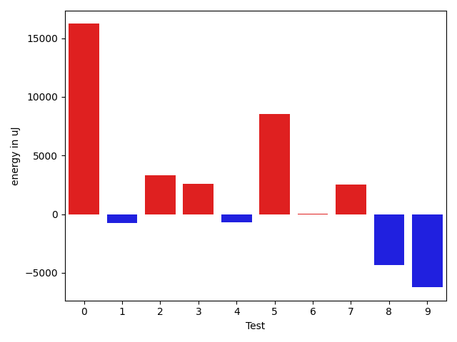
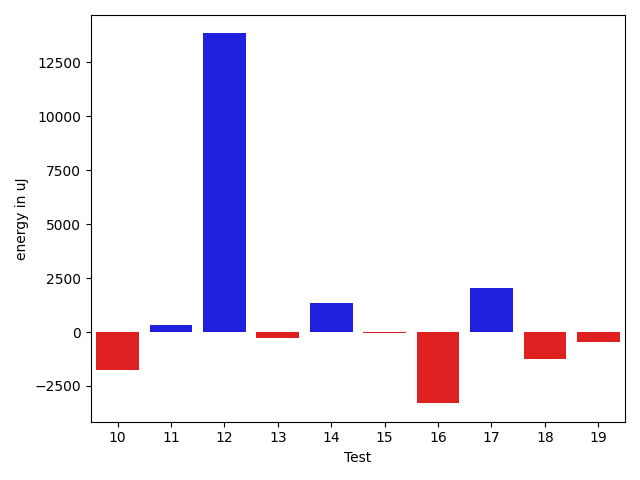
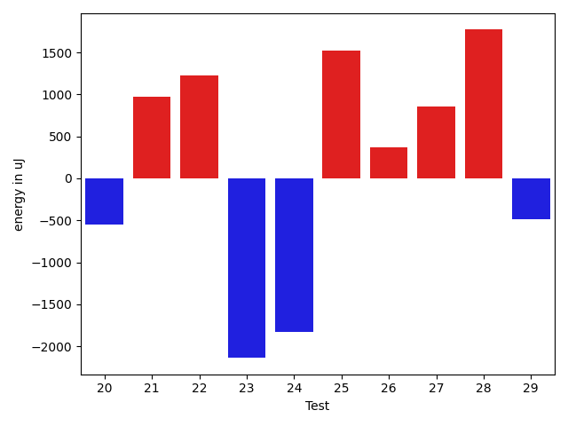
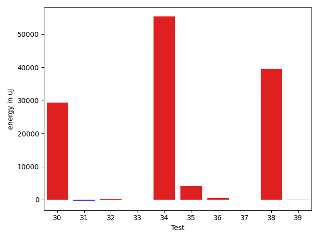
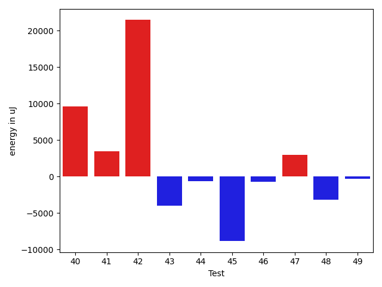
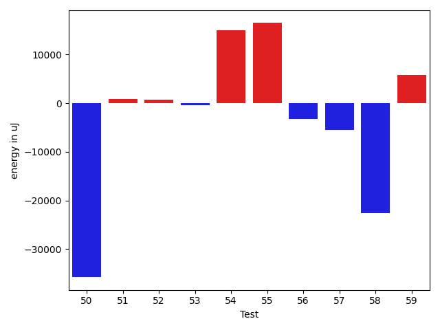
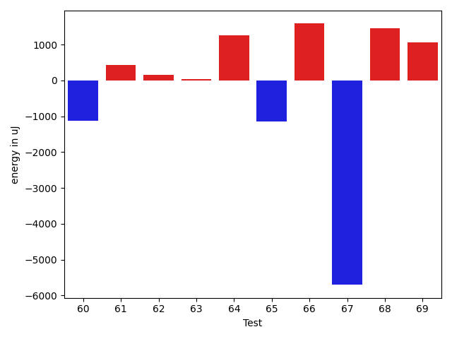
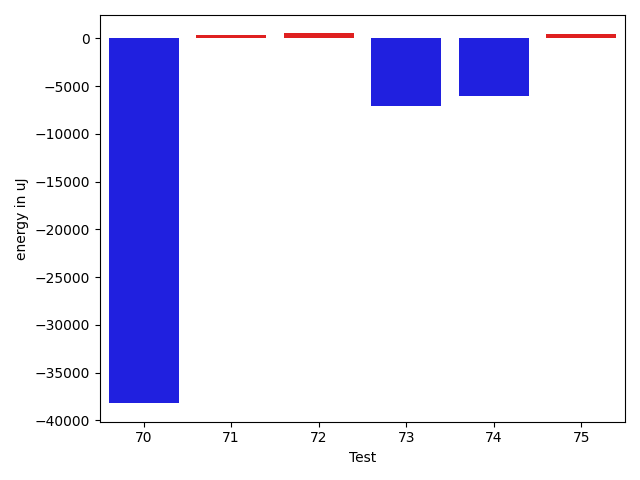

# gson 5e3f5a

https://github.com/google/gson/commit/5e3f5a

## Delta Energy per test method

| ID | EnergyV1 | EnergyV2 | DeltaEnergy | σV1 | σV2 |
| --- | --- | --- | --- | --- | --- |
| 0 | 41809 | 44311 | 2502 | 47442.79451847963 | 70000.96878296047 |
| 1 | 37292 | 35278 | -2014 | 4694.455961931259 | 4625.719123980419 |
| 2 | 38513 | 39489 | 976 | 15677.096825588878 | 17036.46138560499 |
| 3 | 38391 | 39001 | 610 | 14757.025827933217 | 18738.08380402236 |
| 4 | 36682 | 36682 | 0 | 4411.560700024425 | 4161.49160454291 |
| 5 | 42786 | 43457 | 671 | 32273.292057274957 | 43635.59070632965 |
| 6 | 36316 | 36743 | 427 | 4885.9427572986615 | 4425.277360979761 |
| 7 | 39306 | 39734 | 428 | 14868.598467688213 | 18051.238517338617 |
| 8 | 42786 | 39245 | -3541 | 24786.376229522146 | 22740.959928874698 |
| 9 | 41015 | 37597 | -3418 | 14900.646314385687 | 8883.450383638605 |
| 10 | 39734 | 39062 | -672 | 11436.635302263609 | 7587.042386084447 |
| 11 | 37720 | 38513 | 793 | 2888.491063206224 | 3550.5629051335864 |
| 12 | 39612 | 42846 | 3234 | 20118.534111647205 | 34687.67583332894 |
| 13 | 38818 | 38452 | -366 | 5284.218276965015 | 4055.391667445808 |
| 14 | 39062 | 37842 | -1220 | 4153.420374654334 | 5104.116492436996 |
| 15 | 39551 | 38880 | -671 | 3671.6611403303227 | 3916.940028082349 |
| 16 | 42603 | 38147 | -4456 | 4224.710460164368 | 4159.005732575245 |
| 17 | 34790 | 38086 | 3296 | 4785.2792552300525 | 3699.494923484676 |
| 18 | 38330 | 37659 | -671 | 3355.6486432841143 | 4292.350340722434 |
| 19 | 37598 | 36071 | -1527 | 5034.9010029369 | 3789.482131725477 |
| 20 | 40344 | 39795 | -549 | 44632.239834369204 | 40794.04336274599 |
| 21 | 37841 | 38818 | 977 | 6109.310283697154 | 5680.67262971124 |
| 22 | 36499 | 37720 | 1221 | 5115.703778012856 | 3660.3858970818305 |
| 23 | 39978 | 37841 | -2137 | 13493.348585426693 | 7294.21935410109 |
| 24 | 40467 | 38635 | -1832 | 18204.7808193693 | 12393.46513974733 |
| 25 | 36621 | 38147 | 1526 | 4713.247948743135 | 4238.550069576587 |
| 26 | 37841 | 38208 | 367 | 4762.531921410865 | 4349.586152089006 |
| 27 | 38391 | 39246 | 855 | 6115.716971991683 | 8144.649741180296 |
| 28 | 40283 | 42053 | 1770 | 17602.055887998566 | 17973.006782506276 |
| 29 | 38269 | 37781 | -488 | 5091.276374544954 | 7076.95601360979 |
| 30 | 81237 | 81725 | 488 | 150034.06028868209 | 271511.4426130039 |
| 31 | 36621 | 37841 | 1220 | 9545.237646260766 | 6331.47859909525 |
| 32 | 36499 | 36499 | 0 | 3693.053916724465 | 6648.362318313506 |
| 33 | 38452 | 38452 | 0 | 3836.9501351985277 | 4334.489178669154 |
| 34 | 40772 | 39672 | -1100 | 158723.48912030895 | 343765.2032149935 |
| 35 | 38208 | 38696 | 488 | 11068.790107938577 | 16572.655023669377 |
| 36 | 37353 | 37842 | 489 | 4397.547319432652 | 4322.245090878404 |
| 37 | 38696 | 38330 | -366 | 4085.8256619493386 | 5109.14516313911 |
| 38 | 40772 | 41687 | 915 | 83652.68740966808 | 136096.93333916963 |
| 39 | 38818 | 38269 | -549 | 3650.4125944028574 | 4165.442779458791 |
| 40 | 39062 | 39917 | 855 | 307583.21069251077 | 300491.3040204095 |
| 41 | 79224 | 80139 | 915 | 24374.688173470513 | 27705.252428795 |
| 42 | 39246 | 39367 | 121 | 23339.60054354449 | 143634.9358831554 |
| 43 | 39795 | 39428 | -367 | 18397.58928100092 | 11160.604928490477 |
| 44 | 37720 | 36987 | -733 | 3773.872975204522 | 4521.039675946153 |
| 45 | 76538 | 72387 | -4151 | 35004.47653201341 | 28989.388494667597 |
| 46 | 38819 | 38513 | -306 | 5951.168530725199 | 4710.323393945081 |
| 47 | 38818 | 40527 | 1709 | 18597.692323257004 | 19534.806448312844 |
| 48 | 39307 | 41016 | 1709 | 31822.811920819397 | 18417.534742902655 |
| 49 | 38941 | 37964 | -977 | 4326.110911347969 | 3615.9094101238516 |
| 50 | 116943 | 114074 | -2869 | 408318.59084733715 | 311657.38906072534 |
| 51 | 36926 | 38086 | 1160 | 3926.2043269125293 | 4165.808106744984 |
| 52 | 38208 | 38513 | 305 | 3349.7482277313306 | 4097.551117432312 |
| 53 | 37231 | 37292 | 61 | 4511.175255421137 | 4265.315663950089 |
| 54 | 41565 | 42663 | 1098 | 425221.53355660004 | 405271.2002538818 |
| 55 | 250488 | 247985 | -2503 | 82462.13550929287 | 92911.49252186484 |
| 56 | 39551 | 39002 | -549 | 45095.433974005355 | 45234.554707626085 |
| 57 | 39856 | 40100 | 244 | 61085.160734202596 | 33662.28393310956 |
| 58 | 41442 | 40955 | -487 | 98734.02906359303 | 63946.41194102673 |
| 59 | 39734 | 41199 | 1465 | 43162.92071657698 | 47473.108356850425 |
| 60 | 38513 | 37293 | -1220 | 6917.628248751805 | 4507.477481496012 |
| 61 | 38513 | 37720 | -793 | 4996.602895625251 | 4411.405186446635 |
| 62 | 41382 | 41748 | 366 | 6924.069766712169 | 10441.66072675081 |
| 63 | 38940 | 38513 | -427 | 4063.2187398046885 | 3710.9736160466136 |
| 64 | 38269 | 41382 | 3113 | 4002.128282975001 | 4145.61875821557 |
| 65 | 38879 | 38330 | -549 | 4441.707987175796 | 4755.709744371192 |
| 66 | 38391 | 38452 | 61 | 6463.386825509737 | 9850.423376952658 |
| 67 | 40161 | 37658 | -2503 | 17756.228554656478 | 12921.715506760354 |
| 68 | 42480 | 40039 | -2441 | 4649.555439737232 | 12855.998354997706 |
| 69 | 39063 | 38147 | -916 | 4605.042597794292 | 4691.0361467566545 |
| 70 | 41381 | 39795 | -1586 | 240842.2443426088 | 160835.52569767128 |
| 71 | 39306 | 37475 | -1831 | 20134.561192380683 | 24078.161417944088 |
| 72 | 40405 | 38696 | -1709 | 4459.056747825981 | 4616.27025073032 |
| 73 | 38208 | 40222 | 2014 | 22478.578952807493 | 13330.504130758345 |
| 74 | 40955 | 37414 | -3541 | 20855.94796550688 | 18392.64156512206 |
| 75 | 35279 | 35950 | 671 | 4137.018929736725 | 3543.1175599880603 |

## Delta Duration per test method

| ID | DurationV1 | DurationsV2 | DeltaDuration |
| --- | --- | --- | --- |
| 0 | 1981057.5858585858 | 2468311.6868686867 | 487254.1010101009 |
| 1 | 938921.8644067796 | 910722.4761904762 | -28199.38821630343 |
| 2 | 1070053.8166666667 | 1347555.0185185184 | 277501.2018518518 |
| 3 | 1303914.524390244 | 1428840.3636363635 | 124925.8392461196 |
| 4 | 846194.98 | 839664.1785714285 | -6530.80142857146 |
| 5 | 1557852.75 | 1866002.564516129 | 308149.814516129 |
| 6 | 735963.6521739131 | 835898.6 | 99934.9478260869 |
| 7 | 1202054.7741935484 | 1278053.50877193 | 75998.73457838153 |
| 8 | 1816831.4897959183 | 1702465.7676767677 | -114365.72211915068 |
| 9 | 1223918.9642857143 | 1001670.4444444445 | -222248.51984126982 |
| 10 | 1087877.4807692308 | 938112.4782608695 | -149765.00250836124 |
| 11 | 460911.6666666667 | 512196.28571428574 | 51284.61904761905 |
| 12 | 1225891.043478261 | 1484033.75 | 258142.70652173902 |
| 13 | 625818.4166666666 | 701565.7916666666 | 75747.375 |
| 14 | 437799.0625 | 474691.28571428574 | 36892.22321428574 |
| 15 | 465464.29411764705 | 491791.125 | 26326.83088235295 |
| 16 | 597495.8333333334 | 506501.8125 | -90994.02083333337 |
| 17 | 587453.6551724138 | 720126.4666666667 | 132672.81149425288 |
| 18 | 450738.7894736842 | 475062.15 | 24323.36052631581 |
| 19 | 490646.3125 | 490316.86666666664 | -329.4458333333605 |
| 20 | 1191520.5 | 1323648.96 | 132128.45999999996 |
| 21 | 1043928.033898305 | 930753.5818181818 | -113174.45208012324 |
| 22 | 599398.0 | 566881.3333333334 | -32516.666666666628 |
| 23 | 1204132.3934426229 | 978615.895522388 | -225516.4979202348 |
| 24 | 1308344.568627451 | 1013795.8913043478 | -294548.6773231033 |
| 25 | 570725.8076923077 | 546758.7307692308 | -23967.076923076995 |
| 26 | 559735.6521739131 | 546964.3333333334 | -12771.318840579712 |
| 27 | 870346.8431372549 | 960510.1136363636 | 90163.27049910871 |
| 28 | 1223113.2592592593 | 1224806.8684210526 | 1693.6091617932543 |
| 29 | 1083063.1690140846 | 1053587.4507042253 | -29475.71830985928 |
| 30 | 3093558.202020202 | 3902951.6464646463 | 809393.4444444445 |
| 31 | 1184027.7125 | 1139800.4675324676 | -44227.244967532344 |
| 32 | 465859.5882352941 | 474979.5882352941 | 9120.0 |
| 33 | 513818.75 | 502536.76666666666 | -11281.983333333337 |
| 34 | 2027541.0298507463 | 3486179.0149253733 | 1458637.985074627 |
| 35 | 1054557.085106383 | 1118472.2 | 63915.114893616876 |
| 36 | 848924.1458333334 | 854242.9361702128 | 5318.790336879436 |
| 37 | 806187.375 | 805556.0540540541 | -631.3209459459176 |
| 38 | 1779294.918367347 | 3178773.1875 | 1399478.269132653 |
| 39 | 695645.05 | 688108.976744186 | -7536.07325581403 |
| 40 | 3426551.724137931 | 3872288.9655172415 | 445737.2413793104 |
| 41 | 2772259.0303030303 | 2804135.585858586 | 31876.555555555504 |
| 42 | 1190586.2333333334 | 1865285.621212121 | 674699.3878787877 |
| 43 | 1114998.18 | 1069574.9795918367 | -45423.20040816325 |
| 44 | 851828.3898305085 | 863229.5769230769 | 11401.187092568376 |
| 45 | 2405621.757575758 | 2154291.595959596 | -251330.16161616193 |
| 46 | 950726.9655172414 | 909548.1935483871 | -41178.77196885424 |
| 47 | 1284200.8923076922 | 1217228.6417910447 | -66972.25051664747 |
| 48 | 1572411.0945945946 | 1447025.9054054054 | -125385.18918918911 |
| 49 | 512080.27777777775 | 525098.0666666667 | 13017.7888888889 |
| 50 | 6273539.282828283 | 5482573.090909091 | -790966.1919191917 |
| 51 | 727941.8541666666 | 757274.4444444445 | 29332.59027777787 |
| 52 | 682263.5405405406 | 706695.7027027027 | 24432.16216216213 |
| 53 | 858041.8545454545 | 944794.695652174 | 86752.84110671945 |
| 54 | 4476822.173913044 | 5481724.888888889 | 1004902.7149758451 |
| 55 | 6775263.202020202 | 7272546.333333333 | 497283.1313131312 |
| 56 | 1757004.393258427 | 1730389.4787234042 | -26614.914535022806 |
| 57 | 1977433.0114942528 | 1780192.2197802197 | -197240.7917140331 |
| 58 | 2457312.565217391 | 1516065.6470588236 | -941246.9181585675 |
| 59 | 1742082.1142857142 | 1757263.5671641792 | 15181.452878464945 |
| 60 | 938316.9076923077 | 894317.1525423729 | -43999.75514993479 |
| 61 | 685516.925925926 | 613018.9696969697 | -72497.95622895623 |
| 62 | 890561.4090909091 | 836467.1290322581 | -54094.280058651 |
| 63 | 591294.3 | 508511.6923076923 | -82782.60769230773 |
| 64 | 537319.5909090909 | 610761.1304347826 | 73441.53952569165 |
| 65 | 891166.948275862 | 942162.8846153846 | 50995.936339522596 |
| 66 | 840651.0555555555 | 897269.9285714285 | 56618.87301587302 |
| 67 | 1121169.4117647058 | 973584.8979591837 | -147584.51380552212 |
| 68 | 476295.6818181818 | 628344.3703703703 | 152048.6885521885 |
| 69 | 533900.85 | 416846.46153846156 | -117054.38846153842 |
| 70 | 2624698.304347826 | 1902434.4090909092 | -722263.895256917 |
| 71 | 1253075.3333333333 | 1327345.8285714285 | 74270.49523809529 |
| 72 | 460548.4736842105 | 555790.4444444445 | 95241.97076023399 |
| 73 | 1291708.0 | 759528.8636363636 | -532179.1363636364 |
| 74 | 1311081.6666666667 | 1136758.875 | -174322.79166666674 |
| 75 | 498012.5 | 533185.4814814815 | 35172.98148148146 |

## Misc.

| ID | Test Class | Test Method |
| --- | --- | --- |
| 0 | com.google.gson.functional.CustomDeserializerTest | testDefaultConstructorNotCalledOnObject |
| 1 | com.google.gson.functional.CustomDeserializerTest | testCustomDeserializerReturnsNullForArrayElementsForArrayField |
| 2 | com.google.gson.functional.CustomDeserializerTest | testCustomDeserializerReturnsNull |
| 3 | com.google.gson.functional.CustomDeserializerTest | testJsonTypeFieldBasedDeserialization |
| 4 | com.google.gson.functional.CustomDeserializerTest | testCustomDeserializerReturnsNullForArrayElements |
| 5 | com.google.gson.functional.CustomDeserializerTest | testCustomDeserializerReturnsNullForTopLevelObject |
| 6 | com.google.gson.functional.CustomDeserializerTest | testDefaultConstructorNotCalledOnField |
| 7 | com.google.gson.functional.ReadersWritersTest | testReadWriteTwoObjects |
| 8 | com.google.gson.functional.MapTest | testInterfaceTypeMapWithSerializer |
| 9 | com.google.gson.functional.MapTest | testMapNamePromotionWithJsonElementReader |
| 10 | com.google.gson.functional.CollectionTest | testRawCollectionOfBagOfPrimitivesNotAllowed |
| 11 | com.google.gson.JsonObjectTest | testAddingBooleanProperties |
| 12 | com.google.gson.JsonObjectTest | testReadPropertyWithEmptyStringName |
| 13 | com.google.gson.JsonObjectTest | testAddingCharacterProperties |
| 14 | com.google.gson.JsonObjectTest | testAddingStringProperties |
| 15 | com.google.gson.JsonObjectTest | testEqualsNonEmptyObject |
| 16 | com.google.gson.JsonObjectTest | testAddingNullPropertyValue |
| 17 | com.google.gson.JsonObjectTest | testPropertyWithQuotes |
| 18 | com.google.gson.JsonObjectTest | testWritePropertyWithEmptyStringName |
| 19 | com.google.gson.JsonObjectTest | testAddingNullOrEmptyPropertyName |
| 20 | com.google.gson.JsonObjectTest | testAddingAndRemovingObjectProperties |
| 21 | com.google.gson.functional.InheritanceTest | testClassWithBaseArrayFieldSerialization |
| 22 | com.google.gson.functional.InheritanceTest | testBaseSerializedAsSub |
| 23 | com.google.gson.functional.InheritanceTest | testClassWithBaseCollectionFieldSerialization |
| 24 | com.google.gson.functional.InheritanceTest | testClassWithBaseFieldSerialization |
| 25 | com.google.gson.functional.InheritanceTest | testBaseSerializedAsBaseWhenSpecifiedWithExplicitType |
| 26 | com.google.gson.functional.InheritanceTest | testBaseSerializedAsSubWhenSpecifiedWithExplicitType |
| 27 | com.google.gson.functional.NullObjectAndFieldTest | testCustomTypeAdapterPassesNullDesrialization |
| 28 | com.google.gson.functional.NullObjectAndFieldTest | testCustomSerializationOfNulls |
| 29 | com.google.gson.functional.MapAsArrayTypeAdapterTest | testMultipleEnableComplexKeyRegistrationHasNoEffect |
| 30 | com.google.gson.functional.MapAsArrayTypeAdapterTest | testSerializeComplexMapWithTypeAdapter |
| 31 | com.google.gson.functional.MapAsArrayTypeAdapterTest | testMapWithTypeVariableSerialization |
| 32 | com.google.gson.JsonParserTest | testParseString |
| 33 | com.google.gson.JsonParserTest | testParseReader |
| 34 | com.google.gson.JsonParserTest | testReadWriteTwoObjects |
| 35 | com.google.gson.functional.JsonParserTest | testChangingCustomTreeAndDeserializing |
| 36 | com.google.gson.functional.JsonParserTest | testBadFieldTypeForDeserializingCustomTree |
| 37 | com.google.gson.functional.JsonParserTest | testBadTypeForDeserializingCustomTree |
| 38 | com.google.gson.functional.JsonParserTest | testDeserializingCustomTree |
| 39 | com.google.gson.functional.JsonParserTest | testBadFieldTypeForCustomDeserializerCustomTree |
| 40 | com.google.gson.functional.CustomTypeAdaptersTest | testCustomSerializers |
| 41 | com.google.gson.functional.CustomTypeAdaptersTest | testCustomTypeAdapterDoesNotAppliesToSubClasses |
| 42 | com.google.gson.functional.CustomTypeAdaptersTest | testCustomDeserializers |
| 43 | com.google.gson.functional.CustomTypeAdaptersTest | testEnsureCustomSerializerNotInvokedForNullValues |
| 44 | com.google.gson.functional.CustomTypeAdaptersTest | testCustomTypeAdapterAppliesToSubClassesSerializedAsBaseClass |
| 45 | com.google.gson.functional.UncategorizedTest | testReturningDerivedClassesDuringDeserialization |
| 46 | com.google.gson.functional.MoreSpecificTypeSerializationTest | testMapOfParameterizedSubclassFields |
| 47 | com.google.gson.functional.MoreSpecificTypeSerializationTest | testMapOfSubclassFields |
| 48 | com.google.gson.ObjectTypeAdapterTest | testDeserialize |
| 49 | com.google.gson.ObjectTypeAdapterTest | testDeserializeNullValue |
| 50 | com.google.gson.functional.TypeHierarchyAdapterTest | testTypeHierarchy |
| 51 | com.google.gson.functional.CustomSerializerTest | testBaseClassSerializerInvokedForBaseClassFieldsHoldingSubClassInstances |
| 52 | com.google.gson.functional.CustomSerializerTest | testBaseClassSerializerInvokedForBaseClassFields |
| 53 | com.google.gson.functional.CustomSerializerTest | testSubClassSerializerInvokedForBaseClassFieldsHoldingArrayOfSubClassInstances |
| 54 | com.google.gson.functional.CustomSerializerTest | testSubClassSerializerInvokedForBaseClassFieldsHoldingSubClassInstances |
| 55 | com.google.gson.functional.CircularReferenceTest | testSelfReferenceCustomHandlerSerialization |
| 56 | com.google.gson.functional.ParameterizedTypesTest | testParameterizedTypesWithCustomDeserializer |
| 57 | com.google.gson.functional.ParameterizedTypesTest | testParameterizedTypeWithCustomSerializer |
| 58 | com.google.gson.functional.JsonTreeTest | testToJsonTree |
| 59 | com.google.gson.functional.JsonTreeTest | testJsonTreeToString |
| 60 | com.google.gson.functional.JsonTreeTest | testToJsonTreeObjectType |
| 61 | com.google.gson.functional.JsonTreeTest | testJsonTreeNull |
| 62 | com.google.gson.internal.bind.JsonElementReaderTest | testNestedObjects |
| 63 | com.google.gson.internal.bind.JsonElementReaderTest | testSkipValue |
| 64 | com.google.gson.internal.bind.JsonElementReaderTest | testObject |
| 65 | com.google.gson.DefaultMapJsonSerializerTest | testNonEmptyMapSerialization |
| 66 | com.google.gson.functional.ExclusionStrategyFunctionalTest | testExclusionStrategyWithMode |
| 67 | com.google.gson.functional.ExclusionStrategyFunctionalTest | testExclusionStrategyDeserialization |
| 68 | com.google.gson.internal.bind.JsonTreeWriterTest | testNestedObject |
| 69 | com.google.gson.internal.bind.JsonTreeWriterTest | testObject |
| 70 | com.google.gson.internal.bind.JsonTreeWriterTest | testSerializeNullsTrue |
| 71 | com.google.gson.functional.StreamingTypeAdaptersTest | testFromJsonTree |
| 72 | com.google.gson.functional.PrintFormattingTest | testJsonObjectWithNullValuesSerialized |
| 73 | com.google.gson.functional.PrintFormattingTest | testJsonObjectWithNullValues |
| 74 | com.google.gson.functional.DefaultTypeAdaptersTest | testJsonObjectSerialization |
| 75 | com.google.gson.functional.DefaultTypeAdaptersTest | testJsonObjectDeerialization |

| Test | IterationV1 | IterationV2 | DeltaIteration |
| --- | --- | --- | --- |
| 0 | 99 | 99 | 0 |
| 1 | 59 | 63 | 4 |
| 2 | 60 | 54 | -6 |
| 3 | 82 | 88 | 6 |
| 4 | 50 | 56 | 6 |
| 5 | 60 | 62 | 2 |
| 6 | 46 | 50 | 4 |
| 7 | 62 | 57 | -5 |
| 8 | 98 | 99 | 1 |
| 9 | 56 | 63 | 7 |
| 10 | 52 | 46 | -6 |
| 11 | 15 | 21 | 6 |
| 12 | 23 | 28 | 5 |
| 13 | 36 | 24 | -12 |
| 14 | 16 | 14 | -2 |
| 15 | 17 | 16 | -1 |
| 16 | 6 | 16 | 10 |
| 17 | 29 | 30 | 1 |
| 18 | 19 | 20 | 1 |
| 19 | 16 | 15 | -1 |
| 20 | 14 | 25 | 11 |
| 21 | 59 | 55 | -4 |
| 22 | 40 | 30 | -10 |
| 23 | 61 | 67 | 6 |
| 24 | 51 | 46 | -5 |
| 25 | 26 | 26 | 0 |
| 26 | 23 | 18 | -5 |
| 27 | 51 | 44 | -7 |
| 28 | 27 | 38 | 11 |
| 29 | 71 | 71 | 0 |
| 30 | 99 | 99 | 0 |
| 31 | 80 | 77 | -3 |
| 32 | 17 | 17 | 0 |
| 33 | 20 | 30 | 10 |
| 34 | 67 | 67 | 0 |
| 35 | 47 | 55 | 8 |
| 36 | 48 | 47 | -1 |
| 37 | 32 | 37 | 5 |
| 38 | 49 | 48 | -1 |
| 39 | 40 | 43 | 3 |
| 40 | 58 | 58 | 0 |
| 41 | 99 | 99 | 0 |
| 42 | 60 | 66 | 6 |
| 43 | 50 | 49 | -1 |
| 44 | 59 | 52 | -7 |
| 45 | 99 | 99 | 0 |
| 46 | 58 | 62 | 4 |
| 47 | 65 | 67 | 2 |
| 48 | 74 | 74 | 0 |
| 49 | 18 | 15 | -3 |
| 50 | 99 | 99 | 0 |
| 51 | 48 | 45 | -3 |
| 52 | 37 | 37 | 0 |
| 53 | 55 | 46 | -9 |
| 54 | 69 | 63 | -6 |
| 55 | 99 | 99 | 0 |
| 56 | 89 | 94 | 5 |
| 57 | 87 | 91 | 4 |
| 58 | 46 | 51 | 5 |
| 59 | 70 | 67 | -3 |
| 60 | 65 | 59 | -6 |
| 61 | 27 | 33 | 6 |
| 62 | 22 | 31 | 9 |
| 63 | 20 | 26 | 6 |
| 64 | 22 | 23 | 1 |
| 65 | 58 | 52 | -6 |
| 66 | 36 | 42 | 6 |
| 67 | 51 | 49 | -2 |
| 68 | 22 | 27 | 5 |
| 69 | 20 | 13 | -7 |
| 70 | 23 | 22 | -1 |
| 71 | 36 | 35 | -1 |
| 72 | 19 | 18 | -1 |
| 73 | 25 | 22 | -3 |
| 74 | 24 | 24 | 0 |
| 75 | 16 | 27 | 11 |

| Time Label | Time (s) |
| --- | --- |
| Selection | 27.597105264663696 |
| Injection | 14.600775241851807 |
| Total | 1176.6188054084778 |

