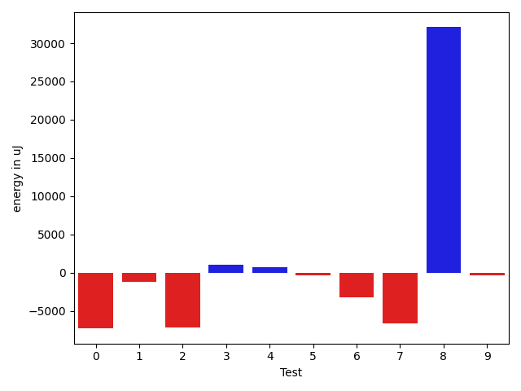
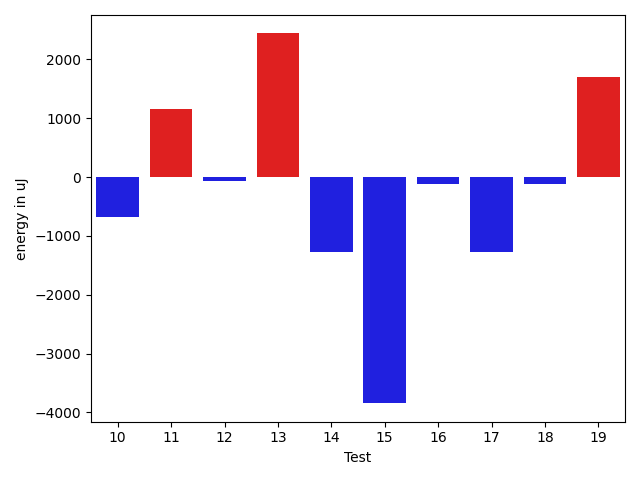
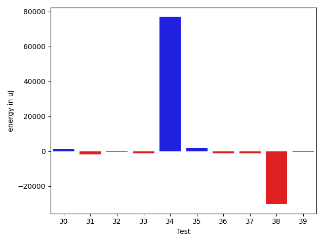
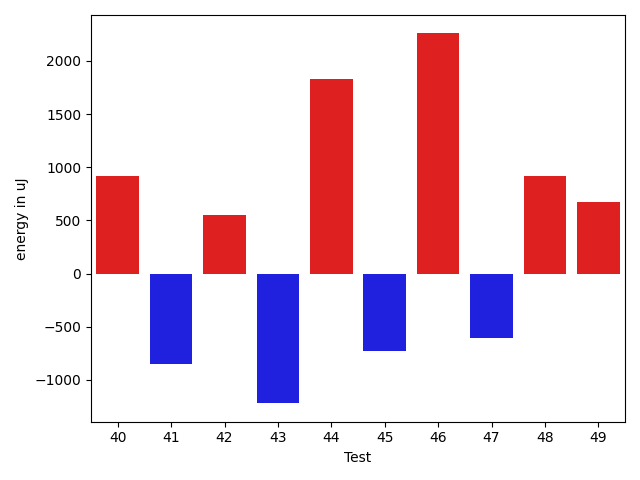
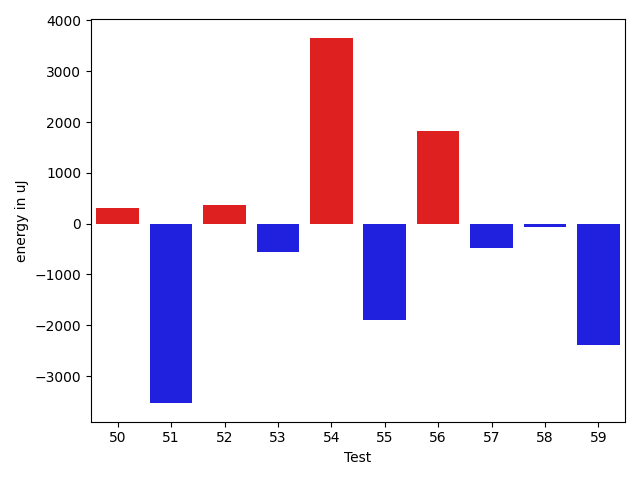
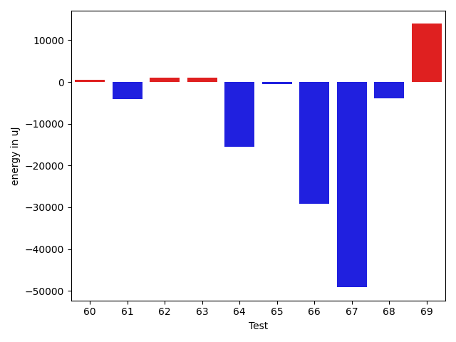

# gson 4c6293

https://github.com/google/gson/commit/4c6293

## Delta Energy per test method

| ID | EnergyV1 | EnergyV2 | DeltaEnergy | σV1 | σV2 |
| --- | --- | --- | --- | --- | --- |
| 0 | 43579 | 42908 | -671 | 56779.68130774145 | 55543.801068828136 |
| 1 | 39795 | 39063 | -732 | 18334.165106532128 | 15242.69269830054 |
| 2 | 46570 | 41870 | -4700 | 39472.04191531469 | 37928.57851212746 |
| 3 | 36988 | 37781 | 793 | 4570.015678264876 | 4349.620352065291 |
| 4 | 37659 | 37414 | -245 | 4994.227827739931 | 7493.387900019942 |
| 5 | 37719 | 36011 | -1708 | 4661.814739441609 | 7060.065706050231 |
| 6 | 38330 | 36560 | -1770 | 13706.058324484344 | 10008.138752432136 |
| 7 | 38757 | 37293 | -1464 | 29947.35781299491 | 5609.09800739809 |
| 8 | 39550 | 41443 | 1893 | 71378.95806170648 | 117123.518683755 |
| 9 | 36805 | 36743 | -62 | 3547.7958593422586 | 3799.9525589143873 |
| 10 | 38757 | 38086 | -671 | 15860.394055266732 | 10905.227836901882 |
| 11 | 36560 | 37720 | 1160 | 4748.097108345301 | 4438.103292706772 |
| 12 | 36011 | 35950 | -61 | 5673.275466836236 | 3961.111459690796 |
| 13 | 79590 | 82031 | 2441 | 22657.307396532666 | 27304.315718856837 |
| 14 | 39978 | 38696 | -1282 | 29917.140262435212 | 16770.696339095783 |
| 15 | 42236 | 38391 | -3845 | 405141.3287595329 | 236734.639802595 |
| 16 | 39429 | 39307 | -122 | 14478.616749134428 | 14120.265941192467 |
| 17 | 40100 | 38818 | -1282 | 19871.129920986747 | 13885.518146865898 |
| 18 | 41442 | 41321 | -121 | 28191.780573697688 | 24767.013050279416 |
| 19 | 37780 | 39489 | 1709 | 9654.21887328294 | 13109.925419302777 |
| 20 | 37353 | 38696 | 1343 | 16258.929064720014 | 8174.709117715613 |
| 21 | 36743 | 37536 | 793 | 4788.064247667937 | 4726.845089394717 |
| 22 | 39734 | 36011 | -3723 | 4370.793224315494 | 3953.5201137720296 |
| 23 | 36865 | 38818 | 1953 | 5244.816677291501 | 3937.6531248305623 |
| 24 | 39246 | 39734 | 488 | 5362.454620787014 | 4136.177475295621 |
| 25 | 34973 | 35828 | 855 | 4825.943226736268 | 3246.769438245341 |
| 26 | 38758 | 40405 | 1647 | 26340.768528656718 | 25638.55116767716 |
| 27 | 38941 | 37781 | -1160 | 28323.860099593738 | 37138.33563874836 |
| 28 | 37598 | 36865 | -733 | 11409.639790133147 | 7026.359767350864 |
| 29 | 36194 | 37842 | 1648 | 5789.642295489612 | 4710.452214202341 |
| 30 | 37658 | 37903 | 245 | 3705.9506533274234 | 3138.451507335128 |
| 31 | 37903 | 39733 | 1830 | 17603.9572798391 | 4393.175485404101 |
| 32 | 39002 | 37903 | -1099 | 3726.8797792374367 | 3667.890769769724 |
| 33 | 39917 | 39490 | -427 | 5738.470715341018 | 4587.716933815767 |
| 34 | 40405 | 43030 | 2625 | 383314.3861805173 | 457823.4131227043 |
| 35 | 38025 | 38818 | 793 | 3940.5222369630146 | 3391.168788318425 |
| 36 | 41382 | 39185 | -2197 | 4706.552409496077 | 5155.750543055998 |
| 37 | 37049 | 38452 | 1403 | 11357.26770847441 | 4519.368045760215 |
| 38 | 82031 | 80810 | -1221 | 341056.0153384245 | 273251.1690553034 |
| 39 | 37170 | 37719 | 549 | 9508.079778116065 | 7465.575767563307 |
| 40 | 41748 | 42663 | 915 | 420385.0032682012 | 302863.46440822165 |
| 41 | 37353 | 36499 | -854 | 4956.516054649677 | 3761.368564461295 |
| 42 | 37963 | 38513 | 550 | 4532.801803633202 | 4834.902750390418 |
| 43 | 38208 | 36988 | -1220 | 7208.788605926141 | 5090.980437392951 |
| 44 | 38757 | 40589 | 1832 | 50483.30313795484 | 46313.27526403082 |
| 45 | 37475 | 36744 | -731 | 3870.28051485145 | 4287.401559602016 |
| 46 | 39978 | 42236 | 2258 | 99553.51451628108 | 110771.23827169622 |
| 47 | 37598 | 36987 | -611 | 3828.3588379735575 | 3117.0044317940938 |
| 48 | 72815 | 73730 | 915 | 27297.76278192174 | 31654.581529345476 |
| 49 | 38513 | 39185 | 672 | 17133.965971184294 | 32500.445904187858 |
| 50 | 38025 | 38330 | 305 | 5206.0280958853255 | 4326.746169201333 |
| 51 | 116699 | 113159 | -3540 | 378604.5281596258 | 291260.6172487212 |
| 52 | 39734 | 40100 | 366 | 14667.449913324284 | 18732.08357854698 |
| 53 | 38208 | 37659 | -549 | 5841.080699972373 | 4673.6711158677945 |
| 54 | 34790 | 38452 | 3662 | 5044.218400347075 | 3727.733168586143 |
| 55 | 41809 | 39917 | -1892 | 26609.665249252874 | 23620.01519239328 |
| 56 | 38330 | 40161 | 1831 | 18239.82866751328 | 25987.894597080525 |
| 57 | 37597 | 37109 | -488 | 6466.362468871052 | 6456.029467208995 |
| 58 | 38453 | 38391 | -62 | 15944.531679107 | 7120.281830131435 |
| 59 | 39124 | 36743 | -2381 | 4094.896115021312 | 3360.7270270582826 |
| 60 | 38818 | 38757 | -61 | 5889.717124666833 | 6436.420164014829 |
| 61 | 39123 | 40405 | 1282 | 22615.08280230973 | 8028.659754691144 |
| 62 | 36865 | 39245 | 2380 | 2763.79531400625 | 4163.932796447768 |
| 63 | 37171 | 38452 | 1281 | 4676.532400941124 | 5464.452680622774 |
| 64 | 254882 | 241515 | -13367 | 81027.71665384318 | 82113.25236491297 |
| 65 | 41321 | 40283 | -1038 | 2763.5025221627716 | 3702.8117177058903 |
| 66 | 41199 | 39062 | -2137 | 228730.9376164031 | 140147.13644842838 |
| 67 | 39368 | 41931 | 2563 | 202367.74764088792 | 10073.028308929743 |
| 68 | 41260 | 41382 | 122 | 65281.33716239745 | 59228.39768718135 |
| 69 | 41686 | 43274 | 1588 | 30797.90062307887 | 76187.96826829424 |
| 70 | 38269 | 38146 | -123 | 3929.66314202163 | 11051.265824854509 |
| 71 | 35950 | 38086 | 2136 | 4329.653919394527 | 3892.2605842391 |
| 72 | 38574 | 39367 | 793 | 4158.541665543967 | 4240.982334129677 |
| 73 | 38269 | 37170 | -1099 | 13406.308513603266 | 19866.215960750644 |
| 74 | 39856 | 38391 | -1465 | 4101.244113808119 | 5211.061864916079 |
| 75 | 41382 | 40466 | -916 | 20074.967266058826 | 20625.74458752944 |

## Delta Duration per test method

| ID | DurationV1 | DurationsV2 | DeltaDuration |
| --- | --- | --- | --- |
| 0 | 2260845.6530612246 | 2060078.3434343433 | -200767.30962688127 |
| 1 | 1368092.911111111 | 1378787.3170731708 | 10694.40596205974 |
| 2 | 1986456.1590909092 | 1677774.7037037036 | -308681.4553872056 |
| 3 | 795712.3409090909 | 802379.2115384615 | 6666.870629370562 |
| 4 | 832302.490909091 | 896608.4727272728 | 64305.98181818181 |
| 5 | 918844.9508196721 | 917575.9682539683 | -1268.9825657038018 |
| 6 | 1200618.4833333334 | 1042888.2181818181 | -157730.26515151525 |
| 7 | 851526.0 | 758842.2083333334 | -92683.79166666663 |
| 8 | 1505586.673076923 | 2748843.9743589745 | 1243257.3012820515 |
| 9 | 665588.9487179487 | 727503.2 | 61914.251282051206 |
| 10 | 1145751.268292683 | 975180.1702127659 | -170571.09807991702 |
| 11 | 851301.2894736842 | 860366.2857142857 | 9064.996240601526 |
| 12 | 859609.7735849057 | 817258.390625 | -42351.38295990566 |
| 13 | 2780084.757575758 | 2692784.797979798 | -87299.95959595963 |
| 14 | 1259674.8666666667 | 1031302.6349206349 | -228372.2317460318 |
| 15 | 4886942.895833333 | 2378712.2 | -2508230.695833333 |
| 16 | 1054244.0625 | 995151.425925926 | -59092.636574074044 |
| 17 | 1306362.0892857143 | 1226303.4 | -80058.68928571441 |
| 18 | 1773634.4141414142 | 1767005.5353535353 | -6628.878787878901 |
| 19 | 1163837.6964285714 | 1220289.107142857 | 56451.41071428568 |
| 20 | 1054061.2916666667 | 981552.9347826086 | -72508.3568840581 |
| 21 | 662800.0357142857 | 651855.5294117647 | -10944.506302520982 |
| 22 | 494987.25 | 467087.8 | -27899.45000000001 |
| 23 | 503104.1111111111 | 558336.8235294118 | 55232.71241830068 |
| 24 | 502512.0 | 479647.0714285714 | -22864.92857142858 |
| 25 | 486125.82352941175 | 547467.3636363636 | 61341.5401069519 |
| 26 | 983819.3333333334 | 958889.44 | -24929.893333333428 |
| 27 | 1207058.2222222222 | 1310335.2 | 103276.9777777777 |
| 28 | 792700.5714285715 | 641456.925925926 | -151243.64550264552 |
| 29 | 430484.9166666667 | 428587.9411764706 | -1896.9754901960841 |
| 30 | 445853.4285714286 | 464627.47826086957 | 18774.049689440988 |
| 31 | 630083.76 | 585434.8 | -44648.95999999996 |
| 32 | 540019.0 | 573771.5294117647 | 33752.5294117647 |
| 33 | 688622.3636363636 | 592095.1578947369 | -96527.20574162679 |
| 34 | 3672518.4691358022 | 6181684.043478261 | 2509165.5743424585 |
| 35 | 530351.9375 | 442737.4117647059 | -87614.5257352941 |
| 36 | 556143.2083333334 | 553765.0 | -2378.208333333372 |
| 37 | 1152168.8666666667 | 1019923.8548387097 | -132245.011827957 |
| 38 | 4944821.202020202 | 4140109.474747475 | -804711.7272727271 |
| 39 | 1189121.0227272727 | 1105722.2222222222 | -83398.80050505046 |
| 40 | 5492241.333333333 | 3801583.884057971 | -1690657.4492753618 |
| 41 | 792835.65 | 766313.6734693878 | -26521.976530612214 |
| 42 | 660607.1714285715 | 664738.0930232558 | 4130.9215946843615 |
| 43 | 897113.9583333334 | 915782.0196078431 | 18668.06127450976 |
| 44 | 1605103.1617647058 | 1923432.865671642 | 318329.7039069361 |
| 45 | 889576.6393442623 | 950397.3469387755 | 60820.707594513195 |
| 46 | 1827562.5 | 2465745.3035714286 | 638182.8035714286 |
| 47 | 583214.8095238095 | 697518.7586206896 | 114303.94909688015 |
| 48 | 2086905.616161616 | 2134766.4444444445 | 47860.82828282844 |
| 49 | 1382261.1014492754 | 1655911.6543209876 | 273650.55287171225 |
| 50 | 442896.5238095238 | 443996.5238095238 | 1100.0 |
| 51 | 5820000.303030303 | 4728170.333333333 | -1091829.9696969697 |
| 52 | 939189.8888888889 | 1126392.0612244897 | 187202.17233560083 |
| 53 | 728081.282051282 | 839113.4186046511 | 111032.13655336911 |
| 54 | 592451.76 | 518480.1052631579 | -73971.65473684209 |
| 55 | 1618340.6785714286 | 1139178.9333333333 | -479161.7452380953 |
| 56 | 1331548.2096774194 | 1432321.375 | 100773.16532258061 |
| 57 | 970131.2258064516 | 968624.593220339 | -1506.6325861125952 |
| 58 | 1047767.9705882353 | 963979.2786885246 | -83788.69189971068 |
| 59 | 545592.3913043478 | 511712.0 | -33880.39130434778 |
| 60 | 940087.15625 | 916345.9230769231 | -23741.23317307688 |
| 61 | 1153198.4807692308 | 889867.0208333334 | -263331.4599358974 |
| 62 | 521515.0 | 535920.2083333334 | 14405.208333333372 |
| 63 | 540183.2380952381 | 569775.7777777778 | 29592.539682539646 |
| 64 | 7332419.464646464 | 6798409.737373738 | -534009.7272727266 |
| 65 | 504416.3 | 545787.0952380953 | 41370.79523809528 |
| 66 | 2153923.7647058824 | 1594731.16 | -559192.6047058825 |
| 67 | 2088573.625 | 871694.3125 | -1216879.3125 |
| 68 | 2242637.4 | 2083643.1590909092 | -158994.24090909073 |
| 69 | 1756445.3820224719 | 2279791.1063829786 | 523345.72436050675 |
| 70 | 587853.1923076923 | 630523.9583333334 | 42670.76602564112 |
| 71 | 512187.77777777775 | 499745.46153846156 | -12442.316239316191 |
| 72 | 908021.8936170213 | 930108.08 | 22086.18638297869 |
| 73 | 921453.9736842106 | 1044288.2857142857 | 122834.31203007512 |
| 74 | 884444.8627450981 | 854444.2916666666 | -30000.571078431443 |
| 75 | 1218153.4333333333 | 1128221.8 | -89931.6333333333 |

## Misc.

| ID | Test Class | Test Method |
| --- | --- | --- |
| 0 | com.google.gson.functional.CustomDeserializerTest | testDefaultConstructorNotCalledOnObject |
| 1 | com.google.gson.functional.CustomDeserializerTest | testJsonTypeFieldBasedDeserialization |
| 2 | com.google.gson.functional.CustomDeserializerTest | testCustomDeserializerReturnsNullForTopLevelObject |
| 3 | com.google.gson.functional.CustomDeserializerTest | testDefaultConstructorNotCalledOnField |
| 4 | com.google.gson.functional.CustomDeserializerTest | testCustomDeserializerReturnsNullForArrayElements |
| 5 | com.google.gson.functional.CustomDeserializerTest | testCustomDeserializerReturnsNullForArrayElementsForArrayField |
| 6 | com.google.gson.functional.CustomDeserializerTest | testCustomDeserializerReturnsNull |
| 7 | com.google.gson.functional.JsonParserTest | testBadTypeForDeserializingCustomTree |
| 8 | com.google.gson.functional.JsonParserTest | testDeserializingCustomTree |
| 9 | com.google.gson.functional.JsonParserTest | testBadFieldTypeForCustomDeserializerCustomTree |
| 10 | com.google.gson.functional.JsonParserTest | testChangingCustomTreeAndDeserializing |
| 11 | com.google.gson.functional.JsonParserTest | testBadFieldTypeForDeserializingCustomTree |
| 12 | com.google.gson.functional.CustomTypeAdaptersTest | testCustomTypeAdapterAppliesToSubClassesSerializedAsBaseClass |
| 13 | com.google.gson.functional.CustomTypeAdaptersTest | testCustomTypeAdapterDoesNotAppliesToSubClasses |
| 14 | com.google.gson.functional.CustomTypeAdaptersTest | testCustomDeserializers |
| 15 | com.google.gson.functional.CustomTypeAdaptersTest | testCustomSerializers |
| 16 | com.google.gson.functional.CustomTypeAdaptersTest | testEnsureCustomSerializerNotInvokedForNullValues |
| 17 | com.google.gson.functional.ReadersWritersTest | testReadWriteTwoObjects |
| 18 | com.google.gson.functional.MapTest | testInterfaceTypeMapWithSerializer |
| 19 | com.google.gson.functional.MapTest | testMapNamePromotionWithJsonElementReader |
| 20 | com.google.gson.functional.CollectionTest | testRawCollectionOfBagOfPrimitivesNotAllowed |
| 21 | com.google.gson.JsonObjectTest | testAddingCharacterProperties |
| 22 | com.google.gson.JsonObjectTest | testEqualsNonEmptyObject |
| 23 | com.google.gson.JsonObjectTest | testAddingBooleanProperties |
| 24 | com.google.gson.JsonObjectTest | testAddingNullOrEmptyPropertyName |
| 25 | com.google.gson.JsonObjectTest | testAddingNullPropertyValue |
| 26 | com.google.gson.JsonObjectTest | testAddingAndRemovingObjectProperties |
| 27 | com.google.gson.JsonObjectTest | testReadPropertyWithEmptyStringName |
| 28 | com.google.gson.JsonObjectTest | testPropertyWithQuotes |
| 29 | com.google.gson.JsonObjectTest | testAddingStringProperties |
| 30 | com.google.gson.JsonObjectTest | testWritePropertyWithEmptyStringName |
| 31 | com.google.gson.internal.bind.JsonElementReaderTest | testObject |
| 32 | com.google.gson.internal.bind.JsonElementReaderTest | testSkipValue |
| 33 | com.google.gson.internal.bind.JsonElementReaderTest | testNestedObjects |
| 34 | com.google.gson.JsonParserTest | testReadWriteTwoObjects |
| 35 | com.google.gson.JsonParserTest | testParseString |
| 36 | com.google.gson.JsonParserTest | testParseReader |
| 37 | com.google.gson.functional.MapAsArrayTypeAdapterTest | testMultipleEnableComplexKeyRegistrationHasNoEffect |
| 38 | com.google.gson.functional.MapAsArrayTypeAdapterTest | testSerializeComplexMapWithTypeAdapter |
| 39 | com.google.gson.functional.MapAsArrayTypeAdapterTest | testMapWithTypeVariableSerialization |
| 40 | com.google.gson.functional.CustomSerializerTest | testSubClassSerializerInvokedForBaseClassFieldsHoldingSubClassInstances |
| 41 | com.google.gson.functional.CustomSerializerTest | testBaseClassSerializerInvokedForBaseClassFieldsHoldingSubClassInstances |
| 42 | com.google.gson.functional.CustomSerializerTest | testBaseClassSerializerInvokedForBaseClassFields |
| 43 | com.google.gson.functional.CustomSerializerTest | testSubClassSerializerInvokedForBaseClassFieldsHoldingArrayOfSubClassInstances |
| 44 | com.google.gson.functional.JsonTreeTest | testJsonTreeToString |
| 45 | com.google.gson.functional.JsonTreeTest | testToJsonTreeObjectType |
| 46 | com.google.gson.functional.JsonTreeTest | testToJsonTree |
| 47 | com.google.gson.functional.JsonTreeTest | testJsonTreeNull |
| 48 | com.google.gson.functional.UncategorizedTest | testReturningDerivedClassesDuringDeserialization |
| 49 | com.google.gson.ObjectTypeAdapterTest | testDeserialize |
| 50 | com.google.gson.ObjectTypeAdapterTest | testDeserializeNullValue |
| 51 | com.google.gson.functional.TypeHierarchyAdapterTest | testTypeHierarchy |
| 52 | com.google.gson.functional.ExclusionStrategyFunctionalTest | testExclusionStrategyDeserialization |
| 53 | com.google.gson.functional.ExclusionStrategyFunctionalTest | testExclusionStrategyWithMode |
| 54 | com.google.gson.functional.PrintFormattingTest | testJsonObjectWithNullValuesSerialized |
| 55 | com.google.gson.functional.PrintFormattingTest | testJsonObjectWithNullValues |
| 56 | com.google.gson.functional.MoreSpecificTypeSerializationTest | testMapOfSubclassFields |
| 57 | com.google.gson.functional.MoreSpecificTypeSerializationTest | testMapOfParameterizedSubclassFields |
| 58 | com.google.gson.functional.InheritanceTest | testClassWithBaseCollectionFieldSerialization |
| 59 | com.google.gson.functional.InheritanceTest | testBaseSerializedAsBaseWhenSpecifiedWithExplicitType |
| 60 | com.google.gson.functional.InheritanceTest | testClassWithBaseArrayFieldSerialization |
| 61 | com.google.gson.functional.InheritanceTest | testClassWithBaseFieldSerialization |
| 62 | com.google.gson.functional.InheritanceTest | testBaseSerializedAsSubWhenSpecifiedWithExplicitType |
| 63 | com.google.gson.functional.InheritanceTest | testBaseSerializedAsSub |
| 64 | com.google.gson.functional.CircularReferenceTest | testSelfReferenceCustomHandlerSerialization |
| 65 | com.google.gson.internal.bind.JsonTreeWriterTest | testObject |
| 66 | com.google.gson.internal.bind.JsonTreeWriterTest | testSerializeNullsTrue |
| 67 | com.google.gson.internal.bind.JsonTreeWriterTest | testNestedObject |
| 68 | com.google.gson.functional.ParameterizedTypesTest | testParameterizedTypesWithCustomDeserializer |
| 69 | com.google.gson.functional.ParameterizedTypesTest | testParameterizedTypeWithCustomSerializer |
| 70 | com.google.gson.functional.DefaultTypeAdaptersTest | testJsonObjectSerialization |
| 71 | com.google.gson.functional.DefaultTypeAdaptersTest | testJsonObjectDeerialization |
| 72 | com.google.gson.DefaultMapJsonSerializerTest | testNonEmptyMapSerialization |
| 73 | com.google.gson.functional.StreamingTypeAdaptersTest | testFromJsonTree |
| 74 | com.google.gson.functional.NullObjectAndFieldTest | testCustomTypeAdapterPassesNullDesrialization |
| 75 | com.google.gson.functional.NullObjectAndFieldTest | testCustomSerializationOfNulls |

| Test | IterationV1 | IterationV2 | DeltaIteration |
| --- | --- | --- | --- |
| 0 | 98 | 99 | 1 |
| 1 | 90 | 82 | -8 |
| 2 | 44 | 54 | 10 |
| 3 | 44 | 52 | 8 |
| 4 | 55 | 55 | 0 |
| 5 | 61 | 63 | 2 |
| 6 | 60 | 55 | -5 |
| 7 | 37 | 24 | -13 |
| 8 | 52 | 39 | -13 |
| 9 | 39 | 20 | -19 |
| 10 | 41 | 47 | 6 |
| 11 | 38 | 42 | 4 |
| 12 | 53 | 64 | 11 |
| 13 | 99 | 99 | 0 |
| 14 | 60 | 63 | 3 |
| 15 | 48 | 50 | 2 |
| 16 | 48 | 54 | 6 |
| 17 | 56 | 55 | -1 |
| 18 | 99 | 99 | 0 |
| 19 | 56 | 56 | 0 |
| 20 | 48 | 46 | -2 |
| 21 | 28 | 34 | 6 |
| 22 | 12 | 20 | 8 |
| 23 | 18 | 17 | -1 |
| 24 | 20 | 14 | -6 |
| 25 | 17 | 11 | -6 |
| 26 | 21 | 25 | 4 |
| 27 | 36 | 35 | -1 |
| 28 | 21 | 27 | 6 |
| 29 | 12 | 17 | 5 |
| 30 | 14 | 23 | 9 |
| 31 | 25 | 30 | 5 |
| 32 | 18 | 17 | -1 |
| 33 | 22 | 19 | -3 |
| 34 | 81 | 69 | -12 |
| 35 | 16 | 17 | 1 |
| 36 | 24 | 15 | -9 |
| 37 | 75 | 62 | -13 |
| 38 | 99 | 99 | 0 |
| 39 | 88 | 81 | -7 |
| 40 | 72 | 69 | -3 |
| 41 | 40 | 49 | 9 |
| 42 | 35 | 43 | 8 |
| 43 | 48 | 51 | 3 |
| 44 | 68 | 67 | -1 |
| 45 | 61 | 49 | -12 |
| 46 | 44 | 56 | 12 |
| 47 | 21 | 29 | 8 |
| 48 | 99 | 99 | 0 |
| 49 | 69 | 81 | 12 |
| 50 | 21 | 21 | 0 |
| 51 | 99 | 99 | 0 |
| 52 | 36 | 49 | 13 |
| 53 | 39 | 43 | 4 |
| 54 | 25 | 19 | -6 |
| 55 | 28 | 30 | 2 |
| 56 | 62 | 56 | -6 |
| 57 | 62 | 59 | -3 |
| 58 | 68 | 61 | -7 |
| 59 | 23 | 25 | 2 |
| 60 | 64 | 52 | -12 |
| 61 | 52 | 48 | -4 |
| 62 | 27 | 24 | -3 |
| 63 | 21 | 18 | -3 |
| 64 | 99 | 99 | 0 |
| 65 | 20 | 21 | 1 |
| 66 | 17 | 25 | 8 |
| 67 | 16 | 16 | 0 |
| 68 | 90 | 88 | -2 |
| 69 | 89 | 94 | 5 |
| 70 | 26 | 24 | -2 |
| 71 | 18 | 26 | 8 |
| 72 | 47 | 50 | 3 |
| 73 | 38 | 35 | -3 |
| 74 | 51 | 48 | -3 |
| 75 | 30 | 40 | 10 |

| Time Label | Time (s) |
| --- | --- |
| Selection | 28.104522943496704 |
| Injection | 14.572416543960571 |
| Total | 1177.3829748630524 |

