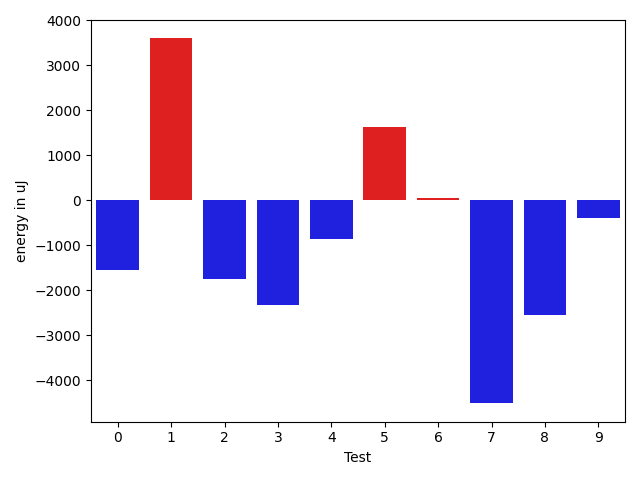
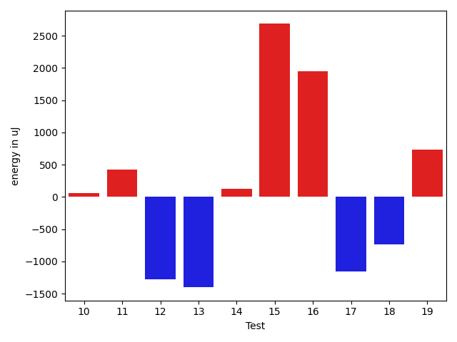
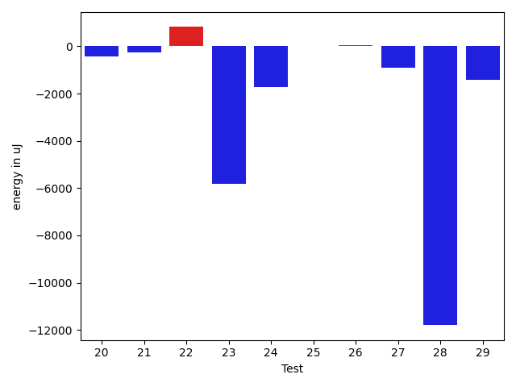
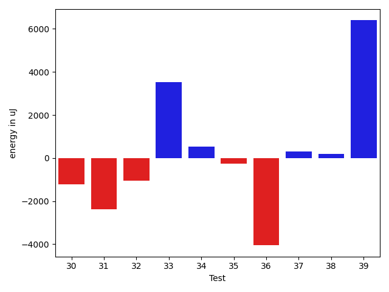
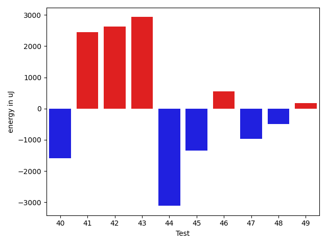
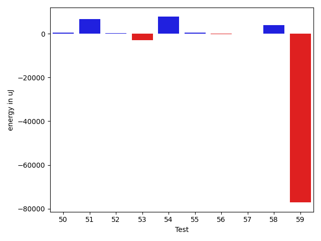
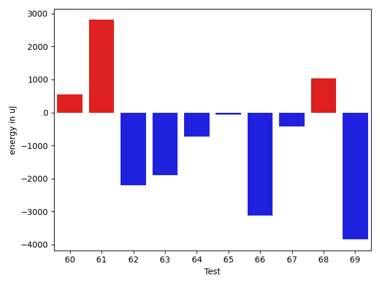
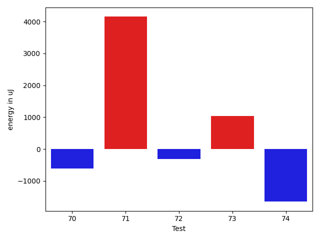

# gson 751c69

https://github.com/google/gson/commit/751c69

## Delta Energy per test method

| ID | EnergyV1 | EnergyV2 | DeltaEnergy | σV1 | σV2 |
| --- | --- | --- | --- | --- | --- |
| 0 | 38208 | 36866 | -1342 | 4276.020249406372 | 4487.539450301216 |
| 1 | 41321 | 42908 | 1587 | 31078.385205990628 | 39221.13285715902 |
| 2 | 38452 | 37964 | -488 | 13957.540011501615 | 12243.664904052204 |
| 3 | 38452 | 38513 | 61 | 18782.74573629553 | 12841.434774995278 |
| 4 | 37292 | 36743 | -549 | 3980.9322813974786 | 4268.513303266914 |
| 5 | 40588 | 39551 | -1037 | 29733.47663957412 | 39285.69236663071 |
| 6 | 36011 | 36316 | 305 | 3944.604031939437 | 4587.877165935747 |
| 7 | 39734 | 39063 | -671 | 23234.71953811162 | 16521.41472521319 |
| 8 | 39856 | 36438 | -3418 | 3776.27524766055 | 4684.031437877035 |
| 9 | 39185 | 39306 | 121 | 13107.691412071863 | 15068.59308451809 |
| 10 | 37781 | 37842 | 61 | 3406.04286429654 | 4431.183021098252 |
| 11 | 41809 | 42237 | 428 | 113041.16192300437 | 119633.67812857476 |
| 12 | 37475 | 36193 | -1282 | 4293.70147802569 | 5081.207670922466 |
| 13 | 38818 | 37415 | -1403 | 4666.719434634998 | 4741.775137160015 |
| 14 | 40833 | 40955 | 122 | 254979.06647981203 | 214662.9333339382 |
| 15 | 80627 | 83312 | 2685 | 26795.861876295392 | 24323.571006774055 |
| 16 | 39245 | 41198 | 1953 | 33405.967761688225 | 28154.350479668457 |
| 17 | 40710 | 39551 | -1159 | 14615.464717681269 | 14903.45505207263 |
| 18 | 39795 | 39062 | -733 | 18083.817504762526 | 16293.722678244698 |
| 19 | 41381 | 42114 | 733 | 22708.345120928807 | 24224.668728436704 |
| 20 | 38452 | 37720 | -732 | 9453.036052668693 | 10523.127398731844 |
| 21 | 37597 | 35828 | -1769 | 3703.951300216432 | 4054.8458677658596 |
| 22 | 38329 | 38452 | 123 | 3695.118765006072 | 4303.144116797688 |
| 23 | 39734 | 35767 | -3967 | 9674.684326443243 | 3630.979992947314 |
| 24 | 38941 | 35034 | -3907 | 3962.496700794365 | 4288.119980229535 |
| 25 | 37963 | 37781 | -182 | 4235.668940214019 | 4192.120631672695 |
| 26 | 38086 | 39063 | 977 | 4193.312912673433 | 4309.918930048888 |
| 27 | 37719 | 36376 | -1343 | 4082.449676281999 | 3949.7943197389363 |
| 28 | 42236 | 39368 | -2868 | 36351.28612041154 | 17518.6393354952 |
| 29 | 37781 | 39185 | 1404 | 23980.899642483204 | 18247.11289606233 |
| 30 | 38575 | 37293 | -1282 | 3904.5832653678262 | 3482.4445689227896 |
| 31 | 39673 | 39001 | -672 | 12669.93793400741 | 10987.1156643556 |
| 32 | 37781 | 37720 | -61 | 8111.227016451848 | 6340.350242064225 |
| 33 | 38941 | 40527 | 1586 | 16495.005715669995 | 19733.91893148844 |
| 34 | 36499 | 37476 | 977 | 4578.771855688727 | 3956.0419205685776 |
| 35 | 36438 | 36560 | 122 | 4653.956986549517 | 3879.4193057286116 |
| 36 | 38635 | 38758 | 123 | 15706.909358706349 | 11022.313685567815 |
| 37 | 37781 | 37171 | -610 | 4507.700672488973 | 4717.3426304494305 |
| 38 | 38391 | 38697 | 306 | 3749.1160291994165 | 5931.648826430515 |
| 39 | 39002 | 41809 | 2807 | 16609.583025749387 | 21366.398944479886 |
| 40 | 38269 | 36682 | -1587 | 7706.447637618647 | 4648.481799469586 |
| 41 | 39001 | 41443 | 2442 | 24834.02491438612 | 19747.729923580264 |
| 42 | 41626 | 44250 | 2624 | 26918.27288627654 | 26721.724509791675 |
| 43 | 38147 | 41077 | 2930 | 23786.255083415996 | 58012.696666675685 |
| 44 | 84045 | 80932 | -3113 | 363165.118323938 | 334157.93899565405 |
| 45 | 37841 | 36498 | -1343 | 8623.560984125605 | 7761.2654047742035 |
| 46 | 37598 | 38147 | 549 | 9381.760354916603 | 9724.028337634107 |
| 47 | 44311 | 43335 | -976 | 435063.0982594631 | 407605.17268375173 |
| 48 | 38513 | 38025 | -488 | 4482.010869503043 | 4409.392998548777 |
| 49 | 36682 | 36865 | 183 | 4202.505009992048 | 4679.487659451137 |
| 50 | 35889 | 36926 | 1037 | 4758.96078335684 | 4263.3654734258935 |
| 51 | 39124 | 40344 | 1220 | 36783.19207022414 | 44371.65302690408 |
| 52 | 38696 | 38819 | 123 | 4082.5675208654766 | 4619.171838609987 |
| 53 | 39246 | 35400 | -3846 | 4107.573030653069 | 5009.656923688044 |
| 54 | 39673 | 41321 | 1648 | 53759.25938204896 | 48295.64592678743 |
| 55 | 75378 | 73119 | -2259 | 30354.00025292139 | 32510.650603458198 |
| 56 | 38330 | 37720 | -610 | 6951.441399854329 | 5290.567611733262 |
| 57 | 39612 | 38941 | -671 | 17438.701793581124 | 20032.359002725607 |
| 58 | 38818 | 41382 | 2564 | 36443.00350211667 | 28651.205838487673 |
| 59 | 123291 | 117431 | -5860 | 364797.0802366045 | 143245.77180568903 |
| 60 | 37232 | 37781 | 549 | 4163.9427167165595 | 4049.371433131346 |
| 61 | 38757 | 41565 | 2808 | 13476.74952121616 | 25155.175251023837 |
| 62 | 244567 | 242370 | -2197 | 76749.2684242434 | 67619.96738450804 |
| 63 | 42175 | 40283 | -1892 | 470956.31324161624 | 322754.52700926433 |
| 64 | 39917 | 39184 | -733 | 3844.6995783900416 | 3744.7477893600735 |
| 65 | 38391 | 38330 | -61 | 3750.152587228952 | 4990.566128941144 |
| 66 | 41199 | 38086 | -3113 | 4107.236325511352 | 5869.147999497031 |
| 67 | 39307 | 38880 | -427 | 4150.437386999274 | 3928.7820004322475 |
| 68 | 39795 | 40832 | 1037 | 7363.873153876898 | 8225.34240888082 |
| 69 | 40832 | 36987 | -3845 | 16538.316926781306 | 17094.381952255542 |
| 70 | 38818 | 38208 | -610 | 3757.32272887077 | 4513.980404584242 |
| 71 | 38330 | 42481 | 4151 | 218753.68803127285 | 16094.64165836292 |
| 72 | 41199 | 40893 | -306 | 142370.96806232462 | 180074.02170785656 |
| 73 | 39246 | 40284 | 1038 | 161723.60977130185 | 3827.9755145416693 |
| 74 | 39185 | 37537 | -1648 | 4478.595852797515 | 4778.5080444328605 |

## Delta Duration per test method

| ID | DurationV1 | DurationsV2 | DeltaDuration |
| --- | --- | --- | --- |
| 0 | 779105.8888888889 | 760508.1162790698 | -18597.772609819076 |
| 1 | 1774416.6565656567 | 1905873.0909090908 | 131456.43434343417 |
| 2 | 1128515.350877193 | 1085158.4918032787 | -43356.859073914355 |
| 3 | 1268644.9113924052 | 1298419.7073170731 | 29774.795924667967 |
| 4 | 854997.224137931 | 855832.5084745763 | 835.2843366452726 |
| 5 | 1443620.9137931035 | 1577446.3548387096 | 133825.44104560604 |
| 6 | 926659.9074074074 | 923988.9137931034 | -2670.993614303996 |
| 7 | 1401898.2352941176 | 1305383.1470588236 | -96515.08823529398 |
| 8 | 679933.15625 | 812848.7142857143 | 132915.55803571432 |
| 9 | 995960.5510204082 | 1137740.1739130435 | 141779.6228926353 |
| 10 | 654880.9743589744 | 699425.3076923077 | 44544.33333333337 |
| 11 | 2240292.6136363638 | 2855945.714285714 | 615653.1006493503 |
| 12 | 768937.54 | 847664.0545454546 | 78726.51454545453 |
| 13 | 832239.52 | 810903.2708333334 | -21336.249166666646 |
| 14 | 2758785.033333333 | 2406480.9375 | -352304.0958333332 |
| 15 | 2703324.5555555555 | 2707347.606060606 | 4023.050505050458 |
| 16 | 1187120.9677419355 | 1218110.5081967213 | 30989.540454785805 |
| 17 | 1042497.0612244898 | 1015120.4166666666 | -27376.644557823194 |
| 18 | 1314006.15 | 1214442.1746031747 | -99563.97539682523 |
| 19 | 1738422.3636363635 | 1817720.8163265307 | 79298.45269016712 |
| 20 | 1047904.0746268657 | 1149487.7692307692 | 101583.69460390357 |
| 21 | 479674.875 | 483366.6666666667 | 3691.791666666686 |
| 22 | 663678.3611111111 | 711393.9583333334 | 47715.59722222225 |
| 23 | 705245.1714285715 | 664707.0714285715 | -40538.09999999998 |
| 24 | 465321.82352941175 | 498103.71875 | 32781.89522058825 |
| 25 | 471621.8125 | 456304.0 | -15317.8125 |
| 26 | 500409.5625 | 528709.125 | 28299.5625 |
| 27 | 520650.5 | 481805.39130434784 | -38845.10869565216 |
| 28 | 1262789.388888889 | 906539.6923076923 | -356249.69658119674 |
| 29 | 1146239.7741935484 | 1007923.2093023256 | -138316.56489122275 |
| 30 | 475991.38095238095 | 467081.5 | -8909.880952380947 |
| 31 | 1155429.12 | 957697.695652174 | -197731.42434782616 |
| 32 | 1020428.3529411765 | 961813.7037037037 | -58614.6492374728 |
| 33 | 1251571.1886792453 | 1260045.119047619 | 8473.930368373636 |
| 34 | 603778.5925925926 | 529030.1428571428 | -74748.44973544974 |
| 35 | 558720.7142857143 | 464695.28571428574 | -94025.42857142858 |
| 36 | 1174741.0454545454 | 1078656.5 | -96084.54545454541 |
| 37 | 614995.4516129033 | 598499.2083333334 | -16496.2432795699 |
| 38 | 906329.42 | 882297.4565217391 | -24031.963478260906 |
| 39 | 1115816.6756756757 | 1371200.5882352942 | 255383.91255961847 |
| 40 | 800352.6388888889 | 780428.7333333333 | -19923.905555555597 |
| 41 | 1210985.9767441861 | 1166989.953488372 | -43996.0232558141 |
| 42 | 1729032.8461538462 | 1844676.076923077 | 115643.23076923075 |
| 43 | 1508495.6666666667 | 1957713.425531915 | 449217.7588652482 |
| 44 | 4998009.171717172 | 4928478.474747474 | -69530.69696969725 |
| 45 | 1143320.0666666667 | 1111222.1710526317 | -32097.895614034962 |
| 46 | 1215021.3604651163 | 1190840.938271605 | -24180.42219351139 |
| 47 | 5111270.847222222 | 5048721.044117647 | -62549.80310457479 |
| 48 | 706317.5454545454 | 681824.4210526316 | -24493.12440191384 |
| 49 | 846213.0909090909 | 896975.3220338983 | 50762.23112480738 |
| 50 | 721816.6904761905 | 777810.275 | 55993.58452380949 |
| 51 | 1441286.59375 | 1671340.75 | 230054.15625 |
| 52 | 867030.4137931034 | 876069.0877192982 | 9038.67392619478 |
| 53 | 637396.6875 | 606225.0833333334 | -31171.604166666628 |
| 54 | 1144398.0784313725 | 1399831.7636363637 | 255433.68520499114 |
| 55 | 2205551.878787879 | 2231394.787878788 | 25842.909090909176 |
| 56 | 984874.0163934426 | 970176.3174603175 | -14697.698933125124 |
| 57 | 1311297.0684931506 | 1285730.4571428571 | -25566.611350293504 |
| 58 | 1560872.4 | 1634699.7530864198 | 73827.35308641987 |
| 59 | 5942074.363636363 | 3853806.707070707 | -2088267.6565656564 |
| 60 | 496713.0 | 531332.7647058824 | 34619.76470588241 |
| 61 | 899039.24 | 1409807.7083333333 | 510768.46833333327 |
| 62 | 6762475.828282828 | 6561358.777777778 | -201117.05050505046 |
| 63 | 5883522.783783784 | 3584915.5061728396 | -2298607.2776109446 |
| 64 | 511234.14285714284 | 486597.6923076923 | -24636.45054945053 |
| 65 | 584573.1 | 454872.60869565216 | -129700.49130434782 |
| 66 | 621499.8 | 780836.08 | 159336.2799999999 |
| 67 | 533950.9523809524 | 531987.3529411765 | -1963.5994397759205 |
| 68 | 662929.2083333334 | 725201.1 | 62271.891666666605 |
| 69 | 1027452.7727272727 | 960697.36 | -66755.41272727272 |
| 70 | 457754.3333333333 | 560108.1428571428 | 102353.80952380953 |
| 71 | 1764120.619047619 | 843925.3888888889 | -920195.2301587301 |
| 72 | 1758747.8823529412 | 1734527.68 | -24220.20235294127 |
| 73 | 1515199.0476190476 | 533486.0416666666 | -981713.005952381 |
| 74 | 953735.1774193548 | 917316.186440678 | -36418.990978676826 |

## Misc.

| ID | Test Class | Test Method |
| --- | --- | --- |
| 0 | com.google.gson.functional.CustomDeserializerTest | testDefaultConstructorNotCalledOnField |
| 1 | com.google.gson.functional.CustomDeserializerTest | testDefaultConstructorNotCalledOnObject |
| 2 | com.google.gson.functional.CustomDeserializerTest | testCustomDeserializerReturnsNull |
| 3 | com.google.gson.functional.CustomDeserializerTest | testJsonTypeFieldBasedDeserialization |
| 4 | com.google.gson.functional.CustomDeserializerTest | testCustomDeserializerReturnsNullForArrayElements |
| 5 | com.google.gson.functional.CustomDeserializerTest | testCustomDeserializerReturnsNullForTopLevelObject |
| 6 | com.google.gson.functional.CustomDeserializerTest | testCustomDeserializerReturnsNullForArrayElementsForArrayField |
| 7 | com.google.gson.functional.StreamingTypeAdaptersTest | testFromJsonTree |
| 8 | com.google.gson.functional.JsonParserTest | testBadTypeForDeserializingCustomTree |
| 9 | com.google.gson.functional.JsonParserTest | testChangingCustomTreeAndDeserializing |
| 10 | com.google.gson.functional.JsonParserTest | testBadFieldTypeForCustomDeserializerCustomTree |
| 11 | com.google.gson.functional.JsonParserTest | testDeserializingCustomTree |
| 12 | com.google.gson.functional.JsonParserTest | testBadFieldTypeForDeserializingCustomTree |
| 13 | com.google.gson.functional.CustomTypeAdaptersTest | testCustomTypeAdapterAppliesToSubClassesSerializedAsBaseClass |
| 14 | com.google.gson.functional.CustomTypeAdaptersTest | testCustomSerializers |
| 15 | com.google.gson.functional.CustomTypeAdaptersTest | testCustomTypeAdapterDoesNotAppliesToSubClasses |
| 16 | com.google.gson.functional.CustomTypeAdaptersTest | testCustomDeserializers |
| 17 | com.google.gson.functional.CustomTypeAdaptersTest | testEnsureCustomSerializerNotInvokedForNullValues |
| 18 | com.google.gson.functional.ReadersWritersTest | testReadWriteTwoObjects |
| 19 | com.google.gson.functional.MapTest | testInterfaceTypeMapWithSerializer |
| 20 | com.google.gson.functional.MapTest | testMapNamePromotionWithJsonElementReader |
| 21 | com.google.gson.JsonObjectTest | testEqualsNonEmptyObject |
| 22 | com.google.gson.JsonObjectTest | testAddingCharacterProperties |
| 23 | com.google.gson.JsonObjectTest | testPropertyWithQuotes |
| 24 | com.google.gson.JsonObjectTest | testWritePropertyWithEmptyStringName |
| 25 | com.google.gson.JsonObjectTest | testAddingStringProperties |
| 26 | com.google.gson.JsonObjectTest | testAddingNullPropertyValue |
| 27 | com.google.gson.JsonObjectTest | testAddingBooleanProperties |
| 28 | com.google.gson.JsonObjectTest | testAddingAndRemovingObjectProperties |
| 29 | com.google.gson.JsonObjectTest | testReadPropertyWithEmptyStringName |
| 30 | com.google.gson.JsonObjectTest | testAddingNullOrEmptyPropertyName |
| 31 | com.google.gson.functional.CollectionTest | testRawCollectionOfBagOfPrimitivesNotAllowed |
| 32 | com.google.gson.functional.InheritanceTest | testClassWithBaseArrayFieldSerialization |
| 33 | com.google.gson.functional.InheritanceTest | testClassWithBaseFieldSerialization |
| 34 | com.google.gson.functional.InheritanceTest | testBaseSerializedAsBaseWhenSpecifiedWithExplicitType |
| 35 | com.google.gson.functional.InheritanceTest | testBaseSerializedAsSubWhenSpecifiedWithExplicitType |
| 36 | com.google.gson.functional.InheritanceTest | testClassWithBaseCollectionFieldSerialization |
| 37 | com.google.gson.functional.InheritanceTest | testBaseSerializedAsSub |
| 38 | com.google.gson.functional.NullObjectAndFieldTest | testCustomTypeAdapterPassesNullDesrialization |
| 39 | com.google.gson.functional.NullObjectAndFieldTest | testCustomSerializationOfNulls |
| 40 | com.google.gson.functional.ExclusionStrategyFunctionalTest | testExclusionStrategyWithMode |
| 41 | com.google.gson.functional.ExclusionStrategyFunctionalTest | testExclusionStrategyDeserialization |
| 42 | com.google.gson.functional.ParameterizedTypesTest | testParameterizedTypeWithCustomSerializer |
| 43 | com.google.gson.functional.ParameterizedTypesTest | testParameterizedTypesWithCustomDeserializer |
| 44 | com.google.gson.functional.MapAsArrayTypeAdapterTest | testSerializeComplexMapWithTypeAdapter |
| 45 | com.google.gson.functional.MapAsArrayTypeAdapterTest | testMultipleEnableComplexKeyRegistrationHasNoEffect |
| 46 | com.google.gson.functional.MapAsArrayTypeAdapterTest | testMapWithTypeVariableSerialization |
| 47 | com.google.gson.functional.CustomSerializerTest | testSubClassSerializerInvokedForBaseClassFieldsHoldingSubClassInstances |
| 48 | com.google.gson.functional.CustomSerializerTest | testBaseClassSerializerInvokedForBaseClassFields |
| 49 | com.google.gson.functional.CustomSerializerTest | testSubClassSerializerInvokedForBaseClassFieldsHoldingArrayOfSubClassInstances |
| 50 | com.google.gson.functional.CustomSerializerTest | testBaseClassSerializerInvokedForBaseClassFieldsHoldingSubClassInstances |
| 51 | com.google.gson.functional.JsonTreeTest | testJsonTreeToString |
| 52 | com.google.gson.functional.JsonTreeTest | testToJsonTreeObjectType |
| 53 | com.google.gson.functional.JsonTreeTest | testJsonTreeNull |
| 54 | com.google.gson.functional.JsonTreeTest | testToJsonTree |
| 55 | com.google.gson.functional.UncategorizedTest | testReturningDerivedClassesDuringDeserialization |
| 56 | com.google.gson.functional.MoreSpecificTypeSerializationTest | testMapOfParameterizedSubclassFields |
| 57 | com.google.gson.functional.MoreSpecificTypeSerializationTest | testMapOfSubclassFields |
| 58 | com.google.gson.ObjectTypeAdapterTest | testDeserialize |
| 59 | com.google.gson.functional.TypeHierarchyAdapterTest | testTypeHierarchy |
| 60 | com.google.gson.functional.PrintFormattingTest | testJsonObjectWithNullValuesSerialized |
| 61 | com.google.gson.functional.PrintFormattingTest | testJsonObjectWithNullValues |
| 62 | com.google.gson.functional.CircularReferenceTest | testSelfReferenceCustomHandlerSerialization |
| 63 | com.google.gson.JsonParserTest | testReadWriteTwoObjects |
| 64 | com.google.gson.JsonParserTest | testParseReader |
| 65 | com.google.gson.JsonParserTest | testParseString |
| 66 | com.google.gson.internal.bind.JsonElementReaderTest | testNestedObjects |
| 67 | com.google.gson.internal.bind.JsonElementReaderTest | testSkipValue |
| 68 | com.google.gson.internal.bind.JsonElementReaderTest | testObject |
| 69 | com.google.gson.functional.DefaultTypeAdaptersTest | testJsonObjectSerialization |
| 70 | com.google.gson.functional.DefaultTypeAdaptersTest | testJsonObjectDeerialization |
| 71 | com.google.gson.internal.bind.JsonTreeWriterTest | testNestedObject |
| 72 | com.google.gson.internal.bind.JsonTreeWriterTest | testSerializeNullsTrue |
| 73 | com.google.gson.internal.bind.JsonTreeWriterTest | testObject |
| 74 | com.google.gson.DefaultMapJsonSerializerTest | testNonEmptyMapSerialization |

| Test | IterationV1 | IterationV2 | DeltaIteration |
| --- | --- | --- | --- |
| 0 | 45 | 43 | -2 |
| 1 | 99 | 99 | 0 |
| 2 | 57 | 61 | 4 |
| 3 | 79 | 82 | 3 |
| 4 | 58 | 59 | 1 |
| 5 | 58 | 62 | 4 |
| 6 | 54 | 58 | 4 |
| 7 | 34 | 34 | 0 |
| 8 | 32 | 35 | 3 |
| 9 | 49 | 46 | -3 |
| 10 | 39 | 39 | 0 |
| 11 | 44 | 49 | 5 |
| 12 | 50 | 55 | 5 |
| 13 | 50 | 48 | -2 |
| 14 | 60 | 48 | -12 |
| 15 | 99 | 99 | 0 |
| 16 | 62 | 61 | -1 |
| 17 | 49 | 48 | -1 |
| 18 | 60 | 63 | 3 |
| 19 | 99 | 98 | -1 |
| 20 | 67 | 65 | -2 |
| 21 | 24 | 21 | -3 |
| 22 | 36 | 24 | -12 |
| 23 | 35 | 28 | -7 |
| 24 | 17 | 32 | 15 |
| 25 | 16 | 22 | 6 |
| 26 | 16 | 16 | 0 |
| 27 | 16 | 23 | 7 |
| 28 | 18 | 26 | 8 |
| 29 | 31 | 43 | 12 |
| 30 | 21 | 22 | 1 |
| 31 | 50 | 46 | -4 |
| 32 | 51 | 54 | 3 |
| 33 | 53 | 42 | -11 |
| 34 | 27 | 28 | 1 |
| 35 | 21 | 21 | 0 |
| 36 | 66 | 60 | -6 |
| 37 | 31 | 24 | -7 |
| 38 | 50 | 46 | -4 |
| 39 | 37 | 34 | -3 |
| 40 | 36 | 45 | 9 |
| 41 | 43 | 43 | 0 |
| 42 | 91 | 91 | 0 |
| 43 | 90 | 94 | 4 |
| 44 | 99 | 99 | 0 |
| 45 | 75 | 76 | 1 |
| 46 | 86 | 81 | -5 |
| 47 | 72 | 68 | -4 |
| 48 | 33 | 38 | 5 |
| 49 | 55 | 59 | 4 |
| 50 | 42 | 40 | -2 |
| 51 | 64 | 68 | 4 |
| 52 | 58 | 57 | -1 |
| 53 | 32 | 24 | -8 |
| 54 | 51 | 55 | 4 |
| 55 | 99 | 99 | 0 |
| 56 | 61 | 63 | 2 |
| 57 | 73 | 70 | -3 |
| 58 | 75 | 81 | 6 |
| 59 | 99 | 99 | 0 |
| 60 | 17 | 17 | 0 |
| 61 | 25 | 24 | -1 |
| 62 | 99 | 99 | 0 |
| 63 | 74 | 81 | 7 |
| 64 | 21 | 26 | 5 |
| 65 | 20 | 23 | 3 |
| 66 | 25 | 25 | 0 |
| 67 | 21 | 17 | -4 |
| 68 | 24 | 30 | 6 |
| 69 | 22 | 25 | 3 |
| 70 | 15 | 21 | 6 |
| 71 | 21 | 18 | -3 |
| 72 | 17 | 25 | 8 |
| 73 | 21 | 24 | 3 |
| 74 | 62 | 59 | -3 |

| Time Label | Time (s) |
| --- | --- |
| Selection | 27.059508323669434 |
| Injection | 14.184064388275146 |
| Total | 1173.8971869945526 |

