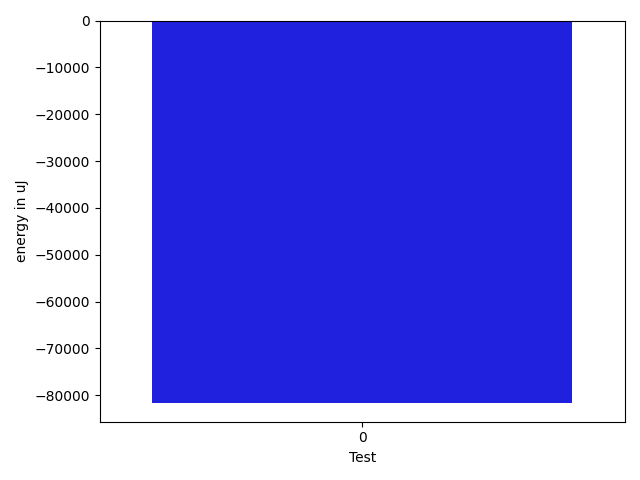
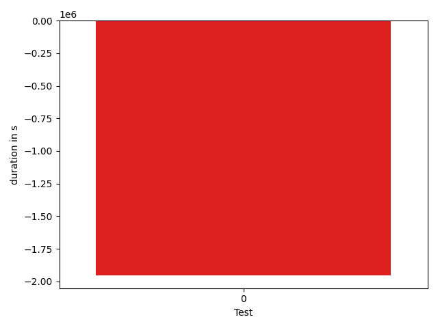

# gson 15e781

https://github.com/google/gson/commit/15e781

## Delta Energy per test method

| ID | EnergyV1 | EnergyV2 | DeltaEnergy | σ |
| --- | --- | --- | --- | --- |
| 0 | 367680.3939393939 | 286112.9797979798 | -81567.4141414141 | 396910.3584392578 | 201523.35020512773 |

## Delta Duration per test method

| ID | DurationV1 | DurationsV2 | DeltaDuration |
| --- | --- | --- | --- |
| 0 | 12057890.484848484 | 10103277.606060605 | -1954612.878787879 |

## Misc.

| ID | Test Class | Test Method |
| --- | --- | --- |
| 0 | com.google.gson.functional.TypeHierarchyAdapterTest | testTypeHierarchy |

| Test | IterationV1 | IterationV2 | DeltaIteration |
| --- | --- | --- | --- |
| 0 | 99 | 99 | 0 |

| Time Label | Time (s) |
| --- | --- |
| Selection | 28.48578715324402 |
| Injection | 10.333771467208862 |
| Total | 1091.185135126114 |

