# gson 2c8bec

https://github.com/google/gson/commit/2c8bec

## Delta Energy per test method

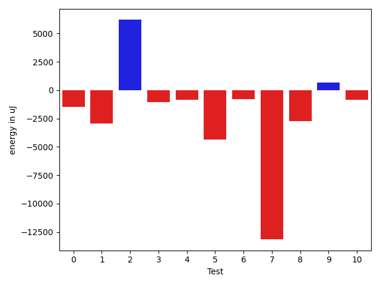

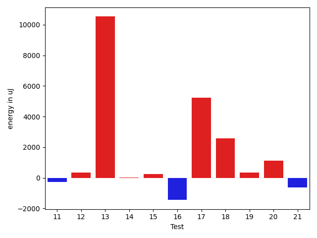

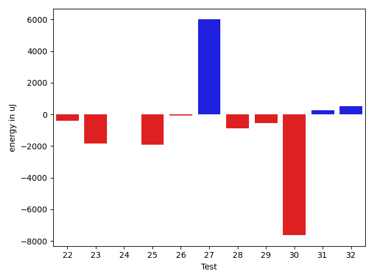

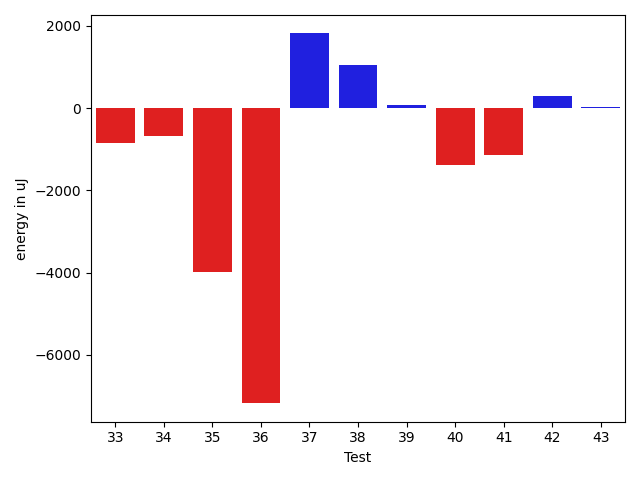

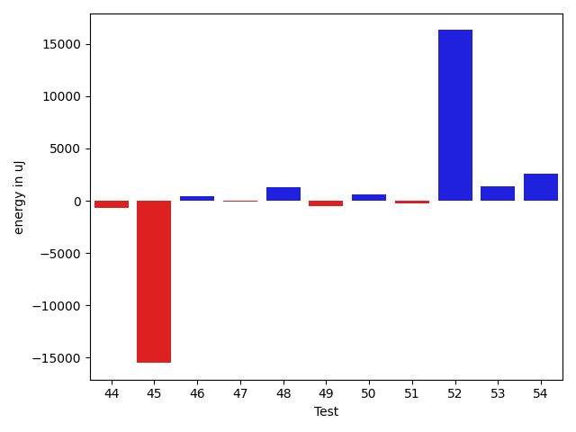

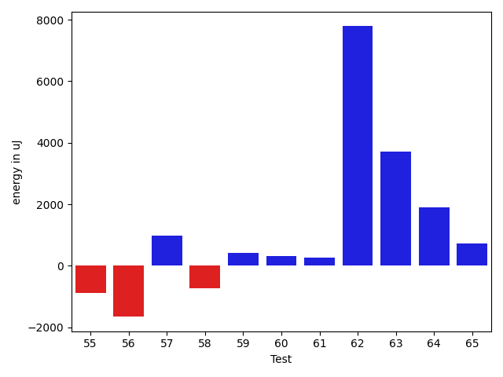

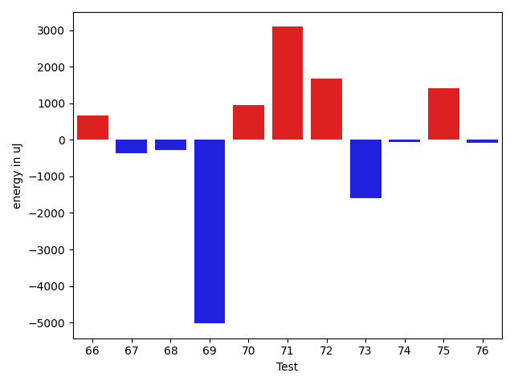

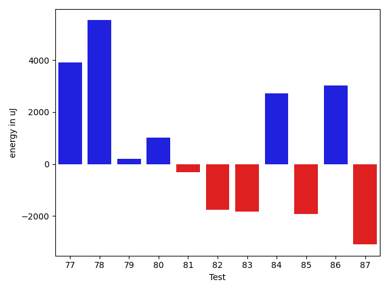

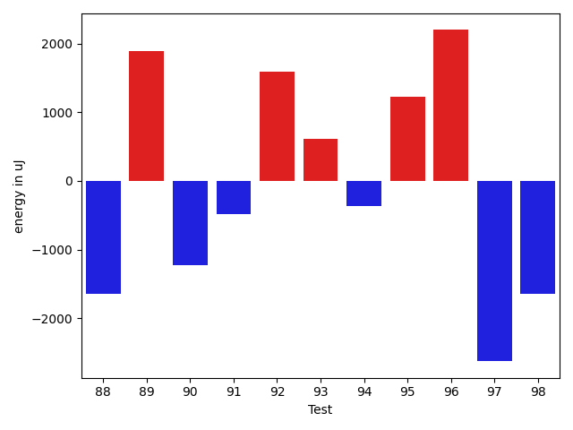

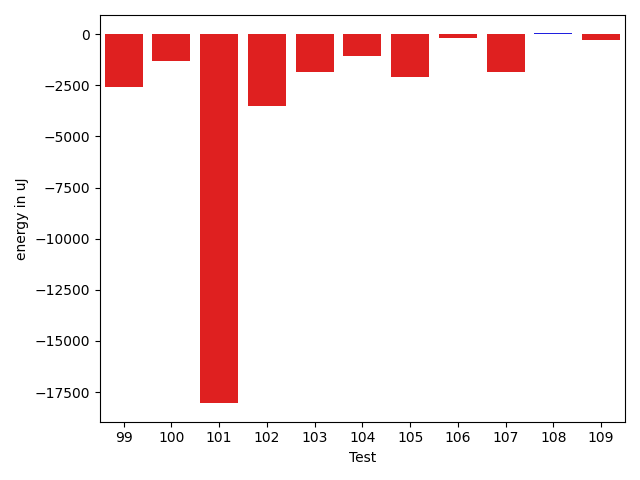

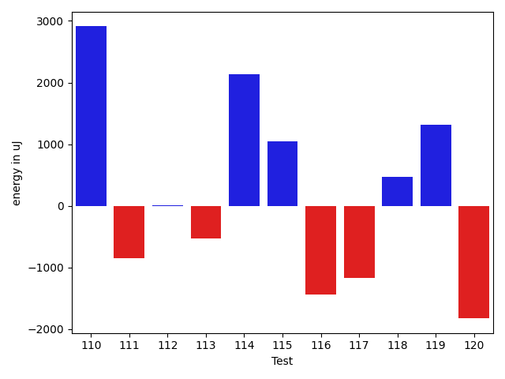

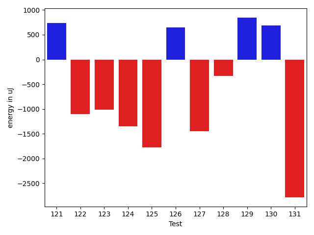

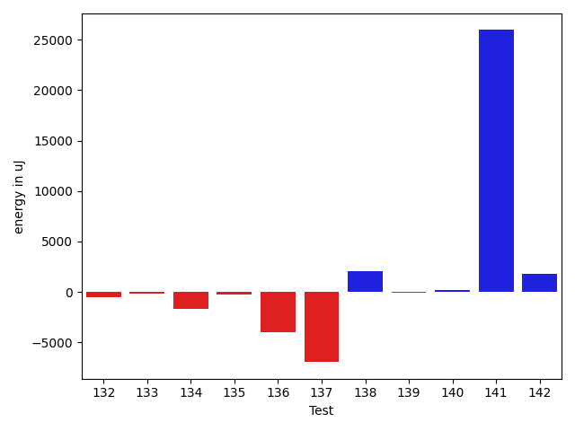

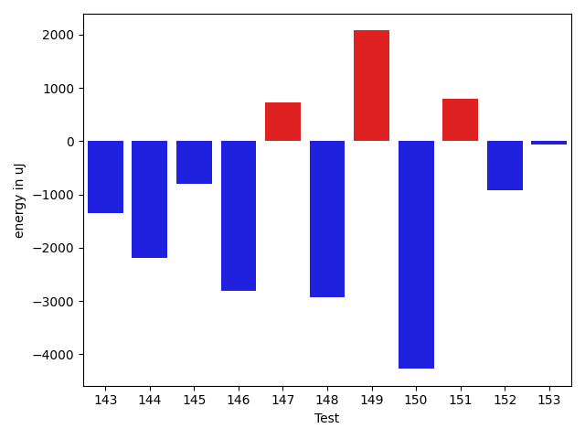

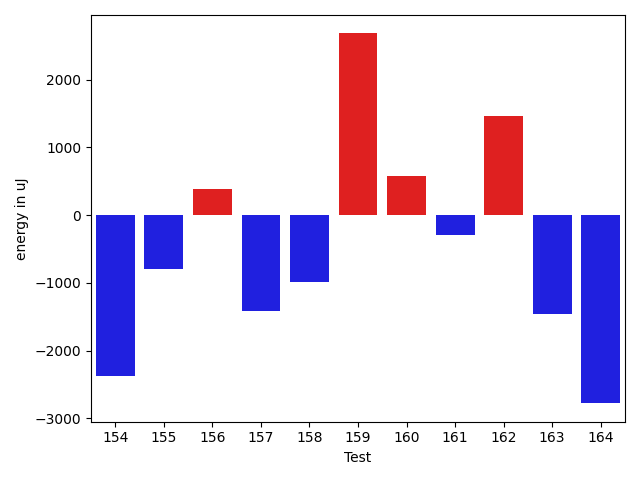

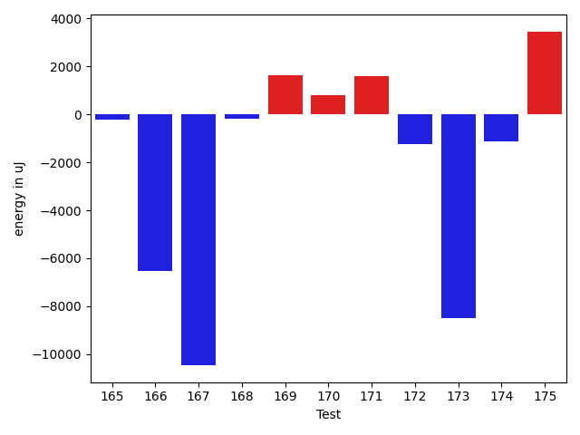

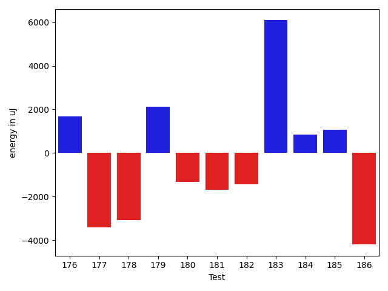

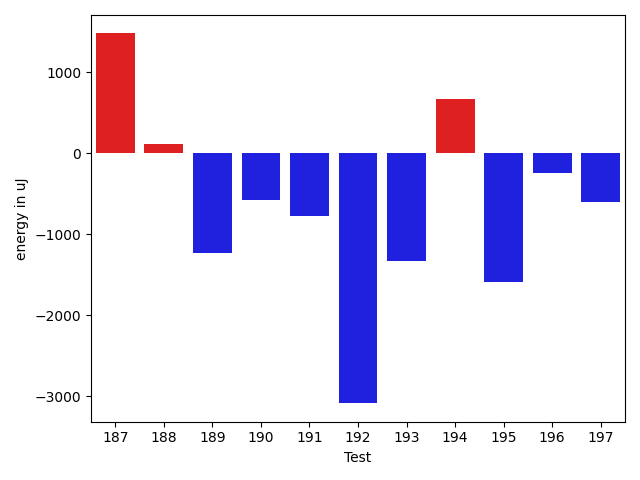

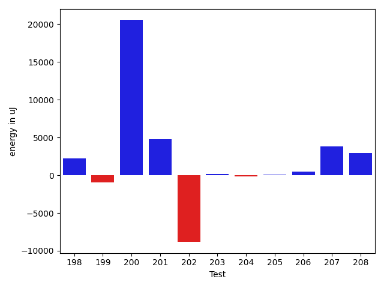

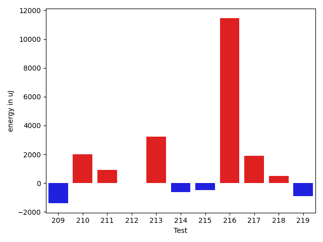

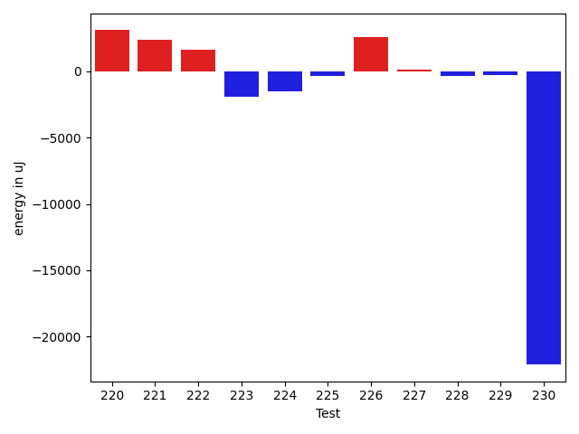

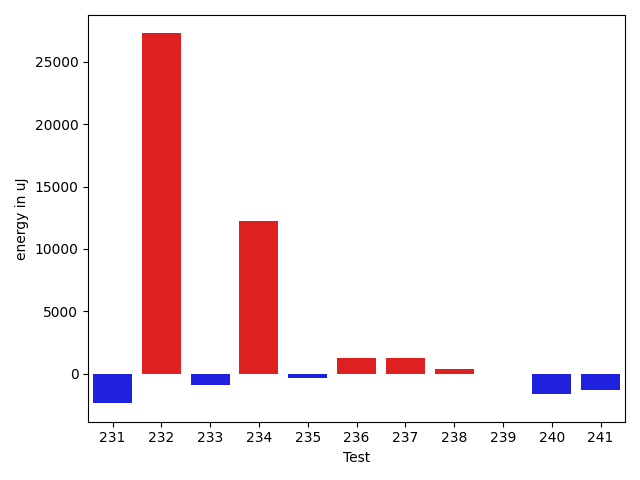

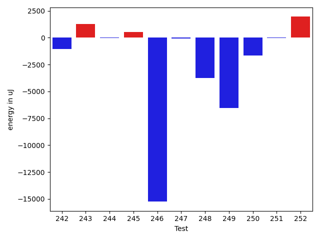

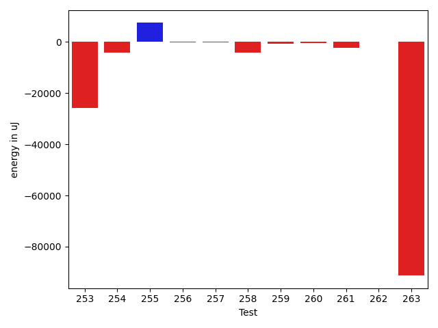

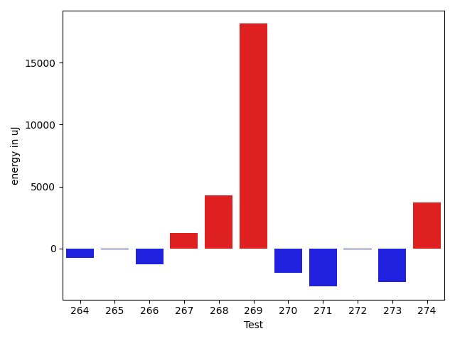

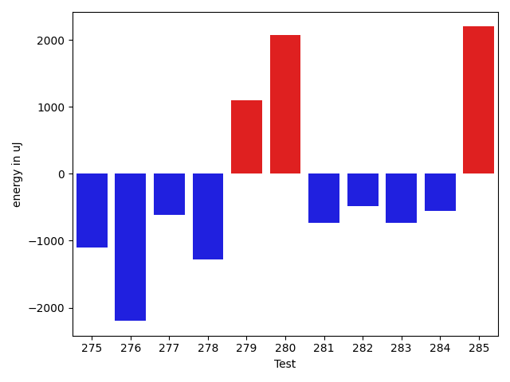

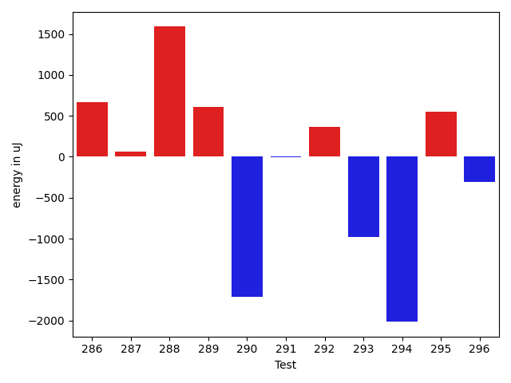

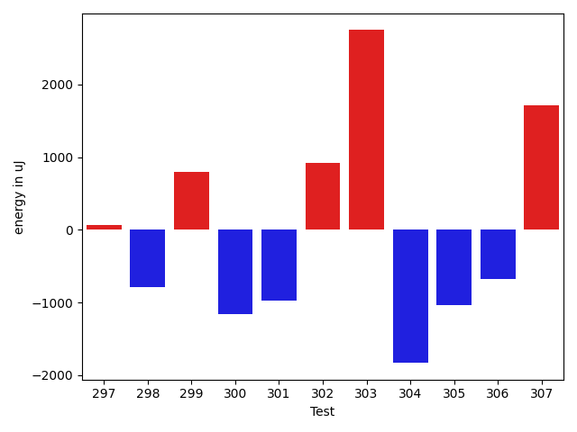

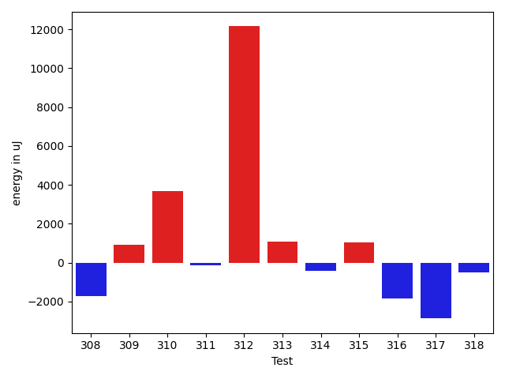

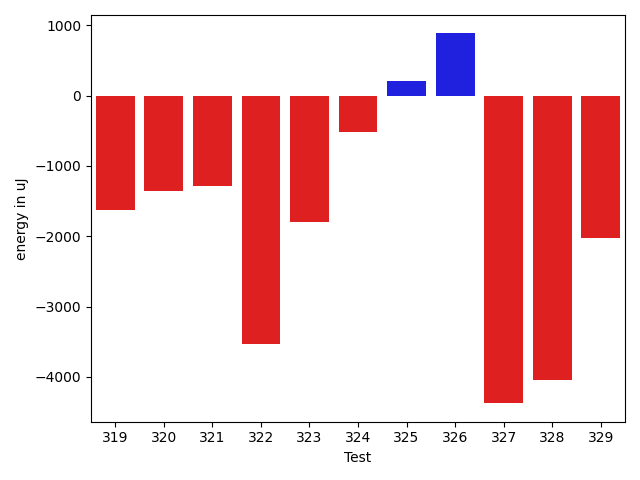

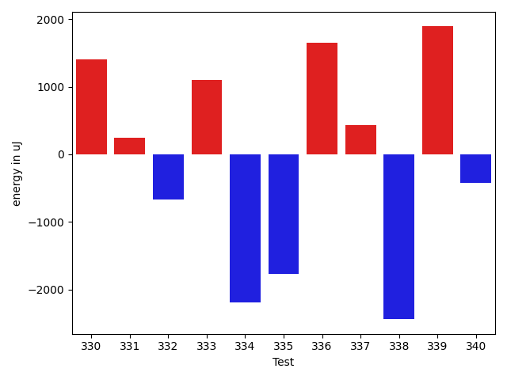

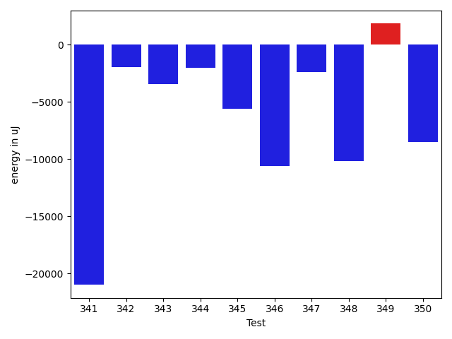

| ID | EnergyV1 | EnergyV2 | DeltaEnergy | σV1 | σV2 |
| --- | --- | --- | --- | --- | --- |
| 0 | 38025 | 37110 | -915 | 11767.99894168656 | 9529.322622658803 |
| 1 | 38269 | 38513 | 244 | 9776.387729194323 | 5602.543168557967 |
| 2 | 35706 | 36621 | 915 | 4272.041798951144 | 31636.344904475456 |
| 3 | 36805 | 36316 | -489 | 4583.525489693739 | 3359.033063222582 |
| 4 | 37476 | 35461 | -2015 | 3595.8406922475956 | 4240.257843149269 |
| 5 | 38147 | 36560 | -1587 | 15973.412872819496 | 12963.497268355737 |
| 6 | 37475 | 36011 | -1464 | 4383.311240069454 | 3272.219246805986 |
| 7 | 35583 | 37048 | 1465 | 56610.83082864422 | 2401.215100565477 |
| 8 | 39123 | 37414 | -1709 | 2940.99015828192 | 3141.010841614982 |
| 9 | 38513 | 39550 | 1037 | 5267.222471841021 | 4642.006195635822 |
| 10 | 40161 | 39673 | -488 | 30222.52334927135 | 31293.931611264645 |
| 11 | 38269 | 36865 | -1404 | 4049.6134412212255 | 4551.128102086339 |
| 12 | 38758 | 39063 | 305 | 3485.8153989498005 | 3120.9591779573457 |
| 13 | 79224 | 80689 | 1465 | 50300.38694606011 | 140778.79588608438 |
| 14 | 38818 | 37231 | -1587 | 5060.1830493624975 | 4193.413383576148 |
| 15 | 37354 | 36804 | -550 | 3394.023001605364 | 6778.989973336275 |
| 16 | 37232 | 36316 | -916 | 3948.6899418780467 | 3885.654051475346 |
| 17 | 38757 | 38269 | -488 | 14556.92187136327 | 23912.283506595664 |
| 18 | 38513 | 36377 | -2136 | 32745.23767077869 | 34165.56577477229 |
| 19 | 36316 | 36865 | 549 | 4326.384510632108 | 3694.093248023008 |
| 20 | 37963 | 38025 | 62 | 7084.168722566956 | 7884.1782494518075 |
| 21 | 38086 | 37659 | -427 | 16515.18302514637 | 13412.86757975167 |
| 22 | 38940 | 37780 | -1160 | 12270.671033882216 | 12614.831677143104 |
| 23 | 38452 | 37597 | -855 | 12985.301689642833 | 9597.527550449067 |
| 24 | 38391 | 37476 | -915 | 8961.138191874823 | 9188.915776388176 |
| 25 | 39307 | 36621 | -2686 | 3687.4722567922427 | 3666.7627771494695 |
| 26 | 35583 | 35218 | -365 | 4955.842554561064 | 4769.315892071665 |
| 27 | 40527 | 39917 | -610 | 68197.11543225271 | 72217.97725196388 |
| 28 | 38085 | 36377 | -1708 | 3676.84446892009 | 4319.312474084634 |
| 29 | 39429 | 39001 | -428 | 4416.057566834217 | 3673.5178859185185 |
| 30 | 39612 | 38818 | -794 | 53872.69379842789 | 33722.75796390386 |
| 31 | 38513 | 39307 | 794 | 3968.9077028020056 | 5061.673936479809 |
| 32 | 36743 | 36988 | 245 | 5606.326706124292 | 7359.100180682133 |
| 33 | 37109 | 36072 | -1037 | 3847.038380887664 | 3988.4948264947056 |
| 34 | 36805 | 36377 | -428 | 4796.7549891282915 | 5135.032991542441 |
| 35 | 39001 | 38269 | -732 | 21606.420551406925 | 14229.858999632614 |
| 36 | 72753 | 71289 | -1464 | 99758.15048972951 | 83078.9612636796 |
| 37 | 37110 | 37902 | 792 | 8865.836720150079 | 10602.331290255392 |
| 38 | 69092 | 70068 | 976 | 31309.624519995512 | 29079.700040514195 |
| 39 | 37170 | 37475 | 305 | 8951.35066506105 | 9198.623289997742 |
| 40 | 39307 | 37110 | -2197 | 12954.98702370035 | 13282.12764073647 |
| 41 | 71533 | 70617 | -916 | 36377.28781410643 | 32999.18823453003 |
| 42 | 36866 | 36804 | -62 | 5160.385302414443 | 6993.978030504454 |
| 43 | 37414 | 37109 | -305 | 3228.509127808914 | 3841.6806948553767 |
| 44 | 36804 | 36437 | -367 | 3644.6675056398035 | 4034.1989247777115 |
| 45 | 39245 | 39368 | 123 | 49232.38826261735 | 21953.06659868109 |
| 46 | 36193 | 35949 | -244 | 3939.735493523464 | 4108.366048449054 |
| 47 | 37170 | 37353 | 183 | 3478.6260503285903 | 3654.107907147722 |
| 48 | 36072 | 37964 | 1892 | 4555.429293093978 | 4008.7280259263175 |
| 49 | 38086 | 37719 | -367 | 5153.333322552824 | 4557.384836526773 |
| 50 | 37292 | 37232 | -60 | 4402.182668415038 | 4708.964650366614 |
| 51 | 36621 | 35340 | -1281 | 3058.0277902552702 | 3235.5320115745844 |
| 52 | 183166 | 186340 | 3174 | 71294.12525990373 | 108358.69519015691 |
| 53 | 117981 | 116150 | -1831 | 24893.682510110724 | 33065.25010243993 |
| 54 | 86243 | 103638 | 17395 | 34493.25031646255 | 34316.861336071925 |
| 55 | 41992 | 40771 | -1221 | 2411.6719677435403 | 2661.271461550003 |
| 56 | 37964 | 38513 | 549 | 14018.986886202847 | 12420.559997911867 |
| 57 | 37048 | 38879 | 1831 | 16267.794629446858 | 16034.073021227936 |
| 58 | 37292 | 36804 | -488 | 4604.943969300804 | 4028.6711117037084 |
| 59 | 36255 | 37353 | 1098 | 3915.595036455444 | 3856.1061002686274 |
| 60 | 40466 | 39551 | -915 | 35934.819333285144 | 37942.535303564706 |
| 61 | 41320 | 40466 | -854 | 20304.81534214393 | 19249.096705989377 |
| 62 | 37659 | 38574 | 915 | 38311.19138654283 | 56678.35938247613 |
| 63 | 36377 | 37598 | 1221 | 7677.395058539402 | 23112.60839193638 |
| 64 | 36438 | 37293 | 855 | 14865.75835372046 | 18924.82381437029 |
| 65 | 34851 | 37109 | 2258 | 3754.7778198410765 | 3992.04078844489 |
| 66 | 36865 | 36926 | 61 | 3888.759952000858 | 4496.78935436162 |
| 67 | 38513 | 38391 | -122 | 12260.545370051566 | 10071.406178372676 |
| 68 | 36804 | 36255 | -549 | 4458.20614028693 | 4362.773572824107 |
| 69 | 38757 | 37903 | -854 | 24395.49533065777 | 10275.034760471075 |
| 70 | 37353 | 37659 | 306 | 3654.4912846215684 | 4216.945937721595 |
| 71 | 36377 | 38757 | 2380 | 4341.2667506155385 | 3378.8136817814875 |
| 72 | 36438 | 37293 | 855 | 4698.397137182942 | 4408.424216127111 |
| 73 | 36621 | 35278 | -1343 | 4476.3030953678735 | 4489.1347252354635 |
| 74 | 36559 | 37354 | 795 | 3656.967112543155 | 4859.5151765237915 |
| 75 | 36926 | 36743 | -183 | 4986.025209297994 | 4320.236950263331 |
| 76 | 36865 | 36194 | -671 | 4024.2665411882285 | 4196.797218142774 |
| 77 | 33325 | 38147 | 4822 | 3579.2282534088267 | 4104.573008437933 |
| 78 | 113586 | 114014 | 428 | 76789.48265112458 | 97976.93273319137 |
| 79 | 36987 | 37231 | 244 | 4177.264246968849 | 6505.766866500982 |
| 80 | 37354 | 38025 | 671 | 4388.466208796462 | 3527.0360754463513 |
| 81 | 37293 | 37232 | -61 | 4743.525834229218 | 4349.068317955576 |
| 82 | 38697 | 36621 | -2076 | 5314.646620617482 | 4103.72381421643 |
| 83 | 38696 | 37537 | -1159 | 3072.493081257466 | 3360.2268610455912 |
| 84 | 39550 | 39917 | 367 | 20783.564194439525 | 26790.85218899583 |
| 85 | 41626 | 38940 | -2686 | 3255.4207551917666 | 4557.361401896935 |
| 86 | 71228 | 72571 | 1343 | 42865.65551201206 | 53353.143028221864 |
| 87 | 40100 | 38086 | -2014 | 19929.384953207154 | 21863.330910536788 |
| 88 | 42541 | 40893 | -1648 | 66673.41427124225 | 31832.955575057742 |
| 89 | 38085 | 39978 | 1893 | 3712.784814177747 | 4296.210739609476 |
| 90 | 39184 | 37963 | -1221 | 4190.318320863617 | 4708.6137529052485 |
| 91 | 39612 | 39124 | -488 | 183191.99085150464 | 45571.84354989394 |
| 92 | 36926 | 38513 | 1587 | 4400.1419249837845 | 6755.512969123403 |
| 93 | 38757 | 39367 | 610 | 44207.51785221811 | 43907.029155476164 |
| 94 | 38208 | 37842 | -366 | 15584.522051968439 | 19897.236290583514 |
| 95 | 35645 | 36865 | 1220 | 3924.348754099418 | 7234.360404644333 |
| 96 | 35584 | 37781 | 2197 | 3901.1193900279454 | 4396.820329557708 |
| 97 | 38025 | 35400 | -2625 | 12384.921265355497 | 10751.827939711631 |
| 98 | 37659 | 36011 | -1648 | 3407.18559224472 | 3986.567665298057 |
| 99 | 111206 | 107543 | -3663 | 22706.227778887893 | 25274.68988297065 |
| 100 | 36255 | 36133 | -122 | 9143.388270714173 | 6400.345712072782 |
| 101 | 128235 | 116516 | -11719 | 279111.3416880858 | 262398.0015080606 |
| 102 | 36805 | 32348 | -4457 | 3603.0092975544608 | 3411.888122723761 |
| 103 | 37598 | 34729 | -2869 | 9967.062087736274 | 10139.669216197648 |
| 104 | 36804 | 36132 | -672 | 3856.099083156413 | 3578.909722894752 |
| 105 | 39917 | 40039 | 122 | 20390.22828901149 | 15015.757209731293 |
| 106 | 37048 | 36376 | -672 | 3527.286415369349 | 4044.213141811396 |
| 107 | 36316 | 34241 | -2075 | 3424.840697385666 | 3681.8171195279797 |
| 108 | 35095 | 36621 | 1526 | 2414.710920679705 | 4780.940168984369 |
| 109 | 36499 | 35462 | -1037 | 4004.693252325948 | 4210.777148226316 |
| 110 | 34179 | 37109 | 2930 | 6172.91886903079 | 10270.867972774584 |
| 111 | 38697 | 37537 | -1160 | 4070.7884879338562 | 4315.155506999346 |
| 112 | 37292 | 37536 | 244 | 2872.9414659311574 | 4159.42051920163 |
| 113 | 35217 | 33508 | -1709 | 3134.6986013969513 | 4346.210162319265 |
| 114 | 34301 | 37841 | 3540 | 4469.156746057732 | 2362.82682290542 |
| 115 | 35706 | 37231 | 1525 | 3388.4821767603003 | 3587.857987501131 |
| 116 | 36011 | 34546 | -1465 | 3821.1033746811927 | 3028.184640634292 |
| 117 | 37476 | 35461 | -2015 | 3666.171772859564 | 3652.4402109274833 |
| 118 | 34912 | 34485 | -427 | 3109.7558215784834 | 3819.496660956199 |
| 119 | 32836 | 35278 | 2442 | 3819.425479903986 | 4741.962249145214 |
| 120 | 36926 | 35950 | -976 | 6180.4305435546885 | 3178.288051047904 |
| 121 | 35522 | 36621 | 1099 | 3486.2740038258703 | 3024.3948501934306 |
| 122 | 34851 | 35095 | 244 | 3770.1028643369605 | 4040.2553012017556 |
| 123 | 36255 | 35096 | -1159 | 3449.321203379243 | 3903.8743493496563 |
| 124 | 35644 | 34912 | -732 | 3396.040904628814 | 4110.730615570301 |
| 125 | 37415 | 34973 | -2442 | 4020.381362423188 | 3972.519970509875 |
| 126 | 36743 | 37170 | 427 | 3940.5679338897335 | 4129.190580739887 |
| 127 | 37292 | 34485 | -2807 | 3567.784023247934 | 3716.41848878552 |
| 128 | 36011 | 35461 | -550 | 3932.2590225477475 | 3688.4306096300925 |
| 129 | 33203 | 33081 | -122 | 2724.4129642915736 | 3752.8180309673576 |
| 130 | 34057 | 34728 | 671 | 3107.841579609652 | 5041.13054820857 |
| 131 | 37231 | 35461 | -1770 | 3496.2848646343564 | 3131.1249575831366 |
| 132 | 36621 | 35766 | -855 | 2694.313621108146 | 4323.046118543678 |
| 133 | 36376 | 36193 | -183 | 3781.941795695929 | 5138.2360587613675 |
| 134 | 37719 | 35584 | -2135 | 6935.717009857626 | 3935.0248403442156 |
| 135 | 43152 | 41443 | -1709 | 45408.85351197285 | 51091.42415258821 |
| 136 | 75684 | 74340 | -1344 | 30085.922586559318 | 22467.657861991083 |
| 137 | 39185 | 37598 | -1587 | 22088.207572141288 | 9508.93248728158 |
| 138 | 36865 | 39124 | 2259 | 13566.966270964092 | 14889.244434570459 |
| 139 | 38147 | 39307 | 1160 | 7738.156698005825 | 5166.061460595338 |
| 140 | 38391 | 37964 | -427 | 11485.110648861399 | 14559.620301589275 |
| 141 | 40710 | 39062 | -1648 | 155615.44028027644 | 249280.05808490538 |
| 142 | 36499 | 38208 | 1709 | 2970.073861548826 | 4289.015551382391 |
| 143 | 37597 | 36255 | -1342 | 4624.159162492049 | 4493.124869332338 |
| 144 | 39490 | 37293 | -2197 | 36685.775158224096 | 31339.096777600855 |
| 145 | 37537 | 36743 | -794 | 3699.9075153209124 | 2936.8676524529824 |
| 146 | 40588 | 37781 | -2807 | 3955.283165097004 | 4151.958472254442 |
| 147 | 35217 | 35949 | 732 | 2604.006642763331 | 4289.473735275673 |
| 148 | 38147 | 35217 | -2930 | 3533.8061033945946 | 2876.0497913533677 |
| 149 | 36682 | 38757 | 2075 | 7523.321177177779 | 13953.919403454796 |
| 150 | 39855 | 35583 | -4272 | 2740.812207276441 | 3438.5431258604813 |
| 151 | 37598 | 38391 | 793 | 8045.043206944261 | 5790.90143790333 |
| 152 | 37292 | 36376 | -916 | 4186.24686800047 | 4267.865357536384 |
| 153 | 38635 | 38574 | -61 | 4532.120482326846 | 3498.181027334063 |
| 154 | 39001 | 35706 | -3295 | 3260.6627179148722 | 3465.483507587076 |
| 155 | 35827 | 34912 | -915 | 4266.702431357863 | 4262.442167056346 |
| 156 | 34912 | 35827 | 915 | 3714.017042912071 | 2008.004045796194 |
| 157 | 38818 | 36621 | -2197 | 4639.15605498396 | 3605.2622859199873 |
| 158 | 37537 | 36255 | -1282 | 5172.911390009391 | 4387.235715370468 |
| 159 | 34729 | 38940 | 4211 | 4079.3764510758056 | 3594.9764818876693 |
| 160 | 36377 | 36560 | 183 | 3646.152422732204 | 3416.3611053010864 |
| 161 | 37048 | 36987 | -61 | 2872.8003867693665 | 3349.845076005903 |
| 162 | 33935 | 37659 | 3724 | 4948.492961320173 | 2692.506812897602 |
| 163 | 38208 | 37354 | -854 | 2776.2640764563844 | 2783.235462575599 |
| 164 | 39184 | 38269 | -915 | 3802.428855350222 | 4223.400986040621 |
| 165 | 36682 | 37536 | 854 | 4339.437408332252 | 3511.7752529881523 |
| 166 | 41626 | 38574 | -3052 | 21225.598870583857 | 20418.27604341351 |
| 167 | 36499 | 37232 | 733 | 49352.29076482012 | 3147.84379017507 |
| 168 | 37415 | 37720 | 305 | 3148.291223028772 | 4433.872080360461 |
| 169 | 38208 | 38696 | 488 | 2892.4875993505475 | 3161.4178498623955 |
| 170 | 39978 | 39550 | -428 | 4509.548451272588 | 2991.9611565209493 |
| 171 | 34485 | 36194 | 1709 | 3487.9335214421735 | 5233.605037400129 |
| 172 | 35401 | 35278 | -123 | 3564.661917665912 | 4259.1307061945145 |
| 173 | 39489 | 36011 | -3478 | 34560.650151304835 | 30364.434339383693 |
| 174 | 38025 | 36133 | -1892 | 2838.0856664308076 | 4032.055780638683 |
| 175 | 39611 | 39795 | 184 | 21939.099471707807 | 23000.86086266237 |
| 176 | 35522 | 37781 | 2259 | 7508.340976863801 | 10317.02412471736 |
| 177 | 38635 | 37415 | -1220 | 14882.761845061668 | 9520.007493842339 |
| 178 | 36133 | 37536 | 1403 | 11214.10312899138 | 3855.405286538549 |
| 179 | 36132 | 37109 | 977 | 3297.556703810224 | 4348.3638330631165 |
| 180 | 37415 | 34118 | -3297 | 4090.038057429844 | 4704.105264536897 |
| 181 | 38268 | 35706 | -2562 | 3257.8491121244765 | 4022.862278969485 |
| 182 | 35034 | 35766 | 732 | 4214.948978207078 | 3271.1075486815353 |
| 183 | 37781 | 37231 | -550 | 4151.802600887318 | 15148.660379386689 |
| 184 | 35584 | 35889 | 305 | 3997.4611334695924 | 3617.5300539674895 |
| 185 | 36438 | 35827 | -611 | 3377.139019818946 | 4163.024957035377 |
| 186 | 41809 | 34973 | -6836 | 5465.906986722332 | 4910.700137454944 |
| 187 | 34729 | 36011 | 1282 | 4290.546342643014 | 2337.8787051513173 |
| 188 | 35462 | 37842 | 2380 | 5768.004289118546 | 3793.8438594111694 |
| 189 | 37476 | 33813 | -3663 | 3882.7621108400394 | 2785.5519000289873 |
| 190 | 36010 | 35950 | -60 | 4168.391047814493 | 3120.646054107042 |
| 191 | 36743 | 35278 | -1465 | 4174.411657647099 | 2893.4885948489086 |
| 192 | 37842 | 35462 | -2380 | 4590.071488038735 | 3645.8020112940244 |
| 193 | 37293 | 35095 | -2198 | 3171.156320360645 | 5229.6249777745315 |
| 194 | 33264 | 35583 | 2319 | 4192.947770960187 | 3374.323984971739 |
| 195 | 39367 | 36865 | -2502 | 4212.271981135069 | 3656.8176889202446 |
| 196 | 36743 | 37353 | 610 | 4771.893553227412 | 4263.2404878289135 |
| 197 | 36499 | 35827 | -672 | 3736.843940098792 | 3970.12778761591 |
| 198 | 36133 | 37659 | 1526 | 4390.243337445371 | 3583.1488888964686 |
| 199 | 36255 | 37659 | 1404 | 7820.665019227618 | 3951.7539703916573 |
| 200 | 38819 | 40344 | 1525 | 154251.2381338097 | 178569.7284791593 |
| 201 | 77026 | 75928 | -1098 | 19545.173798923337 | 22071.030469068133 |
| 202 | 35828 | 35218 | -610 | 41600.97152420159 | 4246.522971048023 |
| 203 | 36133 | 36743 | 610 | 6465.594887227833 | 6587.148341302526 |
| 204 | 37658 | 38330 | 672 | 14143.261780989353 | 16051.66126031581 |
| 205 | 38085 | 37964 | -121 | 4007.1869635831963 | 3761.544226251765 |
| 206 | 35645 | 37537 | 1892 | 3619.023792414078 | 4320.831739882381 |
| 207 | 36804 | 39063 | 2259 | 10254.544092981145 | 14662.639827573272 |
| 208 | 38330 | 38391 | 61 | 13087.40933716066 | 21168.47668808898 |
| 209 | 37658 | 36255 | -1403 | 4615.497806304321 | 3951.5981059845717 |
| 210 | 35888 | 37903 | 2015 | 4501.578355021714 | 3930.8634856585118 |
| 211 | 36011 | 36926 | 915 | 3471.6399245133157 | 3405.96089943496 |
| 212 | 37597 | 37598 | 1 | 3482.3075368011287 | 3683.8125920858934 |
| 213 | 36621 | 39856 | 3235 | 3732.478373670416 | 43271.078422544546 |
| 214 | 41015 | 40405 | -610 | 17918.756922959696 | 19254.95877929866 |
| 215 | 37476 | 36987 | -489 | 12115.908585956648 | 3694.2669810591315 |
| 216 | 412536 | 424010 | 11474 | 221607.5688870719 | 220408.29654706924 |
| 217 | 35340 | 37232 | 1892 | 3168.3929266269993 | 9594.318481283277 |
| 218 | 37354 | 37842 | 488 | 4143.768880612848 | 6103.561517891706 |
| 219 | 36255 | 35339 | -916 | 3899.365007220228 | 3057.0504456910753 |
| 220 | 34668 | 37415 | 2747 | 4220.2365955086225 | 8187.901237951578 |
| 221 | 37415 | 36987 | -428 | 3550.246129301968 | 10772.09016907011 |
| 222 | 36682 | 38453 | 1771 | 3402.056736104179 | 3392.87829725736 |
| 223 | 38391 | 38086 | -305 | 12077.600805668086 | 13975.873873185308 |
| 224 | 38269 | 36377 | -1892 | 3488.614445592978 | 2869.8987261269085 |
| 225 | 37415 | 37720 | 305 | 3952.128775858574 | 3328.601515276348 |
| 226 | 34729 | 35218 | 489 | 4240.89087637328 | 9987.2997729259 |
| 227 | 36866 | 37415 | 549 | 3457.711501011805 | 3448.7834077833377 |
| 228 | 37232 | 36011 | -1221 | 4805.824096503887 | 3067.6990444794283 |
| 229 | 38758 | 38330 | -428 | 3724.6599868291096 | 3813.8225809868613 |
| 230 | 91186 | 102050 | 10864 | 283503.3479420423 | 193526.66506484395 |
| 231 | 39306 | 36926 | -2380 | 3583.1496726822597 | 3822.519368583849 |
| 232 | 42114 | 69397 | 27283 | 34895.554171981494 | 242636.73846095838 |
| 233 | 38575 | 37659 | -916 | 11898.452781289316 | 10139.171502026185 |
| 234 | 140380 | 152648 | 12268 | 230669.43819221633 | 221200.78706549355 |
| 235 | 38025 | 37659 | -366 | 3804.9303722611144 | 3966.7263555218724 |
| 236 | 38269 | 39550 | 1281 | 3959.4815367006936 | 5004.229659997631 |
| 237 | 38269 | 39551 | 1282 | 39398.038665296815 | 34841.94485164371 |
| 238 | 37231 | 37598 | 367 | 3774.7753282603426 | 7688.416835175169 |
| 239 | 38269 | 38207 | -62 | 5619.479199074483 | 6681.290313851948 |
| 240 | 80444 | 78796 | -1648 | 140307.56654092268 | 39053.368240776595 |
| 241 | 39306 | 38025 | -1281 | 4944.793235649672 | 6970.106792665056 |
| 242 | 37536 | 37659 | 123 | 12669.32871183346 | 9821.656219237615 |
| 243 | 38574 | 37048 | -1526 | 3881.26040765636 | 4566.696742263763 |
| 244 | 39673 | 36804 | -2869 | 5606.4710534764545 | 4341.1233553262655 |
| 245 | 38574 | 37658 | -916 | 4671.238832298527 | 3790.4204366409267 |
| 246 | 42786 | 39001 | -3785 | 56563.740363863995 | 39915.94154973174 |
| 247 | 36071 | 35827 | -244 | 3321.0683582245038 | 4146.571686043784 |
| 248 | 37903 | 36804 | -1099 | 19776.462480770693 | 13680.227613751284 |
| 249 | 38819 | 39184 | 365 | 27185.322455295613 | 26308.01501726727 |
| 250 | 36804 | 34728 | -2076 | 3533.787464603743 | 5037.092664976053 |
| 251 | 38514 | 37292 | -1222 | 5105.05351171151 | 4824.106045979622 |
| 252 | 35706 | 39795 | 4089 | 4812.7786328032325 | 4681.449181610327 |
| 253 | 41809 | 37049 | -4760 | 44992.374858630224 | 4762.925188106569 |
| 254 | 41809 | 37903 | -3906 | 4357.600709200925 | 2737.7735330679466 |
| 255 | 36377 | 38269 | 1892 | 3685.605297237456 | 23085.37638660356 |
| 256 | 34790 | 36255 | 1465 | 4099.8634393664 | 3613.889002583185 |
| 257 | 36133 | 37170 | 1037 | 4008.8058081361573 | 3431.700103001248 |
| 258 | 39002 | 37780 | -1222 | 21900.28806016869 | 3758.4099581578703 |
| 259 | 37415 | 36438 | -977 | 4213.183850034912 | 4156.986729560535 |
| 260 | 39795 | 38940 | -855 | 18472.031925738018 | 17217.764289904528 |
| 261 | 40100 | 40344 | 244 | 43785.863064458244 | 38639.80949075435 |
| 262 | 37842 | 37658 | -184 | 3076.3636065866067 | 3689.6915957615815 |
| 263 | 40283 | 39856 | -427 | 322959.40828017466 | 183977.71363503984 |
| 264 | 38635 | 38025 | -610 | 12258.623555857523 | 12886.094447590482 |
| 265 | 37842 | 36682 | -1160 | 4174.680518566513 | 3098.7738223068263 |
| 266 | 38086 | 37964 | -122 | 3410.7944366216047 | 3315.5859572630598 |
| 267 | 37292 | 38940 | 1648 | 4065.3808722386193 | 3699.0752930521217 |
| 268 | 40161 | 39429 | -732 | 22298.22272469876 | 29771.241463029386 |
| 269 | 39795 | 44068 | 4273 | 29608.478422397868 | 41029.152918859414 |
| 270 | 37476 | 38391 | 915 | 4467.732733222771 | 5275.758415562164 |
| 271 | 39551 | 34912 | -4639 | 3053.005094881926 | 4680.657870296165 |
| 272 | 35523 | 39185 | 3662 | 4909.435317406928 | 4906.6580286382305 |
| 273 | 40406 | 36621 | -3785 | 4426.723726046788 | 4330.1066704848945 |
| 274 | 33753 | 40649 | 6896 | 3190.190653889398 | 4380.711869590946 |
| 275 | 38269 | 37170 | -1099 | 36421.75856720129 | 4295.357344855023 |
| 276 | 39551 | 37353 | -2198 | 42491.36038835298 | 50683.34734152861 |
| 277 | 205565 | 204956 | -609 | 117825.0560504198 | 146375.99356592252 |
| 278 | 38513 | 37231 | -1282 | 7963.130347667409 | 7265.415740475941 |
| 279 | 38635 | 39734 | 1099 | 16681.96307589317 | 21372.45564386294 |
| 280 | 36560 | 38635 | 2075 | 4289.684578480933 | 51135.93795911426 |
| 281 | 38758 | 38025 | -733 | 8267.450949520986 | 10486.384214644382 |
| 282 | 37536 | 37048 | -488 | 10645.309450719942 | 8517.77290375778 |
| 283 | 38330 | 37597 | -733 | 4290.367031461113 | 4194.186720907361 |
| 284 | 39123 | 38574 | -549 | 4065.5476696990445 | 4391.850068844665 |
| 285 | 41443 | 43640 | 2197 | 194964.7673516771 | 399904.59587310196 |
| 286 | 38208 | 38880 | 672 | 4323.32873542721 | 3761.7092819916616 |
| 287 | 37354 | 37414 | 60 | 3802.3462459298603 | 4662.157476149327 |
| 288 | 37292 | 38880 | 1588 | 2841.12626797688 | 3496.8730959085274 |
| 289 | 40039 | 40649 | 610 | 31803.233761482494 | 36309.6205464502 |
| 290 | 37720 | 36011 | -1709 | 9217.697825996916 | 6872.6915881709465 |
| 291 | 37110 | 37109 | -1 | 39598.221470249315 | 50408.158286619524 |
| 292 | 37964 | 38330 | 366 | 29946.780199034125 | 43787.281256936054 |
| 293 | 40467 | 39490 | -977 | 54363.97184115189 | 51081.445178374066 |
| 294 | 37902 | 35888 | -2014 | 4053.3706816941867 | 3590.1489388452337 |
| 295 | 35217 | 35767 | 550 | 4649.221426921201 | 55713.91921629558 |
| 296 | 39917 | 39611 | -306 | 216138.42881095517 | 216047.07110844637 |
| 297 | 36377 | 36438 | 61 | 3369.2488412303765 | 4507.731567971732 |
| 298 | 38147 | 37354 | -793 | 3406.2185608527116 | 2772.6101150360105 |
| 299 | 36682 | 37476 | 794 | 4080.387856776411 | 4154.917293028991 |
| 300 | 37902 | 36743 | -1159 | 3500.269265869949 | 4292.689071531241 |
| 301 | 37292 | 36315 | -977 | 3197.3203785835703 | 2332.994619838154 |
| 302 | 36194 | 37110 | 916 | 25049.48361123973 | 4458.499630430113 |
| 303 | 36804 | 39551 | 2747 | 4431.208554430902 | 4572.774956194543 |
| 304 | 39489 | 37659 | -1830 | 3731.881070094496 | 4890.509783717509 |
| 305 | 39184 | 38147 | -1037 | 44320.81397524576 | 35577.56968590681 |
| 306 | 38025 | 37353 | -672 | 20004.67512374711 | 21201.71040709106 |
| 307 | 38086 | 39794 | 1708 | 221237.37151308873 | 4198.400086267982 |
| 308 | 39856 | 38147 | -1709 | 2765.7943159872007 | 3034.6348788026257 |
| 309 | 38269 | 39184 | 915 | 4996.422173202738 | 3727.0070914039056 |
| 310 | 37171 | 40833 | 3662 | 4509.981561769405 | 3700.067141282709 |
| 311 | 40832 | 40710 | -122 | 460157.9227185992 | 172773.21470902258 |
| 312 | 192505 | 204650 | 12145 | 48387.05798988021 | 65137.17309924406 |
| 313 | 39856 | 40955 | 1099 | 74514.73528327394 | 80865.55929877884 |
| 314 | 38635 | 38207 | -428 | 4844.5365562089055 | 4741.982041520061 |
| 315 | 38880 | 39917 | 1037 | 4167.999181214312 | 6896.129068984619 |
| 316 | 39795 | 37964 | -1831 | 88849.82140731129 | 4603.483338195254 |
| 317 | 42175 | 39306 | -2869 | 31767.19094173876 | 3808.350916361101 |
| 318 | 41443 | 40954 | -489 | 39987.27653031053 | 6784.520928877366 |
| 319 | 40100 | 39794 | -306 | 57998.84898059266 | 66541.0220333104 |
| 320 | 39734 | 36438 | -3296 | 3254.3673983487024 | 3679.193903258943 |
| 321 | 37658 | 36926 | -732 | 9910.020695455638 | 7845.548198297387 |
| 322 | 40405 | 38208 | -2197 | 2892.887921669927 | 3417.9946529361337 |
| 323 | 40100 | 37171 | -2929 | 2863.549769935553 | 7153.107349221278 |
| 324 | 38147 | 37414 | -733 | 3511.684799563863 | 3698.653492502373 |
| 325 | 36560 | 38513 | 1953 | 3641.1543195569143 | 3827.1613566715478 |
| 326 | 35584 | 37170 | 1586 | 3807.1194226970006 | 3778.0503318510723 |
| 327 | 38025 | 39734 | 1709 | 170024.98705973083 | 143332.87321955583 |
| 328 | 37902 | 36743 | -1159 | 9986.462321893438 | 4683.801173993192 |
| 329 | 39856 | 35828 | -4028 | 4018.8717356713164 | 3725.8886701325664 |
| 330 | 37903 | 39306 | 1403 | 4063.1777711540017 | 4175.117552403632 |
| 331 | 36926 | 37170 | 244 | 4265.176539787721 | 3649.2201123762634 |
| 332 | 39063 | 38391 | -672 | 4437.286728993983 | 4425.486919223942 |
| 333 | 38818 | 39917 | 1099 | 122127.56794334944 | 255412.57893526103 |
| 334 | 40039 | 37842 | -2197 | 20398.79477595512 | 35094.279407518974 |
| 335 | 37964 | 36194 | -1770 | 7291.117345845672 | 4460.233925520062 |
| 336 | 37719 | 39368 | 1649 | 48180.871349530404 | 33801.60854127023 |
| 337 | 40283 | 40710 | 427 | 40703.44739894495 | 40447.34709438728 |
| 338 | 42175 | 39733 | -2442 | 133248.62483943315 | 215787.39711410398 |
| 339 | 36072 | 37964 | 1892 | 4398.0823574026645 | 4637.880600939553 |
| 340 | 38452 | 38025 | -427 | 15853.878271438389 | 15018.604573537245 |
| 341 | 40528 | 38696 | -1832 | 98295.00901809697 | 82213.05398633896 |
| 342 | 37964 | 36743 | -1221 | 9488.207599235331 | 6531.091998874093 |
| 343 | 37841 | 32654 | -5187 | 4232.603789572817 | 4416.795019980066 |
| 344 | 38696 | 36254 | -2442 | 4038.2515667026405 | 2796.0032349766693 |
| 345 | 89904 | 76904 | -13000 | 52017.09963721898 | 45846.96066232001 |
| 346 | 39551 | 42420 | 2869 | 309884.0013669786 | 247456.83482346078 |
| 347 | 40589 | 39062 | -1527 | 12804.059800440793 | 11054.700222077485 |
| 348 | 37781 | 38574 | 793 | 294589.43000107794 | 261558.4580653142 |
| 349 | 38329 | 39672 | 1343 | 3347.213904368826 | 3817.6781932193094 |
| 350 | 38575 | 37048 | -1527 | 20934.29962844072 | 9361.855551710556 |

## Delta Duration per test method

| ID | DurationV1 | DurationsV2 | DeltaDuration |
| --- | --- | --- | --- |
| 0 | 1166832.1860465116 | 1154447.6436781608 | -12384.542368350783 |
| 1 | 1021722.3802816902 | 1059509.5066666666 | 37787.12638497644 |
| 2 | 560875.4827586206 | 760109.3333333334 | 199233.85057471273 |
| 3 | 534456.0322580645 | 570675.8461538461 | 36219.81389578164 |
| 4 | 573950.7692307692 | 412936.25 | -161014.51923076925 |
| 5 | 819366.5416666666 | 823414.0333333333 | 4047.4916666666977 |
| 6 | 627387.8648648649 | 588854.1935483871 | -38533.6713164777 |
| 7 | 913078.8125 | 384464.0 | -528614.8125 |
| 8 | 409129.0 | 563523.1428571428 | 154394.14285714284 |
| 9 | 607273.3157894737 | 575852.6304347826 | -31420.685354691115 |
| 10 | 1550739.448979592 | 1584503.1649484537 | 33763.71596886171 |
| 11 | 457112.51851851854 | 492121.8 | 35009.28148148145 |
| 12 | 505744.73333333334 | 466261.5714285714 | -39483.16190476192 |
| 13 | 2882628.232323232 | 3115384.3232323234 | 232756.0909090913 |
| 14 | 493351.9583333333 | 497725.25 | 4373.291666666686 |
| 15 | 761130.2105263158 | 811914.1041666666 | 50783.89364035078 |
| 16 | 699105.1521739131 | 711107.4693877551 | 12002.317213842063 |
| 17 | 1306351.9014084507 | 1423110.5416666667 | 116758.64025821607 |
| 18 | 1232957.2391304348 | 1404126.3658536586 | 171169.12672322383 |
| 19 | 634263.4347826086 | 776768.1724137932 | 142504.73763118451 |
| 20 | 931847.5178571428 | 1050013.6315789474 | 118166.11372180458 |
| 21 | 1076125.8153846154 | 1145173.01369863 | 69047.19831401459 |
| 22 | 1152951.1764705882 | 1168745.2142857143 | 15794.037815126125 |
| 23 | 1173079.5555555555 | 1188257.8356164384 | 15178.280060882913 |
| 24 | 848309.7142857143 | 934909.05 | 86599.33571428573 |
| 25 | 813711.6521739131 | 858467.8958333334 | 44756.24365942029 |
| 26 | 635638.5483870967 | 645102.7142857143 | 9464.16589861759 |
| 27 | 1765692.3066666666 | 1990350.1780821919 | 224657.8714155252 |
| 28 | 767589.4814814815 | 813113.9069767442 | 45524.42549526272 |
| 29 | 418504.6875 | 404627.78571428574 | -13876.90178571426 |
| 30 | 1403586.875 | 1392754.7450980393 | -10832.129901960725 |
| 31 | 648895.731707317 | 700135.3103448276 | 51239.57863751054 |
| 32 | 1044359.7083333334 | 1040428.911392405 | -3930.796940928325 |
| 33 | 815968.2452830189 | 820189.6206896552 | 4221.375406636274 |
| 34 | 1073719.0394736843 | 1073565.488372093 | -153.55110159120522 |
| 35 | 1387628.0919540229 | 1325062.0459770116 | -62566.04597701132 |
| 36 | 3087421.222222222 | 2719567.1717171716 | -367854.05050505046 |
| 37 | 1054679.827160494 | 1095728.6623376624 | 41048.83517716848 |
| 38 | 2188535.3131313133 | 2120731.4646464647 | -67803.84848484863 |
| 39 | 1131259.96 | 1108210.36 | -23049.59999999986 |
| 40 | 1273992.9662921347 | 1290492.3043478262 | 16499.33805569145 |
| 41 | 2309063.0404040404 | 2194096.9292929294 | -114966.11111111101 |
| 42 | 1037774.85 | 1068423.012987013 | 30648.162987013 |
| 43 | 593800.1290322581 | 568077.0357142857 | -25723.09331797238 |
| 44 | 739212.2444444444 | 689703.3703703703 | -49508.87407407409 |
| 45 | 1588642.3720930233 | 924159.2051282051 | -664483.1669648181 |
| 46 | 794750.6785714285 | 747368.9574468085 | -47381.72112462006 |
| 47 | 790556.8 | 746781.1395348837 | -43775.66046511638 |
| 48 | 776632.2692307692 | 757665.5454545454 | -18966.723776223836 |
| 49 | 580324.0833333334 | 567026.5652173914 | -13297.518115942017 |
| 50 | 579282.34375 | 572166.1153846154 | -7116.228365384624 |
| 51 | 510177.17391304346 | 483590.5294117647 | -26586.64450127876 |
| 52 | 5411478.0 | 6158466.01010101 | 746988.0101010101 |
| 53 | 3276872.0404040404 | 3354469.8181818184 | 77597.77777777798 |
| 54 | 2909574.6868686867 | 3038955.5757575757 | 129380.88888888899 |
| 55 | 563977.64 | 654090.4347826086 | 90112.79478260863 |
| 56 | 1319493.1170212766 | 1325070.1333333333 | 5577.016312056687 |
| 57 | 1012814.8115942029 | 1128489.985915493 | 115675.1743212901 |
| 58 | 698397.0 | 657094.9347826086 | -41302.065217391355 |
| 59 | 777323.033898305 | 775959.7818181819 | -1363.252080123173 |
| 60 | 1776354.8426966292 | 1777163.3218390804 | 808.4791424511932 |
| 61 | 1668541.5858585858 | 1754557.9595959596 | 86016.37373737385 |
| 62 | 1270081.1964285714 | 1487078.9019607843 | 216997.70553221297 |
| 63 | 846118.25 | 1003271.3454545455 | 157153.09545454546 |
| 64 | 1264668.649122807 | 1202022.4927536233 | -62646.15636918368 |
| 65 | 498531.4347826087 | 495686.70967741933 | -2844.725105189369 |
| 66 | 659933.0 | 664333.025 | 4400.025000000023 |
| 67 | 961126.6603773584 | 938647.2692307692 | -22479.391146589187 |
| 68 | 696954.0243902439 | 720713.7619047619 | 23759.73751451797 |
| 69 | 1182345.7272727273 | 1111893.05 | -70452.67727272725 |
| 70 | 706969.325 | 706033.6041666666 | -935.7208333333256 |
| 71 | 397569.25 | 404183.35294117645 | 6614.102941176447 |
| 72 | 545040.8387096775 | 551867.15625 | 6826.317540322547 |
| 73 | 565323.76 | 554177.1176470588 | -11146.642352941213 |
| 74 | 386202.86666666664 | 384379.0 | -1823.8666666666395 |
| 75 | 704636.0571428571 | 694975.3725490196 | -9660.684593837475 |
| 76 | 698827.3658536585 | 648983.5813953489 | -49843.784458309645 |
| 77 | 348549.5 | 380881.25 | 32331.75 |
| 78 | 3881815.9292929294 | 4072568.9494949495 | 190753.02020202018 |
| 79 | 770241.7058823529 | 795846.925925926 | 25605.220043573063 |
| 80 | 715008.9090909091 | 636698.375 | -78310.53409090906 |
| 81 | 1006190.0 | 532353.2413793104 | -473836.7586206896 |
| 82 | 684325.6285714286 | 715376.6585365854 | 31051.029965156806 |
| 83 | 525753.5 | 595751.3846153846 | 69997.88461538462 |
| 84 | 1159561.2857142857 | 1206868.9866666666 | 47307.700952380896 |
| 85 | 566528.3333333334 | 511880.4 | -54647.93333333335 |
| 86 | 2390470.7346938774 | 2310234.414141414 | -80236.32055246318 |
| 87 | 1322207.4886363635 | 1245948.8505747127 | -76258.6380616508 |
| 88 | 1864024.5111111111 | 1349266.36 | -514758.15111111104 |
| 89 | 462295.3333333333 | 483444.8333333333 | 21149.5 |
| 90 | 443321.2727272727 | 485084.4117647059 | 41763.1390374332 |
| 91 | 1584952.2857142857 | 1381210.3026315789 | -203741.9830827068 |
| 92 | 529381.1 | 622508.925925926 | 93127.82592592598 |
| 93 | 1582406.1894736842 | 1644480.4210526317 | 62074.23157894751 |
| 94 | 983180.904109589 | 1088478.4615384615 | 105297.55742887245 |
| 95 | 827999.6727272727 | 954891.7678571428 | 126892.09512987011 |
| 96 | 808320.6486486486 | 751798.8510638297 | -56521.79758481891 |
| 97 | 1228133.1630434783 | 1214279.956043956 | -13853.206999522168 |
| 98 | 498323.25 | 460081.0625 | -38242.1875 |
| 99 | 3303074.202020202 | 3287054.02020202 | -16020.181818181649 |
| 100 | 1141721.9615384615 | 1099446.3411764705 | -42275.620361990994 |
| 101 | 9437996.1010101 | 9142615.070707072 | -295381.03030302934 |
| 102 | 511126.2083333333 | 478826.2727272727 | -32299.935606060608 |
| 103 | 1167635.8901098901 | 1181923.2048192772 | 14287.314709387021 |
| 104 | 911392.0175438597 | 989742.6935483871 | 78350.67600452749 |
| 105 | 1399494.4523809524 | 1080594.9583333333 | -318899.49404761917 |
| 106 | 670652.1739130435 | 656899.42 | -13752.753913043416 |
| 107 | 687867.4629629629 | 705992.5208333334 | 18125.057870370452 |
| 108 | 333259.8823529412 | 351172.8461538461 | 17912.963800904923 |
| 109 | 864499.3333333334 | 864241.4925373135 | -257.84079601988196 |
| 110 | 967291.803030303 | 964812.1666666666 | -2479.636363636353 |
| 111 | 438010.5294117647 | 428104.9090909091 | -9905.620320855582 |
| 112 | 400385.8888888889 | 353216.25 | -47169.638888888876 |
| 113 | 438701.32 | 429183.3043478261 | -9518.015652173897 |
| 114 | 306034.5 | 265920.2727272727 | -40114.227272727294 |
| 115 | 543177.2666666667 | 506330.8181818182 | -36846.448484848544 |
| 116 | 632618.5789473684 | 684132.34375 | 51513.76480263157 |
| 117 | 700811.625 | 707064.36 | 6252.734999999986 |
| 118 | 417230.3333333333 | 434610.5 | 17380.166666666686 |
| 119 | 724229.5882352941 | 572123.0 | -152106.5882352941 |
| 120 | 810080.6851851852 | 808021.6590909091 | -2059.026094276109 |
| 121 | 435196.95454545453 | 387748.8333333333 | -47448.121212121216 |
| 122 | 552475.4074074074 | 563093.2666666667 | 10617.859259259305 |
| 123 | 579959.6857142857 | 560275.0285714286 | -19684.65714285709 |
| 124 | 746262.3050847457 | 765066.5 | 18804.19491525425 |
| 125 | 367318.7619047619 | 378795.7619047619 | 11477.0 |
| 126 | 500550.76 | 494821.23076923075 | -5729.529230769258 |
| 127 | 683153.1111111111 | 686176.2142857143 | 3023.103174603195 |
| 128 | 691225.2448979592 | 688146.7692307692 | -3078.475667189923 |
| 129 | 385804.875 | 350774.45454545453 | -35030.42045454547 |
| 130 | 420800.22222222225 | 344263.0 | -76537.22222222225 |
| 131 | 381022.29411764705 | 387416.0833333333 | 6393.789215686265 |
| 132 | 380877.4166666667 | 839810.0 | 458932.5833333333 |
| 133 | 399432.5238095238 | 375434.3333333333 | -23998.190476190473 |
| 134 | 904236.9038461539 | 960405.358490566 | 56168.45464441215 |
| 135 | 1970394.3484848484 | 1800885.2105263157 | -169509.13795853266 |
| 136 | 2300777.2083333335 | 2205747.5454545454 | -95029.66287878808 |
| 137 | 1253194.9166666667 | 1035845.3768115942 | -217349.5398550725 |
| 138 | 1272435.988095238 | 1290105.3956043955 | 17669.407509157434 |
| 139 | 1031860.4761904762 | 954915.6875 | -76944.78869047621 |
| 140 | 996653.1698113207 | 891776.641509434 | -104876.52830188675 |
| 141 | 1915513.5211267606 | 2593630.1746031744 | 678116.6534764138 |
| 142 | 414863.25 | 436447.5333333333 | 21584.283333333326 |
| 143 | 398145.73076923075 | 404477.7894736842 | 6332.058704453462 |
| 144 | 1380398.7735849055 | 1123523.8235294118 | -256874.95005549374 |
| 145 | 357344.5652173913 | 375267.3888888889 | 17922.82367149758 |
| 146 | 444886.95238095237 | 496926.1153846154 | 52039.16300366301 |
| 147 | 330312.2 | 316384.0 | -13928.200000000012 |
| 148 | 291635.0833333333 | 296705.8125 | 5070.729166666686 |
| 149 | 786471.4782608695 | 916005.8214285715 | 129534.34316770197 |
| 150 | 288645.1666666667 | 322490.1538461539 | 33844.98717948719 |
| 151 | 782827.38 | 822431.1794871795 | 39603.799487179494 |
| 152 | 364998.875 | 380971.6923076923 | 15972.817307692312 |
| 153 | 283680.5 | 280289.25 | -3391.25 |
| 154 | 346108.86666666664 | 373372.77777777775 | 27263.911111111112 |
| 155 | 362685.71428571426 | 365165.95 | 2480.235714285751 |
| 156 | 338118.1818181818 | 325634.63636363635 | -12483.54545454547 |
| 157 | 569492.4285714285 | 569984.447368421 | 492.0187969924882 |
| 158 | 373116.6666666667 | 290873.3333333333 | -82243.33333333337 |
| 159 | 357376.9285714286 | 305233.92307692306 | -52143.005494505516 |
| 160 | 921226.5714285715 | 415934.71428571426 | -505291.8571428572 |
| 161 | 450963.0 | 433867.05263157893 | -17095.947368421068 |
| 162 | 290807.29411764705 | 340698.25 | 49890.95588235295 |
| 163 | 377561.0 | 351629.4117647059 | -25931.588235294097 |
| 164 | 402670.93333333335 | 313921.8888888889 | -88749.04444444447 |
| 165 | 372839.4166666667 | 346254.6 | -26584.81666666671 |
| 166 | 1034470.0833333334 | 820412.7619047619 | -214057.32142857148 |
| 167 | 662184.0869565217 | 405979.0625 | -256205.02445652173 |
| 168 | 450518.375 | 433369.625 | -17148.75 |
| 169 | 362434.0 | 330411.85714285716 | -32022.14285714284 |
| 170 | 319809.25 | 353765.92307692306 | 33956.67307692306 |
| 171 | 254738.75 | 278950.125 | 24211.375 |
| 172 | 316626.0 | 341288.4285714286 | 24662.42857142858 |
| 173 | 1414419.3684210526 | 1240975.2926829269 | -173444.0757381257 |
| 174 | 330895.25 | 316436.36363636365 | -14458.886363636353 |
| 175 | 1028038.695652174 | 1353239.5227272727 | 325200.82707509876 |
| 176 | 596301.7692307692 | 494222.9 | -102078.86923076923 |
| 177 | 880668.5853658536 | 801742.2941176471 | -78926.29124820651 |
| 178 | 710723.6666666666 | 365266.5 | -345457.1666666666 |
| 179 | 383909.4375 | 373170.44444444444 | -10738.993055555562 |
| 180 | 309116.5 | 333460.0625 | 24343.5625 |
| 181 | 296705.4117647059 | 328609.4 | 31903.98823529412 |
| 182 | 276283.44444444444 | 312028.9090909091 | 35745.46464646468 |
| 183 | 523653.14285714284 | 748090.0 | 224436.85714285716 |
| 184 | 411354.68 | 441714.77777777775 | 30360.09777777776 |
| 185 | 344220.0 | 356472.0 | 12252.0 |
| 186 | 348540.75 | 310571.6 | -37969.15000000002 |
| 187 | 374108.85714285716 | 269832.0 | -104276.85714285716 |
| 188 | 343375.3076923077 | 350996.5 | 7621.192307692312 |
| 189 | 316382.625 | 262062.14285714287 | -54320.48214285713 |
| 190 | 396642.15 | 415988.7368421053 | 19346.58684210526 |
| 191 | 354517.35 | 340916.3076923077 | -13601.042307692289 |
| 192 | 298265.85714285716 | 315959.0833333333 | 17693.226190476154 |
| 193 | 319047.14285714284 | 281485.85714285716 | -37561.28571428568 |
| 194 | 301253.2 | 303662.0 | 2408.7999999999884 |
| 195 | 328166.25 | 342179.4 | 14013.150000000023 |
| 196 | 391225.4166666667 | 299562.7894736842 | -91662.62719298247 |
| 197 | 332508.9285714286 | 271425.1 | -61083.8285714286 |
| 198 | 317316.36363636365 | 299107.0 | -18209.363636363647 |
| 199 | 756484.1428571428 | 829974.0188679246 | 73489.87601078174 |
| 200 | 1491536.7457627119 | 2156177.634920635 | 664640.8891579229 |
| 201 | 2319228.484848485 | 2417625.888888889 | 98397.40404040413 |
| 202 | 681682.0689655172 | 543568.0 | -138114.06896551722 |
| 203 | 890963.5217391305 | 894091.8305084746 | 3128.3087693441194 |
| 204 | 1019427.0704225352 | 1230668.6666666667 | 211241.59624413156 |
| 205 | 662272.0 | 680022.1489361703 | 17750.14893617027 |
| 206 | 664955.9423076923 | 661250.05 | -3705.8923076922074 |
| 207 | 694580.9534883721 | 940704.5217391305 | 246123.56825075834 |
| 208 | 868013.7 | 1099896.2833333334 | 231882.5833333335 |
| 209 | 393372.90476190473 | 462515.1111111111 | 69142.20634920639 |
| 210 | 559787.64 | 588891.0303030303 | 29103.39030303026 |
| 211 | 802113.8823529412 | 794009.4489795918 | -8104.4333733493695 |
| 212 | 521659.8378378378 | 478477.8695652174 | -43181.968272620405 |
| 213 | 317879.63636363635 | 805312.6 | 487432.9636363636 |
| 214 | 1638927.7171717172 | 1603252.1717171718 | -35675.54545454541 |
| 215 | 764273.0344827586 | 526100.5 | -238172.5344827586 |
| 216 | 8879517.180722892 | 8442797.51724138 | -436719.66348151304 |
| 217 | 673275.1 | 722417.8787878788 | 49142.77878787881 |
| 218 | 980264.3561643836 | 947679.0869565217 | -32585.269207861857 |
| 219 | 453169.2962962963 | 480397.65 | 27228.35370370373 |
| 220 | 716477.4390243902 | 717724.7428571428 | 1247.3038327526301 |
| 221 | 737179.725490196 | 804296.0192307692 | 67116.29374057322 |
| 222 | 516301.7931034483 | 495526.4 | -20775.393103448267 |
| 223 | 910249.2045454546 | 685627.5142857142 | -224621.69025974034 |
| 224 | 523352.6875 | 511602.1538461539 | -11750.533653846127 |
| 225 | 442771.4285714286 | 395739.5 | -47031.92857142858 |
| 226 | 597547.9714285714 | 711812.6 | 114264.62857142859 |
| 227 | 736773.5116279069 | 713750.1818181818 | -23023.329809725168 |
| 228 | 444932.7894736842 | 488253.55 | 43320.760526315775 |
| 229 | 716184.5434782609 | 687941.3962264151 | -28243.147251845803 |
| 230 | 4425775.090909091 | 3817437.4545454546 | -608337.6363636362 |
| 231 | 749974.6326530612 | 767090.6530612245 | 17116.020408163313 |
| 232 | 1765902.878787879 | 2597931.98989899 | 832029.111111111 |
| 233 | 1090462.642857143 | 1126275.8 | 35813.15714285709 |
| 234 | 5495803.101010101 | 5771619.626262627 | 275816.5252525257 |
| 235 | 503686.8214285714 | 572805.1785714285 | 69118.3571428571 |
| 236 | 665392.7105263158 | 771732.975 | 106340.26447368413 |
| 237 | 1080027.5666666667 | 1098832.6176470588 | 18805.050980392145 |
| 238 | 799494.4545454546 | 1009490.4545454546 | 209996.0 |
| 239 | 956663.3389830509 | 963345.7457627119 | 6682.40677966096 |
| 240 | 2909787.1515151514 | 2493262.242424242 | -416524.9090909092 |
| 241 | 1037849.3846153846 | 1008952.4933333333 | -28896.891282051336 |
| 242 | 1164828.9722222222 | 858010.7435897436 | -306818.2286324786 |
| 243 | 361818.5 | 358705.77777777775 | -3112.722222222248 |
| 244 | 380732.5714285714 | 421183.0 | 40450.42857142858 |
| 245 | 396140.4117647059 | 330708.64705882355 | -65431.76470588235 |
| 246 | 1816557.1851851852 | 1355486.6 | -461070.5851851851 |
| 247 | 488570.6 | 443153.95 | -45416.649999999965 |
| 248 | 1210450.8493150685 | 1125112.125 | -85338.72431506845 |
| 249 | 1393816.48 | 1036083.2121212122 | -357733.2678787878 |
| 250 | 397267.0869565217 | 453448.86666666664 | 56181.77971014491 |
| 251 | 439943.8181818182 | 406656.78571428574 | -33287.03246753244 |
| 252 | 449873.9285714286 | 376388.5 | -73485.42857142858 |
| 253 | 1880122.8095238095 | 669545.65 | -1210577.1595238093 |
| 254 | 356492.53846153844 | 329688.0 | -26804.53846153844 |
| 255 | 436240.45454545453 | 917718.8260869565 | 481478.371541502 |
| 256 | 382461.8823529412 | 387499.5263157895 | 5037.643962848291 |
| 257 | 595762.7575757576 | 540392.6071428572 | -55370.15043290041 |
| 258 | 892356.8857142857 | 730444.3333333334 | -161912.5523809523 |
| 259 | 684358.880952381 | 672512.5098039216 | -11846.37114845938 |
| 260 | 1398190.6421052632 | 1432892.414893617 | 34701.77278835373 |
| 261 | 1242846.1621621621 | 1201869.4193548388 | -40976.742807323346 |
| 262 | 436325.0416666667 | 489318.652173913 | 52993.61050724634 |
| 263 | 4345618.565217392 | 1911885.7894736843 | -2433732.775743707 |
| 264 | 841014.1111111111 | 798017.9333333333 | -42996.177777777775 |
| 265 | 424977.6666666667 | 479206.85714285716 | 54229.19047619047 |
| 266 | 518496.0333333333 | 561268.36 | 42772.32666666666 |
| 267 | 347758.2727272727 | 346005.6153846154 | -1752.6573426573304 |
| 268 | 983291.380952381 | 1180939.5 | 197648.11904761905 |
| 269 | 1184915.84 | 1941606.375 | 756690.5349999999 |
| 270 | 395652.64285714284 | 426779.125 | 31126.48214285716 |
| 271 | 336048.75 | 364643.8888888889 | 28595.138888888876 |
| 272 | 382271.55555555556 | 375781.3 | -6490.255555555574 |
| 273 | 381531.92307692306 | 414599.5 | 33067.57692307694 |
| 274 | 316588.85714285716 | 429510.25 | 112921.39285714284 |
| 275 | 689068.45 | 535768.44 | -153300.01 |
| 276 | 1359651.709090909 | 1275915.1791044776 | -83736.52998643136 |
| 277 | 7165710.737373738 | 7545050.464646464 | 379339.7272727266 |
| 278 | 1056343.1408450704 | 1078550.8933333333 | 22207.75248826295 |
| 279 | 1049968.971830986 | 1214222.7866666666 | 164253.81483568065 |
| 280 | 645907.4571428571 | 1396586.3103448276 | 750678.8532019705 |
| 281 | 1080141.2236842106 | 1037703.6285714286 | -42437.59511278197 |
| 282 | 978901.7301587302 | 1005755.15625 | 26853.426091269823 |
| 283 | 633303.03125 | 686228.1025641026 | 52925.07131410262 |
| 284 | 665892.8888888889 | 689382.5476190476 | 23489.6587301587 |
| 285 | 2601527.705882353 | 5559227.370786517 | 2957699.664904164 |
| 286 | 680028.0 | 661161.75 | -18866.25 |
| 287 | 508910.5925925926 | 528455.8484848485 | 19545.255892255926 |
| 288 | 310552.1176470588 | 330933.86666666664 | 20381.749019607843 |
| 289 | 1506618.875 | 1580888.3260869565 | 74269.45108695654 |
| 290 | 971736.0952380953 | 963193.6181818182 | -8542.477056277101 |
| 291 | 1158681.2222222222 | 1223213.5777777778 | 64532.35555555555 |
| 292 | 825718.6756756756 | 936697.6875 | 110979.01182432438 |
| 293 | 1854088.2 | 1823557.9122807018 | -30530.287719298154 |
| 294 | 583817.8235294118 | 559366.9310344828 | -24450.892494929023 |
| 295 | 405762.3333333333 | 819714.3333333334 | 413952.00000000006 |
| 296 | 2505073.258426966 | 2381017.8645833335 | -124055.39384363266 |
| 297 | 438804.04545454547 | 449305.44444444444 | 10501.398989898968 |
| 298 | 431385.04545454547 | 451513.9 | 20128.854545454553 |
| 299 | 462624.5 | 723472.6842105263 | 260848.1842105263 |
| 300 | 395262.4375 | 406595.6875 | 11333.25 |
| 301 | 413470.8181818182 | 667979.5294117647 | 254508.71122994652 |
| 302 | 868724.756097561 | 637331.2727272727 | -231393.48337028828 |
| 303 | 497747.8064516129 | 455189.6 | -42558.20645161293 |
| 304 | 534972.8421052631 | 467430.29411764705 | -67542.5479876161 |
| 305 | 1546205.0930232557 | 1363930.8933333333 | -182274.1996899224 |
| 306 | 1079842.85 | 1009919.1694915254 | -69923.6805084747 |
| 307 | 1598262.2162162163 | 549387.325 | -1048874.8912162164 |
| 308 | 438022.8181818182 | 452237.2105263158 | 14214.39234449761 |
| 309 | 436092.35294117645 | 336795.6875 | -99296.66544117645 |
| 310 | 397726.6666666667 | 393409.9 | -4316.766666666663 |
| 311 | 7045715.318181818 | 1444245.2 | -5601470.118181818 |
| 312 | 5647909.98989899 | 5962712.313131313 | 314802.32323232293 |
| 313 | 1674520.6833333333 | 1781287.7575757576 | 106767.07424242422 |
| 314 | 382511.55555555556 | 410999.44444444444 | 28487.888888888876 |
| 315 | 518211.8095238095 | 665111.6538461539 | 146899.84432234435 |
| 316 | 1414114.611111111 | 582233.1818181818 | -831881.4292929292 |
| 317 | 1057415.8 | 626289.90625 | -431125.89375000005 |
| 318 | 944424.78125 | 627774.75 | -316650.03125 |
| 319 | 1595226.5 | 1667399.0125 | 72172.51249999995 |
| 320 | 416775.4210526316 | 375925.3703703704 | -40850.05068226118 |
| 321 | 869124.1803278689 | 852585.1206896552 | -16539.059638213716 |
| 322 | 393125.1875 | 388197.15 | -4928.037499999977 |
| 323 | 860925.4857142858 | 789292.3863636364 | -71633.0993506494 |
| 324 | 673120.3823529412 | 663396.04 | -9724.342352941167 |
| 325 | 435403.2173913043 | 497442.6 | 62039.382608695654 |
| 326 | 485944.60869565216 | 508712.55 | 22767.941304347827 |
| 327 | 1495213.7826086956 | 1402802.75 | -92411.03260869556 |
| 328 | 702949.5 | 709556.625 | 6607.125 |
| 329 | 496340.72222222225 | 541461.4666666667 | 45120.744444444426 |
| 330 | 341769.86666666664 | 395299.4166666667 | 53529.55000000005 |
| 331 | 396017.4 | 317981.71428571426 | -78035.68571428576 |
| 332 | 425357.5 | 332353.1666666667 | -93004.33333333331 |
| 333 | 1243648.2413793104 | 2489374.8846153845 | 1245726.6432360741 |
| 334 | 1280425.7241379311 | 1507817.6470588236 | 227391.92292089248 |
| 335 | 486704.3333333333 | 559352.5263157894 | 72648.19298245612 |
| 336 | 879588.5333333333 | 982591.9545454546 | 103003.42121212126 |
| 337 | 1428161.5272727273 | 1265241.3684210526 | -162920.15885167476 |
| 338 | 1479401.84 | 3627659.96 | 2148258.12 |
| 339 | 785605.6666666666 | 670063.7428571428 | -115541.92380952381 |
| 340 | 1128142.4366197183 | 1106512.2753623188 | -21630.16125739948 |
| 341 | 2302113.8484848486 | 1633443.6923076923 | -668670.1561771564 |
| 342 | 864137.0697674418 | 823806.5094339623 | -40330.560333479545 |
| 343 | 420650.55555555556 | 358075.6923076923 | -62574.86324786325 |
| 344 | 363881.07692307694 | 373078.1 | 9197.02307692304 |
| 345 | 2294880.6428571427 | 2169637.529411765 | -125243.11344537791 |
| 346 | 3907984.48 | 3862557.7333333334 | -45426.746666666586 |
| 347 | 739576.2083333334 | 687006.9230769231 | -52569.28525641025 |
| 348 | 2473636.65 | 2131253.347826087 | -342383.302173913 |
| 349 | 469173.92 | 490537.1538461539 | 21363.23384615389 |
| 350 | 1208219.4 | 643030.1875 | -565189.2124999999 |

## Misc.

| ID | Test Class | Test Method |
| --- | --- | --- |
| 0 | com.google.gson.functional.StreamingTypeAdaptersTest | testNullSafe |
| 1 | com.google.gson.functional.StreamingTypeAdaptersTest | testSerializeWithCustomTypeAdapter |
| 2 | com.google.gson.functional.StreamingTypeAdaptersTest | testSerializeRecursive |
| 3 | com.google.gson.functional.StreamingTypeAdaptersTest | testSerialize2dArray |
| 4 | com.google.gson.functional.StreamingTypeAdaptersTest | testSerializeNullObject |
| 5 | com.google.gson.functional.StreamingTypeAdaptersTest | testSerializeMap |
| 6 | com.google.gson.functional.StreamingTypeAdaptersTest | testSerialize1dArray |
| 7 | com.google.gson.functional.StreamingTypeAdaptersTest | testSerialize |
| 8 | com.google.gson.functional.StreamingTypeAdaptersTest | testSerializeNullField |
| 9 | com.google.gson.functional.CustomDeserializerTest | testDefaultConstructorNotCalledOnField |
| 10 | com.google.gson.functional.CustomDeserializerTest | testDefaultConstructorNotCalledOnObject |
| 11 | com.google.gson.functional.ExclusionStrategyFunctionalTest | testExclusionStrategySerializationDoesNotImpactSerialization |
| 12 | com.google.gson.functional.ExclusionStrategyFunctionalTest | testExcludeTopLevelClassDeserializationDoesNotImpactSerialization |
| 13 | com.google.gson.functional.ExclusionStrategyFunctionalTest | testExclusionStrategySerialization |
| 14 | com.google.gson.functional.ExclusionStrategyFunctionalTest | testExcludeTopLevelClassSerialization |
| 15 | com.google.gson.functional.CollectionTest | testCollectionOfObjectSerialization |
| 16 | com.google.gson.functional.CollectionTest | testNullsInListSerialization |
| 17 | com.google.gson.functional.CollectionTest | testWildcardPrimitiveCollectionSerilaization |
| 18 | com.google.gson.functional.CollectionTest | testCollectionOfBagOfPrimitivesSerialization |
| 19 | com.google.gson.functional.CollectionTest | testRawCollectionOfIntegersSerialization |
| 20 | com.google.gson.functional.CollectionTest | testQueueSerialization |
| 21 | com.google.gson.functional.CollectionTest | testLinkedListSerialization |
| 22 | com.google.gson.functional.CollectionTest | testUserCollectionTypeAdapter |
| 23 | com.google.gson.functional.CollectionTest | testWildcardCollectionField |
| 24 | com.google.gson.functional.CollectionTest | testTopLevelCollectionOfIntegersSerialization |
| 25 | com.google.gson.functional.CollectionTest | testFieldIsArrayList |
| 26 | com.google.gson.functional.CollectionTest | testRawCollectionSerialization |
| 27 | com.google.gson.functional.CollectionTest | testSetSerialization |
| 28 | com.google.gson.functional.CollectionTest | testCollectionOfObjectWithNullSerialization |
| 29 | com.google.gson.functional.CollectionTest | testCollectionOfStringsSerialization |
| 30 | com.google.gson.functional.InterfaceTest | testSerializingObjectImplementingInterface |
| 31 | com.google.gson.functional.InterfaceTest | testSerializingInterfaceObjectField |
| 32 | com.google.gson.functional.ParameterizedTypesTest | testParameterizedTypeGenericArraysSerialization |
| 33 | com.google.gson.functional.ParameterizedTypesTest | testParameterizedTypesWithWriterSerialization |
| 34 | com.google.gson.functional.ParameterizedTypesTest | testVariableTypeArrayDeserialization |
| 35 | com.google.gson.functional.ParameterizedTypesTest | testParameterizedTypeWithCustomSerializer |
| 36 | com.google.gson.functional.ParameterizedTypesTest | testParameterizedTypesSerialization |
| 37 | com.google.gson.functional.ParameterizedTypesTest | testVariableTypeDeserialization |
| 38 | com.google.gson.functional.ParameterizedTypesTest | testVariableTypeFieldsAndGenericArraysSerialization |
| 39 | com.google.gson.functional.ParameterizedTypesTest | testParameterizedTypeGenericArraysDeserialization |
| 40 | com.google.gson.functional.ParameterizedTypesTest | testVariableTypeFieldsAndGenericArraysDeserialization |
| 41 | com.google.gson.functional.ParameterizedTypesTest | testTypesWithMultipleParametersSerialization |
| 42 | com.google.gson.functional.ParameterizedTypesTest | testParameterizedTypeWithVariableTypeDeserialization |
| 43 | com.google.gson.functional.ParameterizedTypesTest | testDeepParameterizedTypeSerialization |
| 44 | com.google.gson.functional.NamingPolicyTest | testAtSignInSerializedName |
| 45 | com.google.gson.functional.NamingPolicyTest | testGsonWithNonDefaultFieldNamingPolicySerialization |
| 46 | com.google.gson.functional.NamingPolicyTest | testGsonWithSerializedNameFieldNamingPolicySerialization |
| 47 | com.google.gson.functional.NamingPolicyTest | testComplexFieldNameStrategy |
| 48 | com.google.gson.functional.NamingPolicyTest | testDeprecatedNamingStrategy |
| 49 | com.google.gson.functional.NamingPolicyTest | testGsonWithLowerCaseDashPolicySerialization |
| 50 | com.google.gson.functional.NamingPolicyTest | testGsonWithLowerCaseUnderscorePolicySerialization |
| 51 | com.google.gson.functional.NamingPolicyTest | testGsonWithUpperCamelCaseSpacesPolicySerialiation |
| 52 | com.google.gson.functional.CircularReferenceTest | testCircularSerialization |
| 53 | com.google.gson.functional.CircularReferenceTest | testSelfReferenceArrayFieldSerialization |
| 54 | com.google.gson.functional.CircularReferenceTest | testSelfReferenceSerialization |
| 55 | com.google.gson.functional.CircularReferenceTest | testDirectedAcyclicGraphSerialization |
| 56 | com.google.gson.functional.MapTest | testInterfaceTypeMapWithSerializer |
| 57 | com.google.gson.functional.MapTest | testComplexKeysSerialization |
| 58 | com.google.gson.functional.MapTest | testMapSerializationEmpty |
| 59 | com.google.gson.functional.MapTest | testGeneralMapField |
| 60 | com.google.gson.functional.MapTest | testInterfaceTypeMap |
| 61 | com.google.gson.functional.MapTest | testParameterizedMapSubclassSerialization |
| 62 | com.google.gson.functional.MapTest | testMapSerialization |
| 63 | com.google.gson.functional.MapTest | testSerializeMaps |
| 64 | com.google.gson.functional.MapTest | testMapSerializationWithNullValues |
| 65 | com.google.gson.functional.MapTest | testMapSerializationWithNullValuesSerialized |
| 66 | com.google.gson.functional.MapTest | testMapSerializationWithIntegerKeys |
| 67 | com.google.gson.functional.MapTest | testCustomSerializerForSpecificMapType |
| 68 | com.google.gson.functional.MapTest | testMapSerializationWithNullValueButSerializeNulls |
| 69 | com.google.gson.functional.MapTest | testMapSerializationWithWildcardValues |
| 70 | com.google.gson.functional.MapTest | testSerializeMapOfMaps |
| 71 | com.google.gson.functional.MapTest | testMapOfMapSerialization |
| 72 | com.google.gson.functional.MapTest | testMapSubclassSerialization |
| 73 | com.google.gson.functional.MapTest | testRawMapSerialization |
| 74 | com.google.gson.functional.MapTest | testMapWithQuotes |
| 75 | com.google.gson.functional.MapTest | testMapSerializationWithNullKey |
| 76 | com.google.gson.functional.MapTest | testMapSerializationWithNullValue |
| 77 | com.google.gson.functional.MapTest | testWriteMapsWithEmptyStringKey |
| 78 | com.google.gson.functional.ExposeFieldsTest | testNullExposeFieldSerialization |
| 79 | com.google.gson.functional.ExposeFieldsTest | testExposedInterfaceFieldSerialization |
| 80 | com.google.gson.functional.ExposeFieldsTest | testNoExposedFieldSerialization |
| 81 | com.google.gson.functional.ExposeFieldsTest | testExposeAnnotationSerialization |
| 82 | com.google.gson.functional.ExposeFieldsTest | testArrayWithOneNullExposeFieldObjectSerialization |
| 83 | com.google.gson.functional.FieldExclusionTest | testDefaultNestedStaticClassIncluded |
| 84 | com.google.gson.functional.FieldExclusionTest | testDefaultInnerClassExclusion |
| 85 | com.google.gson.functional.FieldExclusionTest | testInnerClassExclusion |
| 86 | com.google.gson.functional.InheritanceTest | testSubInterfacesOfCollectionSerialization |
| 87 | com.google.gson.functional.InheritanceTest | testSubClassSerialization |
| 88 | com.google.gson.functional.InheritanceTest | testBaseSerializedAsBaseWhenSpecifiedWithExplicitTypeForToJsonMethod |
| 89 | com.google.gson.functional.InheritanceTest | testBaseSerializedAsSubForToJsonMethod |
| 90 | com.google.gson.functional.InheritanceTest | testBaseSerializedAsSubWhenSpecifiedWithExplicitTypeForToJsonMethod |
| 91 | com.google.gson.GsonBuilderTest | testExcludeFieldsWithModifiers |
| 92 | com.google.gson.GsonBuilderTest | testTransientFieldExclusion |
| 93 | com.google.gson.functional.MoreSpecificTypeSerializationTest | testSubclassFields |
| 94 | com.google.gson.functional.MoreSpecificTypeSerializationTest | testListOfSubclassFields |
| 95 | com.google.gson.functional.MoreSpecificTypeSerializationTest | testListOfParameterizedSubclassFields |
| 96 | com.google.gson.functional.MoreSpecificTypeSerializationTest | testParameterizedSubclassFields |
| 97 | com.google.gson.functional.DefaultTypeAdaptersTest | testDateSerializationWithPattern |
| 98 | com.google.gson.functional.DefaultTypeAdaptersTest | testUuidSerialization |
| 99 | com.google.gson.functional.DefaultTypeAdaptersTest | testDefaultDateDeserializationUsingBuilder |
| 100 | com.google.gson.functional.DefaultTypeAdaptersTest | testUrlNullSerialization |
| 101 | com.google.gson.functional.DefaultTypeAdaptersTest | testNullSerialization |
| 102 | com.google.gson.functional.DefaultTypeAdaptersTest | testJsonPrimitiveSerialization |
| 103 | com.google.gson.functional.DefaultTypeAdaptersTest | testDateSerializationInCollection |
| 104 | com.google.gson.functional.DefaultTypeAdaptersTest | testDefaultDateSerialization |
| 105 | com.google.gson.functional.DefaultTypeAdaptersTest | testBigDecimalFieldSerialization |
| 106 | com.google.gson.functional.DefaultTypeAdaptersTest | testDefaultDateSerializationUsingBuilder |
| 107 | com.google.gson.functional.DefaultTypeAdaptersTest | testDateSerializationWithPatternNotOverridenByTypeAdapter |
| 108 | com.google.gson.functional.DefaultTypeAdaptersTest | testStringBuilderSerialization |
| 109 | com.google.gson.functional.DefaultTypeAdaptersTest | testUrlSerialization |
| 110 | com.google.gson.functional.DefaultTypeAdaptersTest | testClassSerialization |
| 111 | com.google.gson.functional.DefaultTypeAdaptersTest | testUriSerialization |
| 112 | com.google.gson.functional.DefaultTypeAdaptersTest | testLocaleSerializationWithLanguageCountry |
| 113 | com.google.gson.functional.DefaultTypeAdaptersTest | testDefaultCalendarSerialization |
| 114 | com.google.gson.functional.DefaultTypeAdaptersTest | testNullJsonElementSerialization |
| 115 | com.google.gson.functional.DefaultTypeAdaptersTest | testDefaultJavaSqlTimeSerialization |
| 116 | com.google.gson.functional.DefaultTypeAdaptersTest | testSetSerialization |
| 117 | com.google.gson.functional.DefaultTypeAdaptersTest | testDefaultJavaSqlTimestampSerialization |
| 118 | com.google.gson.functional.DefaultTypeAdaptersTest | testLocaleSerializationWithLanguageCountryVariant |
| 119 | com.google.gson.functional.DefaultTypeAdaptersTest | testJsonObjectSerialization |
| 120 | com.google.gson.functional.DefaultTypeAdaptersTest | testBigIntegerFieldSerialization |
| 121 | com.google.gson.functional.DefaultTypeAdaptersTest | testDefaultGregorianCalendarSerialization |
| 122 | com.google.gson.functional.DefaultTypeAdaptersTest | testBitSetDeserialization |
| 123 | com.google.gson.functional.DefaultTypeAdaptersTest | testTreeSetSerialization |
| 124 | com.google.gson.functional.DefaultTypeAdaptersTest | testDateDeserializationWithPattern |
| 125 | com.google.gson.functional.DefaultTypeAdaptersTest | testPropertiesSerialization |
| 126 | com.google.gson.functional.DefaultTypeAdaptersTest | testDefaultJavaSqlDateSerialization |
| 127 | com.google.gson.functional.DefaultTypeAdaptersTest | testTimestampSerialization |
| 128 | com.google.gson.functional.DefaultTypeAdaptersTest | testSqlDateSerialization |
| 129 | com.google.gson.functional.DefaultTypeAdaptersTest | testJsonNullSerialization |
| 130 | com.google.gson.functional.DefaultTypeAdaptersTest | testLocaleSerializationWithLanguage |
| 131 | com.google.gson.functional.DefaultTypeAdaptersTest | testJsonArraySerialization |
| 132 | com.google.gson.functional.DefaultTypeAdaptersTest | testStringBufferSerialization |
| 133 | com.google.gson.functional.DefaultTypeAdaptersTest | testBitSetSerialization |
| 134 | com.google.gson.functional.EnumTest | testEnumSubclassAsParameterizedType |
| 135 | com.google.gson.functional.EnumTest | testEnumCaseMapping |
| 136 | com.google.gson.functional.EnumTest | testEnumSubclass |
| 137 | com.google.gson.functional.EnumTest | testEnumSubclassWithRegisteredTypeAdapter |
| 138 | com.google.gson.functional.EnumTest | testClassWithEnumFieldSerialization |
| 139 | com.google.gson.functional.EnumTest | testTopLevelEnumSerialization |
| 140 | com.google.gson.functional.EnumTest | testCollectionOfEnumsSerialization |
| 141 | com.google.gson.JsonParserTest | testReadWriteTwoObjects |
| 142 | com.google.gson.JsonParserTest | testParseMixedArray |
| 143 | com.google.gson.functional.PrimitiveTest | testPrimitiveDoubleAutoboxedInASingleElementArraySerialization |
| 144 | com.google.gson.functional.PrimitiveTest | testHtmlCharacterSerialization |
| 145 | com.google.gson.functional.PrimitiveTest | testQuotedStringSerializationAndDeserialization |
| 146 | com.google.gson.functional.PrimitiveTest | testLongAsStringSerialization |
| 147 | com.google.gson.functional.PrimitiveTest | testSmallValueForBigDecimalSerialization |
| 148 | com.google.gson.functional.PrimitiveTest | testNumberSerialization |
| 149 | com.google.gson.functional.PrimitiveTest | testPrimitiveDoubleAutoboxedSerialization |
| 150 | com.google.gson.functional.PrimitiveTest | testShortSerialization |
| 151 | com.google.gson.functional.PrimitiveTest | testBigIntegerSerialization |
| 152 | com.google.gson.functional.PrimitiveTest | testDoubleNaNSerialization |
| 153 | com.google.gson.functional.PrimitiveTest | testReallyLongValuesSerialization |
| 154 | com.google.gson.functional.PrimitiveTest | testSmallValueForBigIntegerSerialization |
| 155 | com.google.gson.functional.PrimitiveTest | testBigDecimalInASingleElementArraySerialization |
| 156 | com.google.gson.functional.PrimitiveTest | testDoubleInfinitySerialization |
| 157 | com.google.gson.functional.PrimitiveTest | testBigIntegerInASingleElementArraySerialization |
| 158 | com.google.gson.functional.PrimitiveTest | testFloatNaNSerialization |
| 159 | com.google.gson.functional.PrimitiveTest | testPrimitiveBooleanAutoboxedSerialization |
| 160 | com.google.gson.functional.PrimitiveTest | testPrimitiveLongAutoboxedInASingleElementArraySerialization |
| 161 | com.google.gson.functional.PrimitiveTest | testBigDecimalSerialization |
| 162 | com.google.gson.functional.PrimitiveTest | testBigDecimalPreservePrecisionSerialization |
| 163 | com.google.gson.functional.PrimitiveTest | testNegativeInfinityFloatSerialization |
| 164 | com.google.gson.functional.PrimitiveTest | testNegativeInfinitySerialization |
| 165 | com.google.gson.functional.PrimitiveTest | testByteSerialization |
| 166 | com.google.gson.functional.PrimitiveTest | testMoreSpecificSerialization |
| 167 | com.google.gson.functional.PrimitiveTest | testPrimitiveBooleanAutoboxedInASingleElementArraySerialization |
| 168 | com.google.gson.functional.PrimitiveTest | testPrimitiveIntegerAutoboxedInASingleElementArraySerialization |
| 169 | com.google.gson.functional.PrimitiveTest | testFloatInfinitySerialization |
| 170 | com.google.gson.functional.PrimitiveTest | testPrimitiveIntegerAutoboxedSerialization |
| 171 | com.google.gson.functional.PrimitiveTest | testPrimitiveLongAutoboxedSerialization |
| 172 | com.google.gson.stream.JsonWriterTest | testPrettyPrintArray |
| 173 | com.google.gson.stream.JsonWriterTest | testStrings |
| 174 | com.google.gson.stream.JsonWriterTest | testBadNestingObject |
| 175 | com.google.gson.stream.JsonWriterTest | testNumbers |
| 176 | com.google.gson.stream.JsonWriterTest | testPrettyPrintObject |
| 177 | com.google.gson.stream.JsonWriterTest | testDoubles |
| 178 | com.google.gson.stream.JsonWriterTest | testWrongTopLevelType |
| 179 | com.google.gson.stream.JsonWriterTest | testNonFiniteBoxedDoubles |
| 180 | com.google.gson.stream.JsonWriterTest | testDeepNestingObjects |
| 181 | com.google.gson.stream.JsonWriterTest | testObjectsInArrays |
| 182 | com.google.gson.stream.JsonWriterTest | testRepeatedName |
| 183 | com.google.gson.stream.JsonWriterTest | testTwoNames |
| 184 | com.google.gson.stream.JsonWriterTest | testUnicodeLineBreaksEscaped |
| 185 | com.google.gson.stream.JsonWriterTest | testNameWithoutValue |
| 186 | com.google.gson.stream.JsonWriterTest | testMultipleTopLevelValues |
| 187 | com.google.gson.stream.JsonWriterTest | testNulls |
| 188 | com.google.gson.stream.JsonWriterTest | testLongs |
| 189 | com.google.gson.stream.JsonWriterTest | testBooleans |
| 190 | com.google.gson.stream.JsonWriterTest | testNonFiniteDoubles |
| 191 | com.google.gson.stream.JsonWriterTest | testValueWithoutName |
| 192 | com.google.gson.stream.JsonWriterTest | testDeepNestingArrays |
| 193 | com.google.gson.stream.JsonWriterTest | testEmptyObject |
| 194 | com.google.gson.stream.JsonWriterTest | testArraysInObjects |
| 195 | com.google.gson.stream.JsonWriterTest | testNullStringValue |
| 196 | com.google.gson.stream.JsonWriterTest | testBadNestingArray |
| 197 | com.google.gson.stream.JsonWriterTest | testNullName |
| 198 | com.google.gson.stream.JsonWriterTest | testEmptyArray |
| 199 | com.google.gson.functional.CustomTypeAdaptersTest | testCustomAdapterInvokedForMapElementSerializationWithType |
| 200 | com.google.gson.functional.CustomTypeAdaptersTest | testCustomSerializers |
| 201 | com.google.gson.functional.CustomTypeAdaptersTest | testCustomTypeAdapterDoesNotAppliesToSubClasses |
| 202 | com.google.gson.functional.CustomTypeAdaptersTest | testCustomAdapterInvokedForCollectionElementSerialization |
| 203 | com.google.gson.functional.CustomTypeAdaptersTest | testRegisterHierarchyAdapterForDate |
| 204 | com.google.gson.functional.CustomTypeAdaptersTest | testCustomAdapterInvokedForCollectionElementSerializationWithType |
| 205 | com.google.gson.functional.CustomTypeAdaptersTest | testCustomByteArraySerializer |
| 206 | com.google.gson.functional.CustomTypeAdaptersTest | testCustomTypeAdapterAppliesToSubClassesSerializedAsBaseClass |
| 207 | com.google.gson.functional.CustomTypeAdaptersTest | testEnsureCustomSerializerNotInvokedForNullValues |
| 208 | com.google.gson.functional.CustomTypeAdaptersTest | testCustomNestedSerializers |
| 209 | com.google.gson.functional.CustomTypeAdaptersTest | testCustomAdapterInvokedForMapElementSerialization |
| 210 | com.google.gson.functional.ObjectTest | testNullFieldsSerialization |
| 211 | com.google.gson.functional.ObjectTest | testArrayOfObjectsAsFields |
| 212 | com.google.gson.functional.ObjectTest | testStringFieldWithEmptyValueSerialization |
| 213 | com.google.gson.functional.ObjectTest | testNullSerialization |
| 214 | com.google.gson.functional.ObjectTest | testArrayOfArraysSerialization |
| 215 | com.google.gson.functional.ObjectTest | testBagOfPrimitivesSerialization |
| 216 | com.google.gson.functional.ObjectTest | testDateAsMapObjectField |
| 217 | com.google.gson.functional.ObjectTest | testNestedSerialization |
| 218 | com.google.gson.functional.ObjectTest | testSingletonLists |
| 219 | com.google.gson.functional.ObjectTest | testPrimitiveArrayFieldSerialization |
| 220 | com.google.gson.functional.ObjectTest | testArrayOfObjectsSerialization |
| 221 | com.google.gson.functional.ObjectTest | testInnerClassSerialization |
| 222 | com.google.gson.functional.ObjectTest | testEmptyCollectionInAnObjectSerialization |
| 223 | com.google.gson.functional.ObjectTest | testBagOfPrimitiveWrappersSerialization |
| 224 | com.google.gson.functional.ObjectTest | testJsonObjectSerialization |
| 225 | com.google.gson.functional.ObjectTest | testClassWithObjectFieldSerialization |
| 226 | com.google.gson.functional.ObjectTest | testClassWithTransientFieldsSerialization |
| 227 | com.google.gson.functional.ObjectTest | testAnonymousLocalClassesSerialization |
| 228 | com.google.gson.functional.ObjectTest | testClassWithNoFieldsSerialization |
| 229 | com.google.gson.functional.TypeHierarchyAdapterTest | testRegisterSuperTypeFirst |
| 230 | com.google.gson.functional.TypeHierarchyAdapterTest | testTypeHierarchy |
| 231 | com.google.gson.functional.TypeVariableTest | testBasicTypeVariables |
| 232 | com.google.gson.functional.TypeVariableTest | testAdvancedTypeVariables |
| 233 | com.google.gson.functional.TypeVariableTest | testTypeVariablesViaTypeParameter |
| 234 | com.google.gson.functional.VersioningTest | testVersionedUntilSerialization |
| 235 | com.google.gson.functional.VersioningTest | testIgnoreLaterVersionClassSerialization |
| 236 | com.google.gson.functional.VersioningTest | testVersionedClassesSerialization |
| 237 | com.google.gson.functional.VersioningTest | testVersionedGsonWithUnversionedClassesSerialization |
| 238 | com.google.gson.functional.VersioningTest | testVersionedGsonMixingSinceAndUntilSerialization |
| 239 | com.google.gson.functional.MapAsArrayTypeAdapterTest | testMultipleEnableComplexKeyRegistrationHasNoEffect |
| 240 | com.google.gson.functional.MapAsArrayTypeAdapterTest | testSerializeComplexMapWithTypeAdapter |
| 241 | com.google.gson.functional.MapAsArrayTypeAdapterTest | testMapWithTypeVariableSerialization |
| 242 | com.google.gson.functional.ArrayTest | testObjectArrayWithNonPrimitivesSerialization |
| 243 | com.google.gson.functional.ArrayTest | testArrayOfNullSerialization |
| 244 | com.google.gson.functional.ArrayTest | testNullsInArraySerialization |
| 245 | com.google.gson.functional.ArrayTest | testArrayOfStringsSerialization |
| 246 | com.google.gson.functional.ArrayTest | testSingleNullInArraySerialization |
| 247 | com.google.gson.functional.ArrayTest | testMultidimenstionalArraysSerialization |
| 248 | com.google.gson.functional.ArrayTest | testArrayOfCollectionSerialization |
| 249 | com.google.gson.functional.ArrayTest | testArrayOfPrimitivesAsObjectsSerialization |
| 250 | com.google.gson.functional.ArrayTest | testArrayElementsAreArrays |
| 251 | com.google.gson.functional.ArrayTest | testNullsInArrayWithSerializeNullPropertySetSerialization |
| 252 | com.google.gson.functional.ArrayTest | testEmptyArraySerialization |
| 253 | com.google.gson.functional.ArrayTest | testTopLevelArrayOfIntsSerialization |
| 254 | com.google.gson.functional.ArrayTest | testSingleStringArraySerialization |
| 255 | com.google.gson.functional.ArrayTest | testMixingTypesInObjectArraySerialization |
| 256 | com.google.gson.functional.ArrayTest | testMultiDimenstionalObjectArraysSerialization |
| 257 | com.google.gson.functional.NullObjectAndFieldTest | testExplicitSerializationOfNullCollectionMembers |
| 258 | com.google.gson.functional.NullObjectAndFieldTest | testPrintPrintingObjectWithNulls |
| 259 | com.google.gson.functional.NullObjectAndFieldTest | testNullWrappedPrimitiveMemberSerialization |
| 260 | com.google.gson.functional.NullObjectAndFieldTest | testExplicitSerializationOfNullArrayMembers |
| 261 | com.google.gson.functional.NullObjectAndFieldTest | testExplicitSerializationOfNulls |
| 262 | com.google.gson.functional.NullObjectAndFieldTest | testCustomTypeAdapterPassesNullSerialization |
| 263 | com.google.gson.functional.NullObjectAndFieldTest | testTopLevelNullObjectSerialization |
| 264 | com.google.gson.functional.NullObjectAndFieldTest | testCustomSerializationOfNulls |
| 265 | com.google.gson.functional.NullObjectAndFieldTest | testPrintPrintingArraysWithNulls |
| 266 | com.google.gson.functional.NullObjectAndFieldTest | testExplicitSerializationOfNullStringMembers |
| 267 | com.google.gson.functional.StringTest | testJavascriptKeywordsInStringSerialization |
| 268 | com.google.gson.functional.StringTest | testStringValueSerialization |
| 269 | com.google.gson.functional.StringTest | testSingleQuoteInStringSerialization |
| 270 | com.google.gson.functional.StringTest | testEscapingQuotesInStringSerialization |
| 271 | com.google.gson.functional.StringTest | testEscapedCtrlRInStringSerialization |
| 272 | com.google.gson.functional.StringTest | testEscapedBackslashInStringSerialization |
| 273 | com.google.gson.functional.StringTest | testAssignmentCharSerialization |
| 274 | com.google.gson.functional.StringTest | testEscapedCtrlNInStringSerialization |
| 275 | com.google.gson.functional.StringTest | testStringValueAsSingleElementArraySerialization |
| 276 | com.google.gson.functional.ConcurrencyTest | testSingleThreadSerialization |
| 277 | com.google.gson.functional.ConcurrencyTest | testMultiThreadSerialization |
| 278 | com.google.gson.functional.RawSerializationTest | testThreeLevelParameterizedObject |
| 279 | com.google.gson.functional.RawSerializationTest | testCollectionOfObjects |
| 280 | com.google.gson.functional.RawSerializationTest | testCollectionOfPrimitives |
| 281 | com.google.gson.functional.RawSerializationTest | testParameterizedObject |
| 282 | com.google.gson.functional.RawSerializationTest | testTwoLevelParameterizedObject |
| 283 | com.google.gson.functional.FieldNamingTest | testLowerCaseWithDashes |
| 284 | com.google.gson.functional.FieldNamingTest | testLowerCaseWithUnderscores |
| 285 | com.google.gson.functional.FieldNamingTest | testUpperCamelCase |
| 286 | com.google.gson.functional.FieldNamingTest | testUpperCamelCaseWithSpaces |
| 287 | com.google.gson.functional.FieldNamingTest | testIdentity |
| 288 | com.google.gson.ObjectTypeAdapterTest | testSerializeObject |
| 289 | com.google.gson.ObjectTypeAdapterTest | testSerialize |
| 290 | com.google.gson.functional.EscapingTest | testGsonAcceptsEscapedAndNonEscapedJsonDeserialization |
| 291 | com.google.gson.functional.EscapingTest | testEscapingObjectFields |
| 292 | com.google.gson.functional.EscapingTest | testEscapingQuotesInStringArray |
| 293 | com.google.gson.functional.EscapingTest | testEscapeAllHtmlCharacters |
| 294 | com.google.gson.functional.EscapingTest | testGsonDoubleDeserialization |
| 295 | com.google.gson.functional.TypeAdapterPrecedenceTest | testNonstreamingHierarchicalFollowedByNonstreaming |
| 296 | com.google.gson.functional.TypeAdapterPrecedenceTest | testNonstreamingFollowedByNonstreaming |
| 297 | com.google.gson.functional.TypeAdapterPrecedenceTest | testStreamingFollowedByNonstreaming |
| 298 | com.google.gson.functional.TypeAdapterPrecedenceTest | testStreamingHierarchicalFollowedByNonstreaming |
| 299 | com.google.gson.functional.TypeAdapterPrecedenceTest | testSerializeNonstreamingTypeAdapterFollowedByStreamingTypeAdapter |
| 300 | com.google.gson.functional.TypeAdapterPrecedenceTest | testStreamingHierarchicalFollowedByNonstreamingHierarchical |
| 301 | com.google.gson.functional.TypeAdapterPrecedenceTest | testStreamingFollowedByNonstreamingHierarchical |
| 302 | com.google.gson.functional.TypeAdapterPrecedenceTest | testStreamingFollowedByStreaming |
| 303 | com.google.gson.MixedStreamTest | testWriteInvalidState |
| 304 | com.google.gson.MixedStreamTest | testWriteDoesNotMutateState |
| 305 | com.google.gson.MixedStreamTest | testWriteHtmlSafe |
| 306 | com.google.gson.MixedStreamTest | testWriteLenient |
| 307 | com.google.gson.MixedStreamTest | testWriteMixedStreamed |
| 308 | com.google.gson.MixedStreamTest | testWriteClosed |
| 309 | com.google.gson.MixedStreamTest | testWriteNulls |
| 310 | com.google.gson.JsonObjectTest | testWritePropertyWithEmptyStringName |
| 311 | com.google.gson.JsonObjectTest | testPropertyWithQuotes |
| 312 | com.google.gson.DefaultInetAddressTypeAdapterTest | testInetAddressSerializationAndDeserialization |
| 313 | com.google.gson.functional.PrintFormattingTest | testCompactFormattingLeavesNoWhiteSpace |
| 314 | com.google.gson.functional.PrintFormattingTest | testJsonObjectWithNullValuesSerialized |
| 315 | com.google.gson.functional.PrintFormattingTest | testJsonObjectWithNullValues |
| 316 | com.google.gson.functional.UncategorizedTest | testObjectEqualButNotSameSerialization |
| 317 | com.google.gson.functional.UncategorizedTest | testStaticFieldsAreNotSerialized |
| 318 | com.google.gson.functional.UncategorizedTest | testGsonInstanceReusableForSerializationAndDeserialization |
| 319 | com.google.gson.functional.PrettyPrintingTest | testPrettyPrintList |
| 320 | com.google.gson.functional.PrettyPrintingTest | testMultipleArrays |
| 321 | com.google.gson.functional.PrettyPrintingTest | testEmptyMapField |
| 322 | com.google.gson.functional.PrettyPrintingTest | testPrettyPrintArrayOfPrimitives |
| 323 | com.google.gson.functional.PrettyPrintingTest | testPrettyPrintArrayOfObjects |
| 324 | com.google.gson.functional.PrettyPrintingTest | testPrettyPrintListOfPrimitiveArrays |
| 325 | com.google.gson.functional.PrettyPrintingTest | testPrettyPrintArrayOfPrimitiveArrays |
| 326 | com.google.gson.functional.PrettyPrintingTest | testMap |
| 327 | com.google.gson.internal.bind.JsonTreeWriterTest | testObject |
| 328 | com.google.gson.internal.bind.JsonTreeWriterTest | testLenientNansAndInfinities |
| 329 | com.google.gson.internal.bind.JsonTreeWriterTest | testNestedObject |
| 330 | com.google.gson.internal.bind.JsonTreeWriterTest | testSerializeNullsFalse |
| 331 | com.google.gson.internal.bind.JsonTreeWriterTest | testSerializeNullsTrue |
| 332 | com.google.gson.internal.bind.JsonTreeWriterTest | testNestedArray |
| 333 | com.google.gson.internal.bind.JsonTreeWriterTest | testArray |
| 334 | com.google.gson.functional.TreeTypeAdaptersTest | testSerializeId |
| 335 | com.google.gson.GsonTypeAdapterTest | testTypeAdapterProperlyConvertsTypes |
| 336 | com.google.gson.GsonTypeAdapterTest | testTypeAdapterDoesNotAffectNonAdaptedTypes |
| 337 | com.google.gson.functional.JsonTreeTest | testJsonTreeToString |
| 338 | com.google.gson.JsonPrimitiveTest | testValidJsonOnToString |
| 339 | com.google.gson.JsonPrimitiveTest | testEqualsIntegerAndBigInteger |
| 340 | com.google.gson.functional.ReadersWritersTest | testReadWriteTwoStrings |
| 341 | com.google.gson.functional.ReadersWritersTest | testWriterForSerialization |
| 342 | com.google.gson.functional.ReadersWritersTest | testReadWriteTwoObjects |
| 343 | com.google.gson.functional.ReadersWritersTest | testTopLevelNullObjectSerializationWithWriter |
| 344 | com.google.gson.functional.ReadersWritersTest | testTopLevelNullObjectSerializationWithWriterAndSerializeNulls |
| 345 | com.google.gson.functional.SecurityTest | testJsonWithNonExectuableTokenSerialization |
| 346 | com.google.gson.functional.SecurityTest | testNonExecutableJsonSerialization |
| 347 | com.google.gson.functional.PrimitiveCharacterTest | testPrimitiveCharacterAutoboxedSerialization |
| 348 | com.google.gson.LongSerializationPolicyTest | testDefaultLongSerializationIntegration |
| 349 | com.google.gson.LongSerializationPolicyTest | testStringLongSerializationIntegration |
| 350 | com.google.gson.functional.InternationalizationTest | testStringsWithUnicodeChineseCharactersSerialization |

| Test | IterationV1 | IterationV2 | DeltaIteration |
| --- | --- | --- | --- |
| 0 | 86 | 87 | 1 |
| 1 | 71 | 75 | 4 |
| 2 | 29 | 24 | -5 |
| 3 | 31 | 26 | -5 |
| 4 | 13 | 12 | -1 |
| 5 | 24 | 30 | 6 |
| 6 | 37 | 31 | -6 |
| 7 | 16 | 14 | -2 |
| 8 | 9 | 14 | 5 |
| 9 | 38 | 46 | 8 |
| 10 | 98 | 97 | -1 |
| 11 | 27 | 25 | -2 |
| 12 | 15 | 21 | 6 |
| 13 | 99 | 99 | 0 |
| 14 | 24 | 24 | 0 |
| 15 | 57 | 48 | -9 |
| 16 | 46 | 49 | 3 |
| 17 | 71 | 72 | 1 |
| 18 | 46 | 41 | -5 |
| 19 | 23 | 29 | 6 |
| 20 | 56 | 57 | 1 |
| 21 | 65 | 73 | 8 |
| 22 | 68 | 70 | 2 |
| 23 | 81 | 73 | -8 |
| 24 | 56 | 60 | 4 |
| 25 | 46 | 48 | 2 |
| 26 | 31 | 35 | 4 |
| 27 | 75 | 73 | -2 |
| 28 | 54 | 43 | -11 |
| 29 | 16 | 14 | -2 |
| 30 | 56 | 51 | -5 |
| 31 | 41 | 29 | -12 |
| 32 | 72 | 79 | 7 |
| 33 | 53 | 58 | 5 |
| 34 | 76 | 86 | 10 |
| 35 | 87 | 87 | 0 |
| 36 | 99 | 99 | 0 |
| 37 | 81 | 77 | -4 |
| 38 | 99 | 99 | 0 |
| 39 | 75 | 75 | 0 |
| 40 | 89 | 92 | 3 |
| 41 | 99 | 99 | 0 |
| 42 | 80 | 77 | -3 |
| 43 | 31 | 28 | -3 |
| 44 | 45 | 54 | 9 |
| 45 | 43 | 39 | -4 |
| 46 | 56 | 47 | -9 |
| 47 | 45 | 43 | -2 |
| 48 | 52 | 44 | -8 |
| 49 | 24 | 23 | -1 |
| 50 | 32 | 26 | -6 |
| 51 | 23 | 17 | -6 |
| 52 | 99 | 99 | 0 |
| 53 | 99 | 99 | 0 |
| 54 | 99 | 99 | 0 |
| 55 | 25 | 23 | -2 |
| 56 | 94 | 90 | -4 |
| 57 | 69 | 71 | 2 |
| 58 | 51 | 46 | -5 |
| 59 | 59 | 55 | -4 |
| 60 | 89 | 87 | -2 |
| 61 | 99 | 99 | 0 |
| 62 | 56 | 51 | -5 |
| 63 | 56 | 55 | -1 |
| 64 | 57 | 69 | 12 |
| 65 | 23 | 31 | 8 |
| 66 | 42 | 40 | -2 |
| 67 | 53 | 52 | -1 |
| 68 | 41 | 42 | 1 |
| 69 | 66 | 60 | -6 |
| 70 | 40 | 48 | 8 |
| 71 | 8 | 17 | 9 |
| 72 | 31 | 32 | 1 |
| 73 | 25 | 17 | -8 |
| 74 | 15 | 17 | 2 |
| 75 | 35 | 51 | 16 |
| 76 | 41 | 43 | 2 |
| 77 | 10 | 24 | 14 |
| 78 | 99 | 99 | 0 |
| 79 | 51 | 54 | 3 |
| 80 | 33 | 40 | 7 |
| 81 | 20 | 29 | 9 |
| 82 | 35 | 41 | 6 |
| 83 | 32 | 26 | -6 |
| 84 | 77 | 75 | -2 |
| 85 | 15 | 20 | 5 |
| 86 | 98 | 99 | 1 |
| 87 | 88 | 87 | -1 |
| 88 | 45 | 50 | 5 |
| 89 | 12 | 18 | 6 |
| 90 | 22 | 17 | -5 |
| 91 | 56 | 76 | 20 |
| 92 | 20 | 27 | 7 |
| 93 | 95 | 95 | 0 |
| 94 | 73 | 65 | -8 |
| 95 | 55 | 56 | 1 |
| 96 | 37 | 47 | 10 |
| 97 | 92 | 91 | -1 |
| 98 | 20 | 32 | 12 |
| 99 | 99 | 99 | 0 |
| 100 | 78 | 85 | 7 |
| 101 | 99 | 99 | 0 |
| 102 | 24 | 11 | -13 |
| 103 | 91 | 83 | -8 |
| 104 | 57 | 62 | 5 |
| 105 | 42 | 48 | 6 |
| 106 | 46 | 50 | 4 |
| 107 | 54 | 48 | -6 |
| 108 | 17 | 13 | -4 |
| 109 | 66 | 67 | 1 |
| 110 | 66 | 60 | -6 |
| 111 | 17 | 22 | 5 |
| 112 | 9 | 12 | 3 |
| 113 | 25 | 23 | -2 |
| 114 | 12 | 11 | -1 |
| 115 | 30 | 33 | 3 |
| 116 | 38 | 32 | -6 |
| 117 | 56 | 50 | -6 |
| 118 | 21 | 12 | -9 |
| 119 | 17 | 17 | 0 |
| 120 | 54 | 44 | -10 |
| 121 | 22 | 18 | -4 |
| 122 | 27 | 30 | 3 |
| 123 | 35 | 35 | 0 |
| 124 | 59 | 52 | -7 |
| 125 | 21 | 21 | 0 |
| 126 | 25 | 26 | 1 |
| 127 | 45 | 42 | -3 |
| 128 | 49 | 52 | 3 |
| 129 | 8 | 11 | 3 |
| 130 | 9 | 14 | 5 |
| 131 | 17 | 12 | -5 |
| 132 | 12 | 12 | 0 |
| 133 | 21 | 15 | -6 |
| 134 | 52 | 53 | 1 |
| 135 | 66 | 57 | -9 |
| 136 | 96 | 99 | 3 |
| 137 | 72 | 69 | -3 |
| 138 | 84 | 91 | 7 |
| 139 | 63 | 64 | 1 |
| 140 | 53 | 53 | 0 |
| 141 | 71 | 63 | -8 |
| 142 | 12 | 15 | 3 |
| 143 | 26 | 19 | -7 |
| 144 | 53 | 51 | -2 |
| 145 | 23 | 18 | -5 |
| 146 | 21 | 26 | 5 |
| 147 | 15 | 11 | -4 |
| 148 | 12 | 16 | 4 |
| 149 | 23 | 28 | 5 |
| 150 | 6 | 13 | 7 |
| 151 | 50 | 39 | -11 |
| 152 | 16 | 13 | -3 |
| 153 | 14 | 12 | -2 |
| 154 | 15 | 18 | 3 |
| 155 | 14 | 20 | 6 |
| 156 | 11 | 11 | 0 |
| 157 | 42 | 38 | -4 |
| 158 | 15 | 6 | -9 |
| 159 | 14 | 13 | -1 |
| 160 | 14 | 21 | 7 |
| 161 | 15 | 19 | 4 |
| 162 | 17 | 8 | -9 |
| 163 | 15 | 17 | 2 |
| 164 | 15 | 18 | 3 |
| 165 | 12 | 20 | 8 |
| 166 | 24 | 21 | -3 |
| 167 | 23 | 16 | -7 |
| 168 | 16 | 16 | 0 |
| 169 | 11 | 14 | 3 |
| 170 | 8 | 13 | 5 |
| 171 | 4 | 8 | 4 |
| 172 | 19 | 14 | -5 |
| 173 | 38 | 41 | 3 |
| 174 | 16 | 11 | -5 |
| 175 | 46 | 44 | -2 |
| 176 | 13 | 20 | 7 |
| 177 | 41 | 51 | 10 |
| 178 | 9 | 14 | 5 |
| 179 | 16 | 18 | 2 |
| 180 | 14 | 16 | 2 |
| 181 | 17 | 15 | -2 |
| 182 | 9 | 11 | 2 |
| 183 | 14 | 10 | -4 |
| 184 | 25 | 18 | -7 |
| 185 | 7 | 13 | 6 |
| 186 | 12 | 10 | -2 |
| 187 | 7 | 10 | 3 |
| 188 | 13 | 14 | 1 |
| 189 | 8 | 7 | -1 |
| 190 | 20 | 19 | -1 |
| 191 | 20 | 13 | -7 |
| 192 | 14 | 12 | -2 |
| 193 | 7 | 14 | 7 |
| 194 | 10 | 15 | 5 |
| 195 | 12 | 10 | -2 |
| 196 | 12 | 19 | 7 |
| 197 | 14 | 10 | -4 |
| 198 | 11 | 10 | -1 |
| 199 | 42 | 53 | 11 |
| 200 | 59 | 63 | 4 |
| 201 | 99 | 99 | 0 |
| 202 | 29 | 29 | 0 |
| 203 | 46 | 59 | 13 |
| 204 | 71 | 63 | -8 |
| 205 | 36 | 47 | 11 |
| 206 | 52 | 40 | -12 |
| 207 | 43 | 46 | 3 |
| 208 | 50 | 60 | 10 |
| 209 | 21 | 27 | 6 |
| 210 | 25 | 33 | 8 |
| 211 | 51 | 49 | -2 |
| 212 | 37 | 23 | -14 |
| 213 | 11 | 10 | -1 |
| 214 | 99 | 99 | 0 |
| 215 | 29 | 32 | 3 |
| 216 | 83 | 87 | 4 |
| 217 | 40 | 33 | -7 |
| 218 | 73 | 69 | -4 |
| 219 | 27 | 20 | -7 |
| 220 | 41 | 35 | -6 |
| 221 | 51 | 52 | 1 |
| 222 | 29 | 20 | -9 |
| 223 | 44 | 35 | -9 |
| 224 | 16 | 13 | -3 |
| 225 | 28 | 20 | -8 |
| 226 | 35 | 35 | 0 |
| 227 | 43 | 44 | 1 |
| 228 | 19 | 20 | 1 |
| 229 | 46 | 53 | 7 |
| 230 | 99 | 99 | 0 |
| 231 | 49 | 49 | 0 |
| 232 | 99 | 99 | 0 |
| 233 | 70 | 80 | 10 |
| 234 | 99 | 99 | 0 |
| 235 | 28 | 28 | 0 |
| 236 | 38 | 40 | 2 |
| 237 | 30 | 34 | 4 |
| 238 | 55 | 55 | 0 |
| 239 | 59 | 59 | 0 |
| 240 | 99 | 99 | 0 |
| 241 | 78 | 75 | -3 |
| 242 | 36 | 39 | 3 |
| 243 | 14 | 9 | -5 |
| 244 | 14 | 17 | 3 |
| 245 | 17 | 17 | 0 |
| 246 | 27 | 25 | -2 |
| 247 | 20 | 20 | 0 |
| 248 | 73 | 72 | -1 |
| 249 | 25 | 33 | 8 |
| 250 | 23 | 15 | -8 |
| 251 | 22 | 14 | -8 |
| 252 | 14 | 10 | -4 |
| 253 | 21 | 20 | -1 |
| 254 | 13 | 7 | -6 |
| 255 | 22 | 23 | 1 |
| 256 | 17 | 19 | 2 |
| 257 | 33 | 28 | -5 |
| 258 | 35 | 36 | 1 |
| 259 | 42 | 51 | 9 |
| 260 | 95 | 94 | -1 |
| 261 | 37 | 31 | -6 |
| 262 | 24 | 23 | -1 |
| 263 | 23 | 19 | -4 |
| 264 | 27 | 30 | 3 |
| 265 | 27 | 21 | -6 |
| 266 | 30 | 25 | -5 |
| 267 | 11 | 13 | 2 |
| 268 | 21 | 20 | -1 |
| 269 | 25 | 48 | 23 |
| 270 | 14 | 8 | -6 |
| 271 | 8 | 9 | 1 |
| 272 | 9 | 10 | 1 |
| 273 | 13 | 18 | 5 |
| 274 | 7 | 8 | 1 |
| 275 | 20 | 25 | 5 |
| 276 | 55 | 67 | 12 |
| 277 | 99 | 99 | 0 |
| 278 | 71 | 75 | 4 |
| 279 | 71 | 75 | 4 |
| 280 | 35 | 29 | -6 |
| 281 | 76 | 70 | -6 |
| 282 | 63 | 64 | 1 |
| 283 | 32 | 39 | 7 |
| 284 | 27 | 42 | 15 |
| 285 | 85 | 89 | 4 |
| 286 | 38 | 36 | -2 |
| 287 | 27 | 33 | 6 |
| 288 | 17 | 15 | -2 |
| 289 | 96 | 92 | -4 |
| 290 | 63 | 55 | -8 |
| 291 | 45 | 45 | 0 |
| 292 | 37 | 32 | -5 |
| 293 | 60 | 57 | -3 |
| 294 | 34 | 29 | -5 |
| 295 | 18 | 21 | 3 |
| 296 | 89 | 96 | 7 |
| 297 | 22 | 18 | -4 |
| 298 | 22 | 10 | -12 |
| 299 | 18 | 19 | 1 |
| 300 | 16 | 16 | 0 |
| 301 | 11 | 17 | 6 |
| 302 | 41 | 44 | 3 |
| 303 | 31 | 25 | -6 |
| 304 | 19 | 17 | -2 |
| 305 | 86 | 75 | -11 |
| 306 | 60 | 59 | -1 |
| 307 | 37 | 40 | 3 |
| 308 | 11 | 19 | 8 |
| 309 | 17 | 16 | -1 |
| 310 | 12 | 10 | -2 |
| 311 | 22 | 30 | 8 |
| 312 | 99 | 99 | 0 |
| 313 | 60 | 66 | 6 |
| 314 | 18 | 18 | 0 |
| 315 | 21 | 26 | 5 |
| 316 | 18 | 22 | 4 |
| 317 | 15 | 32 | 17 |
| 318 | 32 | 24 | -8 |
| 319 | 80 | 80 | 0 |
| 320 | 19 | 27 | 8 |
| 321 | 61 | 58 | -3 |
| 322 | 16 | 20 | 4 |
| 323 | 35 | 44 | 9 |
| 324 | 34 | 25 | -9 |
| 325 | 23 | 20 | -3 |
| 326 | 23 | 20 | -3 |
| 327 | 23 | 24 | 1 |
| 328 | 24 | 16 | -8 |
| 329 | 18 | 15 | -3 |
| 330 | 15 | 12 | -3 |
| 331 | 15 | 7 | -8 |
| 332 | 14 | 12 | -2 |
| 333 | 29 | 26 | -3 |
| 334 | 87 | 85 | -2 |
| 335 | 27 | 19 | -8 |
| 336 | 15 | 22 | 7 |
| 337 | 55 | 57 | 2 |
| 338 | 25 | 25 | 0 |
| 339 | 27 | 35 | 8 |
| 340 | 71 | 69 | -2 |
| 341 | 33 | 39 | 6 |
| 342 | 43 | 53 | 10 |
| 343 | 9 | 13 | 4 |
| 344 | 13 | 10 | -3 |
| 345 | 28 | 34 | 6 |
| 346 | 25 | 30 | 5 |
| 347 | 24 | 26 | 2 |
| 348 | 20 | 23 | 3 |
| 349 | 25 | 26 | 1 |
| 350 | 15 | 16 | 1 |

| Time Label | Time (s) |
| --- | --- |
| Selection | 27.558741092681885 |
| Injection | 17.996514797210693 |
| Total | 1253.5654237270355 |

