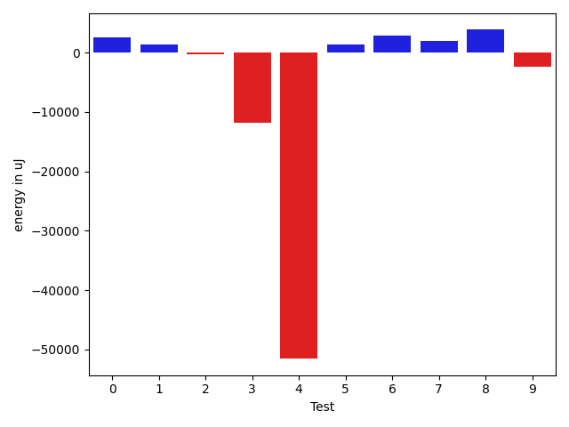
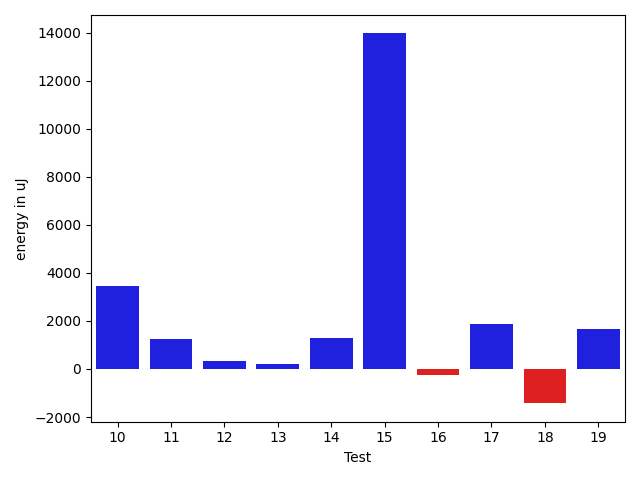
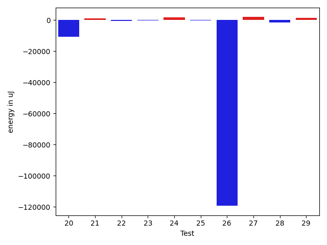
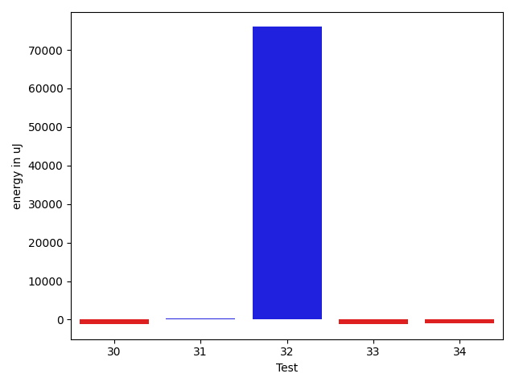

# gson 7b75ef

https://github.com/google/gson/commit/7b75ef

## Delta Energy per test method

| ID | EnergyV1 | EnergyV2 | DeltaEnergy | σV1 | σV2 |
| --- | --- | --- | --- | --- | --- |
| 0 | 39795 | 40405 | 610 | 15196.39991577548 | 16790.81501830875 |
| 1 | 38879 | 38940 | 61 | 10476.20266585672 | 12110.476010783232 |
| 2 | 34607 | 34668 | 61 | 3759.095226889607 | 3026.4159781421054 |
| 3 | 556822 | 521239 | -35583 | 121592.96121414598 | 87373.81903976564 |
| 4 | 42175 | 42541 | 366 | 448929.7057181144 | 367863.1119444927 |
| 5 | 39612 | 39306 | -306 | 3595.593346361167 | 4706.866704384086 |
| 6 | 38452 | 39062 | 610 | 12107.213723109222 | 15077.125850206236 |
| 7 | 39062 | 38696 | -366 | 19226.05068271086 | 20476.95592813784 |
| 8 | 37415 | 38452 | 1037 | 12729.276912339577 | 20044.98835533675 |
| 9 | 43640 | 53588 | 9948 | 57335.29049504126 | 28910.689173354524 |
| 10 | 37659 | 37841 | 182 | 9837.151586767242 | 12860.953236830208 |
| 11 | 36987 | 37415 | 428 | 4622.262215624535 | 5863.6471364236095 |
| 12 | 79162 | 75989 | -3173 | 344067.08395808464 | 355159.19694412575 |
| 13 | 39246 | 40466 | 1220 | 15140.020610473388 | 14120.321956137106 |
| 14 | 37171 | 36987 | -184 | 5400.634119671303 | 7953.590779944749 |
| 15 | 93322 | 93261 | -61 | 364747.6463121512 | 381056.01223522937 |
| 16 | 39368 | 38513 | -855 | 4871.126662114971 | 6407.446017623236 |
| 17 | 42481 | 43334 | 853 | 15321.58691448777 | 16173.11063408381 |
| 18 | 39490 | 36804 | -2686 | 5582.60982962396 | 5107.63774526537 |
| 19 | 37354 | 38574 | 1220 | 10479.789608053125 | 11871.526617170774 |
| 20 | 41137 | 40161 | -976 | 53286.85986930806 | 43486.536491825806 |
| 21 | 35583 | 37597 | 2014 | 4053.2278425814593 | 4306.374583100064 |
| 22 | 39002 | 37049 | -1953 | 4619.391371681785 | 7274.917976528491 |
| 23 | 37842 | 39490 | 1648 | 10670.516997612016 | 8803.819278424151 |
| 24 | 35522 | 37353 | 1831 | 4042.395051046408 | 4596.456030868181 |
| 25 | 37048 | 37048 | 0 | 4980.5763621701735 | 4103.92433823248 |
| 26 | 42175 | 40710 | -1465 | 459372.57181989437 | 232525.48206552115 |
| 27 | 37231 | 38514 | 1283 | 4568.522607721619 | 4738.850105789566 |
| 28 | 38635 | 35949 | -2686 | 4008.263644507126 | 3520.3885403250692 |
| 29 | 38268 | 38086 | -182 | 5221.845136019066 | 5960.237925937269 |
| 30 | 37414 | 35583 | -1831 | 3766.178104822099 | 3083.506020536494 |
| 31 | 37598 | 37354 | -244 | 3804.943065812158 | 4289.520228363635 |
| 32 | 145019 | 143372 | -1647 | 255178.07328299704 | 425199.22346947377 |
| 33 | 37415 | 37354 | -61 | 14251.862542995721 | 6622.619588615234 |
| 34 | 37964 | 37903 | -61 | 8868.966295389802 | 7587.0659518542125 |

## Delta Duration per test method

| ID | DurationV1 | DurationsV2 | DeltaDuration |
| --- | --- | --- | --- |
| 0 | 1527656.4042553192 | 1612060.3711340206 | 84403.96687870147 |
| 1 | 1303513.8472222222 | 1353409.394736842 | 49895.54751461977 |
| 2 | 829079.0697674418 | 754577.7567567568 | -74501.31301068503 |
| 3 | 16424609.141414141 | 16646902.878787879 | 222293.73737373762 |
| 4 | 6060902.602409638 | 4920451.697674419 | -1140450.9047352197 |
| 5 | 679536.8636363636 | 599801.2222222222 | -79735.6414141414 |
| 6 | 1436028.6666666667 | 1513031.2959183673 | 77002.6292517006 |
| 7 | 1510398.7916666667 | 1505354.6082474226 | -5044.183419244131 |
| 8 | 1464717.6701030927 | 1540307.1237113401 | 75589.45360824745 |
| 9 | 2083297.9387755103 | 1944128.7777777778 | -139169.16099773254 |
| 10 | 1387601.9270833333 | 1438191.2959183673 | 50589.36883503408 |
| 11 | 1070153.0 | 1026807.0793650794 | -43345.92063492059 |
| 12 | 4204202.454545454 | 4353634.525252526 | 149432.07070707157 |
| 13 | 1511908.6559139786 | 1445218.0 | -66690.65591397858 |
| 14 | 1202631.988095238 | 1230619.2857142857 | 27987.297619047575 |
| 15 | 5401757.303030303 | 5907027.343434343 | 505270.04040404037 |
| 16 | 1099732.5428571429 | 1116487.8493150685 | 16755.306457925588 |
| 17 | 1672911.8510638298 | 1738170.5257731958 | 65258.674709365936 |
| 18 | 1006664.6818181818 | 1118777.8727272728 | 112113.19090909103 |
| 19 | 1370241.2395833333 | 1398187.629213483 | 27946.389630149817 |
| 20 | 2197628.5 | 1773347.1714285715 | -424281.32857142854 |
| 21 | 823926.9047619047 | 877851.512195122 | 53924.60743321723 |
| 22 | 1075480.896551724 | 1124464.7391304348 | 48983.842578710755 |
| 23 | 1339749.121212121 | 1240426.9305555555 | -99322.1906565656 |
| 24 | 618850.9285714285 | 621499.2580645161 | 2648.3294930876 |
| 25 | 584750.5 | 589679.2962962963 | 4928.796296296292 |
| 26 | 6079142.06185567 | 2785900.8673469387 | -3293241.1945087314 |
| 27 | 621543.4848484849 | 556845.2608695652 | -64698.223978919676 |
| 28 | 657397.8928571428 | 618671.8461538461 | -38726.04670329671 |
| 29 | 877356.9375 | 941232.3409090909 | 63875.40340909094 |
| 30 | 620311.8275862068 | 629799.7619047619 | 9487.934318555053 |
| 31 | 652507.1052631579 | 628455.4642857143 | -24051.640977443545 |
| 32 | 5395679.393939394 | 7384766.262626262 | 1989086.8686868688 |
| 33 | 939913.5277777778 | 814235.8571428572 | -125677.67063492059 |
| 34 | 911229.0 | 872472.4411764706 | -38756.5588235294 |

## Misc.

| ID | Test Class | Test Method |
| --- | --- | --- |
| 0 | com.google.gson.functional.StreamingTypeAdaptersTest | testNullSafe |
| 1 | com.google.gson.functional.ReadersWritersTest | testReadWriteTwoObjects |
| 2 | com.google.gson.functional.DefaultTypeAdaptersTest | testBitSetDeserialization |
| 3 | com.google.gson.functional.DefaultTypeAdaptersTest | testNullSerialization |
| 4 | com.google.gson.JsonParserTest | testReadWriteTwoObjects |
| 5 | com.google.gson.JsonParserTest | testParseMixedArray |
| 6 | com.google.gson.functional.ParameterizedTypesTest | testVariableTypeArrayDeserialization |
| 7 | com.google.gson.functional.ParameterizedTypesTest | testVariableTypeDeserialization |
| 8 | com.google.gson.functional.ParameterizedTypesTest | testParameterizedTypeGenericArraysDeserialization |
| 9 | com.google.gson.functional.ParameterizedTypesTest | testVariableTypeFieldsAndGenericArraysDeserialization |
| 10 | com.google.gson.functional.ParameterizedTypesTest | testParameterizedTypeWithVariableTypeDeserialization |
| 11 | com.google.gson.functional.TypeVariableTest | testBasicTypeVariables |
| 12 | com.google.gson.functional.TypeVariableTest | testAdvancedTypeVariables |
| 13 | com.google.gson.functional.TypeVariableTest | testTypeVariablesViaTypeParameter |
| 14 | com.google.gson.functional.MapAsArrayTypeAdapterTest | testMultipleEnableComplexKeyRegistrationHasNoEffect |
| 15 | com.google.gson.functional.MapAsArrayTypeAdapterTest | testSerializeComplexMapWithTypeAdapter |
| 16 | com.google.gson.functional.CollectionTest | testFieldIsArrayList |
| 17 | com.google.gson.functional.CollectionTest | testWildcardCollectionField |
| 18 | com.google.gson.functional.UncategorizedTest | testGsonInstanceReusableForSerializationAndDeserialization |
| 19 | com.google.gson.functional.EscapingTest | testGsonAcceptsEscapedAndNonEscapedJsonDeserialization |
| 20 | com.google.gson.functional.EscapingTest | testEscapingObjectFields |
| 21 | com.google.gson.functional.EscapingTest | testGsonDoubleDeserialization |
| 22 | com.google.gson.functional.NamingPolicyTest | testComplexFieldNameStrategy |
| 23 | com.google.gson.functional.CustomTypeAdaptersTest | testRegisterHierarchyAdapterForDate |
| 24 | com.google.gson.functional.TypeAdapterPrecedenceTest | testNonstreamingHierarchicalFollowedByNonstreaming |
| 25 | com.google.gson.functional.TypeAdapterPrecedenceTest | testStreamingHierarchicalFollowedByNonstreamingHierarchical |
| 26 | com.google.gson.functional.TypeAdapterPrecedenceTest | testNonstreamingFollowedByNonstreaming |
| 27 | com.google.gson.functional.TypeAdapterPrecedenceTest | testStreamingFollowedByNonstreamingHierarchical |
| 28 | com.google.gson.functional.TypeAdapterPrecedenceTest | testSerializeNonstreamingTypeAdapterFollowedByStreamingTypeAdapter |
| 29 | com.google.gson.functional.TypeAdapterPrecedenceTest | testStreamingFollowedByStreaming |
| 30 | com.google.gson.functional.TypeAdapterPrecedenceTest | testStreamingFollowedByNonstreaming |
| 31 | com.google.gson.functional.TypeAdapterPrecedenceTest | testStreamingHierarchicalFollowedByNonstreaming |
| 32 | com.google.gson.functional.TypeHierarchyAdapterTest | testTypeHierarchy |
| 33 | com.google.gson.GsonTypeAdapterTest | testTypeAdapterProperlyConvertsTypes |
| 34 | com.google.gson.GsonTypeAdapterTest | testTypeAdapterThrowsException |

| Test | IterationV1 | IterationV2 | DeltaIteration |
| --- | --- | --- | --- |
| 0 | 94 | 97 | 3 |
| 1 | 72 | 76 | 4 |
| 2 | 43 | 37 | -6 |
| 3 | 99 | 99 | 0 |
| 4 | 83 | 86 | 3 |
| 5 | 22 | 27 | 5 |
| 6 | 96 | 98 | 2 |
| 7 | 96 | 97 | 1 |
| 8 | 97 | 97 | 0 |
| 9 | 98 | 99 | 1 |
| 10 | 96 | 98 | 2 |
| 11 | 64 | 63 | -1 |
| 12 | 99 | 99 | 0 |
| 13 | 93 | 97 | 4 |
| 14 | 84 | 77 | -7 |
| 15 | 99 | 99 | 0 |
| 16 | 70 | 73 | 3 |
| 17 | 94 | 97 | 3 |
| 18 | 44 | 55 | 11 |
| 19 | 96 | 89 | -7 |
| 20 | 58 | 70 | 12 |
| 21 | 42 | 41 | -1 |
| 22 | 58 | 69 | 11 |
| 23 | 66 | 72 | 6 |
| 24 | 28 | 31 | 3 |
| 25 | 26 | 27 | 1 |
| 26 | 97 | 98 | 1 |
| 27 | 33 | 23 | -10 |
| 28 | 28 | 26 | -2 |
| 29 | 48 | 44 | -4 |
| 30 | 29 | 21 | -8 |
| 31 | 19 | 28 | 9 |
| 32 | 99 | 99 | 0 |
| 33 | 36 | 35 | -1 |
| 34 | 22 | 34 | 12 |

| Time Label | Time (s) |
| --- | --- |
| Selection | 27.430877923965454 |
| Injection | 12.937477350234985 |
| Total | 1138.385481595993 |

