# gson dd86d6

https://github.com/google/gson/commit/dd86d6

## Delta Energy per test method

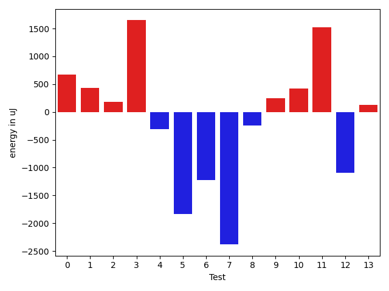

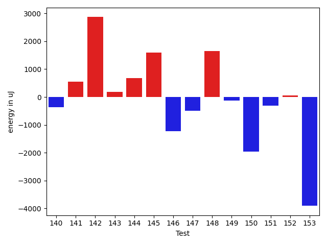

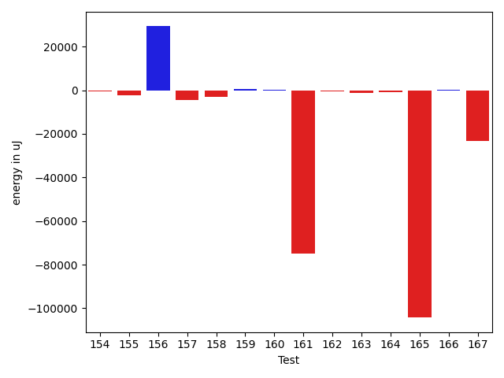

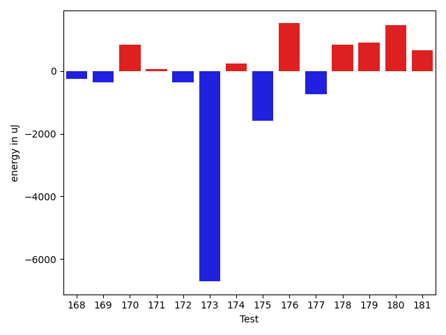

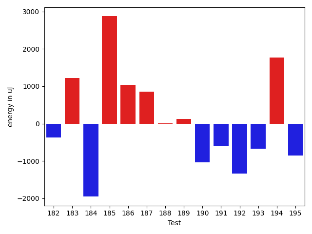

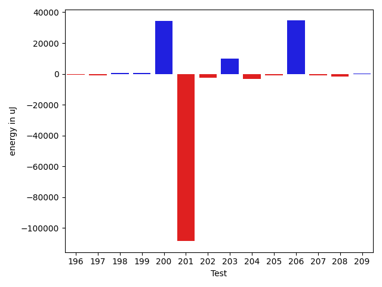

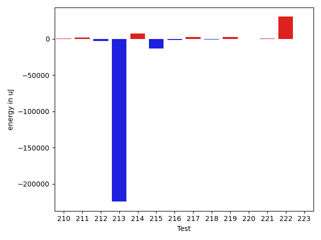

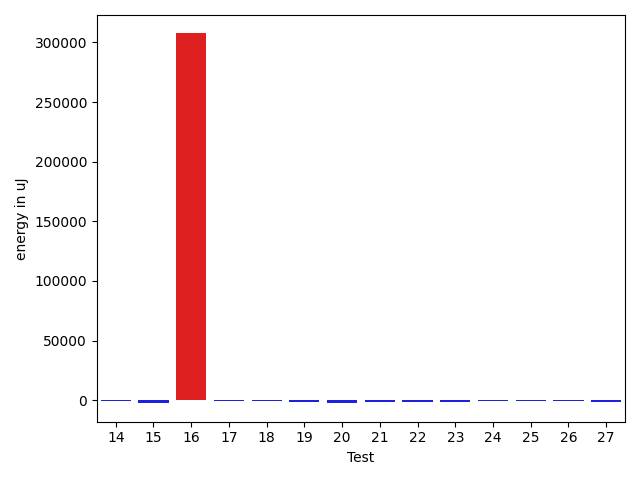

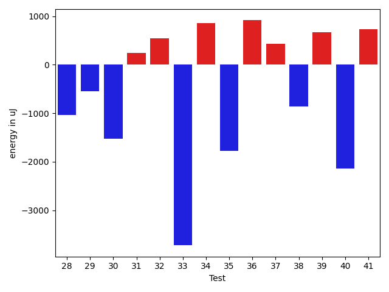

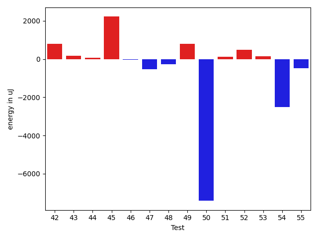

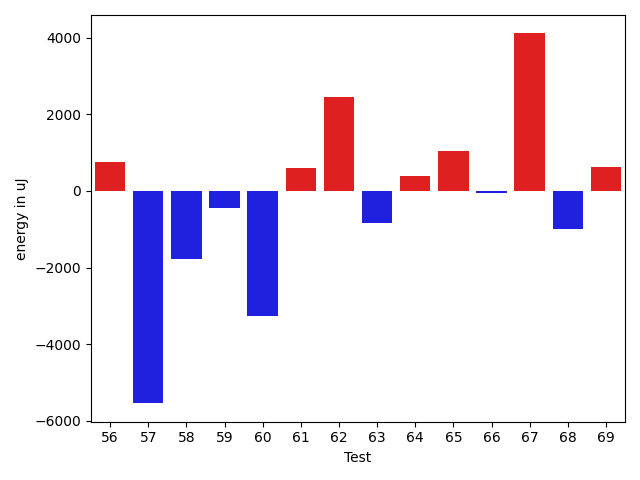

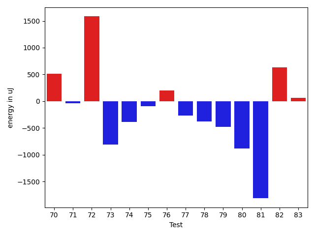

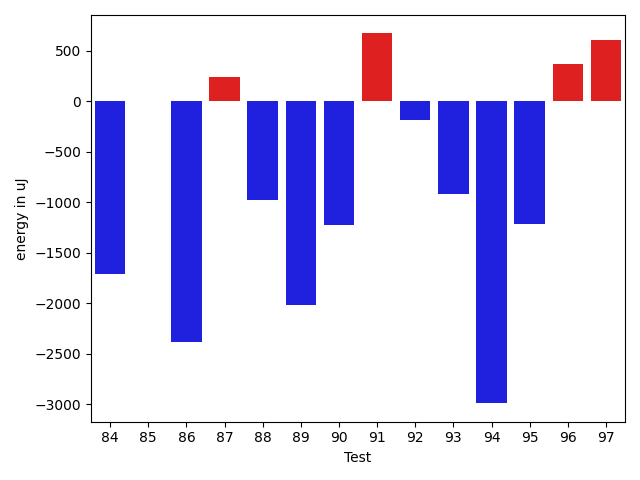

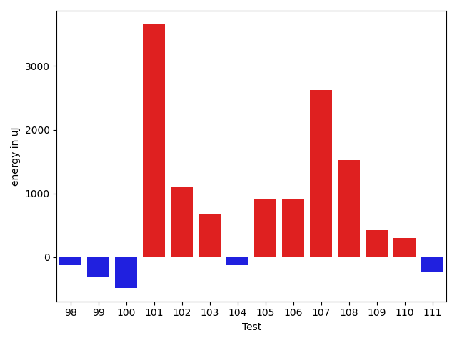

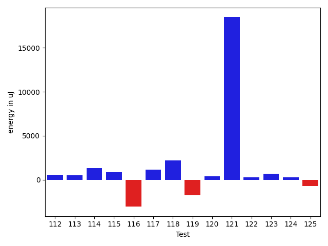

| ID | EnergyV1 | EnergyV2 | DeltaEnergy | σ |
| --- | --- | --- | --- | --- |
| 0 | 40884.72619047619 | 40292.16049382716 | -592.5656966490278 | 11128.472758511525 | 7893.593153657992 |
| 1 | 38992.470588235294 | 40019.416666666664 | 1026.9460784313706 | 6049.002167277111 | 10415.062416132916 |
| 2 | 38416.9 | 37417.71052631579 | -999.189473684215 | 4308.297081214339 | 4094.736826630361 |
| 3 | 37504.333333333336 | 38687.42857142857 | 1183.0952380952367 | 4162.714743018795 | 3649.092180926368 |
| 4 | 52371.32432432433 | 46307.2 | -6064.12432432433 | 33000.088755043675 | 28436.0156924278 |
| 5 | 43079.18918918919 | 42035.6 | -1043.589189189188 | 11825.382493871799 | 13244.200063639717 |
| 6 | 158341.40404040404 | 125082.95959595959 | -33258.44444444445 | 280526.669555314 | 163012.62533622503 |
| 7 | 37214.444444444445 | 36810.72222222222 | -403.72222222222626 | 4405.651575246179 | 2593.346182606461 |
| 8 | 36681.95 | 36617.77777777778 | -64.17222222221608 | 4880.388934039991 | 3902.328344228973 |
| 9 | 37541.175 | 37642.57894736842 | 101.403947368417 | 7359.844610749265 | 3896.255716991425 |
| 10 | 37023.06896551724 | 37819.07407407407 | 796.0051085568339 | 4319.71882810264 | 3911.315312780921 |
| 11 | 36002.8064516129 | 37342.67647058824 | 1339.8700189753363 | 4475.446428763567 | 4511.945105009904 |
| 12 | 36307.34482758621 | 35290.958333333336 | -1016.3864942528744 | 3993.0198344530313 | 3430.957804549223 |
| 13 | 35911.114285714284 | 34501.0 | -1410.114285714284 | 4005.914340225523 | 2192.5505543392455 |
| 14 | 35490.93548387097 | 35070.73333333333 | -420.2021505376397 | 2505.0414835980955 | 3164.9055481781584 |
| 15 | 113813.0 | 110109.0202020202 | -3703.9797979798022 | 19024.549736239926 | 18610.930824142193 |
| 16 | 307369.82828282827 | 342099.89898989897 | 34730.0707070707 | 235530.11616300454 | 245566.85537814963 |
| 17 | 36040.59016393442 | 34953.7 | -1086.8901639344258 | 4330.221814547372 | 3044.341725781344 |
| 18 | 38585.90909090909 | 38959.26666666667 | 373.3575757575818 | 10986.707283055908 | 10935.89102583273 |
| 19 | 35910.75862068965 | 34967.296875 | -943.4617456896522 | 3468.3553506363437 | 5154.78707634857 |
| 20 | 36585.0 | 35491.75 | -1093.25 | 3962.7647755912367 | 3227.4544353010538 |
| 21 | 48849.10344827586 | 47627.375 | -1221.7284482758623 | 16828.89922710915 | 15838.426236233983 |
| 22 | 38748.65217391304 | 37955.479166666664 | -793.1730072463761 | 9173.886224821712 | 10188.66422997797 |
| 23 | 37096.119047619046 | 34850.97142857143 | -2245.147619047617 | 3546.7296955712195 | 3520.149667968389 |
| 24 | 35472.95238095238 | 35803.69565217391 | 330.74327122153045 | 3664.438714587887 | 2994.8765298608773 |
| 25 | 36541.391304347824 | 35391.065217391304 | -1150.3260869565202 | 3369.1223826821138 | 3851.396739310659 |
| 26 | 36482.085106382976 | 35634.732142857145 | -847.352963525831 | 3861.5364147083483 | 3627.8589095413104 |
| 27 | 35404.290322580644 | 33951.333333333336 | -1452.9569892473082 | 3310.578618109007 | 3229.6871537520647 |
| 28 | 37066.69565217391 | 36246.944444444445 | -819.7512077294668 | 3556.0737745413976 | 4108.548326205429 |
| 29 | 35746.4 | 35117.875 | -628.5250000000015 | 2335.937008283114 | 3187.7120101061514 |
| 30 | 37643.166666666664 | 36218.13333333333 | -1425.0333333333328 | 3310.563668856945 | 3376.428959056529 |
| 31 | 35694.64705882353 | 35075.26470588235 | -619.382352941182 | 3197.5381511990913 | 2892.5524888096725 |
| 32 | 36591.5 | 36828.45714285714 | 236.95714285714348 | 6293.483811318921 | 7203.978314962433 |
| 33 | 36504.40909090909 | 34794.1724137931 | -1710.2366771159868 | 4033.019866270873 | 3133.0591976199125 |
| 34 | 34244.8 | 34652.5 | 407.6999999999971 | 3091.759611181525 | 2558.4511427815073 |
| 35 | 36523.5 | 35220.666666666664 | -1302.8333333333358 | 3479.202976257637 | 3380.861017880242 |
| 36 | 36162.16 | 36941.458333333336 | 779.2983333333323 | 4532.524168098831 | 4433.144284620555 |
| 37 | 36324.756097560974 | 36975.708333333336 | 650.9522357723617 | 3788.5654456051766 | 3334.6850111013314 |
| 38 | 47182.137931034486 | 45966.771929824565 | -1215.3660012099208 | 20043.35463907855 | 20730.02441330097 |
| 39 | 36350.49056603773 | 36295.056603773584 | -55.43396226414916 | 4245.965457349522 | 4252.036104565889 |
| 40 | 82679.61616161616 | 82212.9494949495 | -466.66666666665697 | 18335.504053147026 | 21490.612250385962 |
| 41 | 48680.3 | 46288.57142857143 | -2391.7285714285754 | 28439.296108202117 | 27003.948420857392 |
| 42 | 36315.807692307695 | 37113.0 | 797.1923076923049 | 4033.8351289601737 | 4915.958999254666 |
| 43 | 36514.82608695652 | 36693.0 | 178.17391304347984 | 3979.5514384052985 | 3784.135390777886 |
| 44 | 36396.377358490565 | 36473.11538461538 | 76.73802612481813 | 3853.730754155653 | 3744.910981040425 |
| 45 | 35687.24324324324 | 37905.391304347824 | 2218.1480611045845 | 3742.6242737344387 | 4094.1164544420426 |
| 46 | 44139.126582278484 | 44113.76315789474 | -25.36342438374413 | 16964.757288490593 | 17261.179484054614 |
| 47 | 37588.35849056604 | 37063.5 | -524.8584905660391 | 4342.129909906357 | 4003.664903446704 |
| 48 | 36633.87719298246 | 36351.15625 | -282.7209429824579 | 3948.987207800828 | 3757.4283851240516 |
| 49 | 36224.22727272727 | 37026.95 | 802.722727272725 | 3160.8558094837394 | 4041.732765473245 |
| 50 | 128338.63235294117 | 120925.1 | -7413.532352941169 | 279506.5336328265 | 281362.6632168703 |
| 51 | 46155.229166666664 | 46278.901960784315 | 123.67279411765048 | 16030.054276056462 | 19895.430685633797 |
| 52 | 36176.31428571429 | 36671.17857142857 | 494.86428571428405 | 4548.590756778748 | 4230.761110634244 |
| 53 | 36737.754385964916 | 36883.15909090909 | 145.4047049441724 | 9101.717760142192 | 3465.4589879866353 |
| 54 | 41093.34782608696 | 38576.1129032258 | -2517.2349228611565 | 12298.532735421506 | 7698.214342813405 |
| 55 | 47115.316326530614 | 46637.14736842105 | -478.1689581095634 | 18736.15342473048 | 15978.571668574017 |
| 56 | 37263.0 | 38026.15217391304 | 763.1521739130403 | 3843.3169476378084 | 4592.189645225104 |
| 57 | 64025.681318681316 | 58480.032258064515 | -5545.649060616801 | 48863.42356420522 | 37762.18259207536 |
| 58 | 42732.0 | 40953.18 | -1778.8199999999997 | 14684.732980267445 | 11061.908131403008 |
| 59 | 42708.67741935484 | 42267.27868852459 | -441.39873083025304 | 16475.731490711 | 13295.63038922649 |
| 60 | 40162.09090909091 | 36908.8679245283 | -3253.2229845626134 | 6826.9588444975125 | 3883.946184447996 |
| 61 | 35675.857142857145 | 36268.2962962963 | 592.4391534391543 | 5109.65185363016 | 3457.612126296443 |
| 62 | 45751.08823529412 | 48197.93548387097 | 2446.8472485768507 | 19439.25941364635 | 19616.07512933483 |
| 63 | 36604.78947368421 | 35761.25 | -843.5394736842136 | 4198.93531090351 | 4601.0149265316095 |
| 64 | 36310.09523809524 | 36700.88461538462 | 390.78937728938035 | 4949.122018382095 | 3847.7455969689677 |
| 65 | 65684.17307692308 | 66731.64583333333 | 1047.4727564102504 | 39121.3905686868 | 35575.876784398904 |
| 66 | 36362.380952380954 | 36321.71428571428 | -40.66666666667152 | 3522.810153653587 | 3790.7504363579915 |
| 67 | 53197.59090909091 | 57313.31707317073 | 4115.726164079817 | 20924.5496283869 | 25323.381573441147 |
| 68 | 37542.181818181816 | 36539.72222222222 | -1002.4595959595972 | 4041.4353169990986 | 4098.117708921114 |
| 69 | 36706.142857142855 | 37334.782608695656 | 628.6397515528006 | 4006.6781548727736 | 4299.156974555763 |
| 70 | 36428.77777777778 | 36938.57142857143 | 509.7936507936465 | 3776.9783958171033 | 6868.335032775336 |
| 71 | 35776.77777777778 | 35737.42857142857 | -39.34920634920854 | 3813.7289939777015 | 2736.6958452959043 |
| 72 | 35419.38461538462 | 37002.4 | 1583.0153846153844 | 4326.042827386098 | 4987.58722630492 |
| 73 | 38017.58823529412 | 37209.181818181816 | -808.4064171123027 | 3188.8351931815723 | 2575.9905709236596 |
| 74 | 36749.833333333336 | 36363.38888888889 | -386.44444444444525 | 3295.6555957131745 | 3618.9890874983444 |
| 75 | 36055.73684210526 | 35959.833333333336 | -95.90350877192395 | 3567.825267761054 | 3587.9122024127378 |
| 76 | 36804.16129032258 | 37008.4 | 204.23870967741823 | 3377.6516569831347 | 3306.6784452075162 |
| 77 | 38164.357142857145 | 37899.17647058824 | -265.1806722689071 | 3441.916961875894 | 2319.915192042566 |
| 78 | 36916.2 | 36534.47368421053 | -381.7263157894704 | 4294.350335033228 | 3539.0644819220543 |
| 79 | 37368.5 | 36890.294117647056 | -478.2058823529442 | 4300.674917963458 | 3758.9487698918274 |
| 80 | 36132.73333333333 | 35253.86666666667 | -878.8666666666613 | 3076.3625375144297 | 3673.6633463373073 |
| 81 | 38055.166666666664 | 36243.375 | -1811.7916666666642 | 3784.8483420372636 | 3414.2868925113776 |
| 82 | 36991.26666666667 | 37620.375 | 629.1083333333299 | 4006.902152813595 | 4933.188039632688 |
| 83 | 37374.882352941175 | 37441.555555555555 | 66.67320261437999 | 4524.551480954353 | 4103.647486244161 |
| 84 | 37708.63636363636 | 35430.9 | -2277.736363636359 | 4086.0988012067382 | 4441.319386173438 |
| 85 | 36898.85 | 36359.72222222222 | -539.1277777777796 | 3203.7832990856296 | 4441.750215668938 |
| 86 | 37856.0 | 35484.619047619046 | -2371.380952380954 | 2170.6641976186756 | 3365.0172924793133 |
| 87 | 35978.857142857145 | 35939.88 | -38.977142857147555 | 3444.650556410957 | 4096.089416211517 |
| 88 | 37271.88888888889 | 36161.470588235294 | -1110.4183006535968 | 5023.63514785513 | 4201.903925850295 |
| 89 | 36083.0625 | 34854.0 | -1229.0625 | 3122.5398610095835 | 3926.8781748355777 |
| 90 | 36703.92857142857 | 35627.818181818184 | -1076.1103896103887 | 2683.0170241802075 | 3608.2850451346203 |
| 91 | 36950.6 | 37858.64 | 908.0400000000009 | 3667.419306996861 | 4280.002690466444 |
| 92 | 37654.357142857145 | 37673.75 | 19.392857142855064 | 3665.041192657669 | 3874.2205909705244 |
| 93 | 36766.53846153846 | 36705.53846153846 | -61.0 | 3727.3382256673076 | 4510.833772756849 |
| 94 | 36688.1 | 36499.05882352941 | -189.04117647058592 | 2536.1231614414946 | 4380.43962970396 |
| 95 | 36849.875 | 36773.57142857143 | -76.30357142857247 | 3981.837968749482 | 3283.803885615533 |
| 96 | 37221.12962962963 | 37591.27118644068 | 370.1415568110533 | 4310.292986717296 | 3927.12551464985 |
| 97 | 42279.43636363636 | 40998.724137931036 | -1280.712225705327 | 17156.179197185786 | 13397.808687003828 |
| 98 | 45033.666666666664 | 41951.08536585366 | -3082.5813008130062 | 16463.15199333212 | 11874.647482522421 |
| 99 | 37836.181818181816 | 37088.08163265306 | -748.1001855287541 | 4071.382975179136 | 4352.780232039995 |
| 100 | 59488.35849056604 | 50358.95 | -9129.408490566042 | 39197.73458129241 | 29474.574118735505 |
| 101 | 36059.95238095238 | 37800.22727272727 | 1740.2748917748904 | 4418.512036509581 | 3808.879385806255 |
| 102 | 76510.84090909091 | 88353.43478260869 | 11842.593873517777 | 204441.25624585606 | 229368.72822058448 |
| 103 | 38000.32 | 37430.30434782609 | -570.0156521739118 | 4084.013709281593 | 4059.12262349757 |
| 104 | 36534.96296296296 | 36885.333333333336 | 350.37037037037226 | 3040.104316941693 | 4957.009577916464 |
| 105 | 36996.3 | 36585.5 | -410.8000000000029 | 3912.409169552694 | 4796.9429674880785 |
| 106 | 37838.931818181816 | 37146.02222222222 | -692.9095959595943 | 5826.368592238563 | 4437.47393351412 |
| 107 | 36336.083333333336 | 37804.22222222222 | 1468.1388888888832 | 3486.7083440386705 | 3338.327850811866 |
| 108 | 35446.94117647059 | 35295.055555555555 | -151.88562091503263 | 3596.6238984814668 | 4151.200087153142 |
| 109 | 37030.75 | 37640.06060606061 | 609.3106060606078 | 4135.259938495834 | 4779.662153265354 |
| 110 | 36008.125 | 37237.82456140351 | 1229.6995614035113 | 4277.586179849761 | 5304.898812212894 |
| 111 | 37654.32142857143 | 38574.142857142855 | 919.8214285714275 | 4433.756566337492 | 4681.4490317352265 |
| 112 | 40113.391304347824 | 40649.333333333336 | 535.9420289855116 | 14818.067654751543 | 10581.333102318546 |
| 113 | 36929.145161290326 | 37450.64406779661 | 521.4989065062837 | 3850.2844379502335 | 4545.991229989645 |
| 114 | 36199.756097560974 | 37543.085106382976 | 1343.329008822002 | 4980.889272058916 | 6664.089974200998 |
| 115 | 37393.244897959186 | 38261.270833333336 | 868.0259353741494 | 4696.818973585979 | 3888.7003331210763 |
| 116 | 48742.925531914894 | 45668.979797979795 | -3073.9457339350993 | 21501.030054117673 | 17219.524589561148 |
| 117 | 36956.705882352944 | 38111.692307692305 | 1154.9864253393607 | 4055.4794416603945 | 3422.1720921663723 |
| 118 | 35786.875 | 37961.25 | 2174.375 | 4024.9755104068645 | 4834.641491793023 |
| 119 | 46882.04 | 45087.42857142857 | -1794.6114285714284 | 30622.83402623604 | 26874.344137417123 |
| 120 | 36975.04 | 37341.692307692305 | 366.652307692304 | 4181.6181124536 | 4386.65305013384 |
| 121 | 108345.92857142857 | 126845.85 | 18499.92142857144 | 253423.8161399269 | 258412.39212821724 |
| 122 | 36439.67647058824 | 36698.93103448276 | 259.254563894523 | 3958.3569654487906 | 3633.7599025976547 |
| 123 | 43050.22222222222 | 43743.65217391304 | 693.4299516908213 | 17611.126939004454 | 19079.816159010174 |
| 124 | 37327.875 | 37573.066666666666 | 245.1916666666657 | 4617.765290272088 | 3796.9155282793536 |
| 125 | 38755.035294117646 | 38034.98611111111 | -720.0491830065366 | 5959.459654635218 | 6531.902388986806 |
| 126 | 39176.13725490196 | 39622.87755102041 | 446.7402961184489 | 5470.856992836045 | 7362.138472140105 |
| 127 | 37424.913043478264 | 37174.333333333336 | -250.57971014492796 | 3052.439151735421 | 2871.55383411529 |
| 128 | 36009.26666666667 | 37293.85 | 1284.5833333333285 | 4812.717049189112 | 3886.9055465112606 |
| 129 | 250718.8686868687 | 195718.88888888888 | -54999.97979797982 | 327118.3465768693 | 193026.70619435073 |
| 130 | 37789.913043478264 | 37661.89473684211 | -128.01830663615692 | 4529.785890064769 | 4532.17241269497 |
| 131 | 59078.87804878049 | 53068.969696969696 | -6009.908351810795 | 47362.88001460438 | 35686.95808927609 |
| 132 | 38312.489795918365 | 38031.82692307692 | -280.66287284144346 | 7055.479460189873 | 3295.1468317999584 |
| 133 | 36898.06349206349 | 37786.333333333336 | 888.2698412698446 | 5030.349525149829 | 6142.1220756830135 |
| 134 | 50723.179487179485 | 43200.916666666664 | -7522.26282051282 | 29111.14883521854 | 19260.30593730565 |
| 135 | 37080.625 | 37557.58620689655 | 476.9612068965507 | 4702.418671213251 | 3936.475690672816 |
| 136 | 37730.53846153846 | 38526.583333333336 | 796.0448717948748 | 4022.4101643880117 | 3823.2145315384364 |
| 137 | 37399.25 | 36597.857142857145 | -801.3928571428551 | 5008.410282964046 | 4323.243582639074 |
| 138 | 37247.55882352941 | 37376.08571428571 | 128.52689075630042 | 3168.0190896555764 | 3812.3852478949902 |
| 139 | 111498.98684210527 | 99135.13580246913 | -12363.851039636138 | 195265.4227914764 | 149721.90993212146 |
| 140 | 36571.375 | 35612.93939393939 | -958.4356060606078 | 4963.532453996347 | 3925.3874152704047 |
| 141 | 36385.47368421053 | 37321.1320754717 | 935.658391261175 | 3943.5835164304385 | 3919.1554829500196 |
| 142 | 36694.75 | 38220.892857142855 | 1526.142857142855 | 3391.4641288829816 | 3356.6164015406694 |
| 143 | 36937.179487179485 | 37302.885714285716 | 365.7062271062314 | 3883.662670342923 | 3421.21138755958 |
| 144 | 36265.90909090909 | 37802.7 | 1536.7909090909088 | 3272.92986494157 | 7361.1540080343375 |
| 145 | 43167.35897435898 | 46736.9 | 3569.541025641025 | 21902.085791654266 | 26630.74172098855 |
| 146 | 36970.36111111111 | 36339.48387096774 | -630.8772401433671 | 4525.340970289039 | 3601.895234733781 |
| 147 | 43003.13333333333 | 43624.75 | 621.6166666666686 | 17082.41755086856 | 22957.742006666136 |
| 148 | 35628.78431372549 | 36684.40740740741 | 1055.6230936819193 | 3836.1212401546572 | 3827.9111822512796 |
| 149 | 37454.1746031746 | 36647.942307692305 | -806.2322954822957 | 5090.7809845843685 | 3724.4684412340675 |
| 150 | 37556.75 | 36725.666666666664 | -831.0833333333358 | 4006.9025677572945 | 4378.829701593287 |
| 151 | 38093.30303030303 | 37438.57575757576 | -654.7272727272721 | 3558.836092378386 | 3033.7702119320516 |
| 152 | 96815.51351351352 | 57120.0 | -39695.51351351352 | 267913.3041096551 | 126080.08386811327 |
| 153 | 39556.42857142857 | 36750.75 | -2805.6785714285725 | 4076.778590194639 | 2569.8382609611836 |
| 154 | 38366.1875 | 37984.862068965514 | -381.3254310344855 | 4099.938226954615 | 4310.861132663978 |
| 155 | 39328.82692307692 | 36897.74137931035 | -2431.085543766574 | 5835.266679428147 | 3614.428950748913 |
| 156 | 81082.75757575757 | 110396.34343434343 | 29313.585858585866 | 148950.70357136914 | 243189.27659282315 |
| 157 | 44444.590361445786 | 39980.77906976744 | -4463.811291678343 | 13439.865800961665 | 9851.67727001779 |
| 158 | 44935.90243902439 | 41956.582278481015 | -2979.3201605433715 | 20171.504289654626 | 14233.857160339627 |
| 159 | 38151.77419354839 | 38893.80952380953 | 742.0353302611402 | 6012.114174916946 | 5424.405220433375 |
| 160 | 39673.617647058825 | 39794.74025974026 | 121.1226126814363 | 9599.605210983804 | 9265.243123649114 |
| 161 | 212773.52525252526 | 137964.30303030304 | -74809.22222222222 | 449750.0917211004 | 264794.85984808835 |
| 162 | 56226.262295081964 | 55765.6 | -460.66229508196557 | 28367.037122539412 | 27568.114901820907 |
| 163 | 40572.38961038961 | 39339.08 | -1233.3096103896096 | 9288.586561783026 | 5308.219148352235 |
| 164 | 38358.89473684211 | 37613.32258064516 | -745.5721561969476 | 4476.726975142922 | 4519.741402730319 |
| 165 | 219064.0625 | 114772.67647058824 | -104291.38602941176 | 424324.10086784913 | 312726.08657217625 |
| 166 | 42082.91111111111 | 42148.294117647056 | 65.38300653594342 | 10481.628467248402 | 12203.831822374026 |
| 167 | 154486.3015873016 | 131257.97101449277 | -23228.33057280883 | 376022.17753886245 | 316522.07918270736 |
| 168 | 46421.34482758621 | 48456.8064516129 | 2035.4616240266914 | 23399.594538597226 | 24597.09021332684 |
| 169 | 38745.95918367347 | 37793.4375 | -952.5216836734689 | 5972.709513873041 | 3868.1111610742373 |
| 170 | 45746.67676767677 | 50462.35353535353 | 4715.676767676763 | 16220.094739244476 | 19325.101216724037 |
| 171 | 36314.166666666664 | 36757.63043478261 | 443.4637681159438 | 4358.500082852153 | 3923.185193063632 |
| 172 | 37133.217391304344 | 37924.75 | 791.5326086956557 | 3982.123548151291 | 4400.068158405175 |
| 173 | 163342.98850574714 | 117115.5 | -46227.48850574714 | 324355.2216568393 | 273103.46698735055 |
| 174 | 37523.791666666664 | 38294.9 | 771.1083333333372 | 3964.152993591093 | 3276.057461339773 |
| 175 | 36870.857142857145 | 36526.354838709674 | -344.50230414747057 | 4374.55803792919 | 5123.415119526498 |
| 176 | 36222.0 | 37516.96428571428 | 1294.9642857142826 | 3894.4901907892704 | 3517.113441873919 |
| 177 | 63070.45348837209 | 63388.782608695656 | 318.329120323564 | 43853.01426559034 | 49322.581784267786 |
| 178 | 46987.45070422535 | 47928.14864864865 | 940.6979444232929 | 24175.467450387656 | 24634.365977766753 |
| 179 | 41641.51612903226 | 49879.194444444445 | 8237.678315412188 | 13366.382001054997 | 32243.98961031295 |
| 180 | 37475.57142857143 | 38102.63636363636 | 627.0649350649328 | 3805.393741863284 | 4338.223416702181 |
| 181 | 35972.416666666664 | 36280.5 | 308.08333333333576 | 3371.9122531666735 | 4697.662088332221 |
| 182 | 39575.8431372549 | 39221.75925925926 | -354.08387799563934 | 8105.241439890825 | 7006.705285693299 |
| 183 | 37349.666666666664 | 38434.84375 | 1085.1770833333358 | 3977.4191850667908 | 3855.8152843252146 |
| 184 | 38548.708333333336 | 37524.67741935484 | -1024.030913978495 | 3548.741531387884 | 4313.160665706738 |
| 185 | 104263.46153846153 | 193964.27027027027 | 89700.80873180873 | 281410.24070506816 | 434435.46461851534 |
| 186 | 35982.86363636364 | 39883.0 | 3900.1363636363603 | 4892.344467685802 | 16180.752506192865 |
| 187 | 36849.10526315789 | 83992.04347826086 | 47142.93821510297 | 3623.92913975595 | 215592.68195119972 |
| 188 | 101805.5294117647 | 142836.05357142858 | 41030.52415966388 | 248599.7535990018 | 356626.925969684 |
| 189 | 39988.256097560974 | 40874.553846153845 | 886.2977485928714 | 6748.835243338744 | 9004.017071081737 |
| 190 | 57709.39473684211 | 58802.07792207792 | 1092.6831852358155 | 52138.48967844625 | 65619.35178944284 |
| 191 | 38605.01234567901 | 38869.67469879518 | 264.66235311616765 | 8046.113498574721 | 8400.358147999466 |
| 192 | 37067.23376623377 | 36359.015384615384 | -708.2183816183824 | 6229.855577521995 | 4369.492910175162 |
| 193 | 44910.765957446805 | 43538.09090909091 | -1372.6750483558935 | 16496.5618477393 | 18159.568658921915 |
| 194 | 95325.54929577465 | 122499.0579710145 | 27173.50867523985 | 234530.87594064669 | 286963.2822568417 |
| 195 | 37643.42857142857 | 37520.93023255814 | -122.49833887043496 | 4161.998562062732 | 5527.9389127449185 |
| 196 | 37980.92 | 37273.1568627451 | -707.7631372549004 | 4334.359905868455 | 4191.957137431244 |
| 197 | 38514.885714285716 | 37491.1282051282 | -1023.7575091575127 | 4484.4001208725385 | 4279.748567857259 |
| 198 | 38377.05714285714 | 38919.31034482759 | 542.2532019704449 | 4058.964969706701 | 5118.179081527202 |
| 199 | 37055.44 | 37778.53571428572 | 723.0957142857151 | 3020.3589466154517 | 4359.323608101728 |
| 200 | 70697.78947368421 | 105206.97142857143 | 34509.181954887215 | 37155.22602553119 | 166647.15934306674 |
| 201 | 213220.09375 | 104630.51515151515 | -108589.57859848485 | 459621.6613957043 | 246740.44361527337 |
| 202 | 51090.58620689655 | 48766.9 | -2323.6862068965493 | 34564.84341012854 | 29546.768628001722 |
| 203 | 38378.86666666667 | 48403.89473684211 | 10025.028070175438 | 13534.984085037637 | 42772.49472056194 |
| 204 | 66640.34343434343 | 63527.0505050505 | -3113.292929292933 | 26148.769029937965 | 27852.02696806414 |
| 205 | 39123.38181818182 | 38136.818181818184 | -986.5636363636368 | 4431.765625944788 | 4377.122965813416 |
| 206 | 110144.74747474748 | 144886.59595959596 | 34741.84848484848 | 42255.1821079573 | 211770.50921554802 |
| 207 | 38616.767441860466 | 37480.80434782609 | -1135.9630940343777 | 3376.297757984013 | 4488.402958056924 |
| 208 | 38657.27272727273 | 37017.92857142857 | -1639.3441558441555 | 3683.6849408984003 | 2202.294370627587 |
| 209 | 39353.294117647056 | 39548.086956521736 | 194.79283887468046 | 5848.989915459067 | 5564.978689853674 |
| 210 | 39798.0 | 40341.1 | 543.0999999999985 | 3053.2346609353235 | 3890.7940564876985 |
| 211 | 36481.76 | 38717.114285714284 | 2235.354285714282 | 3566.3016729379465 | 3885.1193382768906 |
| 212 | 43006.279411764706 | 39874.73529411765 | -3131.544117647056 | 12628.812007894985 | 8106.792704845891 |
| 213 | 262922.6 | 38322.82352941176 | -224599.77647058823 | 449908.95789434254 | 4207.372398334844 |
| 214 | 201929.71717171717 | 209716.2323232323 | 7786.515151515137 | 78634.55857306388 | 79006.67320502634 |
| 215 | 103152.73134328358 | 89665.59154929577 | -13487.139793987808 | 266856.116340577 | 233331.53366507308 |
| 216 | 42323.37142857143 | 40627.217391304344 | -1696.154037267086 | 9753.085318680924 | 9680.731965482959 |
| 217 | 40956.217391304344 | 43961.857142857145 | 3005.6397515528006 | 13429.223016868811 | 16415.516494609194 |
| 218 | 37413.13953488372 | 36844.75 | -568.3895348837177 | 3630.462188408006 | 3117.7911953015714 |
| 219 | 37445.0 | 40283.181818181816 | 2838.181818181816 | 3809.402746588274 | 3223.7376900447216 |
| 220 | 39733.75 | 39768.1875 | 34.4375 | 4293.207913378992 | 2898.683585240678 |
| 221 | 39153.95 | 39503.22222222222 | 349.2722222222219 | 4488.269304253033 | 10988.369055786798 |
| 222 | 130577.73913043478 | 161206.31578947368 | 30628.576659038896 | 298189.31319231726 | 358662.3077128405 |
| 223 | 38136.23529411765 | 37982.724137931036 | -153.51115618661424 | 5727.492527321099 | 4273.023381687941 |

## Delta Duration per test method

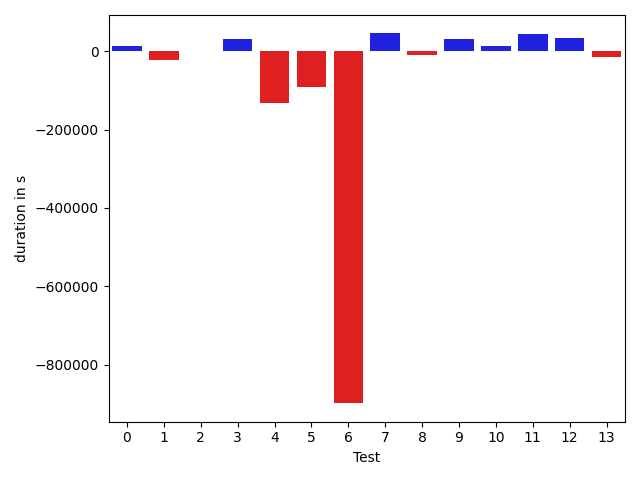

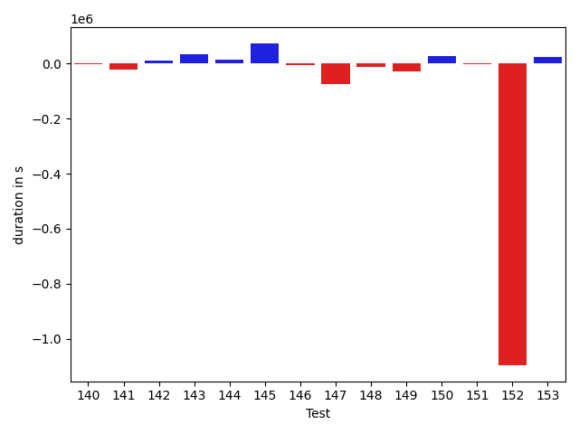

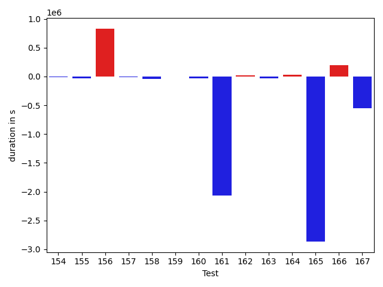

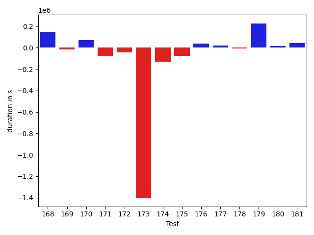

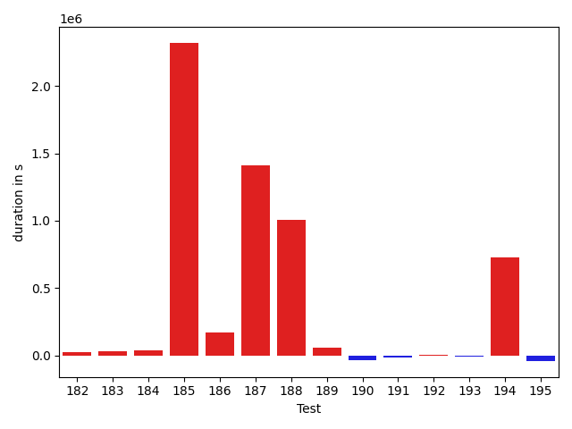

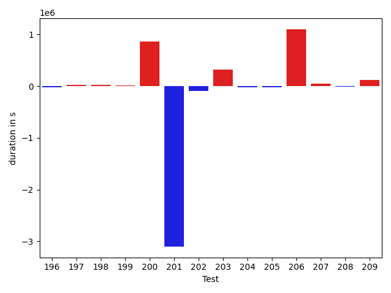

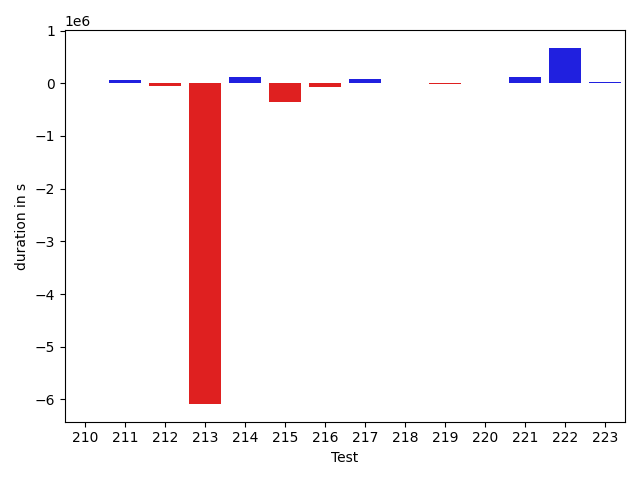

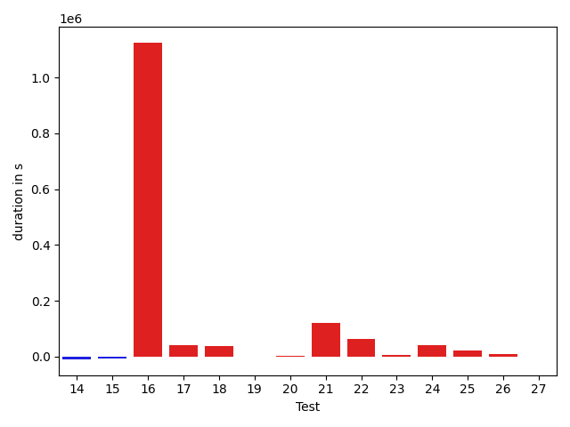

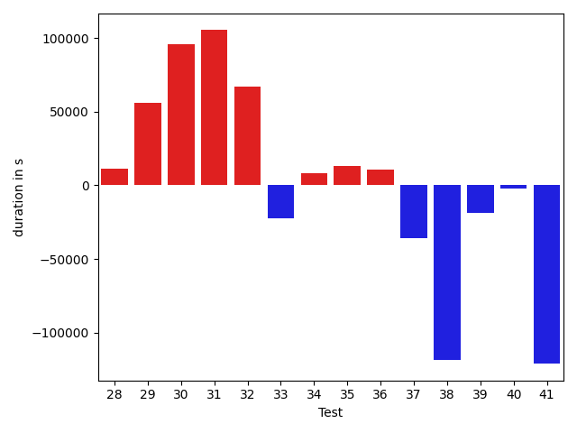

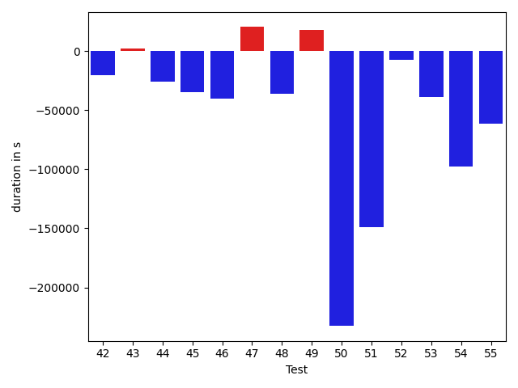

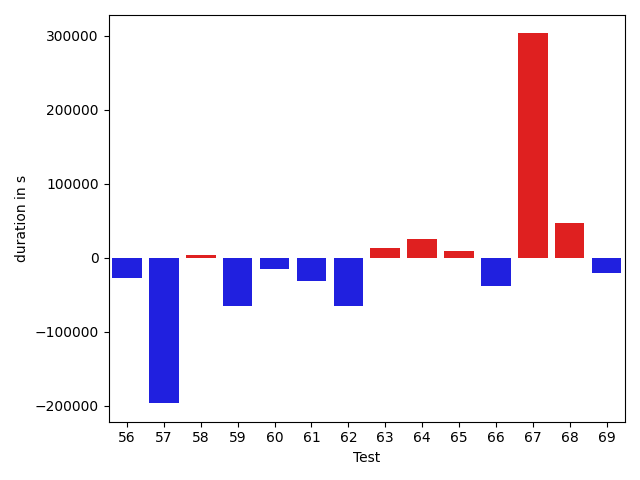

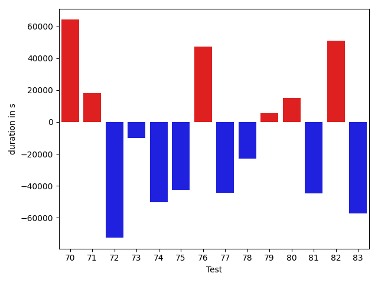

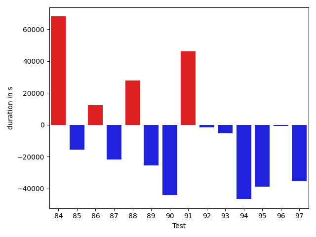

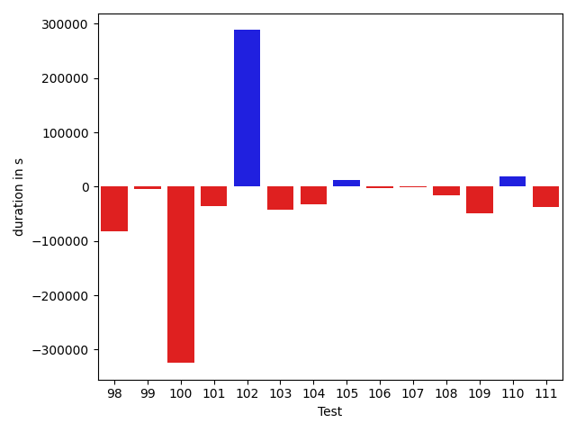

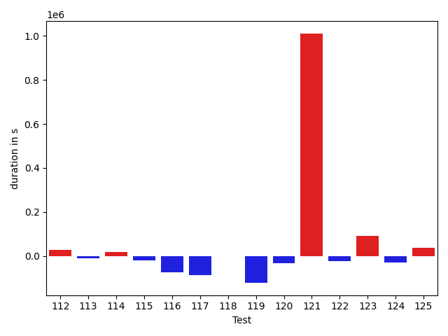

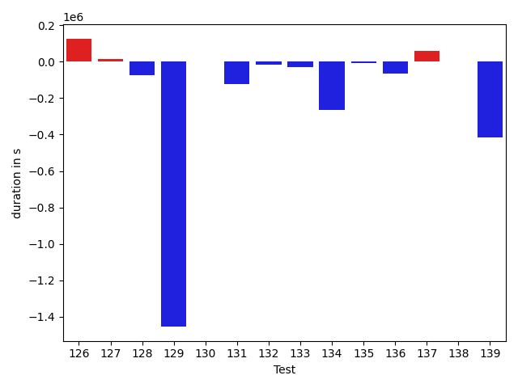

| ID | DurationV1 | DurationsV2 | DeltaDuration |
| --- | --- | --- | --- |
| 0 | 1177567.75 | 1190971.87654321 | 13404.126543209888 |
| 1 | 1041375.0735294118 | 1019754.8611111111 | -21620.21241830068 |
| 2 | 595205.25 | 594613.5 | -591.75 |
| 3 | 561785.0952380953 | 591618.4285714285 | 29833.333333333256 |
| 4 | 1148685.1621621621 | 1016386.75 | -132298.41216216213 |
| 5 | 1111989.1351351351 | 1019788.3714285714 | -92200.76370656374 |
| 6 | 4412909.646464647 | 3514235.393939394 | -898674.2525252528 |
| 7 | 407261.55555555556 | 452334.27777777775 | 45072.72222222219 |
| 8 | 504640.15 | 493943.8333333333 | -10696.31666666671 |
| 9 | 830323.5 | 860468.5 | 30145.0 |
| 10 | 490686.2413793103 | 504673.85185185185 | 13987.610472541535 |
| 11 | 568346.8064516129 | 612617.7647058824 | 44270.95825426956 |
| 12 | 731382.5 | 765650.0 | 34267.5 |
| 13 | 592025.3714285714 | 577195.7333333333 | -14829.63809523813 |
| 14 | 602359.9354838709 | 593029.8 | -9330.135483870865 |
| 15 | 3374159.02020202 | 3368912.4545454546 | -5246.565656565595 |
| 16 | 8949308.181818182 | 10074339.404040404 | 1125031.222222222 |
| 17 | 784201.4918032787 | 826837.9833333333 | 42636.4915300546 |
| 18 | 1212512.2727272727 | 1251672.9777777777 | 39160.705050505 |
| 19 | 981208.9827586206 | 980048.9375 | -1160.0452586206375 |
| 20 | 583863.7948717949 | 586349.3888888889 | 2485.594017094001 |
| 21 | 1283897.3448275863 | 1404006.390625 | 120109.04579741368 |
| 22 | 1240075.0543478262 | 1305160.1770833333 | 65085.12273550709 |
| 23 | 623206.9047619047 | 629546.9142857143 | 6340.009523809538 |
| 24 | 466512.3333333333 | 509043.6956521739 | 42531.362318840576 |
| 25 | 705066.1739130435 | 726695.1304347826 | 21628.956521739135 |
| 26 | 705463.9574468085 | 715997.5714285715 | 10533.613981763017 |
| 27 | 527561.6774193548 | 528942.4814814815 | 1380.80406212667 |
| 28 | 741265.4347826086 | 752424.7592592592 | 11159.324476650567 |
| 29 | 365667.4 | 421385.0 | 55717.59999999998 |
| 30 | 359057.0 | 454901.06666666665 | 95844.06666666665 |
| 31 | 727893.2941176471 | 833159.3823529412 | 105266.0882352941 |
| 32 | 970882.4666666667 | 1037706.5 | 66824.03333333333 |
| 33 | 502432.3181818182 | 480230.4827586207 | -22201.83542319748 |
| 34 | 432979.4666666667 | 440967.625 | 7988.158333333326 |
| 35 | 423933.65 | 437143.6111111111 | 13209.9611111111 |
| 36 | 505515.72 | 516330.5416666667 | 10814.821666666714 |
| 37 | 759736.0 | 723776.6875 | -35959.3125 |
| 38 | 1270580.948275862 | 1151958.245614035 | -118622.70266182697 |
| 39 | 849265.5660377359 | 830418.320754717 | -18847.245283018914 |
| 40 | 2524638.4343434344 | 2522713.5555555555 | -1924.8787878789008 |
| 41 | 1211946.6 | 1090903.6607142857 | -121042.93928571441 |
| 42 | 750530.9038461539 | 729954.0294117647 | -20576.874434389174 |
| 43 | 926716.2173913043 | 929038.262295082 | 2322.044903777656 |
| 44 | 815053.7547169811 | 788921.3461538461 | -26132.40856313496 |
| 45 | 577145.5405405406 | 542145.0869565217 | -35000.45358401886 |
| 46 | 1268636.2278481012 | 1228471.8421052631 | -40164.38574283803 |
| 47 | 710770.7735849057 | 730985.5227272727 | 20214.749142367044 |
| 48 | 840667.0877192982 | 804432.21875 | -36234.8689692982 |
| 49 | 468627.0909090909 | 486591.7 | 17964.60909090913 |
| 50 | 3492319.294117647 | 3259760.4142857143 | -232558.87983193295 |
| 51 | 1204597.8541666667 | 1055642.2745098039 | -148955.5796568629 |
| 52 | 617375.3428571429 | 609977.3928571428 | -7397.95000000007 |
| 53 | 952571.1754385965 | 913794.7954545454 | -38776.379984051106 |
| 54 | 1065397.3043478262 | 967690.0322580645 | -97707.27208976168 |
| 55 | 1482593.3673469387 | 1421006.0105263158 | -61587.356820622925 |
| 56 | 733685.02 | 705958.0217391305 | -27726.998260869528 |
| 57 | 1961761.3626373627 | 1765126.494623656 | -196634.86801370676 |
| 58 | 1016831.3684210526 | 1020124.56 | 3293.1915789474733 |
| 59 | 1039058.2580645161 | 973581.0819672131 | -65477.17609730305 |
| 60 | 905726.5818181818 | 891138.320754717 | -14588.2610634648 |
| 61 | 595877.7714285714 | 564582.5185185185 | -31295.252910052892 |
| 62 | 1143188.6176470588 | 1077871.0 | -65317.617647058796 |
| 63 | 399938.2105263158 | 413693.8333333333 | 13755.622807017528 |
| 64 | 429242.2380952381 | 454366.6923076923 | 25124.454212454206 |
| 65 | 1847680.076923077 | 1857309.7708333333 | 9629.693910256261 |
| 66 | 480539.85714285716 | 441884.8095238095 | -38655.04761904763 |
| 67 | 1434679.9772727273 | 1737925.3170731708 | 303245.3398004435 |
| 68 | 379236.2727272727 | 426445.3888888889 | 47209.11616161617 |
| 69 | 551567.6071428572 | 530931.2173913043 | -20636.389751552837 |
| 70 | 868199.2222222222 | 932287.0408163265 | 64087.81859410426 |
| 71 | 478673.5 | 496832.04761904763 | 18158.547619047633 |
| 72 | 478181.6153846154 | 405620.05 | -72561.56538461539 |
| 73 | 380513.4117647059 | 370458.45454545453 | -10054.957219251373 |
| 74 | 475563.77777777775 | 425133.6111111111 | -50430.16666666663 |
| 75 | 387722.6842105263 | 345206.6666666667 | -42516.017543859605 |
| 76 | 476442.9032258064 | 523640.55 | 47197.64677419356 |
| 77 | 406072.78571428574 | 361858.35294117645 | -44214.43277310929 |
| 78 | 493035.72 | 469931.4210526316 | -23104.2989473684 |
| 79 | 427645.0 | 432994.5882352941 | 5349.588235294097 |
| 80 | 388778.13333333336 | 403903.73333333334 | 15125.599999999977 |
| 81 | 370656.25 | 326042.0 | -44614.25 |
| 82 | 372253.4 | 423339.125 | 51085.72499999998 |
| 83 | 430489.0588235294 | 373031.0 | -57458.0588235294 |
| 84 | 384225.0909090909 | 452134.65 | 67909.55909090914 |
| 85 | 408634.0 | 393025.6111111111 | -15608.388888888876 |
| 86 | 347193.82352941175 | 359651.2380952381 | 12457.414565826359 |
| 87 | 421175.8095238095 | 399380.88 | -21794.929523809522 |
| 88 | 432470.77777777775 | 460359.9411764706 | 27889.16339869285 |
| 89 | 474810.6875 | 449383.0 | -25427.6875 |
| 90 | 409060.71428571426 | 365094.36363636365 | -43966.350649350614 |
| 91 | 363936.0 | 410079.72 | 46143.71999999997 |
| 92 | 460721.4285714286 | 459060.0 | -1661.4285714285797 |
| 93 | 401029.23076923075 | 395739.3076923077 | -5289.9230769230635 |
| 94 | 423927.9 | 377314.82352941175 | -46613.076470588276 |
| 95 | 440312.25 | 401464.64285714284 | -38847.60714285716 |
| 96 | 840086.574074074 | 839312.6610169491 | -773.9130571249407 |
| 97 | 1033623.1090909091 | 998296.8103448276 | -35326.298746081535 |
| 98 | 1268546.2261904762 | 1186750.3170731708 | -81795.90911730542 |
| 99 | 770744.6136363636 | 766788.8775510204 | -3955.736085343291 |
| 100 | 1550721.1132075472 | 1226113.9 | -324607.2132075473 |
| 101 | 456500.0 | 421156.13636363635 | -35343.86363636365 |
| 102 | 2267302.75 | 2555620.8804347827 | 288318.1304347827 |
| 103 | 475054.6 | 432055.7826086957 | -42998.8173913043 |
| 104 | 521549.2962962963 | 489903.5333333333 | -31645.762962962966 |
| 105 | 464977.65 | 476907.625 | 11929.974999999977 |
| 106 | 803234.4318181818 | 800961.9333333333 | -2272.4984848484164 |
| 107 | 485547.5 | 483818.94444444444 | -1728.555555555562 |
| 108 | 408955.23529411765 | 393085.44444444444 | -15869.790849673213 |
| 109 | 623202.8571428572 | 574864.5757575758 | -48338.281385281356 |
| 110 | 692550.875 | 711824.1578947369 | 19273.282894736854 |
| 111 | 602696.0714285715 | 564751.6285714286 | -37944.44285714289 |
| 112 | 738553.695652174 | 767276.8888888889 | 28723.193236714927 |
| 113 | 900224.5 | 888232.9830508474 | -11991.516949152574 |
| 114 | 752114.6341463415 | 769223.340425532 | 17108.70627919049 |
| 115 | 730283.7959183673 | 710829.1041666666 | -19454.69175170071 |
| 116 | 1499882.5957446808 | 1423938.5454545454 | -75944.05029013543 |
| 117 | 630247.0 | 544359.6538461539 | -85887.34615384613 |
| 118 | 477977.0416666667 | 475979.0416666667 | -1998.0 |
| 119 | 961832.0 | 839658.6 | -122173.40000000002 |
| 120 | 514717.24 | 480095.53846153844 | -34621.70153846155 |
| 121 | 2287622.0714285714 | 3298426.85 | 1010804.7785714287 |
| 122 | 517956.4411764706 | 494025.4482758621 | -23930.992900608515 |
| 123 | 610276.9444444445 | 700407.6521739131 | 90130.70772946859 |
| 124 | 484839.5833333333 | 455977.3333333333 | -28862.25 |
| 125 | 1039932.1058823529 | 1077157.3055555555 | 37225.19967320259 |
| 126 | 939778.8039215687 | 1066291.4081632653 | 126512.60424169665 |
| 127 | 467639.8695652174 | 481075.6666666667 | 13435.79710144928 |
| 128 | 803318.0444444445 | 731650.075 | -71667.96944444452 |
| 129 | 6982356.808080808 | 5527565.484848484 | -1454791.3232323239 |
| 130 | 705187.5 | 705787.8684210526 | 600.3684210525826 |
| 131 | 1380615.8780487804 | 1257096.2727272727 | -123519.60532150767 |
| 132 | 811160.6326530612 | 794179.6923076923 | -16980.94034536893 |
| 133 | 938061.6507936508 | 908261.425925926 | -29800.224867724814 |
| 134 | 1047770.9743589744 | 783237.0833333334 | -264533.891025641 |
| 135 | 658088.28125 | 652532.1724137932 | -5556.10883620684 |
| 136 | 674581.7692307692 | 609675.6666666666 | -64906.10256410262 |
| 137 | 432809.3125 | 494573.2380952381 | 61763.925595238106 |
| 138 | 546418.9411764706 | 549071.8857142857 | 2652.944537815056 |
| 139 | 3057380.763157895 | 2641980.777777778 | -415399.98538011685 |
| 140 | 534884.65625 | 532990.1515151515 | -1894.5047348485095 |
| 141 | 802784.7719298246 | 782417.5849056604 | -20367.187024164246 |
| 142 | 526495.7916666666 | 536900.0714285715 | 10404.27976190485 |
| 143 | 593804.4615384615 | 629102.5428571429 | 35298.08131868136 |
| 144 | 712913.1363636364 | 726414.28 | 13501.143636363675 |
| 145 | 943544.5897435897 | 1017287.0 | 73742.41025641025 |
| 146 | 540075.3055555555 | 533538.7096774194 | -6536.595878136111 |
| 147 | 797328.6333333333 | 722832.7857142857 | -74495.84761904762 |
| 148 | 798536.1372549019 | 787458.9629629629 | -11077.174291939009 |
| 149 | 825801.6825396825 | 796048.1346153846 | -29753.54792429786 |
| 150 | 490647.25 | 518019.0 | 27371.75 |
| 151 | 544494.2121212122 | 543179.7878787878 | -1314.424242424313 |
| 152 | 2700801.8513513515 | 1604397.3452380951 | -1096404.5061132563 |
| 153 | 506677.7619047619 | 530951.75 | 24273.988095238106 |
| 154 | 616474.59375 | 610122.6896551724 | -6351.904094827594 |
| 155 | 868142.0576923077 | 835361.0689655172 | -32780.98872679053 |
| 156 | 2444701.3232323234 | 3274868.232323232 | 830166.9090909087 |
| 157 | 1254689.4578313252 | 1238982.8023255814 | -15706.655505743809 |
| 158 | 1218765.8292682928 | 1171781.746835443 | -46984.0824328498 |
| 159 | 993819.3064516129 | 996456.8412698413 | 2637.5348182284506 |
| 160 | 1063409.9411764706 | 1030335.1948051949 | -33074.746371275745 |
| 161 | 5982137.939393939 | 3910024.505050505 | -2072113.4343434344 |
| 162 | 1424430.1147540985 | 1441793.6833333333 | 17363.56857923488 |
| 163 | 1109209.5324675324 | 1078622.7733333334 | -30586.759134199005 |
| 164 | 550642.7894736842 | 581912.0967741936 | 31269.30730050942 |
| 165 | 5689426.875 | 2823677.3235294116 | -2865749.5514705884 |
| 166 | 1085648.288888889 | 1279823.8235294118 | 194175.5346405229 |
| 167 | 4207938.365079365 | 3654529.086956522 | -553409.2781228428 |
| 168 | 1115250.7586206896 | 1265510.5483870967 | 150259.7897664071 |
| 169 | 800172.1836734693 | 784654.2291666666 | -15517.954506802722 |
| 170 | 1515395.8484848484 | 1584832.5757575757 | 69436.7272727273 |
| 171 | 738766.5 | 660135.0217391305 | -78631.47826086951 |
| 172 | 765956.2391304348 | 720215.2222222222 | -45741.016908212565 |
| 173 | 4639773.689655173 | 3237972.445652174 | -1401801.2440029988 |
| 174 | 805492.3333333334 | 673150.175 | -132342.15833333333 |
| 175 | 602458.0476190476 | 526698.7741935484 | -75759.27342549921 |
| 176 | 471182.8846153846 | 507809.3214285714 | 36626.436813186796 |
| 177 | 1912042.2093023255 | 1932754.8695652173 | 20712.66026289179 |
| 178 | 1318066.7887323943 | 1310500.3513513512 | -7566.437381043099 |
| 179 | 841671.3870967742 | 1068212.5833333333 | 226541.19623655907 |
| 180 | 501988.5 | 519967.45454545453 | 17978.95454545453 |
| 181 | 514123.375 | 556627.5769230769 | 42504.20192307688 |
| 182 | 872248.6078431372 | 897684.2592592592 | 25435.651416121982 |
| 183 | 512116.8484848485 | 546418.0 | 34301.15151515149 |
| 184 | 521625.25 | 556977.0967741936 | 35351.846774193575 |
| 185 | 2547233.8205128205 | 4867050.567567567 | 2319816.747054747 |
| 186 | 404982.5 | 574414.5 | 169432.0 |
| 187 | 510236.05263157893 | 1923603.9130434783 | 1413367.8604118994 |
| 188 | 2893100.955882353 | 3899990.8214285714 | 1006889.8655462186 |
| 189 | 1026826.7804878049 | 1083737.723076923 | 56910.942589118145 |
| 190 | 1812136.855263158 | 1777093.4545454546 | -35043.40071770339 |
| 191 | 1139920.5555555555 | 1123723.903614458 | -16196.651941097574 |
| 192 | 957314.8181818182 | 962375.323076923 | 5060.504895104794 |
| 193 | 1358858.8510638298 | 1350723.0909090908 | -8135.760154739022 |
| 194 | 2714387.2253521127 | 3443969.304347826 | 729582.0789957135 |
| 195 | 701941.3571428572 | 660603.1627906977 | -41338.19435215951 |
| 196 | 848576.14 | 831345.568627451 | -17230.57137254905 |
| 197 | 698578.5428571429 | 718856.7948717949 | 20278.25201465201 |
| 198 | 583920.4857142858 | 609885.6206896552 | 25965.134975369438 |
| 199 | 563885.4 | 578735.1071428572 | 14849.707142857136 |
| 200 | 1877800.5263157894 | 2740267.1428571427 | 862466.6165413533 |
| 201 | 5680974.34375 | 2580412.8181818184 | -3100561.5255681816 |
| 202 | 1077490.0 | 982309.2 | -95180.80000000005 |
| 203 | 602662.7333333333 | 923241.052631579 | 320578.3192982457 |
| 204 | 1984849.2727272727 | 1958182.3737373736 | -26666.898989899084 |
| 205 | 846975.2545454545 | 825857.9272727272 | -21117.32727272727 |
| 206 | 3078405.595959596 | 4177086.121212121 | 1098680.5252525252 |
| 207 | 716561.6744186047 | 768558.1304347826 | 51996.45601617789 |
| 208 | 356878.2727272727 | 352110.14285714284 | -4768.129870129866 |
| 209 | 482229.4705882353 | 597414.9565217391 | 115185.48593350383 |
| 210 | 567777.8421052631 | 566440.2 | -1337.6421052631922 |
| 211 | 519271.44 | 578383.0 | 59111.56 |
| 212 | 1068173.1029411764 | 1014447.3529411765 | -53725.74999999988 |
| 213 | 6553276.133333334 | 469229.17647058825 | -6084046.956862746 |
| 214 | 5372851.363636363 | 5500877.676767677 | 128026.31313131377 |
| 215 | 2872024.23880597 | 2521809.8450704226 | -350214.39373554755 |
| 216 | 1192988.7428571428 | 1114309.3623188406 | -78679.38053830224 |
| 217 | 1105824.2028985508 | 1192343.025974026 | 86518.82307547517 |
| 218 | 861971.7209302326 | 871767.0625 | 9795.34156976745 |
| 219 | 387969.28571428574 | 382553.8181818182 | -5415.467532467563 |
| 220 | 467568.8333333333 | 476252.25 | 8683.416666666686 |
| 221 | 436716.8 | 554318.6111111111 | 117601.81111111114 |
| 222 | 3208297.695652174 | 3878254.052631579 | 669956.356979405 |
| 223 | 680545.4117647059 | 703483.0689655172 | 22937.657200811314 |

## Misc.

| ID | Test Class | Test Method |
| --- | --- | --- |
| 0 | com.google.gson.functional.StreamingTypeAdaptersTest | testNullSafe |
| 1 | com.google.gson.functional.StreamingTypeAdaptersTest | testSerializeWithCustomTypeAdapter |
| 2 | com.google.gson.functional.StreamingTypeAdaptersTest | testDeserializeWithCustomTypeAdapter |
| 3 | com.google.gson.functional.ExclusionStrategyFunctionalTest | testExclusionStrategySerializationDoesNotImpactSerialization |
| 4 | com.google.gson.functional.ExclusionStrategyFunctionalTest | testExclusionStrategySerializationDoesNotImpactDeserialization |
| 5 | com.google.gson.functional.ExclusionStrategyFunctionalTest | testExclusionStrategyDeserialization |
| 6 | com.google.gson.functional.ExclusionStrategyFunctionalTest | testExclusionStrategySerialization |
| 7 | com.google.gson.functional.ExclusionStrategyFunctionalTest | testExcludeTopLevelClassDeserialization |
| 8 | com.google.gson.functional.ExclusionStrategyFunctionalTest | testExcludeTopLevelClassSerialization |
| 9 | com.google.gson.functional.ExclusionStrategyFunctionalTest | testExclusionStrategyWithMode |
| 10 | com.google.gson.functional.ExclusionStrategyFunctionalTest | testExcludeTopLevelClassDeserializationDoesNotImpactSerialization |
| 11 | com.google.gson.functional.ExclusionStrategyFunctionalTest | testExcludeTopLevelClassSerializationDoesNotImpactDeserialization |
| 12 | com.google.gson.functional.DefaultTypeAdaptersTest | testDateSerializationWithPatternNotOverridenByTypeAdapter |
| 13 | com.google.gson.functional.DefaultTypeAdaptersTest | testBadValueForBigDecimalDeserialization |
| 14 | com.google.gson.functional.DefaultTypeAdaptersTest | testBigIntegerFieldDeserialization |
| 15 | com.google.gson.functional.DefaultTypeAdaptersTest | testDefaultDateDeserializationUsingBuilder |
| 16 | com.google.gson.functional.DefaultTypeAdaptersTest | testNullSerialization |
| 17 | com.google.gson.functional.DefaultTypeAdaptersTest | testDateDeserializationWithPattern |
| 18 | com.google.gson.functional.DefaultTypeAdaptersTest | testDateSerializationInCollection |
| 19 | com.google.gson.functional.DefaultTypeAdaptersTest | testBigIntegerFieldSerialization |
| 20 | com.google.gson.functional.DefaultTypeAdaptersTest | testBigDecimalFieldDeserialization |
| 21 | com.google.gson.functional.DefaultTypeAdaptersTest | testBigDecimalFieldSerialization |
| 22 | com.google.gson.functional.DefaultTypeAdaptersTest | testDateSerializationWithPattern |
| 23 | com.google.gson.functional.DefaultTypeAdaptersTest | testBitSetDeserialization |
| 24 | com.google.gson.functional.DefaultTypeAdaptersTest | testDefaultGregorianCalendarDeserialization |
| 25 | com.google.gson.functional.DefaultTypeAdaptersTest | testSqlDateSerialization |
| 26 | com.google.gson.functional.DefaultTypeAdaptersTest | testTimestampSerialization |
| 27 | com.google.gson.functional.DefaultTypeAdaptersTest | testDefaultCalendarDeserialization |
| 28 | com.google.gson.functional.DefaultTypeAdaptersTest | testDefaultDateSerializationUsingBuilder |
| 29 | com.google.gson.functional.DefaultTypeAdaptersTest | testStringBuilderDeserialization |
| 30 | com.google.gson.functional.DefaultTypeAdaptersTest | testStringBufferDeserialization |
| 31 | com.google.gson.functional.DefaultTypeAdaptersTest | testSetSerialization |
| 32 | com.google.gson.functional.DefaultTypeAdaptersTest | testClassSerialization |
| 33 | com.google.gson.functional.DefaultTypeAdaptersTest | testDefaultCalendarSerialization |
| 34 | com.google.gson.functional.DefaultTypeAdaptersTest | testDefaultGregorianCalendarSerialization |
| 35 | com.google.gson.functional.DefaultTypeAdaptersTest | testBitSetSerialization |
| 36 | com.google.gson.functional.DefaultTypeAdaptersTest | testClassDeserialization |
| 37 | com.google.gson.functional.CustomTypeAdaptersTest | testCustomTypeAdapterAppliesToSubClassesSerializedAsBaseClass |
| 38 | com.google.gson.functional.CustomTypeAdaptersTest | testCustomNestedSerializers |
| 39 | com.google.gson.functional.CustomTypeAdaptersTest | testCustomNestedDeserializers |
| 40 | com.google.gson.functional.CustomTypeAdaptersTest | testCustomTypeAdapterDoesNotAppliesToSubClasses |
| 41 | com.google.gson.functional.CustomTypeAdaptersTest | testCustomDeserializers |
| 42 | com.google.gson.functional.CustomTypeAdaptersTest | testCustomByteArrayDeserializerAndInstanceCreator |
| 43 | com.google.gson.functional.CustomTypeAdaptersTest | testCustomAdapterInvokedForCollectionElementDeserialization |
| 44 | com.google.gson.functional.CustomTypeAdaptersTest | testCustomAdapterInvokedForMapElementDeserialization |
| 45 | com.google.gson.functional.CustomTypeAdaptersTest | testCustomAdapterInvokedForCollectionElementSerialization |
| 46 | com.google.gson.functional.CustomTypeAdaptersTest | testCustomAdapterInvokedForCollectionElementSerializationWithType |
| 47 | com.google.gson.functional.CustomTypeAdaptersTest | testCustomByteArraySerializer |
| 48 | com.google.gson.functional.CustomTypeAdaptersTest | testCustomAdapterInvokedForMapElementSerializationWithType |
| 49 | com.google.gson.functional.CustomTypeAdaptersTest | testCustomAdapterInvokedForMapElementSerialization |
| 50 | com.google.gson.functional.CustomTypeAdaptersTest | testCustomSerializers |
| 51 | com.google.gson.functional.CustomTypeAdaptersTest | testEnsureCustomSerializerNotInvokedForNullValues |
| 52 | com.google.gson.functional.CustomTypeAdaptersTest | testEnsureCustomDeserializerNotInvokedForNullValues |
| 53 | com.google.gson.functional.CustomTypeAdaptersTest | testRegisterHierarchyAdapterForDate |
| 54 | com.google.gson.functional.MapTest | testSerializeMaps |
| 55 | com.google.gson.functional.MapTest | testInterfaceTypeMapWithSerializer |
| 56 | com.google.gson.functional.MapTest | testMapSerializationWithNullValueButSerializeNulls |
| 57 | com.google.gson.functional.MapTest | testInterfaceTypeMap |
| 58 | com.google.gson.functional.MapTest | testMapSubclassDeserialization |
| 59 | com.google.gson.functional.MapTest | testCustomSerializerForSpecificMapType |
| 60 | com.google.gson.functional.MapTest | testGeneralMapField |
| 61 | com.google.gson.functional.MapTest | testMapSerializationWithNullValuesSerialized |
| 62 | com.google.gson.functional.PrimitiveTest | testMoreSpecificSerialization |
| 63 | com.google.gson.functional.PrimitiveTest | testSmallValueForBigIntegerDeserialization |
| 64 | com.google.gson.functional.PrimitiveTest | testBigIntegerDeserialization |
| 65 | com.google.gson.functional.PrimitiveTest | testHtmlCharacterSerialization |
| 66 | com.google.gson.functional.PrimitiveTest | testLongAsStringSerialization |
| 67 | com.google.gson.functional.PrimitiveTest | testBigDecimalSerialization |
| 68 | com.google.gson.functional.PrimitiveTest | testBigDecimalPreservePrecisionSerialization |
| 69 | com.google.gson.functional.PrimitiveTest | testBigIntegerInASingleElementArraySerialization |
| 70 | com.google.gson.functional.PrimitiveTest | testBigIntegerSerialization |
| 71 | com.google.gson.functional.PrimitiveTest | testBadValueForBigIntegerDeserialization |
| 72 | com.google.gson.functional.PrimitiveTest | testSmallValueForBigIntegerSerialization |
| 73 | com.google.gson.functional.PrimitiveTest | testDeserializeJsonArrayAsBigInteger |
| 74 | com.google.gson.functional.PrimitiveTest | testLongAsStringDeserialization |
| 75 | com.google.gson.functional.PrimitiveTest | testNegativeInfinitySerialization |
| 76 | com.google.gson.functional.PrimitiveTest | testBigDecimalInASingleElementArraySerialization |
| 77 | com.google.gson.functional.PrimitiveTest | testDeserializeJsonArrayAsBigDecimal |
| 78 | com.google.gson.functional.PrimitiveTest | testDeserializingBigIntegerAsBigDecimal |
| 79 | com.google.gson.functional.PrimitiveTest | testSmallValueForBigDecimalDeserialization |
| 80 | com.google.gson.functional.PrimitiveTest | testBigDecimalNegativeInfinityDeserializationNotSupported |
| 81 | com.google.gson.functional.PrimitiveTest | testDoubleInfinitySerialization |
| 82 | com.google.gson.functional.PrimitiveTest | testBigDecimalPreservePrecisionDeserialization |
| 83 | com.google.gson.functional.PrimitiveTest | testDeserializeJsonObjectAsBigDecimal |
| 84 | com.google.gson.functional.PrimitiveTest | testBigDecimalInfinityDeserializationNotSupported |
| 85 | com.google.gson.functional.PrimitiveTest | testFloatInfinitySerialization |
| 86 | com.google.gson.functional.PrimitiveTest | testNegativeInfinityFloatSerialization |
| 87 | com.google.gson.functional.PrimitiveTest | testDoubleNaNSerialization |
| 88 | com.google.gson.functional.PrimitiveTest | testBigDecimalAsStringRepresentationDeserialization |
| 89 | com.google.gson.functional.PrimitiveTest | testBigDecimalNaNDeserializationNotSupported |
| 90 | com.google.gson.functional.PrimitiveTest | testDeserializeJsonObjectAsBigInteger |
| 91 | com.google.gson.functional.PrimitiveTest | testSmallValueForBigDecimalSerialization |
| 92 | com.google.gson.functional.PrimitiveTest | testBigDecimalDeserialization |
| 93 | com.google.gson.functional.PrimitiveTest | testDeserializingBigDecimalAsBigIntegerFails |
| 94 | com.google.gson.functional.PrimitiveTest | testFloatNaNSerialization |
| 95 | com.google.gson.functional.PrimitiveTest | testBigDecimalNoFractAsStringRepresentationDeserialization |
| 96 | com.google.gson.functional.CustomDeserializerTest | testCustomDeserializerReturnsNullForArrayElementsForArrayField |
| 97 | com.google.gson.functional.CustomDeserializerTest | testCustomDeserializerReturnsNull |
| 98 | com.google.gson.functional.CustomDeserializerTest | testJsonTypeFieldBasedDeserialization |
| 99 | com.google.gson.functional.CustomDeserializerTest | testCustomDeserializerReturnsNullForArrayElements |
| 100 | com.google.gson.functional.CustomDeserializerTest | testCustomDeserializerReturnsNullForTopLevelObject |
| 101 | com.google.gson.functional.TypeAdapterPrecedenceTest | testStreamingHierarchicalFollowedByNonstreaming |
| 102 | com.google.gson.functional.TypeAdapterPrecedenceTest | testNonstreamingFollowedByNonstreaming |
| 103 | com.google.gson.functional.TypeAdapterPrecedenceTest | testStreamingFollowedByNonstreaming |
| 104 | com.google.gson.functional.TypeAdapterPrecedenceTest | testSerializeNonstreamingTypeAdapterFollowedByStreamingTypeAdapter |
| 105 | com.google.gson.functional.TypeAdapterPrecedenceTest | testNonstreamingHierarchicalFollowedByNonstreaming |
| 106 | com.google.gson.functional.TypeAdapterPrecedenceTest | testStreamingFollowedByStreaming |
| 107 | com.google.gson.functional.TypeAdapterPrecedenceTest | testStreamingFollowedByNonstreamingHierarchical |
| 108 | com.google.gson.functional.TypeAdapterPrecedenceTest | testStreamingHierarchicalFollowedByNonstreamingHierarchical |
| 109 | com.google.gson.functional.NullObjectAndFieldTest | testExplicitSerializationOfNullStringMembers |
| 110 | com.google.gson.functional.NullObjectAndFieldTest | testCustomTypeAdapterPassesNullDesrialization |
| 111 | com.google.gson.functional.NullObjectAndFieldTest | testExplicitSerializationOfNullCollectionMembers |
| 112 | com.google.gson.functional.NullObjectAndFieldTest | testCustomSerializationOfNulls |
| 113 | com.google.gson.functional.NullObjectAndFieldTest | testAbsentJsonElementsAreSetToNull |
| 114 | com.google.gson.functional.NullObjectAndFieldTest | testPrintPrintingObjectWithNulls |
| 115 | com.google.gson.functional.NullObjectAndFieldTest | testNullWrappedPrimitiveMemberSerialization |
| 116 | com.google.gson.functional.NullObjectAndFieldTest | testExplicitSerializationOfNullArrayMembers |
| 117 | com.google.gson.functional.NullObjectAndFieldTest | testExplicitDeserializationOfNulls |
| 118 | com.google.gson.functional.NullObjectAndFieldTest | testPrintPrintingArraysWithNulls |
| 119 | com.google.gson.functional.NullObjectAndFieldTest | testExplicitSerializationOfNulls |
| 120 | com.google.gson.functional.NullObjectAndFieldTest | testNullWrappedPrimitiveMemberDeserialization |
| 121 | com.google.gson.functional.NullObjectAndFieldTest | testTopLevelNullObjectSerialization |
| 122 | com.google.gson.functional.NullObjectAndFieldTest | testExplicitNullSetsFieldToNullDuringDeserialization |
| 123 | com.google.gson.functional.NullObjectAndFieldTest | testTopLevelNullObjectDeserialization |
| 124 | com.google.gson.functional.NullObjectAndFieldTest | testCustomTypeAdapterPassesNullSerialization |
| 125 | com.google.gson.functional.ObjectTest | testSingletonLists |
| 126 | com.google.gson.functional.ObjectTest | testInnerClassDeserialization |
| 127 | com.google.gson.functional.ObjectTest | testJsonObjectSerialization |
| 128 | com.google.gson.functional.VersioningTest | testVersionedGsonMixingSinceAndUntilDeserialization |
| 129 | com.google.gson.functional.VersioningTest | testVersionedUntilSerialization |
| 130 | com.google.gson.functional.VersioningTest | testVersionedClassesDeserialization |
| 131 | com.google.gson.functional.VersioningTest | testVersionedGsonWithUnversionedClassesSerialization |
| 132 | com.google.gson.functional.VersioningTest | testVersionedClassesSerialization |
| 133 | com.google.gson.functional.VersioningTest | testVersionedGsonMixingSinceAndUntilSerialization |
| 134 | com.google.gson.functional.VersioningTest | testVersionedUntilDeserialization |
| 135 | com.google.gson.functional.VersioningTest | testVersionedGsonWithUnversionedClassesDeserialization |
| 136 | com.google.gson.functional.VersioningTest | testIgnoreLaterVersionClassSerialization |
| 137 | com.google.gson.functional.VersioningTest | testIgnoreLaterVersionClassDeserialization |
| 138 | com.google.gson.functional.NamingPolicyTest | testGsonWithLowerCaseDashPolicyDeserialiation |
| 139 | com.google.gson.functional.NamingPolicyTest | testGsonDuplicateNameUsingSerializedNameFieldNamingPolicySerialization |
| 140 | com.google.gson.functional.NamingPolicyTest | testGsonWithSerializedNameFieldNamingPolicyDeserialization |
| 141 | com.google.gson.functional.NamingPolicyTest | testGsonWithSerializedNameFieldNamingPolicySerialization |
| 142 | com.google.gson.functional.NamingPolicyTest | testGsonWithLowerCaseUnderscorePolicySerialization |
| 143 | com.google.gson.functional.NamingPolicyTest | testGsonWithLowerCaseUnderscorePolicyDeserialiation |
| 144 | com.google.gson.functional.NamingPolicyTest | testAtSignInSerializedName |
| 145 | com.google.gson.functional.NamingPolicyTest | testGsonWithNonDefaultFieldNamingPolicySerialization |
| 146 | com.google.gson.functional.NamingPolicyTest | testGsonWithUpperCamelCaseSpacesPolicyDeserialiation |
| 147 | com.google.gson.functional.NamingPolicyTest | testGsonWithNonDefaultFieldNamingPolicyDeserialiation |
| 148 | com.google.gson.functional.NamingPolicyTest | testComplexFieldNameStrategy |
| 149 | com.google.gson.functional.NamingPolicyTest | testDeprecatedNamingStrategy |
| 150 | com.google.gson.functional.NamingPolicyTest | testGsonWithUpperCamelCaseSpacesPolicySerialiation |
| 151 | com.google.gson.functional.NamingPolicyTest | testGsonWithLowerCaseDashPolicySerialization |
| 152 | com.google.gson.functional.FieldExclusionTest | testDefaultInnerClassExclusion |
| 153 | com.google.gson.functional.FieldExclusionTest | testInnerClassExclusion |
| 154 | com.google.gson.functional.FieldExclusionTest | testDefaultNestedStaticClassIncluded |
| 155 | com.google.gson.functional.TypeVariableTest | testBasicTypeVariables |
| 156 | com.google.gson.functional.TypeVariableTest | testAdvancedTypeVariables |
| 157 | com.google.gson.functional.TypeVariableTest | testTypeVariablesViaTypeParameter |
| 158 | com.google.gson.functional.EnumTest | testEnumSubclassWithRegisteredTypeAdapter |
| 159 | com.google.gson.functional.MapAsArrayTypeAdapterTest | testMultipleEnableComplexKeyRegistrationHasNoEffect |
| 160 | com.google.gson.functional.MapAsArrayTypeAdapterTest | testMapWithTypeVariableDeserialization |
| 161 | com.google.gson.functional.MapAsArrayTypeAdapterTest | testSerializeComplexMapWithTypeAdapter |
| 162 | com.google.gson.functional.MapAsArrayTypeAdapterTest | testTwoTypesCollapseToOneDeserialize |
| 163 | com.google.gson.functional.MapAsArrayTypeAdapterTest | testMapWithTypeVariableSerialization |
| 164 | com.google.gson.LongSerializationPolicyTest | testStringLongSerializationIntegration |
| 165 | com.google.gson.LongSerializationPolicyTest | testDefaultLongSerializationIntegration |
| 166 | com.google.gson.GsonTypeAdapterTest | testDefaultTypeAdapterThrowsParseException |
| 167 | com.google.gson.functional.InstanceCreatorTest | testInstanceCreatorReturnsBaseType |
| 168 | com.google.gson.functional.InstanceCreatorTest | testInstanceCreatorReturnsSubTypeForField |
| 169 | com.google.gson.functional.InstanceCreatorTest | testInstanceCreatorReturnsSubTypeForTopLevelObject |
| 170 | com.google.gson.functional.InstanceCreatorTest | testInstanceCreatorForCollectionType |
| 171 | com.google.gson.functional.FieldNamingTest | testLowerCaseWithDashes |
| 172 | com.google.gson.functional.FieldNamingTest | testLowerCaseWithUnderscores |
| 173 | com.google.gson.functional.FieldNamingTest | testUpperCamelCase |
| 174 | com.google.gson.functional.FieldNamingTest | testUpperCamelCaseWithSpaces |
| 175 | com.google.gson.functional.FieldNamingTest | testIdentity |
| 176 | com.google.gson.MixedStreamTest | testWriteClosed |
| 177 | com.google.gson.MixedStreamTest | testWriteHtmlSafe |
| 178 | com.google.gson.MixedStreamTest | testWriteLenient |
| 179 | com.google.gson.MixedStreamTest | testReadMixedStreamed |
| 180 | com.google.gson.MixedStreamTest | testReadInvalidState |
| 181 | com.google.gson.MixedStreamTest | testWriteInvalidState |
| 182 | com.google.gson.MixedStreamTest | testReadClosed |
| 183 | com.google.gson.MixedStreamTest | testReaderDoesNotMutateState |
| 184 | com.google.gson.MixedStreamTest | testWriteDoesNotMutateState |
| 185 | com.google.gson.MixedStreamTest | testWriteMixedStreamed |
| 186 | com.google.gson.MixedStreamTest | testReadNulls |
| 187 | com.google.gson.MixedStreamTest | testWriteNulls |
| 188 | com.google.gson.CommentsTest | testParseComments |
| 189 | com.google.gson.functional.EscapingTest | testGsonAcceptsEscapedAndNonEscapedJsonDeserialization |
| 190 | com.google.gson.functional.ParameterizedTypesTest | testParameterizedTypeDeserialization |
| 191 | com.google.gson.functional.ParameterizedTypesTest | testParameterizedTypesWithCustomDeserializer |
| 192 | com.google.gson.functional.ParameterizedTypesTest | testParameterizedTypeWithReaderDeserialization |
| 193 | com.google.gson.functional.ParameterizedTypesTest | testParameterizedTypeWithCustomSerializer |
| 194 | com.google.gson.functional.CustomSerializerTest | testSubClassSerializerInvokedForBaseClassFieldsHoldingSubClassInstances |
| 195 | com.google.gson.functional.CustomSerializerTest | testBaseClassSerializerInvokedForBaseClassFieldsHoldingSubClassInstances |
| 196 | com.google.gson.functional.CustomSerializerTest | testSubClassSerializerInvokedForBaseClassFieldsHoldingArrayOfSubClassInstances |
| 197 | com.google.gson.functional.CustomSerializerTest | testSerializerReturnsNull |
| 198 | com.google.gson.functional.CustomSerializerTest | testBaseClassSerializerInvokedForBaseClassFields |
| 199 | com.google.gson.functional.SecurityTest | testJsonWithNonExectuableTokenWithConfiguredGsonDeserialization |
| 200 | com.google.gson.functional.SecurityTest | testJsonWithNonExectuableTokenSerialization |
| 201 | com.google.gson.functional.SecurityTest | testNonExecutableJsonSerialization |
| 202 | com.google.gson.functional.SecurityTest | testNonExecutableJsonDeserialization |
| 203 | com.google.gson.functional.SecurityTest | testJsonWithNonExectuableTokenWithRegularGsonDeserialization |
| 204 | com.google.gson.functional.UncategorizedTest | testReturningDerivedClassesDuringDeserialization |
| 205 | com.google.gson.DefaultMapJsonSerializerTest | testNonEmptyMapSerialization |
| 206 | com.google.gson.functional.TypeHierarchyAdapterTest | testTypeHierarchy |
| 207 | com.google.gson.functional.TypeHierarchyAdapterTest | testRegisterSuperTypeFirst |
| 208 | com.google.gson.functional.TypeHierarchyAdapterTest | testRegisterSubTypeFirstAllowed |
| 209 | com.google.gson.functional.ArrayTest | testNullsInArrayWithSerializeNullPropertySetSerialization |
| 210 | com.google.gson.functional.ArrayTest | testArrayElementsAreArrays |
| 211 | com.google.gson.GsonBuilderTest | testTransientFieldExclusion |
| 212 | com.google.gson.GsonBuilderTest | testExcludeFieldsWithModifiers |
| 213 | com.google.gson.GsonBuilderTest | testCreatingMoreThanOnce |
| 214 | com.google.gson.functional.CircularReferenceTest | testSelfReferenceCustomHandlerSerialization |
| 215 | com.google.gson.JsonParserTest | testReadWriteTwoObjects |
| 216 | com.google.gson.functional.CollectionTest | testUserCollectionTypeAdapter |
| 217 | com.google.gson.functional.ReadersWritersTest | testReadWriteTwoStrings |
| 218 | com.google.gson.functional.ReadersWritersTest | testReadWriteTwoObjects |
| 219 | com.google.gson.functional.ReadersWritersTest | testTopLevelNullObjectDeserializationWithReaderAndSerializeNulls |
| 220 | com.google.gson.functional.ReadersWritersTest | testTopLevelNullObjectSerializationWithWriterAndSerializeNulls |
| 221 | com.google.gson.JsonObjectTest | testWritePropertyWithEmptyStringName |
| 222 | com.google.gson.JsonObjectTest | testPropertyWithQuotes |
| 223 | com.google.gson.functional.PrintFormattingTest | testJsonObjectWithNullValuesSerialized |

| Test | IterationV1 | IterationV2 | DeltaIteration |
| --- | --- | --- | --- |
| 0 | 84 | 81 | -3 |
| 1 | 68 | 72 | 4 |
| 2 | 40 | 38 | -2 |
| 3 | 21 | 28 | 7 |
| 4 | 37 | 40 | 3 |
| 5 | 37 | 35 | -2 |
| 6 | 99 | 99 | 0 |
| 7 | 18 | 18 | 0 |
| 8 | 20 | 18 | -2 |
| 9 | 40 | 38 | -2 |
| 10 | 29 | 27 | -2 |
| 11 | 31 | 34 | 3 |
| 12 | 58 | 48 | -10 |
| 13 | 35 | 30 | -5 |
| 14 | 31 | 30 | -1 |
| 15 | 99 | 99 | 0 |
| 16 | 99 | 99 | 0 |
| 17 | 61 | 60 | -1 |
| 18 | 88 | 90 | 2 |
| 19 | 58 | 64 | 6 |
| 20 | 39 | 36 | -3 |
| 21 | 58 | 64 | 6 |
| 22 | 92 | 96 | 4 |
| 23 | 42 | 35 | -7 |
| 24 | 21 | 23 | 2 |
| 25 | 46 | 46 | 0 |
| 26 | 47 | 56 | 9 |
| 27 | 31 | 27 | -4 |
| 28 | 46 | 54 | 8 |
| 29 | 15 | 8 | -7 |
| 30 | 12 | 15 | 3 |
| 31 | 34 | 34 | 0 |
| 32 | 60 | 70 | 10 |
| 33 | 22 | 29 | 7 |
| 34 | 15 | 16 | 1 |
| 35 | 20 | 18 | -2 |
| 36 | 25 | 24 | -1 |
| 37 | 41 | 48 | 7 |
| 38 | 58 | 57 | -1 |
| 39 | 53 | 53 | 0 |
| 40 | 99 | 99 | 0 |
| 41 | 50 | 56 | 6 |
| 42 | 52 | 34 | -18 |
| 43 | 69 | 61 | -8 |
| 44 | 53 | 52 | -1 |
| 45 | 37 | 23 | -14 |
| 46 | 79 | 76 | -3 |
| 47 | 53 | 44 | -9 |
| 48 | 57 | 64 | 7 |
| 49 | 22 | 20 | -2 |
| 50 | 68 | 70 | 2 |
| 51 | 48 | 51 | 3 |
| 52 | 35 | 28 | -7 |
| 53 | 57 | 44 | -13 |
| 54 | 69 | 62 | -7 |
| 55 | 98 | 95 | -3 |
| 56 | 50 | 46 | -4 |
| 57 | 91 | 93 | 2 |
| 58 | 57 | 50 | -7 |
| 59 | 62 | 61 | -1 |
| 60 | 55 | 53 | -2 |
| 61 | 35 | 27 | -8 |
| 62 | 34 | 31 | -3 |
| 63 | 19 | 12 | -7 |
| 64 | 21 | 26 | 5 |
| 65 | 52 | 48 | -4 |
| 66 | 21 | 21 | 0 |
| 67 | 44 | 41 | -3 |
| 68 | 11 | 18 | 7 |
| 69 | 28 | 23 | -5 |
| 70 | 54 | 49 | -5 |
| 71 | 18 | 21 | 3 |
| 72 | 13 | 20 | 7 |
| 73 | 17 | 11 | -6 |
| 74 | 18 | 18 | 0 |
| 75 | 19 | 12 | -7 |
| 76 | 31 | 20 | -11 |
| 77 | 14 | 17 | 3 |
| 78 | 25 | 19 | -6 |
| 79 | 16 | 17 | 1 |
| 80 | 15 | 15 | 0 |
| 81 | 12 | 16 | 4 |
| 82 | 15 | 16 | 1 |
| 83 | 17 | 9 | -8 |
| 84 | 22 | 20 | -2 |
| 85 | 20 | 18 | -2 |
| 86 | 17 | 21 | 4 |
| 87 | 21 | 25 | 4 |
| 88 | 9 | 17 | 8 |
| 89 | 16 | 20 | 4 |
| 90 | 14 | 22 | 8 |
| 91 | 15 | 25 | 10 |
| 92 | 14 | 16 | 2 |
| 93 | 13 | 13 | 0 |
| 94 | 10 | 17 | 7 |
| 95 | 8 | 14 | 6 |
| 96 | 54 | 59 | 5 |
| 97 | 55 | 58 | 3 |
| 98 | 84 | 82 | -2 |
| 99 | 44 | 49 | 5 |
| 100 | 53 | 60 | 7 |
| 101 | 21 | 22 | 1 |
| 102 | 88 | 92 | 4 |
| 103 | 25 | 23 | -2 |
| 104 | 27 | 15 | -12 |
| 105 | 20 | 24 | 4 |
| 106 | 44 | 45 | 1 |
| 107 | 12 | 18 | 6 |
| 108 | 17 | 18 | 1 |
| 109 | 28 | 33 | 5 |
| 110 | 48 | 57 | 9 |
| 111 | 28 | 35 | 7 |
| 112 | 23 | 27 | 4 |
| 113 | 62 | 59 | -3 |
| 114 | 41 | 47 | 6 |
| 115 | 49 | 48 | -1 |
| 116 | 94 | 99 | 5 |
| 117 | 34 | 26 | -8 |
| 118 | 24 | 24 | 0 |
| 119 | 25 | 35 | 10 |
| 120 | 25 | 26 | 1 |
| 121 | 14 | 20 | 6 |
| 122 | 34 | 29 | -5 |
| 123 | 18 | 23 | 5 |
| 124 | 24 | 30 | 6 |
| 125 | 85 | 72 | -13 |
| 126 | 51 | 49 | -2 |
| 127 | 23 | 15 | -8 |
| 128 | 45 | 40 | -5 |
| 129 | 99 | 99 | 0 |
| 130 | 46 | 38 | -8 |
| 131 | 41 | 33 | -8 |
| 132 | 49 | 52 | 3 |
| 133 | 63 | 54 | -9 |
| 134 | 39 | 36 | -3 |
| 135 | 32 | 29 | -3 |
| 136 | 39 | 36 | -3 |
| 137 | 16 | 21 | 5 |
| 138 | 34 | 35 | 1 |
| 139 | 76 | 81 | 5 |
| 140 | 32 | 33 | 1 |
| 141 | 57 | 53 | -4 |
| 142 | 24 | 28 | 4 |
| 143 | 39 | 35 | -4 |
| 144 | 44 | 50 | 6 |
| 145 | 39 | 50 | 11 |
| 146 | 36 | 31 | -5 |
| 147 | 30 | 28 | -2 |
| 148 | 51 | 54 | 3 |
| 149 | 63 | 52 | -11 |
| 150 | 24 | 21 | -3 |
| 151 | 33 | 33 | 0 |
| 152 | 74 | 84 | 10 |
| 153 | 21 | 16 | -5 |
| 154 | 32 | 29 | -3 |
| 155 | 52 | 58 | 6 |
| 156 | 99 | 99 | 0 |
| 157 | 83 | 86 | 3 |
| 158 | 82 | 79 | -3 |
| 159 | 62 | 63 | 1 |
| 160 | 68 | 77 | 9 |
| 161 | 99 | 99 | 0 |
| 162 | 61 | 60 | -1 |
| 163 | 77 | 75 | -2 |
| 164 | 19 | 31 | 12 |
| 165 | 32 | 34 | 2 |
| 166 | 45 | 34 | -11 |
| 167 | 63 | 69 | 6 |
| 168 | 58 | 62 | 4 |
| 169 | 49 | 48 | -1 |
| 170 | 99 | 99 | 0 |
| 171 | 36 | 46 | 10 |
| 172 | 46 | 36 | -10 |
| 173 | 87 | 92 | 5 |
| 174 | 48 | 40 | -8 |
| 175 | 21 | 31 | 10 |
| 176 | 26 | 28 | 2 |
| 177 | 86 | 92 | 6 |
| 178 | 71 | 74 | 3 |
| 179 | 31 | 36 | 5 |
| 180 | 14 | 22 | 8 |
| 181 | 24 | 26 | 2 |
| 182 | 51 | 54 | 3 |
| 183 | 33 | 32 | -1 |
| 184 | 24 | 31 | 7 |
| 185 | 39 | 37 | -2 |
| 186 | 22 | 18 | -4 |
| 187 | 19 | 23 | 4 |
| 188 | 68 | 56 | -12 |
| 189 | 82 | 65 | -17 |
| 190 | 76 | 77 | 1 |
| 191 | 81 | 83 | 2 |
| 192 | 77 | 65 | -12 |
| 193 | 94 | 88 | -6 |
| 194 | 71 | 69 | -2 |
| 195 | 28 | 43 | 15 |
| 196 | 50 | 51 | 1 |
| 197 | 35 | 39 | 4 |
| 198 | 35 | 29 | -6 |
| 199 | 25 | 28 | 3 |
| 200 | 38 | 35 | -3 |
| 201 | 32 | 33 | 1 |
| 202 | 29 | 30 | 1 |
| 203 | 30 | 19 | -11 |
| 204 | 99 | 99 | 0 |
| 205 | 55 | 55 | 0 |
| 206 | 99 | 99 | 0 |
| 207 | 43 | 46 | 3 |
| 208 | 11 | 14 | 3 |
| 209 | 17 | 23 | 6 |
| 210 | 19 | 20 | 1 |
| 211 | 25 | 35 | 10 |
| 212 | 68 | 68 | 0 |
| 213 | 15 | 17 | 2 |
| 214 | 99 | 99 | 0 |
| 215 | 67 | 71 | 4 |
| 216 | 70 | 69 | -1 |
| 217 | 69 | 77 | 8 |
| 218 | 43 | 48 | 5 |
| 219 | 14 | 11 | -3 |
| 220 | 12 | 16 | 4 |
| 221 | 20 | 18 | -2 |
| 222 | 23 | 19 | -4 |
| 223 | 17 | 29 | 12 |

| Time Label | Time (s) |
| --- | --- |
| Selection | 27.16316270828247 |
| Injection | 16.539207696914673 |
| Total | 1217.2643020153046 |

