# gson bb8dca

https://github.com/google/gson/commit/bb8dca

## Delta Energy per test method

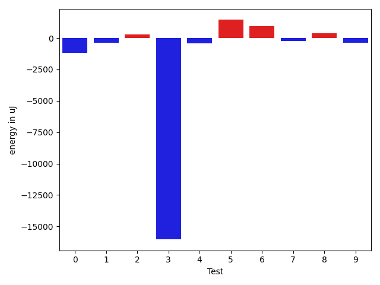

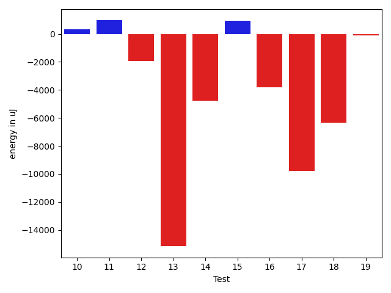

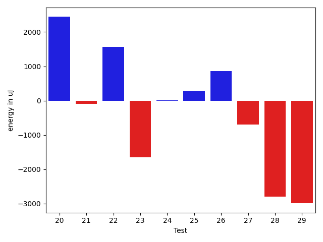

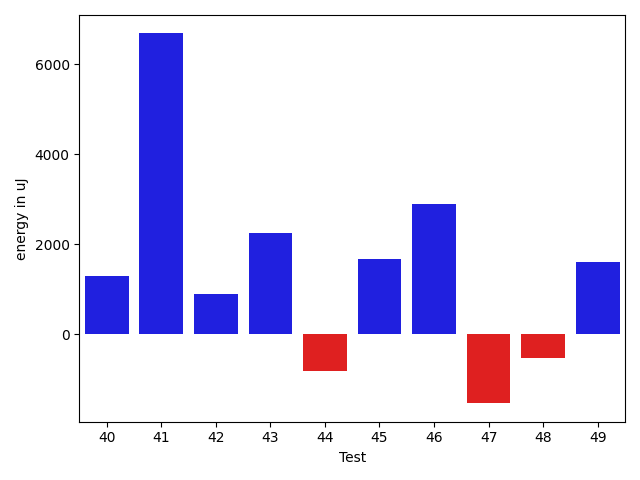

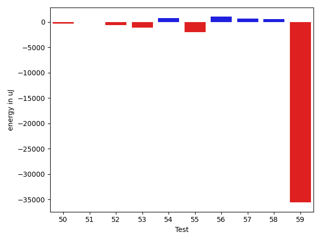

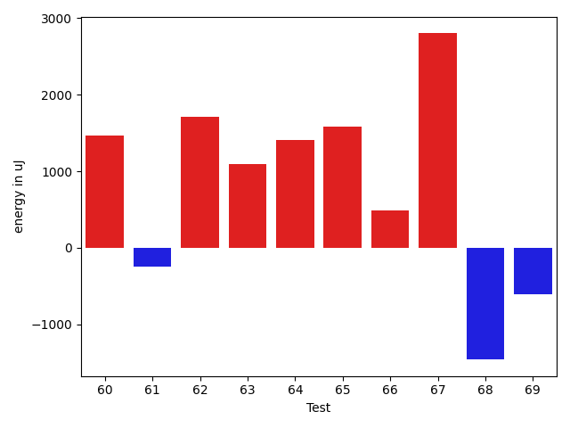

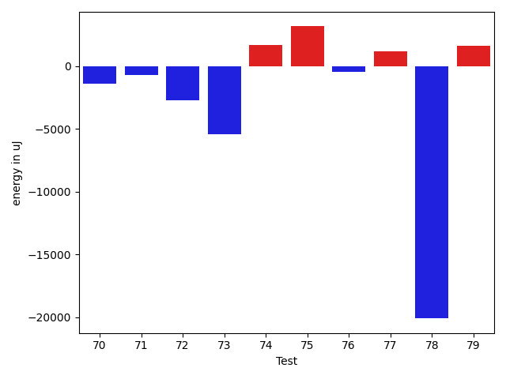

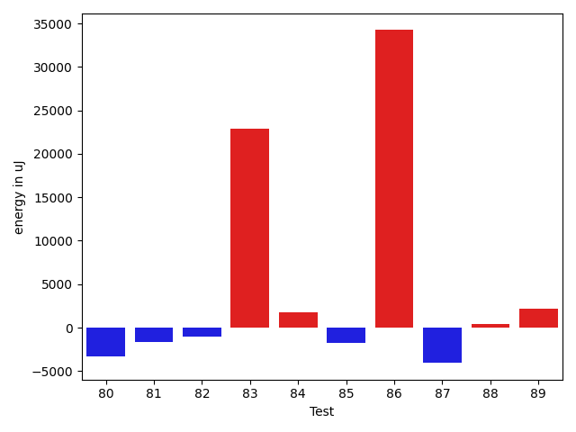

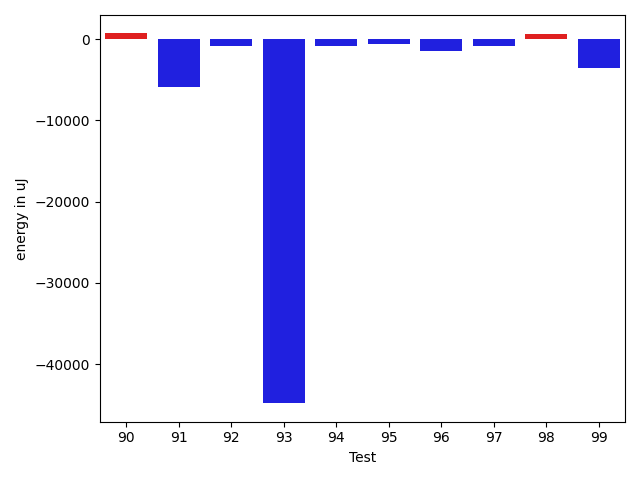

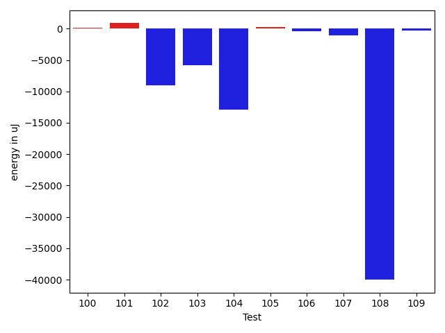

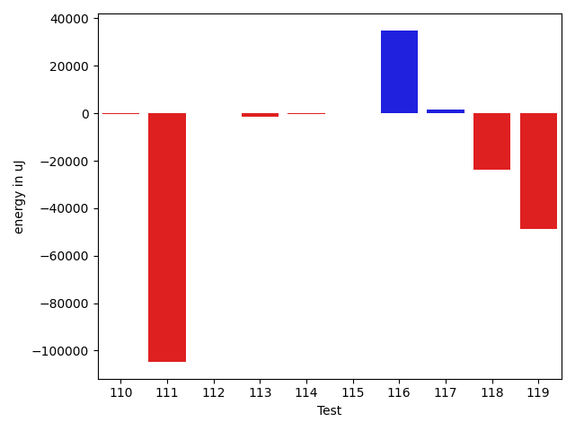

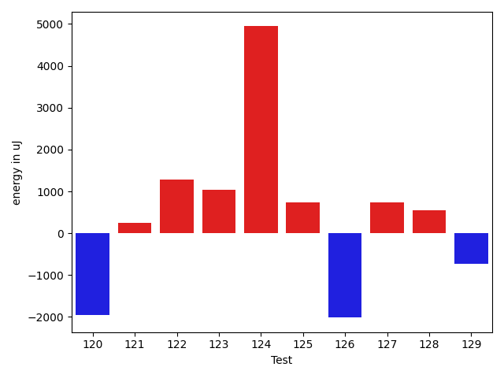

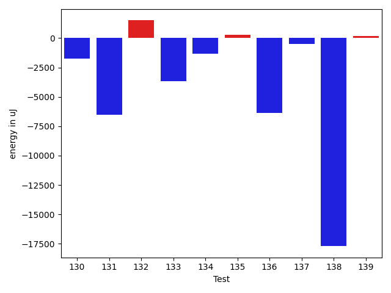

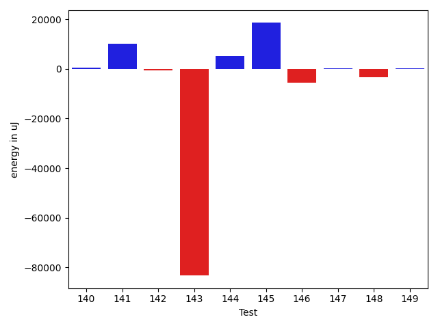

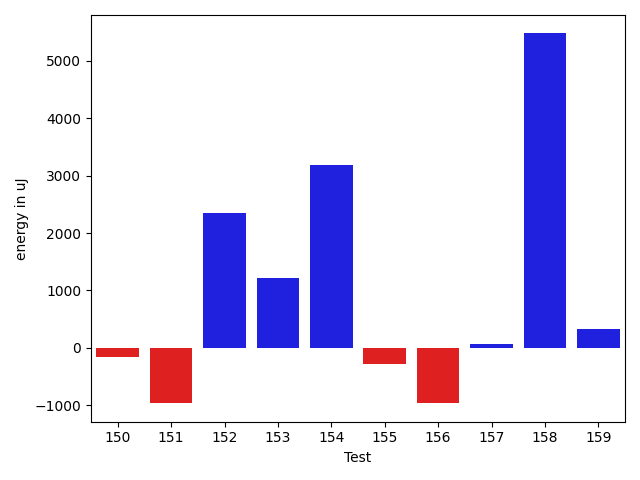

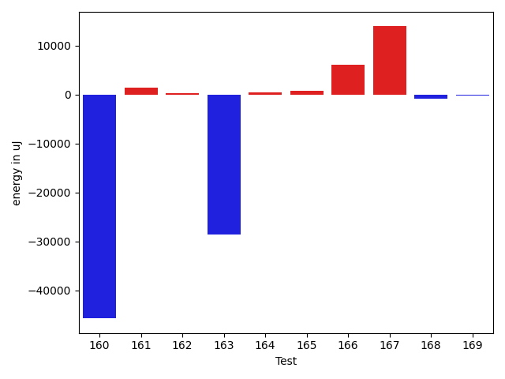

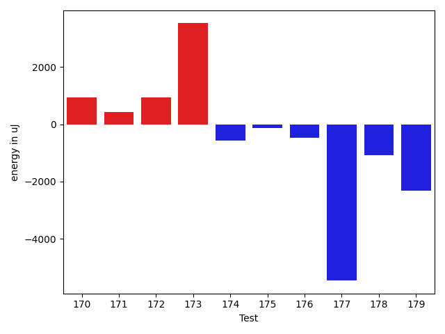

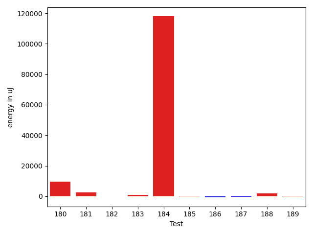

| ID | EnergyV1 | EnergyV2 | DeltaEnergy | σV1 | σV2 |
| --- | --- | --- | --- | --- | --- |
| 0 | 37353 | 37293 | -60 | 3817.7258578404476 | 4347.980878778358 |
| 1 | 37170 | 36743 | -427 | 3961.455126727347 | 3806.149830646888 |
| 2 | 36987 | 36621 | -366 | 2775.136444204252 | 4289.437614523481 |
| 3 | 39794 | 38757 | -1037 | 166528.82860970646 | 134845.15860127163 |
| 4 | 38391 | 37049 | -1342 | 4216.06285597596 | 4130.367101372318 |
| 5 | 35095 | 36743 | 1648 | 4116.801215644854 | 4759.887970670458 |
| 6 | 36744 | 37903 | 1159 | 3151.105499307916 | 3844.4426852275997 |
| 7 | 37415 | 38391 | 976 | 4539.086344134265 | 4424.230340078487 |
| 8 | 35339 | 36071 | 732 | 7153.425479659659 | 7564.825042403579 |
| 9 | 36865 | 35828 | -1037 | 4660.162884643794 | 4858.919623862194 |
| 10 | 35217 | 35889 | 672 | 3749.3028157609465 | 3406.1730933947106 |
| 11 | 34546 | 36133 | 1587 | 3631.0826378154256 | 3944.990278681164 |
| 12 | 38514 | 37048 | -1466 | 20065.49956209386 | 17455.45901164523 |
| 13 | 40100 | 41015 | 915 | 216839.25017918803 | 176888.9835498545 |
| 14 | 78613 | 78125 | -488 | 23800.14473092417 | 22612.089528123546 |
| 15 | 35461 | 36560 | 1099 | 4245.054620539285 | 3557.8039489983857 |
| 16 | 39368 | 38086 | -1282 | 16737.368924118295 | 13589.807806226358 |
| 17 | 39123 | 37171 | -1952 | 27974.251445472066 | 11877.954588227718 |
| 18 | 41199 | 36865 | -4334 | 16360.73345343814 | 14822.168678156753 |
| 19 | 36621 | 35583 | -1038 | 4367.315897374603 | 4719.4807498787895 |
| 20 | 34729 | 38391 | 3662 | 4620.900132359602 | 3679.6715494753253 |
| 21 | 36987 | 37781 | 794 | 4181.329370482128 | 4376.4036731148935 |
| 22 | 36133 | 37475 | 1342 | 3782.3687018883807 | 4476.424243741791 |
| 23 | 37109 | 36011 | -1098 | 7027.810932136069 | 4153.056748353111 |
| 24 | 35339 | 35950 | 611 | 4315.14267570939 | 3966.1356064605284 |
| 25 | 41321 | 40284 | -1037 | 22031.697308748666 | 23357.873857590854 |
| 26 | 36133 | 37415 | 1282 | 3564.9462390564936 | 4872.975438579595 |
| 27 | 39368 | 39551 | 183 | 7171.765937431435 | 3768.4777764524342 |
| 28 | 37171 | 33386 | -3785 | 4017.2033230705274 | 3918.0795579105493 |
| 29 | 37780 | 34851 | -2929 | 7714.555423719067 | 7133.168167653465 |
| 30 | 37414 | 38452 | 1038 | 3939.7153993023403 | 3910.0910112139754 |
| 31 | 35888 | 35034 | -854 | 3916.8312638328416 | 4679.762427196491 |
| 32 | 39368 | 39123 | -245 | 32878.936164150226 | 33553.064492345555 |
| 33 | 36865 | 36255 | -610 | 4600.573788941983 | 3305.2777165214625 |
| 34 | 36071 | 36316 | 245 | 3912.301881428448 | 4601.4725649030615 |
| 35 | 39734 | 38086 | -1648 | 11703.76828340164 | 12739.117630465404 |
| 36 | 81847 | 84106 | 2259 | 211963.59970057436 | 297569.9342657058 |
| 37 | 34912 | 34668 | -244 | 3084.8670554306104 | 3184.7776010892817 |
| 38 | 35278 | 36743 | 1465 | 10062.0950895123 | 13241.229783125475 |
| 39 | 37048 | 36377 | -671 | 3277.8703384294436 | 3785.503301693198 |
| 40 | 35523 | 36377 | 854 | 3127.532022152096 | 3969.3427645168445 |
| 41 | 107544 | 110961 | 3417 | 19057.426398905463 | 22377.579970661085 |
| 42 | 34729 | 36072 | 1343 | 3740.332562932306 | 3968.244290952283 |
| 43 | 35949 | 37354 | 1405 | 11005.883057828236 | 11937.74287434376 |
| 44 | 35949 | 34119 | -1830 | 3561.7145155107532 | 3703.079477581321 |
| 45 | 35583 | 35706 | 123 | 8754.43044370191 | 9223.406302518668 |
| 46 | 34179 | 37170 | 2991 | 3473.396601400031 | 3349.812379759773 |
| 47 | 35889 | 34119 | -1770 | 4173.229125347017 | 3906.8940359715734 |
| 48 | 35217 | 34180 | -1037 | 4143.653635078588 | 2976.0205781218915 |
| 49 | 33447 | 35766 | 2319 | 3739.08584527921 | 3110.8494266475577 |
| 50 | 34912 | 34241 | -671 | 4411.263594481745 | 4316.234594880554 |
| 51 | 36499 | 35522 | -977 | 3531.89020186425 | 3998.6966681414365 |
| 52 | 36071 | 34240 | -1831 | 3166.538448541838 | 4707.722094983292 |
| 53 | 36255 | 36011 | -244 | 2768.493730788453 | 3696.411060649227 |
| 54 | 35462 | 36133 | 671 | 3619.2169982648593 | 4387.591512346606 |
| 55 | 39489 | 37475 | -2014 | 34665.06295759079 | 30795.948976852294 |
| 56 | 35949 | 36743 | 794 | 3849.4618015312044 | 4100.541055193259 |
| 57 | 36194 | 36254 | 60 | 4372.652394188206 | 3851.0188414009617 |
| 58 | 36560 | 37171 | 611 | 3782.3239254017717 | 4527.76075136459 |
| 59 | 42663 | 43945 | 1282 | 309567.4736316681 | 195071.03861583478 |
| 60 | 38818 | 40283 | 1465 | 19026.03574828405 | 13313.796151474238 |
| 61 | 37048 | 36804 | -244 | 4157.560454999997 | 3845.154190341396 |
| 62 | 34851 | 36560 | 1709 | 3607.9845487233633 | 3756.2804249180913 |
| 63 | 35523 | 36621 | 1098 | 4116.157188820143 | 3797.8903901311237 |
| 64 | 35889 | 37293 | 1404 | 3880.2122226522583 | 4035.613009674312 |
| 65 | 35827 | 37415 | 1588 | 3708.1213900702273 | 4082.8073878276173 |
| 66 | 35523 | 36011 | 488 | 3932.672210116453 | 3904.3196931242665 |
| 67 | 34912 | 37720 | 2808 | 4490.382186654297 | 4527.739747747582 |
| 68 | 39673 | 38208 | -1465 | 388510.4883179023 | 344592.9459483735 |
| 69 | 38941 | 38330 | -611 | 3909.446194804142 | 4215.289279742418 |
| 70 | 37780 | 36377 | -1403 | 5645.424007729019 | 7465.750425659967 |
| 71 | 39368 | 38696 | -672 | 13355.998207523657 | 14607.4250752213 |
| 72 | 40100 | 37415 | -2685 | 4252.845745410484 | 4819.617979584669 |
| 73 | 42541 | 37109 | -5432 | 5517.491168385309 | 4530.739506889569 |
| 74 | 40222 | 41932 | 1710 | 16498.296586133423 | 17018.52787647533 |
| 75 | 37415 | 40588 | 3173 | 3309.4141569362664 | 19494.106031190327 |
| 76 | 37476 | 37048 | -428 | 4602.444132875224 | 6982.82799004102 |
| 77 | 37170 | 38330 | 1160 | 4332.01362374495 | 4083.7422319833004 |
| 78 | 60913 | 40832 | -20081 | 39338.91096835169 | 45008.10408028885 |
| 79 | 37048 | 38696 | 1648 | 3327.9336665509018 | 13403.463600088184 |
| 80 | 38269 | 37842 | -427 | 17104.451966470984 | 8788.869248865816 |
| 81 | 37964 | 37659 | -305 | 2988.7281947715187 | 3824.8698323269705 |
| 82 | 38574 | 37903 | -671 | 4426.346781517114 | 4117.641503856997 |
| 83 | 39551 | 39794 | 243 | 209154.28721984534 | 269940.697928583 |
| 84 | 35828 | 37537 | 1709 | 3920.725366067086 | 4501.24627791257 |
| 85 | 39368 | 38146 | -1222 | 4058.6548504068714 | 4350.488441834972 |
| 86 | 39368 | 37475 | -1893 | 3968.6890065520406 | 214515.29024727223 |
| 87 | 39490 | 35400 | -4090 | 3334.0531633574396 | 3981.410438139112 |
| 88 | 37292 | 37964 | 672 | 4062.2166149805075 | 3830.5877219397457 |
| 89 | 38940 | 38819 | -121 | 17122.85374931819 | 23025.378493222233 |
| 90 | 38208 | 39672 | 1464 | 14620.654066982475 | 16489.716321915632 |
| 91 | 40039 | 40283 | 244 | 38087.56515341607 | 35555.867243671615 |
| 92 | 38574 | 37171 | -1403 | 3898.0887530173045 | 3950.9195444748784 |
| 93 | 40650 | 39429 | -1221 | 254875.12988727682 | 39177.282091368324 |
| 94 | 38086 | 38208 | 122 | 3703.1554907731015 | 4420.855282961912 |
| 95 | 38147 | 37476 | -671 | 4467.242415769341 | 3886.9418709826928 |
| 96 | 38452 | 36377 | -2075 | 5942.577741127376 | 4420.016772011891 |
| 97 | 36376 | 36316 | -60 | 4287.263471188812 | 4147.902372120474 |
| 98 | 38208 | 39612 | 1404 | 3609.218892134123 | 3727.524552468595 |
| 99 | 39062 | 39124 | 62 | 18792.70881189432 | 13536.782658316415 |
| 100 | 39673 | 40771 | 1098 | 3334.717076788108 | 3836.046099641065 |
| 101 | 36560 | 37354 | 794 | 3696.5180547600016 | 4017.7816258864364 |
| 102 | 37110 | 40039 | 2929 | 33096.11251061906 | 4193.757927991761 |
| 103 | 39245 | 35827 | -3418 | 11453.02336929424 | 4865.49362419689 |
| 104 | 38696 | 39184 | 488 | 37788.69791236804 | 21479.48976528885 |
| 105 | 37231 | 37964 | 733 | 4041.563845962062 | 4145.129885250336 |
| 106 | 37353 | 36621 | -732 | 3278.9638186487455 | 3662.228349567378 |
| 107 | 36438 | 34973 | -1465 | 4507.269719852585 | 4282.198751070214 |
| 108 | 40344 | 40528 | 184 | 175027.5021403494 | 3238.0934106276823 |
| 109 | 39062 | 38818 | -244 | 4532.917495822464 | 3631.5925477512505 |
| 110 | 38086 | 36682 | -1404 | 3877.739944116495 | 3463.314505441067 |
| 111 | 41626 | 42114 | 488 | 406640.50277930504 | 178109.04086511876 |
| 112 | 38635 | 39245 | 610 | 4472.334170333147 | 3539.0725059679626 |
| 113 | 38391 | 39001 | 610 | 8339.934709060311 | 3755.6710314540114 |
| 114 | 36621 | 36987 | 366 | 4687.135596175853 | 4056.7378618786793 |
| 115 | 36866 | 38024 | 1158 | 7404.890419937826 | 4840.505631718516 |
| 116 | 60180 | 69885 | 9705 | 222993.8193438376 | 307611.14438792097 |
| 117 | 38635 | 39124 | 489 | 12507.956629105032 | 13584.582096452348 |
| 118 | 101807 | 42175 | -59632 | 47138.45019524601 | 38101.095156877 |
| 119 | 38879 | 39123 | 244 | 321045.8907694261 | 256928.6990076522 |
| 120 | 38758 | 36805 | -1953 | 233396.39297808742 | 171194.72196910842 |
| 121 | 38025 | 38269 | 244 | 31398.885144031563 | 15320.847736825792 |
| 122 | 36194 | 37475 | 1281 | 4739.714760102592 | 242115.1872926875 |
| 123 | 37903 | 38940 | 1037 | 15437.425218732495 | 13364.83422835049 |
| 124 | 155090 | 160033 | 4943 | 278844.67508505646 | 215146.78471668158 |
| 125 | 36682 | 37414 | 732 | 4001.1171442944365 | 4340.853391519538 |
| 126 | 38086 | 36071 | -2015 | 4146.478491979 | 4541.777785116198 |
| 127 | 36621 | 37353 | 732 | 4347.912293267767 | 4752.550216336704 |
| 128 | 36438 | 36988 | 550 | 4340.991451639807 | 3772.9876647515493 |
| 129 | 37475 | 36743 | -732 | 3759.4312676762697 | 5697.556214841581 |
| 130 | 39185 | 36438 | -2747 | 4425.82018539721 | 4925.400684501979 |
| 131 | 39551 | 38086 | -1465 | 31810.62685088844 | 28816.917851961283 |
| 132 | 36437 | 37902 | 1465 | 4512.247065087293 | 4196.130283412551 |
| 133 | 39612 | 38696 | -916 | 23364.633148408775 | 25108.707479170724 |
| 134 | 37292 | 36926 | -366 | 9259.335740084236 | 6945.000268183527 |
| 135 | 38330 | 36194 | -2136 | 8491.24738201046 | 11075.08019470193 |
| 136 | 80383 | 81177 | 794 | 180249.4436297471 | 197809.75710845191 |
| 137 | 37536 | 37720 | 184 | 9218.919480922552 | 7220.399473071625 |
| 138 | 40955 | 38269 | -2686 | 36174.75514027037 | 13702.078902383031 |
| 139 | 37171 | 38757 | 1586 | 4426.549817376315 | 4625.199251751214 |
| 140 | 36194 | 36926 | 732 | 3136.494709547621 | 3379.318203720629 |
| 141 | 38330 | 39367 | 1037 | 14597.912479120212 | 28302.503286328807 |
| 142 | 38635 | 38086 | -549 | 7158.139132590108 | 7021.1386362699195 |
| 143 | 37597 | 37231 | -366 | 317397.49405991705 | 3870.3471354662033 |
| 144 | 39795 | 38879 | -916 | 39676.55085176677 | 42665.18352862041 |
| 145 | 38330 | 38452 | 122 | 243011.15625113726 | 268072.642899689 |
| 146 | 38697 | 36865 | -1832 | 16858.862466923412 | 4162.143948736036 |
| 147 | 38757 | 37781 | -976 | 5088.626715283801 | 4125.6381139851055 |
| 148 | 41076 | 37354 | -3722 | 3372.9802189004054 | 3702.2866833716507 |
| 149 | 36560 | 37354 | 794 | 4694.5271204194505 | 3585.2438230660596 |
| 150 | 40406 | 38391 | -2015 | 14971.334701176493 | 17544.413396410615 |
| 151 | 36988 | 35156 | -1832 | 4437.280151405016 | 4292.9676043952995 |
| 152 | 37781 | 38452 | 671 | 14269.457853134465 | 18179.215956880915 |
| 153 | 37292 | 37048 | -244 | 7300.819102304034 | 9832.092029899746 |
| 154 | 38452 | 37903 | -549 | 26332.984012439134 | 46191.516456091114 |
| 155 | 37720 | 37659 | -61 | 4497.850494514676 | 3281.1013112229134 |
| 156 | 36804 | 36377 | -427 | 5064.670844092711 | 3874.787382242382 |
| 157 | 37964 | 38818 | 854 | 3718.7922500961245 | 4095.8486584826987 |
| 158 | 42236 | 40161 | -2075 | 320098.1119085231 | 355292.30516734935 |
| 159 | 38696 | 37780 | -916 | 4402.055304816907 | 7074.291222721286 |
| 160 | 41137 | 42236 | 1099 | 333335.64853658434 | 183851.2660048532 |
| 161 | 39306 | 37598 | -1708 | 22050.70250199106 | 26800.673394327503 |
| 162 | 37353 | 37476 | 123 | 4963.018144476202 | 3806.216948291068 |
| 163 | 39307 | 39063 | -244 | 327337.5444847011 | 283352.28486606077 |
| 164 | 40161 | 39124 | -1037 | 7281.018329571514 | 9862.84230634467 |
| 165 | 39246 | 39368 | 122 | 9548.847398197668 | 14296.90013559813 |
| 166 | 43213 | 69702 | 26489 | 25975.54393547518 | 28262.042152562168 |
| 167 | 110473 | 117004 | 6531 | 297274.6155782142 | 292523.16887800803 |
| 168 | 38880 | 37048 | -1832 | 4040.186907549437 | 4619.605778147709 |
| 169 | 37292 | 35584 | -1708 | 4591.089684355547 | 3969.8548701432396 |
| 170 | 37232 | 37780 | 548 | 4853.734590940253 | 3176.969994743419 |
| 171 | 39307 | 36743 | -2564 | 4917.693081420957 | 3436.172792861267 |
| 172 | 38574 | 38575 | 1 | 3817.8937510680466 | 5097.613444644948 |
| 173 | 40711 | 41259 | 548 | 43547.00790213844 | 43975.936039447246 |
| 174 | 39245 | 39550 | 305 | 4494.8895810710155 | 5229.8977612925455 |
| 175 | 39551 | 38941 | -610 | 4277.621190790872 | 3890.6737650464556 |
| 176 | 39245 | 36865 | -2380 | 3944.484275542241 | 4342.907945471502 |
| 177 | 42358 | 40344 | -2014 | 31230.957388775343 | 17608.64471544712 |
| 178 | 38086 | 37353 | -733 | 3922.4868903342804 | 3281.4517204569665 |
| 179 | 39978 | 37109 | -2869 | 4721.738966449115 | 4528.5290867731765 |
| 180 | 165283 | 174194 | 8911 | 66626.53944539769 | 74144.73730578086 |
| 181 | 37781 | 39124 | 1343 | 5514.857002966127 | 7497.492308189209 |
| 182 | 37048 | 37597 | 549 | 7721.2488017270725 | 5937.193747429014 |
| 183 | 36072 | 37293 | 1221 | 4224.4059236966405 | 3974.5036552449615 |
| 184 | 40039 | 41931 | 1892 | 354156.7966532118 | 498130.2908341949 |
| 185 | 37902 | 37598 | -304 | 3943.9121251887796 | 3808.4041354558103 |
| 186 | 40344 | 39490 | -854 | 4128.307368667534 | 5005.0811980475155 |
| 187 | 37598 | 36804 | -794 | 4496.713867181877 | 6012.248373773036 |
| 188 | 38452 | 39673 | 1221 | 3583.503273932607 | 3435.063300223623 |
| 189 | 37415 | 37964 | 549 | 4191.771378546306 | 4294.914181017618 |

## Delta Duration per test method

| ID | DurationV1 | DurationsV2 | DeltaDuration |
| --- | --- | --- | --- |
| 0 | 506677.38095238095 | 425511.5 | -81165.88095238095 |
| 1 | 504736.3181818182 | 433039.4 | -71696.91818181815 |
| 2 | 503468.1666666667 | 478240.6 | -25227.56666666671 |
| 3 | 2224863.085106383 | 1701814.1578947369 | -523048.9272116462 |
| 4 | 847541.1578947369 | 704651.0666666667 | -142890.0912280702 |
| 5 | 439556.70588235295 | 420917.4 | -18639.305882352928 |
| 6 | 509937.0909090909 | 429692.2 | -80244.89090909087 |
| 7 | 400960.8888888889 | 428731.96153846156 | 27771.072649572685 |
| 8 | 1071233.6206896552 | 935119.9696969697 | -136113.65099268546 |
| 9 | 793463.5348837209 | 718910.0 | -74553.53488372092 |
| 10 | 857088.5892857143 | 769512.2786885246 | -87576.3105971897 |
| 11 | 947272.6 | 784514.7333333333 | -162757.8666666667 |
| 12 | 1315614.3166666667 | 1111578.1886792453 | -204036.12798742135 |
| 13 | 2831188.3970588236 | 2291066.0 | -540122.3970588236 |
| 14 | 2610272.8080808083 | 2477188.5353535353 | -133084.27272727294 |
| 15 | 1115947.612244898 | 859169.5434782609 | -256778.06876663712 |
| 16 | 1415868.342857143 | 1162734.3424657534 | -253134.00039138948 |
| 17 | 1357438.1509433961 | 926200.48 | -431237.67094339617 |
| 18 | 1276459.1063829786 | 863575.5555555555 | -412883.5508274231 |
| 19 | 785667.59375 | 573410.4736842106 | -212257.12006578944 |
| 20 | 674040.3157894737 | 548614.3333333334 | -125425.98245614034 |
| 21 | 800714.4285714285 | 778822.0243902439 | -21892.404181184596 |
| 22 | 750815.7454545455 | 688090.7659574468 | -62724.97949709871 |
| 23 | 889462.9636363636 | 840358.5272727272 | -49104.4363636364 |
| 24 | 515829.6111111111 | 447425.7037037037 | -68403.90740740742 |
| 25 | 1662631.585106383 | 1647311.7857142857 | -15319.799392097397 |
| 26 | 636984.4864864865 | 661370.84375 | 24386.35726351349 |
| 27 | 940858.1076923077 | 941685.9298245613 | 827.8221322536701 |
| 28 | 552329.9666666667 | 606251.7586206896 | 53921.79195402295 |
| 29 | 798507.1086956522 | 917630.1944444445 | 119123.08574879228 |
| 30 | 438273.65 | 463139.07692307694 | 24865.426923076913 |
| 31 | 497185.347826087 | 640259.25 | 143073.90217391303 |
| 32 | 1155010.361111111 | 1288998.9 | 133988.5388888889 |
| 33 | 523880.5 | 575280.3666666667 | 51399.8666666667 |
| 34 | 600335.8571428572 | 596898.2333333333 | -3437.6238095238805 |
| 35 | 1013194.1282051282 | 1097648.761904762 | 84454.63369963365 |
| 36 | 3980154.5656565656 | 5130030.626262627 | 1149876.060606061 |
| 37 | 756834.3035714285 | 811748.3 | 54913.996428571525 |
| 38 | 1254321.076923077 | 1346931.7263157894 | 92610.6493927124 |
| 39 | 746135.2222222222 | 742687.4464285715 | -3447.7757936507696 |
| 40 | 737521.7727272727 | 753496.1111111111 | 15974.338383838418 |
| 41 | 3377526.9292929294 | 3457689.262626263 | 80162.33333333349 |
| 42 | 833452.6896551724 | 847535.8103448276 | 14083.120689655188 |
| 43 | 1217077.2471910112 | 1304236.021978022 | 87158.77478701086 |
| 44 | 855305.4 | 902256.9444444445 | 46951.54444444447 |
| 45 | 1075286.1014492754 | 1126836.0447761193 | 51549.9433268439 |
| 46 | 469052.81481481483 | 534254.1904761905 | 65201.3756613757 |
| 47 | 459599.95454545453 | 535446.2105263158 | 75846.25598086132 |
| 48 | 510733.65 | 508621.63636363635 | -2112.0136363636702 |
| 49 | 547599.7428571428 | 551252.9375 | 3653.1946428571828 |
| 50 | 521231.0833333333 | 526978.1935483871 | 5747.110215053835 |
| 51 | 752797.5333333333 | 784102.7704918033 | 31305.237158469972 |
| 52 | 625908.6875 | 678570.5675675676 | 52661.880067567574 |
| 53 | 450942.3333333333 | 470096.3076923077 | 19153.974358974374 |
| 54 | 792497.8478260869 | 765473.1153846154 | -27024.73244147154 |
| 55 | 1103812.1875 | 1081518.0487804879 | -22294.13871951215 |
| 56 | 814135.7966101695 | 777867.2615384615 | -36268.53507170791 |
| 57 | 812381.274509804 | 811757.551724138 | -623.7227856660029 |
| 58 | 600533.3333333334 | 608882.5 | 8349.166666666628 |
| 59 | 4286583.98630137 | 3181623.621621622 | -1104960.3646797482 |
| 60 | 951542.8529411765 | 748574.2857142857 | -202968.56722689082 |
| 61 | 511826.5517241379 | 546639.65 | 34813.09827586211 |
| 62 | 594532.25 | 548712.2941176471 | -45819.95588235289 |
| 63 | 822436.4901960784 | 836091.5094339623 | 13655.019237883855 |
| 64 | 533600.7741935484 | 547273.1724137932 | 13672.398220244795 |
| 65 | 592429.8709677419 | 592971.0952380953 | 541.2242703533266 |
| 66 | 530925.2333333333 | 529526.0370370371 | -1399.1962962961989 |
| 67 | 513154.43333333335 | 492124.7 | -21029.733333333337 |
| 68 | 4096212.6585365855 | 3880347.761904762 | -215864.8966318234 |
| 69 | 549239.0 | 557273.3684210526 | 8034.368421052583 |
| 70 | 813133.9545454546 | 879636.6086956522 | 66502.65415019763 |
| 71 | 1126499.725 | 1193614.4383561644 | 67114.71335616428 |
| 72 | 410139.29411764705 | 503174.0 | 93034.70588235295 |
| 73 | 516383.3888888889 | 626801.6538461539 | 110418.264957265 |
| 74 | 1483781.793814433 | 1572465.9278350514 | 88684.1340206184 |
| 75 | 721413.2115384615 | 1478708.2048192772 | 757294.9932808157 |
| 76 | 890038.3606557377 | 956178.5652173914 | 66140.20456165366 |
| 77 | 717910.641509434 | 765843.0666666667 | 47932.425157232676 |
| 78 | 2036476.01010101 | 1979540.4329896907 | -56935.577111319406 |
| 79 | 833223.081632653 | 1084103.6333333333 | 250880.55170068028 |
| 80 | 1202599.455882353 | 1078228.5 | -124370.95588235301 |
| 81 | 554712.0833333334 | 631359.0344827586 | 76646.95114942524 |
| 82 | 645738.8611111111 | 663002.1428571428 | 17263.281746031716 |
| 83 | 2164866.1948051946 | 2843429.595238095 | 678563.4004329005 |
| 84 | 475829.5263157895 | 423604.8095238095 | -52224.71679197997 |
| 85 | 950545.4528301887 | 919895.4126984127 | -30650.04013177601 |
| 86 | 739470.6296296297 | 1753173.054054054 | 1013702.4244244243 |
| 87 | 363445.375 | 552841.4615384615 | 189396.0865384615 |
| 88 | 833963.8947368421 | 853803.4561403509 | 19839.561403508764 |
| 89 | 1053761.4237288137 | 1156429.3396226414 | 102667.9158938278 |
| 90 | 1287821.8048780488 | 1296983.7105263157 | 9161.905648266897 |
| 91 | 1663640.372881356 | 1625666.52 | -37973.85288135591 |
| 92 | 803671.94 | 782994.6111111111 | -20677.32888888882 |
| 93 | 2503467.5405405406 | 1311803.6229508198 | -1191663.9175897208 |
| 94 | 565928.7272727273 | 496187.17391304346 | -69741.55335968384 |
| 95 | 590807.0322580645 | 591280.78125 | 473.7489919355139 |
| 96 | 884772.1911764706 | 878264.3559322034 | -6507.835244267248 |
| 97 | 744028.8604651163 | 675332.1052631579 | -68696.75520195847 |
| 98 | 704952.4285714285 | 724082.6363636364 | 19130.20779220783 |
| 99 | 1442592.051020408 | 1388287.3232323232 | -54304.727788084885 |
| 100 | 452091.4666666667 | 472164.64285714284 | 20073.176190476166 |
| 101 | 712981.0625 | 712907.119047619 | -73.94345238094684 |
| 102 | 971094.0666666667 | 391003.4375 | -580090.6291666667 |
| 103 | 831391.12 | 567448.0384615385 | -263943.0815384615 |
| 104 | 1319425.037037037 | 696898.0 | -622527.0370370371 |
| 105 | 449138.1111111111 | 461836.04347826086 | 12697.93236714974 |
| 106 | 493818.652173913 | 515117.125 | 21298.472826086974 |
| 107 | 479956.75 | 470105.347826087 | -9851.402173913026 |
| 108 | 1738323.6 | 442834.04545454547 | -1295489.5545454547 |
| 109 | 559716.1612903225 | 587023.8709677419 | 27307.709677419392 |
| 110 | 711758.6304347826 | 715845.1428571428 | 4086.512422360247 |
| 111 | 5540349.523076923 | 2227666.184615385 | -3312683.338461538 |
| 112 | 615237.2727272727 | 547294.1282051282 | -67943.14452214446 |
| 113 | 955457.6041666666 | 785077.1739130435 | -170380.43025362317 |
| 114 | 632933.2142857143 | 615232.28 | -17700.93428571429 |
| 115 | 844070.8269230769 | 863103.754385965 | 19032.927462888067 |
| 116 | 2895726.3131313133 | 3779969.494949495 | 884243.1818181816 |
| 117 | 1209196.5714285714 | 1284454.4320987654 | 75257.86067019403 |
| 118 | 2614671.470588235 | 1839219.2972972973 | -775452.1732909379 |
| 119 | 4277786.692307692 | 2648303.0 | -1629483.692307692 |
| 120 | 2100428.1363636362 | 1541734.2368421052 | -558693.8995215311 |
| 121 | 1024458.9375 | 794314.96875 | -230143.96875 |
| 122 | 659001.6551724138 | 1667506.064516129 | 1008504.4093437152 |
| 123 | 1207751.8205128205 | 1228869.6 | 21117.779487179592 |
| 124 | 6629784.5050505055 | 5768637.454545454 | -861147.0505050514 |
| 125 | 674861.9487179487 | 691223.6388888889 | 16361.690170940128 |
| 126 | 723755.3777777777 | 736784.575 | 13029.197222222225 |
| 127 | 601709.6428571428 | 632948.0 | 31238.35714285716 |
| 128 | 780049.5333333333 | 783406.6666666666 | 3357.1333333333023 |
| 129 | 910707.0 | 903306.7580645161 | -7400.2419354838785 |
| 130 | 593529.4 | 611269.5 | 17740.099999999977 |
| 131 | 1220705.6666666667 | 944233.303030303 | -276472.36363636376 |
| 132 | 468264.75 | 421612.9090909091 | -46651.84090909088 |
| 133 | 1152298.6666666667 | 1006333.9696969697 | -145964.69696969702 |
| 134 | 1015266.9491525424 | 957787.6184210526 | -57479.33073148981 |
| 135 | 1014258.5072463768 | 977134.6842105263 | -37123.82303585054 |
| 136 | 3282291.1919191917 | 2879161.878787879 | -403129.31313131284 |
| 137 | 1086120.3466666667 | 1019424.375 | -66695.97166666668 |
| 138 | 1436984.8260869565 | 1031393.7321428572 | -405591.0939440994 |
| 139 | 505134.21428571426 | 486058.28 | -19075.934285714233 |
| 140 | 502543.724137931 | 488109.6206896552 | -14434.103448275826 |
| 141 | 1142163.3088235294 | 1501017.5857142857 | 358854.27689075633 |
| 142 | 767197.7321428572 | 815589.9666666667 | 48392.234523809515 |
| 143 | 2765792.5483870967 | 537740.7419354839 | -2228051.806451613 |
| 144 | 1727471.534883721 | 1855075.7272727273 | 127604.19238900626 |
| 145 | 1733613.46875 | 2550519.923076923 | 816906.454326923 |
| 146 | 671543.4782608695 | 497005.27777777775 | -174538.20048309176 |
| 147 | 517381.65 | 563333.1515151515 | 45951.50151515147 |
| 148 | 443851.70588235295 | 551627.6296296297 | 107775.92374727671 |
| 149 | 525389.0 | 550754.5833333334 | 25365.583333333372 |
| 150 | 692362.2258064516 | 840378.0731707317 | 148015.84736428002 |
| 151 | 971450.1095890411 | 950705.7878787878 | -20744.32171025325 |
| 152 | 1379853.0689655172 | 1374407.7333333334 | -5445.335632183822 |
| 153 | 1141158.717647059 | 1148565.4615384615 | 7406.743891402613 |
| 154 | 1388136.65 | 1526100.6790123456 | 137964.0290123457 |
| 155 | 568811.3461538461 | 507004.0 | -61807.34615384613 |
| 156 | 709222.6315789474 | 714690.8536585366 | 5468.222079589148 |
| 157 | 759995.975 | 711197.0 | -48798.97499999998 |
| 158 | 4038488.415730337 | 4226601.021978022 | 188112.60624768445 |
| 159 | 756724.2 | 768256.4054054054 | 11532.20540540549 |
| 160 | 3934394.9142857143 | 2565097.6507936507 | -1369297.2634920636 |
| 161 | 1119429.3970588236 | 1252940.5507246377 | 133511.15366581408 |
| 162 | 822749.22 | 830961.283018868 | 8212.063018867979 |
| 163 | 3616527.3387096776 | 2844927.090909091 | -771600.2478005867 |
| 164 | 1006557.9178082192 | 1190584.9333333333 | 184027.01552511414 |
| 165 | 1233551.7083333333 | 1243735.4675324676 | 10183.759199134307 |
| 166 | 1834839.2323232323 | 2024821.6666666667 | 189982.4343434344 |
| 167 | 4810840.05050505 | 5285261.676767677 | 474421.6262626266 |
| 168 | 720740.7954545454 | 807348.4255319149 | 86607.63007736951 |
| 169 | 370585.14285714284 | 362501.6 | -8083.542857142864 |
| 170 | 409268.0 | 394649.25 | -14618.75 |
| 171 | 405878.0833333333 | 498530.28 | 92652.19666666671 |
| 172 | 424968.55555555556 | 368737.3157894737 | -56231.23976608185 |
| 173 | 1757727.2075471699 | 1836038.2 | 78310.99245283008 |
| 174 | 441886.4117647059 | 452054.1304347826 | 10167.71867007669 |
| 175 | 435716.4705882353 | 481876.17647058825 | 46159.70588235295 |
| 176 | 399786.35 | 402327.8888888889 | 2541.5388888888992 |
| 177 | 1023446.5714285715 | 1083319.375 | 59872.80357142852 |
| 178 | 488056.76470588235 | 472018.5925925926 | -16038.172113289766 |
| 179 | 417116.55555555556 | 431961.5263157895 | 14844.970760233933 |
| 180 | 5055699.090909091 | 5215990.838383839 | 160291.7474747477 |
| 181 | 1007445.0 | 1052986.9433962265 | 45541.9433962265 |
| 182 | 1102240.8157894737 | 1075120.9871794872 | -27119.828609986464 |
| 183 | 596931.3571428572 | 623585.2916666666 | 26653.93452380947 |
| 184 | 4403870.666666667 | 8077992.521739131 | 3674121.855072464 |
| 185 | 460474.29411764705 | 461374.85714285716 | 900.5630252101109 |
| 186 | 796037.4893617021 | 881002.0344827586 | 84964.5451210565 |
| 187 | 722396.5 | 770313.380952381 | 47916.88095238095 |
| 188 | 484654.71428571426 | 455191.1666666667 | -29463.547619047575 |
| 189 | 762296.45 | 675153.1304347826 | -87143.31956521736 |

## Misc.

| ID | Test Class | Test Method |
| --- | --- | --- |
| 0 | com.google.gson.functional.TypeAdapterPrecedenceTest | testStreamingFollowedByNonstreaming |
| 1 | com.google.gson.functional.TypeAdapterPrecedenceTest | testStreamingHierarchicalFollowedByNonstreaming |
| 2 | com.google.gson.functional.TypeAdapterPrecedenceTest | testSerializeNonstreamingTypeAdapterFollowedByStreamingTypeAdapter |
| 3 | com.google.gson.functional.TypeAdapterPrecedenceTest | testNonstreamingFollowedByNonstreaming |
| 4 | com.google.gson.functional.TypeAdapterPrecedenceTest | testStreamingFollowedByStreaming |
| 5 | com.google.gson.functional.TypeAdapterPrecedenceTest | testStreamingFollowedByNonstreamingHierarchical |
| 6 | com.google.gson.functional.TypeAdapterPrecedenceTest | testNonstreamingHierarchicalFollowedByNonstreaming |
| 7 | com.google.gson.functional.TypeAdapterPrecedenceTest | testStreamingHierarchicalFollowedByNonstreamingHierarchical |
| 8 | com.google.gson.functional.CustomTypeAdaptersTest | testCustomAdapterInvokedForCollectionElementDeserialization |
| 9 | com.google.gson.functional.CustomTypeAdaptersTest | testCustomTypeAdapterAppliesToSubClassesSerializedAsBaseClass |
| 10 | com.google.gson.functional.CustomTypeAdaptersTest | testCustomAdapterInvokedForMapElementDeserialization |
| 11 | com.google.gson.functional.CustomTypeAdaptersTest | testCustomAdapterInvokedForMapElementSerializationWithType |
| 12 | com.google.gson.functional.CustomTypeAdaptersTest | testCustomNestedSerializers |
| 13 | com.google.gson.functional.CustomTypeAdaptersTest | testCustomSerializers |
| 14 | com.google.gson.functional.CustomTypeAdaptersTest | testCustomTypeAdapterDoesNotAppliesToSubClasses |
| 15 | com.google.gson.functional.CustomTypeAdaptersTest | testRegisterHierarchyAdapterForDate |
| 16 | com.google.gson.functional.CustomTypeAdaptersTest | testCustomAdapterInvokedForCollectionElementSerializationWithType |
| 17 | com.google.gson.functional.CustomTypeAdaptersTest | testCustomDeserializers |
| 18 | com.google.gson.functional.CustomTypeAdaptersTest | testEnsureCustomSerializerNotInvokedForNullValues |
| 19 | com.google.gson.functional.CustomTypeAdaptersTest | testEnsureCustomDeserializerNotInvokedForNullValues |
| 20 | com.google.gson.functional.CustomTypeAdaptersTest | testCustomAdapterInvokedForCollectionElementSerialization |
| 21 | com.google.gson.functional.CustomTypeAdaptersTest | testCustomByteArrayDeserializerAndInstanceCreator |
| 22 | com.google.gson.functional.CustomTypeAdaptersTest | testCustomByteArraySerializer |
| 23 | com.google.gson.functional.CustomTypeAdaptersTest | testCustomNestedDeserializers |
| 24 | com.google.gson.functional.CustomTypeAdaptersTest | testCustomAdapterInvokedForMapElementSerialization |
| 25 | com.google.gson.functional.StreamingTypeAdaptersTest | testNullSafe |
| 26 | com.google.gson.functional.StreamingTypeAdaptersTest | testDeserializeWithCustomTypeAdapter |
| 27 | com.google.gson.functional.StreamingTypeAdaptersTest | testSerializeWithCustomTypeAdapter |
| 28 | com.google.gson.functional.ExclusionStrategyFunctionalTest | testExclusionStrategySerializationDoesNotImpactSerialization |
| 29 | com.google.gson.functional.ExclusionStrategyFunctionalTest | testExclusionStrategyWithMode |
| 30 | com.google.gson.functional.ExclusionStrategyFunctionalTest | testExcludeTopLevelClassDeserialization |
| 31 | com.google.gson.functional.ExclusionStrategyFunctionalTest | testExcludeTopLevelClassSerialization |
| 32 | com.google.gson.functional.ExclusionStrategyFunctionalTest | testExclusionStrategySerializationDoesNotImpactDeserialization |
| 33 | com.google.gson.functional.ExclusionStrategyFunctionalTest | testExcludeTopLevelClassDeserializationDoesNotImpactSerialization |
| 34 | com.google.gson.functional.ExclusionStrategyFunctionalTest | testExcludeTopLevelClassSerializationDoesNotImpactDeserialization |
| 35 | com.google.gson.functional.ExclusionStrategyFunctionalTest | testExclusionStrategyDeserialization |
| 36 | com.google.gson.functional.ExclusionStrategyFunctionalTest | testExclusionStrategySerialization |
| 37 | com.google.gson.functional.DefaultTypeAdaptersTest | testDateSerializationWithPatternNotOverridenByTypeAdapter |
| 38 | com.google.gson.functional.DefaultTypeAdaptersTest | testDateSerializationWithPattern |
| 39 | com.google.gson.functional.DefaultTypeAdaptersTest | testSqlDateSerialization |
| 40 | com.google.gson.functional.DefaultTypeAdaptersTest | testTimestampSerialization |
| 41 | com.google.gson.functional.DefaultTypeAdaptersTest | testDefaultDateDeserializationUsingBuilder |
| 42 | com.google.gson.functional.DefaultTypeAdaptersTest | testDateDeserializationWithPattern |
| 43 | com.google.gson.functional.DefaultTypeAdaptersTest | testDateSerializationInCollection |
| 44 | com.google.gson.functional.DefaultTypeAdaptersTest | testSetSerialization |
| 45 | com.google.gson.functional.DefaultTypeAdaptersTest | testClassSerialization |
| 46 | com.google.gson.functional.DefaultTypeAdaptersTest | testDefaultCalendarSerialization |
| 47 | com.google.gson.functional.DefaultTypeAdaptersTest | testBitSetSerialization |
| 48 | com.google.gson.functional.DefaultTypeAdaptersTest | testDefaultGregorianCalendarDeserialization |
| 49 | com.google.gson.functional.DefaultTypeAdaptersTest | testDefaultCalendarDeserialization |
| 50 | com.google.gson.functional.DefaultTypeAdaptersTest | testClassDeserialization |
| 51 | com.google.gson.functional.DefaultTypeAdaptersTest | testDefaultDateSerializationUsingBuilder |
| 52 | com.google.gson.functional.DefaultTypeAdaptersTest | testBitSetDeserialization |
| 53 | com.google.gson.functional.DefaultTypeAdaptersTest | testDefaultGregorianCalendarSerialization |
| 54 | com.google.gson.functional.NamingPolicyTest | testAtSignInSerializedName |
| 55 | com.google.gson.functional.NamingPolicyTest | testGsonWithNonDefaultFieldNamingPolicySerialization |
| 56 | com.google.gson.functional.NamingPolicyTest | testGsonWithSerializedNameFieldNamingPolicySerialization |
| 57 | com.google.gson.functional.NamingPolicyTest | testComplexFieldNameStrategy |
| 58 | com.google.gson.functional.NamingPolicyTest | testGsonWithLowerCaseDashPolicySerialization |
| 59 | com.google.gson.functional.NamingPolicyTest | testGsonDuplicateNameUsingSerializedNameFieldNamingPolicySerialization |
| 60 | com.google.gson.functional.NamingPolicyTest | testGsonWithNonDefaultFieldNamingPolicyDeserialiation |
| 61 | com.google.gson.functional.NamingPolicyTest | testGsonWithLowerCaseDashPolicyDeserialiation |
| 62 | com.google.gson.functional.NamingPolicyTest | testGsonWithUpperCamelCaseSpacesPolicyDeserialiation |
| 63 | com.google.gson.functional.NamingPolicyTest | testDeprecatedNamingStrategy |
| 64 | com.google.gson.functional.NamingPolicyTest | testGsonWithLowerCaseUnderscorePolicySerialization |
| 65 | com.google.gson.functional.NamingPolicyTest | testGsonWithLowerCaseUnderscorePolicyDeserialiation |
| 66 | com.google.gson.functional.NamingPolicyTest | testGsonWithSerializedNameFieldNamingPolicyDeserialization |
| 67 | com.google.gson.functional.NamingPolicyTest | testGsonWithUpperCamelCaseSpacesPolicySerialiation |
| 68 | com.google.gson.LongSerializationPolicyTest | testDefaultLongSerializationIntegration |
| 69 | com.google.gson.LongSerializationPolicyTest | testStringLongSerializationIntegration |
| 70 | com.google.gson.functional.ReadersWritersTest | testReadWriteTwoObjects |
| 71 | com.google.gson.functional.ReadersWritersTest | testReadWriteTwoStrings |
| 72 | com.google.gson.functional.ReadersWritersTest | testTopLevelNullObjectDeserializationWithReaderAndSerializeNulls |
| 73 | com.google.gson.functional.ReadersWritersTest | testTopLevelNullObjectSerializationWithWriterAndSerializeNulls |
| 74 | com.google.gson.functional.MapTest | testInterfaceTypeMapWithSerializer |
| 75 | com.google.gson.functional.MapTest | testMapSubclassDeserialization |
| 76 | com.google.gson.functional.MapTest | testGeneralMapField |
| 77 | com.google.gson.functional.MapTest | testMapSerializationWithNullValueButSerializeNulls |
| 78 | com.google.gson.functional.MapTest | testInterfaceTypeMap |
| 79 | com.google.gson.functional.MapTest | testCustomSerializerForSpecificMapType |
| 80 | com.google.gson.functional.MapTest | testSerializeMaps |
| 81 | com.google.gson.functional.MapTest | testMapSerializationWithNullValuesSerialized |
| 82 | com.google.gson.functional.FieldExclusionTest | testDefaultNestedStaticClassIncluded |
| 83 | com.google.gson.functional.FieldExclusionTest | testDefaultInnerClassExclusion |
| 84 | com.google.gson.functional.FieldExclusionTest | testInnerClassExclusion |
| 85 | com.google.gson.GsonBuilderTest | testExcludeFieldsWithModifiers |
| 86 | com.google.gson.GsonBuilderTest | testTransientFieldExclusion |
| 87 | com.google.gson.GsonBuilderTest | testCreatingMoreThanOnce |
| 88 | com.google.gson.functional.CustomDeserializerTest | testCustomDeserializerReturnsNullForArrayElementsForArrayField |
| 89 | com.google.gson.functional.CustomDeserializerTest | testCustomDeserializerReturnsNull |
| 90 | com.google.gson.functional.CustomDeserializerTest | testJsonTypeFieldBasedDeserialization |
| 91 | com.google.gson.functional.CustomDeserializerTest | testCustomDeserializerReturnsNullForTopLevelObject |
| 92 | com.google.gson.functional.CustomDeserializerTest | testCustomDeserializerReturnsNullForArrayElements |
| 93 | com.google.gson.JsonParserTest | testReadWriteTwoObjects |
| 94 | com.google.gson.functional.NullObjectAndFieldTest | testExplicitSerializationOfNullStringMembers |
| 95 | com.google.gson.functional.NullObjectAndFieldTest | testExplicitSerializationOfNullCollectionMembers |
| 96 | com.google.gson.functional.NullObjectAndFieldTest | testAbsentJsonElementsAreSetToNull |
| 97 | com.google.gson.functional.NullObjectAndFieldTest | testPrintPrintingObjectWithNulls |
| 98 | com.google.gson.functional.NullObjectAndFieldTest | testNullWrappedPrimitiveMemberSerialization |
| 99 | com.google.gson.functional.NullObjectAndFieldTest | testExplicitSerializationOfNullArrayMembers |
| 100 | com.google.gson.functional.NullObjectAndFieldTest | testNullWrappedPrimitiveMemberDeserialization |
| 101 | com.google.gson.functional.NullObjectAndFieldTest | testCustomTypeAdapterPassesNullDesrialization |
| 102 | com.google.gson.functional.NullObjectAndFieldTest | testTopLevelNullObjectDeserialization |
| 103 | com.google.gson.functional.NullObjectAndFieldTest | testCustomSerializationOfNulls |
| 104 | com.google.gson.functional.NullObjectAndFieldTest | testExplicitSerializationOfNulls |
| 105 | com.google.gson.functional.NullObjectAndFieldTest | testCustomTypeAdapterPassesNullSerialization |
| 106 | com.google.gson.functional.NullObjectAndFieldTest | testExplicitNullSetsFieldToNullDuringDeserialization |
| 107 | com.google.gson.functional.NullObjectAndFieldTest | testPrintPrintingArraysWithNulls |
| 108 | com.google.gson.functional.NullObjectAndFieldTest | testTopLevelNullObjectSerialization |
| 109 | com.google.gson.functional.NullObjectAndFieldTest | testExplicitDeserializationOfNulls |
| 110 | com.google.gson.functional.CustomSerializerTest | testSerializerReturnsNull |
| 111 | com.google.gson.functional.CustomSerializerTest | testSubClassSerializerInvokedForBaseClassFieldsHoldingSubClassInstances |
| 112 | com.google.gson.functional.CustomSerializerTest | testBaseClassSerializerInvokedForBaseClassFields |
| 113 | com.google.gson.functional.CustomSerializerTest | testSubClassSerializerInvokedForBaseClassFieldsHoldingArrayOfSubClassInstances |
| 114 | com.google.gson.functional.CustomSerializerTest | testBaseClassSerializerInvokedForBaseClassFieldsHoldingSubClassInstances |
| 115 | com.google.gson.functional.TypeVariableTest | testBasicTypeVariables |
| 116 | com.google.gson.functional.TypeVariableTest | testAdvancedTypeVariables |
| 117 | com.google.gson.functional.TypeVariableTest | testTypeVariablesViaTypeParameter |
| 118 | com.google.gson.functional.SecurityTest | testJsonWithNonExectuableTokenSerialization |
| 119 | com.google.gson.functional.SecurityTest | testNonExecutableJsonSerialization |
| 120 | com.google.gson.functional.SecurityTest | testJsonWithNonExectuableTokenWithConfiguredGsonDeserialization |
| 121 | com.google.gson.functional.SecurityTest | testNonExecutableJsonDeserialization |
| 122 | com.google.gson.functional.SecurityTest | testJsonWithNonExectuableTokenWithRegularGsonDeserialization |
| 123 | com.google.gson.functional.EnumTest | testEnumSubclassWithRegisteredTypeAdapter |
| 124 | com.google.gson.functional.VersioningTest | testVersionedUntilSerialization |
| 125 | com.google.gson.functional.VersioningTest | testVersionedClassesDeserialization |
| 126 | com.google.gson.functional.VersioningTest | testVersionedGsonMixingSinceAndUntilDeserialization |
| 127 | com.google.gson.functional.VersioningTest | testIgnoreLaterVersionClassSerialization |
| 128 | com.google.gson.functional.VersioningTest | testVersionedClassesSerialization |
| 129 | com.google.gson.functional.VersioningTest | testVersionedGsonMixingSinceAndUntilSerialization |
| 130 | com.google.gson.functional.VersioningTest | testVersionedGsonWithUnversionedClassesDeserialization |
| 131 | com.google.gson.functional.VersioningTest | testVersionedGsonWithUnversionedClassesSerialization |
| 132 | com.google.gson.functional.VersioningTest | testIgnoreLaterVersionClassDeserialization |
| 133 | com.google.gson.functional.VersioningTest | testVersionedUntilDeserialization |
| 134 | com.google.gson.functional.MapAsArrayTypeAdapterTest | testMultipleEnableComplexKeyRegistrationHasNoEffect |
| 135 | com.google.gson.functional.MapAsArrayTypeAdapterTest | testMapWithTypeVariableDeserialization |
| 136 | com.google.gson.functional.MapAsArrayTypeAdapterTest | testSerializeComplexMapWithTypeAdapter |
| 137 | com.google.gson.functional.MapAsArrayTypeAdapterTest | testMapWithTypeVariableSerialization |
| 138 | com.google.gson.functional.MapAsArrayTypeAdapterTest | testTwoTypesCollapseToOneDeserialize |
| 139 | com.google.gson.MixedStreamTest | testReadInvalidState |
| 140 | com.google.gson.MixedStreamTest | testWriteInvalidState |
| 141 | com.google.gson.MixedStreamTest | testWriteLenient |
| 142 | com.google.gson.MixedStreamTest | testReadClosed |
| 143 | com.google.gson.MixedStreamTest | testWriteClosed |
| 144 | com.google.gson.MixedStreamTest | testWriteHtmlSafe |
| 145 | com.google.gson.MixedStreamTest | testWriteMixedStreamed |
| 146 | com.google.gson.MixedStreamTest | testReadNulls |
| 147 | com.google.gson.MixedStreamTest | testReaderDoesNotMutateState |
| 148 | com.google.gson.MixedStreamTest | testWriteDoesNotMutateState |
| 149 | com.google.gson.MixedStreamTest | testWriteNulls |
| 150 | com.google.gson.MixedStreamTest | testReadMixedStreamed |
| 151 | com.google.gson.functional.ParameterizedTypesTest | testParameterizedTypeWithReaderDeserialization |
| 152 | com.google.gson.functional.ParameterizedTypesTest | testParameterizedTypeWithCustomSerializer |
| 153 | com.google.gson.functional.ParameterizedTypesTest | testParameterizedTypesWithCustomDeserializer |
| 154 | com.google.gson.functional.ParameterizedTypesTest | testParameterizedTypeDeserialization |
| 155 | com.google.gson.functional.FieldNamingTest | testIdentity |
| 156 | com.google.gson.functional.FieldNamingTest | testLowerCaseWithDashes |
| 157 | com.google.gson.functional.FieldNamingTest | testLowerCaseWithUnderscores |
| 158 | com.google.gson.functional.FieldNamingTest | testUpperCamelCase |
| 159 | com.google.gson.functional.FieldNamingTest | testUpperCamelCaseWithSpaces |
| 160 | com.google.gson.functional.InstanceCreatorTest | testInstanceCreatorReturnsBaseType |
| 161 | com.google.gson.functional.InstanceCreatorTest | testInstanceCreatorReturnsSubTypeForField |
| 162 | com.google.gson.functional.InstanceCreatorTest | testInstanceCreatorReturnsSubTypeForTopLevelObject |
| 163 | com.google.gson.CommentsTest | testParseComments |
| 164 | com.google.gson.functional.EscapingTest | testGsonAcceptsEscapedAndNonEscapedJsonDeserialization |
| 165 | com.google.gson.functional.CollectionTest | testUserCollectionTypeAdapter |
| 166 | com.google.gson.functional.UncategorizedTest | testReturningDerivedClassesDuringDeserialization |
| 167 | com.google.gson.functional.TypeHierarchyAdapterTest | testTypeHierarchy |
| 168 | com.google.gson.functional.TypeHierarchyAdapterTest | testRegisterSuperTypeFirst |
| 169 | com.google.gson.functional.TypeHierarchyAdapterTest | testRegisterSubTypeFirstAllowed |
| 170 | com.google.gson.functional.PrimitiveTest | testNegativeInfinityFloatSerialization |
| 171 | com.google.gson.functional.PrimitiveTest | testLongAsStringDeserialization |
| 172 | com.google.gson.functional.PrimitiveTest | testNegativeInfinitySerialization |
| 173 | com.google.gson.functional.PrimitiveTest | testHtmlCharacterSerialization |
| 174 | com.google.gson.functional.PrimitiveTest | testDoubleInfinitySerialization |
| 175 | com.google.gson.functional.PrimitiveTest | testFloatNaNSerialization |
| 176 | com.google.gson.functional.PrimitiveTest | testFloatInfinitySerialization |
| 177 | com.google.gson.functional.PrimitiveTest | testMoreSpecificSerialization |
| 178 | com.google.gson.functional.PrimitiveTest | testLongAsStringSerialization |
| 179 | com.google.gson.functional.PrimitiveTest | testDoubleNaNSerialization |
| 180 | com.google.gson.functional.CircularReferenceTest | testSelfReferenceCustomHandlerSerialization |
| 181 | com.google.gson.functional.ObjectTest | testInnerClassDeserialization |
| 182 | com.google.gson.functional.ObjectTest | testSingletonLists |
| 183 | com.google.gson.functional.ObjectTest | testJsonObjectSerialization |
| 184 | com.google.gson.JsonObjectTest | testPropertyWithQuotes |
| 185 | com.google.gson.JsonObjectTest | testWritePropertyWithEmptyStringName |
| 186 | com.google.gson.DefaultMapJsonSerializerTest | testNonEmptyMapSerialization |
| 187 | com.google.gson.functional.ArrayTest | testNullsInArrayWithSerializeNullPropertySetSerialization |
| 188 | com.google.gson.functional.ArrayTest | testArrayElementsAreArrays |
| 189 | com.google.gson.functional.PrintFormattingTest | testJsonObjectWithNullValuesSerialized |

| Test | IterationV1 | IterationV2 | DeltaIteration |
| --- | --- | --- | --- |
| 0 | 21 | 24 | 3 |
| 1 | 22 | 15 | -7 |
| 2 | 18 | 15 | -3 |
| 3 | 94 | 95 | 1 |
| 4 | 38 | 45 | 7 |
| 5 | 17 | 15 | -2 |
| 6 | 22 | 20 | -2 |
| 7 | 18 | 26 | 8 |
| 8 | 58 | 66 | 8 |
| 9 | 43 | 46 | 3 |
| 10 | 56 | 61 | 5 |
| 11 | 55 | 60 | 5 |
| 12 | 60 | 53 | -7 |
| 13 | 68 | 57 | -11 |
| 14 | 99 | 99 | 0 |
| 15 | 49 | 46 | -3 |
| 16 | 70 | 73 | 3 |
| 17 | 53 | 50 | -3 |
| 18 | 47 | 54 | 7 |
| 19 | 32 | 38 | 6 |
| 20 | 19 | 21 | 2 |
| 21 | 49 | 41 | -8 |
| 22 | 55 | 47 | -8 |
| 23 | 55 | 55 | 0 |
| 24 | 18 | 27 | 9 |
| 25 | 94 | 98 | 4 |
| 26 | 37 | 32 | -5 |
| 27 | 65 | 57 | -8 |
| 28 | 30 | 29 | -1 |
| 29 | 46 | 36 | -10 |
| 30 | 20 | 13 | -7 |
| 31 | 23 | 16 | -7 |
| 32 | 36 | 40 | 4 |
| 33 | 20 | 30 | 10 |
| 34 | 35 | 30 | -5 |
| 35 | 39 | 42 | 3 |
| 36 | 99 | 99 | 0 |
| 37 | 56 | 50 | -6 |
| 38 | 91 | 95 | 4 |
| 39 | 45 | 56 | 11 |
| 40 | 44 | 45 | 1 |
| 41 | 99 | 99 | 0 |
| 42 | 58 | 58 | 0 |
| 43 | 89 | 91 | 2 |
| 44 | 30 | 36 | 6 |
| 45 | 69 | 67 | -2 |
| 46 | 27 | 21 | -6 |
| 47 | 22 | 19 | -3 |
| 48 | 20 | 22 | 2 |
| 49 | 35 | 32 | -3 |
| 50 | 24 | 31 | 7 |
| 51 | 45 | 61 | 16 |
| 52 | 32 | 37 | 5 |
| 53 | 21 | 26 | 5 |
| 54 | 46 | 52 | 6 |
| 55 | 48 | 41 | -7 |
| 56 | 59 | 65 | 6 |
| 57 | 51 | 58 | 7 |
| 58 | 30 | 26 | -4 |
| 59 | 73 | 74 | 1 |
| 60 | 34 | 28 | -6 |
| 61 | 29 | 20 | -9 |
| 62 | 28 | 34 | 6 |
| 63 | 51 | 53 | 2 |
| 64 | 31 | 29 | -2 |
| 65 | 31 | 42 | 11 |
| 66 | 30 | 27 | -3 |
| 67 | 30 | 30 | 0 |
| 68 | 41 | 21 | -20 |
| 69 | 27 | 19 | -8 |
| 70 | 66 | 46 | -20 |
| 71 | 80 | 73 | -7 |
| 72 | 17 | 18 | 1 |
| 73 | 18 | 26 | 8 |
| 74 | 97 | 97 | 0 |
| 75 | 52 | 83 | 31 |
| 76 | 61 | 69 | 8 |
| 77 | 53 | 45 | -8 |
| 78 | 99 | 97 | -2 |
| 79 | 49 | 60 | 11 |
| 80 | 68 | 68 | 0 |
| 81 | 24 | 29 | 5 |
| 82 | 36 | 35 | -1 |
| 83 | 77 | 84 | 7 |
| 84 | 19 | 21 | 2 |
| 85 | 53 | 63 | 10 |
| 86 | 54 | 37 | -17 |
| 87 | 16 | 13 | -3 |
| 88 | 57 | 57 | 0 |
| 89 | 59 | 53 | -6 |
| 90 | 82 | 76 | -6 |
| 91 | 59 | 50 | -9 |
| 92 | 50 | 54 | 4 |
| 93 | 74 | 61 | -13 |
| 94 | 22 | 23 | 1 |
| 95 | 31 | 32 | 1 |
| 96 | 68 | 59 | -9 |
| 97 | 43 | 38 | -5 |
| 98 | 42 | 33 | -9 |
| 99 | 98 | 99 | 1 |
| 100 | 15 | 14 | -1 |
| 101 | 48 | 42 | -6 |
| 102 | 15 | 16 | 1 |
| 103 | 25 | 26 | 1 |
| 104 | 27 | 32 | 5 |
| 105 | 27 | 23 | -4 |
| 106 | 23 | 24 | 1 |
| 107 | 20 | 23 | 3 |
| 108 | 20 | 22 | 2 |
| 109 | 31 | 31 | 0 |
| 110 | 46 | 49 | 3 |
| 111 | 65 | 65 | 0 |
| 112 | 33 | 39 | 6 |
| 113 | 48 | 46 | -2 |
| 114 | 28 | 25 | -3 |
| 115 | 52 | 57 | 5 |
| 116 | 99 | 99 | 0 |
| 117 | 84 | 81 | -3 |
| 118 | 34 | 37 | 3 |
| 119 | 39 | 37 | -2 |
| 120 | 22 | 38 | 16 |
| 121 | 32 | 32 | 0 |
| 122 | 29 | 31 | 2 |
| 123 | 78 | 75 | -3 |
| 124 | 99 | 99 | 0 |
| 125 | 39 | 36 | -3 |
| 126 | 45 | 40 | -5 |
| 127 | 28 | 37 | 9 |
| 128 | 45 | 42 | -3 |
| 129 | 66 | 62 | -4 |
| 130 | 35 | 22 | -13 |
| 131 | 33 | 33 | 0 |
| 132 | 12 | 22 | 10 |
| 133 | 24 | 33 | 9 |
| 134 | 59 | 76 | 17 |
| 135 | 69 | 76 | 7 |
| 136 | 99 | 99 | 0 |
| 137 | 75 | 72 | -3 |
| 138 | 69 | 56 | -13 |
| 139 | 28 | 25 | -3 |
| 140 | 29 | 29 | 0 |
| 141 | 68 | 70 | 2 |
| 142 | 56 | 60 | 4 |
| 143 | 31 | 31 | 0 |
| 144 | 86 | 88 | 2 |
| 145 | 32 | 39 | 7 |
| 146 | 23 | 18 | -5 |
| 147 | 20 | 33 | 13 |
| 148 | 17 | 27 | 10 |
| 149 | 21 | 24 | 3 |
| 150 | 31 | 41 | 10 |
| 151 | 73 | 66 | -7 |
| 152 | 87 | 90 | 3 |
| 153 | 85 | 78 | -7 |
| 154 | 80 | 81 | 1 |
| 155 | 26 | 33 | 7 |
| 156 | 38 | 41 | 3 |
| 157 | 40 | 41 | 1 |
| 158 | 89 | 91 | 2 |
| 159 | 45 | 37 | -8 |
| 160 | 70 | 63 | -7 |
| 161 | 68 | 69 | 1 |
| 162 | 50 | 53 | 3 |
| 163 | 62 | 66 | 4 |
| 164 | 73 | 75 | 2 |
| 165 | 72 | 77 | 5 |
| 166 | 99 | 99 | 0 |
| 167 | 99 | 99 | 0 |
| 168 | 44 | 47 | 3 |
| 169 | 14 | 10 | -4 |
| 170 | 13 | 20 | 7 |
| 171 | 12 | 25 | 13 |
| 172 | 18 | 19 | 1 |
| 173 | 53 | 60 | 7 |
| 174 | 17 | 23 | 6 |
| 175 | 17 | 17 | 0 |
| 176 | 20 | 18 | -2 |
| 177 | 21 | 32 | 11 |
| 178 | 17 | 27 | 10 |
| 179 | 18 | 19 | 1 |
| 180 | 99 | 99 | 0 |
| 181 | 63 | 53 | -10 |
| 182 | 76 | 78 | 2 |
| 183 | 14 | 24 | 10 |
| 184 | 21 | 23 | 2 |
| 185 | 17 | 21 | 4 |
| 186 | 47 | 58 | 11 |
| 187 | 22 | 21 | -1 |
| 188 | 14 | 18 | 4 |
| 189 | 20 | 23 | 3 |

| Time Label | Time (s) |
| --- | --- |
| Selection | 27.834065198898315 |
| Injection | 15.736057043075562 |
| Total | 1206.7127978801727 |

