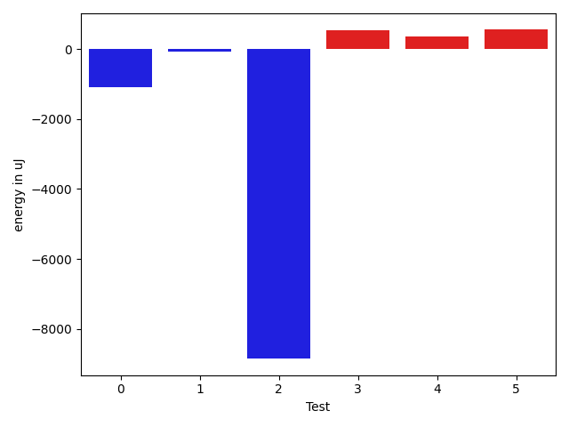

# gson 323dfa

https://github.com/google/gson/commit/323dfa

## Delta Energy per test method

| ID | EnergyV1 | EnergyV2 | DeltaEnergy | σV1 | σV2 |
| --- | --- | --- | --- | --- | --- |
| 0 | 72939.95959595959 | 74185.88888888889 | 1245.9292929293006 | 22157.518221035927 | 61568.04951144887 |
| 1 | 37255.757894736846 | 36208.215053763444 | -1047.5428409734013 | 10981.98670332064 | 13824.92524302599 |
| 2 | 195495.72727272726 | 187961.88888888888 | -7533.838383838389 | 32263.333870208906 | 41654.483261900365 |
| 3 | 57907.1030927835 | 59070.82978723404 | 1163.726694450539 | 35646.00652651487 | 35716.5204166525 |
| 4 | 83310.90909090909 | 80132.83838383839 | -3178.0707070706994 | 32457.078693483312 | 32121.56797458053 |
| 5 | 60315.55319148936 | 43199.0918367347 | -17116.46135475466 | 160898.36701825407 | 20844.39379632961 |

## Delta Duration per test method

| ID | DurationV1 | DurationsV2 | DeltaDuration |
| --- | --- | --- | --- |
| 0 | 2511162.2525252528 | 2698460.6767676766 | 187298.42424242385 |
| 1 | 1408233.2315789473 | 1472736.3978494625 | 64503.16627051518 |
| 2 | 6440331.121212121 | 6400222.666666667 | -40108.45454545412 |
| 3 | 2273688.432989691 | 2231096.1276595746 | -42592.3053301163 |
| 4 | 2978917.777777778 | 2738842.484848485 | -240075.29292929312 |
| 5 | 2247424.0425531915 | 1729780.969387755 | -517643.0731654365 |

## Misc.

| ID | Test Class | Test Method |
| --- | --- | --- |
| 0 | com.google.gson.functional.MapTest | testInterfaceTypeMapWithSerializer |
| 1 | com.google.gson.functional.MapTest | testGeneralMapField |
| 2 | com.google.gson.functional.MapTest | testInterfaceTypeMap |
| 3 | com.google.gson.functional.MapAsArrayTypeAdapterTest | testMultipleEnableComplexKeyRegistrationHasNoEffect |
| 4 | com.google.gson.functional.MapAsArrayTypeAdapterTest | testSerializeComplexMapWithTypeAdapter |
| 5 | com.google.gson.functional.MapAsArrayTypeAdapterTest | testMapWithTypeVariableSerialization |

| Test | IterationV1 | IterationV2 | DeltaIteration |
| --- | --- | --- | --- |
| 0 | 99 | 99 | 0 |
| 1 | 95 | 93 | -2 |
| 2 | 99 | 99 | 0 |
| 3 | 97 | 94 | -3 |
| 4 | 99 | 99 | 0 |
| 5 | 94 | 98 | 4 |

| Time Label | Time (s) |
| --- | --- |
| Selection | 26.90950059890747 |
| Injection | 10.661893129348755 |
| Total | 1095.3351891040802 |

