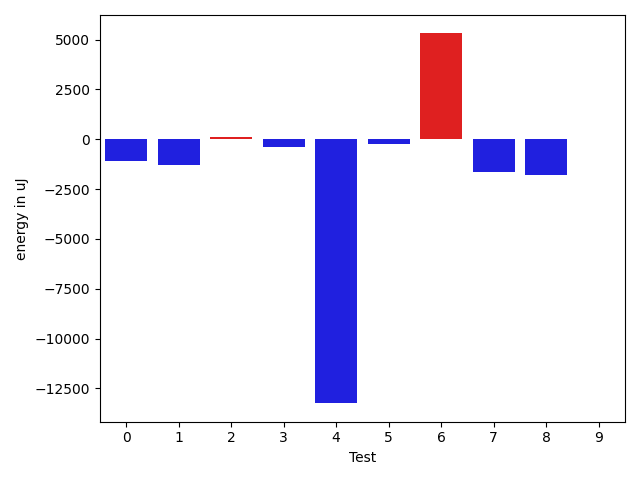
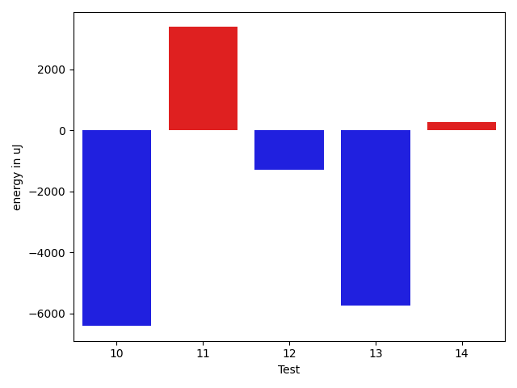
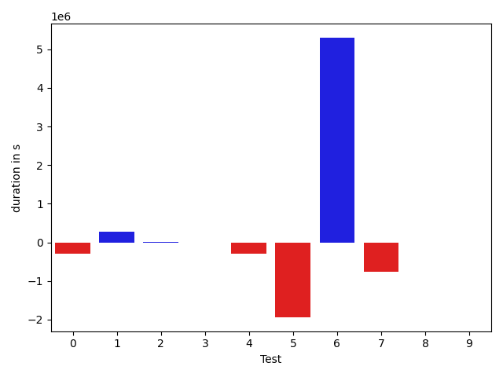
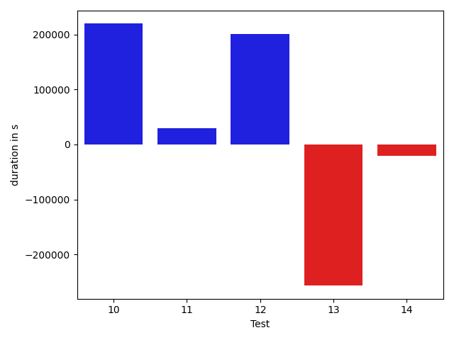

# gson 6c78bf

https://github.com/google/gson/commit/6c78bf

## Delta Energy per test method

| ID | EnergyV1 | EnergyV2 | DeltaEnergy | σ |
| --- | --- | --- | --- | --- |
| 0 | 44984.104166666664 | 40937.38 | -4046.724166666667 | 18449.023696209948 | 15971.011905186217 |
| 1 | 54721.24324324324 | 58671.56626506024 | 3950.3230218169992 | 22591.192322727333 | 33834.34247624484 |
| 2 | 59983.17171717172 | 61596.69696969697 | 1613.5252525252508 | 18240.05468660972 | 16933.95271681255 |
| 3 | 35484.0 | 35572.82716049383 | 88.82716049382725 | 4748.861737064242 | 6402.54779493467 |
| 4 | 129325.77777777778 | 120502.19191919192 | -8823.585858585866 | 70788.05522727483 | 68192.57015983172 |
| 5 | 106424.22727272728 | 44500.21875 | -61924.00852272728 | 286255.7218931785 | 16493.59044018004 |
| 6 | 101129.70370370371 | 285351.43023255817 | 184221.72652885446 | 285055.88415336283 | 519246.22282028093 |
| 7 | 110728.23529411765 | 82630.61764705883 | -28097.617647058825 | 289060.1765489893 | 254062.12100297492 |
| 8 | 37710.09375 | 36115.02631578947 | -1595.0674342105267 | 3471.5548602119106 | 3304.0767918854276 |
| 9 | 38653.544444444444 | 39138.221052631576 | 484.67660818713193 | 9179.19228613294 | 9935.724607568967 |
| 10 | 357227.9696969697 | 350818.70707070705 | -6409.262626262673 | 549732.3153248436 | 539841.6237999386 |
| 11 | 42867.83157894737 | 46252.85106382979 | 3385.0194848824176 | 15005.339411550969 | 16879.738634886304 |
| 12 | 38418.757575757576 | 37128.24137931035 | -1290.5161964472281 | 9728.157142839333 | 10351.088290793632 |
| 13 | 142159.202020202 | 136407.65656565657 | -5751.545454545441 | 73943.16986125836 | 70722.69077022624 |
| 14 | 33045.58064516129 | 33322.18032786885 | 276.5996827075651 | 3869.4931924060807 | 4942.790495814549 |

## Delta Duration per test method

| ID | DurationV1 | DurationsV2 | DeltaDuration |
| --- | --- | --- | --- |
| 0 | 1535463.6666666667 | 1244108.84 | -291354.82666666666 |
| 1 | 1754296.9324324324 | 2030579.5662650603 | 276282.6338326279 |
| 2 | 2099189.5454545454 | 2114070.626262626 | 14881.080808080733 |
| 3 | 1265055.5505617978 | 1266489.1851851852 | 1433.6346233873628 |
| 4 | 4287123.444444444 | 3999362.3232323234 | -287761.12121212063 |
| 5 | 3003007.9318181816 | 1064453.59375 | -1938554.3380681816 |
| 6 | 3024234.8024691357 | 8325151.73255814 | 5300916.930089004 |
| 7 | 3017807.411764706 | 2257276.294117647 | -760531.1176470588 |
| 8 | 675214.09375 | 662531.6052631579 | -12682.488486842136 |
| 9 | 1364856.8777777778 | 1366122.8631578947 | 1265.9853801168501 |
| 10 | 10346878.212121213 | 10566271.686868686 | 219393.47474747337 |
| 11 | 1542980.6421052632 | 1571822.3085106383 | 28841.666405375116 |
| 12 | 953825.9090909091 | 1154577.6206896552 | 200751.71159874613 |
| 13 | 4661916.555555556 | 4405211.777777778 | -256704.77777777798 |
| 14 | 1105189.935483871 | 1084184.2786885246 | -21005.65679534641 |

## Misc.

| ID | Test Class | Test Method |
| --- | --- | --- |
| 0 | com.google.gson.functional.CustomDeserializerTest | testDefaultConstructorNotCalledOnObject |
| 1 | com.google.gson.functional.CustomDeserializerTest | testDefaultConstructorNotCalledOnField |
| 2 | com.google.gson.functional.MapTest | testInterfaceTypeMapWithSerializer |
| 3 | com.google.gson.functional.MapTest | testGeneralMapField |
| 4 | com.google.gson.functional.MapTest | testInterfaceTypeMap |
| 5 | com.google.gson.functional.TypeAdapterPrecedenceTest | testStreamingHierarchicalFollowedByNonstreaming |
| 6 | com.google.gson.functional.TypeAdapterPrecedenceTest | testNonstreamingFollowedByNonstreaming |
| 7 | com.google.gson.functional.TypeAdapterPrecedenceTest | testStreamingFollowedByNonstreaming |
| 8 | com.google.gson.functional.TypeAdapterPrecedenceTest | testNonstreamingHierarchicalFollowedByNonstreaming |
| 9 | com.google.gson.functional.MapAsArrayTypeAdapterTest | testMultipleEnableComplexKeyRegistrationHasNoEffect |
| 10 | com.google.gson.functional.MapAsArrayTypeAdapterTest | testSerializeComplexMapWithTypeAdapter |
| 11 | com.google.gson.functional.MapAsArrayTypeAdapterTest | testMapWithTypeVariableSerialization |
| 12 | com.google.gson.ObjectTypeAdapterTest | testSerializeObject |
| 13 | com.google.gson.ObjectTypeAdapterTest | testSerialize |
| 14 | com.google.gson.functional.DefaultTypeAdaptersTest | testDateSerializationWithPatternNotOverridenByTypeAdapter |

| Test | IterationV1 | IterationV2 | DeltaIteration |
| --- | --- | --- | --- |
| 0 | 48 | 50 | 2 |
| 1 | 74 | 83 | 9 |
| 2 | 99 | 99 | 0 |
| 3 | 89 | 81 | -8 |
| 4 | 99 | 99 | 0 |
| 5 | 44 | 32 | -12 |
| 6 | 81 | 86 | 5 |
| 7 | 34 | 34 | 0 |
| 8 | 32 | 38 | 6 |
| 9 | 90 | 95 | 5 |
| 10 | 99 | 99 | 0 |
| 11 | 95 | 94 | -1 |
| 12 | 33 | 29 | -4 |
| 13 | 99 | 99 | 0 |
| 14 | 62 | 61 | -1 |

| Time Label | Time (s) |
| --- | --- |
| Selection | 27.335186004638672 |
| Injection | 11.244928121566772 |
| Total | 1115.3698377609253 |

