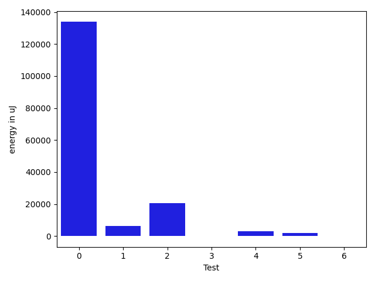

# gson ecdf91

https://github.com/google/gson/commit/ecdf91

## Delta Energy per test method

| ID | EnergyV1 | EnergyV2 | DeltaEnergy | σ |
| --- | --- | --- | --- | --- |
| 0 | 83595.36842105263 | 217394.11764705883 | 133798.7492260062 | 266318.46121735545 | 500058.18457536487 |
| 1 | 411412.9873417721 | 417636.7051282051 | 6223.717786433001 | 621722.083055075 | 626072.9852811481 |
| 2 | 172237.9024390244 | 192676.4090909091 | 20438.5066518847 | 409015.08133294474 | 434922.16416651744 |
| 3 | 36012.76666666667 | 36104.029411764706 | 91.26274509803625 | 2684.4888114665127 | 3535.873762429993 |
| 4 | 52676.33766233766 | 55528.09523809524 | 2851.757575757576 | 32104.41682103027 | 32356.181849406807 |
| 5 | 49951.8275862069 | 52062.80357142857 | 2110.975985221674 | 23033.924262612978 | 24102.606476878656 |
| 6 | 31446.983606557376 | 31392.046875 | -54.93673155737633 | 5091.534863086606 | 2619.530417303402 |

## Delta Duration per test method

| ID | DurationV1 | DurationsV2 | DeltaDuration |
| --- | --- | --- | --- |
| 0 | 2363770.1842105263 | 6218770.55882353 | 3855000.3746130033 |
| 1 | 11924763.924050633 | 12329389.346153846 | 404625.42210321315 |
| 2 | 4805215.414634147 | 5396593.954545454 | 591378.5399113074 |
| 3 | 733119.3666666667 | 747215.4705882353 | 14096.103921568603 |
| 4 | 1947709.3376623376 | 1982577.238095238 | 34867.900432900526 |
| 5 | 1742463.6724137932 | 1747129.375 | 4665.70258620684 |
| 6 | 1103414.4918032787 | 1090089.015625 | -13325.47617827868 |

## Misc.

| ID | Test Class | Test Method |
| --- | --- | --- |
| 0 | com.google.gson.functional.TypeAdapterPrecedenceTest | testStreamingFollowedByNonstreaming |
| 1 | com.google.gson.functional.TypeAdapterPrecedenceTest | testNonstreamingFollowedByNonstreaming |
| 2 | com.google.gson.functional.TypeAdapterPrecedenceTest | testStreamingHierarchicalFollowedByNonstreaming |
| 3 | com.google.gson.functional.TypeAdapterPrecedenceTest | testNonstreamingHierarchicalFollowedByNonstreaming |
| 4 | com.google.gson.functional.CustomDeserializerTest | testDefaultConstructorNotCalledOnField |
| 5 | com.google.gson.functional.CustomDeserializerTest | testDefaultConstructorNotCalledOnObject |
| 6 | com.google.gson.functional.DefaultTypeAdaptersTest | testDateSerializationWithPatternNotOverridenByTypeAdapter |

| Test | IterationV1 | IterationV2 | DeltaIteration |
| --- | --- | --- | --- |
| 0 | 38 | 34 | -4 |
| 1 | 79 | 78 | -1 |
| 2 | 41 | 44 | 3 |
| 3 | 30 | 34 | 4 |
| 4 | 77 | 84 | 7 |
| 5 | 58 | 56 | -2 |
| 6 | 61 | 64 | 3 |

| Time Label | Time (s) |
| --- | --- |
| Selection | 27.20884084701538 |
| Injection | 10.605752229690552 |
| Total | 1102.3086853027344 |

