# gson 740d03

https://github.com/google/gson/commit/740d03

## Delta Energy per test method

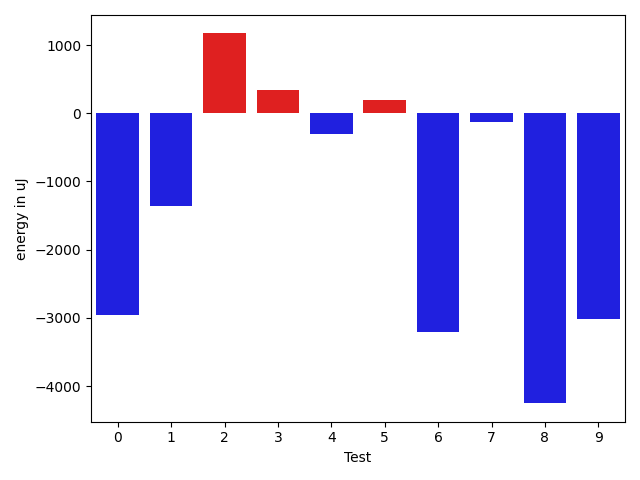

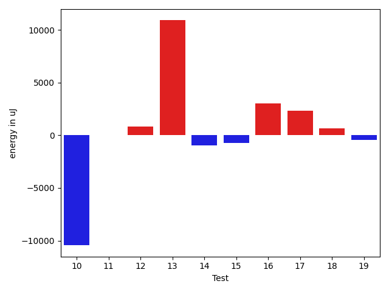

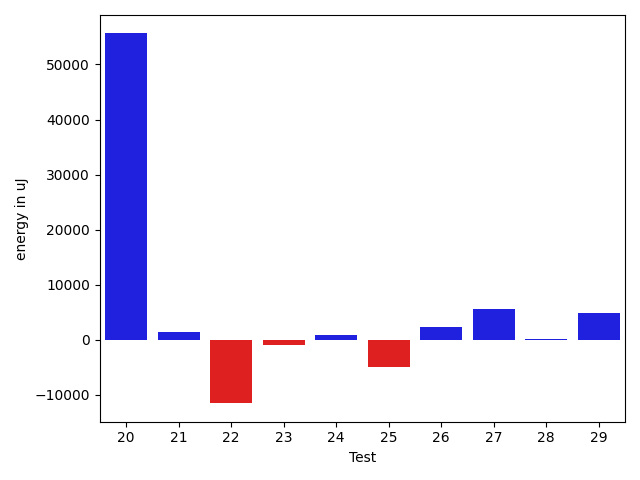

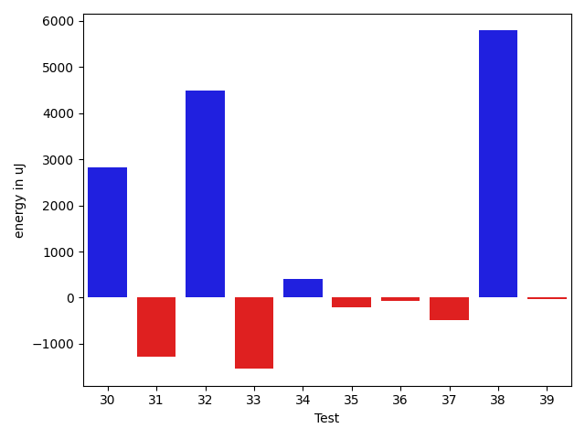

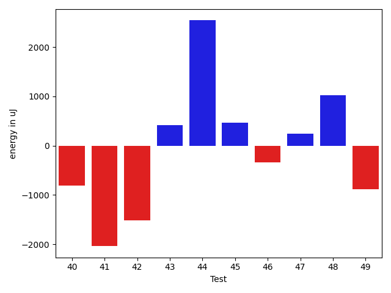

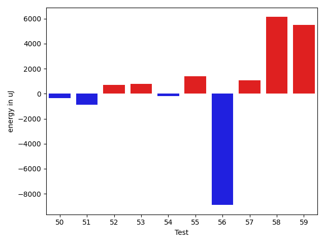

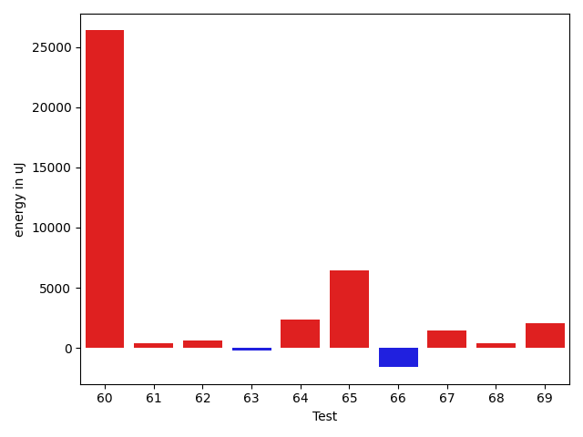

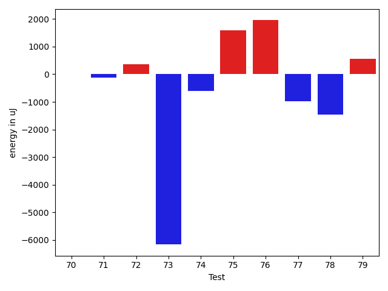

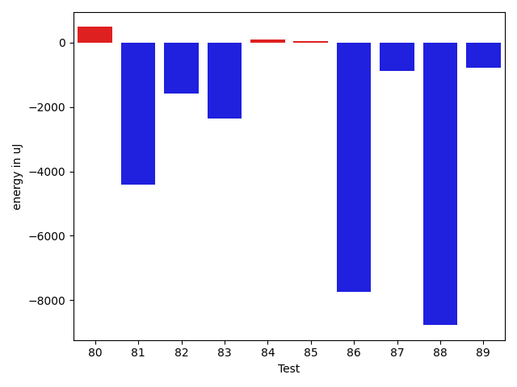

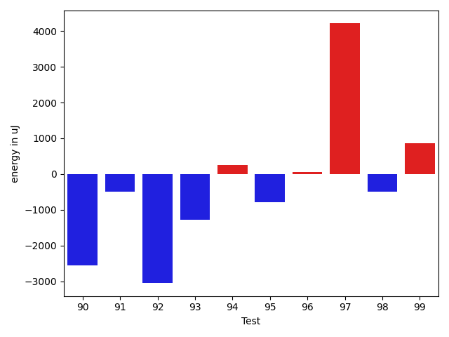

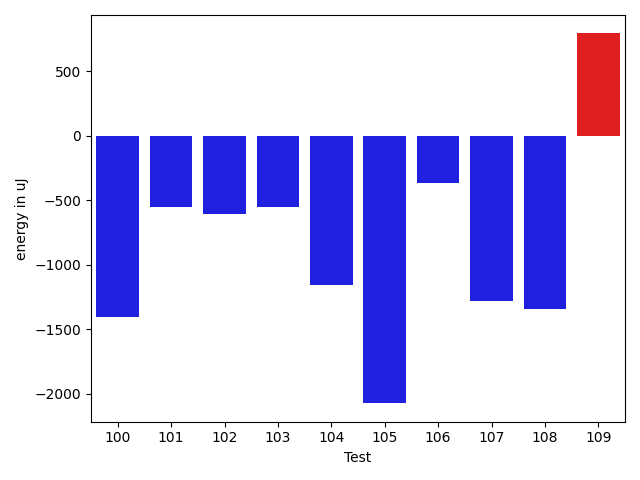

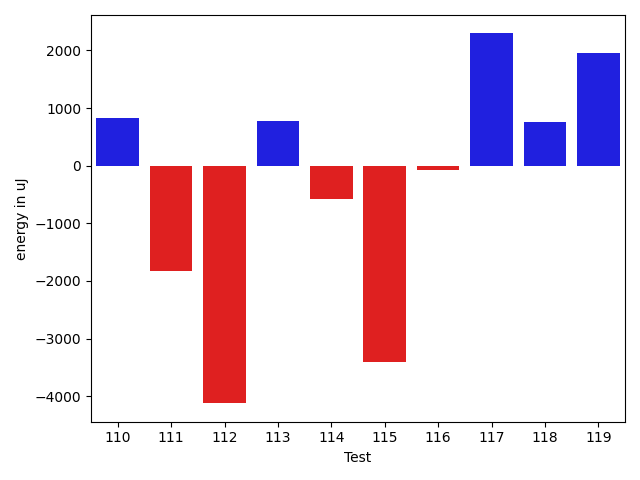

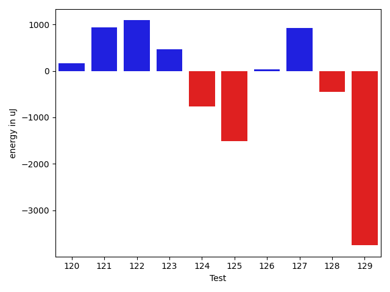

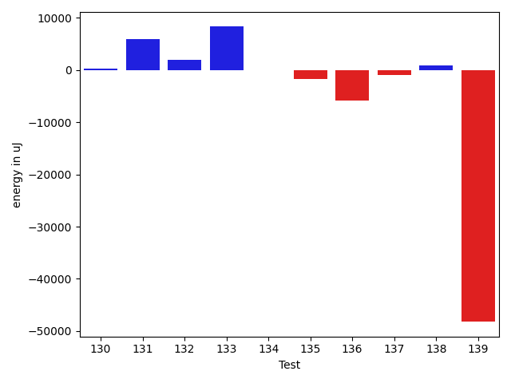

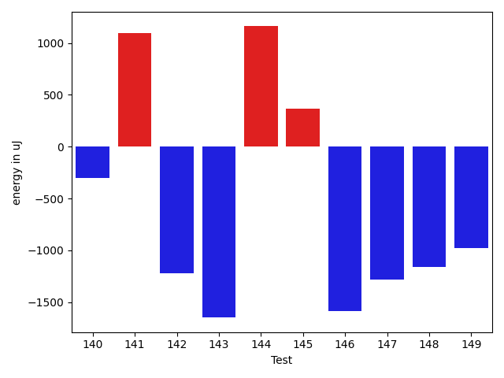

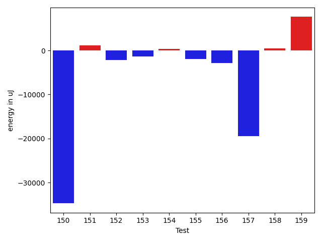

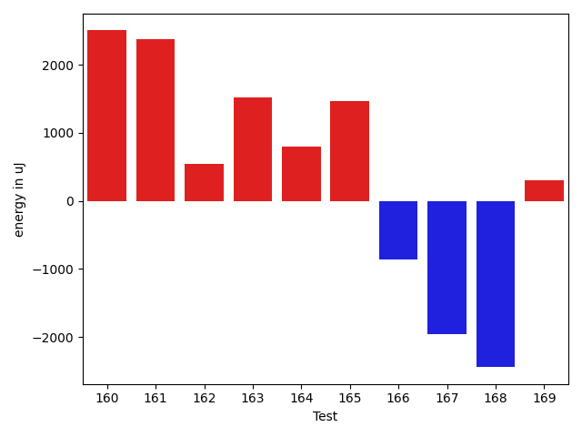

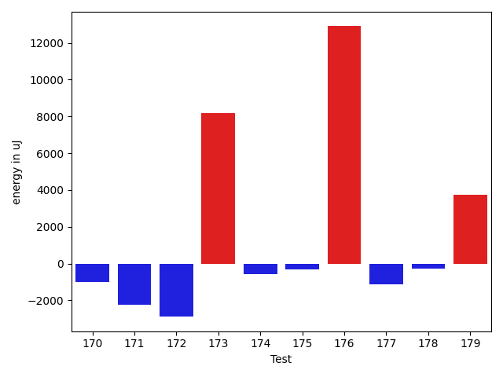

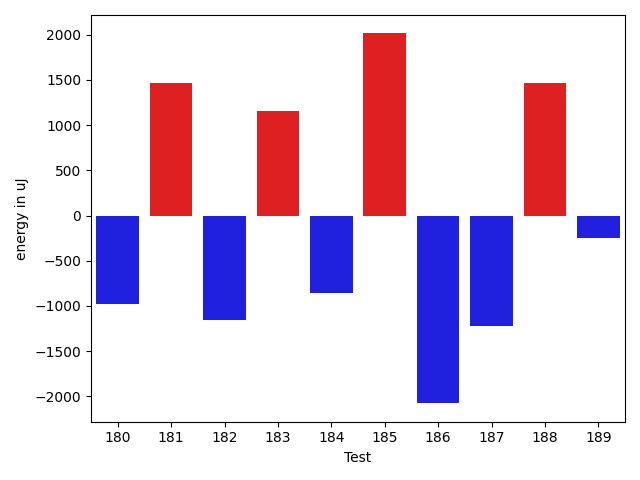

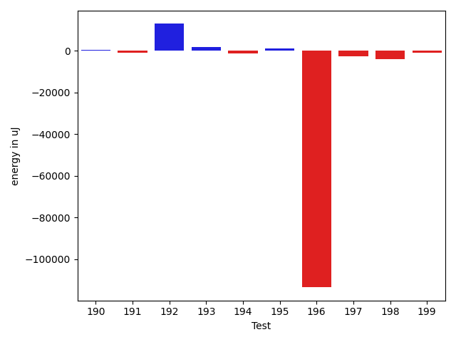

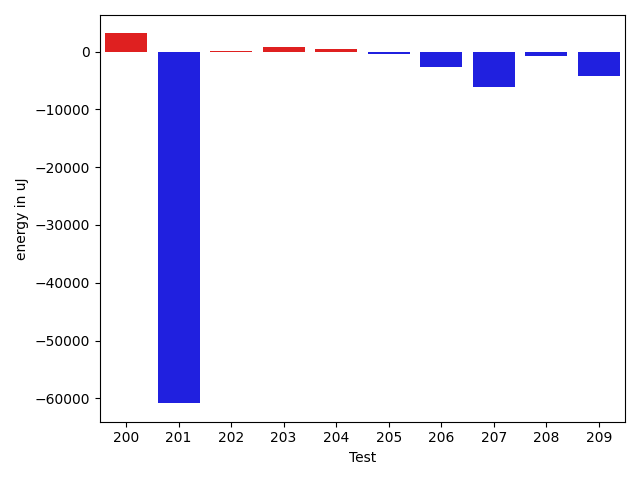

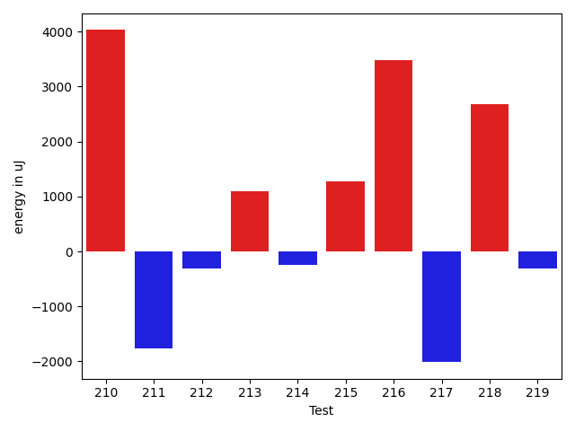

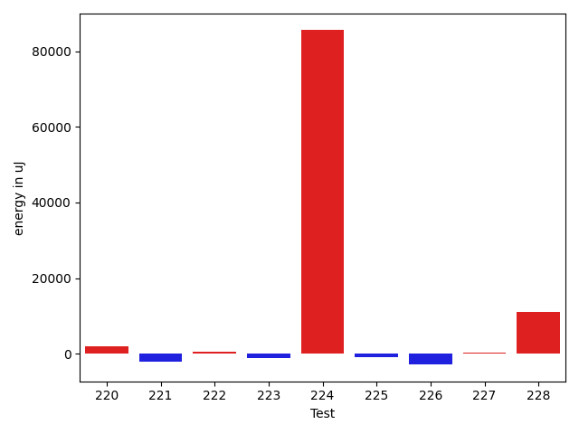

| ID | EnergyV1 | EnergyV2 | DeltaEnergy | σV1 | σV2 |
| --- | --- | --- | --- | --- | --- |
| 0 | 43163.88 | 40209.26315789474 | -2954.616842105257 | 27577.424196353073 | 9075.761820087528 |
| 1 | 40978.10227272727 | 39611.67469879518 | -1366.4275739320947 | 10360.021528408413 | 7117.171399193955 |
| 2 | 39627.112676056335 | 40797.230769230766 | 1170.1180931744311 | 7303.839722469918 | 8716.242431589015 |
| 3 | 38036.0 | 38373.25806451613 | 337.2580645161288 | 3785.234317992119 | 4141.210287232481 |
| 4 | 37978.36 | 37668.75 | -309.6100000000006 | 3494.031996190075 | 3958.91308298264 |
| 5 | 37049.57142857143 | 37250.02777777778 | 200.45634920635348 | 4577.150960102215 | 3543.5827404079737 |
| 6 | 49053.257731958765 | 45844.333333333336 | -3208.9243986254296 | 36707.45734208791 | 15570.866161993757 |
| 7 | 39471.88157894737 | 39338.69736842105 | -133.1842105263131 | 10161.057229710406 | 10501.87906747587 |
| 8 | 43195.1186440678 | 38943.625 | -4251.493644067799 | 16132.898594292354 | 7703.838749894432 |
| 9 | 42642.305555555555 | 39619.90540540541 | -3022.400150150148 | 13538.765963827815 | 10230.89252819539 |
| 10 | 230683.91919191918 | 220238.27272727274 | -10445.646464646445 | 97808.08657254966 | 101689.50481426323 |
| 11 | 131495.28282828283 | 131520.57575757575 | 25.292929292918416 | 34478.849061517074 | 39987.331717440524 |
| 12 | 116558.9797979798 | 117412.80808080808 | 853.8282828282827 | 41492.89895629818 | 43353.57823608401 |
| 13 | 47181.53488372093 | 58083.194444444445 | 10901.659560723514 | 25188.1331687732 | 43467.63179003906 |
| 14 | 40621.205128205125 | 39642.1 | -979.1051282051267 | 3263.143318473275 | 2837.0589037475647 |
| 15 | 37361.89655172414 | 36613.291666666664 | -748.6048850574734 | 3596.9016681010494 | 3686.889118655982 |
| 16 | 37018.53846153846 | 40032.29268292683 | 3013.7542213883717 | 5169.198362421312 | 13194.641088370765 |
| 17 | 40149.13888888889 | 42492.44736842105 | 2343.308479532163 | 21367.233991626807 | 33535.30954531151 |
| 18 | 36598.03125 | 37275.555555555555 | 677.5243055555547 | 4050.8240942767975 | 3488.2481311815186 |
| 19 | 36979.490909090906 | 36524.03921568627 | -455.45169340463326 | 3941.8073790526246 | 3484.7621910072853 |
| 20 | 249884.8148148148 | 305514.42696629214 | 55629.61215147734 | 219087.98313063555 | 220604.69355438062 |
| 21 | 36123.62962962963 | 37502.125 | 1378.4953703703723 | 3436.595582281849 | 3829.70600821721 |
| 22 | 47879.653846153844 | 36362.121212121216 | -11517.532634032628 | 63082.88297027741 | 3328.1618710412927 |
| 23 | 37002.4 | 36005.458333333336 | -996.9416666666657 | 3756.650082187587 | 2718.342294781366 |
| 24 | 35617.06896551724 | 36430.125 | 813.0560344827609 | 3388.2381947273534 | 4443.570282934096 |
| 25 | 41061.92 | 36089.5 | -4972.419999999998 | 21389.812386124384 | 3470.388359772874 |
| 26 | 40639.03703703704 | 42916.666666666664 | 2277.6296296296277 | 12934.806901968843 | 16942.17720387222 |
| 27 | 35930.13636363636 | 41598.76 | 5668.623636363642 | 3475.1814248971828 | 22020.897206571757 |
| 28 | 36795.30952380953 | 36888.020833333336 | 92.71130952380918 | 3554.4855999687898 | 3427.2460487587764 |
| 29 | 49855.0306122449 | 54748.357894736844 | 4893.327282491948 | 17842.64137891624 | 19555.248161321262 |
| 30 | 61712.290322580644 | 64542.41860465116 | 2830.1282820705164 | 78649.06632228591 | 68332.08692820894 |
| 31 | 37333.7027027027 | 36059.77419354839 | -1273.9285091543134 | 4333.244386324675 | 3939.07500775923 |
| 32 | 36881.5 | 41372.21052631579 | 4490.710526315786 | 4938.045245843744 | 33017.89772720395 |
| 33 | 37465.333333333336 | 35924.84375 | -1540.4895833333358 | 3849.7822737858246 | 3538.265960443892 |
| 34 | 35502.75 | 35904.37037037037 | 401.62037037037226 | 3977.1691621859454 | 3134.625326398653 |
| 35 | 36384.0 | 36168.48275862069 | -215.5172413793116 | 4695.61616829996 | 3330.722616228265 |
| 36 | 36670.16129032258 | 36606.76666666667 | -63.394623655913165 | 3335.894435329579 | 3499.7592839444765 |
| 37 | 37389.24137931035 | 36897.0 | -492.24137931034784 | 4055.1814845664444 | 3623.7310222668475 |
| 38 | 37496.489795918365 | 43282.5306122449 | 5786.040816326531 | 8958.053471876461 | 44718.44222858286 |
| 39 | 36007.35135135135 | 35969.97435897436 | -37.37699237699417 | 3919.1654738843786 | 3631.297475877858 |
| 40 | 36714.025 | 35901.275862068964 | -812.7491379310377 | 4155.988675919968 | 4003.5179004311362 |
| 41 | 37729.9756097561 | 35692.125 | -2037.8506097560967 | 4067.4660925494222 | 4540.596806519491 |
| 42 | 37869.625 | 36355.6 | -1514.0250000000015 | 4652.148829774796 | 3370.1069478578866 |
| 43 | 36815.71428571428 | 37229.65714285714 | 413.942857142858 | 4180.1001371333905 | 4115.962653883446 |
| 44 | 37020.47826086957 | 39561.32692307692 | 2540.848662207354 | 5153.030171188559 | 18245.434040751923 |
| 45 | 35840.67857142857 | 36308.375 | 467.69642857142753 | 3005.9705950178964 | 4106.564240259125 |
| 46 | 36773.555555555555 | 36437.857142857145 | -335.6984126984098 | 4202.049555768685 | 3187.5539701980215 |
| 47 | 36855.28 | 37102.41509433962 | 247.13509433962463 | 3430.141484195659 | 6099.811807904211 |
| 48 | 35754.67741935484 | 36780.76190476191 | 1026.0844854070674 | 3704.732347540031 | 3676.6366605617764 |
| 49 | 36604.10344827586 | 35726.91891891892 | -877.1845293569422 | 4469.215231156573 | 3222.237785263094 |
| 50 | 36944.041666666664 | 36596.45 | -347.59166666666715 | 4752.151297738449 | 3636.7309974068744 |
| 51 | 35999.04761904762 | 35119.21212121212 | -879.8354978354982 | 3835.2763043965633 | 3177.4805700722086 |
| 52 | 38879.333333333336 | 39561.42647058824 | 682.0931372549021 | 7430.354729354475 | 6479.201955479358 |
| 53 | 64479.49411764706 | 65264.46913580247 | 784.9750181554118 | 57764.2500071217 | 56665.74051902997 |
| 54 | 38878.0 | 38668.02564102564 | -209.97435897435935 | 4110.440299353033 | 6568.496871673815 |
| 55 | 38256.7 | 39644.67307692308 | 1387.973076923081 | 4941.224051791216 | 5876.310883935579 |
| 56 | 70208.63636363637 | 61313.375 | -8895.261363636368 | 95460.8076100592 | 70681.28597255694 |
| 57 | 47790.41935483871 | 48852.72972972973 | 1062.3103748910144 | 27950.1991553574 | 33648.28986269155 |
| 58 | 45049.11956521739 | 51175.15957446808 | 6126.04000925069 | 15955.951831351202 | 22476.020793945157 |
| 59 | 40681.07594936709 | 46168.0987654321 | 5487.022816065008 | 12399.366432132021 | 24343.13186866946 |
| 60 | 63123.295918367345 | 80244.11340206186 | 17120.817483694518 | 44271.9466629919 | 66295.77000731969 |
| 61 | 37066.18965517241 | 38082.86885245902 | 1016.6791972866049 | 4070.336779495485 | 5335.1006365833855 |
| 62 | 43450.67796610169 | 47093.8253968254 | 3643.1474307237077 | 14151.654781889845 | 16973.375104257586 |
| 63 | 37582.28125 | 37842.84905660377 | 260.5678066037726 | 6293.118323486254 | 6105.2191727265135 |
| 64 | 36302.89473684211 | 36709.958333333336 | 407.06359649122896 | 3614.820238592885 | 3712.4448983471643 |
| 65 | 132258.94736842104 | 138635.55789473685 | 6376.61052631581 | 94966.70782934722 | 88135.94246756911 |
| 66 | 38369.96875 | 39127.121212121216 | 757.1524621212156 | 3578.808063486143 | 8053.166193670871 |
| 67 | 41943.79069767442 | 42857.97297297297 | 914.1822752985536 | 30567.458610963015 | 26489.15744988268 |
| 68 | 39245.44680851064 | 46230.37209302326 | 6984.9252845126175 | 9514.554442913797 | 31069.423240747637 |
| 69 | 49171.74074074074 | 47495.724137931036 | -1676.016602809701 | 28998.29587789037 | 23187.327643224537 |
| 70 | 45656.53846153846 | 51411.294117647056 | 5754.755656108595 | 20300.758533063523 | 32342.37118751719 |
| 71 | 38468.04347826087 | 47552.68421052631 | 9084.640732265441 | 3098.470597179825 | 38781.26276282432 |
| 72 | 38184.620689655174 | 49295.90476190476 | 11111.28407224959 | 9148.691285393448 | 38101.56835405268 |
| 73 | 93258.9797979798 | 78918.26804123711 | -14340.71175674269 | 59672.03625423609 | 44130.52906710486 |
| 74 | 89377.0 | 55787.45238095238 | -33589.54761904762 | 99559.6583695759 | 48781.02306625589 |
| 75 | 37637.765957446805 | 37138.36363636364 | -499.4023210831656 | 7414.002471496196 | 3899.918810873499 |
| 76 | 37104.82608695652 | 40190.7875 | 3085.9614130434784 | 9003.506788551524 | 17215.054439860007 |
| 77 | 42689.51063829787 | 40004.58974358974 | -2684.920894708128 | 11158.80769554064 | 8042.311868527858 |
| 78 | 63612.65853658537 | 43589.651162790695 | -20023.007373794673 | 54817.50760794235 | 19819.051824624454 |
| 79 | 37056.25806451613 | 37953.61111111111 | 897.3530465949807 | 4700.038016097055 | 3707.41993453502 |
| 80 | 36269.117647058825 | 36752.68421052631 | 483.56656346748787 | 4616.395154387596 | 4309.906630477614 |
| 81 | 44555.6 | 40134.49056603773 | -4421.109433962265 | 20962.10306934874 | 16712.686786043756 |
| 82 | 37072.72 | 35479.6 | -1593.1200000000026 | 3133.1392247393032 | 3471.7461082285386 |
| 83 | 40289.14 | 37935.1914893617 | -2353.9485106383 | 9969.791285699013 | 6161.272967524901 |
| 84 | 36549.391304347824 | 36632.181818181816 | 82.79051383399201 | 3336.580373078302 | 4370.054832570116 |
| 85 | 36546.166666666664 | 36596.56 | 50.39333333333343 | 4288.212438378801 | 3756.8185485061695 |
| 86 | 55572.0824742268 | 47836.0101010101 | -7736.0723732167025 | 50894.592962088835 | 23727.284411524062 |
| 87 | 38306.17391304348 | 37414.454545454544 | -891.7193675889357 | 5792.208684777778 | 4196.081867148528 |
| 88 | 45803.482142857145 | 37031.26 | -8772.222142857143 | 40014.895907645194 | 3593.8410583107316 |
| 89 | 42674.57377049181 | 41898.04761904762 | -776.5261514441881 | 13121.832794388987 | 16146.397776484466 |
| 90 | 39011.57627118644 | 37561.57142857143 | -1450.0048426150097 | 5846.024568981204 | 6582.47227452558 |
| 91 | 47063.91935483871 | 42008.14035087719 | -5055.779003961521 | 21452.43248129368 | 14160.536357963772 |
| 92 | 44406.08163265306 | 36679.7962962963 | -7726.285336356763 | 31711.40519340439 | 7466.072187097393 |
| 93 | 39723.35365853659 | 38500.2962962963 | -1223.057362240288 | 8172.276773801079 | 8163.10035728293 |
| 94 | 39414.1186440678 | 36493.544117647056 | -2920.5745264207435 | 17899.536583419635 | 4301.284532602624 |
| 95 | 85630.75257731958 | 86480.38775510204 | 849.6351777824602 | 70051.02543882972 | 58002.73528483907 |
| 96 | 41480.38461538462 | 39245.53658536585 | -2234.8480300187657 | 11206.340052170981 | 9298.92544565142 |
| 97 | 69605.85858585859 | 71970.07070707071 | 2364.2121212121274 | 36221.77789952094 | 33534.53093808567 |
| 98 | 41312.11538461538 | 40036.05952380953 | -1276.0558608058564 | 11840.477742852865 | 10089.50763387768 |
| 99 | 46106.333333333336 | 47635.48717948718 | 1529.153846153844 | 36328.85179394837 | 28710.57676042929 |
| 100 | 43448.574712643676 | 39964.910112359554 | -3483.6646002841226 | 13929.21157890623 | 10047.798602478313 |
| 101 | 42202.58974358974 | 40818.58666666667 | -1384.0030769230725 | 14141.834429691851 | 13517.091634019833 |
| 102 | 75216.6875 | 73395.88541666667 | -1820.8020833333285 | 34402.284305912646 | 32604.268860927088 |
| 103 | 38973.1875 | 37631.97435897436 | -1341.2131410256407 | 8137.999457934594 | 7905.645373312246 |
| 104 | 39879.269230769234 | 37241.76056338028 | -2637.5086673889527 | 10121.146153136797 | 7328.864348097252 |
| 105 | 37619.47169811321 | 35685.0625 | -1934.4091981132078 | 4390.763416682169 | 3375.880906063939 |
| 106 | 38286.94117647059 | 48194.75 | 9907.808823529413 | 4130.901681524525 | 43826.54941856021 |
| 107 | 48528.80487804878 | 44997.84444444445 | -3530.960433604334 | 37866.44153595732 | 27569.767214553907 |
| 108 | 38520.791666666664 | 37590.16 | -930.6316666666607 | 3139.361943919585 | 3910.1470527845877 |
| 109 | 72564.46376811594 | 89726.01234567902 | 17161.54857756308 | 62928.6945038496 | 163584.07085152844 |
| 110 | 41872.44 | 42701.541666666664 | 829.1016666666619 | 23367.588887311416 | 20443.230458555157 |
| 111 | 38629.48484848485 | 36804.26666666667 | -1825.218181818178 | 4016.448620671962 | 4306.240231209691 |
| 112 | 40257.38461538462 | 36135.18 | -4122.204615384617 | 23426.961598480637 | 3928.0193110014116 |
| 113 | 38222.4 | 38994.84210526316 | 772.4421052631587 | 3851.1568530334703 | 4126.839943884143 |
| 114 | 37118.8431372549 | 36549.442307692305 | -569.4008295625972 | 4195.678090852627 | 4117.312227344537 |
| 115 | 40466.13333333333 | 37051.71698113208 | -3414.416352201253 | 24208.05883548332 | 3810.1598410355364 |
| 116 | 37993.705882352944 | 37919.02222222222 | -74.68366013072227 | 4390.833300224178 | 4127.470575917136 |
| 117 | 36421.566666666666 | 38716.48148148148 | 2294.914814814816 | 3185.7187434270186 | 3906.575381663591 |
| 118 | 36974.416666666664 | 37739.28571428572 | 764.8690476190532 | 3707.8210797882657 | 4160.572641365805 |
| 119 | 36249.565217391304 | 38209.78787878788 | 1960.2226613965759 | 3578.7557325937714 | 4592.84567335405 |
| 120 | 37884.82352941176 | 38043.862068965514 | 159.03853955375234 | 3800.3880798009864 | 3514.626616987515 |
| 121 | 37341.9375 | 38278.83870967742 | 936.9012096774168 | 4205.268911864466 | 3715.4567999170636 |
| 122 | 36597.354838709674 | 37684.96666666667 | 1087.6118279569928 | 4093.924771582865 | 3587.629890641205 |
| 123 | 37139.775 | 37601.681818181816 | 461.90681818181474 | 4113.343624641029 | 4603.692558315292 |
| 124 | 37808.93023255814 | 37038.20930232558 | -770.7209302325573 | 4367.214786924557 | 4321.902491060974 |
| 125 | 47649.916666666664 | 46132.744680851065 | -1517.1719858155993 | 24177.805589814987 | 18485.12496457865 |
| 126 | 40489.24590163935 | 40529.30508474576 | 40.05918310641573 | 20504.480612827705 | 23583.284319550447 |
| 127 | 36691.6875 | 37620.148148148146 | 928.460648148146 | 3717.068699236503 | 2520.916539728031 |
| 128 | 39286.96428571428 | 38833.53571428572 | -453.4285714285652 | 3804.8368791967837 | 4126.554516457515 |
| 129 | 59298.75 | 55545.709677419356 | -3753.040322580644 | 53384.52421940224 | 37479.44308998024 |
| 130 | 36495.89473684211 | 36793.470588235294 | 297.5758513931869 | 4109.625836403536 | 3362.293791930235 |
| 131 | 67248.65277777778 | 73220.91358024691 | 5972.260802469129 | 163649.14332889803 | 203027.5841034754 |
| 132 | 37365.71428571428 | 39297.75 | 1932.0357142857174 | 4087.5736817923703 | 4018.4532527631645 |
| 133 | 39730.59649122807 | 48046.32258064516 | 8315.72608941709 | 12657.996002610085 | 25969.824967906196 |
| 134 | 79976.80808080808 | 79886.16161616161 | -90.64646464647376 | 24510.513349584024 | 29396.66680194865 |
| 135 | 43128.13636363636 | 41494.15555555555 | -1633.980808080807 | 13813.791008512453 | 10702.58153895707 |
| 136 | 42614.04761904762 | 36839.21212121212 | -5774.835497835498 | 31328.7942185493 | 4012.8197730227266 |
| 137 | 38187.17021276596 | 37251.30612244898 | -935.8640903169799 | 5335.564379484457 | 4011.8898452947133 |
| 138 | 37793.74509803922 | 38759.54716981132 | 965.802071772101 | 4513.304336410763 | 4057.2941934623514 |
| 139 | 107748.41414141415 | 59528.45918367347 | -48219.95495774068 | 260028.72407633715 | 29297.076192548757 |
| 140 | 45017.060975609755 | 42920.329268292684 | -2096.7317073170707 | 31642.656121493834 | 13415.547995729758 |
| 141 | 182532.9292929293 | 177142.0606060606 | -5390.868686868693 | 144111.99345306135 | 112403.54289968073 |
| 142 | 39185.818181818184 | 38306.108695652176 | -879.709486166008 | 3381.1910977744838 | 4317.584319703608 |
| 143 | 37448.21052631579 | 37046.666666666664 | -401.54385964912217 | 3685.2146631605337 | 6742.792403871663 |
| 144 | 37982.27272727273 | 37694.0 | -288.27272727272793 | 4580.812553782632 | 4233.478910330194 |
| 145 | 42764.375 | 43521.18918918919 | 756.8141891891864 | 16037.371641633645 | 14674.696460487718 |
| 146 | 46418.16129032258 | 40954.4375 | -5463.723790322583 | 24362.306571630583 | 17078.897882213998 |
| 147 | 37530.63461538462 | 36314.732142857145 | -1215.9024725274721 | 3696.481726582132 | 3971.7626776455645 |
| 148 | 37369.769230769234 | 42637.57692307692 | 5267.807692307688 | 4151.019794142271 | 27422.263058399876 |
| 149 | 39543.26153846154 | 39501.30158730159 | -41.95995115995174 | 7658.037592122857 | 9016.710459597763 |
| 150 | 132862.05050505052 | 98175.16161616161 | -34686.888888888905 | 287458.2165779388 | 131603.06505969074 |
| 151 | 39546.653333333335 | 40679.0 | 1132.3466666666645 | 8513.7901555744 | 10112.139627304661 |
| 152 | 40409.565217391304 | 38284.279411764706 | -2125.2858056265977 | 10874.289434694792 | 5703.217984419973 |
| 153 | 43648.792207792205 | 42289.21052631579 | -1359.5816814764185 | 24633.570356898144 | 13852.862957294183 |
| 154 | 55785.87804878049 | 56171.5 | 385.62195121950936 | 40531.16888615243 | 20262.67952061778 |
| 155 | 48132.8125 | 46184.91071428572 | -1947.9017857142826 | 43417.322430423366 | 35270.75412043484 |
| 156 | 222720.45454545456 | 219891.88888888888 | -2828.5656565656827 | 78868.55825586672 | 76547.2697006498 |
| 157 | 385987.2121212121 | 366599.6060606061 | -19387.60606060602 | 149909.72605472765 | 147694.77912603156 |
| 158 | 43992.648148148146 | 44454.0 | 461.351851851854 | 20285.770616970614 | 24246.43913833305 |
| 159 | 37280.066666666666 | 44895.333333333336 | 7615.26666666667 | 4567.538760523976 | 26943.153884098683 |
| 160 | 36873.15217391304 | 38021.333333333336 | 1148.1811594202954 | 5031.807311957523 | 4208.785738059006 |
| 161 | 38328.03333333333 | 39505.73529411765 | 1177.7019607843176 | 4163.266453826317 | 4647.958130499023 |
| 162 | 41227.30612244898 | 43125.301886792455 | 1897.9957643434755 | 12663.17706887642 | 12741.680891726974 |
| 163 | 64260.65 | 73782.69767441861 | 9522.047674418609 | 78324.66343896728 | 104562.71711442115 |
| 164 | 102374.19696969698 | 130300.76363636364 | 27926.566666666666 | 273884.20955973014 | 278298.8560323376 |
| 165 | 39942.19047619047 | 44842.01612903226 | 4899.825652841784 | 10840.679257194617 | 17795.274078586088 |
| 166 | 38741.96875 | 38127.0 | -614.96875 | 4305.214559725617 | 4389.658354898166 |
| 167 | 43086.234567901236 | 40491.18309859155 | -2595.0514693096848 | 11579.486052553204 | 10612.014391497409 |
| 168 | 53548.77777777778 | 53884.09459459459 | 335.3168168168122 | 46828.8566137706 | 52373.267001753826 |
| 169 | 38740.68918918919 | 38974.328571428574 | 233.6393822393875 | 6975.041865467064 | 7646.681447756889 |
| 170 | 40319.05 | 39320.15789473684 | -998.8921052631631 | 9836.476132106454 | 9457.427959368668 |
| 171 | 39529.275 | 37270.882352941175 | -2258.3926470588267 | 4095.4059382892688 | 4084.148898051255 |
| 172 | 40632.666666666664 | 37741.13513513513 | -2891.531531531531 | 7759.254496627517 | 4013.765908161845 |
| 173 | 114600.64634146342 | 122767.72727272728 | 8167.080931263859 | 245175.24287479842 | 271581.05009093287 |
| 174 | 39110.5 | 38551.044444444444 | -559.4555555555562 | 6062.16769355128 | 3921.4589176056834 |
| 175 | 37707.45 | 37388.958333333336 | -318.49166666666133 | 3442.5954521988206 | 4143.472893994105 |
| 176 | 47053.651162790695 | 59958.454545454544 | 12904.80338266385 | 31621.17168363238 | 40868.12242210963 |
| 177 | 41583.692307692305 | 40445.09523809524 | -1138.5970695970682 | 10771.208973531213 | 7271.596308368754 |
| 178 | 39198.854545454546 | 38934.98245614035 | -263.87208931419445 | 3648.7837396649006 | 3672.7252489232264 |
| 179 | 40183.31081081081 | 43944.25806451613 | 3760.9472537053152 | 8755.622118026047 | 25310.21746757588 |
| 180 | 37966.07407407407 | 37610.545454545456 | -355.5286195286171 | 4205.952403932153 | 4324.93008590126 |
| 181 | 46642.4126984127 | 61912.794117647056 | 15270.381419234356 | 36888.28522205025 | 68641.16900625927 |
| 182 | 129202.55172413793 | 73187.03333333334 | -56015.51839080459 | 316004.2950605736 | 191529.7715100681 |
| 183 | 44473.16216216216 | 43825.68 | -647.4821621621595 | 20569.283389629607 | 26531.638484978652 |
| 184 | 37427.782608695656 | 37243.862068965514 | -183.92053973014117 | 3791.7872458721117 | 2770.0647287860775 |
| 185 | 40325.416666666664 | 38520.153846153844 | -1805.2628205128203 | 17910.821617693415 | 4099.62619020421 |
| 186 | 37904.77419354839 | 38045.95652173913 | 141.18232819074183 | 5346.94151171084 | 9282.784835514472 |
| 187 | 42568.65789473684 | 37488.607142857145 | -5080.050751879695 | 29141.997556679093 | 4155.4412034901015 |
| 188 | 36342.67647058824 | 38473.55882352941 | 2130.8823529411748 | 3845.11505006936 | 7994.021310775198 |
| 189 | 89419.46153846153 | 77398.475 | -12020.986538461526 | 105574.75961971849 | 85886.78111793092 |
| 190 | 39084.3125 | 39626.13888888889 | 541.8263888888905 | 7153.298233758589 | 7858.762116802343 |
| 191 | 38656.21875 | 37695.23333333333 | -960.9854166666701 | 4335.6419272004505 | 3688.42038171115 |
| 192 | 40440.58 | 53407.875 | 12967.294999999998 | 11529.82270304275 | 43523.452062842145 |
| 193 | 37951.6 | 39785.38461538462 | 1833.7846153846185 | 5368.155057373064 | 4395.282777959213 |
| 194 | 38351.03448275862 | 37095.153846153844 | -1255.8806366047793 | 4251.363022671091 | 4386.173290030561 |
| 195 | 36302.4375 | 37491.2962962963 | 1188.8587962962993 | 4627.196045781262 | 3964.2304265987705 |
| 196 | 185929.55172413794 | 72364.5625 | -113564.98922413794 | 443432.1028795484 | 190398.08157038662 |
| 197 | 38309.708333333336 | 35634.8 | -2674.908333333333 | 3244.1746058533727 | 3650.4727145946454 |
| 198 | 85949.12903225806 | 81889.91428571429 | -4059.214746543774 | 262628.66057054803 | 247217.19538360497 |
| 199 | 39363.125 | 38570.11111111111 | -793.0138888888905 | 4186.538171254981 | 4242.522735994717 |
| 200 | 48855.09259259259 | 51983.852459016394 | 3128.759866423803 | 37257.73569304646 | 52332.438744486644 |
| 201 | 354816.202020202 | 293963.69696969696 | -60852.505050505046 | 240913.68054659053 | 254918.9728448469 |
| 202 | 35224.78125 | 35249.26315789474 | 24.48190789474029 | 4209.60263663905 | 4357.136763156876 |
| 203 | 38124.12790697674 | 38851.12087912088 | 726.9929721441367 | 8708.711130437572 | 9258.49366006804 |
| 204 | 35745.01960784314 | 36151.80597014925 | 406.786362306113 | 4439.267443057253 | 4364.521191495022 |
| 205 | 35876.44 | 35467.290322580644 | -409.14967741935834 | 3639.0689147637745 | 4430.165745050182 |
| 206 | 54548.982142857145 | 51934.542372881355 | -2614.43976997579 | 20142.1745239498 | 19099.4922333092 |
| 207 | 41694.333333333336 | 35541.65789473684 | -6152.675438596496 | 32113.801021374034 | 3968.705319027829 |
| 208 | 36109.307692307695 | 35410.5 | -698.8076923076951 | 4227.959407501365 | 4722.878480216158 |
| 209 | 153617.11111111112 | 149360.1313131313 | -4256.979797979817 | 245855.84689965227 | 232050.70848875746 |
| 210 | 37045.3 | 46691.793103448275 | 9646.493103448272 | 4286.6100954017265 | 38476.08492555568 |
| 211 | 74937.73913043478 | 54889.13888888889 | -20048.600241545893 | 51877.77145008833 | 40746.910608285376 |
| 212 | 41623.13333333333 | 40303.41025641026 | -1319.7230769230737 | 10280.190466458618 | 7522.644467234087 |
| 213 | 45450.97368421053 | 42981.34722222222 | -2469.6264619883077 | 27137.650842739968 | 18545.741349400978 |
| 214 | 53593.011494252874 | 46667.96551724138 | -6925.045977011498 | 42397.82478439364 | 25944.210550097232 |
| 215 | 59182.583333333336 | 57038.203125 | -2144.3802083333358 | 65458.050102156194 | 62720.60023159748 |
| 216 | 36759.46153846154 | 38287.65217391304 | 1528.1906354515013 | 4307.02366651326 | 4867.726070395531 |
| 217 | 61038.37037037037 | 52562.730158730155 | -8475.640211640217 | 47485.78657220858 | 36110.58811273807 |
| 218 | 36592.0 | 37438.8 | 846.8000000000029 | 4640.3735379200425 | 4290.009016307541 |
| 219 | 162339.0101010101 | 131511.9898989899 | -30827.020202020183 | 293266.86385089485 | 214609.44702377007 |
| 220 | 38606.87804878049 | 40549.560975609755 | 1942.682926829264 | 10312.727824404648 | 10002.58146448201 |
| 221 | 55619.675 | 53561.225 | -2058.4500000000044 | 39743.63957187835 | 38680.32723846032 |
| 222 | 62465.56122448979 | 63079.72340425532 | 614.1621797655243 | 55351.67509219173 | 46471.616897318665 |
| 223 | 89507.32307692307 | 88235.71052631579 | -1271.6125506072858 | 227801.41661355348 | 254507.12071849036 |
| 224 | 105699.9104477612 | 191307.35483870967 | 85607.44439094847 | 261240.1650839063 | 460912.765823989 |
| 225 | 39433.54054054054 | 38510.851851851854 | -922.6886886886859 | 3905.6672793525454 | 4327.199870446576 |
| 226 | 41280.934782608696 | 38369.72093023256 | -2911.2138523761387 | 21806.94194257991 | 3708.608780245061 |
| 227 | 36909.9 | 37145.117647058825 | 235.2176470588238 | 4131.633771685643 | 3820.6299508658635 |
| 228 | 51498.44155844156 | 62558.0 | 11059.558441558438 | 48707.948867673906 | 79014.29284709814 |

## Delta Duration per test method

| ID | DurationV1 | DurationsV2 | DeltaDuration |
| --- | --- | --- | --- |
| 0 | 1017639.92 | 909702.2105263158 | -107937.7094736842 |
| 1 | 1184026.4545454546 | 1188074.2650602409 | 4047.8105147862807 |
| 2 | 1100133.2253521127 | 1069433.4743589743 | -30699.750993138412 |
| 3 | 594860.0263157894 | 602646.9677419355 | 7786.941426146077 |
| 4 | 592345.24 | 636883.9166666666 | 44538.67666666664 |
| 5 | 662872.3095238095 | 667582.9166666666 | 4710.6071428571595 |
| 6 | 1564103.969072165 | 1357933.3645833333 | -206170.6044888317 |
| 7 | 1087254.3157894737 | 1021818.7894736842 | -65435.52631578955 |
| 8 | 1024593.2372881356 | 865658.2678571428 | -158934.96943099273 |
| 9 | 1326597.6805555555 | 1190958.3918918918 | -135639.28866366367 |
| 10 | 6460494.878787879 | 6239343.434343434 | -221151.44444444496 |
| 11 | 3635050.6767676766 | 3672895.3232323234 | 37844.646464646794 |
| 12 | 3418051.8484848486 | 3395527.8484848486 | -22524.0 |
| 13 | 850874.1162790698 | 1188512.0 | 337637.8837209302 |
| 14 | 727006.9230769231 | 698566.7666666667 | -28440.1564102564 |
| 15 | 459799.4137931034 | 493537.8333333333 | 33738.419540229894 |
| 16 | 1025893.7948717949 | 1119094.8658536586 | 93201.07098186377 |
| 17 | 1026574.9027777778 | 1242522.8684210526 | 215947.96564327483 |
| 18 | 466493.03125 | 519515.6666666667 | 53022.635416666686 |
| 19 | 722510.6545454545 | 786855.7058823529 | 64345.05133689835 |
| 20 | 7391768.592592592 | 8703257.404494382 | 1311488.81190179 |
| 21 | 418056.037037037 | 452987.0625 | 34931.02546296298 |
| 22 | 1015096.7307692308 | 585621.2727272727 | -429475.45804195805 |
| 23 | 425606.1 | 469777.875 | 44171.77500000002 |
| 24 | 438301.0344827586 | 482874.9166666667 | 44573.88218390808 |
| 25 | 596734.48 | 529233.4117647059 | -67501.06823529408 |
| 26 | 765679.0370370371 | 942027.6296296297 | 176348.59259259258 |
| 27 | 495151.2272727273 | 643112.72 | 147961.49272727268 |
| 28 | 669545.3333333334 | 682842.0833333334 | 13296.75 |
| 29 | 1581869.0612244897 | 1658487.3263157895 | 76618.26509129978 |
| 30 | 1352722.7096774194 | 1614751.046511628 | 262028.33683420857 |
| 31 | 545338.1891891892 | 630044.0967741936 | 84705.90758500434 |
| 32 | 510285.0 | 784362.447368421 | 274077.447368421 |
| 33 | 541878.2666666667 | 527648.0 | -14230.266666666721 |
| 34 | 607665.5714285715 | 599519.3703703703 | -8146.201058201143 |
| 35 | 481926.84 | 559417.5862068966 | 77490.74620689655 |
| 36 | 442805.5806451613 | 472290.76666666666 | 29485.18602150539 |
| 37 | 478818.5862068966 | 509208.3043478261 | 30389.71814092953 |
| 38 | 821958.8367346938 | 994964.8775510204 | 173006.0408163265 |
| 39 | 584188.6486486486 | 674475.6153846154 | 90286.96673596674 |
| 40 | 517118.275 | 560613.0689655172 | 43494.793965517194 |
| 41 | 595803.3414634146 | 687705.25 | 91901.9085365854 |
| 42 | 503501.5 | 551676.75 | 48175.25 |
| 43 | 475705.4761904762 | 482124.85714285716 | 6419.380952380947 |
| 44 | 810073.2608695652 | 952397.8653846154 | 142324.6045150502 |
| 45 | 481193.10714285716 | 477146.625 | -4046.4821428571595 |
| 46 | 398415.27777777775 | 471475.2380952381 | 73059.96031746035 |
| 47 | 844365.2 | 944735.7735849057 | 100370.57358490571 |
| 48 | 711702.5806451613 | 735589.880952381 | 23887.300307219615 |
| 49 | 549585.9310344828 | 744871.4324324324 | 195285.50139794964 |
| 50 | 481686.5 | 423872.75 | -57813.75 |
| 51 | 516577.4285714286 | 653468.4545454546 | 136891.025974026 |
| 52 | 909564.1212121212 | 899562.5882352941 | -10001.532976827119 |
| 53 | 1803393.3647058823 | 1819585.6790123456 | 16192.314306463348 |
| 54 | 830700.2045454546 | 829563.2051282051 | -1136.9994172494626 |
| 55 | 893036.64 | 807196.9423076923 | -85839.69769230776 |
| 56 | 1556213.5757575757 | 1397407.28125 | -158806.2945075757 |
| 57 | 909631.5161290322 | 894737.1351351351 | -14894.380993897095 |
| 58 | 1426196.8152173914 | 1577652.0212765958 | 151455.2060592044 |
| 59 | 1092005.9493670885 | 1371634.851851852 | 279628.9024847634 |
| 60 | 1920940.2142857143 | 2450612.6391752576 | 529672.4248895433 |
| 61 | 830374.4827586206 | 908030.655737705 | 77656.17297908431 |
| 62 | 1195109.6610169492 | 1342409.4761904762 | 147299.815173527 |
| 63 | 874204.671875 | 983621.1886792453 | 109416.5168042453 |
| 64 | 565791.5263157894 | 540294.0833333334 | -25497.442982456065 |
| 65 | 3765375.1157894735 | 3840456.6736842105 | 75081.557894737 |
| 66 | 691995.71875 | 708360.4242424242 | 16364.705492424197 |
| 67 | 868553.2558139535 | 849530.2432432432 | -19023.01257071027 |
| 68 | 898406.1276595745 | 1031206.0465116279 | 132799.91885205335 |
| 69 | 971673.7037037037 | 937040.9655172414 | -34632.73818646232 |
| 70 | 1173606.423076923 | 1014619.0882352941 | -158987.3348416289 |
| 71 | 576199.1739130435 | 855350.1578947369 | 279150.9839816934 |
| 72 | 619136.5862068966 | 935509.4285714285 | 316372.84236453194 |
| 73 | 2898374.97979798 | 2427644.0515463916 | -470730.92825158825 |
| 74 | 2575050.8444444444 | 1317961.5952380951 | -1257089.2492063493 |
| 75 | 981564.4468085107 | 795643.75 | -185920.6968085107 |
| 76 | 1134276.5217391304 | 1041675.525 | -92600.99673913035 |
| 77 | 1060843.3617021276 | 866035.7948717949 | -194807.56683033274 |
| 78 | 1913356.5853658537 | 1330720.965116279 | -582635.6202495748 |
| 79 | 504171.32258064515 | 445754.72222222225 | -58416.600358422904 |
| 80 | 572256.8235294118 | 467920.4210526316 | -104336.40247678023 |
| 81 | 1220475.45 | 882877.0943396227 | -337598.3556603773 |
| 82 | 497983.24 | 431712.1 | -66271.14000000001 |
| 83 | 1071821.86 | 863043.3617021276 | -208778.4982978725 |
| 84 | 501696.52173913043 | 437789.86363636365 | -63906.658102766785 |
| 85 | 460286.05555555556 | 436063.72 | -24222.33555555559 |
| 86 | 1723745.7422680412 | 1532860.808080808 | -190884.93418723322 |
| 87 | 878976.695652174 | 857216.196969697 | -21760.49868247693 |
| 88 | 1030088.2857142857 | 760308.66 | -269779.62571428565 |
| 89 | 1056675.213114754 | 990580.8095238095 | -66094.4035909446 |
| 90 | 783410.0847457628 | 814014.2321428572 | 30604.147397094406 |
| 91 | 1203615.7096774194 | 1074612.0877192982 | -129003.62195812119 |
| 92 | 1062436.8775510204 | 918298.4814814815 | -144138.3960695389 |
| 93 | 1105307.1585365853 | 1119197.5432098766 | 13890.384673291352 |
| 94 | 1015284.3050847457 | 965117.2941176471 | -50167.01096709864 |
| 95 | 2506870.680412371 | 2606265.4693877553 | 99394.78897538409 |
| 96 | 1117083.1666666667 | 1100885.6585365853 | -16197.508130081464 |
| 97 | 2126099.383838384 | 2183042.6565656564 | 56943.27272727247 |
| 98 | 1165090.5128205128 | 1164172.8214285714 | -917.6913919413928 |
| 99 | 1334230.962962963 | 1382227.7564102565 | 47996.793447293574 |
| 100 | 1312351.6666666667 | 1310471.8764044943 | -1879.7902621724643 |
| 101 | 1130035.3205128205 | 1128579.7066666668 | -1455.6138461537194 |
| 102 | 2234340.2395833335 | 2351128.03125 | 116787.79166666651 |
| 103 | 1090606.8875 | 1090105.423076923 | -501.46442307694815 |
| 104 | 1113377.6153846155 | 1102212.985915493 | -11164.629469122505 |
| 105 | 738933.9245283019 | 739933.3125 | 999.3879716980737 |
| 106 | 597171.3235294118 | 922348.65625 | 325177.3327205882 |
| 107 | 948464.0975609756 | 920968.3111111111 | -27495.786449864507 |
| 108 | 582897.9166666666 | 594874.16 | 11976.243333333405 |
| 109 | 1960119.0579710144 | 2394544.3209876544 | 434425.26301664 |
| 110 | 761068.96 | 705270.9583333334 | -55798.00166666659 |
| 111 | 554085.6363636364 | 610049.8 | 55964.16363636369 |
| 112 | 807492.75 | 703687.12 | -103805.63 |
| 113 | 546501.2 | 540577.7894736842 | -5923.410526315798 |
| 114 | 682222.8823529412 | 732978.2692307692 | 50755.386877828045 |
| 115 | 859225.0333333333 | 794062.2264150943 | -65162.80691823899 |
| 116 | 706275.4509803922 | 755725.0222222222 | 49449.57124183001 |
| 117 | 463941.26666666666 | 498307.14814814815 | 34365.88148148148 |
| 118 | 463748.625 | 509158.75 | 45410.125 |
| 119 | 576673.695652174 | 582155.9393939395 | 5482.243741765502 |
| 120 | 490464.9411764706 | 555162.7586206896 | 64697.81744421902 |
| 121 | 566197.375 | 499228.0967741936 | -66969.27822580643 |
| 122 | 581647.7419354839 | 595567.7333333333 | 13919.9913978494 |
| 123 | 783091.125 | 695893.9090909091 | -87197.21590909094 |
| 124 | 670962.1860465116 | 720205.3255813953 | 49243.13953488367 |
| 125 | 1488771.5520833333 | 1418394.2340425532 | -70377.31804078002 |
| 126 | 953906.6885245901 | 975604.5254237289 | 21697.836899138754 |
| 127 | 524284.6875 | 531920.1111111111 | 7635.423611111124 |
| 128 | 597620.1428571428 | 615112.75 | 17492.60714285716 |
| 129 | 1379172.75 | 1133354.8709677418 | -245817.87903225818 |
| 130 | 485839.3157894737 | 501319.29411764705 | 15479.97832817334 |
| 131 | 1830082.9583333333 | 2016701.3086419753 | 186618.35030864202 |
| 132 | 633557.9142857143 | 629704.9285714285 | -3852.985714285751 |
| 133 | 992185.4210526316 | 1227296.5967741935 | 235111.17572156189 |
| 134 | 2317941.616161616 | 2399639.1414141413 | 81697.52525252523 |
| 135 | 916173.5681818182 | 894474.3555555556 | -21699.212626262684 |
| 136 | 698850.5476190476 | 635956.4848484849 | -62894.06277056271 |
| 137 | 823069.4255319149 | 824655.7959183673 | 1586.370386452414 |
| 138 | 777749.5882352941 | 827982.2075471698 | 50232.619311875664 |
| 139 | 2996491.8080808083 | 1827513.2448979593 | -1168978.563182849 |
| 140 | 1259887.8048780488 | 1171728.463414634 | -88159.34146341472 |
| 141 | 4958377.606060606 | 4821077.141414141 | -137300.46464646515 |
| 142 | 726079.6590909091 | 700821.3695652174 | -25258.289525691653 |
| 143 | 700634.3421052631 | 699393.717948718 | -1240.6241565451492 |
| 144 | 666840.6363636364 | 621356.4210526316 | -45484.21531100478 |
| 145 | 720122.625 | 676594.8108108108 | -43527.81418918923 |
| 146 | 906788.4516129033 | 733266.84375 | -173521.60786290327 |
| 147 | 878169.7307692308 | 871714.0357142857 | -6455.69505494507 |
| 148 | 572763.3846153846 | 732005.1538461539 | 159241.76923076925 |
| 149 | 999151.7846153846 | 1008167.9682539683 | 9016.183638583636 |
| 150 | 3710732.4545454546 | 2869821.9191919193 | -840910.5353535353 |
| 151 | 1079065.6133333333 | 1046310.7368421053 | -32754.876491228002 |
| 152 | 1069289.4492753623 | 1030574.6617647059 | -38714.7875106564 |
| 153 | 1390668.4545454546 | 1248496.2105263157 | -142172.24401913886 |
| 154 | 1441112.219512195 | 1314168.3157894737 | -126943.90372272138 |
| 155 | 1341175.15625 | 1194243.1607142857 | -146931.99553571432 |
| 156 | 6268358.646464647 | 6194706.161616161 | -73652.48484848533 |
| 157 | 10887839.282828283 | 10338564.989898989 | -549274.2929292936 |
| 158 | 1062022.0555555555 | 1017712.5333333333 | -44309.52222222218 |
| 159 | 571235.4333333333 | 735408.5 | 164173.06666666665 |
| 160 | 703112.3695652174 | 803969.5833333334 | 100857.21376811597 |
| 161 | 647937.4666666667 | 720499.8529411765 | 72562.38627450983 |
| 162 | 1016170.2040816327 | 964396.5471698113 | -51773.65691182134 |
| 163 | 1668842.375 | 1999482.7906976745 | 330640.4156976745 |
| 164 | 2645222.121212121 | 3815037.018181818 | 1169814.896969697 |
| 165 | 876000.6507936508 | 1097863.7903225806 | 221863.13952892984 |
| 166 | 734355.078125 | 879228.2363636363 | 144873.15823863633 |
| 167 | 1221468.2469135802 | 1108608.5915492957 | -112859.65536428452 |
| 168 | 1496921.4691358025 | 1559396.0 | 62474.53086419753 |
| 169 | 1098054.810810811 | 1037214.6857142857 | -60840.12509652518 |
| 170 | 1127079.25 | 1137887.6842105263 | 10808.434210526291 |
| 171 | 656153.275 | 697320.1764705882 | 41166.90147058817 |
| 172 | 740825.8181818182 | 693695.0810810811 | -47130.73710073717 |
| 173 | 3192801.073170732 | 3549752.0113636362 | 356950.93819290446 |
| 174 | 755128.1578947369 | 664947.0 | -90181.15789473685 |
| 175 | 553931.5 | 579641.0833333334 | 25709.583333333372 |
| 176 | 988643.4186046511 | 1426810.5151515151 | 438167.096546864 |
| 177 | 1235068.7564102565 | 1207740.488095238 | -27328.268315018388 |
| 178 | 848888.1636363637 | 812881.2280701754 | -36006.9355661883 |
| 179 | 1031150.1486486486 | 1157141.8870967743 | 125991.73844812566 |
| 180 | 664604.5925925926 | 714276.4848484849 | 49671.89225589228 |
| 181 | 1300753.0793650793 | 1746070.2794117648 | 445317.2000466855 |
| 182 | 3209041.5862068967 | 1704165.8 | -1504875.7862068966 |
| 183 | 814755.6216216217 | 723179.36 | -91576.26162162167 |
| 184 | 619106.2173913043 | 510407.0 | -108699.21739130432 |
| 185 | 602525.6944444445 | 564597.2692307692 | -37928.42521367525 |
| 186 | 707250.1612903225 | 742364.304347826 | 35114.143057503505 |
| 187 | 878288.4736842106 | 729189.3928571428 | -149099.08082706772 |
| 188 | 777460.4705882353 | 733227.6470588235 | -44232.823529411806 |
| 189 | 2572928.076923077 | 2134989.825 | -437938.2519230768 |
| 190 | 1013783.421875 | 1046015.4166666666 | 32231.994791666628 |
| 191 | 674433.1875 | 596106.1666666666 | -78327.02083333337 |
| 192 | 900834.36 | 1369359.857142857 | 468525.49714285706 |
| 193 | 549636.28 | 541017.0 | -8619.280000000028 |
| 194 | 556761.6896551724 | 537714.8461538461 | -19046.84350132628 |
| 195 | 575727.4375 | 527525.6666666666 | -48201.77083333337 |
| 196 | 4747746.310344827 | 1647056.125 | -3100690.1853448274 |
| 197 | 464570.7083333333 | 493974.16 | 29403.45166666666 |
| 198 | 2133384.8387096776 | 1757600.7428571428 | -375784.09585253475 |
| 199 | 675219.05 | 694245.5333333333 | 19026.48333333328 |
| 200 | 1121553.9814814816 | 1307344.9672131147 | 185790.98573163315 |
| 201 | 10508748.838383839 | 8989808.545454545 | -1518940.2929292936 |
| 202 | 611554.90625 | 579859.6052631579 | -31695.300986842136 |
| 203 | 1190612.8953488371 | 1189556.7362637362 | -1056.1590851009823 |
| 204 | 1013960.1176470588 | 923573.1791044776 | -90386.93854258116 |
| 205 | 563732.16 | 545423.5483870967 | -18308.611612903303 |
| 206 | 1625451.107142857 | 1498468.3220338982 | -126982.78510895884 |
| 207 | 751051.5757575758 | 538437.9210526316 | -212613.65470494423 |
| 208 | 482055.8461538461 | 487514.8333333333 | 5458.987179487187 |
| 209 | 4302976.757575758 | 4232349.202020202 | -70627.55555555597 |
| 210 | 510854.35 | 784300.1724137932 | 273445.8224137932 |
| 211 | 2100321.3913043477 | 1239060.0 | -861261.3913043477 |
| 212 | 921413.4666666667 | 977719.2564102564 | 56305.7897435897 |
| 213 | 1285905.8421052631 | 1196920.7777777778 | -88985.0643274854 |
| 214 | 1683909.551724138 | 1401114.5747126436 | -282794.97701149434 |
| 215 | 1641525.3833333333 | 1527591.609375 | -113933.7739583333 |
| 216 | 522637.46153846156 | 504972.4347826087 | -17665.026755852858 |
| 217 | 1547314.111111111 | 1356752.0317460317 | -190562.0793650793 |
| 218 | 503095.5714285714 | 507942.5 | 4846.92857142858 |
| 219 | 4487628.919191919 | 3723704.737373737 | -763924.1818181821 |
| 220 | 883189.7073170731 | 903788.3658536585 | 20598.658536585397 |
| 221 | 1308963.5 | 1291469.85 | -17493.649999999907 |
| 222 | 1918066.2653061224 | 1908454.1382978724 | -9612.127008249983 |
| 223 | 2468886.046153846 | 2298389.263157895 | -170496.78299595136 |
| 224 | 2875153.686567164 | 4949905.4677419355 | 2074751.7811747715 |
| 225 | 566630.0540540541 | 598344.2592592592 | 31714.20520520513 |
| 226 | 932118.6521739131 | 768095.7209302326 | -164022.93124368053 |
| 227 | 663240.0666666667 | 646539.9411764706 | -16700.12549019605 |
| 228 | 1367726.142857143 | 1821743.365079365 | 454017.222222222 |

## Misc.

| ID | Test Class | Test Method |
| --- | --- | --- |
| 0 | com.google.gson.functional.PrimitiveTest | testDeserializePrimitiveWrapperAsObjectField |
| 1 | com.google.gson.functional.StreamingTypeAdaptersTest | testNullSafe |
| 2 | com.google.gson.functional.StreamingTypeAdaptersTest | testSerializeWithCustomTypeAdapter |
| 3 | com.google.gson.functional.StreamingTypeAdaptersTest | testSerializeRecursive |
| 4 | com.google.gson.functional.StreamingTypeAdaptersTest | testDeserializeWithCustomTypeAdapter |
| 5 | com.google.gson.functional.CustomDeserializerTest | testDefaultConstructorNotCalledOnField |
| 6 | com.google.gson.functional.CustomDeserializerTest | testDefaultConstructorNotCalledOnObject |
| 7 | com.google.gson.functional.CustomDeserializerTest | testCustomDeserializerReturnsNullForArrayElementsForArrayField |
| 8 | com.google.gson.functional.CustomDeserializerTest | testCustomDeserializerReturnsNull |
| 9 | com.google.gson.functional.CustomDeserializerTest | testJsonTypeFieldBasedDeserialization |
| 10 | com.google.gson.functional.CircularReferenceTest | testCircularSerialization |
| 11 | com.google.gson.functional.CircularReferenceTest | testSelfReferenceArrayFieldSerialization |
| 12 | com.google.gson.functional.CircularReferenceTest | testSelfReferenceSerialization |
| 13 | com.google.gson.functional.CircularReferenceTest | testDirectedAcyclicGraphDeserialization |
| 14 | com.google.gson.functional.CircularReferenceTest | testDirectedAcyclicGraphSerialization |
| 15 | com.google.gson.functional.ObjectTest | testNullObjectFieldsDeserialization |
| 16 | com.google.gson.functional.ObjectTest | testEmptyCollectionInAnObjectDeserialization |
| 17 | com.google.gson.functional.ObjectTest | testSingletonLists |
| 18 | com.google.gson.functional.ObjectTest | testStringFieldWithNumberValueDeserialization |
| 19 | com.google.gson.functional.ObjectTest | testArrayOfObjectsAsFields |
| 20 | com.google.gson.functional.ObjectTest | testDateAsMapObjectField |
| 21 | com.google.gson.functional.ObjectTest | testPrimitiveArrayFieldSerialization |
| 22 | com.google.gson.functional.ObjectTest | testPrimitiveArrayInAnObjectDeserialization |
| 23 | com.google.gson.functional.ObjectTest | testClassWithNoFieldsSerialization |
| 24 | com.google.gson.functional.ObjectTest | testNullArraysDeserialization |
| 25 | com.google.gson.functional.ObjectTest | testEmptyCollectionInAnObjectSerialization |
| 26 | com.google.gson.functional.ObjectTest | testBagOfPrimitiveWrappersSerialization |
| 27 | com.google.gson.functional.ObjectTest | testObjectFieldNamesWithoutQuotesDeserialization |
| 28 | com.google.gson.functional.ObjectTest | testArrayOfObjectsDeserialization |
| 29 | com.google.gson.functional.ObjectTest | testArrayOfArraysSerialization |
| 30 | com.google.gson.functional.ObjectTest | testJsonInSingleQuotesDeserialization |
| 31 | com.google.gson.functional.ObjectTest | testBagOfPrimitivesSerialization |
| 32 | com.google.gson.functional.ObjectTest | testBagOfPrimitiveWrappersDeserialization |
| 33 | com.google.gson.functional.ObjectTest | testJsonInMixedQuotesDeserialization |
| 34 | com.google.gson.functional.ObjectTest | testNullFieldsDeserialization |
| 35 | com.google.gson.functional.ObjectTest | testClassWithTransientFieldsDeserialization |
| 36 | com.google.gson.functional.ObjectTest | testPrivateNoArgConstructorDeserialization |
| 37 | com.google.gson.functional.ObjectTest | testStringFieldWithEmptyValueSerialization |
| 38 | com.google.gson.functional.ObjectTest | testInnerClassSerialization |
| 39 | com.google.gson.functional.ObjectTest | testNestedDeserialization |
| 40 | com.google.gson.functional.ObjectTest | testBagOfPrimitivesDeserialization |
| 41 | com.google.gson.functional.ObjectTest | testNestedSerialization |
| 42 | com.google.gson.functional.ObjectTest | testNullFieldsSerialization |
| 43 | com.google.gson.functional.ObjectTest | testClassWithTransientFieldsDeserializationTransientFieldsPassedInJsonAreIgnored |
| 44 | com.google.gson.functional.ObjectTest | testInnerClassDeserialization |
| 45 | com.google.gson.functional.ObjectTest | testClassWithObjectFieldSerialization |
| 46 | com.google.gson.functional.ObjectTest | testClassWithNoFieldsDeserialization |
| 47 | com.google.gson.functional.ObjectTest | testArrayOfArraysDeserialization |
| 48 | com.google.gson.functional.ObjectTest | testArrayOfObjectsSerialization |
| 49 | com.google.gson.functional.ObjectTest | testClassWithTransientFieldsSerialization |
| 50 | com.google.gson.functional.ObjectTest | testStringFieldWithEmptyValueDeserialization |
| 51 | com.google.gson.functional.ObjectTest | testNullPrimitiveFieldsDeserialization |
| 52 | com.google.gson.functional.PrettyPrintingTest | testEmptyMapField |
| 53 | com.google.gson.functional.PrettyPrintingTest | testPrettyPrintList |
| 54 | com.google.gson.functional.PrettyPrintingTest | testPrettyPrintArrayOfObjects |
| 55 | com.google.gson.functional.ReadersWritersTest | testReadWriteTwoObjects |
| 56 | com.google.gson.functional.ReadersWritersTest | testWriterForSerialization |
| 57 | com.google.gson.functional.ReadersWritersTest | testReaderForDeserialization |
| 58 | com.google.gson.functional.MapTest | testInterfaceTypeMapWithSerializer |
| 59 | com.google.gson.functional.MapTest | testComplexKeysSerialization |
| 60 | com.google.gson.functional.MapTest | testInterfaceTypeMap |
| 61 | com.google.gson.functional.MapTest | testComplexKeysDeserialization |
| 62 | com.google.gson.functional.MapTest | testMapSerializationWithNullValues |
| 63 | com.google.gson.functional.MapTest | testGeneralMapField |
| 64 | com.google.gson.functional.MapTest | testMapSerializationWithNullValuesSerialized |
| 65 | com.google.gson.functional.ExposeFieldsTest | testNullExposeFieldSerialization |
| 66 | com.google.gson.functional.ExposeFieldsTest | testNoExposedFieldSerialization |
| 67 | com.google.gson.functional.ExposeFieldsTest | testArrayWithOneNullExposeFieldObjectSerialization |
| 68 | com.google.gson.functional.ExposeFieldsTest | testExposedInterfaceFieldSerialization |
| 69 | com.google.gson.functional.ExposeFieldsTest | testExposeAnnotationSerialization |
| 70 | com.google.gson.functional.ExposeFieldsTest | testExposeAnnotationDeserialization |
| 71 | com.google.gson.functional.ExposeFieldsTest | testNoExposedFieldDeserialization |
| 72 | com.google.gson.functional.ExposeFieldsTest | testExposedInterfaceFieldDeserialization |
| 73 | com.google.gson.functional.InheritanceTest | testSubInterfacesOfCollectionSerialization |
| 74 | com.google.gson.functional.InheritanceTest | testBaseSerializedAsBaseWhenSpecifiedWithExplicitTypeForToJsonMethod |
| 75 | com.google.gson.functional.InheritanceTest | testClassWithBaseArrayFieldSerialization |
| 76 | com.google.gson.functional.InheritanceTest | testSubInterfacesOfCollectionDeserialization |
| 77 | com.google.gson.functional.InheritanceTest | testClassWithBaseFieldSerialization |
| 78 | com.google.gson.functional.InheritanceTest | testSubClassSerialization |
| 79 | com.google.gson.functional.InheritanceTest | testBaseSerializedAsSubForToJsonMethod |
| 80 | com.google.gson.functional.InheritanceTest | testBaseSerializedAsSub |
| 81 | com.google.gson.functional.InheritanceTest | testSubClassDeserialization |
| 82 | com.google.gson.functional.InheritanceTest | testBaseSerializedAsSubWhenSpecifiedWithExplicitTypeForToJsonMethod |
| 83 | com.google.gson.functional.InheritanceTest | testClassWithBaseCollectionFieldSerialization |
| 84 | com.google.gson.functional.InheritanceTest | testBaseSerializedAsSubWhenSpecifiedWithExplicitType |
| 85 | com.google.gson.functional.InheritanceTest | testBaseSerializedAsBaseWhenSpecifiedWithExplicitType |
| 86 | com.google.gson.functional.MoreSpecificTypeSerializationTest | testSubclassFields |
| 87 | com.google.gson.functional.MoreSpecificTypeSerializationTest | testListOfParameterizedSubclassFields |
| 88 | com.google.gson.functional.MoreSpecificTypeSerializationTest | testMapOfParameterizedSubclassFields |
| 89 | com.google.gson.functional.MoreSpecificTypeSerializationTest | testMapOfSubclassFields |
| 90 | com.google.gson.functional.MoreSpecificTypeSerializationTest | testParameterizedSubclassFields |
| 91 | com.google.gson.functional.MoreSpecificTypeSerializationTest | testListOfSubclassFields |
| 92 | com.google.gson.functional.ParameterizedTypesTest | testParameterizedTypesWithWriterSerialization |
| 93 | com.google.gson.functional.ParameterizedTypesTest | testVariableTypeArrayDeserialization |
| 94 | com.google.gson.functional.ParameterizedTypesTest | testParameterizedTypeWithReaderDeserialization |
| 95 | com.google.gson.functional.ParameterizedTypesTest | testParameterizedTypesSerialization |
| 96 | com.google.gson.functional.ParameterizedTypesTest | testVariableTypeDeserialization |
| 97 | com.google.gson.functional.ParameterizedTypesTest | testVariableTypeFieldsAndGenericArraysSerialization |
| 98 | com.google.gson.functional.ParameterizedTypesTest | testParameterizedTypeGenericArraysDeserialization |
| 99 | com.google.gson.functional.ParameterizedTypesTest | testParameterizedTypeDeserialization |
| 100 | com.google.gson.functional.ParameterizedTypesTest | testVariableTypeFieldsAndGenericArraysDeserialization |
| 101 | com.google.gson.functional.ParameterizedTypesTest | testTypesWithMultipleParametersDeserialization |
| 102 | com.google.gson.functional.ParameterizedTypesTest | testTypesWithMultipleParametersSerialization |
| 103 | com.google.gson.functional.ParameterizedTypesTest | testParameterizedTypeWithVariableTypeDeserialization |
| 104 | com.google.gson.functional.ParameterizedTypesTest | testParameterizedTypeGenericArraysSerialization |
| 105 | com.google.gson.functional.ParameterizedTypesTest | testDeepParameterizedTypeDeserialization |
| 106 | com.google.gson.functional.ParameterizedTypesTest | testDeepParameterizedTypeSerialization |
| 107 | com.google.gson.functional.NamingPolicyTest | testGsonWithNonDefaultFieldNamingPolicySerialization |
| 108 | com.google.gson.functional.NamingPolicyTest | testGsonWithLowerCaseDashPolicyDeserialiation |
| 109 | com.google.gson.functional.NamingPolicyTest | testGsonDuplicateNameUsingSerializedNameFieldNamingPolicySerialization |
| 110 | com.google.gson.functional.NamingPolicyTest | testGsonWithNonDefaultFieldNamingPolicyDeserialiation |
| 111 | com.google.gson.functional.NamingPolicyTest | testGsonWithLowerCaseDashPolicySerialization |
| 112 | com.google.gson.functional.NamingPolicyTest | testAtSignInSerializedName |
| 113 | com.google.gson.functional.NamingPolicyTest | testGsonWithUpperCamelCaseSpacesPolicyDeserialiation |
| 114 | com.google.gson.functional.NamingPolicyTest | testComplexFieldNameStrategy |
| 115 | com.google.gson.functional.NamingPolicyTest | testDeprecatedNamingStrategy |
| 116 | com.google.gson.functional.NamingPolicyTest | testGsonWithSerializedNameFieldNamingPolicySerialization |
| 117 | com.google.gson.functional.NamingPolicyTest | testGsonWithSerializedNameFieldNamingPolicyDeserialization |
| 118 | com.google.gson.functional.NamingPolicyTest | testGsonWithUpperCamelCaseSpacesPolicySerialiation |
| 119 | com.google.gson.functional.NamingPolicyTest | testGsonWithLowerCaseUnderscorePolicyDeserialiation |
| 120 | com.google.gson.functional.NamingPolicyTest | testGsonWithLowerCaseUnderscorePolicySerialization |
| 121 | com.google.gson.functional.NullObjectAndFieldTest | testExplicitSerializationOfNullStringMembers |
| 122 | com.google.gson.functional.NullObjectAndFieldTest | testExplicitSerializationOfNullCollectionMembers |
| 123 | com.google.gson.functional.NullObjectAndFieldTest | testPrintPrintingObjectWithNulls |
| 124 | com.google.gson.functional.NullObjectAndFieldTest | testNullWrappedPrimitiveMemberSerialization |
| 125 | com.google.gson.functional.NullObjectAndFieldTest | testExplicitSerializationOfNullArrayMembers |
| 126 | com.google.gson.functional.NullObjectAndFieldTest | testAbsentJsonElementsAreSetToNull |
| 127 | com.google.gson.functional.NullObjectAndFieldTest | testExplicitNullSetsFieldToNullDuringDeserialization |
| 128 | com.google.gson.functional.NullObjectAndFieldTest | testExplicitDeserializationOfNulls |
| 129 | com.google.gson.functional.NullObjectAndFieldTest | testExplicitSerializationOfNulls |
| 130 | com.google.gson.functional.NullObjectAndFieldTest | testNullWrappedPrimitiveMemberDeserialization |
| 131 | com.google.gson.functional.FieldExclusionTest | testDefaultInnerClassExclusion |
| 132 | com.google.gson.functional.FieldExclusionTest | testDefaultNestedStaticClassIncluded |
| 133 | com.google.gson.functional.CustomTypeAdaptersTest | testCustomNestedSerializers |
| 134 | com.google.gson.functional.CustomTypeAdaptersTest | testCustomTypeAdapterDoesNotAppliesToSubClasses |
| 135 | com.google.gson.functional.CustomTypeAdaptersTest | testEnsureCustomSerializerNotInvokedForNullValues |
| 136 | com.google.gson.functional.CustomTypeAdaptersTest | testEnsureCustomDeserializerNotInvokedForNullValues |
| 137 | com.google.gson.functional.CustomTypeAdaptersTest | testCustomNestedDeserializers |
| 138 | com.google.gson.functional.TypeVariableTest | testBasicTypeVariables |
| 139 | com.google.gson.functional.TypeVariableTest | testAdvancedTypeVariables |
| 140 | com.google.gson.functional.TypeVariableTest | testTypeVariablesViaTypeParameter |
| 141 | com.google.gson.functional.VersioningTest | testVersionedUntilSerialization |
| 142 | com.google.gson.functional.VersioningTest | testVersionedClassesSerialization |
| 143 | com.google.gson.functional.VersioningTest | testVersionedGsonMixingSinceAndUntilDeserialization |
| 144 | com.google.gson.functional.VersioningTest | testVersionedClassesDeserialization |
| 145 | com.google.gson.functional.VersioningTest | testVersionedUntilDeserialization |
| 146 | com.google.gson.functional.VersioningTest | testVersionedGsonWithUnversionedClassesSerialization |
| 147 | com.google.gson.functional.VersioningTest | testVersionedGsonMixingSinceAndUntilSerialization |
| 148 | com.google.gson.functional.VersioningTest | testVersionedGsonWithUnversionedClassesDeserialization |
| 149 | com.google.gson.functional.MapAsArrayTypeAdapterTest | testMultipleEnableComplexKeyRegistrationHasNoEffect |
| 150 | com.google.gson.functional.MapAsArrayTypeAdapterTest | testSerializeComplexMapWithTypeAdapter |
| 151 | com.google.gson.functional.MapAsArrayTypeAdapterTest | testMapWithTypeVariableSerialization |
| 152 | com.google.gson.functional.MapAsArrayTypeAdapterTest | testMapWithTypeVariableDeserialization |
| 153 | com.google.gson.functional.EnumTest | testClassWithEnumFieldSerialization |
| 154 | com.google.gson.functional.EnumTest | testClassWithEnumFieldDeserialization |
| 155 | com.google.gson.functional.ConcurrencyTest | testSingleThreadSerialization |
| 156 | com.google.gson.functional.ConcurrencyTest | testMultiThreadSerialization |
| 157 | com.google.gson.functional.ConcurrencyTest | testMultiThreadDeserialization |
| 158 | com.google.gson.functional.ConcurrencyTest | testSingleThreadDeserialization |
| 159 | com.google.gson.functional.JsonParserTest | testBadFieldTypeForCustomDeserializerCustomTree |
| 160 | com.google.gson.functional.JsonParserTest | testBadFieldTypeForDeserializingCustomTree |
| 161 | com.google.gson.functional.JsonParserTest | testBadTypeForDeserializingCustomTree |
| 162 | com.google.gson.functional.JsonParserTest | testChangingCustomTreeAndDeserializing |
| 163 | com.google.gson.functional.JsonParserTest | testDeserializingCustomTree |
| 164 | com.google.gson.functional.InstanceCreatorTest | testInstanceCreatorReturnsBaseType |
| 165 | com.google.gson.functional.InstanceCreatorTest | testInstanceCreatorReturnsSubTypeForField |
| 166 | com.google.gson.functional.InstanceCreatorTest | testInstanceCreatorReturnsSubTypeForTopLevelObject |
| 167 | com.google.gson.functional.RawSerializationTest | testParameterizedObject |
| 168 | com.google.gson.functional.RawSerializationTest | testCollectionOfObjects |
| 169 | com.google.gson.functional.RawSerializationTest | testTwoLevelParameterizedObject |
| 170 | com.google.gson.functional.RawSerializationTest | testThreeLevelParameterizedObject |
| 171 | com.google.gson.functional.FieldNamingTest | testLowerCaseWithDashes |
| 172 | com.google.gson.functional.FieldNamingTest | testLowerCaseWithUnderscores |
| 173 | com.google.gson.functional.FieldNamingTest | testUpperCamelCase |
| 174 | com.google.gson.functional.FieldNamingTest | testUpperCamelCaseWithSpaces |
| 175 | com.google.gson.functional.FieldNamingTest | testIdentity |
| 176 | com.google.gson.functional.CollectionTest | testCollectionOfBagOfPrimitivesSerialization |
| 177 | com.google.gson.functional.CollectionTest | testWildcardCollectionField |
| 178 | com.google.gson.functional.CollectionTest | testFieldIsArrayList |
| 179 | com.google.gson.functional.CollectionTest | testSetDeserialization |
| 180 | com.google.gson.functional.CollectionTest | testRawCollectionSerialization |
| 181 | com.google.gson.functional.CollectionTest | testSetSerialization |
| 182 | com.google.gson.functional.SecurityTest | testNonExecutableJsonSerialization |
| 183 | com.google.gson.functional.SecurityTest | testNonExecutableJsonDeserialization |
| 184 | com.google.gson.functional.SecurityTest | testJsonWithNonExectuableTokenWithConfiguredGsonDeserialization |
| 185 | com.google.gson.functional.SecurityTest | testJsonWithNonExectuableTokenWithRegularGsonDeserialization |
| 186 | com.google.gson.functional.UncategorizedTest | testStaticFieldsAreNotSerialized |
| 187 | com.google.gson.functional.UncategorizedTest | testObjectEqualButNotSameSerialization |
| 188 | com.google.gson.functional.UncategorizedTest | testGsonInstanceReusableForSerializationAndDeserialization |
| 189 | com.google.gson.functional.UncategorizedTest | testInvalidJsonDeserializationFails |
| 190 | com.google.gson.functional.EscapingTest | testGsonAcceptsEscapedAndNonEscapedJsonDeserialization |
| 191 | com.google.gson.functional.EscapingTest | testGsonDoubleDeserialization |
| 192 | com.google.gson.functional.EscapingTest | testEscapingObjectFields |
| 193 | com.google.gson.MixedStreamTest | testWriteInvalidState |
| 194 | com.google.gson.MixedStreamTest | testWriteDoesNotMutateState |
| 195 | com.google.gson.MixedStreamTest | testWriteMixedStreamed |
| 196 | com.google.gson.MixedStreamTest | testReadMixedStreamed |
| 197 | com.google.gson.MixedStreamTest | testWriteClosed |
| 198 | com.google.gson.MixedStreamTest | testReaderDoesNotMutateState |
| 199 | com.google.gson.functional.InterfaceTest | testSerializingInterfaceObjectField |
| 200 | com.google.gson.functional.InterfaceTest | testSerializingObjectImplementingInterface |
| 201 | com.google.gson.functional.DefaultTypeAdaptersTest | testNullSerialization |
| 202 | com.google.gson.functional.DefaultTypeAdaptersTest | testBadValueForBigDecimalDeserialization |
| 203 | com.google.gson.functional.DefaultTypeAdaptersTest | testUrlNullSerialization |
| 204 | com.google.gson.functional.DefaultTypeAdaptersTest | testBigIntegerFieldSerialization |
| 205 | com.google.gson.functional.DefaultTypeAdaptersTest | testBigDecimalFieldDeserialization |
| 206 | com.google.gson.functional.DefaultTypeAdaptersTest | testBigDecimalFieldSerialization |
| 207 | com.google.gson.functional.DefaultTypeAdaptersTest | testBigIntegerFieldDeserialization |
| 208 | com.google.gson.functional.DefaultTypeAdaptersTest | testUrlNullDeserialization |
| 209 | com.google.gson.functional.TypeHierarchyAdapterTest | testTypeHierarchy |
| 210 | com.google.gson.functional.ArrayTest | testSingleNullInArrayDeserialization |
| 211 | com.google.gson.functional.ArrayTest | testSingleNullInArraySerialization |
| 212 | com.google.gson.functional.ArrayTest | testObjectArrayWithNonPrimitivesSerialization |
| 213 | com.google.gson.functional.TreeTypeAdaptersTest | testDeserializeId |
| 214 | com.google.gson.functional.TreeTypeAdaptersTest | testSerializeId |
| 215 | com.google.gson.functional.JsonTreeTest | testToJsonTreeObjectType |
| 216 | com.google.gson.functional.JsonTreeTest | testToJsonTree |
| 217 | com.google.gson.functional.JsonTreeTest | testJsonTreeToString |
| 218 | com.google.gson.functional.JsonTreeTest | testJsonTreeNull |
| 219 | com.google.gson.functional.ExclusionStrategyFunctionalTest | testExclusionStrategySerialization |
| 220 | com.google.gson.functional.ExclusionStrategyFunctionalTest | testExclusionStrategyWithMode |
| 221 | com.google.gson.functional.ExclusionStrategyFunctionalTest | testExclusionStrategyDeserialization |
| 222 | com.google.gson.ObjectTypeAdapterTest | testSerialize |
| 223 | com.google.gson.JsonParserTest | testReadWriteTwoObjects |
| 224 | com.google.gson.functional.CustomSerializerTest | testSubClassSerializerInvokedForBaseClassFieldsHoldingSubClassInstances |
| 225 | com.google.gson.functional.CustomSerializerTest | testBaseClassSerializerInvokedForBaseClassFields |
| 226 | com.google.gson.functional.CustomSerializerTest | testSubClassSerializerInvokedForBaseClassFieldsHoldingArrayOfSubClassInstances |
| 227 | com.google.gson.functional.CustomSerializerTest | testBaseClassSerializerInvokedForBaseClassFieldsHoldingSubClassInstances |
| 228 | com.google.gson.functional.PrintFormattingTest | testCompactFormattingLeavesNoWhiteSpace |

| Test | IterationV1 | IterationV2 | DeltaIteration |
| --- | --- | --- | --- |
| 0 | 50 | 57 | 7 |
| 1 | 88 | 83 | -5 |
| 2 | 71 | 78 | 7 |
| 3 | 38 | 31 | -7 |
| 4 | 25 | 36 | 11 |
| 5 | 42 | 36 | -6 |
| 6 | 97 | 96 | -1 |
| 7 | 76 | 76 | 0 |
| 8 | 59 | 56 | -3 |
| 9 | 72 | 74 | 2 |
| 10 | 99 | 99 | 0 |
| 11 | 99 | 99 | 0 |
| 12 | 99 | 99 | 0 |
| 13 | 43 | 36 | -7 |
| 14 | 39 | 30 | -9 |
| 15 | 29 | 24 | -5 |
| 16 | 78 | 82 | 4 |
| 17 | 72 | 76 | 4 |
| 18 | 32 | 18 | -14 |
| 19 | 55 | 51 | -4 |
| 20 | 81 | 89 | 8 |
| 21 | 27 | 16 | -11 |
| 22 | 26 | 33 | 7 |
| 23 | 20 | 24 | 4 |
| 24 | 29 | 24 | -5 |
| 25 | 25 | 34 | 9 |
| 26 | 54 | 54 | 0 |
| 27 | 22 | 25 | 3 |
| 28 | 42 | 48 | 6 |
| 29 | 98 | 95 | -3 |
| 30 | 31 | 43 | 12 |
| 31 | 37 | 31 | -6 |
| 32 | 30 | 38 | 8 |
| 33 | 30 | 32 | 2 |
| 34 | 28 | 27 | -1 |
| 35 | 25 | 29 | 4 |
| 36 | 31 | 30 | -1 |
| 37 | 29 | 23 | -6 |
| 38 | 49 | 49 | 0 |
| 39 | 37 | 39 | 2 |
| 40 | 40 | 29 | -11 |
| 41 | 41 | 32 | -9 |
| 42 | 24 | 20 | -4 |
| 43 | 21 | 35 | 14 |
| 44 | 46 | 52 | 6 |
| 45 | 28 | 16 | -12 |
| 46 | 18 | 21 | 3 |
| 47 | 50 | 53 | 3 |
| 48 | 31 | 42 | 11 |
| 49 | 29 | 37 | 8 |
| 50 | 24 | 20 | -4 |
| 51 | 21 | 33 | 12 |
| 52 | 66 | 68 | 2 |
| 53 | 85 | 81 | -4 |
| 54 | 44 | 39 | -5 |
| 55 | 50 | 52 | 2 |
| 56 | 33 | 32 | -1 |
| 57 | 31 | 37 | 6 |
| 58 | 92 | 94 | 2 |
| 59 | 79 | 81 | 2 |
| 60 | 98 | 97 | -1 |
| 61 | 58 | 61 | 3 |
| 62 | 59 | 63 | 4 |
| 63 | 64 | 53 | -11 |
| 64 | 19 | 24 | 5 |
| 65 | 95 | 95 | 0 |
| 66 | 32 | 33 | 1 |
| 67 | 43 | 37 | -6 |
| 68 | 47 | 43 | -4 |
| 69 | 27 | 29 | 2 |
| 70 | 26 | 34 | 8 |
| 71 | 23 | 19 | -4 |
| 72 | 29 | 21 | -8 |
| 73 | 99 | 97 | -2 |
| 74 | 45 | 42 | -3 |
| 75 | 47 | 44 | -3 |
| 76 | 69 | 80 | 11 |
| 77 | 47 | 39 | -8 |
| 78 | 82 | 86 | 4 |
| 79 | 31 | 18 | -13 |
| 80 | 17 | 19 | 2 |
| 81 | 40 | 53 | 13 |
| 82 | 25 | 10 | -15 |
| 83 | 50 | 47 | -3 |
| 84 | 23 | 22 | -1 |
| 85 | 18 | 25 | 7 |
| 86 | 97 | 99 | 2 |
| 87 | 69 | 66 | -3 |
| 88 | 56 | 50 | -6 |
| 89 | 61 | 63 | 2 |
| 90 | 59 | 56 | -3 |
| 91 | 62 | 57 | -5 |
| 92 | 49 | 54 | 5 |
| 93 | 82 | 81 | -1 |
| 94 | 59 | 68 | 9 |
| 95 | 97 | 98 | 1 |
| 96 | 78 | 82 | 4 |
| 97 | 99 | 99 | 0 |
| 98 | 78 | 84 | 6 |
| 99 | 81 | 78 | -3 |
| 100 | 87 | 89 | 2 |
| 101 | 78 | 75 | -3 |
| 102 | 96 | 96 | 0 |
| 103 | 80 | 78 | -2 |
| 104 | 78 | 71 | -7 |
| 105 | 53 | 48 | -5 |
| 106 | 34 | 32 | -2 |
| 107 | 41 | 45 | 4 |
| 108 | 24 | 25 | 1 |
| 109 | 69 | 81 | 12 |
| 110 | 25 | 24 | -1 |
| 111 | 33 | 30 | -3 |
| 112 | 52 | 50 | -2 |
| 113 | 30 | 19 | -11 |
| 114 | 51 | 52 | 1 |
| 115 | 60 | 53 | -7 |
| 116 | 51 | 45 | -6 |
| 117 | 30 | 27 | -3 |
| 118 | 24 | 28 | 4 |
| 119 | 23 | 33 | 10 |
| 120 | 17 | 29 | 12 |
| 121 | 32 | 31 | -1 |
| 122 | 31 | 30 | -1 |
| 123 | 40 | 44 | 4 |
| 124 | 43 | 43 | 0 |
| 125 | 96 | 94 | -2 |
| 126 | 61 | 59 | -2 |
| 127 | 32 | 27 | -5 |
| 128 | 28 | 28 | 0 |
| 129 | 36 | 31 | -5 |
| 130 | 19 | 17 | -2 |
| 131 | 72 | 81 | 9 |
| 132 | 35 | 28 | -7 |
| 133 | 57 | 62 | 5 |
| 134 | 99 | 99 | 0 |
| 135 | 44 | 45 | 1 |
| 136 | 42 | 33 | -9 |
| 137 | 47 | 49 | 2 |
| 138 | 51 | 53 | 2 |
| 139 | 99 | 98 | -1 |
| 140 | 82 | 82 | 0 |
| 141 | 99 | 99 | 0 |
| 142 | 44 | 46 | 2 |
| 143 | 38 | 39 | 1 |
| 144 | 33 | 38 | 5 |
| 145 | 32 | 37 | 5 |
| 146 | 31 | 32 | 1 |
| 147 | 52 | 56 | 4 |
| 148 | 26 | 26 | 0 |
| 149 | 65 | 63 | -2 |
| 150 | 99 | 99 | 0 |
| 151 | 75 | 76 | 1 |
| 152 | 69 | 68 | -1 |
| 153 | 77 | 76 | -1 |
| 154 | 41 | 38 | -3 |
| 155 | 64 | 56 | -8 |
| 156 | 99 | 99 | 0 |
| 157 | 99 | 99 | 0 |
| 158 | 54 | 45 | -9 |
| 159 | 30 | 30 | 0 |
| 160 | 46 | 36 | -10 |
| 161 | 30 | 34 | 4 |
| 162 | 49 | 53 | 4 |
| 163 | 40 | 43 | 3 |
| 164 | 66 | 55 | -11 |
| 165 | 63 | 62 | -1 |
| 166 | 64 | 55 | -9 |
| 167 | 81 | 71 | -10 |
| 168 | 81 | 74 | -7 |
| 169 | 74 | 70 | -4 |
| 170 | 80 | 76 | -4 |
| 171 | 40 | 34 | -6 |
| 172 | 33 | 37 | 4 |
| 173 | 82 | 88 | 6 |
| 174 | 38 | 45 | 7 |
| 175 | 20 | 24 | 4 |
| 176 | 43 | 33 | -10 |
| 177 | 78 | 84 | 6 |
| 178 | 55 | 57 | 2 |
| 179 | 74 | 62 | -12 |
| 180 | 27 | 33 | 6 |
| 181 | 63 | 68 | 5 |
| 182 | 29 | 30 | 1 |
| 183 | 37 | 25 | -12 |
| 184 | 23 | 29 | 6 |
| 185 | 36 | 26 | -10 |
| 186 | 31 | 23 | -8 |
| 187 | 38 | 28 | -10 |
| 188 | 34 | 34 | 0 |
| 189 | 39 | 40 | 1 |
| 190 | 64 | 72 | 8 |
| 191 | 32 | 30 | -2 |
| 192 | 50 | 56 | 6 |
| 193 | 25 | 26 | 1 |
| 194 | 29 | 26 | -3 |
| 195 | 32 | 27 | -5 |
| 196 | 29 | 32 | 3 |
| 197 | 24 | 25 | 1 |
| 198 | 31 | 35 | 4 |
| 199 | 40 | 45 | 5 |
| 200 | 54 | 61 | 7 |
| 201 | 99 | 99 | 0 |
| 202 | 32 | 38 | 6 |
| 203 | 86 | 91 | 5 |
| 204 | 51 | 67 | 16 |
| 205 | 25 | 31 | 6 |
| 206 | 56 | 59 | 3 |
| 207 | 33 | 38 | 5 |
| 208 | 26 | 18 | -8 |
| 209 | 99 | 99 | 0 |
| 210 | 20 | 29 | 9 |
| 211 | 23 | 36 | 13 |
| 212 | 45 | 39 | -6 |
| 213 | 76 | 72 | -4 |
| 214 | 87 | 87 | 0 |
| 215 | 60 | 64 | 4 |
| 216 | 26 | 23 | -3 |
| 217 | 54 | 63 | 9 |
| 218 | 21 | 20 | -1 |
| 219 | 99 | 99 | 0 |
| 220 | 41 | 41 | 0 |
| 221 | 40 | 40 | 0 |
| 222 | 98 | 94 | -4 |
| 223 | 65 | 76 | 11 |
| 224 | 67 | 62 | -5 |
| 225 | 37 | 27 | -10 |
| 226 | 46 | 43 | -3 |
| 227 | 30 | 34 | 4 |
| 228 | 77 | 63 | -14 |

| Time Label | Time (s) |
| --- | --- |
| Selection | 26.400174140930176 |
| Injection | 16.110559225082397 |
| Total | 1218.0985033512115 |

