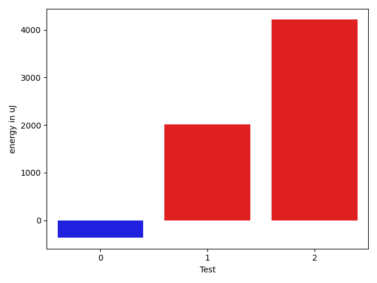

# gson 8d5de3

https://github.com/google/gson/commit/8d5de3

## Delta Energy per test method

| ID | EnergyV1 | EnergyV2 | DeltaEnergy | σV1 | σV2 |
| --- | --- | --- | --- | --- | --- |
| 0 | 88501 | 88134 | -367 | 27902.59002138578 | 31956.897228988488 |
| 1 | 40161 | 42175 | 2014 | 171223.20112537808 | 165262.28469290625 |
| 2 | 185180 | 189392 | 4212 | 128918.38313141179 | 146212.0110688623 |

## Delta Duration per test method

| ID | DurationV1 | DurationsV2 | DeltaDuration |
| --- | --- | --- | --- |
| 0 | 3141167.7164179105 | 3017155.878787879 | -124011.83763003163 |
| 1 | 4794615.424242424 | 4867260.555555556 | 72645.13131313212 |
| 2 | 5930896.623655914 | 6176573.494505495 | 245676.8708495805 |

## Misc.

| ID | Test Class | Test Method |
| --- | --- | --- |
| 0 | com.google.gson.functional.StringTest | testSingleQuoteInStringSerialization |
| 1 | com.google.gson.functional.EscapingTest | testGsonAcceptsEscapedAndNonEscapedJsonDeserialization |
| 2 | com.google.gson.functional.EscapingTest | testEscapingObjectFields |

| Test | IterationV1 | IterationV2 | DeltaIteration |
| --- | --- | --- | --- |
| 0 | 67 | 66 | -1 |
| 1 | 99 | 99 | 0 |
| 2 | 93 | 91 | -2 |

| Time Label | Time (s) |
| --- | --- |
| Selection | 27.572205305099487 |
| Injection | 10.2278573513031 |
| Total | 1085.9250979423523 |

