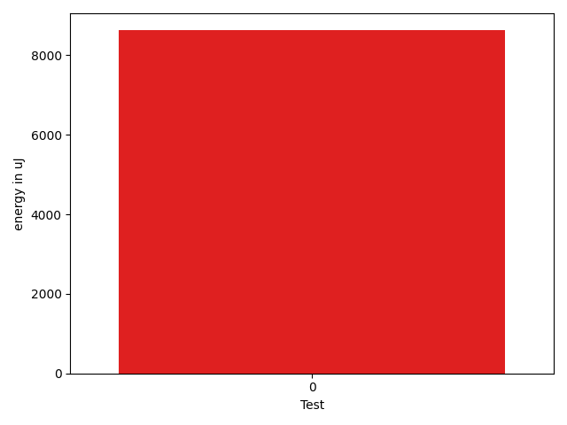

# gson 82f18a

https://github.com/google/gson/commit/82f18a

## Delta Energy per test method

| ID | EnergyV1 | EnergyV2 | DeltaEnergy | σV1 | σV2 |
| --- | --- | --- | --- | --- | --- |
| 0 | 52014.95945945946 | 60637.09090909091 | 8622.131449631452 | 32431.411828674052 | 35832.373316029014 |

## Delta Duration per test method

| ID | DurationV1 | DurationsV2 | DeltaDuration |
| --- | --- | --- | --- |
| 0 | 2101188.8378378376 | 2417070.5714285714 | 315881.7335907337 |

## Misc.

| ID | Test Class | Test Method |
| --- | --- | --- |
| 0 | com.google.gson.functional.DefaultTypeAdaptersTest | testClassSerialization |

| Test | IterationV1 | IterationV2 | DeltaIteration |
| --- | --- | --- | --- |
| 0 | 74 | 77 | 3 |

| Time Label | Time (s) |
| --- | --- |
| Selection | 27.248144388198853 |
| Injection | 10.273049354553223 |
| Total | 1095.0423657894135 |

