# gson bd937f

https://github.com/google/gson/commit/bd937f

## Delta Energy per test method

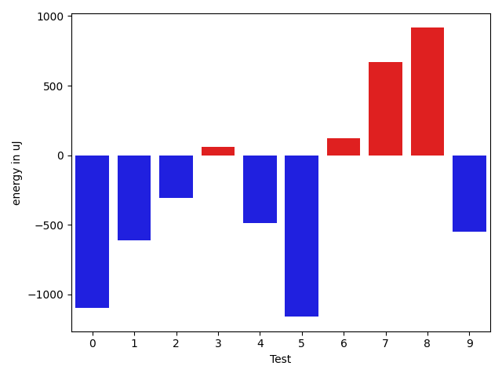

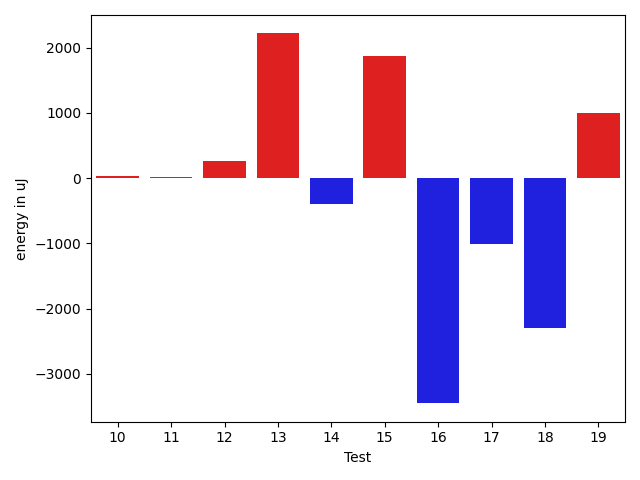

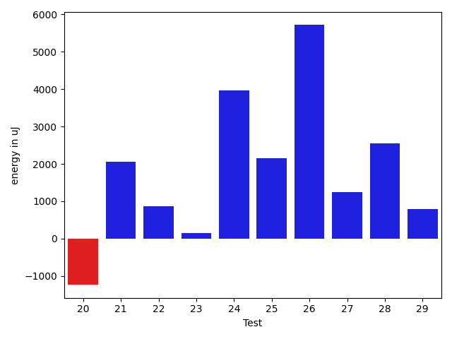

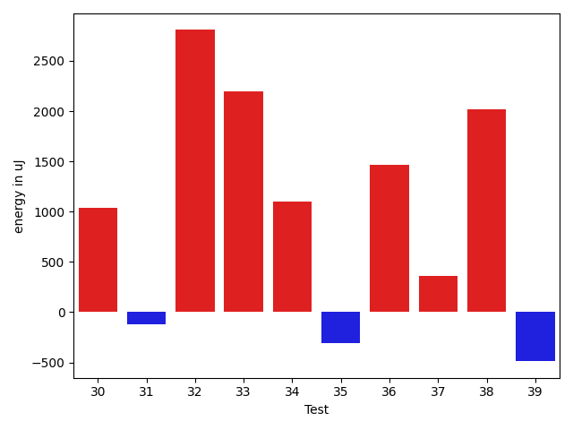

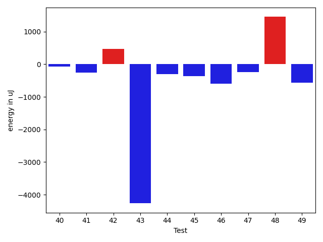

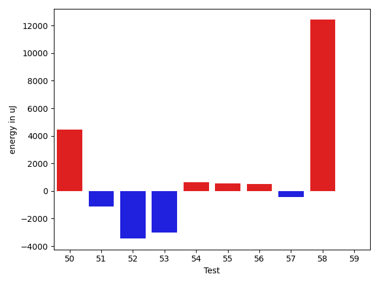

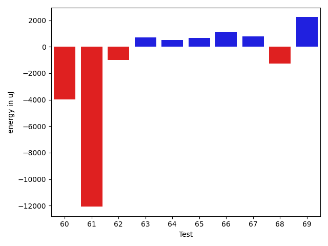

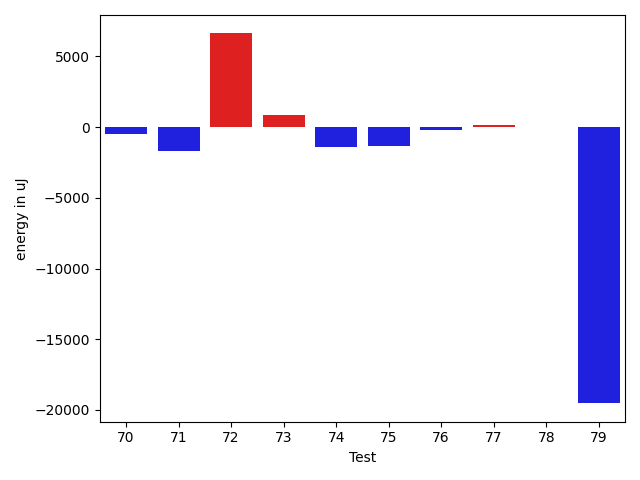

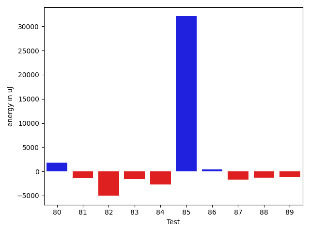

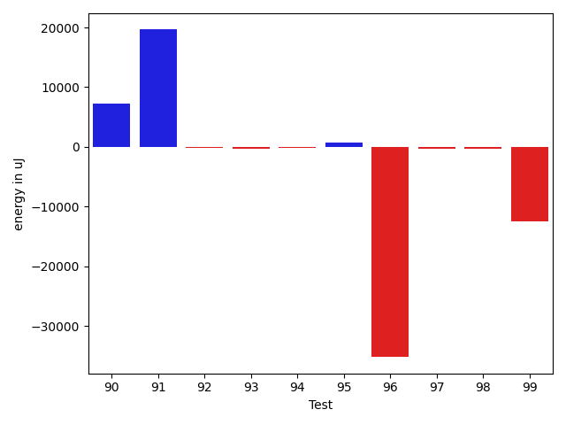

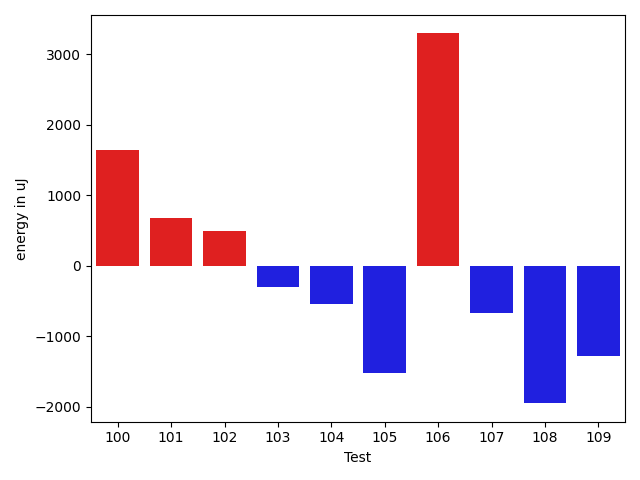

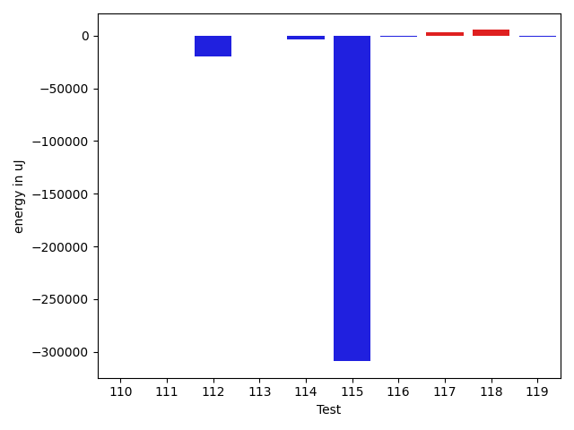

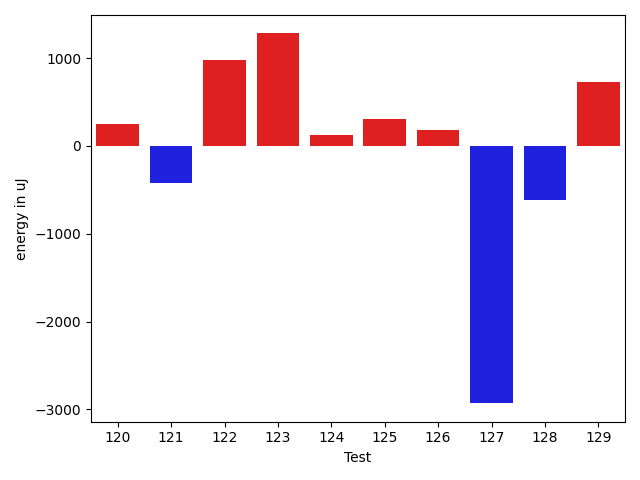

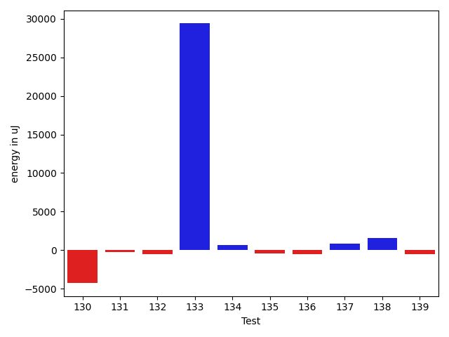

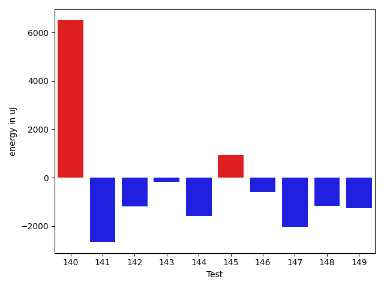

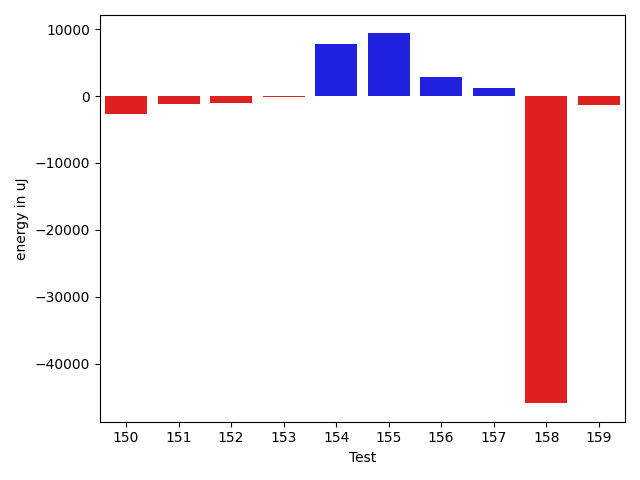

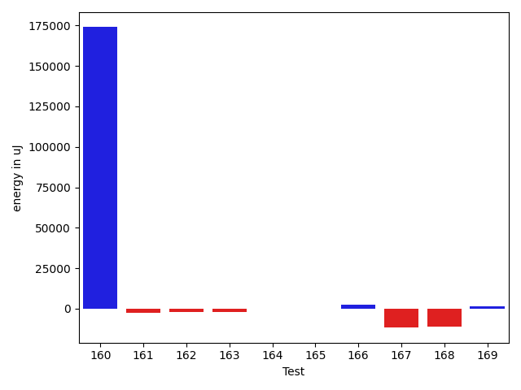

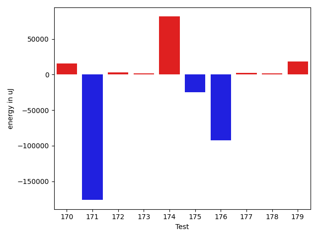

| ID | EnergyV1 | EnergyV2 | DeltaEnergy | σV1 | σV2 |
| --- | --- | --- | --- | --- | --- |
| 0 | 36987 | 35888 | -1099 | 9004.869166313421 | 3951.338661383272 |
| 1 | 36255 | 35645 | -610 | 3928.859020791085 | 4140.787488349123 |
| 2 | 38574 | 38269 | -305 | 13988.390953357246 | 23760.780521758115 |
| 3 | 40344 | 40405 | 61 | 192777.28302803755 | 170502.45042972793 |
| 4 | 75500 | 75013 | -487 | 22970.010889000285 | 25384.357401885565 |
| 5 | 36805 | 35644 | -1161 | 4394.320452207188 | 3514.811095585255 |
| 6 | 37292 | 37414 | 122 | 13159.316926165506 | 16598.800631859067 |
| 7 | 38086 | 38758 | 672 | 21091.363579329278 | 26486.530321792176 |
| 8 | 36743 | 37659 | 916 | 4316.285200145385 | 4274.753963487309 |
| 9 | 36560 | 36010 | -550 | 4338.3079806400565 | 3790.9226482813547 |
| 10 | 38086 | 36621 | -1465 | 4447.929284010207 | 4118.175703142257 |
| 11 | 37231 | 36194 | -1037 | 4027.252294051222 | 3910.2217708165176 |
| 12 | 37842 | 37659 | -183 | 4040.453586119118 | 4942.944739432842 |
| 13 | 38086 | 38329 | 243 | 11993.738921887074 | 13187.238927202137 |
| 14 | 36193 | 34607 | -1586 | 4364.424200442271 | 4016.1543536887452 |
| 15 | 34485 | 37598 | 3113 | 3684.070900614718 | 4645.1179384812185 |
| 16 | 40405 | 38513 | -1892 | 18210.589007226215 | 20325.289987638484 |
| 17 | 38025 | 37476 | -549 | 6597.533576459995 | 3452.4404802617632 |
| 18 | 39490 | 36682 | -2808 | 3722.6319469873088 | 3655.295535648533 |
| 19 | 35034 | 35279 | 245 | 4076.1331654700175 | 3532.028127900596 |
| 20 | 36926 | 37354 | 428 | 14734.213457333468 | 10430.404610220034 |
| 21 | 33936 | 36133 | 2197 | 3488.4812401270115 | 3287.6692635154636 |
| 22 | 35095 | 36621 | 1526 | 3913.580060311633 | 3136.7115050230464 |
| 23 | 35583 | 36255 | 672 | 4232.027343346538 | 3596.4322359324833 |
| 24 | 109985 | 112548 | 2563 | 19948.29783324974 | 24200.521348576436 |
| 25 | 35400 | 35949 | 549 | 4650.584965528531 | 3802.6403739300763 |
| 26 | 153259 | 204528 | 51269 | 246855.7292764465 | 243891.28981123486 |
| 27 | 35217 | 37598 | 2381 | 4419.315969342534 | 3491.3470075739992 |
| 28 | 35767 | 36682 | 915 | 8736.920978122105 | 11517.626955537049 |
| 29 | 34912 | 36866 | 1954 | 4115.497336592504 | 4033.9776160788 |
| 30 | 36255 | 37292 | 1037 | 3443.2199255612923 | 4066.0870610027914 |
| 31 | 36255 | 36133 | -122 | 3725.6607450545034 | 3210.0178776778353 |
| 32 | 34546 | 37353 | 2807 | 3629.529375077386 | 3453.1848852965886 |
| 33 | 34485 | 36682 | 2197 | 3645.5630398472053 | 3832.9601781054475 |
| 34 | 35462 | 36560 | 1098 | 3919.7159946064585 | 3874.8068062768093 |
| 35 | 36866 | 36560 | -306 | 3580.579304261037 | 4076.2549751125857 |
| 36 | 38452 | 39916 | 1464 | 29319.354199530044 | 34192.24869190367 |
| 37 | 41016 | 41381 | 365 | 68780.02685027184 | 223821.9524506015 |
| 38 | 35644 | 37659 | 2015 | 4215.852433738111 | 5050.018931751183 |
| 39 | 36621 | 36133 | -488 | 4102.960268702504 | 4391.431202879693 |
| 40 | 36988 | 37170 | 182 | 5802.216360208748 | 5650.534795172337 |
| 41 | 36377 | 37109 | 732 | 3713.7419300313995 | 4388.969611423619 |
| 42 | 37232 | 36926 | -306 | 4242.877722281078 | 4131.735754732964 |
| 43 | 38269 | 37598 | -671 | 22416.4771913519 | 12570.187915151559 |
| 44 | 37110 | 36560 | -550 | 4869.289807459086 | 3822.4286539862082 |
| 45 | 38208 | 37720 | -488 | 3752.523804801244 | 4107.051020086946 |
| 46 | 37170 | 36865 | -305 | 3760.173948251233 | 4178.355689315594 |
| 47 | 37780 | 36316 | -1464 | 4220.877166292577 | 3491.416117050501 |
| 48 | 36133 | 39063 | 2930 | 4360.951520052676 | 4362.9039677973915 |
| 49 | 37597 | 37720 | 123 | 7399.170068829045 | 7341.517150268895 |
| 50 | 38635 | 40039 | 1404 | 14210.137642856229 | 18797.050518723274 |
| 51 | 38513 | 38452 | -61 | 8889.904170326412 | 7000.516726524227 |
| 52 | 39734 | 38025 | -1709 | 16245.103026416578 | 14791.938731127282 |
| 53 | 41076 | 41809 | 733 | 41434.82347304188 | 46955.3347590447 |
| 54 | 37903 | 37903 | 0 | 4035.264016065627 | 4351.84175842083 |
| 55 | 37902 | 38208 | 306 | 3861.461366694559 | 4254.257966847432 |
| 56 | 36255 | 37231 | 976 | 4391.06490421806 | 5062.3024983658315 |
| 57 | 36377 | 36194 | -183 | 3659.1916479511365 | 3110.4160402321318 |
| 58 | 39307 | 39673 | 366 | 170628.0709677616 | 230634.23959878323 |
| 59 | 37170 | 38146 | 976 | 3793.694496001764 | 3865.2638307630386 |
| 60 | 42419 | 42298 | -121 | 30264.450782618766 | 23540.201750889686 |
| 61 | 39917 | 38330 | -1587 | 48825.951080102306 | 37206.56969537947 |
| 62 | 37780 | 36621 | -1159 | 3702.3548302744025 | 3102.4569295962838 |
| 63 | 36804 | 37963 | 1159 | 3610.7579072571375 | 3199.941718219255 |
| 64 | 38513 | 37781 | -732 | 3797.5865946516014 | 3299.187115790797 |
| 65 | 36927 | 37537 | 610 | 3253.897701219262 | 3290.3732681517017 |
| 66 | 38086 | 39794 | 1708 | 4426.242971171347 | 3457.8591591971685 |
| 67 | 36865 | 38452 | 1587 | 3894.2820201939826 | 3496.7596327162787 |
| 68 | 39795 | 38452 | -1343 | 3277.3568040562427 | 3598.5275110708662 |
| 69 | 38757 | 38818 | 61 | 3701.8329994146893 | 4493.2655514175385 |
| 70 | 38086 | 36010 | -2076 | 4042.574335742016 | 5322.77047193598 |
| 71 | 36987 | 36132 | -855 | 3637.481858575812 | 3852.9341209005897 |
| 72 | 40283 | 40711 | 428 | 197048.64596047383 | 196798.85052948236 |
| 73 | 37780 | 39124 | 1344 | 4686.9506501279375 | 5255.20812530878 |
| 74 | 39185 | 38941 | -244 | 3645.2316713070513 | 3370.1457494371043 |
| 75 | 38758 | 34423 | -4335 | 3280.924368223077 | 4520.596795842526 |
| 76 | 37842 | 38269 | 427 | 3682.3157431497534 | 3749.7156270776877 |
| 77 | 38086 | 37964 | -122 | 4041.256540153487 | 4929.185659674288 |
| 78 | 37720 | 37110 | -610 | 4158.016389325053 | 4598.201418433381 |
| 79 | 105712 | 113219 | 7507 | 324149.73574442195 | 261314.139355465 |
| 80 | 37475 | 38574 | 1099 | 4472.720707522435 | 4042.819761626778 |
| 81 | 38147 | 36987 | -1160 | 3644.059371828377 | 3876.61494682544 |
| 82 | 65796 | 66528 | 732 | 221378.5045295736 | 223186.54734530387 |
| 83 | 39368 | 38696 | -672 | 11257.804475335111 | 8975.100724489905 |
| 84 | 39306 | 38696 | -610 | 18237.298237115076 | 16377.068301586169 |
| 85 | 158813 | 152221 | -6592 | 158771.50117225753 | 267249.13457886275 |
| 86 | 37171 | 36438 | -733 | 4436.094044133313 | 4968.4008557808065 |
| 87 | 37415 | 35706 | -1709 | 5614.842141154931 | 4051.457170896966 |
| 88 | 38513 | 35828 | -2685 | 4605.294386134722 | 3828.1991392554173 |
| 89 | 37292 | 36133 | -1159 | 4790.312160347463 | 3887.6541153499697 |
| 90 | 39124 | 37415 | -1709 | 15549.980477403604 | 27754.024203268 |
| 91 | 36255 | 37170 | 915 | 23355.08786495029 | 50797.98638170215 |
| 92 | 36377 | 36316 | -61 | 4913.369365744315 | 4302.033426032624 |
| 93 | 37353 | 36072 | -1281 | 4440.704768722083 | 4088.4346893626266 |
| 94 | 36987 | 36194 | -793 | 4153.168186776731 | 4522.329822361724 |
| 95 | 37231 | 37537 | 306 | 8250.017942165083 | 7878.858342363921 |
| 96 | 81055 | 78980 | -2075 | 259134.48869235755 | 139646.32036911533 |
| 97 | 37354 | 38635 | 1281 | 11788.904150666156 | 8681.781040630032 |
| 98 | 37292 | 37231 | -61 | 7031.265903030395 | 7363.485366308793 |
| 99 | 41626 | 38636 | -2990 | 33319.3877527853 | 24153.114084598095 |
| 100 | 36010 | 37659 | 1649 | 4052.651364991541 | 5083.87852193468 |
| 101 | 36865 | 37536 | 671 | 4105.972526769945 | 4528.9585501569545 |
| 102 | 35706 | 36193 | 487 | 3488.1529800616922 | 3993.7752331290208 |
| 103 | 38513 | 38208 | -305 | 20579.23171481924 | 16243.705307558836 |
| 104 | 36499 | 35950 | -549 | 3519.5237063652535 | 4818.672681685605 |
| 105 | 35950 | 34424 | -1526 | 3652.5483270811787 | 4327.179968754993 |
| 106 | 35217 | 38514 | 3297 | 4720.670038398 | 3656.3642953539934 |
| 107 | 36315 | 35645 | -670 | 11447.399179733591 | 4060.6531675989304 |
| 108 | 37048 | 35095 | -1953 | 3293.5644530508284 | 4778.414575153648 |
| 109 | 39367 | 38086 | -1281 | 45458.118344696915 | 18736.9868432808 |
| 110 | 35400 | 35644 | 244 | 3698.251678382651 | 4143.600989382201 |
| 111 | 36499 | 36072 | -427 | 4660.156745428931 | 4848.6669946491475 |
| 112 | 41687 | 35401 | -6286 | 32957.45147428727 | 27860.25351692283 |
| 113 | 36438 | 37170 | 732 | 3722.0353938020685 | 4539.376352656015 |
| 114 | 36743 | 39794 | 3051 | 15656.14719441962 | 8158.7223915892755 |
| 115 | 42176 | 38147 | -4029 | 445410.2085545863 | 203922.1665084424 |
| 116 | 36499 | 36438 | -61 | 4739.509828076195 | 4296.01380985778 |
| 117 | 38268 | 39489 | 1221 | 17037.964260050307 | 19960.203870510082 |
| 118 | 37476 | 38025 | 549 | 40160.1667111023 | 50889.50152969014 |
| 119 | 36804 | 35949 | -855 | 11348.174809894019 | 9666.149107003035 |
| 120 | 37841 | 38086 | 245 | 13375.125807338092 | 12096.251734858477 |
| 121 | 38757 | 38330 | -427 | 4387.90849693792 | 4211.7146760300075 |
| 122 | 39978 | 40954 | 976 | 25580.57251599249 | 31045.249860871554 |
| 123 | 36560 | 37841 | 1281 | 4065.669096163657 | 4567.784718154948 |
| 124 | 39062 | 39184 | 122 | 18437.01955257813 | 15816.551909950318 |
| 125 | 37598 | 37903 | 305 | 4121.143119329879 | 3834.6547208689894 |
| 126 | 38086 | 38269 | 183 | 4004.0425308484137 | 3646.1935257882296 |
| 127 | 39429 | 36499 | -2930 | 4713.277084058513 | 4287.258258288758 |
| 128 | 43090 | 42480 | -610 | 168167.7308543942 | 252908.6537197071 |
| 129 | 37903 | 38635 | 732 | 3626.6517986005606 | 4327.057094785549 |
| 130 | 43701 | 41138 | -2563 | 160076.08328113102 | 196248.12548163417 |
| 131 | 39184 | 38757 | -427 | 4631.933337651184 | 3758.1140595360803 |
| 132 | 38269 | 38391 | 122 | 26158.27189916936 | 27927.127314435344 |
| 133 | 38940 | 40283 | 1343 | 119478.26693716757 | 217299.3962727934 |
| 134 | 69640 | 46021 | -23619 | 24510.036691429967 | 29783.108461053853 |
| 135 | 38085 | 36743 | -1342 | 3708.0067025893018 | 5343.846233017018 |
| 136 | 37597 | 37842 | 245 | 7782.514764278512 | 7865.171725009499 |
| 137 | 36682 | 37049 | 367 | 3209.27734115784 | 4237.980876974317 |
| 138 | 37231 | 38391 | 1160 | 4119.408030388994 | 4531.107281531255 |
| 139 | 38574 | 38025 | -549 | 47452.86157956911 | 45528.966563128095 |
| 140 | 39123 | 38146 | -977 | 349567.1321055095 | 345757.9217734162 |
| 141 | 38513 | 37292 | -1221 | 3840.0971240891386 | 4503.604557462832 |
| 142 | 41137 | 38818 | -2319 | 19932.77853784442 | 18693.328243780375 |
| 143 | 38207 | 37537 | -670 | 3937.777963903713 | 4226.182870430595 |
| 144 | 37659 | 34485 | -3174 | 3452.030955081914 | 4322.559267100915 |
| 145 | 38391 | 38330 | -61 | 20553.69765014253 | 23485.35775259765 |
| 146 | 36987 | 36072 | -915 | 3774.238893551918 | 4851.709392336031 |
| 147 | 38879 | 38819 | -60 | 9087.692681814395 | 4500.95466280054 |
| 148 | 39123 | 39001 | -122 | 12664.179066705972 | 10919.784908862546 |
| 149 | 38208 | 37109 | -1099 | 2923.9771558894345 | 4071.4948355064334 |
| 150 | 40832 | 38818 | -2014 | 3850.808489744895 | 4543.284047197359 |
| 151 | 38635 | 37720 | -915 | 8086.1234642466525 | 6708.4175126978935 |
| 152 | 38757 | 36743 | -2014 | 3272.8253186703214 | 5435.433060902948 |
| 153 | 37720 | 37659 | -61 | 4307.583170492481 | 5567.832358141483 |
| 154 | 84778 | 82642 | -2136 | 282162.5431608241 | 299315.45952596207 |
| 155 | 39490 | 40161 | 671 | 31784.266747344747 | 35367.769485741665 |
| 156 | 37964 | 38452 | 488 | 4453.105218792087 | 11858.246289546067 |
| 157 | 173766 | 175781 | 2015 | 84222.13773825692 | 80523.42903980642 |
| 158 | 40833 | 39795 | -1038 | 295707.87774267374 | 179621.3487823738 |
| 159 | 39367 | 38086 | -1281 | 3558.2236827280167 | 4097.416126808776 |
| 160 | 42968 | 70923 | 27955 | 174785.46968601053 | 504529.04622228415 |
| 161 | 38513 | 37719 | -794 | 3839.6210908385374 | 4159.183133692461 |
| 162 | 40405 | 36499 | -3906 | 4221.946077854384 | 4410.574503857931 |
| 163 | 39673 | 36254 | -3419 | 5652.173011580101 | 6757.101828234019 |
| 164 | 37902 | 37414 | -488 | 7482.191427220647 | 8327.430685460886 |
| 165 | 36744 | 37293 | 549 | 5260.916194557166 | 5906.662641400983 |
| 166 | 35644 | 38269 | 2625 | 3414.3145698986523 | 3349.851793736553 |
| 167 | 88928 | 46204 | -42724 | 143204.01125487286 | 149836.9541133888 |
| 168 | 39062 | 38818 | -244 | 32718.201556842745 | 4082.6025312992974 |
| 169 | 36926 | 38085 | 1159 | 3086.372699464535 | 4346.426906796393 |
| 170 | 37293 | 40223 | 2930 | 34168.38956477171 | 59791.62903018428 |
| 171 | 38086 | 38818 | 732 | 405658.5262782013 | 25284.712181369094 |
| 172 | 38391 | 40100 | 1709 | 6576.367122378838 | 9816.259562625328 |
| 173 | 39734 | 39794 | 60 | 8217.734819009162 | 12595.746423120607 |
| 174 | 42053 | 35583 | -6470 | 172546.76557305333 | 356417.50483862404 |
| 175 | 39063 | 40893 | 1830 | 345972.24815451575 | 282520.8484048285 |
| 176 | 39612 | 40222 | 610 | 518529.0076759294 | 436692.80387308187 |
| 177 | 37048 | 40466 | 3418 | 4687.1464316242145 | 5954.022631372672 |
| 178 | 37353 | 40100 | 2747 | 4622.6328135120475 | 5255.542436093334 |
| 179 | 38208 | 40283 | 2075 | 379933.498845052 | 376873.49049497524 |

## Delta Duration per test method

| ID | DurationV1 | DurationsV2 | DeltaDuration |
| --- | --- | --- | --- |
| 0 | 927195.8529411765 | 929420.2575757576 | 2224.404634581064 |
| 1 | 805125.4423076923 | 823292.3653846154 | 18166.92307692312 |
| 2 | 1034294.8035714285 | 1133962.5423728814 | 99667.73880145291 |
| 3 | 2018698.8358208956 | 2373218.4444444445 | 354519.6086235489 |
| 4 | 2335567.626262626 | 2368881.484848485 | 33313.85858585872 |
| 5 | 543522.8846153846 | 541182.6060606061 | -2340.278554778546 |
| 6 | 1134925.0975609757 | 1190681.894736842 | 55756.79717586632 |
| 7 | 956931.3018867924 | 1065560.2033898304 | 108628.90150303801 |
| 8 | 780745.2884615385 | 723800.8604651163 | -56944.427996422164 |
| 9 | 776593.0892857143 | 727645.5454545454 | -48947.54383116891 |
| 10 | 767539.4888888889 | 739933.5853658536 | -27605.90352303523 |
| 11 | 769580.7692307692 | 767882.8653846154 | -1697.903846153873 |
| 12 | 824984.5576923077 | 843209.3448275862 | 18224.787135278457 |
| 13 | 867493.3333333334 | 989702.5918367347 | 122209.2585034013 |
| 14 | 603076.5348837209 | 637163.7142857143 | 34087.1794019934 |
| 15 | 457290.82608695654 | 451995.56 | -5295.266086956544 |
| 16 | 1530329.081632653 | 1549303.7708333333 | 18974.689200680237 |
| 17 | 881539.8571428572 | 928282.3389830509 | 46742.48184019374 |
| 18 | 587190.512195122 | 626035.1388888889 | 38844.62669376691 |
| 19 | 780864.1363636364 | 754231.3409090909 | -26632.795454545412 |
| 20 | 1298335.688172043 | 1286106.15625 | -12229.531922043068 |
| 21 | 643028.7272727273 | 625677.5161290322 | -17351.21114369505 |
| 22 | 497407.0 | 460826.64705882355 | -36580.35294117645 |
| 23 | 719528.2941176471 | 721315.6444444444 | 1787.3503267973429 |
| 24 | 3391722.0505050505 | 3478749.111111111 | 87027.06060606055 |
| 25 | 501490.36 | 502121.9259259259 | 631.5659259259119 |
| 26 | 9654296.04040404 | 9679405.141414141 | 25109.101010100916 |
| 27 | 823719.9152542372 | 820734.7142857143 | -2985.2009685229277 |
| 28 | 1233870.5578947368 | 1243361.2777777778 | 9490.71988304099 |
| 29 | 788888.45 | 790498.8409090909 | 1610.3909090909874 |
| 30 | 482058.14285714284 | 479295.0 | -2763.1428571428405 |
| 31 | 786471.7826086957 | 791559.1276595745 | 5087.345050878823 |
| 32 | 537523.5384615385 | 517441.46428571426 | -20082.074175824237 |
| 33 | 728684.9 | 718158.4545454546 | -10526.445454545435 |
| 34 | 478320.35294117645 | 488695.1379310345 | 10374.784989858046 |
| 35 | 770669.4489795918 | 760568.4821428572 | -10100.966836734675 |
| 36 | 988075.0 | 1113889.8863636365 | 125814.88636363647 |
| 37 | 2089608.7397260275 | 3324382.3243243243 | 1234773.5845982968 |
| 38 | 573788.7083333334 | 543070.9230769231 | -30717.78525641025 |
| 39 | 795293.6274509804 | 788457.7580645161 | -6835.869386464241 |
| 40 | 812446.9649122807 | 830061.0 | 17614.035087719327 |
| 41 | 587805.8260869565 | 570496.4333333333 | -17309.392753623193 |
| 42 | 820487.659574468 | 802095.875 | -18391.784574468038 |
| 43 | 889037.52 | 819032.8888888889 | -70004.63111111114 |
| 44 | 536840.5238095238 | 499116.8888888889 | -37723.63492063491 |
| 45 | 536382.68 | 582942.0416666666 | 46559.36166666658 |
| 46 | 536750.9705882353 | 571043.7647058824 | 34292.79411764711 |
| 47 | 513108.3043478261 | 516758.56 | 3650.255652173888 |
| 48 | 541835.2258064516 | 598577.7666666667 | 56742.540860215086 |
| 49 | 1036463.8769230769 | 1017213.2615384615 | -19250.615384615376 |
| 50 | 1460519.8842105262 | 1491400.0 | 30880.115789473755 |
| 51 | 1080605.0350877193 | 975532.3709677419 | -105072.66411997739 |
| 52 | 1110260.3666666667 | 980136.7213114754 | -130123.64535519131 |
| 53 | 1868465.5505617978 | 1799854.7 | -68610.85056179785 |
| 54 | 713577.8431372549 | 766629.0512820513 | 53051.208144796314 |
| 55 | 873600.625 | 861976.8484848485 | -11623.77651515149 |
| 56 | 598922.0833333334 | 554986.125 | -43935.95833333337 |
| 57 | 630317.5135135135 | 698131.6333333333 | 67814.11981981981 |
| 58 | 1976335.0379746836 | 2265828.864197531 | 289493.8262228472 |
| 59 | 597473.5384615385 | 569111.9545454546 | -28361.58391608391 |
| 60 | 1391243.4090909092 | 1253482.956521739 | -137760.45256917016 |
| 61 | 1997095.1666666667 | 1755273.5 | -241821.66666666674 |
| 62 | 400546.8181818182 | 367290.375 | -33256.44318181818 |
| 63 | 518565.0 | 495650.5 | -22914.5 |
| 64 | 396537.21428571426 | 399805.4375 | 3268.2232142857392 |
| 65 | 385091.375 | 419016.2631578947 | 33924.88815789472 |
| 66 | 446707.6875 | 498668.25 | 51960.5625 |
| 67 | 442877.64285714284 | 426121.3076923077 | -16756.335164835153 |
| 68 | 416380.0 | 411294.2727272727 | -5085.727272727294 |
| 69 | 426917.1111111111 | 476836.6 | 49919.48888888885 |
| 70 | 469929.2 | 536734.8333333334 | 66805.63333333336 |
| 71 | 437865.84210526315 | 450011.8 | 12145.957894736843 |
| 72 | 2293507.7021276597 | 2414041.5268817204 | 120533.82475406071 |
| 73 | 816959.7142857143 | 824115.3235294118 | 7155.609243697487 |
| 74 | 484268.875 | 452934.21428571426 | -31334.66071428574 |
| 75 | 485038.3 | 577199.0 | 92160.70000000001 |
| 76 | 457294.1153846154 | 454872.27777777775 | -2421.8376068376238 |
| 77 | 473824.8333333333 | 485229.275862069 | 11404.442528735672 |
| 78 | 730009.2222222222 | 757668.1206896552 | 27658.89846743294 |
| 79 | 5087667.303030303 | 4615199.161616161 | -472468.1414141413 |
| 80 | 452802.15 | 397768.0 | -55034.15000000002 |
| 81 | 844165.8448275862 | 815723.3636363636 | -28442.481191222556 |
| 82 | 2906911.3434343436 | 2737505.484848485 | -169405.85858585872 |
| 83 | 1256044.5476190476 | 1158557.9166666667 | -97486.63095238083 |
| 84 | 1361525.6666666667 | 1251627.3170731708 | -109898.34959349595 |
| 85 | 5618030.373737373 | 6474536.191919192 | 856505.8181818184 |
| 86 | 746868.3333333334 | 724227.3469387755 | -22640.98639455787 |
| 87 | 941888.3392857143 | 856942.2647058824 | -84946.07457983191 |
| 88 | 670567.7105263158 | 777071.5428571429 | 106503.83233082702 |
| 89 | 761678.0434782609 | 842296.6170212766 | 80618.57354301575 |
| 90 | 800847.6153846154 | 1129680.21875 | 328832.6033653846 |
| 91 | 893360.4827586206 | 1562670.894736842 | 669310.4119782214 |
| 92 | 590913.5714285715 | 595189.2325581395 | 4275.661129568005 |
| 93 | 599757.1081081082 | 659181.25 | 59424.141891891835 |
| 94 | 416972.3888888889 | 457708.5333333333 | 40736.14444444445 |
| 95 | 1042110.3064516129 | 1020194.3968253968 | -21915.909626216046 |
| 96 | 4087169.7474747472 | 2929029.595959596 | -1158140.1515151514 |
| 97 | 1154168.5625 | 1082067.4935064935 | -72101.06899350649 |
| 98 | 1099507.9130434783 | 1009785.2375 | -89722.67554347822 |
| 99 | 1642271.1875 | 1208275.6129032257 | -433995.5745967743 |
| 100 | 599832.8095238095 | 629205.3703703703 | 29372.560846560868 |
| 101 | 797154.1904761905 | 692184.0555555555 | -104970.13492063503 |
| 102 | 718039.9361702128 | 717034.8717948718 | -1005.064375341055 |
| 103 | 1511908.90625 | 1441382.3125 | -70526.59375 |
| 104 | 505047.0967741936 | 521659.2727272727 | 16612.17595307913 |
| 105 | 482238.9130434783 | 474080.7894736842 | -8158.123569794057 |
| 106 | 614157.1142857143 | 548993.3888888889 | -65163.725396825466 |
| 107 | 911588.2363636363 | 733000.2195121951 | -178588.01685144124 |
| 108 | 521752.04 | 551481.6428571428 | 29729.60285714286 |
| 109 | 1520017.4893617022 | 757461.8333333334 | -762555.6560283689 |
| 110 | 561486.1794871795 | 591607.1935483871 | 30121.01406120765 |
| 111 | 478134.84210526315 | 502730.0625 | 24595.220394736854 |
| 112 | 1618100.84 | 666864.0476190476 | -951236.7923809525 |
| 113 | 694257.4615384615 | 634013.2368421053 | -60244.22469635622 |
| 114 | 1066831.5333333334 | 684350.275862069 | -382481.25747126446 |
| 115 | 10889030.96 | 2020705.6666666667 | -8868325.293333335 |
| 116 | 962230.9206349206 | 974522.9402985075 | 12292.019663586863 |
| 117 | 1372895.2471910112 | 1427703.7674418604 | 54808.52025084919 |
| 118 | 1464616.5294117648 | 1609928.4523809524 | 145311.9229691876 |
| 119 | 1126150.8048780488 | 1151131.4767441861 | 24980.6718661373 |
| 120 | 1240656.1392405063 | 1166528.1866666668 | -74127.95257383958 |
| 121 | 773973.05 | 811119.7551020408 | 37146.70510204078 |
| 122 | 1283392.7272727273 | 1343901.0327868853 | 60508.30551415798 |
| 123 | 830582.3673469388 | 847977.1219512195 | 17394.754604280693 |
| 124 | 1027764.8596491228 | 989860.125 | -37904.73464912281 |
| 125 | 578553.0666666667 | 568398.7575757576 | -10154.309090909082 |
| 126 | 709467.0227272727 | 709896.1 | 429.0772727272706 |
| 127 | 745836.8888888889 | 757724.6216216217 | 11887.73273273278 |
| 128 | 2692750.434782609 | 3369987.75 | 677237.3152173911 |
| 129 | 733312.2926829269 | 774876.4864864865 | 41564.19380355964 |
| 130 | 2342220.5942028984 | 2176906.6811594204 | -165313.91304347804 |
| 131 | 803710.9814814815 | 804875.0344827586 | 1164.0530012771487 |
| 132 | 1098657.9344262294 | 1090143.0 | -8514.934426229447 |
| 133 | 1464292.985915493 | 2293546.15942029 | 829253.173504797 |
| 134 | 1932735.1313131314 | 1971849.6767676768 | 39114.54545454541 |
| 135 | 497583.037037037 | 579277.5769230769 | 81694.53988603986 |
| 136 | 870372.25 | 858359.8541666666 | -12012.395833333372 |
| 137 | 483194.3888888889 | 518773.8 | 35579.41111111111 |
| 138 | 569989.8333333334 | 545808.8846153846 | -24180.948717948748 |
| 139 | 1808455.0454545454 | 1820422.1176470588 | 11967.072192513384 |
| 140 | 3484428.358974359 | 3847763.3181818184 | 363334.95920745935 |
| 141 | 485099.8947368421 | 562963.95 | 77864.05526315788 |
| 142 | 909060.2727272727 | 917296.358974359 | 8236.086247086292 |
| 143 | 555520.7391304348 | 551053.925925926 | -4466.813204508857 |
| 144 | 394193.0 | 453792.88 | 59599.880000000005 |
| 145 | 1349571.1746031747 | 1258349.1369863013 | -91222.0376168734 |
| 146 | 500271.36 | 479717.0 | -20554.359999999986 |
| 147 | 880409.1698113207 | 866457.9411764706 | -13951.228634850122 |
| 148 | 1180919.21875 | 1155249.48 | -25669.73875000002 |
| 149 | 423840.28571428574 | 447131.5333333333 | 23291.247619047586 |
| 150 | 484410.27777777775 | 532620.3157894737 | 48210.03801169596 |
| 151 | 904929.4468085107 | 931923.3191489362 | 26993.8723404255 |
| 152 | 497016.8888888889 | 621215.4210526316 | 124198.5321637427 |
| 153 | 480507.3076923077 | 545601.3571428572 | 65094.04945054947 |
| 154 | 4456102.585858586 | 4842352.171717172 | 386249.5858585853 |
| 155 | 1182247.0425531915 | 1444658.3617021276 | 262411.3191489361 |
| 156 | 837364.659574468 | 987486.6818181818 | 150122.02224371373 |
| 157 | 5453933.808080808 | 5366268.717171717 | -87665.09090909082 |
| 158 | 3214933.4545454546 | 1860945.4142857143 | -1353988.0402597403 |
| 159 | 711880.6285714286 | 801181.2708333334 | 89300.64226190478 |
| 160 | 2432723.3278688523 | 7554695.323529412 | 5121971.99566056 |
| 161 | 649121.8181818182 | 756181.4857142858 | 107059.66753246752 |
| 162 | 527841.1304347826 | 614956.0357142857 | 87114.90527950309 |
| 163 | 803667.8571428572 | 992750.641509434 | 189082.78436657682 |
| 164 | 1074038.975308642 | 1098189.9333333333 | 24150.958024691325 |
| 165 | 972576.3076923077 | 1083342.5762711863 | 110766.2685788786 |
| 166 | 587979.4666666667 | 617634.76 | 29655.293333333335 |
| 167 | 2907989.135135135 | 2381110.586956522 | -526878.5481786132 |
| 168 | 1158270.294117647 | 573571.7857142857 | -584698.5084033613 |
| 169 | 589200.4 | 604334.0 | 15133.599999999977 |
| 170 | 903282.6666666666 | 1190612.043478261 | 287329.37681159435 |
| 171 | 6326634.65625 | 828751.1538461539 | -5497883.502403846 |
| 172 | 1129580.445945946 | 1187561.028169014 | 57980.58222306799 |
| 173 | 1193549.851851852 | 1196157.0933333333 | 2607.241481481353 |
| 174 | 1612735.5833333333 | 3700468.789473684 | 2087733.2061403508 |
| 175 | 4352081.875 | 3610385.588235294 | -741696.286764706 |
| 176 | 8327560.352941177 | 6012479.444444444 | -2315080.908496733 |
| 177 | 821288.0909090909 | 628615.5714285715 | -192672.51948051946 |
| 178 | 581706.1212121212 | 612131.9705882353 | 30425.849376114085 |
| 179 | 4709285.70967742 | 5405813.21875 | 696527.5090725804 |

## Misc.

| ID | Test Class | Test Method |
| --- | --- | --- |
| 0 | com.google.gson.functional.CustomTypeAdaptersTest | testCustomAdapterInvokedForCollectionElementDeserialization |
| 1 | com.google.gson.functional.CustomTypeAdaptersTest | testCustomAdapterInvokedForMapElementSerializationWithType |
| 2 | com.google.gson.functional.CustomTypeAdaptersTest | testCustomNestedSerializers |
| 3 | com.google.gson.functional.CustomTypeAdaptersTest | testCustomSerializers |
| 4 | com.google.gson.functional.CustomTypeAdaptersTest | testCustomTypeAdapterDoesNotAppliesToSubClasses |
| 5 | com.google.gson.functional.CustomTypeAdaptersTest | testCustomAdapterInvokedForCollectionElementSerialization |
| 6 | com.google.gson.functional.CustomTypeAdaptersTest | testCustomAdapterInvokedForCollectionElementSerializationWithType |
| 7 | com.google.gson.functional.CustomTypeAdaptersTest | testCustomDeserializers |
| 8 | com.google.gson.functional.CustomTypeAdaptersTest | testCustomTypeAdapterAppliesToSubClassesSerializedAsBaseClass |
| 9 | com.google.gson.functional.CustomTypeAdaptersTest | testCustomByteArrayDeserializerAndInstanceCreator |
| 10 | com.google.gson.functional.CustomTypeAdaptersTest | testCustomByteArraySerializer |
| 11 | com.google.gson.functional.CustomTypeAdaptersTest | testCustomAdapterInvokedForMapElementDeserialization |
| 12 | com.google.gson.functional.CustomTypeAdaptersTest | testCustomNestedDeserializers |
| 13 | com.google.gson.functional.CustomTypeAdaptersTest | testEnsureCustomSerializerNotInvokedForNullValues |
| 14 | com.google.gson.functional.CustomTypeAdaptersTest | testEnsureCustomDeserializerNotInvokedForNullValues |
| 15 | com.google.gson.functional.CustomTypeAdaptersTest | testCustomAdapterInvokedForMapElementSerialization |
| 16 | com.google.gson.functional.StreamingTypeAdaptersTest | testNullSafe |
| 17 | com.google.gson.functional.StreamingTypeAdaptersTest | testSerializeWithCustomTypeAdapter |
| 18 | com.google.gson.functional.StreamingTypeAdaptersTest | testDeserializeWithCustomTypeAdapter |
| 19 | com.google.gson.functional.DefaultTypeAdaptersTest | testDateSerializationWithPatternNotOverridenByTypeAdapter |
| 20 | com.google.gson.functional.DefaultTypeAdaptersTest | testDateSerializationWithPattern |
| 21 | com.google.gson.functional.DefaultTypeAdaptersTest | testBitSetDeserialization |
| 22 | com.google.gson.functional.DefaultTypeAdaptersTest | testDefaultGregorianCalendarDeserialization |
| 23 | com.google.gson.functional.DefaultTypeAdaptersTest | testTimestampSerialization |
| 24 | com.google.gson.functional.DefaultTypeAdaptersTest | testDefaultDateDeserializationUsingBuilder |
| 25 | com.google.gson.functional.DefaultTypeAdaptersTest | testDefaultCalendarSerialization |
| 26 | com.google.gson.functional.DefaultTypeAdaptersTest | testNullSerialization |
| 27 | com.google.gson.functional.DefaultTypeAdaptersTest | testDateDeserializationWithPattern |
| 28 | com.google.gson.functional.DefaultTypeAdaptersTest | testDateSerializationInCollection |
| 29 | com.google.gson.functional.DefaultTypeAdaptersTest | testSetSerialization |
| 30 | com.google.gson.functional.DefaultTypeAdaptersTest | testBitSetSerialization |
| 31 | com.google.gson.functional.DefaultTypeAdaptersTest | testDefaultDateSerializationUsingBuilder |
| 32 | com.google.gson.functional.DefaultTypeAdaptersTest | testDefaultCalendarDeserialization |
| 33 | com.google.gson.functional.DefaultTypeAdaptersTest | testSqlDateSerialization |
| 34 | com.google.gson.functional.DefaultTypeAdaptersTest | testDefaultGregorianCalendarSerialization |
| 35 | com.google.gson.functional.NamingPolicyTest | testAtSignInSerializedName |
| 36 | com.google.gson.functional.NamingPolicyTest | testGsonWithNonDefaultFieldNamingPolicySerialization |
| 37 | com.google.gson.functional.NamingPolicyTest | testGsonDuplicateNameUsingSerializedNameFieldNamingPolicySerialization |
| 38 | com.google.gson.functional.NamingPolicyTest | testGsonWithUpperCamelCaseSpacesPolicyDeserialiation |
| 39 | com.google.gson.functional.NamingPolicyTest | testComplexFieldNameStrategy |
| 40 | com.google.gson.functional.NamingPolicyTest | testDeprecatedNamingStrategy |
| 41 | com.google.gson.functional.NamingPolicyTest | testGsonWithLowerCaseDashPolicySerialization |
| 42 | com.google.gson.functional.NamingPolicyTest | testGsonWithSerializedNameFieldNamingPolicySerialization |
| 43 | com.google.gson.functional.NamingPolicyTest | testGsonWithNonDefaultFieldNamingPolicyDeserialiation |
| 44 | com.google.gson.functional.NamingPolicyTest | testGsonWithUpperCamelCaseSpacesPolicySerialiation |
| 45 | com.google.gson.functional.NamingPolicyTest | testGsonWithLowerCaseDashPolicyDeserialiation |
| 46 | com.google.gson.functional.NamingPolicyTest | testGsonWithLowerCaseUnderscorePolicySerialization |
| 47 | com.google.gson.functional.NamingPolicyTest | testGsonWithSerializedNameFieldNamingPolicyDeserialization |
| 48 | com.google.gson.functional.NamingPolicyTest | testGsonWithLowerCaseUnderscorePolicyDeserialiation |
| 49 | com.google.gson.functional.MapTest | testSerializeMaps |
| 50 | com.google.gson.functional.MapTest | testInterfaceTypeMapWithSerializer |
| 51 | com.google.gson.functional.MapTest | testMapSubclassDeserialization |
| 52 | com.google.gson.functional.MapTest | testCustomSerializerForSpecificMapType |
| 53 | com.google.gson.functional.MapTest | testInterfaceTypeMap |
| 54 | com.google.gson.functional.MapTest | testMapSerializationWithNullValueButSerializeNulls |
| 55 | com.google.gson.functional.MapTest | testGeneralMapField |
| 56 | com.google.gson.functional.MapTest | testMapSerializationWithNullValuesSerialized |
| 57 | com.google.gson.functional.FieldExclusionTest | testDefaultNestedStaticClassIncluded |
| 58 | com.google.gson.functional.FieldExclusionTest | testDefaultInnerClassExclusion |
| 59 | com.google.gson.functional.FieldExclusionTest | testInnerClassExclusion |
| 60 | com.google.gson.functional.PrimitiveTest | testMoreSpecificSerialization |
| 61 | com.google.gson.functional.PrimitiveTest | testHtmlCharacterSerialization |
| 62 | com.google.gson.functional.PrimitiveTest | testFloatInfinitySerialization |
| 63 | com.google.gson.functional.PrimitiveTest | testLongAsStringSerialization |
| 64 | com.google.gson.functional.PrimitiveTest | testNegativeInfinityFloatSerialization |
| 65 | com.google.gson.functional.PrimitiveTest | testNegativeInfinitySerialization |
| 66 | com.google.gson.functional.PrimitiveTest | testDoubleNaNSerialization |
| 67 | com.google.gson.functional.PrimitiveTest | testLongAsStringDeserialization |
| 68 | com.google.gson.functional.PrimitiveTest | testDoubleInfinitySerialization |
| 69 | com.google.gson.functional.PrimitiveTest | testFloatNaNSerialization |
| 70 | com.google.gson.functional.TypeAdapterPrecedenceTest | testSerializeNonstreamingTypeAdapterFollowedByStreamingTypeAdapter |
| 71 | com.google.gson.functional.TypeAdapterPrecedenceTest | testNonstreamingHierarchicalFollowedByNonstreaming |
| 72 | com.google.gson.functional.TypeAdapterPrecedenceTest | testNonstreamingFollowedByNonstreaming |
| 73 | com.google.gson.functional.TypeAdapterPrecedenceTest | testStreamingFollowedByStreaming |
| 74 | com.google.gson.functional.TypeAdapterPrecedenceTest | testStreamingHierarchicalFollowedByNonstreamingHierarchical |
| 75 | com.google.gson.functional.TypeAdapterPrecedenceTest | testStreamingHierarchicalFollowedByNonstreaming |
| 76 | com.google.gson.functional.TypeAdapterPrecedenceTest | testStreamingFollowedByNonstreamingHierarchical |
| 77 | com.google.gson.functional.TypeAdapterPrecedenceTest | testStreamingFollowedByNonstreaming |
| 78 | com.google.gson.functional.TypeHierarchyAdapterTest | testRegisterSuperTypeFirst |
| 79 | com.google.gson.functional.TypeHierarchyAdapterTest | testTypeHierarchy |
| 80 | com.google.gson.functional.TypeHierarchyAdapterTest | testRegisterSubTypeFirstAllowed |
| 81 | com.google.gson.functional.TypeVariableTest | testBasicTypeVariables |
| 82 | com.google.gson.functional.TypeVariableTest | testAdvancedTypeVariables |
| 83 | com.google.gson.functional.TypeVariableTest | testTypeVariablesViaTypeParameter |
| 84 | com.google.gson.functional.EnumTest | testEnumSubclassWithRegisteredTypeAdapter |
| 85 | com.google.gson.functional.VersioningTest | testVersionedUntilSerialization |
| 86 | com.google.gson.functional.VersioningTest | testVersionedGsonMixingSinceAndUntilDeserialization |
| 87 | com.google.gson.functional.VersioningTest | testVersionedGsonMixingSinceAndUntilSerialization |
| 88 | com.google.gson.functional.VersioningTest | testVersionedClassesDeserialization |
| 89 | com.google.gson.functional.VersioningTest | testVersionedClassesSerialization |
| 90 | com.google.gson.functional.VersioningTest | testVersionedUntilDeserialization |
| 91 | com.google.gson.functional.VersioningTest | testVersionedGsonWithUnversionedClassesSerialization |
| 92 | com.google.gson.functional.VersioningTest | testVersionedGsonWithUnversionedClassesDeserialization |
| 93 | com.google.gson.functional.VersioningTest | testIgnoreLaterVersionClassSerialization |
| 94 | com.google.gson.functional.VersioningTest | testIgnoreLaterVersionClassDeserialization |
| 95 | com.google.gson.functional.MapAsArrayTypeAdapterTest | testMultipleEnableComplexKeyRegistrationHasNoEffect |
| 96 | com.google.gson.functional.MapAsArrayTypeAdapterTest | testSerializeComplexMapWithTypeAdapter |
| 97 | com.google.gson.functional.MapAsArrayTypeAdapterTest | testMapWithTypeVariableSerialization |
| 98 | com.google.gson.functional.MapAsArrayTypeAdapterTest | testMapWithTypeVariableDeserialization |
| 99 | com.google.gson.functional.MapAsArrayTypeAdapterTest | testTwoTypesCollapseToOneDeserialize |
| 100 | com.google.gson.functional.NullObjectAndFieldTest | testExplicitSerializationOfNullCollectionMembers |
| 101 | com.google.gson.functional.NullObjectAndFieldTest | testPrintPrintingObjectWithNulls |
| 102 | com.google.gson.functional.NullObjectAndFieldTest | testNullWrappedPrimitiveMemberSerialization |
| 103 | com.google.gson.functional.NullObjectAndFieldTest | testExplicitSerializationOfNullArrayMembers |
| 104 | com.google.gson.functional.NullObjectAndFieldTest | testNullWrappedPrimitiveMemberDeserialization |
| 105 | com.google.gson.functional.NullObjectAndFieldTest | testCustomTypeAdapterPassesNullSerialization |
| 106 | com.google.gson.functional.NullObjectAndFieldTest | testExplicitDeserializationOfNulls |
| 107 | com.google.gson.functional.NullObjectAndFieldTest | testCustomTypeAdapterPassesNullDesrialization |
| 108 | com.google.gson.functional.NullObjectAndFieldTest | testExplicitNullSetsFieldToNullDuringDeserialization |
| 109 | com.google.gson.functional.NullObjectAndFieldTest | testExplicitSerializationOfNulls |
| 110 | com.google.gson.functional.NullObjectAndFieldTest | testExplicitSerializationOfNullStringMembers |
| 111 | com.google.gson.functional.NullObjectAndFieldTest | testPrintPrintingArraysWithNulls |
| 112 | com.google.gson.functional.NullObjectAndFieldTest | testTopLevelNullObjectDeserialization |
| 113 | com.google.gson.functional.NullObjectAndFieldTest | testAbsentJsonElementsAreSetToNull |
| 114 | com.google.gson.functional.NullObjectAndFieldTest | testCustomSerializationOfNulls |
| 115 | com.google.gson.functional.NullObjectAndFieldTest | testTopLevelNullObjectSerialization |
| 116 | com.google.gson.functional.ParameterizedTypesTest | testParameterizedTypeWithReaderDeserialization |
| 117 | com.google.gson.functional.ParameterizedTypesTest | testParameterizedTypeWithCustomSerializer |
| 118 | com.google.gson.functional.ParameterizedTypesTest | testParameterizedTypeDeserialization |
| 119 | com.google.gson.functional.ParameterizedTypesTest | testParameterizedTypesWithCustomDeserializer |
| 120 | com.google.gson.functional.CustomDeserializerTest | testJsonTypeFieldBasedDeserialization |
| 121 | com.google.gson.functional.CustomDeserializerTest | testCustomDeserializerReturnsNullForArrayElements |
| 122 | com.google.gson.functional.CustomDeserializerTest | testCustomDeserializerReturnsNullForTopLevelObject |
| 123 | com.google.gson.functional.CustomDeserializerTest | testCustomDeserializerReturnsNullForArrayElementsForArrayField |
| 124 | com.google.gson.functional.CustomDeserializerTest | testCustomDeserializerReturnsNull |
| 125 | com.google.gson.functional.FieldNamingTest | testIdentity |
| 126 | com.google.gson.functional.FieldNamingTest | testLowerCaseWithDashes |
| 127 | com.google.gson.functional.FieldNamingTest | testLowerCaseWithUnderscores |
| 128 | com.google.gson.functional.FieldNamingTest | testUpperCamelCase |
| 129 | com.google.gson.functional.FieldNamingTest | testUpperCamelCaseWithSpaces |
| 130 | com.google.gson.functional.InstanceCreatorTest | testInstanceCreatorReturnsBaseType |
| 131 | com.google.gson.functional.InstanceCreatorTest | testInstanceCreatorReturnsSubTypeForTopLevelObject |
| 132 | com.google.gson.functional.InstanceCreatorTest | testInstanceCreatorReturnsSubTypeForField |
| 133 | com.google.gson.CommentsTest | testParseComments |
| 134 | com.google.gson.functional.UncategorizedTest | testReturningDerivedClassesDuringDeserialization |
| 135 | com.google.gson.MixedStreamTest | testWriteInvalidState |
| 136 | com.google.gson.MixedStreamTest | testReadClosed |
| 137 | com.google.gson.MixedStreamTest | testReadInvalidState |
| 138 | com.google.gson.MixedStreamTest | testWriteDoesNotMutateState |
| 139 | com.google.gson.MixedStreamTest | testWriteHtmlSafe |
| 140 | com.google.gson.MixedStreamTest | testWriteMixedStreamed |
| 141 | com.google.gson.MixedStreamTest | testWriteNulls |
| 142 | com.google.gson.MixedStreamTest | testReadMixedStreamed |
| 143 | com.google.gson.MixedStreamTest | testReaderDoesNotMutateState |
| 144 | com.google.gson.MixedStreamTest | testReadNulls |
| 145 | com.google.gson.MixedStreamTest | testWriteLenient |
| 146 | com.google.gson.MixedStreamTest | testWriteClosed |
| 147 | com.google.gson.DefaultMapJsonSerializerTest | testNonEmptyMapSerialization |
| 148 | com.google.gson.functional.ReadersWritersTest | testReadWriteTwoStrings |
| 149 | com.google.gson.functional.ReadersWritersTest | testTopLevelNullObjectDeserializationWithReaderAndSerializeNulls |
| 150 | com.google.gson.functional.ReadersWritersTest | testTopLevelNullObjectSerializationWithWriterAndSerializeNulls |
| 151 | com.google.gson.functional.ReadersWritersTest | testReadWriteTwoObjects |
| 152 | com.google.gson.functional.ArrayTest | testNullsInArrayWithSerializeNullPropertySetSerialization |
| 153 | com.google.gson.functional.ArrayTest | testArrayElementsAreArrays |
| 154 | com.google.gson.functional.ExclusionStrategyFunctionalTest | testExclusionStrategySerialization |
| 155 | com.google.gson.functional.ExclusionStrategyFunctionalTest | testExclusionStrategyDeserialization |
| 156 | com.google.gson.functional.ExclusionStrategyFunctionalTest | testExclusionStrategyWithMode |
| 157 | com.google.gson.functional.CircularReferenceTest | testSelfReferenceCustomHandlerSerialization |
| 158 | com.google.gson.JsonParserTest | testReadWriteTwoObjects |
| 159 | com.google.gson.functional.CustomSerializerTest | testSerializerReturnsNull |
| 160 | com.google.gson.functional.CustomSerializerTest | testSubClassSerializerInvokedForBaseClassFieldsHoldingSubClassInstances |
| 161 | com.google.gson.functional.CustomSerializerTest | testBaseClassSerializerInvokedForBaseClassFieldsHoldingSubClassInstances |
| 162 | com.google.gson.functional.CustomSerializerTest | testBaseClassSerializerInvokedForBaseClassFields |
| 163 | com.google.gson.functional.CustomSerializerTest | testSubClassSerializerInvokedForBaseClassFieldsHoldingArrayOfSubClassInstances |
| 164 | com.google.gson.functional.ObjectTest | testSingletonLists |
| 165 | com.google.gson.functional.ObjectTest | testInnerClassDeserialization |
| 166 | com.google.gson.functional.ObjectTest | testJsonObjectSerialization |
| 167 | com.google.gson.functional.SecurityTest | testJsonWithNonExectuableTokenSerialization |
| 168 | com.google.gson.functional.SecurityTest | testNonExecutableJsonDeserialization |
| 169 | com.google.gson.functional.SecurityTest | testJsonWithNonExectuableTokenWithConfiguredGsonDeserialization |
| 170 | com.google.gson.functional.SecurityTest | testJsonWithNonExectuableTokenWithRegularGsonDeserialization |
| 171 | com.google.gson.functional.SecurityTest | testNonExecutableJsonSerialization |
| 172 | com.google.gson.functional.EscapingTest | testGsonAcceptsEscapedAndNonEscapedJsonDeserialization |
| 173 | com.google.gson.functional.CollectionTest | testUserCollectionTypeAdapter |
| 174 | com.google.gson.JsonObjectTest | testWritePropertyWithEmptyStringName |
| 175 | com.google.gson.JsonObjectTest | testPropertyWithQuotes |
| 176 | com.google.gson.GsonBuilderTest | testCreatingMoreThanOnce |
| 177 | com.google.gson.functional.PrintFormattingTest | testJsonObjectWithNullValuesSerialized |
| 178 | com.google.gson.LongSerializationPolicyTest | testStringLongSerializationIntegration |
| 179 | com.google.gson.LongSerializationPolicyTest | testDefaultLongSerializationIntegration |

| Test | IterationV1 | IterationV2 | DeltaIteration |
| --- | --- | --- | --- |
| 0 | 68 | 66 | -2 |
| 1 | 52 | 52 | 0 |
| 2 | 56 | 59 | 3 |
| 3 | 67 | 54 | -13 |
| 4 | 99 | 99 | 0 |
| 5 | 26 | 33 | 7 |
| 6 | 82 | 76 | -6 |
| 7 | 53 | 59 | 6 |
| 8 | 52 | 43 | -9 |
| 9 | 56 | 33 | -23 |
| 10 | 45 | 41 | -4 |
| 11 | 52 | 52 | 0 |
| 12 | 52 | 58 | 6 |
| 13 | 48 | 49 | 1 |
| 14 | 43 | 35 | -8 |
| 15 | 23 | 25 | 2 |
| 16 | 98 | 96 | -2 |
| 17 | 63 | 59 | -4 |
| 18 | 41 | 36 | -5 |
| 19 | 44 | 44 | 0 |
| 20 | 93 | 96 | 3 |
| 21 | 33 | 31 | -2 |
| 22 | 23 | 34 | 11 |
| 23 | 51 | 45 | -6 |
| 24 | 99 | 99 | 0 |
| 25 | 25 | 27 | 2 |
| 26 | 99 | 99 | 0 |
| 27 | 59 | 56 | -3 |
| 28 | 95 | 90 | -5 |
| 29 | 40 | 44 | 4 |
| 30 | 21 | 18 | -3 |
| 31 | 46 | 47 | 1 |
| 32 | 39 | 28 | -11 |
| 33 | 40 | 55 | 15 |
| 34 | 34 | 29 | -5 |
| 35 | 49 | 56 | 7 |
| 36 | 40 | 44 | 4 |
| 37 | 73 | 74 | 1 |
| 38 | 24 | 39 | 15 |
| 39 | 51 | 62 | 11 |
| 40 | 57 | 68 | 11 |
| 41 | 23 | 30 | 7 |
| 42 | 47 | 56 | 9 |
| 43 | 25 | 27 | 2 |
| 44 | 21 | 27 | 6 |
| 45 | 25 | 24 | -1 |
| 46 | 34 | 34 | 0 |
| 47 | 23 | 25 | 2 |
| 48 | 31 | 30 | -1 |
| 49 | 65 | 65 | 0 |
| 50 | 95 | 95 | 0 |
| 51 | 57 | 62 | 5 |
| 52 | 60 | 61 | 1 |
| 53 | 89 | 90 | 1 |
| 54 | 51 | 39 | -12 |
| 55 | 64 | 66 | 2 |
| 56 | 24 | 32 | 8 |
| 57 | 37 | 30 | -7 |
| 58 | 79 | 81 | 2 |
| 59 | 26 | 22 | -4 |
| 60 | 22 | 23 | 1 |
| 61 | 54 | 56 | 2 |
| 62 | 11 | 8 | -3 |
| 63 | 19 | 22 | 3 |
| 64 | 14 | 16 | 2 |
| 65 | 16 | 19 | 3 |
| 66 | 16 | 16 | 0 |
| 67 | 28 | 13 | -15 |
| 68 | 16 | 11 | -5 |
| 69 | 9 | 15 | 6 |
| 70 | 20 | 18 | -2 |
| 71 | 19 | 20 | 1 |
| 72 | 94 | 93 | -1 |
| 73 | 35 | 34 | -1 |
| 74 | 16 | 14 | -2 |
| 75 | 20 | 19 | -1 |
| 76 | 26 | 18 | -8 |
| 77 | 30 | 29 | -1 |
| 78 | 54 | 58 | 4 |
| 79 | 99 | 99 | 0 |
| 80 | 20 | 16 | -4 |
| 81 | 58 | 55 | -3 |
| 82 | 99 | 99 | 0 |
| 83 | 84 | 84 | 0 |
| 84 | 78 | 82 | 4 |
| 85 | 99 | 99 | 0 |
| 86 | 45 | 49 | 4 |
| 87 | 56 | 68 | 12 |
| 88 | 38 | 35 | -3 |
| 89 | 46 | 47 | 1 |
| 90 | 26 | 32 | 6 |
| 91 | 29 | 38 | 9 |
| 92 | 28 | 43 | 15 |
| 93 | 37 | 28 | -9 |
| 94 | 18 | 15 | -3 |
| 95 | 62 | 63 | 1 |
| 96 | 99 | 99 | 0 |
| 97 | 80 | 77 | -3 |
| 98 | 69 | 80 | 11 |
| 99 | 64 | 62 | -2 |
| 100 | 42 | 27 | -15 |
| 101 | 42 | 54 | 12 |
| 102 | 47 | 39 | -8 |
| 103 | 96 | 96 | 0 |
| 104 | 31 | 22 | -9 |
| 105 | 23 | 19 | -4 |
| 106 | 35 | 36 | 1 |
| 107 | 55 | 41 | -14 |
| 108 | 25 | 28 | 3 |
| 109 | 47 | 36 | -11 |
| 110 | 39 | 31 | -8 |
| 111 | 19 | 32 | 13 |
| 112 | 25 | 21 | -4 |
| 113 | 39 | 38 | -1 |
| 114 | 30 | 29 | -1 |
| 115 | 25 | 18 | -7 |
| 116 | 63 | 67 | 4 |
| 117 | 89 | 86 | -3 |
| 118 | 85 | 84 | -1 |
| 119 | 82 | 86 | 4 |
| 120 | 79 | 75 | -4 |
| 121 | 40 | 49 | 9 |
| 122 | 55 | 61 | 6 |
| 123 | 49 | 41 | -8 |
| 124 | 57 | 56 | -1 |
| 125 | 30 | 33 | 3 |
| 126 | 44 | 40 | -4 |
| 127 | 45 | 37 | -8 |
| 128 | 92 | 92 | 0 |
| 129 | 41 | 37 | -4 |
| 130 | 69 | 69 | 0 |
| 131 | 54 | 58 | 4 |
| 132 | 61 | 62 | 1 |
| 133 | 71 | 69 | -2 |
| 134 | 99 | 99 | 0 |
| 135 | 27 | 26 | -1 |
| 136 | 52 | 48 | -4 |
| 137 | 18 | 25 | 7 |
| 138 | 24 | 26 | 2 |
| 139 | 88 | 85 | -3 |
| 140 | 39 | 44 | 5 |
| 141 | 19 | 20 | 1 |
| 142 | 33 | 39 | 6 |
| 143 | 23 | 27 | 4 |
| 144 | 16 | 25 | 9 |
| 145 | 63 | 73 | 10 |
| 146 | 25 | 17 | -8 |
| 147 | 53 | 51 | -2 |
| 148 | 64 | 75 | 11 |
| 149 | 7 | 15 | 8 |
| 150 | 18 | 19 | 1 |
| 151 | 47 | 47 | 0 |
| 152 | 27 | 19 | -8 |
| 153 | 26 | 14 | -12 |
| 154 | 99 | 99 | 0 |
| 155 | 47 | 47 | 0 |
| 156 | 47 | 44 | -3 |
| 157 | 99 | 99 | 0 |
| 158 | 77 | 70 | -7 |
| 159 | 35 | 48 | 13 |
| 160 | 61 | 68 | 7 |
| 161 | 33 | 35 | 2 |
| 162 | 23 | 28 | 5 |
| 163 | 42 | 53 | 11 |
| 164 | 81 | 75 | -6 |
| 165 | 65 | 59 | -6 |
| 166 | 15 | 25 | 10 |
| 167 | 37 | 46 | 9 |
| 168 | 34 | 28 | -6 |
| 169 | 30 | 29 | -1 |
| 170 | 30 | 23 | -7 |
| 171 | 32 | 39 | 7 |
| 172 | 74 | 71 | -3 |
| 173 | 81 | 75 | -6 |
| 174 | 24 | 19 | -5 |
| 175 | 16 | 17 | 1 |
| 176 | 17 | 18 | 1 |
| 177 | 22 | 14 | -8 |
| 178 | 33 | 34 | 1 |
| 179 | 31 | 32 | 1 |

| Time Label | Time (s) |
| --- | --- |
| Selection | 27.919870138168335 |
| Injection | 15.996918678283691 |
| Total | 1199.096084356308 |

