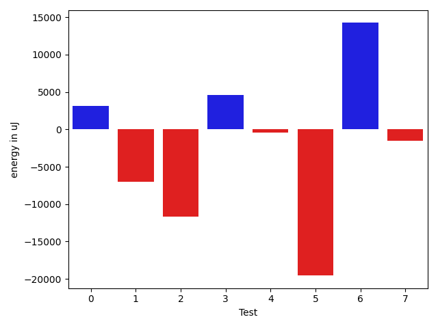

# gson b28e51

https://github.com/google/gson/commit/b28e51

## Delta Energy per test method

| ID | EnergyV1 | EnergyV2 | DeltaEnergy | σV1 | σV2 |
| --- | --- | --- | --- | --- | --- |
| 0 | 70495 | 67078 | -3417 | 32690.817931884278 | 41371.27211113853 |
| 1 | 34179 | 33936 | -243 | 28152.48084429967 | 14279.401837983656 |
| 2 | 194579 | 188903 | -5676 | 35854.8117284706 | 41013.45340093201 |
| 3 | 35705 | 36438 | 733 | 33475.373264599715 | 34684.550477004515 |
| 4 | 72449 | 69031 | -3418 | 26458.105963230133 | 33843.623498976216 |
| 5 | 36865 | 35095 | -1770 | 134044.29124087005 | 23038.226139193597 |
| 6 | 115478 | 126099 | 10621 | 75004.9495080643 | 82083.60045824847 |
| 7 | 33264 | 32715 | -549 | 11855.60764132497 | 9457.250839435317 |

## Delta Duration per test method

| ID | DurationV1 | DurationsV2 | DeltaDuration |
| --- | --- | --- | --- |
| 0 | 2602279.121212121 | 2672793.0707070706 | 70513.94949494954 |
| 1 | 1604197.755319149 | 1446993.425531915 | -157204.32978723408 |
| 2 | 6541314.181818182 | 6293180.05050505 | -248134.1313131312 |
| 3 | 1880742.0 | 2109525.6063829786 | 228783.6063829786 |
| 4 | 2658239.242424242 | 2701149.8484848486 | 42910.60606060643 |
| 5 | 2238045.914893617 | 1618811.7032967033 | -619234.2115969136 |
| 6 | 4879765.242424242 | 5442890.636363637 | 563125.3939393945 |
| 7 | 1588100.425531915 | 1649618.4888888889 | 61518.06335697393 |

## Misc.

| ID | Test Class | Test Method |
| --- | --- | --- |
| 0 | com.google.gson.functional.MapTest | testInterfaceTypeMapWithSerializer |
| 1 | com.google.gson.functional.MapTest | testGeneralMapField |
| 2 | com.google.gson.functional.MapTest | testInterfaceTypeMap |
| 3 | com.google.gson.functional.MapAsArrayTypeAdapterTest | testMultipleEnableComplexKeyRegistrationHasNoEffect |
| 4 | com.google.gson.functional.MapAsArrayTypeAdapterTest | testSerializeComplexMapWithTypeAdapter |
| 5 | com.google.gson.functional.MapAsArrayTypeAdapterTest | testMapWithTypeVariableSerialization |
| 6 | com.google.gson.ObjectTypeAdapterTest | testSerialize |
| 7 | com.google.gson.ObjectTypeAdapterTest | testSerializeObject |

| Test | IterationV1 | IterationV2 | DeltaIteration |
| --- | --- | --- | --- |
| 0 | 99 | 99 | 0 |
| 1 | 94 | 94 | 0 |
| 2 | 99 | 99 | 0 |
| 3 | 94 | 94 | 0 |
| 4 | 99 | 99 | 0 |
| 5 | 94 | 91 | -3 |
| 6 | 99 | 99 | 0 |
| 7 | 47 | 45 | -2 |

| Time Label | Time (s) |
| --- | --- |
| Selection | 27.267539501190186 |
| Injection | 10.923938274383545 |
| Total | 1092.7203855514526 |

