# gson c01fc5

https://github.com/google/gson/commit/c01fc5

## Delta Energy per test method

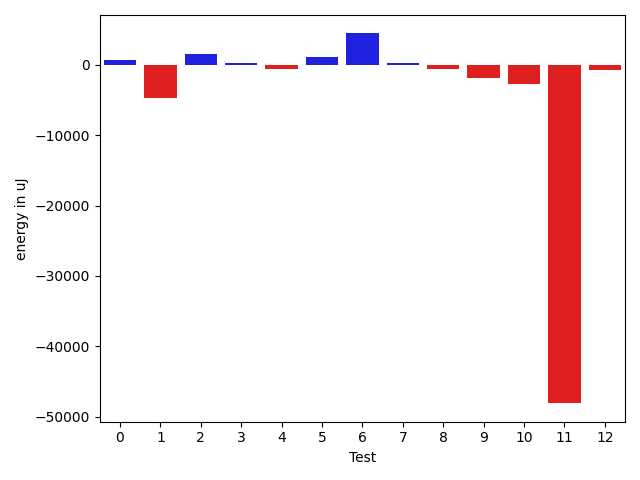

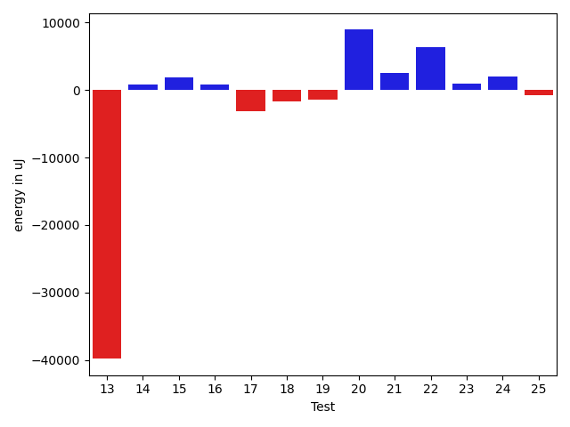

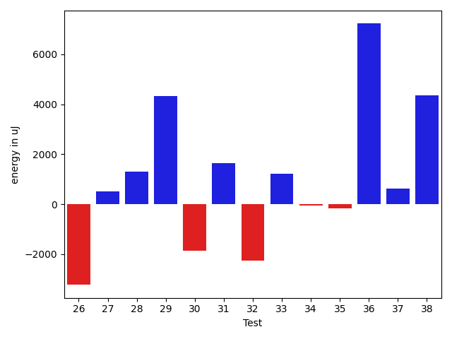

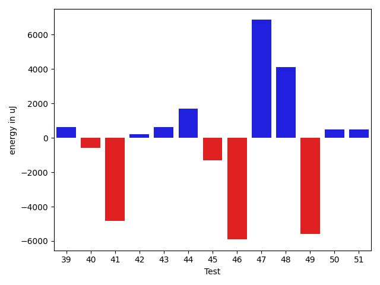

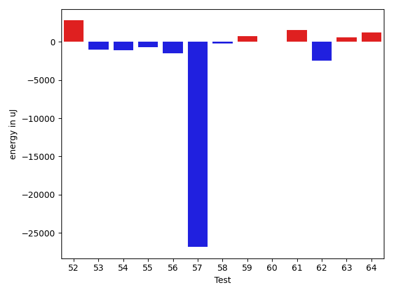

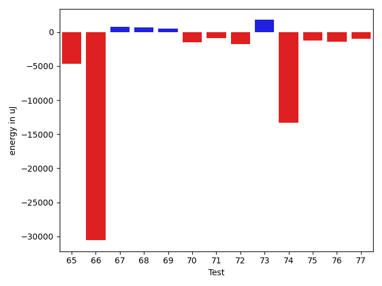

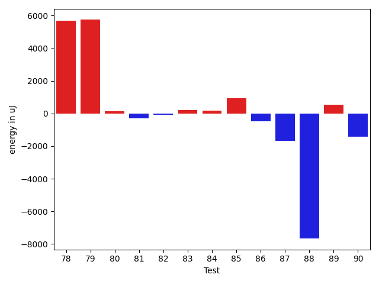

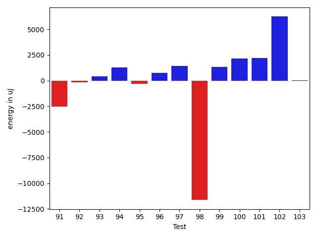

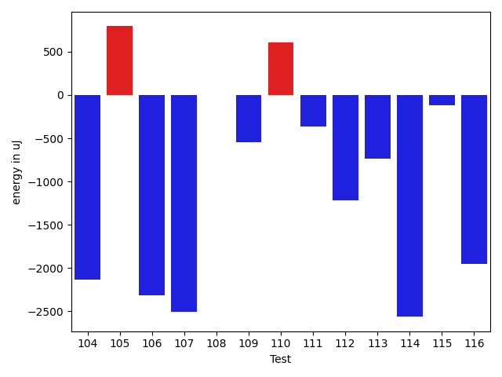

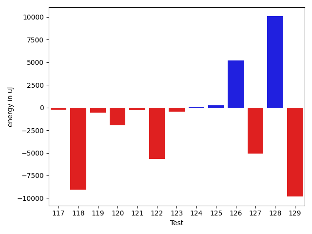

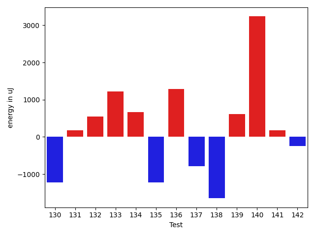

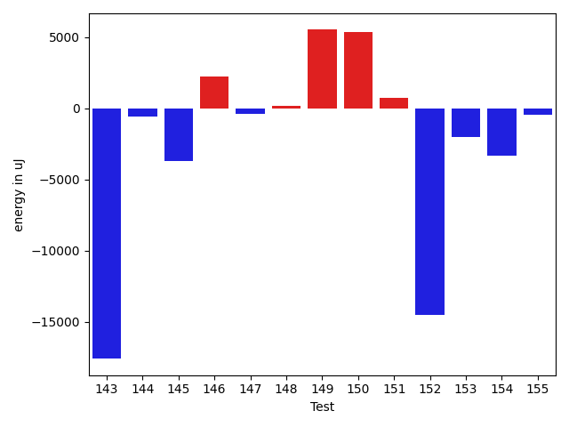

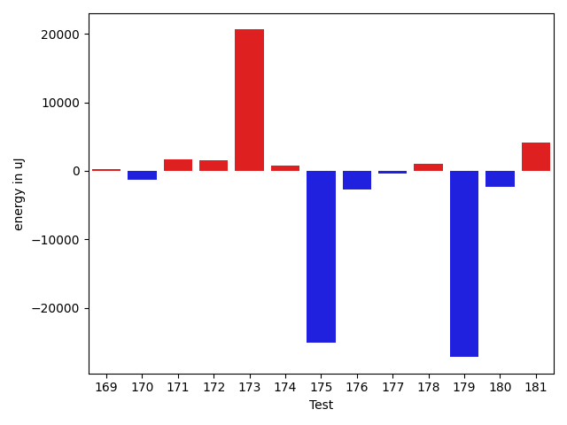

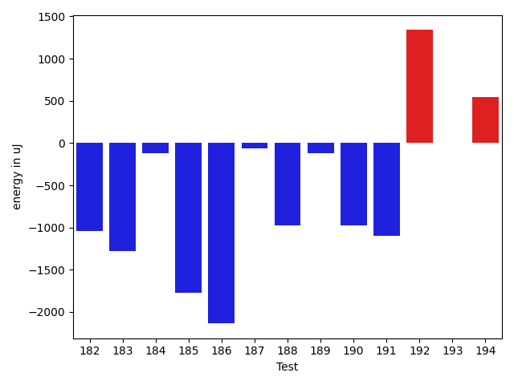

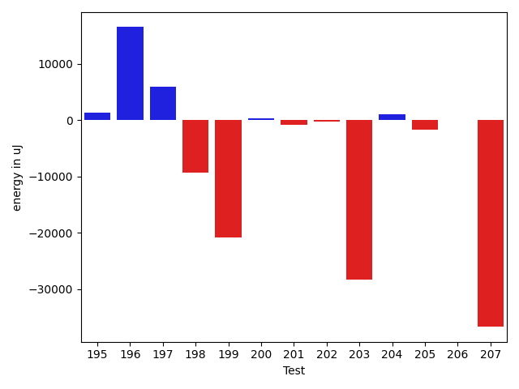

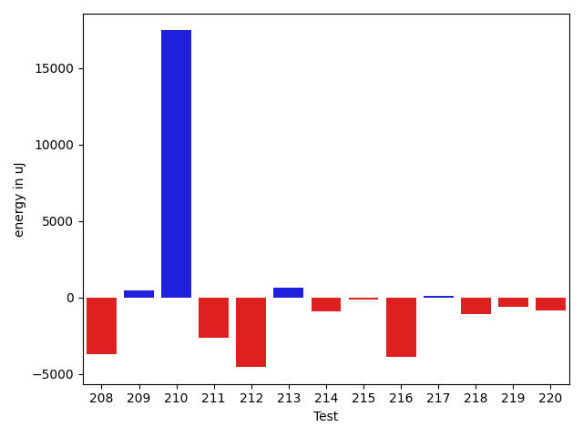

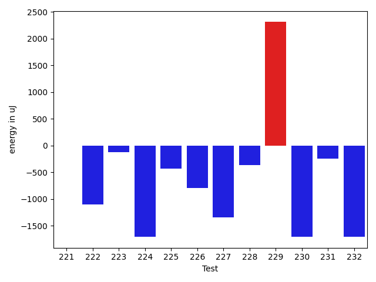

| ID | EnergyV1 | EnergyV2 | DeltaEnergy | σV1 | σV2 |
| --- | --- | --- | --- | --- | --- |
| 0 | 39428 | 39855 | 427 | 6765.260608445845 | 7797.710556379835 |
| 1 | 43823 | 40283 | -3540 | 21510.110863362996 | 19061.041208100356 |
| 2 | 38025 | 38635 | 610 | 7996.152143817982 | 10750.193245263968 |
| 3 | 39001 | 39368 | 367 | 11991.637203382961 | 11245.200811724204 |
| 4 | 37049 | 36987 | -62 | 3794.8663940858237 | 4073.9798518565763 |
| 5 | 37598 | 37659 | 61 | 4016.9662197915914 | 3017.9153933516045 |
| 6 | 38696 | 39611 | 915 | 26493.8770058637 | 40135.104410675754 |
| 7 | 37658 | 38635 | 977 | 12346.056079097083 | 10307.478323661564 |
| 8 | 37414 | 36498 | -916 | 4277.298486359439 | 4388.7494072913305 |
| 9 | 39246 | 39429 | 183 | 14366.955444188196 | 9771.934490888429 |
| 10 | 38513 | 39123 | 610 | 13276.546526773176 | 7458.846249367963 |
| 11 | 38941 | 39002 | 61 | 239690.17132556866 | 4375.686149692668 |
| 12 | 39429 | 37231 | -2198 | 4066.343795586562 | 4034.6767297764536 |
| 13 | 37109 | 38819 | 1710 | 273296.3872747635 | 188232.48538166835 |
| 14 | 38452 | 38024 | -428 | 3822.1756973644524 | 4463.848943713289 |
| 15 | 37903 | 39673 | 1770 | 4142.452982666188 | 4389.819526156197 |
| 16 | 37293 | 37659 | 366 | 4473.759704946166 | 4042.950448664582 |
| 17 | 42602 | 36377 | -6225 | 4112.625890541901 | 5346.603940301212 |
| 18 | 39734 | 35889 | -3845 | 4473.742286448287 | 5259.089018299652 |
| 19 | 38330 | 35827 | -2503 | 3930.276461818752 | 4697.070573110297 |
| 20 | 41565 | 39307 | -2258 | 69856.55266167407 | 89426.02241202863 |
| 21 | 39489 | 39428 | -61 | 10561.746947909822 | 13461.899020267487 |
| 22 | 39001 | 40222 | 1221 | 22130.522540050682 | 39099.70069275868 |
| 23 | 37536 | 38146 | 610 | 4456.244853511131 | 4261.654908045535 |
| 24 | 35156 | 37537 | 2381 | 4336.358648860162 | 6379.288289860833 |
| 25 | 36621 | 35584 | -1037 | 4563.530015903166 | 3324.903466929528 |
| 26 | 73852 | 69214 | -4638 | 74774.45224152989 | 63120.68388486909 |
| 27 | 61585 | 63415 | 1830 | 29176.690912322538 | 27927.976296837747 |
| 28 | 36804 | 38697 | 1893 | 14128.76536121335 | 14448.68756815025 |
| 29 | 38758 | 38574 | -184 | 9520.357696450857 | 21708.32747952594 |
| 30 | 69946 | 71044 | 1098 | 35564.18916427528 | 35165.87215059325 |
| 31 | 36133 | 37476 | 1343 | 7060.475915717548 | 9240.887445803628 |
| 32 | 35217 | 36438 | 1221 | 22962.210659566106 | 5868.692534661594 |
| 33 | 35583 | 38330 | 2747 | 4380.1641852264875 | 4399.969843226402 |
| 34 | 36866 | 36865 | -1 | 6001.93828874404 | 4758.957587999183 |
| 35 | 36255 | 36865 | 610 | 7023.188289994339 | 5727.2296786084235 |
| 36 | 37414 | 37903 | 489 | 31682.392941963848 | 44968.22743627508 |
| 37 | 36071 | 36072 | 1 | 6522.7218237285915 | 8239.037915320434 |
| 38 | 35339 | 36560 | 1221 | 4591.1681079285345 | 18498.721278353674 |
| 39 | 36132 | 36194 | 62 | 4687.320622017077 | 4367.033422098144 |
| 40 | 35766 | 35583 | -183 | 4016.360830526517 | 3567.346284019399 |
| 41 | 38818 | 35645 | -3173 | 12930.43549893424 | 7623.030253962949 |
| 42 | 36132 | 34790 | -1342 | 5076.978052047835 | 7333.68015505702 |
| 43 | 36560 | 36926 | 366 | 5072.199705438642 | 3924.7911669389023 |
| 44 | 41016 | 44128 | 3112 | 23833.84982395811 | 21256.830692860465 |
| 45 | 34729 | 35584 | 855 | 5415.447695389235 | 5123.351989603584 |
| 46 | 204162 | 208130 | 3968 | 104160.15530433485 | 75807.50170322487 |
| 47 | 117431 | 119812 | 2381 | 45045.52966561081 | 41453.81972902272 |
| 48 | 109863 | 111816 | 1953 | 35667.63116512127 | 39898.85714200136 |
| 49 | 41138 | 40772 | -366 | 23114.20078063483 | 15052.767560891072 |
| 50 | 41138 | 41443 | 305 | 3497.609990276451 | 3211.1616087526263 |
| 51 | 37903 | 38513 | 610 | 4373.956512861097 | 6357.158600524468 |
| 52 | 36438 | 39246 | 2808 | 29856.762424583183 | 29509.897838225002 |
| 53 | 41748 | 40710 | -1038 | 82420.67735227376 | 92861.07340160124 |
| 54 | 42847 | 41748 | -1099 | 21994.771996153097 | 20251.53130111528 |
| 55 | 38635 | 37963 | -672 | 19994.207006240566 | 15378.213132405583 |
| 56 | 39245 | 37781 | -1464 | 8702.925892156709 | 6898.4589078148165 |
| 57 | 70495 | 43640 | -26855 | 71736.93290156087 | 49854.114991316324 |
| 58 | 36988 | 36804 | -184 | 4153.629486823024 | 3615.315455536902 |
| 59 | 38758 | 39550 | 792 | 35413.711023455966 | 15941.946313447215 |
| 60 | 37109 | 37110 | 1 | 4216.094676057356 | 4425.042580694918 |
| 61 | 35828 | 37354 | 1526 | 5994.15372114917 | 8538.663256053276 |
| 62 | 36682 | 34241 | -2441 | 3891.6363832963525 | 5685.173930592955 |
| 63 | 36743 | 37353 | 610 | 39789.12616008601 | 4592.663202298033 |
| 64 | 33814 | 35034 | 1220 | 3811.135600315979 | 15253.8639332247 |
| 65 | 37353 | 36682 | -671 | 20577.300003319477 | 4225.404722123544 |
| 66 | 415893 | 415160 | -733 | 215934.08774019004 | 230208.3537086087 |
| 67 | 35706 | 36682 | 976 | 3518.959176731097 | 3733.798849945167 |
| 68 | 34546 | 37170 | 2624 | 4018.9717392972348 | 3592.5588039724553 |
| 69 | 36377 | 37048 | 671 | 6084.452575760918 | 3988.170005810154 |
| 70 | 36560 | 37109 | 549 | 12457.911928575595 | 8224.59023868711 |
| 71 | 36865 | 35278 | -1587 | 9050.528308426294 | 9908.486404213572 |
| 72 | 37170 | 36682 | -488 | 13349.772999425617 | 10414.361250811147 |
| 73 | 40100 | 40771 | 671 | 32851.76282939443 | 29884.50408760476 |
| 74 | 37170 | 37476 | 306 | 68866.98405965457 | 28444.358838770204 |
| 75 | 36682 | 34607 | -2075 | 3932.829611954561 | 3944.261376033431 |
| 76 | 36072 | 34973 | -1099 | 4726.4568329675685 | 3677.6135470858544 |
| 77 | 36499 | 36377 | -122 | 4402.301818583445 | 2495.33468276183 |
| 78 | 35461 | 36865 | 1404 | 4135.771637278138 | 26226.93235966418 |
| 79 | 37292 | 34668 | -2624 | 4142.240606700878 | 44231.207179177734 |
| 80 | 34729 | 35889 | 1160 | 3526.85651281758 | 3378.325607457043 |
| 81 | 37475 | 36377 | -1098 | 4475.058892332452 | 4076.2593685878223 |
| 82 | 36682 | 35827 | -855 | 7732.148501735632 | 10013.252522997684 |
| 83 | 37415 | 36316 | -1099 | 3471.990910577978 | 4018.0581479117495 |
| 84 | 36865 | 36865 | 0 | 7071.164740632613 | 7786.595117860722 |
| 85 | 37109 | 36743 | -366 | 3581.0836648855966 | 5236.645772898296 |
| 86 | 37475 | 36560 | -915 | 3847.1969776753067 | 3674.1737262613356 |
| 87 | 36621 | 34363 | -2258 | 5142.492439469405 | 3169.88584231485 |
| 88 | 37475 | 36255 | -1220 | 28589.236182448894 | 2620.9215750082544 |
| 89 | 36987 | 37048 | 61 | 3738.60206862335 | 3390.766219537342 |
| 90 | 36926 | 35828 | -1098 | 5873.260317778956 | 3925.2457717472976 |
| 91 | 35156 | 37109 | 1953 | 24175.887548787665 | 3612.3099847058434 |
| 92 | 36315 | 35950 | -365 | 4077.4442535197627 | 3585.8128273312122 |
| 93 | 36316 | 37842 | 1526 | 4570.212227543044 | 4266.466675753697 |
| 94 | 35461 | 36316 | 855 | 3287.224179647052 | 4541.420130311662 |
| 95 | 33996 | 35644 | 1648 | 8127.158344858104 | 2976.144327070775 |
| 96 | 32410 | 34363 | 1953 | 3707.023160818361 | 2533.2316611176498 |
| 97 | 36133 | 37110 | 977 | 3830.036194345949 | 3739.7718804911406 |
| 98 | 118897 | 116882 | -2015 | 97110.69137950584 | 71986.92693639257 |
| 99 | 35767 | 37475 | 1708 | 5551.350021197659 | 4163.792858858412 |
| 100 | 35523 | 36194 | 671 | 4078.809765365482 | 3680.752098416844 |
| 101 | 37110 | 37170 | 60 | 4001.031790382866 | 6851.693865005219 |
| 102 | 36254 | 37415 | 1161 | 11993.820851313681 | 22502.319056452103 |
| 103 | 38146 | 40161 | 2015 | 12306.102560478885 | 5121.961810673719 |
| 104 | 39611 | 37476 | -2135 | 22201.189101801523 | 14352.695516020767 |
| 105 | 38024 | 38818 | 794 | 13646.6204486347 | 14389.04286635708 |
| 106 | 79651 | 77331 | -2320 | 51271.729453022825 | 51658.599023074166 |
| 107 | 40466 | 37964 | -2502 | 20586.755550035636 | 19823.176828238204 |
| 108 | 36682 | 36682 | 0 | 9078.05173962694 | 11768.34909654453 |
| 109 | 40161 | 39612 | -549 | 28959.781653141898 | 30985.35773936585 |
| 110 | 37780 | 38391 | 611 | 5566.494804272946 | 9216.469169678594 |
| 111 | 37963 | 37597 | -366 | 9055.56306259433 | 7338.092327028871 |
| 112 | 43091 | 41870 | -1221 | 78754.55369096396 | 91279.37886362795 |
| 113 | 39063 | 38330 | -733 | 10518.13092400184 | 12449.74755740274 |
| 114 | 37475 | 34912 | -2563 | 4267.618117123414 | 2795.209269128711 |
| 115 | 36560 | 36438 | -122 | 3060.0835440227593 | 3551.904839716289 |
| 116 | 37781 | 35827 | -1954 | 5246.177764672671 | 2977.2375172926663 |
| 117 | 36865 | 35522 | -1343 | 4705.946039295787 | 3909.564980939956 |
| 118 | 37414 | 37597 | 183 | 40371.295566345354 | 3086.975372531709 |
| 119 | 38513 | 38269 | -244 | 4291.16992243496 | 4679.105755415249 |
| 120 | 38941 | 38086 | -855 | 7150.767279170192 | 4121.3910335176915 |
| 121 | 37476 | 36377 | -1099 | 4384.262368430459 | 4286.69713149213 |
| 122 | 40894 | 39612 | -1282 | 22060.997375291085 | 17170.26651190697 |
| 123 | 37353 | 36987 | -366 | 4020.0393105256753 | 3935.4832510710658 |
| 124 | 36987 | 37476 | 489 | 4072.1640404869913 | 4522.818371864862 |
| 125 | 37048 | 37781 | 733 | 4259.132876255447 | 5090.131611120239 |
| 126 | 39063 | 38086 | -977 | 4501.160955804564 | 27615.40851046748 |
| 127 | 41076 | 39001 | -2075 | 40906.226193534894 | 39401.463765348504 |
| 128 | 40039 | 39368 | -671 | 256363.04080032726 | 263446.68825680116 |
| 129 | 39429 | 38147 | -1282 | 244630.56718634945 | 214772.42242564878 |
| 130 | 39001 | 37781 | -1220 | 4576.960996115319 | 4805.79029270941 |
| 131 | 40527 | 40711 | 184 | 51176.89253392307 | 49862.82927690047 |
| 132 | 39246 | 39795 | 549 | 19628.06759761062 | 30125.647500738094 |
| 133 | 37170 | 38391 | 1221 | 3697.705964336917 | 5835.086888628608 |
| 134 | 37781 | 38453 | 672 | 11977.876073690462 | 33289.51492576199 |
| 135 | 40100 | 38879 | -1221 | 7671.449140701342 | 9394.613062609542 |
| 136 | 39672 | 40954 | 1282 | 14033.117284993203 | 32441.391375987132 |
| 137 | 38757 | 37964 | -793 | 8301.77436455605 | 13705.2788765254 |
| 138 | 40588 | 38940 | -1648 | 20203.258763992562 | 39780.39882576465 |
| 139 | 36805 | 37414 | 609 | 4699.555587024713 | 4259.412530132747 |
| 140 | 75683 | 78918 | 3235 | 18466.652027213113 | 22350.87944179036 |
| 141 | 39490 | 39672 | 182 | 17541.727283804612 | 10453.813257278684 |
| 142 | 36682 | 36438 | -244 | 4625.566027854721 | 4430.845514538216 |
| 143 | 155639 | 153381 | -2258 | 279572.4938400725 | 212283.95027703806 |
| 144 | 38086 | 38330 | 244 | 6568.435812307841 | 3711.267373190204 |
| 145 | 40528 | 40100 | -428 | 29767.561664757497 | 20554.317862644122 |
| 146 | 35156 | 37048 | 1892 | 3120.39155127487 | 4063.9873354210663 |
| 147 | 37293 | 36743 | -550 | 4368.833824791522 | 4041.4681682603573 |
| 148 | 36804 | 36804 | 0 | 4262.777929650429 | 4224.992865718462 |
| 149 | 38757 | 41687 | 2930 | 40228.335955895665 | 37753.35538684631 |
| 150 | 36133 | 39123 | 2990 | 3372.4359550380395 | 13538.339680367768 |
| 151 | 37781 | 36804 | -977 | 4345.37897785716 | 7982.957007587196 |
| 152 | 83252 | 78246 | -5006 | 202636.17106698576 | 161270.2522389848 |
| 153 | 39490 | 38025 | -1465 | 7736.51621839572 | 7077.432811584648 |
| 154 | 38880 | 36499 | -2381 | 9650.87688772062 | 7074.539727575933 |
| 155 | 37353 | 38818 | 1465 | 9800.161292733912 | 4306.545405309906 |
| 156 | 37414 | 39246 | 1832 | 27715.451034410682 | 30223.857503808456 |
| 157 | 84289 | 84228 | -61 | 232189.00604992342 | 235773.62448394677 |
| 158 | 43640 | 41016 | -2624 | 201645.9112762746 | 178803.28780562518 |
| 159 | 37353 | 36987 | -366 | 25436.246442822496 | 3865.315506141529 |
| 160 | 37720 | 38575 | 855 | 3817.2523085984244 | 3584.7383297609244 |
| 161 | 36377 | 37231 | 854 | 3789.5344561160045 | 6102.525727371233 |
| 162 | 36194 | 37292 | 1098 | 4276.369770775207 | 3299.6217113797484 |
| 163 | 40222 | 38391 | -1831 | 35404.30974157258 | 19047.521468668172 |
| 164 | 37536 | 37049 | -487 | 4158.722345357867 | 4174.025075583186 |
| 165 | 38819 | 37903 | -916 | 4806.585593976479 | 4634.588441156732 |
| 166 | 37841 | 38879 | 1038 | 40975.6823638751 | 14867.51511987944 |
| 167 | 37476 | 37293 | -183 | 5422.382706207908 | 3614.9369161791765 |
| 168 | 37170 | 35949 | -1221 | 3189.760183871547 | 3437.163324233462 |
| 169 | 36560 | 38208 | 1648 | 3744.5897411599044 | 2852.9257481159652 |
| 170 | 38086 | 36987 | -1099 | 4390.910230572841 | 3787.8806254121996 |
| 171 | 36133 | 37537 | 1404 | 3885.1574292092528 | 2774.7201132001082 |
| 172 | 38269 | 37231 | -1038 | 5395.811772801198 | 10908.001898346049 |
| 173 | 40100 | 42114 | 2014 | 23349.596588282606 | 44324.36214320931 |
| 174 | 38147 | 39673 | 1526 | 3483.058885520025 | 4162.650707773901 |
| 175 | 46142 | 41748 | -4394 | 215489.82036755327 | 144493.6868824051 |
| 176 | 39551 | 38696 | -855 | 11929.597036790048 | 7199.925394143183 |
| 177 | 38574 | 38025 | -549 | 4983.474186902514 | 3188.352452804706 |
| 178 | 39185 | 39734 | 549 | 39418.49532489169 | 42115.95618473814 |
| 179 | 219665 | 193481 | -26184 | 73263.99139066739 | 69334.55024754531 |
| 180 | 342224 | 342529 | 305 | 141836.91725364933 | 153767.6535723439 |
| 181 | 38879 | 40283 | 1404 | 17377.031471016267 | 24486.89991360397 |
| 182 | 40894 | 39855 | -1039 | 33464.48945455905 | 17077.102224844977 |
| 183 | 38086 | 36804 | -1282 | 22746.40159737702 | 8856.156282681075 |
| 184 | 38513 | 38391 | -122 | 13082.131822892625 | 10263.38649873606 |
| 185 | 40955 | 39184 | -1771 | 61785.07637471118 | 34396.836100840046 |
| 186 | 38208 | 36071 | -2137 | 4130.233376321898 | 4425.37697875352 |
| 187 | 37841 | 37781 | -60 | 3843.4375953881804 | 3805.599355737566 |
| 188 | 37415 | 36438 | -977 | 4221.063315265292 | 4538.901656448791 |
| 189 | 38269 | 38147 | -122 | 6345.690467251994 | 4604.295220099293 |
| 190 | 40467 | 39490 | -977 | 76736.02769311478 | 92247.85435351088 |
| 191 | 39673 | 38574 | -1099 | 4181.539762717805 | 6260.8237402650675 |
| 192 | 37719 | 39062 | 1343 | 15139.770054797076 | 23402.577289979337 |
| 193 | 41076 | 41076 | 0 | 33088.60322941223 | 349758.874942987 |
| 194 | 37842 | 38391 | 549 | 4160.483827482721 | 3637.8896254077445 |
| 195 | 38086 | 39062 | 976 | 5770.282000125245 | 6430.520858704466 |
| 196 | 39002 | 41504 | 2502 | 19958.02484160275 | 49384.857432790624 |
| 197 | 38147 | 36255 | -1892 | 4333.831182651578 | 36626.735393559764 |
| 198 | 40283 | 38269 | -2014 | 41619.80003396152 | 27186.849911985442 |
| 199 | 41748 | 39672 | -2076 | 70528.59552264403 | 10861.781002948463 |
| 200 | 37537 | 37781 | 244 | 5036.18935307242 | 3583.8729519999474 |
| 201 | 37781 | 37964 | 183 | 4698.410868725512 | 3485.2785837308643 |
| 202 | 37475 | 37110 | -365 | 4557.2528652218625 | 3922.692297263767 |
| 203 | 42602 | 42664 | 62 | 307853.49553029845 | 224291.4720052801 |
| 204 | 36194 | 38025 | 1831 | 4144.6877267270465 | 4944.462970104702 |
| 205 | 40710 | 38330 | -2380 | 4171.446272745221 | 4020.109303429875 |
| 206 | 36621 | 36438 | -183 | 4211.593505414346 | 3371.8079231118886 |
| 207 | 104370 | 93506 | -10864 | 322619.88349819847 | 235334.3656903625 |
| 208 | 39184 | 38330 | -854 | 37189.087208702425 | 29465.320033928783 |
| 209 | 39673 | 39246 | -427 | 38235.65531614732 | 45608.64838716122 |
| 210 | 39246 | 39794 | 548 | 18142.41067113351 | 72229.81389970431 |
| 211 | 39428 | 37231 | -2197 | 9596.519528380784 | 6764.927008556245 |
| 212 | 38940 | 37048 | -1892 | 25326.223278023615 | 10634.755131769904 |
| 213 | 39306 | 39062 | -244 | 10351.403434317122 | 11630.669995977547 |
| 214 | 43213 | 39917 | -3296 | 50587.11367552841 | 53715.63969286925 |
| 215 | 39184 | 38086 | -1098 | 4057.5473054300273 | 3813.4003898822 |
| 216 | 40955 | 40589 | -366 | 58598.059876347885 | 38041.64013472535 |
| 217 | 37537 | 38269 | 732 | 4564.181121386785 | 3841.7776083995286 |
| 218 | 41382 | 40527 | -855 | 39594.708013660966 | 36357.1378023093 |
| 219 | 37537 | 37414 | -123 | 6429.895476596082 | 3804.2545283594277 |
| 220 | 37231 | 36987 | -244 | 6672.1113586455795 | 4100.4500703210015 |
| 221 | 38697 | 38696 | -1 | 15070.405386597564 | 16130.557484579133 |
| 222 | 39185 | 38086 | -1099 | 14448.93941973549 | 10503.951697429246 |
| 223 | 37231 | 37109 | -122 | 3623.638390280963 | 4341.774470466734 |
| 224 | 41138 | 39429 | -1709 | 85436.47012112853 | 61821.07917541683 |
| 225 | 38330 | 37903 | -427 | 4890.77992379291 | 4571.714058405029 |
| 226 | 37598 | 36804 | -794 | 4814.811370883607 | 4978.341346958554 |
| 227 | 37781 | 36438 | -1343 | 4865.513673032801 | 5098.009610330704 |
| 228 | 40894 | 40527 | -367 | 50533.56909734745 | 408212.39816183894 |
| 229 | 38879 | 41199 | 2320 | 11339.198732174822 | 24357.427982699613 |
| 230 | 39917 | 38208 | -1709 | 5049.589192581989 | 4546.082685689292 |
| 231 | 38391 | 38147 | -244 | 4967.824300720415 | 4779.255249016709 |
| 232 | 39734 | 38025 | -1709 | 206365.31933228066 | 285535.4330616253 |

## Delta Duration per test method

| ID | DurationV1 | DurationsV2 | DeltaDuration |
| --- | --- | --- | --- |
| 0 | 875153.7826086957 | 896197.3478260869 | 21043.56521739124 |
| 1 | 1048427.6666666666 | 891116.7037037037 | -157310.96296296292 |
| 2 | 1180912.9302325582 | 1235473.4 | 54560.46976744174 |
| 3 | 1175551.12345679 | 1282727.6103896103 | 107176.48693282017 |
| 4 | 552780.6764705882 | 597040.5277777778 | 44259.85130718956 |
| 5 | 637904.0384615385 | 636961.2857142857 | -942.7527472528163 |
| 6 | 1458184.670212766 | 1498742.8 | 40558.129787234124 |
| 7 | 1013993.1346153846 | 917321.775510204 | -96671.3591051806 |
| 8 | 656275.7631578947 | 665473.3 | 9197.536842105328 |
| 9 | 1158134.4533333334 | 994382.6818181818 | -163751.7715151516 |
| 10 | 1161082.3902439023 | 1071773.2105263157 | -89309.17971758661 |
| 11 | 2074313.5588235294 | 636274.5357142857 | -1438039.0231092437 |
| 12 | 552462.6923076923 | 524956.2173913043 | -27506.47491638793 |
| 13 | 2802427.4375 | 1628311.4285714286 | -1174116.0089285714 |
| 14 | 457650.9375 | 486851.28571428574 | 29200.34821428574 |
| 15 | 581796.88 | 509193.625 | -72603.255 |
| 16 | 486739.2 | 787308.7142857143 | 300569.5142857143 |
| 17 | 612894.1333333333 | 655340.0 | 42445.8666666667 |
| 18 | 562126.7 | 549685.4 | -12441.29999999993 |
| 19 | 742487.0357142857 | 745784.0909090909 | 3297.05519480526 |
| 20 | 1533448.9285714286 | 2348596.7073170734 | 815147.7787456447 |
| 21 | 991598.2173913043 | 1124721.0961538462 | 133122.87876254192 |
| 22 | 1032089.7777777778 | 1281807.6923076923 | 249717.9145299145 |
| 23 | 697830.2222222222 | 648530.6590909091 | -49299.56313131319 |
| 24 | 1057152.8421052631 | 1036864.28 | -20288.562105263118 |
| 25 | 714109.8260869565 | 724866.2 | 10756.373913043411 |
| 26 | 2669303.7395833335 | 2552716.282608696 | -116587.4569746377 |
| 27 | 2161647.8585858587 | 2077543.6666666667 | -84104.19191919197 |
| 28 | 1295948.3777777778 | 1280124.1704545454 | -15824.207323232433 |
| 29 | 1126532.2027027027 | 1213668.7123287672 | 87136.50962606445 |
| 30 | 2295677.5454545454 | 2160914.3229166665 | -134763.2225378789 |
| 31 | 1079843.2068965517 | 1107864.355263158 | 28021.14836660633 |
| 32 | 1047614.3188405797 | 911239.7058823529 | -136374.61295822682 |
| 33 | 593070.5 | 601175.1153846154 | 8104.615384615376 |
| 34 | 1091580.3414634147 | 1082688.325 | -8892.016463414766 |
| 35 | 1111642.5903614457 | 1118836.5064935065 | 7193.916132060811 |
| 36 | 1373830.268292683 | 1507617.028169014 | 133786.75987633108 |
| 37 | 1061012.8607594937 | 1062422.1351351351 | 1409.2743756414857 |
| 38 | 804101.5789473684 | 930556.1818181818 | 126454.60287081334 |
| 39 | 544828.7837837838 | 573783.4583333334 | 28954.674549549585 |
| 40 | 552370.9629629629 | 542126.448275862 | -10244.514687100891 |
| 41 | 1287046.9666666666 | 1235786.1666666667 | -51260.799999999814 |
| 42 | 939264.7735849057 | 1021985.4782608695 | 82720.70467596385 |
| 43 | 598629.5925925926 | 555231.1071428572 | -43398.485449735424 |
| 44 | 1469759.6470588236 | 1589893.5689655172 | 120133.9219066936 |
| 45 | 424596.5238095238 | 485025.5625 | 60429.03869047621 |
| 46 | 6525629.515151516 | 6095259.838383839 | -430369.67676767707 |
| 47 | 3521797.202020202 | 3634588.585858586 | 112791.38383838395 |
| 48 | 3162092.767676768 | 3208197.787878788 | 46105.02020202018 |
| 49 | 875510.95 | 674802.1764705882 | -200708.77352941176 |
| 50 | 646275.5714285715 | 592541.7586206896 | -53733.812807881855 |
| 51 | 913738.78 | 909816.1041666666 | -3922.6758333334 |
| 52 | 1144935.4137931035 | 1193582.4516129033 | 48647.037819799734 |
| 53 | 1744020.5294117648 | 1999545.1470588236 | 255524.6176470588 |
| 54 | 1610539.5520833333 | 1545424.9456521738 | -65114.606431159424 |
| 55 | 1331757.8831168832 | 1215007.011904762 | -116750.87121212133 |
| 56 | 1005095.716981132 | 872738.6612903225 | -132357.0556908095 |
| 57 | 2568278.9191919193 | 2125373.6464646463 | -442905.27272727294 |
| 58 | 542978.2972972973 | 560018.1724137932 | 17039.87511649588 |
| 59 | 1420015.1014492754 | 1201225.75 | -218789.3514492754 |
| 60 | 857855.3620689656 | 844314.948275862 | -13540.413793103537 |
| 61 | 1110780.869047619 | 1100473.7901234569 | -10307.07892416208 |
| 62 | 670984.2142857143 | 668488.84375 | -2495.370535714319 |
| 63 | 1281291.6582278481 | 980470.9629629629 | -300820.6952648852 |
| 64 | 539372.0967741936 | 616707.1 | 77335.0032258064 |
| 65 | 629100.5185185185 | 502890.82352941175 | -126209.69498910679 |
| 66 | 9610585.097826088 | 8446671.95505618 | -1163913.1427699085 |
| 67 | 567233.75 | 613977.6296296297 | 46743.879629629664 |
| 68 | 497345.14285714284 | 443616.85 | -53728.292857142864 |
| 69 | 624034.0357142857 | 579251.551724138 | -44782.48399014771 |
| 70 | 963020.2352941176 | 753125.7592592592 | -209894.47603485838 |
| 71 | 662501.5217391305 | 672504.3461538461 | 10002.824414715637 |
| 72 | 902110.5306122449 | 790511.4545454546 | -111599.07606679027 |
| 73 | 1711887.252631579 | 1647107.65625 | -64779.59638157906 |
| 74 | 1470772.0256410257 | 881931.3928571428 | -588840.6327838829 |
| 75 | 566844.8333333334 | 553801.074074074 | -13043.759259259328 |
| 76 | 612431.947368421 | 670102.9230769231 | 57670.97570850211 |
| 77 | 585097.9411764706 | 568245.2692307692 | -16852.671945701353 |
| 78 | 581185.1785714285 | 767568.0 | 186382.82142857148 |
| 79 | 672464.1590909091 | 926802.25 | 254338.09090909094 |
| 80 | 574369.8695652174 | 523530.2 | -50839.669565217395 |
| 81 | 570461.71875 | 556295.875 | -14165.84375 |
| 82 | 898783.9454545454 | 825748.0434782609 | -73035.90197628457 |
| 83 | 504594.3076923077 | 499026.36 | -5567.947692307702 |
| 84 | 921016.0701754387 | 967432.7407407408 | 46416.670565302134 |
| 85 | 817082.4897959183 | 795282.4230769231 | -21800.066718995222 |
| 86 | 479800.14285714284 | 443764.6206896552 | -36035.52216748765 |
| 87 | 521251.6 | 508236.4347826087 | -13015.165217391273 |
| 88 | 704949.8421052631 | 486047.5625 | -218902.27960526315 |
| 89 | 451916.8076923077 | 436104.6666666667 | -15812.141025641002 |
| 90 | 718100.804347826 | 706350.195652174 | -11750.608695652103 |
| 91 | 736469.5588235294 | 571718.5294117647 | -164751.0294117647 |
| 92 | 756278.6382978724 | 720238.2857142857 | -36040.352583586704 |
| 93 | 572342.5277777778 | 568820.303030303 | -3522.224747474771 |
| 94 | 573316.4761904762 | 479615.32 | -93701.1561904762 |
| 95 | 554220.9545454546 | 474888.5833333333 | -79332.37121212127 |
| 96 | 479987.0625 | 455109.06666666665 | -24877.99583333335 |
| 97 | 505220.6111111111 | 498914.5714285714 | -6306.039682539704 |
| 98 | 4259555.5 | 3760002.336734694 | -499553.16326530604 |
| 99 | 858214.3090909091 | 806892.2978723404 | -51322.01121856866 |
| 100 | 488467.85714285716 | 472585.45 | -15882.407142857148 |
| 101 | 720051.0444444445 | 854726.5609756098 | 134675.51653116534 |
| 102 | 646572.2424242424 | 779757.1071428572 | 133184.86471861473 |
| 103 | 793975.5 | 842563.05 | 48587.55000000005 |
| 104 | 955885.1388888889 | 708662.5945945946 | -247222.54429429432 |
| 105 | 765083.3870967742 | 647014.1764705882 | -118069.21062618599 |
| 106 | 2838419.8181818184 | 2802233.4183673467 | -36186.3998144716 |
| 107 | 1133316.5192307692 | 1043953.76 | -89362.75923076924 |
| 108 | 1054219.9375 | 1105216.2222222222 | 50996.28472222225 |
| 109 | 1482864.8666666667 | 1549214.4069767443 | 66349.5403100776 |
| 110 | 873990.9803921569 | 952513.2765957447 | 78522.29620358779 |
| 111 | 960336.8431372549 | 1012458.1296296297 | 52121.286492374726 |
| 112 | 2134546.489361702 | 2524578.4324324327 | 390031.94307073066 |
| 113 | 1064689.9512195121 | 1102304.7708333333 | 37614.819613821106 |
| 114 | 491080.32 | 468733.82608695654 | -22346.493913043465 |
| 115 | 471513.63157894736 | 540709.6 | 69195.96842105262 |
| 116 | 451488.14814814815 | 455050.0 | 3561.851851851854 |
| 117 | 472147.95652173914 | 471225.81481481483 | -922.1417069243034 |
| 118 | 744079.619047619 | 500077.22222222225 | -244002.3968253968 |
| 119 | 606096.6206896552 | 557785.2368421053 | -48311.38384754991 |
| 120 | 755413.5957446808 | 680688.0 | -74725.59574468085 |
| 121 | 575607.4736842106 | 553046.5428571429 | -22560.9308270677 |
| 122 | 1525414.46875 | 1366082.6288659794 | -159331.83988402062 |
| 123 | 606108.7105263158 | 572633.1025641026 | -33475.607962213224 |
| 124 | 870624.9756097561 | 806831.8372093023 | -63793.138400453725 |
| 125 | 535749.92 | 445086.0869565217 | -90663.83304347831 |
| 126 | 610928.6551724138 | 717101.6 | 106172.94482758618 |
| 127 | 1315893.6756756757 | 1003963.8205128205 | -311929.85516285524 |
| 128 | 2590605.606060606 | 2788857.0 | 198251.39393939404 |
| 129 | 2465490.376470588 | 2241624.5588235296 | -223865.81764705852 |
| 130 | 668798.4375 | 620903.375 | -47895.0625 |
| 131 | 1809414.359375 | 1915086.5352112676 | 105672.17583626765 |
| 132 | 1401216.8817204302 | 1586564.989010989 | 185348.10729055875 |
| 133 | 896861.6862745098 | 858467.350877193 | -38394.335397316725 |
| 134 | 1078918.25 | 1305026.7627118644 | 226108.51271186443 |
| 135 | 915907.9387755102 | 1040348.1346153846 | 124440.19583987445 |
| 136 | 608703.5625 | 1187588.7368421052 | 578885.1743421052 |
| 137 | 578180.12 | 671882.6666666666 | 93702.54666666663 |
| 138 | 1109496.5925925926 | 1165063.1475409835 | 55566.55494839093 |
| 139 | 768328.224489796 | 842004.4074074074 | 73676.18291761144 |
| 140 | 2280311.303030303 | 2420910.3333333335 | 140599.03030303027 |
| 141 | 978864.525 | 902748.8125 | -76115.71250000002 |
| 142 | 641350.4838709678 | 627660.2432432432 | -13690.24062772456 |
| 143 | 5993873.777777778 | 5552024.252525252 | -441849.5252525257 |
| 144 | 771848.5714285715 | 730500.9642857143 | -41347.60714285716 |
| 145 | 929173.3548387097 | 825155.6388888889 | -104017.71594982082 |
| 146 | 843188.8205128205 | 665130.7804878049 | -178058.0400250156 |
| 147 | 774623.023255814 | 806014.911111111 | 31391.88785529707 |
| 148 | 916208.8269230769 | 860813.9818181818 | -55394.84510489507 |
| 149 | 1153279.1538461538 | 1311372.0689655172 | 158092.91511936346 |
| 150 | 685324.125 | 747365.75 | 62041.625 |
| 151 | 977191.8484848485 | 927937.0149253731 | -49254.83355947537 |
| 152 | 3247230.01010101 | 2961469.474747475 | -285760.5353535353 |
| 153 | 1065627.9125 | 1011180.7611940298 | -54447.15130597027 |
| 154 | 1053913.380952381 | 1038388.4411764706 | -15524.939775910461 |
| 155 | 832098.38 | 839788.5227272727 | 7690.142727272701 |
| 156 | 1072547.5918367347 | 1179168.9189189188 | 106621.32708218414 |
| 157 | 4073536.9292929294 | 4002178.1414141413 | -71358.78787878808 |
| 158 | 2960551.4675324676 | 2655123.7391304346 | -305427.728402033 |
| 159 | 898137.1 | 780089.4761904762 | -118047.62380952376 |
| 160 | 553679.9166666666 | 478907.46428571426 | -74772.45238095237 |
| 161 | 774005.3396226416 | 752684.918367347 | -21320.421255294583 |
| 162 | 727841.54 | 705541.3095238095 | -22300.23047619057 |
| 163 | 1290926.761904762 | 768814.675 | -522112.08690476185 |
| 164 | 521467.3793103448 | 485022.7916666667 | -36444.587643678125 |
| 165 | 534630.7333333333 | 526970.7826086957 | -7659.9507246376015 |
| 166 | 1135828.2592592593 | 706939.0625 | -428889.1967592593 |
| 167 | 827809.1186440678 | 764640.7346938775 | -63168.38395019027 |
| 168 | 611330.7857142857 | 471152.1153846154 | -140178.6703296703 |
| 169 | 562978.16 | 560148.9047619047 | -2829.2552380952984 |
| 170 | 642574.0370370371 | 535019.0 | -107555.03703703708 |
| 171 | 519227.32258064515 | 539088.7083333334 | 19861.38575268822 |
| 172 | 742570.3055555555 | 915952.5111111111 | 173382.20555555564 |
| 173 | 753798.9565217391 | 1639844.076923077 | 886045.1204013379 |
| 174 | 594987.6 | 485459.5 | -109528.09999999998 |
| 175 | 2664185.6666666665 | 2128057.121212121 | -536128.5454545454 |
| 176 | 1197371.1756756757 | 1076668.5454545454 | -120702.63022113033 |
| 177 | 819231.3461538461 | 749074.6363636364 | -70156.70979020977 |
| 178 | 1358471.7777777778 | 1352558.5762711863 | -5913.201506591402 |
| 179 | 6631687.04040404 | 6022758.4949494945 | -608928.5454545459 |
| 180 | 10268916.525252525 | 10337610.575757576 | 68694.05050505139 |
| 181 | 993333.2040816327 | 1142686.138888889 | 149352.93480725633 |
| 182 | 1240754.3684210526 | 842790.4814814815 | -397963.8869395711 |
| 183 | 1151694.2 | 998507.34375 | -153186.85624999995 |
| 184 | 1220099.8831168832 | 1154394.6184210526 | -65705.26469583064 |
| 185 | 1673219.8235294118 | 1223705.8382352942 | -449513.9852941176 |
| 186 | 669776.303030303 | 625397.3714285714 | -44378.93160173157 |
| 187 | 851842.8448275862 | 834971.8113207547 | -16871.033506831503 |
| 188 | 672299.9696969697 | 855693.0370370371 | 183393.06734006735 |
| 189 | 711837.8888888889 | 791346.0 | 79508.11111111112 |
| 190 | 1783261.5476190476 | 1867393.0961538462 | 84131.54853479867 |
| 191 | 649157.3181818182 | 693639.7666666667 | 44482.448484848486 |
| 192 | 935510.5769230769 | 1218602.6981132075 | 283092.1211901306 |
| 193 | 1429602.2857142857 | 3932591.6805555555 | 2502989.3948412696 |
| 194 | 815392.3255813953 | 837035.8541666666 | 21643.528585271328 |
| 195 | 960004.9642857143 | 996839.2272727273 | 36834.262987012975 |
| 196 | 945932.75 | 1691926.1764705882 | 745993.4264705882 |
| 197 | 600992.5294117647 | 800056.34375 | 199063.8143382353 |
| 198 | 1446939.234375 | 1063870.4696969697 | -383068.7646780303 |
| 199 | 1792783.9516129033 | 975769.0 | -817014.9516129033 |
| 200 | 554754.12 | 471957.18518518517 | -82796.93481481483 |
| 201 | 491785.74074074073 | 478343.46153846156 | -13442.27920227917 |
| 202 | 885065.1951219512 | 666993.2926829269 | -218071.9024390243 |
| 203 | 4115020.6860465114 | 3136825.529411765 | -978195.1566347466 |
| 204 | 769435.8918918918 | 693474.6046511628 | -75961.28724072909 |
| 205 | 623261.76 | 556720.15625 | -66541.60375000001 |
| 206 | 686338.6341463415 | 669371.7368421053 | -16966.89730423619 |
| 207 | 4878793.626262627 | 3812969.898989899 | -1065823.7272727275 |
| 208 | 1490167.1527777778 | 1408347.281690141 | -81819.8710876368 |
| 209 | 1694258.0235294118 | 1702301.7530864198 | 8043.729557008017 |
| 210 | 1145982.782051282 | 1927390.4444444445 | 781407.6623931625 |
| 211 | 1030606.921875 | 1085545.275 | 54938.35312499991 |
| 212 | 1162216.6216216215 | 1147635.4430379746 | -14581.178583646892 |
| 213 | 1057803.625 | 1168723.0810810812 | 110919.45608108118 |
| 214 | 2027546.1770833333 | 1992488.9270833333 | -35057.25 |
| 215 | 843919.7037037037 | 919661.3272727273 | 75741.62356902356 |
| 216 | 1602773.7142857143 | 1502112.987804878 | -100660.72648083628 |
| 217 | 777298.2647058824 | 782721.72 | 5423.455294117564 |
| 218 | 1654543.9583333333 | 1639297.0412371133 | -15246.917096219957 |
| 219 | 774334.0350877193 | 851288.2888888889 | 76954.25380116957 |
| 220 | 874029.6666666666 | 909042.2352941176 | 35012.568627450964 |
| 221 | 1094114.4666666666 | 1137502.0526315789 | 43387.585964912316 |
| 222 | 983928.8947368421 | 1102598.7894736843 | 118669.89473684214 |
| 223 | 780145.052631579 | 797383.2363636363 | 17238.18373205734 |
| 224 | 1881401.2916666667 | 1628754.28 | -252647.01166666672 |
| 225 | 539708.5588235294 | 562825.5909090909 | 23117.032085561543 |
| 226 | 596433.9545454546 | 693265.5135135135 | 96831.5589680589 |
| 227 | 749814.1666666666 | 695839.6764705882 | -53974.490196078434 |
| 228 | 1544716.05 | 4808258.637681159 | 3263542.5876811594 |
| 229 | 719876.5714285715 | 923239.8928571428 | 203363.32142857136 |
| 230 | 552483.8529411765 | 561330.0909090909 | 8846.237967914436 |
| 231 | 562297.303030303 | 575658.5555555555 | 13361.252525252523 |
| 232 | 1691181.3823529412 | 3189693.7419354836 | 1498512.3595825424 |

## Misc.

| ID | Test Class | Test Method |
| --- | --- | --- |
| 0 | com.google.gson.functional.PrimitiveTest | testDeserializePrimitiveWrapperAsObjectField |
| 1 | com.google.gson.functional.PrimitiveTest | testMoreSpecificSerialization |
| 2 | com.google.gson.functional.StreamingTypeAdaptersTest | testNullSafe |
| 3 | com.google.gson.functional.StreamingTypeAdaptersTest | testSerializeWithCustomTypeAdapter |
| 4 | com.google.gson.functional.StreamingTypeAdaptersTest | testSerializeRecursive |
| 5 | com.google.gson.functional.StreamingTypeAdaptersTest | testDeserializeWithCustomTypeAdapter |
| 6 | com.google.gson.functional.CustomDeserializerTest | testDefaultConstructorNotCalledOnObject |
| 7 | com.google.gson.functional.CustomDeserializerTest | testCustomDeserializerReturnsNull |
| 8 | com.google.gson.functional.CustomDeserializerTest | testDefaultConstructorNotCalledOnField |
| 9 | com.google.gson.functional.CustomDeserializerTest | testCustomDeserializerReturnsNullForArrayElementsForArrayField |
| 10 | com.google.gson.functional.CustomDeserializerTest | testJsonTypeFieldBasedDeserialization |
| 11 | com.google.gson.MixedStreamTest | testReaderDoesNotMutateState |
| 12 | com.google.gson.MixedStreamTest | testWriteInvalidState |
| 13 | com.google.gson.MixedStreamTest | testReadMixedStreamed |
| 14 | com.google.gson.MixedStreamTest | testWriteClosed |
| 15 | com.google.gson.MixedStreamTest | testWriteMixedStreamed |
| 16 | com.google.gson.MixedStreamTest | testWriteDoesNotMutateState |
| 17 | com.google.gson.functional.JsonParserTest | testBadTypeForDeserializingCustomTree |
| 18 | com.google.gson.functional.JsonParserTest | testBadFieldTypeForCustomDeserializerCustomTree |
| 19 | com.google.gson.functional.JsonParserTest | testBadFieldTypeForDeserializingCustomTree |
| 20 | com.google.gson.functional.JsonParserTest | testDeserializingCustomTree |
| 21 | com.google.gson.functional.JsonParserTest | testChangingCustomTreeAndDeserializing |
| 22 | com.google.gson.functional.InterfaceTest | testSerializingObjectImplementingInterface |
| 23 | com.google.gson.functional.InterfaceTest | testSerializingInterfaceObjectField |
| 24 | com.google.gson.functional.ParameterizedTypesTest | testParameterizedTypeGenericArraysSerialization |
| 25 | com.google.gson.functional.ParameterizedTypesTest | testDeepParameterizedTypeDeserialization |
| 26 | com.google.gson.functional.ParameterizedTypesTest | testParameterizedTypesSerialization |
| 27 | com.google.gson.functional.ParameterizedTypesTest | testVariableTypeFieldsAndGenericArraysSerialization |
| 28 | com.google.gson.functional.ParameterizedTypesTest | testVariableTypeFieldsAndGenericArraysDeserialization |
| 29 | com.google.gson.functional.ParameterizedTypesTest | testTypesWithMultipleParametersDeserialization |
| 30 | com.google.gson.functional.ParameterizedTypesTest | testTypesWithMultipleParametersSerialization |
| 31 | com.google.gson.functional.ParameterizedTypesTest | testVariableTypeArrayDeserialization |
| 32 | com.google.gson.functional.ParameterizedTypesTest | testParameterizedTypeWithReaderDeserialization |
| 33 | com.google.gson.functional.ParameterizedTypesTest | testDeepParameterizedTypeSerialization |
| 34 | com.google.gson.functional.ParameterizedTypesTest | testVariableTypeDeserialization |
| 35 | com.google.gson.functional.ParameterizedTypesTest | testParameterizedTypeGenericArraysDeserialization |
| 36 | com.google.gson.functional.ParameterizedTypesTest | testParameterizedTypeDeserialization |
| 37 | com.google.gson.functional.ParameterizedTypesTest | testParameterizedTypeWithVariableTypeDeserialization |
| 38 | com.google.gson.functional.ParameterizedTypesTest | testParameterizedTypesWithWriterSerialization |
| 39 | com.google.gson.functional.DefaultTypeAdaptersTest | testBadValueForBigDecimalDeserialization |
| 40 | com.google.gson.functional.DefaultTypeAdaptersTest | testBigIntegerFieldDeserialization |
| 41 | com.google.gson.functional.DefaultTypeAdaptersTest | testUrlNullSerialization |
| 42 | com.google.gson.functional.DefaultTypeAdaptersTest | testBigIntegerFieldSerialization |
| 43 | com.google.gson.functional.DefaultTypeAdaptersTest | testBigDecimalFieldDeserialization |
| 44 | com.google.gson.functional.DefaultTypeAdaptersTest | testBigDecimalFieldSerialization |
| 45 | com.google.gson.functional.DefaultTypeAdaptersTest | testUrlNullDeserialization |
| 46 | com.google.gson.functional.CircularReferenceTest | testCircularSerialization |
| 47 | com.google.gson.functional.CircularReferenceTest | testSelfReferenceArrayFieldSerialization |
| 48 | com.google.gson.functional.CircularReferenceTest | testSelfReferenceSerialization |
| 49 | com.google.gson.functional.CircularReferenceTest | testDirectedAcyclicGraphDeserialization |
| 50 | com.google.gson.functional.CircularReferenceTest | testDirectedAcyclicGraphSerialization |
| 51 | com.google.gson.functional.ReadersWritersTest | testReadWriteTwoObjects |
| 52 | com.google.gson.functional.ReadersWritersTest | testReaderForDeserialization |
| 53 | com.google.gson.functional.ReadersWritersTest | testWriterForSerialization |
| 54 | com.google.gson.functional.MapTest | testInterfaceTypeMapWithSerializer |
| 55 | com.google.gson.functional.MapTest | testComplexKeysSerialization |
| 56 | com.google.gson.functional.MapTest | testGeneralMapField |
| 57 | com.google.gson.functional.MapTest | testInterfaceTypeMap |
| 58 | com.google.gson.functional.MapTest | testMapSerializationWithNullValuesSerialized |
| 59 | com.google.gson.functional.MapTest | testMapSerializationWithNullValues |
| 60 | com.google.gson.functional.MapTest | testComplexKeysDeserialization |
| 61 | com.google.gson.functional.ObjectTest | testEmptyCollectionInAnObjectDeserialization |
| 62 | com.google.gson.functional.ObjectTest | testNestedSerialization |
| 63 | com.google.gson.functional.ObjectTest | testSingletonLists |
| 64 | com.google.gson.functional.ObjectTest | testClassWithTransientFieldsDeserialization |
| 65 | com.google.gson.functional.ObjectTest | testStringFieldWithNumberValueDeserialization |
| 66 | com.google.gson.functional.ObjectTest | testDateAsMapObjectField |
| 67 | com.google.gson.functional.ObjectTest | testPrimitiveArrayInAnObjectDeserialization |
| 68 | com.google.gson.functional.ObjectTest | testClassWithNoFieldsSerialization |
| 69 | com.google.gson.functional.ObjectTest | testStringFieldWithEmptyValueSerialization |
| 70 | com.google.gson.functional.ObjectTest | testInnerClassSerialization |
| 71 | com.google.gson.functional.ObjectTest | testClassWithObjectFieldSerialization |
| 72 | com.google.gson.functional.ObjectTest | testBagOfPrimitiveWrappersSerialization |
| 73 | com.google.gson.functional.ObjectTest | testArrayOfArraysSerialization |
| 74 | com.google.gson.functional.ObjectTest | testJsonInSingleQuotesDeserialization |
| 75 | com.google.gson.functional.ObjectTest | testBagOfPrimitivesSerialization |
| 76 | com.google.gson.functional.ObjectTest | testNestedDeserialization |
| 77 | com.google.gson.functional.ObjectTest | testBagOfPrimitiveWrappersDeserialization |
| 78 | com.google.gson.functional.ObjectTest | testJsonInMixedQuotesDeserialization |
| 79 | com.google.gson.functional.ObjectTest | testClassWithTransientFieldsSerialization |
| 80 | com.google.gson.functional.ObjectTest | testNullPrimitiveFieldsDeserialization |
| 81 | com.google.gson.functional.ObjectTest | testBagOfPrimitivesDeserialization |
| 82 | com.google.gson.functional.ObjectTest | testInnerClassDeserialization |
| 83 | com.google.gson.functional.ObjectTest | testNullObjectFieldsDeserialization |
| 84 | com.google.gson.functional.ObjectTest | testArrayOfArraysDeserialization |
| 85 | com.google.gson.functional.ObjectTest | testArrayOfObjectsAsFields |
| 86 | com.google.gson.functional.ObjectTest | testStringFieldWithEmptyValueDeserialization |
| 87 | com.google.gson.functional.ObjectTest | testClassWithTransientFieldsDeserializationTransientFieldsPassedInJsonAreIgnored |
| 88 | com.google.gson.functional.ObjectTest | testPrimitiveArrayFieldSerialization |
| 89 | com.google.gson.functional.ObjectTest | testNullArraysDeserialization |
| 90 | com.google.gson.functional.ObjectTest | testArrayOfObjectsDeserialization |
| 91 | com.google.gson.functional.ObjectTest | testNullFieldsDeserialization |
| 92 | com.google.gson.functional.ObjectTest | testArrayOfObjectsSerialization |
| 93 | com.google.gson.functional.ObjectTest | testNullFieldsSerialization |
| 94 | com.google.gson.functional.ObjectTest | testEmptyCollectionInAnObjectSerialization |
| 95 | com.google.gson.functional.ObjectTest | testObjectFieldNamesWithoutQuotesDeserialization |
| 96 | com.google.gson.functional.ObjectTest | testClassWithNoFieldsDeserialization |
| 97 | com.google.gson.functional.ObjectTest | testPrivateNoArgConstructorDeserialization |
| 98 | com.google.gson.functional.ExposeFieldsTest | testNullExposeFieldSerialization |
| 99 | com.google.gson.functional.ExposeFieldsTest | testExposedInterfaceFieldSerialization |
| 100 | com.google.gson.functional.ExposeFieldsTest | testNoExposedFieldDeserialization |
| 101 | com.google.gson.functional.ExposeFieldsTest | testNoExposedFieldSerialization |
| 102 | com.google.gson.functional.ExposeFieldsTest | testExposedInterfaceFieldDeserialization |
| 103 | com.google.gson.functional.ExposeFieldsTest | testArrayWithOneNullExposeFieldObjectSerialization |
| 104 | com.google.gson.functional.ExposeFieldsTest | testExposeAnnotationDeserialization |
| 105 | com.google.gson.functional.ExposeFieldsTest | testExposeAnnotationSerialization |
| 106 | com.google.gson.functional.InheritanceTest | testSubInterfacesOfCollectionSerialization |
| 107 | com.google.gson.functional.InheritanceTest | testSubClassDeserialization |
| 108 | com.google.gson.functional.InheritanceTest | testSubInterfacesOfCollectionDeserialization |
| 109 | com.google.gson.functional.InheritanceTest | testSubClassSerialization |
| 110 | com.google.gson.functional.InheritanceTest | testClassWithBaseArrayFieldSerialization |
| 111 | com.google.gson.functional.InheritanceTest | testClassWithBaseCollectionFieldSerialization |
| 112 | com.google.gson.functional.InheritanceTest | testBaseSerializedAsBaseWhenSpecifiedWithExplicitTypeForToJsonMethod |
| 113 | com.google.gson.functional.InheritanceTest | testClassWithBaseFieldSerialization |
| 114 | com.google.gson.functional.InheritanceTest | testBaseSerializedAsBaseWhenSpecifiedWithExplicitType |
| 115 | com.google.gson.functional.InheritanceTest | testBaseSerializedAsSubForToJsonMethod |
| 116 | com.google.gson.functional.InheritanceTest | testBaseSerializedAsSubWhenSpecifiedWithExplicitTypeForToJsonMethod |
| 117 | com.google.gson.functional.InheritanceTest | testBaseSerializedAsSubWhenSpecifiedWithExplicitType |
| 118 | com.google.gson.functional.InheritanceTest | testBaseSerializedAsSub |
| 119 | com.google.gson.functional.NullObjectAndFieldTest | testExplicitDeserializationOfNulls |
| 120 | com.google.gson.functional.NullObjectAndFieldTest | testNullWrappedPrimitiveMemberSerialization |
| 121 | com.google.gson.functional.NullObjectAndFieldTest | testExplicitNullSetsFieldToNullDuringDeserialization |
| 122 | com.google.gson.functional.NullObjectAndFieldTest | testExplicitSerializationOfNullArrayMembers |
| 123 | com.google.gson.functional.NullObjectAndFieldTest | testExplicitSerializationOfNullCollectionMembers |
| 124 | com.google.gson.functional.NullObjectAndFieldTest | testPrintPrintingObjectWithNulls |
| 125 | com.google.gson.functional.NullObjectAndFieldTest | testNullWrappedPrimitiveMemberDeserialization |
| 126 | com.google.gson.functional.NullObjectAndFieldTest | testExplicitSerializationOfNullStringMembers |
| 127 | com.google.gson.functional.NullObjectAndFieldTest | testExplicitSerializationOfNulls |
| 128 | com.google.gson.JsonParserTest | testReadWriteTwoObjects |
| 129 | com.google.gson.functional.FieldExclusionTest | testDefaultInnerClassExclusion |
| 130 | com.google.gson.functional.FieldExclusionTest | testDefaultNestedStaticClassIncluded |
| 131 | com.google.gson.functional.EnumTest | testEnumCaseMapping |
| 132 | com.google.gson.functional.EnumTest | testClassWithEnumFieldSerialization |
| 133 | com.google.gson.functional.EnumTest | testCollectionOfEnumsDeserialization |
| 134 | com.google.gson.functional.EnumTest | testTopLevelEnumSerialization |
| 135 | com.google.gson.functional.EnumTest | testCollectionOfEnumsSerialization |
| 136 | com.google.gson.functional.EnumTest | testTopLevelEnumDeserialization |
| 137 | com.google.gson.functional.EnumTest | testClassWithEnumFieldDeserialization |
| 138 | com.google.gson.functional.CustomTypeAdaptersTest | testCustomNestedSerializers |
| 139 | com.google.gson.functional.CustomTypeAdaptersTest | testCustomNestedDeserializers |
| 140 | com.google.gson.functional.CustomTypeAdaptersTest | testCustomTypeAdapterDoesNotAppliesToSubClasses |
| 141 | com.google.gson.functional.CustomTypeAdaptersTest | testEnsureCustomSerializerNotInvokedForNullValues |
| 142 | com.google.gson.functional.CustomTypeAdaptersTest | testEnsureCustomDeserializerNotInvokedForNullValues |
| 143 | com.google.gson.functional.VersioningTest | testVersionedUntilSerialization |
| 144 | com.google.gson.functional.VersioningTest | testVersionedClassesSerialization |
| 145 | com.google.gson.functional.VersioningTest | testVersionedUntilDeserialization |
| 146 | com.google.gson.functional.VersioningTest | testVersionedClassesDeserialization |
| 147 | com.google.gson.functional.VersioningTest | testVersionedGsonMixingSinceAndUntilDeserialization |
| 148 | com.google.gson.functional.VersioningTest | testVersionedGsonMixingSinceAndUntilSerialization |
| 149 | com.google.gson.functional.VersioningTest | testVersionedGsonWithUnversionedClassesSerialization |
| 150 | com.google.gson.functional.VersioningTest | testVersionedGsonWithUnversionedClassesDeserialization |
| 151 | com.google.gson.functional.MapAsArrayTypeAdapterTest | testMultipleEnableComplexKeyRegistrationHasNoEffect |
| 152 | com.google.gson.functional.MapAsArrayTypeAdapterTest | testSerializeComplexMapWithTypeAdapter |
| 153 | com.google.gson.functional.MapAsArrayTypeAdapterTest | testMapWithTypeVariableSerialization |
| 154 | com.google.gson.functional.MapAsArrayTypeAdapterTest | testMapWithTypeVariableDeserialization |
| 155 | com.google.gson.functional.ExclusionStrategyFunctionalTest | testExclusionStrategyWithMode |
| 156 | com.google.gson.functional.ExclusionStrategyFunctionalTest | testExclusionStrategyDeserialization |
| 157 | com.google.gson.functional.ExclusionStrategyFunctionalTest | testExclusionStrategySerialization |
| 158 | com.google.gson.functional.NamingPolicyTest | testGsonDuplicateNameUsingSerializedNameFieldNamingPolicySerialization |
| 159 | com.google.gson.functional.NamingPolicyTest | testGsonWithSerializedNameFieldNamingPolicySerialization |
| 160 | com.google.gson.functional.NamingPolicyTest | testGsonWithLowerCaseUnderscorePolicySerialization |
| 161 | com.google.gson.functional.NamingPolicyTest | testComplexFieldNameStrategy |
| 162 | com.google.gson.functional.NamingPolicyTest | testAtSignInSerializedName |
| 163 | com.google.gson.functional.NamingPolicyTest | testGsonWithNonDefaultFieldNamingPolicySerialization |
| 164 | com.google.gson.functional.NamingPolicyTest | testGsonWithSerializedNameFieldNamingPolicyDeserialization |
| 165 | com.google.gson.functional.NamingPolicyTest | testGsonWithLowerCaseDashPolicyDeserialiation |
| 166 | com.google.gson.functional.NamingPolicyTest | testGsonWithNonDefaultFieldNamingPolicyDeserialiation |
| 167 | com.google.gson.functional.NamingPolicyTest | testDeprecatedNamingStrategy |
| 168 | com.google.gson.functional.NamingPolicyTest | testGsonWithUpperCamelCaseSpacesPolicySerialiation |
| 169 | com.google.gson.functional.NamingPolicyTest | testGsonWithLowerCaseUnderscorePolicyDeserialiation |
| 170 | com.google.gson.functional.NamingPolicyTest | testGsonWithLowerCaseDashPolicySerialization |
| 171 | com.google.gson.functional.NamingPolicyTest | testGsonWithUpperCamelCaseSpacesPolicyDeserialiation |
| 172 | com.google.gson.functional.ArrayTest | testObjectArrayWithNonPrimitivesSerialization |
| 173 | com.google.gson.functional.ArrayTest | testSingleNullInArraySerialization |
| 174 | com.google.gson.functional.ArrayTest | testSingleNullInArrayDeserialization |
| 175 | com.google.gson.functional.TypeVariableTest | testAdvancedTypeVariables |
| 176 | com.google.gson.functional.TypeVariableTest | testTypeVariablesViaTypeParameter |
| 177 | com.google.gson.functional.TypeVariableTest | testBasicTypeVariables |
| 178 | com.google.gson.functional.ConcurrencyTest | testSingleThreadSerialization |
| 179 | com.google.gson.functional.ConcurrencyTest | testMultiThreadSerialization |
| 180 | com.google.gson.functional.ConcurrencyTest | testMultiThreadDeserialization |
| 181 | com.google.gson.functional.ConcurrencyTest | testSingleThreadDeserialization |
| 182 | com.google.gson.functional.CollectionTest | testCollectionOfBagOfPrimitivesSerialization |
| 183 | com.google.gson.functional.CollectionTest | testSetDeserialization |
| 184 | com.google.gson.functional.CollectionTest | testWildcardCollectionField |
| 185 | com.google.gson.functional.CollectionTest | testSetSerialization |
| 186 | com.google.gson.functional.CollectionTest | testRawCollectionSerialization |
| 187 | com.google.gson.functional.CollectionTest | testFieldIsArrayList |
| 188 | com.google.gson.functional.UncategorizedTest | testStaticFieldsAreNotSerialized |
| 189 | com.google.gson.functional.UncategorizedTest | testGsonInstanceReusableForSerializationAndDeserialization |
| 190 | com.google.gson.functional.UncategorizedTest | testInvalidJsonDeserializationFails |
| 191 | com.google.gson.functional.UncategorizedTest | testObjectEqualButNotSameSerialization |
| 192 | com.google.gson.functional.InstanceCreatorTest | testInstanceCreatorReturnsSubTypeForField |
| 193 | com.google.gson.functional.InstanceCreatorTest | testInstanceCreatorReturnsBaseType |
| 194 | com.google.gson.functional.InstanceCreatorTest | testInstanceCreatorReturnsSubTypeForTopLevelObject |
| 195 | com.google.gson.functional.EscapingTest | testGsonAcceptsEscapedAndNonEscapedJsonDeserialization |
| 196 | com.google.gson.functional.EscapingTest | testEscapingObjectFields |
| 197 | com.google.gson.functional.EscapingTest | testGsonDoubleDeserialization |
| 198 | com.google.gson.functional.JsonTreeTest | testJsonTreeToString |
| 199 | com.google.gson.functional.JsonTreeTest | testToJsonTreeObjectType |
| 200 | com.google.gson.functional.JsonTreeTest | testToJsonTree |
| 201 | com.google.gson.functional.JsonTreeTest | testJsonTreeNull |
| 202 | com.google.gson.functional.FieldNamingTest | testLowerCaseWithUnderscores |
| 203 | com.google.gson.functional.FieldNamingTest | testUpperCamelCase |
| 204 | com.google.gson.functional.FieldNamingTest | testUpperCamelCaseWithSpaces |
| 205 | com.google.gson.functional.FieldNamingTest | testIdentity |
| 206 | com.google.gson.functional.FieldNamingTest | testLowerCaseWithDashes |
| 207 | com.google.gson.functional.TypeHierarchyAdapterTest | testTypeHierarchy |
| 208 | com.google.gson.functional.TreeTypeAdaptersTest | testDeserializeId |
| 209 | com.google.gson.functional.TreeTypeAdaptersTest | testSerializeId |
| 210 | com.google.gson.functional.RawSerializationTest | testCollectionOfObjects |
| 211 | com.google.gson.functional.RawSerializationTest | testTwoLevelParameterizedObject |
| 212 | com.google.gson.functional.RawSerializationTest | testThreeLevelParameterizedObject |
| 213 | com.google.gson.functional.RawSerializationTest | testParameterizedObject |
| 214 | com.google.gson.ObjectTypeAdapterTest | testSerialize |
| 215 | com.google.gson.functional.PrettyPrintingTest | testEmptyMapField |
| 216 | com.google.gson.functional.PrettyPrintingTest | testPrettyPrintList |
| 217 | com.google.gson.functional.PrettyPrintingTest | testPrettyPrintArrayOfObjects |
| 218 | com.google.gson.functional.MoreSpecificTypeSerializationTest | testSubclassFields |
| 219 | com.google.gson.functional.MoreSpecificTypeSerializationTest | testParameterizedSubclassFields |
| 220 | com.google.gson.functional.MoreSpecificTypeSerializationTest | testListOfParameterizedSubclassFields |
| 221 | com.google.gson.functional.MoreSpecificTypeSerializationTest | testListOfSubclassFields |
| 222 | com.google.gson.functional.MoreSpecificTypeSerializationTest | testMapOfSubclassFields |
| 223 | com.google.gson.functional.MoreSpecificTypeSerializationTest | testMapOfParameterizedSubclassFields |
| 224 | com.google.gson.functional.PrintFormattingTest | testCompactFormattingLeavesNoWhiteSpace |
| 225 | com.google.gson.functional.CustomSerializerTest | testBaseClassSerializerInvokedForBaseClassFields |
| 226 | com.google.gson.functional.CustomSerializerTest | testSubClassSerializerInvokedForBaseClassFieldsHoldingSubClassInstances |
| 227 | com.google.gson.functional.CustomSerializerTest | testBaseClassSerializerInvokedForBaseClassFieldsHoldingSubClassInstances |
| 228 | com.google.gson.functional.CustomSerializerTest | testSubClassSerializerInvokedForBaseClassFieldsHoldingArrayOfSubClassInstances |
| 229 | com.google.gson.functional.SecurityTest | testNonExecutableJsonDeserialization |
| 230 | com.google.gson.functional.SecurityTest | testJsonWithNonExectuableTokenWithRegularGsonDeserialization |
| 231 | com.google.gson.functional.SecurityTest | testJsonWithNonExectuableTokenWithConfiguredGsonDeserialization |
| 232 | com.google.gson.functional.SecurityTest | testNonExecutableJsonSerialization |

| Test | IterationV1 | IterationV2 | DeltaIteration |
| --- | --- | --- | --- |
| 0 | 46 | 46 | 0 |
| 1 | 24 | 27 | 3 |
| 2 | 86 | 85 | -1 |
| 3 | 81 | 77 | -4 |
| 4 | 34 | 36 | 2 |
| 5 | 26 | 28 | 2 |
| 6 | 94 | 95 | 1 |
| 7 | 52 | 49 | -3 |
| 8 | 38 | 30 | -8 |
| 9 | 75 | 66 | -9 |
| 10 | 82 | 76 | -6 |
| 11 | 34 | 28 | -6 |
| 12 | 26 | 23 | -3 |
| 13 | 32 | 35 | 3 |
| 14 | 32 | 21 | -11 |
| 15 | 25 | 24 | -1 |
| 16 | 25 | 28 | 3 |
| 17 | 30 | 36 | 6 |
| 18 | 30 | 25 | -5 |
| 19 | 28 | 33 | 5 |
| 20 | 42 | 41 | -1 |
| 21 | 46 | 52 | 6 |
| 22 | 63 | 52 | -11 |
| 23 | 36 | 44 | 8 |
| 24 | 76 | 75 | -1 |
| 25 | 46 | 50 | 4 |
| 26 | 96 | 92 | -4 |
| 27 | 99 | 99 | 0 |
| 28 | 90 | 88 | -2 |
| 29 | 74 | 73 | -1 |
| 30 | 99 | 96 | -3 |
| 31 | 87 | 76 | -11 |
| 32 | 69 | 68 | -1 |
| 33 | 28 | 26 | -2 |
| 34 | 82 | 80 | -2 |
| 35 | 83 | 77 | -6 |
| 36 | 82 | 71 | -11 |
| 37 | 79 | 74 | -5 |
| 38 | 57 | 55 | -2 |
| 39 | 37 | 24 | -13 |
| 40 | 27 | 29 | 2 |
| 41 | 90 | 84 | -6 |
| 42 | 53 | 69 | 16 |
| 43 | 27 | 28 | 1 |
| 44 | 51 | 58 | 7 |
| 45 | 21 | 16 | -5 |
| 46 | 99 | 99 | 0 |
| 47 | 99 | 99 | 0 |
| 48 | 99 | 99 | 0 |
| 49 | 40 | 34 | -6 |
| 50 | 35 | 29 | -6 |
| 51 | 50 | 48 | -2 |
| 52 | 29 | 31 | 2 |
| 53 | 34 | 34 | 0 |
| 54 | 96 | 92 | -4 |
| 55 | 77 | 84 | 7 |
| 56 | 53 | 62 | 9 |
| 57 | 99 | 99 | 0 |
| 58 | 37 | 29 | -8 |
| 59 | 69 | 60 | -9 |
| 60 | 58 | 58 | 0 |
| 61 | 84 | 81 | -3 |
| 62 | 42 | 32 | -10 |
| 63 | 79 | 81 | 2 |
| 64 | 31 | 30 | -1 |
| 65 | 27 | 17 | -10 |
| 66 | 92 | 89 | -3 |
| 67 | 28 | 27 | -1 |
| 68 | 21 | 20 | -1 |
| 69 | 28 | 29 | 1 |
| 70 | 51 | 54 | 3 |
| 71 | 23 | 26 | 3 |
| 72 | 49 | 44 | -5 |
| 73 | 95 | 96 | 1 |
| 74 | 39 | 28 | -11 |
| 75 | 30 | 27 | -3 |
| 76 | 38 | 39 | 1 |
| 77 | 34 | 26 | -8 |
| 78 | 28 | 25 | -3 |
| 79 | 44 | 32 | -12 |
| 80 | 23 | 20 | -3 |
| 81 | 32 | 40 | 8 |
| 82 | 55 | 46 | -9 |
| 83 | 26 | 25 | -1 |
| 84 | 57 | 54 | -3 |
| 85 | 49 | 52 | 3 |
| 86 | 21 | 29 | 8 |
| 87 | 20 | 23 | 3 |
| 88 | 19 | 16 | -3 |
| 89 | 26 | 30 | 4 |
| 90 | 46 | 46 | 0 |
| 91 | 34 | 34 | 0 |
| 92 | 47 | 42 | -5 |
| 93 | 36 | 33 | -3 |
| 94 | 21 | 25 | 4 |
| 95 | 22 | 12 | -10 |
| 96 | 16 | 15 | -1 |
| 97 | 18 | 28 | 10 |
| 98 | 96 | 98 | 2 |
| 99 | 55 | 47 | -8 |
| 100 | 14 | 20 | 6 |
| 101 | 45 | 41 | -4 |
| 102 | 33 | 28 | -5 |
| 103 | 42 | 40 | -2 |
| 104 | 36 | 37 | 1 |
| 105 | 31 | 34 | 3 |
| 106 | 99 | 98 | -1 |
| 107 | 52 | 50 | -2 |
| 108 | 80 | 72 | -8 |
| 109 | 90 | 86 | -4 |
| 110 | 51 | 47 | -4 |
| 111 | 51 | 54 | 3 |
| 112 | 47 | 37 | -10 |
| 113 | 41 | 48 | 7 |
| 114 | 25 | 23 | -2 |
| 115 | 19 | 25 | 6 |
| 116 | 27 | 16 | -11 |
| 117 | 23 | 27 | 4 |
| 118 | 21 | 18 | -3 |
| 119 | 29 | 38 | 9 |
| 120 | 47 | 41 | -6 |
| 121 | 38 | 35 | -3 |
| 122 | 96 | 97 | 1 |
| 123 | 38 | 39 | 1 |
| 124 | 41 | 43 | 2 |
| 125 | 25 | 23 | -2 |
| 126 | 29 | 25 | -4 |
| 127 | 37 | 39 | 2 |
| 128 | 66 | 57 | -9 |
| 129 | 85 | 68 | -17 |
| 130 | 32 | 40 | 8 |
| 131 | 64 | 71 | 7 |
| 132 | 93 | 91 | -2 |
| 133 | 51 | 57 | 6 |
| 134 | 52 | 59 | 7 |
| 135 | 49 | 52 | 3 |
| 136 | 16 | 19 | 3 |
| 137 | 25 | 24 | -1 |
| 138 | 54 | 61 | 7 |
| 139 | 49 | 54 | 5 |
| 140 | 99 | 99 | 0 |
| 141 | 40 | 48 | 8 |
| 142 | 31 | 37 | 6 |
| 143 | 99 | 99 | 0 |
| 144 | 49 | 56 | 7 |
| 145 | 31 | 36 | 5 |
| 146 | 39 | 41 | 2 |
| 147 | 43 | 45 | 2 |
| 148 | 52 | 55 | 3 |
| 149 | 39 | 29 | -10 |
| 150 | 24 | 28 | 4 |
| 151 | 66 | 67 | 1 |
| 152 | 99 | 99 | 0 |
| 153 | 80 | 67 | -13 |
| 154 | 63 | 68 | 5 |
| 155 | 50 | 44 | -6 |
| 156 | 49 | 37 | -12 |
| 157 | 99 | 99 | 0 |
| 158 | 77 | 69 | -8 |
| 159 | 60 | 42 | -18 |
| 160 | 36 | 28 | -8 |
| 161 | 53 | 49 | -4 |
| 162 | 50 | 42 | -8 |
| 163 | 42 | 40 | -2 |
| 164 | 29 | 24 | -5 |
| 165 | 30 | 23 | -7 |
| 166 | 27 | 32 | 5 |
| 167 | 59 | 49 | -10 |
| 168 | 28 | 26 | -2 |
| 169 | 25 | 21 | -4 |
| 170 | 27 | 27 | 0 |
| 171 | 31 | 24 | -7 |
| 172 | 36 | 45 | 9 |
| 173 | 23 | 26 | 3 |
| 174 | 15 | 24 | 9 |
| 175 | 99 | 99 | 0 |
| 176 | 74 | 77 | 3 |
| 177 | 52 | 55 | 3 |
| 178 | 63 | 59 | -4 |
| 179 | 99 | 99 | 0 |
| 180 | 99 | 99 | 0 |
| 181 | 49 | 36 | -13 |
| 182 | 38 | 27 | -11 |
| 183 | 75 | 64 | -11 |
| 184 | 77 | 76 | -1 |
| 185 | 68 | 68 | 0 |
| 186 | 33 | 35 | 2 |
| 187 | 58 | 53 | -5 |
| 188 | 33 | 27 | -6 |
| 189 | 27 | 33 | 6 |
| 190 | 42 | 52 | 10 |
| 191 | 22 | 30 | 8 |
| 192 | 52 | 53 | 1 |
| 193 | 56 | 72 | 16 |
| 194 | 43 | 48 | 5 |
| 195 | 56 | 66 | 10 |
| 196 | 52 | 51 | -1 |
| 197 | 34 | 32 | -2 |
| 198 | 64 | 66 | 2 |
| 199 | 62 | 68 | 6 |
| 200 | 25 | 27 | 2 |
| 201 | 27 | 26 | -1 |
| 202 | 41 | 41 | 0 |
| 203 | 86 | 85 | -1 |
| 204 | 37 | 43 | 6 |
| 205 | 25 | 32 | 7 |
| 206 | 41 | 38 | -3 |
| 207 | 99 | 99 | 0 |
| 208 | 72 | 71 | -1 |
| 209 | 85 | 81 | -4 |
| 210 | 78 | 72 | -6 |
| 211 | 64 | 80 | 16 |
| 212 | 74 | 79 | 5 |
| 213 | 72 | 74 | 2 |
| 214 | 96 | 96 | 0 |
| 215 | 54 | 55 | 1 |
| 216 | 77 | 82 | 5 |
| 217 | 34 | 50 | 16 |
| 218 | 96 | 97 | 1 |
| 219 | 57 | 45 | -12 |
| 220 | 54 | 68 | 14 |
| 221 | 60 | 57 | -3 |
| 222 | 57 | 57 | 0 |
| 223 | 38 | 55 | 17 |
| 224 | 72 | 75 | 3 |
| 225 | 34 | 22 | -12 |
| 226 | 22 | 37 | 15 |
| 227 | 36 | 34 | -2 |
| 228 | 60 | 69 | 9 |
| 229 | 28 | 28 | 0 |
| 230 | 34 | 22 | -12 |
| 231 | 33 | 27 | -6 |
| 232 | 34 | 31 | -3 |

| Time Label | Time (s) |
| --- | --- |
| Selection | 27.3222815990448 |
| Injection | 16.11683988571167 |
| Total | 1217.9120070934296 |

