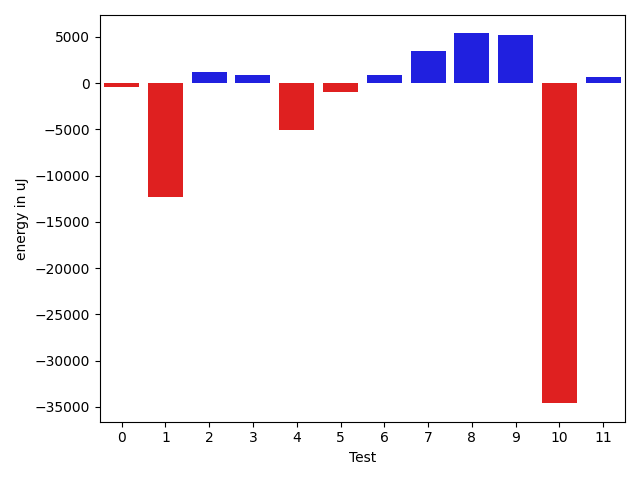
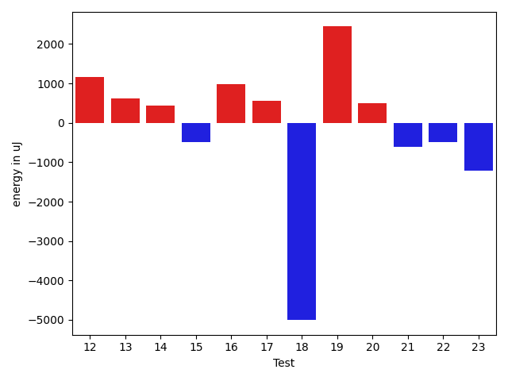
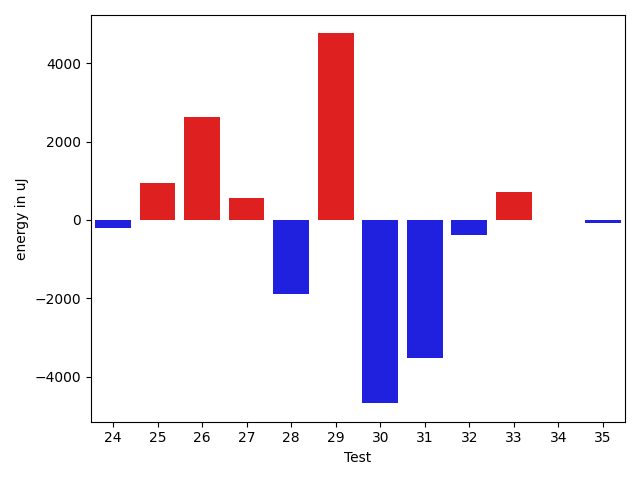
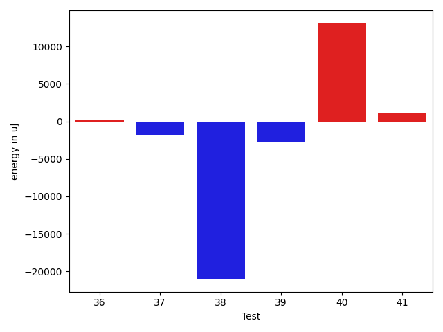

# gson b7c3e0

https://github.com/google/gson/commit/b7c3e0

## Delta Energy per test method

| ID | EnergyV1 | EnergyV2 | DeltaEnergy | σV1 | σV2 |
| --- | --- | --- | --- | --- | --- |
| 0 | 38085 | 38513 | 428 | 14560.013059599572 | 13810.835519765511 |
| 1 | 61523 | 41564 | -19959 | 63067.960103250305 | 48510.64590369283 |
| 2 | 35644 | 37292 | 1648 | 4345.45538184597 | 3656.311031061241 |
| 3 | 35767 | 37048 | 1281 | 4769.358942218879 | 4269.855738509401 |
| 4 | 96252 | 92590 | -3662 | 31151.487352379052 | 38169.99086415924 |
| 5 | 37659 | 37781 | 122 | 9459.653934051501 | 7054.131739969045 |
| 6 | 39611 | 41565 | 1954 | 15276.920592217115 | 16970.373408140826 |
| 7 | 36560 | 36255 | -305 | 9038.708294477317 | 40057.698447729505 |
| 8 | 76050 | 77942 | 1892 | 29678.691687710263 | 33881.75023184795 |
| 9 | 39367 | 40283 | 916 | 25744.508304012394 | 30046.306111411497 |
| 10 | 40161 | 42115 | 1954 | 404868.45861212985 | 342001.23878659087 |
| 11 | 37842 | 37658 | -184 | 3769.024551037912 | 4608.727993397748 |
| 12 | 35644 | 36804 | 1160 | 14566.883380312456 | 13011.459828645877 |
| 13 | 36377 | 36987 | 610 | 12457.26678839374 | 12603.874670914145 |
| 14 | 36499 | 36927 | 428 | 12708.820127638752 | 11663.110643147094 |
| 15 | 39002 | 38513 | -489 | 18284.186216170332 | 18337.963665319643 |
| 16 | 35828 | 36804 | 976 | 11385.504179836173 | 10928.40527366241 |
| 17 | 36376 | 36927 | 551 | 3954.9043544824217 | 3925.5010852119253 |
| 18 | 127929 | 122924 | -5005 | 458773.1883750974 | 246802.05658286906 |
| 19 | 40344 | 42786 | 2442 | 267257.3718176479 | 346765.71517555177 |
| 20 | 37231 | 37720 | 489 | 14712.44263997965 | 12995.975734507323 |
| 21 | 41870 | 41260 | -610 | 25940.236139519708 | 160573.7574988204 |
| 22 | 36926 | 36438 | -488 | 5221.849479818452 | 7050.428483696259 |
| 23 | 87097 | 85876 | -1221 | 293933.73095072986 | 311933.96543386945 |
| 24 | 38147 | 37232 | -915 | 4898.948574405998 | 4264.282083452718 |
| 25 | 39368 | 40893 | 1525 | 14312.429565060726 | 15543.604912842553 |
| 26 | 35705 | 36987 | 1282 | 4507.616071423091 | 7815.2505751030985 |
| 27 | 35827 | 36255 | 428 | 3980.526762201443 | 3475.045080895496 |
| 28 | 35584 | 36377 | 793 | 10992.513979164107 | 6381.190054088266 |
| 29 | 37963 | 38452 | 489 | 42446.61697402259 | 48121.859764694265 |
| 30 | 37964 | 37170 | -794 | 63938.74154159151 | 65207.83168284827 |
| 31 | 102783 | 104919 | 2136 | 28225.109331978914 | 24568.882219676456 |
| 32 | 34546 | 33935 | -611 | 3426.352060999739 | 3798.180848980571 |
| 33 | 35767 | 36316 | 549 | 9561.192030937833 | 9589.706374898718 |
| 34 | 35095 | 34790 | -305 | 3228.698402354273 | 3588.902791785936 |
| 35 | 34728 | 34546 | -182 | 3120.4849629258197 | 3075.4843317760538 |
| 36 | 34729 | 35522 | 793 | 3463.835100157085 | 4871.062917688505 |
| 37 | 38940 | 38025 | -915 | 6640.609363297988 | 4565.294275245773 |
| 38 | 195251 | 181273 | -13978 | 70323.06658062436 | 55175.2482451561 |
| 39 | 39551 | 37414 | -2137 | 13589.798980411333 | 11756.949654623771 |
| 40 | 37109 | 40710 | 3601 | 3723.9088444267804 | 28730.549610691367 |
| 41 | 40527 | 41260 | 733 | 4621.4940541471005 | 4553.193069429408 |

## Delta Duration per test method

| ID | DurationV1 | DurationsV2 | DeltaDuration |
| --- | --- | --- | --- |
| 0 | 1524332.7142857143 | 1562108.1894736842 | 37775.47518796986 |
| 1 | 2444038.9183673467 | 2078114.0 | -365924.91836734675 |
| 2 | 861630.8867924528 | 836067.0 | -25563.886792452773 |
| 3 | 575037.2352941176 | 590854.2941176471 | 15817.058823529514 |
| 4 | 2820973.111111111 | 2309505.52 | -511467.591111111 |
| 5 | 1124925.4179104478 | 1104474.1612903227 | -20451.256620125147 |
| 6 | 1534771.961038961 | 1524625.5866666667 | -10146.374372294405 |
| 7 | 1006913.4761904762 | 1220436.1692307692 | 213522.69304029294 |
| 8 | 2485432.5729166665 | 2636704.4895833335 | 151271.91666666698 |
| 9 | 1546492.1294117647 | 1787894.453488372 | 241402.32407660736 |
| 10 | 5045707.131578947 | 3839315.1267605633 | -1206392.004818384 |
| 11 | 631673.4285714285 | 567448.4117647059 | -64225.01680672262 |
| 12 | 1440436.9684210527 | 1368289.4421052632 | -72147.52631578944 |
| 13 | 1406239.3626373627 | 1376583.1460674158 | -29656.216569946846 |
| 14 | 1423596.9052631578 | 1373717.347826087 | -49879.55743707088 |
| 15 | 1750004.101010101 | 1648954.2886597938 | -101049.81235030713 |
| 16 | 1388237.1720430108 | 1327799.5520833333 | -60437.61995967757 |
| 17 | 902188.9836065574 | 862826.8 | -39362.183606557315 |
| 18 | 8339929.5050505055 | 4547572.575757576 | -3792356.9292929294 |
| 19 | 2893600.7802197803 | 3887054.6352941175 | 993453.8550743372 |
| 20 | 1422465.6666666667 | 1433408.6 | 10942.933333333349 |
| 21 | 1744546.1477272727 | 2220699.78125 | 476153.6335227273 |
| 22 | 1190934.2337662338 | 1113627.2739726028 | -77306.95979363099 |
| 23 | 4234468.888888889 | 4819036.545454546 | 584567.6565656569 |
| 24 | 1055692.7538461538 | 1012209.03125 | -43483.72259615385 |
| 25 | 1545322.010989011 | 1489372.888888889 | -55949.12210012204 |
| 26 | 1097461.425531915 | 1019438.0208333334 | -78023.40469858155 |
| 27 | 790704.0540540541 | 774465.4193548387 | -16238.634699215414 |
| 28 | 1245794.1518987343 | 1185569.512195122 | -60224.63970361231 |
| 29 | 1524638.3768115942 | 1644308.365079365 | 119669.98826777074 |
| 30 | 1817027.7105263157 | 1537361.5945945946 | -279666.1159317212 |
| 31 | 3572192.6363636362 | 3538665.0 | -33527.63636363624 |
| 32 | 983997.4923076923 | 951099.8474576271 | -32897.64485006523 |
| 33 | 1377097.388888889 | 1376345.0337078653 | -752.3551810237113 |
| 34 | 880612.0344827586 | 864882.3666666667 | -15729.667816091911 |
| 35 | 896813.9230769231 | 840796.6041666666 | -56017.318910256494 |
| 36 | 820129.9722222222 | 828683.7906976744 | 8553.818475452135 |
| 37 | 1142990.0161290322 | 1086048.1142857142 | -56941.90184331802 |
| 38 | 6271730.707070707 | 5673515.414141414 | -598215.2929292936 |
| 39 | 1465079.4494382022 | 1381059.6333333333 | -84019.81610486889 |
| 40 | 684739.88 | 1072374.5714285714 | 387634.69142857136 |
| 41 | 615100.0476190476 | 558519.05 | -56580.99761904753 |

## Misc.

| ID | Test Class | Test Method |
| --- | --- | --- |
| 0 | com.google.gson.functional.StreamingTypeAdaptersTest | testNullSafe |
| 1 | com.google.gson.functional.CustomDeserializerTest | testDefaultConstructorNotCalledOnObject |
| 2 | com.google.gson.functional.CustomDeserializerTest | testDefaultConstructorNotCalledOnField |
| 3 | com.google.gson.functional.StringTest | testEscapingQuotesInStringSerialization |
| 4 | com.google.gson.functional.StringTest | testSingleQuoteInStringSerialization |
| 5 | com.google.gson.functional.ReadersWritersTest | testReadWriteTwoObjects |
| 6 | com.google.gson.functional.ReadersWritersTest | testReadWriteTwoStrings |
| 7 | com.google.gson.functional.EnumTest | testEnumSubclassAsParameterizedType |
| 8 | com.google.gson.functional.EnumTest | testEnumSubclass |
| 9 | com.google.gson.functional.EnumTest | testEnumSubclassWithRegisteredTypeAdapter |
| 10 | com.google.gson.JsonParserTest | testReadWriteTwoObjects |
| 11 | com.google.gson.JsonParserTest | testParseMixedArray |
| 12 | com.google.gson.functional.ParameterizedTypesTest | testVariableTypeArrayDeserialization |
| 13 | com.google.gson.functional.ParameterizedTypesTest | testVariableTypeDeserialization |
| 14 | com.google.gson.functional.ParameterizedTypesTest | testParameterizedTypeGenericArraysDeserialization |
| 15 | com.google.gson.functional.ParameterizedTypesTest | testVariableTypeFieldsAndGenericArraysDeserialization |
| 16 | com.google.gson.functional.ParameterizedTypesTest | testParameterizedTypeWithVariableTypeDeserialization |
| 17 | com.google.gson.functional.TypeHierarchyAdapterTest | testRegisterSuperTypeFirst |
| 18 | com.google.gson.functional.TypeHierarchyAdapterTest | testTypeHierarchy |
| 19 | com.google.gson.functional.TypeVariableTest | testBasicTypeVariables |
| 20 | com.google.gson.functional.TypeVariableTest | testTypeVariablesViaTypeParameter |
| 21 | com.google.gson.functional.TypeVariableTest | testAdvancedTypeVariables |
| 22 | com.google.gson.functional.MapAsArrayTypeAdapterTest | testMultipleEnableComplexKeyRegistrationHasNoEffect |
| 23 | com.google.gson.functional.MapAsArrayTypeAdapterTest | testSerializeComplexMapWithTypeAdapter |
| 24 | com.google.gson.functional.CollectionTest | testFieldIsArrayList |
| 25 | com.google.gson.functional.CollectionTest | testWildcardCollectionField |
| 26 | com.google.gson.functional.UncategorizedTest | testGsonInstanceReusableForSerializationAndDeserialization |
| 27 | com.google.gson.functional.EscapingTest | testGsonDoubleDeserialization |
| 28 | com.google.gson.functional.EscapingTest | testGsonAcceptsEscapedAndNonEscapedJsonDeserialization |
| 29 | com.google.gson.functional.EscapingTest | testEscapingObjectFields |
| 30 | com.google.gson.functional.EscapingTest | testEscapingQuotesInStringArray |
| 31 | com.google.gson.functional.DefaultTypeAdaptersTest | testDefaultDateDeserializationUsingBuilder |
| 32 | com.google.gson.functional.DefaultTypeAdaptersTest | testDateDeserializationWithPattern |
| 33 | com.google.gson.functional.DefaultTypeAdaptersTest | testDateSerializationInCollection |
| 34 | com.google.gson.functional.DefaultTypeAdaptersTest | testSqlDateSerialization |
| 35 | com.google.gson.functional.DefaultTypeAdaptersTest | testTimestampSerialization |
| 36 | com.google.gson.functional.DefaultTypeAdaptersTest | testBitSetDeserialization |
| 37 | com.google.gson.functional.NamingPolicyTest | testComplexFieldNameStrategy |
| 38 | com.google.gson.DefaultInetAddressTypeAdapterTest | testInetAddressSerializationAndDeserialization |
| 39 | com.google.gson.functional.ObjectTest | testSingletonLists |
| 40 | com.google.gson.GsonTypeAdapterTest | testTypeAdapterDoesNotAffectNonAdaptedTypes |
| 41 | com.google.gson.functional.PrimitiveTest | testQuotedStringSerializationAndDeserialization |

| Test | IterationV1 | IterationV2 | DeltaIteration |
| --- | --- | --- | --- |
| 0 | 98 | 95 | -3 |
| 1 | 98 | 99 | 1 |
| 2 | 53 | 46 | -7 |
| 3 | 17 | 17 | 0 |
| 4 | 36 | 50 | 14 |
| 5 | 67 | 62 | -5 |
| 6 | 77 | 75 | -2 |
| 7 | 63 | 65 | 2 |
| 8 | 96 | 96 | 0 |
| 9 | 85 | 86 | 1 |
| 10 | 76 | 71 | -5 |
| 11 | 28 | 34 | 6 |
| 12 | 95 | 95 | 0 |
| 13 | 91 | 89 | -2 |
| 14 | 95 | 92 | -3 |
| 15 | 99 | 97 | -2 |
| 16 | 93 | 96 | 3 |
| 17 | 61 | 50 | -11 |
| 18 | 99 | 99 | 0 |
| 19 | 91 | 85 | -6 |
| 20 | 90 | 85 | -5 |
| 21 | 88 | 96 | 8 |
| 22 | 77 | 73 | -4 |
| 23 | 99 | 99 | 0 |
| 24 | 65 | 64 | -1 |
| 25 | 91 | 90 | -1 |
| 26 | 47 | 48 | 1 |
| 27 | 37 | 31 | -6 |
| 28 | 79 | 82 | 3 |
| 29 | 69 | 63 | -6 |
| 30 | 38 | 37 | -1 |
| 31 | 99 | 99 | 0 |
| 32 | 65 | 59 | -6 |
| 33 | 90 | 89 | -1 |
| 34 | 58 | 60 | 2 |
| 35 | 52 | 48 | -4 |
| 36 | 36 | 43 | 7 |
| 37 | 62 | 70 | 8 |
| 38 | 99 | 99 | 0 |
| 39 | 89 | 90 | 1 |
| 40 | 25 | 28 | 3 |
| 41 | 21 | 20 | -1 |

| Time Label | Time (s) |
| --- | --- |
| Selection | 27.05090570449829 |
| Injection | 13.423644542694092 |
| Total | 1142.1893820762634 |

