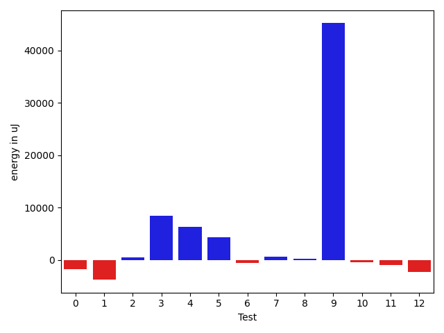
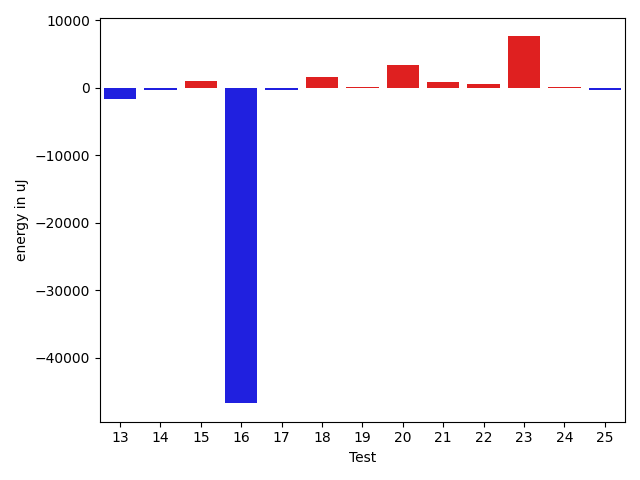
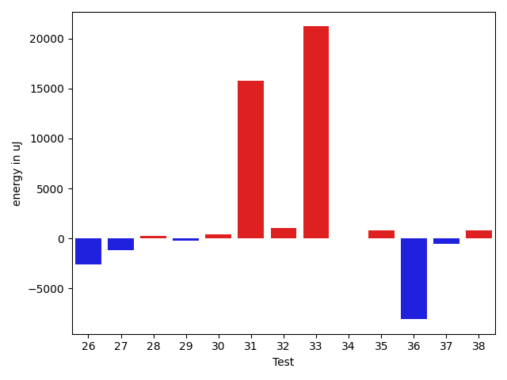
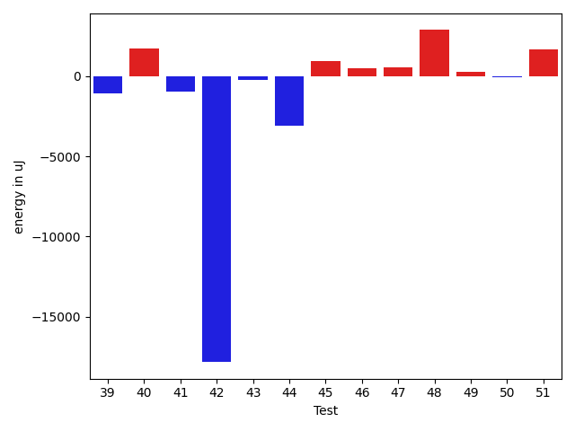
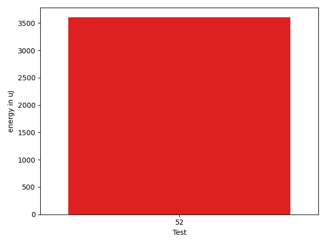

# gson d01d39

https://github.com/google/gson/commit/d01d39

## Delta Energy per test method

| ID | EnergyV1 | EnergyV2 | DeltaEnergy | σV1 | σV2 |
| --- | --- | --- | --- | --- | --- |
| 0 | 38146 | 37842 | -304 | 13962.988572353037 | 10448.045400712064 |
| 1 | 43823 | 44678 | 855 | 56973.1383994094 | 43180.80719580904 |
| 2 | 35828 | 37597 | 1769 | 4858.860763018332 | 5056.835496125727 |
| 3 | 35461 | 35889 | 428 | 6433.25530872854 | 46826.905980512616 |
| 4 | 72144 | 76477 | 4333 | 28534.35940548547 | 30972.294612004258 |
| 5 | 39124 | 39063 | -61 | 21174.457536508147 | 30297.806819244306 |
| 6 | 36194 | 34973 | -1221 | 4682.75205040322 | 5052.7782599322845 |
| 7 | 36071 | 37170 | 1099 | 9172.414867416323 | 8520.499776747578 |
| 8 | 35217 | 36804 | 1587 | 4373.326891013668 | 3769.8592373469537 |
| 9 | 39123 | 39368 | 245 | 257382.06070124515 | 343668.0884627221 |
| 10 | 36865 | 36377 | -488 | 4491.80426367956 | 4460.423461754519 |
| 11 | 36194 | 34729 | -1465 | 5237.6679472239575 | 4233.472732441598 |
| 12 | 36377 | 35645 | -732 | 4984.544473334369 | 4000.1529538657633 |
| 13 | 36987 | 35279 | -1708 | 5428.673488947369 | 4697.7041258895815 |
| 14 | 40283 | 40039 | -244 | 334685.8062414136 | 419724.4681925503 |
| 15 | 35400 | 36377 | 977 | 5737.539402086566 | 4098.09356933771 |
| 16 | 87830 | 41076 | -46754 | 42876.81173875205 | 38304.8313931603 |
| 17 | 40283 | 39917 | -366 | 5295.72775074399 | 4425.59579984365 |
| 18 | 36560 | 38208 | 1648 | 9129.190551599266 | 13110.447540250341 |
| 19 | 36377 | 36560 | 183 | 5058.383092870016 | 4359.161749507277 |
| 20 | 71472 | 74890 | 3418 | 271738.162751974 | 275714.7778275804 |
| 21 | 38208 | 39123 | 915 | 16000.822111552752 | 11742.069957298787 |
| 22 | 36072 | 36682 | 610 | 5083.311047050599 | 7007.527767554734 |
| 23 | 91187 | 98816 | 7629 | 179747.54027160787 | 293732.5540124528 |
| 24 | 37110 | 37232 | 122 | 4948.005418748166 | 7028.801444369801 |
| 25 | 35523 | 35156 | -367 | 12359.510857052373 | 9375.051924498715 |
| 26 | 36194 | 35644 | -550 | 19861.92074525602 | 15050.185431579337 |
| 27 | 40100 | 39367 | -733 | 18196.9087696911 | 18937.544898642034 |
| 28 | 35401 | 35644 | 243 | 10652.940316915669 | 12479.602773744433 |
| 29 | 36071 | 35706 | -365 | 10828.271382468452 | 11099.807341458038 |
| 30 | 36804 | 37109 | 305 | 9688.491796674918 | 9265.07198514515 |
| 31 | 38269 | 39673 | 1404 | 45299.41105946364 | 58353.79768079034 |
| 32 | 34790 | 36437 | 1647 | 4095.9512495742542 | 4564.356265620716 |
| 33 | 38086 | 38696 | 610 | 45299.172419703595 | 73019.88567791876 |
| 34 | 35278 | 34973 | -305 | 3994.478974482848 | 2877.8763775472435 |
| 35 | 107422 | 106384 | -1038 | 22940.953185966493 | 23963.117070330274 |
| 36 | 143372 | 132568 | -10804 | 245819.1245839889 | 236337.3651772883 |
| 37 | 35888 | 36255 | 367 | 11164.36439354726 | 9822.364446410871 |
| 38 | 33631 | 35522 | 1891 | 3661.583489272802 | 4104.415422745258 |
| 39 | 35339 | 34240 | -1099 | 3523.1399795468947 | 3712.2874707617852 |
| 40 | 34118 | 35828 | 1710 | 3964.2799738785193 | 3810.136147096097 |
| 41 | 37293 | 36316 | -977 | 7103.300378821909 | 4842.487104438477 |
| 42 | 130554 | 112732 | -17822 | 455834.09319310356 | 263263.23544794816 |
| 43 | 37292 | 37048 | -244 | 4314.639490477116 | 5276.078131594925 |
| 44 | 179748 | 176636 | -3112 | 67513.27043368567 | 59827.99016158932 |
| 45 | 38880 | 39795 | 915 | 12981.90391097895 | 12888.425053722898 |
| 46 | 37476 | 37963 | 487 | 4121.7359183757035 | 4275.641542346535 |
| 47 | 37415 | 37964 | 549 | 7875.086515199608 | 7575.933750424987 |
| 48 | 33691 | 36560 | 2869 | 4114.165254742855 | 6437.637840355701 |
| 49 | 37719 | 37964 | 245 | 46495.87083936713 | 39174.50066967277 |
| 50 | 40650 | 40589 | -61 | 16315.258956482015 | 16063.212427441225 |
| 51 | 36072 | 37719 | 1647 | 11213.708086248182 | 10550.525473755919 |
| 52 | 36621 | 40222 | 3601 | 5216.493386070147 | 5226.970055858724 |

## Delta Duration per test method

| ID | DurationV1 | DurationsV2 | DeltaDuration |
| --- | --- | --- | --- |
| 0 | 1528546.430107527 | 1455110.322580645 | -73436.10752688185 |
| 1 | 2217679.888888889 | 2000035.275510204 | -217644.61337868497 |
| 2 | 801060.8571428572 | 831241.695652174 | 30180.83850931679 |
| 3 | 976165.8703703703 | 1266603.5818181818 | 290437.71144781145 |
| 4 | 2456135.085106383 | 2537109.288659794 | 80974.20355341071 |
| 5 | 1570675.4186046512 | 1617992.6162790698 | 47317.19767441857 |
| 6 | 572653.0666666667 | 543636.947368421 | -29016.11929824564 |
| 7 | 566839.2083333334 | 715793.3666666667 | 148954.15833333333 |
| 8 | 498626.89285714284 | 529847.5555555555 | 31220.662698412663 |
| 9 | 2673095.153846154 | 3839678.413043478 | 1166583.259197324 |
| 10 | 824479.7407407408 | 927264.0566037736 | 102784.31586303283 |
| 11 | 529324.1111111111 | 571695.4 | 42371.2888888889 |
| 12 | 529682.6842105263 | 612271.2222222222 | 82588.53801169596 |
| 13 | 504577.72 | 554142.92 | 49565.20000000007 |
| 14 | 3843823.077922078 | 5209038.257142857 | 1365215.1792207789 |
| 15 | 562288.1818181818 | 506929.4210526316 | -55358.76076555019 |
| 16 | 2255050.285714286 | 1794381.9215686275 | -460668.36414565844 |
| 17 | 566823.65 | 513698.8125 | -53124.83750000002 |
| 18 | 1337244.488095238 | 1366032.9113924052 | 28788.423297167057 |
| 19 | 941152.6515151515 | 922201.6857142857 | -18950.965800865786 |
| 20 | 3390745.757575758 | 3685125.505050505 | 294379.74747474724 |
| 21 | 1387547.5444444444 | 1347299.4 | -40248.14444444445 |
| 22 | 1126610.32 | 1150567.858974359 | 23957.538974358933 |
| 23 | 3401102.525252525 | 4713088.111111111 | 1311985.5858585858 |
| 24 | 931567.2894736842 | 946296.5 | 14729.210526315845 |
| 25 | 1401544.6315789474 | 1361538.8988764044 | -40005.73270254303 |
| 26 | 1438583.0107526882 | 1431263.1030927836 | -7319.907659904566 |
| 27 | 1702641.46875 | 1729402.4242424243 | 26760.955492424313 |
| 28 | 1361661.4787234042 | 1372159.2688172043 | 10497.790093800053 |
| 29 | 1382946.2795698924 | 1367746.0869565217 | -15200.192613370717 |
| 30 | 1181029.4216867469 | 1228214.6329113925 | 47185.21122464561 |
| 31 | 1638584.8245614036 | 2153958.6285714284 | 515373.80401002476 |
| 32 | 773930.375 | 747976.1914893617 | -25954.183510638308 |
| 33 | 1356286.9411764706 | 2157124.5142857144 | 800837.5731092438 |
| 34 | 833759.2941176471 | 810857.0222222222 | -22902.27189542493 |
| 35 | 3621698.0404040404 | 3593832.3636363638 | -27865.676767676603 |
| 36 | 9301544.383838383 | 8804152.636363637 | -497391.7474747468 |
| 37 | 1377444.4680851065 | 1345780.1157894738 | -31664.352295632707 |
| 38 | 802126.0256410256 | 762722.7777777778 | -39403.247863247874 |
| 39 | 845880.2280701754 | 818113.679245283 | -27766.54882489238 |
| 40 | 946011.328358209 | 923924.4923076923 | -22086.836050516693 |
| 41 | 1033361.2253521127 | 1007685.1666666666 | -25676.05868544604 |
| 42 | 7560462.414141414 | 4905226.7272727275 | -2655235.686868686 |
| 43 | 938692.8518518518 | 846106.9433962264 | -92585.90845562541 |
| 44 | 5816663.242424242 | 5675544.202020202 | -141119.04040404037 |
| 45 | 1530794.322580645 | 1492108.111111111 | -38686.211469534086 |
| 46 | 1035949.2923076923 | 1004460.0317460317 | -31489.26056166063 |
| 47 | 688408.1379310344 | 752021.0384615385 | 63612.90053050406 |
| 48 | 793666.5666666667 | 834010.6774193548 | 40344.11075268814 |
| 49 | 1648250.8148148148 | 1688037.7586206896 | 39786.94380587479 |
| 50 | 1389616.6533333333 | 1420000.2098765431 | 30383.556543209823 |
| 51 | 1062640.4761904762 | 1120816.2903225806 | 58175.814132104395 |
| 52 | 616892.5555555555 | 682908.875 | 66016.3194444445 |

## Misc.

| ID | Test Class | Test Method |
| --- | --- | --- |
| 0 | com.google.gson.functional.StreamingTypeAdaptersTest | testNullSafe |
| 1 | com.google.gson.functional.CustomDeserializerTest | testDefaultConstructorNotCalledOnObject |
| 2 | com.google.gson.functional.CustomDeserializerTest | testDefaultConstructorNotCalledOnField |
| 3 | com.google.gson.functional.EnumTest | testEnumSubclassAsParameterizedType |
| 4 | com.google.gson.functional.EnumTest | testEnumSubclass |
| 5 | com.google.gson.functional.EnumTest | testEnumSubclassWithRegisteredTypeAdapter |
| 6 | com.google.gson.functional.TypeAdapterPrecedenceTest | testStreamingHierarchicalFollowedByNonstreaming |
| 7 | com.google.gson.functional.TypeAdapterPrecedenceTest | testSerializeNonstreamingTypeAdapterFollowedByStreamingTypeAdapter |
| 8 | com.google.gson.functional.TypeAdapterPrecedenceTest | testStreamingHierarchicalFollowedByNonstreamingHierarchical |
| 9 | com.google.gson.functional.TypeAdapterPrecedenceTest | testNonstreamingFollowedByNonstreaming |
| 10 | com.google.gson.functional.TypeAdapterPrecedenceTest | testStreamingFollowedByStreaming |
| 11 | com.google.gson.functional.TypeAdapterPrecedenceTest | testNonstreamingHierarchicalFollowedByNonstreaming |
| 12 | com.google.gson.functional.TypeAdapterPrecedenceTest | testStreamingFollowedByNonstreaming |
| 13 | com.google.gson.functional.TypeAdapterPrecedenceTest | testStreamingFollowedByNonstreamingHierarchical |
| 14 | com.google.gson.JsonParserTest | testReadWriteTwoObjects |
| 15 | com.google.gson.JsonParserTest | testParseMixedArray |
| 16 | com.google.gson.functional.StringTest | testSingleQuoteInStringSerialization |
| 17 | com.google.gson.functional.StringTest | testEscapingQuotesInStringSerialization |
| 18 | com.google.gson.functional.ObjectTest | testSingletonLists |
| 19 | com.google.gson.functional.TypeVariableTest | testBasicTypeVariables |
| 20 | com.google.gson.functional.TypeVariableTest | testAdvancedTypeVariables |
| 21 | com.google.gson.functional.TypeVariableTest | testTypeVariablesViaTypeParameter |
| 22 | com.google.gson.functional.MapAsArrayTypeAdapterTest | testMultipleEnableComplexKeyRegistrationHasNoEffect |
| 23 | com.google.gson.functional.MapAsArrayTypeAdapterTest | testSerializeComplexMapWithTypeAdapter |
| 24 | com.google.gson.functional.UncategorizedTest | testGsonInstanceReusableForSerializationAndDeserialization |
| 25 | com.google.gson.functional.ParameterizedTypesTest | testVariableTypeDeserialization |
| 26 | com.google.gson.functional.ParameterizedTypesTest | testParameterizedTypeGenericArraysDeserialization |
| 27 | com.google.gson.functional.ParameterizedTypesTest | testVariableTypeFieldsAndGenericArraysDeserialization |
| 28 | com.google.gson.functional.ParameterizedTypesTest | testParameterizedTypeWithVariableTypeDeserialization |
| 29 | com.google.gson.functional.ParameterizedTypesTest | testVariableTypeArrayDeserialization |
| 30 | com.google.gson.functional.EscapingTest | testGsonAcceptsEscapedAndNonEscapedJsonDeserialization |
| 31 | com.google.gson.functional.EscapingTest | testEscapingObjectFields |
| 32 | com.google.gson.functional.EscapingTest | testGsonDoubleDeserialization |
| 33 | com.google.gson.functional.EscapingTest | testEscapingQuotesInStringArray |
| 34 | com.google.gson.functional.DefaultTypeAdaptersTest | testTimestampSerialization |
| 35 | com.google.gson.functional.DefaultTypeAdaptersTest | testDefaultDateDeserializationUsingBuilder |
| 36 | com.google.gson.functional.DefaultTypeAdaptersTest | testNullSerialization |
| 37 | com.google.gson.functional.DefaultTypeAdaptersTest | testDateSerializationInCollection |
| 38 | com.google.gson.functional.DefaultTypeAdaptersTest | testBitSetDeserialization |
| 39 | com.google.gson.functional.DefaultTypeAdaptersTest | testSqlDateSerialization |
| 40 | com.google.gson.functional.DefaultTypeAdaptersTest | testDateDeserializationWithPattern |
| 41 | com.google.gson.functional.NamingPolicyTest | testComplexFieldNameStrategy |
| 42 | com.google.gson.functional.TypeHierarchyAdapterTest | testTypeHierarchy |
| 43 | com.google.gson.functional.TypeHierarchyAdapterTest | testRegisterSuperTypeFirst |
| 44 | com.google.gson.DefaultInetAddressTypeAdapterTest | testInetAddressSerializationAndDeserialization |
| 45 | com.google.gson.functional.CollectionTest | testWildcardCollectionField |
| 46 | com.google.gson.functional.CollectionTest | testFieldIsArrayList |
| 47 | com.google.gson.GsonTypeAdapterTest | testTypeAdapterProperlyConvertsTypes |
| 48 | com.google.gson.GsonTypeAdapterTest | testTypeAdapterThrowsException |
| 49 | com.google.gson.GsonTypeAdapterTest | testTypeAdapterDoesNotAffectNonAdaptedTypes |
| 50 | com.google.gson.functional.ReadersWritersTest | testReadWriteTwoStrings |
| 51 | com.google.gson.functional.ReadersWritersTest | testReadWriteTwoObjects |
| 52 | com.google.gson.functional.PrimitiveTest | testQuotedStringSerializationAndDeserialization |

| Test | IterationV1 | IterationV2 | DeltaIteration |
| --- | --- | --- | --- |
| 0 | 93 | 93 | 0 |
| 1 | 99 | 98 | -1 |
| 2 | 42 | 46 | 4 |
| 3 | 54 | 55 | 1 |
| 4 | 94 | 97 | 3 |
| 5 | 86 | 86 | 0 |
| 6 | 30 | 19 | -11 |
| 7 | 24 | 30 | 6 |
| 8 | 28 | 27 | -1 |
| 9 | 91 | 92 | 1 |
| 10 | 54 | 53 | -1 |
| 11 | 27 | 35 | 8 |
| 12 | 19 | 27 | 8 |
| 13 | 25 | 25 | 0 |
| 14 | 77 | 70 | -7 |
| 15 | 22 | 19 | -3 |
| 16 | 42 | 51 | 9 |
| 17 | 20 | 16 | -4 |
| 18 | 84 | 79 | -5 |
| 19 | 66 | 70 | 4 |
| 20 | 99 | 99 | 0 |
| 21 | 90 | 90 | 0 |
| 22 | 75 | 78 | 3 |
| 23 | 99 | 99 | 0 |
| 24 | 38 | 40 | 2 |
| 25 | 95 | 89 | -6 |
| 26 | 93 | 97 | 4 |
| 27 | 96 | 99 | 3 |
| 28 | 94 | 93 | -1 |
| 29 | 93 | 92 | -1 |
| 30 | 83 | 79 | -4 |
| 31 | 57 | 70 | 13 |
| 32 | 48 | 47 | -1 |
| 33 | 34 | 35 | 1 |
| 34 | 51 | 45 | -6 |
| 35 | 99 | 99 | 0 |
| 36 | 99 | 99 | 0 |
| 37 | 94 | 95 | 1 |
| 38 | 39 | 45 | 6 |
| 39 | 57 | 53 | -4 |
| 40 | 67 | 65 | -2 |
| 41 | 71 | 54 | -17 |
| 42 | 99 | 99 | 0 |
| 43 | 54 | 53 | -1 |
| 44 | 99 | 99 | 0 |
| 45 | 93 | 90 | -3 |
| 46 | 65 | 63 | -2 |
| 47 | 29 | 26 | -3 |
| 48 | 30 | 31 | 1 |
| 49 | 27 | 29 | 2 |
| 50 | 75 | 81 | 6 |
| 51 | 63 | 62 | -1 |
| 52 | 18 | 16 | -2 |

| Time Label | Time (s) |
| --- | --- |
| Selection | 27.04751205444336 |
| Injection | 13.3212730884552 |
| Total | 1146.5884749889374 |

