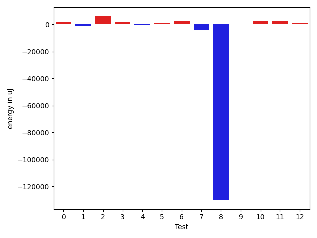
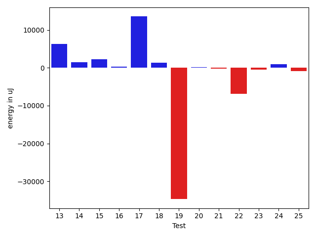
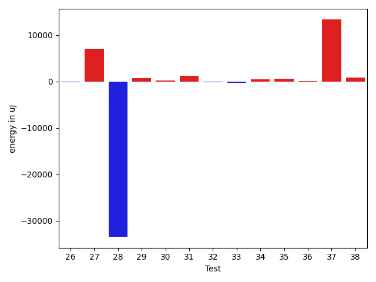
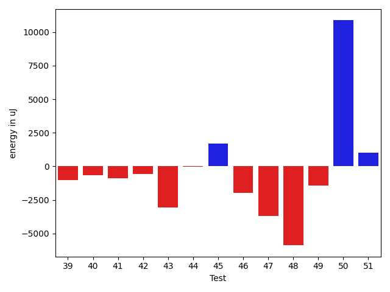
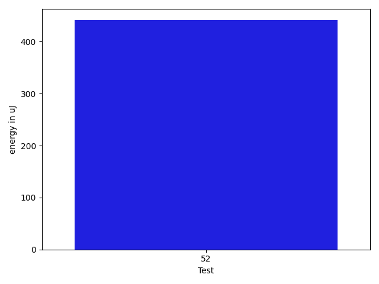

# gson aa5243

https://github.com/google/gson/commit/aa5243

## Delta Energy per test method

| ID | EnergyV1 | EnergyV2 | DeltaEnergy | σV1 | σV2 |
| --- | --- | --- | --- | --- | --- |
| 0 | 36988 | 39368 | 2380 | 12361.87482243078 | 13522.7572441131 |
| 1 | 37476 | 37476 | 0 | 4270.554626670288 | 4005.3515100022973 |
| 2 | 43884 | 48034 | 4150 | 48492.540515160974 | 58697.82820296439 |
| 3 | 35461 | 37659 | 2198 | 8937.67305137075 | 11356.65015243325 |
| 4 | 42053 | 42115 | 62 | 15037.75643727038 | 16634.549628259676 |
| 5 | 34729 | 37780 | 3051 | 9824.613622332687 | 6644.499970458972 |
| 6 | 73364 | 76293 | 2929 | 26320.52870257361 | 27726.618702245723 |
| 7 | 38879 | 39123 | 244 | 32883.93501257254 | 28454.235285967243 |
| 8 | 41199 | 38818 | -2381 | 493421.7844743886 | 289097.891539194 |
| 9 | 37353 | 36133 | -1220 | 3212.2261294306822 | 3436.505735754707 |
| 10 | 36315 | 37414 | 1099 | 11036.639920245956 | 13359.87087203509 |
| 11 | 36133 | 37170 | 1037 | 8814.193436520376 | 11803.052588083585 |
| 12 | 35828 | 36071 | 243 | 17747.168426700922 | 17811.620766600172 |
| 13 | 38513 | 41077 | 2564 | 15489.16234823562 | 21051.26904659177 |
| 14 | 35461 | 36438 | 977 | 10388.983102457709 | 11642.851691972484 |
| 15 | 36560 | 36987 | 427 | 10010.437829966775 | 12795.632044505706 |
| 16 | 36926 | 37720 | 794 | 4483.109923535688 | 4239.08057114307 |
| 17 | 118774 | 138488 | 19714 | 342735.22918593703 | 355087.2486335079 |
| 18 | 36072 | 36194 | 122 | 4302.3893544786 | 7176.500339736125 |
| 19 | 87097 | 82397 | -4700 | 402559.2226044111 | 346492.3737040847 |
| 20 | 38635 | 37109 | -1526 | 4456.182859774952 | 4763.297842691488 |
| 21 | 40833 | 40406 | -427 | 13425.987581851283 | 13738.292265344673 |
| 22 | 64270 | 72937 | 8667 | 186563.42331748467 | 160888.0480502681 |
| 23 | 37476 | 36682 | -794 | 11207.25845865486 | 11888.048663601314 |
| 24 | 35584 | 36438 | 854 | 4237.932996089537 | 4318.245320086668 |
| 25 | 37719 | 36499 | -1220 | 6750.381950128746 | 6616.684624311484 |
| 26 | 35278 | 35095 | -183 | 3667.10463246681 | 2863.2463407275263 |
| 27 | 100708 | 107788 | 7080 | 20356.315170649214 | 23672.89715939289 |
| 28 | 160644 | 127136 | -33508 | 242520.02512111925 | 256448.3798296888 |
| 29 | 35461 | 36133 | 672 | 10599.805932992913 | 12982.69890668841 |
| 30 | 34302 | 34546 | 244 | 2767.50542108354 | 2946.2169760087636 |
| 31 | 35278 | 36438 | 1160 | 3700.570863952723 | 4419.889817838964 |
| 32 | 34485 | 34302 | -183 | 3270.443234568144 | 3263.939281739965 |
| 33 | 35217 | 34851 | -366 | 4383.930891619985 | 4394.505640290399 |
| 34 | 36193 | 36682 | 489 | 8194.967152437892 | 10293.152534612684 |
| 35 | 37720 | 38330 | 610 | 35058.22132285799 | 52209.137335832325 |
| 36 | 38208 | 38269 | 61 | 45853.88782905408 | 74798.90446217041 |
| 37 | 177856 | 191161 | 13305 | 58221.122390611905 | 53714.15804840751 |
| 38 | 39734 | 40527 | 793 | 301998.1188675309 | 329802.64364307513 |
| 39 | 36194 | 35339 | -855 | 4583.559048987539 | 4407.925483456853 |
| 40 | 38085 | 36621 | -1464 | 3940.1007578802505 | 4340.65994013824 |
| 41 | 36743 | 37048 | 305 | 4441.220109634539 | 4216.529963890986 |
| 42 | 36621 | 36315 | -306 | 3565.84278256908 | 3833.764043977923 |
| 43 | 38208 | 34546 | -3662 | 3858.387598236219 | 4726.58311926632 |
| 44 | 37048 | 37231 | 183 | 4317.478144184427 | 3936.1716826830047 |
| 45 | 36255 | 38269 | 2014 | 3923.938205425769 | 7734.467426969876 |
| 46 | 37720 | 36072 | -1648 | 4347.659069832868 | 4415.205556936166 |
| 47 | 88134 | 50415 | -37719 | 40418.24532503165 | 33798.56006575428 |
| 48 | 37354 | 37109 | -245 | 28305.50257969091 | 19425.51020185538 |
| 49 | 36865 | 36499 | -366 | 6013.473028172814 | 4273.543170745117 |
| 50 | 37658 | 39124 | 1466 | 30010.863392189214 | 39624.10012475728 |
| 51 | 37781 | 39734 | 1953 | 6297.9184391881945 | 4989.448936505914 |
| 52 | 37171 | 37414 | 243 | 5324.55953614026 | 5300.444565388436 |

## Delta Duration per test method

| ID | DurationV1 | DurationsV2 | DeltaDuration |
| --- | --- | --- | --- |
| 0 | 1449505.688172043 | 1526538.0631578946 | 77032.37498585158 |
| 1 | 811851.0 | 798609.0545454546 | -13241.945454545435 |
| 2 | 2017749.8181818181 | 2185317.1818181816 | 167567.36363636353 |
| 3 | 1134955.956521739 | 1138218.7213114754 | 3262.764789736364 |
| 4 | 1541229.75 | 1475110.2142857143 | -66119.53571428568 |
| 5 | 1001528.015625 | 985936.9850746269 | -15591.030550373136 |
| 6 | 2429996.9468085105 | 2342388.03125 | -87608.91555851046 |
| 7 | 1821502.625 | 1621433.6904761905 | -200068.93452380947 |
| 8 | 6722542.77631579 | 3245351.2027027025 | -3477191.573613087 |
| 9 | 619865.4583333334 | 554400.78125 | -65464.67708333337 |
| 10 | 1362713.90625 | 1384911.505263158 | 22197.599013157887 |
| 11 | 1349945.9894736842 | 1370689.8865979381 | 20743.897124253912 |
| 12 | 1411337.6041666667 | 1421304.0319148935 | 9966.427748226793 |
| 13 | 1664890.857142857 | 1741676.9292929294 | 76786.07215007232 |
| 14 | 1358942.010989011 | 1349620.8152173914 | -9321.195771619678 |
| 15 | 1287839.6790123456 | 1392737.1604938272 | 104897.48148148158 |
| 16 | 896529.1724137932 | 870829.1754385965 | -25699.996975196642 |
| 17 | 6504324.636363637 | 6610794.171717172 | 106469.53535353485 |
| 18 | 1146345.5454545454 | 1102979.7051282052 | -43365.84032634017 |
| 19 | 5974751.434343434 | 5046742.232323232 | -928009.2020202018 |
| 20 | 1011984.9848484849 | 996039.1935483871 | -15945.791300097713 |
| 21 | 1531568.7701149425 | 1462386.543478261 | -69182.22663668147 |
| 22 | 2803899.8484848486 | 2512740.9595959596 | -291158.888888889 |
| 23 | 1323031.5568181819 | 1328866.1123595505 | 5834.555541368667 |
| 24 | 891552.7580645161 | 912003.0 | 20450.24193548388 |
| 25 | 929371.7272727273 | 912632.1 | -16739.627272727317 |
| 26 | 852947.9074074074 | 837477.8867924528 | -15470.020614954643 |
| 27 | 3507376.9191919193 | 3554607.797979798 | 47230.8787878789 |
| 28 | 9564613.848484848 | 8954276.353535354 | -610337.4949494936 |
| 29 | 1352327.8829787234 | 1397056.2 | 44728.31702127657 |
| 30 | 843464.8979591837 | 821892.9833333333 | -21571.91462585039 |
| 31 | 814804.6111111111 | 796703.7272727273 | -18100.88383838383 |
| 32 | 923724.0461538462 | 945329.875 | 21605.828846153803 |
| 33 | 795262.625 | 748531.5744680851 | -46731.05053191492 |
| 34 | 1211810.524390244 | 1185354.2162162163 | -26456.308174027596 |
| 35 | 1404440.0819672132 | 1668548.245614035 | 264108.16364682186 |
| 36 | 1408968.5263157894 | 1932412.8064516129 | 523444.2801358234 |
| 37 | 5505578.848484849 | 5873010.7272727275 | 367431.8787878789 |
| 38 | 3481352.775510204 | 3684874.4787234045 | 203521.70321320044 |
| 39 | 960686.0392156863 | 966164.3958333334 | 5478.356617647107 |
| 40 | 536273.0384615385 | 551677.6129032258 | 15404.57444168732 |
| 41 | 525721.5333333333 | 569603.9615384615 | 43882.42820512818 |
| 42 | 510430.9583333333 | 559195.0 | 48764.041666666686 |
| 43 | 568566.5652173914 | 609333.5 | 40766.934782608645 |
| 44 | 550751.6785714285 | 574659.1 | 23907.421428571455 |
| 45 | 618367.0 | 660713.7222222222 | 42346.72222222225 |
| 46 | 451087.9 | 564204.0 | 113116.09999999998 |
| 47 | 2096635.4318181819 | 2090389.28 | -6246.151818181854 |
| 48 | 1088868.9666666666 | 1001402.0606060605 | -87466.90606060601 |
| 49 | 635658.2903225806 | 779102.2666666667 | 143443.9763440861 |
| 50 | 1028513.0 | 1721389.2068965517 | 692876.2068965517 |
| 51 | 738920.8666666667 | 628810.1 | -110110.76666666672 |
| 52 | 1091885.2741935484 | 1035457.985915493 | -56427.28827805538 |

## Misc.

| ID | Test Class | Test Method |
| --- | --- | --- |
| 0 | com.google.gson.functional.StreamingTypeAdaptersTest | testNullSafe |
| 1 | com.google.gson.functional.CustomDeserializerTest | testDefaultConstructorNotCalledOnField |
| 2 | com.google.gson.functional.CustomDeserializerTest | testDefaultConstructorNotCalledOnObject |
| 3 | com.google.gson.functional.ReadersWritersTest | testReadWriteTwoObjects |
| 4 | com.google.gson.functional.ReadersWritersTest | testReadWriteTwoStrings |
| 5 | com.google.gson.functional.EnumTest | testEnumSubclassAsParameterizedType |
| 6 | com.google.gson.functional.EnumTest | testEnumSubclass |
| 7 | com.google.gson.functional.EnumTest | testEnumSubclassWithRegisteredTypeAdapter |
| 8 | com.google.gson.JsonParserTest | testReadWriteTwoObjects |
| 9 | com.google.gson.JsonParserTest | testParseMixedArray |
| 10 | com.google.gson.functional.ParameterizedTypesTest | testVariableTypeArrayDeserialization |
| 11 | com.google.gson.functional.ParameterizedTypesTest | testVariableTypeDeserialization |
| 12 | com.google.gson.functional.ParameterizedTypesTest | testParameterizedTypeGenericArraysDeserialization |
| 13 | com.google.gson.functional.ParameterizedTypesTest | testVariableTypeFieldsAndGenericArraysDeserialization |
| 14 | com.google.gson.functional.ParameterizedTypesTest | testParameterizedTypeWithVariableTypeDeserialization |
| 15 | com.google.gson.functional.ObjectTest | testSingletonLists |
| 16 | com.google.gson.functional.TypeHierarchyAdapterTest | testRegisterSuperTypeFirst |
| 17 | com.google.gson.functional.TypeHierarchyAdapterTest | testTypeHierarchy |
| 18 | com.google.gson.functional.MapAsArrayTypeAdapterTest | testMultipleEnableComplexKeyRegistrationHasNoEffect |
| 19 | com.google.gson.functional.MapAsArrayTypeAdapterTest | testSerializeComplexMapWithTypeAdapter |
| 20 | com.google.gson.functional.CollectionTest | testFieldIsArrayList |
| 21 | com.google.gson.functional.CollectionTest | testWildcardCollectionField |
| 22 | com.google.gson.functional.TypeVariableTest | testAdvancedTypeVariables |
| 23 | com.google.gson.functional.TypeVariableTest | testTypeVariablesViaTypeParameter |
| 24 | com.google.gson.functional.TypeVariableTest | testBasicTypeVariables |
| 25 | com.google.gson.functional.UncategorizedTest | testGsonInstanceReusableForSerializationAndDeserialization |
| 26 | com.google.gson.functional.DefaultTypeAdaptersTest | testSqlDateSerialization |
| 27 | com.google.gson.functional.DefaultTypeAdaptersTest | testDefaultDateDeserializationUsingBuilder |
| 28 | com.google.gson.functional.DefaultTypeAdaptersTest | testNullSerialization |
| 29 | com.google.gson.functional.DefaultTypeAdaptersTest | testDateSerializationInCollection |
| 30 | com.google.gson.functional.DefaultTypeAdaptersTest | testTimestampSerialization |
| 31 | com.google.gson.functional.DefaultTypeAdaptersTest | testBitSetDeserialization |
| 32 | com.google.gson.functional.DefaultTypeAdaptersTest | testDateDeserializationWithPattern |
| 33 | com.google.gson.functional.EscapingTest | testGsonDoubleDeserialization |
| 34 | com.google.gson.functional.EscapingTest | testGsonAcceptsEscapedAndNonEscapedJsonDeserialization |
| 35 | com.google.gson.functional.EscapingTest | testEscapingObjectFields |
| 36 | com.google.gson.functional.EscapingTest | testEscapingQuotesInStringArray |
| 37 | com.google.gson.DefaultInetAddressTypeAdapterTest | testInetAddressSerializationAndDeserialization |
| 38 | com.google.gson.functional.TypeAdapterPrecedenceTest | testNonstreamingFollowedByNonstreaming |
| 39 | com.google.gson.functional.TypeAdapterPrecedenceTest | testStreamingFollowedByStreaming |
| 40 | com.google.gson.functional.TypeAdapterPrecedenceTest | testStreamingFollowedByNonstreamingHierarchical |
| 41 | com.google.gson.functional.TypeAdapterPrecedenceTest | testNonstreamingHierarchicalFollowedByNonstreaming |
| 42 | com.google.gson.functional.TypeAdapterPrecedenceTest | testStreamingHierarchicalFollowedByNonstreamingHierarchical |
| 43 | com.google.gson.functional.TypeAdapterPrecedenceTest | testStreamingFollowedByNonstreaming |
| 44 | com.google.gson.functional.TypeAdapterPrecedenceTest | testStreamingHierarchicalFollowedByNonstreaming |
| 45 | com.google.gson.functional.TypeAdapterPrecedenceTest | testSerializeNonstreamingTypeAdapterFollowedByStreamingTypeAdapter |
| 46 | com.google.gson.functional.StringTest | testEscapingQuotesInStringSerialization |
| 47 | com.google.gson.functional.StringTest | testSingleQuoteInStringSerialization |
| 48 | com.google.gson.GsonTypeAdapterTest | testTypeAdapterThrowsException |
| 49 | com.google.gson.GsonTypeAdapterTest | testTypeAdapterProperlyConvertsTypes |
| 50 | com.google.gson.GsonTypeAdapterTest | testTypeAdapterDoesNotAffectNonAdaptedTypes |
| 51 | com.google.gson.functional.PrimitiveTest | testQuotedStringSerializationAndDeserialization |
| 52 | com.google.gson.functional.NamingPolicyTest | testComplexFieldNameStrategy |

| Test | IterationV1 | IterationV2 | DeltaIteration |
| --- | --- | --- | --- |
| 0 | 93 | 95 | 2 |
| 1 | 40 | 55 | 15 |
| 2 | 99 | 99 | 0 |
| 3 | 69 | 61 | -8 |
| 4 | 72 | 84 | 12 |
| 5 | 64 | 67 | 3 |
| 6 | 94 | 96 | 2 |
| 7 | 80 | 84 | 4 |
| 8 | 76 | 74 | -2 |
| 9 | 24 | 32 | 8 |
| 10 | 96 | 95 | -1 |
| 11 | 95 | 97 | 2 |
| 12 | 96 | 94 | -2 |
| 13 | 98 | 99 | 1 |
| 14 | 91 | 92 | 1 |
| 15 | 81 | 81 | 0 |
| 16 | 58 | 57 | -1 |
| 17 | 99 | 99 | 0 |
| 18 | 77 | 78 | 1 |
| 19 | 99 | 99 | 0 |
| 20 | 66 | 62 | -4 |
| 21 | 87 | 92 | 5 |
| 22 | 99 | 99 | 0 |
| 23 | 88 | 89 | 1 |
| 24 | 62 | 61 | -1 |
| 25 | 44 | 50 | 6 |
| 26 | 54 | 53 | -1 |
| 27 | 99 | 99 | 0 |
| 28 | 99 | 99 | 0 |
| 29 | 94 | 90 | -4 |
| 30 | 49 | 60 | 11 |
| 31 | 36 | 33 | -3 |
| 32 | 65 | 56 | -9 |
| 33 | 32 | 47 | 15 |
| 34 | 82 | 74 | -8 |
| 35 | 61 | 57 | -4 |
| 36 | 38 | 31 | -7 |
| 37 | 99 | 99 | 0 |
| 38 | 98 | 94 | -4 |
| 39 | 51 | 48 | -3 |
| 40 | 26 | 31 | 5 |
| 41 | 30 | 26 | -4 |
| 42 | 24 | 28 | 4 |
| 43 | 23 | 30 | 7 |
| 44 | 28 | 30 | 2 |
| 45 | 25 | 36 | 11 |
| 46 | 20 | 20 | 0 |
| 47 | 44 | 50 | 6 |
| 48 | 30 | 33 | 3 |
| 49 | 31 | 30 | -1 |
| 50 | 28 | 29 | 1 |
| 51 | 15 | 20 | 5 |
| 52 | 62 | 71 | 9 |

| Time Label | Time (s) |
| --- | --- |
| Selection | 27.25334668159485 |
| Injection | 13.172538042068481 |
| Total | 1146.6914784908295 |

