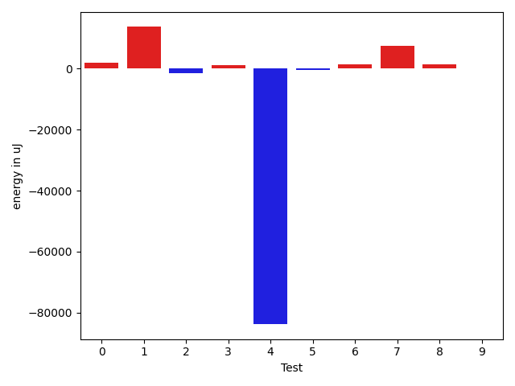

# gson 40cd66

https://github.com/google/gson/commit/40cd66

## Delta Energy per test method

| ID | EnergyV1 | EnergyV2 | DeltaEnergy | σV1 | σV2 |
| --- | --- | --- | --- | --- | --- |
| 0 | 39490 | 39673 | 183 | 13396.731227421056 | 14581.765492171613 |
| 1 | 70129 | 65613 | -4516 | 471393.9200722903 | 474981.27730421117 |
| 2 | 37109 | 36865 | -244 | 8196.311622242752 | 3779.101948963197 |
| 3 | 39611 | 40405 | 794 | 20084.993205326944 | 27215.80727700632 |
| 4 | 79163 | 81909 | 2746 | 524721.5273722452 | 421701.12218252406 |
| 5 | 39367 | 39917 | 550 | 22666.803288342 | 17493.9506628442 |
| 6 | 37476 | 37598 | 122 | 3573.4430660667795 | 7345.62541755617 |
| 7 | 120239 | 120789 | 550 | 478523.5438150538 | 482215.0436430032 |
| 8 | 36194 | 37598 | 1404 | 8036.906793930174 | 8030.312440769952 |
| 9 | 36682 | 38086 | 1404 | 50143.285002520766 | 44237.87167158844 |
| 10 | 35827 | 36560 | 733 | 4482.3486293322985 | 4303.733064631217 |
| 11 | 37048 | 35950 | -1098 | 7136.263002840792 | 5293.016982855568 |
| 12 | 42297 | 40283 | -2014 | 45461.31641045837 | 75612.66782587531 |
| 13 | 33813 | 33569 | -244 | 47897.48958724675 | 3721.842713042119 |
| 14 | 36071 | 36804 | 733 | 5666.447662001807 | 51742.347006086085 |

## Delta Duration per test method

| ID | DurationV1 | DurationsV2 | DeltaDuration |
| --- | --- | --- | --- |
| 0 | 1699976.224489796 | 1704065.707070707 | 4089.4825809111353 |
| 1 | 6593822.1707317075 | 7257494.011764706 | 663671.8410329986 |
| 2 | 1153842.7972972973 | 1094634.1176470588 | -59208.67965023848 |
| 3 | 1827500.030927835 | 1774233.0 | -53267.03092783503 |
| 4 | 8149121.444444444 | 5689304.020408163 | -2459817.424036281 |
| 5 | 1724742.53125 | 1654614.6288659794 | -70127.90238402062 |
| 6 | 1087050.5405405406 | 1147908.7246376812 | 60858.18409714056 |
| 7 | 8372472.797979798 | 8697488.949494949 | 325016.15151515044 |
| 8 | 1380547.4222222222 | 1363916.9130434783 | -16630.50917874393 |
| 9 | 1955559.1538461538 | 1994688.347826087 | 39129.19397993316 |
| 10 | 906964.9347826086 | 865338.38 | -41626.55478260864 |
| 11 | 1354110.7571428572 | 1321511.8732394367 | -32598.88390342053 |
| 12 | 1937192.5662650603 | 2071606.6823529413 | 134414.11608788092 |
| 13 | 1243726.3023255814 | 947867.6170212766 | -295858.6853043048 |
| 14 | 1145933.5918367347 | 1590782.4423076923 | 444848.8504709576 |

## Misc.

| ID | Test Class | Test Method |
| --- | --- | --- |
| 0 | com.google.gson.functional.StreamingTypeAdaptersTest | testNullSafe |
| 1 | com.google.gson.JsonParserTest | testReadWriteTwoObjects |
| 2 | com.google.gson.functional.CollectionTest | testFieldIsArrayList |
| 3 | com.google.gson.functional.CollectionTest | testWildcardCollectionField |
| 4 | com.google.gson.functional.TypeVariableTest | testAdvancedTypeVariables |
| 5 | com.google.gson.functional.TypeVariableTest | testTypeVariablesViaTypeParameter |
| 6 | com.google.gson.functional.TypeVariableTest | testBasicTypeVariables |
| 7 | com.google.gson.functional.MapAsArrayTypeAdapterTest | testSerializeComplexMapWithTypeAdapter |
| 8 | com.google.gson.functional.EscapingTest | testGsonAcceptsEscapedAndNonEscapedJsonDeserialization |
| 9 | com.google.gson.functional.EscapingTest | testEscapingObjectFields |
| 10 | com.google.gson.functional.EscapingTest | testGsonDoubleDeserialization |
| 11 | com.google.gson.functional.NamingPolicyTest | testComplexFieldNameStrategy |
| 12 | com.google.gson.functional.ReadersWritersTest | testReadWriteTwoObjects |
| 13 | com.google.gson.functional.DefaultTypeAdaptersTest | testBitSetDeserialization |
| 14 | com.google.gson.functional.UncategorizedTest | testGsonInstanceReusableForSerializationAndDeserialization |

| Test | IterationV1 | IterationV2 | DeltaIteration |
| --- | --- | --- | --- |
| 0 | 98 | 99 | 1 |
| 1 | 82 | 85 | 3 |
| 2 | 74 | 68 | -6 |
| 3 | 97 | 96 | -1 |
| 4 | 99 | 98 | -1 |
| 5 | 96 | 97 | 1 |
| 6 | 74 | 69 | -5 |
| 7 | 99 | 99 | 0 |
| 8 | 90 | 92 | 2 |
| 9 | 65 | 69 | 4 |
| 10 | 46 | 50 | 4 |
| 11 | 70 | 71 | 1 |
| 12 | 83 | 85 | 2 |
| 13 | 43 | 47 | 4 |
| 14 | 49 | 52 | 3 |

| Time Label | Time (s) |
| --- | --- |
| Selection | 27.170274019241333 |
| Injection | 11.173512935638428 |
| Total | 1113.4893925189972 |

