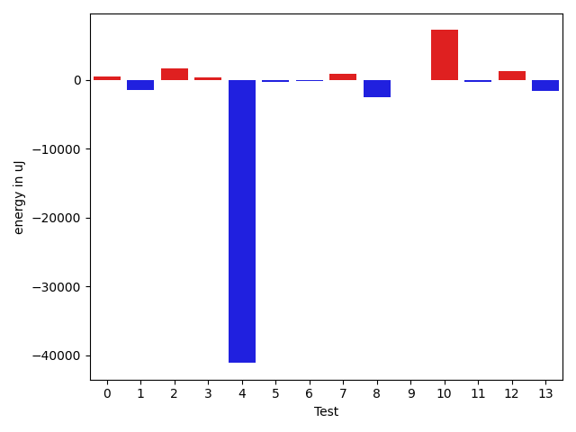
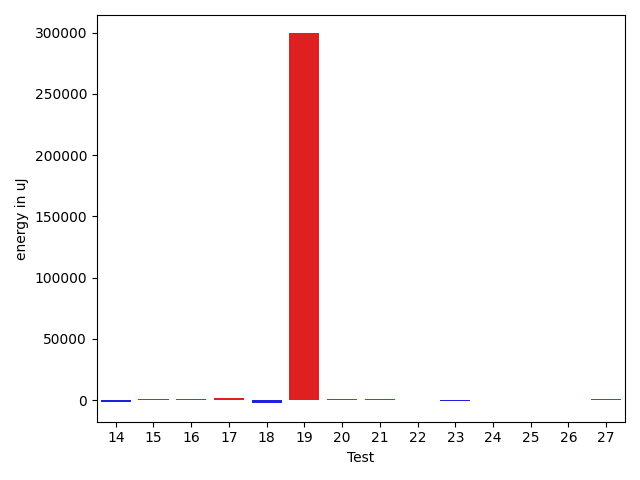
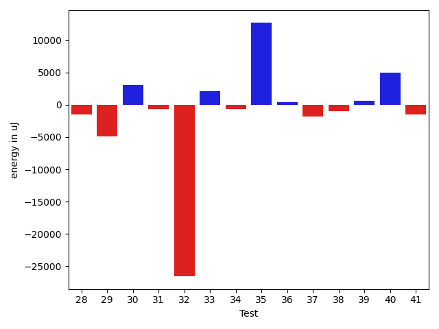
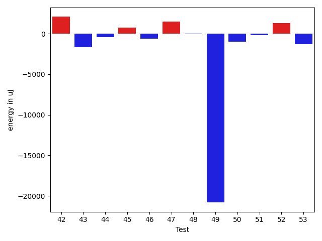

# gson 8e8bf9

https://github.com/google/gson/commit/8e8bf9

## Delta Energy per test method

| ID | EnergyV1 | EnergyV2 | DeltaEnergy | σV1 | σV2 |
| --- | --- | --- | --- | --- | --- |
| 0 | 36576.75862068965 | 37009.2 | 432.4413793103449 | 4162.5311402390935 | 5027.553870422475 |
| 1 | 36496.045454545456 | 35047.666666666664 | -1448.3787878787916 | 3730.0581335620045 | 3103.341299667541 |
| 2 | 34752.42307692308 | 36451.07142857143 | 1698.6483516483495 | 3901.263524838675 | 4186.681552670251 |
| 3 | 35395.77777777778 | 35703.379310344826 | 307.60153256704507 | 4403.264111940843 | 5127.291625005136 |
| 4 | 128433.20212765958 | 87345.02150537634 | -41088.18062228324 | 318694.2291828294 | 237451.95143271374 |
| 5 | 37545.84444444445 | 37211.811320754714 | -334.03312368973275 | 4883.865609014399 | 4838.094155629856 |
| 6 | 37523.875 | 37332.217391304344 | -191.65760869565565 | 5036.49251556825 | 4758.152171082363 |
| 7 | 37199.380952380954 | 38074.333333333336 | 874.9523809523816 | 4556.441755791781 | 4024.936099266 |
| 8 | 41807.63043478261 | 39329.72826086957 | -2477.9021739130403 | 12593.392482220495 | 9893.783368867083 |
| 9 | 36672.782608695656 | 36576.95744680851 | -95.82516188714362 | 3604.8148050666873 | 4009.276004878637 |
| 10 | 58965.37755102041 | 66173.65656565657 | 7208.2790146361585 | 55531.88111686714 | 53320.49585104441 |
| 11 | 38835.166666666664 | 38532.125 | -303.04166666666424 | 3322.2426704127306 | 5666.045433931412 |
| 12 | 78698.54 | 79963.16 | 1264.62000000001 | 37576.75084155627 | 42211.12593398097 |
| 13 | 39099.515625 | 37481.566666666666 | -1617.9489583333343 | 8478.069392541905 | 7457.014892852381 |
| 14 | 46471.69135802469 | 46515.72093023256 | 44.029572207866295 | 14066.569917731158 | 18829.10719557848 |
| 15 | 35454.57777777778 | 35938.62 | 484.042222222226 | 3794.448368568005 | 4187.648103124235 |
| 16 | 34541.0 | 35620.1 | 1079.0999999999985 | 3280.7824859322814 | 3929.103074494228 |
| 17 | 35004.087719298244 | 35777.03448275862 | 772.9467634603789 | 3304.595961080497 | 4114.264936088605 |
| 18 | 112576.29292929293 | 111330.28282828283 | -1246.0101010101062 | 23832.887478454155 | 24794.259526256512 |
| 19 | 289627.7272727273 | 341397.10101010103 | 51769.37373737374 | 232255.56496055776 | 262581.165938277 |
| 20 | 34318.186440677964 | 34864.934426229505 | 546.7479855515412 | 3452.377787694836 | 4014.8271173968783 |
| 21 | 39685.88172043011 | 36985.25274725275 | -2700.6289731773577 | 12477.686087744374 | 7881.6589019069415 |
| 22 | 39898.88421052632 | 39743.0 | -155.88421052631747 | 11416.876960621117 | 11332.263798363456 |
| 23 | 41216.9175257732 | 39751.44086021505 | -1465.476665558148 | 11168.643723943089 | 12119.84960024356 |
| 24 | 40063.64893617021 | 39995.26315789474 | -68.38577827547124 | 11862.497437802069 | 10726.635496655806 |
| 25 | 46962.9898989899 | 46900.41836734694 | -62.57153164296324 | 16237.118891256136 | 17626.699166566672 |
| 26 | 38530.03333333333 | 40775.395604395606 | 2245.362271062273 | 11330.823162653865 | 12744.714863126528 |
| 27 | 40356.4606741573 | 40293.211764705884 | -63.248909451416694 | 12224.47020249138 | 10944.845734106579 |
| 28 | 82974.81052631579 | 81510.96875 | -1463.8417763157922 | 29741.69594827923 | 26580.524678344987 |
| 29 | 48144.68965517241 | 43210.46835443038 | -4934.221300742036 | 21960.994191274756 | 17218.98782867144 |
| 30 | 35766.56896551724 | 38805.40350877193 | 3038.834543254692 | 4587.871853244757 | 10214.306119548568 |
| 31 | 37553.555555555555 | 36857.0 | -696.5555555555547 | 6981.245255753995 | 3515.4623834185413 |
| 32 | 114275.36363636363 | 87688.83838383839 | -26586.525252525244 | 257583.0065283636 | 143749.28002754843 |
| 33 | 43010.541666666664 | 45135.7311827957 | 2125.1895161290377 | 15299.482522510267 | 15998.735475662144 |
| 34 | 37530.93421052631 | 36879.25675675676 | -651.6774537695528 | 8924.052620123011 | 7155.5257556297975 |
| 35 | 160341.40404040404 | 173018.18181818182 | 12676.777777777781 | 311476.74494166154 | 337726.75305354194 |
| 36 | 37513.269841269845 | 37966.522388059704 | 453.2525467898595 | 4695.092200208163 | 4675.908781837596 |
| 37 | 49867.53684210526 | 48075.275862068964 | -1792.2609800362989 | 25318.205730393638 | 21812.579817429116 |
| 38 | 42145.163636363635 | 41156.22580645161 | -988.9378299120217 | 12880.868318787765 | 11631.655764334639 |
| 39 | 37729.54838709677 | 38342.529411764706 | 612.9810246679335 | 4797.522847623046 | 4502.059549840652 |
| 40 | 36284.36363636364 | 41232.1 | 4947.736363636359 | 4444.737165888349 | 22310.85118703452 |
| 41 | 41990.27272727273 | 40448.78571428572 | -1541.4870129870105 | 25182.640205377564 | 9982.209447516196 |
| 42 | 38841.59259259259 | 40247.25 | 1405.6574074074088 | 9785.778264472714 | 9096.602479085253 |
| 43 | 36785.63636363636 | 36481.26315789474 | -304.37320574162004 | 4488.076484913695 | 4117.826583630396 |
| 44 | 56104.87096774193 | 53337.709677419356 | -2767.161290322576 | 45124.499147067254 | 45092.71545146378 |
| 45 | 47590.575 | 48404.0 | 813.4250000000029 | 41864.276229792566 | 44113.146447814346 |
| 46 | 38328.95161290323 | 38951.0350877193 | 622.0834748160705 | 4538.320385011785 | 7952.161153819299 |
| 47 | 243275.0 | 230033.50505050505 | -13241.494949494954 | 403273.615661134 | 382652.4815540627 |
| 48 | 37935.94736842105 | 38111.770491803276 | 175.82312338222255 | 6618.904468690492 | 6262.1309037357805 |
| 49 | 205109.101010101 | 188031.57575757575 | -17077.525252525258 | 59376.96873801364 | 56824.13792083678 |
| 50 | 38391.13043478261 | 37116.875 | -1274.255434782608 | 4603.077111675432 | 3464.2133945108426 |
| 51 | 142897.22077922078 | 74847.30136986301 | -68049.91940935777 | 364000.8297524303 | 178718.13792165348 |
| 52 | 38765.92857142857 | 40294.4375 | 1528.5089285714275 | 4190.184669716424 | 4770.714070880139 |
| 53 | 39224.05 | 37722.820512820515 | -1501.2294871794875 | 8341.929383991452 | 6791.300781228711 |

## Delta Duration per test method

| ID | DurationV1 | DurationsV2 | DeltaDuration |
| --- | --- | --- | --- |
| 0 | 613297.5172413794 | 538930.2 | -74367.31724137941 |
| 1 | 653206.5454545454 | 536947.1666666666 | -116259.37878787878 |
| 2 | 535731.3846153846 | 510256.6785714286 | -25474.706043956045 |
| 3 | 529670.6666666666 | 500774.0344827586 | -28896.63218390802 |
| 4 | 3907384.340425532 | 2655605.3440860217 | -1251778.9963395102 |
| 5 | 895628.0222222222 | 829284.1132075472 | -66343.90901467495 |
| 6 | 533086.75 | 509246.8695652174 | -23839.880434782594 |
| 7 | 544641.1428571428 | 519913.71428571426 | -24727.42857142858 |
| 8 | 1467492.7173913044 | 1428855.6304347827 | -38637.08695652173 |
| 9 | 762953.8913043478 | 769849.5531914893 | 6895.661887141527 |
| 10 | 2007847.6224489796 | 2221317.6868686867 | 213470.06441970705 |
| 11 | 520548.3888888889 | 551760.6875 | 31212.298611111124 |
| 12 | 2317588.62 | 2356902.98 | 39314.35999999987 |
| 13 | 1177274.96875 | 1119280.9166666667 | -57994.052083333256 |
| 14 | 1518578.851851852 | 1422209.2906976745 | -96369.56115417741 |
| 15 | 794231.7555555556 | 776353.7 | -17878.05555555562 |
| 16 | 845563.68 | 852272.16 | 6708.479999999981 |
| 17 | 839911.052631579 | 841561.1896551724 | 1650.1370235934155 |
| 18 | 3602688.1616161615 | 3605097.595959596 | 2409.4343434344046 |
| 19 | 9145309.202020202 | 10399383.414141415 | 1254074.2121212129 |
| 20 | 946902.3389830509 | 943595.8032786886 | -3306.5357043623226 |
| 21 | 1344827.1935483871 | 1383066.5604395603 | 38239.36689117318 |
| 22 | 1386489.7684210527 | 1365015.311827957 | -21474.45659309579 |
| 23 | 1367090.412371134 | 1355170.6129032257 | -11919.799467908219 |
| 24 | 1371258.0319148935 | 1400437.0736842104 | 29179.041769316886 |
| 25 | 1686557.8484848484 | 1706774.9795918367 | 20217.131106988294 |
| 26 | 1343755.7666666666 | 1354297.2747252746 | 10541.508058608044 |
| 27 | 1407594.3146067415 | 1353814.0352941176 | -53780.2793126239 |
| 28 | 2496366.347368421 | 2451582.4375 | -44783.90986842103 |
| 29 | 1445567.2298850575 | 1366332.9240506329 | -79234.30583442468 |
| 30 | 941839.0172413794 | 998343.298245614 | 56504.28100423468 |
| 31 | 1001078.3888888889 | 1019902.8846153846 | 18824.49572649575 |
| 32 | 3557290.474747475 | 2786632.878787879 | -770657.5959595959 |
| 33 | 1398431.0833333333 | 1472700.0752688171 | 74268.99193548388 |
| 34 | 1099624.9078947369 | 1160790.7972972973 | 61165.889402560424 |
| 35 | 4857502.96969697 | 5068929.909090909 | 211426.93939393945 |
| 36 | 1054174.0793650793 | 945666.5223880596 | -108507.55697701965 |
| 37 | 1727994.9684210527 | 1616102.287356322 | -111892.68106473074 |
| 38 | 1201355.8909090909 | 1194515.3387096773 | -6840.552199413534 |
| 39 | 712496.5483870967 | 656316.7058823529 | -56179.842504743836 |
| 40 | 647167.7878787878 | 966742.9 | 319575.1121212122 |
| 41 | 772085.5454545454 | 714880.6428571428 | -57204.90259740257 |
| 42 | 1181690.888888889 | 1188973.8125 | 7282.923611111008 |
| 43 | 840440.7878787878 | 767393.7368421053 | -73047.05103668256 |
| 44 | 1498999.435483871 | 1415444.7096774194 | -83554.72580645164 |
| 45 | 1090974.525 | 1053616.8157894737 | -37357.7092105262 |
| 46 | 1013769.4838709678 | 1038644.8070175438 | 24875.323146576062 |
| 47 | 7087525.303030303 | 6690212.656565657 | -397312.64646464586 |
| 48 | 944145.947368421 | 883508.5573770492 | -60637.389991371776 |
| 49 | 5912468.585858586 | 5523850.05050505 | -388618.5353535358 |
| 50 | 572896.8260869565 | 526451.4166666666 | -46445.409420289914 |
| 51 | 4061344.285714286 | 2187091.6438356163 | -1874252.6418786696 |
| 52 | 542008.7857142857 | 592305.3125 | 50296.52678571432 |
| 53 | 995139.35 | 1062079.7692307692 | 66940.41923076927 |

## Misc.

| ID | Test Class | Test Method |
| --- | --- | --- |
| 0 | com.google.gson.functional.TypeAdapterPrecedenceTest | testStreamingFollowedByNonstreaming |
| 1 | com.google.gson.functional.TypeAdapterPrecedenceTest | testSerializeNonstreamingTypeAdapterFollowedByStreamingTypeAdapter |
| 2 | com.google.gson.functional.TypeAdapterPrecedenceTest | testNonstreamingHierarchicalFollowedByNonstreaming |
| 3 | com.google.gson.functional.TypeAdapterPrecedenceTest | testStreamingHierarchicalFollowedByNonstreamingHierarchical |
| 4 | com.google.gson.functional.TypeAdapterPrecedenceTest | testNonstreamingFollowedByNonstreaming |
| 5 | com.google.gson.functional.TypeAdapterPrecedenceTest | testStreamingFollowedByStreaming |
| 6 | com.google.gson.functional.TypeAdapterPrecedenceTest | testStreamingFollowedByNonstreamingHierarchical |
| 7 | com.google.gson.functional.TypeAdapterPrecedenceTest | testStreamingHierarchicalFollowedByNonstreaming |
| 8 | com.google.gson.functional.StreamingTypeAdaptersTest | testNullSafe |
| 9 | com.google.gson.functional.CustomDeserializerTest | testDefaultConstructorNotCalledOnField |
| 10 | com.google.gson.functional.CustomDeserializerTest | testDefaultConstructorNotCalledOnObject |
| 11 | com.google.gson.functional.StringTest | testEscapingQuotesInStringSerialization |
| 12 | com.google.gson.functional.StringTest | testSingleQuoteInStringSerialization |
| 13 | com.google.gson.functional.ReadersWritersTest | testReadWriteTwoObjects |
| 14 | com.google.gson.functional.ReadersWritersTest | testReadWriteTwoStrings |
| 15 | com.google.gson.functional.DefaultTypeAdaptersTest | testBitSetDeserialization |
| 16 | com.google.gson.functional.DefaultTypeAdaptersTest | testSqlDateSerialization |
| 17 | com.google.gson.functional.DefaultTypeAdaptersTest | testTimestampSerialization |
| 18 | com.google.gson.functional.DefaultTypeAdaptersTest | testDefaultDateDeserializationUsingBuilder |
| 19 | com.google.gson.functional.DefaultTypeAdaptersTest | testNullSerialization |
| 20 | com.google.gson.functional.DefaultTypeAdaptersTest | testDateDeserializationWithPattern |
| 21 | com.google.gson.functional.DefaultTypeAdaptersTest | testDateSerializationInCollection |
| 22 | com.google.gson.functional.ParameterizedTypesTest | testVariableTypeArrayDeserialization |
| 23 | com.google.gson.functional.ParameterizedTypesTest | testVariableTypeDeserialization |
| 24 | com.google.gson.functional.ParameterizedTypesTest | testParameterizedTypeGenericArraysDeserialization |
| 25 | com.google.gson.functional.ParameterizedTypesTest | testVariableTypeFieldsAndGenericArraysDeserialization |
| 26 | com.google.gson.functional.ParameterizedTypesTest | testParameterizedTypeWithVariableTypeDeserialization |
| 27 | com.google.gson.functional.ObjectTest | testSingletonLists |
| 28 | com.google.gson.functional.EnumTest | testEnumSubclass |
| 29 | com.google.gson.functional.EnumTest | testEnumSubclassWithRegisteredTypeAdapter |
| 30 | com.google.gson.functional.EnumTest | testEnumSubclassAsParameterizedType |
| 31 | com.google.gson.functional.TypeVariableTest | testBasicTypeVariables |
| 32 | com.google.gson.functional.TypeVariableTest | testAdvancedTypeVariables |
| 33 | com.google.gson.functional.TypeVariableTest | testTypeVariablesViaTypeParameter |
| 34 | com.google.gson.functional.MapAsArrayTypeAdapterTest | testMultipleEnableComplexKeyRegistrationHasNoEffect |
| 35 | com.google.gson.functional.MapAsArrayTypeAdapterTest | testSerializeComplexMapWithTypeAdapter |
| 36 | com.google.gson.functional.CollectionTest | testFieldIsArrayList |
| 37 | com.google.gson.functional.CollectionTest | testWildcardCollectionField |
| 38 | com.google.gson.functional.ExclusionStrategyFunctionalTest | testExclusionStrategyWithMode |
| 39 | com.google.gson.GsonTypeAdapterTest | testTypeAdapterProperlyConvertsTypes |
| 40 | com.google.gson.GsonTypeAdapterTest | testTypeAdapterThrowsException |
| 41 | com.google.gson.GsonTypeAdapterTest | testTypeAdapterDoesNotAffectNonAdaptedTypes |
| 42 | com.google.gson.functional.EscapingTest | testGsonAcceptsEscapedAndNonEscapedJsonDeserialization |
| 43 | com.google.gson.functional.EscapingTest | testGsonDoubleDeserialization |
| 44 | com.google.gson.functional.EscapingTest | testEscapingObjectFields |
| 45 | com.google.gson.functional.EscapingTest | testEscapingQuotesInStringArray |
| 46 | com.google.gson.functional.NamingPolicyTest | testComplexFieldNameStrategy |
| 47 | com.google.gson.functional.TypeHierarchyAdapterTest | testTypeHierarchy |
| 48 | com.google.gson.functional.TypeHierarchyAdapterTest | testRegisterSuperTypeFirst |
| 49 | com.google.gson.DefaultInetAddressTypeAdapterTest | testInetAddressSerializationAndDeserialization |
| 50 | com.google.gson.JsonParserTest | testParseMixedArray |
| 51 | com.google.gson.JsonParserTest | testReadWriteTwoObjects |
| 52 | com.google.gson.functional.PrimitiveTest | testQuotedStringSerializationAndDeserialization |
| 53 | com.google.gson.functional.UncategorizedTest | testGsonInstanceReusableForSerializationAndDeserialization |

| Test | IterationV1 | IterationV2 | DeltaIteration |
| --- | --- | --- | --- |
| 0 | 29 | 25 | -4 |
| 1 | 22 | 18 | -4 |
| 2 | 26 | 28 | 2 |
| 3 | 27 | 29 | 2 |
| 4 | 94 | 93 | -1 |
| 5 | 45 | 53 | 8 |
| 6 | 24 | 23 | -1 |
| 7 | 21 | 21 | 0 |
| 8 | 92 | 92 | 0 |
| 9 | 46 | 47 | 1 |
| 10 | 98 | 99 | 1 |
| 11 | 18 | 16 | -2 |
| 12 | 50 | 50 | 0 |
| 13 | 64 | 60 | -4 |
| 14 | 81 | 86 | 5 |
| 15 | 45 | 50 | 5 |
| 16 | 50 | 50 | 0 |
| 17 | 57 | 58 | 1 |
| 18 | 99 | 99 | 0 |
| 19 | 99 | 99 | 0 |
| 20 | 59 | 61 | 2 |
| 21 | 93 | 91 | -2 |
| 22 | 95 | 93 | -2 |
| 23 | 97 | 93 | -4 |
| 24 | 94 | 95 | 1 |
| 25 | 99 | 98 | -1 |
| 26 | 90 | 91 | 1 |
| 27 | 89 | 85 | -4 |
| 28 | 95 | 96 | 1 |
| 29 | 87 | 79 | -8 |
| 30 | 58 | 57 | -1 |
| 31 | 54 | 52 | -2 |
| 32 | 99 | 99 | 0 |
| 33 | 96 | 93 | -3 |
| 34 | 76 | 74 | -2 |
| 35 | 99 | 99 | 0 |
| 36 | 63 | 67 | 4 |
| 37 | 95 | 87 | -8 |
| 38 | 55 | 62 | 7 |
| 39 | 31 | 34 | 3 |
| 40 | 33 | 20 | -13 |
| 41 | 33 | 28 | -5 |
| 42 | 81 | 80 | -1 |
| 43 | 33 | 38 | 5 |
| 44 | 62 | 62 | 0 |
| 45 | 40 | 38 | -2 |
| 46 | 62 | 57 | -5 |
| 47 | 99 | 99 | 0 |
| 48 | 57 | 61 | 4 |
| 49 | 99 | 99 | 0 |
| 50 | 23 | 24 | 1 |
| 51 | 77 | 73 | -4 |
| 52 | 28 | 16 | -12 |
| 53 | 40 | 39 | -1 |

| Time Label | Time (s) |
| --- | --- |
| Selection | 27.141947984695435 |
| Injection | 13.46809983253479 |
| Total | 1145.5736179351807 |

