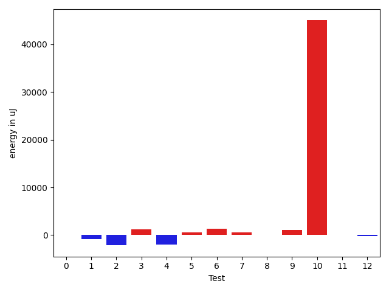
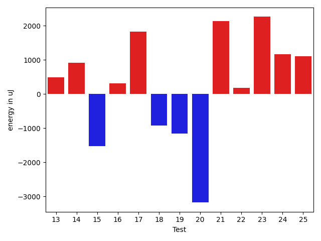
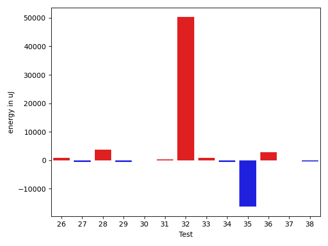
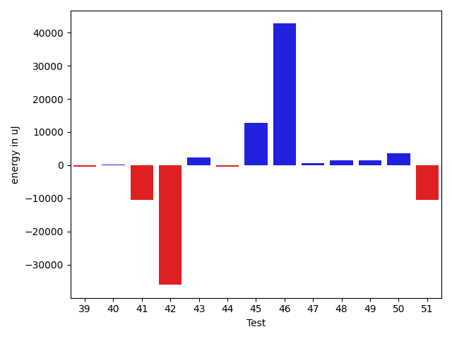
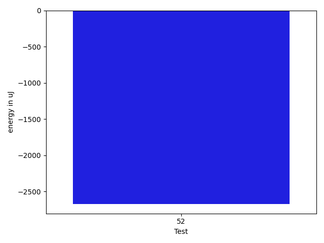

# gson 61a549

https://github.com/google/gson/commit/61a549

## Delta Energy per test method

| ID | EnergyV1 | EnergyV2 | DeltaEnergy | σV1 | σV2 |
| --- | --- | --- | --- | --- | --- |
| 0 | 38269 | 38330 | 61 | 12631.758229304842 | 14606.428328655169 |
| 1 | 37110 | 36316 | -794 | 4967.022987199867 | 4426.9840991039055 |
| 2 | 45349 | 43213 | -2136 | 43700.67303911029 | 54727.20298715313 |
| 3 | 37659 | 38880 | 1221 | 3762.2378219048605 | 3973.3554541743924 |
| 4 | 95397 | 93444 | -1953 | 40060.21082939979 | 37474.451296188454 |
| 5 | 36499 | 37110 | 611 | 9255.330131482435 | 10452.818660594414 |
| 6 | 38818 | 40161 | 1343 | 12959.621957173485 | 16538.155483586695 |
| 7 | 33753 | 34363 | 610 | 3614.6739726236974 | 4222.514893560823 |
| 8 | 34241 | 34240 | -1 | 3298.5500020629056 | 2500.1607434434195 |
| 9 | 102172 | 103271 | 1099 | 21644.271326274375 | 25554.83704699603 |
| 10 | 132568 | 177551 | 44983 | 247048.66594057463 | 245619.2966744306 |
| 11 | 34302 | 34424 | 122 | 3264.4112517974318 | 5339.5134335130815 |
| 12 | 35340 | 35156 | -184 | 10605.680970562275 | 10165.288378658975 |
| 13 | 34485 | 34973 | 488 | 2737.2364717903056 | 3160.8585301245193 |
| 14 | 34729 | 35644 | 915 | 9512.981141939501 | 7829.441337210228 |
| 15 | 73669 | 72144 | -1525 | 27202.702856001488 | 26581.101648936234 |
| 16 | 38940 | 39246 | 306 | 48099.64938384571 | 24036.05561510751 |
| 17 | 34851 | 36682 | 1831 | 4727.619854380039 | 14659.439154018697 |
| 18 | 40161 | 39245 | -916 | 359367.9516205829 | 380262.0805403958 |
| 19 | 36682 | 35523 | -1159 | 4700.166323978837 | 4342.865756079387 |
| 20 | 37170 | 33996 | -3174 | 4799.427082614095 | 8805.726358030937 |
| 21 | 34545 | 36682 | 2137 | 4086.685573937506 | 3496.9340191714764 |
| 22 | 34790 | 34973 | 183 | 3271.229579880586 | 4188.87247398459 |
| 23 | 34607 | 36865 | 2258 | 2940.624718388934 | 5412.438910783471 |
| 24 | 34546 | 35706 | 1160 | 3668.2889100156426 | 4968.956659496098 |
| 25 | 36987 | 38086 | 1099 | 13615.406201462227 | 14523.091557341859 |
| 26 | 36987 | 37231 | 244 | 13535.362736033749 | 14926.25780808315 |
| 27 | 36621 | 37232 | 611 | 17822.57466838288 | 11839.565731843442 |
| 28 | 38880 | 38330 | -550 | 20866.18947496114 | 54669.86867274542 |
| 29 | 36865 | 36255 | -610 | 9473.063224799766 | 9548.31018781967 |
| 30 | 37781 | 36438 | -1343 | 9289.903907654398 | 12654.669394921235 |
| 31 | 36011 | 36499 | 488 | 3577.5902598816424 | 4221.000233283776 |
| 32 | 118896 | 124938 | 6042 | 289525.0191726191 | 387972.1065816996 |
| 33 | 37476 | 37171 | -305 | 3935.353349840089 | 5522.278804192204 |
| 34 | 37170 | 37781 | 611 | 15530.675867415104 | 13862.464707810112 |
| 35 | 74646 | 72448 | -2198 | 291295.2796343328 | 271908.2258482198 |
| 36 | 38635 | 37903 | -732 | 12377.068612310326 | 15846.379222544121 |
| 37 | 37536 | 36072 | -1464 | 3661.548975822084 | 4481.795386407086 |
| 38 | 36743 | 35156 | -1587 | 4027.339924733014 | 4486.3775889628705 |
| 39 | 37293 | 36865 | -428 | 8783.779328119426 | 9073.547197541915 |
| 40 | 37658 | 38391 | 733 | 48666.99693642253 | 51686.0092639142 |
| 41 | 38757 | 38269 | -488 | 73745.60514490648 | 72733.77923557864 |
| 42 | 91796 | 96191 | 4395 | 412658.3485447614 | 348586.58858736255 |
| 43 | 35583 | 37293 | 1710 | 5078.109539053535 | 8655.696384656352 |
| 44 | 37842 | 36987 | -855 | 4248.509278260502 | 5114.461746717522 |
| 45 | 178222 | 187194 | 8972 | 52810.57256901537 | 65432.13761867989 |
| 46 | 39428 | 39490 | 62 | 314726.4463289486 | 415001.66857958236 |
| 47 | 38330 | 38086 | -244 | 4084.326760418732 | 3224.720850308483 |
| 48 | 37231 | 38574 | 1343 | 6818.2915153851545 | 6257.779513638973 |
| 49 | 35095 | 35766 | 671 | 4308.195593228206 | 6227.752542321753 |
| 50 | 35461 | 37902 | 2441 | 14073.648983798896 | 22986.572326300025 |
| 51 | 39062 | 38513 | -549 | 35189.54904919519 | 20966.778290411872 |
| 52 | 38818 | 36255 | -2563 | 5418.270030973394 | 4511.795280566219 |

## Delta Duration per test method

| ID | DurationV1 | DurationsV2 | DeltaDuration |
| --- | --- | --- | --- |
| 0 | 1494091.5326086956 | 1472961.2783505155 | -21130.254258180037 |
| 1 | 798750.2727272727 | 856959.5476190476 | 58209.27489177487 |
| 2 | 1947424.6326530613 | 2160288.595959596 | 212863.96330653457 |
| 3 | 513877.4761904762 | 549762.7391304348 | 35885.2629399586 |
| 4 | 2511958.2448979593 | 2319926.62 | -192031.62489795918 |
| 5 | 1119923.0597014925 | 1112640.7826086956 | -7282.277092796983 |
| 6 | 1379133.0131578948 | 1525080.1866666668 | 145947.17350877193 |
| 7 | 814176.387755102 | 816545.0454545454 | 2368.6576994434 |
| 8 | 858411.431372549 | 829534.0416666666 | -28877.389705882408 |
| 9 | 3533070.6767676766 | 3580828.4242424243 | 47757.74747474771 |
| 10 | 9558990.141414141 | 9772541.292929294 | 213551.1515151523 |
| 11 | 947509.3968253968 | 951523.6833333333 | 4014.286507936544 |
| 12 | 1367388.1290322582 | 1355510.574468085 | -11877.5545641731 |
| 13 | 846927.725490196 | 819007.046875 | -27920.678615196026 |
| 14 | 1071842.3448275863 | 1027543.6666666666 | -44298.67816091969 |
| 15 | 2492010.6631578947 | 2524263.494845361 | 32252.83168746624 |
| 16 | 1808655.4777777777 | 1602120.1022727273 | -206535.3755050504 |
| 17 | 652168.6666666666 | 772228.4545454546 | 120059.78787878796 |
| 18 | 4265820.072164948 | 4811696.053763441 | 545875.9815984927 |
| 19 | 924589.5744680851 | 920389.5862068966 | -4199.988261188497 |
| 20 | 622936.3157894737 | 631223.4736842106 | 8287.157894736854 |
| 21 | 604644.3548387097 | 607083.1071428572 | 2438.7523041474633 |
| 22 | 625111.3214285715 | 518118.5909090909 | -106992.7305194806 |
| 23 | 596563.6 | 626356.6296296297 | 29793.029629629687 |
| 24 | 490172.5625 | 548573.5 | 58400.9375 |
| 25 | 1375385.6041666667 | 1392245.494623656 | 16859.890456989175 |
| 26 | 1357888.0842105264 | 1379481.3736263737 | 21593.289415847277 |
| 27 | 1419125.2315789473 | 1374190.7083333333 | -44934.52324561402 |
| 28 | 1653244.5656565656 | 1835628.3979591837 | 182383.83230261807 |
| 29 | 1367508.8636363635 | 1339095.2857142857 | -28413.57792207785 |
| 30 | 1364457.802197802 | 1292772.4166666667 | -71685.38553113537 |
| 31 | 916807.22 | 915038.775862069 | -1768.4441379309865 |
| 32 | 5611136.262626262 | 6989018.02020202 | 1377881.7575757578 |
| 33 | 1028064.5492957747 | 1002915.1515151515 | -25149.39778062317 |
| 34 | 1506923.1489361702 | 1495117.808988764 | -11805.339947406203 |
| 35 | 4078406.1818181816 | 3589948.737373737 | -488457.4444444445 |
| 36 | 1451387.706521739 | 1425656.120879121 | -25731.585642618127 |
| 37 | 998370.53125 | 997607.0909090909 | -763.4403409090592 |
| 38 | 803974.9056603773 | 767146.4523809524 | -36828.453279424924 |
| 39 | 1224152.6341463414 | 1221539.5882352942 | -2613.045911047142 |
| 40 | 1750084.2253521127 | 1698355.9824561405 | -51728.24289597222 |
| 41 | 2255996.5945945946 | 1738889.894736842 | -517106.69985775254 |
| 42 | 6358303.636363637 | 5361773.313131313 | -996530.3232323239 |
| 43 | 1144113.4430379746 | 1217871.8846153845 | 73758.44157740986 |
| 44 | 1046398.3636363636 | 1136413.4193548388 | 90015.05571847514 |
| 45 | 5476956.191919192 | 5946737.232323232 | 469781.04040404037 |
| 46 | 3799796.4625 | 5087894.7 | 1288098.2375000003 |
| 47 | 608993.2631578947 | 553460.3333333334 | -55532.929824561346 |
| 48 | 1094635.1276595744 | 942263.5348837209 | -152371.59277585347 |
| 49 | 665785.3225806452 | 697592.3333333334 | 31807.010752688162 |
| 50 | 866043.2857142857 | 921962.4666666667 | 55919.18095238099 |
| 51 | 1485478.607142857 | 900841.0 | -584637.607142857 |
| 52 | 614798.2608695652 | 672680.5789473684 | 57882.31807780324 |

## Misc.

| ID | Test Class | Test Method |
| --- | --- | --- |
| 0 | com.google.gson.functional.StreamingTypeAdaptersTest | testNullSafe |
| 1 | com.google.gson.functional.CustomDeserializerTest | testDefaultConstructorNotCalledOnField |
| 2 | com.google.gson.functional.CustomDeserializerTest | testDefaultConstructorNotCalledOnObject |
| 3 | com.google.gson.functional.StringTest | testEscapingQuotesInStringSerialization |
| 4 | com.google.gson.functional.StringTest | testSingleQuoteInStringSerialization |
| 5 | com.google.gson.functional.ReadersWritersTest | testReadWriteTwoObjects |
| 6 | com.google.gson.functional.ReadersWritersTest | testReadWriteTwoStrings |
| 7 | com.google.gson.functional.DefaultTypeAdaptersTest | testBitSetDeserialization |
| 8 | com.google.gson.functional.DefaultTypeAdaptersTest | testSqlDateSerialization |
| 9 | com.google.gson.functional.DefaultTypeAdaptersTest | testDefaultDateDeserializationUsingBuilder |
| 10 | com.google.gson.functional.DefaultTypeAdaptersTest | testNullSerialization |
| 11 | com.google.gson.functional.DefaultTypeAdaptersTest | testDateDeserializationWithPattern |
| 12 | com.google.gson.functional.DefaultTypeAdaptersTest | testDateSerializationInCollection |
| 13 | com.google.gson.functional.DefaultTypeAdaptersTest | testTimestampSerialization |
| 14 | com.google.gson.functional.EnumTest | testEnumSubclassAsParameterizedType |
| 15 | com.google.gson.functional.EnumTest | testEnumSubclass |
| 16 | com.google.gson.functional.EnumTest | testEnumSubclassWithRegisteredTypeAdapter |
| 17 | com.google.gson.functional.TypeAdapterPrecedenceTest | testSerializeNonstreamingTypeAdapterFollowedByStreamingTypeAdapter |
| 18 | com.google.gson.functional.TypeAdapterPrecedenceTest | testNonstreamingFollowedByNonstreaming |
| 19 | com.google.gson.functional.TypeAdapterPrecedenceTest | testStreamingFollowedByStreaming |
| 20 | com.google.gson.functional.TypeAdapterPrecedenceTest | testStreamingFollowedByNonstreaming |
| 21 | com.google.gson.functional.TypeAdapterPrecedenceTest | testStreamingFollowedByNonstreamingHierarchical |
| 22 | com.google.gson.functional.TypeAdapterPrecedenceTest | testStreamingHierarchicalFollowedByNonstreaming |
| 23 | com.google.gson.functional.TypeAdapterPrecedenceTest | testNonstreamingHierarchicalFollowedByNonstreaming |
| 24 | com.google.gson.functional.TypeAdapterPrecedenceTest | testStreamingHierarchicalFollowedByNonstreamingHierarchical |
| 25 | com.google.gson.functional.ParameterizedTypesTest | testVariableTypeArrayDeserialization |
| 26 | com.google.gson.functional.ParameterizedTypesTest | testVariableTypeDeserialization |
| 27 | com.google.gson.functional.ParameterizedTypesTest | testParameterizedTypeGenericArraysDeserialization |
| 28 | com.google.gson.functional.ParameterizedTypesTest | testVariableTypeFieldsAndGenericArraysDeserialization |
| 29 | com.google.gson.functional.ParameterizedTypesTest | testParameterizedTypeWithVariableTypeDeserialization |
| 30 | com.google.gson.functional.ObjectTest | testSingletonLists |
| 31 | com.google.gson.functional.TypeHierarchyAdapterTest | testRegisterSuperTypeFirst |
| 32 | com.google.gson.functional.TypeHierarchyAdapterTest | testTypeHierarchy |
| 33 | com.google.gson.functional.CollectionTest | testFieldIsArrayList |
| 34 | com.google.gson.functional.CollectionTest | testWildcardCollectionField |
| 35 | com.google.gson.functional.TypeVariableTest | testAdvancedTypeVariables |
| 36 | com.google.gson.functional.TypeVariableTest | testTypeVariablesViaTypeParameter |
| 37 | com.google.gson.functional.TypeVariableTest | testBasicTypeVariables |
| 38 | com.google.gson.functional.EscapingTest | testGsonDoubleDeserialization |
| 39 | com.google.gson.functional.EscapingTest | testGsonAcceptsEscapedAndNonEscapedJsonDeserialization |
| 40 | com.google.gson.functional.EscapingTest | testEscapingObjectFields |
| 41 | com.google.gson.functional.EscapingTest | testEscapingQuotesInStringArray |
| 42 | com.google.gson.functional.MapAsArrayTypeAdapterTest | testSerializeComplexMapWithTypeAdapter |
| 43 | com.google.gson.functional.MapAsArrayTypeAdapterTest | testMultipleEnableComplexKeyRegistrationHasNoEffect |
| 44 | com.google.gson.functional.NamingPolicyTest | testComplexFieldNameStrategy |
| 45 | com.google.gson.DefaultInetAddressTypeAdapterTest | testInetAddressSerializationAndDeserialization |
| 46 | com.google.gson.JsonParserTest | testReadWriteTwoObjects |
| 47 | com.google.gson.JsonParserTest | testParseMixedArray |
| 48 | com.google.gson.functional.UncategorizedTest | testGsonInstanceReusableForSerializationAndDeserialization |
| 49 | com.google.gson.GsonTypeAdapterTest | testTypeAdapterProperlyConvertsTypes |
| 50 | com.google.gson.GsonTypeAdapterTest | testTypeAdapterThrowsException |
| 51 | com.google.gson.GsonTypeAdapterTest | testTypeAdapterDoesNotAffectNonAdaptedTypes |
| 52 | com.google.gson.functional.PrimitiveTest | testQuotedStringSerializationAndDeserialization |

| Test | IterationV1 | IterationV2 | DeltaIteration |
| --- | --- | --- | --- |
| 0 | 92 | 97 | 5 |
| 1 | 44 | 42 | -2 |
| 2 | 98 | 99 | 1 |
| 3 | 21 | 23 | 2 |
| 4 | 49 | 50 | 1 |
| 5 | 67 | 69 | 2 |
| 6 | 76 | 75 | -1 |
| 7 | 49 | 44 | -5 |
| 8 | 51 | 48 | -3 |
| 9 | 99 | 99 | 0 |
| 10 | 99 | 99 | 0 |
| 11 | 63 | 60 | -3 |
| 12 | 93 | 94 | 1 |
| 13 | 51 | 64 | 13 |
| 14 | 58 | 57 | -1 |
| 15 | 95 | 97 | 2 |
| 16 | 90 | 88 | -2 |
| 17 | 21 | 33 | 12 |
| 18 | 97 | 93 | -4 |
| 19 | 47 | 58 | 11 |
| 20 | 19 | 19 | 0 |
| 21 | 31 | 28 | -3 |
| 22 | 28 | 22 | -6 |
| 23 | 25 | 27 | 2 |
| 24 | 16 | 18 | 2 |
| 25 | 96 | 93 | -3 |
| 26 | 95 | 91 | -4 |
| 27 | 95 | 96 | 1 |
| 28 | 99 | 98 | -1 |
| 29 | 88 | 91 | 3 |
| 30 | 91 | 84 | -7 |
| 31 | 50 | 58 | 8 |
| 32 | 99 | 99 | 0 |
| 33 | 71 | 66 | -5 |
| 34 | 94 | 89 | -5 |
| 35 | 99 | 99 | 0 |
| 36 | 92 | 91 | -1 |
| 37 | 64 | 55 | -9 |
| 38 | 53 | 42 | -11 |
| 39 | 82 | 85 | 3 |
| 40 | 71 | 57 | -14 |
| 41 | 37 | 38 | 1 |
| 42 | 99 | 99 | 0 |
| 43 | 79 | 78 | -1 |
| 44 | 66 | 62 | -4 |
| 45 | 99 | 99 | 0 |
| 46 | 80 | 80 | 0 |
| 47 | 19 | 27 | 8 |
| 48 | 47 | 43 | -4 |
| 49 | 31 | 27 | -4 |
| 50 | 35 | 30 | -5 |
| 51 | 28 | 27 | -1 |
| 52 | 23 | 19 | -4 |

| Time Label | Time (s) |
| --- | --- |
| Selection | 27.06694769859314 |
| Injection | 13.231452226638794 |
| Total | 1145.5188529491425 |

