# gson d5ed07

https://github.com/google/gson/commit/d5ed07

## Delta Energy per test method

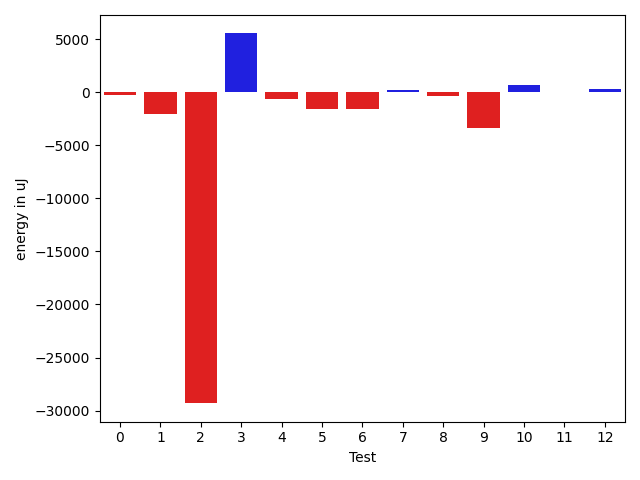

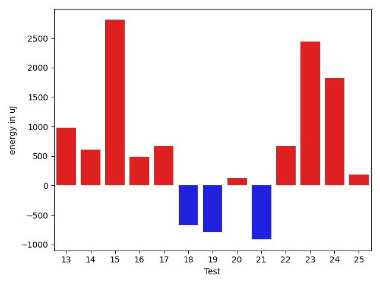

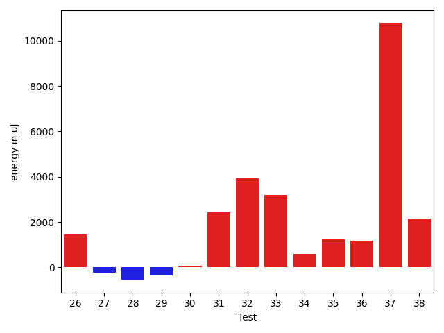

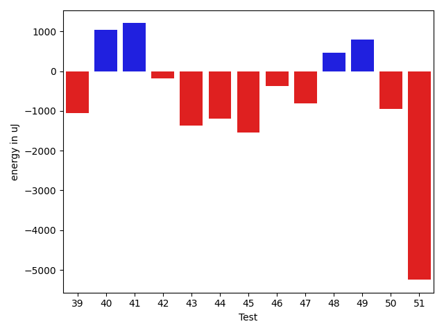

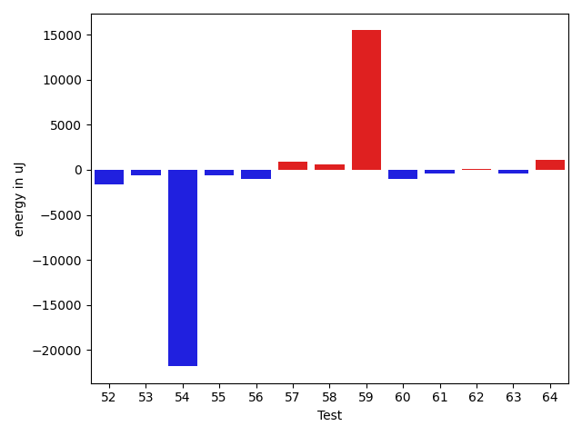

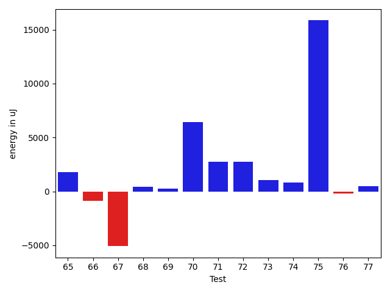

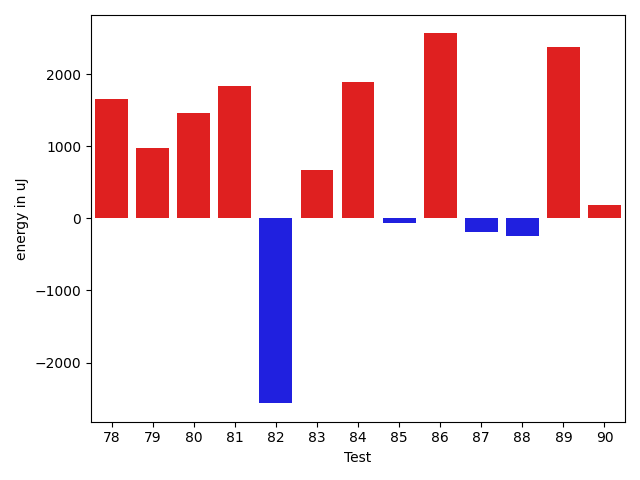

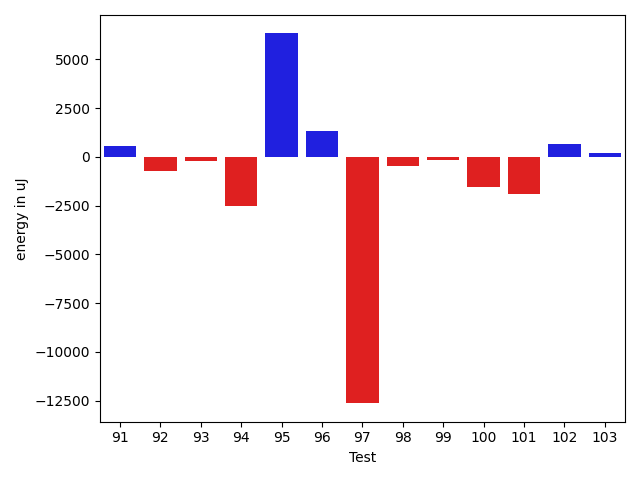

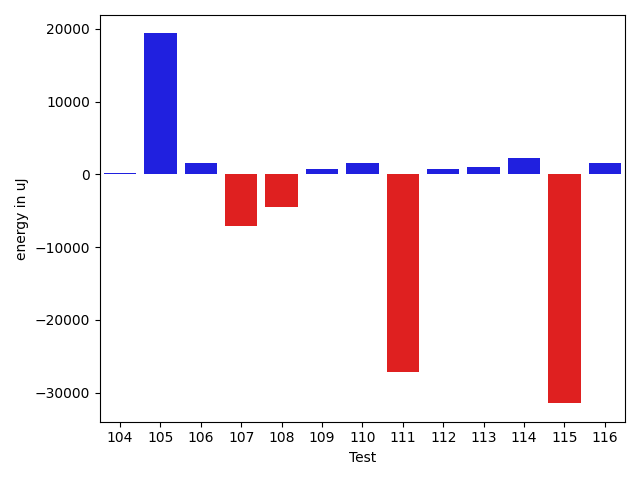

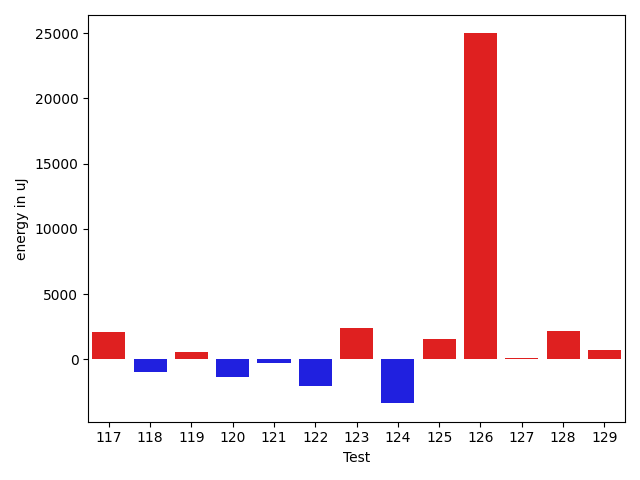

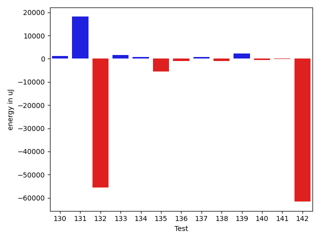

| ID | EnergyV1 | EnergyV2 | DeltaEnergy | σV1 | σV2 |
| --- | --- | --- | --- | --- | --- |
| 0 | 37109 | 36682 | -427 | 7011.0555327168995 | 4418.828638632641 |
| 1 | 38696 | 37231 | -1465 | 15450.899251598774 | 13840.109861865996 |
| 2 | 40466 | 40710 | 244 | 276588.38723448024 | 184807.47428142975 |
| 3 | 74585 | 77575 | 2990 | 17364.35856634414 | 17795.992226807648 |
| 4 | 37292 | 37231 | -61 | 4705.2715620059835 | 4778.8105684831235 |
| 5 | 37536 | 38696 | 1160 | 25567.844640608448 | 20063.461058374432 |
| 6 | 37415 | 36438 | -977 | 4213.138577381549 | 3943.849402026826 |
| 7 | 35705 | 37109 | 1404 | 4881.717658687903 | 4000.786169256887 |
| 8 | 37719 | 38269 | 550 | 16405.033926312663 | 16053.553246159852 |
| 9 | 38391 | 36988 | -1403 | 12646.856798215355 | 8711.001796394396 |
| 10 | 35462 | 36377 | 915 | 3821.1789413384445 | 4106.964975869576 |
| 11 | 35889 | 36071 | 182 | 4101.559300354071 | 4490.420957866086 |
| 12 | 36499 | 36926 | 427 | 4144.491769343899 | 4265.386840757585 |
| 13 | 36377 | 37354 | 977 | 3676.512244294717 | 4281.875178279235 |
| 14 | 35950 | 36560 | 610 | 4102.791483314202 | 3497.948477484533 |
| 15 | 35949 | 38757 | 2808 | 4101.977277212349 | 4327.9102955169565 |
| 16 | 37476 | 37964 | 488 | 7814.447212597493 | 10644.774993265342 |
| 17 | 38635 | 39307 | 672 | 8360.375303883862 | 5325.36343841662 |
| 18 | 37475 | 36804 | -671 | 3616.0202407934635 | 4025.591455611599 |
| 19 | 36072 | 35279 | -793 | 4149.1751921393525 | 3774.6974661105173 |
| 20 | 36682 | 36804 | 122 | 9874.78280678685 | 8639.509241006232 |
| 21 | 36438 | 35523 | -915 | 3750.963264620655 | 3807.6809925796506 |
| 22 | 36255 | 36926 | 671 | 4334.086682335738 | 3614.640540666132 |
| 23 | 110107 | 112549 | 2442 | 22462.99107932362 | 24265.000163128807 |
| 24 | 34180 | 36011 | 1831 | 3495.88885471139 | 3239.882542238221 |
| 25 | 35034 | 35217 | 183 | 3469.3446502861516 | 3206.1853392096473 |
| 26 | 37353 | 37903 | 550 | 11824.843625318741 | 13892.388177018334 |
| 27 | 35340 | 35645 | 305 | 3442.357464233578 | 2767.4054576339454 |
| 28 | 36438 | 36316 | -122 | 5392.549562603309 | 3611.931373872705 |
| 29 | 35340 | 36377 | 1037 | 4299.1124373205785 | 3385.127006130366 |
| 30 | 34607 | 34607 | 0 | 4043.439670085339 | 3811.3519238588583 |
| 31 | 38147 | 40161 | 2014 | 11606.986869269847 | 11125.857721414479 |
| 32 | 38696 | 40771 | 2075 | 17511.46608657817 | 19893.36581175939 |
| 33 | 37963 | 39062 | 1099 | 6532.320202893922 | 10643.813971926822 |
| 34 | 38024 | 38146 | 122 | 15488.881643634755 | 14736.336289700172 |
| 35 | 36194 | 37781 | 1587 | 3931.1778334727073 | 5335.912877511109 |
| 36 | 35523 | 37110 | 1587 | 4116.3583879903335 | 4870.377205332998 |
| 37 | 40344 | 43213 | 2869 | 39067.892436533286 | 45924.81156700995 |
| 38 | 36194 | 37598 | 1404 | 3675.2252594359784 | 5022.624779608237 |
| 39 | 39246 | 38513 | -733 | 4730.689675465466 | 3871.4508872408983 |
| 40 | 42786 | 42602 | -184 | 41557.1801992961 | 41339.15300874986 |
| 41 | 37292 | 39002 | 1710 | 4595.244389583649 | 5754.181292498419 |
| 42 | 39673 | 39184 | -489 | 3339.5126921204137 | 4067.694533345516 |
| 43 | 39550 | 38330 | -1220 | 3563.1828512926513 | 3665.3357620720767 |
| 44 | 39856 | 38085 | -1771 | 2670.87581328672 | 4193.792654680227 |
| 45 | 38452 | 36316 | -2136 | 4210.200242458453 | 4381.539877510729 |
| 46 | 37536 | 37414 | -122 | 4716.352357715672 | 2598.3111514681514 |
| 47 | 38574 | 38085 | -489 | 3417.398579690279 | 5067.861370024292 |
| 48 | 37109 | 38086 | 977 | 3880.6466521971547 | 3707.310205932356 |
| 49 | 39917 | 40222 | 305 | 14574.904856167313 | 17248.661895305715 |
| 50 | 38208 | 36804 | -1404 | 4576.5721893963655 | 4007.5912049724875 |
| 51 | 39856 | 38636 | -1220 | 18736.05618196413 | 12496.986263289724 |
| 52 | 41626 | 40039 | -1587 | 35622.23846713665 | 44656.49821679738 |
| 53 | 36499 | 36194 | -305 | 4102.863797395503 | 4351.956927424244 |
| 54 | 40405 | 39856 | -549 | 251818.6891645779 | 191533.5845150642 |
| 55 | 36010 | 36133 | 123 | 4266.803276472138 | 3935.247521918466 |
| 56 | 36377 | 36682 | 305 | 6262.643370415263 | 4147.998873613665 |
| 57 | 35645 | 36560 | 915 | 4794.9092116071015 | 3577.981909604148 |
| 58 | 36926 | 36865 | -61 | 3865.4630347962743 | 4162.329211387157 |
| 59 | 157715 | 169250 | 11535 | 242415.33665873372 | 239305.37917338643 |
| 60 | 37415 | 36865 | -550 | 3903.3047068415012 | 3618.2763262859125 |
| 61 | 37903 | 37110 | -793 | 4608.8369126602865 | 5251.006837063213 |
| 62 | 37110 | 38391 | 1281 | 3986.7356348535004 | 4640.497488250224 |
| 63 | 36071 | 36560 | 489 | 6908.489128973799 | 6025.5270462905455 |
| 64 | 37659 | 37720 | 61 | 4527.5407782690245 | 7280.138654128321 |
| 65 | 39245 | 39001 | -244 | 32688.40847660526 | 37409.48753229768 |
| 66 | 37109 | 34607 | -2502 | 2366.305676694276 | 5120.030661860831 |
| 67 | 42236 | 39001 | -3235 | 25077.922804665173 | 18757.502669746733 |
| 68 | 36804 | 36498 | -306 | 3803.7757300404087 | 5907.210577527792 |
| 69 | 36072 | 36926 | 854 | 4219.260919826213 | 4114.5935362311375 |
| 70 | 38635 | 39856 | 1221 | 14457.36268632331 | 23259.029306548404 |
| 71 | 34302 | 38025 | 3723 | 3622.781197974622 | 3994.1513460395126 |
| 72 | 36438 | 40100 | 3662 | 9535.377702215057 | 13177.065271280258 |
| 73 | 35827 | 36743 | 916 | 4168.448980833995 | 4508.453873157503 |
| 74 | 35523 | 36438 | 915 | 3939.8905507355335 | 4831.46546736684 |
| 75 | 37719 | 40771 | 3052 | 20406.032103032674 | 38208.73858504606 |
| 76 | 37170 | 37476 | 306 | 3616.221785233865 | 4469.901386819931 |
| 77 | 37597 | 38269 | 672 | 3354.81480429155 | 4145.571992703019 |
| 78 | 37414 | 39062 | 1648 | 28594.55461644401 | 42337.09447780652 |
| 79 | 36743 | 37720 | 977 | 4032.4229829686033 | 4496.90740877056 |
| 80 | 38391 | 39856 | 1465 | 286620.3544396132 | 422832.05526839884 |
| 81 | 34912 | 36744 | 1832 | 3945.4938007297924 | 3346.385609421425 |
| 82 | 45105 | 42542 | -2563 | 51481.73508836418 | 38935.21221837867 |
| 83 | 39795 | 40466 | 671 | 418478.6834187761 | 172559.1230325923 |
| 84 | 36804 | 38697 | 1893 | 31244.253004537066 | 12418.239340016415 |
| 85 | 36438 | 36377 | -61 | 5177.420231358553 | 3921.2526827105503 |
| 86 | 35645 | 38208 | 2563 | 5494.5980270075315 | 3955.601228839934 |
| 87 | 38452 | 38269 | -183 | 23510.261857955913 | 14968.806824542131 |
| 88 | 37658 | 37415 | -243 | 4581.9655418582715 | 5167.296258850825 |
| 89 | 82336 | 84716 | 2380 | 291370.1258372906 | 361193.40545878053 |
| 90 | 41199 | 41382 | 183 | 29964.343142289657 | 32994.67824222504 |
| 91 | 37720 | 37963 | 243 | 10165.71345664273 | 10309.454208361045 |
| 92 | 39368 | 38514 | -854 | 10017.455080822489 | 11055.600349475633 |
| 93 | 36377 | 36743 | 366 | 6638.696932185027 | 7775.51267412549 |
| 94 | 39673 | 39551 | -122 | 28697.793466602725 | 22059.082545798137 |
| 95 | 38879 | 38879 | 0 | 38559.74490410099 | 52452.11022453531 |
| 96 | 36560 | 37719 | 1159 | 11610.209687264416 | 12801.501028850918 |
| 97 | 42480 | 43518 | 1038 | 253401.63682680705 | 233625.14587304168 |
| 98 | 38574 | 37781 | -793 | 4459.18267298172 | 4517.867734825246 |
| 99 | 37109 | 37293 | 184 | 3875.4629988713996 | 4355.449169266757 |
| 100 | 39062 | 37537 | -1525 | 3223.0230614007382 | 5018.209423507733 |
| 101 | 37903 | 36560 | -1343 | 6162.166751683231 | 4131.201330051746 |
| 102 | 35706 | 35766 | 60 | 3991.032849470868 | 4537.341332871809 |
| 103 | 36804 | 36377 | -427 | 6397.197660653398 | 5857.335348352145 |
| 104 | 35705 | 36804 | 1099 | 4292.549274023161 | 4013.6305532240303 |
| 105 | 38818 | 40100 | 1282 | 32932.329402857664 | 187044.11281477852 |
| 106 | 37659 | 37231 | -428 | 4593.099758444226 | 4641.362365175253 |
| 107 | 38391 | 36743 | -1648 | 43233.98222487367 | 29391.28006674991 |
| 108 | 37719 | 38208 | 489 | 20263.513309393278 | 11730.323191715512 |
| 109 | 36866 | 37598 | 732 | 4138.134622307949 | 5050.163443449683 |
| 110 | 37597 | 38452 | 855 | 4289.532767024283 | 4527.556299990843 |
| 111 | 62744 | 72387 | 9643 | 215428.34663920422 | 69564.63266311973 |
| 112 | 35462 | 36743 | 1281 | 4992.564280164181 | 4457.450149067917 |
| 113 | 36743 | 37049 | 306 | 4460.714497563733 | 4548.523032687521 |
| 114 | 38757 | 41626 | 2869 | 20492.09294377685 | 22467.671824264115 |
| 115 | 42542 | 41382 | -1160 | 346660.7692417212 | 309532.19750697643 |
| 116 | 37719 | 40039 | 2320 | 4123.8674703757315 | 4829.176650061061 |
| 117 | 38147 | 40283 | 2136 | 9966.477740684295 | 8616.614150710373 |
| 118 | 40039 | 39063 | -976 | 3280.69008163903 | 4931.116893234716 |
| 119 | 37719 | 38269 | 550 | 5295.3725442335235 | 3444.5445842458107 |
| 120 | 39856 | 38513 | -1343 | 4215.258502837838 | 5120.526615536324 |
| 121 | 39367 | 39062 | -305 | 15887.679097882192 | 13762.241851299372 |
| 122 | 77209 | 75195 | -2014 | 27331.206988832037 | 24373.5700368868 |
| 123 | 108520 | 110961 | 2441 | 317952.73847780994 | 277316.2280678762 |
| 124 | 36377 | 33020 | -3357 | 4159.994025636735 | 5104.032409794895 |
| 125 | 38391 | 39917 | 1526 | 20148.40271065221 | 34234.510326133546 |
| 126 | 79040 | 104004 | 24964 | 161364.3713716828 | 288730.3481420263 |
| 127 | 38391 | 38513 | 122 | 10464.649931963973 | 8065.301604304395 |
| 128 | 39063 | 41260 | 2197 | 4505.393773384791 | 5722.334649138819 |
| 129 | 41321 | 42053 | 732 | 50010.26769654338 | 56440.88784861368 |
| 130 | 39246 | 41443 | 2197 | 31939.950628853265 | 30911.596941984015 |
| 131 | 187194 | 213195 | 26001 | 85707.47699300143 | 89137.21301401751 |
| 132 | 39490 | 39124 | -366 | 351114.61480496515 | 270786.30442863156 |
| 133 | 38941 | 39489 | 548 | 4573.371879045631 | 4389.101491397267 |
| 134 | 37597 | 38025 | 428 | 3161.08528485789 | 4292.899173545066 |
| 135 | 40344 | 41381 | 1037 | 300244.3744826481 | 266022.457372145 |
| 136 | 38818 | 38879 | 61 | 3796.9433045354263 | 3769.1630292888667 |
| 137 | 37415 | 37353 | -62 | 3031.4044500858013 | 5011.125039349946 |
| 138 | 39734 | 38269 | -1465 | 4588.168411370026 | 4724.816873192769 |
| 139 | 37903 | 39672 | 1769 | 4136.027515471928 | 6156.100206096389 |
| 140 | 37537 | 37171 | -366 | 7820.37876070164 | 7603.155310191844 |
| 141 | 35645 | 35767 | 122 | 3504.4205030789326 | 2230.8142959106895 |
| 142 | 39429 | 39306 | -123 | 275449.0989198789 | 4513.672532913193 |

## Delta Duration per test method

| ID | DurationV1 | DurationsV2 | DeltaDuration |
| --- | --- | --- | --- |
| 0 | 959220.0 | 949968.5466666666 | -9251.453333333367 |
| 1 | 1069511.9666666666 | 1061706.6607142857 | -7805.305952380877 |
| 2 | 3002838.970149254 | 2368432.49122807 | -634406.4789211839 |
| 3 | 2313883.212121212 | 2412835.6363636362 | 98952.42424242431 |
| 4 | 608633.2 | 559025.0 | -49608.19999999995 |
| 5 | 1059252.1551724137 | 1078243.3921568627 | 18991.236984448973 |
| 6 | 783316.2881355932 | 773776.1607142857 | -9540.127421307494 |
| 7 | 677427.5384615385 | 655205.304347826 | -22222.234113712446 |
| 8 | 1251392.0857142857 | 1212721.6623376624 | -38670.42337662331 |
| 9 | 1008613.2916666666 | 838269.8478260869 | -170343.4438405797 |
| 10 | 818801.8 | 798693.649122807 | -20108.150877193082 |
| 11 | 839435.5111111111 | 846124.509090909 | 6688.997979797889 |
| 12 | 834627.275862069 | 843617.3620689656 | 8990.08620689658 |
| 13 | 707568.6571428571 | 746664.1886792453 | 39095.53153638821 |
| 14 | 748801.4666666667 | 717181.5 | -31619.966666666674 |
| 15 | 489498.4285714286 | 468913.0416666667 | -20585.386904761894 |
| 16 | 1189022.0574712644 | 1174235.441860465 | -14786.615610799287 |
| 17 | 1150479.2857142857 | 1131379.6285714286 | -19099.65714285709 |
| 18 | 627004.7441860465 | 655680.0 | 28675.255813953467 |
| 19 | 799364.6610169491 | 810746.9090909091 | 11382.248073959956 |
| 20 | 1308718.914893617 | 1292548.2444444445 | -16170.67044917238 |
| 21 | 759626.7450980392 | 758767.4262295082 | -859.3188685309142 |
| 22 | 765251.84 | 750715.052631579 | -14536.787368420977 |
| 23 | 3414632.242424242 | 3425912.222222222 | 11279.979797979817 |
| 24 | 516309.6129032258 | 501226.2 | -15083.412903225806 |
| 25 | 555312.6944444445 | 589848.0 | 34535.305555555504 |
| 26 | 1266133.319148936 | 1291511.8131868131 | 25378.49403787707 |
| 27 | 460697.95238095237 | 488650.2727272727 | 27952.32034632034 |
| 28 | 878136.7307692308 | 875120.3541666666 | -3016.3766025641235 |
| 29 | 524377.0714285715 | 500272.42307692306 | -24104.648351648415 |
| 30 | 852561.2909090909 | 858480.1739130435 | 5918.883003952564 |
| 31 | 1087700.2419354839 | 1195012.3793103448 | 107312.13737486093 |
| 32 | 1521370.7777777778 | 1588402.9797979798 | 67032.20202020206 |
| 33 | 1030218.2307692308 | 1098043.0476190476 | 67824.81684981682 |
| 34 | 1091031.4915254237 | 1176140.1746031747 | 85108.68307775096 |
| 35 | 934258.4776119404 | 935621.55 | 1363.0723880596925 |
| 36 | 743621.7027027027 | 781488.7872340425 | 37867.08453133982 |
| 37 | 1822056.6236559139 | 2164890.11827957 | 342833.4946236559 |
| 38 | 629819.3870967742 | 590534.5142857142 | -39284.87281105993 |
| 39 | 411148.27777777775 | 493458.23529411765 | 82309.9575163399 |
| 40 | 1796145.9622641508 | 1979666.9666666666 | 183521.0044025157 |
| 41 | 511706.9375 | 489117.5714285714 | -22589.36607142858 |
| 42 | 419222.25 | 461646.70588235295 | 42424.45588235295 |
| 43 | 487784.2380952381 | 587993.8214285715 | 100209.58333333337 |
| 44 | 332892.3 | 468575.17647058825 | 135682.87647058826 |
| 45 | 496456.2083333333 | 530624.9629629629 | 34168.754629629606 |
| 46 | 441184.53846153844 | 484261.9375 | 43077.39903846156 |
| 47 | 605905.3888888889 | 791625.1739130435 | 185719.78502415458 |
| 48 | 932869.34375 | 859556.2678571428 | -73313.07589285716 |
| 49 | 1390035.9024390243 | 1333803.5595238095 | -56232.34291521483 |
| 50 | 861484.9655172414 | 776727.8888888889 | -84757.07662835252 |
| 51 | 1224014.349206349 | 986893.4307692308 | -237120.9184371183 |
| 52 | 1547448.4393939395 | 1514555.5849056605 | -32892.85448827897 |
| 53 | 740598.0943396227 | 710027.7804878049 | -30570.313851817744 |
| 54 | 2854241.301369863 | 2206910.529411765 | -647330.7719580983 |
| 55 | 665927.6428571428 | 688859.5111111111 | 22931.868253968307 |
| 56 | 899429.612244898 | 840871.0 | -58558.61224489799 |
| 57 | 606360.0967741936 | 629262.7272727273 | 22902.63049853372 |
| 58 | 805419.9122807018 | 850877.0357142857 | 45457.12343358388 |
| 59 | 6189190.808080808 | 6651125.686868687 | 461934.8787878789 |
| 60 | 627337.282051282 | 707230.3870967742 | 79893.10504549218 |
| 61 | 752708.1666666666 | 773232.6923076923 | 20524.525641025626 |
| 62 | 821443.1363636364 | 846250.9642857143 | 24807.827922077966 |
| 63 | 907217.606557377 | 975119.0847457628 | 67901.47818838572 |
| 64 | 661199.3 | 677253.8333333334 | 16054.533333333326 |
| 65 | 1274204.28125 | 1369987.3333333333 | 95783.05208333326 |
| 66 | 439132.125 | 488148.8333333333 | 49016.708333333314 |
| 67 | 967509.9230769231 | 1037290.7 | 69780.77692307683 |
| 68 | 737883.1555555556 | 811807.0793650794 | 73923.92380952381 |
| 69 | 695801.1860465116 | 732156.3777777777 | 36355.191731266095 |
| 70 | 1396471.0505050505 | 1560832.8958333333 | 164361.8453282828 |
| 71 | 570711.90625 | 638981.4210526316 | 68269.51480263157 |
| 72 | 689077.6896551724 | 999112.6111111111 | 310034.9214559387 |
| 73 | 697728.2916666666 | 826334.9166666666 | 128606.625 |
| 74 | 460041.8076923077 | 558447.619047619 | 98405.81135531137 |
| 75 | 745918.6 | 1376957.7894736843 | 631039.1894736843 |
| 76 | 575333.68 | 626389.8421052631 | 51056.162105263094 |
| 77 | 480599.09375 | 522224.64285714284 | 41625.54910714284 |
| 78 | 860279.3870967742 | 1439344.2894736843 | 579064.9023769101 |
| 79 | 472627.7368421053 | 499708.1666666667 | 27080.429824561405 |
| 80 | 3309590.611111111 | 6764362.708333333 | 3454772.097222222 |
| 81 | 518053.0416666667 | 613467.1025641026 | 95414.06089743593 |
| 82 | 2117216.1951219514 | 1489933.780487805 | -627282.4146341465 |
| 83 | 6287234.4 | 1779695.9032258065 | -4507538.496774194 |
| 84 | 1127557.3125 | 668019.0967741936 | -459538.2157258064 |
| 85 | 623967.0 | 558753.551724138 | -65213.44827586203 |
| 86 | 640461.1944444445 | 530889.4 | -109571.79444444447 |
| 87 | 1339507.7027027027 | 1284556.0 | -54951.70270270272 |
| 88 | 1102904.4776119404 | 1048926.6419753085 | -53977.83563663182 |
| 89 | 4482640.333333333 | 5204645.202020202 | 722004.8686868688 |
| 90 | 1559129.5 | 1540361.4852941176 | -18768.014705882408 |
| 91 | 1164815.6164383562 | 1198824.4871794872 | 34008.87074113102 |
| 92 | 1099127.2469135802 | 1148617.2278481012 | 49489.98093452095 |
| 93 | 1050157.7260273972 | 1020185.875 | -29971.851027397206 |
| 94 | 1643519.202247191 | 1562221.9361702127 | -81297.2660769783 |
| 95 | 1550651.6588235295 | 1776127.9523809524 | 225476.29355742293 |
| 96 | 1217171.5274725275 | 1245063.0930232557 | 27891.565550728235 |
| 97 | 3484936.4725274723 | 3011656.3 | -473280.1725274725 |
| 98 | 716590.4285714285 | 735301.775 | 18711.3464285715 |
| 99 | 675027.1794871795 | 701894.9736842106 | 26867.794197031064 |
| 100 | 693674.2222222222 | 711646.2727272727 | 17972.050505050458 |
| 101 | 721059.268292683 | 714859.4883720931 | -6199.779920589877 |
| 102 | 596845.9 | 595377.8965517242 | -1468.0034482758492 |
| 103 | 926888.7741935484 | 914798.7833333333 | -12089.990860215039 |
| 104 | 597498.4137931034 | 593431.15625 | -4067.25754310342 |
| 105 | 1281533.8372093022 | 1618895.46 | 337361.62279069773 |
| 106 | 601523.7142857143 | 636959.5897435897 | 35435.87545787543 |
| 107 | 1384997.5081967213 | 1204545.523076923 | -180451.98511979822 |
| 108 | 917641.9354838709 | 643421.7777777778 | -274220.15770609316 |
| 109 | 564473.28125 | 543494.3333333334 | -20978.947916666628 |
| 110 | 612083.5625 | 636815.0909090909 | 24731.52840909094 |
| 111 | 3438593.298701299 | 2512466.2916666665 | -926127.0070346324 |
| 112 | 621625.5483870967 | 582934.0645161291 | -38691.48387096764 |
| 113 | 617696.9655172414 | 553489.5 | -64207.46551724139 |
| 114 | 1234245.6166666667 | 1222429.5614035088 | -11816.055263157934 |
| 115 | 4182065.9264705884 | 3379885.6438356163 | -802180.2826349721 |
| 116 | 878145.4090909091 | 817272.033898305 | -60873.37519260403 |
| 117 | 1204073.375 | 1238382.88 | 34309.50499999989 |
| 118 | 535205.1764705882 | 550901.7391304348 | 15696.562659846619 |
| 119 | 463698.4 | 461639.35714285716 | -2059.042857142864 |
| 120 | 583212.1739130435 | 558003.1304347826 | -25209.043478260865 |
| 121 | 1332163.7123287672 | 1232313.690140845 | -99850.02218792215 |
| 122 | 2241512.707070707 | 2021829.303030303 | -219683.4040404039 |
| 123 | 5088711.343434343 | 4813349.414141414 | -275361.92929292936 |
| 124 | 475011.5333333333 | 512687.07692307694 | 37675.54358974361 |
| 125 | 940577.0 | 1327096.4772727273 | 386519.4772727273 |
| 126 | 3492015.868686869 | 5300347.02020202 | 1808331.1515151514 |
| 127 | 880224.0 | 942528.6222222223 | 62304.62222222227 |
| 128 | 573141.9230769231 | 579867.1785714285 | 6725.2554945054 |
| 129 | 2039495.3448275863 | 2234423.5542168673 | 194928.209389281 |
| 130 | 1421037.984375 | 1515721.2686567164 | 94683.28428171645 |
| 131 | 6227295.5050505055 | 6687945.0 | 460649.4949494945 |
| 132 | 4218080.038461538 | 2687038.033333333 | -1531042.0051282048 |
| 133 | 543515.2173913043 | 582371.75 | 38856.53260869568 |
| 134 | 622178.3939393939 | 694243.5116279069 | 72065.11768851301 |
| 135 | 3028663.569767442 | 2900174.524390244 | -128489.04537719814 |
| 136 | 561698.0645161291 | 594607.8333333334 | 32909.76881720428 |
| 137 | 460900.75 | 448436.4666666667 | -12464.283333333326 |
| 138 | 642978.25 | 757812.3846153846 | 114834.13461538462 |
| 139 | 584138.2258064516 | 603860.5 | 19722.274193548365 |
| 140 | 1092206.5666666667 | 1035428.390625 | -56778.17604166665 |
| 141 | 614353.72 | 629202.2777777778 | 14848.55777777778 |
| 142 | 2014038.4285714286 | 517603.4375 | -1496434.9910714286 |

## Misc.

| ID | Test Class | Test Method |
| --- | --- | --- |
| 0 | com.google.gson.functional.CustomTypeAdaptersTest | testCustomAdapterInvokedForCollectionElementDeserialization |
| 1 | com.google.gson.functional.CustomTypeAdaptersTest | testCustomNestedSerializers |
| 2 | com.google.gson.functional.CustomTypeAdaptersTest | testCustomSerializers |
| 3 | com.google.gson.functional.CustomTypeAdaptersTest | testCustomTypeAdapterDoesNotAppliesToSubClasses |
| 4 | com.google.gson.functional.CustomTypeAdaptersTest | testCustomAdapterInvokedForCollectionElementSerialization |
| 5 | com.google.gson.functional.CustomTypeAdaptersTest | testCustomDeserializers |
| 6 | com.google.gson.functional.CustomTypeAdaptersTest | testCustomByteArrayDeserializerAndInstanceCreator |
| 7 | com.google.gson.functional.CustomTypeAdaptersTest | testEnsureCustomDeserializerNotInvokedForNullValues |
| 8 | com.google.gson.functional.CustomTypeAdaptersTest | testCustomAdapterInvokedForCollectionElementSerializationWithType |
| 9 | com.google.gson.functional.CustomTypeAdaptersTest | testEnsureCustomSerializerNotInvokedForNullValues |
| 10 | com.google.gson.functional.CustomTypeAdaptersTest | testCustomAdapterInvokedForMapElementDeserialization |
| 11 | com.google.gson.functional.CustomTypeAdaptersTest | testCustomAdapterInvokedForMapElementSerializationWithType |
| 12 | com.google.gson.functional.CustomTypeAdaptersTest | testCustomNestedDeserializers |
| 13 | com.google.gson.functional.CustomTypeAdaptersTest | testCustomByteArraySerializer |
| 14 | com.google.gson.functional.CustomTypeAdaptersTest | testCustomTypeAdapterAppliesToSubClassesSerializedAsBaseClass |
| 15 | com.google.gson.functional.CustomTypeAdaptersTest | testCustomAdapterInvokedForMapElementSerialization |
| 16 | com.google.gson.functional.StreamingTypeAdaptersTest | testNullSafe |
| 17 | com.google.gson.functional.StreamingTypeAdaptersTest | testSerializeWithCustomTypeAdapter |
| 18 | com.google.gson.functional.StreamingTypeAdaptersTest | testDeserializeWithCustomTypeAdapter |
| 19 | com.google.gson.functional.DefaultTypeAdaptersTest | testDateSerializationWithPatternNotOverridenByTypeAdapter |
| 20 | com.google.gson.functional.DefaultTypeAdaptersTest | testDateSerializationWithPattern |
| 21 | com.google.gson.functional.DefaultTypeAdaptersTest | testSqlDateSerialization |
| 22 | com.google.gson.functional.DefaultTypeAdaptersTest | testTimestampSerialization |
| 23 | com.google.gson.functional.DefaultTypeAdaptersTest | testDefaultDateDeserializationUsingBuilder |
| 24 | com.google.gson.functional.DefaultTypeAdaptersTest | testDefaultCalendarSerialization |
| 25 | com.google.gson.functional.DefaultTypeAdaptersTest | testDefaultCalendarDeserialization |
| 26 | com.google.gson.functional.DefaultTypeAdaptersTest | testDateSerializationInCollection |
| 27 | com.google.gson.functional.DefaultTypeAdaptersTest | testDefaultGregorianCalendarSerialization |
| 28 | com.google.gson.functional.DefaultTypeAdaptersTest | testDefaultDateSerializationUsingBuilder |
| 29 | com.google.gson.functional.DefaultTypeAdaptersTest | testDefaultGregorianCalendarDeserialization |
| 30 | com.google.gson.functional.DefaultTypeAdaptersTest | testDateDeserializationWithPattern |
| 31 | com.google.gson.functional.MapTest | testSerializeMaps |
| 32 | com.google.gson.functional.MapTest | testInterfaceTypeMapWithSerializer |
| 33 | com.google.gson.functional.MapTest | testMapSubclassDeserialization |
| 34 | com.google.gson.functional.MapTest | testCustomSerializerForSpecificMapType |
| 35 | com.google.gson.functional.MapTest | testGeneralMapField |
| 36 | com.google.gson.functional.MapTest | testMapSerializationWithNullValueButSerializeNulls |
| 37 | com.google.gson.functional.MapTest | testInterfaceTypeMap |
| 38 | com.google.gson.functional.MapTest | testMapSerializationWithNullValuesSerialized |
| 39 | com.google.gson.functional.PrimitiveTest | testDoubleInfinitySerialization |
| 40 | com.google.gson.functional.PrimitiveTest | testHtmlCharacterSerialization |
| 41 | com.google.gson.functional.PrimitiveTest | testFloatNaNSerialization |
| 42 | com.google.gson.functional.PrimitiveTest | testNegativeInfinitySerialization |
| 43 | com.google.gson.functional.PrimitiveTest | testLongAsStringSerialization |
| 44 | com.google.gson.functional.PrimitiveTest | testNegativeInfinityFloatSerialization |
| 45 | com.google.gson.functional.PrimitiveTest | testLongAsStringDeserialization |
| 46 | com.google.gson.functional.PrimitiveTest | testFloatInfinitySerialization |
| 47 | com.google.gson.functional.PrimitiveTest | testDoubleNaNSerialization |
| 48 | com.google.gson.functional.CustomDeserializerTest | testCustomDeserializerReturnsNullForArrayElementsForArrayField |
| 49 | com.google.gson.functional.CustomDeserializerTest | testJsonTypeFieldBasedDeserialization |
| 50 | com.google.gson.functional.CustomDeserializerTest | testCustomDeserializerReturnsNullForArrayElements |
| 51 | com.google.gson.functional.CustomDeserializerTest | testCustomDeserializerReturnsNull |
| 52 | com.google.gson.functional.CustomDeserializerTest | testCustomDeserializerReturnsNullForTopLevelObject |
| 53 | com.google.gson.functional.CustomSerializerTest | testSerializerReturnsNull |
| 54 | com.google.gson.functional.CustomSerializerTest | testSubClassSerializerInvokedForBaseClassFieldsHoldingSubClassInstances |
| 55 | com.google.gson.functional.CustomSerializerTest | testBaseClassSerializerInvokedForBaseClassFieldsHoldingSubClassInstances |
| 56 | com.google.gson.functional.CustomSerializerTest | testSubClassSerializerInvokedForBaseClassFieldsHoldingArrayOfSubClassInstances |
| 57 | com.google.gson.functional.CustomSerializerTest | testBaseClassSerializerInvokedForBaseClassFields |
| 58 | com.google.gson.functional.VersioningTest | testVersionedGsonMixingSinceAndUntilDeserialization |
| 59 | com.google.gson.functional.VersioningTest | testVersionedUntilSerialization |
| 60 | com.google.gson.functional.VersioningTest | testIgnoreLaterVersionClassSerialization |
| 61 | com.google.gson.functional.VersioningTest | testVersionedClassesDeserialization |
| 62 | com.google.gson.functional.VersioningTest | testVersionedClassesSerialization |
| 63 | com.google.gson.functional.VersioningTest | testVersionedGsonMixingSinceAndUntilSerialization |
| 64 | com.google.gson.functional.VersioningTest | testVersionedGsonWithUnversionedClassesDeserialization |
| 65 | com.google.gson.functional.VersioningTest | testVersionedGsonWithUnversionedClassesSerialization |
| 66 | com.google.gson.functional.VersioningTest | testIgnoreLaterVersionClassDeserialization |
| 67 | com.google.gson.functional.VersioningTest | testVersionedUntilDeserialization |
| 68 | com.google.gson.functional.NullObjectAndFieldTest | testCustomTypeAdapterPassesNullDesrialization |
| 69 | com.google.gson.functional.NullObjectAndFieldTest | testNullWrappedPrimitiveMemberSerialization |
| 70 | com.google.gson.functional.NullObjectAndFieldTest | testExplicitSerializationOfNullArrayMembers |
| 71 | com.google.gson.functional.NullObjectAndFieldTest | testExplicitDeserializationOfNulls |
| 72 | com.google.gson.functional.NullObjectAndFieldTest | testCustomSerializationOfNulls |
| 73 | com.google.gson.functional.NullObjectAndFieldTest | testPrintPrintingObjectWithNulls |
| 74 | com.google.gson.functional.NullObjectAndFieldTest | testPrintPrintingArraysWithNulls |
| 75 | com.google.gson.functional.NullObjectAndFieldTest | testTopLevelNullObjectDeserialization |
| 76 | com.google.gson.functional.NullObjectAndFieldTest | testExplicitSerializationOfNullCollectionMembers |
| 77 | com.google.gson.functional.NullObjectAndFieldTest | testCustomTypeAdapterPassesNullSerialization |
| 78 | com.google.gson.functional.NullObjectAndFieldTest | testExplicitSerializationOfNulls |
| 79 | com.google.gson.functional.NullObjectAndFieldTest | testNullWrappedPrimitiveMemberDeserialization |
| 80 | com.google.gson.functional.NullObjectAndFieldTest | testTopLevelNullObjectSerialization |
| 81 | com.google.gson.functional.NullObjectAndFieldTest | testExplicitSerializationOfNullStringMembers |
| 82 | com.google.gson.functional.SecurityTest | testJsonWithNonExectuableTokenSerialization |
| 83 | com.google.gson.functional.SecurityTest | testNonExecutableJsonSerialization |
| 84 | com.google.gson.functional.SecurityTest | testNonExecutableJsonDeserialization |
| 85 | com.google.gson.functional.SecurityTest | testJsonWithNonExectuableTokenWithConfiguredGsonDeserialization |
| 86 | com.google.gson.functional.SecurityTest | testJsonWithNonExectuableTokenWithRegularGsonDeserialization |
| 87 | com.google.gson.functional.EnumTest | testEnumSubclassWithRegisteredTypeAdapter |
| 88 | com.google.gson.functional.MapAsArrayTypeAdapterTest | testMultipleEnableComplexKeyRegistrationHasNoEffect |
| 89 | com.google.gson.functional.MapAsArrayTypeAdapterTest | testSerializeComplexMapWithTypeAdapter |
| 90 | com.google.gson.functional.MapAsArrayTypeAdapterTest | testTwoTypesCollapseToOneDeserialize |
| 91 | com.google.gson.functional.MapAsArrayTypeAdapterTest | testMapWithTypeVariableSerialization |
| 92 | com.google.gson.functional.MapAsArrayTypeAdapterTest | testMapWithTypeVariableDeserialization |
| 93 | com.google.gson.functional.ParameterizedTypesTest | testParameterizedTypeWithReaderDeserialization |
| 94 | com.google.gson.functional.ParameterizedTypesTest | testParameterizedTypeWithCustomSerializer |
| 95 | com.google.gson.functional.ParameterizedTypesTest | testParameterizedTypeDeserialization |
| 96 | com.google.gson.functional.ParameterizedTypesTest | testParameterizedTypesWithCustomDeserializer |
| 97 | com.google.gson.functional.FieldNamingTest | testIdentity |
| 98 | com.google.gson.functional.FieldNamingTest | testUpperCamelCaseWithSpaces |
| 99 | com.google.gson.functional.FieldNamingTest | testLowerCaseWithDashes |
| 100 | com.google.gson.functional.FieldNamingTest | testUpperCamelCase |
| 101 | com.google.gson.functional.FieldNamingTest | testLowerCaseWithUnderscores |
| 102 | com.google.gson.functional.NamingPolicyTest | testGsonWithUpperCamelCaseSpacesPolicyDeserialiation |
| 103 | com.google.gson.functional.NamingPolicyTest | testDeprecatedNamingStrategy |
| 104 | com.google.gson.functional.NamingPolicyTest | testGsonWithLowerCaseUnderscorePolicyDeserialiation |
| 105 | com.google.gson.functional.NamingPolicyTest | testGsonWithNonDefaultFieldNamingPolicySerialization |
| 106 | com.google.gson.functional.NamingPolicyTest | testGsonWithLowerCaseDashPolicyDeserialiation |
| 107 | com.google.gson.functional.NamingPolicyTest | testGsonWithSerializedNameFieldNamingPolicySerialization |
| 108 | com.google.gson.functional.NamingPolicyTest | testGsonWithNonDefaultFieldNamingPolicyDeserialiation |
| 109 | com.google.gson.functional.NamingPolicyTest | testGsonWithUpperCamelCaseSpacesPolicySerialiation |
| 110 | com.google.gson.functional.NamingPolicyTest | testGsonWithLowerCaseDashPolicySerialization |
| 111 | com.google.gson.functional.NamingPolicyTest | testGsonDuplicateNameUsingSerializedNameFieldNamingPolicySerialization |
| 112 | com.google.gson.functional.NamingPolicyTest | testGsonWithSerializedNameFieldNamingPolicyDeserialization |
| 113 | com.google.gson.functional.NamingPolicyTest | testGsonWithLowerCaseUnderscorePolicySerialization |
| 114 | com.google.gson.functional.InstanceCreatorTest | testInstanceCreatorReturnsSubTypeForField |
| 115 | com.google.gson.functional.InstanceCreatorTest | testInstanceCreatorReturnsBaseType |
| 116 | com.google.gson.functional.InstanceCreatorTest | testInstanceCreatorReturnsSubTypeForTopLevelObject |
| 117 | com.google.gson.functional.EscapingTest | testGsonAcceptsEscapedAndNonEscapedJsonDeserialization |
| 118 | com.google.gson.functional.TypeAdapterPrecedenceTest | testNonstreamingHierarchicalFollowedByNonstreaming |
| 119 | com.google.gson.functional.TypeAdapterPrecedenceTest | testStreamingHierarchicalFollowedByNonstreamingHierarchical |
| 120 | com.google.gson.functional.TypeAdapterPrecedenceTest | testStreamingFollowedByNonstreamingHierarchical |
| 121 | com.google.gson.functional.CollectionTest | testUserCollectionTypeAdapter |
| 122 | com.google.gson.functional.UncategorizedTest | testReturningDerivedClassesDuringDeserialization |
| 123 | com.google.gson.functional.TypeHierarchyAdapterTest | testTypeHierarchy |
| 124 | com.google.gson.functional.TypeHierarchyAdapterTest | testRegisterSubTypeFirstAllowed |
| 125 | com.google.gson.functional.ExclusionStrategyFunctionalTest | testExclusionStrategyDeserialization |
| 126 | com.google.gson.functional.ExclusionStrategyFunctionalTest | testExclusionStrategySerialization |
| 127 | com.google.gson.functional.ExclusionStrategyFunctionalTest | testExclusionStrategyWithMode |
| 128 | com.google.gson.functional.PrintFormattingTest | testJsonObjectWithNullValuesSerialized |
| 129 | com.google.gson.MixedStreamTest | testWriteHtmlSafe |
| 130 | com.google.gson.MixedStreamTest | testWriteLenient |
| 131 | com.google.gson.functional.CircularReferenceTest | testSelfReferenceCustomHandlerSerialization |
| 132 | com.google.gson.LongSerializationPolicyTest | testDefaultLongSerializationIntegration |
| 133 | com.google.gson.LongSerializationPolicyTest | testStringLongSerializationIntegration |
| 134 | com.google.gson.functional.FieldExclusionTest | testDefaultNestedStaticClassIncluded |
| 135 | com.google.gson.functional.FieldExclusionTest | testDefaultInnerClassExclusion |
| 136 | com.google.gson.functional.FieldExclusionTest | testInnerClassExclusion |
| 137 | com.google.gson.functional.ReadersWritersTest | testTopLevelNullObjectDeserializationWithReaderAndSerializeNulls |
| 138 | com.google.gson.functional.ReadersWritersTest | testTopLevelNullObjectSerializationWithWriterAndSerializeNulls |
| 139 | com.google.gson.functional.ArrayTest | testNullsInArrayWithSerializeNullPropertySetSerialization |
| 140 | com.google.gson.functional.ObjectTest | testInnerClassDeserialization |
| 141 | com.google.gson.functional.ObjectTest | testJsonObjectSerialization |
| 142 | com.google.gson.GsonBuilderTest | testCreatingMoreThanOnce |

| Test | IterationV1 | IterationV2 | DeltaIteration |
| --- | --- | --- | --- |
| 0 | 65 | 75 | 10 |
| 1 | 60 | 56 | -4 |
| 2 | 67 | 57 | -10 |
| 3 | 99 | 99 | 0 |
| 4 | 30 | 38 | 8 |
| 5 | 58 | 51 | -7 |
| 6 | 59 | 56 | -3 |
| 7 | 39 | 46 | 7 |
| 8 | 70 | 77 | 7 |
| 9 | 48 | 46 | -2 |
| 10 | 45 | 57 | 12 |
| 11 | 45 | 55 | 10 |
| 12 | 58 | 58 | 0 |
| 13 | 35 | 53 | 18 |
| 14 | 45 | 44 | -1 |
| 15 | 21 | 24 | 3 |
| 16 | 87 | 86 | -1 |
| 17 | 77 | 70 | -7 |
| 18 | 43 | 33 | -10 |
| 19 | 59 | 55 | -4 |
| 20 | 94 | 90 | -4 |
| 21 | 51 | 61 | 10 |
| 22 | 50 | 57 | 7 |
| 23 | 99 | 99 | 0 |
| 24 | 31 | 20 | -11 |
| 25 | 36 | 38 | 2 |
| 26 | 94 | 91 | -3 |
| 27 | 21 | 22 | 1 |
| 28 | 52 | 48 | -4 |
| 29 | 28 | 26 | -2 |
| 30 | 55 | 69 | 14 |
| 31 | 62 | 58 | -4 |
| 32 | 99 | 99 | 0 |
| 33 | 65 | 63 | -2 |
| 34 | 59 | 63 | 4 |
| 35 | 67 | 60 | -7 |
| 36 | 37 | 47 | 10 |
| 37 | 93 | 93 | 0 |
| 38 | 31 | 35 | 4 |
| 39 | 18 | 17 | -1 |
| 40 | 53 | 60 | 7 |
| 41 | 16 | 14 | -2 |
| 42 | 12 | 17 | 5 |
| 43 | 21 | 28 | 7 |
| 44 | 10 | 17 | 7 |
| 45 | 24 | 27 | 3 |
| 46 | 13 | 16 | 3 |
| 47 | 18 | 23 | 5 |
| 48 | 64 | 56 | -8 |
| 49 | 82 | 84 | 2 |
| 50 | 58 | 45 | -13 |
| 51 | 63 | 65 | 2 |
| 52 | 66 | 53 | -13 |
| 53 | 53 | 41 | -12 |
| 54 | 73 | 68 | -5 |
| 55 | 42 | 45 | 3 |
| 56 | 49 | 47 | -2 |
| 57 | 31 | 33 | 2 |
| 58 | 57 | 56 | -1 |
| 59 | 99 | 99 | 0 |
| 60 | 39 | 31 | -8 |
| 61 | 36 | 52 | 16 |
| 62 | 44 | 56 | 12 |
| 63 | 61 | 59 | -2 |
| 64 | 30 | 30 | 0 |
| 65 | 32 | 45 | 13 |
| 66 | 24 | 18 | -6 |
| 67 | 26 | 30 | 4 |
| 68 | 45 | 63 | 18 |
| 69 | 43 | 45 | 2 |
| 70 | 99 | 96 | -3 |
| 71 | 32 | 38 | 6 |
| 72 | 29 | 36 | 7 |
| 73 | 48 | 48 | 0 |
| 74 | 26 | 21 | -5 |
| 75 | 20 | 19 | -1 |
| 76 | 25 | 38 | 13 |
| 77 | 32 | 28 | -4 |
| 78 | 31 | 38 | 7 |
| 79 | 19 | 24 | 5 |
| 80 | 18 | 24 | 6 |
| 81 | 24 | 39 | 15 |
| 82 | 41 | 41 | 0 |
| 83 | 30 | 31 | 1 |
| 84 | 32 | 31 | -1 |
| 85 | 29 | 29 | 0 |
| 86 | 36 | 25 | -11 |
| 87 | 74 | 66 | -8 |
| 88 | 67 | 81 | 14 |
| 89 | 99 | 99 | 0 |
| 90 | 72 | 68 | -4 |
| 91 | 73 | 78 | 5 |
| 92 | 81 | 79 | -2 |
| 93 | 73 | 72 | -1 |
| 94 | 89 | 94 | 5 |
| 95 | 85 | 84 | -1 |
| 96 | 91 | 86 | -5 |
| 97 | 91 | 90 | -1 |
| 98 | 35 | 40 | 5 |
| 99 | 39 | 38 | -1 |
| 100 | 27 | 33 | 6 |
| 101 | 41 | 43 | 2 |
| 102 | 30 | 29 | -1 |
| 103 | 62 | 60 | -2 |
| 104 | 29 | 32 | 3 |
| 105 | 43 | 50 | 7 |
| 106 | 35 | 39 | 4 |
| 107 | 61 | 65 | 4 |
| 108 | 31 | 36 | 5 |
| 109 | 32 | 24 | -8 |
| 110 | 32 | 33 | 1 |
| 111 | 77 | 72 | -5 |
| 112 | 31 | 31 | 0 |
| 113 | 29 | 30 | 1 |
| 114 | 60 | 57 | -3 |
| 115 | 68 | 73 | 5 |
| 116 | 44 | 59 | 15 |
| 117 | 72 | 75 | 3 |
| 118 | 17 | 23 | 6 |
| 119 | 15 | 14 | -1 |
| 120 | 23 | 23 | 0 |
| 121 | 73 | 71 | -2 |
| 122 | 99 | 99 | 0 |
| 123 | 99 | 99 | 0 |
| 124 | 15 | 13 | -2 |
| 125 | 45 | 44 | -1 |
| 126 | 99 | 99 | 0 |
| 127 | 39 | 45 | 6 |
| 128 | 26 | 28 | 2 |
| 129 | 87 | 83 | -4 |
| 130 | 64 | 67 | 3 |
| 131 | 99 | 99 | 0 |
| 132 | 26 | 30 | 4 |
| 133 | 23 | 28 | 5 |
| 134 | 33 | 43 | 10 |
| 135 | 86 | 82 | -4 |
| 136 | 31 | 36 | 5 |
| 137 | 20 | 15 | -5 |
| 138 | 16 | 13 | -3 |
| 139 | 31 | 20 | -11 |
| 140 | 60 | 64 | 4 |
| 141 | 25 | 18 | -7 |
| 142 | 21 | 16 | -5 |

| Time Label | Time (s) |
| --- | --- |
| Selection | 26.787202835083008 |
| Injection | 15.444100141525269 |
| Total | 1191.7865056991577 |

