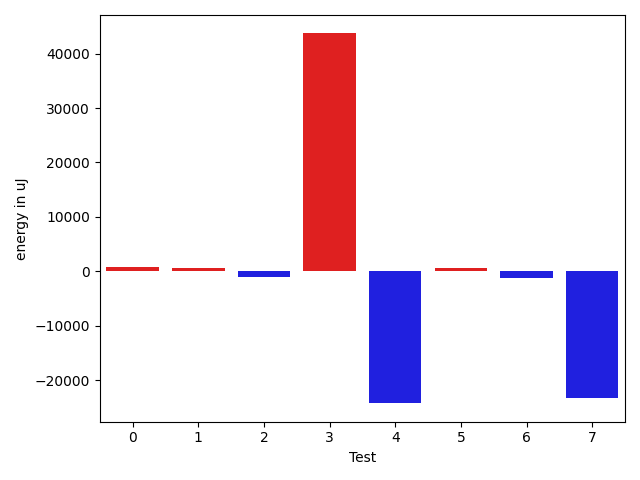

# gson 91be94

https://github.com/google/gson/commit/91be94

## Delta Energy per test method

| ID | EnergyV1 | EnergyV2 | DeltaEnergy | σV1 | σV2 |
| --- | --- | --- | --- | --- | --- |
| 0 | 35340 | 36072 | 732 | 12101.859676413342 | 20273.393551027166 |
| 1 | 34790 | 35339 | 549 | 2903.696686451038 | 16119.800902774492 |
| 2 | 36559 | 35522 | -1037 | 43966.42592941562 | 33860.296307892284 |
| 3 | 44617 | 88317 | 43700 | 39967.45828211017 | 44504.15688922542 |
| 4 | 63111 | 38880 | -24231 | 24404.97544830197 | 29061.53083291997 |
| 5 | 33996 | 34668 | 672 | 6709.453517368489 | 13906.636131250647 |
| 6 | 36132 | 34912 | -1220 | 26789.903387926555 | 26000.912277130887 |
| 7 | 116638 | 93445 | -23193 | 56031.930666580534 | 56651.331228787334 |

## Delta Duration per test method

| ID | DurationV1 | DurationsV2 | DeltaDuration |
| --- | --- | --- | --- |
| 0 | 886622.8695652174 | 1153806.8095238095 | 267183.93995859206 |
| 1 | 891602.8245614035 | 1027925.1607142857 | 136322.3361528822 |
| 2 | 2212836.425531915 | 1528623.5 | -684212.9255319149 |
| 3 | 2586958.7924528304 | 2817570.6603773586 | 230611.8679245282 |
| 4 | 2087909.2444444445 | 2007491.1744186047 | -80418.07002583984 |
| 5 | 942554.088888889 | 1063206.6037735848 | 120652.51488469588 |
| 6 | 1158899.8214285714 | 1073328.6944444445 | -85571.12698412687 |
| 7 | 3530029.7263157894 | 3387224.712765957 | -142805.01354983216 |

## Misc.

| ID | Test Class | Test Method |
| --- | --- | --- |
| 0 | com.google.gson.functional.StreamingTypeAdaptersTest | testDeserializeMap |
| 1 | com.google.gson.functional.StreamingTypeAdaptersTest | testDeserialize2dArray |
| 2 | com.google.gson.functional.StreamingTypeAdaptersTest | testDeserialize |
| 3 | com.google.gson.functional.StreamingTypeAdaptersTest | testDeserializeNullField |
| 4 | com.google.gson.functional.StreamingTypeAdaptersTest | testDeserializeWithCustomTypeAdapter |
| 5 | com.google.gson.functional.StreamingTypeAdaptersTest | testDeserialize1dArray |
| 6 | com.google.gson.functional.StreamingTypeAdaptersTest | testDeserializeNullObject |
| 7 | com.google.gson.ObjectTypeAdapterTest | testDeserialize |

| Test | IterationV1 | IterationV2 | DeltaIteration |
| --- | --- | --- | --- |
| 0 | 46 | 42 | -4 |
| 1 | 57 | 56 | -1 |
| 2 | 47 | 58 | 11 |
| 3 | 53 | 53 | 0 |
| 4 | 90 | 86 | -4 |
| 5 | 45 | 53 | 8 |
| 6 | 28 | 36 | 8 |
| 7 | 95 | 94 | -1 |

| Time Label | Time (s) |
| --- | --- |
| Selection | 26.79374933242798 |
| Injection | 10.111087083816528 |
| Total | 1084.8369538784027 |

