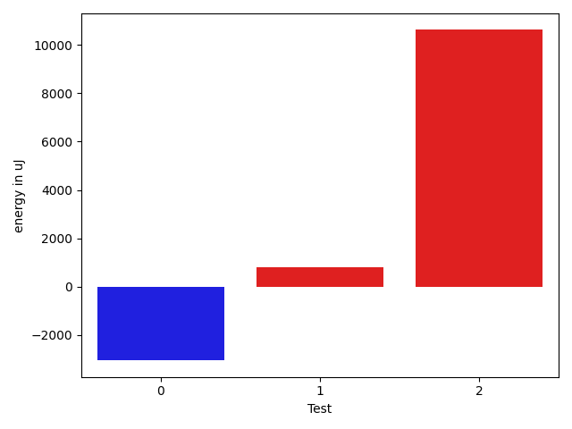

# gson f3c14b

https://github.com/google/gson/commit/f3c14b

## Delta Energy per test method

| ID | EnergyV1 | EnergyV2 | DeltaEnergy | σV1 | σV2 |
| --- | --- | --- | --- | --- | --- |
| 0 | 39185 | 36133 | -3052 | 462910.83425461035 | 382656.9477154653 |
| 1 | 104370 | 105163 | 793 | 610968.4409079627 | 662490.6278443045 |
| 2 | 168945 | 179565 | 10620 | 739599.8845602962 | 741770.2285979006 |

## Delta Duration per test method

| ID | DurationV1 | DurationsV2 | DeltaDuration |
| --- | --- | --- | --- |
| 0 | 5821082.484848484 | 4413637.02020202 | -1407445.4646464642 |
| 1 | 10942990.727272727 | 14243263.737373738 | 3300273.010101011 |
| 2 | 22153209.535353534 | 22681652.74747475 | 528443.2121212147 |

## Misc.

| ID | Test Class | Test Method |
| --- | --- | --- |
| 0 | com.google.gson.functional.TypeVariableTest | testAdvancedTypeVariables |
| 1 | com.google.gson.functional.TypeVariableTest | testTypeVariablesViaTypeParameter |
| 2 | com.google.gson.functional.MapAsArrayTypeAdapterTest | testSerializeComplexMapWithTypeAdapter |

| Test | IterationV1 | IterationV2 | DeltaIteration |
| --- | --- | --- | --- |
| 0 | 99 | 99 | 0 |
| 1 | 99 | 99 | 0 |
| 2 | 99 | 99 | 0 |

| Time Label | Time (s) |
| --- | --- |
| Selection | 27.039605140686035 |
| Injection | 10.030722379684448 |
| Total | 1080.5669131278992 |

