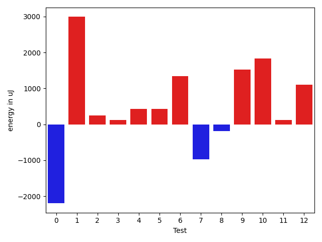
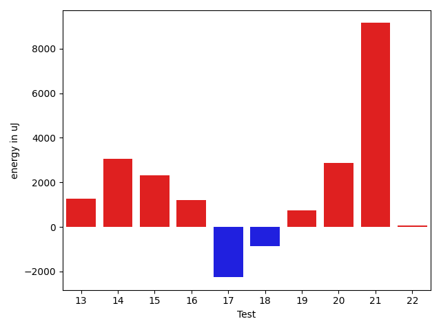

# gson 852cd7

https://github.com/google/gson/commit/852cd7

## Delta Energy per test method

| ID | EnergyV1 | EnergyV2 | DeltaEnergy | σV1 | σV2 |
| --- | --- | --- | --- | --- | --- |
| 0 | 38269 | 36072 | -2197 | 17394.01657233232 | 5336.8781550039175 |
| 1 | 33691 | 36682 | 2991 | 3231.6292655956795 | 4546.547472024448 |
| 2 | 35340 | 35583 | 243 | 4166.208674403826 | 3655.414571916826 |
| 3 | 35522 | 35644 | 122 | 4157.3192946175905 | 4247.724885438081 |
| 4 | 35156 | 35583 | 427 | 3336.593355011411 | 3774.8622472299744 |
| 5 | 36926 | 37353 | 427 | 11767.362317508776 | 10787.309646228265 |
| 6 | 34607 | 35950 | 1343 | 3954.055633872624 | 4658.352853308916 |
| 7 | 38453 | 37475 | -978 | 43861.0393802245 | 30849.827147337663 |
| 8 | 36194 | 36011 | -183 | 3427.771002034346 | 6306.733194598518 |
| 9 | 33203 | 34729 | 1526 | 3991.0964649655098 | 4293.979374166209 |
| 10 | 32165 | 33996 | 1831 | 4546.343012431039 | 4067.763297246319 |
| 11 | 36499 | 36621 | 122 | 3261.0331671432546 | 6091.142646450099 |
| 12 | 35583 | 36682 | 1099 | 4447.977896940843 | 6681.072068881923 |
| 13 | 33875 | 35157 | 1282 | 3576.9685843334055 | 8404.019563255175 |
| 14 | 33570 | 36621 | 3051 | 4087.8653234967387 | 4780.212130118136 |
| 15 | 33508 | 35827 | 2319 | 3327.3091776768442 | 4117.912801669336 |
| 16 | 35095 | 36316 | 1221 | 4216.275957152224 | 4394.925080749456 |
| 17 | 79651 | 77392 | -2259 | 575875.2557069596 | 486386.7082827046 |
| 18 | 44312 | 43457 | -855 | 152475.17056741766 | 27533.00295610569 |
| 19 | 37170 | 37902 | 732 | 7877.692141380939 | 9242.897232760248 |
| 20 | 34302 | 37170 | 2868 | 5468.4276254089655 | 4701.954170889793 |
| 21 | 106018 | 115173 | 9155 | 541553.4379586586 | 587491.1859000181 |
| 22 | 37476 | 37537 | 61 | 13355.019734518366 | 4713.1068799913955 |

## Delta Duration per test method

| ID | DurationV1 | DurationsV2 | DeltaDuration |
| --- | --- | --- | --- |
| 0 | 1480536.3 | 1246728.9166666667 | -233807.3833333333 |
| 1 | 954098.3333333334 | 896453.4363636364 | -57644.89696969697 |
| 2 | 1029642.0545454546 | 976521.4776119404 | -53120.57693351421 |
| 3 | 1027404.8194444445 | 1011299.0701754387 | -16105.749269005843 |
| 4 | 948471.551724138 | 925793.723076923 | -22677.82864721492 |
| 5 | 1312292.4225352113 | 1165904.5714285714 | -146387.85110663995 |
| 6 | 955423.1355932204 | 879313.6129032258 | -76109.52268999454 |
| 7 | 2237699.8767123288 | 1655124.8857142858 | -582574.990998043 |
| 8 | 1037094.9264705882 | 1009670.0196078431 | -27424.90686274506 |
| 9 | 1068733.0845070423 | 1052519.822580645 | -16213.261926397216 |
| 10 | 1003954.2903225806 | 963783.9393939395 | -40170.35092864116 |
| 11 | 1046993.7936507936 | 1024005.3529411765 | -22988.440709617105 |
| 12 | 1046799.0491803279 | 988384.3225806452 | -58414.726599682705 |
| 13 | 1014908.463768116 | 994960.5507246377 | -19947.91304347827 |
| 14 | 921110.7368421053 | 902472.1785714285 | -18638.55827067676 |
| 15 | 960624.275862069 | 941019.551724138 | -19604.724137931014 |
| 16 | 1085230.043478261 | 999742.4032258064 | -85487.64025245456 |
| 17 | 8706374.846938776 | 7151626.680412371 | -1554748.1665264051 |
| 18 | 2238727.7474747472 | 1916433.918367347 | -322293.82910740026 |
| 19 | 1255336.6125 | 1341252.3421052631 | 85915.7296052631 |
| 20 | 877696.5625 | 661027.3076923077 | -216669.25480769225 |
| 21 | 9738496.808080807 | 11053665.575757576 | 1315168.7676767688 |
| 22 | 1396075.725 | 841510.3 | -554565.425 |

## Misc.

| ID | Test Class | Test Method |
| --- | --- | --- |
| 0 | com.google.gson.functional.CustomTypeAdaptersTest | testCustomAdapterInvokedForMapElementDeserialization |
| 1 | com.google.gson.functional.MapTest | testMapDeserializationWithDuplicateKeys |
| 2 | com.google.gson.functional.MapTest | testMapDeserializationWithNullKey |
| 3 | com.google.gson.functional.MapTest | testMapStandardSubclassDeserialization |
| 4 | com.google.gson.functional.MapTest | testReadMapsWithEmptyStringKey |
| 5 | com.google.gson.functional.MapTest | testMapSubclassDeserialization |
| 6 | com.google.gson.functional.MapTest | testStringKeyDeserialization |
| 7 | com.google.gson.functional.MapTest | testMapDeserialization |
| 8 | com.google.gson.functional.MapTest | testMapDeserializationWithNullValue |
| 9 | com.google.gson.functional.MapTest | testComplexKeysDeserialization |
| 10 | com.google.gson.functional.MapTest | testMapDeserializationWithWildcardValues |
| 11 | com.google.gson.functional.MapTest | testMapDeserializationEmpty |
| 12 | com.google.gson.functional.MapTest | testMapDeserializationWithIntegerKeys |
| 13 | com.google.gson.functional.MapTest | testMapOfMapDeserialization |
| 14 | com.google.gson.functional.MapTest | testBooleanKeyDeserialization |
| 15 | com.google.gson.functional.MapTest | testNumberKeyDeserialization |
| 16 | com.google.gson.functional.MapTest | testParameterizedMapSubclassDeserialization |
| 17 | com.google.gson.functional.TypeVariableTest | testAdvancedTypeVariables |
| 18 | com.google.gson.functional.TypeVariableTest | testTypeVariablesViaTypeParameter |
| 19 | com.google.gson.functional.JsonParserTest | testExtraCommasInMaps |
| 20 | com.google.gson.functional.DefaultTypeAdaptersTest | testPropertiesDeserialization |
| 21 | com.google.gson.functional.MapAsArrayTypeAdapterTest | testSerializeComplexMapWithTypeAdapter |
| 22 | com.google.gson.functional.StreamingTypeAdaptersTest | testDeserializeMap |

| Test | IterationV1 | IterationV2 | DeltaIteration |
| --- | --- | --- | --- |
| 0 | 70 | 72 | 2 |
| 1 | 63 | 55 | -8 |
| 2 | 55 | 67 | 12 |
| 3 | 72 | 57 | -15 |
| 4 | 58 | 65 | 7 |
| 5 | 71 | 77 | 6 |
| 6 | 59 | 62 | 3 |
| 7 | 73 | 70 | -3 |
| 8 | 68 | 51 | -17 |
| 9 | 71 | 62 | -9 |
| 10 | 62 | 66 | 4 |
| 11 | 63 | 68 | 5 |
| 12 | 61 | 62 | 1 |
| 13 | 69 | 69 | 0 |
| 14 | 57 | 56 | -1 |
| 15 | 58 | 58 | 0 |
| 16 | 69 | 62 | -7 |
| 17 | 98 | 97 | -1 |
| 18 | 99 | 98 | -1 |
| 19 | 80 | 76 | -4 |
| 20 | 32 | 26 | -6 |
| 21 | 99 | 99 | 0 |
| 22 | 40 | 30 | -10 |

| Time Label | Time (s) |
| --- | --- |
| Selection | 26.62503957748413 |
| Injection | 11.649996519088745 |
| Total | 1114.7612402439117 |

