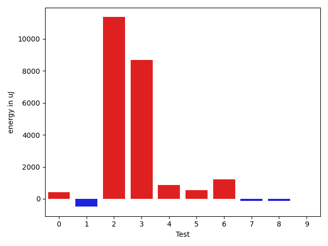

# gson ddde79

https://github.com/google/gson/commit/ddde79

## Delta Energy per test method

| ID | EnergyV1 | EnergyV2 | DeltaEnergy | σV1 | σV2 |
| --- | --- | --- | --- | --- | --- |
| 0 | 31616 | 32044 | 428 | 6624.510498325893 | 8462.028360752325 |
| 1 | 32897 | 32409 | -488 | 2501.6135234566823 | 2839.274465150616 |
| 2 | 1425961 | 1437314 | 11353 | 308449.7213555842 | 395130.2551556289 |
| 3 | 117919 | 126587 | 8668 | 40040.731341748404 | 37268.79913183682 |
| 4 | 33020 | 33874 | 854 | 246358.95430930966 | 398287.68953845586 |
| 5 | 30945 | 31494 | 549 | 7205.185135009264 | 9882.614417949932 |
| 6 | 31677 | 32898 | 1221 | 2983.065219681809 | 8408.204540509307 |
| 7 | 33875 | 33753 | -122 | 43434.482532538714 | 40572.926297870705 |
| 8 | 32593 | 32471 | -122 | 143303.41825767857 | 4496.912407300517 |
| 9 | 31189 | 31189 | 0 | 2352.356126153228 | 2977.768473632852 |

## Delta Duration per test method

| ID | DurationV1 | DurationsV2 | DeltaDuration |
| --- | --- | --- | --- |
| 0 | 1261285.5783132531 | 1267657.1363636365 | 6371.558050383348 |
| 1 | 842650.8979591837 | 815914.2553191489 | -26736.642640034785 |
| 2 | 40572188.98989899 | 38668987.45918367 | -1903201.5307153165 |
| 3 | 3535547.9680851065 | 3955255.8314606743 | 419707.86337556783 |
| 4 | 2668665.5070422534 | 5103064.013157895 | 2434398.5061156414 |
| 5 | 1408355.3673469387 | 1431853.0 | 23497.6326530613 |
| 6 | 853506.8571428572 | 1023727.3636363636 | 170220.5064935065 |
| 7 | 2157452.7215189873 | 1917915.488095238 | -239537.23342374922 |
| 8 | 1696778.1363636365 | 1132196.2933333332 | -564581.8430303033 |
| 9 | 852704.320754717 | 839415.8055555555 | -13288.515199161484 |

## Misc.

| ID | Test Class | Test Method |
| --- | --- | --- |
| 0 | com.google.gson.functional.VersioningTest | testVersionedGsonMixingSinceAndUntilDeserialization |
| 1 | com.google.gson.functional.VersioningTest | testIgnoreLaterVersionClassSerialization |
| 2 | com.google.gson.functional.VersioningTest | testVersionedClassesDeserialization |
| 3 | com.google.gson.functional.VersioningTest | testVersionedGsonWithUnversionedClassesSerialization |
| 4 | com.google.gson.functional.VersioningTest | testVersionedClassesSerialization |
| 5 | com.google.gson.functional.VersioningTest | testVersionedGsonMixingSinceAndUntilSerialization |
| 6 | com.google.gson.functional.VersioningTest | testIgnoreLaterVersionClassDeserialization |
| 7 | com.google.gson.functional.VersioningTest | testVersionedGsonWithUnversionedClassesDeserialization |
| 8 | com.google.gson.functional.VersioningTest | testVersionedUntilSerialization |
| 9 | com.google.gson.functional.VersioningTest | testVersionedUntilDeserialization |

| Test | IterationV1 | IterationV2 | DeltaIteration |
| --- | --- | --- | --- |
| 0 | 83 | 88 | 5 |
| 1 | 49 | 47 | -2 |
| 2 | 99 | 98 | -1 |
| 3 | 94 | 89 | -5 |
| 4 | 71 | 76 | 5 |
| 5 | 98 | 97 | -1 |
| 6 | 42 | 44 | 2 |
| 7 | 79 | 84 | 5 |
| 8 | 66 | 75 | 9 |
| 9 | 53 | 36 | -17 |

| Time Label | Time (s) |
| --- | --- |
| Selection | 27.35281252861023 |
| Injection | 9.875823497772217 |
| Total | 1082.8856160640717 |

