# gson bc68d7

https://github.com/google/gson/commit/bc68d7

## Delta Energy per test method

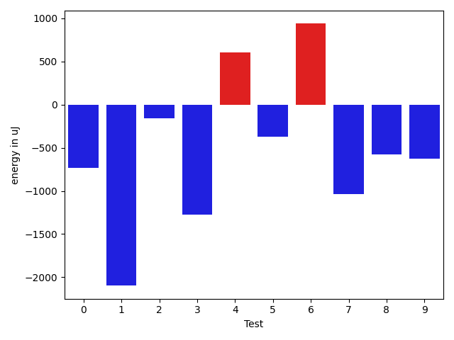

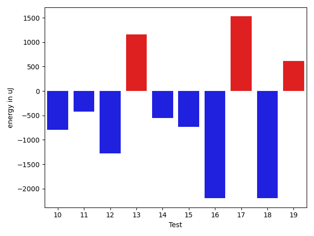

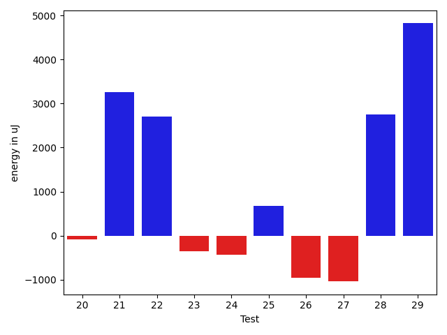

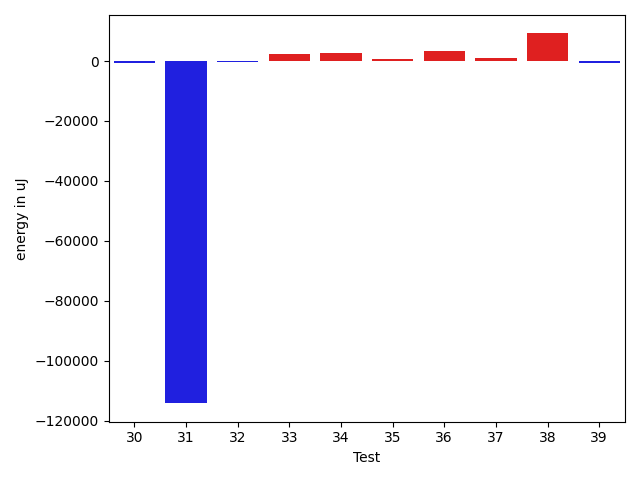

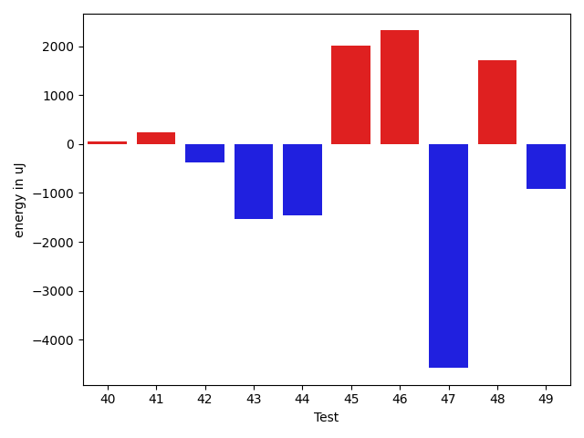

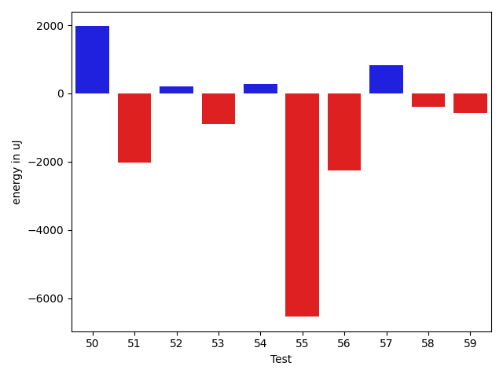

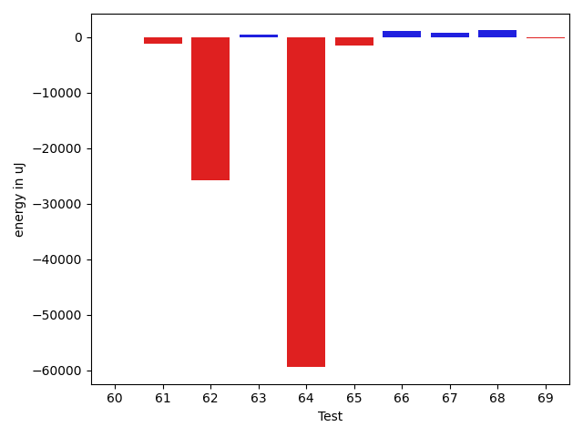

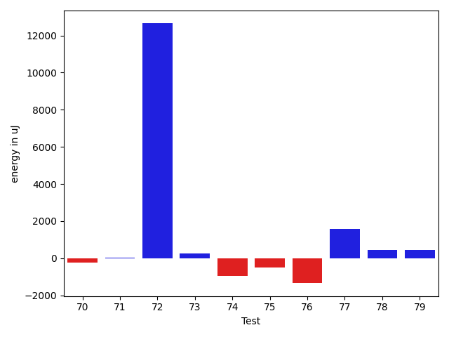

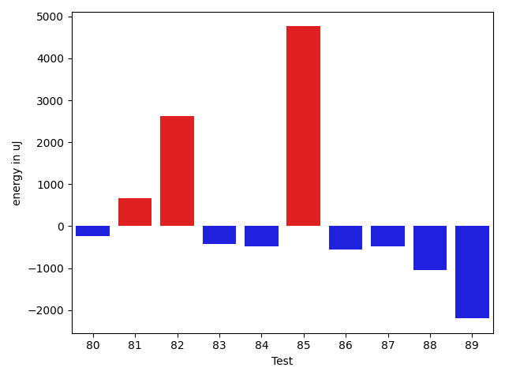

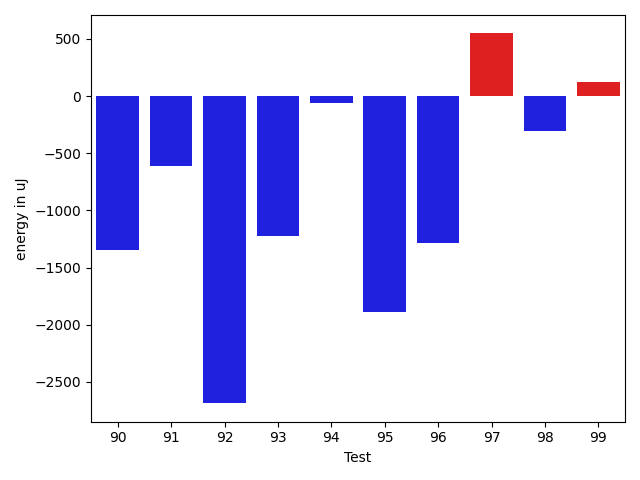

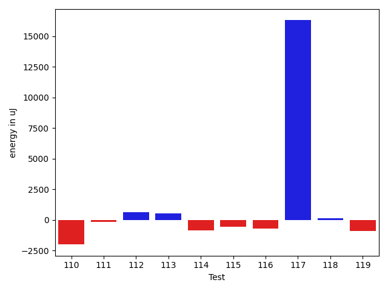

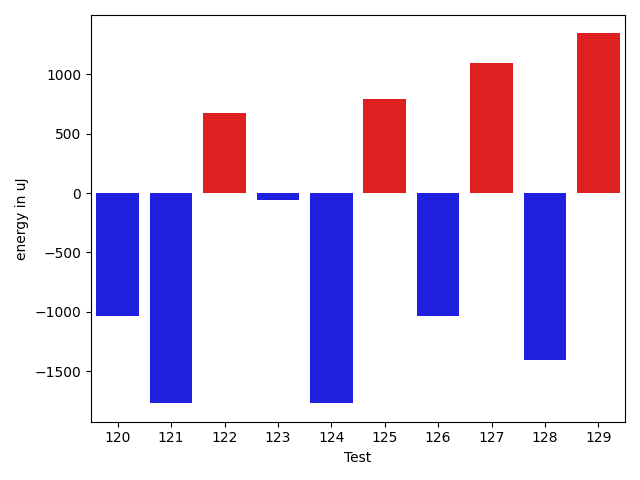

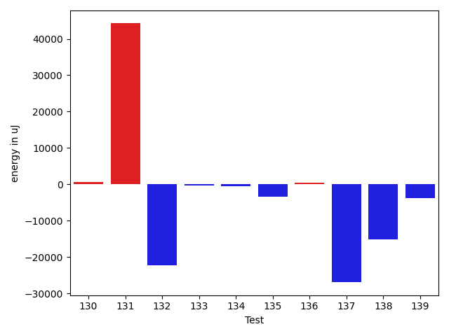

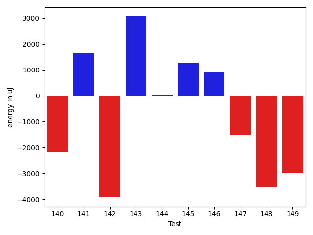

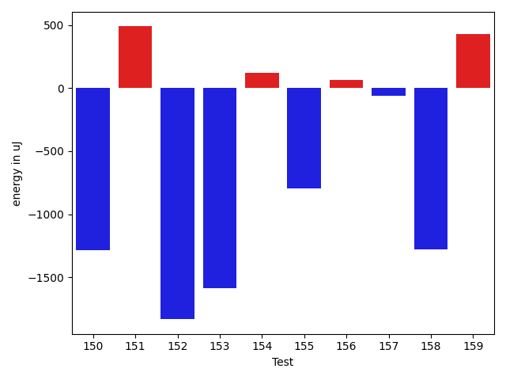

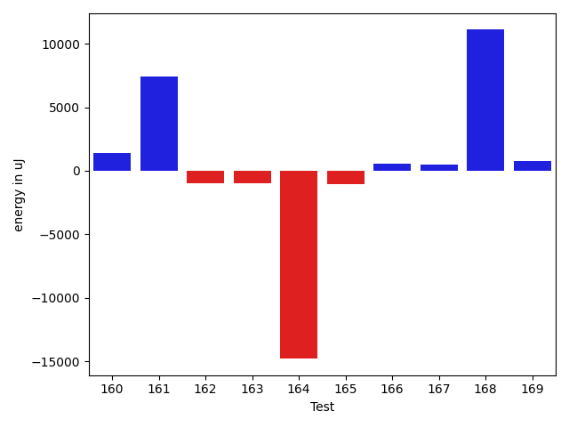

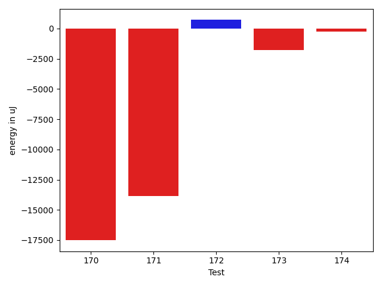

| ID | EnergyV1 | EnergyV2 | DeltaEnergy | σV1 | σV2 |
| --- | --- | --- | --- | --- | --- |
| 0 | 37170 | 36438 | -732 | 3680.294777595948 | 4392.7017800004405 |
| 1 | 119934 | 117065 | -2869 | 25457.133266776767 | 24671.371862463624 |
| 2 | 36988 | 37476 | 488 | 3937.7216766390693 | 3827.5846223477065 |
| 3 | 37170 | 36316 | -854 | 10890.114810768342 | 10445.435084279447 |
| 4 | 37231 | 37353 | 122 | 4511.494586197083 | 3830.728956558368 |
| 5 | 38513 | 38391 | -122 | 11671.282541321161 | 12517.294596554284 |
| 6 | 34179 | 36071 | 1892 | 3084.4089604728756 | 4043.6573146563373 |
| 7 | 35522 | 34241 | -1281 | 4253.780440965523 | 4197.238671957433 |
| 8 | 37353 | 36621 | -732 | 3204.242905434105 | 3940.919824755096 |
| 9 | 33997 | 32593 | -1404 | 5044.070534938689 | 3326.8821132639423 |
| 10 | 36255 | 35461 | -794 | 4691.235147450795 | 4372.993771147101 |
| 11 | 36865 | 36438 | -427 | 3810.462137812644 | 4280.374526650676 |
| 12 | 35279 | 33996 | -1283 | 4194.770821954936 | 3045.377326658947 |
| 13 | 37049 | 38208 | 1159 | 4453.619150633437 | 5246.687651076484 |
| 14 | 36865 | 36316 | -549 | 4774.308448026773 | 4364.602043455099 |
| 15 | 36926 | 36194 | -732 | 7087.433764560661 | 7345.633347551909 |
| 16 | 36743 | 34546 | -2197 | 3656.4332778097696 | 4214.342323877336 |
| 17 | 38147 | 39673 | 1526 | 15417.754038625586 | 17933.047304883352 |
| 18 | 37415 | 35218 | -2197 | 3853.337921710071 | 4171.866393092432 |
| 19 | 40100 | 40710 | 610 | 185355.34618904736 | 213770.32393357402 |
| 20 | 38819 | 37781 | -1038 | 4210.500506938445 | 4637.494393447413 |
| 21 | 77392 | 75622 | -1770 | 20315.084306217825 | 23269.880982433904 |
| 22 | 38880 | 38025 | -855 | 10577.562448119961 | 15901.148834770025 |
| 23 | 36865 | 36499 | -366 | 3711.4212235023783 | 3638.814322131573 |
| 24 | 38086 | 37109 | -977 | 3606.658089005341 | 3683.2945341274976 |
| 25 | 36987 | 36438 | -549 | 3951.2910573673535 | 7304.720167212229 |
| 26 | 37719 | 36926 | -793 | 3688.685478875364 | 4328.884698970979 |
| 27 | 36865 | 35035 | -1830 | 4210.697553418392 | 4122.2466177437755 |
| 28 | 39002 | 38330 | -672 | 21649.11515123334 | 26414.35418195165 |
| 29 | 36926 | 38818 | 1892 | 11565.728146362231 | 14052.430854737177 |
| 30 | 36255 | 35279 | -976 | 3568.6882138773394 | 4777.3714629149945 |
| 31 | 42481 | 37841 | -4640 | 435605.7867570343 | 329309.9466482052 |
| 32 | 39245 | 39734 | 489 | 4507.671165784276 | 4445.228924988629 |
| 33 | 39124 | 40344 | 1220 | 10798.774343384343 | 13146.565108469378 |
| 34 | 40405 | 41931 | 1526 | 17584.020618224164 | 20927.219148718796 |
| 35 | 38819 | 39184 | 365 | 7740.373756894162 | 8402.392391833178 |
| 36 | 37964 | 39611 | 1647 | 7954.7704050732245 | 13083.348940505388 |
| 37 | 37293 | 37781 | 488 | 4141.108572540926 | 5466.6007722233335 |
| 38 | 41443 | 44922 | 3479 | 38843.762363258946 | 42630.09390586313 |
| 39 | 37476 | 35888 | -1588 | 5054.426364736479 | 4064.8679513474535 |
| 40 | 38086 | 38147 | 61 | 4575.325250082701 | 4292.270512332799 |
| 41 | 37415 | 37659 | 244 | 4571.234850742422 | 4090.117603035087 |
| 42 | 39673 | 39306 | -367 | 13864.855101657047 | 16213.149865665035 |
| 43 | 40344 | 38818 | -1526 | 16055.988616201552 | 12966.322090484517 |
| 44 | 38574 | 37109 | -1465 | 4741.561792188586 | 4184.358273121983 |
| 45 | 40222 | 42236 | 2014 | 35232.57900176252 | 51008.218139679535 |
| 46 | 37292 | 39612 | 2320 | 4196.19113333747 | 3974.530946982387 |
| 47 | 45349 | 40771 | -4578 | 276546.8804637908 | 130679.59333673776 |
| 48 | 35584 | 37292 | 1708 | 3812.489098117382 | 4398.371151863019 |
| 49 | 38146 | 37232 | -914 | 3874.151299224386 | 4410.585218791518 |
| 50 | 35095 | 37048 | 1953 | 3961.0263198980647 | 4895.702967147116 |
| 51 | 38757 | 36133 | -2624 | 4212.930927513528 | 4319.381866102536 |
| 52 | 37597 | 38208 | 611 | 4749.8428278090305 | 3265.1321290369256 |
| 53 | 39185 | 39367 | 182 | 40727.62104910949 | 44443.11833479946 |
| 54 | 37659 | 38330 | 671 | 4671.893287074647 | 2735.4148113220417 |
| 55 | 42175 | 39917 | -2258 | 22528.638991746746 | 23717.609982195478 |
| 56 | 38940 | 38452 | -488 | 4151.9302131536315 | 3412.5602369912463 |
| 57 | 37353 | 37415 | 62 | 3900.681290571205 | 2212.9130082816678 |
| 58 | 38147 | 38147 | 0 | 3677.144092943885 | 4385.039170401053 |
| 59 | 40954 | 40405 | -549 | 3663.875961136478 | 3325.3603154395164 |
| 60 | 39124 | 38574 | -550 | 3677.306196031954 | 3956.779664451811 |
| 61 | 42359 | 39611 | -2748 | 3974.8869737492705 | 3491.5900533412737 |
| 62 | 41809 | 42481 | 672 | 344310.62170075515 | 279537.28005953913 |
| 63 | 36621 | 38757 | 2136 | 4412.134666143773 | 4784.849394323132 |
| 64 | 42175 | 42053 | -122 | 387387.4141875153 | 266799.132075913 |
| 65 | 39673 | 37720 | -1953 | 4372.5062384058365 | 4870.843819716258 |
| 66 | 35644 | 36315 | 671 | 4330.810412196416 | 6537.808149588549 |
| 67 | 36804 | 37720 | 916 | 4620.773422086557 | 4574.6726402613285 |
| 68 | 82092 | 82093 | 1 | 28831.192469004418 | 30992.848032538805 |
| 69 | 38513 | 38696 | 183 | 5991.071631541881 | 3824.0928311861962 |
| 70 | 38574 | 38330 | -244 | 3399.59652900164 | 4293.467377434438 |
| 71 | 36804 | 36316 | -488 | 3354.0419265941264 | 4826.34879245474 |
| 72 | 161011 | 162231 | 1220 | 199048.56386896982 | 209827.97395555448 |
| 73 | 36804 | 37598 | 794 | 3886.431651438344 | 4549.31047693555 |
| 74 | 41199 | 38208 | -2991 | 23624.135258394934 | 26811.366297773813 |
| 75 | 37781 | 37903 | 122 | 4148.403869874536 | 4370.864708425234 |
| 76 | 38452 | 36438 | -2014 | 3678.5760857575697 | 4438.855502082417 |
| 77 | 38757 | 38635 | -122 | 28483.650297502536 | 35877.61259059578 |
| 78 | 36926 | 37659 | 733 | 3371.041315009355 | 5144.918904401892 |
| 79 | 35828 | 37292 | 1464 | 4002.7493241950274 | 5236.102279578392 |
| 80 | 37903 | 37659 | -244 | 3898.2263132609005 | 3898.240278689771 |
| 81 | 40161 | 40832 | 671 | 392314.22386453475 | 214366.0918502981 |
| 82 | 36560 | 39185 | 2625 | 3998.5447695737653 | 4188.025097207961 |
| 83 | 37354 | 36927 | -427 | 4219.280901091328 | 4476.705606787624 |
| 84 | 38452 | 37964 | -488 | 4588.254129629049 | 4718.75406225432 |
| 85 | 117126 | 121887 | 4761 | 327521.92684938107 | 388354.8845425985 |
| 86 | 36865 | 36315 | -550 | 3352.5928532266144 | 4495.9961453323085 |
| 87 | 36804 | 36316 | -488 | 4591.9260233116265 | 7699.031709020974 |
| 88 | 36926 | 35889 | -1037 | 4548.231757507526 | 4158.359673559879 |
| 89 | 42480 | 40283 | -2197 | 406253.8069609991 | 444583.1492964751 |
| 90 | 38819 | 37475 | -1344 | 4685.464640616344 | 3221.3700018608365 |
| 91 | 40588 | 39978 | -610 | 21539.974085317834 | 23470.369109606927 |
| 92 | 38147 | 35461 | -2686 | 4002.2972064664173 | 3152.8728844192433 |
| 93 | 37292 | 36072 | -1220 | 5322.880417847871 | 3891.6712773322533 |
| 94 | 37353 | 37293 | -60 | 4810.501075937932 | 3818.527510376218 |
| 95 | 38330 | 36438 | -1892 | 4467.059220739884 | 4290.917572627021 |
| 96 | 40710 | 39428 | -1282 | 52379.18195774443 | 47376.45859446369 |
| 97 | 39063 | 39611 | 548 | 11988.918239676836 | 13485.547814309986 |
| 98 | 38940 | 38635 | -305 | 4151.864772089077 | 4441.112810496436 |
| 99 | 37719 | 37842 | 123 | 3658.522192173069 | 3370.7570397216905 |
| 100 | 45105 | 43030 | -2075 | 28002.398100749466 | 25791.061415197615 |
| 101 | 38757 | 36011 | -2746 | 4793.806918314827 | 4235.757332803662 |
| 102 | 41076 | 39184 | -1892 | 21083.812599016343 | 22377.110337627564 |
| 103 | 47668 | 43151 | -4517 | 221357.23617277818 | 65959.96138505025 |
| 104 | 39124 | 36865 | -2259 | 4152.227701204868 | 4017.790561340534 |
| 105 | 39855 | 37720 | -2135 | 24998.39298414861 | 16384.11945256222 |
| 106 | 38391 | 36377 | -2014 | 5078.125176348715 | 4526.587898185564 |
| 107 | 37354 | 37842 | 488 | 3342.496725503258 | 4316.895150806371 |
| 108 | 38574 | 36560 | -2014 | 4545.183576784506 | 3629.552268716418 |
| 109 | 40588 | 37842 | -2746 | 13845.202567037 | 4544.583306912679 |
| 110 | 38819 | 36926 | -1893 | 3661.6073565571924 | 4079.2764464288134 |
| 111 | 36804 | 36438 | -366 | 4138.109216665657 | 4236.142829010427 |
| 112 | 38452 | 38941 | 489 | 3861.143918725526 | 4295.593964067395 |
| 113 | 38696 | 38818 | 122 | 4511.037031425135 | 4465.235450637473 |
| 114 | 37110 | 36194 | -916 | 4241.105171772158 | 4005.21137125121 |
| 115 | 38513 | 37659 | -854 | 6230.076019842595 | 5124.1980234708835 |
| 116 | 37109 | 36682 | -427 | 4801.642084161968 | 4038.959099264207 |
| 117 | 74951 | 77698 | 2747 | 140642.1199525965 | 218680.72727191038 |
| 118 | 40893 | 40771 | -122 | 20050.734486826397 | 19968.551451004005 |
| 119 | 37780 | 38147 | 367 | 6042.843278616627 | 4038.3641970177846 |
| 120 | 38330 | 37293 | -1037 | 4444.4109587690455 | 3885.233975277816 |
| 121 | 39978 | 38208 | -1770 | 41115.595796772715 | 49326.341223443735 |
| 122 | 37659 | 38330 | 671 | 9260.059983610228 | 7529.699731490025 |
| 123 | 38513 | 38452 | -61 | 17249.931203842694 | 19745.515946792086 |
| 124 | 38391 | 36621 | -1770 | 5823.271960273062 | 7579.408800097985 |
| 125 | 82702 | 83496 | 794 | 162119.76834009116 | 335376.95909401693 |
| 126 | 39978 | 38941 | -1037 | 17317.065637006428 | 19483.71085952301 |
| 127 | 37781 | 38879 | 1098 | 7377.184395650624 | 9991.077404389946 |
| 128 | 38574 | 37170 | -1404 | 5902.611098812307 | 7050.125738648654 |
| 129 | 39611 | 40954 | 1343 | 28636.412801059352 | 33590.08286162996 |
| 130 | 38208 | 38757 | 549 | 3786.672311882718 | 5307.067551524101 |
| 131 | 42481 | 43701 | 1220 | 289265.2487084733 | 398251.261895684 |
| 132 | 38513 | 40038 | 1525 | 179321.14499683722 | 16466.693715986054 |
| 133 | 39489 | 39428 | -61 | 11422.428418641952 | 12218.830086792652 |
| 134 | 39673 | 40283 | 610 | 11354.820075117032 | 9554.916931302001 |
| 135 | 37659 | 36926 | -733 | 10023.142786736227 | 4100.390008709028 |
| 136 | 74096 | 44372 | -29724 | 47541.88893343822 | 52377.66251921138 |
| 137 | 39734 | 38086 | -1648 | 257133.56036665142 | 220707.75256172015 |
| 138 | 37476 | 37963 | 487 | 47158.971067325976 | 4520.789559899682 |
| 139 | 39673 | 38452 | -1221 | 20857.45828679093 | 14190.914746256149 |
| 140 | 75012 | 72388 | -2624 | 32230.807737721636 | 25644.275594555475 |
| 141 | 39185 | 40467 | 1282 | 2997.49029689839 | 4108.324441478074 |
| 142 | 41625 | 36377 | -5248 | 4025.263738713898 | 5256.1768542233585 |
| 143 | 39124 | 40589 | 1465 | 14990.467811181226 | 16166.99588196995 |
| 144 | 40039 | 40467 | 428 | 8902.58144281875 | 8613.262079582291 |
| 145 | 38574 | 39489 | 915 | 10850.022414022613 | 12524.138654266644 |
| 146 | 37171 | 38513 | 1342 | 8323.34703959573 | 10403.821698714437 |
| 147 | 40161 | 35705 | -4456 | 4798.476223865855 | 6024.602659916796 |
| 148 | 40833 | 36988 | -3845 | 4553.883411610711 | 3796.972977568782 |
| 149 | 39184 | 39917 | 733 | 52460.88233817916 | 44866.322627536574 |
| 150 | 39917 | 38635 | -1282 | 272881.73934620107 | 236251.89459256842 |
| 151 | 35950 | 36438 | 488 | 4427.395523609026 | 4009.1152096869127 |
| 152 | 39978 | 38146 | -1832 | 23520.829066489354 | 15120.567220825622 |
| 153 | 39612 | 38025 | -1587 | 4100.441026415464 | 4784.862887071328 |
| 154 | 38513 | 38635 | 122 | 3819.573341647235 | 5617.834432907003 |
| 155 | 38757 | 37964 | -793 | 17005.93762522019 | 12965.714511989521 |
| 156 | 37536 | 37598 | 62 | 4123.511463894207 | 3111.128065509358 |
| 157 | 37170 | 37110 | -60 | 3738.3605320114366 | 4300.8809237436 |
| 158 | 38879 | 37598 | -1281 | 2824.4184031612067 | 3979.9392389860377 |
| 159 | 37720 | 38147 | 427 | 5109.469106572659 | 4879.728148347523 |
| 160 | 36621 | 39062 | 2441 | 4514.37278944692 | 4055.186885985911 |
| 161 | 87829 | 87219 | -610 | 287253.2052350423 | 304703.5482187355 |
| 162 | 38818 | 38574 | -244 | 10600.194210693582 | 10042.627118989436 |
| 163 | 39978 | 40527 | 549 | 24472.831119967817 | 25505.485047270467 |
| 164 | 320494 | 308715 | -11779 | 170960.2805891166 | 169781.64580323792 |
| 165 | 40039 | 37597 | -2442 | 5149.315767206358 | 3720.0642708953073 |
| 166 | 38269 | 38086 | -183 | 4128.993618883898 | 4217.417522329981 |
| 167 | 39001 | 39368 | 367 | 4279.854125571081 | 3896.955697107092 |
| 168 | 78247 | 81543 | 3296 | 248931.02839263983 | 264230.62163163745 |
| 169 | 37293 | 38818 | 1525 | 4187.029495481462 | 4340.878817294479 |
| 170 | 39063 | 40161 | 1098 | 334121.07473406836 | 293648.23952475464 |
| 171 | 43518 | 42053 | -1465 | 353553.7550202075 | 328478.8623261178 |
| 172 | 39368 | 38574 | -794 | 5377.405327437718 | 6985.708234621326 |
| 173 | 40039 | 38086 | -1953 | 4481.579266254607 | 3772.424555574306 |
| 174 | 39856 | 39307 | -549 | 4401.121992420787 | 4678.27846914148 |

## Delta Duration per test method

| ID | DurationV1 | DurationsV2 | DeltaDuration |
| --- | --- | --- | --- |
| 0 | 734956.08 | 741188.4390243902 | 6232.359024390229 |
| 1 | 3676296.494949495 | 3768095.6464646463 | 91799.15151515137 |
| 2 | 818079.5373134328 | 797250.25 | -20829.287313432782 |
| 3 | 1313553.2307692308 | 1268049.2043010753 | -45504.02646815544 |
| 4 | 740398.5757575758 | 761028.2765957447 | 20629.70083816885 |
| 5 | 1329483.9574468085 | 1333216.8645833333 | 3732.9071365247946 |
| 6 | 499612.9696969697 | 503587.35294117645 | 3974.3832442067214 |
| 7 | 755068.7307692308 | 802950.05 | 47881.319230769295 |
| 8 | 749379.1454545455 | 723432.4150943396 | -25946.730360205867 |
| 9 | 487880.0869565217 | 523410.6666666667 | 35530.57971014496 |
| 10 | 791749.8863636364 | 777244.3529411765 | -14505.533422459848 |
| 11 | 762439.3333333334 | 745965.16 | -16474.17333333334 |
| 12 | 503194.25 | 564355.2222222222 | 61160.97222222225 |
| 13 | 529637.5333333333 | 550573.0588235294 | 20935.525490196072 |
| 14 | 460135.1304347826 | 473191.71428571426 | 13056.583850931667 |
| 15 | 833466.0 | 941368.1666666666 | 107902.16666666663 |
| 16 | 780476.6808510638 | 912405.5918367347 | 131928.91098567087 |
| 17 | 1042689.1666666666 | 1264432.2542372881 | 221743.08757062152 |
| 18 | 445904.125 | 495487.28571428574 | 49583.16071428574 |
| 19 | 2009065.8870967743 | 2668970.417910448 | 659904.5308136735 |
| 20 | 851196.6315789474 | 894978.5636363636 | 43781.93205741618 |
| 21 | 2345706.0606060605 | 2450449.5757575757 | 104743.51515151514 |
| 22 | 1123632.2428571428 | 1274704.5185185184 | 151072.2756613756 |
| 23 | 757206.9166666666 | 792202.7301587302 | 34995.81349206355 |
| 24 | 733319.1111111111 | 768487.9433962264 | 35168.83228511526 |
| 25 | 929314.1612903225 | 1019572.304347826 | 90258.1430575035 |
| 26 | 757677.2291666666 | 809958.1063829787 | 52280.8772163121 |
| 27 | 663514.6818181818 | 689191.775 | 25677.093181818258 |
| 28 | 979512.0576923077 | 1227469.2727272727 | 247957.21503496496 |
| 29 | 911001.6458333334 | 1154601.5454545454 | 243599.89962121204 |
| 30 | 520213.05263157893 | 563581.2692307692 | 43368.21659919032 |
| 31 | 6704982.6875 | 2968121.0384615385 | -3736861.6490384615 |
| 32 | 557706.7272727273 | 556391.0666666667 | -1315.6606060606427 |
| 33 | 1157015.9375 | 1188441.857142857 | 31425.919642857043 |
| 34 | 1500209.888888889 | 1588391.75 | 88181.86111111101 |
| 35 | 960627.7534246575 | 1048745.4393939395 | 88117.68596928194 |
| 36 | 939008.9848484849 | 1037023.234375 | 98014.24952651514 |
| 37 | 880189.6034482758 | 939549.0847457628 | 59359.48129748693 |
| 38 | 1868980.0777777778 | 2033565.0107526882 | 164584.93297491036 |
| 39 | 592652.5925925926 | 594234.8484848485 | 1582.2558922559256 |
| 40 | 713093.8947368421 | 738654.25 | 25560.355263157864 |
| 41 | 810249.1724137932 | 844820.5909090909 | 34571.41849529778 |
| 42 | 985297.1694915254 | 1212928.6721311475 | 227631.50263962208 |
| 43 | 1228192.525 | 1300132.294117647 | 71939.76911764708 |
| 44 | 753599.6078431372 | 828808.0535714285 | 75208.44572829129 |
| 45 | 1348668.5106382978 | 1946832.4423076923 | 598163.9316693945 |
| 46 | 545620.65 | 525949.1538461539 | -19671.49615384615 |
| 47 | 3383131.2421052633 | 2126260.3571428573 | -1256870.884962406 |
| 48 | 624157.9583333334 | 577483.9285714285 | -46674.02976190485 |
| 49 | 548133.6451612903 | 511766.5 | -36367.145161290304 |
| 50 | 580364.0 | 483852.73913043475 | -96511.26086956525 |
| 51 | 557846.0769230769 | 516030.4285714286 | -41815.6483516483 |
| 52 | 462949.8333333333 | 487318.76470588235 | 24368.931372549036 |
| 53 | 1571935.857142857 | 1581626.2777777778 | 9690.420634920709 |
| 54 | 568591.1764705882 | 541297.7 | -27293.47647058824 |
| 55 | 1315691.7931034483 | 949074.724137931 | -366617.06896551733 |
| 56 | 416173.28571428574 | 425298.3125 | 9125.02678571426 |
| 57 | 377471.0 | 445282.93333333335 | 67811.93333333335 |
| 58 | 419064.28571428574 | 485993.82352941175 | 66929.53781512601 |
| 59 | 416362.875 | 442794.75 | 26431.875 |
| 60 | 370475.875 | 425057.7368421053 | 54581.86184210528 |
| 61 | 388255.35714285716 | 438229.92307692306 | 49974.565934065904 |
| 62 | 3697037.8313253014 | 3093083.451219512 | -603954.3801057893 |
| 63 | 767198.8627450981 | 737292.7575757576 | -29906.105169340502 |
| 64 | 4667379.549295775 | 3050159.5614035088 | -1617219.987892266 |
| 65 | 603218.9714285714 | 560441.3478260869 | -42777.62360248447 |
| 66 | 867040.8541666666 | 868404.6363636364 | 1363.7821969697252 |
| 67 | 630776.2432432432 | 669003.8333333334 | 38227.590090090176 |
| 68 | 2491888.9393939395 | 2485688.3434343436 | -6200.59595959587 |
| 69 | 975547.2898550725 | 946978.0161290322 | -28569.273726040265 |
| 70 | 557215.8 | 471490.4375 | -85725.36250000005 |
| 71 | 787923.1818181818 | 741347.9056603773 | -46575.276157804416 |
| 72 | 5543793.464646464 | 5877275.797979798 | 333482.33333333395 |
| 73 | 870597.3384615384 | 840388.7333333333 | -30208.60512820515 |
| 74 | 887253.3714285714 | 851642.2380952381 | -35611.1333333333 |
| 75 | 625892.6842105263 | 579831.8484848485 | -46060.83572567778 |
| 76 | 739158.5476190476 | 694690.119047619 | -44468.42857142852 |
| 77 | 1082704.046511628 | 1070015.4054054054 | -12688.641106222523 |
| 78 | 450196.1 | 416374.82352941175 | -33821.27647058823 |
| 79 | 612491.09375 | 587855.6774193548 | -24635.41633064521 |
| 80 | 788574.6511627907 | 775524.5208333334 | -13050.130329457344 |
| 81 | 5021639.05479452 | 2734250.512820513 | -2287388.541974007 |
| 82 | 640065.4 | 680060.78125 | 39995.38124999998 |
| 83 | 610971.5909090909 | 533163.6875 | -77807.90340909094 |
| 84 | 858448.1186440678 | 865254.3673469388 | 6806.248702871031 |
| 85 | 5411489.05050505 | 5839185.929292929 | 427696.8787878789 |
| 86 | 429600.3333333333 | 418825.8181818182 | -10774.515151515137 |
| 87 | 829239.5185185185 | 791445.6041666666 | -37793.91435185191 |
| 88 | 741607.42 | 749299.8604651163 | 7692.440465116291 |
| 89 | 6389791.894736842 | 8160061.619047619 | 1770269.7243107772 |
| 90 | 564589.5945945946 | 547189.2333333333 | -17400.361261261278 |
| 91 | 1551482.191919192 | 1560985.193877551 | 9503.001958359033 |
| 92 | 649636.7666666667 | 593760.3428571429 | -55876.42380952381 |
| 93 | 522705.6666666667 | 504293.04347826086 | -18412.62318840582 |
| 94 | 488891.16 | 487475.2 | -1415.9599999999627 |
| 95 | 765225.375 | 772012.880952381 | 6787.505952380947 |
| 96 | 1389496.78125 | 1508810.4166666667 | 119313.63541666674 |
| 97 | 829837.6521739131 | 1016408.1428571428 | 186570.49068322976 |
| 98 | 654571.2857142857 | 640571.5666666667 | -13999.71904761903 |
| 99 | 585706.5588235294 | 532285.9166666666 | -53420.64215686277 |
| 100 | 1376561.857142857 | 1206836.7826086956 | -169725.07453416148 |
| 101 | 542859.052631579 | 539144.44 | -3714.612631579046 |
| 102 | 1472347.3170731708 | 1379762.261904762 | -92585.0551684089 |
| 103 | 3551574.626506024 | 2262595.3164556962 | -1288979.3100503278 |
| 104 | 546992.8928571428 | 545453.3870967742 | -1539.5057603686582 |
| 105 | 956160.0 | 783463.5238095238 | -172696.4761904762 |
| 106 | 560259.1666666666 | 579212.3478260869 | 18953.181159420288 |
| 107 | 566235.6 | 499317.75 | -66917.84999999998 |
| 108 | 805478.7307692308 | 777221.0 | -28257.73076923075 |
| 109 | 742204.2051282051 | 537725.5142857142 | -204478.69084249088 |
| 110 | 521075.75 | 523220.5833333333 | 2144.833333333314 |
| 111 | 804093.0384615385 | 791855.2931034482 | -12237.745358090266 |
| 112 | 543169.9444444445 | 542530.6818181818 | -639.2626262627309 |
| 113 | 562442.1 | 523944.44444444444 | -38497.65555555554 |
| 114 | 734622.2884615385 | 730215.1 | -4407.188461538521 |
| 115 | 712829.6923076923 | 543249.7391304348 | -169579.95317725744 |
| 116 | 866546.3728813559 | 849221.7931034482 | -17324.579777907697 |
| 117 | 2843055.131313131 | 3249253.121212121 | 406197.9898989899 |
| 118 | 1486883.8387096773 | 1467117.3695652173 | -19766.469144460047 |
| 119 | 928720.4411764706 | 952378.3928571428 | 23657.95168067224 |
| 120 | 937456.8985507246 | 967198.3 | 29741.401449275436 |
| 121 | 1623634.9875 | 1623181.606741573 | -453.3807584270835 |
| 122 | 1190973.4390243902 | 1163741.8658536586 | -27231.573170731543 |
| 123 | 1400210.1460674158 | 1429730.264367816 | 29520.11830040021 |
| 124 | 1039322.3472222222 | 1071140.894736842 | 31818.54751461977 |
| 125 | 3026256.717171717 | 4866029.424242424 | 1839772.7070707069 |
| 126 | 1062343.0666666667 | 1271703.6315789474 | 209360.56491228077 |
| 127 | 1054467.0 | 1131844.1486486488 | 77377.14864864876 |
| 128 | 1018772.0133333333 | 1068099.4383561644 | 49327.42502283107 |
| 129 | 1349174.014084507 | 1393835.5735294118 | 44661.55944490479 |
| 130 | 846698.1132075472 | 863666.7735849057 | 16968.660377358436 |
| 131 | 3541264.0985915493 | 4761692.304347826 | 1220428.2057562768 |
| 132 | 1816108.372881356 | 1150322.8307692308 | -665785.5421121251 |
| 133 | 1164919.1756756757 | 1191761.119047619 | 26841.943371943198 |
| 134 | 1130473.7926829269 | 1142179.7571428572 | 11705.964459930314 |
| 135 | 678734.8888888889 | 610240.1891891892 | -68494.69969969965 |
| 136 | 2199645.025 | 1948259.62 | -251385.4049999998 |
| 137 | 2972200.2258064514 | 2020075.6153846155 | -952124.6104218359 |
| 138 | 1032589.9 | 558809.4857142858 | -473780.4142857143 |
| 139 | 906652.1290322581 | 794238.0285714286 | -112414.10046082945 |
| 140 | 2147073.414141414 | 1988401.111111111 | -158672.3030303032 |
| 141 | 522969.6 | 489692.26086956525 | -33277.33913043473 |
| 142 | 603378.3684210526 | 626214.8260869565 | 22836.45766590396 |
| 143 | 1288319.1923076923 | 1353473.0256410257 | 65153.83333333349 |
| 144 | 833249.2352941176 | 820046.6363636364 | -13202.59893048124 |
| 145 | 1090546.7681159421 | 1151578.2173913044 | 61031.449275362305 |
| 146 | 1073135.5714285714 | 1087575.1621621621 | 14439.590733590769 |
| 147 | 576618.5384615385 | 1160431.3333333333 | 583812.7948717948 |
| 148 | 392416.5 | 399509.82352941175 | 7093.323529411748 |
| 149 | 1889421.6483516484 | 1826884.2705882352 | -62537.377763413126 |
| 150 | 2770600.537037037 | 2069632.7115384615 | -700967.8254985753 |
| 151 | 542374.8620689656 | 502205.4736842105 | -40169.38838475506 |
| 152 | 981001.8367346938 | 850312.6888888889 | -130689.14784580492 |
| 153 | 601553.0277777778 | 562485.9523809524 | -39067.07539682533 |
| 154 | 566371.9333333333 | 569733.9 | 3361.9666666666744 |
| 155 | 1288203.2352941176 | 1062832.9701492537 | -225370.26514486386 |
| 156 | 457578.6666666667 | 406631.2 | -50947.466666666674 |
| 157 | 552630.6896551724 | 494016.2631578947 | -58614.42649727769 |
| 158 | 425413.0909090909 | 481366.82352941175 | 55953.732620320865 |
| 159 | 872732.2321428572 | 803816.3653846154 | -68915.86675824178 |
| 160 | 550232.7222222222 | 472087.85714285716 | -78144.86507936509 |
| 161 | 4598000.333333333 | 4898217.434343434 | 300217.1010101009 |
| 162 | 934999.0476190476 | 986508.918367347 | 51509.87074829941 |
| 163 | 1110343.6304347827 | 1049146.6315789474 | -61196.99885583529 |
| 164 | 9638900.242424242 | 9381161.484848484 | -257738.7575757578 |
| 165 | 588448.64 | 617730.3428571429 | 29281.702857142896 |
| 166 | 750404.8333333334 | 727987.8478260869 | -22416.985507246456 |
| 167 | 756643.6666666666 | 746333.1904761905 | -10310.476190476096 |
| 168 | 3898601.38372093 | 4211192.302325581 | 312590.918604651 |
| 169 | 739525.7619047619 | 771976.2790697674 | 32450.517165005556 |
| 170 | 2948433.7333333334 | 2533681.8333333335 | -414751.8999999999 |
| 171 | 3632083.6666666665 | 3509734.0344827585 | -122349.63218390802 |
| 172 | 504310.6666666667 | 650685.6818181818 | 146375.01515151508 |
| 173 | 428699.82352941175 | 409569.45 | -19130.373529411736 |
| 174 | 880778.1428571428 | 788465.8627450981 | -92312.28011204477 |

## Misc.

| ID | Test Class | Test Method |
| --- | --- | --- |
| 0 | com.google.gson.functional.DefaultTypeAdaptersTest | testDateSerializationWithPatternNotOverridenByTypeAdapter |
| 1 | com.google.gson.functional.DefaultTypeAdaptersTest | testDefaultDateDeserializationUsingBuilder |
| 2 | com.google.gson.functional.DefaultTypeAdaptersTest | testDateDeserializationWithPattern |
| 3 | com.google.gson.functional.DefaultTypeAdaptersTest | testDateSerializationInCollection |
| 4 | com.google.gson.functional.DefaultTypeAdaptersTest | testDefaultDateSerializationUsingBuilder |
| 5 | com.google.gson.functional.DefaultTypeAdaptersTest | testDateSerializationWithPattern |
| 6 | com.google.gson.functional.DefaultTypeAdaptersTest | testDefaultGregorianCalendarDeserialization |
| 7 | com.google.gson.functional.DefaultTypeAdaptersTest | testBitSetDeserialization |
| 8 | com.google.gson.functional.DefaultTypeAdaptersTest | testSqlDateSerialization |
| 9 | com.google.gson.functional.DefaultTypeAdaptersTest | testBitSetSerialization |
| 10 | com.google.gson.functional.DefaultTypeAdaptersTest | testSetSerialization |
| 11 | com.google.gson.functional.DefaultTypeAdaptersTest | testTimestampSerialization |
| 12 | com.google.gson.functional.DefaultTypeAdaptersTest | testDefaultCalendarSerialization |
| 13 | com.google.gson.functional.DefaultTypeAdaptersTest | testDefaultCalendarDeserialization |
| 14 | com.google.gson.functional.DefaultTypeAdaptersTest | testDefaultGregorianCalendarSerialization |
| 15 | com.google.gson.functional.CustomTypeAdaptersTest | testCustomAdapterInvokedForMapElementDeserialization |
| 16 | com.google.gson.functional.CustomTypeAdaptersTest | testCustomAdapterInvokedForMapElementSerializationWithType |
| 17 | com.google.gson.functional.CustomTypeAdaptersTest | testCustomNestedSerializers |
| 18 | com.google.gson.functional.CustomTypeAdaptersTest | testCustomAdapterInvokedForMapElementSerialization |
| 19 | com.google.gson.functional.CustomTypeAdaptersTest | testCustomSerializers |
| 20 | com.google.gson.functional.CustomTypeAdaptersTest | testCustomNestedDeserializers |
| 21 | com.google.gson.functional.CustomTypeAdaptersTest | testCustomTypeAdapterDoesNotAppliesToSubClasses |
| 22 | com.google.gson.functional.CustomTypeAdaptersTest | testCustomAdapterInvokedForCollectionElementSerializationWithType |
| 23 | com.google.gson.functional.CustomTypeAdaptersTest | testCustomByteArrayDeserializerAndInstanceCreator |
| 24 | com.google.gson.functional.CustomTypeAdaptersTest | testCustomByteArraySerializer |
| 25 | com.google.gson.functional.CustomTypeAdaptersTest | testCustomAdapterInvokedForCollectionElementDeserialization |
| 26 | com.google.gson.functional.CustomTypeAdaptersTest | testCustomTypeAdapterAppliesToSubClassesSerializedAsBaseClass |
| 27 | com.google.gson.functional.CustomTypeAdaptersTest | testEnsureCustomDeserializerNotInvokedForNullValues |
| 28 | com.google.gson.functional.CustomTypeAdaptersTest | testCustomDeserializers |
| 29 | com.google.gson.functional.CustomTypeAdaptersTest | testEnsureCustomSerializerNotInvokedForNullValues |
| 30 | com.google.gson.functional.CustomTypeAdaptersTest | testCustomAdapterInvokedForCollectionElementSerialization |
| 31 | com.google.gson.LongSerializationPolicyTest | testDefaultLongSerializationIntegration |
| 32 | com.google.gson.LongSerializationPolicyTest | testStringLongSerializationIntegration |
| 33 | com.google.gson.functional.MapTest | testSerializeMaps |
| 34 | com.google.gson.functional.MapTest | testInterfaceTypeMapWithSerializer |
| 35 | com.google.gson.functional.MapTest | testMapSubclassDeserialization |
| 36 | com.google.gson.functional.MapTest | testCustomSerializerForSpecificMapType |
| 37 | com.google.gson.functional.MapTest | testGeneralMapField |
| 38 | com.google.gson.functional.MapTest | testInterfaceTypeMap |
| 39 | com.google.gson.functional.MapTest | testMapSerializationWithNullValuesSerialized |
| 40 | com.google.gson.functional.MapTest | testMapSerializationWithNullValueButSerializeNulls |
| 41 | com.google.gson.functional.CustomDeserializerTest | testCustomDeserializerReturnsNullForArrayElementsForArrayField |
| 42 | com.google.gson.functional.CustomDeserializerTest | testCustomDeserializerReturnsNull |
| 43 | com.google.gson.functional.CustomDeserializerTest | testJsonTypeFieldBasedDeserialization |
| 44 | com.google.gson.functional.CustomDeserializerTest | testCustomDeserializerReturnsNullForArrayElements |
| 45 | com.google.gson.functional.CustomDeserializerTest | testCustomDeserializerReturnsNullForTopLevelObject |
| 46 | com.google.gson.functional.TypeAdapterPrecedenceTest | testStreamingHierarchicalFollowedByNonstreaming |
| 47 | com.google.gson.functional.TypeAdapterPrecedenceTest | testSerializeNonstreamingTypeAdapterFollowedByStreamingTypeAdapter |
| 48 | com.google.gson.functional.TypeAdapterPrecedenceTest | testStreamingFollowedByNonstreaming |
| 49 | com.google.gson.functional.TypeAdapterPrecedenceTest | testNonstreamingHierarchicalFollowedByNonstreaming |
| 50 | com.google.gson.functional.TypeAdapterPrecedenceTest | testStreamingHierarchicalFollowedByNonstreamingHierarchical |
| 51 | com.google.gson.functional.TypeAdapterPrecedenceTest | testStreamingFollowedByNonstreamingHierarchical |
| 52 | com.google.gson.functional.PrimitiveTest | testLongAsStringDeserialization |
| 53 | com.google.gson.functional.PrimitiveTest | testHtmlCharacterSerialization |
| 54 | com.google.gson.functional.PrimitiveTest | testLongAsStringSerialization |
| 55 | com.google.gson.functional.PrimitiveTest | testMoreSpecificSerialization |
| 56 | com.google.gson.functional.PrimitiveTest | testFloatInfinitySerialization |
| 57 | com.google.gson.functional.PrimitiveTest | testNegativeInfinityFloatSerialization |
| 58 | com.google.gson.functional.PrimitiveTest | testDoubleNaNSerialization |
| 59 | com.google.gson.functional.PrimitiveTest | testDoubleInfinitySerialization |
| 60 | com.google.gson.functional.PrimitiveTest | testFloatNaNSerialization |
| 61 | com.google.gson.functional.PrimitiveTest | testNegativeInfinitySerialization |
| 62 | com.google.gson.JsonParserTest | testReadWriteTwoObjects |
| 63 | com.google.gson.functional.CustomSerializerTest | testSerializerReturnsNull |
| 64 | com.google.gson.functional.CustomSerializerTest | testSubClassSerializerInvokedForBaseClassFieldsHoldingSubClassInstances |
| 65 | com.google.gson.functional.CustomSerializerTest | testBaseClassSerializerInvokedForBaseClassFields |
| 66 | com.google.gson.functional.CustomSerializerTest | testSubClassSerializerInvokedForBaseClassFieldsHoldingArrayOfSubClassInstances |
| 67 | com.google.gson.functional.CustomSerializerTest | testBaseClassSerializerInvokedForBaseClassFieldsHoldingSubClassInstances |
| 68 | com.google.gson.functional.ObjectTest | testSingletonLists |
| 69 | com.google.gson.functional.ObjectTest | testInnerClassDeserialization |
| 70 | com.google.gson.functional.ObjectTest | testJsonObjectSerialization |
| 71 | com.google.gson.functional.VersioningTest | testVersionedGsonMixingSinceAndUntilDeserialization |
| 72 | com.google.gson.functional.VersioningTest | testVersionedUntilSerialization |
| 73 | com.google.gson.functional.VersioningTest | testVersionedGsonMixingSinceAndUntilSerialization |
| 74 | com.google.gson.functional.VersioningTest | testVersionedUntilDeserialization |
| 75 | com.google.gson.functional.VersioningTest | testIgnoreLaterVersionClassSerialization |
| 76 | com.google.gson.functional.VersioningTest | testVersionedClassesDeserialization |
| 77 | com.google.gson.functional.VersioningTest | testVersionedGsonWithUnversionedClassesSerialization |
| 78 | com.google.gson.functional.VersioningTest | testIgnoreLaterVersionClassDeserialization |
| 79 | com.google.gson.functional.VersioningTest | testVersionedGsonWithUnversionedClassesDeserialization |
| 80 | com.google.gson.functional.VersioningTest | testVersionedClassesSerialization |
| 81 | com.google.gson.functional.FieldExclusionTest | testDefaultInnerClassExclusion |
| 82 | com.google.gson.functional.FieldExclusionTest | testDefaultNestedStaticClassIncluded |
| 83 | com.google.gson.functional.FieldExclusionTest | testInnerClassExclusion |
| 84 | com.google.gson.functional.TypeHierarchyAdapterTest | testRegisterSuperTypeFirst |
| 85 | com.google.gson.functional.TypeHierarchyAdapterTest | testTypeHierarchy |
| 86 | com.google.gson.functional.TypeHierarchyAdapterTest | testRegisterSubTypeFirstAllowed |
| 87 | com.google.gson.functional.NullObjectAndFieldTest | testCustomTypeAdapterPassesNullDesrialization |
| 88 | com.google.gson.functional.NullObjectAndFieldTest | testPrintPrintingObjectWithNulls |
| 89 | com.google.gson.functional.NullObjectAndFieldTest | testTopLevelNullObjectSerialization |
| 90 | com.google.gson.functional.NullObjectAndFieldTest | testExplicitNullSetsFieldToNullDuringDeserialization |
| 91 | com.google.gson.functional.NullObjectAndFieldTest | testExplicitSerializationOfNullArrayMembers |
| 92 | com.google.gson.functional.NullObjectAndFieldTest | testExplicitSerializationOfNullCollectionMembers |
| 93 | com.google.gson.functional.NullObjectAndFieldTest | testCustomTypeAdapterPassesNullSerialization |
| 94 | com.google.gson.functional.NullObjectAndFieldTest | testPrintPrintingArraysWithNulls |
| 95 | com.google.gson.functional.NullObjectAndFieldTest | testNullWrappedPrimitiveMemberSerialization |
| 96 | com.google.gson.functional.NullObjectAndFieldTest | testExplicitSerializationOfNulls |
| 97 | com.google.gson.functional.NullObjectAndFieldTest | testCustomSerializationOfNulls |
| 98 | com.google.gson.functional.NullObjectAndFieldTest | testExplicitDeserializationOfNulls |
| 99 | com.google.gson.functional.NullObjectAndFieldTest | testExplicitSerializationOfNullStringMembers |
| 100 | com.google.gson.functional.NullObjectAndFieldTest | testTopLevelNullObjectDeserialization |
| 101 | com.google.gson.functional.NullObjectAndFieldTest | testNullWrappedPrimitiveMemberDeserialization |
| 102 | com.google.gson.functional.EnumTest | testEnumSubclassWithRegisteredTypeAdapter |
| 103 | com.google.gson.functional.NamingPolicyTest | testGsonDuplicateNameUsingSerializedNameFieldNamingPolicySerialization |
| 104 | com.google.gson.functional.NamingPolicyTest | testGsonWithLowerCaseDashPolicySerialization |
| 105 | com.google.gson.functional.NamingPolicyTest | testGsonWithNonDefaultFieldNamingPolicySerialization |
| 106 | com.google.gson.functional.NamingPolicyTest | testGsonWithLowerCaseDashPolicyDeserialiation |
| 107 | com.google.gson.functional.NamingPolicyTest | testGsonWithUpperCamelCaseSpacesPolicyDeserialiation |
| 108 | com.google.gson.functional.NamingPolicyTest | testGsonWithSerializedNameFieldNamingPolicySerialization |
| 109 | com.google.gson.functional.NamingPolicyTest | testGsonWithNonDefaultFieldNamingPolicyDeserialiation |
| 110 | com.google.gson.functional.NamingPolicyTest | testGsonWithLowerCaseUnderscorePolicySerialization |
| 111 | com.google.gson.functional.NamingPolicyTest | testDeprecatedNamingStrategy |
| 112 | com.google.gson.functional.NamingPolicyTest | testGsonWithUpperCamelCaseSpacesPolicySerialiation |
| 113 | com.google.gson.functional.NamingPolicyTest | testGsonWithLowerCaseUnderscorePolicyDeserialiation |
| 114 | com.google.gson.functional.NamingPolicyTest | testAtSignInSerializedName |
| 115 | com.google.gson.functional.NamingPolicyTest | testGsonWithSerializedNameFieldNamingPolicyDeserialization |
| 116 | com.google.gson.functional.NamingPolicyTest | testComplexFieldNameStrategy |
| 117 | com.google.gson.functional.TypeVariableTest | testAdvancedTypeVariables |
| 118 | com.google.gson.functional.TypeVariableTest | testTypeVariablesViaTypeParameter |
| 119 | com.google.gson.functional.TypeVariableTest | testBasicTypeVariables |
| 120 | com.google.gson.functional.ParameterizedTypesTest | testParameterizedTypeWithReaderDeserialization |
| 121 | com.google.gson.functional.ParameterizedTypesTest | testParameterizedTypeDeserialization |
| 122 | com.google.gson.functional.ParameterizedTypesTest | testParameterizedTypesWithCustomDeserializer |
| 123 | com.google.gson.functional.ParameterizedTypesTest | testParameterizedTypeWithCustomSerializer |
| 124 | com.google.gson.functional.MapAsArrayTypeAdapterTest | testMapWithTypeVariableDeserialization |
| 125 | com.google.gson.functional.MapAsArrayTypeAdapterTest | testSerializeComplexMapWithTypeAdapter |
| 126 | com.google.gson.functional.MapAsArrayTypeAdapterTest | testTwoTypesCollapseToOneDeserialize |
| 127 | com.google.gson.functional.MapAsArrayTypeAdapterTest | testMapWithTypeVariableSerialization |
| 128 | com.google.gson.functional.MapAsArrayTypeAdapterTest | testMultipleEnableComplexKeyRegistrationHasNoEffect |
| 129 | com.google.gson.functional.InstanceCreatorTest | testInstanceCreatorReturnsSubTypeForField |
| 130 | com.google.gson.functional.InstanceCreatorTest | testInstanceCreatorReturnsSubTypeForTopLevelObject |
| 131 | com.google.gson.functional.InstanceCreatorTest | testInstanceCreatorReturnsBaseType |
| 132 | com.google.gson.CommentsTest | testParseComments |
| 133 | com.google.gson.functional.EscapingTest | testGsonAcceptsEscapedAndNonEscapedJsonDeserialization |
| 134 | com.google.gson.functional.CollectionTest | testUserCollectionTypeAdapter |
| 135 | com.google.gson.functional.SecurityTest | testJsonWithNonExectuableTokenWithConfiguredGsonDeserialization |
| 136 | com.google.gson.functional.SecurityTest | testJsonWithNonExectuableTokenSerialization |
| 137 | com.google.gson.functional.SecurityTest | testNonExecutableJsonSerialization |
| 138 | com.google.gson.functional.SecurityTest | testJsonWithNonExectuableTokenWithRegularGsonDeserialization |
| 139 | com.google.gson.functional.SecurityTest | testNonExecutableJsonDeserialization |
| 140 | com.google.gson.functional.UncategorizedTest | testReturningDerivedClassesDuringDeserialization |
| 141 | com.google.gson.functional.ArrayTest | testArrayElementsAreArrays |
| 142 | com.google.gson.functional.ArrayTest | testNullsInArrayWithSerializeNullPropertySetSerialization |
| 143 | com.google.gson.functional.StreamingTypeAdaptersTest | testDeserializeWithCustomTypeAdapter |
| 144 | com.google.gson.functional.StreamingTypeAdaptersTest | testSerializeWithCustomTypeAdapter |
| 145 | com.google.gson.functional.ReadersWritersTest | testReadWriteTwoStrings |
| 146 | com.google.gson.functional.ReadersWritersTest | testReadWriteTwoObjects |
| 147 | com.google.gson.functional.ReadersWritersTest | testTopLevelNullObjectSerializationWithWriterAndSerializeNulls |
| 148 | com.google.gson.functional.ReadersWritersTest | testTopLevelNullObjectDeserializationWithReaderAndSerializeNulls |
| 149 | com.google.gson.MixedStreamTest | testWriteHtmlSafe |
| 150 | com.google.gson.MixedStreamTest | testWriteMixedStreamed |
| 151 | com.google.gson.MixedStreamTest | testWriteNulls |
| 152 | com.google.gson.MixedStreamTest | testReadMixedStreamed |
| 153 | com.google.gson.MixedStreamTest | testReaderDoesNotMutateState |
| 154 | com.google.gson.MixedStreamTest | testWriteDoesNotMutateState |
| 155 | com.google.gson.MixedStreamTest | testWriteLenient |
| 156 | com.google.gson.MixedStreamTest | testReadNulls |
| 157 | com.google.gson.MixedStreamTest | testWriteInvalidState |
| 158 | com.google.gson.MixedStreamTest | testReadInvalidState |
| 159 | com.google.gson.MixedStreamTest | testReadClosed |
| 160 | com.google.gson.MixedStreamTest | testWriteClosed |
| 161 | com.google.gson.functional.ExclusionStrategyFunctionalTest | testExclusionStrategySerialization |
| 162 | com.google.gson.functional.ExclusionStrategyFunctionalTest | testExclusionStrategyWithMode |
| 163 | com.google.gson.functional.ExclusionStrategyFunctionalTest | testExclusionStrategyDeserialization |
| 164 | com.google.gson.functional.CircularReferenceTest | testSelfReferenceCustomHandlerSerialization |
| 165 | com.google.gson.functional.FieldNamingTest | testIdentity |
| 166 | com.google.gson.functional.FieldNamingTest | testLowerCaseWithDashes |
| 167 | com.google.gson.functional.FieldNamingTest | testLowerCaseWithUnderscores |
| 168 | com.google.gson.functional.FieldNamingTest | testUpperCamelCase |
| 169 | com.google.gson.functional.FieldNamingTest | testUpperCamelCaseWithSpaces |
| 170 | com.google.gson.JsonObjectTest | testWritePropertyWithEmptyStringName |
| 171 | com.google.gson.JsonObjectTest | testPropertyWithQuotes |
| 172 | com.google.gson.functional.PrintFormattingTest | testJsonObjectWithNullValuesSerialized |
| 173 | com.google.gson.GsonBuilderTest | testCreatingMoreThanOnce |
| 174 | com.google.gson.DefaultMapJsonSerializerTest | testNonEmptyMapSerialization |

| Test | IterationV1 | IterationV2 | DeltaIteration |
| --- | --- | --- | --- |
| 0 | 50 | 41 | -9 |
| 1 | 99 | 99 | 0 |
| 2 | 67 | 48 | -19 |
| 3 | 91 | 93 | 2 |
| 4 | 33 | 47 | 14 |
| 5 | 94 | 96 | 2 |
| 6 | 33 | 34 | 1 |
| 7 | 52 | 40 | -12 |
| 8 | 55 | 53 | -2 |
| 9 | 23 | 15 | -8 |
| 10 | 44 | 34 | -10 |
| 11 | 54 | 50 | -4 |
| 12 | 28 | 18 | -10 |
| 13 | 30 | 17 | -13 |
| 14 | 23 | 21 | -2 |
| 15 | 53 | 60 | 7 |
| 16 | 47 | 49 | 2 |
| 17 | 60 | 59 | -1 |
| 18 | 24 | 21 | -3 |
| 19 | 62 | 67 | 5 |
| 20 | 57 | 55 | -2 |
| 21 | 99 | 99 | 0 |
| 22 | 70 | 81 | 11 |
| 23 | 48 | 63 | 15 |
| 24 | 36 | 53 | 17 |
| 25 | 62 | 69 | 7 |
| 26 | 48 | 47 | -1 |
| 27 | 44 | 40 | -4 |
| 28 | 52 | 55 | 3 |
| 29 | 48 | 44 | -4 |
| 30 | 19 | 26 | 7 |
| 31 | 32 | 26 | -6 |
| 32 | 33 | 30 | -3 |
| 33 | 64 | 70 | 6 |
| 34 | 99 | 96 | -3 |
| 35 | 73 | 66 | -7 |
| 36 | 66 | 64 | -2 |
| 37 | 58 | 59 | 1 |
| 38 | 90 | 93 | 3 |
| 39 | 27 | 33 | 6 |
| 40 | 38 | 48 | 10 |
| 41 | 58 | 66 | 8 |
| 42 | 59 | 61 | 2 |
| 43 | 80 | 85 | 5 |
| 44 | 51 | 56 | 5 |
| 45 | 47 | 52 | 5 |
| 46 | 20 | 26 | 6 |
| 47 | 95 | 98 | 3 |
| 48 | 24 | 28 | 4 |
| 49 | 31 | 24 | -7 |
| 50 | 19 | 23 | 4 |
| 51 | 26 | 21 | -5 |
| 52 | 24 | 17 | -7 |
| 53 | 49 | 54 | 5 |
| 54 | 17 | 20 | 3 |
| 55 | 29 | 29 | 0 |
| 56 | 14 | 16 | 2 |
| 57 | 14 | 15 | 1 |
| 58 | 21 | 17 | -4 |
| 59 | 16 | 20 | 4 |
| 60 | 16 | 19 | 3 |
| 61 | 14 | 13 | -1 |
| 62 | 83 | 82 | -1 |
| 63 | 51 | 33 | -18 |
| 64 | 71 | 57 | -14 |
| 65 | 35 | 23 | -12 |
| 66 | 48 | 44 | -4 |
| 67 | 37 | 30 | -7 |
| 68 | 99 | 99 | 0 |
| 69 | 69 | 62 | -7 |
| 70 | 20 | 16 | -4 |
| 71 | 44 | 53 | 9 |
| 72 | 99 | 99 | 0 |
| 73 | 65 | 60 | -5 |
| 74 | 35 | 42 | 7 |
| 75 | 38 | 33 | -5 |
| 76 | 42 | 42 | 0 |
| 77 | 43 | 37 | -6 |
| 78 | 20 | 17 | -3 |
| 79 | 32 | 31 | -1 |
| 80 | 43 | 48 | 5 |
| 81 | 73 | 78 | 5 |
| 82 | 35 | 32 | -3 |
| 83 | 22 | 16 | -6 |
| 84 | 59 | 49 | -10 |
| 85 | 99 | 99 | 0 |
| 86 | 18 | 11 | -7 |
| 87 | 54 | 48 | -6 |
| 88 | 50 | 43 | -7 |
| 89 | 19 | 21 | 2 |
| 90 | 37 | 30 | -7 |
| 91 | 99 | 98 | -1 |
| 92 | 30 | 35 | 5 |
| 93 | 24 | 23 | -1 |
| 94 | 25 | 20 | -5 |
| 95 | 48 | 42 | -6 |
| 96 | 32 | 36 | 4 |
| 97 | 46 | 28 | -18 |
| 98 | 35 | 30 | -5 |
| 99 | 34 | 24 | -10 |
| 100 | 14 | 23 | 9 |
| 101 | 19 | 25 | 6 |
| 102 | 82 | 84 | 2 |
| 103 | 83 | 79 | -4 |
| 104 | 28 | 31 | 3 |
| 105 | 48 | 42 | -6 |
| 106 | 30 | 23 | -7 |
| 107 | 30 | 24 | -6 |
| 108 | 52 | 47 | -5 |
| 109 | 39 | 35 | -4 |
| 110 | 16 | 24 | 8 |
| 111 | 52 | 58 | 6 |
| 112 | 18 | 22 | 4 |
| 113 | 30 | 27 | -3 |
| 114 | 52 | 50 | -2 |
| 115 | 26 | 23 | -3 |
| 116 | 59 | 58 | -1 |
| 117 | 99 | 99 | 0 |
| 118 | 93 | 92 | -1 |
| 119 | 68 | 56 | -12 |
| 120 | 69 | 70 | 1 |
| 121 | 80 | 89 | 9 |
| 122 | 82 | 82 | 0 |
| 123 | 89 | 87 | -2 |
| 124 | 72 | 76 | 4 |
| 125 | 99 | 99 | 0 |
| 126 | 60 | 57 | -3 |
| 127 | 73 | 74 | 1 |
| 128 | 75 | 73 | -2 |
| 129 | 71 | 68 | -3 |
| 130 | 53 | 53 | 0 |
| 131 | 71 | 69 | -2 |
| 132 | 59 | 65 | 6 |
| 133 | 74 | 84 | 10 |
| 134 | 82 | 70 | -12 |
| 135 | 36 | 37 | 1 |
| 136 | 40 | 50 | 10 |
| 137 | 31 | 39 | 8 |
| 138 | 30 | 35 | 5 |
| 139 | 31 | 35 | 4 |
| 140 | 99 | 99 | 0 |
| 141 | 25 | 23 | -2 |
| 142 | 19 | 23 | 4 |
| 143 | 78 | 78 | 0 |
| 144 | 34 | 55 | 21 |
| 145 | 69 | 69 | 0 |
| 146 | 63 | 74 | 11 |
| 147 | 13 | 9 | -4 |
| 148 | 18 | 17 | -1 |
| 149 | 91 | 85 | -6 |
| 150 | 54 | 52 | -2 |
| 151 | 29 | 19 | -10 |
| 152 | 49 | 45 | -4 |
| 153 | 36 | 21 | -15 |
| 154 | 30 | 30 | 0 |
| 155 | 51 | 67 | 16 |
| 156 | 27 | 20 | -7 |
| 157 | 29 | 19 | -10 |
| 158 | 22 | 17 | -5 |
| 159 | 56 | 52 | -4 |
| 160 | 18 | 21 | 3 |
| 161 | 99 | 99 | 0 |
| 162 | 42 | 49 | 7 |
| 163 | 46 | 38 | -8 |
| 164 | 99 | 99 | 0 |
| 165 | 25 | 35 | 10 |
| 166 | 36 | 46 | 10 |
| 167 | 42 | 42 | 0 |
| 168 | 86 | 86 | 0 |
| 169 | 42 | 43 | 1 |
| 170 | 15 | 18 | 3 |
| 171 | 18 | 29 | 11 |
| 172 | 12 | 22 | 10 |
| 173 | 17 | 20 | 3 |
| 174 | 49 | 51 | 2 |

| Time Label | Time (s) |
| --- | --- |
| Selection | 27.14856505393982 |
| Injection | 15.472006797790527 |
| Total | 1200.5018110275269 |

