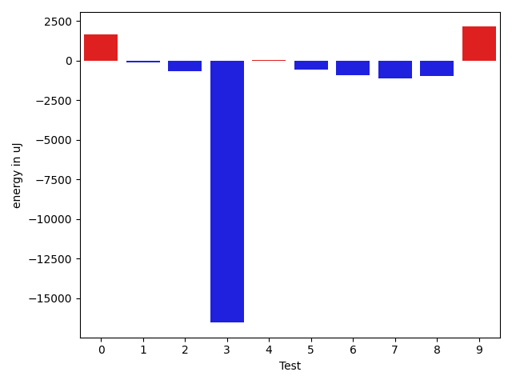
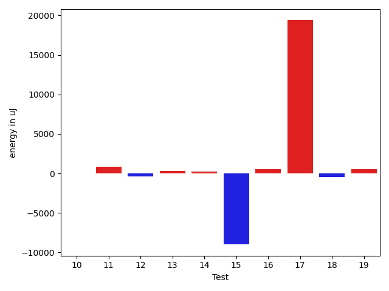
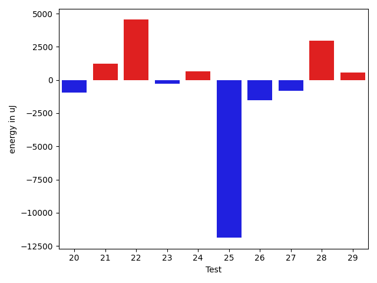
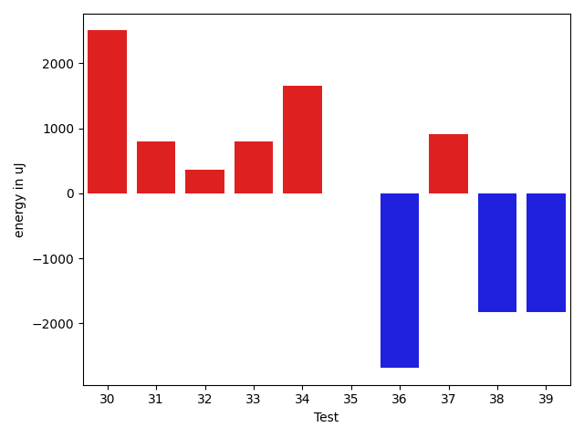
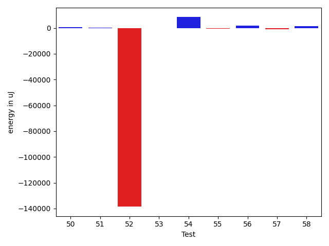

# gson 9a80d0

https://github.com/google/gson/commit/9a80d0

## Delta Energy per test method

| ID | EnergyV1 | EnergyV2 | DeltaEnergy | σV1 | σV2 |
| --- | --- | --- | --- | --- | --- |
| 0 | 37321.62666666666 | 38971.62162162162 | 1649.9949549549565 | 5057.244437499756 | 9102.863326927503 |
| 1 | 37512.69491525424 | 37428.57692307692 | -84.11799217731459 | 4353.762936074203 | 4709.696545614713 |
| 2 | 36462.276923076926 | 35805.11666666667 | -657.1602564102577 | 3986.756277429221 | 4086.830426674061 |
| 3 | 61079.05882352941 | 44545.62162162162 | -16533.437201907793 | 126302.42057864906 | 20138.491090381383 |
| 4 | 37071.44827586207 | 37130.565217391304 | 59.11694152923155 | 4141.494995656611 | 3674.303315520147 |
| 5 | 87690.04040404041 | 87110.53535353535 | -579.5050505050604 | 22774.580334498125 | 22573.99196819347 |
| 6 | 45038.69047619047 | 44129.0 | -909.6904761904734 | 17359.68019302761 | 18246.312500912405 |
| 7 | 49238.07042253521 | 48112.43076923077 | -1125.639653304439 | 27671.018478089296 | 24689.471747453084 |
| 8 | 38205.42 | 37213.666666666664 | -991.753333333334 | 4364.306786145996 | 4434.212727631466 |
| 9 | 46353.188679245286 | 48492.34090909091 | 2139.1522298456257 | 19525.054603896882 | 21788.007714778225 |
| 10 | 35487.29787234042 | 35488.95238095238 | 1.6545086119585903 | 3549.097529369149 | 3961.472627531939 |
| 11 | 39237.596774193546 | 40080.12162162162 | 842.5248474280743 | 10509.538671099906 | 11219.458596024628 |
| 12 | 38875.15254237288 | 38521.07246376811 | -354.08007860476937 | 9294.279939129245 | 5999.061180944901 |
| 13 | 36305.029411764706 | 36632.90243902439 | 327.8730272596804 | 4306.505055523863 | 3865.013127828511 |
| 14 | 36636.56363636364 | 36845.13461538462 | 208.5709790209803 | 4168.2209144195995 | 5122.47370766555 |
| 15 | 162896.95454545456 | 153902.7323943662 | -8994.222151088354 | 353737.7939310343 | 339816.36712963367 |
| 16 | 36207.1282051282 | 36721.96 | 514.8317948717959 | 4260.395095314379 | 7120.725975048706 |
| 17 | 74113.33673469388 | 93488.90816326531 | 19375.571428571435 | 72231.5773761293 | 91462.52675824003 |
| 18 | 36588.13846153846 | 36158.1 | -430.038461538461 | 4372.951764503531 | 3891.353781997554 |
| 19 | 42262.515789473684 | 42777.25 | 514.734210526316 | 13293.61547737398 | 15499.560308279715 |
| 20 | 36572.709677419356 | 35648.15151515151 | -924.5581622678437 | 5037.695365257029 | 4020.82719230465 |
| 21 | 36507.85393258427 | 37734.318681318684 | 1226.4647487344118 | 5477.906102773134 | 8591.056198904065 |
| 22 | 60827.181818181816 | 65365.42424242424 | 4538.242424242424 | 26136.125530860958 | 27063.359379255293 |
| 23 | 38185.72727272727 | 37918.015625 | -267.71164772727207 | 4058.8928948274106 | 4342.034418378194 |
| 24 | 38432.8 | 39071.03571428572 | 638.2357142857145 | 4720.863366659394 | 4513.033632730102 |
| 25 | 160530.08080808082 | 148649.1616161616 | -11880.919191919209 | 372243.7198093591 | 333431.63600080885 |
| 26 | 38301.53333333333 | 36764.346153846156 | -1537.1871794871768 | 5004.558600138699 | 4769.62785149072 |
| 27 | 40045.31578947369 | 39247.28571428572 | -798.0300751879695 | 4121.416147172201 | 4531.215494900292 |
| 28 | 36817.391304347824 | 39781.608695652176 | 2964.2173913043516 | 3293.0242706182576 | 4687.970736842285 |
| 29 | 39298.65217391304 | 39869.59090909091 | 570.9387351778714 | 4862.582402196125 | 3955.914831088562 |
| 30 | 36902.28571428572 | 37927.717948717946 | 1025.4322344322281 | 5162.193760250321 | 4724.465021667522 |
| 31 | 44625.357142857145 | 46590.079365079364 | 1964.722222222219 | 17210.663721770798 | 18704.033404505986 |
| 32 | 46498.30487804878 | 46949.19565217391 | 450.89077412513143 | 14210.440184467114 | 13232.030692389166 |
| 33 | 37954.22222222222 | 38737.230769230766 | 783.0085470085469 | 4783.34819458267 | 4465.697084078314 |
| 34 | 57526.44827586207 | 59137.983606557376 | 1611.5353306953039 | 38717.232352538165 | 40468.37794004217 |
| 35 | 38331.0 | 38777.83076923077 | 446.8307692307717 | 4538.513558708473 | 6209.203909258059 |
| 36 | 60934.454545454544 | 59871.91208791209 | -1062.542457542455 | 32753.914073154217 | 31621.873608275742 |
| 37 | 40541.53246753247 | 44728.40845070423 | 4186.875983171762 | 27828.22200039901 | 38349.67310200116 |
| 38 | 48860.14736842105 | 45966.15555555555 | -2893.991812865497 | 19776.208497223404 | 17067.593177918014 |
| 39 | 66615.66666666667 | 55380.8085106383 | -11234.858156028371 | 56063.10492115113 | 44876.42161377116 |
| 40 | 41009.370786516854 | 39577.12222222222 | -1432.248564294634 | 10805.158004015067 | 8900.653277931378 |
| 41 | 47199.34210526316 | 46032.77027027027 | -1166.5718349928866 | 15826.44171993638 | 13899.747335393002 |
| 42 | 75845.50505050505 | 78039.65656565657 | 2194.1515151515196 | 29695.318812588746 | 29433.026906041276 |
| 43 | 158239.08080808082 | 300327.9797979798 | 142088.898989899 | 150824.66807258548 | 485772.0855810441 |
| 44 | 39319.47368421053 | 39138.46153846154 | -181.01214574898768 | 4272.21508388701 | 4888.733688726555 |
| 45 | 38027.94736842105 | 38655.333333333336 | 627.3859649122824 | 4140.4173381522805 | 4427.743859900761 |
| 46 | 39150.15625 | 38738.8253968254 | -411.33085317460063 | 4656.037099893636 | 4887.3068623055715 |
| 47 | 204269.12987012987 | 147130.0779220779 | -57139.05194805196 | 468441.629016237 | 343694.1425094681 |
| 48 | 45438.28358208955 | 50449.13698630137 | 5010.853404211819 | 19533.899605944112 | 24500.088919220845 |
| 49 | 38588.05714285714 | 39215.05263157895 | 626.9954887218046 | 4291.386122673833 | 4229.412363981353 |
| 50 | 38283.333333333336 | 38919.2 | 635.8666666666613 | 5027.5599377933395 | 3878.992818667331 |
| 51 | 38519.67391304348 | 38774.78947368421 | 255.11556064073375 | 3943.540547001034 | 4576.16900312394 |
| 52 | 272591.9857142857 | 134084.02702702704 | -138507.95868725865 | 527691.1071448764 | 314444.8389296377 |
| 53 | 37630.77272727273 | 37490.725 | -140.0477272727294 | 4035.4100493665983 | 4267.389494688176 |
| 54 | 460094.1515151515 | 468487.404040404 | 8393.252525252523 | 168201.16407747436 | 164814.4132724496 |
| 55 | 41129.48333333333 | 40484.745762711864 | -644.7375706214661 | 8904.640029205122 | 8549.783709412553 |
| 56 | 40492.9375 | 42457.35135135135 | 1964.4138513513535 | 6056.330468699157 | 10361.4737243993 |
| 57 | 38733.282608695656 | 37859.64705882353 | -873.6355498721241 | 4901.44848006597 | 5206.420729888145 |
| 58 | 37633.59090909091 | 38889.458333333336 | 1255.867424242424 | 5450.621404599753 | 4179.980033636192 |

## Delta Duration per test method

| ID | DurationV1 | DurationsV2 | DeltaDuration |
| --- | --- | --- | --- |
| 0 | 1031644.9466666667 | 1122471.0675675676 | 90826.12090090092 |
| 1 | 885315.6271186441 | 872776.7692307692 | -12538.857887874823 |
| 2 | 947701.9846153846 | 997493.4333333333 | 49791.44871794875 |
| 3 | 1877342.544117647 | 1380874.8513513512 | -496467.69276629575 |
| 4 | 558162.4137931034 | 504025.347826087 | -54137.065967016446 |
| 5 | 2627127.878787879 | 2609728.474747475 | -17399.40404040413 |
| 6 | 1348778.9642857143 | 1431378.1904761905 | 82599.22619047621 |
| 7 | 1344368.61971831 | 1316846.1384615384 | -27522.4812567716 |
| 8 | 833027.18 | 828206.8958333334 | -4820.284166666679 |
| 9 | 1199671.433962264 | 1315228.4545454546 | 115557.02058319049 |
| 10 | 683539.8297872341 | 687748.5952380953 | 4208.765450861189 |
| 11 | 1105406.9516129033 | 1065085.5405405406 | -40321.41107236268 |
| 12 | 1033788.186440678 | 1000644.9710144928 | -33143.21542618517 |
| 13 | 627642.5588235294 | 650863.512195122 | 23220.953371592565 |
| 14 | 889795.0363636364 | 884647.6730769231 | -5147.363286713255 |
| 15 | 4500365.03030303 | 4228713.338028169 | -271651.69227486104 |
| 16 | 1076637.6923076923 | 1082380.0 | 5742.307692307746 |
| 17 | 2410521.2653061226 | 2954171.173469388 | 543649.9081632653 |
| 18 | 891015.1076923077 | 931378.1333333333 | 40363.025641025626 |
| 19 | 1416140.8 | 1466005.7291666667 | 49864.9291666667 |
| 20 | 874691.0967741936 | 899254.6060606061 | 24563.509286412504 |
| 21 | 1259214.404494382 | 1255919.3296703296 | -3295.074824052397 |
| 22 | 2102171.9191919193 | 2094076.0303030303 | -8095.888888888992 |
| 23 | 983191.2575757576 | 969337.046875 | -13854.210700757569 |
| 24 | 901699.35 | 886127.0 | -15572.349999999977 |
| 25 | 4701722.909090909 | 4261033.262626262 | -440689.6464646468 |
| 26 | 609042.8 | 642725.2307692308 | 33682.430769230705 |
| 27 | 596383.2105263158 | 583262.2857142857 | -13120.924812030164 |
| 28 | 552477.0869565217 | 540897.7391304348 | -11579.347826086916 |
| 29 | 591813.5652173914 | 603294.5909090909 | 11481.025691699586 |
| 30 | 664932.25 | 674978.3846153846 | 10046.134615384624 |
| 31 | 1134502.7142857143 | 1250802.9523809524 | 116300.2380952381 |
| 32 | 1453554.5853658537 | 1421455.9891304348 | -32098.596235418925 |
| 33 | 938222.3111111111 | 893707.2884615385 | -44515.02264957258 |
| 34 | 1569260.7241379311 | 1625368.7540983607 | 56108.02996042953 |
| 35 | 940895.0483870967 | 960474.1076923077 | 19579.059305210947 |
| 36 | 1870508.4772727273 | 1892628.5054945054 | 22120.028221778106 |
| 37 | 1200423.5714285714 | 1258414.2394366197 | 57990.66800804832 |
| 38 | 1598873.7157894736 | 1554876.588888889 | -43997.12690058467 |
| 39 | 2167608.311111111 | 1845049.925531915 | -322558.38557919627 |
| 40 | 1355547.595505618 | 1297554.4444444445 | -57993.15106117353 |
| 41 | 1459282.9342105263 | 1515596.945945946 | 56314.01173541974 |
| 42 | 2258721.6565656564 | 2382235.909090909 | 123514.25252525276 |
| 43 | 4475711.131313131 | 8232068.848484849 | 3756357.7171717174 |
| 44 | 891598.3859649122 | 936969.3076923077 | 45370.9217273955 |
| 45 | 469675.36842105264 | 544025.2666666667 | 74349.89824561408 |
| 46 | 944627.3125 | 911622.9047619047 | -33004.407738095266 |
| 47 | 5414055.285714285 | 4222867.857142857 | -1191187.4285714282 |
| 48 | 1255166.0447761193 | 1322515.3287671234 | 67349.28399100411 |
| 49 | 706706.0571428571 | 728575.947368421 | 21869.890225563897 |
| 50 | 1042920.8235294118 | 911319.0181818182 | -131601.80534759362 |
| 51 | 817504.2608695652 | 814763.3684210526 | -2740.8924485126045 |
| 52 | 7687619.1 | 3609363.0945945946 | -4078256.005405405 |
| 53 | 777575.2727272727 | 720966.375 | -56608.897727272706 |
| 54 | 11780964.91919192 | 11891109.202020202 | 110144.28282828256 |
| 55 | 1182529.3833333333 | 1215320.3559322034 | 32790.97259887005 |
| 56 | 964198.3125 | 1143398.8648648649 | 179200.55236486485 |
| 57 | 890463.7391304348 | 971819.8235294118 | 81356.084398977 |
| 58 | 624247.9090909091 | 613225.9583333334 | -11021.950757575687 |

## Misc.

| ID | Test Class | Test Method |
| --- | --- | --- |
| 0 | com.google.gson.functional.CustomTypeAdaptersTest | testCustomAdapterInvokedForCollectionElementDeserialization |
| 1 | com.google.gson.functional.CustomTypeAdaptersTest | testCustomTypeAdapterAppliesToSubClassesSerializedAsBaseClass |
| 2 | com.google.gson.functional.CustomTypeAdaptersTest | testCustomAdapterInvokedForMapElementSerializationWithType |
| 3 | com.google.gson.functional.CustomTypeAdaptersTest | testCustomNestedSerializers |
| 4 | com.google.gson.functional.CustomTypeAdaptersTest | testCustomAdapterInvokedForMapElementSerialization |
| 5 | com.google.gson.functional.CustomTypeAdaptersTest | testCustomTypeAdapterDoesNotAppliesToSubClasses |
| 6 | com.google.gson.functional.CustomTypeAdaptersTest | testCustomAdapterInvokedForCollectionElementSerializationWithType |
| 7 | com.google.gson.functional.CustomTypeAdaptersTest | testCustomDeserializers |
| 8 | com.google.gson.functional.CustomTypeAdaptersTest | testCustomByteArraySerializer |
| 9 | com.google.gson.functional.CustomTypeAdaptersTest | testEnsureCustomSerializerNotInvokedForNullValues |
| 10 | com.google.gson.functional.CustomTypeAdaptersTest | testEnsureCustomDeserializerNotInvokedForNullValues |
| 11 | com.google.gson.functional.CustomTypeAdaptersTest | testCustomAdapterInvokedForMapElementDeserialization |
| 12 | com.google.gson.functional.CustomTypeAdaptersTest | testCustomNestedDeserializers |
| 13 | com.google.gson.functional.CustomTypeAdaptersTest | testCustomAdapterInvokedForCollectionElementSerialization |
| 14 | com.google.gson.functional.CustomTypeAdaptersTest | testCustomByteArrayDeserializerAndInstanceCreator |
| 15 | com.google.gson.functional.CustomTypeAdaptersTest | testCustomSerializers |
| 16 | com.google.gson.functional.DefaultTypeAdaptersTest | testDateSerializationWithPatternNotOverridenByTypeAdapter |
| 17 | com.google.gson.functional.DefaultTypeAdaptersTest | testDateSerializationWithPattern |
| 18 | com.google.gson.functional.DefaultTypeAdaptersTest | testTimestampSerialization |
| 19 | com.google.gson.functional.DefaultTypeAdaptersTest | testDateSerializationInCollection |
| 20 | com.google.gson.functional.DefaultTypeAdaptersTest | testSqlDateSerialization |
| 21 | com.google.gson.functional.DefaultTypeAdaptersTest | testDateDeserializationWithPattern |
| 22 | com.google.gson.functional.MapTest | testInterfaceTypeMapWithSerializer |
| 23 | com.google.gson.functional.MapTest | testCustomSerializerForSpecificMapType |
| 24 | com.google.gson.functional.MapTest | testMapSubclassDeserialization |
| 25 | com.google.gson.functional.TypeAdapterPrecedenceTest | testSerializeNonstreamingTypeAdapterFollowedByStreamingTypeAdapter |
| 26 | com.google.gson.functional.TypeAdapterPrecedenceTest | testNonstreamingHierarchicalFollowedByNonstreaming |
| 27 | com.google.gson.functional.TypeAdapterPrecedenceTest | testStreamingHierarchicalFollowedByNonstreaming |
| 28 | com.google.gson.functional.TypeAdapterPrecedenceTest | testStreamingHierarchicalFollowedByNonstreamingHierarchical |
| 29 | com.google.gson.functional.TypeAdapterPrecedenceTest | testStreamingFollowedByNonstreamingHierarchical |
| 30 | com.google.gson.functional.TypeAdapterPrecedenceTest | testStreamingFollowedByNonstreaming |
| 31 | com.google.gson.functional.CustomDeserializerTest | testCustomDeserializerReturnsNull |
| 32 | com.google.gson.functional.CustomDeserializerTest | testJsonTypeFieldBasedDeserialization |
| 33 | com.google.gson.functional.CustomDeserializerTest | testCustomDeserializerReturnsNullForArrayElements |
| 34 | com.google.gson.functional.CustomDeserializerTest | testCustomDeserializerReturnsNullForTopLevelObject |
| 35 | com.google.gson.functional.CustomDeserializerTest | testCustomDeserializerReturnsNullForArrayElementsForArrayField |
| 36 | com.google.gson.functional.EnumTest | testEnumSubclassWithRegisteredTypeAdapter |
| 37 | com.google.gson.functional.ParameterizedTypesTest | testParameterizedTypeWithReaderDeserialization |
| 38 | com.google.gson.functional.ParameterizedTypesTest | testParameterizedTypeWithCustomSerializer |
| 39 | com.google.gson.functional.ParameterizedTypesTest | testParameterizedTypeDeserialization |
| 40 | com.google.gson.functional.ParameterizedTypesTest | testParameterizedTypesWithCustomDeserializer |
| 41 | com.google.gson.functional.CollectionTest | testUserCollectionTypeAdapter |
| 42 | com.google.gson.functional.UncategorizedTest | testReturningDerivedClassesDuringDeserialization |
| 43 | com.google.gson.functional.TypeHierarchyAdapterTest | testTypeHierarchy |
| 44 | com.google.gson.functional.TypeHierarchyAdapterTest | testRegisterSuperTypeFirst |
| 45 | com.google.gson.functional.TypeHierarchyAdapterTest | testRegisterSubTypeFirstAllowed |
| 46 | com.google.gson.functional.InstanceCreatorTest | testInstanceCreatorReturnsSubTypeForTopLevelObject |
| 47 | com.google.gson.functional.InstanceCreatorTest | testInstanceCreatorReturnsBaseType |
| 48 | com.google.gson.functional.InstanceCreatorTest | testInstanceCreatorReturnsSubTypeForField |
| 49 | com.google.gson.functional.CustomSerializerTest | testBaseClassSerializerInvokedForBaseClassFields |
| 50 | com.google.gson.functional.CustomSerializerTest | testSubClassSerializerInvokedForBaseClassFieldsHoldingArrayOfSubClassInstances |
| 51 | com.google.gson.functional.CustomSerializerTest | testSerializerReturnsNull |
| 52 | com.google.gson.functional.CustomSerializerTest | testSubClassSerializerInvokedForBaseClassFieldsHoldingSubClassInstances |
| 53 | com.google.gson.functional.CustomSerializerTest | testBaseClassSerializerInvokedForBaseClassFieldsHoldingSubClassInstances |
| 54 | com.google.gson.functional.CircularReferenceTest | testSelfReferenceCustomHandlerSerialization |
| 55 | com.google.gson.functional.ObjectTest | testInnerClassDeserialization |
| 56 | com.google.gson.functional.NullObjectAndFieldTest | testCustomSerializationOfNulls |
| 57 | com.google.gson.functional.NullObjectAndFieldTest | testCustomTypeAdapterPassesNullDesrialization |
| 58 | com.google.gson.functional.NullObjectAndFieldTest | testCustomTypeAdapterPassesNullSerialization |

| Test | IterationV1 | IterationV2 | DeltaIteration |
| --- | --- | --- | --- |
| 0 | 75 | 74 | -1 |
| 1 | 59 | 52 | -7 |
| 2 | 65 | 60 | -5 |
| 3 | 68 | 74 | 6 |
| 4 | 29 | 23 | -6 |
| 5 | 99 | 99 | 0 |
| 6 | 84 | 84 | 0 |
| 7 | 71 | 65 | -6 |
| 8 | 50 | 48 | -2 |
| 9 | 53 | 44 | -9 |
| 10 | 47 | 42 | -5 |
| 11 | 62 | 74 | 12 |
| 12 | 59 | 69 | 10 |
| 13 | 34 | 41 | 7 |
| 14 | 55 | 52 | -3 |
| 15 | 66 | 71 | 5 |
| 16 | 78 | 75 | -3 |
| 17 | 98 | 98 | 0 |
| 18 | 65 | 60 | -5 |
| 19 | 95 | 96 | 1 |
| 20 | 62 | 66 | 4 |
| 21 | 89 | 91 | 2 |
| 22 | 99 | 99 | 0 |
| 23 | 66 | 64 | -2 |
| 24 | 60 | 56 | -4 |
| 25 | 99 | 99 | 0 |
| 26 | 30 | 26 | -4 |
| 27 | 19 | 35 | 16 |
| 28 | 23 | 23 | 0 |
| 29 | 23 | 22 | -1 |
| 30 | 28 | 39 | 11 |
| 31 | 70 | 63 | -7 |
| 32 | 82 | 92 | 10 |
| 33 | 45 | 52 | 7 |
| 34 | 58 | 61 | 3 |
| 35 | 62 | 65 | 3 |
| 36 | 88 | 91 | 3 |
| 37 | 77 | 71 | -6 |
| 38 | 95 | 90 | -5 |
| 39 | 90 | 94 | 4 |
| 40 | 89 | 90 | 1 |
| 41 | 76 | 74 | -2 |
| 42 | 99 | 99 | 0 |
| 43 | 99 | 99 | 0 |
| 44 | 57 | 65 | 8 |
| 45 | 19 | 15 | -4 |
| 46 | 64 | 63 | -1 |
| 47 | 77 | 77 | 0 |
| 48 | 67 | 73 | 6 |
| 49 | 35 | 38 | 3 |
| 50 | 51 | 55 | 4 |
| 51 | 46 | 38 | -8 |
| 52 | 70 | 74 | 4 |
| 53 | 44 | 40 | -4 |
| 54 | 99 | 99 | 0 |
| 55 | 60 | 59 | -1 |
| 56 | 32 | 37 | 5 |
| 57 | 46 | 51 | 5 |
| 58 | 22 | 24 | 2 |

| Time Label | Time (s) |
| --- | --- |
| Selection | 26.959808588027954 |
| Injection | 13.643003225326538 |
| Total | 1154.0270910263062 |

