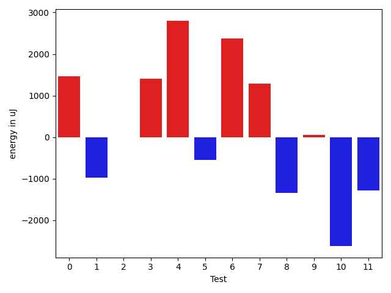
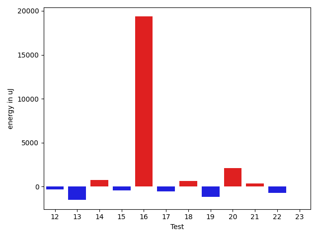
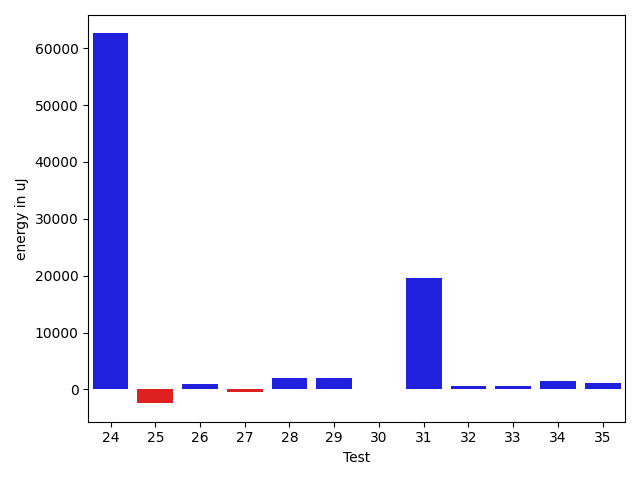
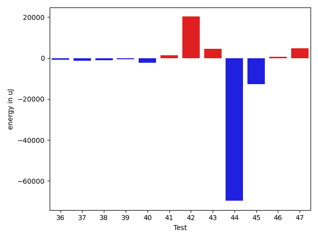
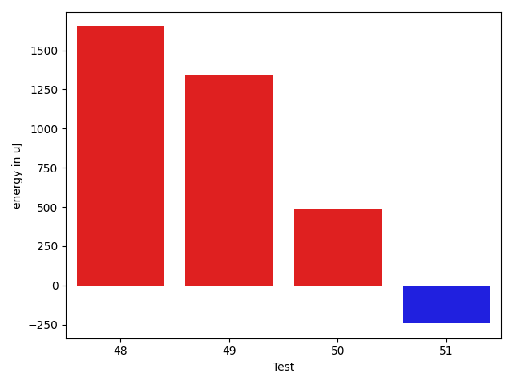

# gson 1c09e2

https://github.com/google/gson/commit/1c09e2

## Delta Energy per test method

| ID | EnergyV1 | EnergyV2 | DeltaEnergy | σV1 | σV2 |
| --- | --- | --- | --- | --- | --- |
| 0 | 36376 | 37842 | 1466 | 7059.8931024020285 | 7218.5961888267275 |
| 1 | 38391 | 37414 | -977 | 13022.208152752082 | 12403.681907073402 |
| 2 | 36988 | 36987 | -1 | 5207.397847960033 | 5885.8607591979835 |
| 3 | 39734 | 41137 | 1403 | 131235.66518984537 | 189461.2956492196 |
| 4 | 40832 | 43640 | 2808 | 325668.12274314865 | 363140.639734668 |
| 5 | 83130 | 82580 | -550 | 22041.27046392544 | 24648.399950044157 |
| 6 | 35950 | 38330 | 2380 | 4970.382197496405 | 5438.809439976272 |
| 7 | 39551 | 40832 | 1281 | 15772.915241514056 | 17409.216436862458 |
| 8 | 41138 | 39794 | -1344 | 29776.222511060172 | 26187.09533577779 |
| 9 | 37354 | 37414 | 60 | 4455.879152390699 | 4825.438240988906 |
| 10 | 41809 | 39184 | -2625 | 21164.285808408255 | 20914.26471165342 |
| 11 | 37964 | 36682 | -1282 | 4673.824279913204 | 4400.5424836843995 |
| 12 | 37476 | 37170 | -306 | 4142.127996286031 | 4277.524062682053 |
| 13 | 38696 | 37170 | -1526 | 9750.258711144044 | 22800.292590976347 |
| 14 | 38147 | 38879 | 732 | 4447.812270526772 | 4845.274282803812 |
| 15 | 36743 | 36316 | -427 | 3974.284026175037 | 3760.3121971656906 |
| 16 | 46875 | 66223 | 19348 | 21328.58526913343 | 25020.838107935313 |
| 17 | 39490 | 38940 | -550 | 4762.3509787254825 | 4788.309188693526 |
| 18 | 38147 | 38757 | 610 | 4328.245740893032 | 4624.780960905922 |
| 19 | 38696 | 37536 | -1160 | 5023.834918046869 | 4670.6021187046 |
| 20 | 39856 | 41931 | 2075 | 17040.27218866144 | 24460.84711824068 |
| 21 | 42725 | 43091 | 366 | 14399.904963799107 | 14654.193600048702 |
| 22 | 39002 | 38269 | -733 | 5043.2652270329845 | 4533.912583159096 |
| 23 | 42785 | 42785 | 0 | 39323.20852004862 | 32556.21455929005 |
| 24 | 45044 | 45654 | 610 | 350900.50891257485 | 422661.72705065145 |
| 25 | 37170 | 36865 | -305 | 5398.823408023309 | 4541.185625900894 |
| 26 | 38147 | 37597 | -550 | 4119.095194605512 | 3970.124611696459 |
| 27 | 37903 | 38024 | 121 | 4196.418909867298 | 4004.2923474793442 |
| 28 | 36499 | 39856 | 3357 | 3757.6657549502625 | 5143.840054008726 |
| 29 | 38452 | 39307 | 855 | 5364.905854486172 | 4932.886903224115 |
| 30 | 37658 | 38452 | 794 | 5046.501016534645 | 4676.628404769284 |
| 31 | 46142 | 44861 | -1281 | 341304.8176242452 | 388396.3571437825 |
| 32 | 39002 | 39124 | 122 | 5071.0893270384 | 4802.182396035462 |
| 33 | 36499 | 37902 | 1403 | 4181.638657975807 | 4500.402885704402 |
| 34 | 40771 | 39307 | -1464 | 6424.959591173815 | 10309.8084343587 |
| 35 | 38574 | 38146 | -428 | 4939.341248020847 | 8204.503448689584 |
| 36 | 40710 | 39612 | -1098 | 9262.586344720456 | 10160.984308465082 |
| 37 | 40283 | 39367 | -916 | 5663.53267340919 | 4162.20047131045 |
| 38 | 41381 | 40344 | -1037 | 11803.323157720535 | 9355.265205447702 |
| 39 | 39123 | 37292 | -1831 | 4844.766683437103 | 4846.118529521635 |
| 40 | 37475 | 36682 | -793 | 15718.28500917418 | 11992.704355072456 |
| 41 | 42419 | 42602 | 183 | 24499.169982186468 | 25743.28375865993 |
| 42 | 38574 | 41259 | 2685 | 53256.42680039995 | 74505.4256657855 |
| 43 | 38146 | 39733 | 1587 | 10054.700818184989 | 15829.57777839298 |
| 44 | 45227 | 41443 | -3784 | 429041.6346071142 | 353714.2874656785 |
| 45 | 41076 | 40039 | -1037 | 32074.652689123068 | 16571.890936020136 |
| 46 | 38269 | 39551 | 1282 | 5602.93749749185 | 4500.290093824111 |
| 47 | 78430 | 80077 | 1647 | 27126.130895478564 | 25464.51019167877 |
| 48 | 403685 | 405334 | 1649 | 170893.58125355598 | 134121.770101326 |
| 49 | 39306 | 40649 | 1343 | 14845.213127308447 | 11313.84796936816 |
| 50 | 37414 | 37902 | 488 | 4485.3325739948505 | 4495.300568261421 |
| 51 | 42663 | 42420 | -243 | 12914.156931672349 | 15898.030632660939 |

## Delta Duration per test method

| ID | DurationV1 | DurationsV2 | DeltaDuration |
| --- | --- | --- | --- |
| 0 | 1157202.2125 | 1121105.1 | -36097.112499999814 |
| 1 | 1165381.0344827587 | 1098684.6417910447 | -66696.39269171399 |
| 2 | 962998.2 | 949441.45 | -13556.75 |
| 3 | 1796479.4936708861 | 1980269.7763157894 | 183790.2826449033 |
| 4 | 4609072.640625 | 5052400.514705882 | 443327.8740808824 |
| 5 | 2684839.393939394 | 2680015.6565656564 | -4823.737373737618 |
| 6 | 647411.4594594594 | 681303.925 | 33892.46554054064 |
| 7 | 1453086.6785714286 | 1480138.2337662338 | 27051.555194805143 |
| 8 | 1366971.1168831168 | 1405694.5909090908 | 38723.47402597405 |
| 9 | 881491.2115384615 | 903459.0172413794 | 21967.80570291786 |
| 10 | 1298441.744680851 | 1272188.8260869565 | -26252.918593894457 |
| 11 | 711748.3555555556 | 722010.9215686275 | 10262.566013071919 |
| 12 | 872885.253968254 | 918907.5892857143 | 46022.335317460354 |
| 13 | 1042598.2222222222 | 1126981.25 | 84383.02777777775 |
| 14 | 840471.3921568628 | 876264.8 | 35793.407843137276 |
| 15 | 550936.5 | 552359.6428571428 | 1423.1428571428405 |
| 16 | 1959876.9292929294 | 2036193.4141414142 | 76316.48484848486 |
| 17 | 889432.947368421 | 909505.220338983 | 20072.272970561986 |
| 18 | 1001227.2857142857 | 982096.2173913043 | -19131.06832298136 |
| 19 | 959580.0153846154 | 980499.5479452055 | 20919.532560590073 |
| 20 | 1212243.7384615385 | 1459296.953125 | 247053.21466346155 |
| 21 | 1510434.9347826086 | 1580263.9895833333 | 69829.05480072461 |
| 22 | 924423.5614035088 | 951149.2592592592 | 26725.697855750448 |
| 23 | 1803771.267857143 | 1793881.9672131147 | -9889.300644028233 |
| 24 | 3990146.222222222 | 5980626.070707071 | 1990479.8484848486 |
| 25 | 669924.4 | 702123.2222222222 | 32198.822222222225 |
| 26 | 624837.6666666666 | 628937.1071428572 | 4099.440476190532 |
| 27 | 575909.1071428572 | 630108.2857142857 | 54199.17857142852 |
| 28 | 637569.1481481482 | 608875.9142857143 | -28693.23386243393 |
| 29 | 613655.85 | 613341.8666666667 | -313.983333333279 |
| 30 | 809008.0892857143 | 825959.3695652174 | 16951.280279503088 |
| 31 | 4225503.447761194 | 4662678.909090909 | 437175.4613297153 |
| 32 | 690684.8235294118 | 677332.3846153846 | -13352.438914027181 |
| 33 | 761413.7948717949 | 776975.5263157894 | 15561.731443994562 |
| 34 | 988557.448275862 | 1032507.2741935484 | 43949.825917686336 |
| 35 | 931779.1698113207 | 1017010.2295081967 | 85231.05969687598 |
| 36 | 1016415.7209302326 | 1244198.027027027 | 227782.30609679443 |
| 37 | 601016.34375 | 673450.448275862 | 72434.10452586203 |
| 38 | 1359002.4102564103 | 1373123.038961039 | 14120.628704628674 |
| 39 | 762577.8863636364 | 766969.6170212766 | 4391.7306576402625 |
| 40 | 1216306.8641975308 | 1167093.0135135136 | -49213.850684017176 |
| 41 | 1730141.9263157896 | 1787463.142857143 | 57321.21654135338 |
| 42 | 2112817.125 | 2649905.2282608696 | 537088.1032608696 |
| 43 | 1383783.4555555556 | 1445832.4395604397 | 62048.98400488403 |
| 44 | 5833784.628205128 | 3920651.5362318843 | -1913133.0919732437 |
| 45 | 1537463.878787879 | 1139786.493150685 | -397677.3856371939 |
| 46 | 1016116.4736842106 | 934324.8392857143 | -81791.63439849624 |
| 47 | 2300198.696969697 | 2258901.525252525 | -41297.17171717156 |
| 48 | 12067147.91919192 | 10733776.363636363 | -1333371.555555556 |
| 49 | 1384311.7826086956 | 1187894.7681159421 | -196417.01449275343 |
| 50 | 940241.6101694915 | 931864.7419354839 | -8376.86823400762 |
| 51 | 1306040.3636363635 | 1432065.268292683 | 126024.90465631941 |

## Misc.

| ID | Test Class | Test Method |
| --- | --- | --- |
| 0 | com.google.gson.functional.CustomTypeAdaptersTest | testCustomAdapterInvokedForCollectionElementDeserialization |
| 1 | com.google.gson.functional.CustomTypeAdaptersTest | testCustomAdapterInvokedForMapElementDeserialization |
| 2 | com.google.gson.functional.CustomTypeAdaptersTest | testCustomAdapterInvokedForMapElementSerializationWithType |
| 3 | com.google.gson.functional.CustomTypeAdaptersTest | testCustomNestedSerializers |
| 4 | com.google.gson.functional.CustomTypeAdaptersTest | testCustomSerializers |
| 5 | com.google.gson.functional.CustomTypeAdaptersTest | testCustomTypeAdapterDoesNotAppliesToSubClasses |
| 6 | com.google.gson.functional.CustomTypeAdaptersTest | testCustomAdapterInvokedForCollectionElementSerialization |
| 7 | com.google.gson.functional.CustomTypeAdaptersTest | testCustomAdapterInvokedForCollectionElementSerializationWithType |
| 8 | com.google.gson.functional.CustomTypeAdaptersTest | testCustomDeserializers |
| 9 | com.google.gson.functional.CustomTypeAdaptersTest | testCustomByteArrayDeserializerAndInstanceCreator |
| 10 | com.google.gson.functional.CustomTypeAdaptersTest | testEnsureCustomSerializerNotInvokedForNullValues |
| 11 | com.google.gson.functional.CustomTypeAdaptersTest | testEnsureCustomDeserializerNotInvokedForNullValues |
| 12 | com.google.gson.functional.CustomTypeAdaptersTest | testCustomTypeAdapterAppliesToSubClassesSerializedAsBaseClass |
| 13 | com.google.gson.functional.CustomTypeAdaptersTest | testCustomNestedDeserializers |
| 14 | com.google.gson.functional.CustomTypeAdaptersTest | testCustomByteArraySerializer |
| 15 | com.google.gson.functional.CustomTypeAdaptersTest | testCustomAdapterInvokedForMapElementSerialization |
| 16 | com.google.gson.functional.MapTest | testInterfaceTypeMapWithSerializer |
| 17 | com.google.gson.functional.MapTest | testMapSubclassDeserialization |
| 18 | com.google.gson.functional.MapTest | testCustomSerializerForSpecificMapType |
| 19 | com.google.gson.functional.CustomDeserializerTest | testCustomDeserializerReturnsNullForArrayElementsForArrayField |
| 20 | com.google.gson.functional.CustomDeserializerTest | testCustomDeserializerReturnsNull |
| 21 | com.google.gson.functional.CustomDeserializerTest | testJsonTypeFieldBasedDeserialization |
| 22 | com.google.gson.functional.CustomDeserializerTest | testCustomDeserializerReturnsNullForArrayElements |
| 23 | com.google.gson.functional.CustomDeserializerTest | testCustomDeserializerReturnsNullForTopLevelObject |
| 24 | com.google.gson.functional.TypeAdapterPrecedenceTest | testSerializeNonstreamingTypeAdapterFollowedByStreamingTypeAdapter |
| 25 | com.google.gson.functional.TypeAdapterPrecedenceTest | testStreamingFollowedByNonstreaming |
| 26 | com.google.gson.functional.TypeAdapterPrecedenceTest | testStreamingFollowedByNonstreamingHierarchical |
| 27 | com.google.gson.functional.TypeAdapterPrecedenceTest | testStreamingHierarchicalFollowedByNonstreaming |
| 28 | com.google.gson.functional.TypeAdapterPrecedenceTest | testNonstreamingHierarchicalFollowedByNonstreaming |
| 29 | com.google.gson.functional.TypeAdapterPrecedenceTest | testStreamingHierarchicalFollowedByNonstreamingHierarchical |
| 30 | com.google.gson.functional.CustomSerializerTest | testSerializerReturnsNull |
| 31 | com.google.gson.functional.CustomSerializerTest | testSubClassSerializerInvokedForBaseClassFieldsHoldingSubClassInstances |
| 32 | com.google.gson.functional.CustomSerializerTest | testBaseClassSerializerInvokedForBaseClassFields |
| 33 | com.google.gson.functional.CustomSerializerTest | testBaseClassSerializerInvokedForBaseClassFieldsHoldingSubClassInstances |
| 34 | com.google.gson.functional.CustomSerializerTest | testSubClassSerializerInvokedForBaseClassFieldsHoldingArrayOfSubClassInstances |
| 35 | com.google.gson.functional.NullObjectAndFieldTest | testCustomTypeAdapterPassesNullDesrialization |
| 36 | com.google.gson.functional.NullObjectAndFieldTest | testCustomSerializationOfNulls |
| 37 | com.google.gson.functional.NullObjectAndFieldTest | testCustomTypeAdapterPassesNullSerialization |
| 38 | com.google.gson.functional.StreamingTypeAdaptersTest | testSerializeWithCustomTypeAdapter |
| 39 | com.google.gson.functional.StreamingTypeAdaptersTest | testDeserializeWithCustomTypeAdapter |
| 40 | com.google.gson.functional.ParameterizedTypesTest | testParameterizedTypeWithReaderDeserialization |
| 41 | com.google.gson.functional.ParameterizedTypesTest | testParameterizedTypeWithCustomSerializer |
| 42 | com.google.gson.functional.ParameterizedTypesTest | testParameterizedTypeDeserialization |
| 43 | com.google.gson.functional.ParameterizedTypesTest | testParameterizedTypesWithCustomDeserializer |
| 44 | com.google.gson.functional.InstanceCreatorTest | testInstanceCreatorReturnsBaseType |
| 45 | com.google.gson.functional.InstanceCreatorTest | testInstanceCreatorReturnsSubTypeForField |
| 46 | com.google.gson.functional.InstanceCreatorTest | testInstanceCreatorReturnsSubTypeForTopLevelObject |
| 47 | com.google.gson.functional.UncategorizedTest | testReturningDerivedClassesDuringDeserialization |
| 48 | com.google.gson.functional.CircularReferenceTest | testSelfReferenceCustomHandlerSerialization |
| 49 | com.google.gson.functional.ObjectTest | testInnerClassDeserialization |
| 50 | com.google.gson.functional.DefaultTypeAdaptersTest | testDateSerializationWithPatternNotOverridenByTypeAdapter |
| 51 | com.google.gson.functional.CollectionTest | testUserCollectionTypeAdapter |

| Test | IterationV1 | IterationV2 | DeltaIteration |
| --- | --- | --- | --- |
| 0 | 80 | 80 | 0 |
| 1 | 58 | 67 | 9 |
| 2 | 70 | 60 | -10 |
| 3 | 79 | 76 | -3 |
| 4 | 64 | 68 | 4 |
| 5 | 99 | 99 | 0 |
| 6 | 37 | 40 | 3 |
| 7 | 84 | 77 | -7 |
| 8 | 77 | 66 | -11 |
| 9 | 52 | 58 | 6 |
| 10 | 47 | 46 | -1 |
| 11 | 45 | 51 | 6 |
| 12 | 63 | 56 | -7 |
| 13 | 63 | 64 | 1 |
| 14 | 51 | 50 | -1 |
| 15 | 26 | 28 | 2 |
| 16 | 99 | 99 | 0 |
| 17 | 57 | 59 | 2 |
| 18 | 56 | 69 | 13 |
| 19 | 65 | 73 | 8 |
| 20 | 65 | 64 | -1 |
| 21 | 92 | 96 | 4 |
| 22 | 57 | 54 | -3 |
| 23 | 56 | 61 | 5 |
| 24 | 99 | 99 | 0 |
| 25 | 35 | 27 | -8 |
| 26 | 24 | 28 | 4 |
| 27 | 28 | 28 | 0 |
| 28 | 27 | 35 | 8 |
| 29 | 20 | 30 | 10 |
| 30 | 56 | 46 | -10 |
| 31 | 67 | 77 | 10 |
| 32 | 34 | 26 | -8 |
| 33 | 39 | 38 | -1 |
| 34 | 58 | 62 | 4 |
| 35 | 53 | 61 | 8 |
| 36 | 43 | 37 | -6 |
| 37 | 32 | 29 | -3 |
| 38 | 78 | 77 | -1 |
| 39 | 44 | 47 | 3 |
| 40 | 81 | 74 | -7 |
| 41 | 95 | 98 | 3 |
| 42 | 88 | 92 | 4 |
| 43 | 90 | 91 | 1 |
| 44 | 78 | 69 | -9 |
| 45 | 66 | 73 | 7 |
| 46 | 57 | 56 | -1 |
| 47 | 99 | 99 | 0 |
| 48 | 99 | 99 | 0 |
| 49 | 69 | 69 | 0 |
| 50 | 59 | 62 | 3 |
| 51 | 77 | 82 | 5 |

| Time Label | Time (s) |
| --- | --- |
| Selection | 26.939216136932373 |
| Injection | 13.180584907531738 |
| Total | 1147.6649751663208 |

