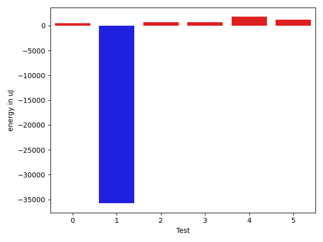

# gson d1de4c

https://github.com/google/gson/commit/d1de4c

## Delta Energy per test method

| ID | EnergyV1 | EnergyV2 | DeltaEnergy | σV1 | σV2 |
| --- | --- | --- | --- | --- | --- |
| 0 | 55841.60294117647 | 35833.106060606064 | -20008.496880570405 | 163585.56702912215 | 7485.764504446013 |
| 1 | 792712.6767676767 | 709879.5656565657 | -82833.11111111101 | 803354.3613334474 | 767775.1559194756 |
| 2 | 34645.333333333336 | 35231.8 | 586.4666666666672 | 2742.5037087655132 | 3967.6580195374704 |
| 3 | 87938.33673469388 | 94277.89795918367 | 6339.561224489793 | 45355.4567832721 | 47749.07936637656 |
| 4 | 36189.54794520548 | 44479.73626373626 | 8290.188318530782 | 6668.4451331833425 | 14253.889972881601 |
| 5 | 36760.47619047619 | 41408.217391304344 | 4647.7412008281535 | 11458.405751954208 | 18152.01607509265 |

## Delta Duration per test method

| ID | DurationV1 | DurationsV2 | DeltaDuration |
| --- | --- | --- | --- |
| 0 | 1791498.1470588236 | 1216312.4848484849 | -575185.6622103387 |
| 1 | 22952058.08080808 | 20863435.404040404 | -2088622.676767677 |
| 2 | 637770.1111111111 | 696271.68 | 58501.56888888893 |
| 3 | 3153315.6836734693 | 3455143.7346938774 | 301828.05102040805 |
| 4 | 1435210.2191780822 | 1906492.4285714286 | 471282.20939334645 |
| 5 | 1159843.9047619049 | 1293015.4057971016 | 133171.5010351967 |

## Misc.

| ID | Test Class | Test Method |
| --- | --- | --- |
| 0 | com.google.gson.functional.TypeHierarchyAdapterTest | testRegisterSuperTypeFirst |
| 1 | com.google.gson.functional.TypeHierarchyAdapterTest | testTypeHierarchy |
| 2 | com.google.gson.functional.TypeHierarchyAdapterTest | testRegisterSubTypeFirstNotAllowed |
| 3 | com.google.gson.functional.EnumTest | testEnumSubclassWithRegisteredTypeAdapter |
| 4 | com.google.gson.functional.StreamingTypeAdaptersTest | testSerializeWithCustomTypeAdapter |
| 5 | com.google.gson.functional.StreamingTypeAdaptersTest | testDeserializeWithCustomTypeAdapter |

| Test | IterationV1 | IterationV2 | DeltaIteration |
| --- | --- | --- | --- |
| 0 | 68 | 66 | -2 |
| 1 | 99 | 99 | 0 |
| 2 | 27 | 25 | -2 |
| 3 | 98 | 98 | 0 |
| 4 | 73 | 91 | 18 |
| 5 | 63 | 69 | 6 |

| Time Label | Time (s) |
| --- | --- |
| Selection | 27.070937633514404 |
| Injection | 10.741591691970825 |
| Total | 1093.2705616950989 |

