# gson 7def59

https://github.com/google/gson/commit/7def59

## Delta Energy per test method

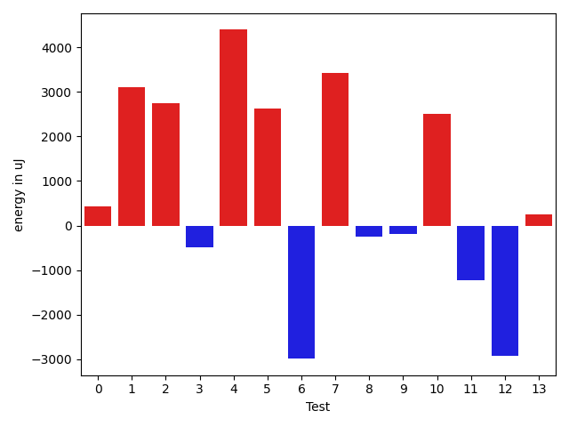

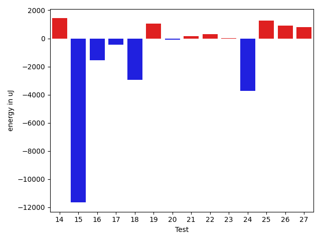

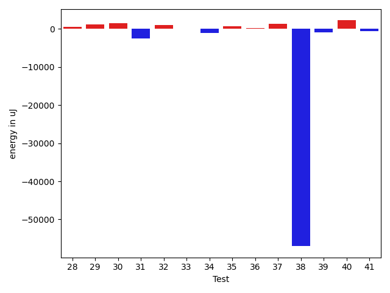

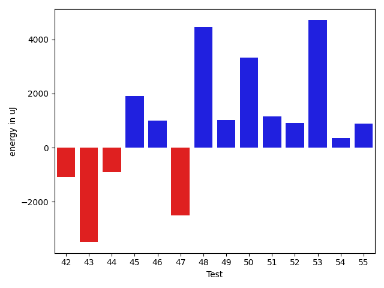

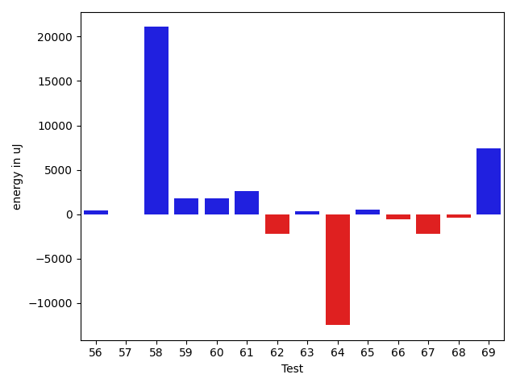

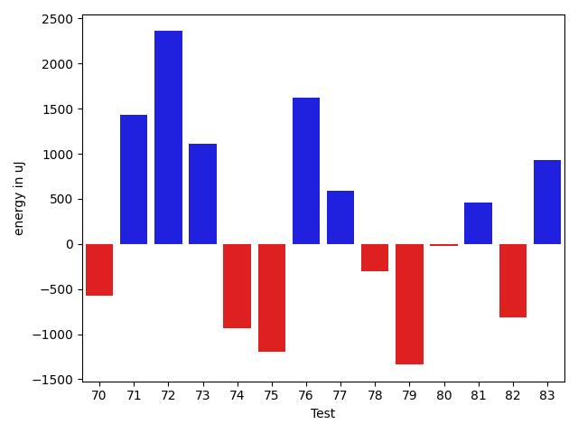

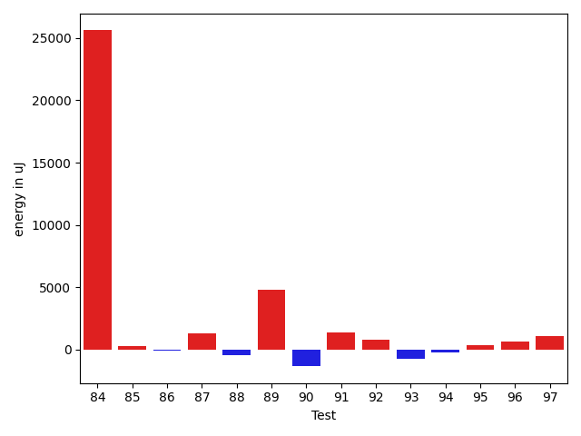

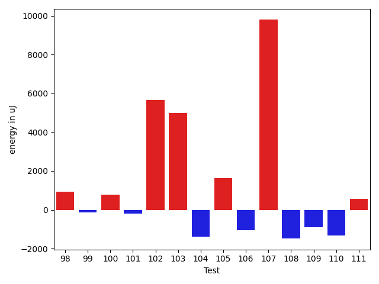

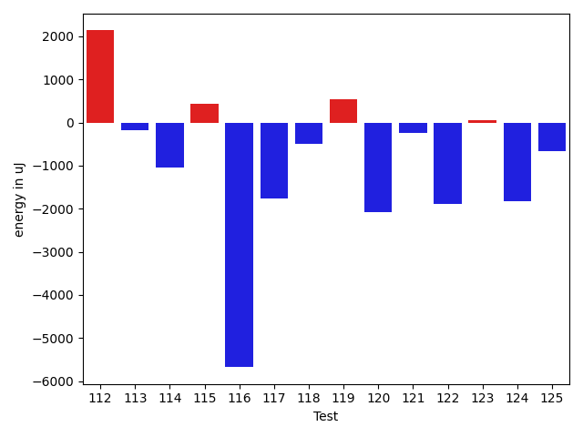

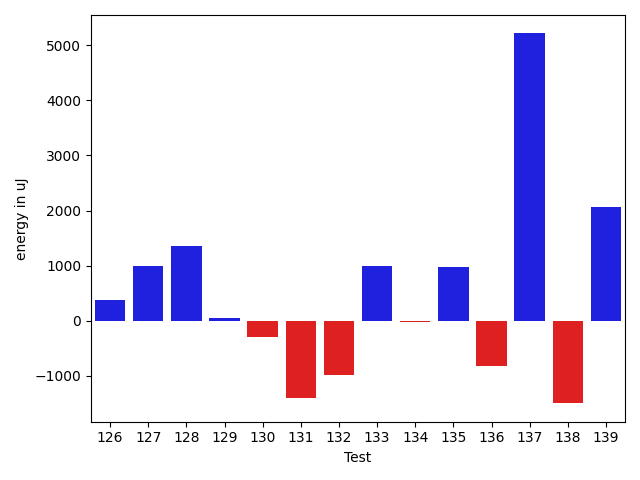

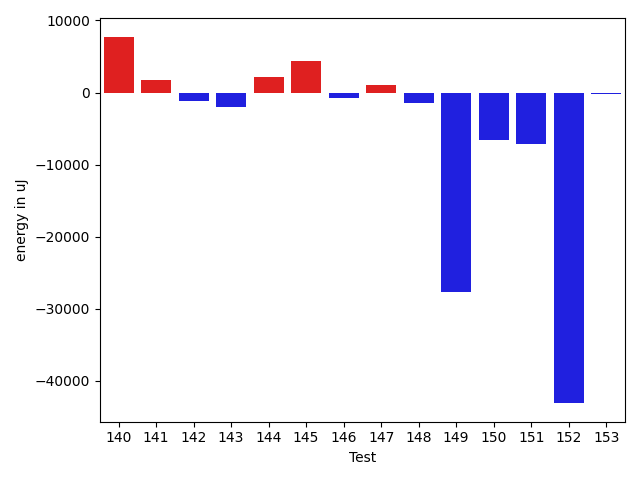

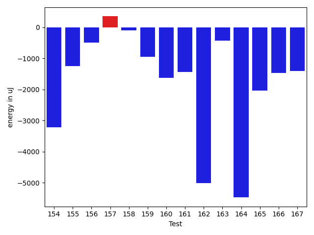

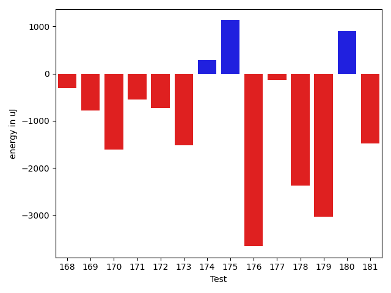

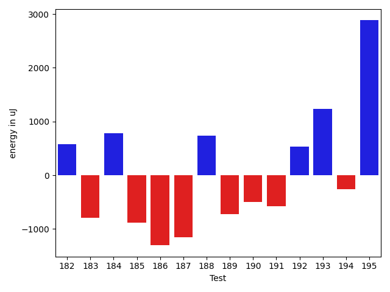

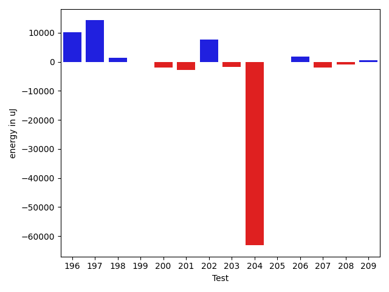

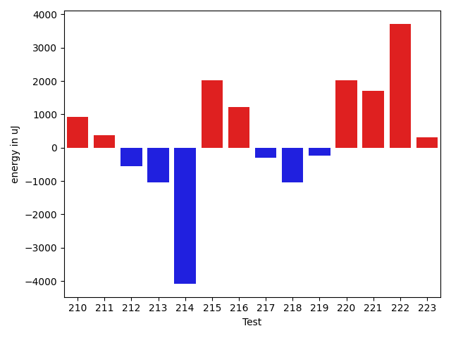

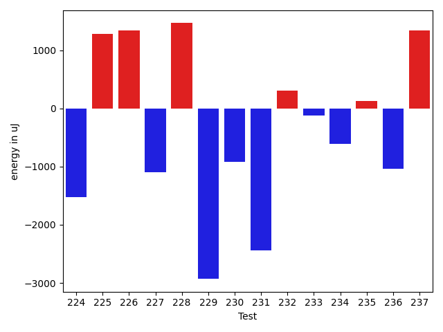

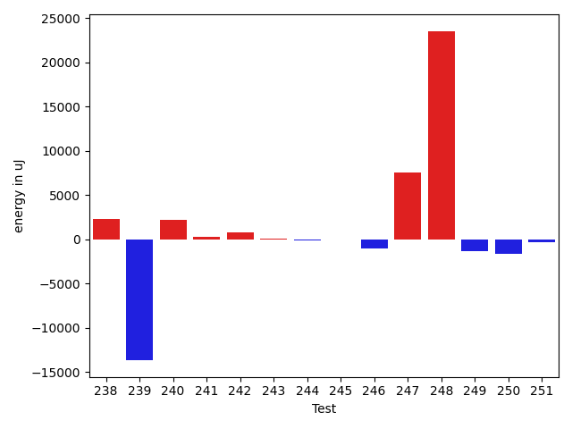

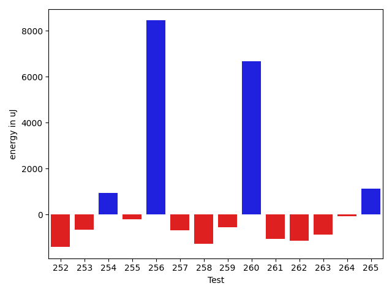

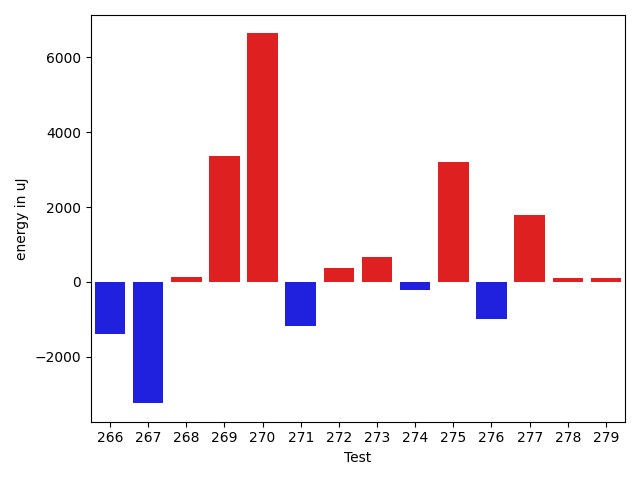

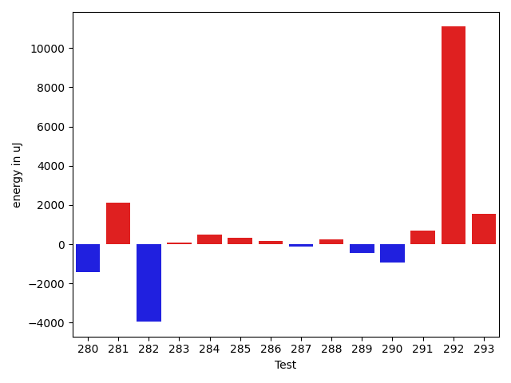

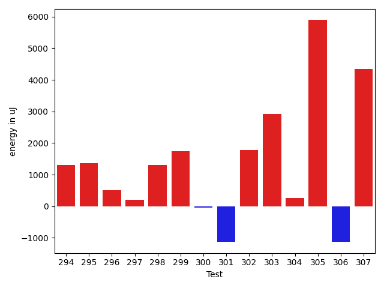

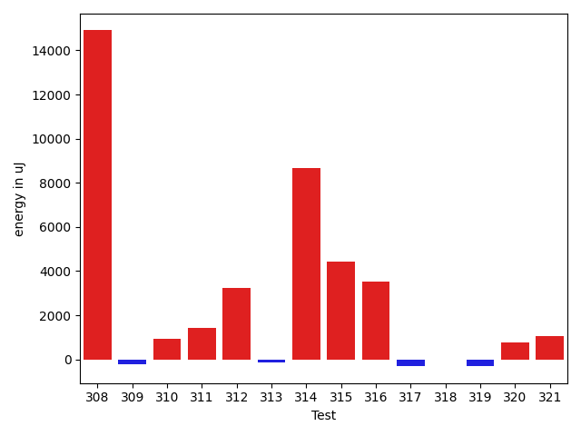

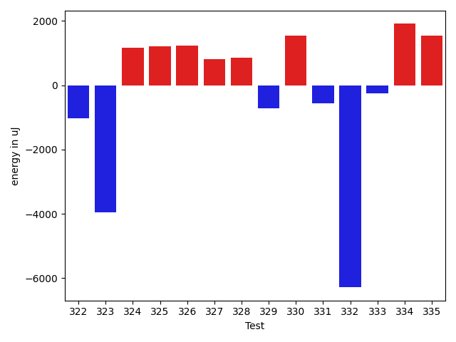

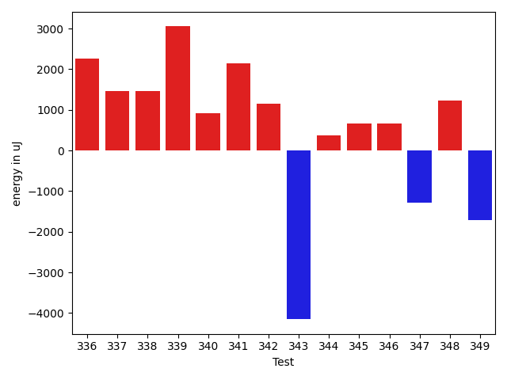

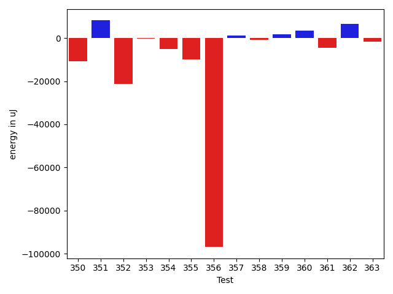

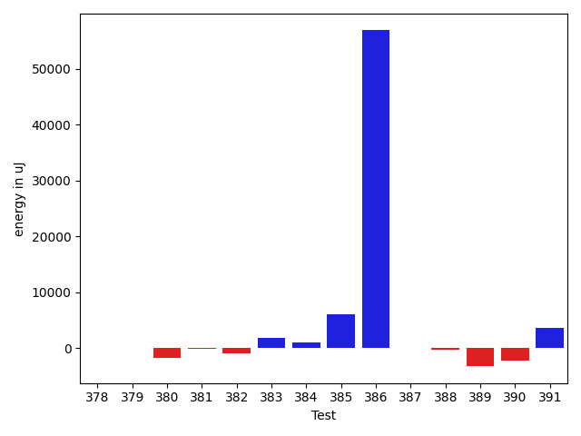

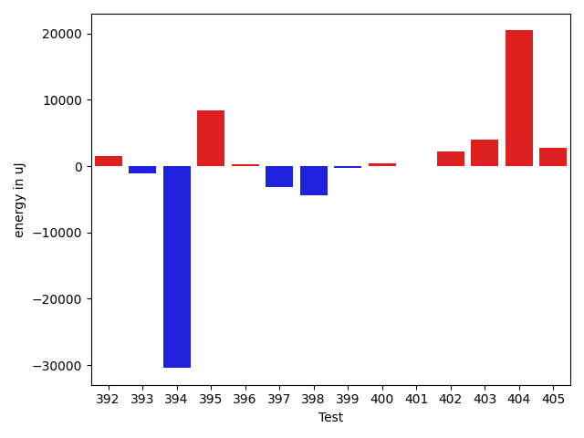

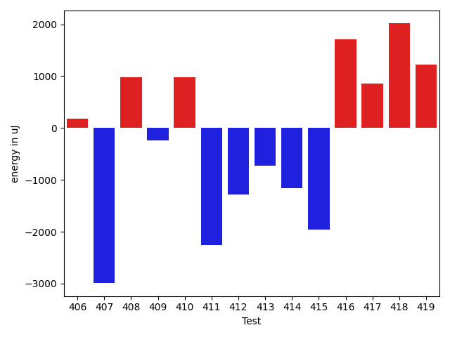

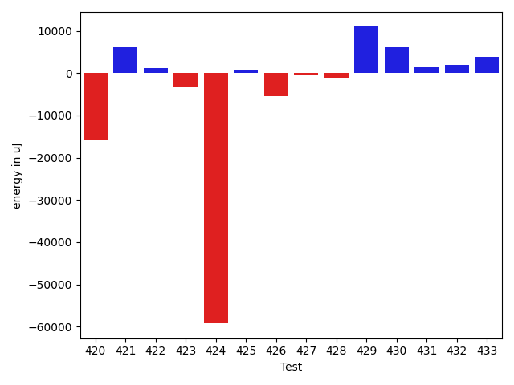

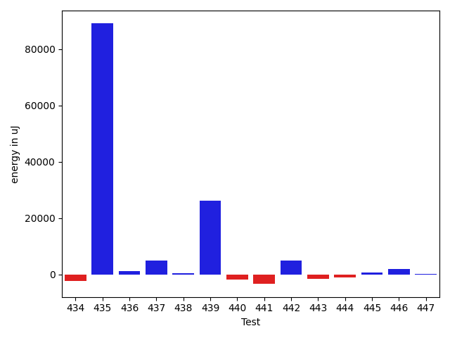

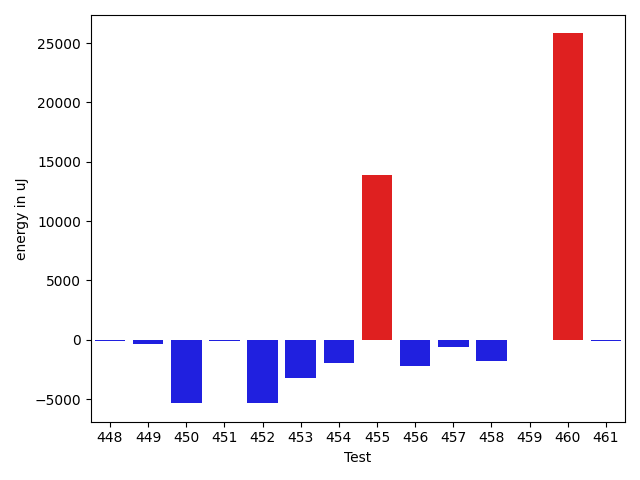

| ID | EnergyV1 | EnergyV2 | DeltaEnergy | σV1 | σV2 |
| --- | --- | --- | --- | --- | --- |
| 0 | 42149.97826086957 | 39020.31034482759 | -3129.667916041981 | 16066.680992296544 | 8143.087348104434 |
| 1 | 38161.294117647056 | 40384.833333333336 | 2223.53921568628 | 3715.2943318555986 | 3311.5280167251426 |
| 2 | 36303.9 | 37360.41176470588 | 1056.5117647058796 | 5440.325053707728 | 4147.273350312773 |
| 3 | 36926.25 | 36728.24137931035 | -198.00862068965216 | 4474.591183441072 | 4453.180782279905 |
| 4 | 54094.301886792455 | 68552.69811320755 | 14458.39622641509 | 30651.83051789148 | 39739.258856638255 |
| 5 | 36101.34285714286 | 36489.28 | 387.9371428571394 | 3958.9318396532676 | 4543.584756731187 |
| 6 | 37402.3 | 36496.416666666664 | -905.8833333333387 | 2822.6894993959218 | 3997.272621391018 |
| 7 | 35927.10526315789 | 37541.666666666664 | 1614.561403508771 | 3867.8662674146162 | 3564.238624478196 |
| 8 | 39018.71428571428 | 38624.916666666664 | -393.79761904761835 | 3363.6945552806205 | 4067.1983489525346 |
| 9 | 52473.61363636364 | 52873.51282051282 | 399.89918414918066 | 20593.4737954615 | 20307.25677275124 |
| 10 | 35594.32142857143 | 38536.1724137931 | 2941.850985221674 | 3016.984824688046 | 4617.705521210541 |
| 11 | 37858.72093023256 | 36569.1 | -1289.6209302325587 | 3822.2283913456085 | 4599.677493042311 |
| 12 | 38021.65 | 37425.27272727273 | -596.3772727272735 | 4467.911103356913 | 6336.637997190466 |
| 13 | 40475.6875 | 41609.737704918036 | 1134.050204918036 | 11732.310418075962 | 14533.414242281775 |
| 14 | 37015.73333333333 | 38458.3 | 1442.566666666673 | 3317.6464643210884 | 5231.04198128824 |
| 15 | 48937.31578947369 | 37268.444444444445 | -11668.871345029242 | 47062.41545689212 | 4593.548848623617 |
| 16 | 39045.0 | 37482.22222222222 | -1562.777777777781 | 4881.606761244557 | 3277.3466157100584 |
| 17 | 38099.90909090909 | 37651.470588235294 | -448.4385026737946 | 3762.8263906644693 | 3222.2798125413346 |
| 18 | 39348.769230769234 | 36404.055555555555 | -2944.7136752136794 | 3599.7842916965956 | 4576.282072602681 |
| 19 | 36604.666666666664 | 37665.38888888889 | 1060.7222222222263 | 5102.191929836517 | 4358.332328092795 |
| 20 | 36983.91891891892 | 36897.92307692308 | -85.99584199584206 | 3527.3617227547825 | 4175.34896674312 |
| 21 | 37394.26666666667 | 37548.192307692305 | 153.92564102563483 | 4732.938783556036 | 4006.5807887603996 |
| 22 | 36948.545454545456 | 37256.41176470588 | 307.8663101604252 | 3642.227349591964 | 3212.2247203424668 |
| 23 | 37630.0 | 37663.07692307692 | 33.07692307692196 | 4316.522674561087 | 5117.891745353722 |
| 24 | 38663.705882352944 | 34932.333333333336 | -3731.3725490196084 | 4006.3072591441714 | 5114.2995827603045 |
| 25 | 47379.61538461538 | 48631.032258064515 | 1251.4168734491323 | 18767.65786599777 | 25261.344133885123 |
| 26 | 36814.166666666664 | 37732.642857142855 | 918.4761904761908 | 5021.875775599747 | 4766.831496424656 |
| 27 | 52297.13513513513 | 53086.77777777778 | 789.6426426426478 | 41157.78363885524 | 28932.47405320717 |
| 28 | 38313.0 | 38808.92307692308 | 495.92307692307804 | 4733.425034322985 | 3610.9218397168856 |
| 29 | 36421.09090909091 | 37674.0 | 1252.9090909090883 | 4240.276137117518 | 3828.3193440464183 |
| 30 | 35762.4 | 37303.9375 | 1541.5374999999985 | 4008.9118689905536 | 4090.1521895393757 |
| 31 | 38024.666666666664 | 35453.875 | -2570.7916666666642 | 5764.424737608737 | 4696.749499321312 |
| 32 | 36821.11111111111 | 37847.9 | 1026.788888888892 | 3148.2581231335753 | 3057.1713870831645 |
| 33 | 37748.42105263158 | 37846.75 | 98.3289473684199 | 3819.039729342132 | 4493.272121090227 |
| 34 | 37767.0 | 36727.75 | -1039.25 | 2372.050261787141 | 4130.202923283552 |
| 35 | 35677.818181818184 | 36434.35294117647 | 756.5347593582846 | 3641.1901355608697 | 3076.713639032563 |
| 36 | 38433.882352941175 | 38730.6875 | 296.80514705882524 | 5296.812836173588 | 5254.194856478369 |
| 37 | 37885.23809523809 | 39182.148148148146 | 1296.9100529100542 | 5093.172141909224 | 4143.799586742723 |
| 38 | 94098.71428571429 | 37078.75 | -57019.96428571429 | 94950.04021772154 | 1535.2722410591116 |
| 39 | 35855.46153846154 | 34912.0 | -943.461538461539 | 3207.9751729181403 | 4226.744721553038 |
| 40 | 36693.181818181816 | 38915.9 | 2222.7181818181853 | 3755.1142778442068 | 3901.112724595381 |
| 41 | 37975.9 | 37376.375 | -599.5250000000015 | 4287.750073173575 | 1874.255581390916 |
| 42 | 38297.4 | 37207.92307692308 | -1089.4769230769234 | 4513.463175877256 | 3659.3117566756155 |
| 43 | 40501.142857142855 | 37011.6 | -3489.5428571428565 | 3923.13065324735 | 4951.580196260584 |
| 44 | 40924.50847457627 | 40018.55 | -905.9584745762695 | 21695.196707615527 | 9923.869435902176 |
| 45 | 37475.38888888889 | 39378.68421052631 | 1903.2953216374226 | 4579.299475039688 | 7712.474901794062 |
| 46 | 37798.08163265306 | 38794.4406779661 | 996.3590453130382 | 8511.102614093064 | 10589.41309215536 |
| 47 | 41260.854166666664 | 38746.08163265306 | -2514.772534013602 | 27171.205095337595 | 4457.5008914657255 |
| 48 | 70676.65656565657 | 75140.29292929293 | 4463.636363636368 | 22069.820559270902 | 31228.325893103993 |
| 49 | 36200.06896551724 | 37221.71875 | 1021.6497844827609 | 3986.0146627672457 | 3874.1423343945994 |
| 50 | 37531.72 | 40871.362068965514 | 3339.6420689655133 | 3983.897378397189 | 12345.067850399815 |
| 51 | 37378.77777777778 | 38529.21052631579 | 1150.4327485380054 | 4005.8959679668214 | 3497.5699621150106 |
| 52 | 36411.56862745098 | 37315.0 | 903.431372549021 | 3752.352769145487 | 4310.297377383778 |
| 53 | 36188.36956521739 | 40906.1320754717 | 4717.76251025431 | 3629.860940914689 | 25664.59797481681 |
| 54 | 41920.65853658537 | 42286.608695652176 | 365.9501590668078 | 15491.827550647875 | 17490.625118068077 |
| 55 | 36370.903225806454 | 37256.93548387097 | 886.0322580645152 | 4100.478959867028 | 4344.810185062723 |
| 56 | 37015.05263157895 | 37468.818181818184 | 453.7655502392372 | 4155.882600629182 | 4041.0617645767275 |
| 57 | 35488.0 | 35457.333333333336 | -30.66666666666424 | 4088.0732891413904 | 3507.1162069268375 |
| 58 | 43330.22388059701 | 64401.59649122807 | 21071.372610631057 | 21263.066673993977 | 144906.40679028744 |
| 59 | 39669.58620689655 | 41481.58181818182 | 1811.995611285267 | 11384.151768311405 | 12465.531911767976 |
| 60 | 38957.849315068495 | 40706.45161290323 | 1748.6022978347319 | 13127.84367281398 | 12621.701460729759 |
| 61 | 35701.21428571428 | 38334.555555555555 | 2633.341269841272 | 3741.787887753497 | 4296.979725974058 |
| 62 | 46982.62244897959 | 44776.241758241755 | -2206.3806907378384 | 30558.49456354334 | 17870.293968286627 |
| 63 | 36632.2962962963 | 36969.555555555555 | 337.2592592592555 | 4208.701337615386 | 4249.230908479822 |
| 64 | 66646.65217391304 | 54170.546875 | -12476.10529891304 | 69799.25782459672 | 44096.89812678498 |
| 65 | 40817.637931034486 | 41319.52 | 501.8820689655113 | 10674.19285925134 | 16541.23450198322 |
| 66 | 40200.22388059701 | 39669.220588235294 | -531.0032923617182 | 11186.777489146216 | 9174.658127699604 |
| 67 | 44288.55 | 42108.19512195122 | -2180.3548780487836 | 20016.371148325063 | 20188.050547013117 |
| 68 | 37907.275 | 37482.25925925926 | -425.0157407407387 | 4465.47488509061 | 4165.865217077806 |
| 69 | 51251.1875 | 58636.101694915254 | 7384.9141949152545 | 55398.85984495614 | 67881.45856894416 |
| 70 | 38538.26470588235 | 37967.13513513513 | -571.1295707472163 | 4776.536366994908 | 4676.505239172598 |
| 71 | 35334.92957746479 | 36764.27777777778 | 1429.3482003129902 | 3714.438745251261 | 5663.633323480564 |
| 72 | 38320.95789473684 | 40682.555555555555 | 2361.597660818712 | 9378.919008427793 | 13244.402485442992 |
| 73 | 35448.637931034486 | 36557.77777777778 | 1109.1398467432955 | 3650.0086287015442 | 4246.1054995819695 |
| 74 | 36527.89473684211 | 35595.4 | -932.4947368421053 | 3796.530811075551 | 3365.9271887549794 |
| 75 | 36744.098360655735 | 35551.954545454544 | -1192.1438152011906 | 3611.3285448955817 | 4001.8196634963465 |
| 76 | 34316.19047619047 | 35936.22222222222 | 1620.0317460317456 | 4132.228357897717 | 3710.866648634874 |
| 77 | 35085.09090909091 | 35678.18421052631 | 593.0933014354014 | 3644.9281887063903 | 4503.902873913405 |
| 78 | 35768.433333333334 | 35467.04761904762 | -301.38571428571595 | 4090.6424164046516 | 3935.8740842735597 |
| 79 | 36956.75 | 35618.653846153844 | -1338.096153846156 | 3225.1262023110557 | 3572.972732810633 |
| 80 | 34632.692307692305 | 34610.93103448276 | -21.761273209544015 | 3156.5931826432843 | 3994.553636373462 |
| 81 | 35591.63461538462 | 36054.41509433962 | 462.7804789550064 | 3648.4653993617976 | 4759.449355473734 |
| 82 | 120593.39393939394 | 119782.19191919192 | -811.2020202020212 | 19800.55278731368 | 21931.10409675174 |
| 83 | 40268.22093023256 | 41198.63636363636 | 930.415433403803 | 15309.183526298439 | 18505.317568804756 |
| 84 | 374263.58585858584 | 399876.0404040404 | 25612.454545454588 | 260960.8580137119 | 232521.7131167884 |
| 85 | 35029.642857142855 | 35286.681818181816 | 257.03896103896113 | 4317.67119947023 | 3662.544413461564 |
| 86 | 40197.64444444444 | 40113.94565217391 | -83.69879227053025 | 11803.75926588278 | 11537.070860985217 |
| 87 | 34993.166666666664 | 36285.3 | 1292.1333333333387 | 4516.742075016264 | 4098.029478908125 |
| 88 | 35749.03571428572 | 35274.5625 | -474.4732142857174 | 3770.8442071290583 | 4035.335007294159 |
| 89 | 34638.857142857145 | 39429.763636363634 | 4790.906493506489 | 3777.888748003341 | 26820.39009679263 |
| 90 | 75947.90909090909 | 74601.43434343435 | -1346.474747474742 | 20899.884625408144 | 22312.598657524188 |
| 91 | 34394.290322580644 | 35796.121212121216 | 1401.8308895405717 | 3541.3389594036635 | 4503.765042835294 |
| 92 | 33602.07692307692 | 34374.8 | 772.723076923081 | 3744.894297810707 | 2693.0910419070497 |
| 93 | 36199.242424242424 | 35438.375 | -760.867424242424 | 4032.0819949447655 | 3160.677852039812 |
| 94 | 36309.9 | 36062.90476190476 | -246.99523809523816 | 2337.759544948967 | 3656.0590792449875 |
| 95 | 35227.882352941175 | 35540.625 | 312.74264705882524 | 4515.7857790029675 | 4063.9211218200335 |
| 96 | 34988.78 | 35626.36363636364 | 637.5836363636408 | 3963.2912246767837 | 4748.46539368682 |
| 97 | 34614.65957446808 | 35695.22222222222 | 1080.5626477541373 | 3700.079224434144 | 4069.2211042239674 |
| 98 | 33950.71875 | 34894.57142857143 | 943.8526785714275 | 3548.8601271603306 | 4528.838974746583 |
| 99 | 35522.3064516129 | 35385.276923076926 | -137.02952853597526 | 3698.1683678620084 | 4158.265538965059 |
| 100 | 35792.06451612903 | 36561.01754385965 | 768.9530277306185 | 3949.379019668657 | 4081.6199892364207 |
| 101 | 45145.46153846154 | 44934.0 | -211.46153846153902 | 22000.848338942207 | 16782.398476446157 |
| 102 | 51304.40740740741 | 56976.145161290326 | 5671.737753882917 | 26129.843786664715 | 30683.040834735155 |
| 103 | 32287.363636363636 | 37264.818181818184 | 4977.454545454548 | 2966.51050816297 | 6114.625355626412 |
| 104 | 36627.379310344826 | 35240.42857142857 | -1386.9507389162536 | 3935.351532418657 | 4114.933599781683 |
| 105 | 35049.392857142855 | 36689.913043478264 | 1640.5201863354087 | 4411.03944940812 | 3542.8605970077156 |
| 106 | 35522.375 | 34482.13043478261 | -1040.244565217392 | 3157.945334291745 | 3255.697297973239 |
| 107 | 36173.5 | 45964.608695652176 | 9791.108695652176 | 2269.0194468095683 | 50513.582856700974 |
| 108 | 36017.5 | 34531.529411764706 | -1485.9705882352937 | 3204.7563653281213 | 3518.515731813246 |
| 109 | 34091.8125 | 33185.642857142855 | -906.1696428571449 | 3744.4926428481267 | 2892.0798647128595 |
| 110 | 36498.88888888889 | 35160.42857142857 | -1338.460317460318 | 4062.6553561937635 | 4352.781208020679 |
| 111 | 34652.541666666664 | 35209.625 | 557.0833333333358 | 3746.3182368289567 | 3372.4211235216458 |
| 112 | 34569.89473684211 | 35541.514285714286 | 971.6195488721787 | 4239.555244731479 | 4326.948006366141 |
| 113 | 36366.37142857143 | 36333.23809523809 | -33.13333333333867 | 4008.8757532378027 | 3982.097388308996 |
| 114 | 35304.392857142855 | 34444.71875 | -859.6741071428551 | 3541.1937387925086 | 4969.329665774694 |
| 115 | 35854.57692307692 | 36481.80701754386 | 627.2300944669405 | 3074.9612777183806 | 3190.6682104888996 |
| 116 | 38314.75 | 34312.72727272727 | -4002.022727272728 | 4051.4111559019366 | 3947.6804833151205 |
| 117 | 35576.666666666664 | 34405.875 | -1170.7916666666642 | 4196.188243844379 | 3116.3414087743445 |
| 118 | 34162.862068965514 | 33569.34482758621 | -593.5172413793043 | 4139.35127121295 | 3728.2245129585435 |
| 119 | 35321.96428571428 | 34573.25 | -748.7142857142826 | 4327.688268432061 | 3845.0856281102506 |
| 120 | 35542.583333333336 | 35069.0 | -473.58333333333576 | 3867.808670257905 | 3024.478632756396 |
| 121 | 34367.68 | 34538.692307692305 | 171.0123076923046 | 4273.025005496692 | 3817.953295532032 |
| 122 | 44794.045454545456 | 36971.51612903226 | -7822.529325513198 | 20468.780872514726 | 5753.213564109713 |
| 123 | 36416.25 | 36885.137931034486 | 468.8879310344855 | 4072.54805322581 | 3359.3860812719918 |
| 124 | 35943.818181818184 | 35442.7 | -501.1181818181867 | 2937.2247822540926 | 4884.642423965136 |
| 125 | 36065.6 | 35734.42105263158 | -331.17894736841845 | 4580.834448001805 | 3620.1076214852687 |
| 126 | 35749.4 | 36130.46153846154 | 381.06153846153757 | 4675.959187161496 | 4401.936708652482 |
| 127 | 34893.307692307695 | 35888.59090909091 | 995.2832167832166 | 3583.8256393158626 | 3757.0200069529346 |
| 128 | 34570.2 | 35929.27777777778 | 1359.077777777784 | 1810.708689988536 | 3955.7109461519267 |
| 129 | 34146.769230769234 | 34198.307692307695 | 51.53846153846098 | 2121.9103567611373 | 3299.8532224844225 |
| 130 | 36318.9 | 36025.875 | -293.02500000000146 | 3257.00488025425 | 3982.6048303057887 |
| 131 | 36417.583333333336 | 35019.58823529412 | -1397.9950980392168 | 3801.8825262040323 | 3313.1540163916584 |
| 132 | 38981.31578947369 | 37998.08045977011 | -983.2353297035734 | 8723.841060430057 | 5829.692484581892 |
| 133 | 36001.125 | 36997.9649122807 | 996.8399122807023 | 4095.8632465421742 | 4110.3157729248505 |
| 134 | 48899.326315789476 | 48877.75257731959 | -21.573738469887758 | 19437.086159381048 | 20086.059405309632 |
| 135 | 36560.8 | 37534.791666666664 | 973.9916666666613 | 4050.8493733677983 | 6416.8909851212675 |
| 136 | 37410.16279069767 | 36596.895833333336 | -813.2669573643361 | 3825.9668662798535 | 3773.954409499754 |
| 137 | 39769.75555555556 | 44981.32941176471 | 5211.57385620915 | 12882.046192978221 | 18979.71748527621 |
| 138 | 91651.81818181818 | 90157.34343434343 | -1494.474747474742 | 81318.18155319545 | 64850.01739323018 |
| 139 | 46871.677083333336 | 48941.467391304344 | 2069.7903079710086 | 17469.444828456188 | 18686.217533397663 |
| 140 | 69481.26262626263 | 77248.09090909091 | 7766.828282828283 | 32374.11254728007 | 34286.46861257409 |
| 141 | 47681.60824742268 | 49375.414893617024 | 1693.8066461943454 | 20545.46976807442 | 18404.396465628353 |
| 142 | 54892.93421052631 | 53682.40476190476 | -1210.5294486215498 | 49922.703783827434 | 36965.02658631053 |
| 143 | 58373.53535353536 | 56308.131313131315 | -2065.4040404040425 | 25647.28213899939 | 25388.064718573456 |
| 144 | 38551.385714285716 | 40653.541666666664 | 2102.1559523809483 | 10319.200016464256 | 11951.146311753133 |
| 145 | 70023.80808080808 | 74436.27272727272 | 4412.464646464636 | 34495.7485911258 | 36184.200262584105 |
| 146 | 49155.0 | 48413.88172043011 | -741.1182795698915 | 18182.31646049439 | 17602.236882441393 |
| 147 | 39074.92307692308 | 40097.7625 | 1022.839423076919 | 11548.857802074817 | 10470.825534841739 |
| 148 | 37919.55172413793 | 36477.0 | -1442.5517241379275 | 2857.895386543752 | 3932.082298223169 |
| 149 | 230804.202020202 | 203113.36363636365 | -27690.83838383836 | 115583.26412162656 | 80895.01984739353 |
| 150 | 123365.34343434343 | 116710.0101010101 | -6655.3333333333285 | 32681.449596684637 | 27092.09066379433 |
| 151 | 112439.31313131313 | 105264.43434343435 | -7174.878787878784 | 39286.34753241006 | 27696.98202067818 |
| 152 | 349046.797979798 | 305907.43434343435 | -43139.36363636365 | 187757.0377733787 | 147659.88759240354 |
| 153 | 39899.97222222222 | 39749.933333333334 | -150.03888888888469 | 2499.040587973614 | 3591.6176386444895 |
| 154 | 45195.54285714286 | 41974.170731707316 | -3221.3721254355405 | 21160.105128476167 | 6905.7639972333845 |
| 155 | 39276.50847457627 | 38034.625 | -1241.8834745762724 | 9295.196316109354 | 6751.6425053529965 |
| 156 | 37613.84444444445 | 37116.41860465116 | -497.4258397932863 | 3633.521315966131 | 3701.8310003297966 |
| 157 | 35777.4 | 36127.96078431373 | 350.5607843137259 | 3977.8119803619566 | 3755.206278560548 |
| 158 | 36427.08888888889 | 36321.085106382976 | -106.00378250591166 | 4621.880765913481 | 4556.239891643516 |
| 159 | 38063.72727272727 | 37122.269230769234 | -941.4580419580379 | 5233.008557415463 | 4135.011115766776 |
| 160 | 55698.45652173913 | 54070.75 | -1627.7065217391282 | 37330.27649020385 | 36154.926635009986 |
| 161 | 43682.59090909091 | 42247.90476190476 | -1434.6861471861484 | 16024.146326221555 | 13278.430731428409 |
| 162 | 55305.73737373737 | 50290.9898989899 | -5014.74747474747 | 20203.69896855117 | 18723.210399030468 |
| 163 | 37381.86666666667 | 36955.375 | -426.4916666666686 | 4441.35439602731 | 4053.5509413815194 |
| 164 | 46727.0 | 41254.25 | -5472.75 | 21830.125805362783 | 15903.942854850715 |
| 165 | 46981.81443298969 | 44946.29347826087 | -2035.5209547288177 | 16356.939065559634 | 15827.479049959724 |
| 166 | 38030.619047619046 | 36564.03333333333 | -1466.585714285713 | 4213.788929287936 | 4444.225845471353 |
| 167 | 37719.49056603773 | 36308.02127659575 | -1411.469289441986 | 4374.394662693952 | 4000.5541769799297 |
| 168 | 37320.27272727273 | 37014.02 | -306.25272727273114 | 5758.286760532939 | 6250.014385551444 |
| 169 | 37773.88888888889 | 36989.529411764706 | -784.3594771241842 | 3671.2603298971517 | 4291.239339941826 |
| 170 | 37615.27272727273 | 36003.30952380953 | -1611.9632034632014 | 4667.459992347582 | 3629.600263233085 |
| 171 | 37617.87037037037 | 37072.96153846154 | -544.9088319088332 | 5774.779175019006 | 3128.046195074605 |
| 172 | 47296.46296296296 | 46562.8679245283 | -733.5950384346652 | 35282.3312415892 | 38202.62758721528 |
| 173 | 37850.47619047619 | 36327.57142857143 | -1522.9047619047633 | 4561.186119954072 | 4424.263862055295 |
| 174 | 36632.0 | 36917.74509803922 | 285.7450980392168 | 4274.364712130645 | 4400.113317806122 |
| 175 | 36942.11111111111 | 38068.333333333336 | 1126.2222222222263 | 4392.176717868676 | 4751.780181036249 |
| 176 | 41592.779661016946 | 37938.236363636366 | -3654.54329738058 | 15823.379401923392 | 6407.963814912125 |
| 177 | 36478.14634146341 | 36347.9 | -130.24634146341123 | 4067.9549758940607 | 3192.5975850394925 |
| 178 | 37614.2 | 35244.92727272727 | -2369.272727272728 | 6829.083051452543 | 3861.7926447537775 |
| 179 | 42627.833333333336 | 39601.46296296296 | -3026.3703703703723 | 19646.682202657586 | 13366.741351568808 |
| 180 | 36664.37777777778 | 37563.95918367347 | 899.5814058956894 | 5450.253030981993 | 3696.8617080072045 |
| 181 | 37985.291666666664 | 36501.21153846154 | -1484.0801282051252 | 4372.543357695902 | 3947.9084888103357 |
| 182 | 37382.47619047619 | 37962.660377358494 | 580.184186882303 | 4466.07185576561 | 4243.955434934852 |
| 183 | 37662.51063829787 | 36875.40476190476 | -787.1058763931069 | 3980.0976726619883 | 3990.086567025617 |
| 184 | 35956.17857142857 | 36738.192307692305 | 782.0137362637324 | 3474.674456010966 | 4480.067135651075 |
| 185 | 35419.5 | 34534.72727272727 | -884.7727272727279 | 3814.9884337963595 | 3918.065781871762 |
| 186 | 37600.5 | 36297.65957446808 | -1302.8404255319183 | 3897.3953588689633 | 3945.110533071666 |
| 187 | 37217.69387755102 | 36061.97727272727 | -1155.7166048237486 | 3640.5255462951804 | 3802.182223220552 |
| 188 | 35944.551020408166 | 36676.67391304348 | 732.1228926353142 | 4915.836607691449 | 3990.6096627738243 |
| 189 | 36874.234042553195 | 36149.38636363636 | -724.8476789168344 | 4024.3945346792234 | 4782.94826448323 |
| 190 | 37436.69696969697 | 36937.903225806454 | -498.7937438905137 | 3678.7278391086834 | 3618.426840090369 |
| 191 | 36553.27777777778 | 35980.1 | -573.1777777777825 | 4417.641361701659 | 3969.803570707246 |
| 192 | 41645.56923076923 | 42174.18032786885 | 528.6110970996233 | 13219.42284434214 | 13821.653907473363 |
| 193 | 38673.92727272727 | 39910.03773584906 | 1236.1104631217895 | 6043.0310511877915 | 7169.397166737596 |
| 194 | 37809.35294117647 | 37550.53846153846 | -258.81447963800747 | 5300.374325750926 | 5028.921854408903 |
| 195 | 41467.2 | 44348.608695652176 | 2881.4086956521787 | 16422.640544252143 | 17304.2772037012 |
| 196 | 36957.46511627907 | 47190.39024390244 | 10232.92512762337 | 4063.683741521811 | 45731.70211553792 |
| 197 | 48923.81081081081 | 63178.617647058825 | 14254.806836248012 | 36921.72057997608 | 61913.733329250725 |
| 198 | 38097.3125 | 39391.153846153844 | 1293.841346153844 | 5391.85184698576 | 3831.324652351452 |
| 199 | 36777.207792207795 | 36748.43037974684 | -28.77741246095684 | 6683.670790033697 | 7936.410422669165 |
| 200 | 38379.50943396227 | 36420.254237288136 | -1959.2551966741303 | 9500.14552147262 | 7318.532428121439 |
| 201 | 74822.0808080808 | 72080.42424242424 | -2741.6565656565654 | 27695.720335870712 | 25869.25234971335 |
| 202 | 35566.32 | 43231.57692307692 | 7665.256923076922 | 3894.4774922446263 | 35596.83381898438 |
| 203 | 36718.25 | 35053.5 | -1664.75 | 4202.208898305747 | 4674.22408485671 |
| 204 | 302577.4810126582 | 239402.1325301205 | -63175.34848253772 | 239925.49943378975 | 225152.80954497217 |
| 205 | 36662.46 | 36602.12727272727 | -60.332727272725606 | 3910.9087599175728 | 4433.021005854484 |
| 206 | 38250.10256410256 | 40121.56756756757 | 1871.465003465004 | 8660.872597107451 | 11578.94286950084 |
| 207 | 40704.25 | 38665.64 | -2038.6100000000006 | 14365.535689193772 | 7876.552803758759 |
| 208 | 52386.8969072165 | 51486.836734693876 | -900.0601725226225 | 18376.995691041204 | 19257.27748029135 |
| 209 | 35964.41379310345 | 36400.97368421053 | 436.5598911070774 | 4056.688368414616 | 2959.4269669974437 |
| 210 | 36692.83870967742 | 36992.316666666666 | 299.4779569892489 | 5539.370268720573 | 5652.657606505889 |
| 211 | 34399.739130434784 | 35699.46666666667 | 1299.7275362318833 | 4061.415123022059 | 4383.3984436228875 |
| 212 | 36637.45945945946 | 36507.22727272727 | -130.23218673218798 | 3451.18082882096 | 4035.838089506409 |
| 213 | 39186.66129032258 | 39503.08823529412 | 316.4269449715357 | 9136.916459357377 | 10337.028850825696 |
| 214 | 37848.22222222222 | 34853.52 | -2994.702222222222 | 3823.167601109431 | 3224.5666886575627 |
| 215 | 34810.93103448276 | 36501.137931034486 | 1690.2068965517246 | 3187.0773329616964 | 3462.925509511186 |
| 216 | 36201.980769230766 | 36851.145833333336 | 649.1650641025699 | 4436.172494783801 | 4183.22648098721 |
| 217 | 54355.78378378379 | 64741.933333333334 | 10386.149549549547 | 62599.29316505149 | 74380.1051957369 |
| 218 | 37336.08571428571 | 36403.76470588235 | -932.3210084033635 | 3823.2922788868655 | 4021.82370148334 |
| 219 | 36166.85294117647 | 36911.32432432433 | 744.4713831478584 | 3302.4614094227722 | 3512.033091437817 |
| 220 | 36149.242424242424 | 38494.51515151515 | 2345.272727272728 | 4101.326474486199 | 5803.7098590951555 |
| 221 | 34729.045454545456 | 36475.22222222222 | 1746.1767676767631 | 5109.689178211713 | 3775.81293021127 |
| 222 | 37196.15789473684 | 37658.55 | 462.3921052631631 | 8525.64896287826 | 4593.062338734366 |
| 223 | 35836.19047619047 | 36237.68 | 401.4895238095269 | 4311.883166310203 | 4935.433060796186 |
| 224 | 37462.65789473684 | 35249.76666666667 | -2212.8912280701697 | 5877.893080617792 | 3482.21304808052 |
| 225 | 34561.65217391304 | 35166.782608695656 | 605.1304347826153 | 3952.7591861084634 | 2972.015769700712 |
| 226 | 36621.06060606061 | 36550.10810810811 | -70.95249795250129 | 5845.0032995785805 | 3964.376879456176 |
| 227 | 36164.97222222222 | 35823.545454545456 | -341.4267676767631 | 4016.8922238612877 | 3727.6635776225676 |
| 228 | 34884.45238095238 | 35970.62857142857 | 1086.176190476188 | 4616.393872991078 | 3766.829118090965 |
| 229 | 36183.541666666664 | 34695.2 | -1488.3416666666672 | 4462.2095048227575 | 4571.948584575291 |
| 230 | 40047.13333333333 | 37033.82352941176 | -3013.3098039215693 | 7538.67488680132 | 2802.567441289465 |
| 231 | 36173.52380952381 | 35122.90909090909 | -1050.614718614721 | 4089.306200544789 | 3957.40712759677 |
| 232 | 36626.545454545456 | 37062.969696969696 | 436.4242424242402 | 4315.741774726067 | 3888.4675994289832 |
| 233 | 36373.75 | 36537.041666666664 | 163.29166666666424 | 4378.982665814058 | 4034.2093967216456 |
| 234 | 36395.26666666667 | 35625.57692307692 | -769.6897435897481 | 3697.574718049056 | 3910.8100397692237 |
| 235 | 36519.26666666667 | 37113.92592592593 | 594.6592592592569 | 4475.510480629246 | 3655.0519672642026 |
| 236 | 37375.92592592593 | 35968.94736842105 | -1406.9785575048736 | 3636.224455504545 | 3543.20018112803 |
| 237 | 36032.17647058824 | 37040.88 | 1008.7035294117595 | 3480.582815214144 | 4137.8483038410195 |
| 238 | 34700.333333333336 | 37025.4375 | 2325.1041666666642 | 3345.9093764708505 | 3706.0631397877924 |
| 239 | 154283.39795918367 | 140570.38383838383 | -13713.014120799839 | 93792.00161503044 | 89469.39560832706 |
| 240 | 36167.666666666664 | 38320.42105263158 | 2152.754385964916 | 3925.051899363678 | 3993.407980209246 |
| 241 | 38060.97959183674 | 38344.54761904762 | 283.56802721088025 | 4010.4327136362617 | 3917.5856887482128 |
| 242 | 40344.09302325582 | 41121.57142857143 | 777.4784053156109 | 9559.158766174358 | 12930.970641103799 |
| 243 | 36904.01724137931 | 36957.37209302326 | 53.35485164394777 | 3780.5898941803507 | 4490.648749025933 |
| 244 | 37833.08571428571 | 37741.818181818184 | -91.26753246752924 | 3866.7171411671575 | 4461.75411526946 |
| 245 | 36382.391304347824 | 36365.555555555555 | -16.83574879226944 | 3508.2801774377494 | 4507.860733769592 |
| 246 | 39245.458333333336 | 38223.92105263158 | -1021.5372807017557 | 6647.968292262724 | 4140.550912884463 |
| 247 | 73807.32323232324 | 81321.43434343435 | 7514.1111111111095 | 46801.164994096165 | 46562.34670015556 |
| 248 | 69072.5142857143 | 92651.16216216216 | 23578.647876447867 | 58833.57204345707 | 101927.57248893559 |
| 249 | 40345.81333333333 | 39036.09722222222 | -1309.7161111111127 | 11604.650244556658 | 8942.77212048262 |
| 250 | 43213.730158730155 | 41572.03389830508 | -1641.696260425073 | 14151.881490488691 | 12396.29437791535 |
| 251 | 38446.875 | 38062.166666666664 | -384.70833333333576 | 3974.499531518612 | 4083.4499337093766 |
| 252 | 53233.95294117647 | 51815.58441558442 | -1418.36852559205 | 30264.223074898146 | 27732.574724793416 |
| 253 | 37556.933333333334 | 36900.708333333336 | -656.2249999999985 | 3769.422457382858 | 4223.861034637687 |
| 254 | 36086.4 | 37028.818181818184 | 942.4181818181823 | 3440.876086115278 | 3863.6954712056277 |
| 255 | 41055.21052631579 | 40853.255319148935 | -201.95520716685132 | 11179.88231073988 | 9565.487222674681 |
| 256 | 39651.95744680851 | 48099.75 | 8447.792553191488 | 12383.024454328071 | 28057.179333319404 |
| 257 | 37821.333333333336 | 37132.619047619046 | -688.7142857142899 | 4695.297564821874 | 4641.461197225662 |
| 258 | 48135.27027027027 | 46856.575 | -1278.6952702702765 | 20667.209936892854 | 19551.292537691083 |
| 259 | 38003.47826086957 | 37456.21052631579 | -547.2677345537813 | 4380.178404839587 | 3590.679287426316 |
| 260 | 59753.278350515466 | 66430.58695652174 | 6677.308606006278 | 57442.903388009305 | 71764.52198883456 |
| 261 | 38262.61224489796 | 37187.07843137255 | -1075.533813525406 | 6651.774778717995 | 5253.639660285337 |
| 262 | 48588.933333333334 | 47453.65 | -1135.2833333333328 | 24783.132877602235 | 22039.695912016723 |
| 263 | 44921.82258064516 | 44046.92156862745 | -874.9010120177118 | 19653.477451080642 | 14706.497852714212 |
| 264 | 38008.65625 | 37929.71186440678 | -78.94438559321861 | 8270.214339760847 | 7025.804105136829 |
| 265 | 37327.48484848485 | 38455.519230769234 | 1128.034382284386 | 4413.223625075207 | 7750.468331979352 |
| 266 | 37673.02631578947 | 36286.5625 | -1386.4638157894733 | 4656.663270529333 | 3738.7631082253774 |
| 267 | 41466.96226415094 | 38230.88524590164 | -3236.0770182492997 | 22802.65117403268 | 6067.843744539156 |
| 268 | 43504.666666666664 | 43646.94366197183 | 142.27699530516838 | 14624.229795813968 | 15292.72557058119 |
| 269 | 42544.64864864865 | 45913.63636363636 | 3368.987714987714 | 24218.763530176482 | 30397.000330543164 |
| 270 | 38782.836363636365 | 45416.065573770495 | 6633.22921013413 | 6664.31444408101 | 29129.359806727625 |
| 271 | 38955.05172413793 | 37770.5 | -1184.5517241379275 | 9012.751042794514 | 4343.3123160785935 |
| 272 | 37653.177777777775 | 38023.34146341463 | 370.1636856368568 | 4730.544259450206 | 3800.399469438071 |
| 273 | 38440.46551724138 | 39119.10144927536 | 678.6359320339834 | 6062.7104135985055 | 9065.604482983028 |
| 274 | 40468.94117647059 | 40248.276923076926 | -220.66425339366106 | 12091.497741950689 | 9574.990619810938 |
| 275 | 49943.01408450704 | 53152.51470588235 | 3209.5006213753077 | 36503.49349613454 | 65258.53444197539 |
| 276 | 38033.87037037037 | 37033.05357142857 | -1000.8167989417998 | 4348.857777011987 | 4068.8743328365176 |
| 277 | 38642.666666666664 | 40428.84090909091 | 1786.1742424242475 | 6191.0179808242265 | 11795.66116290836 |
| 278 | 37776.40350877193 | 37884.47368421053 | 108.07017543859547 | 4692.386931816517 | 4133.996673307988 |
| 279 | 37932.64705882353 | 38039.954545454544 | 107.30748663101258 | 3794.919125561199 | 4127.106789565704 |
| 280 | 37361.391304347824 | 35925.69565217391 | -1435.695652173912 | 4387.7688272815285 | 4740.9960926846015 |
| 281 | 40630.19277108434 | 42751.02173913043 | 2120.828968046095 | 11273.169928103609 | 13971.96550859758 |
| 282 | 40911.243902439026 | 36957.65714285714 | -3953.5867595818854 | 30146.79055100024 | 3978.4395429281935 |
| 283 | 37629.95744680851 | 37699.28888888889 | 69.33144208037993 | 3985.585068545741 | 8889.764215401447 |
| 284 | 37263.28571428572 | 37744.52272727273 | 481.23701298701053 | 4294.548245468091 | 4045.194637909822 |
| 285 | 36720.291666666664 | 37060.73529411765 | 340.44362745098624 | 4645.416652278232 | 4439.507864278385 |
| 286 | 37389.07317073171 | 37545.023255813954 | 155.9500850822442 | 4721.896887285686 | 4353.551271534283 |
| 287 | 38063.63157894737 | 37934.94117647059 | -128.69040247677913 | 4063.5374168266417 | 4414.604591854421 |
| 288 | 38003.07142857143 | 38261.10256410256 | 258.0311355311351 | 4338.8778524760855 | 6315.216977797367 |
| 289 | 36961.90243902439 | 36505.0 | -456.9024390243867 | 4374.407532315037 | 4206.5373824560265 |
| 290 | 37619.28888888889 | 36699.85365853659 | -919.4352303523046 | 4013.5210898617993 | 4570.33083907327 |
| 291 | 38332.24074074074 | 39012.67441860465 | 680.4336778639117 | 8728.989110228535 | 13314.476523817943 |
| 292 | 67518.71875 | 78604.5744680851 | 11085.855718085106 | 30440.658066386284 | 27975.685512673834 |
| 293 | 49827.05952380953 | 51376.05063291139 | 1548.9911091018657 | 25644.594353972345 | 28155.91274454531 |
| 294 | 41833.333333333336 | 43138.76 | 1305.4266666666663 | 18408.477713679713 | 18623.42910697168 |
| 295 | 42795.583333333336 | 44151.88461538462 | 1356.3012820512813 | 16514.534497215544 | 16628.239333520556 |
| 296 | 37316.82 | 37819.11111111111 | 502.2911111111098 | 7856.291271815217 | 7474.8253408720675 |
| 297 | 43414.52173913043 | 43624.490909090906 | 209.96916996047366 | 28181.578983241125 | 21804.268566976203 |
| 298 | 40499.660377358494 | 41799.39215686275 | 1299.7317795042545 | 9788.491328515853 | 18863.656361808786 |
| 299 | 35623.260869565216 | 37370.48 | 1747.219130434787 | 4778.588905937303 | 3521.461902335449 |
| 300 | 38507.705882352944 | 38458.81481481482 | -48.89106753812666 | 3903.202158480316 | 4095.323231823571 |
| 301 | 40866.617647058825 | 39737.68085106383 | -1128.936795994996 | 11009.210299228087 | 11960.680420953757 |
| 302 | 35423.944444444445 | 37202.28571428572 | 1778.3412698412722 | 3566.497916136005 | 4096.401732797039 |
| 303 | 46204.14736842105 | 49128.42222222222 | 2924.274853801173 | 17442.01042973298 | 23637.20156118212 |
| 304 | 37559.85294117647 | 37818.8125 | 258.95955882353155 | 4039.7898906659307 | 4116.859523938575 |
| 305 | 36444.688888888886 | 42336.95 | 5892.261111111111 | 4005.0505438465357 | 29128.11042957473 |
| 306 | 37279.17391304348 | 36151.260869565216 | -1127.9130434782637 | 3351.4595996394055 | 4096.219457620716 |
| 307 | 36422.02173913043 | 40769.55882352941 | 4347.53708439898 | 5157.821293872774 | 11177.719877430482 |
| 308 | 58167.89473684211 | 73073.28947368421 | 14905.394736842107 | 57881.37354233064 | 71783.07357437842 |
| 309 | 37057.03571428572 | 36819.4375 | -237.5982142857174 | 3612.9561450240917 | 3730.80102774106 |
| 310 | 36725.96 | 37658.625 | 932.6650000000009 | 4050.2680847568595 | 3971.571711473305 |
| 311 | 35526.78571428572 | 36949.0 | 1422.2142857142826 | 3825.450191594101 | 3625.4065978866424 |
| 312 | 40358.76 | 43580.73529411765 | 3221.9752941176484 | 12910.324997551379 | 13513.911336337878 |
| 313 | 35046.2 | 34895.454545454544 | -150.74545454545296 | 2932.900127859795 | 5187.848570784274 |
| 314 | 57026.4 | 65708.46428571429 | 8682.064285714288 | 47384.62301380059 | 48595.7031643173 |
| 315 | 39921.640625 | 44338.95161290323 | 4417.310987903227 | 17691.922238135252 | 18432.280582320807 |
| 316 | 41814.260869565216 | 45336.29268292683 | 3522.0318133616165 | 17174.208747591838 | 23414.168440147623 |
| 317 | 37231.25 | 36920.606060606064 | -310.6439393939363 | 3839.189280350364 | 4550.29040657909 |
| 318 | 34789.793103448275 | 34757.11538461538 | -32.677718832892424 | 3850.416353477225 | 4259.332787465508 |
| 319 | 51161.311475409835 | 50880.57407407407 | -280.7374013357621 | 19106.476058185075 | 16847.459990556497 |
| 320 | 35648.71428571428 | 36407.5 | 758.7857142857174 | 3196.530673548867 | 3490.373177278708 |
| 321 | 36744.93939393939 | 37815.846153846156 | 1070.906759906764 | 3460.08975132669 | 4396.046831593372 |
| 322 | 37098.102040816324 | 36064.3275862069 | -1033.7744546094254 | 4102.1439354487175 | 3509.6823875748064 |
| 323 | 51246.76315789474 | 47290.767441860466 | -3955.9957160342747 | 27667.14759748008 | 27353.923585608558 |
| 324 | 35388.05 | 36547.65 | 1159.5999999999985 | 3746.750558483978 | 4030.866672007398 |
| 325 | 34828.0 | 36050.23529411765 | 1222.2352941176505 | 3716.891443128249 | 3339.1250268051776 |
| 326 | 43640.08 | 44885.59259259259 | 1245.5125925925895 | 13772.030621284573 | 17171.31899689941 |
| 327 | 35425.35294117647 | 36246.0 | 820.6470588235316 | 3957.8198535405304 | 5182.628745558157 |
| 328 | 37127.35294117647 | 37981.142857142855 | 853.7899159663866 | 4811.972005458352 | 4333.950867562873 |
| 329 | 37204.03448275862 | 36480.46153846154 | -723.5729442970842 | 4320.017963586204 | 4567.486796164396 |
| 330 | 33169.72727272727 | 34718.35294117647 | 1548.6256684491964 | 3670.186794624766 | 4945.376723188644 |
| 331 | 37921.2 | 37353.6 | -567.5999999999985 | 4192.948790529166 | 4060.675572693129 |
| 332 | 60729.78947368421 | 54445.692307692305 | -6284.097165991909 | 39474.22400901091 | 36604.2259894939 |
| 333 | 36409.53333333333 | 36169.4 | -240.1333333333314 | 4117.227560169856 | 2738.172816557299 |
| 334 | 37183.10526315789 | 39094.52631578947 | 1911.42105263158 | 4203.716524755043 | 3731.966059647396 |
| 335 | 35378.42857142857 | 36926.125 | 1547.6964285714275 | 3928.6994888218906 | 4379.359269273874 |
| 336 | 36125.529411764706 | 37449.21428571428 | 1323.6848739495763 | 3538.953153915086 | 3987.0346513699237 |
| 337 | 35766.46153846154 | 35305.0 | -461.461538461539 | 5191.665889679263 | 3211.268090645812 |
| 338 | 36892.90909090909 | 38792.07142857143 | 1899.1623376623393 | 4401.665892375201 | 3018.7546028189863 |
| 339 | 39681.24137931035 | 41417.857142857145 | 1736.615763546797 | 8811.009927456445 | 6817.386045237274 |
| 340 | 38211.070175438595 | 38671.92452830189 | 460.8543528632945 | 4392.621791777859 | 4844.052329964665 |
| 341 | 44248.23333333333 | 55813.681818181816 | 11565.448484848486 | 26576.024328560172 | 57042.20816074097 |
| 342 | 37555.44827586207 | 37996.94736842105 | 441.4990925589809 | 4284.289464175111 | 3817.9092166660544 |
| 343 | 208710.74747474748 | 222209.30303030304 | 13498.555555555562 | 173687.52582351392 | 224658.89384811744 |
| 344 | 37762.72222222222 | 38473.45 | 710.7277777777781 | 3455.0270589960737 | 6011.599960146495 |
| 345 | 39537.84210526316 | 39889.014285714286 | 351.1721804511253 | 10027.443074216288 | 10039.308176922577 |
| 346 | 36527.26829268293 | 37304.26829268293 | 777.0 | 4403.41167081312 | 4107.498253636731 |
| 347 | 38175.61111111111 | 37921.34693877551 | -254.26417233559914 | 3893.8872342698724 | 4342.47615129104 |
| 348 | 37746.666666666664 | 38774.5 | 1027.8333333333358 | 4256.0188361112 | 4777.97110632297 |
| 349 | 45708.56756756757 | 45097.125 | -611.4425675675666 | 20334.620360813416 | 22485.175716110716 |
| 350 | 56753.03125 | 46050.11627906977 | -10702.91497093023 | 36180.51592663893 | 28340.043184232334 |
| 351 | 35905.92857142857 | 44009.181818181816 | 8103.253246753244 | 3011.461450247459 | 29757.01056991194 |
| 352 | 111710.7012987013 | 90400.82608695653 | -21309.875211744773 | 346580.3724319089 | 253080.0092773525 |
| 353 | 37011.23684210526 | 36739.066666666666 | -272.170175438594 | 4424.676928046842 | 4565.249989017275 |
| 354 | 43397.93548387097 | 38349.5 | -5048.43548387097 | 29009.621452796437 | 4490.9682021650015 |
| 355 | 60139.205882352944 | 50349.75862068965 | -9789.447261663292 | 35886.386519927204 | 31924.433227118858 |
| 356 | 216805.27272727274 | 119964.3125 | -96840.96022727274 | 464600.58405263856 | 312614.12980289804 |
| 357 | 36857.88 | 38095.05 | 1237.1700000000055 | 5106.36105515464 | 4066.5158855585455 |
| 358 | 37587.84 | 36692.82352941176 | -895.0164705882344 | 4765.909094223263 | 2931.034714613578 |
| 359 | 36472.391304347824 | 38176.34482758621 | 1703.953523238386 | 4294.790643671454 | 4622.82513468999 |
| 360 | 44321.16 | 47793.88888888889 | 3472.728888888887 | 30615.46794113067 | 37857.64031780242 |
| 361 | 43704.78787878788 | 39252.80952380953 | -4451.978354978353 | 28912.414963396102 | 4232.740732265084 |
| 362 | 50048.72972972973 | 56608.34210526316 | 6559.612375533434 | 51767.928847339164 | 48571.3452696548 |
| 363 | 37533.77272727273 | 35944.416666666664 | -1589.3560606060637 | 4158.303849274673 | 4469.273430106459 |
| 364 | 38672.51612903226 | 37448.89743589744 | -1223.6186931348202 | 9764.063421947052 | 3981.720976939312 |
| 365 | 40088.816666666666 | 37163.101694915254 | -2925.714971751411 | 10516.042025546283 | 4246.571401451322 |
| 366 | 37019.470588235294 | 37506.0 | 486.5294117647063 | 3734.546859946324 | 4627.69233798013 |
| 367 | 38425.68918918919 | 40004.0 | 1578.3108108108136 | 7517.253367233301 | 8304.18830986595 |
| 368 | 87625.28282828283 | 125201.92929292929 | 37576.64646464646 | 37466.94358628397 | 247336.43571293095 |
| 369 | 40511.514285714286 | 39598.83098591549 | -912.6832997987949 | 11072.272877705253 | 7347.455339873408 |
| 370 | 45465.32075471698 | 47897.03636363636 | 2431.7156089193813 | 19530.58938311472 | 21398.85631860105 |
| 371 | 40932.67123287671 | 43258.844155844155 | 2326.1729229674456 | 10652.374222531036 | 12545.885368916706 |
| 372 | 104293.76712328767 | 80944.24675324676 | -23349.52037004092 | 167646.84082577747 | 60652.243853558975 |
| 373 | 36975.53846153846 | 37176.41176470588 | 200.8733031674201 | 4015.772430063633 | 6183.195180032036 |
| 374 | 38445.03278688525 | 36585.4 | -1859.6327868852459 | 6002.311254205972 | 3907.7958614218137 |
| 375 | 46900.42105263158 | 43504.02857142857 | -3396.392481203009 | 24158.47002892576 | 20949.74579659717 |
| 376 | 39633.45161290323 | 40180.39473684211 | 546.9431239388796 | 8875.55649082649 | 12186.43734377101 |
| 377 | 39166.37037037037 | 37799.38461538462 | -1366.9857549857552 | 4435.229437032777 | 3031.485090194409 |
| 378 | 36547.10638297872 | 36592.82 | 45.71361702127615 | 3927.5863208631836 | 4582.923013492589 |
| 379 | 37422.290322580644 | 37499.9 | 77.60967741935747 | 3581.8224519095197 | 3620.8784555684824 |
| 380 | 37564.756097560974 | 35844.6875 | -1720.068597560974 | 4245.608593683067 | 3272.9777385958114 |
| 381 | 37025.06 | 36923.625 | -101.43499999999767 | 3912.4330456124108 | 3797.0860846674254 |
| 382 | 37061.041666666664 | 36189.357142857145 | -871.6845238095193 | 4119.018324382306 | 4094.3501421757633 |
| 383 | 35883.96153846154 | 37807.34375 | 1923.382211538461 | 4170.907846950287 | 4027.5216682329515 |
| 384 | 37748.0 | 38829.96153846154 | 1081.961538461539 | 6985.208052258238 | 8392.044375848654 |
| 385 | 35970.11111111111 | 42061.78571428572 | 6091.674603174608 | 4412.674596972389 | 28488.999461392552 |
| 386 | 92500.06060606061 | 149374.1616161616 | 56874.101010101 | 196509.4556097409 | 381196.06609925773 |
| 387 | 47313.73809523809 | 47308.611764705885 | -5.126330532206339 | 23211.126364269196 | 19279.83970405302 |
| 388 | 37534.2 | 37322.244897959186 | -211.95510204081074 | 8421.046497912239 | 4976.22552449517 |
| 389 | 41496.828571428574 | 38263.833333333336 | -3232.995238095238 | 9499.990741305906 | 4317.492794177863 |
| 390 | 42923.688524590165 | 40712.698113207545 | -2210.9904113826196 | 18981.786298968396 | 10349.637750628848 |
| 391 | 58101.0404040404 | 61722.444444444445 | 3621.4040404040425 | 23401.843176531493 | 25755.09259368989 |
| 392 | 37219.76190476191 | 38717.206896551725 | 1497.4449917898164 | 4552.715190957735 | 4170.80974838146 |
| 393 | 39820.730769230766 | 38685.65517241379 | -1135.075596816976 | 3633.823336776213 | 4270.415971629592 |
| 394 | 72906.21739130435 | 42461.18421052631 | -30445.03318077804 | 85071.39115725688 | 12748.25250946238 |
| 395 | 50915.55952380953 | 59323.22988505747 | 8407.670361247947 | 27408.172027939476 | 68057.98167041542 |
| 396 | 309189.1515151515 | 309470.8585858586 | 281.7070707071107 | 112747.29983116876 | 110410.60488106306 |
| 397 | 407089.2525252525 | 403928.37373737374 | -3160.8787878787844 | 156498.28914980195 | 148133.9986365461 |
| 398 | 54793.252873563215 | 50400.87356321839 | -4392.379310344826 | 41729.98579874718 | 28186.659636143195 |
| 399 | 39181.916666666664 | 38935.37837837838 | -246.5382882882841 | 3231.297081109827 | 3717.2825467679313 |
| 400 | 38635.192307692305 | 39038.27272727273 | 403.08041958042304 | 3793.405289945563 | 4111.677385887642 |
| 401 | 42052.28358208955 | 42133.01408450704 | 80.73050241749297 | 15127.84905329514 | 11719.815037829238 |
| 402 | 37307.1 | 39501.442307692305 | 2194.3423076923063 | 4015.4273359133267 | 7261.1528709911045 |
| 403 | 38101.717391304344 | 42150.970588235294 | 4049.2531969309493 | 3584.34951750113 | 12116.657532663074 |
| 404 | 46909.71428571428 | 67367.08571428571 | 20457.37142857143 | 23664.438707624966 | 91570.7307568063 |
| 405 | 37053.55882352941 | 39793.395348837206 | 2739.8365253077936 | 4321.327922206978 | 7656.476981871745 |
| 406 | 36845.52 | 37399.76 | 554.2400000000052 | 3730.804547225706 | 3365.161158458834 |
| 407 | 165830.75 | 88753.56043956045 | -77077.18956043955 | 343193.9728566661 | 59537.99098760181 |
| 408 | 38324.55882352941 | 38009.07692307692 | -315.48190045249066 | 4494.653347826506 | 3843.9518619722294 |
| 409 | 37694.34482758621 | 38572.666666666664 | 878.3218390804541 | 4854.403285719501 | 4439.042229415025 |
| 410 | 37719.558139534885 | 38248.07317073171 | 528.5150311968246 | 4174.802673528278 | 4095.3948342381577 |
| 411 | 48100.41573033708 | 43492.98924731183 | -4607.4264830252505 | 18208.60019720832 | 15063.228385989722 |
| 412 | 43915.02352941177 | 41561.679487179485 | -2353.344042232282 | 14910.842276266007 | 11857.228801824225 |
| 413 | 63488.942528735635 | 49735.64705882353 | -13753.295469912104 | 76115.63372790965 | 46256.521718807286 |
| 414 | 43115.03614457831 | 39042.03846153846 | -4072.997683039852 | 13733.75670527396 | 8745.521818801672 |
| 415 | 46078.833333333336 | 37214.333333333336 | -8864.5 | 35411.45661913511 | 4045.5127816714 |
| 416 | 42266.69642857143 | 52038.27419354839 | 9771.577764976959 | 19211.030608294925 | 37927.525036051346 |
| 417 | 89254.7794117647 | 83790.59375 | -5464.185661764699 | 201899.7061648829 | 197110.3086477467 |
| 418 | 37266.29787234042 | 38345.230769230766 | 1078.9328968903428 | 4206.17493345754 | 4645.068003209197 |
| 419 | 38741.93421052631 | 39743.2987012987 | 1001.3644907723865 | 9091.936595767771 | 8467.904923527092 |
| 420 | 62041.03448275862 | 46339.11111111111 | -15701.923371647514 | 74400.17482853151 | 39432.33012467978 |
| 421 | 68723.25862068965 | 74908.05263157895 | 6184.794010889294 | 45383.78206058603 | 52033.71858082129 |
| 422 | 36804.1875 | 38063.59090909091 | 1259.4034090909117 | 4485.594257157434 | 4532.196860033683 |
| 423 | 57350.65454545455 | 54161.46153846154 | -3189.1930069930095 | 57544.19262989199 | 55637.51332041441 |
| 424 | 156948.25 | 97710.75862068965 | -59237.49137931035 | 419029.9191445152 | 258587.60704278568 |
| 425 | 38089.954545454544 | 38929.65 | 839.6954545454573 | 4660.514807471504 | 3866.3477633937687 |
| 426 | 43099.20930232558 | 37590.89189189189 | -5508.317410433687 | 39224.93866570457 | 4574.262816305701 |
| 427 | 38297.84210526316 | 37714.88461538462 | -582.9574898785431 | 4329.80884789153 | 4005.8831094636785 |
| 428 | 37728.74074074074 | 36587.48387096774 | -1141.2568697729948 | 6709.148975080346 | 3519.393302471576 |
| 429 | 48347.39682539683 | 59328.54794520548 | 10981.151119808652 | 25327.388270182168 | 46499.996852273005 |
| 430 | 57687.40677966102 | 63966.688524590165 | 6279.281744929147 | 69742.4501110733 | 75225.55825126497 |
| 431 | 36068.47368421053 | 37485.15789473684 | 1416.684210526313 | 3772.4236153324573 | 5515.541880742739 |
| 432 | 35883.09090909091 | 37912.21875 | 2029.1278409090883 | 4921.431609058956 | 4598.392237608536 |
| 433 | 47006.47368421053 | 50865.21621621621 | 3858.7425320056864 | 23373.182789748418 | 29113.127787561272 |
| 434 | 40104.8 | 37746.260869565216 | -2358.539130434787 | 15591.30142611578 | 4136.073754886404 |
| 435 | 104619.71875 | 193702.48571428572 | 89082.76696428572 | 236862.33297427147 | 394113.5594167441 |
| 436 | 36792.90909090909 | 37941.03703703704 | 1148.1279461279482 | 4638.836549954103 | 3899.2544442303943 |
| 437 | 41438.903225806454 | 46398.560975609755 | 4959.6577498033 | 11165.22836353962 | 25363.735099497895 |
| 438 | 41236.51724137931 | 41641.666666666664 | 405.14942528735264 | 18990.30577847675 | 20405.290586657327 |
| 439 | 161646.50505050505 | 187770.1717171717 | 26123.666666666657 | 288788.8126995777 | 332557.7950071551 |
| 440 | 39315.62962962963 | 37538.77777777778 | -1776.8518518518467 | 3366.40212544984 | 4089.7257975034745 |
| 441 | 40169.13333333333 | 36801.434782608696 | -3367.6985507246354 | 3136.160749848274 | 3992.6313522928604 |
| 442 | 164822.25252525252 | 169691.47474747474 | 4869.222222222219 | 35334.441801178604 | 42704.79517544412 |
| 443 | 37176.46666666667 | 35677.28571428572 | -1499.1809523809497 | 4552.904360466576 | 4500.7783363161825 |
| 444 | 38947.34285714286 | 37804.25806451613 | -1143.0847926267306 | 3556.8673290881534 | 3943.003284445074 |
| 445 | 36842.05405405405 | 37444.958333333336 | 602.9042792792825 | 4417.660539892898 | 4089.84083308025 |
| 446 | 35978.27777777778 | 37862.620689655174 | 1884.342911877393 | 3931.2254423264844 | 3695.6585472014285 |
| 447 | 37297.52777777778 | 37484.114285714284 | 186.58650793650304 | 4268.379613741749 | 4489.5138252308325 |
| 448 | 38442.18918918919 | 38348.395348837206 | -93.79384035198018 | 3434.2639467721956 | 4942.352796925842 |
| 449 | 37588.71428571428 | 37221.37209302326 | -367.34219269102323 | 4036.3047591632053 | 4287.189723118386 |
| 450 | 64578.9125 | 59271.58666666667 | -5307.325833333329 | 62834.31082839887 | 73091.85146030864 |
| 451 | 39252.64705882353 | 39134.6875 | -117.95955882353155 | 4337.4914808009435 | 4175.889017903104 |
| 452 | 59367.813953488374 | 54014.51190476191 | -5353.302048726466 | 42541.03660858336 | 41654.91603168828 |
| 453 | 43671.92537313433 | 40443.375 | -3228.550373134327 | 16141.000063630889 | 11872.768675422312 |
| 454 | 39238.0 | 37305.69565217391 | -1932.304347826088 | 3513.626064511151 | 4497.720073981276 |
| 455 | 73436.02222222222 | 87345.3488372093 | 13909.326614987076 | 224325.5456023667 | 309451.9875735983 |
| 456 | 42420.857142857145 | 40233.934782608696 | -2186.922360248449 | 10800.544021949452 | 15323.948214707956 |
| 457 | 37725.48387096774 | 37151.31034482759 | -574.1735261401554 | 3043.3086607471423 | 4331.391200442681 |
| 458 | 38290.4 | 36493.142857142855 | -1797.2571428571464 | 4009.353631197927 | 4147.642270997255 |
| 459 | 37568.10344827586 | 37551.6875 | -16.41594827586232 | 3416.0539176963816 | 3820.456070921867 |
| 460 | 106854.43434343435 | 132671.58585858587 | 25817.15151515152 | 71912.14512239414 | 245102.77645069346 |
| 461 | 43852.955555555556 | 43711.1875 | -141.7680555555562 | 16079.631133076482 | 23135.73982108656 |
| 462 | 43172.05882352941 | 42227.74 | -944.3188235294147 | 17217.473957207774 | 13401.155943887827 |
| 463 | 64880.897959183676 | 57201.721649484534 | -7679.176309699142 | 64486.44186492034 | 42281.184444084414 |
| 464 | 35441.0 | 39605.0 | 4164.0 | 3604.385461567 | 4884.780308946009 |
| 465 | 38665.59090909091 | 38977.0 | 311.40909090908826 | 3864.6278623514077 | 4018.585980167651 |
| 466 | 110311.1095890411 | 73507.5625 | -36803.547089041094 | 353504.85619258677 | 186159.9204766458 |
| 467 | 39774.583333333336 | 39644.029411764706 | -130.55392156862945 | 7225.803186324686 | 12531.247382831574 |
| 468 | 41667.4 | 42728.3870967742 | 1060.9870967741954 | 10310.385990834679 | 21383.02603087909 |
| 469 | 38925.0 | 50137.692307692305 | 11212.692307692305 | 2951.9655485794547 | 21848.71184509377 |
| 470 | 70617.44642857143 | 95029.27586206897 | 24411.829433497536 | 196972.68939535748 | 259364.33350596394 |
| 471 | 119727.38235294117 | 97324.13043478261 | -22403.251918158567 | 322213.57744980406 | 278196.7250031194 |
| 472 | 38536.709677419356 | 39027.0 | 490.290322580644 | 4222.927972112274 | 2882.75867587513 |
| 473 | 123155.05555555556 | 107741.23809523809 | -15413.81746031747 | 353273.91403295484 | 312521.5157588057 |

## Delta Duration per test method

| ID | DurationV1 | DurationsV2 | DeltaDuration |
| --- | --- | --- | --- |
| 0 | 930709.4782608695 | 785317.0 | -145392.4782608695 |
| 1 | 599960.4705882353 | 342265.5 | -257694.9705882353 |
| 2 | 414659.4 | 372390.8823529412 | -42268.51764705882 |
| 3 | 472909.25 | 502009.6551724138 | 29100.405172413797 |
| 4 | 1359748.433962264 | 1869376.7735849055 | 509628.33962264145 |
| 5 | 499600.17142857146 | 488621.92 | -10978.251428571471 |
| 6 | 378866.35 | 349893.625 | -28972.724999999977 |
| 7 | 483674.3157894737 | 462891.1666666667 | -20783.149122807023 |
| 8 | 465377.64285714284 | 352658.8333333333 | -112718.80952380953 |
| 9 | 1308002.1818181819 | 1516239.6153846155 | 208237.4335664336 |
| 10 | 541857.5 | 519772.724137931 | -22084.775862068986 |
| 11 | 837747.1162790698 | 898002.125 | 60255.0087209302 |
| 12 | 385139.85 | 365672.54545454547 | -19467.304545454506 |
| 13 | 978153.921875 | 1017475.131147541 | 39321.20927254099 |
| 14 | 417496.3333333333 | 423505.9 | 6009.566666666709 |
| 15 | 729789.4210526316 | 344681.0 | -385108.4210526316 |
| 16 | 326772.4285714286 | 313479.1111111111 | -13293.317460317456 |
| 17 | 379017.5909090909 | 431226.5294117647 | 52208.93850267382 |
| 18 | 463362.53846153844 | 451053.8333333333 | -12308.705128205125 |
| 19 | 365857.4 | 354358.05555555556 | -11499.344444444461 |
| 20 | 546622.7837837838 | 537287.1153846154 | -9335.668399168411 |
| 21 | 426840.2 | 441284.53846153844 | 14444.338461538428 |
| 22 | 353088.63636363635 | 369664.23529411765 | 16575.598930481297 |
| 23 | 327108.86666666664 | 318307.1538461539 | -8801.712820512766 |
| 24 | 352842.9411764706 | 370393.6666666667 | 17550.725490196084 |
| 25 | 875081.8076923077 | 1025181.8064516129 | 150099.9987593051 |
| 26 | 348576.0833333333 | 412114.85714285716 | 63538.773809523846 |
| 27 | 1263548.027027027 | 1046702.1111111111 | -216845.91591591586 |
| 28 | 378067.05555555556 | 397990.46153846156 | 19923.405982906 |
| 29 | 380128.9090909091 | 348578.0 | -31550.909090909117 |
| 30 | 451649.2 | 322768.3125 | -128880.88750000001 |
| 31 | 316822.6666666667 | 345566.375 | 28743.708333333314 |
| 32 | 298495.8333333333 | 306007.9 | 7512.066666666709 |
| 33 | 407929.6842105263 | 352921.5 | -55008.18421052629 |
| 34 | 340678.77777777775 | 352830.375 | 12151.597222222248 |
| 35 | 338831.8181818182 | 336667.70588235295 | -2164.112299465225 |
| 36 | 415889.29411764705 | 449712.25 | 33822.95588235295 |
| 37 | 479565.61904761905 | 447497.0 | -32068.619047619053 |
| 38 | 1932561.142857143 | 295603.5 | -1636957.642857143 |
| 39 | 664411.8461538461 | 361819.0588235294 | -302592.7873303167 |
| 40 | 400779.0 | 396507.4 | -4271.599999999977 |
| 41 | 389134.5 | 370706.125 | -18428.375 |
| 42 | 315031.4666666667 | 329973.0 | 14941.533333333326 |
| 43 | 257722.7142857143 | 295378.4 | 37655.68571428573 |
| 44 | 1007178.1016949152 | 1010776.1333333333 | 3598.0316384180915 |
| 45 | 679114.1111111111 | 723240.8157894737 | 44126.704678362585 |
| 46 | 820244.4285714285 | 836557.6101694915 | 16313.181598062976 |
| 47 | 919579.4791666666 | 761650.5306122449 | -157928.94855442178 |
| 48 | 2169746.090909091 | 2270454.777777778 | 100708.68686868716 |
| 49 | 548575.6896551724 | 587110.71875 | 38535.029094827594 |
| 50 | 788858.68 | 880001.4310344828 | 91142.75103448273 |
| 51 | 554753.3333333334 | 654828.8157894737 | 100075.48245614034 |
| 52 | 685230.0392156863 | 747893.0925925926 | 62663.05337690632 |
| 53 | 641680.6739130435 | 799405.0943396227 | 157724.4204265792 |
| 54 | 841030.3170731707 | 809684.7608695652 | -31345.55620360549 |
| 55 | 545766.8709677419 | 632730.0645161291 | 86963.19354838715 |
| 56 | 717954.7894736842 | 790573.0545454546 | 72618.26507177041 |
| 57 | 404392.1304347826 | 396674.5333333333 | -7717.597101449268 |
| 58 | 1018160.6865671641 | 1665192.350877193 | 647031.6643100289 |
| 59 | 1027844.8103448276 | 970568.0181818182 | -57276.792163009406 |
| 60 | 1001605.9178082192 | 1092585.5161290322 | 90979.59832081303 |
| 61 | 495203.21428571426 | 563481.1851851852 | 68277.9708994709 |
| 62 | 1436413.4285714286 | 1363348.6043956045 | -73064.82417582418 |
| 63 | 684511.574074074 | 679349.2666666667 | -5162.307407407323 |
| 64 | 1841754.884057971 | 1428593.96875 | -413160.91530797095 |
| 65 | 966186.3965517242 | 913973.56 | -52212.83655172412 |
| 66 | 1094298.671641791 | 1040063.1764705882 | -54235.49517120281 |
| 67 | 965100.475 | 839096.4634146341 | -126004.01158536586 |
| 68 | 708480.75 | 627829.0 | -80651.75 |
| 69 | 1237303.109375 | 1501877.0847457626 | 264573.97537076264 |
| 70 | 587169.9117647059 | 696140.4054054054 | 108970.49364069954 |
| 71 | 1038224.9718309859 | 1022801.3333333334 | -15423.638497652486 |
| 72 | 1230217.6631578947 | 1276749.7272727273 | 46532.06411483255 |
| 73 | 733205.551724138 | 716386.0185185185 | -16819.53320561943 |
| 74 | 386453.0 | 399569.2 | 13116.200000000012 |
| 75 | 885961.131147541 | 845967.303030303 | -39993.82811723801 |
| 76 | 432612.5238095238 | 422187.8888888889 | -10424.634920634911 |
| 77 | 736982.9272727272 | 716771.5789473684 | -20211.34832535882 |
| 78 | 470897.26666666666 | 449624.2380952381 | -21273.028571428556 |
| 79 | 417178.875 | 434242.3846153846 | 17063.509615384624 |
| 80 | 492327.46153846156 | 518620.4827586207 | 26293.021220159135 |
| 81 | 727221.2115384615 | 756896.6226415094 | 29675.411103047896 |
| 82 | 3580286.6767676766 | 3586762.5555555555 | 6475.878787878901 |
| 83 | 1277203.4767441861 | 1317203.4318181819 | 39999.95507399575 |
| 84 | 10838261.91919192 | 11763137.08080808 | 924875.1616161615 |
| 85 | 550140.1071428572 | 490416.04545454547 | -59724.06168831169 |
| 86 | 1268512.8666666667 | 1236540.0217391304 | -31972.844927536324 |
| 87 | 326034.3333333333 | 305638.1 | -20396.233333333337 |
| 88 | 621843.0357142857 | 673240.6875 | 51397.65178571432 |
| 89 | 776601.3650793651 | 881530.5454545454 | 104929.18037518032 |
| 90 | 2336529.1616161615 | 2331356.717171717 | -5172.444444444496 |
| 91 | 560010.1935483871 | 550815.0909090909 | -9195.102639296209 |
| 92 | 289767.6923076923 | 296552.5 | 6784.807692307688 |
| 93 | 463189.0909090909 | 495879.15625 | 32690.065340909117 |
| 94 | 418541.8 | 418036.90476190473 | -504.8952380952542 |
| 95 | 667100.9803921569 | 683309.55 | 16208.56960784318 |
| 96 | 722093.6 | 702616.2954545454 | -19477.304545454565 |
| 97 | 552381.8085106383 | 573599.5 | 21217.691489361692 |
| 98 | 682403.0 | 630373.9285714285 | -52029.07142857148 |
| 99 | 875737.4677419355 | 949955.3538461538 | 74217.88610421831 |
| 100 | 872894.7903225806 | 951149.3333333334 | 78254.54301075276 |
| 101 | 1024144.1794871795 | 994655.2 | -29488.979487179546 |
| 102 | 1538081.8333333333 | 1515874.3387096773 | -22207.49462365592 |
| 103 | 352346.0 | 313151.2727272727 | -39194.727272727294 |
| 104 | 507669.6896551724 | 555262.9523809524 | 47593.26272578002 |
| 105 | 443200.78571428574 | 416609.1304347826 | -26591.655279503146 |
| 106 | 433469.875 | 436781.4347826087 | 3311.5597826087032 |
| 107 | 406348.4166666667 | 722792.6086956522 | 316444.19202898553 |
| 108 | 395849.8888888889 | 742711.4117647059 | 346861.522875817 |
| 109 | 322499.0625 | 327945.5 | 5446.4375 |
| 110 | 346922.6666666667 | 356538.35714285716 | 9615.690476190473 |
| 111 | 465828.0416666667 | 489726.125 | 23898.083333333314 |
| 112 | 627507.8421052631 | 609261.4285714285 | -18246.413533834624 |
| 113 | 661450.2 | 671254.0238095238 | 9803.823809523834 |
| 114 | 489941.75 | 528242.875 | 38301.125 |
| 115 | 804411.0576923077 | 787194.947368421 | -17216.110323886736 |
| 116 | 378038.0 | 386480.6818181818 | 8442.681818181823 |
| 117 | 432486.72222222225 | 431033.875 | -1452.847222222248 |
| 118 | 617865.3103448276 | 624576.3448275862 | 6711.034482758609 |
| 119 | 446171.60714285716 | 459230.1 | 13058.492857142817 |
| 120 | 343106.8333333333 | 315403.64285714284 | -27703.190476190473 |
| 121 | 517812.2 | 494780.76923076925 | -23031.430769230763 |
| 122 | 878963.2272727273 | 570283.9354838709 | -308679.2917888564 |
| 123 | 829983.7708333334 | 787656.4310344828 | -42327.33979885059 |
| 124 | 347821.7272727273 | 376601.0 | 28779.272727272706 |
| 125 | 346086.0 | 394311.4210526316 | 48225.42105263157 |
| 126 | 447912.28 | 442310.8846153846 | -5601.395384615404 |
| 127 | 365655.92307692306 | 342756.0909090909 | -22899.83216783218 |
| 128 | 284038.1 | 320929.44444444444 | 36891.34444444446 |
| 129 | 397131.76923076925 | 377934.3846153846 | -19197.384615384624 |
| 130 | 426799.9 | 406095.625 | -20704.275000000023 |
| 131 | 312834.9166666667 | 306456.0588235294 | -6378.857843137288 |
| 132 | 1093042.5657894737 | 1145134.0919540229 | 52091.52616454917 |
| 133 | 810788.3125 | 820235.9122807018 | 9447.5997807018 |
| 134 | 1487192.2736842106 | 1457179.3195876288 | -30012.954096581787 |
| 135 | 918177.8428571429 | 1082545.625 | 164367.7821428571 |
| 136 | 697276.8139534884 | 700020.375 | 2743.5610465116333 |
| 137 | 1245213.8 | 1315237.9647058824 | 70024.16470588231 |
| 138 | 2670165.606060606 | 2619291.757575758 | -50873.84848484816 |
| 139 | 1473405.15625 | 1477351.402173913 | 3946.245923913084 |
| 140 | 2167490.4444444445 | 2221339.8181818184 | 53849.373737373855 |
| 141 | 1458552.5979381443 | 1477003.0106382978 | 18450.41270015342 |
| 142 | 1628986.2105263157 | 1462982.7857142857 | -166003.42481203005 |
| 143 | 1791517.9090909092 | 1763662.7272727273 | -27855.18181818188 |
| 144 | 1042821.8571428572 | 1056398.138888889 | 13576.281746031833 |
| 145 | 2155825.9494949495 | 2143679.5656565656 | -12146.383838383947 |
| 146 | 1462074.9239130435 | 1442863.430107527 | -19211.49380551651 |
| 147 | 1093330.7435897435 | 1105327.625 | 11996.881410256494 |
| 148 | 530823.0344827586 | 562092.12 | 31269.085517241387 |
| 149 | 6280624.525252526 | 5553609.333333333 | -727015.1919191927 |
| 150 | 3402208.2525252528 | 3233516.383838384 | -168691.8686868688 |
| 151 | 3127793.232323232 | 2840398.5757575757 | -287394.6565656564 |
| 152 | 8940320.969696969 | 7777688.111111111 | -1162632.8585858578 |
| 153 | 605662.4444444445 | 552300.7666666667 | -53361.677777777775 |
| 154 | 854213.9142857143 | 668695.6829268293 | -185518.23135888495 |
| 155 | 987432.779661017 | 860580.9821428572 | -126851.79751815984 |
| 156 | 697493.2444444444 | 649823.0 | -47670.244444444426 |
| 157 | 715933.4222222222 | 671551.0 | -44382.4222222222 |
| 158 | 675899.7777777778 | 636638.8510638297 | -39260.92671394802 |
| 159 | 698859.0454545454 | 647232.3269230769 | -51626.718531468534 |
| 160 | 1662444.75 | 1600830.0113636365 | -61614.73863636353 |
| 161 | 1134932.3484848484 | 1059515.0317460317 | -75417.31673881668 |
| 162 | 1667479.7575757576 | 1613439.2424242424 | -54040.51515151514 |
| 163 | 663536.1333333333 | 625497.6458333334 | -38038.48749999993 |
| 164 | 1251628.440677966 | 1083905.107142857 | -167723.33353510895 |
| 165 | 1435480.0412371133 | 1361402.5543478262 | -74077.48688928713 |
| 166 | 659521.5952380953 | 672453.3666666667 | 12931.771428571432 |
| 167 | 717572.0188679246 | 678556.6808510638 | -39015.33801686077 |
| 168 | 765445.0545454546 | 746548.32 | -18896.734545454616 |
| 169 | 644977.8888888889 | 636245.3529411765 | -8732.535947712371 |
| 170 | 762136.9272727272 | 699673.3333333334 | -62463.593939393875 |
| 171 | 795065.9074074074 | 757728.4230769231 | -37337.484330484294 |
| 172 | 1151142.888888889 | 1043109.8867924528 | -108033.00209643622 |
| 173 | 423406.4761904762 | 356100.1904761905 | -67306.28571428574 |
| 174 | 689809.5128205129 | 675140.9215686275 | -14668.591251885402 |
| 175 | 567108.0370370371 | 453021.2380952381 | -114086.79894179897 |
| 176 | 1006255.593220339 | 841281.6 | -164973.99322033906 |
| 177 | 656875.5853658536 | 632874.625 | -24000.96036585362 |
| 178 | 843014.1454545455 | 760133.8363636363 | -82880.3090909092 |
| 179 | 929907.7833333333 | 815555.5185185185 | -114352.26481481479 |
| 180 | 721674.3111111111 | 648810.3469387755 | -72863.96417233557 |
| 181 | 792554.9583333334 | 771399.0384615385 | -21155.919871794875 |
| 182 | 697200.619047619 | 664230.358490566 | -32970.26055705303 |
| 183 | 681771.6382978724 | 677005.7857142857 | -4765.852583586704 |
| 184 | 516608.3214285714 | 467795.76923076925 | -48812.55219780217 |
| 185 | 375896.6875 | 366720.54545454547 | -9176.14204545453 |
| 186 | 673968.4047619047 | 656163.0425531915 | -17805.362208713195 |
| 187 | 705140.4489795918 | 692572.4545454546 | -12567.994434137247 |
| 188 | 717990.7959183673 | 672672.2826086957 | -45318.51330967166 |
| 189 | 666247.7021276596 | 686493.9545454546 | 20246.25241779501 |
| 190 | 492705.1212121212 | 464677.3548387097 | -28027.76637341152 |
| 191 | 780315.1666666666 | 333248.1 | -447067.06666666665 |
| 192 | 1072850.2923076923 | 1049614.4426229508 | -23235.84968474158 |
| 193 | 826675.3636363636 | 883060.8490566037 | 56385.48542024009 |
| 194 | 344403.0588235294 | 406678.92307692306 | 62275.864253393665 |
| 195 | 790574.0285714286 | 876445.6086956522 | 85871.5801242236 |
| 196 | 679350.7441860465 | 983382.8536585366 | 304032.10947249003 |
| 197 | 978018.7297297297 | 1462402.0588235294 | 484383.3290937997 |
| 198 | 343422.6875 | 359241.76923076925 | 15819.081730769249 |
| 199 | 996641.922077922 | 995115.3544303797 | -1526.5676475423388 |
| 200 | 952671.3396226416 | 779955.0508474576 | -172716.28877518396 |
| 201 | 2170664.212121212 | 2141602.3535353537 | -29061.858585858252 |
| 202 | 563967.4 | 747022.6153846154 | 183055.21538461535 |
| 203 | 442890.6875 | 430123.0909090909 | -12767.596590909117 |
| 204 | 8418944.316455696 | 6625728.240963856 | -1793216.07549184 |
| 205 | 669838.02 | 667794.5818181818 | -2043.43818181823 |
| 206 | 707676.641025641 | 747872.5945945946 | 40195.953568953555 |
| 207 | 932885.675 | 895517.24 | -37368.435000000056 |
| 208 | 1553551.1958762887 | 1564011.7653061224 | 10460.569429833675 |
| 209 | 754997.4827586206 | 632216.0263157894 | -122781.4564428312 |
| 210 | 809215.5 | 791561.95 | -17653.550000000047 |
| 211 | 494359.17391304346 | 463577.43333333335 | -30781.74057971011 |
| 212 | 578059.3513513514 | 581089.8181818182 | 3030.466830466874 |
| 213 | 986253.7903225806 | 972100.2205882353 | -14153.569734345307 |
| 214 | 406972.3888888889 | 419013.52 | 12041.131111111143 |
| 215 | 748520.8275862068 | 426171.6896551724 | -322349.13793103443 |
| 216 | 662897.75 | 656231.8125 | -6665.9375 |
| 217 | 1166582.5135135136 | 1577230.5 | 410647.9864864864 |
| 218 | 593692.9428571429 | 591788.5882352941 | -1904.35462184879 |
| 219 | 659951.0 | 618406.5945945946 | -41544.40540540544 |
| 220 | 694460.6363636364 | 681030.3636363636 | -13430.272727272706 |
| 221 | 412829.7727272727 | 412011.6666666667 | -818.10606060602 |
| 222 | 570798.2631578947 | 814418.35 | 243620.08684210526 |
| 223 | 614479.1428571428 | 510419.56 | -104059.58285714284 |
| 224 | 627145.1842105263 | 588535.7333333333 | -38609.45087719301 |
| 225 | 484191.60869565216 | 537976.6086956522 | 53785.00000000006 |
| 226 | 685494.3939393939 | 648404.8378378379 | -37089.55610155605 |
| 227 | 604504.0833333334 | 647438.4545454546 | 42934.371212121216 |
| 228 | 536892.2142857143 | 514295.9428571428 | -22596.27142857149 |
| 229 | 433006.625 | 448346.35 | 15339.724999999977 |
| 230 | 433575.6 | 398979.0588235294 | -34596.54117647058 |
| 231 | 377412.4761904762 | 397219.95454545453 | 19807.478354978317 |
| 232 | 482416.63636363635 | 472397.9090909091 | -10018.727272727236 |
| 233 | 504119.05 | 813880.0 | 309760.95 |
| 234 | 531718.8666666667 | 504923.8461538461 | -26795.02051282057 |
| 235 | 405689.93333333335 | 407313.5925925926 | 1623.6592592592351 |
| 236 | 543501.4074074074 | 435676.4210526316 | -107824.98635477584 |
| 237 | 579219.1176470588 | 599782.48 | 20563.362352941185 |
| 238 | 380565.73333333334 | 361231.4375 | -19334.295833333337 |
| 239 | 4307603.285714285 | 4094390.0707070706 | -213213.2150072148 |
| 240 | 438089.2380952381 | 422386.4736842105 | -15702.764411027601 |
| 241 | 664375.8979591837 | 596274.2857142857 | -68101.61224489799 |
| 242 | 776070.5813953489 | 768500.6666666666 | -7569.914728682255 |
| 243 | 795224.4655172414 | 744438.2558139535 | -50786.209703287925 |
| 244 | 602270.7714285714 | 563795.5151515151 | -38475.256277056294 |
| 245 | 579331.3913043478 | 434997.1111111111 | -144334.28019323666 |
| 246 | 767284.3125 | 768730.2894736842 | 1445.9769736841554 |
| 247 | 2240352.6666666665 | 2411557.888888889 | 171205.22222222248 |
| 248 | 1710148.3142857142 | 2835072.054054054 | 1124923.7397683398 |
| 249 | 1038796.2533333333 | 1094723.4027777778 | 55927.149444444454 |
| 250 | 973047.9682539683 | 999774.6271186441 | 26726.65886467579 |
| 251 | 490276.4166666667 | 540179.5 | 49903.083333333314 |
| 252 | 1486758.3058823529 | 1482917.6753246754 | -3840.6305576774757 |
| 253 | 442809.3333333333 | 456532.9583333333 | 13723.625 |
| 254 | 476559.24 | 432349.7727272727 | -44209.467272727285 |
| 255 | 943032.052631579 | 980330.8297872341 | 37298.77715565509 |
| 256 | 977613.8510638297 | 1213072.6136363635 | 235458.7625725338 |
| 257 | 455235.8333333333 | 437245.85714285716 | -17989.976190476154 |
| 258 | 1101981.6756756757 | 1026405.375 | -75576.30067567574 |
| 259 | 489744.82608695654 | 463552.63157894736 | -26192.194508009183 |
| 260 | 1869219.2577319588 | 2027899.141304348 | 158679.88357238914 |
| 261 | 783838.0 | 821250.5098039216 | 37412.509803921566 |
| 262 | 1256648.2666666666 | 1277175.9666666666 | 20527.699999999953 |
| 263 | 1163500.9193548388 | 1184256.0588235294 | 20755.139468690613 |
| 264 | 877523.921875 | 936667.593220339 | 59143.67134533904 |
| 265 | 811912.8333333334 | 864047.4807692308 | 52134.64743589738 |
| 266 | 604246.552631579 | 638021.9166666666 | 33775.36403508764 |
| 267 | 931708.679245283 | 997510.7704918033 | 65802.09124652029 |
| 268 | 1152966.8405797102 | 1132889.1971830986 | -20077.64339661156 |
| 269 | 993020.1351351351 | 1052106.8636363635 | 59086.72850122838 |
| 270 | 884365.0363636364 | 1043879.2950819673 | 159514.25871833088 |
| 271 | 832361.8448275862 | 843429.0625 | 11067.217672413797 |
| 272 | 707115.8888888889 | 693351.731707317 | -13764.15718157182 |
| 273 | 944041.3103448276 | 959094.9855072463 | 15053.675162418745 |
| 274 | 1004962.7205882353 | 953461.6307692308 | -51501.089819004526 |
| 275 | 1290663.323943662 | 1408227.7352941176 | 117564.4113504556 |
| 276 | 772804.5 | 740112.4642857143 | -32692.03571428568 |
| 277 | 749112.0208333334 | 858791.5 | 109679.47916666663 |
| 278 | 797247.7719298246 | 799574.1929824562 | 2326.421052631573 |
| 279 | 712868.9411764706 | 739641.9318181818 | 26772.990641711163 |
| 280 | 484950.4347826087 | 562227.4347826086 | 77276.99999999994 |
| 281 | 1225236.7710843373 | 1258756.3043478262 | 33519.533263488906 |
| 282 | 844076.3902439025 | 726523.5428571429 | -117552.84738675959 |
| 283 | 913494.8297872341 | 804619.8888888889 | -108874.9408983452 |
| 284 | 728229.0476190476 | 746806.1818181818 | 18577.13419913419 |
| 285 | 684944.2083333334 | 683854.1470588235 | -1090.061274509877 |
| 286 | 646846.487804878 | 642762.8837209302 | -4083.6040839478374 |
| 287 | 319065.5789473684 | 361959.9411764706 | 42894.362229102175 |
| 288 | 710829.880952381 | 789255.4871794871 | 78425.60622710618 |
| 289 | 790422.1219512195 | 716379.525 | -74042.59695121949 |
| 290 | 672845.6666666666 | 673770.4146341464 | 924.7479674797505 |
| 291 | 832074.074074074 | 790193.2558139535 | -41880.81826012058 |
| 292 | 2076984.6770833333 | 2201158.074468085 | 124173.39738475182 |
| 293 | 1464649.3333333333 | 1492007.240506329 | 27357.907172995852 |
| 294 | 1140863.2948717948 | 1191767.2933333332 | 50903.99846153846 |
| 295 | 680830.3333333334 | 766250.6153846154 | 85420.282051282 |
| 296 | 831135.58 | 862950.6666666666 | 31815.08666666667 |
| 297 | 940818.4565217391 | 964363.8727272727 | 23545.416205533547 |
| 298 | 840785.5471698113 | 996268.4117647059 | 155482.86459489458 |
| 299 | 533998.6521739131 | 471118.6 | -62880.05217391311 |
| 300 | 609193.2352941176 | 661683.4074074074 | 52490.172113289824 |
| 301 | 837117.9411764706 | 797441.1489361703 | -39676.79224030033 |
| 302 | 467997.94444444444 | 466998.61904761905 | -999.3253968253848 |
| 303 | 1422971.8842105262 | 1490889.6888888888 | 67917.80467836256 |
| 304 | 597183.3529411765 | 905787.78125 | 308604.4283088235 |
| 305 | 735810.8 | 838684.725 | 102873.92499999993 |
| 306 | 499506.652173913 | 598317.695652174 | 98811.04347826092 |
| 307 | 723544.4782608695 | 836269.9117647059 | 112725.4335038364 |
| 308 | 1352560.6578947369 | 1932335.2105263157 | 579774.5526315789 |
| 309 | 562120.3571428572 | 621265.53125 | 59145.17410714284 |
| 310 | 549914.52 | 566541.6875 | 16627.16749999998 |
| 311 | 449999.9285714286 | 581137.4375 | 131137.50892857142 |
| 312 | 865318.48 | 856933.5294117647 | -8384.950588235282 |
| 313 | 383303.1 | 395724.8181818182 | 12421.7181818182 |
| 314 | 1283262.32 | 1626624.0357142857 | 343361.7157142856 |
| 315 | 1021232.90625 | 1204130.322580645 | 182897.4163306451 |
| 316 | 1143354.4927536233 | 1261994.3658536586 | 118639.87310003536 |
| 317 | 457720.89285714284 | 529555.7878787878 | 71834.895021645 |
| 318 | 427640.3103448276 | 476184.57692307694 | 48544.26657824934 |
| 319 | 1320671.1803278688 | 1391528.5 | 70857.31967213121 |
| 320 | 394346.21428571426 | 428267.9166666667 | 33921.702380952425 |
| 321 | 513805.0303030303 | 505452.42307692306 | -8352.607226107211 |
| 322 | 750726.4897959183 | 769357.3103448276 | 18630.82054890925 |
| 323 | 1230438.2105263157 | 1071324.1860465116 | -159114.0244798041 |
| 324 | 446113.55 | 416086.55 | -30027.0 |
| 325 | 327509.25 | 370690.5294117647 | 43181.2794117647 |
| 326 | 1081886.6 | 1084146.962962963 | 2260.3629629628267 |
| 327 | 370766.9411764706 | 382488.5714285714 | 11721.630252100818 |
| 328 | 352392.0588235294 | 356769.5714285714 | 4377.512605042022 |
| 329 | 520973.8620689655 | 578578.6923076923 | 57604.83023872675 |
| 330 | 423070.2727272727 | 413795.82352941175 | -9274.449197860959 |
| 331 | 406246.0 | 457356.6666666667 | 51110.666666666686 |
| 332 | 1573296.6315789474 | 1265523.2307692308 | -307773.40080971667 |
| 333 | 796387.6666666666 | 353673.2 | -442714.4666666666 |
| 334 | 413057.05263157893 | 478068.63157894736 | 65011.57894736843 |
| 335 | 386456.4285714286 | 399789.25 | 13332.82142857142 |
| 336 | 351831.9411764706 | 461968.85714285716 | 110136.91596638656 |
| 337 | 354958.3846153846 | 381853.75 | 26895.365384615376 |
| 338 | 384860.36363636365 | 1001883.5 | 617023.1363636364 |
| 339 | 833860.3448275862 | 806607.775510204 | -27252.56931738218 |
| 340 | 713321.3333333334 | 700800.6037735849 | -12520.729559748434 |
| 341 | 993022.7333333333 | 1253097.1363636365 | 260074.4030303032 |
| 342 | 806910.8965517242 | 837347.350877193 | 30436.45432546886 |
| 343 | 5655437.848484849 | 6172143.515151516 | 516705.666666667 |
| 344 | 799566.0925925926 | 810524.7666666667 | 10958.674074074137 |
| 345 | 930400.1184210526 | 912441.1285714286 | -17958.98984962399 |
| 346 | 592708.1219512195 | 644833.4146341464 | 52125.29268292687 |
| 347 | 729429.9444444445 | 914431.0612244898 | 185001.11678004533 |
| 348 | 597024.9444444445 | 568924.6785714285 | -28100.265873015975 |
| 349 | 886942.0 | 847687.5 | -39254.5 |
| 350 | 1278886.96875 | 909278.3953488372 | -369608.57340116275 |
| 351 | 439787.85714285716 | 584652.1818181818 | 144864.3246753246 |
| 352 | 3133212.4155844157 | 2548404.768115942 | -584807.6474684738 |
| 353 | 601536.447368421 | 608108.8333333334 | 6572.385964912362 |
| 354 | 844447.3870967742 | 496154.75 | -348292.6370967742 |
| 355 | 1456638.8823529412 | 991064.4137931034 | -465574.4685598378 |
| 356 | 5948383.654545454 | 3090003.3333333335 | -2858380.321212121 |
| 357 | 745926.04 | 494211.0 | -251715.04000000004 |
| 358 | 503285.56 | 399203.9411764706 | -104081.6188235294 |
| 359 | 501252.04347826086 | 532253.4137931034 | 31001.370314842556 |
| 360 | 822517.76 | 967273.6388888889 | 144755.87888888887 |
| 361 | 968376.2727272727 | 826290.2857142857 | -142085.98701298703 |
| 362 | 1409900.554054054 | 1493089.3157894737 | 83188.76173541974 |
| 363 | 504541.45454545453 | 506608.7083333333 | 2067.2537878787844 |
| 364 | 700217.4193548387 | 733855.4871794871 | 33638.06782464846 |
| 365 | 893863.2 | 880252.6271186441 | -13610.572881355882 |
| 366 | 473712.82352941175 | 465175.3125 | -8537.511029411748 |
| 367 | 983406.9189189189 | 991058.9142857143 | 7651.995366795338 |
| 368 | 2539580.97979798 | 3525746.282828283 | 986165.3030303032 |
| 369 | 983307.0428571429 | 1016105.8309859155 | 32798.788128772634 |
| 370 | 1047134.4905660377 | 1075466.7636363637 | 28332.27307032596 |
| 371 | 1045556.5479452055 | 1035332.1298701299 | -10224.418075075606 |
| 372 | 2828163.328767123 | 2181943.6363636362 | -646219.6924034869 |
| 373 | 798565.25 | 820259.7647058824 | 21694.514705882408 |
| 374 | 759237.5573770492 | 783209.2727272727 | 23971.715350223472 |
| 375 | 924861.9210526316 | 806876.4857142858 | -117985.43533834582 |
| 376 | 646097.3870967742 | 590702.6315789474 | -55394.755517826765 |
| 377 | 450517.037037037 | 485075.23076923075 | 34558.19373219373 |
| 378 | 669127.7659574468 | 658700.54 | -10427.225957446732 |
| 379 | 482519.5483870968 | 648297.85 | 165778.3016129032 |
| 380 | 502506.0975609756 | 525382.75 | 22876.652439024416 |
| 381 | 742261.88 | 755681.2083333334 | 13419.328333333367 |
| 382 | 477951.375 | 595725.8571428572 | 117774.48214285716 |
| 383 | 512992.6923076923 | 465110.0625 | -47882.62980769231 |
| 384 | 618871.8 | 567393.3846153846 | -51478.41538461542 |
| 385 | 518486.6666666667 | 668134.25 | 149647.5833333333 |
| 386 | 2654687.4646464647 | 4206557.070707071 | 1551869.606060606 |
| 387 | 1365469.261904762 | 1365445.4 | -23.861904761986807 |
| 388 | 859875.02 | 878882.4693877551 | 19007.44938775513 |
| 389 | 918279.3142857143 | 959954.3333333334 | 41675.01904761908 |
| 390 | 1066863.049180328 | 864035.8113207547 | -202827.23785957322 |
| 391 | 1860761.7373737374 | 1820264.616161616 | -40497.12121212133 |
| 392 | 694735.6666666666 | 550133.2413793104 | -144602.42528735625 |
| 393 | 783755.2307692308 | 496033.7586206897 | -287721.47214854107 |
| 394 | 1869991.4130434783 | 1176778.9473684211 | -693212.4656750571 |
| 395 | 1530998.6666666667 | 1665963.7586206896 | 134965.09195402288 |
| 396 | 8221184.363636363 | 8277255.363636363 | 56071.0 |
| 397 | 10790536.929292928 | 10852308.050505051 | 61771.12121212296 |
| 398 | 1579823.183908046 | 1451062.6206896552 | -128760.5632183908 |
| 399 | 547483.25 | 489079.8108108108 | -58403.43918918917 |
| 400 | 647551.9615384615 | 625144.0 | -22407.961538461503 |
| 401 | 1072651.0 | 1023714.2253521127 | -48936.77464788733 |
| 402 | 794561.58 | 796854.5192307692 | 2292.9392307692906 |
| 403 | 941158.1521739131 | 945300.6176470588 | 4142.465473145712 |
| 404 | 956797.6 | 1619686.7428571428 | 662889.1428571428 |
| 405 | 716608.4117647059 | 767803.8372093023 | 51195.42544459645 |
| 406 | 628748.36 | 520859.92 | -107888.44 |
| 407 | 4693941.840909091 | 2501286.4945054944 | -2192655.3464035965 |
| 408 | 738605.0882352941 | 678729.1794871795 | -59875.9087481146 |
| 409 | 815218.448275862 | 677278.6153846154 | -137939.83289124665 |
| 410 | 669721.7906976744 | 666788.9024390244 | -2932.8882586499676 |
| 411 | 1474468.370786517 | 1296944.1075268816 | -177524.2632596353 |
| 412 | 1271928.8352941177 | 1097062.7307692308 | -174866.10452488693 |
| 413 | 1932706.528735632 | 1401777.8588235294 | -530928.6699121026 |
| 414 | 1237535.096385542 | 1098196.8333333333 | -139338.26305220881 |
| 415 | 903574.0833333334 | 405137.55555555556 | -498436.5277777778 |
| 416 | 1015504.0892857143 | 1252114.4193548388 | 236610.33006912447 |
| 417 | 2374814.955882353 | 2163195.78125 | -211619.17463235278 |
| 418 | 797818.5319148937 | 753628.8653846154 | -44189.66653027828 |
| 419 | 1066682.0921052631 | 1112738.1818181819 | 46056.089712918736 |
| 420 | 1331266.8275862068 | 847341.1111111111 | -483925.7164750957 |
| 421 | 1750867.896551724 | 1871682.0 | 120814.10344827594 |
| 422 | 648680.84375 | 694125.3181818182 | 45444.474431818235 |
| 423 | 1468304.4363636363 | 1259322.5961538462 | -208981.84020979004 |
| 424 | 4057525.6964285714 | 2602833.603448276 | -1454692.0929802954 |
| 425 | 740884.0454545454 | 804458.675 | 63574.629545454634 |
| 426 | 805983.9534883721 | 683897.8648648649 | -122086.0886235073 |
| 427 | 548791.7368421053 | 585378.5384615385 | 36586.801619433216 |
| 428 | 584109.5555555555 | 685887.0 | 101777.4444444445 |
| 429 | 1244776.5873015872 | 1533285.9315068494 | 288509.34420526214 |
| 430 | 1553039.152542373 | 1803228.9180327868 | 250189.76549041388 |
| 431 | 472094.5789473684 | 631571.0 | 159476.42105263157 |
| 432 | 505764.4090909091 | 597384.03125 | 91619.62215909088 |
| 433 | 852568.7894736842 | 1113113.5675675676 | 260544.77809388342 |
| 434 | 665601.68 | 642098.9565217391 | -23502.723478260916 |
| 435 | 2945993.71875 | 5411249.114285714 | 2465255.395535714 |
| 436 | 582139.9090909091 | 665896.2592592592 | 83756.35016835015 |
| 437 | 768063.0322580645 | 910651.1219512195 | 142588.08969315502 |
| 438 | 861555.5172413794 | 906983.1111111111 | 45427.59386973176 |
| 439 | 4347001.5050505055 | 5222517.05050505 | 875515.545454545 |
| 440 | 719169.3333333334 | 776308.5925925926 | 57139.25925925921 |
| 441 | 372149.73333333334 | 444020.2173913043 | 71870.48405797099 |
| 442 | 4709744.05050505 | 4750263.02020202 | 40518.969696969725 |
| 443 | 540390.4 | 555996.8928571428 | 15606.492857142817 |
| 444 | 573423.6857142857 | 589068.9032258064 | 15645.217511520721 |
| 445 | 542226.8378378379 | 578652.8333333334 | 36425.9954954955 |
| 446 | 555736.6666666666 | 517862.7931034483 | -37873.87356321834 |
| 447 | 548769.4166666666 | 568220.3142857143 | 19450.897619047668 |
| 448 | 680104.3513513514 | 783290.1860465116 | 103185.83469516027 |
| 449 | 662898.6428571428 | 642574.6976744186 | -20323.945182724274 |
| 450 | 1871784.6625 | 1659330.6 | -212454.0625 |
| 451 | 440724.0588235294 | 408641.5625 | -32082.496323529398 |
| 452 | 1710788.546511628 | 1487240.25 | -223548.29651162797 |
| 453 | 1039207.1940298508 | 910053.5357142857 | -129153.65831556509 |
| 454 | 600092.9393939395 | 506157.39130434784 | -93935.54808959161 |
| 455 | 1703025.4444444445 | 1921627.1627906978 | 218601.71834625327 |
| 456 | 897127.380952381 | 693907.9565217391 | -203219.4244306418 |
| 457 | 471680.70967741933 | 440164.8965517241 | -31515.81312569522 |
| 458 | 467477.45 | 392055.6666666667 | -75421.78333333333 |
| 459 | 592589.5862068966 | 430699.1875 | -161890.39870689658 |
| 460 | 2979587.212121212 | 3700321.5757575757 | 720734.3636363638 |
| 461 | 843534.1777777778 | 834385.2291666666 | -9148.948611111147 |
| 462 | 908810.4509803922 | 808729.72 | -100080.7309803922 |
| 463 | 1868055.612244898 | 1650007.1340206186 | -218048.47822427936 |
| 464 | 416151.3888888889 | 393157.55555555556 | -22993.833333333314 |
| 465 | 761813.4090909091 | 662908.48 | -98904.92909090908 |
| 466 | 3096366.0821917807 | 2049275.1625 | -1047090.9196917806 |
| 467 | 956749.6388888889 | 1174121.3235294118 | 217371.68464052293 |
| 468 | 791908.48 | 928163.3225806452 | 136254.84258064523 |
| 469 | 497138.5 | 1229386.8461538462 | 732248.3461538462 |
| 470 | 1883730.4464285714 | 2546584.8103448274 | 662854.363916256 |
| 471 | 2733779.970588235 | 2075060.8260869565 | -658719.1445012786 |
| 472 | 560573.0967741936 | 429539.5833333333 | -131033.51344086026 |
| 473 | 2764802.277777778 | 2047490.4761904762 | -717311.8015873018 |

## Misc.

| ID | Test Class | Test Method |
| --- | --- | --- |
| 0 | com.google.gson.functional.PrimitiveTest | testDeserializePrimitiveWrapperAsObjectField |
| 1 | com.google.gson.functional.PrimitiveTest | testDeserializeJsonArrayAsBigDecimal |
| 2 | com.google.gson.functional.PrimitiveTest | testBigDecimalPreservePrecisionDeserialization |
| 3 | com.google.gson.functional.PrimitiveTest | testBigIntegerDeserialization |
| 4 | com.google.gson.functional.PrimitiveTest | testHtmlCharacterSerialization |
| 5 | com.google.gson.functional.PrimitiveTest | testDeserializingBigIntegerAsBigDecimal |
| 6 | com.google.gson.functional.PrimitiveTest | testBigDecimalNoFractAsStringRepresentationDeserialization |
| 7 | com.google.gson.functional.PrimitiveTest | testLongAsStringSerialization |
| 8 | com.google.gson.functional.PrimitiveTest | testPrimitiveLongAutoboxedInASingleElementArraySerialization |
| 9 | com.google.gson.functional.PrimitiveTest | testBigDecimalSerialization |
| 10 | com.google.gson.functional.PrimitiveTest | testBigIntegerInASingleElementArraySerialization |
| 11 | com.google.gson.functional.PrimitiveTest | testBigIntegerSerialization |
| 12 | com.google.gson.functional.PrimitiveTest | testPrimitiveBooleanAutoboxedInASingleElementArraySerialization |
| 13 | com.google.gson.functional.PrimitiveTest | testStringsAsBooleans |
| 14 | com.google.gson.functional.PrimitiveTest | testSmallValueForBigDecimalDeserialization |
| 15 | com.google.gson.functional.PrimitiveTest | testBigDecimalNegativeInfinityDeserializationNotSupported |
| 16 | com.google.gson.functional.PrimitiveTest | testDeserializeJsonObjectAsBigDecimal |
| 17 | com.google.gson.functional.PrimitiveTest | testDeserializingBigDecimalAsBigIntegerFails |
| 18 | com.google.gson.functional.PrimitiveTest | testLongAsStringDeserialization |
| 19 | com.google.gson.functional.PrimitiveTest | testBigDecimalAsStringRepresentationDeserialization |
| 20 | com.google.gson.functional.PrimitiveTest | testNumberDeserialization |
| 21 | com.google.gson.functional.PrimitiveTest | testBadValueForBigIntegerDeserialization |
| 22 | com.google.gson.functional.PrimitiveTest | testFloatNaNSerialization |
| 23 | com.google.gson.functional.PrimitiveTest | testDeserializeJsonArrayAsNumber |
| 24 | com.google.gson.functional.PrimitiveTest | testDoubleNaNSerialization |
| 25 | com.google.gson.functional.PrimitiveTest | testMoreSpecificSerialization |
| 26 | com.google.gson.functional.PrimitiveTest | testSmallValueForBigIntegerDeserialization |
| 27 | com.google.gson.functional.PrimitiveTest | testPrimitiveDoubleAutoboxedInASingleElementArraySerialization |
| 28 | com.google.gson.functional.PrimitiveTest | testSmallValueForBigDecimalSerialization |
| 29 | com.google.gson.functional.PrimitiveTest | testNegativeInfinityFloatSerialization |
| 30 | com.google.gson.functional.PrimitiveTest | testBigDecimalNaNDeserializationNotSupported |
| 31 | com.google.gson.functional.PrimitiveTest | testDeserializeJsonArrayAsBigInteger |
| 32 | com.google.gson.functional.PrimitiveTest | testDeserializeJsonObjectAsBigInteger |
| 33 | com.google.gson.functional.PrimitiveTest | testPrimitiveIntegerAutoboxedInASingleElementArraySerialization |
| 34 | com.google.gson.functional.PrimitiveTest | testBigDecimalInfinityDeserializationNotSupported |
| 35 | com.google.gson.functional.PrimitiveTest | testFloatInfinitySerialization |
| 36 | com.google.gson.functional.PrimitiveTest | testBigDecimalDeserialization |
| 37 | com.google.gson.functional.PrimitiveTest | testBigDecimalInASingleElementArraySerialization |
| 38 | com.google.gson.functional.PrimitiveTest | testNegativeInfinitySerialization |
| 39 | com.google.gson.functional.PrimitiveTest | testDoubleInfinitySerialization |
| 40 | com.google.gson.functional.PrimitiveTest | testBigDecimalPreservePrecisionSerialization |
| 41 | com.google.gson.functional.PrimitiveTest | testSmallValueForBigIntegerSerialization |
| 42 | com.google.gson.functional.PrimitiveTest | testNumberSerialization |
| 43 | com.google.gson.functional.PrimitiveTest | testDeserializeJsonObjectAsNumber |
| 44 | com.google.gson.functional.CustomTypeAdaptersTest | testCustomAdapterInvokedForCollectionElementDeserialization |
| 45 | com.google.gson.functional.CustomTypeAdaptersTest | testCustomTypeAdapterAppliesToSubClassesSerializedAsBaseClass |
| 46 | com.google.gson.functional.CustomTypeAdaptersTest | testCustomAdapterInvokedForMapElementDeserialization |
| 47 | com.google.gson.functional.CustomTypeAdaptersTest | testCustomNestedDeserializers |
| 48 | com.google.gson.functional.CustomTypeAdaptersTest | testCustomTypeAdapterDoesNotAppliesToSubClasses |
| 49 | com.google.gson.functional.CustomTypeAdaptersTest | testCustomDeserializerForbiddenForPrimitives |
| 50 | com.google.gson.functional.CustomTypeAdaptersTest | testCustomDeserializers |
| 51 | com.google.gson.functional.CustomTypeAdaptersTest | testCustomSerializerForbiddenForPrimitives |
| 52 | com.google.gson.functional.CustomTypeAdaptersTest | testCustomByteArrayDeserializerAndInstanceCreator |
| 53 | com.google.gson.functional.CustomTypeAdaptersTest | testCustomByteArraySerializer |
| 54 | com.google.gson.functional.CustomTypeAdaptersTest | testEnsureCustomSerializerNotInvokedForNullValues |
| 55 | com.google.gson.functional.CustomTypeAdaptersTest | testEnsureCustomDeserializerNotInvokedForNullValues |
| 56 | com.google.gson.functional.CustomTypeAdaptersTest | testCustomAdapterInvokedForMapElementSerializationWithType |
| 57 | com.google.gson.functional.CustomTypeAdaptersTest | testCustomAdapterInvokedForMapElementSerialization |
| 58 | com.google.gson.functional.CustomTypeAdaptersTest | testCustomSerializers |
| 59 | com.google.gson.functional.CustomTypeAdaptersTest | testCustomNestedSerializers |
| 60 | com.google.gson.functional.CustomTypeAdaptersTest | testCustomAdapterInvokedForCollectionElementSerializationWithType |
| 61 | com.google.gson.functional.CustomTypeAdaptersTest | testCustomAdapterInvokedForCollectionElementSerialization |
| 62 | com.google.gson.functional.CustomDeserializerTest | testDefaultConstructorNotCalledOnObject |
| 63 | com.google.gson.functional.CustomDeserializerTest | testCustomDeserializerReturnsNullForArrayElements |
| 64 | com.google.gson.functional.CustomDeserializerTest | testCustomDeserializerReturnsNullForArrayElementsForArrayField |
| 65 | com.google.gson.functional.CustomDeserializerTest | testCustomDeserializerReturnsNull |
| 66 | com.google.gson.functional.CustomDeserializerTest | testJsonTypeFieldBasedDeserialization |
| 67 | com.google.gson.functional.CustomDeserializerTest | testCustomDeserializerReturnsNullForTopLevelObject |
| 68 | com.google.gson.functional.CustomDeserializerTest | testDefaultConstructorNotCalledOnField |
| 69 | com.google.gson.functional.InterfaceTest | testSerializingObjectImplementingInterface |
| 70 | com.google.gson.functional.InterfaceTest | testSerializingInterfaceObjectField |
| 71 | com.google.gson.functional.DefaultTypeAdaptersTest | testDefaultJavaSqlTimestampDeserialization |
| 72 | com.google.gson.functional.DefaultTypeAdaptersTest | testDateSerializationWithPattern |
| 73 | com.google.gson.functional.DefaultTypeAdaptersTest | testDefaultJavaSqlTimestampSerialization |
| 74 | com.google.gson.functional.DefaultTypeAdaptersTest | testLocaleSerializationWithLanguageCountryVariant |
| 75 | com.google.gson.functional.DefaultTypeAdaptersTest | testUrlSerialization |
| 76 | com.google.gson.functional.DefaultTypeAdaptersTest | testJsonArraySerialization |
| 77 | com.google.gson.functional.DefaultTypeAdaptersTest | testSqlDateSerialization |
| 78 | com.google.gson.functional.DefaultTypeAdaptersTest | testUuidSerialization |
| 79 | com.google.gson.functional.DefaultTypeAdaptersTest | testUrlNullDeserialization |
| 80 | com.google.gson.functional.DefaultTypeAdaptersTest | testJsonPrimitiveDeserialization |
| 81 | com.google.gson.functional.DefaultTypeAdaptersTest | testTimestampSerialization |
| 82 | com.google.gson.functional.DefaultTypeAdaptersTest | testDefaultDateDeserializationUsingBuilder |
| 83 | com.google.gson.functional.DefaultTypeAdaptersTest | testUrlNullSerialization |
| 84 | com.google.gson.functional.DefaultTypeAdaptersTest | testNullSerialization |
| 85 | com.google.gson.functional.DefaultTypeAdaptersTest | testJsonPrimitiveSerialization |
| 86 | com.google.gson.functional.DefaultTypeAdaptersTest | testDateSerializationInCollection |
| 87 | com.google.gson.functional.DefaultTypeAdaptersTest | testJsonNullDeerialization |
| 88 | com.google.gson.functional.DefaultTypeAdaptersTest | testSetSerialization |
| 89 | com.google.gson.functional.DefaultTypeAdaptersTest | testDefaultJavaSqlDateDeserialization |
| 90 | com.google.gson.functional.DefaultTypeAdaptersTest | testDefaultDateDeserialization |
| 91 | com.google.gson.functional.DefaultTypeAdaptersTest | testBadValueForBigDecimalDeserialization |
| 92 | com.google.gson.functional.DefaultTypeAdaptersTest | testNullJsonElementSerialization |
| 93 | com.google.gson.functional.DefaultTypeAdaptersTest | testDefaultCalendarDeserialization |
| 94 | com.google.gson.functional.DefaultTypeAdaptersTest | testBitSetSerialization |
| 95 | com.google.gson.functional.DefaultTypeAdaptersTest | testDefaultDateSerializationUsingBuilder |
| 96 | com.google.gson.functional.DefaultTypeAdaptersTest | testTreeSetDeserialization |
| 97 | com.google.gson.functional.DefaultTypeAdaptersTest | testBigIntegerFieldDeserialization |
| 98 | com.google.gson.functional.DefaultTypeAdaptersTest | testTreeSetSerialization |
| 99 | com.google.gson.functional.DefaultTypeAdaptersTest | testBigIntegerFieldSerialization |
| 100 | com.google.gson.functional.DefaultTypeAdaptersTest | testDefaultDateSerialization |
| 101 | com.google.gson.functional.DefaultTypeAdaptersTest | testBigDecimalFieldDeserialization |
| 102 | com.google.gson.functional.DefaultTypeAdaptersTest | testBigDecimalFieldSerialization |
| 103 | com.google.gson.functional.DefaultTypeAdaptersTest | testStringBuilderSerialization |
| 104 | com.google.gson.functional.DefaultTypeAdaptersTest | testUrlDeserialization |
| 105 | com.google.gson.functional.DefaultTypeAdaptersTest | testDefaultCalendarSerialization |
| 106 | com.google.gson.functional.DefaultTypeAdaptersTest | testUriDeserialization |
| 107 | com.google.gson.functional.DefaultTypeAdaptersTest | testLocaleDeserializationWithLanguage |
| 108 | com.google.gson.functional.DefaultTypeAdaptersTest | testLocaleDeserializationWithLanguageCountryVariant |
| 109 | com.google.gson.functional.DefaultTypeAdaptersTest | testStringBufferDeserialization |
| 110 | com.google.gson.functional.DefaultTypeAdaptersTest | testStringBuilderDeserialization |
| 111 | com.google.gson.functional.DefaultTypeAdaptersTest | testJsonArrayDeerialization |
| 112 | com.google.gson.functional.DefaultTypeAdaptersTest | testDefaultJavaSqlTimeDeserialization |
| 113 | com.google.gson.functional.DefaultTypeAdaptersTest | testBitSetDeserialization |
| 114 | com.google.gson.functional.DefaultTypeAdaptersTest | testDefaultJavaSqlDateSerialization |
| 115 | com.google.gson.functional.DefaultTypeAdaptersTest | testDateDeserializationWithPattern |
| 116 | com.google.gson.functional.DefaultTypeAdaptersTest | testLocaleSerializationWithLanguage |
| 117 | com.google.gson.functional.DefaultTypeAdaptersTest | testUuidDeserialization |
| 118 | com.google.gson.functional.DefaultTypeAdaptersTest | testPropertiesDeserialization |
| 119 | com.google.gson.functional.DefaultTypeAdaptersTest | testUriSerialization |
| 120 | com.google.gson.functional.DefaultTypeAdaptersTest | testJsonNullSerialization |
| 121 | com.google.gson.functional.DefaultTypeAdaptersTest | testDefaultJavaSqlTimeSerialization |
| 122 | com.google.gson.functional.DefaultTypeAdaptersTest | testJsonObjectSerialization |
| 123 | com.google.gson.functional.DefaultTypeAdaptersTest | testDateSerializationWithPatternNotOverridenByTypeAdapter |
| 124 | com.google.gson.functional.DefaultTypeAdaptersTest | testLocaleSerializationWithLanguageCountry |
| 125 | com.google.gson.functional.DefaultTypeAdaptersTest | testLocaleDeserializationWithLanguageCountry |
| 126 | com.google.gson.functional.DefaultTypeAdaptersTest | testDefaultGregorianCalendarDeserialization |
| 127 | com.google.gson.functional.DefaultTypeAdaptersTest | testPropertiesSerialization |
| 128 | com.google.gson.functional.DefaultTypeAdaptersTest | testStringBufferSerialization |
| 129 | com.google.gson.functional.DefaultTypeAdaptersTest | testJsonObjectDeerialization |
| 130 | com.google.gson.functional.DefaultTypeAdaptersTest | testDefaultGregorianCalendarSerialization |
| 131 | com.google.gson.functional.DefaultTypeAdaptersTest | testNullJsonElementDeserialization |
| 132 | com.google.gson.functional.ParameterizedTypesTest | testParameterizedTypeGenericArraysSerialization |
| 133 | com.google.gson.functional.ParameterizedTypesTest | testParameterizedTypesWithWriterSerialization |
| 134 | com.google.gson.functional.ParameterizedTypesTest | testVariableTypeArrayDeserialization |
| 135 | com.google.gson.functional.ParameterizedTypesTest | testParameterizedTypeWithReaderDeserialization |
| 136 | com.google.gson.functional.ParameterizedTypesTest | testDeepParameterizedTypeDeserialization |
| 137 | com.google.gson.functional.ParameterizedTypesTest | testParameterizedTypeWithCustomSerializer |
| 138 | com.google.gson.functional.ParameterizedTypesTest | testParameterizedTypesSerialization |
| 139 | com.google.gson.functional.ParameterizedTypesTest | testVariableTypeDeserialization |
| 140 | com.google.gson.functional.ParameterizedTypesTest | testVariableTypeFieldsAndGenericArraysSerialization |
| 141 | com.google.gson.functional.ParameterizedTypesTest | testParameterizedTypeGenericArraysDeserialization |
| 142 | com.google.gson.functional.ParameterizedTypesTest | testParameterizedTypeDeserialization |
| 143 | com.google.gson.functional.ParameterizedTypesTest | testVariableTypeFieldsAndGenericArraysDeserialization |
| 144 | com.google.gson.functional.ParameterizedTypesTest | testTypesWithMultipleParametersDeserialization |
| 145 | com.google.gson.functional.ParameterizedTypesTest | testTypesWithMultipleParametersSerialization |
| 146 | com.google.gson.functional.ParameterizedTypesTest | testParameterizedTypeWithVariableTypeDeserialization |
| 147 | com.google.gson.functional.ParameterizedTypesTest | testParameterizedTypesWithCustomDeserializer |
| 148 | com.google.gson.functional.ParameterizedTypesTest | testDeepParameterizedTypeSerialization |
| 149 | com.google.gson.functional.CircularReferenceTest | testCircularSerialization |
| 150 | com.google.gson.functional.CircularReferenceTest | testSelfReferenceArrayFieldSerialization |
| 151 | com.google.gson.functional.CircularReferenceTest | testSelfReferenceSerialization |
| 152 | com.google.gson.functional.CircularReferenceTest | testSelfReferenceCustomHandlerSerialization |
| 153 | com.google.gson.functional.CircularReferenceTest | testDirectedAcyclicGraphSerialization |
| 154 | com.google.gson.functional.CircularReferenceTest | testDirectedAcyclicGraphDeserialization |
| 155 | com.google.gson.functional.MapTest | testSerializeMaps |
| 156 | com.google.gson.functional.MapTest | testMapDeserializationWithDuplicateKeys |
| 157 | com.google.gson.functional.MapTest | testMapOfMapDeserialization |
| 158 | com.google.gson.functional.MapTest | testReadMapsWithEmptyStringKey |
| 159 | com.google.gson.functional.MapTest | testMapSerializationWithNullValueButSerializeNulls |
| 160 | com.google.gson.functional.MapTest | testInterfaceTypeMap |
| 161 | com.google.gson.functional.MapTest | testMapSerializationWithWildcardValues |
| 162 | com.google.gson.functional.MapTest | testParameterizedMapSubclassSerialization |
| 163 | com.google.gson.functional.MapTest | testMapSerializationWithNullValue |
| 164 | com.google.gson.functional.MapTest | testMapSerializationWithNullValues |
| 165 | com.google.gson.functional.MapTest | testInterfaceTypeMapWithSerializer |
| 166 | com.google.gson.functional.MapTest | testMapSerializationEmpty |
| 167 | com.google.gson.functional.MapTest | testMapStandardSubclassDeserialization |
| 168 | com.google.gson.functional.MapTest | testMapSubclassDeserialization |
| 169 | com.google.gson.functional.MapTest | testMapSerializationWithIntegerKeys |
| 170 | com.google.gson.functional.MapTest | testParameterizedMapSubclassDeserialization |
| 171 | com.google.gson.functional.MapTest | testGeneralMapField |
| 172 | com.google.gson.functional.MapTest | testMapSerialization |
| 173 | com.google.gson.functional.MapTest | testMapOfMapSerialization |
| 174 | com.google.gson.functional.MapTest | testMapSerializationWithNullKey |
| 175 | com.google.gson.functional.MapTest | testRawMapSerialization |
| 176 | com.google.gson.functional.MapTest | testComplexKeysSerialization |
| 177 | com.google.gson.functional.MapTest | testStringKeyDeserialization |
| 178 | com.google.gson.functional.MapTest | testCustomSerializerForSpecificMapType |
| 179 | com.google.gson.functional.MapTest | testMapDeserialization |
| 180 | com.google.gson.functional.MapTest | testMapDeserializationWithNullValue |
| 181 | com.google.gson.functional.MapTest | testComplexKeysDeserialization |
| 182 | com.google.gson.functional.MapTest | testMapDeserializationWithNullKey |
| 183 | com.google.gson.functional.MapTest | testMapDeserializationWithIntegerKeys |
| 184 | com.google.gson.functional.MapTest | testMapSerializationWithNullValuesSerialized |
| 185 | com.google.gson.functional.MapTest | testMapWithQuotes |
| 186 | com.google.gson.functional.MapTest | testBooleanKeyDeserialization |
| 187 | com.google.gson.functional.MapTest | testNumberKeyDeserialization |
| 188 | com.google.gson.functional.MapTest | testMapDeserializationWithWildcardValues |
| 189 | com.google.gson.functional.MapTest | testMapDeserializationEmpty |
| 190 | com.google.gson.functional.MapTest | testMapSubclassSerialization |
| 191 | com.google.gson.functional.MapTest | testWriteMapsWithEmptyStringKey |
| 192 | com.google.gson.functional.ReadersWritersTest | testReadWriteTwoObjects |
| 193 | com.google.gson.functional.ReadersWritersTest | testTypeMismatchThrowsJsonSyntaxExceptionForStrings |
| 194 | com.google.gson.functional.ReadersWritersTest | testTopLevelNullObjectDeserializationWithReaderAndSerializeNulls |
| 195 | com.google.gson.functional.ReadersWritersTest | testReaderForDeserialization |
| 196 | com.google.gson.functional.ReadersWritersTest | testTypeMismatchThrowsJsonSyntaxExceptionForReaders |
| 197 | com.google.gson.functional.ReadersWritersTest | testWriterForSerialization |
| 198 | com.google.gson.functional.ReadersWritersTest | testTopLevelNullObjectSerializationWithWriterAndSerializeNulls |
| 199 | com.google.gson.functional.ObjectTest | testEmptyCollectionInAnObjectDeserialization |
| 200 | com.google.gson.functional.ObjectTest | testArrayOfArraysDeserialization |
| 201 | com.google.gson.functional.ObjectTest | testSingletonLists |
| 202 | com.google.gson.functional.ObjectTest | testClassWithTransientFieldsDeserialization |
| 203 | com.google.gson.functional.ObjectTest | testPrivateNoArgConstructorDeserialization |
| 204 | com.google.gson.functional.ObjectTest | testDateAsMapObjectField |
| 205 | com.google.gson.functional.ObjectTest | testInnerClassSerialization |
| 206 | com.google.gson.functional.ObjectTest | testBagOfPrimitiveWrappersSerialization |
| 207 | com.google.gson.functional.ObjectTest | testTruncatedDeserialization |
| 208 | com.google.gson.functional.ObjectTest | testArrayOfArraysSerialization |
| 209 | com.google.gson.functional.ObjectTest | testNestedDeserialization |
| 210 | com.google.gson.functional.ObjectTest | testInnerClassDeserialization |
| 211 | com.google.gson.functional.ObjectTest | testNullObjectFieldsDeserialization |
| 212 | com.google.gson.functional.ObjectTest | testNullFieldsSerialization |
| 213 | com.google.gson.functional.ObjectTest | testArrayOfObjectsAsFields |
| 214 | com.google.gson.functional.ObjectTest | testNullArraysDeserialization |
| 215 | com.google.gson.functional.ObjectTest | testClassWithObjectFieldSerialization |
| 216 | com.google.gson.functional.ObjectTest | testAnonymousLocalClassesSerialization |
| 217 | com.google.gson.functional.ObjectTest | testJsonInSingleQuotesDeserialization |
| 218 | com.google.gson.functional.ObjectTest | testNullFieldsDeserialization |
| 219 | com.google.gson.functional.ObjectTest | testArrayOfObjectsSerialization |
| 220 | com.google.gson.functional.ObjectTest | testArrayOfObjectsDeserialization |
| 221 | com.google.gson.functional.ObjectTest | testPrimitiveArrayFieldSerialization |
| 222 | com.google.gson.functional.ObjectTest | testEmptyCollectionInAnObjectSerialization |
| 223 | com.google.gson.functional.ObjectTest | testBagOfPrimitiveWrappersDeserialization |
| 224 | com.google.gson.functional.ObjectTest | testClassWithTransientFieldsSerialization |
| 225 | com.google.gson.functional.ObjectTest | testNullPrimitiveFieldsDeserialization |
| 226 | com.google.gson.functional.ObjectTest | testNestedSerialization |
| 227 | com.google.gson.functional.ObjectTest | testStringFieldWithNumberValueDeserialization |
| 228 | com.google.gson.functional.ObjectTest | testPrimitiveArrayInAnObjectDeserialization |
| 229 | com.google.gson.functional.ObjectTest | testObjectFieldNamesWithoutQuotesDeserialization |
| 230 | com.google.gson.functional.ObjectTest | testJsonObjectSerialization |
| 231 | com.google.gson.functional.ObjectTest | testClassWithNoFieldsSerialization |
| 232 | com.google.gson.functional.ObjectTest | testStringFieldWithEmptyValueSerialization |
| 233 | com.google.gson.functional.ObjectTest | testJsonInMixedQuotesDeserialization |
| 234 | com.google.gson.functional.ObjectTest | testBagOfPrimitivesDeserialization |
| 235 | com.google.gson.functional.ObjectTest | testStringFieldWithEmptyValueDeserialization |
| 236 | com.google.gson.functional.ObjectTest | testClassWithTransientFieldsDeserializationTransientFieldsPassedInJsonAreIgnored |
| 237 | com.google.gson.functional.ObjectTest | testBagOfPrimitivesSerialization |
| 238 | com.google.gson.functional.ObjectTest | testClassWithNoFieldsDeserialization |
| 239 | com.google.gson.functional.ExposeFieldsTest | testNullExposeFieldSerialization |
| 240 | com.google.gson.functional.ExposeFieldsTest | testNoExposedFieldDeserialization |
| 241 | com.google.gson.functional.ExposeFieldsTest | testNoExposedFieldSerialization |
| 242 | com.google.gson.functional.ExposeFieldsTest | testExposeAnnotationDeserialization |
| 243 | com.google.gson.functional.ExposeFieldsTest | testExposedInterfaceFieldSerialization |
| 244 | com.google.gson.functional.ExposeFieldsTest | testExposeAnnotationSerialization |
| 245 | com.google.gson.functional.ExposeFieldsTest | testExposedInterfaceFieldDeserialization |
| 246 | com.google.gson.functional.ExposeFieldsTest | testArrayWithOneNullExposeFieldObjectSerialization |
| 247 | com.google.gson.functional.InheritanceTest | testSubInterfacesOfCollectionSerialization |
| 248 | com.google.gson.functional.InheritanceTest | testBaseSerializedAsBaseWhenSpecifiedWithExplicitTypeForToJsonMethod |
| 249 | com.google.gson.functional.InheritanceTest | testSubInterfacesOfCollectionDeserialization |
| 250 | com.google.gson.functional.InheritanceTest | testClassWithBaseCollectionFieldSerialization |
| 251 | com.google.gson.functional.InheritanceTest | testBaseSerializedAsSub |
| 252 | com.google.gson.functional.InheritanceTest | testSubClassSerialization |
| 253 | com.google.gson.functional.InheritanceTest | testBaseSerializedAsBaseWhenSpecifiedWithExplicitType |
| 254 | com.google.gson.functional.InheritanceTest | testBaseSerializedAsSubWhenSpecifiedWithExplicitType |
| 255 | com.google.gson.functional.InheritanceTest | testClassWithBaseArrayFieldSerialization |
| 256 | com.google.gson.functional.InheritanceTest | testSubClassDeserialization |
| 257 | com.google.gson.functional.InheritanceTest | testBaseSerializedAsSubWhenSpecifiedWithExplicitTypeForToJsonMethod |
| 258 | com.google.gson.functional.InheritanceTest | testClassWithBaseFieldSerialization |
| 259 | com.google.gson.functional.InheritanceTest | testBaseSerializedAsSubForToJsonMethod |
| 260 | com.google.gson.functional.MoreSpecificTypeSerializationTest | testSubclassFields |
| 261 | com.google.gson.functional.MoreSpecificTypeSerializationTest | testParameterizedSubclassFields |
| 262 | com.google.gson.functional.MoreSpecificTypeSerializationTest | testListOfSubclassFields |
| 263 | com.google.gson.functional.MoreSpecificTypeSerializationTest | testMapOfSubclassFields |
| 264 | com.google.gson.functional.MoreSpecificTypeSerializationTest | testListOfParameterizedSubclassFields |
| 265 | com.google.gson.functional.MoreSpecificTypeSerializationTest | testMapOfParameterizedSubclassFields |
| 266 | com.google.gson.functional.CollectionTest | testRawCollectionOfBagOfPrimitivesNotAllowed |
| 267 | com.google.gson.functional.CollectionTest | testFieldIsArrayList |
| 268 | com.google.gson.functional.CollectionTest | testWildcardPrimitiveCollectionSerilaization |
| 269 | com.google.gson.functional.CollectionTest | testCollectionOfBagOfPrimitivesSerialization |
| 270 | com.google.gson.functional.CollectionTest | testTopLevelCollectionOfIntegersDeserialization |
| 271 | com.google.gson.functional.CollectionTest | testQueueSerialization |
| 272 | com.google.gson.functional.CollectionTest | testLinkedListDeserialization |
| 273 | com.google.gson.functional.CollectionTest | testUserCollectionTypeAdapter |
| 274 | com.google.gson.functional.CollectionTest | testSetDeserialization |
| 275 | com.google.gson.functional.CollectionTest | testSetSerialization |
| 276 | com.google.gson.functional.CollectionTest | testTopLevelListOfIntegerCollectionsDeserialization |
| 277 | com.google.gson.functional.CollectionTest | testTopLevelCollectionOfIntegersSerialization |
| 278 | com.google.gson.functional.CollectionTest | testLinkedListSerialization |
| 279 | com.google.gson.functional.CollectionTest | testWildcardPrimitiveCollectionDeserilaization |
| 280 | com.google.gson.functional.CollectionTest | testRawCollectionOfIntegersSerialization |
| 281 | com.google.gson.functional.CollectionTest | testWildcardCollectionField |
| 282 | com.google.gson.functional.CollectionTest | testCollectionOfObjectWithNullSerialization |
| 283 | com.google.gson.functional.CollectionTest | testRawCollectionDeserializationNotAlllowed |
| 284 | com.google.gson.functional.CollectionTest | testRawCollectionSerialization |
| 285 | com.google.gson.functional.CollectionTest | testQueueDeserialization |
| 286 | com.google.gson.functional.CollectionTest | testNullsInListSerialization |
| 287 | com.google.gson.functional.CollectionTest | testCollectionOfStringsSerialization |
| 288 | com.google.gson.functional.CollectionTest | testCollectionOfObjectSerialization |
| 289 | com.google.gson.functional.CollectionTest | testNullsInListDeserialization |
| 290 | com.google.gson.functional.CollectionTest | testCollectionOfStringsDeserialization |
| 291 | com.google.gson.functional.EnumTest | testEnumSubclassAsParameterizedType |
| 292 | com.google.gson.functional.EnumTest | testEnumSubclass |
| 293 | com.google.gson.functional.EnumTest | testEnumSubclassWithRegisteredTypeAdapter |
| 294 | com.google.gson.functional.EnumTest | testClassWithEnumFieldSerialization |
| 295 | com.google.gson.functional.EnumTest | testTopLevelEnumDeserialization |
| 296 | com.google.gson.functional.EnumTest | testCollectionOfEnumsDeserialization |
| 297 | com.google.gson.functional.EnumTest | testTopLevelEnumSerialization |
| 298 | com.google.gson.functional.EnumTest | testCollectionOfEnumsSerialization |
| 299 | com.google.gson.functional.EnumTest | testClassWithEnumFieldDeserialization |
| 300 | com.google.gson.functional.NullObjectAndFieldTest | testExplicitDeserializationOfNulls |
| 301 | com.google.gson.functional.NullObjectAndFieldTest | testCustomTypeAdapterPassesNullDesrialization |
| 302 | com.google.gson.functional.NullObjectAndFieldTest | testPrintPrintingArraysWithNulls |
| 303 | com.google.gson.functional.NullObjectAndFieldTest | testExplicitSerializationOfNullArrayMembers |
| 304 | com.google.gson.functional.NullObjectAndFieldTest | testExplicitSerializationOfNullCollectionMembers |
| 305 | com.google.gson.functional.NullObjectAndFieldTest | testNullWrappedPrimitiveMemberSerialization |
| 306 | com.google.gson.functional.NullObjectAndFieldTest | testNullWrappedPrimitiveMemberDeserialization |
| 307 | com.google.gson.functional.NullObjectAndFieldTest | testPrintPrintingObjectWithNulls |
| 308 | com.google.gson.functional.NullObjectAndFieldTest | testExplicitSerializationOfNulls |
| 309 | com.google.gson.functional.NullObjectAndFieldTest | testExplicitSerializationOfNullStringMembers |
| 310 | com.google.gson.functional.NullObjectAndFieldTest | testExplicitNullSetsFieldToNullDuringDeserialization |
| 311 | com.google.gson.functional.NullObjectAndFieldTest | testCustomTypeAdapterPassesNullSerialization |
| 312 | com.google.gson.functional.NullObjectAndFieldTest | testCustomSerializationOfNulls |
| 313 | com.google.gson.functional.ArrayTest | testMultiDimenstionalObjectArraysSerialization |
| 314 | com.google.gson.functional.ArrayTest | testSingleNullInArraySerialization |
| 315 | com.google.gson.functional.ArrayTest | testObjectArrayWithNonPrimitivesSerialization |
| 316 | com.google.gson.functional.ArrayTest | testArrayOfCollectionSerialization |
| 317 | com.google.gson.functional.ArrayTest | testSingleNullInArrayDeserialization |
| 318 | com.google.gson.functional.ArrayTest | testMultidimenstionalArraysDeserialization |
| 319 | com.google.gson.functional.ArrayTest | testArrayOfPrimitivesAsObjectsDeserialization |
| 320 | com.google.gson.functional.ArrayTest | testArrayOfStringsSerialization |
| 321 | com.google.gson.functional.ArrayTest | testEmptyArrayDeserialization |
| 322 | com.google.gson.functional.ArrayTest | testArrayOfCollectionDeserialization |
| 323 | com.google.gson.functional.ArrayTest | testTopLevelArrayOfIntsDeserialization |
| 324 | com.google.gson.functional.ArrayTest | testMultidimenstionalArraysSerialization |
| 325 | com.google.gson.functional.ArrayTest | testArrayOfNullSerialization |
| 326 | com.google.gson.functional.ArrayTest | testArrayOfPrimitivesAsObjectsSerialization |
| 327 | com.google.gson.functional.ArrayTest | testArrayElementsAreArrays |
| 328 | com.google.gson.functional.ArrayTest | testSingleStringArrayDeserialization |
| 329 | com.google.gson.functional.ArrayTest | testInvalidArrayDeserialization |
| 330 | com.google.gson.functional.ArrayTest | testMixingTypesInObjectArraySerialization |
| 331 | com.google.gson.functional.ArrayTest | testNullsInArrayWithSerializeNullPropertySetSerialization |
| 332 | com.google.gson.functional.ArrayTest | testTopLevelArrayOfIntsSerialization |
| 333 | com.google.gson.functional.ArrayTest | testArrayOfStringsDeserialization |
| 334 | com.google.gson.functional.ArrayTest | testNullsInArrayDeserialization |
| 335 | com.google.gson.functional.ArrayTest | testSingleStringArraySerialization |
| 336 | com.google.gson.functional.ArrayTest | testEmptyArraySerialization |
| 337 | com.google.gson.functional.ArrayTest | testArrayOfNullDeserialization |
| 338 | com.google.gson.functional.ArrayTest | testNullsInArraySerialization |
| 339 | com.google.gson.DefaultMapJsonSerializerTest | testEmptyMapSerialization |
| 340 | com.google.gson.DefaultMapJsonSerializerTest | testNonEmptyMapSerialization |
| 341 | com.google.gson.DefaultMapJsonSerializerTest | testEmptyMapNoTypeSerialization |
| 342 | com.google.gson.functional.VersioningTest | testVersionedGsonMixingSinceAndUntilDeserialization |
| 343 | com.google.gson.functional.VersioningTest | testVersionedUntilSerialization |
| 344 | com.google.gson.functional.VersioningTest | testVersionedClassesSerialization |
| 345 | com.google.gson.functional.VersioningTest | testVersionedGsonMixingSinceAndUntilSerialization |
| 346 | com.google.gson.functional.VersioningTest | testVersionedGsonWithUnversionedClassesDeserialization |
| 347 | com.google.gson.functional.VersioningTest | testVersionedClassesDeserialization |
| 348 | com.google.gson.functional.VersioningTest | testIgnoreLaterVersionClassSerialization |
| 349 | com.google.gson.functional.VersioningTest | testVersionedUntilDeserialization |
| 350 | com.google.gson.functional.VersioningTest | testVersionedGsonWithUnversionedClassesSerialization |
| 351 | com.google.gson.functional.VersioningTest | testIgnoreLaterVersionClassDeserialization |
| 352 | com.google.gson.functional.FieldExclusionTest | testDefaultInnerClassExclusion |
| 353 | com.google.gson.functional.FieldExclusionTest | testDefaultNestedStaticClassIncluded |
| 354 | com.google.gson.functional.FieldExclusionTest | testInnerClassExclusion |
| 355 | com.google.gson.functional.TypeAdapterPrecedenceTest | testDeserializeNonstreamingTypeAdapterFollowedByStreamingTypeAdapter |
| 356 | com.google.gson.functional.TypeAdapterPrecedenceTest | testSerializeNonstreamingTypeAdapterFollowedByStreamingTypeAdapter |
| 357 | com.google.gson.functional.TypeAdapterPrecedenceTest | testSerializeStreamingTypeAdapterFollowedByNonstreamingTypeAdapter |
| 358 | com.google.gson.functional.TypeAdapterPrecedenceTest | testDeserializeStreamingTypeAdapterFollowedByNonstreamingTypeAdapter |
| 359 | com.google.gson.functional.PrettyPrintingTest | testPrettyPrintArrayOfPrimitiveArrays |
| 360 | com.google.gson.functional.PrettyPrintingTest | testMap |
| 361 | com.google.gson.functional.PrettyPrintingTest | testPrettyPrintArrayOfObjects |
| 362 | com.google.gson.functional.PrettyPrintingTest | testPrettyPrintList |
| 363 | com.google.gson.functional.PrettyPrintingTest | testMultipleArrays |
| 364 | com.google.gson.functional.PrettyPrintingTest | testPrettyPrintListOfPrimitiveArrays |
| 365 | com.google.gson.functional.PrettyPrintingTest | testEmptyMapField |
| 366 | com.google.gson.functional.PrettyPrintingTest | testPrettyPrintArrayOfPrimitives |
| 367 | com.google.gson.functional.MapAsArrayTypeAdapterTest | testMultipleEnableComplexKeyRegistrationHasNoEffect |
| 368 | com.google.gson.functional.MapAsArrayTypeAdapterTest | testSerializeComplexMapWithTypeAdapter |
| 369 | com.google.gson.functional.MapAsArrayTypeAdapterTest | testMapWithTypeVariableDeserialization |
| 370 | com.google.gson.functional.MapAsArrayTypeAdapterTest | testTwoTypesCollapseToOneDeserialize |
| 371 | com.google.gson.functional.MapAsArrayTypeAdapterTest | testMapWithTypeVariableSerialization |
| 372 | com.google.gson.functional.NamingPolicyTest | testGsonDuplicateNameUsingSerializedNameFieldNamingPolicySerialization |
| 373 | com.google.gson.functional.NamingPolicyTest | testComplexFieldNameStrategy |
| 374 | com.google.gson.functional.NamingPolicyTest | testDeprecatedNamingStrategy |
| 375 | com.google.gson.functional.NamingPolicyTest | testGsonWithNonDefaultFieldNamingPolicySerialization |
| 376 | com.google.gson.functional.NamingPolicyTest | testGsonWithNonDefaultFieldNamingPolicyDeserialiation |
| 377 | com.google.gson.functional.NamingPolicyTest | testGsonWithLowerCaseDashPolicySerialization |
| 378 | com.google.gson.functional.NamingPolicyTest | testAtSignInSerializedName |
| 379 | com.google.gson.functional.NamingPolicyTest | testGsonWithLowerCaseDashPolicyDeserialiation |
| 380 | com.google.gson.functional.NamingPolicyTest | testGsonWithUpperCamelCaseSpacesPolicyDeserialiation |
| 381 | com.google.gson.functional.NamingPolicyTest | testGsonWithSerializedNameFieldNamingPolicySerialization |
| 382 | com.google.gson.functional.NamingPolicyTest | testGsonWithLowerCaseUnderscorePolicyDeserialiation |
| 383 | com.google.gson.functional.NamingPolicyTest | testGsonWithUpperCamelCaseSpacesPolicySerialiation |
| 384 | com.google.gson.functional.NamingPolicyTest | testGsonWithSerializedNameFieldNamingPolicyDeserialization |
| 385 | com.google.gson.functional.NamingPolicyTest | testGsonWithLowerCaseUnderscorePolicySerialization |
| 386 | com.google.gson.functional.TypeVariableTest | testAdvancedTypeVariables |
| 387 | com.google.gson.functional.TypeVariableTest | testTypeVariablesViaTypeParameter |
| 388 | com.google.gson.functional.TypeVariableTest | testBasicTypeVariables |
| 389 | com.google.gson.functional.UncategorizedTest | testGsonInstanceReusableForSerializationAndDeserialization |
| 390 | com.google.gson.functional.UncategorizedTest | testTrailingWhitespace |
| 391 | com.google.gson.functional.UncategorizedTest | testReturningDerivedClassesDuringDeserialization |
| 392 | com.google.gson.functional.UncategorizedTest | testObjectEqualButNotSameSerialization |
| 393 | com.google.gson.functional.UncategorizedTest | testStaticFieldsAreNotSerialized |
| 394 | com.google.gson.functional.UncategorizedTest | testInvalidJsonDeserializationFails |
| 395 | com.google.gson.functional.ConcurrencyTest | testSingleThreadSerialization |
| 396 | com.google.gson.functional.ConcurrencyTest | testMultiThreadSerialization |
| 397 | com.google.gson.functional.ConcurrencyTest | testMultiThreadDeserialization |
| 398 | com.google.gson.functional.ConcurrencyTest | testSingleThreadDeserialization |
| 399 | com.google.gson.functional.JsonParserTest | testBadFieldTypeForCustomDeserializerCustomTree |
| 400 | com.google.gson.functional.JsonParserTest | testBadTypeForDeserializingCustomTree |
| 401 | com.google.gson.functional.JsonParserTest | testExtraCommasInArrays |
| 402 | com.google.gson.functional.JsonParserTest | testExtraCommasInMaps |
| 403 | com.google.gson.functional.JsonParserTest | testChangingCustomTreeAndDeserializing |
| 404 | com.google.gson.functional.JsonParserTest | testDeserializingCustomTree |
| 405 | com.google.gson.functional.JsonParserTest | testBadFieldTypeForDeserializingCustomTree |
| 406 | com.google.gson.functional.FieldNamingTest | testIdentity |
| 407 | com.google.gson.functional.FieldNamingTest | testUpperCamelCase |
| 408 | com.google.gson.functional.FieldNamingTest | testLowerCaseWithUnderscores |
| 409 | com.google.gson.functional.FieldNamingTest | testUpperCamelCaseWithSpaces |
| 410 | com.google.gson.functional.FieldNamingTest | testLowerCaseWithDashes |
| 411 | com.google.gson.functional.RawSerializationTest | testThreeLevelParameterizedObject |
| 412 | com.google.gson.functional.RawSerializationTest | testParameterizedObject |
| 413 | com.google.gson.functional.RawSerializationTest | testCollectionOfObjects |
| 414 | com.google.gson.functional.RawSerializationTest | testTwoLevelParameterizedObject |
| 415 | com.google.gson.functional.RawSerializationTest | testCollectionOfPrimitives |
| 416 | com.google.gson.functional.InstanceCreatorTest | testInstanceCreatorReturnsSubTypeForField |
| 417 | com.google.gson.functional.InstanceCreatorTest | testInstanceCreatorReturnsBaseType |
| 418 | com.google.gson.functional.InstanceCreatorTest | testInstanceCreatorReturnsSubTypeForTopLevelObject |
| 419 | com.google.gson.functional.EscapingTest | testGsonAcceptsEscapedAndNonEscapedJsonDeserialization |
| 420 | com.google.gson.functional.EscapingTest | testEscapingQuotesInStringArray |
| 421 | com.google.gson.functional.EscapingTest | testEscapeAllHtmlCharacters |
| 422 | com.google.gson.functional.EscapingTest | testGsonDoubleDeserialization |
| 423 | com.google.gson.functional.EscapingTest | testEscapingObjectFields |
| 424 | com.google.gson.functional.CustomSerializerTest | testSubClassSerializerInvokedForBaseClassFieldsHoldingSubClassInstances |
| 425 | com.google.gson.functional.CustomSerializerTest | testSubClassSerializerInvokedForBaseClassFieldsHoldingArrayOfSubClassInstances |
| 426 | com.google.gson.functional.CustomSerializerTest | testSerializerReturnsNull |
| 427 | com.google.gson.functional.CustomSerializerTest | testBaseClassSerializerInvokedForBaseClassFields |
| 428 | com.google.gson.functional.CustomSerializerTest | testBaseClassSerializerInvokedForBaseClassFieldsHoldingSubClassInstances |
| 429 | com.google.gson.functional.JsonTreeTest | testJsonTreeToString |
| 430 | com.google.gson.functional.JsonTreeTest | testToJsonTreeObjectType |
| 431 | com.google.gson.functional.JsonTreeTest | testJsonTreeNull |
| 432 | com.google.gson.functional.JsonTreeTest | testToJsonTree |
| 433 | com.google.gson.functional.SecurityTest | testNonExecutableJsonDeserialization |
| 434 | com.google.gson.functional.SecurityTest | testJsonWithNonExectuableTokenWithConfiguredGsonDeserialization |
| 435 | com.google.gson.functional.SecurityTest | testNonExecutableJsonSerialization |
| 436 | com.google.gson.functional.SecurityTest | testJsonWithNonExectuableTokenWithRegularGsonDeserialization |
| 437 | com.google.gson.functional.PrimitiveCharacterTest | testPrimitiveCharacterAutoboxedDeserialization |
| 438 | com.google.gson.functional.PrimitiveCharacterTest | testPrimitiveCharacterAutoboxedSerialization |
| 439 | com.google.gson.functional.TypeHierarchyAdapterTest | testTypeHierarchy |
| 440 | com.google.gson.functional.TypeHierarchyAdapterTest | testRegisterSuperTypeFirst |
| 441 | com.google.gson.functional.TypeHierarchyAdapterTest | testRegisterSubTypeFirstNotAllowed |
| 442 | com.google.gson.DefaultInetAddressTypeAdapterTest | testInetAddressSerializationAndDeserialization |
| 443 | com.google.gson.functional.StreamingTypeAdaptersTest | testDeserialize1dArray |
| 444 | com.google.gson.functional.StreamingTypeAdaptersTest | testDeserializeWithCustomTypeAdapter |
| 445 | com.google.gson.functional.StreamingTypeAdaptersTest | testSerializeRecursive |
| 446 | com.google.gson.functional.StreamingTypeAdaptersTest | testSerialize2dArray |
| 447 | com.google.gson.functional.StreamingTypeAdaptersTest | testDeserialize2dArray |
| 448 | com.google.gson.functional.StreamingTypeAdaptersTest | testSerializeWithCustomTypeAdapter |
| 449 | com.google.gson.functional.StreamingTypeAdaptersTest | testSerialize1dArray |
| 450 | com.google.gson.functional.PrintFormattingTest | testCompactFormattingLeavesNoWhiteSpace |
| 451 | com.google.gson.functional.PrintFormattingTest | testJsonObjectWithNullValuesSerialized |
| 452 | com.google.gson.MixedStreamTest | testWriteHtmlSafe |
| 453 | com.google.gson.MixedStreamTest | testWriteLenient |
| 454 | com.google.gson.MixedStreamTest | testReaderDoesNotMutateState |
| 455 | com.google.gson.MixedStreamTest | testWriteMixedStreamed |
| 456 | com.google.gson.MixedStreamTest | testReadMixedStreamed |
| 457 | com.google.gson.MixedStreamTest | testWriteInvalidState |
| 458 | com.google.gson.MixedStreamTest | testWriteClosed |
| 459 | com.google.gson.MixedStreamTest | testWriteDoesNotMutateState |
| 460 | com.google.gson.functional.ExclusionStrategyFunctionalTest | testExclusionStrategySerialization |
| 461 | com.google.gson.functional.ExclusionStrategyFunctionalTest | testExclusionStrategyDeserialization |
| 462 | com.google.gson.functional.ExclusionStrategyFunctionalTest | testExclusionStrategyWithMode |
| 463 | com.google.gson.ObjectTypeAdapterTest | testSerialize |
| 464 | com.google.gson.ObjectTypeAdapterTest | testSerializeObject |
| 465 | com.google.gson.functional.StringTest | testStringValueAsSingleElementArraySerialization |
| 466 | com.google.gson.JsonParserTest | testReadWriteTwoObjects |
| 467 | com.google.gson.GsonTypeAdapterTest | testDefaultTypeAdapterThrowsParseException |
| 468 | com.google.gson.GsonTypeAdapterTest | testTypeAdapterProperlyConvertsTypes |
| 469 | com.google.gson.GsonTypeAdapterTest | testTypeAdapterThrowsException |
| 470 | com.google.gson.CommentsTest | testParseComments |
| 471 | com.google.gson.LongSerializationPolicyTest | testDefaultLongSerializationIntegration |
| 472 | com.google.gson.LongSerializationPolicyTest | testStringLongSerializationIntegration |
| 473 | com.google.gson.GsonBuilderTest | testCreatingMoreThanOnce |

| Test | IterationV1 | IterationV2 | DeltaIteration |
| --- | --- | --- | --- |
| 0 | 46 | 58 | 12 |
| 1 | 17 | 12 | -5 |
| 2 | 10 | 17 | 7 |
| 3 | 28 | 29 | 1 |
| 4 | 53 | 53 | 0 |
| 5 | 35 | 25 | -10 |
| 6 | 20 | 24 | 4 |
| 7 | 19 | 24 | 5 |
| 8 | 14 | 24 | 10 |
| 9 | 44 | 39 | -5 |
| 10 | 28 | 29 | 1 |
| 11 | 43 | 40 | -3 |
| 12 | 20 | 11 | -9 |
| 13 | 64 | 61 | -3 |
| 14 | 15 | 20 | 5 |
| 15 | 19 | 18 | -1 |
| 16 | 7 | 9 | 2 |
| 17 | 22 | 17 | -5 |
| 18 | 13 | 18 | 5 |
| 19 | 15 | 18 | 3 |
| 20 | 37 | 26 | -11 |
| 21 | 15 | 26 | 11 |
| 22 | 11 | 17 | 6 |
| 23 | 15 | 13 | -2 |
| 24 | 17 | 12 | -5 |
| 25 | 26 | 31 | 5 |
| 26 | 12 | 14 | 2 |
| 27 | 37 | 36 | -1 |
| 28 | 18 | 13 | -5 |
| 29 | 11 | 16 | 5 |
| 30 | 15 | 16 | 1 |
| 31 | 12 | 8 | -4 |
| 32 | 18 | 10 | -8 |
| 33 | 19 | 12 | -7 |
| 34 | 9 | 16 | 7 |
| 35 | 11 | 17 | 6 |
| 36 | 17 | 16 | -1 |
| 37 | 21 | 27 | 6 |
| 38 | 7 | 12 | 5 |
| 39 | 13 | 17 | 4 |
| 40 | 11 | 20 | 9 |
| 41 | 10 | 8 | -2 |
| 42 | 15 | 13 | -2 |
| 43 | 7 | 10 | 3 |
| 44 | 59 | 60 | 1 |
| 45 | 36 | 38 | 2 |
| 46 | 49 | 59 | 10 |
| 47 | 48 | 49 | 1 |
| 48 | 99 | 99 | 0 |
| 49 | 29 | 32 | 3 |
| 50 | 50 | 58 | 8 |
| 51 | 36 | 38 | 2 |
| 52 | 51 | 54 | 3 |
| 53 | 46 | 53 | 7 |
| 54 | 41 | 46 | 5 |
| 55 | 31 | 31 | 0 |
| 56 | 57 | 55 | -2 |
| 57 | 23 | 15 | -8 |
| 58 | 67 | 57 | -10 |
| 59 | 58 | 55 | -3 |
| 60 | 73 | 62 | -11 |
| 61 | 28 | 27 | -1 |
| 62 | 98 | 91 | -7 |
| 63 | 54 | 45 | -9 |
| 64 | 69 | 64 | -5 |
| 65 | 58 | 50 | -8 |
| 66 | 67 | 68 | 1 |
| 67 | 40 | 41 | 1 |
| 68 | 40 | 27 | -13 |
| 69 | 64 | 59 | -5 |
| 70 | 34 | 37 | 3 |
| 71 | 71 | 72 | 1 |
| 72 | 95 | 99 | 4 |
| 73 | 58 | 54 | -4 |
| 74 | 19 | 15 | -4 |
| 75 | 61 | 66 | 5 |
| 76 | 21 | 18 | -3 |
| 77 | 55 | 38 | -17 |
| 78 | 30 | 21 | -9 |
| 79 | 24 | 26 | 2 |
| 80 | 26 | 29 | 3 |
| 81 | 52 | 53 | 1 |
| 82 | 99 | 99 | 0 |
| 83 | 86 | 88 | 2 |
| 84 | 99 | 99 | 0 |
| 85 | 28 | 22 | -6 |
| 86 | 90 | 92 | 2 |
| 87 | 12 | 10 | -2 |
| 88 | 28 | 32 | 4 |
| 89 | 63 | 55 | -8 |
| 90 | 99 | 99 | 0 |
| 91 | 31 | 33 | 2 |
| 92 | 13 | 10 | -3 |
| 93 | 33 | 32 | -1 |
| 94 | 10 | 21 | 11 |
| 95 | 51 | 40 | -11 |
| 96 | 50 | 44 | -6 |
| 97 | 47 | 36 | -11 |
| 98 | 32 | 28 | -4 |
| 99 | 62 | 65 | 3 |
| 100 | 62 | 57 | -5 |
| 101 | 39 | 45 | 6 |
| 102 | 54 | 62 | 8 |
| 103 | 11 | 11 | 0 |
| 104 | 29 | 21 | -8 |
| 105 | 28 | 23 | -5 |
| 106 | 24 | 23 | -1 |
| 107 | 12 | 23 | 11 |
| 108 | 18 | 17 | -1 |
| 109 | 16 | 14 | -2 |
| 110 | 9 | 14 | 5 |
| 111 | 24 | 24 | 0 |
| 112 | 38 | 35 | -3 |
| 113 | 35 | 42 | 7 |
| 114 | 28 | 32 | 4 |
| 115 | 52 | 57 | 5 |
| 116 | 12 | 22 | 10 |
| 117 | 18 | 24 | 6 |
| 118 | 29 | 29 | 0 |
| 119 | 28 | 20 | -8 |
| 120 | 12 | 14 | 2 |
| 121 | 25 | 26 | 1 |
| 122 | 22 | 31 | 9 |
| 123 | 48 | 58 | 10 |
| 124 | 11 | 10 | -1 |
| 125 | 10 | 19 | 9 |
| 126 | 25 | 26 | 1 |
| 127 | 13 | 22 | 9 |
| 128 | 10 | 18 | 8 |
| 129 | 13 | 13 | 0 |
| 130 | 20 | 16 | -4 |
| 131 | 12 | 17 | 5 |
| 132 | 76 | 87 | 11 |
| 133 | 64 | 57 | -7 |
| 134 | 95 | 97 | 2 |
| 135 | 70 | 72 | 2 |
| 136 | 43 | 48 | 5 |
| 137 | 90 | 85 | -5 |
| 138 | 99 | 99 | 0 |
| 139 | 96 | 92 | -4 |
| 140 | 99 | 99 | 0 |
| 141 | 97 | 94 | -3 |
| 142 | 76 | 84 | 8 |
| 143 | 99 | 99 | 0 |
| 144 | 70 | 72 | 2 |
| 145 | 99 | 99 | 0 |
| 146 | 92 | 93 | 1 |
| 147 | 78 | 80 | 2 |
| 148 | 29 | 25 | -4 |
| 149 | 99 | 99 | 0 |
| 150 | 99 | 99 | 0 |
| 151 | 99 | 99 | 0 |
| 152 | 99 | 99 | 0 |
| 153 | 36 | 30 | -6 |
| 154 | 35 | 41 | 6 |
| 155 | 59 | 56 | -3 |
| 156 | 45 | 43 | -2 |
| 157 | 45 | 51 | 6 |
| 158 | 45 | 47 | 2 |
| 159 | 44 | 52 | 8 |
| 160 | 92 | 88 | -4 |
| 161 | 66 | 63 | -3 |
| 162 | 99 | 99 | 0 |
| 163 | 45 | 48 | 3 |
| 164 | 59 | 56 | -3 |
| 165 | 97 | 92 | -5 |
| 166 | 42 | 30 | -12 |
| 167 | 53 | 47 | -6 |
| 168 | 55 | 50 | -5 |
| 169 | 45 | 51 | 6 |
| 170 | 55 | 42 | -13 |
| 171 | 54 | 52 | -2 |
| 172 | 54 | 53 | -1 |
| 173 | 21 | 21 | 0 |
| 174 | 39 | 51 | 12 |
| 175 | 27 | 21 | -6 |
| 176 | 59 | 55 | -4 |
| 177 | 41 | 40 | -1 |
| 178 | 55 | 55 | 0 |
| 179 | 60 | 54 | -6 |
| 180 | 45 | 49 | 4 |
| 181 | 48 | 52 | 4 |
| 182 | 42 | 53 | 11 |
| 183 | 47 | 42 | -5 |
| 184 | 28 | 26 | -2 |
| 185 | 16 | 11 | -5 |
| 186 | 42 | 47 | 5 |
| 187 | 49 | 44 | -5 |
| 188 | 49 | 46 | -3 |
| 189 | 47 | 44 | -3 |
| 190 | 33 | 31 | -2 |
| 191 | 18 | 20 | 2 |
| 192 | 65 | 61 | -4 |
| 193 | 55 | 53 | -2 |
| 194 | 17 | 13 | -4 |
| 195 | 35 | 23 | -12 |
| 196 | 43 | 41 | -2 |
| 197 | 37 | 34 | -3 |
| 198 | 16 | 13 | -3 |
| 199 | 77 | 79 | 2 |
| 200 | 53 | 59 | 6 |
| 201 | 99 | 99 | 0 |
| 202 | 25 | 26 | 1 |
| 203 | 32 | 22 | -10 |
| 204 | 79 | 83 | 4 |
| 205 | 50 | 55 | 5 |
| 206 | 39 | 37 | -2 |
| 207 | 40 | 50 | 10 |
| 208 | 97 | 98 | 1 |
| 209 | 29 | 38 | 9 |
| 210 | 62 | 60 | -2 |
| 211 | 23 | 30 | 7 |
| 212 | 37 | 22 | -15 |
| 213 | 62 | 68 | 6 |
| 214 | 18 | 25 | 7 |
| 215 | 29 | 29 | 0 |
| 216 | 52 | 48 | -4 |
| 217 | 37 | 30 | -7 |
| 218 | 35 | 34 | -1 |
| 219 | 34 | 37 | 3 |
| 220 | 33 | 33 | 0 |
| 221 | 22 | 18 | -4 |
| 222 | 19 | 20 | 1 |
| 223 | 21 | 25 | 4 |
| 224 | 38 | 30 | -8 |
| 225 | 23 | 23 | 0 |
| 226 | 33 | 37 | 4 |
| 227 | 36 | 44 | 8 |
| 228 | 42 | 35 | -7 |
| 229 | 24 | 20 | -4 |
| 230 | 15 | 17 | 2 |
| 231 | 21 | 22 | 1 |
| 232 | 22 | 33 | 11 |
| 233 | 20 | 24 | 4 |
| 234 | 30 | 26 | -4 |
| 235 | 15 | 27 | 12 |
| 236 | 27 | 19 | -8 |
| 237 | 17 | 25 | 8 |
| 238 | 15 | 16 | 1 |
| 239 | 98 | 99 | 1 |
| 240 | 21 | 19 | -2 |
| 241 | 49 | 42 | -7 |
| 242 | 43 | 42 | -1 |
| 243 | 58 | 43 | -15 |
| 244 | 35 | 33 | -2 |
| 245 | 23 | 27 | 4 |
| 246 | 48 | 38 | -10 |
| 247 | 99 | 99 | 0 |
| 248 | 35 | 37 | 2 |
| 249 | 75 | 72 | -3 |
| 250 | 63 | 59 | -4 |
| 251 | 24 | 18 | -6 |
| 252 | 85 | 77 | -8 |
| 253 | 15 | 24 | 9 |
| 254 | 25 | 22 | -3 |
| 255 | 57 | 47 | -10 |
| 256 | 47 | 44 | -3 |
| 257 | 24 | 21 | -3 |
| 258 | 37 | 40 | 3 |
| 259 | 23 | 19 | -4 |
| 260 | 97 | 92 | -5 |
| 261 | 49 | 51 | 2 |
| 262 | 60 | 60 | 0 |
| 263 | 62 | 51 | -11 |
| 264 | 64 | 59 | -5 |
| 265 | 66 | 52 | -14 |
| 266 | 38 | 48 | 10 |
| 267 | 53 | 61 | 8 |
| 268 | 69 | 71 | 2 |
| 269 | 37 | 44 | 7 |
| 270 | 55 | 61 | 6 |
| 271 | 58 | 48 | -10 |
| 272 | 45 | 41 | -4 |
| 273 | 58 | 69 | 11 |
| 274 | 68 | 65 | -3 |
| 275 | 71 | 68 | -3 |
| 276 | 54 | 56 | 2 |
| 277 | 48 | 44 | -4 |
| 278 | 57 | 57 | 0 |
| 279 | 51 | 44 | -7 |
| 280 | 23 | 23 | 0 |
| 281 | 83 | 92 | 9 |
| 282 | 41 | 35 | -6 |
| 283 | 47 | 45 | -2 |
| 284 | 42 | 44 | 2 |
| 285 | 48 | 34 | -14 |
| 286 | 41 | 43 | 2 |
| 287 | 19 | 17 | -2 |
| 288 | 42 | 39 | -3 |
| 289 | 41 | 40 | -1 |
| 290 | 45 | 41 | -4 |
| 291 | 54 | 43 | -11 |
| 292 | 96 | 94 | -2 |
| 293 | 84 | 79 | -5 |
| 294 | 78 | 75 | -3 |
| 295 | 24 | 26 | 2 |
| 296 | 50 | 54 | 4 |
| 297 | 46 | 55 | 9 |
| 298 | 53 | 51 | -2 |
| 299 | 23 | 25 | 2 |
| 300 | 34 | 27 | -7 |
| 301 | 34 | 47 | 13 |
| 302 | 18 | 21 | 3 |
| 303 | 95 | 90 | -5 |
| 304 | 34 | 32 | -2 |
| 305 | 45 | 40 | -5 |
| 306 | 23 | 23 | 0 |
| 307 | 46 | 34 | -12 |
| 308 | 38 | 38 | 0 |
| 309 | 28 | 32 | 4 |
| 310 | 25 | 32 | 7 |
| 311 | 14 | 16 | 2 |
| 312 | 25 | 34 | 9 |
| 313 | 20 | 11 | -9 |
| 314 | 25 | 28 | 3 |
| 315 | 64 | 62 | -2 |
| 316 | 69 | 82 | 13 |
| 317 | 28 | 33 | 5 |
| 318 | 29 | 26 | -3 |
| 319 | 61 | 54 | -7 |
| 320 | 14 | 12 | -2 |
| 321 | 33 | 26 | -7 |
| 322 | 49 | 58 | 9 |
| 323 | 38 | 43 | 5 |
| 324 | 20 | 20 | 0 |
| 325 | 8 | 17 | 9 |
| 326 | 25 | 27 | 2 |
| 327 | 17 | 14 | -3 |
| 328 | 17 | 14 | -3 |
| 329 | 29 | 13 | -16 |
| 330 | 11 | 17 | 6 |
| 331 | 10 | 15 | 5 |
| 332 | 19 | 26 | 7 |
| 333 | 15 | 15 | 0 |
| 334 | 19 | 19 | 0 |
| 335 | 14 | 16 | 2 |
| 336 | 17 | 14 | -3 |
| 337 | 13 | 16 | 3 |
| 338 | 11 | 14 | 3 |
| 339 | 58 | 49 | -9 |
| 340 | 57 | 53 | -4 |
| 341 | 30 | 22 | -8 |
| 342 | 58 | 57 | -1 |
| 343 | 99 | 99 | 0 |
| 344 | 54 | 60 | 6 |
| 345 | 76 | 70 | -6 |
| 346 | 41 | 41 | 0 |
| 347 | 36 | 49 | 13 |
| 348 | 36 | 28 | -8 |
| 349 | 37 | 32 | -5 |
| 350 | 32 | 43 | 11 |
| 351 | 14 | 22 | 8 |
| 352 | 77 | 69 | -8 |
| 353 | 38 | 30 | -8 |
| 354 | 31 | 28 | -3 |
| 355 | 34 | 29 | -5 |
| 356 | 55 | 48 | -7 |
| 357 | 25 | 20 | -5 |
| 358 | 25 | 17 | -8 |
| 359 | 23 | 29 | 6 |
| 360 | 25 | 36 | 11 |
| 361 | 33 | 42 | 9 |
| 362 | 74 | 76 | 2 |
| 363 | 22 | 24 | 2 |
| 364 | 31 | 39 | 8 |
| 365 | 60 | 59 | -1 |
| 366 | 17 | 16 | -1 |
| 367 | 74 | 70 | -4 |
| 368 | 99 | 99 | 0 |
| 369 | 70 | 71 | 1 |
| 370 | 53 | 55 | 2 |
| 371 | 73 | 77 | 4 |
| 372 | 73 | 77 | 4 |
| 373 | 52 | 51 | -1 |
| 374 | 61 | 55 | -6 |
| 375 | 38 | 35 | -3 |
| 376 | 31 | 38 | 7 |
| 377 | 27 | 26 | -1 |
| 378 | 47 | 50 | 3 |
| 379 | 31 | 20 | -11 |
| 380 | 41 | 32 | -9 |
| 381 | 50 | 48 | -2 |
| 382 | 24 | 14 | -10 |
| 383 | 26 | 32 | 6 |
| 384 | 30 | 26 | -4 |
| 385 | 18 | 28 | 10 |
| 386 | 99 | 99 | 0 |
| 387 | 84 | 85 | 1 |
| 388 | 50 | 49 | -1 |
| 389 | 35 | 36 | 1 |
| 390 | 61 | 53 | -8 |
| 391 | 99 | 99 | 0 |
| 392 | 21 | 29 | 8 |
| 393 | 26 | 29 | 3 |
| 394 | 46 | 38 | -8 |
| 395 | 84 | 87 | 3 |
| 396 | 99 | 99 | 0 |
| 397 | 99 | 99 | 0 |
| 398 | 87 | 87 | 0 |
| 399 | 24 | 37 | 13 |
| 400 | 26 | 33 | 7 |
| 401 | 67 | 71 | 4 |
| 402 | 50 | 52 | 2 |
| 403 | 46 | 68 | 22 |
| 404 | 35 | 35 | 0 |
| 405 | 34 | 43 | 9 |
| 406 | 25 | 25 | 0 |
| 407 | 88 | 91 | 3 |
| 408 | 34 | 39 | 5 |
| 409 | 29 | 39 | 10 |
| 410 | 43 | 41 | -2 |
| 411 | 89 | 93 | 4 |
| 412 | 85 | 78 | -7 |
| 413 | 87 | 85 | -2 |
| 414 | 83 | 78 | -5 |
| 415 | 24 | 18 | -6 |
| 416 | 56 | 62 | 6 |
| 417 | 68 | 64 | -4 |
| 418 | 47 | 52 | 5 |
| 419 | 76 | 77 | 1 |
| 420 | 29 | 27 | -2 |
| 421 | 58 | 57 | -1 |
| 422 | 32 | 44 | 12 |
| 423 | 55 | 52 | -3 |
| 424 | 56 | 58 | 2 |
| 425 | 44 | 40 | -4 |
| 426 | 43 | 37 | -6 |
| 427 | 19 | 26 | 7 |
| 428 | 27 | 31 | 4 |
| 429 | 63 | 73 | 10 |
| 430 | 59 | 61 | 2 |
| 431 | 19 | 19 | 0 |
| 432 | 22 | 32 | 10 |
| 433 | 19 | 37 | 18 |
| 434 | 25 | 23 | -2 |
| 435 | 32 | 35 | 3 |
| 436 | 22 | 27 | 5 |
| 437 | 31 | 41 | 10 |
| 438 | 29 | 27 | -2 |
| 439 | 99 | 99 | 0 |
| 440 | 54 | 54 | 0 |
| 441 | 15 | 23 | 8 |
| 442 | 99 | 99 | 0 |
| 443 | 30 | 28 | -2 |
| 444 | 35 | 31 | -4 |
| 445 | 37 | 24 | -13 |
| 446 | 36 | 29 | -7 |
| 447 | 36 | 35 | -1 |
| 448 | 37 | 43 | 6 |
| 449 | 42 | 43 | 1 |
| 450 | 80 | 75 | -5 |
| 451 | 17 | 16 | -1 |
| 452 | 86 | 84 | -2 |
| 453 | 67 | 56 | -11 |
| 454 | 33 | 23 | -10 |
| 455 | 45 | 43 | -2 |
| 456 | 42 | 46 | 4 |
| 457 | 31 | 29 | -2 |
| 458 | 20 | 21 | 1 |
| 459 | 29 | 16 | -13 |
| 460 | 99 | 99 | 0 |
| 461 | 45 | 48 | 3 |
| 462 | 51 | 50 | -1 |
| 463 | 98 | 97 | -1 |
| 464 | 18 | 9 | -9 |
| 465 | 22 | 25 | 3 |
| 466 | 73 | 80 | 7 |
| 467 | 36 | 34 | -2 |
| 468 | 25 | 31 | 6 |
| 469 | 20 | 13 | -7 |
| 470 | 56 | 58 | 2 |
| 471 | 34 | 23 | -11 |
| 472 | 31 | 24 | -7 |
| 473 | 18 | 21 | 3 |

| Time Label | Time (s) |
| --- | --- |
| Selection | 27.93717336654663 |
| Injection | 16.34442400932312 |
| Total | 1277.3524081707 |

