# gson e23973

https://github.com/google/gson/commit/e23973

## Delta Energy per test method

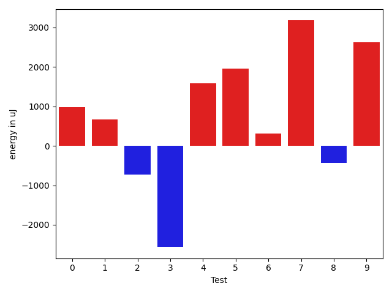

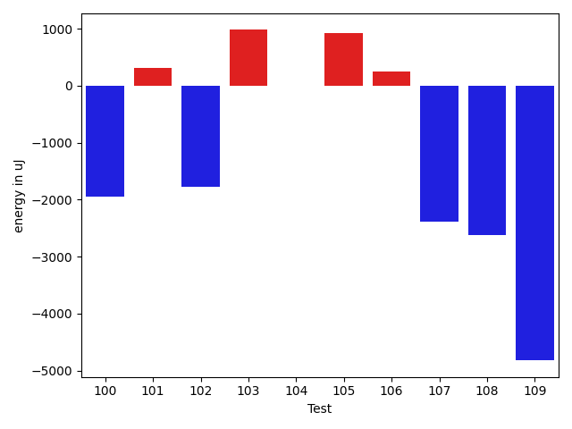

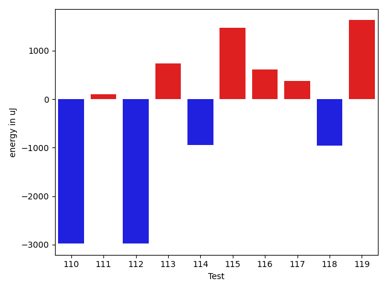

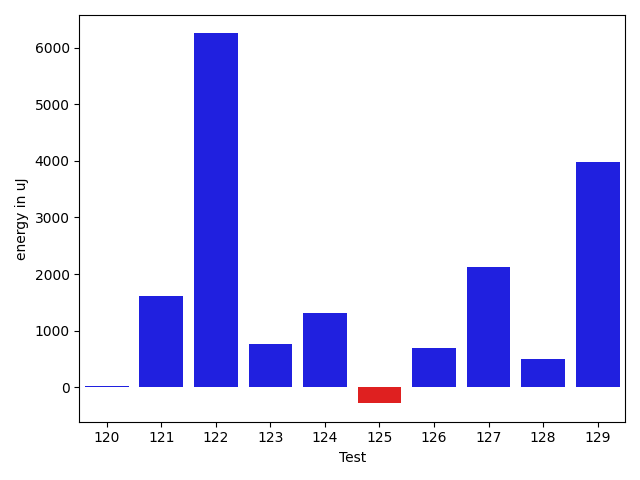

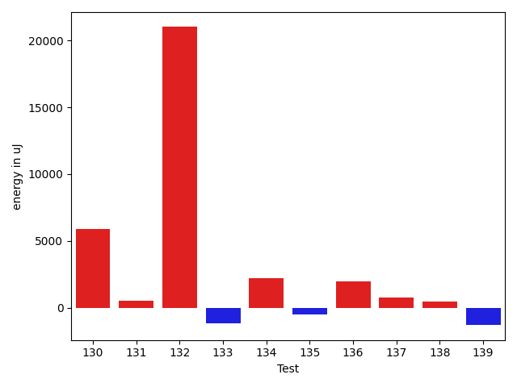

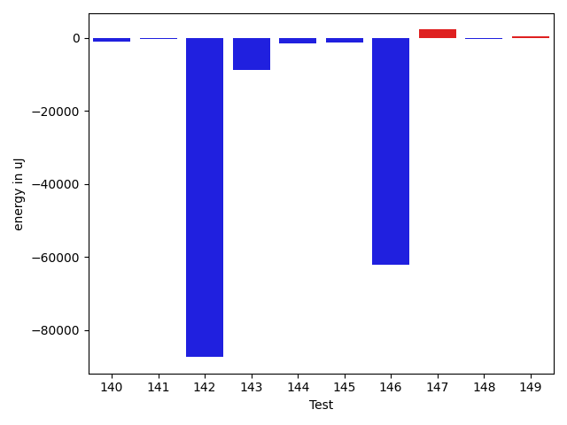

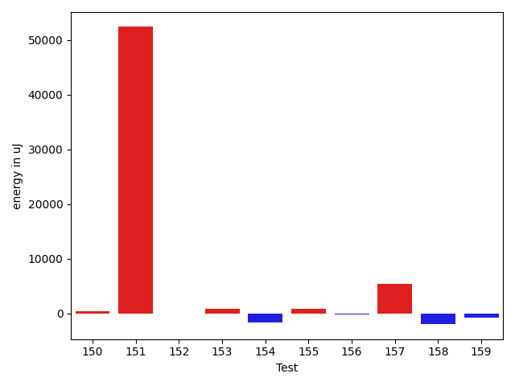

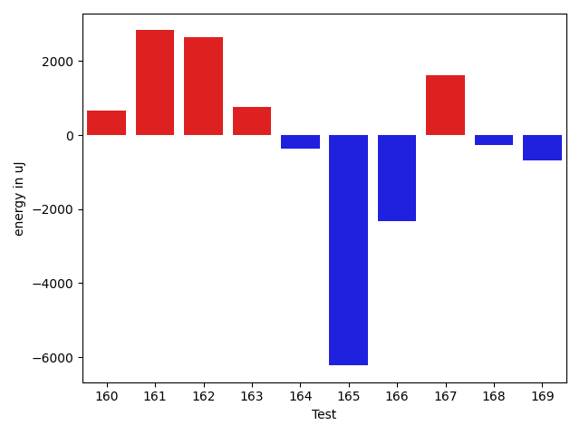

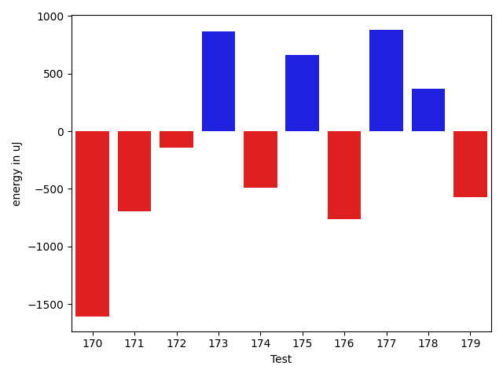

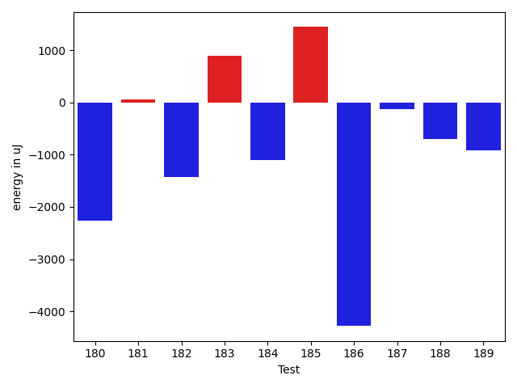

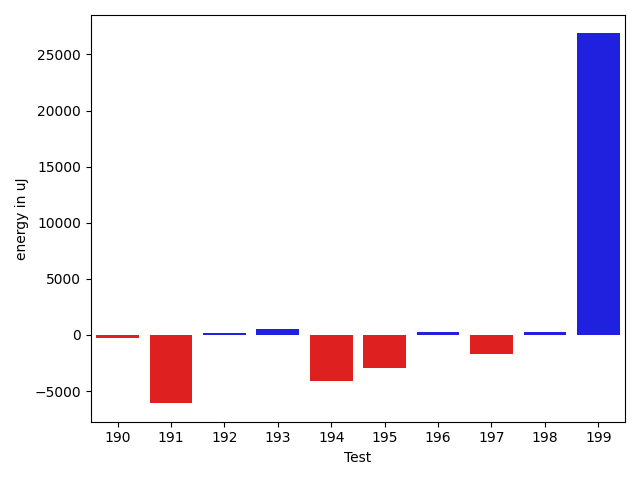

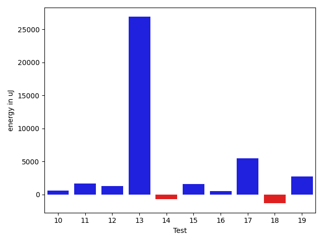

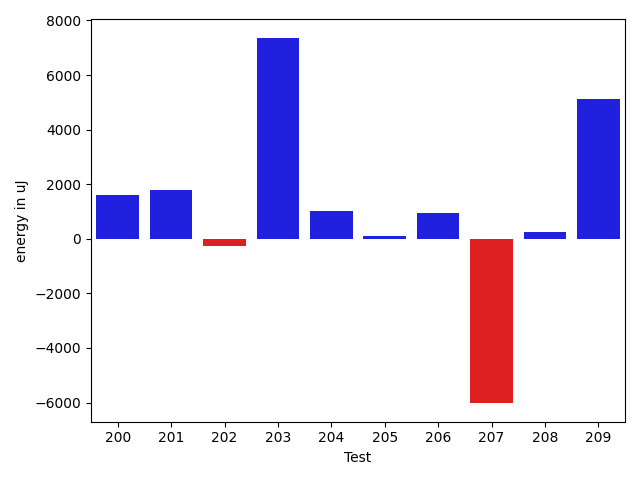

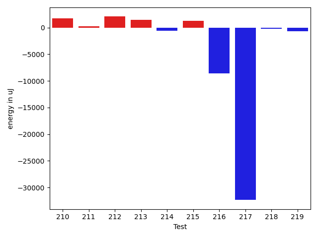

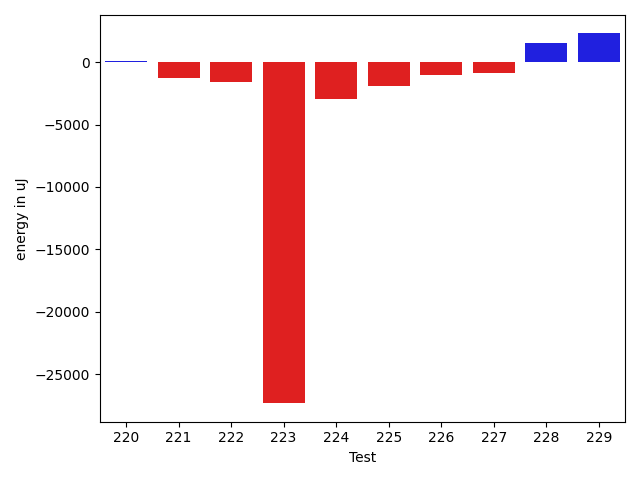

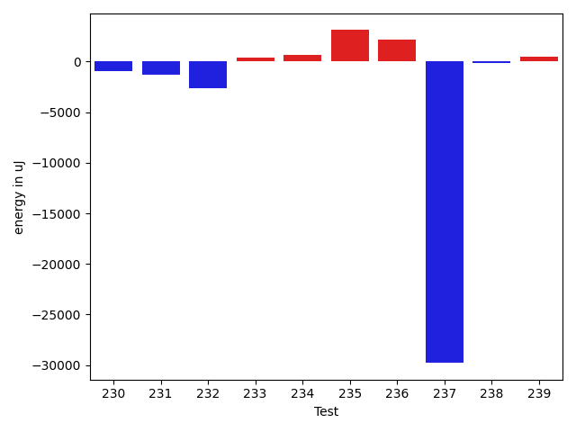

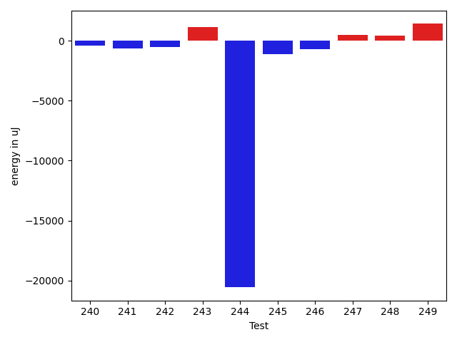

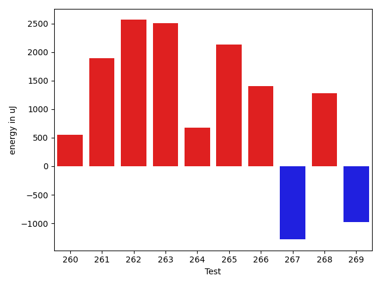

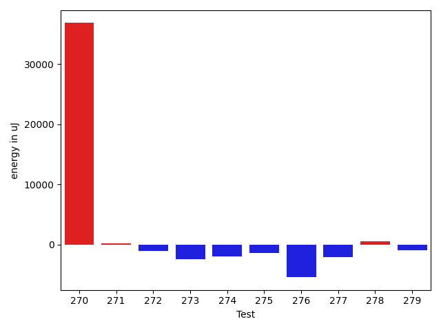

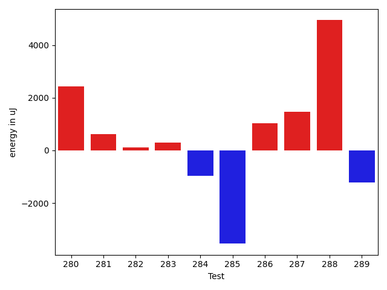

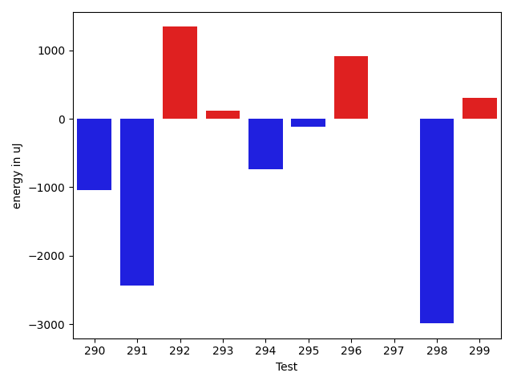

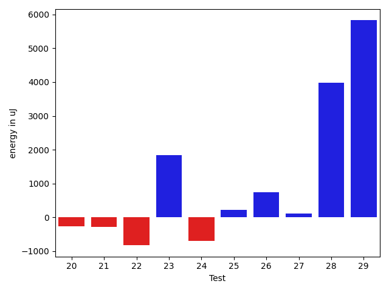

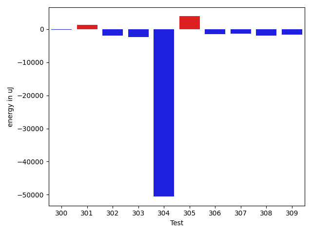

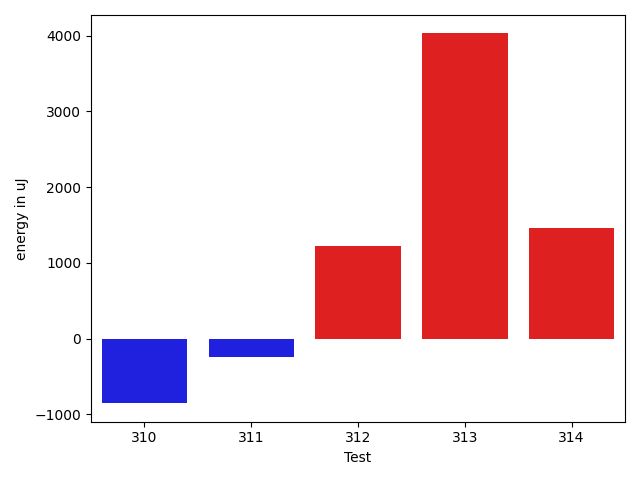

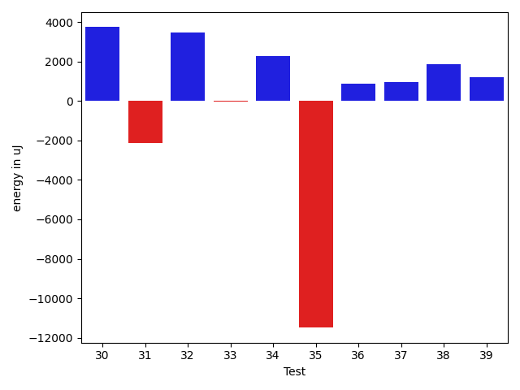

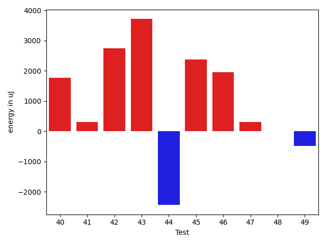

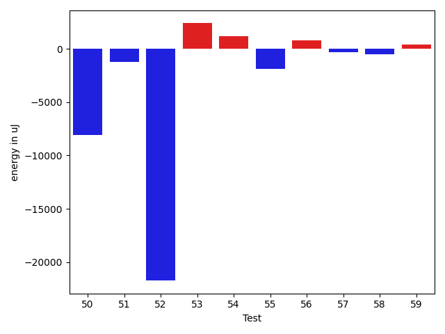

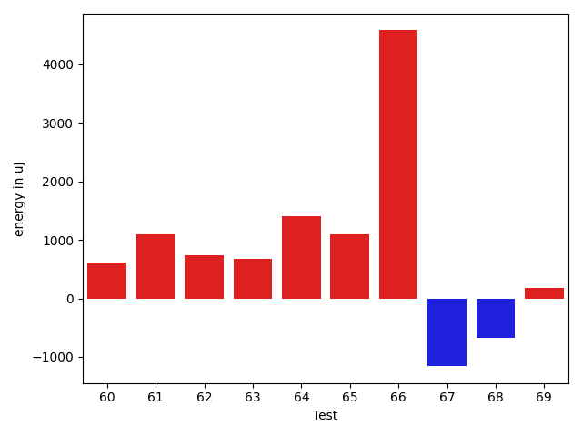

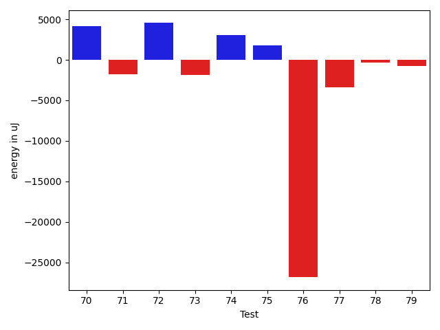

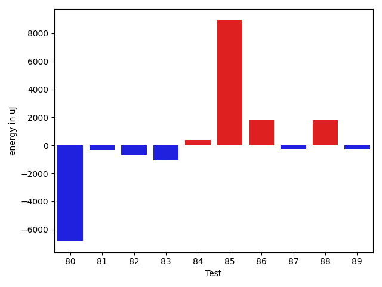

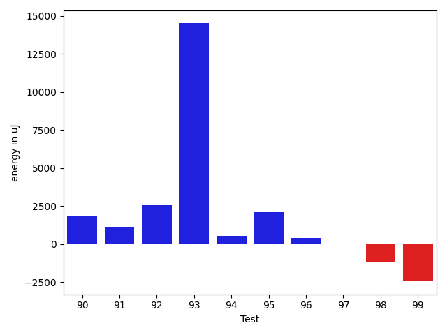

| ID | EnergyV1 | EnergyV2 | DeltaEnergy | σ |
| --- | --- | --- | --- | --- |
| 0 | 41059.8870967742 | 40847.936170212764 | -211.95092656143242 | 16547.11708747502 | 16230.443330299187 |
| 1 | 38677.69565217391 | 37519.818181818184 | -1157.8774703557283 | 4362.218167647627 | 3947.581821782726 |
| 2 | 67378.921875 | 68376.06382978724 | 997.1419547872356 | 38628.57822353835 | 40628.24036826426 |
| 3 | 39078.90909090909 | 37616.0 | -1462.9090909090883 | 3824.63172212925 | 3939.3624738020744 |
| 4 | 44933.5 | 38025.0 | -6908.5 | 37751.56253032143 | 2642.4549191991905 |
| 5 | 53303.916666666664 | 51666.107142857145 | -1637.8095238095193 | 27827.518595083577 | 18746.48038078326 |
| 6 | 39761.63636363636 | 39563.78571428572 | -197.85064935064293 | 2602.5978725017076 | 3741.2939736057597 |
| 7 | 37809.0 | 39925.066666666666 | 2116.0666666666657 | 3150.8519905997914 | 4089.5974450087656 |
| 8 | 39672.58823529412 | 38411.2 | -1261.3882352941218 | 4307.293309490224 | 3837.950619796977 |
| 9 | 37418.78571428572 | 39449.0 | 2030.2142857142826 | 3296.492923841757 | 2250.9239214153818 |
| 10 | 39018.38888888889 | 39597.769230769234 | 579.3803418803436 | 3409.6682168160337 | 3854.9946054805346 |
| 11 | 37325.621212121216 | 39014.1129032258 | 1688.4916911045875 | 4225.813100045924 | 7633.722995863515 |
| 12 | 37385.03703703704 | 38683.47368421053 | 1298.4366471734902 | 3986.148763103458 | 9445.954587751778 |
| 13 | 51710.362068965514 | 78591.76190476191 | 26881.399835796394 | 94204.76642504078 | 158425.8697247846 |
| 14 | 36756.5 | 36090.770833333336 | -665.7291666666642 | 4414.886101588579 | 4574.593175170441 |
| 15 | 72786.38383838384 | 74373.26262626263 | 1586.8787878787844 | 20381.237471330565 | 18323.17221917242 |
| 16 | 40302.89705882353 | 40842.13157894737 | 539.234520123835 | 9936.43534606158 | 12503.478961496348 |
| 17 | 39499.23529411765 | 44972.01754385965 | 5472.782249741998 | 8515.084878828648 | 21372.492383526605 |
| 18 | 38368.914893617024 | 37044.9649122807 | -1323.9499813363218 | 4302.622796496007 | 3770.555284923374 |
| 19 | 41582.51111111111 | 44356.744680851065 | 2774.233569739954 | 13724.274563499557 | 31486.014401174725 |
| 20 | 37322.925 | 37057.48484848485 | -265.44015151515487 | 4275.588295120918 | 3704.844732535316 |
| 21 | 37263.933333333334 | 36985.470588235294 | -278.4627450980406 | 3908.3177989741034 | 4180.795823730595 |
| 22 | 38148.098039215685 | 37322.09433962264 | -826.0036995930423 | 4099.1513146250445 | 7403.373099827603 |
| 23 | 40179.12765957447 | 42013.0625 | 1833.9348404255288 | 13649.8272136473 | 15231.12391912835 |
| 24 | 38120.549019607846 | 37433.62745098039 | -686.9215686274547 | 3840.056511602786 | 4680.463534781883 |
| 25 | 37099.92307692308 | 37313.85 | 213.9269230769205 | 3934.5496655914667 | 3161.851930040368 |
| 26 | 36908.35294117647 | 37658.76470588235 | 750.4117647058811 | 4055.2518590265645 | 3698.9667798933156 |
| 27 | 37774.68292682927 | 37892.767441860466 | 118.08451503119431 | 3641.5213481089045 | 4533.127658087887 |
| 28 | 42116.778947368424 | 46093.68421052631 | 3976.905263157889 | 12870.933415772186 | 16708.423660734512 |
| 29 | 57357.12162162162 | 63181.46153846154 | 5824.339916839919 | 61613.168366079255 | 61057.01070052822 |
| 30 | 40294.49333333333 | 44029.1375 | 3734.644166666665 | 9822.262107917006 | 16868.32557616771 |
| 31 | 42200.27272727273 | 40061.42105263158 | -2138.851674641148 | 12662.091431735118 | 10384.324093331556 |
| 32 | 39682.07692307692 | 43146.56896551724 | 3464.492042440317 | 8107.8111336351585 | 16868.440943547015 |
| 33 | 37607.48648648649 | 37592.66 | -14.82648648648319 | 3963.3875602216954 | 4319.14821514613 |
| 34 | 36149.43137254902 | 38408.04651162791 | 2258.6151390788873 | 3691.145962949728 | 3640.04293326002 |
| 35 | 123106.74324324324 | 111618.17073170732 | -11488.572511535924 | 209195.50994426117 | 191167.99248291136 |
| 36 | 36847.23529411765 | 37723.23529411765 | 876.0 | 3650.7743421879495 | 4617.983243663226 |
| 37 | 36729.982142857145 | 37689.735849056604 | 959.753706199459 | 3716.9827408947826 | 4353.181431060933 |
| 38 | 36349.57142857143 | 38204.816666666666 | 1855.2452380952382 | 3888.847717039911 | 4021.216182084165 |
| 39 | 37941.72222222222 | 39133.5 | 1191.777777777781 | 7468.158179196942 | 6632.824655956666 |
| 40 | 36252.859375 | 37312.36363636364 | 1059.5042613636397 | 3899.883907996443 | 4127.339875705268 |
| 41 | 36710.73529411765 | 37065.967741935485 | 355.2324478178343 | 4849.7988212297405 | 5296.802726927979 |
| 42 | 47991.365853658535 | 52321.0 | 4329.634146341465 | 25782.321230581292 | 31379.25864447602 |
| 43 | 36259.791666666664 | 39230.357142857145 | 2970.5654761904807 | 3788.5356667535666 | 4865.807143543943 |
| 44 | 41931.06451612903 | 43126.55882352941 | 1195.4943074003822 | 11640.423817069504 | 18622.375126824903 |
| 45 | 36581.97435897436 | 37217.192307692305 | 635.2179487179455 | 4129.527622374976 | 4071.655796424375 |
| 46 | 35971.28571428572 | 37111.913043478264 | 1140.6273291925463 | 2966.8037497947043 | 4691.617361923224 |
| 47 | 37087.09090909091 | 38043.34782608696 | 956.256916996048 | 3563.149001924752 | 3942.7607366974603 |
| 48 | 226120.47474747474 | 210188.52525252526 | -15931.949494949484 | 117743.60418344576 | 90299.36042094197 |
| 49 | 145782.42424242425 | 139894.66666666666 | -5887.757575757598 | 59364.49746604257 | 43478.82021365941 |
| 50 | 115138.56565656565 | 106773.69696969698 | -8364.868686868678 | 37612.45577917824 | 37048.68555349172 |
| 51 | 40517.45945945946 | 39495.54838709677 | -1021.9110723626873 | 2908.206929648192 | 2674.466408508309 |
| 52 | 361370.9292929293 | 324006.404040404 | -37364.52525252529 | 156159.02330871683 | 141815.42510992757 |
| 53 | 41387.97435897436 | 41988.393939393936 | 600.419580419577 | 9297.4440145919 | 6523.631782426914 |
| 54 | 74242.54545454546 | 122721.06666666667 | 48478.52121212121 | 198402.95161860675 | 310804.7193446858 |
| 55 | 40013.541666666664 | 38290.0 | -1723.5416666666642 | 3516.124464273682 | 5293.590948023846 |
| 56 | 45884.29824561404 | 43201.04109589041 | -2683.2571497236277 | 17107.831684527915 | 11083.85431260122 |
| 57 | 51284.18965517241 | 48947.569444444445 | -2336.620210727968 | 25621.817507645028 | 18991.669382643067 |
| 58 | 56424.35106382979 | 49794.385416666664 | -6629.965647163124 | 30410.880564296443 | 20153.40865005316 |
| 59 | 42261.6 | 40583.746268656716 | -1677.8537313432826 | 12796.260798554218 | 11845.747463350346 |
| 60 | 45159.218181818185 | 42176.48936170213 | -2982.7288201160554 | 23624.848350598153 | 13986.415994726685 |
| 61 | 41041.21052631579 | 39461.76271186441 | -1579.4478144513778 | 12774.674309353824 | 8435.28323163672 |
| 62 | 37765.94827586207 | 37760.61818181818 | -5.330094043893041 | 3911.5968492570546 | 4618.025916266147 |
| 63 | 38636.51111111111 | 38831.67391304348 | 195.1628019323689 | 3547.355118784336 | 4260.135464545229 |
| 64 | 64105.59574468085 | 65527.18947368421 | 1421.5937290033544 | 48964.6293000994 | 48208.11603089578 |
| 65 | 37216.34426229508 | 38212.34545454545 | 996.0011922503691 | 3737.4289878017107 | 4056.718078887199 |
| 66 | 36315.74193548387 | 38299.46153846154 | 1983.7196029776678 | 4431.492568538912 | 4107.550498128362 |
| 67 | 40533.316666666666 | 39859.8085106383 | -673.5081560283652 | 7170.67888113733 | 5837.620608397496 |
| 68 | 41323.1875 | 39808.71428571428 | -1514.4732142857174 | 9686.845940621939 | 4328.439273795901 |
| 69 | 55139.88 | 47752.38961038961 | -7387.490389610386 | 41169.73136045785 | 26978.56822380768 |
| 70 | 41250.77419354839 | 45421.26666666667 | 4170.492473118284 | 9177.042441945525 | 16707.831346274583 |
| 71 | 44428.81538461539 | 42684.71212121212 | -1744.1032634032672 | 14238.729615861432 | 13006.939934028636 |
| 72 | 81505.47826086957 | 86048.68965517242 | 4543.211394302853 | 97492.90888455052 | 99737.83235169106 |
| 73 | 38497.85 | 36620.92857142857 | -1876.921428571426 | 3036.7496978677714 | 3176.505592724849 |
| 74 | 45370.03448275862 | 48458.769230769234 | 3088.734748010611 | 20212.61798546634 | 22759.91859575089 |
| 75 | 37336.818181818184 | 39149.57142857143 | 1812.7532467532437 | 4493.958051310909 | 5300.5306164879885 |
| 76 | 133321.35353535353 | 106480.74747474748 | -26840.60606060605 | 100701.50334330807 | 94964.46277204277 |
| 77 | 45261.885714285716 | 41886.56756756757 | -3375.3181467181494 | 19543.888286581237 | 12909.34178098975 |
| 78 | 38008.76190476191 | 37690.59523809524 | -318.1666666666715 | 4409.387549576276 | 4063.008163438488 |
| 79 | 39258.05128205128 | 38524.07692307692 | -733.9743589743593 | 4366.751059756323 | 4031.42025227997 |
| 80 | 44604.36666666667 | 37774.6 | -6829.76666666667 | 32518.952137159784 | 4328.393147577979 |
| 81 | 38274.8064516129 | 37929.52 | -345.2864516129048 | 4501.39506274734 | 5381.9606845089465 |
| 82 | 40306.11320754717 | 39654.574468085106 | -651.538739462063 | 8345.822922356729 | 9073.001025358513 |
| 83 | 38988.666666666664 | 37936.51851851852 | -1052.148148148146 | 3647.347194270866 | 3720.2394025949498 |
| 84 | 76171.67010309278 | 76572.1530612245 | 400.48295813171717 | 49005.25164361524 | 41599.17393173934 |
| 85 | 37594.913043478264 | 46552.833333333336 | 8957.920289855072 | 3508.6153581675208 | 38370.317257904215 |
| 86 | 40351.11538461538 | 42181.944444444445 | 1830.8290598290623 | 9056.253363653559 | 11834.525974979695 |
| 87 | 46685.7 | 46430.94545454546 | -254.75454545453977 | 26823.92036317585 | 29216.275290210906 |
| 88 | 38879.35211267605 | 40697.942028985504 | 1818.589916309451 | 9510.193933388771 | 8778.334705371966 |
| 89 | 43192.1129032258 | 42894.450980392154 | -297.66192283364944 | 16788.95321921323 | 12102.85811377242 |
| 90 | 42199.95238095238 | 44033.42222222222 | 1833.4698412698417 | 13668.927407588457 | 16710.330313230912 |
| 91 | 49062.51219512195 | 50211.87640449438 | 1149.3642093724338 | 26052.32852438596 | 29054.07951816139 |
| 92 | 34886.26315789474 | 37465.0 | 2578.7368421052597 | 3704.597241296495 | 2640.330534863643 |
| 93 | 59732.8717948718 | 74245.10256410256 | 14512.230769230766 | 53258.416610960565 | 65137.54147238289 |
| 94 | 37715.875 | 38272.333333333336 | 556.4583333333358 | 3650.284884002206 | 4539.106605685504 |
| 95 | 36356.57142857143 | 38438.782608695656 | 2082.211180124228 | 3113.23794956509 | 3821.3738931177477 |
| 96 | 38352.36842105263 | 38732.96666666667 | 380.59824561403366 | 4714.745829065124 | 4104.384626902742 |
| 97 | 43116.27906976744 | 43156.04705882353 | 39.7679890560903 | 12360.424797632728 | 16088.712122556335 |
| 98 | 54438.386666666665 | 53264.717948717946 | -1173.6687179487199 | 53221.403561322535 | 47878.07440430365 |
| 99 | 43322.12698412698 | 40869.31034482759 | -2452.8166392993953 | 13625.42816975936 | 9959.496805954806 |
| 100 | 44083.350877192985 | 43570.69491525424 | -512.6559619387481 | 12759.205320207091 | 14249.847740196654 |
| 101 | 39767.46551724138 | 41086.0625 | 1318.5969827586232 | 8370.047067011235 | 16182.594583837406 |
| 102 | 38690.59259259259 | 38223.42372881356 | -467.16886377902847 | 5759.9500143102405 | 10076.636419575647 |
| 103 | 38963.58762886598 | 40490.12371134021 | 1526.536082474231 | 10021.197593670799 | 11871.323063739128 |
| 104 | 36129.75 | 36204.818181818184 | 75.0681818181838 | 4296.45959919327 | 3728.5109340223166 |
| 105 | 35952.78947368421 | 36533.41025641026 | 580.6207827260441 | 4149.763471326934 | 3435.1007802029935 |
| 106 | 35721.55882352941 | 35209.32258064516 | -512.2362428842534 | 5141.943247857453 | 3357.3999962249663 |
| 107 | 37376.333333333336 | 35644.4 | -1731.9333333333343 | 4044.713799791306 | 4052.3731022698294 |
| 108 | 37152.78571428572 | 35713.36956521739 | -1439.4161490683255 | 3783.349435894288 | 3988.552360022236 |
| 109 | 126564.9898989899 | 123013.26262626263 | -3551.727272727265 | 25336.038340231407 | 23326.447909886396 |
| 110 | 43764.81318681319 | 40783.1935483871 | -2981.619638426091 | 22213.13228696187 | 16049.396221020692 |
| 111 | 37315.16949152543 | 37420.264150943396 | 105.09465941796952 | 4038.03034362279 | 4380.287951036766 |
| 112 | 42679.75555555556 | 39704.01162790698 | -2975.743927648582 | 15049.673294579528 | 10390.781748120498 |
| 113 | 36048.192307692305 | 36790.181818181816 | 741.9895104895113 | 4541.65939700484 | 3065.973279198684 |
| 114 | 59956.04838709677 | 59010.96428571428 | -945.0841013824902 | 26800.855583615004 | 24702.397065556994 |
| 115 | 35255.375 | 36731.59375 | 1476.21875 | 4617.956127647273 | 4421.9217602430435 |
| 116 | 36809.13333333333 | 37422.9649122807 | 613.8315789473709 | 6812.4822726782595 | 8132.291457494993 |
| 117 | 36663.75 | 37037.07407407407 | 373.324074074073 | 7827.443822059664 | 3677.6525617414436 |
| 118 | 38360.96721311475 | 37405.38888888889 | -955.5783242258622 | 8175.042772169078 | 4140.073842679561 |
| 119 | 34877.09523809524 | 36506.36 | 1629.2647619047639 | 3696.6664378645887 | 4408.431338968545 |
| 120 | 37354.767441860466 | 37378.10638297872 | 23.338941118257935 | 3919.501670016936 | 3369.927199378081 |
| 121 | 40677.02272727273 | 42282.025 | 1605.0022727272735 | 11744.840848971318 | 12248.1376880069 |
| 122 | 34339.75 | 40590.290322580644 | 6250.540322580644 | 4021.4186784641065 | 25790.899511753953 |
| 123 | 35729.606060606064 | 36492.42857142857 | 762.8225108225088 | 3852.6888913194903 | 4138.878587151799 |
| 124 | 36071.625 | 37388.21428571428 | 1316.5892857142826 | 3293.6642058718835 | 4409.259691321232 |
| 125 | 36122.224137931036 | 35840.291666666664 | -281.932471264372 | 4499.16318289456 | 4065.5196877640647 |
| 126 | 49927.934782608696 | 50616.22680412371 | 688.2920215150152 | 19726.415359924584 | 21126.868271930125 |
| 127 | 42142.59090909091 | 44269.82417582418 | 2127.2332667332666 | 15459.571319350971 | 17780.15532979123 |
| 128 | 92623.9898989899 | 93129.56565656565 | 505.5757575757598 | 71497.1720632383 | 80595.67786480932 |
| 129 | 46875.5 | 50847.82653061225 | 3972.3265306122485 | 17581.100234837162 | 18960.90500457078 |
| 130 | 71108.73737373737 | 80686.41414141415 | 9577.676767676778 | 34987.262365466915 | 37454.08495934213 |
| 131 | 46359.322916666664 | 47787.291666666664 | 1427.96875 | 16696.73850230861 | 17713.0830737461 |
| 132 | 56859.37373737374 | 60755.989795918365 | 3896.616058544627 | 23563.52145125072 | 25416.06883630379 |
| 133 | 38701.0 | 38184.63157894737 | -516.3684210526335 | 8673.068375088544 | 9085.88157360248 |
| 134 | 71687.73737373737 | 75930.04040404041 | 4242.303030303039 | 28846.317895933425 | 30202.15967624631 |
| 135 | 48335.89473684211 | 49811.184782608696 | 1475.2900457665892 | 17342.338610873183 | 19014.451585187002 |
| 136 | 39416.02564102564 | 41976.0 | 2559.9743589743593 | 10633.190016284832 | 13391.324621992364 |
| 137 | 38659.44871794872 | 40876.26829268293 | 2216.8195747342106 | 8180.809773797608 | 11144.225203729227 |
| 138 | 38935.171428571426 | 37341.28571428572 | -1593.8857142857087 | 8716.537384226162 | 5032.720520022253 |
| 139 | 37224.9375 | 37238.346153846156 | 13.408653846156085 | 3967.5326211967576 | 4074.8336015324007 |
| 140 | 38146.94594594595 | 37111.09090909091 | -1035.855036855035 | 3805.0108636840755 | 3820.704983048693 |
| 141 | 51148.80722891566 | 50754.94047619047 | -393.86675272518914 | 39734.94835145705 | 42280.311457988966 |
| 142 | 149497.57142857142 | 62044.083333333336 | -87453.48809523808 | 383277.16179505596 | 162610.4794233028 |
| 143 | 48553.35 | 39683.0 | -8870.349999999999 | 24354.86816793513 | 12268.54914337198 |
| 144 | 39648.333333333336 | 38130.27272727273 | -1518.0606060606078 | 3776.0402657928435 | 4967.654277073731 |
| 145 | 38175.857142857145 | 36926.1875 | -1249.669642857145 | 4779.287477136696 | 4238.28466509079 |
| 146 | 160861.17283950618 | 98716.81690140846 | -62144.355938097724 | 407604.1235890952 | 280411.4392581975 |
| 147 | 75870.17171717172 | 78122.39393939394 | 2252.222222222219 | 27355.108796225642 | 30464.189351512578 |
| 148 | 37552.94594594595 | 37149.307692307695 | -403.6382536382516 | 3902.6499171020373 | 3971.1736374995744 |
| 149 | 36657.18518518518 | 37111.653846153844 | 454.4686609686614 | 4395.355545699785 | 4519.586178659652 |
| 150 | 37879.791666666664 | 38336.74074074074 | 456.949074074073 | 3222.462528605087 | 3732.5389193733117 |
| 151 | 267354.8352941176 | 319733.6705882353 | 52378.835294117685 | 232288.73781318677 | 230198.99913169185 |
| 152 | 37905.84210526316 | 37872.318181818184 | -33.52392344497639 | 3066.288898106015 | 3273.9976590534698 |
| 153 | 37944.17857142857 | 38796.80701754386 | 852.62844611529 | 3763.343650584937 | 6263.394179434047 |
| 154 | 38532.76 | 36947.1724137931 | -1585.5875862069006 | 3324.7144512574305 | 3731.403212705741 |
| 155 | 40928.46808510638 | 41845.83720930233 | 917.3691241959459 | 11738.999480457138 | 13452.288785859095 |
| 156 | 53170.484210526316 | 52988.23655913978 | -182.2476513865331 | 19272.438323248956 | 19750.73651404589 |
| 157 | 55830.083333333336 | 61280.619047619046 | 5450.53571428571 | 55108.148974123294 | 66186.66636615263 |
| 158 | 38351.59459459459 | 36386.075 | -1965.5195945945961 | 4137.304086711144 | 3825.227786599773 |
| 159 | 37998.2 | 37312.68421052631 | -685.515789473684 | 4422.60200827933 | 3879.6441605587615 |
| 160 | 36344.26666666667 | 37019.58823529412 | 675.3215686274489 | 3102.718602917269 | 4075.775452147993 |
| 161 | 40885.74683544304 | 43718.41975308642 | 2832.67291764338 | 11699.548499855226 | 18017.965191745927 |
| 162 | 38941.933333333334 | 41587.95945945946 | 2646.0261261261257 | 6501.604547255154 | 9951.763433899663 |
| 163 | 37067.967741935485 | 37821.38888888889 | 753.4211469534057 | 4556.45837624391 | 3524.318848907606 |
| 164 | 37586.53846153846 | 37212.40476190476 | -374.1336996336977 | 3807.974593524879 | 3495.6433910111855 |
| 165 | 44015.692307692305 | 37790.07692307692 | -6225.615384615383 | 34850.991809934116 | 4262.693631271528 |
| 166 | 39200.55263157895 | 36865.1282051282 | -2335.4244264507433 | 6555.139641602925 | 4066.592444758705 |
| 167 | 38606.228070175435 | 40227.16949152543 | 1620.9414213499913 | 6717.955072154976 | 10154.432653459548 |
| 168 | 37444.97826086957 | 37187.64102564102 | -257.33723522854416 | 3721.093133505672 | 3827.9183905186305 |
| 169 | 37795.96875 | 37124.04878048781 | -671.9199695121933 | 3580.935828142336 | 3972.398408968024 |
| 170 | 38427.28125 | 36815.5625 | -1611.71875 | 5395.581776059783 | 3618.7968298999253 |
| 171 | 37510.514285714286 | 36815.37037037037 | -695.1439153439132 | 4154.146667549209 | 4211.405528976336 |
| 172 | 37930.96666666667 | 37786.28125 | -144.68541666666715 | 3235.160753175782 | 3500.374999860506 |
| 173 | 37520.88372093023 | 38385.65714285714 | 864.7734219269114 | 4316.690039075765 | 5518.474778636665 |
| 174 | 37078.692307692305 | 36588.65625 | -490.0360576923049 | 4133.224684183141 | 4141.664140244346 |
| 175 | 38032.709677419356 | 38696.26666666667 | 663.556989247314 | 4548.014165676781 | 2740.3238729918203 |
| 176 | 38904.75 | 38138.5 | -766.25 | 3517.4535563150416 | 3063.975177178111 |
| 177 | 37439.454545454544 | 38323.07692307692 | 883.6223776223778 | 4407.099589683494 | 3671.4917417130946 |
| 178 | 37363.74285714285 | 37730.86842105263 | 367.1255639097799 | 4362.671857231249 | 4191.447640707473 |
| 179 | 37517.807692307695 | 36945.03846153846 | -572.7692307692341 | 4752.59464373232 | 3723.5090509312404 |
| 180 | 37584.89655172414 | 35321.11111111111 | -2263.785440613028 | 3556.5390804372964 | 4243.35094989215 |
| 181 | 38261.375 | 38312.5 | 51.125 | 3768.6660307118836 | 3885.4435810378936 |
| 182 | 38006.153846153844 | 36571.5625 | -1434.591346153844 | 3604.421170775047 | 3291.8922553895577 |
| 183 | 37994.333333333336 | 38891.3 | 896.9666666666672 | 4238.313042289873 | 3966.4689347075446 |
| 184 | 37331.13333333333 | 36225.290322580644 | -1105.8430107526874 | 4343.974245882322 | 4885.347639715529 |
| 185 | 37471.01851851852 | 38912.67924528302 | 1441.6607267645013 | 4247.231597216922 | 7798.124536921863 |
| 186 | 215661.9595959596 | 211383.36363636365 | -4278.5959595959575 | 163839.90035020787 | 149080.82899307244 |
| 187 | 37617.86111111111 | 37484.40740740741 | -133.45370370370074 | 4639.870820476565 | 4541.77187857142 |
| 188 | 38781.242424242424 | 38081.86885245902 | -699.3735717834061 | 7030.434889045575 | 7130.852926418423 |
| 189 | 37663.05 | 36737.828571428574 | -925.221428571429 | 3209.5576248916295 | 4639.333311006254 |
| 190 | 37244.97777777778 | 36991.041666666664 | -253.93611111111386 | 3949.400249764451 | 4146.160251557726 |
| 191 | 50500.73809523809 | 44412.75 | -6087.988095238092 | 30268.644812947245 | 24947.164839939956 |
| 192 | 37802.18518518518 | 38001.79245283019 | 199.60726764500578 | 4580.360312828683 | 4706.095843584111 |
| 193 | 37581.52631578947 | 38100.294117647056 | 518.7678018575825 | 3499.1523540246003 | 4045.3592840468723 |
| 194 | 46145.78378378379 | 42024.27777777778 | -4121.506006006006 | 19295.629118750847 | 14187.724899071325 |
| 195 | 66968.64556962025 | 64043.87654320987 | -2924.769026410373 | 190241.88572413378 | 171330.82239861926 |
| 196 | 38500.44827586207 | 38757.192307692305 | 256.7440318302324 | 4872.133538075682 | 4541.2743723052245 |
| 197 | 40366.2 | 38687.5 | -1678.699999999997 | 4419.439204243 | 4254.276953003547 |
| 198 | 38870.07547169811 | 39172.41071428572 | 302.33524258760735 | 6526.875680235331 | 4615.083959833643 |
| 199 | 73148.9494949495 | 100020.87878787878 | 26871.929292929286 | 52495.441402736644 | 205083.28789258716 |
| 200 | 46849.89156626506 | 48468.294117647056 | 1618.4025513819943 | 19043.23979726648 | 20269.12707416846 |
| 201 | 49553.15476190476 | 51356.96666666667 | 1803.8119047619039 | 25866.722292447885 | 26583.199193998033 |
| 202 | 45156.348314606745 | 44884.77464788732 | -271.57366671942145 | 19243.951282054648 | 21653.14215379179 |
| 203 | 37498.57142857143 | 44866.086956521736 | 7367.515527950309 | 4089.201861481723 | 15937.747557601415 |
| 204 | 39417.95238095238 | 40451.64179104478 | 1033.6894100923964 | 4034.4748106454235 | 6706.39062276566 |
| 205 | 41546.17391304348 | 41633.97777777778 | 87.80386473429826 | 19635.632464326227 | 17436.336459613285 |
| 206 | 38898.818181818184 | 39835.79104477612 | 936.9728629579331 | 3636.05899254195 | 7361.659874348409 |
| 207 | 45997.5 | 39964.470588235294 | -6033.029411764706 | 31328.374538463086 | 8761.39933671387 |
| 208 | 45479.431818181816 | 45746.71578947368 | 267.2839712918649 | 14626.121876003732 | 15027.203926397624 |
| 209 | 41101.207792207795 | 46206.84722222222 | 5105.639430014424 | 9925.19129239274 | 37561.91710979046 |
| 210 | 39711.28947368421 | 39380.934782608696 | -330.3546910755176 | 6632.574569215561 | 4085.181962857926 |
| 211 | 39180.5 | 39081.458333333336 | -99.04166666666424 | 4245.226929715608 | 5265.04186813969 |
| 212 | 35920.25925925926 | 38141.97297297297 | 2221.7137137137106 | 3914.357234900038 | 4708.131720392585 |
| 213 | 37844.12 | 38405.192307692305 | 561.0723076923023 | 3853.41208094852 | 4574.518301831023 |
| 214 | 98635.04081632652 | 114454.47169811321 | 15819.430881786684 | 286588.7675554956 | 305042.7183906458 |
| 215 | 51279.18518518518 | 67336.21590909091 | 16057.03072390573 | 38535.73144470016 | 70761.33726453129 |
| 216 | 332919.9393939394 | 314353.6666666667 | -18566.272727272706 | 146250.8517307715 | 111095.56854412069 |
| 217 | 429380.57575757575 | 409544.8484848485 | -19835.727272727236 | 140780.93607367305 | 133786.16312943667 |
| 218 | 54132.19277108434 | 57043.26666666667 | 2911.0738955823326 | 31464.350793467926 | 34059.8321470386 |
| 219 | 135550.78260869565 | 83161.64615384616 | -52389.13645484949 | 351130.2186818467 | 244200.51708396277 |
| 220 | 38534.648148148146 | 38628.816326530614 | 94.16817838246789 | 4899.768468291838 | 5172.7102976492815 |
| 221 | 43582.8870967742 | 42268.68085106383 | -1314.2062457103675 | 18077.163970855283 | 14643.97184394415 |
| 222 | 42023.0 | 40421.18461538461 | -1601.8153846153873 | 12476.452278274253 | 9484.450681781625 |
| 223 | 150794.66666666666 | 123478.09090909091 | -27316.575757575745 | 313484.80391978536 | 238265.4981110842 |
| 224 | 48739.37096774193 | 45810.0 | -2929.370967741932 | 23755.416144557275 | 16555.80706479351 |
| 225 | 41093.56962025316 | 39157.769230769234 | -1935.8003894839276 | 11509.431038388977 | 7020.044436858182 |
| 226 | 42043.18918918919 | 40982.140625 | -1061.0485641891864 | 11750.25778403327 | 11241.362265739843 |
| 227 | 44381.77647058824 | 43485.87804878049 | -895.8984218077458 | 27143.18679299552 | 13082.463013413148 |
| 228 | 46712.97530864197 | 48257.72619047619 | 1544.7508818342176 | 27293.96864183758 | 33323.06019337388 |
| 229 | 45553.21428571428 | 47842.73626373626 | 2289.5219780219777 | 15971.245762061797 | 17417.873191749037 |
| 230 | 42745.666666666664 | 41610.50602409639 | -1135.1606425702776 | 10878.074482390915 | 10234.657750116115 |
| 231 | 46962.02040816326 | 43866.57777777778 | -3095.4426303854852 | 21638.612894064518 | 16751.381843483025 |
| 232 | 104191.07142857143 | 56812.16279069767 | -47378.90863787376 | 130886.73704988725 | 64056.40508573973 |
| 233 | 40600.704545454544 | 38114.666666666664 | -2486.03787878788 | 10807.808403228122 | 6427.61115984953 |
| 234 | 37999.1935483871 | 38822.75 | 823.5564516129016 | 4124.044041091414 | 3253.9152858517996 |
| 235 | 37269.74074074074 | 38869.194444444445 | 1599.453703703708 | 4106.666960611395 | 3617.2638893955045 |
| 236 | 38943.4358974359 | 40682.545454545456 | 1739.1095571095575 | 4809.147468532858 | 6110.093765540057 |
| 237 | 115260.61956521739 | 109878.95652173914 | -5381.663043478256 | 246873.18147459414 | 273369.20054876705 |
| 238 | 38466.382352941175 | 38751.94285714286 | 285.5605042016832 | 4235.717523872612 | 4012.0296961075674 |
| 239 | 39321.84090909091 | 39730.36111111111 | 408.52020202019776 | 4964.550267753739 | 5820.79182830718 |
| 240 | 39721.256410256414 | 38897.02631578947 | -824.2300944669405 | 5840.983503933917 | 4332.166356617984 |
| 241 | 53656.1724137931 | 196589.93548387097 | 142933.76307007787 | 35028.327375060486 | 342744.73639777885 |
| 242 | 37688.15151515151 | 36803.92 | -884.231515151514 | 4746.310548787132 | 4622.090997979161 |
| 243 | 39947.4 | 62582.48387096774 | 22635.08387096774 | 4143.892442297861 | 46121.765153720014 |
| 244 | 82875.7741935484 | 79975.7027027027 | -2900.0714908456866 | 46849.06495965712 | 44782.3649212348 |
| 245 | 38479.34482758621 | 42919.307692307695 | 4439.962864721485 | 4008.9645260028315 | 35385.547755859996 |
| 246 | 116888.79365079365 | 88750.73015873016 | -28138.06349206349 | 320404.14213263703 | 259407.11063972593 |
| 247 | 38518.8125 | 39445.22727272727 | 926.4147727272721 | 3162.923730876821 | 3040.444209947233 |
| 248 | 38818.239130434784 | 38064.45 | -753.7891304347868 | 3967.9665155975795 | 3394.7167772142648 |
| 249 | 37809.90909090909 | 37586.73333333333 | -223.17575757575833 | 4079.186599055915 | 3838.3487155575403 |
| 250 | 39261.7 | 39930.1875 | 668.4875000000029 | 4594.3480288284645 | 3754.837491802242 |
| 251 | 46514.92753623189 | 52443.147540983606 | 5928.220004751718 | 32208.429708231848 | 33294.42344574823 |
| 252 | 42949.22222222222 | 53650.605633802814 | 10701.383411580595 | 17334.63496435511 | 58850.21432356029 |
| 253 | 38340.125 | 37095.40909090909 | -1244.7159090909117 | 4708.19841086181 | 3404.3714232131138 |
| 254 | 39228.818181818184 | 38596.916666666664 | -631.9015151515196 | 4213.199503684966 | 3100.6287657595444 |
| 255 | 37130.586956521736 | 38666.32653061225 | 1535.7395740905122 | 5917.730534353618 | 5864.679431320459 |
| 256 | 37124.89743589744 | 38948.34782608696 | 1823.4503901895223 | 4554.258242933393 | 4920.682549055794 |
| 257 | 36929.5 | 39002.617021276594 | 2073.1170212765937 | 4482.018399584113 | 4480.8058382070385 |
| 258 | 38216.41379310345 | 38777.7037037037 | 561.2899106002515 | 3682.8872998312104 | 4691.951499661039 |
| 259 | 47685.79787234042 | 48619.94623655914 | 934.1483642187159 | 21293.316976539834 | 20334.74679541569 |
| 260 | 43067.791666666664 | 36642.35 | -6425.441666666666 | 31781.652458584715 | 5384.081251940762 |
| 261 | 37521.793103448275 | 38981.07692307692 | 1459.2838196286466 | 4103.837920938368 | 4954.470063434379 |
| 262 | 37183.242424242424 | 38677.757575757576 | 1494.515151515152 | 3987.3106986911807 | 4112.7596282073555 |
| 263 | 40891.65714285714 | 41962.65517241379 | 1070.9980295566493 | 11246.181911952815 | 10154.153939443775 |
| 264 | 49243.75 | 57749.54285714286 | 8505.792857142857 | 35500.630607955405 | 53623.948470459065 |
| 265 | 37379.9 | 37991.5 | 611.5999999999985 | 4663.467860937823 | 5004.413041143151 |
| 266 | 42864.416666666664 | 58618.0 | 15753.583333333336 | 10453.058989743413 | 29846.100433725005 |
| 267 | 37853.933333333334 | 38151.916666666664 | 297.98333333332994 | 4719.30511080698 | 3819.8210572908024 |
| 268 | 37591.475 | 38295.102040816324 | 703.6270408163255 | 5618.474085494656 | 6356.427992695455 |
| 269 | 59029.851851851854 | 148967.31578947368 | 89937.46393762183 | 102221.47383580044 | 254955.31924717044 |
| 270 | 78391.70588235294 | 105060.05454545455 | 26668.348663101613 | 60061.88090506883 | 72648.89773709721 |
| 271 | 40655.45 | 54736.15 | 14080.700000000004 | 7581.397044575625 | 51343.30683183058 |
| 272 | 40142.153846153844 | 38342.78947368421 | -1799.3643724696303 | 3409.3845112515733 | 4277.95006957584 |
| 273 | 40959.90909090909 | 35657.041666666664 | -5302.867424242424 | 10527.465795843016 | 4304.354205135061 |
| 274 | 81501.5294117647 | 70579.56756756757 | -10921.961844197125 | 71090.8712412316 | 63378.71797571669 |
| 275 | 56611.475 | 63456.38775510204 | 6844.912755102043 | 62130.22984062891 | 74060.65689078475 |
| 276 | 63989.343434343435 | 59555.36363636364 | -4433.979797979795 | 26143.843800209062 | 22780.321244200684 |
| 277 | 38824.857142857145 | 38389.681818181816 | -435.17532467532874 | 5414.824998585469 | 7322.574996582726 |
| 278 | 38098.0 | 37370.892857142855 | -727.1071428571449 | 4624.675152555763 | 3861.634381406824 |
| 279 | 38848.8 | 38801.125 | -47.67500000000291 | 4083.0394389474122 | 5487.319967149264 |
| 280 | 39306.55319148936 | 39916.75 | 610.1968085106419 | 4462.198412520736 | 4301.675815756417 |
| 281 | 39111.90476190476 | 38775.5 | -336.4047619047633 | 5082.600046140257 | 2951.9307325884192 |
| 282 | 46753.59420289855 | 44971.584615384614 | -1782.0095875139377 | 22247.760813116623 | 20906.140467036366 |
| 283 | 38479.4 | 38803.80952380953 | 324.4095238095251 | 3855.0622225847405 | 5206.818465737729 |
| 284 | 62381.6129032258 | 70592.16666666667 | 8210.553763440868 | 54169.36068550155 | 75819.19173966152 |
| 285 | 38922.71428571428 | 36961.57894736842 | -1961.1353383458627 | 4753.574315766001 | 5419.33583341596 |
| 286 | 37958.708333333336 | 38551.05405405405 | 592.3457207207175 | 4760.186708340743 | 5977.7984058398915 |
| 287 | 51613.77611940299 | 54504.3 | 2890.523880597015 | 48421.4581490297 | 60209.86599727657 |
| 288 | 145079.60606060605 | 164575.0303030303 | 19495.424242424255 | 195972.03401005137 | 252238.50244357804 |
| 289 | 38707.066666666666 | 38169.38775510204 | -537.6789115646243 | 3868.466629327727 | 4604.821443130599 |
| 290 | 65917.75324675324 | 84525.88888888889 | 18608.135642135647 | 65803.72756527222 | 119911.49107951905 |
| 291 | 40218.066666666666 | 39273.0 | -945.0666666666657 | 4747.627568469213 | 5284.498055634045 |
| 292 | 58221.94936708861 | 64778.471264367814 | 6556.521897279206 | 46055.88744533301 | 48169.41763726796 |
| 293 | 41358.0 | 43991.62686567164 | 2633.626865671642 | 12406.91959064834 | 16092.937817783284 |
| 294 | 84531.78378378379 | 80830.83333333333 | -3700.9504504504584 | 249885.25905942617 | 231076.31674858258 |
| 295 | 38537.166666666664 | 40231.97959183674 | 1694.8129251700739 | 7086.808638629631 | 9025.511652611183 |
| 296 | 38660.17647058824 | 39095.59090909091 | 435.4144385026739 | 5491.332890112801 | 4394.965380555459 |
| 297 | 38106.1 | 38671.65 | 565.5500000000029 | 4279.203986335154 | 3837.2072823213493 |
| 298 | 39927.166666666664 | 38079.75 | -1847.4166666666642 | 5539.903208139611 | 3714.8180961522194 |
| 299 | 41620.46666666667 | 43265.94871794872 | 1645.4820512820515 | 13669.544140330518 | 16781.833156718432 |
| 300 | 39174.166666666664 | 38990.40909090909 | -183.75757575757598 | 5029.174631311009 | 3710.1134711768946 |
| 301 | 37921.05 | 39271.80952380953 | 1350.7595238095237 | 4551.008937312692 | 3838.9846328603435 |
| 302 | 39276.0 | 37275.32 | -2000.6800000000003 | 4961.083937340038 | 3606.2150875398434 |
| 303 | 39361.90909090909 | 36995.13043478261 | -2366.77865612648 | 5676.663223705621 | 3716.163897545633 |
| 304 | 175515.12121212122 | 124950.9797979798 | -50564.14141414141 | 377329.62090464873 | 212278.75474455417 |
| 305 | 40587.117647058825 | 44450.37037037037 | 3863.252723311547 | 9468.445497705625 | 14824.533225174655 |
| 306 | 47882.688888888886 | 46365.348837209305 | -1517.340051679581 | 25379.15447135676 | 19701.441423932363 |
| 307 | 58586.134020618556 | 57169.64893617021 | -1416.4850844483444 | 52188.325173401754 | 44274.48256066978 |
| 308 | 38966.57142857143 | 37031.45 | -1935.1214285714304 | 4819.369071247601 | 4335.897161776326 |
| 309 | 44290.47142857143 | 42564.51515151515 | -1725.956277056277 | 16524.265753060106 | 12669.08753768989 |
| 310 | 53715.142857142855 | 56119.229166666664 | 2404.086309523809 | 45549.46702268886 | 54352.383238624556 |
| 311 | 121393.51666666666 | 40047.8064516129 | -81345.71021505375 | 357159.2695639436 | 8154.648903339283 |
| 312 | 312926.5789473684 | 179950.25 | -132976.32894736843 | 537382.7232616792 | 368349.6544645963 |
| 313 | 36847.71428571428 | 41543.35294117647 | 4695.638655462186 | 4647.841425690785 | 4452.283682906962 |
| 314 | 269215.22222222225 | 121944.125 | -147271.09722222225 | 511608.53755044605 | 316281.5514772548 |

## Delta Duration per test method

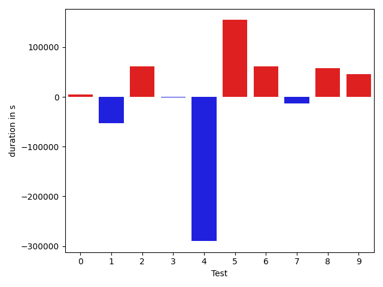

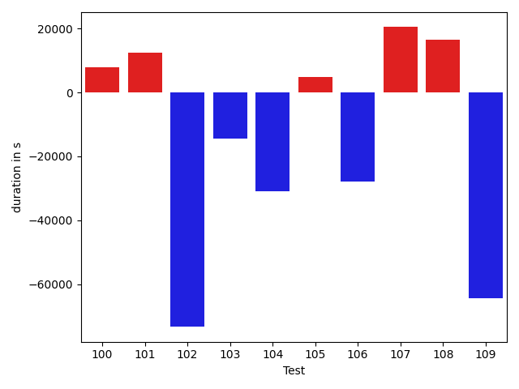

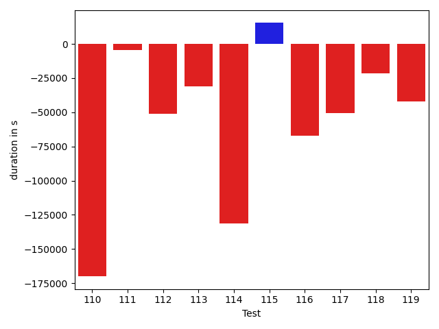

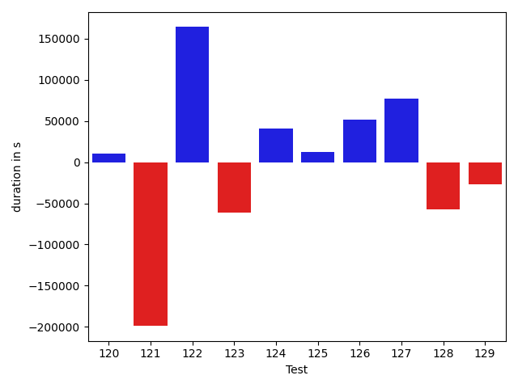

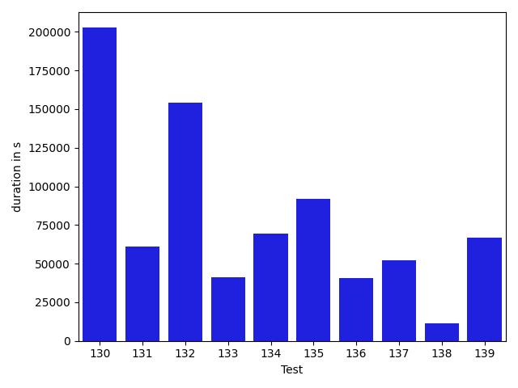

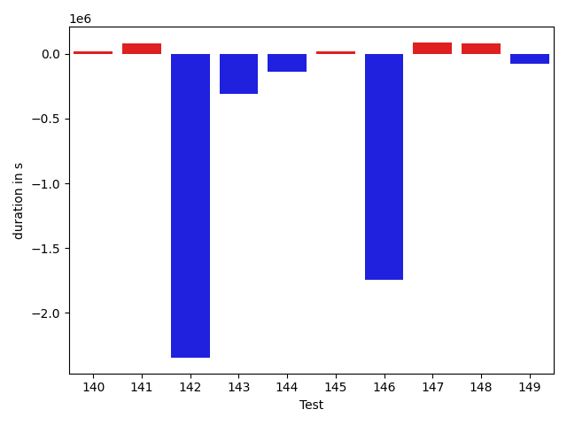

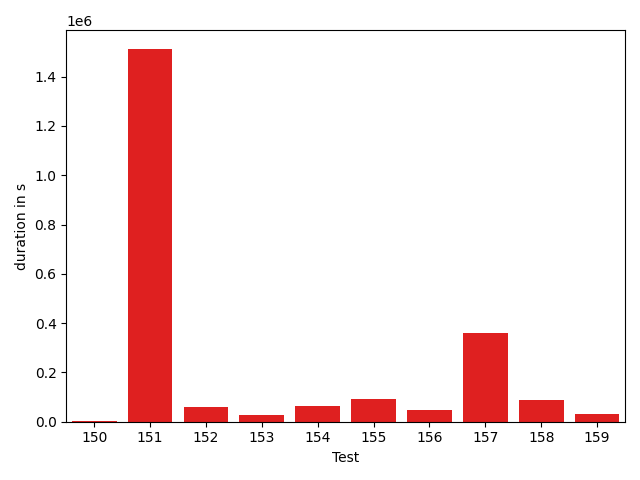

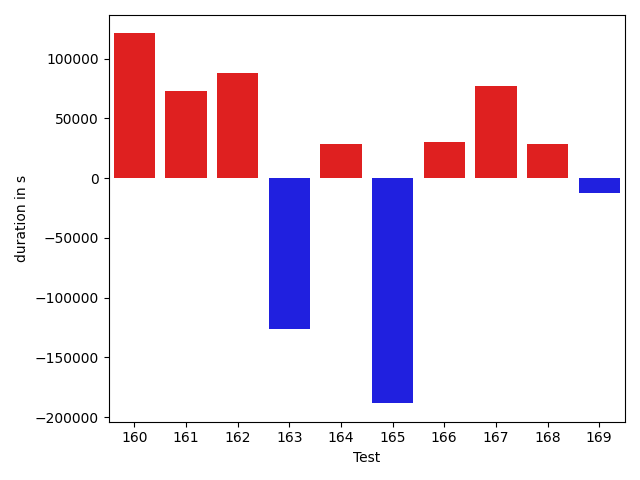

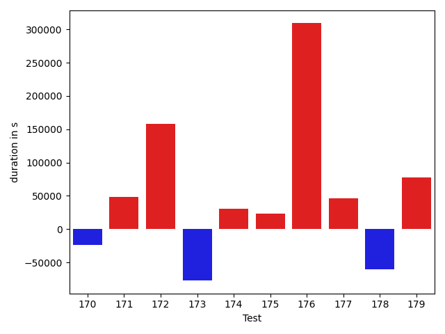

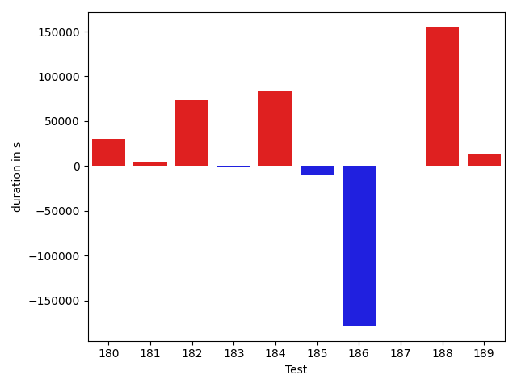

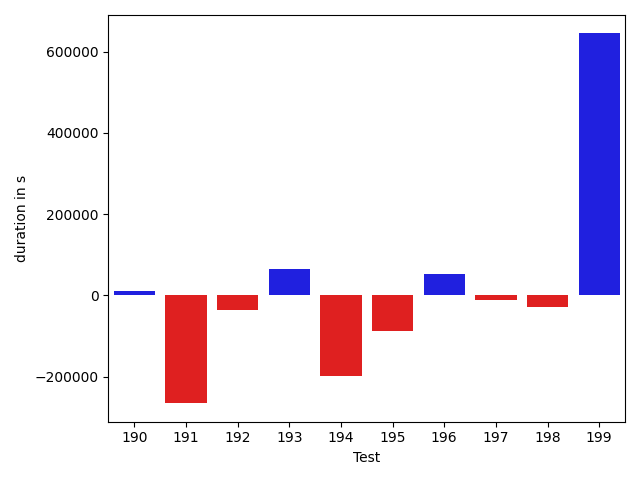

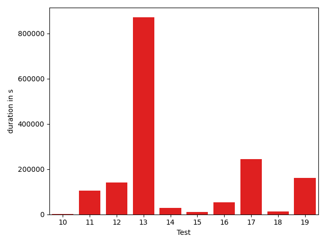

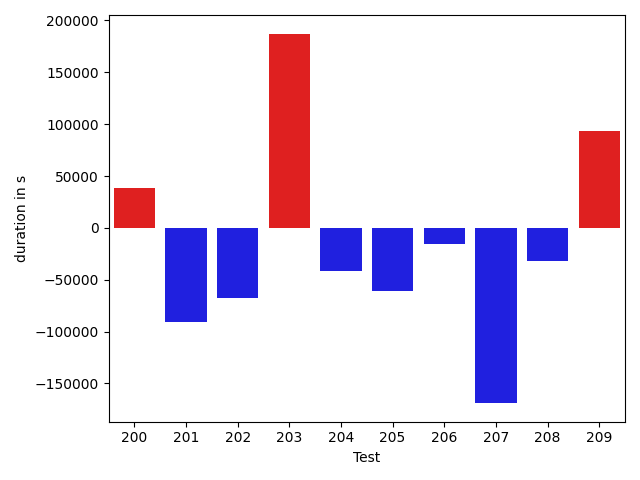

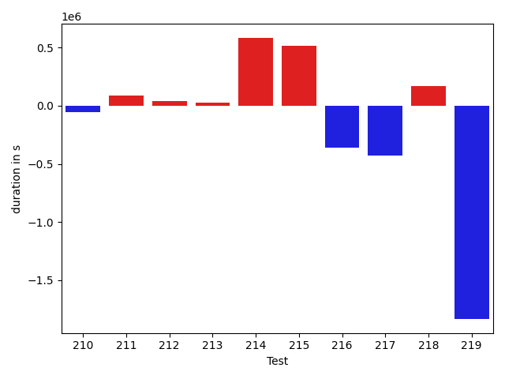

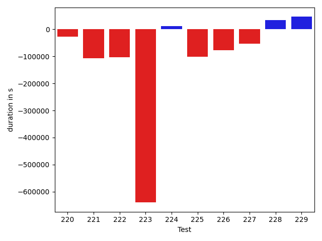

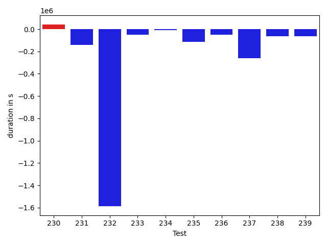

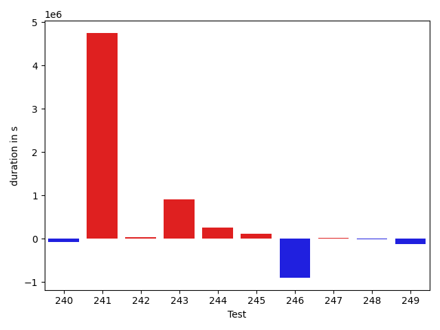

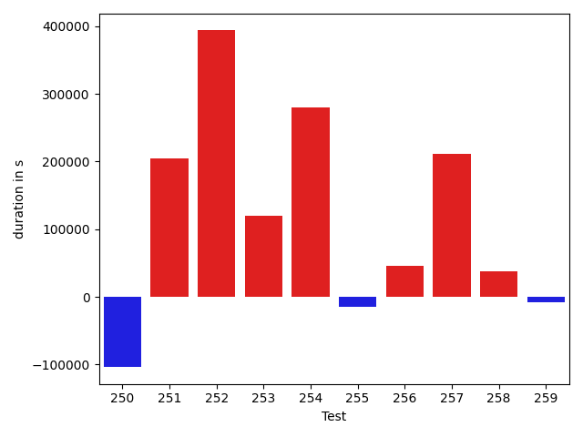

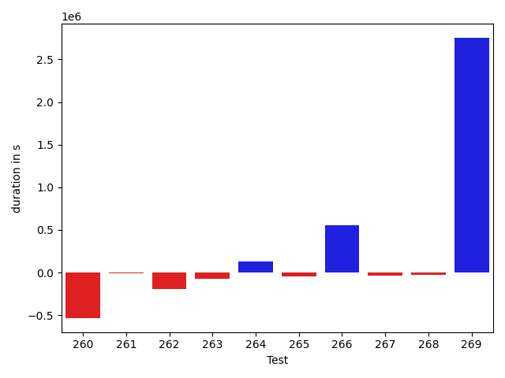

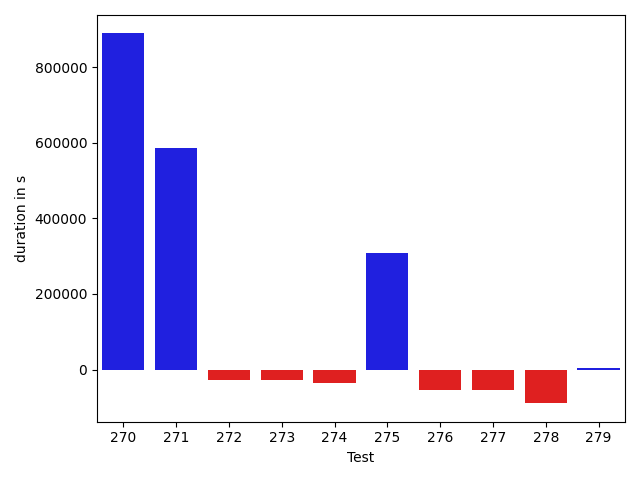

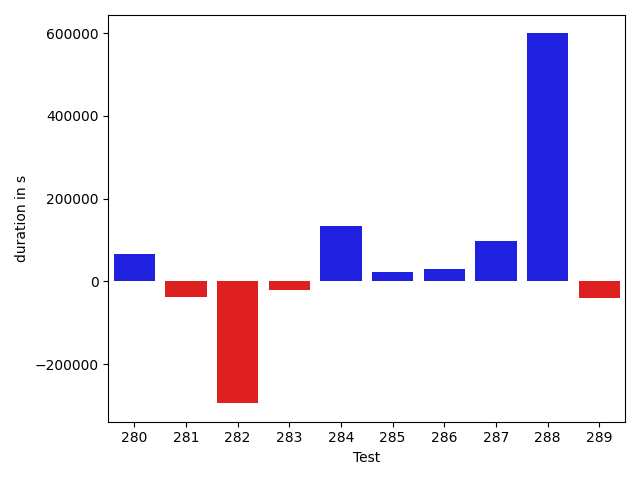

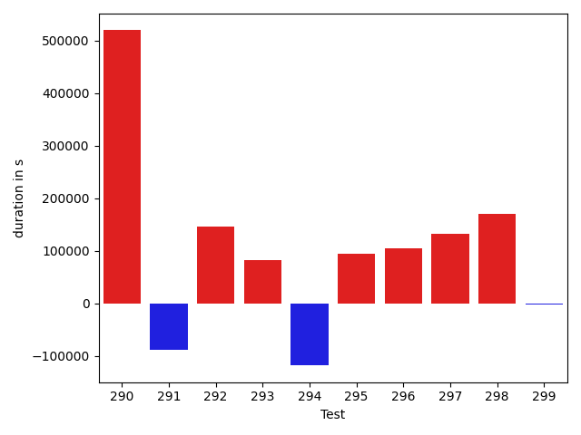

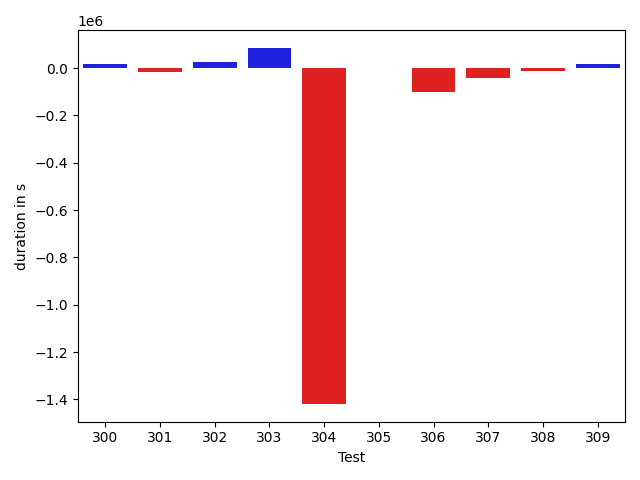

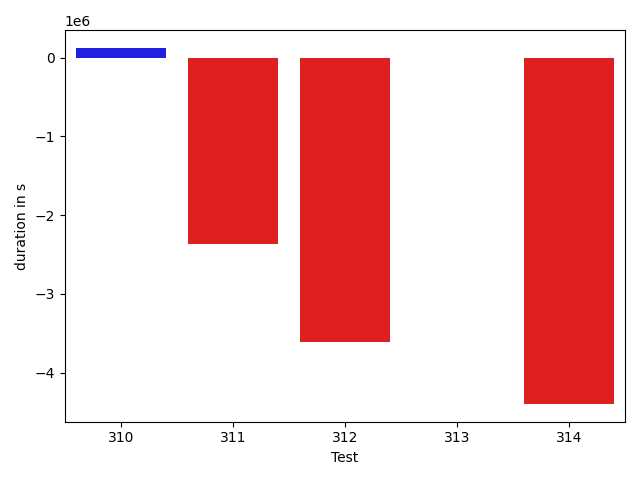

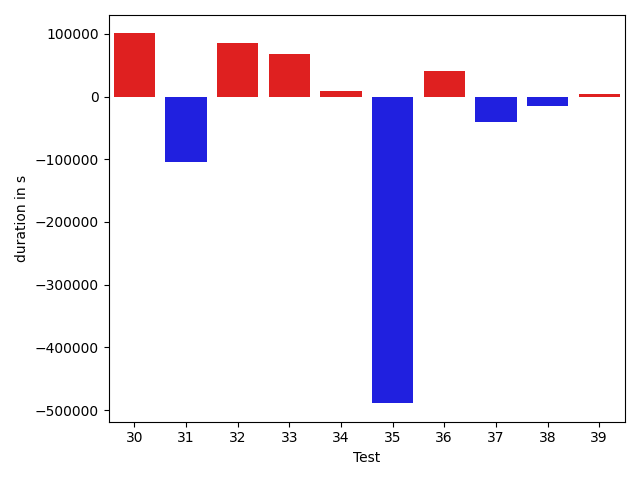

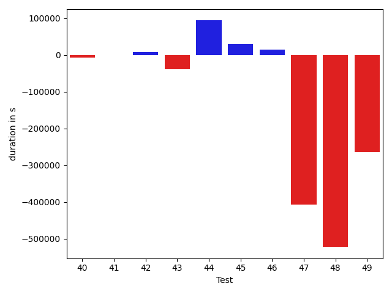

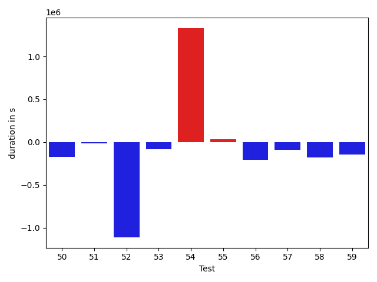

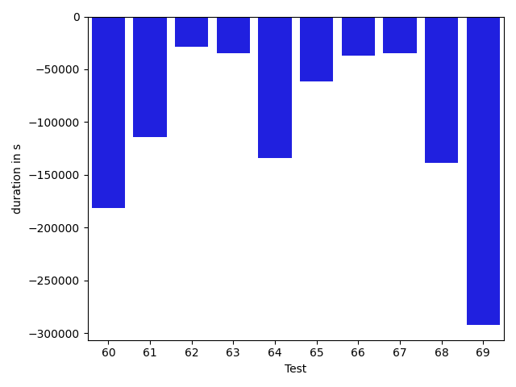

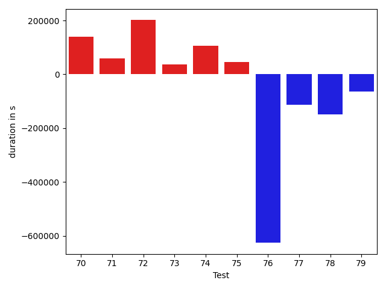

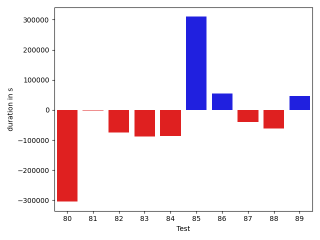

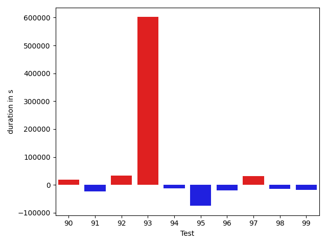

| ID | DurationV1 | DurationsV2 | DeltaDuration |
| --- | --- | --- | --- |
| 0 | 871682.1451612903 | 875984.0638297872 | 4301.918668496888 |
| 1 | 458274.4347826087 | 405733.4090909091 | -52541.025691699586 |
| 2 | 1735494.265625 | 1797227.9361702127 | 61733.67054521269 |
| 3 | 469442.54545454547 | 467872.3 | -1570.245454545482 |
| 4 | 690537.7692307692 | 400650.0 | -289887.76923076925 |
| 5 | 1054544.125 | 1208977.8214285714 | 154433.69642857136 |
| 6 | 360910.2727272727 | 421669.9285714286 | 60759.65584415587 |
| 7 | 414248.6666666667 | 400442.5333333333 | -13806.13333333336 |
| 8 | 348628.82352941175 | 406651.8 | 58022.97647058824 |
| 9 | 415117.35714285716 | 460328.75 | 45211.39285714284 |
| 10 | 423018.94444444444 | 425485.76923076925 | 2466.8247863248107 |
| 11 | 862269.1363636364 | 967295.7258064516 | 105026.58944281528 |
| 12 | 754503.0185185185 | 895254.9649122807 | 140751.94639376213 |
| 13 | 1346524.1206896552 | 2217267.206349206 | 870743.085659551 |
| 14 | 784356.98 | 811944.9375 | 27587.95750000002 |
| 15 | 2179975.272727273 | 2191089.707070707 | 11114.434343433939 |
| 16 | 978856.2794117647 | 1031695.8552631579 | 52839.575851393165 |
| 17 | 803577.0784313725 | 1047117.8771929825 | 243540.79876160994 |
| 18 | 706315.9787234042 | 719600.9649122807 | 13284.986188876443 |
| 19 | 785422.7777777778 | 945662.340425532 | 160239.5626477542 |
| 20 | 575312.925 | 583533.8484848485 | 8220.923484848463 |
| 21 | 693690.8666666667 | 732565.3235294118 | 38874.45686274511 |
| 22 | 700643.1568627451 | 786688.4150943396 | 86045.25823159458 |
| 23 | 923318.2553191489 | 988497.1875 | 65178.932180851116 |
| 24 | 640219.725490196 | 665803.274509804 | 25583.549019607948 |
| 25 | 450145.0 | 567316.25 | 117171.25 |
| 26 | 430153.9411764706 | 421226.35294117645 | -8927.588235294155 |
| 27 | 650264.9512195121 | 670442.0 | 20177.04878048785 |
| 28 | 1346236.242105263 | 1361533.8105263158 | 15297.568421052769 |
| 29 | 1642777.3513513512 | 1746808.3076923077 | 104030.9563409565 |
| 30 | 1056347.3733333333 | 1156852.0875 | 100504.71416666661 |
| 31 | 844398.3636363636 | 740012.6315789474 | -104385.73205741623 |
| 32 | 899574.4038461539 | 984974.6034482758 | 85400.19960212195 |
| 33 | 660311.8918918918 | 727342.92 | 67031.0281081082 |
| 34 | 713576.4901960784 | 722074.2558139535 | 8497.765617875033 |
| 35 | 3695548.3243243243 | 3206348.3780487804 | -489199.9462755439 |
| 36 | 480898.5588235294 | 521486.85294117645 | 40588.29411764705 |
| 37 | 786943.0535714285 | 746207.1132075472 | -40735.940363881295 |
| 38 | 793264.1785714285 | 777552.8666666667 | -15711.311904761824 |
| 39 | 713083.1666666666 | 717214.3666666667 | 4131.20000000007 |
| 40 | 837726.15625 | 830928.8 | -6797.356249999953 |
| 41 | 593326.8823529412 | 593295.9677419355 | -30.91461100568995 |
| 42 | 1194725.8780487804 | 1202251.7948717948 | 7525.916823014384 |
| 43 | 564795.375 | 525525.7142857143 | -39269.66071428568 |
| 44 | 843591.9354838709 | 937701.4705882353 | 94109.53510436439 |
| 45 | 523221.5128205128 | 552773.2307692308 | 29551.71794871794 |
| 46 | 585636.5714285715 | 600181.7391304348 | 14545.167701863335 |
| 47 | 921705.6818181818 | 513627.5652173913 | -408078.11660079047 |
| 48 | 6097878.242424242 | 5575057.757575758 | -522820.4848484844 |
| 49 | 3995932.0404040404 | 3732449.383838384 | -263482.6565656564 |
| 50 | 3195648.494949495 | 3024528.4444444445 | -171120.05050505046 |
| 51 | 623296.5405405406 | 609285.8387096775 | -14010.701830863138 |
| 52 | 9473618.323232323 | 8363238.515151516 | -1110379.8080808073 |
| 53 | 761883.8717948718 | 681970.3939393939 | -79913.47785547783 |
| 54 | 1810067.606060606 | 3139286.2 | 1329218.5939393942 |
| 55 | 530040.2083333334 | 563770.4375 | 33730.22916666663 |
| 56 | 1278883.2807017544 | 1074285.98630137 | -204597.29440038442 |
| 57 | 1474697.8620689656 | 1386001.513888889 | -88696.34818007657 |
| 58 | 1701760.7340425532 | 1520977.8333333333 | -180782.90070921998 |
| 59 | 1084043.476923077 | 939073.1791044776 | -144970.29781859927 |
| 60 | 1145094.0909090908 | 964016.6382978724 | -181077.45261121844 |
| 61 | 1025168.7894736842 | 910860.3220338983 | -114308.46743978583 |
| 62 | 899774.9655172414 | 871287.8727272727 | -28487.09278996871 |
| 63 | 703135.8 | 668732.6304347826 | -34403.16956521745 |
| 64 | 1973051.1170212766 | 1838997.7894736843 | -134053.32754759234 |
| 65 | 855798.2459016393 | 794264.7090909091 | -61533.536810730235 |
| 66 | 593453.9354838709 | 556606.2692307692 | -36847.66625310166 |
| 67 | 926121.2 | 891592.340425532 | -34528.85957446799 |
| 68 | 863253.7708333334 | 724705.8857142857 | -138547.8851190477 |
| 69 | 1545367.7733333334 | 1253429.9090909092 | -291937.86424242426 |
| 70 | 1057790.9193548388 | 1196914.8833333333 | 139123.96397849452 |
| 71 | 1110667.8 | 1169896.106060606 | 59228.306060605915 |
| 72 | 2221237.1739130435 | 2422397.793103448 | 201160.61919040466 |
| 73 | 380399.3 | 418103.85714285716 | 37704.55714285717 |
| 74 | 970672.7931034482 | 1076750.641025641 | 106077.84792219277 |
| 75 | 425798.9090909091 | 472566.5714285714 | 46767.6623376623 |
| 76 | 3787127.97979798 | 3161208.4545454546 | -625919.5252525252 |
| 77 | 961401.4571428571 | 848141.0 | -113260.45714285714 |
| 78 | 851989.1904761905 | 703900.4285714285 | -148088.761904762 |
| 79 | 722924.358974359 | 658717.0512820513 | -64207.307692307746 |
| 80 | 901544.9 | 596741.7 | -304803.20000000007 |
| 81 | 541811.4516129033 | 540162.08 | -1649.3716129033128 |
| 82 | 872312.037735849 | 796951.7659574468 | -75360.27177840227 |
| 83 | 506760.7083333333 | 418928.22222222225 | -87832.48611111107 |
| 84 | 2313949.2474226803 | 2226922.4693877553 | -87026.778034925 |
| 85 | 497689.7826086957 | 807495.8888888889 | 309806.1062801932 |
| 86 | 964302.4423076923 | 1018177.3703703703 | 53874.92806267808 |
| 87 | 1119548.22 | 1078732.7636363637 | -40815.4563636363 |
| 88 | 1127966.61971831 | 1066365.2173913044 | -61601.40232700552 |
| 89 | 990861.3387096775 | 1037261.725490196 | 46400.38678051857 |
| 90 | 942368.6428571428 | 960053.0222222222 | 17684.379365079338 |
| 91 | 1441163.5975609757 | 1418306.1011235956 | -22857.49643738009 |
| 92 | 442229.7894736842 | 476189.27777777775 | 33959.48830409354 |
| 93 | 1454977.2051282052 | 2056641.0512820513 | 601663.846153846 |
| 94 | 524799.9375 | 511851.55555555556 | -12948.381944444438 |
| 95 | 487032.4285714286 | 411764.8695652174 | -75267.55900621117 |
| 96 | 478861.5263157895 | 458342.6 | -20518.92631578952 |
| 97 | 1165985.1976744186 | 1197159.9294117647 | 31174.731737346156 |
| 98 | 1473079.1066666667 | 1458438.7435897435 | -14640.363076923182 |
| 99 | 1055230.396825397 | 1036389.7068965518 | -18840.689928845153 |
| 100 | 1028125.8070175438 | 1036070.8474576271 | 7945.0404400832485 |
| 101 | 957376.6206896552 | 969926.078125 | 12549.457435344812 |
| 102 | 904347.1851851852 | 830978.7627118644 | -73368.42247332074 |
| 103 | 1267865.3505154639 | 1253442.268041237 | -14423.08247422683 |
| 104 | 708004.05 | 677119.3409090909 | -30884.709090909106 |
| 105 | 738378.0 | 743145.358974359 | 4767.358974358998 |
| 106 | 612638.5588235294 | 584716.0645161291 | -27922.49430740031 |
| 107 | 431238.0416666667 | 451713.48 | 20475.438333333295 |
| 108 | 730104.0178571428 | 746687.1086956522 | 16583.09083850938 |
| 109 | 3637428.767676768 | 3572939.9696969697 | -64488.79797979817 |
| 110 | 1411834.3186813188 | 1241741.3763440861 | -170092.94233723264 |
| 111 | 791864.7118644068 | 787318.6037735849 | -4546.108090821886 |
| 112 | 1305017.088888889 | 1253837.0930232557 | -51179.995865633246 |
| 113 | 425918.0 | 394953.9090909091 | -30964.090909090883 |
| 114 | 1722509.3870967743 | 1591272.3035714286 | -131237.08352534566 |
| 115 | 588316.3125 | 603699.34375 | 15383.03125 |
| 116 | 1003833.5 | 936457.9298245613 | -67375.57017543865 |
| 117 | 723850.6 | 673079.2222222222 | -50771.37777777773 |
| 118 | 825557.1803278689 | 804258.5925925926 | -21298.58773527632 |
| 119 | 449000.85714285716 | 407106.2 | -41894.65714285715 |
| 120 | 710070.4883720931 | 720881.4468085107 | 10810.958436417626 |
| 121 | 1088058.7045454546 | 889030.45 | -199028.25454545463 |
| 122 | 475636.5416666667 | 639854.4838709678 | 164217.94220430107 |
| 123 | 556751.2727272727 | 495344.5714285714 | -61406.701298701286 |
| 124 | 482997.4583333333 | 523669.9285714286 | 40672.470238095266 |
| 125 | 821043.7068965518 | 833552.4583333334 | 12508.751436781604 |
| 126 | 1484118.391304348 | 1535821.587628866 | 51703.19632451818 |
| 127 | 1261450.1818181819 | 1339000.1098901099 | 77549.92807192798 |
| 128 | 2879274.0303030303 | 2821475.101010101 | -57798.92929292936 |
| 129 | 1539432.9239130435 | 1512809.3469387756 | -26623.57697426784 |
| 130 | 2182031.393939394 | 2384648.777777778 | 202617.38383838395 |
| 131 | 1459840.0416666667 | 1520810.4270833333 | 60970.38541666651 |
| 132 | 1773590.8585858585 | 1927779.6734693877 | 154188.8148835292 |
| 133 | 1033741.3116883116 | 1074742.0921052631 | 41000.780416951515 |
| 134 | 2135151.01010101 | 2204508.0404040404 | 69357.03030303027 |
| 135 | 1427863.6842105263 | 1519671.1956521738 | 91807.51144164754 |
| 136 | 1121657.4743589743 | 1162442.8684210526 | 40785.394062078325 |
| 137 | 1103685.9487179487 | 1155798.3292682928 | 52112.38055034401 |
| 138 | 958687.8571428572 | 970259.4571428571 | 11571.599999999977 |
| 139 | 704324.4375 | 771086.0384615385 | 66761.6009615385 |
| 140 | 564041.6216216217 | 581447.5454545454 | 17405.923832923756 |
| 141 | 1479227.8072289156 | 1557519.238095238 | 78291.43086632248 |
| 142 | 3770988.160714286 | 1426080.7333333334 | -2344907.4273809525 |
| 143 | 1045059.85 | 737449.7083333334 | -307610.1416666666 |
| 144 | 586970.6 | 444333.13636363635 | -142637.46363636362 |
| 145 | 457786.3333333333 | 474348.0625 | 16561.729166666686 |
| 146 | 4557532.271604938 | 2813733.3098591547 | -1743798.9617457837 |
| 147 | 2167302.01010101 | 2253638.909090909 | 86336.89898989908 |
| 148 | 560667.8918918918 | 640060.6153846154 | 79392.72349272354 |
| 149 | 586989.074074074 | 507669.8846153846 | -79319.18945868942 |
| 150 | 490229.2083333333 | 493106.18518518517 | 2876.976851851854 |
| 151 | 7442431.435294118 | 8955624.294117646 | 1513192.8588235285 |
| 152 | 407830.05263157893 | 465548.9090909091 | 57718.856459330185 |
| 153 | 745117.6428571428 | 772407.4385964912 | 27289.795739348396 |
| 154 | 474361.92 | 536743.4137931034 | 62381.49379310344 |
| 155 | 777473.4893617021 | 867839.3953488372 | 90365.90598713513 |
| 156 | 1593433.7052631578 | 1642407.7096774194 | 48974.00441426155 |
| 157 | 1264406.25 | 1625535.0714285714 | 361128.82142857136 |
| 158 | 644969.0810810811 | 732707.15 | 87738.06891891896 |
| 159 | 829426.3818181818 | 861933.0877192982 | 32506.705901116366 |
| 160 | 351952.3333333333 | 472990.70588235295 | 121038.37254901964 |
| 161 | 1156234.0759493671 | 1229531.8148148148 | 73297.7388654477 |
| 162 | 1011649.6533333333 | 1099314.3783783785 | 87664.72504504514 |
| 163 | 736809.8064516129 | 610783.1944444445 | -126026.61200716835 |
| 164 | 704764.9230769231 | 732929.3095238095 | 28164.386446886347 |
| 165 | 749640.9615384615 | 561288.8461538461 | -188352.11538461538 |
| 166 | 720793.447368421 | 750885.7692307692 | 30092.32186234824 |
| 167 | 889192.7894736842 | 966009.5084745763 | 76816.71900089213 |
| 168 | 697384.6739130435 | 726339.358974359 | 28954.68506131554 |
| 169 | 671180.5 | 658751.7073170731 | -12428.792682926869 |
| 170 | 649247.09375 | 625740.9375 | -23506.15625 |
| 171 | 503049.6 | 551466.8148148148 | 48417.214814814855 |
| 172 | 483376.2 | 641990.09375 | 158613.89375 |
| 173 | 744540.4651162791 | 667205.3142857143 | -77335.15083056479 |
| 174 | 513271.6923076923 | 544153.90625 | 30882.213942307688 |
| 175 | 485165.3870967742 | 508349.8 | 23184.412903225806 |
| 176 | 410077.5 | 719331.1363636364 | 309253.63636363635 |
| 177 | 450624.3181818182 | 496473.8461538461 | 45849.52797202795 |
| 178 | 574113.3142857143 | 513355.13157894736 | -60758.18270676694 |
| 179 | 459356.1538461539 | 536978.9230769231 | 77622.76923076925 |
| 180 | 548388.3793103448 | 578857.8518518518 | 30469.472541506984 |
| 181 | 415657.75 | 420174.75 | 4517.0 |
| 182 | 420697.76923076925 | 494110.1875 | 73412.41826923075 |
| 183 | 400153.6666666667 | 398770.2 | -1383.4666666666744 |
| 184 | 549318.1333333333 | 632423.0 | 83104.8666666667 |
| 185 | 859801.5 | 850562.9245283019 | -9238.575471698074 |
| 186 | 5834414.737373738 | 5656047.4949494945 | -178367.24242424313 |
| 187 | 579785.1388888889 | 580176.8518518518 | 391.71296296291985 |
| 188 | 979558.8636363636 | 1134538.3278688525 | 154979.46423248888 |
| 189 | 636258.95 | 649735.8571428572 | 13476.907142857206 |
| 190 | 762700.8222222222 | 774576.2708333334 | 11875.448611111147 |
| 191 | 1058511.8095238095 | 793337.8181818182 | -265173.99134199123 |
| 192 | 840871.6666666666 | 805445.7924528302 | -35425.87421383639 |
| 193 | 367398.36842105264 | 431571.17647058825 | 64172.80804953561 |
| 194 | 967823.0 | 770717.1388888889 | -197105.86111111112 |
| 195 | 1844881.5189873418 | 1757747.2469135802 | -87134.27207376156 |
| 196 | 502084.1724137931 | 553993.3846153846 | 51909.21220159152 |
| 197 | 636022.12 | 624301.0238095238 | -11721.096190476208 |
| 198 | 897012.1698113207 | 868051.2678571428 | -28960.901954177883 |
| 199 | 2128241.505050505 | 2772783.9292929294 | 644542.4242424243 |
| 200 | 1356794.9156626507 | 1395285.1411764706 | 38490.22551381984 |
| 201 | 1495250.8452380951 | 1404249.7555555555 | -91001.08968253969 |
| 202 | 1281703.8539325842 | 1214319.1126760563 | -67384.74125652784 |
| 203 | 651069.0476190476 | 838315.8695652174 | 187246.82194616983 |
| 204 | 921108.9365079365 | 879892.0149253731 | -41216.921582563315 |
| 205 | 900889.5434782609 | 839567.9333333333 | -61321.610144927516 |
| 206 | 984737.7121212122 | 969381.0447761194 | -15356.667345092748 |
| 207 | 1203141.763888889 | 1034063.7058823529 | -169078.0580065361 |
| 208 | 1323706.7159090908 | 1292248.852631579 | -31457.863277511904 |
| 209 | 1100297.4935064935 | 1193644.361111111 | 93346.8676046175 |
| 210 | 745493.9736842106 | 691713.3913043478 | -53780.58237986278 |
| 211 | 692790.695652174 | 779305.375 | 86514.67934782605 |
| 212 | 568593.7777777778 | 609312.2432432432 | 40718.465465465444 |
| 213 | 554794.84 | 582408.8076923077 | 27613.96769230778 |
| 214 | 2505981.102040816 | 3088555.6226415094 | 582574.5206006933 |
| 215 | 1446428.7283950618 | 1959445.7272727273 | 513016.9988776655 |
| 216 | 8823459.535353536 | 8459598.545454545 | -363860.98989899084 |
| 217 | 11392502.787878787 | 10963132.353535354 | -429370.434343433 |
| 218 | 1481157.0361445784 | 1651293.8777777778 | 170136.84163319948 |
| 219 | 3953491.637681159 | 2121208.323076923 | -1832283.3146042363 |
| 220 | 822692.2592592592 | 795083.3265306122 | -27608.93272864702 |
| 221 | 1062991.7258064516 | 956908.2127659575 | -106083.51304049417 |
| 222 | 1102792.0410958903 | 999756.8461538461 | -103035.19494204421 |
| 223 | 4151164.373737374 | 3511027.262626263 | -640137.111111111 |
| 224 | 1133066.0161290322 | 1145379.8 | 12313.783870967804 |
| 225 | 1107238.9367088608 | 1005830.5897435897 | -101408.34696527105 |
| 226 | 1046448.4324324324 | 969387.65625 | -77060.77618243243 |
| 227 | 1162734.8352941177 | 1109439.987804878 | -53294.84748923965 |
| 228 | 1300822.172839506 | 1335380.2976190476 | 34558.12477954151 |
| 229 | 1314321.011904762 | 1360559.0329670329 | 46238.02106227097 |
| 230 | 1139196.913580247 | 1180595.4578313252 | 41398.544251078274 |
| 231 | 1170267.4285714286 | 1026539.2 | -143728.22857142868 |
| 232 | 2799261.4285714286 | 1212108.511627907 | -1587152.9169435217 |
| 233 | 890062.3636363636 | 838863.6944444445 | -51198.66919191915 |
| 234 | 587321.5161290322 | 576691.8571428572 | -10629.658986175084 |
| 235 | 778824.074074074 | 663616.4444444445 | -115207.62962962955 |
| 236 | 682417.0512820513 | 630936.2121212122 | -51480.839160839096 |
| 237 | 3332022.5760869565 | 3069347.3804347827 | -262675.19565217383 |
| 238 | 656858.1764705882 | 592663.0857142857 | -64195.09075630247 |
| 239 | 699994.2727272727 | 635157.5555555555 | -64836.7171717172 |
| 240 | 671296.2307692308 | 590658.447368421 | -80637.78340080974 |
| 241 | 1027735.724137931 | 5776899.741935484 | 4749164.017797553 |
| 242 | 570093.4848484849 | 605048.96 | 34955.4751515151 |
| 243 | 586724.8666666667 | 1499139.1290322582 | 912414.2623655915 |
| 244 | 2097696.806451613 | 2360026.5675675673 | 262329.76111595426 |
| 245 | 660291.8965517242 | 781847.6538461539 | 121555.7572944297 |
| 246 | 3298305.0317460317 | 2397667.777777778 | -900637.2539682537 |
| 247 | 679357.34375 | 705916.4090909091 | 26559.06534090906 |
| 248 | 688115.3913043478 | 682439.0 | -5676.3913043477805 |
| 249 | 834986.2954545454 | 705572.4222222222 | -129413.87323232321 |
| 250 | 572483.7666666667 | 468689.90625 | -103793.86041666672 |
| 251 | 1110763.6376811594 | 1315571.6229508198 | 204807.98526966036 |
| 252 | 1009600.8095238095 | 1403122.5774647887 | 393521.7679409792 |
| 253 | 464106.875 | 584455.3636363636 | 120348.48863636365 |
| 254 | 442586.63636363635 | 723039.8333333334 | 280453.196969697 |
| 255 | 743769.9130434783 | 728662.4897959183 | -15107.423247559927 |
| 256 | 589644.8205128205 | 634996.695652174 | 45351.87513935345 |
| 257 | 711182.8421052631 | 922535.0212765958 | 211352.17917133262 |
| 258 | 536696.3103448276 | 575064.7777777778 | 38368.46743295016 |
| 259 | 1464891.9787234042 | 1456475.4516129033 | -8416.52711050096 |
| 260 | 957860.25 | 422790.2 | -535070.05 |
| 261 | 640167.9655172414 | 632494.9743589744 | -7672.991158267017 |
| 262 | 774953.2727272727 | 578889.1515151515 | -196064.12121212122 |
| 263 | 882317.7428571428 | 807328.4137931034 | -74989.3290640394 |
| 264 | 1123048.4375 | 1249888.4857142856 | 126840.04821428563 |
| 265 | 557525.5666666667 | 509707.13636363635 | -47818.4303030303 |
| 266 | 594598.8333333334 | 1148577.0 | 553978.1666666666 |
| 267 | 477993.0 | 442693.2916666667 | -35299.708333333314 |
| 268 | 790580.45 | 767542.7142857143 | -23037.735714285634 |
| 269 | 1137033.7777777778 | 3891256.8947368423 | 2754223.1169590643 |
| 270 | 1978131.294117647 | 2866865.309090909 | 888734.0149732621 |
| 271 | 492760.0 | 1079893.8 | 587133.8 |
| 272 | 386152.0 | 359040.1052631579 | -27111.894736842078 |
| 273 | 553291.5 | 524449.2916666666 | -28842.208333333372 |
| 274 | 1774018.705882353 | 1737759.7567567567 | -36258.94912559632 |
| 275 | 1344005.05 | 1653388.469387755 | 309383.419387755 |
| 276 | 1884371.1515151516 | 1829265.616161616 | -55105.53535353555 |
| 277 | 771125.0 | 718352.5 | -52772.5 |
| 278 | 817549.0666666667 | 728515.1785714285 | -89033.88809523813 |
| 279 | 612896.15 | 615863.96875 | 2967.8187499999767 |
| 280 | 689386.8510638297 | 755021.4772727273 | 65634.62620889756 |
| 281 | 476625.8095238095 | 439818.0 | -36807.80952380953 |
| 282 | 1353486.7536231885 | 1059141.0461538462 | -294345.7074693423 |
| 283 | 588352.0 | 568706.8095238095 | -19645.19047619053 |
| 284 | 1505795.677419355 | 1639401.9166666667 | 133606.23924731184 |
| 285 | 466007.71428571426 | 489854.1052631579 | 23846.39097744366 |
| 286 | 667613.6458333334 | 696613.7567567568 | 29000.11092342343 |
| 287 | 1276531.0 | 1374544.3 | 98013.30000000005 |
| 288 | 4019469.414141414 | 4618909.101010101 | 599439.6868686867 |
| 289 | 776135.3555555556 | 737322.1632653062 | -38813.1922902494 |
| 290 | 1937386.6493506494 | 2456627.074074074 | 519240.4247234247 |
| 291 | 492367.73333333334 | 403887.95 | -88479.78333333333 |
| 292 | 1734312.7088607594 | 1881236.0459770116 | 146923.33711625217 |
| 293 | 962906.5423728813 | 1045037.6119402985 | 82131.06956741714 |
| 294 | 2108200.054054054 | 1990370.3095238095 | -117829.7445302445 |
| 295 | 776249.9375 | 871314.4693877551 | 95064.53188775515 |
| 296 | 564008.1764705882 | 668971.9545454546 | 104963.7780748664 |
| 297 | 447525.23333333334 | 579956.05 | 132430.8166666667 |
| 298 | 535724.6666666666 | 706001.35 | 170276.68333333335 |
| 299 | 886264.1333333333 | 885042.1538461539 | -1221.9794871794293 |
| 300 | 436442.6666666667 | 456108.13636363635 | 19665.469696969667 |
| 301 | 487058.25 | 472486.3333333333 | -14571.916666666686 |
| 302 | 442410.4166666667 | 469912.56 | 27502.14333333331 |
| 303 | 369771.36363636365 | 455133.8695652174 | 85362.50592885376 |
| 304 | 5078876.202020202 | 3660033.0404040404 | -1418843.1616161615 |
| 305 | 960717.3529411765 | 962139.3148148148 | 1421.9618736383272 |
| 306 | 1141562.9333333333 | 1039602.9534883721 | -101959.9798449612 |
| 307 | 1728051.175257732 | 1688324.3404255318 | -39726.83483220008 |
| 308 | 748442.0952380953 | 736171.8 | -12270.29523809522 |
| 309 | 1199341.0285714285 | 1214974.6666666667 | 15633.638095238246 |
| 310 | 1451561.5535714286 | 1575831.8541666667 | 124270.3005952381 |
| 311 | 3347159.75 | 974302.9838709678 | -2372856.7661290322 |
| 312 | 8637584.368421054 | 5021578.75 | -3616005.6184210535 |
| 313 | 419645.71428571426 | 414061.4117647059 | -5584.302521008358 |
| 314 | 7147804.444444444 | 2748736.9375 | -4399067.506944444 |

## Misc.

| ID | Test Class | Test Method |
| --- | --- | --- |
| 0 | com.google.gson.functional.PrimitiveTest | testDeserializePrimitiveWrapperAsObjectField |
| 1 | com.google.gson.functional.PrimitiveTest | testLongAsStringDeserialization |
| 2 | com.google.gson.functional.PrimitiveTest | testHtmlCharacterSerialization |
| 3 | com.google.gson.functional.PrimitiveTest | testLongAsStringSerialization |
| 4 | com.google.gson.functional.PrimitiveTest | testNegativeInfinityFloatSerialization |
| 5 | com.google.gson.functional.PrimitiveTest | testMoreSpecificSerialization |
| 6 | com.google.gson.functional.PrimitiveTest | testFloatInfinitySerialization |
| 7 | com.google.gson.functional.PrimitiveTest | testFloatNaNSerialization |
| 8 | com.google.gson.functional.PrimitiveTest | testNegativeInfinitySerialization |
| 9 | com.google.gson.functional.PrimitiveTest | testDoubleInfinitySerialization |
| 10 | com.google.gson.functional.PrimitiveTest | testDoubleNaNSerialization |
| 11 | com.google.gson.functional.CustomTypeAdaptersTest | testCustomAdapterInvokedForCollectionElementDeserialization |
| 12 | com.google.gson.functional.CustomTypeAdaptersTest | testCustomAdapterInvokedForMapElementDeserialization |
| 13 | com.google.gson.functional.CustomTypeAdaptersTest | testCustomSerializers |
| 14 | com.google.gson.functional.CustomTypeAdaptersTest | testCustomNestedDeserializers |
| 15 | com.google.gson.functional.CustomTypeAdaptersTest | testCustomTypeAdapterDoesNotAppliesToSubClasses |
| 16 | com.google.gson.functional.CustomTypeAdaptersTest | testCustomAdapterInvokedForCollectionElementSerializationWithType |
| 17 | com.google.gson.functional.CustomTypeAdaptersTest | testCustomDeserializers |
| 18 | com.google.gson.functional.CustomTypeAdaptersTest | testCustomByteArrayDeserializerAndInstanceCreator |
| 19 | com.google.gson.functional.CustomTypeAdaptersTest | testEnsureCustomSerializerNotInvokedForNullValues |
| 20 | com.google.gson.functional.CustomTypeAdaptersTest | testEnsureCustomDeserializerNotInvokedForNullValues |
| 21 | com.google.gson.functional.CustomTypeAdaptersTest | testCustomTypeAdapterAppliesToSubClassesSerializedAsBaseClass |
| 22 | com.google.gson.functional.CustomTypeAdaptersTest | testCustomAdapterInvokedForMapElementSerializationWithType |
| 23 | com.google.gson.functional.CustomTypeAdaptersTest | testCustomNestedSerializers |
| 24 | com.google.gson.functional.CustomTypeAdaptersTest | testCustomByteArraySerializer |
| 25 | com.google.gson.functional.CustomTypeAdaptersTest | testCustomAdapterInvokedForCollectionElementSerialization |
| 26 | com.google.gson.functional.CustomTypeAdaptersTest | testCustomAdapterInvokedForMapElementSerialization |
| 27 | com.google.gson.functional.CustomDeserializerTest | testDefaultConstructorNotCalledOnField |
| 28 | com.google.gson.functional.CustomDeserializerTest | testDefaultConstructorNotCalledOnObject |
| 29 | com.google.gson.functional.CustomDeserializerTest | testCustomDeserializerReturnsNullForArrayElementsForArrayField |
| 30 | com.google.gson.functional.CustomDeserializerTest | testJsonTypeFieldBasedDeserialization |
| 31 | com.google.gson.functional.CustomDeserializerTest | testCustomDeserializerReturnsNullForTopLevelObject |
| 32 | com.google.gson.functional.CustomDeserializerTest | testCustomDeserializerReturnsNull |
| 33 | com.google.gson.functional.CustomDeserializerTest | testCustomDeserializerReturnsNullForArrayElements |
| 34 | com.google.gson.functional.NamingPolicyTest | testAtSignInSerializedName |
| 35 | com.google.gson.functional.NamingPolicyTest | testGsonDuplicateNameUsingSerializedNameFieldNamingPolicySerialization |
| 36 | com.google.gson.functional.NamingPolicyTest | testGsonWithUpperCamelCaseSpacesPolicyDeserialiation |
| 37 | com.google.gson.functional.NamingPolicyTest | testGsonWithSerializedNameFieldNamingPolicySerialization |
| 38 | com.google.gson.functional.NamingPolicyTest | testDeprecatedNamingStrategy |
| 39 | com.google.gson.functional.NamingPolicyTest | testGsonWithSerializedNameFieldNamingPolicyDeserialization |
| 40 | com.google.gson.functional.NamingPolicyTest | testComplexFieldNameStrategy |
| 41 | com.google.gson.functional.NamingPolicyTest | testGsonWithLowerCaseUnderscorePolicyDeserialiation |
| 42 | com.google.gson.functional.NamingPolicyTest | testGsonWithNonDefaultFieldNamingPolicySerialization |
| 43 | com.google.gson.functional.NamingPolicyTest | testGsonWithLowerCaseDashPolicyDeserialiation |
| 44 | com.google.gson.functional.NamingPolicyTest | testGsonWithNonDefaultFieldNamingPolicyDeserialiation |
| 45 | com.google.gson.functional.NamingPolicyTest | testGsonWithLowerCaseDashPolicySerialization |
| 46 | com.google.gson.functional.NamingPolicyTest | testGsonWithLowerCaseUnderscorePolicySerialization |
| 47 | com.google.gson.functional.NamingPolicyTest | testGsonWithUpperCamelCaseSpacesPolicySerialiation |
| 48 | com.google.gson.functional.CircularReferenceTest | testCircularSerialization |
| 49 | com.google.gson.functional.CircularReferenceTest | testSelfReferenceArrayFieldSerialization |
| 50 | com.google.gson.functional.CircularReferenceTest | testSelfReferenceSerialization |
| 51 | com.google.gson.functional.CircularReferenceTest | testDirectedAcyclicGraphSerialization |
| 52 | com.google.gson.functional.CircularReferenceTest | testSelfReferenceCustomHandlerSerialization |
| 53 | com.google.gson.functional.CircularReferenceTest | testDirectedAcyclicGraphDeserialization |
| 54 | com.google.gson.LongSerializationPolicyTest | testDefaultLongSerializationIntegration |
| 55 | com.google.gson.LongSerializationPolicyTest | testStringLongSerializationIntegration |
| 56 | com.google.gson.functional.MapTest | testSerializeMaps |
| 57 | com.google.gson.functional.MapTest | testMapSerializationWithNullValues |
| 58 | com.google.gson.functional.MapTest | testInterfaceTypeMapWithSerializer |
| 59 | com.google.gson.functional.MapTest | testComplexKeysSerialization |
| 60 | com.google.gson.functional.MapTest | testMapSubclassDeserialization |
| 61 | com.google.gson.functional.MapTest | testCustomSerializerForSpecificMapType |
| 62 | com.google.gson.functional.MapTest | testGeneralMapField |
| 63 | com.google.gson.functional.MapTest | testMapSerializationWithNullValueButSerializeNulls |
| 64 | com.google.gson.functional.MapTest | testInterfaceTypeMap |
| 65 | com.google.gson.functional.MapTest | testComplexKeysDeserialization |
| 66 | com.google.gson.functional.MapTest | testMapSerializationWithNullValuesSerialized |
| 67 | com.google.gson.functional.PrettyPrintingTest | testEmptyMapField |
| 68 | com.google.gson.functional.PrettyPrintingTest | testPrettyPrintArrayOfObjects |
| 69 | com.google.gson.functional.PrettyPrintingTest | testPrettyPrintList |
| 70 | com.google.gson.functional.ReadersWritersTest | testReadWriteTwoObjects |
| 71 | com.google.gson.functional.ReadersWritersTest | testReadWriteTwoStrings |
| 72 | com.google.gson.functional.ReadersWritersTest | testWriterForSerialization |
| 73 | com.google.gson.functional.ReadersWritersTest | testTopLevelNullObjectDeserializationWithReaderAndSerializeNulls |
| 74 | com.google.gson.functional.ReadersWritersTest | testReaderForDeserialization |
| 75 | com.google.gson.functional.ReadersWritersTest | testTopLevelNullObjectSerializationWithWriterAndSerializeNulls |
| 76 | com.google.gson.functional.ExposeFieldsTest | testNullExposeFieldSerialization |
| 77 | com.google.gson.functional.ExposeFieldsTest | testExposeAnnotationDeserialization |
| 78 | com.google.gson.functional.ExposeFieldsTest | testArrayWithOneNullExposeFieldObjectSerialization |
| 79 | com.google.gson.functional.ExposeFieldsTest | testNoExposedFieldSerialization |
| 80 | com.google.gson.functional.ExposeFieldsTest | testExposeAnnotationSerialization |
| 81 | com.google.gson.functional.ExposeFieldsTest | testExposedInterfaceFieldDeserialization |
| 82 | com.google.gson.functional.ExposeFieldsTest | testExposedInterfaceFieldSerialization |
| 83 | com.google.gson.functional.ExposeFieldsTest | testNoExposedFieldDeserialization |
| 84 | com.google.gson.functional.InheritanceTest | testSubInterfacesOfCollectionSerialization |
| 85 | com.google.gson.functional.InheritanceTest | testBaseSerializedAsSubForToJsonMethod |
| 86 | com.google.gson.functional.InheritanceTest | testClassWithBaseArrayFieldSerialization |
| 87 | com.google.gson.functional.InheritanceTest | testSubClassDeserialization |
| 88 | com.google.gson.functional.InheritanceTest | testSubInterfacesOfCollectionDeserialization |
| 89 | com.google.gson.functional.InheritanceTest | testClassWithBaseCollectionFieldSerialization |
| 90 | com.google.gson.functional.InheritanceTest | testClassWithBaseFieldSerialization |
| 91 | com.google.gson.functional.InheritanceTest | testSubClassSerialization |
| 92 | com.google.gson.functional.InheritanceTest | testBaseSerializedAsBaseWhenSpecifiedWithExplicitType |
| 93 | com.google.gson.functional.InheritanceTest | testBaseSerializedAsBaseWhenSpecifiedWithExplicitTypeForToJsonMethod |
| 94 | com.google.gson.functional.InheritanceTest | testBaseSerializedAsSubWhenSpecifiedWithExplicitTypeForToJsonMethod |
| 95 | com.google.gson.functional.InheritanceTest | testBaseSerializedAsSubWhenSpecifiedWithExplicitType |
| 96 | com.google.gson.functional.InheritanceTest | testBaseSerializedAsSub |
| 97 | com.google.gson.functional.MoreSpecificTypeSerializationTest | testSubclassFields |
| 98 | com.google.gson.functional.MoreSpecificTypeSerializationTest | testParameterizedSubclassFields |
| 99 | com.google.gson.functional.MoreSpecificTypeSerializationTest | testListOfParameterizedSubclassFields |
| 100 | com.google.gson.functional.MoreSpecificTypeSerializationTest | testMapOfParameterizedSubclassFields |
| 101 | com.google.gson.functional.MoreSpecificTypeSerializationTest | testListOfSubclassFields |
| 102 | com.google.gson.functional.MoreSpecificTypeSerializationTest | testMapOfSubclassFields |
| 103 | com.google.gson.functional.DefaultTypeAdaptersTest | testDateSerializationWithPattern |
| 104 | com.google.gson.functional.DefaultTypeAdaptersTest | testBitSetDeserialization |
| 105 | com.google.gson.functional.DefaultTypeAdaptersTest | testSqlDateSerialization |
| 106 | com.google.gson.functional.DefaultTypeAdaptersTest | testBigIntegerFieldDeserialization |
| 107 | com.google.gson.functional.DefaultTypeAdaptersTest | testUrlNullDeserialization |
| 108 | com.google.gson.functional.DefaultTypeAdaptersTest | testTimestampSerialization |
| 109 | com.google.gson.functional.DefaultTypeAdaptersTest | testDefaultDateDeserializationUsingBuilder |
| 110 | com.google.gson.functional.DefaultTypeAdaptersTest | testUrlNullSerialization |
| 111 | com.google.gson.functional.DefaultTypeAdaptersTest | testDateDeserializationWithPattern |
| 112 | com.google.gson.functional.DefaultTypeAdaptersTest | testDateSerializationInCollection |
| 113 | com.google.gson.functional.DefaultTypeAdaptersTest | testDefaultGregorianCalendarSerialization |
| 114 | com.google.gson.functional.DefaultTypeAdaptersTest | testBigDecimalFieldSerialization |
| 115 | com.google.gson.functional.DefaultTypeAdaptersTest | testBadValueForBigDecimalDeserialization |
| 116 | com.google.gson.functional.DefaultTypeAdaptersTest | testBigIntegerFieldSerialization |
| 117 | com.google.gson.functional.DefaultTypeAdaptersTest | testSetSerialization |
| 118 | com.google.gson.functional.DefaultTypeAdaptersTest | testDateSerializationWithPatternNotOverridenByTypeAdapter |
| 119 | com.google.gson.functional.DefaultTypeAdaptersTest | testBitSetSerialization |
| 120 | com.google.gson.functional.DefaultTypeAdaptersTest | testDefaultDateSerializationUsingBuilder |
| 121 | com.google.gson.functional.DefaultTypeAdaptersTest | testBigDecimalFieldDeserialization |
| 122 | com.google.gson.functional.DefaultTypeAdaptersTest | testDefaultGregorianCalendarDeserialization |
| 123 | com.google.gson.functional.DefaultTypeAdaptersTest | testDefaultCalendarDeserialization |
| 124 | com.google.gson.functional.DefaultTypeAdaptersTest | testDefaultCalendarSerialization |
| 125 | com.google.gson.functional.ParameterizedTypesTest | testParameterizedTypesWithWriterSerialization |
| 126 | com.google.gson.functional.ParameterizedTypesTest | testVariableTypeArrayDeserialization |
| 127 | com.google.gson.functional.ParameterizedTypesTest | testParameterizedTypeWithCustomSerializer |
| 128 | com.google.gson.functional.ParameterizedTypesTest | testParameterizedTypesSerialization |
| 129 | com.google.gson.functional.ParameterizedTypesTest | testVariableTypeDeserialization |
| 130 | com.google.gson.functional.ParameterizedTypesTest | testVariableTypeFieldsAndGenericArraysSerialization |
| 131 | com.google.gson.functional.ParameterizedTypesTest | testParameterizedTypeGenericArraysDeserialization |
| 132 | com.google.gson.functional.ParameterizedTypesTest | testVariableTypeFieldsAndGenericArraysDeserialization |
| 133 | com.google.gson.functional.ParameterizedTypesTest | testTypesWithMultipleParametersDeserialization |
| 134 | com.google.gson.functional.ParameterizedTypesTest | testTypesWithMultipleParametersSerialization |
| 135 | com.google.gson.functional.ParameterizedTypesTest | testParameterizedTypeWithVariableTypeDeserialization |
| 136 | com.google.gson.functional.ParameterizedTypesTest | testParameterizedTypesWithCustomDeserializer |
| 137 | com.google.gson.functional.ParameterizedTypesTest | testParameterizedTypeGenericArraysSerialization |
| 138 | com.google.gson.functional.ParameterizedTypesTest | testParameterizedTypeWithReaderDeserialization |
| 139 | com.google.gson.functional.ParameterizedTypesTest | testDeepParameterizedTypeDeserialization |
| 140 | com.google.gson.functional.ParameterizedTypesTest | testDeepParameterizedTypeSerialization |
| 141 | com.google.gson.functional.ParameterizedTypesTest | testParameterizedTypeDeserialization |
| 142 | com.google.gson.functional.TypeAdapterPrecedenceTest | testSerializeNonstreamingTypeAdapterFollowedByStreamingTypeAdapter |
| 143 | com.google.gson.functional.TypeAdapterPrecedenceTest | testDeserializeNonstreamingTypeAdapterFollowedByStreamingTypeAdapter |
| 144 | com.google.gson.functional.TypeAdapterPrecedenceTest | testSerializeStreamingTypeAdapterFollowedByNonstreamingTypeAdapter |
| 145 | com.google.gson.functional.TypeAdapterPrecedenceTest | testDeserializeStreamingTypeAdapterFollowedByNonstreamingTypeAdapter |
| 146 | com.google.gson.JsonParserTest | testReadWriteTwoObjects |
| 147 | com.google.gson.functional.ObjectTest | testSingletonLists |
| 148 | com.google.gson.functional.ObjectTest | testNullFieldsSerialization |
| 149 | com.google.gson.functional.ObjectTest | testClassWithTransientFieldsDeserialization |
| 150 | com.google.gson.functional.ObjectTest | testPrivateNoArgConstructorDeserialization |
| 151 | com.google.gson.functional.ObjectTest | testDateAsMapObjectField |
| 152 | com.google.gson.functional.ObjectTest | testPrimitiveArrayFieldSerialization |
| 153 | com.google.gson.functional.ObjectTest | testInnerClassSerialization |
| 154 | com.google.gson.functional.ObjectTest | testEmptyCollectionInAnObjectSerialization |
| 155 | com.google.gson.functional.ObjectTest | testBagOfPrimitiveWrappersSerialization |
| 156 | com.google.gson.functional.ObjectTest | testArrayOfArraysSerialization |
| 157 | com.google.gson.functional.ObjectTest | testJsonInSingleQuotesDeserialization |
| 158 | com.google.gson.functional.ObjectTest | testNullFieldsDeserialization |
| 159 | com.google.gson.functional.ObjectTest | testInnerClassDeserialization |
| 160 | com.google.gson.functional.ObjectTest | testJsonObjectSerialization |
| 161 | com.google.gson.functional.ObjectTest | testEmptyCollectionInAnObjectDeserialization |
| 162 | com.google.gson.functional.ObjectTest | testArrayOfObjectsAsFields |
| 163 | com.google.gson.functional.ObjectTest | testPrimitiveArrayInAnObjectDeserialization |
| 164 | com.google.gson.functional.ObjectTest | testArrayOfObjectsDeserialization |
| 165 | com.google.gson.functional.ObjectTest | testNullPrimitiveFieldsDeserialization |
| 166 | com.google.gson.functional.ObjectTest | testNestedSerialization |
| 167 | com.google.gson.functional.ObjectTest | testArrayOfArraysDeserialization |
| 168 | com.google.gson.functional.ObjectTest | testNestedDeserialization |
| 169 | com.google.gson.functional.ObjectTest | testArrayOfObjectsSerialization |
| 170 | com.google.gson.functional.ObjectTest | testClassWithTransientFieldsSerialization |
| 171 | com.google.gson.functional.ObjectTest | testBagOfPrimitivesDeserialization |
| 172 | com.google.gson.functional.ObjectTest | testNullObjectFieldsDeserialization |
| 173 | com.google.gson.functional.ObjectTest | testStringFieldWithNumberValueDeserialization |
| 174 | com.google.gson.functional.ObjectTest | testClassWithTransientFieldsDeserializationTransientFieldsPassedInJsonAreIgnored |
| 175 | com.google.gson.functional.ObjectTest | testNullArraysDeserialization |
| 176 | com.google.gson.functional.ObjectTest | testClassWithObjectFieldSerialization |
| 177 | com.google.gson.functional.ObjectTest | testObjectFieldNamesWithoutQuotesDeserialization |
| 178 | com.google.gson.functional.ObjectTest | testBagOfPrimitiveWrappersDeserialization |
| 179 | com.google.gson.functional.ObjectTest | testStringFieldWithEmptyValueSerialization |
| 180 | com.google.gson.functional.ObjectTest | testJsonInMixedQuotesDeserialization |
| 181 | com.google.gson.functional.ObjectTest | testStringFieldWithEmptyValueDeserialization |
| 182 | com.google.gson.functional.ObjectTest | testClassWithNoFieldsDeserialization |
| 183 | com.google.gson.functional.ObjectTest | testClassWithNoFieldsSerialization |
| 184 | com.google.gson.functional.ObjectTest | testBagOfPrimitivesSerialization |
| 185 | com.google.gson.functional.VersioningTest | testVersionedGsonMixingSinceAndUntilDeserialization |
| 186 | com.google.gson.functional.VersioningTest | testVersionedUntilSerialization |
| 187 | com.google.gson.functional.VersioningTest | testIgnoreLaterVersionClassSerialization |
| 188 | com.google.gson.functional.VersioningTest | testVersionedGsonMixingSinceAndUntilSerialization |
| 189 | com.google.gson.functional.VersioningTest | testVersionedGsonWithUnversionedClassesDeserialization |
| 190 | com.google.gson.functional.VersioningTest | testVersionedClassesDeserialization |
| 191 | com.google.gson.functional.VersioningTest | testVersionedGsonWithUnversionedClassesSerialization |
| 192 | com.google.gson.functional.VersioningTest | testVersionedClassesSerialization |
| 193 | com.google.gson.functional.VersioningTest | testIgnoreLaterVersionClassDeserialization |
| 194 | com.google.gson.functional.VersioningTest | testVersionedUntilDeserialization |
| 195 | com.google.gson.functional.FieldExclusionTest | testDefaultInnerClassExclusion |
| 196 | com.google.gson.functional.FieldExclusionTest | testInnerClassExclusion |
| 197 | com.google.gson.functional.FieldExclusionTest | testDefaultNestedStaticClassIncluded |
| 198 | com.google.gson.functional.TypeVariableTest | testBasicTypeVariables |
| 199 | com.google.gson.functional.TypeVariableTest | testAdvancedTypeVariables |
| 200 | com.google.gson.functional.TypeVariableTest | testTypeVariablesViaTypeParameter |
| 201 | com.google.gson.functional.EnumTest | testEnumSubclassWithRegisteredTypeAdapter |
| 202 | com.google.gson.functional.EnumTest | testClassWithEnumFieldSerialization |
| 203 | com.google.gson.functional.EnumTest | testClassWithEnumFieldDeserialization |
| 204 | com.google.gson.functional.CollectionTest | testFieldIsArrayList |
| 205 | com.google.gson.functional.CollectionTest | testCollectionOfBagOfPrimitivesSerialization |
| 206 | com.google.gson.functional.CollectionTest | testUserCollectionTypeAdapter |
| 207 | com.google.gson.functional.CollectionTest | testSetDeserialization |
| 208 | com.google.gson.functional.CollectionTest | testWildcardCollectionField |
| 209 | com.google.gson.functional.CollectionTest | testSetSerialization |
| 210 | com.google.gson.functional.CollectionTest | testRawCollectionSerialization |
| 211 | com.google.gson.functional.StreamingTypeAdaptersTest | testSerializeWithCustomTypeAdapter |
| 212 | com.google.gson.functional.StreamingTypeAdaptersTest | testDeserializeWithCustomTypeAdapter |
| 213 | com.google.gson.functional.StreamingTypeAdaptersTest | testSerializeRecursive |
| 214 | com.google.gson.FunctionWithInternalDependenciesTest | testAnonymousLocalClassesSerialization |
| 215 | com.google.gson.functional.ConcurrencyTest | testSingleThreadSerialization |
| 216 | com.google.gson.functional.ConcurrencyTest | testMultiThreadSerialization |
| 217 | com.google.gson.functional.ConcurrencyTest | testMultiThreadDeserialization |
| 218 | com.google.gson.functional.ConcurrencyTest | testSingleThreadDeserialization |
| 219 | com.google.gson.functional.InstanceCreatorTest | testInstanceCreatorReturnsBaseType |
| 220 | com.google.gson.functional.InstanceCreatorTest | testInstanceCreatorReturnsSubTypeForTopLevelObject |
| 221 | com.google.gson.functional.InstanceCreatorTest | testInstanceCreatorReturnsSubTypeForField |
| 222 | com.google.gson.functional.MapAsArrayTypeAdapterTest | testMapWithTypeVariableDeserialization |
| 223 | com.google.gson.functional.MapAsArrayTypeAdapterTest | testSerializeComplexMapWithTypeAdapter |
| 224 | com.google.gson.functional.MapAsArrayTypeAdapterTest | testTwoTypesCollapseToOneDeserialize |
| 225 | com.google.gson.functional.MapAsArrayTypeAdapterTest | testMapWithTypeVariableSerialization |
| 226 | com.google.gson.functional.MapAsArrayTypeAdapterTest | testMultipleEnableComplexKeyRegistrationHasNoEffect |
| 227 | com.google.gson.functional.RawSerializationTest | testParameterizedObject |
| 228 | com.google.gson.functional.RawSerializationTest | testCollectionOfObjects |
| 229 | com.google.gson.functional.RawSerializationTest | testThreeLevelParameterizedObject |
| 230 | com.google.gson.functional.RawSerializationTest | testTwoLevelParameterizedObject |
| 231 | com.google.gson.functional.JsonParserTest | testChangingCustomTreeAndDeserializing |
| 232 | com.google.gson.functional.JsonParserTest | testDeserializingCustomTree |
| 233 | com.google.gson.functional.JsonParserTest | testBadFieldTypeForDeserializingCustomTree |
| 234 | com.google.gson.functional.JsonParserTest | testBadFieldTypeForCustomDeserializerCustomTree |
| 235 | com.google.gson.functional.JsonParserTest | testBadTypeForDeserializingCustomTree |
| 236 | com.google.gson.functional.FieldNamingTest | testLowerCaseWithDashes |
| 237 | com.google.gson.functional.FieldNamingTest | testIdentity |
| 238 | com.google.gson.functional.FieldNamingTest | testUpperCamelCase |
| 239 | com.google.gson.functional.FieldNamingTest | testLowerCaseWithUnderscores |
| 240 | com.google.gson.functional.FieldNamingTest | testUpperCamelCaseWithSpaces |
| 241 | com.google.gson.functional.SecurityTest | testNonExecutableJsonSerialization |
| 242 | com.google.gson.functional.SecurityTest | testJsonWithNonExectuableTokenWithRegularGsonDeserialization |
| 243 | com.google.gson.functional.SecurityTest | testNonExecutableJsonDeserialization |
| 244 | com.google.gson.functional.SecurityTest | testJsonWithNonExectuableTokenSerialization |
| 245 | com.google.gson.functional.SecurityTest | testJsonWithNonExectuableTokenWithConfiguredGsonDeserialization |
| 246 | com.google.gson.functional.CustomSerializerTest | testSubClassSerializerInvokedForBaseClassFieldsHoldingSubClassInstances |
| 247 | com.google.gson.functional.CustomSerializerTest | testBaseClassSerializerInvokedForBaseClassFieldsHoldingSubClassInstances |
| 248 | com.google.gson.functional.CustomSerializerTest | testSerializerReturnsNull |
| 249 | com.google.gson.functional.CustomSerializerTest | testSubClassSerializerInvokedForBaseClassFieldsHoldingArrayOfSubClassInstances |
| 250 | com.google.gson.functional.CustomSerializerTest | testBaseClassSerializerInvokedForBaseClassFields |
| 251 | com.google.gson.functional.JsonTreeTest | testJsonTreeToString |
| 252 | com.google.gson.functional.JsonTreeTest | testToJsonTreeObjectType |
| 253 | com.google.gson.functional.JsonTreeTest | testToJsonTree |
| 254 | com.google.gson.functional.JsonTreeTest | testJsonTreeNull |
| 255 | com.google.gson.functional.NullObjectAndFieldTest | testPrintPrintingObjectWithNulls |
| 256 | com.google.gson.functional.NullObjectAndFieldTest | testExplicitSerializationOfNullStringMembers |
| 257 | com.google.gson.functional.NullObjectAndFieldTest | testNullWrappedPrimitiveMemberSerialization |
| 258 | com.google.gson.functional.NullObjectAndFieldTest | testExplicitNullSetsFieldToNullDuringDeserialization |
| 259 | com.google.gson.functional.NullObjectAndFieldTest | testExplicitSerializationOfNullArrayMembers |
| 260 | com.google.gson.functional.NullObjectAndFieldTest | testCustomTypeAdapterPassesNullSerialization |
| 261 | com.google.gson.functional.NullObjectAndFieldTest | testExplicitDeserializationOfNulls |
| 262 | com.google.gson.functional.NullObjectAndFieldTest | testExplicitSerializationOfNullCollectionMembers |
| 263 | com.google.gson.functional.NullObjectAndFieldTest | testCustomSerializationOfNulls |
| 264 | com.google.gson.functional.NullObjectAndFieldTest | testExplicitSerializationOfNulls |
| 265 | com.google.gson.functional.NullObjectAndFieldTest | testNullWrappedPrimitiveMemberDeserialization |
| 266 | com.google.gson.functional.NullObjectAndFieldTest | testTopLevelNullObjectDeserialization |
| 267 | com.google.gson.functional.NullObjectAndFieldTest | testPrintPrintingArraysWithNulls |
| 268 | com.google.gson.functional.NullObjectAndFieldTest | testCustomTypeAdapterPassesNullDesrialization |
| 269 | com.google.gson.functional.NullObjectAndFieldTest | testTopLevelNullObjectSerialization |
| 270 | com.google.gson.ExposeAnnotationExclusionStrategyTest | testNeverSkipExplicitlyExposedAnnotatedFields |
| 271 | com.google.gson.ExposeAnnotationExclusionStrategyTest | testDifferentSerializeAndDeserializeField |
| 272 | com.google.gson.ExposeAnnotationExclusionStrategyTest | testSkipNonAnnotatedFields |
| 273 | com.google.gson.ExposeAnnotationExclusionStrategyTest | testSkipExplicitlySkippedFields |
| 274 | com.google.gson.ExposeAnnotationExclusionStrategyTest | testNeverSkipExposedAnnotatedFields |
| 275 | com.google.gson.functional.UncategorizedTest | testInvalidJsonDeserializationFails |
| 276 | com.google.gson.functional.UncategorizedTest | testReturningDerivedClassesDuringDeserialization |
| 277 | com.google.gson.functional.UncategorizedTest | testGsonInstanceReusableForSerializationAndDeserialization |
| 278 | com.google.gson.functional.UncategorizedTest | testStaticFieldsAreNotSerialized |
| 279 | com.google.gson.functional.UncategorizedTest | testObjectEqualButNotSameSerialization |
| 280 | com.google.gson.DefaultMapJsonSerializerTest | testNonEmptyMapSerialization |
| 281 | com.google.gson.functional.ArrayTest | testArrayElementsAreArrays |
| 282 | com.google.gson.functional.ArrayTest | testObjectArrayWithNonPrimitivesSerialization |
| 283 | com.google.gson.functional.ArrayTest | testSingleNullInArrayDeserialization |
| 284 | com.google.gson.functional.ArrayTest | testSingleNullInArraySerialization |
| 285 | com.google.gson.functional.ArrayTest | testNullsInArrayWithSerializeNullPropertySetSerialization |
| 286 | com.google.gson.functional.InterfaceTest | testSerializingInterfaceObjectField |
| 287 | com.google.gson.functional.InterfaceTest | testSerializingObjectImplementingInterface |
| 288 | com.google.gson.functional.TypeHierarchyAdapterTest | testTypeHierarchy |
| 289 | com.google.gson.functional.TypeHierarchyAdapterTest | testRegisterSuperTypeFirst |
| 290 | com.google.gson.functional.PrintFormattingTest | testCompactFormattingLeavesNoWhiteSpace |
| 291 | com.google.gson.functional.PrintFormattingTest | testJsonObjectWithNullValuesSerialized |
| 292 | com.google.gson.MixedStreamTest | testWriteHtmlSafe |
| 293 | com.google.gson.MixedStreamTest | testWriteLenient |
| 294 | com.google.gson.MixedStreamTest | testWriteMixedStreamed |
| 295 | com.google.gson.MixedStreamTest | testReadClosed |
| 296 | com.google.gson.MixedStreamTest | testReaderDoesNotMutateState |
| 297 | com.google.gson.MixedStreamTest | testWriteInvalidState |
| 298 | com.google.gson.MixedStreamTest | testWriteDoesNotMutateState |
| 299 | com.google.gson.MixedStreamTest | testReadMixedStreamed |
| 300 | com.google.gson.MixedStreamTest | testWriteNulls |
| 301 | com.google.gson.MixedStreamTest | testReadInvalidState |
| 302 | com.google.gson.MixedStreamTest | testWriteClosed |
| 303 | com.google.gson.MixedStreamTest | testReadNulls |
| 304 | com.google.gson.functional.ExclusionStrategyFunctionalTest | testExclusionStrategySerialization |
| 305 | com.google.gson.functional.ExclusionStrategyFunctionalTest | testExclusionStrategyWithMode |
| 306 | com.google.gson.functional.ExclusionStrategyFunctionalTest | testExclusionStrategyDeserialization |
| 307 | com.google.gson.ObjectTypeAdapterTest | testSerialize |
| 308 | com.google.gson.functional.EscapingTest | testGsonDoubleDeserialization |
| 309 | com.google.gson.functional.EscapingTest | testGsonAcceptsEscapedAndNonEscapedJsonDeserialization |
| 310 | com.google.gson.functional.EscapingTest | testEscapingObjectFields |
| 311 | com.google.gson.CommentsTest | testParseComments |
| 312 | com.google.gson.JsonObjectTest | testPropertyWithQuotes |
| 313 | com.google.gson.JsonObjectTest | testWritePropertyWithEmptyStringName |
| 314 | com.google.gson.GsonBuilderTest | testCreatingMoreThanOnce |

| Test | IterationV1 | IterationV2 | DeltaIteration |
| --- | --- | --- | --- |
| 0 | 62 | 47 | -15 |
| 1 | 23 | 22 | -1 |
| 2 | 64 | 47 | -17 |
| 3 | 22 | 20 | -2 |
| 4 | 26 | 7 | -19 |
| 5 | 24 | 28 | 4 |
| 6 | 11 | 14 | 3 |
| 7 | 15 | 15 | 0 |
| 8 | 17 | 15 | -2 |
| 9 | 14 | 12 | -2 |
| 10 | 18 | 13 | -5 |
| 11 | 66 | 62 | -4 |
| 12 | 54 | 57 | 3 |
| 13 | 58 | 63 | 5 |
| 14 | 50 | 48 | -2 |
| 15 | 99 | 99 | 0 |
| 16 | 68 | 76 | 8 |
| 17 | 51 | 57 | 6 |
| 18 | 47 | 57 | 10 |
| 19 | 45 | 47 | 2 |
| 20 | 40 | 33 | -7 |
| 21 | 45 | 34 | -11 |
| 22 | 51 | 53 | 2 |
| 23 | 47 | 64 | 17 |
| 24 | 51 | 51 | 0 |
| 25 | 26 | 20 | -6 |
| 26 | 17 | 17 | 0 |
| 27 | 41 | 43 | 2 |
| 28 | 95 | 95 | 0 |
| 29 | 74 | 78 | 4 |
| 30 | 75 | 80 | 5 |
| 31 | 44 | 38 | -6 |
| 32 | 52 | 58 | 6 |
| 33 | 37 | 50 | 13 |
| 34 | 51 | 43 | -8 |
| 35 | 74 | 82 | 8 |
| 36 | 34 | 34 | 0 |
| 37 | 56 | 53 | -3 |
| 38 | 56 | 60 | 4 |
| 39 | 36 | 30 | -6 |
| 40 | 64 | 55 | -9 |
| 41 | 34 | 31 | -3 |
| 42 | 41 | 39 | -2 |
| 43 | 24 | 28 | 4 |
| 44 | 31 | 34 | 3 |
| 45 | 39 | 26 | -13 |
| 46 | 14 | 23 | 9 |
| 47 | 22 | 23 | 1 |
| 48 | 99 | 99 | 0 |
| 49 | 99 | 99 | 0 |
| 50 | 99 | 99 | 0 |
| 51 | 37 | 31 | -6 |
| 52 | 99 | 99 | 0 |
| 53 | 39 | 33 | -6 |
| 54 | 33 | 30 | -3 |
| 55 | 24 | 32 | 8 |
| 56 | 57 | 73 | 16 |
| 57 | 58 | 72 | 14 |
| 58 | 94 | 96 | 2 |
| 59 | 65 | 67 | 2 |
| 60 | 55 | 47 | -8 |
| 61 | 57 | 59 | 2 |
| 62 | 58 | 55 | -3 |
| 63 | 45 | 46 | 1 |
| 64 | 94 | 95 | 1 |
| 65 | 61 | 55 | -6 |
| 66 | 31 | 26 | -5 |
| 67 | 60 | 47 | -13 |
| 68 | 48 | 35 | -13 |
| 69 | 75 | 77 | 2 |
| 70 | 62 | 60 | -2 |
| 71 | 65 | 66 | 1 |
| 72 | 23 | 29 | 6 |
| 73 | 20 | 14 | -6 |
| 74 | 29 | 39 | 10 |
| 75 | 22 | 14 | -8 |
| 76 | 99 | 99 | 0 |
| 77 | 35 | 37 | 2 |
| 78 | 42 | 42 | 0 |
| 79 | 39 | 39 | 0 |
| 80 | 30 | 30 | 0 |
| 81 | 31 | 25 | -6 |
| 82 | 53 | 47 | -6 |
| 83 | 24 | 27 | 3 |
| 84 | 97 | 98 | 1 |
| 85 | 23 | 18 | -5 |
| 86 | 52 | 54 | 2 |
| 87 | 50 | 55 | 5 |
| 88 | 71 | 69 | -2 |
| 89 | 62 | 51 | -11 |
| 90 | 42 | 45 | 3 |
| 91 | 82 | 89 | 7 |
| 92 | 19 | 18 | -1 |
| 93 | 39 | 39 | 0 |
| 94 | 16 | 18 | 2 |
| 95 | 21 | 23 | 2 |
| 96 | 19 | 30 | 11 |
| 97 | 86 | 85 | -1 |
| 98 | 75 | 78 | 3 |
| 99 | 63 | 58 | -5 |
| 100 | 57 | 59 | 2 |
| 101 | 58 | 64 | 6 |
| 102 | 54 | 59 | 5 |
| 103 | 97 | 97 | 0 |
| 104 | 40 | 44 | 4 |
| 105 | 57 | 39 | -18 |
| 106 | 34 | 31 | -3 |
| 107 | 24 | 25 | 1 |
| 108 | 56 | 46 | -10 |
| 109 | 99 | 99 | 0 |
| 110 | 91 | 93 | 2 |
| 111 | 59 | 53 | -6 |
| 112 | 90 | 86 | -4 |
| 113 | 26 | 22 | -4 |
| 114 | 62 | 56 | -6 |
| 115 | 32 | 32 | 0 |
| 116 | 60 | 57 | -3 |
| 117 | 40 | 27 | -13 |
| 118 | 61 | 54 | -7 |
| 119 | 21 | 25 | 4 |
| 120 | 43 | 47 | 4 |
| 121 | 44 | 40 | -4 |
| 122 | 24 | 31 | 7 |
| 123 | 33 | 28 | -5 |
| 124 | 24 | 28 | 4 |
| 125 | 58 | 48 | -10 |
| 126 | 92 | 97 | 5 |
| 127 | 88 | 91 | 3 |
| 128 | 99 | 99 | 0 |
| 129 | 92 | 98 | 6 |
| 130 | 99 | 99 | 0 |
| 131 | 96 | 96 | 0 |
| 132 | 99 | 98 | -1 |
| 133 | 77 | 76 | -1 |
| 134 | 99 | 99 | 0 |
| 135 | 95 | 92 | -3 |
| 136 | 78 | 76 | -2 |
| 137 | 78 | 82 | 4 |
| 138 | 70 | 70 | 0 |
| 139 | 48 | 52 | 4 |
| 140 | 37 | 33 | -4 |
| 141 | 83 | 84 | 1 |
| 142 | 56 | 60 | 4 |
| 143 | 40 | 24 | -16 |
| 144 | 15 | 22 | 7 |
| 145 | 21 | 16 | -5 |
| 146 | 81 | 71 | -10 |
| 147 | 99 | 99 | 0 |
| 148 | 37 | 26 | -11 |
| 149 | 27 | 26 | -1 |
| 150 | 24 | 27 | 3 |
| 151 | 85 | 85 | 0 |
| 152 | 19 | 22 | 3 |
| 153 | 56 | 57 | 1 |
| 154 | 25 | 29 | 4 |
| 155 | 47 | 43 | -4 |
| 156 | 95 | 93 | -2 |
| 157 | 36 | 42 | 6 |
| 158 | 37 | 40 | 3 |
| 159 | 55 | 57 | 2 |
| 160 | 15 | 17 | 2 |
| 161 | 79 | 81 | 2 |
| 162 | 75 | 74 | -1 |
| 163 | 31 | 36 | 5 |
| 164 | 39 | 42 | 3 |
| 165 | 26 | 26 | 0 |
| 166 | 38 | 39 | 1 |
| 167 | 57 | 59 | 2 |
| 168 | 46 | 39 | -7 |
| 169 | 32 | 41 | 9 |
| 170 | 32 | 32 | 0 |
| 171 | 35 | 27 | -8 |
| 172 | 30 | 32 | 2 |
| 173 | 43 | 35 | -8 |
| 174 | 26 | 32 | 6 |
| 175 | 31 | 30 | -1 |
| 176 | 24 | 22 | -2 |
| 177 | 22 | 26 | 4 |
| 178 | 35 | 38 | 3 |
| 179 | 26 | 26 | 0 |
| 180 | 29 | 27 | -2 |
| 181 | 24 | 28 | 4 |
| 182 | 13 | 16 | 3 |
| 183 | 18 | 10 | -8 |
| 184 | 30 | 31 | 1 |
| 185 | 54 | 53 | -1 |
| 186 | 99 | 99 | 0 |
| 187 | 36 | 27 | -9 |
| 188 | 66 | 61 | -5 |
| 189 | 40 | 35 | -5 |
| 190 | 45 | 48 | 3 |
| 191 | 42 | 44 | 2 |
| 192 | 54 | 53 | -1 |
| 193 | 19 | 17 | -2 |
| 194 | 37 | 36 | -1 |
| 195 | 79 | 81 | 2 |
| 196 | 29 | 26 | -3 |
| 197 | 25 | 42 | 17 |
| 198 | 53 | 56 | 3 |
| 199 | 99 | 99 | 0 |
| 200 | 83 | 85 | 2 |
| 201 | 84 | 90 | 6 |
| 202 | 89 | 71 | -18 |
| 203 | 21 | 23 | 2 |
| 204 | 63 | 67 | 4 |
| 205 | 46 | 45 | -1 |
| 206 | 66 | 67 | 1 |
| 207 | 72 | 68 | -4 |
| 208 | 88 | 95 | 7 |
| 209 | 77 | 72 | -5 |
| 210 | 38 | 46 | 8 |
| 211 | 46 | 48 | 2 |
| 212 | 27 | 37 | 10 |
| 213 | 25 | 26 | 1 |
| 214 | 49 | 53 | 4 |
| 215 | 81 | 88 | 7 |
| 216 | 99 | 99 | 0 |
| 217 | 99 | 99 | 0 |
| 218 | 83 | 90 | 7 |
| 219 | 69 | 65 | -4 |
| 220 | 54 | 49 | -5 |
| 221 | 62 | 47 | -15 |
| 222 | 73 | 65 | -8 |
| 223 | 99 | 99 | 0 |
| 224 | 62 | 60 | -2 |
| 225 | 79 | 78 | -1 |
| 226 | 74 | 64 | -10 |
| 227 | 85 | 82 | -3 |
| 228 | 81 | 84 | 3 |
| 229 | 84 | 91 | 7 |
| 230 | 81 | 83 | 2 |
| 231 | 49 | 45 | -4 |
| 232 | 28 | 43 | 15 |
| 233 | 44 | 36 | -8 |
| 234 | 31 | 28 | -3 |
| 235 | 27 | 36 | 9 |
| 236 | 39 | 33 | -6 |
| 237 | 92 | 92 | 0 |
| 238 | 34 | 35 | 1 |
| 239 | 44 | 36 | -8 |
| 240 | 39 | 38 | -1 |
| 241 | 29 | 31 | 2 |
| 242 | 33 | 25 | -8 |
| 243 | 30 | 31 | 1 |
| 244 | 31 | 37 | 6 |
| 245 | 29 | 26 | -3 |
| 246 | 63 | 63 | 0 |
| 247 | 32 | 22 | -10 |
| 248 | 46 | 40 | -6 |
| 249 | 44 | 45 | 1 |
| 250 | 30 | 32 | 2 |
| 251 | 69 | 61 | -8 |
| 252 | 63 | 71 | 8 |
| 253 | 24 | 22 | -2 |
| 254 | 22 | 24 | 2 |
| 255 | 46 | 49 | 3 |
| 256 | 39 | 23 | -16 |
| 257 | 38 | 47 | 9 |
| 258 | 29 | 27 | -2 |
| 259 | 94 | 93 | -1 |
| 260 | 24 | 20 | -4 |
| 261 | 29 | 39 | 10 |
| 262 | 33 | 33 | 0 |
| 263 | 35 | 29 | -6 |
| 264 | 32 | 35 | 3 |
| 265 | 30 | 22 | -8 |
| 266 | 24 | 20 | -4 |
| 267 | 15 | 24 | 9 |
| 268 | 40 | 49 | 9 |
| 269 | 27 | 19 | -8 |
| 270 | 51 | 55 | 4 |
| 271 | 20 | 20 | 0 |
| 272 | 13 | 19 | 6 |
| 273 | 22 | 24 | 2 |
| 274 | 34 | 37 | 3 |
| 275 | 40 | 49 | 9 |
| 276 | 99 | 99 | 0 |
| 277 | 28 | 44 | 16 |
| 278 | 15 | 28 | 13 |
| 279 | 20 | 32 | 12 |
| 280 | 47 | 44 | -3 |
| 281 | 21 | 10 | -11 |
| 282 | 69 | 65 | -4 |
| 283 | 20 | 21 | 1 |
| 284 | 31 | 24 | -7 |
| 285 | 14 | 19 | 5 |
| 286 | 48 | 37 | -11 |
| 287 | 67 | 60 | -7 |
| 288 | 99 | 99 | 0 |
| 289 | 45 | 49 | 4 |
| 290 | 77 | 81 | 4 |
| 291 | 15 | 20 | 5 |
| 292 | 79 | 87 | 8 |
| 293 | 59 | 67 | 8 |
| 294 | 37 | 42 | 5 |
| 295 | 48 | 49 | 1 |
| 296 | 34 | 22 | -12 |
| 297 | 30 | 20 | -10 |
| 298 | 24 | 20 | -4 |
| 299 | 45 | 39 | -6 |
| 300 | 12 | 22 | 10 |
| 301 | 20 | 21 | 1 |
| 302 | 12 | 25 | 13 |
| 303 | 11 | 23 | 12 |
| 304 | 99 | 99 | 0 |
| 305 | 51 | 54 | 3 |
| 306 | 45 | 43 | -2 |
| 307 | 97 | 94 | -3 |
| 308 | 42 | 40 | -2 |
| 309 | 70 | 66 | -4 |
| 310 | 56 | 48 | -8 |
| 311 | 60 | 62 | 2 |
| 312 | 19 | 16 | -3 |
| 313 | 14 | 17 | 3 |
| 314 | 18 | 16 | -2 |

| Time Label | Time (s) |
| --- | --- |
| Selection | 28.89436411857605 |
| Injection | 16.925738096237183 |
| Total | 1251.9074568748474 |

