# gson f89e92

https://github.com/google/gson/commit/f89e92

## Delta Energy per test method

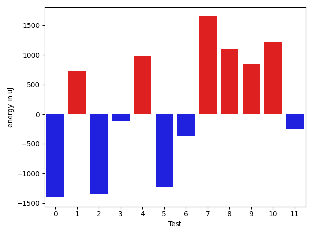

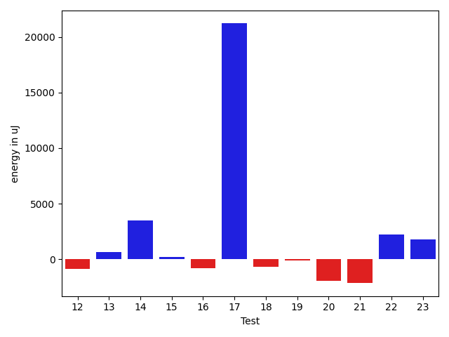

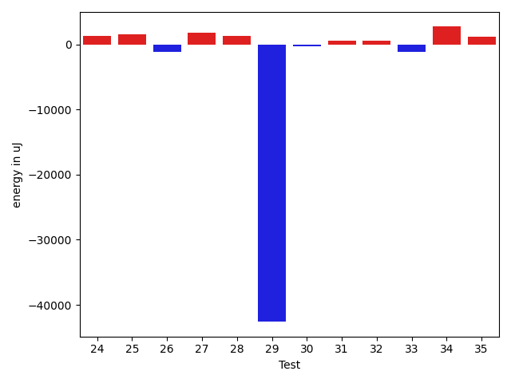

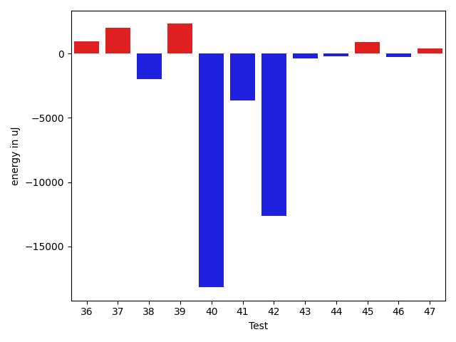

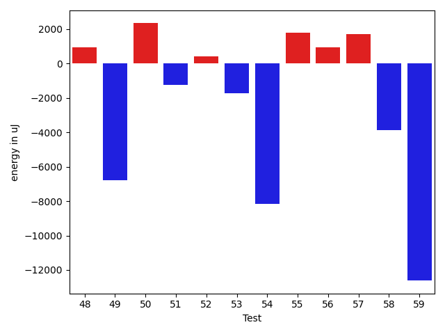

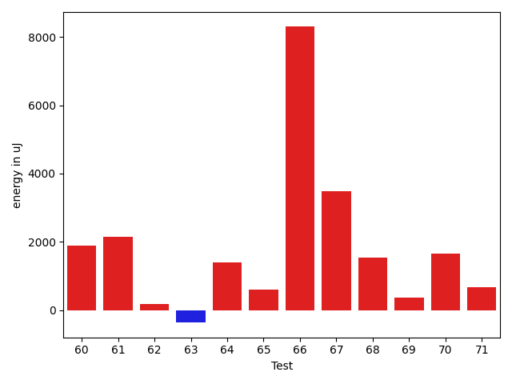

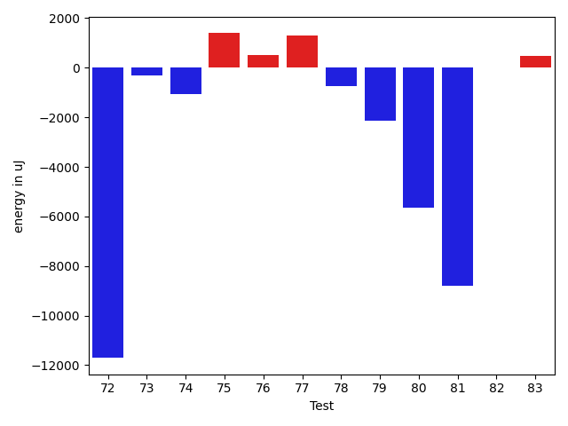

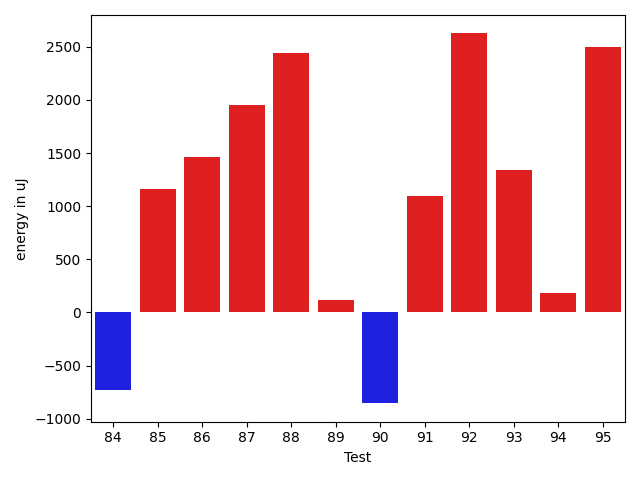

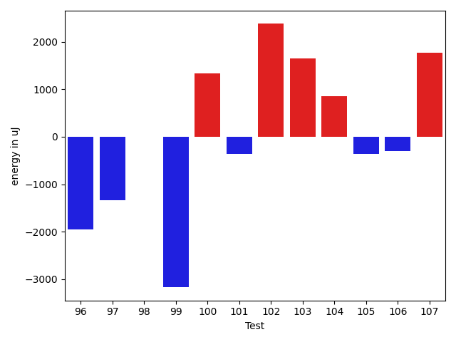

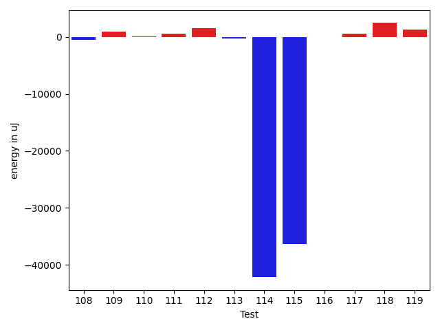

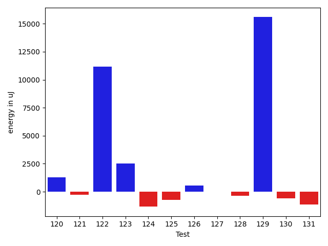

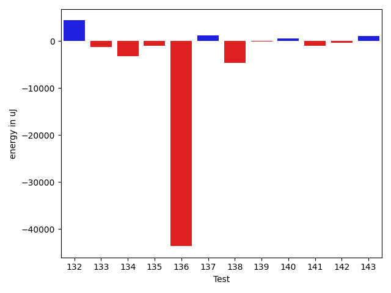

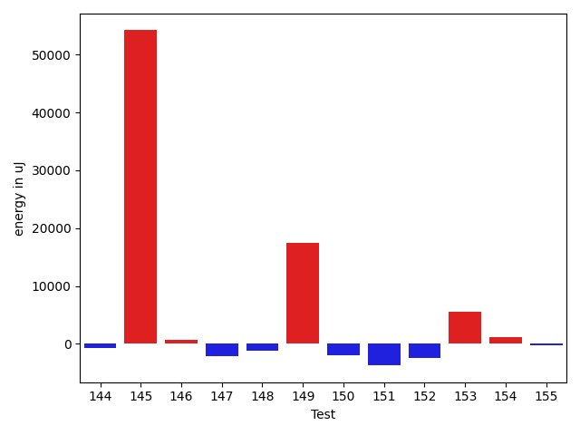

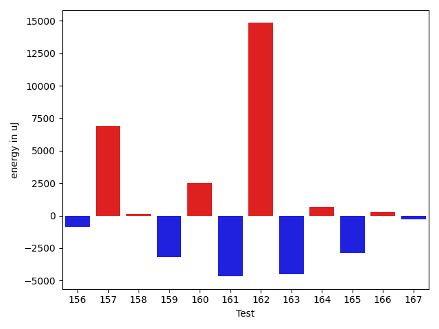

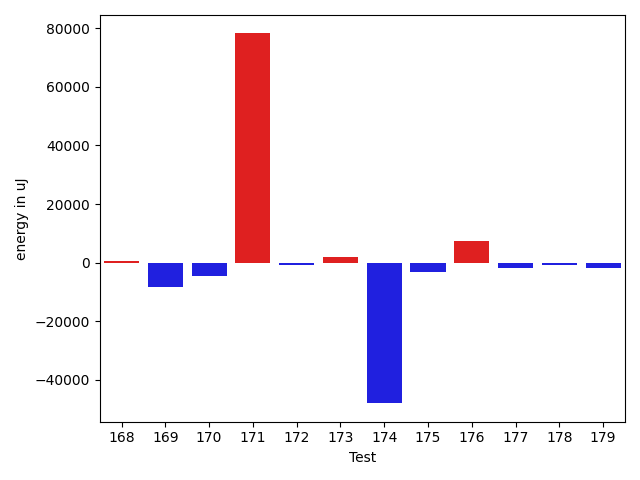

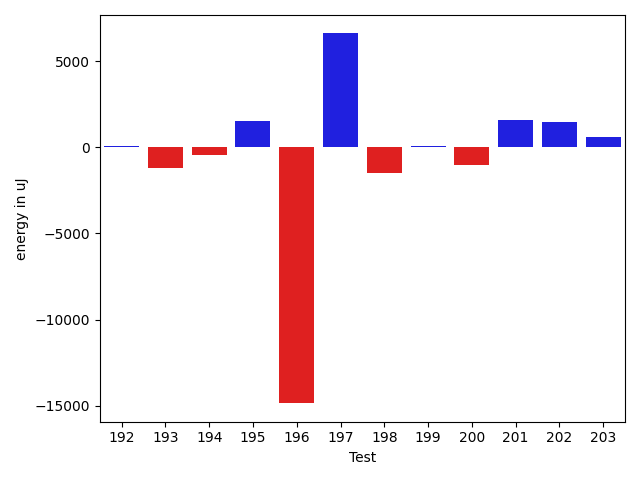

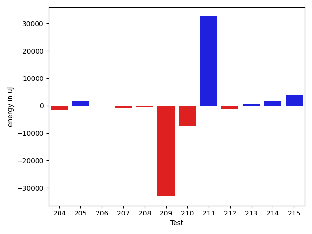

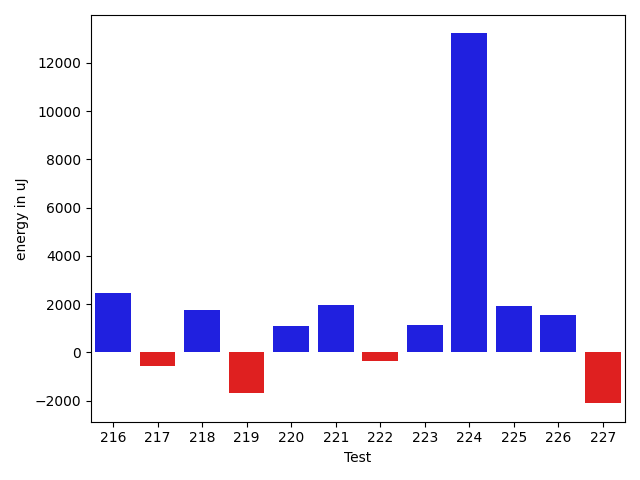

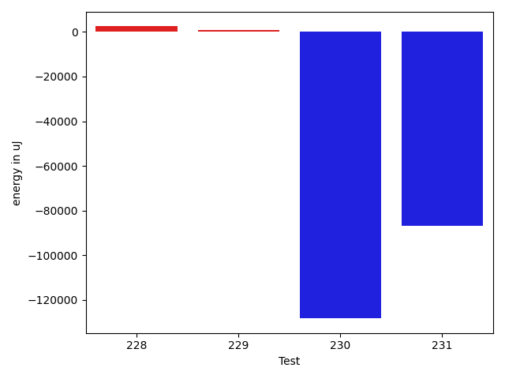

| ID | EnergyV1 | EnergyV2 | DeltaEnergy | σV1 | σV2 |
| --- | --- | --- | --- | --- | --- |
| 0 | 42815.12903225807 | 43390.637931034486 | 575.5088987764175 | 11539.427871270476 | 11573.374819547393 |
| 1 | 49490.57142857143 | 48492.42307692308 | -998.1483516483495 | 18169.641633836392 | 15731.261231585679 |
| 2 | 57588.47872340425 | 45779.463917525776 | -11809.014805878476 | 43343.21879590824 | 15528.283694475725 |
| 3 | 42265.78571428572 | 44351.02702702703 | 2085.2413127413092 | 14604.112495059991 | 19423.629460832024 |
| 4 | 43700.301204819276 | 45313.43037974684 | 1613.1291749275624 | 14489.489270464788 | 15350.452792302161 |
| 5 | 39294.87234042553 | 37347.307692307695 | -1947.5646481178337 | 5797.266694972657 | 4610.030180410949 |
| 6 | 42778.25862068965 | 49324.89473684211 | 6546.636116152455 | 13348.880259847116 | 22124.308331489472 |
| 7 | 38479.72727272727 | 50901.2 | 12421.472727272725 | 5025.774140716892 | 38893.19269435205 |
| 8 | 38543.67647058824 | 39444.8 | 901.123529411765 | 4136.389365565579 | 3877.3842419858265 |
| 9 | 45698.846153846156 | 44954.37209302326 | -744.4740608228967 | 16842.873468284415 | 14288.544133078856 |
| 10 | 39425.55 | 39395.075 | -30.47500000000582 | 8362.295871798604 | 4531.414323296315 |
| 11 | 80998.15384615384 | 45644.3870967742 | -35353.76674937965 | 107927.14730697966 | 19618.734360673534 |
| 12 | 41470.07058823529 | 40569.72151898734 | -900.3490692479536 | 10009.10620184056 | 9992.803177295638 |
| 13 | 38123.96428571428 | 38749.15 | 625.1857142857189 | 4057.069394298433 | 4706.175729205897 |
| 14 | 49765.397959183676 | 53262.78350515464 | 3497.3855459709666 | 18857.60458240989 | 20222.436225422356 |
| 15 | 37990.64 | 38210.565217391304 | 219.9252173913046 | 4003.586018026007 | 6220.114809691755 |
| 16 | 38234.74 | 37439.63043478261 | -795.1095652173899 | 3405.678868067276 | 4198.881980380096 |
| 17 | 89416.8686868687 | 110630.51515151515 | 21213.64646464646 | 62451.53982762429 | 98631.12049893803 |
| 18 | 50748.25806451613 | 50059.447916666664 | -688.8101478494646 | 18453.884377010425 | 18767.305736900198 |
| 19 | 76548.35353535354 | 76459.0202020202 | -89.33333333334303 | 35750.05990171237 | 38005.59092920909 |
| 20 | 51003.56989247312 | 49068.26315789474 | -1935.3067345783784 | 19800.306505935358 | 20140.067127996906 |
| 21 | 62439.34693877551 | 60291.91836734694 | -2147.4285714285725 | 36894.87318903177 | 25981.340414775335 |
| 22 | 39384.555555555555 | 41635.068493150684 | 2250.512937595129 | 8322.386993807208 | 10307.881646410407 |
| 23 | 74603.898989899 | 76400.39393939394 | 1796.4949494949396 | 32126.840421752433 | 38981.89562452262 |
| 24 | 49803.857142857145 | 55582.54022988506 | 5778.6830870279155 | 33353.253614810616 | 48630.30887646916 |
| 25 | 48793.242105263154 | 50227.926315789475 | 1434.6842105263204 | 18644.927937767497 | 18799.66154636111 |
| 26 | 38365.36842105263 | 38465.87096774193 | 100.50254668929847 | 4445.709033622686 | 3366.5876735941156 |
| 27 | 36751.681818181816 | 36583.46153846154 | -168.22027972027718 | 3500.90558916045 | 3972.0014934419805 |
| 28 | 36490.86956521739 | 37556.17647058824 | 1065.306905370846 | 3250.7048239654096 | 4985.597772116071 |
| 29 | 110234.71717171717 | 70299.23469387754 | -39935.48247783963 | 68232.38359127042 | 40994.92956447102 |
| 30 | 37571.730769230766 | 37114.291666666664 | -457.43910256410163 | 3959.3418019208534 | 3719.52727147737 |
| 31 | 43573.983606557376 | 42152.2 | -1421.7836065573792 | 14021.496585882976 | 15700.93009644121 |
| 32 | 37466.35 | 37606.32142857143 | 139.971428571429 | 3945.4441102998785 | 4364.533488845641 |
| 33 | 47654.179487179485 | 38612.03658536585 | -9042.142901813633 | 23101.72514522959 | 6175.326233004 |
| 34 | 40085.0 | 43031.943396226416 | 2946.9433962264156 | 10852.88757828465 | 15735.78064975403 |
| 35 | 44120.485714285714 | 48862.49411764706 | 4742.008403361346 | 13606.693944780953 | 27418.604914792708 |
| 36 | 94265.44897959183 | 73100.8 | -21164.64897959183 | 108299.31249919554 | 88835.55405508702 |
| 37 | 39348.26666666667 | 47080.46153846154 | 7732.194871794869 | 9271.404810611079 | 25087.00450161209 |
| 38 | 37599.35294117647 | 36784.90909090909 | -814.4438502673802 | 4219.108791330176 | 3571.5916990135943 |
| 39 | 40476.86538461538 | 42581.22448979592 | 2104.3591051805342 | 9364.882487309142 | 10347.891953841607 |
| 40 | 250995.05050505052 | 224791.32323232322 | -26203.727272727294 | 100631.76631172509 | 85036.29611611765 |
| 41 | 131867.0303030303 | 122889.36363636363 | -8977.666666666672 | 34351.06632501746 | 27782.140383926733 |
| 42 | 122705.0505050505 | 105539.33333333333 | -17165.717171717173 | 43843.616932280114 | 28175.931311900393 |
| 43 | 41506.89743589744 | 41454.3125 | -52.58493589743739 | 3414.192586120712 | 3125.6556255998116 |
| 44 | 46339.86046511628 | 40415.13513513513 | -5924.725329981149 | 18593.496550690244 | 2962.6707834195286 |
| 45 | 49271.417721518985 | 49732.973333333335 | 461.5556118143504 | 23029.206025551146 | 32503.21256531353 |
| 46 | 56746.010416666664 | 53809.12631578947 | -2936.8841008771924 | 27864.534738211143 | 22681.849407211328 |
| 47 | 42192.35365853659 | 43907.0625 | 1714.7088414634127 | 14011.299059193088 | 16566.587776563818 |
| 48 | 37069.28125 | 38001.346153846156 | 932.0649038461561 | 4885.523354989559 | 4409.22538061966 |
| 49 | 85740.59595959596 | 78950.9696969697 | -6789.626262626261 | 69695.14250118866 | 57319.60453747405 |
| 50 | 44948.88888888889 | 47292.68965517241 | 2343.8007662835225 | 14357.343258141418 | 16726.94939436409 |
| 51 | 41931.045454545456 | 40692.96428571428 | -1238.0811688311733 | 9383.445402363996 | 6300.23103024316 |
| 52 | 38025.82456140351 | 38452.07575757576 | 426.25119617224846 | 4812.49850170059 | 3805.7406053049453 |
| 53 | 41435.75409836065 | 39724.61666666667 | -1711.1374316939837 | 9658.754029301543 | 4158.569870727462 |
| 54 | 69817.49333333333 | 61672.51807228916 | -8144.975261044172 | 92418.34538263107 | 72006.07507207859 |
| 55 | 39043.981132075474 | 40832.4375 | 1788.4563679245257 | 5132.30234660844 | 7419.825604156324 |
| 56 | 44378.43661971831 | 45314.71929824561 | 936.2826785272991 | 15664.798594509482 | 15897.154852753827 |
| 57 | 41732.09090909091 | 43462.5625 | 1730.4715909090883 | 10827.086971592906 | 13197.576136211292 |
| 58 | 70003.94736842105 | 66124.38461538461 | -3879.5627530364436 | 93744.70387425047 | 69947.85948764515 |
| 59 | 57805.90625 | 45188.514285714286 | -12617.391964285714 | 48927.91313590802 | 18779.378269598095 |
| 60 | 37760.29761904762 | 40268.57142857143 | 2508.273809523809 | 6371.9593454068845 | 9307.424186260836 |
| 61 | 41020.055555555555 | 43171.05 | 2150.994444444448 | 11503.006449872246 | 27685.358444747762 |
| 62 | 84534.101010101 | 84912.60606060606 | 378.50505050506035 | 27501.75110696395 | 30591.840902343654 |
| 63 | 38468.89655172414 | 38463.15151515151 | -5.745036572625395 | 5705.169484894152 | 4867.1165013434 |
| 64 | 36977.934782608696 | 37718.295454545456 | 740.3606719367599 | 4189.513364924038 | 3485.76559074412 |
| 65 | 41998.41791044776 | 42098.52857142857 | 100.1106609808121 | 12639.50508920257 | 10495.969506327421 |
| 66 | 283026.2643678161 | 282108.96341463417 | -917.3009531819262 | 230340.56302241219 | 241363.36224610097 |
| 67 | 36142.791666666664 | 38592.05882352941 | 2449.2671568627484 | 3457.751412637586 | 3138.0726094885295 |
| 68 | 37737.74074074074 | 38610.7 | 872.9592592592599 | 3289.1880073354655 | 3294.0738622562794 |
| 69 | 37004.50943396227 | 37565.264150943396 | 560.7547169811296 | 5113.063607804831 | 4080.765314602861 |
| 70 | 36303.137931034486 | 37551.8 | 1248.6620689655174 | 4297.401795023545 | 4170.297142890419 |
| 71 | 52427.2 | 54947.18556701031 | 2519.9855670103134 | 18715.163341441676 | 20589.572438058538 |
| 72 | 65276.880952380954 | 53561.09523809524 | -11715.785714285717 | 75844.54991381176 | 64507.00907720157 |
| 73 | 37740.40909090909 | 37444.21951219512 | -296.1895787139656 | 6306.5144757341695 | 7085.315307069608 |
| 74 | 37374.31578947369 | 36301.24137931035 | -1073.074410163339 | 4133.756855740582 | 4079.096592470145 |
| 75 | 35902.375 | 37294.13888888889 | 1391.7638888888905 | 4130.394537374729 | 3954.787999324207 |
| 76 | 37032.954545454544 | 37536.61111111111 | 503.65656565656536 | 4262.134057629653 | 4820.040123609955 |
| 77 | 35568.89473684211 | 36868.43243243243 | 1299.5376955903266 | 4088.9250858068704 | 3242.601220913089 |
| 78 | 37982.05 | 37233.62962962963 | -748.4203703703752 | 3990.5373006025147 | 4328.469690644234 |
| 79 | 39488.517857142855 | 37358.84444444445 | -2129.6734126984084 | 20573.489256279612 | 3937.6774652384765 |
| 80 | 44723.829268292684 | 39077.06060606061 | -5646.768662232076 | 34891.82614037097 | 8627.462170967683 |
| 81 | 44605.76470588235 | 35814.28125 | -8791.48345588235 | 39764.759495177925 | 4388.88294610923 |
| 82 | 37000.121212121216 | 37024.61538461538 | 24.494172494167287 | 3763.4556473472685 | 3561.659801887134 |
| 83 | 37114.32786885246 | 37596.53968253968 | 482.2118136872232 | 5322.161747165697 | 4684.682662171548 |
| 84 | 39248.55 | 37799.0 | -1449.550000000003 | 8703.209600342852 | 3569.1873444805333 |
| 85 | 46008.2 | 45224.71428571428 | -783.4857142857145 | 35926.92087700889 | 42890.537462789376 |
| 86 | 36422.31428571429 | 37396.97619047619 | 974.6619047619024 | 4421.6983406277495 | 4273.012679196723 |
| 87 | 35852.5641025641 | 37654.03703703704 | 1801.4729344729349 | 3409.244910720771 | 5133.336121799253 |
| 88 | 36939.15151515151 | 37976.55172413793 | 1037.4002089864152 | 4760.333787133204 | 3824.7735798318554 |
| 89 | 36951.55172413793 | 38056.71428571428 | 1105.162561576355 | 4510.48202627985 | 3158.907950886963 |
| 90 | 41342.76 | 41649.94736842105 | 307.18736842105136 | 12999.835979826821 | 15001.556096386113 |
| 91 | 36413.92857142857 | 37610.291666666664 | 1196.3630952380918 | 3528.694972533567 | 4479.715062359498 |
| 92 | 35714.45 | 38100.52 | 2386.0699999999997 | 3649.6960760452366 | 4240.120640925208 |
| 93 | 49170.93103448276 | 45149.38461538462 | -4021.546419098144 | 65445.65336528497 | 40617.18144889021 |
| 94 | 36440.07142857143 | 37188.0 | 747.9285714285725 | 3986.996622311904 | 4087.2287717055997 |
| 95 | 158531.36363636365 | 151400.66666666666 | -7130.69696969699 | 105403.66567921272 | 96983.20194005485 |
| 96 | 39226.730769230766 | 38150.8064516129 | -1075.9243176178643 | 4683.102583985341 | 3851.610986112886 |
| 97 | 39565.90909090909 | 37882.88372093023 | -1683.025369978859 | 5602.123480586227 | 3989.2509771349564 |
| 98 | 39100.520833333336 | 39319.91525423729 | 219.3944209039546 | 4066.505655912207 | 5080.425510299261 |
| 99 | 46731.02222222222 | 40841.67391304348 | -5889.348309178742 | 19522.375643790994 | 14052.683324228816 |
| 100 | 37882.444444444445 | 38265.205882352944 | 382.7614379084989 | 4395.674113669056 | 6968.1691231054865 |
| 101 | 41777.19565217391 | 39466.94117647059 | -2310.2544757033247 | 10700.088775778748 | 5297.104778627235 |
| 102 | 47984.52 | 58470.260869565216 | 10485.74086956522 | 26776.81390923125 | 44223.781619825706 |
| 103 | 46231.086021505376 | 48354.15730337079 | 2123.0712818654138 | 16567.611604986265 | 16785.442588642218 |
| 104 | 56542.083333333336 | 55269.51282051282 | -1272.5705128205154 | 69039.14280797323 | 60850.55645148172 |
| 105 | 41431.15873015873 | 41590.32835820896 | 159.16962805022922 | 9361.016047156536 | 10648.049159686778 |
| 106 | 39426.80597014925 | 39473.60655737705 | 46.800587227793585 | 4308.870590807128 | 4691.188193291229 |
| 107 | 51544.663265306124 | 54086.5625 | 2541.8992346938758 | 43997.174128397935 | 41861.745770007736 |
| 108 | 38439.291666666664 | 38349.23684210526 | -90.05482456140453 | 4325.690089253261 | 4504.875495879935 |
| 109 | 38348.14035087719 | 38962.51515151515 | 614.374800637961 | 6721.596156612084 | 5846.448479677898 |
| 110 | 41201.24657534246 | 44771.40298507463 | 3570.156409732168 | 13341.145227977811 | 21767.239442041227 |
| 111 | 42183.19672131148 | 43708.56140350877 | 1525.3646821972943 | 12030.893931083128 | 14261.382916897293 |
| 112 | 37450.62962962963 | 38400.94545454546 | 950.3158249158296 | 4293.027612891397 | 6320.5797272033415 |
| 113 | 44060.602739726026 | 57933.35365853659 | 13872.750918810561 | 13041.294965471445 | 47179.60399041093 |
| 114 | 88804.0303030303 | 46379.805555555555 | -42424.22474747475 | 29273.69016588743 | 27315.896259035937 |
| 115 | 120840.06060606061 | 107812.01204819277 | -13028.048557867834 | 143851.88729375825 | 167124.24048495942 |
| 116 | 38398.45614035088 | 38108.36956521739 | -290.0865751334859 | 4005.069476455337 | 4044.438609716976 |
| 117 | 37386.0 | 37465.11320754717 | 79.11320754716871 | 4004.7743273914116 | 4223.799825786744 |
| 118 | 36983.89189189189 | 38868.0 | 1884.1081081081065 | 4128.837646679385 | 4657.140013145495 |
| 119 | 38489.06060606061 | 39200.16129032258 | 711.1006842619754 | 4371.187696166201 | 3536.958563117645 |
| 120 | 38291.06060606061 | 39587.88888888889 | 1296.8282828282827 | 3812.54072557995 | 3902.4089552891546 |
| 121 | 38017.25 | 37757.333333333336 | -259.91666666666424 | 4653.451364757847 | 3497.4086506785666 |
| 122 | 38145.39024390244 | 49328.48 | 11183.089756097565 | 4361.887227929341 | 50690.20426324598 |
| 123 | 39929.90476190476 | 42439.7037037037 | 2509.7989417989374 | 7235.422539441842 | 14123.70004457917 |
| 124 | 39946.28 | 38608.5 | -1337.7799999999988 | 4689.05425449525 | 4770.171799841176 |
| 125 | 38062.892857142855 | 37323.34920634921 | -739.5436507936465 | 7002.500672409238 | 4460.977503950601 |
| 126 | 38465.28125 | 39015.16129032258 | 549.8800403225832 | 3995.8642700482756 | 4173.2193351352535 |
| 127 | 39313.17857142857 | 39319.137931034486 | 5.9593596059130505 | 9070.237156505618 | 6484.253764121725 |
| 128 | 37951.58181818182 | 37592.107142857145 | -359.4746753246727 | 4564.036716810755 | 6213.331446743514 |
| 129 | 194424.8282828283 | 210012.70707070708 | 15587.878787878784 | 111233.83235147827 | 162186.60167920013 |
| 130 | 38872.608695652176 | 38265.61111111111 | -606.9975845410663 | 4082.9325537149466 | 7697.060666535049 |
| 131 | 39014.88888888889 | 37868.617647058825 | -1146.2712418300653 | 6164.779855777009 | 7540.210408262164 |
| 132 | 42116.09375 | 46478.083333333336 | 4361.989583333336 | 10688.743498885215 | 24189.59762466204 |
| 133 | 38638.88 | 37385.18 | -1253.699999999997 | 4245.994440128248 | 4026.9468468804007 |
| 134 | 56223.970588235294 | 52978.4358974359 | -3245.5346907993953 | 40572.08903949299 | 37203.75738040783 |
| 135 | 39014.333333333336 | 37960.933333333334 | -1053.4000000000015 | 6536.004305600501 | 6656.640365162527 |
| 136 | 142409.34939759035 | 98806.86746987952 | -43602.48192771083 | 400997.76484863466 | 289255.8516034929 |
| 137 | 38383.07894736842 | 39554.22857142857 | 1171.1496240601482 | 5257.767028439569 | 6007.9391954585 |
| 138 | 47306.40350877193 | 42686.929824561405 | -4619.473684210527 | 29423.33712564077 | 9667.171766343436 |
| 139 | 38558.82142857143 | 38450.98275862069 | -107.83866995073913 | 4022.9663012470523 | 4067.8038279225507 |
| 140 | 80050.18181818182 | 80541.64646464646 | 491.46464646463573 | 19491.156888595175 | 20199.15452041642 |
| 141 | 41664.704545454544 | 40630.37777777778 | -1034.3267676767646 | 7866.790594239541 | 7821.7175871313275 |
| 142 | 38793.885714285716 | 38403.86842105263 | -390.01729323308246 | 3794.0842280840207 | 4300.397228721114 |
| 143 | 40161.0 | 41254.72972972973 | 1093.7297297297264 | 8076.120167366659 | 9408.177040439408 |
| 144 | 42276.041666666664 | 41525.39240506329 | -750.649261603372 | 14173.483504454423 | 12615.151397033209 |
| 145 | 127473.76767676767 | 181694.9595959596 | 54221.19191919193 | 244362.45429006318 | 415318.85365770955 |
| 146 | 42887.81690140845 | 43626.65753424657 | 738.8406328381243 | 12313.823527559724 | 12806.81474650158 |
| 147 | 45058.388059701494 | 42915.17543859649 | -2143.2126211050054 | 18170.747152723678 | 13869.118554471775 |
| 148 | 38911.28571428572 | 37658.59090909091 | -1252.6948051948057 | 4490.99421745614 | 4755.104249493771 |
| 149 | 50363.77419354839 | 67829.15789473684 | 17465.383701188453 | 35332.65319211356 | 60774.71883003495 |
| 150 | 39547.23529411765 | 37594.42105263158 | -1952.8142414860704 | 5101.551465623118 | 4871.350113467296 |
| 151 | 46746.48717948718 | 42993.303797468354 | -3753.183382018826 | 23163.668989275153 | 15133.358500433533 |
| 152 | 40523.13333333333 | 38022.48148148148 | -2500.6518518518496 | 12589.142086381864 | 5480.721927105011 |
| 153 | 105757.0101010101 | 111329.09090909091 | 5572.080808080806 | 211206.16506691425 | 261415.64097916425 |
| 154 | 45834.692307692305 | 46931.14444444444 | 1096.4521367521374 | 15170.86290235426 | 17634.551076767897 |
| 155 | 38034.1724137931 | 37820.92857142857 | -213.24384236452897 | 4447.702231791971 | 4062.522500408648 |
| 156 | 41137.57777777778 | 40296.9 | -840.6777777777752 | 9851.675425448966 | 10264.505559938092 |
| 157 | 56378.1 | 63245.153846153844 | 6867.053846153845 | 57746.927152360244 | 80538.10344760961 |
| 158 | 38277.642857142855 | 38434.34210526316 | 156.69924812030513 | 3673.2486421061526 | 4513.660926776773 |
| 159 | 40862.96428571428 | 37650.709677419356 | -3212.2546082949266 | 4512.9001799772595 | 4686.854548721785 |
| 160 | 62969.61956521739 | 65458.96385542169 | 2489.3442902042952 | 59924.79496143884 | 72323.68829897551 |
| 161 | 296569.0505050505 | 291892.83838383836 | -4676.2121212121565 | 89448.17804428378 | 78785.48354082597 |
| 162 | 432840.51515151514 | 447671.38383838383 | 14830.868686868693 | 126261.18532256004 | 156715.40716890374 |
| 163 | 60913.54878048781 | 56399.10227272727 | -4514.446507760535 | 36225.92247715428 | 37546.218264366515 |
| 164 | 38613.64864864865 | 39277.68421052631 | 664.0355618776666 | 3644.04887094692 | 4959.335997072185 |
| 165 | 46546.205128205125 | 43687.71232876712 | -2858.492799438005 | 15422.819349129104 | 13613.891879081728 |
| 166 | 53191.967741935485 | 53486.079365079364 | 294.1116231438791 | 39166.96348964213 | 48685.46776113675 |
| 167 | 48246.28125 | 47958.978494623654 | -287.3027553763459 | 20352.636970172895 | 20366.925288809987 |
| 168 | 41430.98795180723 | 41945.75903614458 | 514.7710843373497 | 10372.61801890535 | 11580.177077521554 |
| 169 | 54089.72727272727 | 45810.42857142857 | -8279.2987012987 | 38292.218259214686 | 23129.734691253052 |
| 170 | 47011.104651162794 | 42411.53164556962 | -4599.573005593171 | 24095.165359914143 | 12859.166634252764 |
| 171 | 82117.43076923076 | 160330.86764705883 | 78213.43687782806 | 217735.42113159475 | 423964.85932038754 |
| 172 | 39800.829268292684 | 39010.67391304348 | -790.1553552492041 | 7330.743634798817 | 3957.561013588545 |
| 173 | 40851.0 | 42652.9375 | 1801.9375 | 9007.312511396844 | 14331.541238727388 |
| 174 | 98480.0 | 50524.74285714285 | -47955.25714285715 | 223381.7295501134 | 31442.981612838597 |
| 175 | 41460.975 | 38153.88461538462 | -3307.0903846153815 | 19020.002278506036 | 3980.7872271982656 |
| 176 | 38117.242424242424 | 45651.92857142857 | 7534.686147186148 | 4559.25041706122 | 41884.00789077972 |
| 177 | 44451.8 | 42534.857142857145 | -1916.942857142858 | 20532.144039529823 | 8155.031035739689 |
| 178 | 37958.666666666664 | 37142.230769230766 | -816.4358974358984 | 4193.504924947097 | 4355.776467985157 |
| 179 | 63560.05434782609 | 61918.560975609755 | -1641.4933722163332 | 46576.72437386748 | 45122.084509315326 |
| 180 | 90721.64912280702 | 116889.28571428571 | 26167.636591478687 | 262607.195703145 | 322827.9126326097 |
| 181 | 38638.76470588235 | 41513.36842105263 | 2874.603715170284 | 4866.209728434161 | 8387.54841046835 |
| 182 | 38395.275862068964 | 38363.68085106383 | -31.595011005134438 | 5644.419562697496 | 7398.110834491504 |
| 183 | 38149.142857142855 | 38844.0 | 694.8571428571449 | 3684.3023444481487 | 4360.923785525022 |
| 184 | 37716.954545454544 | 36407.4 | -1309.5545454545427 | 4020.1836850534887 | 4736.143836498211 |
| 185 | 37470.4 | 37955.5 | 485.09999999999854 | 4075.891343007073 | 3947.424980575657 |
| 186 | 43405.83606557377 | 45210.71666666667 | 1804.8806010928965 | 12620.544858701724 | 18032.7355681195 |
| 187 | 43960.15094339623 | 41545.0 | -2415.1509433962274 | 20099.543641112592 | 14111.623073998564 |
| 188 | 38462.782608695656 | 37703.5 | -759.2826086956557 | 4732.197356652217 | 4102.208941213065 |
| 189 | 39380.291666666664 | 48110.9 | 8730.608333333337 | 3809.917633396277 | 38727.24599154967 |
| 190 | 44463.066666666666 | 85162.76056338029 | 40699.69389671362 | 20268.4739853684 | 245742.60135997587 |
| 191 | 110675.87878787878 | 114092.16129032258 | 3416.2825024437916 | 302731.0843158427 | 311350.8656830018 |
| 192 | 39266.89189189189 | 39320.7 | 53.808108108103625 | 4061.916727583931 | 4558.055814708723 |
| 193 | 38312.25806451613 | 37087.36111111111 | -1224.8969534050193 | 3765.8331723258534 | 3923.0516406433303 |
| 194 | 38437.170731707316 | 37973.56756756757 | -463.6031641397494 | 3879.6484747878712 | 4305.474733158593 |
| 195 | 53399.55714285714 | 54944.64615384615 | 1545.0890109890097 | 32760.993189041885 | 37459.9894514876 |
| 196 | 68005.03278688525 | 53155.260869565216 | -14849.771917320031 | 84383.55223444816 | 45997.840991126875 |
| 197 | 38011.52173913043 | 44612.21428571428 | 6600.69254658385 | 4133.637116964284 | 38157.045198904285 |
| 198 | 38590.11111111111 | 37097.0 | -1493.1111111111095 | 3997.8342871677814 | 3738.645744116444 |
| 199 | 42283.5393258427 | 42373.586956521736 | 90.04763067903696 | 17517.07024273474 | 19035.096718129 |
| 200 | 35999.47727272727 | 34962.02272727273 | -1037.4545454545441 | 3778.128489854085 | 3745.8526792891917 |
| 201 | 36843.372881355936 | 38421.876923076925 | 1578.5040417209893 | 8738.986538802214 | 20018.307083196614 |
| 202 | 43177.27906976744 | 44655.29268292683 | 1478.01361315939 | 11960.375088085717 | 18020.849923439164 |
| 203 | 59626.19672131148 | 60205.10526315789 | 578.9085418464165 | 27497.053561272063 | 26872.13232137881 |
| 204 | 36857.59375 | 35210.416666666664 | -1647.1770833333358 | 4499.932255457958 | 3269.619858765439 |
| 205 | 34678.58823529412 | 36293.65909090909 | 1615.0708556149693 | 4539.476538348285 | 3899.5119271704534 |
| 206 | 36446.0 | 36238.46666666667 | -207.53333333333285 | 4231.45981114477 | 3737.2251803830186 |
| 207 | 35626.857142857145 | 34738.40625 | -888.4508928571449 | 4475.665135838836 | 4008.049774043598 |
| 208 | 36513.117647058825 | 36129.333333333336 | -383.7843137254895 | 3551.477155517007 | 4444.3587588962455 |
| 209 | 183964.45454545456 | 150742.80808080808 | -33221.646464646474 | 308447.9438799408 | 228994.66773619346 |
| 210 | 73781.90476190476 | 66479.35 | -7302.5547619047575 | 74300.07627641717 | 77434.29908188293 |
| 211 | 125239.52525252526 | 157873.32653061225 | 32633.80127808699 | 154485.94770852424 | 305451.1906226448 |
| 212 | 42785.48888888889 | 41710.42307692308 | -1075.065811965811 | 10510.685935164 | 10216.079686805488 |
| 213 | 45776.31578947369 | 46504.666666666664 | 728.3508771929774 | 18846.151843846787 | 21006.879048963412 |
| 214 | 61097.36170212766 | 62564.0 | 1466.6382978723414 | 61844.728982270164 | 60245.74751984151 |
| 215 | 48103.30909090909 | 52236.16129032258 | 4132.8521994134935 | 38047.88546119349 | 46611.12626076058 |
| 216 | 36955.976744186046 | 39419.239130434784 | 2463.262386248738 | 4300.498729803389 | 3774.608970158266 |
| 217 | 38224.454545454544 | 37677.030303030304 | -547.4242424242402 | 5253.893584132479 | 4040.509527461353 |
| 218 | 46584.9375 | 48356.54081632653 | 1771.603316326531 | 15977.765620550967 | 19935.042886359366 |
| 219 | 39098.85106382979 | 37415.63265306123 | -1683.2184107685607 | 6533.631090988928 | 4515.573436108969 |
| 220 | 37833.275862068964 | 38942.913043478264 | 1109.6371814093 | 4080.790828499923 | 3976.1657619309085 |
| 221 | 37078.857142857145 | 39033.0 | 1954.142857142855 | 4692.894375803592 | 4084.476260499092 |
| 222 | 40576.166666666664 | 40207.92307692308 | -368.2435897435862 | 4401.055570983954 | 5421.572699184654 |
| 223 | 38090.71052631579 | 39207.69047619047 | 1116.979949874687 | 4400.914455858457 | 4503.85608059041 |
| 224 | 50659.170731707316 | 63873.09375 | 13213.923018292684 | 36494.68018626386 | 55517.06999110689 |
| 225 | 37719.5 | 39626.95 | 1907.449999999997 | 3984.7460835039415 | 4195.979069001656 |
| 226 | 40081.58139534884 | 41628.4 | 1546.8186046511619 | 3684.7614370574875 | 19534.77842618134 |
| 227 | 39616.64864864865 | 37510.958333333336 | -2105.6903153153107 | 3524.301166811665 | 4283.924850328713 |
| 228 | 38588.433333333334 | 41027.71428571428 | 2439.2809523809483 | 2954.244163722574 | 7854.995519036383 |
| 229 | 39615.23529411765 | 40354.825 | 739.5897058823466 | 4653.220911003202 | 4495.7174282171045 |
| 230 | 271785.95238095237 | 143521.25 | -128264.70238095237 | 479613.7107819639 | 348744.6040899474 |
| 231 | 125806.21428571429 | 38919.933333333334 | -86886.28095238096 | 309637.4327677865 | 4629.515604130619 |

## Delta Duration per test method

| ID | DurationV1 | DurationsV2 | DeltaDuration |
| --- | --- | --- | --- |
| 0 | 997846.3064516129 | 989776.8793103448 | -8069.427141268039 |
| 1 | 1066887.6785714286 | 1021925.1153846154 | -44962.56318681326 |
| 2 | 1635687.9042553192 | 1432494.06185567 | -203193.8423996491 |
| 3 | 1134496.5285714285 | 1287482.7837837837 | 152986.25521235517 |
| 4 | 1199490.4337349397 | 1196114.8987341772 | -3375.5350007624365 |
| 5 | 752370.8723404255 | 717582.358974359 | -34788.5133660665 |
| 6 | 994731.9137931034 | 1242101.8245614036 | 247369.91076830018 |
| 7 | 724377.1212121212 | 1046007.3 | 321630.17878787883 |
| 8 | 603213.0588235294 | 600634.4333333333 | -2578.625490196049 |
| 9 | 1085355.6346153845 | 1034952.3255813953 | -50403.30903398921 |
| 10 | 830414.8 | 746164.9 | -84249.90000000002 |
| 11 | 2027049.641025641 | 885999.8709677419 | -1141049.770057899 |
| 12 | 1109222.8705882353 | 1174214.0253164556 | 64991.15472822031 |
| 13 | 814541.9464285715 | 871449.8666666667 | 56907.92023809522 |
| 14 | 1558748.6734693877 | 1504349.092783505 | -54399.580685882596 |
| 15 | 959794.92 | 1094021.1594202898 | 134226.23942028976 |
| 16 | 697749.84 | 768039.5652173914 | 70289.72521739139 |
| 17 | 2617858.777777778 | 3250020.6666666665 | 632161.8888888885 |
| 18 | 1506172.0107526882 | 1517912.9270833333 | 11740.916330645094 |
| 19 | 2287906.8585858587 | 2348613.1818181816 | 60706.32323232293 |
| 20 | 1496250.3010752688 | 1514540.4315789475 | 18290.130503678694 |
| 21 | 1885801.2959183673 | 1831372.142857143 | -54429.15306122438 |
| 22 | 1071910.736111111 | 1131501.5616438356 | 59590.825532724615 |
| 23 | 2253400.232323232 | 2345458.8282828284 | 92058.59595959634 |
| 24 | 1442405.0 | 1687791.0229885057 | 245386.02298850566 |
| 25 | 1467796.2105263157 | 1498433.6210526316 | 30637.410526315914 |
| 26 | 576822.3157894737 | 606350.0322580645 | 29527.716468590777 |
| 27 | 490897.36363636365 | 462486.76923076925 | -28410.5944055944 |
| 28 | 545787.7826086957 | 456114.79411764705 | -89672.98849104863 |
| 29 | 3197737.232323232 | 2111173.1938775512 | -1086564.0384456809 |
| 30 | 491600.92307692306 | 444400.875 | -47200.04807692306 |
| 31 | 1023138.8524590164 | 961116.9333333333 | -62021.91912568302 |
| 32 | 558430.05 | 552032.4642857143 | -6397.585714285728 |
| 33 | 1315073.782051282 | 1024746.4146341464 | -290327.3674171356 |
| 34 | 976354.7868852459 | 1025793.1698113207 | 49438.38292607479 |
| 35 | 1224500.5142857144 | 1410041.294117647 | 185540.77983193262 |
| 36 | 2764111.1836734693 | 1886253.142857143 | -877858.0408163264 |
| 37 | 913906.8166666667 | 1044309.2115384615 | 130402.39487179485 |
| 38 | 720250.3823529412 | 452488.4090909091 | -267761.9732620321 |
| 39 | 930553.7692307692 | 853215.7142857143 | -77338.05494505493 |
| 40 | 6812572.404040404 | 6100028.929292929 | -712543.4747474743 |
| 41 | 3649759.909090909 | 3429169.0707070706 | -220590.83838383853 |
| 42 | 3462909.98989899 | 3041725.878787879 | -421184.111111111 |
| 43 | 717543.2307692308 | 652774.875 | -64768.35576923075 |
| 44 | 871874.2325581395 | 665649.1351351351 | -206225.09742300434 |
| 45 | 1477550.4683544303 | 1338100.9733333334 | -139449.4950210969 |
| 46 | 1743997.375 | 1734748.6631578947 | -9248.711842105258 |
| 47 | 1216483.7073170731 | 1171890.575 | -44593.13231707318 |
| 48 | 577112.21875 | 558815.6923076923 | -18296.526442307746 |
| 49 | 2543085.585858586 | 2264956.3434343436 | -278129.2424242422 |
| 50 | 1198871.6296296297 | 1282350.051724138 | 83478.4220945083 |
| 51 | 1044797.0303030303 | 934129.375 | -110667.65530303027 |
| 52 | 862231.4561403509 | 831979.9545454546 | -30251.501594896312 |
| 53 | 979567.1147540984 | 984209.4833333333 | 4642.368579234928 |
| 54 | 2042788.7333333334 | 1768916.156626506 | -273872.5767068274 |
| 55 | 844832.3962264151 | 861522.125 | 16689.72877358494 |
| 56 | 1217671.7605633803 | 1107410.754385965 | -110261.00617741537 |
| 57 | 1181351.831168831 | 1221836.515625 | 40484.68445616891 |
| 58 | 1607015.7894736843 | 1511573.2051282052 | -95442.58434547903 |
| 59 | 1307082.8125 | 980123.1714285715 | -326959.64107142854 |
| 60 | 1163989.0 | 1094679.8333333333 | -69309.16666666674 |
| 61 | 1075035.888888889 | 1105189.4833333334 | 30153.594444444403 |
| 62 | 2364528.6767676766 | 2356756.7474747472 | -7771.929292929359 |
| 63 | 714879.6206896552 | 671894.7272727273 | -42984.893416927895 |
| 64 | 741222.8913043478 | 695976.75 | -45246.14130434778 |
| 65 | 1208370.4925373134 | 1120276.5142857144 | -88093.97825159901 |
| 66 | 7967425.586206896 | 7702246.682926829 | -265178.90328006726 |
| 67 | 500761.0416666667 | 447362.70588235295 | -53398.335784313735 |
| 68 | 524612.4444444445 | 486491.8 | -38120.64444444451 |
| 69 | 877962.0943396227 | 716074.8301886793 | -161887.26415094337 |
| 70 | 505879.7586206897 | 455031.0 | -50848.75862068968 |
| 71 | 1675264.5368421052 | 1666021.7525773195 | -9242.784264785703 |
| 72 | 1549891.6666666667 | 1097563.5 | -452328.16666666674 |
| 73 | 811507.9090909091 | 824841.5609756098 | 13333.651884700754 |
| 74 | 584851.052631579 | 558826.5862068966 | -26024.46642468241 |
| 75 | 679875.375 | 684680.3888888889 | 4805.013888888876 |
| 76 | 742313.7045454546 | 724744.6944444445 | -17569.01010101009 |
| 77 | 650924.8157894737 | 634898.8648648649 | -16025.950924608856 |
| 78 | 498314.5 | 478803.9259259259 | -19510.574074074102 |
| 79 | 865961.8928571428 | 735664.7555555556 | -130297.13730158727 |
| 80 | 986088.6829268293 | 769023.696969697 | -217064.9859571323 |
| 81 | 819693.0 | 563112.5 | -256580.5 |
| 82 | 569854.0303030303 | 566035.6153846154 | -3818.414918414899 |
| 83 | 898551.1967213114 | 781733.3968253968 | -116817.79989591462 |
| 84 | 564890.45 | 452358.3 | -112532.14999999997 |
| 85 | 830675.4 | 776337.1428571428 | -54338.25714285718 |
| 86 | 662579.2 | 744936.6428571428 | 82357.44285714289 |
| 87 | 570765.9743589744 | 566930.1481481482 | -3835.8262108261697 |
| 88 | 611834.0909090909 | 525675.448275862 | -86158.64263322891 |
| 89 | 493679.8620689655 | 490688.1904761905 | -2991.671592775034 |
| 90 | 816927.24 | 824161.7368421053 | 7234.496842105291 |
| 91 | 500079.9285714286 | 461299.5833333333 | -38780.345238095266 |
| 92 | 506226.75 | 470463.04 | -35763.71000000002 |
| 93 | 1024692.275862069 | 689710.4615384615 | -334981.8143236075 |
| 94 | 534544.3928571428 | 485638.70967741933 | -48905.683179723506 |
| 95 | 4476925.686868687 | 4251998.818181818 | -224926.8686868688 |
| 96 | 610647.2692307692 | 600095.1935483871 | -10552.0756823821 |
| 97 | 932182.0454545454 | 799542.7906976744 | -132639.25475687103 |
| 98 | 873058.2083333334 | 820491.6610169491 | -52566.54731638427 |
| 99 | 945114.5333333333 | 802404.804347826 | -142709.72898550727 |
| 100 | 836302.6296296297 | 624434.6176470588 | -211868.01198257087 |
| 101 | 863661.8695652174 | 822765.9019607843 | -40895.96760443307 |
| 102 | 1142667.26 | 1489838.0 | 347170.74 |
| 103 | 1391992.247311828 | 1401965.8426966292 | 9973.595384801272 |
| 104 | 1615162.25 | 1531262.2307692308 | -83900.01923076925 |
| 105 | 1026157.5238095238 | 1065744.7611940298 | 39587.237384506036 |
| 106 | 911355.1343283582 | 964353.3606557377 | 52998.22632737947 |
| 107 | 1576548.530612245 | 1632403.6979166667 | 55855.167304421775 |
| 108 | 789335.9583333334 | 854139.447368421 | 64803.48903508764 |
| 109 | 916343.0877192982 | 907858.0 | -8485.0877192982 |
| 110 | 1023121.1506849315 | 1129949.4925373134 | 106828.34185238183 |
| 111 | 952347.7704918033 | 1048077.7719298246 | 95730.00143802131 |
| 112 | 828876.8148148148 | 877290.509090909 | 48413.694276094204 |
| 113 | 1191964.5616438356 | 1678852.4390243902 | 486887.87738055456 |
| 114 | 2566736.4646464647 | 966821.4444444445 | -1599915.0202020202 |
| 115 | 3370877.0505050505 | 2982219.313253012 | -388657.73725203844 |
| 116 | 875771.9824561403 | 785185.2391304348 | -90586.74332570552 |
| 117 | 1135441.7333333334 | 812294.5660377359 | -323147.1672955975 |
| 118 | 707277.4864864865 | 686364.775510204 | -20912.710976282484 |
| 119 | 630574.4242424242 | 578852.9354838709 | -51721.488758553285 |
| 120 | 573186.9393939395 | 513496.3888888889 | -59690.550505050574 |
| 121 | 551379.7916666666 | 507857.6666666667 | -43522.12499999994 |
| 122 | 600479.8780487805 | 830893.64 | 230413.76195121952 |
| 123 | 708475.8333333334 | 721164.5555555555 | 12688.722222222132 |
| 124 | 555267.2 | 588757.6875 | 33490.48750000005 |
| 125 | 916579.4464285715 | 838891.4761904762 | -77687.97023809527 |
| 126 | 598845.34375 | 558131.7096774194 | -40713.63407258061 |
| 127 | 691993.3928571428 | 641618.9655172414 | -50374.42733990145 |
| 128 | 882163.9272727272 | 932962.4464285715 | 50798.51915584423 |
| 129 | 5319126.696969697 | 5923020.626262627 | 603893.9292929294 |
| 130 | 880070.6521739131 | 934853.9444444445 | 54783.29227053141 |
| 131 | 993855.9365079365 | 1075520.5735294118 | 81664.63702147536 |
| 132 | 812411.53125 | 989891.875 | 177480.34375 |
| 133 | 816946.1 | 852970.98 | 36024.880000000005 |
| 134 | 1299905.5882352942 | 1299701.0 | -204.58823529421352 |
| 135 | 747503.5151515151 | 776495.1555555556 | 28991.64040404046 |
| 136 | 4043569.987951807 | 2779047.2289156625 | -1264522.7590361447 |
| 137 | 672770.7368421053 | 708516.5428571429 | 35745.80601503758 |
| 138 | 1150314.1754385964 | 983022.6140350878 | -167291.56140350865 |
| 139 | 932049.125 | 821225.5862068966 | -110823.53879310342 |
| 140 | 2264193.3232323234 | 2343165.787878788 | 78972.46464646468 |
| 141 | 851410.3863636364 | 928577.2222222222 | 77166.8358585859 |
| 142 | 644518.5714285715 | 652755.8157894737 | 8237.24436090223 |
| 143 | 1109201.8169014084 | 1066224.554054054 | -42977.2628473544 |
| 144 | 1153381.9583333333 | 1074104.0379746836 | -79277.92035864969 |
| 145 | 3649176.02020202 | 5127257.606060606 | 1478081.5858585862 |
| 146 | 1269225.8309859154 | 1172963.7534246575 | -96262.07756125787 |
| 147 | 1105322.134328358 | 1078017.105263158 | -27305.029065200128 |
| 148 | 537593.1904761905 | 554452.0 | 16858.80952380947 |
| 149 | 932893.4193548387 | 1592916.6315789474 | 660023.2122241087 |
| 150 | 423595.64705882355 | 469580.5263157895 | 45984.87925696594 |
| 151 | 1390555.7692307692 | 1213867.6455696202 | -176688.12366114906 |
| 152 | 793242.2 | 591930.3703703703 | -201311.82962962962 |
| 153 | 3161221.3434343436 | 3214943.9292929294 | 53722.58585858578 |
| 154 | 1375525.5604395603 | 1374942.1222222222 | -583.4382173381746 |
| 155 | 866120.5172413794 | 882011.6607142857 | 15891.143472906318 |
| 156 | 735932.8666666667 | 992777.65 | 256844.78333333333 |
| 157 | 1344946.375 | 1650204.5961538462 | 305258.22115384624 |
| 158 | 662749.6428571428 | 692242.2894736842 | 29492.646616541315 |
| 159 | 564471.4642857143 | 638865.7096774194 | 74394.24539170507 |
| 160 | 1823686.0217391304 | 1994367.8795180724 | 170681.85777894198 |
| 161 | 7853464.353535353 | 7590996.898989899 | -262467.4545454541 |
| 162 | 11492631.717171717 | 11755310.010101011 | 262678.2929292936 |
| 163 | 1741928.3780487804 | 1629569.1704545454 | -112359.20759423496 |
| 164 | 762578.5675675676 | 779174.5789473684 | 16596.011379800853 |
| 165 | 1260775.6794871795 | 1239607.8356164384 | -21167.843870741082 |
| 166 | 1328666.5322580645 | 1392477.9523809524 | 63811.42012288794 |
| 167 | 1456689.7708333333 | 1365794.6666666667 | -90895.10416666651 |
| 168 | 1230315.253012048 | 1166664.939759036 | -63650.31325301202 |
| 169 | 1650991.155844156 | 1303226.2738095238 | -347764.88203463214 |
| 170 | 1403876.1511627906 | 1222193.1518987343 | -181682.99926405633 |
| 171 | 2098994.815384615 | 4435925.147058823 | 2336930.331674208 |
| 172 | 842218.756097561 | 871243.5 | 29024.74390243902 |
| 173 | 980669.4745762711 | 1212617.765625 | 231948.29104872886 |
| 174 | 2602851.533333333 | 1027899.1428571428 | -1574952.3904761905 |
| 175 | 765972.375 | 548475.1923076923 | -217497.18269230775 |
| 176 | 668302.3939393939 | 781641.6785714285 | 113339.2846320346 |
| 177 | 797583.5 | 726651.5357142857 | -70931.96428571432 |
| 178 | 489826.0 | 553585.3076923077 | 63759.307692307746 |
| 179 | 1835940.7282608696 | 1832567.4024390243 | -3373.3258218453266 |
| 180 | 2361790.4736842103 | 2874566.595238095 | 512776.1215538848 |
| 181 | 496791.5294117647 | 531221.4210526316 | 34429.891640866874 |
| 182 | 816882.551724138 | 785782.7234042553 | -31099.828319882625 |
| 183 | 641295.0357142857 | 623077.2105263158 | -18217.825187969836 |
| 184 | 554194.1363636364 | 480331.95 | -73862.18636363634 |
| 185 | 426630.92 | 451814.86363636365 | 25183.943636363663 |
| 186 | 1042480.5901639344 | 1133578.9333333333 | 91098.34316939896 |
| 187 | 997337.8301886793 | 914013.0652173914 | -83324.76497128792 |
| 188 | 615869.4782608695 | 588739.1052631579 | -27130.372997711645 |
| 189 | 408547.0416666667 | 677017.4 | 268470.35833333334 |
| 190 | 1028714.6333333333 | 2239715.6338028167 | 1211001.0004694834 |
| 191 | 2950796.1363636362 | 3124857.3870967743 | 174061.25073313806 |
| 192 | 569643.9189189189 | 594624.3333333334 | 24980.414414414437 |
| 193 | 764832.6451612903 | 599105.6944444445 | -165726.9507168458 |
| 194 | 821483.4146341464 | 772298.1621621621 | -49185.25247198425 |
| 195 | 1437819.642857143 | 1470170.353846154 | 32350.710989010986 |
| 196 | 1939273.0983606558 | 1368494.6811594204 | -570778.4172012354 |
| 197 | 494731.26086956525 | 790186.0714285715 | 295454.81055900623 |
| 198 | 597137.4074074074 | 531757.84 | -65379.56740740745 |
| 199 | 1385151.224719101 | 1390042.6739130435 | 4891.449193942361 |
| 200 | 722637.2045454546 | 791749.8636363636 | 69112.65909090906 |
| 201 | 990007.7118644068 | 987946.3692307692 | -2061.3426336375996 |
| 202 | 1054621.9767441861 | 1035676.0975609756 | -18945.87918321055 |
| 203 | 1697349.2950819673 | 1731349.2105263157 | 33999.91544434847 |
| 204 | 777089.90625 | 629377.1944444445 | -147712.7118055555 |
| 205 | 606164.1176470588 | 698735.1136363636 | 92570.99598930485 |
| 206 | 637286.4333333333 | 666829.0 | 29542.56666666665 |
| 207 | 512764.3333333333 | 509545.28125 | -3219.052083333314 |
| 208 | 429363.9411764706 | 399293.3888888889 | -30070.552287581726 |
| 209 | 5338301.575757576 | 4429221.333333333 | -909080.2424242431 |
| 210 | 2018994.357142857 | 1909416.05 | -109578.307142857 |
| 211 | 3614804.121212121 | 4337739.183673469 | 722935.0624613483 |
| 212 | 1016332.4444444445 | 984523.8846153846 | -31808.559829059872 |
| 213 | 1028514.2894736842 | 1051731.6444444444 | 23217.354970760294 |
| 214 | 1804966.0212765958 | 1901981.8775510204 | 97015.85627442459 |
| 215 | 1217531.2727272727 | 1263992.2741935484 | 46461.00146627566 |
| 216 | 717490.2790697674 | 655675.4130434783 | -61814.86602628918 |
| 217 | 596630.3636363636 | 577110.5151515151 | -19519.84848484851 |
| 218 | 1410618.3645833333 | 1503718.857142857 | 93100.49255952379 |
| 219 | 757537.5957446808 | 921555.8367346938 | 164018.240990013 |
| 220 | 584517.4827586206 | 534051.304347826 | -50466.178410794586 |
| 221 | 602846.7857142857 | 599626.2903225806 | -3220.4953917050734 |
| 222 | 594110.3333333334 | 692378.9230769231 | 98268.58974358975 |
| 223 | 750414.447368421 | 724427.8571428572 | -25986.59022556385 |
| 224 | 1074952.024390244 | 1654134.3125 | 579182.2881097561 |
| 225 | 509065.5 | 488222.8 | -20842.70000000001 |
| 226 | 723164.0465116279 | 821972.38 | 98808.33348837215 |
| 227 | 598805.2702702703 | 688639.5 | 89834.2297297297 |
| 228 | 656870.2333333333 | 846939.4857142858 | 190069.25238095247 |
| 229 | 815633.4117647059 | 767395.8 | -48237.611764705856 |
| 230 | 7518587.619047619 | 3813077.5416666665 | -3705510.077380953 |
| 231 | 3068651.9285714286 | 546092.6666666666 | -2522559.261904762 |

## Misc.

| ID | Test Class | Test Method |
| --- | --- | --- |
| 0 | com.google.gson.functional.PrimitiveTest | testDeserializePrimitiveWrapperAsObjectField |
| 1 | com.google.gson.functional.PrimitiveTest | testMoreSpecificSerialization |
| 2 | com.google.gson.functional.CustomDeserializerTest | testDefaultConstructorNotCalledOnObject |
| 3 | com.google.gson.functional.CustomDeserializerTest | testCustomDeserializerReturnsNullForArrayElementsForArrayField |
| 4 | com.google.gson.functional.CustomDeserializerTest | testJsonTypeFieldBasedDeserialization |
| 5 | com.google.gson.functional.CustomDeserializerTest | testDefaultConstructorNotCalledOnField |
| 6 | com.google.gson.functional.CustomDeserializerTest | testCustomDeserializerReturnsNull |
| 7 | com.google.gson.functional.JsonParserTest | testBadTypeForDeserializingCustomTree |
| 8 | com.google.gson.functional.JsonParserTest | testBadFieldTypeForCustomDeserializerCustomTree |
| 9 | com.google.gson.functional.JsonParserTest | testChangingCustomTreeAndDeserializing |
| 10 | com.google.gson.functional.JsonParserTest | testBadFieldTypeForDeserializingCustomTree |
| 11 | com.google.gson.functional.JsonParserTest | testDeserializingCustomTree |
| 12 | com.google.gson.functional.ParameterizedTypesTest | testParameterizedTypeGenericArraysSerialization |
| 13 | com.google.gson.functional.ParameterizedTypesTest | testParameterizedTypesWithWriterSerialization |
| 14 | com.google.gson.functional.ParameterizedTypesTest | testVariableTypeArrayDeserialization |
| 15 | com.google.gson.functional.ParameterizedTypesTest | testParameterizedTypeWithReaderDeserialization |
| 16 | com.google.gson.functional.ParameterizedTypesTest | testDeepParameterizedTypeDeserialization |
| 17 | com.google.gson.functional.ParameterizedTypesTest | testParameterizedTypesSerialization |
| 18 | com.google.gson.functional.ParameterizedTypesTest | testVariableTypeDeserialization |
| 19 | com.google.gson.functional.ParameterizedTypesTest | testVariableTypeFieldsAndGenericArraysSerialization |
| 20 | com.google.gson.functional.ParameterizedTypesTest | testParameterizedTypeGenericArraysDeserialization |
| 21 | com.google.gson.functional.ParameterizedTypesTest | testVariableTypeFieldsAndGenericArraysDeserialization |
| 22 | com.google.gson.functional.ParameterizedTypesTest | testTypesWithMultipleParametersDeserialization |
| 23 | com.google.gson.functional.ParameterizedTypesTest | testTypesWithMultipleParametersSerialization |
| 24 | com.google.gson.functional.ParameterizedTypesTest | testParameterizedTypeDeserialization |
| 25 | com.google.gson.functional.ParameterizedTypesTest | testParameterizedTypeWithVariableTypeDeserialization |
| 26 | com.google.gson.functional.ParameterizedTypesTest | testDeepParameterizedTypeSerialization |
| 27 | com.google.gson.functional.InheritanceTest | testBaseSerializedAsBaseWhenSpecifiedWithExplicitType |
| 28 | com.google.gson.functional.InheritanceTest | testBaseSerializedAsSubWhenSpecifiedWithExplicitType |
| 29 | com.google.gson.functional.InheritanceTest | testSubInterfacesOfCollectionSerialization |
| 30 | com.google.gson.functional.InheritanceTest | testBaseSerializedAsSubForToJsonMethod |
| 31 | com.google.gson.functional.InheritanceTest | testClassWithBaseArrayFieldSerialization |
| 32 | com.google.gson.functional.InheritanceTest | testBaseSerializedAsSub |
| 33 | com.google.gson.functional.InheritanceTest | testSubInterfacesOfCollectionDeserialization |
| 34 | com.google.gson.functional.InheritanceTest | testClassWithBaseCollectionFieldSerialization |
| 35 | com.google.gson.functional.InheritanceTest | testSubClassSerialization |
| 36 | com.google.gson.functional.InheritanceTest | testBaseSerializedAsBaseWhenSpecifiedWithExplicitTypeForToJsonMethod |
| 37 | com.google.gson.functional.InheritanceTest | testSubClassDeserialization |
| 38 | com.google.gson.functional.InheritanceTest | testBaseSerializedAsSubWhenSpecifiedWithExplicitTypeForToJsonMethod |
| 39 | com.google.gson.functional.InheritanceTest | testClassWithBaseFieldSerialization |
| 40 | com.google.gson.functional.CircularReferenceTest | testCircularSerialization |
| 41 | com.google.gson.functional.CircularReferenceTest | testSelfReferenceArrayFieldSerialization |
| 42 | com.google.gson.functional.CircularReferenceTest | testSelfReferenceSerialization |
| 43 | com.google.gson.functional.CircularReferenceTest | testDirectedAcyclicGraphSerialization |
| 44 | com.google.gson.functional.CircularReferenceTest | testDirectedAcyclicGraphDeserialization |
| 45 | com.google.gson.functional.MapTest | testSerializeMaps |
| 46 | com.google.gson.functional.MapTest | testInterfaceTypeMapWithSerializer |
| 47 | com.google.gson.functional.MapTest | testComplexKeysSerialization |
| 48 | com.google.gson.functional.MapTest | testMapSerializationWithNullValuesSerialized |
| 49 | com.google.gson.functional.MapTest | testInterfaceTypeMap |
| 50 | com.google.gson.functional.MapTest | testMapSerializationWithNullValues |
| 51 | com.google.gson.functional.MapTest | testGeneralMapField |
| 52 | com.google.gson.functional.MapTest | testComplexKeysDeserialization |
| 53 | com.google.gson.functional.PrettyPrintingTest | testEmptyMapField |
| 54 | com.google.gson.functional.PrettyPrintingTest | testPrettyPrintList |
| 55 | com.google.gson.functional.PrettyPrintingTest | testPrettyPrintArrayOfObjects |
| 56 | com.google.gson.functional.ReadersWritersTest | testReadWriteTwoObjects |
| 57 | com.google.gson.functional.ReadersWritersTest | testReadWriteTwoStrings |
| 58 | com.google.gson.functional.ReadersWritersTest | testWriterForSerialization |
| 59 | com.google.gson.functional.ReadersWritersTest | testReaderForDeserialization |
| 60 | com.google.gson.functional.ObjectTest | testEmptyCollectionInAnObjectDeserialization |
| 61 | com.google.gson.functional.ObjectTest | testArrayOfArraysDeserialization |
| 62 | com.google.gson.functional.ObjectTest | testSingletonLists |
| 63 | com.google.gson.functional.ObjectTest | testNullFieldsSerialization |
| 64 | com.google.gson.functional.ObjectTest | testStringFieldWithNumberValueDeserialization |
| 65 | com.google.gson.functional.ObjectTest | testArrayOfObjectsAsFields |
| 66 | com.google.gson.functional.ObjectTest | testDateAsMapObjectField |
| 67 | com.google.gson.functional.ObjectTest | testPrimitiveArrayFieldSerialization |
| 68 | com.google.gson.functional.ObjectTest | testStringFieldWithEmptyValueSerialization |
| 69 | com.google.gson.functional.ObjectTest | testInnerClassSerialization |
| 70 | com.google.gson.functional.ObjectTest | testClassWithObjectFieldSerialization |
| 71 | com.google.gson.functional.ObjectTest | testArrayOfArraysSerialization |
| 72 | com.google.gson.functional.ObjectTest | testJsonInSingleQuotesDeserialization |
| 73 | com.google.gson.functional.ObjectTest | testNestedDeserialization |
| 74 | com.google.gson.functional.ObjectTest | testJsonInMixedQuotesDeserialization |
| 75 | com.google.gson.functional.ObjectTest | testNullFieldsDeserialization |
| 76 | com.google.gson.functional.ObjectTest | testArrayOfObjectsSerialization |
| 77 | com.google.gson.functional.ObjectTest | testClassWithTransientFieldsSerialization |
| 78 | com.google.gson.functional.ObjectTest | testNullArraysDeserialization |
| 79 | com.google.gson.functional.ObjectTest | testArrayOfObjectsDeserialization |
| 80 | com.google.gson.functional.ObjectTest | testNestedSerialization |
| 81 | com.google.gson.functional.ObjectTest | testBagOfPrimitivesSerialization |
| 82 | com.google.gson.functional.ObjectTest | testBagOfPrimitivesDeserialization |
| 83 | com.google.gson.functional.ObjectTest | testInnerClassDeserialization |
| 84 | com.google.gson.functional.ObjectTest | testStringFieldWithEmptyValueDeserialization |
| 85 | com.google.gson.functional.ObjectTest | testClassWithTransientFieldsDeserialization |
| 86 | com.google.gson.functional.ObjectTest | testPrimitiveArrayInAnObjectDeserialization |
| 87 | com.google.gson.functional.ObjectTest | testBagOfPrimitiveWrappersDeserialization |
| 88 | com.google.gson.functional.ObjectTest | testNullPrimitiveFieldsDeserialization |
| 89 | com.google.gson.functional.ObjectTest | testEmptyCollectionInAnObjectSerialization |
| 90 | com.google.gson.functional.ObjectTest | testBagOfPrimitiveWrappersSerialization |
| 91 | com.google.gson.functional.ObjectTest | testObjectFieldNamesWithoutQuotesDeserialization |
| 92 | com.google.gson.functional.ObjectTest | testPrivateNoArgConstructorDeserialization |
| 93 | com.google.gson.functional.ObjectTest | testClassWithTransientFieldsDeserializationTransientFieldsPassedInJsonAreIgnored |
| 94 | com.google.gson.functional.ObjectTest | testNullObjectFieldsDeserialization |
| 95 | com.google.gson.functional.ExposeFieldsTest | testNullExposeFieldSerialization |
| 96 | com.google.gson.functional.ExposeFieldsTest | testExposeAnnotationSerialization |
| 97 | com.google.gson.functional.ExposeFieldsTest | testArrayWithOneNullExposeFieldObjectSerialization |
| 98 | com.google.gson.functional.ExposeFieldsTest | testExposedInterfaceFieldSerialization |
| 99 | com.google.gson.functional.ExposeFieldsTest | testExposeAnnotationDeserialization |
| 100 | com.google.gson.functional.ExposeFieldsTest | testExposedInterfaceFieldDeserialization |
| 101 | com.google.gson.functional.CollectionTest | testRawCollectionSerialization |
| 102 | com.google.gson.functional.CollectionTest | testCollectionOfBagOfPrimitivesSerialization |
| 103 | com.google.gson.functional.CollectionTest | testWildcardCollectionField |
| 104 | com.google.gson.functional.CollectionTest | testSetSerialization |
| 105 | com.google.gson.functional.CollectionTest | testSetDeserialization |
| 106 | com.google.gson.functional.CollectionTest | testFieldIsArrayList |
| 107 | com.google.gson.functional.MoreSpecificTypeSerializationTest | testSubclassFields |
| 108 | com.google.gson.functional.MoreSpecificTypeSerializationTest | testParameterizedSubclassFields |
| 109 | com.google.gson.functional.MoreSpecificTypeSerializationTest | testListOfParameterizedSubclassFields |
| 110 | com.google.gson.functional.MoreSpecificTypeSerializationTest | testListOfSubclassFields |
| 111 | com.google.gson.functional.MoreSpecificTypeSerializationTest | testMapOfSubclassFields |
| 112 | com.google.gson.functional.MoreSpecificTypeSerializationTest | testMapOfParameterizedSubclassFields |
| 113 | com.google.gson.JsonParserTest | testReadWriteTwoObjects |
| 114 | com.google.gson.functional.NamingPolicyTest | testGsonWithNonDefaultFieldNamingPolicySerialization |
| 115 | com.google.gson.functional.NamingPolicyTest | testGsonDuplicateNameUsingSerializedNameFieldNamingPolicySerialization |
| 116 | com.google.gson.functional.NamingPolicyTest | testGsonWithSerializedNameFieldNamingPolicySerialization |
| 117 | com.google.gson.functional.NamingPolicyTest | testDeprecatedNamingStrategy |
| 118 | com.google.gson.functional.NamingPolicyTest | testAtSignInSerializedName |
| 119 | com.google.gson.functional.NamingPolicyTest | testGsonWithLowerCaseDashPolicyDeserialiation |
| 120 | com.google.gson.functional.NamingPolicyTest | testGsonWithUpperCamelCaseSpacesPolicyDeserialiation |
| 121 | com.google.gson.functional.NamingPolicyTest | testGsonWithUpperCamelCaseSpacesPolicySerialiation |
| 122 | com.google.gson.functional.NamingPolicyTest | testGsonWithLowerCaseUnderscorePolicyDeserialiation |
| 123 | com.google.gson.functional.NamingPolicyTest | testGsonWithNonDefaultFieldNamingPolicyDeserialiation |
| 124 | com.google.gson.functional.NamingPolicyTest | testGsonWithLowerCaseUnderscorePolicySerialization |
| 125 | com.google.gson.functional.NamingPolicyTest | testComplexFieldNameStrategy |
| 126 | com.google.gson.functional.NamingPolicyTest | testGsonWithLowerCaseDashPolicySerialization |
| 127 | com.google.gson.functional.NamingPolicyTest | testGsonWithSerializedNameFieldNamingPolicyDeserialization |
| 128 | com.google.gson.functional.VersioningTest | testVersionedGsonMixingSinceAndUntilDeserialization |
| 129 | com.google.gson.functional.VersioningTest | testVersionedUntilSerialization |
| 130 | com.google.gson.functional.VersioningTest | testVersionedClassesSerialization |
| 131 | com.google.gson.functional.VersioningTest | testVersionedGsonMixingSinceAndUntilSerialization |
| 132 | com.google.gson.functional.VersioningTest | testVersionedUntilDeserialization |
| 133 | com.google.gson.functional.VersioningTest | testVersionedClassesDeserialization |
| 134 | com.google.gson.functional.VersioningTest | testVersionedGsonWithUnversionedClassesSerialization |
| 135 | com.google.gson.functional.VersioningTest | testVersionedGsonWithUnversionedClassesDeserialization |
| 136 | com.google.gson.functional.FieldExclusionTest | testDefaultInnerClassExclusion |
| 137 | com.google.gson.functional.FieldExclusionTest | testDefaultNestedStaticClassIncluded |
| 138 | com.google.gson.functional.CustomTypeAdaptersTest | testCustomNestedSerializers |
| 139 | com.google.gson.functional.CustomTypeAdaptersTest | testCustomNestedDeserializers |
| 140 | com.google.gson.functional.CustomTypeAdaptersTest | testCustomTypeAdapterDoesNotAppliesToSubClasses |
| 141 | com.google.gson.functional.CustomTypeAdaptersTest | testEnsureCustomSerializerNotInvokedForNullValues |
| 142 | com.google.gson.functional.CustomTypeAdaptersTest | testEnsureCustomDeserializerNotInvokedForNullValues |
| 143 | com.google.gson.functional.MapAsArrayTypeAdapterTest | testMultipleEnableComplexKeyRegistrationHasNoEffect |
| 144 | com.google.gson.functional.MapAsArrayTypeAdapterTest | testMapWithTypeVariableDeserialization |
| 145 | com.google.gson.functional.MapAsArrayTypeAdapterTest | testSerializeComplexMapWithTypeAdapter |
| 146 | com.google.gson.functional.MapAsArrayTypeAdapterTest | testMapWithTypeVariableSerialization |
| 147 | com.google.gson.functional.ArrayTest | testObjectArrayWithNonPrimitivesSerialization |
| 148 | com.google.gson.functional.ArrayTest | testSingleNullInArrayDeserialization |
| 149 | com.google.gson.functional.ArrayTest | testSingleNullInArraySerialization |
| 150 | com.google.gson.functional.ArrayTest | testArrayElementsAreArrays |
| 151 | com.google.gson.functional.EnumTest | testClassWithEnumFieldSerialization |
| 152 | com.google.gson.functional.EnumTest | testClassWithEnumFieldDeserialization |
| 153 | com.google.gson.functional.TypeVariableTest | testAdvancedTypeVariables |
| 154 | com.google.gson.functional.TypeVariableTest | testTypeVariablesViaTypeParameter |
| 155 | com.google.gson.functional.TypeVariableTest | testBasicTypeVariables |
| 156 | com.google.gson.functional.UncategorizedTest | testGsonInstanceReusableForSerializationAndDeserialization |
| 157 | com.google.gson.functional.UncategorizedTest | testInvalidJsonDeserializationFails |
| 158 | com.google.gson.functional.UncategorizedTest | testStaticFieldsAreNotSerialized |
| 159 | com.google.gson.functional.UncategorizedTest | testObjectEqualButNotSameSerialization |
| 160 | com.google.gson.functional.ConcurrencyTest | testSingleThreadSerialization |
| 161 | com.google.gson.functional.ConcurrencyTest | testMultiThreadSerialization |
| 162 | com.google.gson.functional.ConcurrencyTest | testMultiThreadDeserialization |
| 163 | com.google.gson.functional.ConcurrencyTest | testSingleThreadDeserialization |
| 164 | com.google.gson.functional.EscapingTest | testGsonDoubleDeserialization |
| 165 | com.google.gson.functional.EscapingTest | testGsonAcceptsEscapedAndNonEscapedJsonDeserialization |
| 166 | com.google.gson.functional.EscapingTest | testEscapingObjectFields |
| 167 | com.google.gson.functional.RawSerializationTest | testThreeLevelParameterizedObject |
| 168 | com.google.gson.functional.RawSerializationTest | testParameterizedObject |
| 169 | com.google.gson.functional.RawSerializationTest | testCollectionOfObjects |
| 170 | com.google.gson.functional.RawSerializationTest | testTwoLevelParameterizedObject |
| 171 | com.google.gson.functional.InstanceCreatorTest | testInstanceCreatorReturnsBaseType |
| 172 | com.google.gson.functional.InstanceCreatorTest | testInstanceCreatorReturnsSubTypeForTopLevelObject |
| 173 | com.google.gson.functional.InstanceCreatorTest | testInstanceCreatorReturnsSubTypeForField |
| 174 | com.google.gson.functional.SecurityTest | testNonExecutableJsonSerialization |
| 175 | com.google.gson.functional.SecurityTest | testJsonWithNonExectuableTokenWithRegularGsonDeserialization |
| 176 | com.google.gson.functional.SecurityTest | testJsonWithNonExectuableTokenWithConfiguredGsonDeserialization |
| 177 | com.google.gson.functional.SecurityTest | testNonExecutableJsonDeserialization |
| 178 | com.google.gson.MixedStreamTest | testWriteClosed |
| 179 | com.google.gson.MixedStreamTest | testWriteHtmlSafe |
| 180 | com.google.gson.MixedStreamTest | testWriteMixedStreamed |
| 181 | com.google.gson.MixedStreamTest | testWriteNulls |
| 182 | com.google.gson.MixedStreamTest | testReadClosed |
| 183 | com.google.gson.MixedStreamTest | testReaderDoesNotMutateState |
| 184 | com.google.gson.MixedStreamTest | testWriteInvalidState |
| 185 | com.google.gson.MixedStreamTest | testReadNulls |
| 186 | com.google.gson.MixedStreamTest | testWriteLenient |
| 187 | com.google.gson.MixedStreamTest | testReadMixedStreamed |
| 188 | com.google.gson.MixedStreamTest | testWriteDoesNotMutateState |
| 189 | com.google.gson.MixedStreamTest | testReadInvalidState |
| 190 | com.google.gson.CommentsTest | testParseComments |
| 191 | com.google.gson.functional.CustomSerializerTest | testSubClassSerializerInvokedForBaseClassFieldsHoldingSubClassInstances |
| 192 | com.google.gson.functional.CustomSerializerTest | testBaseClassSerializerInvokedForBaseClassFields |
| 193 | com.google.gson.functional.CustomSerializerTest | testBaseClassSerializerInvokedForBaseClassFieldsHoldingSubClassInstances |
| 194 | com.google.gson.functional.CustomSerializerTest | testSubClassSerializerInvokedForBaseClassFieldsHoldingArrayOfSubClassInstances |
| 195 | com.google.gson.functional.JsonTreeTest | testJsonTreeToString |
| 196 | com.google.gson.functional.JsonTreeTest | testToJsonTreeObjectType |
| 197 | com.google.gson.functional.JsonTreeTest | testJsonTreeNull |
| 198 | com.google.gson.functional.JsonTreeTest | testToJsonTree |
| 199 | com.google.gson.functional.DefaultTypeAdaptersTest | testUrlNullSerialization |
| 200 | com.google.gson.functional.DefaultTypeAdaptersTest | testBitSetDeserialization |
| 201 | com.google.gson.functional.DefaultTypeAdaptersTest | testBigIntegerFieldSerialization |
| 202 | com.google.gson.functional.DefaultTypeAdaptersTest | testBigDecimalFieldDeserialization |
| 203 | com.google.gson.functional.DefaultTypeAdaptersTest | testBigDecimalFieldSerialization |
| 204 | com.google.gson.functional.DefaultTypeAdaptersTest | testBadValueForBigDecimalDeserialization |
| 205 | com.google.gson.functional.DefaultTypeAdaptersTest | testBigIntegerFieldDeserialization |
| 206 | com.google.gson.functional.DefaultTypeAdaptersTest | testSetSerialization |
| 207 | com.google.gson.functional.DefaultTypeAdaptersTest | testUrlNullDeserialization |
| 208 | com.google.gson.functional.DefaultTypeAdaptersTest | testBitSetSerialization |
| 209 | com.google.gson.functional.TypeHierarchyAdapterTest | testTypeHierarchy |
| 210 | com.google.gson.functional.PrintFormattingTest | testCompactFormattingLeavesNoWhiteSpace |
| 211 | com.google.gson.functional.ExclusionStrategyFunctionalTest | testExclusionStrategySerialization |
| 212 | com.google.gson.functional.ExclusionStrategyFunctionalTest | testExclusionStrategyWithMode |
| 213 | com.google.gson.functional.ExclusionStrategyFunctionalTest | testExclusionStrategyDeserialization |
| 214 | com.google.gson.ObjectTypeAdapterTest | testSerialize |
| 215 | com.google.gson.functional.InterfaceTest | testSerializingObjectImplementingInterface |
| 216 | com.google.gson.functional.InterfaceTest | testSerializingInterfaceObjectField |
| 217 | com.google.gson.functional.NullObjectAndFieldTest | testExplicitSerializationOfNullStringMembers |
| 218 | com.google.gson.functional.NullObjectAndFieldTest | testExplicitSerializationOfNullArrayMembers |
| 219 | com.google.gson.functional.NullObjectAndFieldTest | testPrintPrintingObjectWithNulls |
| 220 | com.google.gson.functional.NullObjectAndFieldTest | testExplicitNullSetsFieldToNullDuringDeserialization |
| 221 | com.google.gson.functional.NullObjectAndFieldTest | testExplicitSerializationOfNullCollectionMembers |
| 222 | com.google.gson.functional.NullObjectAndFieldTest | testExplicitDeserializationOfNulls |
| 223 | com.google.gson.functional.NullObjectAndFieldTest | testNullWrappedPrimitiveMemberSerialization |
| 224 | com.google.gson.functional.NullObjectAndFieldTest | testExplicitSerializationOfNulls |
| 225 | com.google.gson.functional.NullObjectAndFieldTest | testNullWrappedPrimitiveMemberDeserialization |
| 226 | com.google.gson.functional.StreamingTypeAdaptersTest | testSerializeWithCustomTypeAdapter |
| 227 | com.google.gson.functional.StreamingTypeAdaptersTest | testDeserializeWithCustomTypeAdapter |
| 228 | com.google.gson.functional.StreamingTypeAdaptersTest | testSerializeRecursive |
| 229 | com.google.gson.DefaultMapJsonSerializerTest | testNonEmptyMapSerialization |
| 230 | com.google.gson.JsonObjectTest | testWritePropertyWithEmptyStringName |
| 231 | com.google.gson.JsonObjectTest | testPropertyWithQuotes |

| Test | IterationV1 | IterationV2 | DeltaIteration |
| --- | --- | --- | --- |
| 0 | 62 | 58 | -4 |
| 1 | 28 | 26 | -2 |
| 2 | 94 | 97 | 3 |
| 3 | 70 | 74 | 4 |
| 4 | 83 | 79 | -4 |
| 5 | 47 | 39 | -8 |
| 6 | 58 | 57 | -1 |
| 7 | 33 | 30 | -3 |
| 8 | 34 | 30 | -4 |
| 9 | 52 | 43 | -9 |
| 10 | 40 | 40 | 0 |
| 11 | 39 | 31 | -8 |
| 12 | 85 | 79 | -6 |
| 13 | 56 | 60 | 4 |
| 14 | 98 | 97 | -1 |
| 15 | 75 | 69 | -6 |
| 16 | 50 | 46 | -4 |
| 17 | 99 | 99 | 0 |
| 18 | 93 | 96 | 3 |
| 19 | 99 | 99 | 0 |
| 20 | 93 | 95 | 2 |
| 21 | 98 | 98 | 0 |
| 22 | 72 | 73 | 1 |
| 23 | 99 | 99 | 0 |
| 24 | 84 | 87 | 3 |
| 25 | 95 | 95 | 0 |
| 26 | 38 | 31 | -7 |
| 27 | 22 | 26 | 4 |
| 28 | 23 | 34 | 11 |
| 29 | 99 | 98 | -1 |
| 30 | 26 | 24 | -2 |
| 31 | 61 | 45 | -16 |
| 32 | 20 | 28 | 8 |
| 33 | 78 | 82 | 4 |
| 34 | 61 | 53 | -8 |
| 35 | 70 | 85 | 15 |
| 36 | 49 | 35 | -14 |
| 37 | 60 | 52 | -8 |
| 38 | 34 | 22 | -12 |
| 39 | 52 | 49 | -3 |
| 40 | 99 | 99 | 0 |
| 41 | 99 | 99 | 0 |
| 42 | 99 | 99 | 0 |
| 43 | 39 | 32 | -7 |
| 44 | 43 | 37 | -6 |
| 45 | 79 | 75 | -4 |
| 46 | 96 | 95 | -1 |
| 47 | 82 | 80 | -2 |
| 48 | 32 | 26 | -6 |
| 49 | 99 | 99 | 0 |
| 50 | 54 | 58 | 4 |
| 51 | 66 | 56 | -10 |
| 52 | 57 | 66 | 9 |
| 53 | 61 | 60 | -1 |
| 54 | 75 | 83 | 8 |
| 55 | 53 | 48 | -5 |
| 56 | 71 | 57 | -14 |
| 57 | 77 | 64 | -13 |
| 58 | 38 | 39 | 1 |
| 59 | 32 | 35 | 3 |
| 60 | 84 | 84 | 0 |
| 61 | 54 | 60 | 6 |
| 62 | 99 | 99 | 0 |
| 63 | 29 | 33 | 4 |
| 64 | 46 | 44 | -2 |
| 65 | 67 | 70 | 3 |
| 66 | 87 | 82 | -5 |
| 67 | 24 | 17 | -7 |
| 68 | 27 | 30 | 3 |
| 69 | 53 | 53 | 0 |
| 70 | 29 | 20 | -9 |
| 71 | 95 | 97 | 2 |
| 72 | 42 | 42 | 0 |
| 73 | 44 | 41 | -3 |
| 74 | 38 | 29 | -9 |
| 75 | 40 | 36 | -4 |
| 76 | 44 | 36 | -8 |
| 77 | 38 | 37 | -1 |
| 78 | 20 | 27 | 7 |
| 79 | 56 | 45 | -11 |
| 80 | 41 | 33 | -8 |
| 81 | 34 | 32 | -2 |
| 82 | 33 | 26 | -7 |
| 83 | 61 | 63 | 2 |
| 84 | 20 | 20 | 0 |
| 85 | 35 | 28 | -7 |
| 86 | 35 | 42 | 7 |
| 87 | 39 | 27 | -12 |
| 88 | 33 | 29 | -4 |
| 89 | 29 | 21 | -8 |
| 90 | 50 | 38 | -12 |
| 91 | 28 | 24 | -4 |
| 92 | 20 | 25 | 5 |
| 93 | 29 | 26 | -3 |
| 94 | 28 | 31 | 3 |
| 95 | 99 | 99 | 0 |
| 96 | 26 | 31 | 5 |
| 97 | 44 | 43 | -1 |
| 98 | 48 | 59 | 11 |
| 99 | 45 | 46 | 1 |
| 100 | 27 | 34 | 7 |
| 101 | 46 | 51 | 5 |
| 102 | 50 | 46 | -4 |
| 103 | 93 | 89 | -4 |
| 104 | 72 | 78 | 6 |
| 105 | 63 | 67 | 4 |
| 106 | 67 | 61 | -6 |
| 107 | 98 | 96 | -2 |
| 108 | 48 | 38 | -10 |
| 109 | 57 | 66 | 9 |
| 110 | 73 | 67 | -6 |
| 111 | 61 | 57 | -4 |
| 112 | 54 | 55 | 1 |
| 113 | 73 | 82 | 9 |
| 114 | 99 | 36 | -63 |
| 115 | 99 | 83 | -16 |
| 116 | 57 | 46 | -11 |
| 117 | 75 | 53 | -22 |
| 118 | 37 | 49 | 12 |
| 119 | 33 | 31 | -2 |
| 120 | 33 | 18 | -15 |
| 121 | 24 | 21 | -3 |
| 122 | 41 | 25 | -16 |
| 123 | 42 | 27 | -15 |
| 124 | 25 | 32 | 7 |
| 125 | 56 | 63 | 7 |
| 126 | 32 | 31 | -1 |
| 127 | 28 | 29 | 1 |
| 128 | 55 | 56 | 1 |
| 129 | 99 | 99 | 0 |
| 130 | 46 | 54 | 8 |
| 131 | 63 | 68 | 5 |
| 132 | 32 | 48 | 16 |
| 133 | 50 | 50 | 0 |
| 134 | 34 | 39 | 5 |
| 135 | 33 | 45 | 12 |
| 136 | 83 | 83 | 0 |
| 137 | 38 | 35 | -3 |
| 138 | 57 | 57 | 0 |
| 139 | 56 | 58 | 2 |
| 140 | 99 | 99 | 0 |
| 141 | 44 | 45 | 1 |
| 142 | 35 | 38 | 3 |
| 143 | 71 | 74 | 3 |
| 144 | 72 | 79 | 7 |
| 145 | 99 | 99 | 0 |
| 146 | 71 | 73 | 2 |
| 147 | 67 | 57 | -10 |
| 148 | 21 | 22 | 1 |
| 149 | 31 | 19 | -12 |
| 150 | 17 | 19 | 2 |
| 151 | 78 | 79 | 1 |
| 152 | 45 | 27 | -18 |
| 153 | 99 | 99 | 0 |
| 154 | 91 | 90 | -1 |
| 155 | 58 | 56 | -2 |
| 156 | 45 | 40 | -5 |
| 157 | 40 | 52 | 12 |
| 158 | 28 | 38 | 10 |
| 159 | 28 | 31 | 3 |
| 160 | 92 | 83 | -9 |
| 161 | 99 | 99 | 0 |
| 162 | 99 | 99 | 0 |
| 163 | 82 | 88 | 6 |
| 164 | 37 | 38 | 1 |
| 165 | 78 | 73 | -5 |
| 166 | 62 | 63 | 1 |
| 167 | 96 | 93 | -3 |
| 168 | 83 | 83 | 0 |
| 169 | 77 | 84 | 7 |
| 170 | 86 | 79 | -7 |
| 171 | 65 | 68 | 3 |
| 172 | 41 | 46 | 5 |
| 173 | 59 | 64 | 5 |
| 174 | 30 | 35 | 5 |
| 175 | 40 | 26 | -14 |
| 176 | 33 | 28 | -5 |
| 177 | 40 | 28 | -12 |
| 178 | 24 | 13 | -11 |
| 179 | 92 | 82 | -10 |
| 180 | 57 | 42 | -15 |
| 181 | 17 | 19 | 2 |
| 182 | 58 | 47 | -11 |
| 183 | 28 | 38 | 10 |
| 184 | 22 | 20 | -2 |
| 185 | 25 | 22 | -3 |
| 186 | 61 | 60 | -1 |
| 187 | 53 | 46 | -7 |
| 188 | 23 | 38 | 15 |
| 189 | 24 | 20 | -4 |
| 190 | 60 | 71 | 11 |
| 191 | 66 | 62 | -4 |
| 192 | 37 | 30 | -7 |
| 193 | 31 | 36 | 5 |
| 194 | 41 | 37 | -4 |
| 195 | 70 | 65 | -5 |
| 196 | 61 | 69 | 8 |
| 197 | 23 | 28 | 5 |
| 198 | 27 | 25 | -2 |
| 199 | 89 | 92 | 3 |
| 200 | 44 | 44 | 0 |
| 201 | 59 | 65 | 6 |
| 202 | 43 | 41 | -2 |
| 203 | 61 | 57 | -4 |
| 204 | 32 | 36 | 4 |
| 205 | 34 | 44 | 10 |
| 206 | 30 | 30 | 0 |
| 207 | 21 | 32 | 11 |
| 208 | 17 | 18 | 1 |
| 209 | 99 | 99 | 0 |
| 210 | 84 | 80 | -4 |
| 211 | 99 | 98 | -1 |
| 212 | 45 | 52 | 7 |
| 213 | 38 | 45 | 7 |
| 214 | 94 | 98 | 4 |
| 215 | 55 | 62 | 7 |
| 216 | 43 | 46 | 3 |
| 217 | 22 | 33 | 11 |
| 218 | 96 | 98 | 2 |
| 219 | 47 | 49 | 2 |
| 220 | 29 | 23 | -6 |
| 221 | 28 | 31 | 3 |
| 222 | 30 | 26 | -4 |
| 223 | 38 | 42 | 4 |
| 224 | 41 | 32 | -9 |
| 225 | 20 | 20 | 0 |
| 226 | 43 | 50 | 7 |
| 227 | 37 | 24 | -13 |
| 228 | 30 | 35 | 5 |
| 229 | 51 | 40 | -11 |
| 230 | 21 | 24 | 3 |
| 231 | 14 | 15 | 1 |

| Time Label | Time (s) |
| --- | --- |
| Selection | 28.094752311706543 |
| Injection | 16.24431276321411 |
| Total | 1235.6884622573853 |

