# gson f777a1

https://github.com/google/gson/commit/f777a1

## Delta Energy per test method

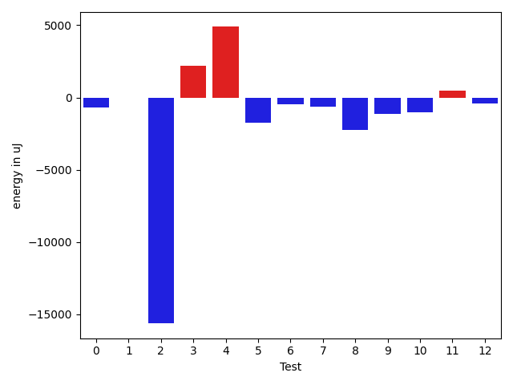

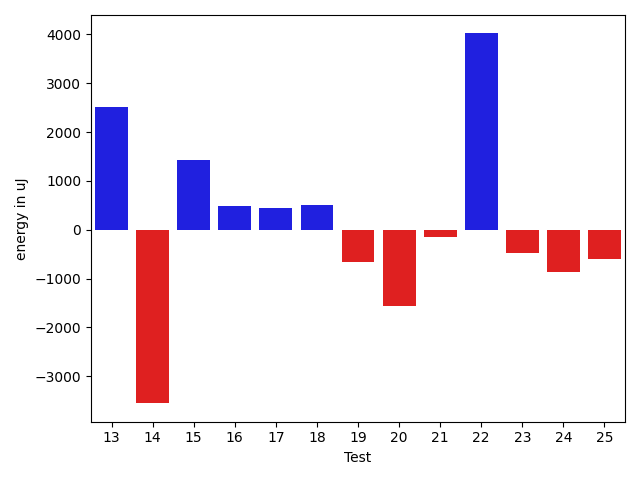

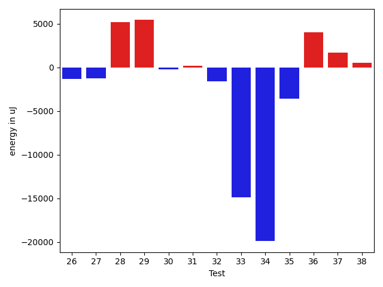

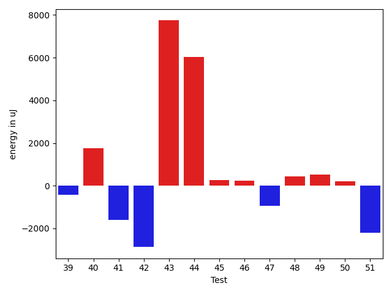

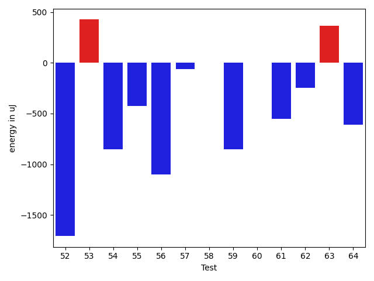

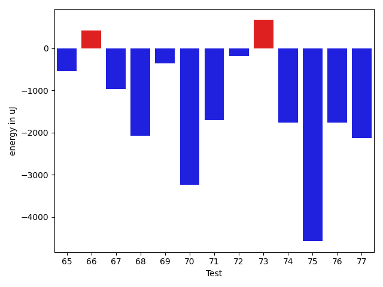

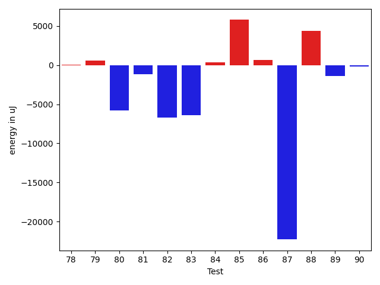

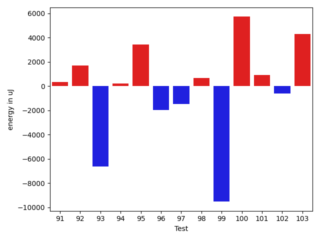

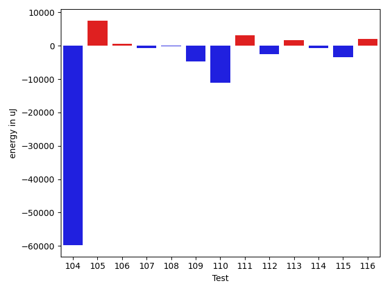

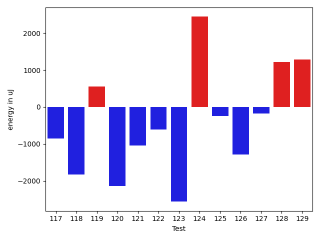

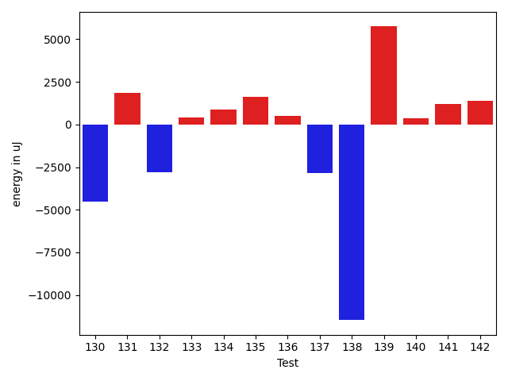

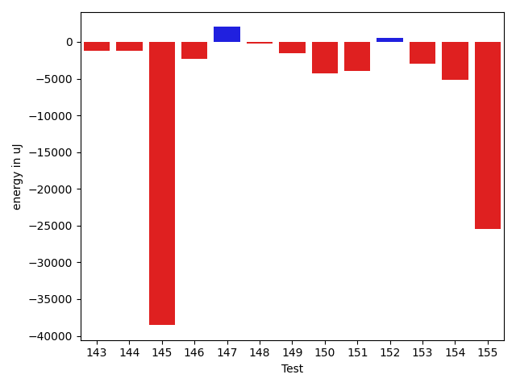

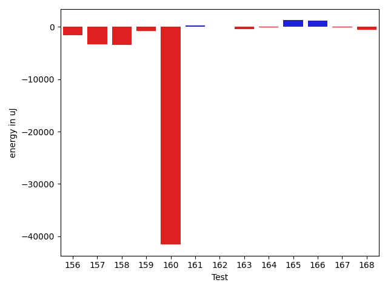

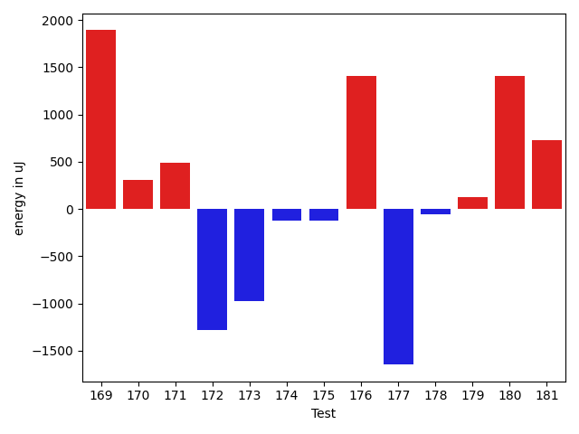

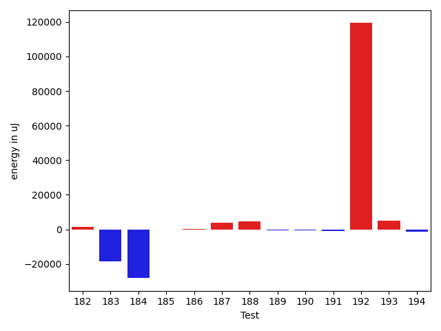

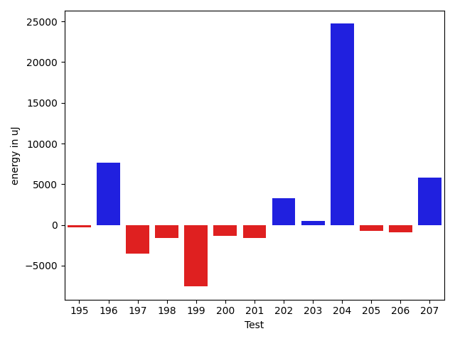

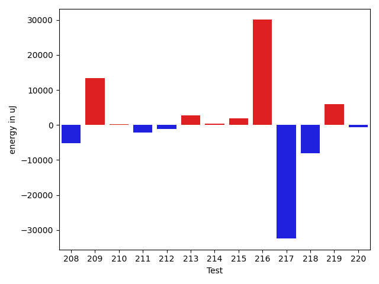

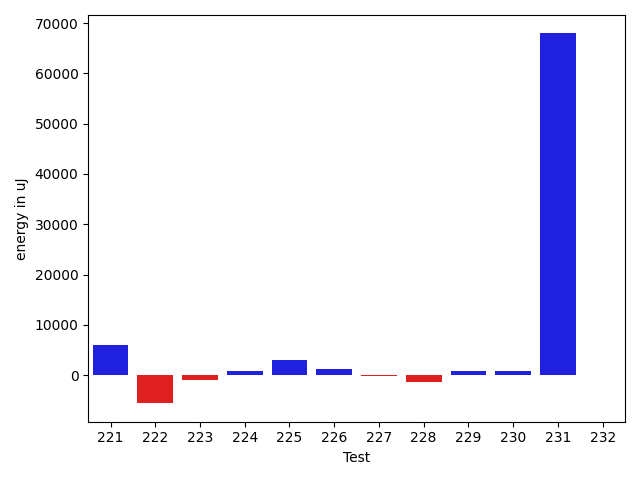

| ID | EnergyV1 | EnergyV2 | DeltaEnergy | σV1 | σV2 |
| --- | --- | --- | --- | --- | --- |
| 0 | 41504 | 40833 | -671 | 66995.60642198462 | 51256.32369433484 |
| 1 | 39551 | 39550 | -1 | 4746.367966993202 | 4258.4914151421635 |
| 2 | 207336 | 191711 | -15625 | 91635.6293378546 | 100471.01280747162 |
| 3 | 117737 | 119934 | 2197 | 31710.529172084698 | 40333.07609083501 |
| 4 | 108947 | 113831 | 4884 | 40408.258657614024 | 37071.381052547105 |
| 5 | 41687 | 39917 | -1770 | 2743.6604448682588 | 3431.1853091090697 |
| 6 | 39123 | 38635 | -488 | 7688.613250257867 | 10519.740877422983 |
| 7 | 40832 | 40222 | -610 | 16307.166811411811 | 23697.164534705804 |
| 8 | 42785 | 40527 | -2258 | 18826.27652188747 | 21113.895381424256 |
| 9 | 38513 | 37354 | -1159 | 3416.0522577009488 | 3987.1316476271763 |
| 10 | 39673 | 38635 | -1038 | 4198.564697011021 | 7454.005772469733 |
| 11 | 38513 | 39001 | 488 | 3800.3957382433723 | 35326.977393001274 |
| 12 | 42969 | 42541 | -428 | 33304.60896512588 | 39356.0496694705 |
| 13 | 40222 | 40649 | 427 | 13436.872479398731 | 17098.991928621308 |
| 14 | 38513 | 38086 | -427 | 22250.706249944058 | 3566.095682451607 |
| 15 | 38452 | 39734 | 1282 | 4456.896232095676 | 3746.0001422317114 |
| 16 | 39306 | 39550 | 244 | 4782.421076404797 | 3746.30155119686 |
| 17 | 38208 | 39184 | 976 | 6903.913645395533 | 6588.563728908235 |
| 18 | 37964 | 39612 | 1648 | 5049.673975732123 | 4310.307589621276 |
| 19 | 40100 | 38147 | -1953 | 4355.286057833119 | 3099.3620490531775 |
| 20 | 38757 | 38086 | -671 | 3975.0756428884083 | 4068.2262862754123 |
| 21 | 40222 | 39855 | -367 | 4417.256642543395 | 2982.546210455087 |
| 22 | 39917 | 39184 | -733 | 4572.033106714002 | 22414.61524543931 |
| 23 | 38818 | 37414 | -1404 | 5166.199548556966 | 3297.405826645481 |
| 24 | 39978 | 38757 | -1221 | 4569.790353847356 | 4335.175229986829 |
| 25 | 39490 | 39550 | 60 | 8809.820315797557 | 8927.997266105862 |
| 26 | 39978 | 39124 | -854 | 4868.154622390296 | 4323.165543165039 |
| 27 | 38513 | 37597 | -916 | 4307.832412251516 | 4672.485568731057 |
| 28 | 40405 | 40100 | -305 | 47274.61564821432 | 52481.23610331815 |
| 29 | 40711 | 40527 | -184 | 62172.73541914795 | 76308.60271649832 |
| 30 | 37598 | 37048 | -550 | 4069.6388372434235 | 3795.5995992017274 |
| 31 | 38941 | 38575 | -366 | 4394.748167265811 | 7728.593355853353 |
| 32 | 38635 | 38391 | -244 | 3916.31143987779 | 3925.5106276126676 |
| 33 | 129211 | 123107 | -6104 | 103958.38816766682 | 91041.97310469966 |
| 34 | 41077 | 39245 | -1832 | 81893.16405311228 | 41947.71950448035 |
| 35 | 38391 | 38635 | 244 | 32640.58433368339 | 27892.455924516755 |
| 36 | 37659 | 39551 | 1892 | 9981.245978375313 | 20818.533057103927 |
| 37 | 38452 | 38636 | 184 | 5837.1270662232755 | 11252.163525883923 |
| 38 | 39307 | 39490 | 183 | 3924.270541557161 | 5984.362790981311 |
| 39 | 40772 | 40893 | 121 | 14655.006316095774 | 14898.785613180022 |
| 40 | 37109 | 38818 | 1709 | 25495.67560265175 | 26535.828568203735 |
| 41 | 39062 | 36254 | -2808 | 2691.2867443169366 | 4151.5341235366095 |
| 42 | 41016 | 40344 | -672 | 15172.50721238897 | 12912.618869648719 |
| 43 | 40405 | 40039 | -366 | 41104.49955863173 | 66917.55833314908 |
| 44 | 37841 | 37781 | -60 | 3607.751158118442 | 40451.239226356716 |
| 45 | 38391 | 39001 | 610 | 3829.764424082209 | 4600.605606448148 |
| 46 | 38696 | 38085 | -611 | 3424.6968655475425 | 3977.593211889191 |
| 47 | 38879 | 37658 | -1221 | 3424.48536190425 | 3582.1171520555813 |
| 48 | 38758 | 39246 | 488 | 6202.2584242706835 | 6423.1266444646535 |
| 49 | 38086 | 38940 | 854 | 3609.4861345463073 | 4394.903549553339 |
| 50 | 39002 | 39062 | 60 | 3181.6319624740822 | 4041.86147759688 |
| 51 | 39428 | 39917 | 489 | 25623.6510663214 | 20854.76614616083 |
| 52 | 43335 | 41626 | -1709 | 81336.13628954274 | 36468.3842512225 |
| 53 | 38758 | 39185 | 427 | 6328.418930947657 | 6499.47890081882 |
| 54 | 39428 | 38574 | -854 | 15249.796597301181 | 11757.311706549312 |
| 55 | 39734 | 39306 | -428 | 18683.803814979306 | 12401.820780976854 |
| 56 | 38635 | 37536 | -1099 | 3701.6127032571803 | 2965.1704940177974 |
| 57 | 36926 | 36865 | -61 | 3487.8945579676 | 3815.774062203759 |
| 58 | 38452 | 38453 | 1 | 10837.397479174413 | 12343.30439544388 |
| 59 | 37598 | 36743 | -855 | 4196.776292172052 | 3948.451859906614 |
| 60 | 38086 | 38086 | 0 | 3230.8617350515647 | 3542.517443391732 |
| 61 | 39673 | 39123 | -550 | 3506.0019189644368 | 3736.5744597603475 |
| 62 | 42236 | 41992 | -244 | 37091.95889810189 | 66348.46794593906 |
| 63 | 37658 | 38025 | 367 | 4064.112779869673 | 4973.5444198432415 |
| 64 | 38391 | 37781 | -610 | 9658.578872157126 | 8448.67042009899 |
| 65 | 38330 | 37781 | -549 | 4002.962205398802 | 4408.232628474308 |
| 66 | 40161 | 40588 | 427 | 21545.722695176628 | 21943.22300334245 |
| 67 | 40161 | 39185 | -976 | 14212.101899339348 | 19190.4154863448 |
| 68 | 39429 | 37354 | -2075 | 3811.6003047803847 | 13958.761048734374 |
| 69 | 41870 | 41504 | -366 | 17821.460951792928 | 16400.75225375803 |
| 70 | 80444 | 77209 | -3235 | 61376.06656759445 | 86772.40842700355 |
| 71 | 42725 | 41016 | -1709 | 18322.45393835375 | 27173.799151506013 |
| 72 | 75684 | 75500 | -184 | 37126.71897577172 | 32526.179892378823 |
| 73 | 40955 | 41625 | 670 | 18810.160526067477 | 18317.197660485017 |
| 74 | 67932 | 66162 | -1770 | 23232.640996636695 | 23810.99148888399 |
| 75 | 76416 | 71838 | -4578 | 30794.712549642318 | 33790.931920803676 |
| 76 | 42908 | 41137 | -1771 | 17593.069571606564 | 19776.13913943187 |
| 77 | 40954 | 38818 | -2136 | 12304.904764919525 | 42722.18628842005 |
| 78 | 38818 | 38941 | 123 | 3792.9117355231706 | 3632.2736552523634 |
| 79 | 38452 | 38696 | 244 | 8211.897086010302 | 8671.5219295967 |
| 80 | 41870 | 42114 | 244 | 39440.53658709 | 33101.31818775098 |
| 81 | 39184 | 37964 | -1220 | 4481.056022010884 | 4249.695975278665 |
| 82 | 40771 | 39307 | -1464 | 35991.4023634761 | 15944.424435274806 |
| 83 | 38330 | 35950 | -2380 | 30219.056552635087 | 4099.12076518036 |
| 84 | 38513 | 38269 | -244 | 11636.290937214924 | 11661.519699144112 |
| 85 | 81665 | 84045 | 2380 | 43249.86920873397 | 40991.7209352591 |
| 86 | 39795 | 39856 | 61 | 13273.251236801641 | 14122.043635558164 |
| 87 | 433471 | 394103 | -39368 | 230319.38548103278 | 234058.4351496561 |
| 88 | 37841 | 37903 | 62 | 11673.397621345795 | 21218.27245200466 |
| 89 | 39063 | 37476 | -1587 | 11395.864999185864 | 10722.66555440722 |
| 90 | 38025 | 37720 | -305 | 4286.498149275572 | 4115.798937727943 |
| 91 | 37475 | 37842 | 367 | 3793.607769949632 | 4074.9216903569227 |
| 92 | 38025 | 38086 | 61 | 4010.3440761828656 | 7524.6696781689725 |
| 93 | 39001 | 37231 | -1770 | 39338.32480644277 | 15222.148441441635 |
| 94 | 41198 | 41138 | -60 | 19378.550145805937 | 23061.052270638822 |
| 95 | 38818 | 37353 | -1465 | 4196.498114941902 | 24484.263017761084 |
| 96 | 38879 | 38146 | -733 | 15208.062965852467 | 3195.447802690919 |
| 97 | 38575 | 37232 | -1343 | 9640.004074043632 | 5617.6897038498755 |
| 98 | 37170 | 37048 | -122 | 4221.487095205041 | 4390.993009828896 |
| 99 | 37414 | 37171 | -243 | 40711.71085728896 | 4225.257273885373 |
| 100 | 36377 | 37780 | 1403 | 3925.0711308713885 | 30963.241036937306 |
| 101 | 37598 | 38513 | 915 | 4176.130634030167 | 3126.725053666294 |
| 102 | 38269 | 37109 | -1160 | 9032.919356557491 | 10163.033675938692 |
| 103 | 38086 | 36682 | -1404 | 15894.471212294458 | 53032.223744636845 |
| 104 | 42663 | 41138 | -1525 | 426424.03263056057 | 261682.27959698078 |
| 105 | 81177 | 83679 | 2502 | 31699.998728092807 | 38809.420539610546 |
| 106 | 38758 | 39185 | 427 | 3583.4738142185556 | 4410.612336897286 |
| 107 | 39063 | 39002 | -61 | 5120.843028478227 | 4630.383224507835 |
| 108 | 39123 | 38574 | -549 | 5150.260882292808 | 6232.366141540646 |
| 109 | 37842 | 37231 | -611 | 28670.459894815896 | 4297.102906481166 |
| 110 | 38574 | 37231 | -1343 | 46670.68156252273 | 4029.577563242751 |
| 111 | 38879 | 37903 | -976 | 3989.362829124471 | 26159.75045393455 |
| 112 | 38574 | 36682 | -1892 | 3562.4808247392652 | 4448.727521718992 |
| 113 | 37475 | 39428 | 1953 | 4508.378188316602 | 4133.417538841195 |
| 114 | 39917 | 39246 | -671 | 3962.1389455992953 | 3657.0754535243746 |
| 115 | 41626 | 36926 | -4700 | 3759.6653574487186 | 4231.452777637368 |
| 116 | 39307 | 40161 | 854 | 4368.959243323573 | 6410.3591667588325 |
| 117 | 38452 | 37597 | -855 | 2801.219595501613 | 4133.575084547496 |
| 118 | 39612 | 37781 | -1831 | 4405.102308187632 | 5014.300236900908 |
| 119 | 37720 | 38269 | 549 | 4221.203027111317 | 4225.596718216257 |
| 120 | 41443 | 39307 | -2136 | 46970.44619846903 | 44037.53986655321 |
| 121 | 38819 | 37780 | -1039 | 18397.465369121775 | 14646.15137603922 |
| 122 | 39307 | 38697 | -610 | 4215.323286181593 | 4405.458032057759 |
| 123 | 38147 | 35584 | -2563 | 3682.6595533394707 | 4841.935205251713 |
| 124 | 37658 | 40100 | 2442 | 25681.70284345202 | 23901.677817071217 |
| 125 | 38086 | 37842 | -244 | 4106.005171967301 | 4062.7187293637376 |
| 126 | 39063 | 37781 | -1282 | 15766.809169086018 | 14621.547979651901 |
| 127 | 38452 | 38269 | -183 | 20350.495441688006 | 12375.84003060066 |
| 128 | 36010 | 37232 | 1222 | 3805.8566468810936 | 4622.425268122244 |
| 129 | 37903 | 39184 | 1281 | 4370.179536033964 | 4216.291681207858 |
| 130 | 39307 | 40832 | 1525 | 33235.95776561333 | 16639.492745795178 |
| 131 | 37597 | 39123 | 1526 | 4157.976584863944 | 4757.818042706132 |
| 132 | 64270 | 57922 | -6348 | 22158.50762487059 | 23060.85695040378 |
| 133 | 38024 | 37780 | -244 | 4669.306025959356 | 4143.946161018899 |
| 134 | 37780 | 38818 | 1038 | 4357.866367540858 | 5062.441047362891 |
| 135 | 35888 | 38147 | 2259 | 3317.4352724210917 | 2901.31807570092 |
| 136 | 35949 | 38635 | 2686 | 5067.685595270981 | 4782.310666317235 |
| 137 | 39794 | 37231 | -2563 | 4854.609304250299 | 4881.701572424776 |
| 138 | 36193 | 34363 | -1830 | 44272.761884756204 | 3606.0310776481097 |
| 139 | 36133 | 38391 | 2258 | 3274.919702819804 | 26604.879427862357 |
| 140 | 39734 | 38819 | -915 | 4027.133884929633 | 3967.2176672102287 |
| 141 | 38147 | 39916 | 1769 | 5093.179138789045 | 4475.606404874989 |
| 142 | 36682 | 39428 | 2746 | 4621.413994805644 | 3442.0846067463244 |
| 143 | 38024 | 35400 | -2624 | 4598.646442225334 | 3761.742030952949 |
| 144 | 39062 | 37597 | -1465 | 3604.5469938872857 | 4134.089263523608 |
| 145 | 41626 | 40344 | -1282 | 285022.81669826683 | 151420.9463984716 |
| 146 | 40832 | 38330 | -2502 | 4570.056143011485 | 4398.933510652539 |
| 147 | 77332 | 79589 | 2257 | 30692.676711873974 | 28992.545630327593 |
| 148 | 40161 | 40405 | 244 | 19838.49055837733 | 19490.344441966357 |
| 149 | 39490 | 39001 | -489 | 16717.611461388165 | 20203.479486397337 |
| 150 | 41382 | 39794 | -1588 | 23812.86256344509 | 18787.20406755276 |
| 151 | 42298 | 39611 | -2687 | 35125.97343745635 | 31482.973014088162 |
| 152 | 38818 | 38575 | -243 | 4333.141929184234 | 7791.283438989154 |
| 153 | 79406 | 77148 | -2258 | 252753.47238517617 | 254775.30755353076 |
| 154 | 42908 | 41321 | -1587 | 19956.975958934523 | 15804.607786752593 |
| 155 | 168762 | 172424 | 3662 | 184417.81504538894 | 64590.69871171502 |
| 156 | 40467 | 39184 | -1283 | 7900.709835371905 | 5219.597896022177 |
| 157 | 39734 | 38757 | -977 | 19338.30234844886 | 5788.6982049639755 |
| 158 | 40344 | 40893 | 549 | 36773.4121480466 | 28079.720730257664 |
| 159 | 38330 | 38208 | -122 | 8554.647126673977 | 7892.288552700619 |
| 160 | 84350 | 84839 | 489 | 263582.16473440244 | 31578.919258595022 |
| 161 | 37475 | 39612 | 2137 | 9508.865379161924 | 7046.435275213775 |
| 162 | 38697 | 39612 | 915 | 4156.942666320847 | 4165.999900392224 |
| 163 | 38757 | 38757 | 0 | 6573.144972131406 | 4164.301536197277 |
| 164 | 39429 | 38452 | -977 | 3960.09084646075 | 3179.127322778812 |
| 165 | 38940 | 38086 | -854 | 13159.34736531158 | 16223.692761582433 |
| 166 | 37476 | 38880 | 1404 | 4264.534881183933 | 3788.0309644919935 |
| 167 | 38818 | 39551 | 733 | 5716.746053263168 | 5151.676721951796 |
| 168 | 37232 | 37720 | 488 | 4981.778117672326 | 3762.4447055910014 |
| 169 | 39123 | 41015 | 1892 | 7551.278616812154 | 5886.4597763756865 |
| 170 | 37720 | 38025 | 305 | 4228.582334607384 | 4400.184455362177 |
| 171 | 41320 | 41809 | 489 | 4067.7678903023707 | 4023.5616289325285 |
| 172 | 42664 | 41381 | -1283 | 57953.65466387768 | 48639.57518528952 |
| 173 | 274291 | 273315 | -976 | 97937.00815787367 | 93788.56526342439 |
| 174 | 38208 | 38086 | -122 | 4213.404894728569 | 4157.288948875751 |
| 175 | 40222 | 40100 | -122 | 13956.162021404176 | 12411.168114326556 |
| 176 | 38208 | 39612 | 1404 | 57309.00214999943 | 42276.87754928465 |
| 177 | 43030 | 41382 | -1648 | 58339.28602192139 | 39451.70203943872 |
| 178 | 40710 | 40649 | -61 | 43470.4181119558 | 34987.01061891208 |
| 179 | 39795 | 39917 | 122 | 14292.453648765435 | 19551.545049588458 |
| 180 | 39978 | 41382 | 1404 | 8538.657641689411 | 17137.02580240807 |
| 181 | 41748 | 42480 | 732 | 46452.7035190965 | 75773.18407008973 |
| 182 | 39429 | 41076 | 1647 | 15440.027451308626 | 14430.049012195872 |
| 183 | 40100 | 40162 | 62 | 53036.31890681702 | 3666.600862955811 |
| 184 | 39917 | 40588 | 671 | 222033.4058635679 | 181646.6208669748 |
| 185 | 78674 | 78369 | -305 | 21387.87893879286 | 23491.06711185049 |
| 186 | 40039 | 39368 | -671 | 10941.289578519543 | 15468.392409405164 |
| 187 | 38696 | 40710 | 2014 | 9448.956351264365 | 11591.827925550057 |
| 188 | 40039 | 41321 | 1282 | 7940.103883357475 | 19243.37959595282 |
| 189 | 37658 | 38085 | 427 | 3591.2190639886553 | 3985.885304205833 |
| 190 | 39367 | 38391 | -976 | 4351.200076834718 | 4178.103277852284 |
| 191 | 40283 | 37537 | -2746 | 4930.50990677723 | 4478.85895067036 |
| 192 | 42237 | 42053 | -184 | 290323.82274758694 | 525407.3998118275 |
| 193 | 39367 | 38818 | -549 | 4015.54252823274 | 32004.086533927097 |
| 194 | 39185 | 38269 | -916 | 4486.467740090413 | 4358.576577848741 |
| 195 | 39429 | 38636 | -793 | 7302.543972044868 | 8113.285883265465 |
| 196 | 39855 | 40711 | 856 | 35411.115964072465 | 46203.44566275853 |
| 197 | 40527 | 37537 | -2990 | 7379.357433693998 | 4427.237530162966 |
| 198 | 39001 | 35767 | -3234 | 5367.935757684862 | 6983.112097052431 |
| 199 | 43396 | 39001 | -4395 | 108406.68087329342 | 110409.39652194463 |
| 200 | 39551 | 38696 | -855 | 6322.154803624129 | 4433.780275295563 |
| 201 | 41076 | 39062 | -2014 | 3779.6745384728624 | 4733.879162202766 |
| 202 | 41748 | 41748 | 0 | 20716.142397384174 | 22654.195779744856 |
| 203 | 39490 | 40100 | 610 | 4116.176478912871 | 3815.2223219900225 |
| 204 | 41137 | 42541 | 1404 | 44610.78232889479 | 71793.26264609936 |
| 205 | 39978 | 38757 | -1221 | 4453.241740186557 | 4738.3513315148475 |
| 206 | 37354 | 36621 | -733 | 4471.858079304446 | 5845.5403156784605 |
| 207 | 39734 | 41992 | 2258 | 3778.5479264053147 | 34628.26749437837 |
| 208 | 38085 | 37048 | -1037 | 23259.382032662816 | 16449.16033755299 |
| 209 | 170898 | 432494 | 261596 | 267080.5674005205 | 246464.07641610436 |
| 210 | 39063 | 38757 | -306 | 9515.849649053333 | 10304.16773899709 |
| 211 | 39063 | 36926 | -2137 | 6909.232537976742 | 4780.288005177769 |
| 212 | 37048 | 34546 | -2502 | 3350.4053415085887 | 4201.780022564804 |
| 213 | 42297 | 64209 | 21912 | 30510.50076858061 | 26763.409005888887 |
| 214 | 36743 | 37597 | 854 | 3577.2252830404154 | 3662.9669773181245 |
| 215 | 37170 | 38513 | 1343 | 3383.584239999294 | 4165.929065071393 |
| 216 | 123840 | 122498 | -1342 | 169395.42236094023 | 296071.6356750609 |
| 217 | 36987 | 42115 | 5128 | 220149.3352551822 | 8500.518205368997 |
| 218 | 41382 | 41443 | 61 | 50768.32473708362 | 45954.654342669804 |
| 219 | 39795 | 40100 | 305 | 14581.367118103139 | 24612.80696947432 |
| 220 | 38757 | 38513 | -244 | 10065.849447774548 | 5510.107990875596 |
| 221 | 42297 | 42053 | -244 | 80927.95219484087 | 91910.60993508846 |
| 222 | 79101 | 80689 | 1588 | 160634.37182301935 | 162561.29457929835 |
| 223 | 39428 | 39673 | 245 | 13777.223909288632 | 9950.497992221792 |
| 224 | 39611 | 40100 | 489 | 15499.208504110058 | 18427.31794362614 |
| 225 | 38696 | 40527 | 1831 | 98199.83172145607 | 78143.23966652046 |
| 226 | 40894 | 42297 | 1403 | 43285.57735745775 | 33321.71865871122 |
| 227 | 38269 | 39551 | 1282 | 7767.6967942581505 | 5591.265400400672 |
| 228 | 38147 | 38513 | 366 | 6893.2288139952 | 4590.810152036437 |
| 229 | 39795 | 41381 | 1586 | 5410.745252149164 | 5916.855187659099 |
| 230 | 37659 | 38941 | 1282 | 4146.454758191435 | 4188.758570851679 |
| 231 | 40771 | 42480 | 1709 | 426107.4916291645 | 518451.5726919288 |
| 232 | 39001 | 38758 | -243 | 5015.295193983872 | 4264.750241604295 |

## Delta Duration per test method

| ID | DurationV1 | DurationsV2 | DeltaDuration |
| --- | --- | --- | --- |
| 0 | 1414112.646153846 | 1390638.3389830508 | -23474.307170795277 |
| 1 | 721792.3409090909 | 742883.9555555555 | 21091.614646464586 |
| 2 | 6285438.97979798 | 6092629.797979798 | -192809.18181818165 |
| 3 | 3436795.0707070706 | 3610622.303030303 | 173827.23232323257 |
| 4 | 3147328.505050505 | 3155121.6363636362 | 7793.131313131191 |
| 5 | 635685.9714285714 | 635463.551724138 | -222.41970443341415 |
| 6 | 981538.3428571429 | 1101129.627118644 | 119591.28426150116 |
| 7 | 1185501.4590163934 | 1343273.1929824562 | 157771.73396606278 |
| 8 | 1499158.581632653 | 1592321.0105263158 | 93162.42889366276 |
| 9 | 427684.875 | 415817.14285714284 | -11867.73214285716 |
| 10 | 809439.5178571428 | 878907.6911764706 | 69468.17331932776 |
| 11 | 641839.6153846154 | 818848.9523809524 | 177009.33699633705 |
| 12 | 1764574.8043478262 | 1861122.1666666667 | 96547.36231884058 |
| 13 | 1125408.4179104478 | 1392825.0634920634 | 267416.6455816156 |
| 14 | 759453.8823529412 | 700135.16 | -59318.72235294117 |
| 15 | 502848.46153846156 | 488949.12 | -13899.341538461566 |
| 16 | 385916.35714285716 | 411661.5625 | 25745.20535714284 |
| 17 | 944426.7910447761 | 956765.4821428572 | 12338.691098081064 |
| 18 | 570081.3870967742 | 592118.7037037037 | 22037.316606929526 |
| 19 | 521286.0333333333 | 514008.8611111111 | -7277.1722222222015 |
| 20 | 642527.8837209302 | 650913.2765957447 | 8385.392874814454 |
| 21 | 643223.3125 | 657190.8 | 13967.487500000047 |
| 22 | 626686.9333333333 | 762863.5555555555 | 136176.62222222215 |
| 23 | 472298.28571428574 | 450584.2631578947 | -21714.02255639102 |
| 24 | 438402.94736842107 | 402353.6111111111 | -36049.336257309944 |
| 25 | 949772.3768115942 | 956114.578125 | 6342.201313405763 |
| 26 | 560296.7 | 514555.92307692306 | -45740.77692307689 |
| 27 | 799058.4871794871 | 767061.025 | -31997.462179487105 |
| 28 | 1302807.5 | 1515872.8275862068 | 213065.32758620684 |
| 29 | 1646509.5125 | 1877407.825 | 230898.3125 |
| 30 | 474090.76 | 536756.0476190476 | 62665.287619047565 |
| 31 | 800523.4565217391 | 905317.3023255814 | 104793.8458038423 |
| 32 | 501667.0 | 511848.9375 | 10181.9375 |
| 33 | 4609705.75 | 4144490.8085106383 | -465214.9414893617 |
| 34 | 1841265.1739130435 | 1127085.4615384615 | -714179.712374582 |
| 35 | 1098592.7454545454 | 849928.1730769231 | -248664.57237762224 |
| 36 | 953204.2166666667 | 919981.1224489796 | -33223.09421768703 |
| 37 | 819808.9302325582 | 841311.804347826 | 21502.874115267885 |
| 38 | 898949.1 | 939347.2571428572 | 40398.157142857206 |
| 39 | 1215065.138888889 | 1231742.275 | 16677.136111110914 |
| 40 | 1111577.3469387756 | 1172724.1851851852 | 61146.83824640955 |
| 41 | 589926.4285714285 | 558636.8333333334 | -31289.59523809515 |
| 42 | 1356788.0217391304 | 1351049.34375 | -5738.677989130374 |
| 43 | 1456378.9 | 1822661.4383561644 | 366282.53835616447 |
| 44 | 742973.6363636364 | 917543.8297872341 | 174570.19342359772 |
| 45 | 876730.5079365079 | 872120.0476190476 | -4610.460317460354 |
| 46 | 709469.7837837838 | 713840.4285714285 | 4370.644787644735 |
| 47 | 879215.578125 | 882929.1967213114 | 3713.618596311426 |
| 48 | 853595.304347826 | 931245.9130434783 | 77650.60869565222 |
| 49 | 754083.2173913043 | 813421.4 | 59338.1826086957 |
| 50 | 409281.35294117645 | 381109.78571428574 | -28171.567226890707 |
| 51 | 1424481.85 | 1333398.1012658228 | -91083.74873417732 |
| 52 | 2124615.981818182 | 1605313.9189189188 | -519302.0628992631 |
| 53 | 1072979.9310344828 | 908718.4915254237 | -164261.43950905907 |
| 54 | 1041244.7551020408 | 930619.4893617021 | -110625.26574033871 |
| 55 | 1286561.6202531646 | 1186805.142857143 | -99756.4773960216 |
| 56 | 537095.9565217391 | 462734.6875 | -74361.26902173914 |
| 57 | 514832.0 | 427477.92307692306 | -87354.07692307694 |
| 58 | 1179360.306122449 | 985766.8947368421 | -193593.41138560686 |
| 59 | 489814.0 | 523299.45 | 33485.45000000001 |
| 60 | 535325.9523809524 | 490072.60714285716 | -45253.345238095266 |
| 61 | 496402.38095238095 | 476032.1666666667 | -20370.21428571426 |
| 62 | 1641762.0102040817 | 2047924.1958762887 | 406162.18567220704 |
| 63 | 801232.5208333334 | 851725.6538461539 | 50493.1330128205 |
| 64 | 943470.0952380953 | 1006545.0769230769 | 63074.98168498161 |
| 65 | 873006.3636363636 | 906916.8524590164 | 33910.488822652726 |
| 66 | 1130511.704225352 | 1307908.5652173914 | 177396.86099203932 |
| 67 | 1050180.7540983607 | 1187598.9420289856 | 137418.18793062493 |
| 68 | 946197.8333333334 | 908501.2641509434 | -37696.56918239 |
| 69 | 1533438.707070707 | 1544860.5625 | 11421.85542929289 |
| 70 | 2545780.5729166665 | 2831295.705263158 | 285515.13234649133 |
| 71 | 1545777.6804123712 | 1601685.5208333333 | 55907.84042096208 |
| 72 | 2287848.5555555555 | 2273829.373737374 | -14019.181818181649 |
| 73 | 1507041.3434343433 | 1498699.7346938776 | -8341.608740465716 |
| 74 | 1898477.9494949495 | 1854601.3535353534 | -43876.5959595961 |
| 75 | 2171170.214285714 | 2236306.1770833335 | 65135.9627976194 |
| 76 | 1518901.6770833333 | 1616368.6304347827 | 97466.95335144945 |
| 77 | 1242497.7012987013 | 1304801.0449438202 | 62303.343645118875 |
| 78 | 614982.0857142857 | 600565.641025641 | -14416.444688644726 |
| 79 | 1015995.6142857143 | 974454.1558441558 | -41541.45844155853 |
| 80 | 1504438.4705882352 | 1213880.220338983 | -290558.2502492522 |
| 81 | 720446.88 | 680753.8297872341 | -39693.05021276593 |
| 82 | 1559022.585106383 | 1357124.2631578948 | -201898.32194848824 |
| 83 | 916161.7333333333 | 788561.9361702128 | -127599.79716312047 |
| 84 | 1081790.9107142857 | 1055624.1363636365 | -26166.77435064921 |
| 85 | 2575303.696969697 | 2627993.3232323234 | 52689.62626262661 |
| 86 | 1169983.3684210526 | 1189518.5384615385 | 19535.170040485915 |
| 87 | 8546358.97752809 | 8213855.770114942 | -332503.2074131472 |
| 88 | 713609.0833333334 | 898372.0 | 184762.91666666663 |
| 89 | 779332.2727272727 | 793476.3488372093 | 14144.076109936577 |
| 90 | 809350.4347826086 | 728767.4222222222 | -80583.01256038644 |
| 91 | 540345.0 | 541451.9318181818 | 1106.9318181817653 |
| 92 | 580894.09375 | 690247.2666666667 | 109353.17291666672 |
| 93 | 1210052.2181818183 | 1007535.649122807 | -202516.5690590113 |
| 94 | 1466258.1511627906 | 1493552.9666666666 | 27294.815503875958 |
| 95 | 678564.875 | 775104.0731707317 | 96539.19817073166 |
| 96 | 613577.5 | 507486.8333333333 | -106090.66666666669 |
| 97 | 770711.3529411765 | 666082.6774193548 | -104628.67552182171 |
| 98 | 728241.8823529412 | 617875.0344827586 | -110366.8478701826 |
| 99 | 1095147.775 | 788059.9074074074 | -307087.8675925925 |
| 100 | 527877.68 | 664381.7878787878 | 136504.1078787878 |
| 101 | 476434.0 | 493872.39285714284 | 17438.39285714284 |
| 102 | 745901.1153846154 | 680321.7083333334 | -65579.407051282 |
| 103 | 785421.1515151515 | 1007034.0 | 221612.8484848485 |
| 104 | 4181350.253012048 | 2489694.1025641025 | -1691656.1504479456 |
| 105 | 2556922.767676768 | 2733373.272727273 | 176450.50505050505 |
| 106 | 823543.4727272728 | 872037.5961538461 | 48494.12342657335 |
| 107 | 857043.0606060605 | 928138.1607142857 | 71095.10010822513 |
| 108 | 1000196.3376623377 | 1058302.638888889 | 58106.301226551295 |
| 109 | 853545.1296296297 | 744760.5208333334 | -108784.60879629629 |
| 110 | 821084.72 | 565901.0645161291 | -255183.65548387088 |
| 111 | 566846.28 | 696337.4137931034 | 129491.13379310339 |
| 112 | 611511.5172413794 | 610947.71875 | -563.7984913793625 |
| 113 | 501459.3 | 582455.88 | 80996.58000000002 |
| 114 | 544117.6428571428 | 593580.5862068966 | 49462.94334975374 |
| 115 | 458686.8 | 495476.7083333333 | 36789.908333333326 |
| 116 | 634403.6538461539 | 795436.6896551724 | 161033.03580901853 |
| 117 | 447565.72222222225 | 443790.0 | -3775.722222222248 |
| 118 | 445752.36 | 543470.0 | 97717.64000000001 |
| 119 | 462451.5 | 379708.5 | -82743.0 |
| 120 | 1286930.4324324324 | 1128037.6666666667 | -158892.76576576568 |
| 121 | 1307739.1216216215 | 1171934.917808219 | -135804.20381340245 |
| 122 | 453447.5909090909 | 429696.7916666667 | -23750.799242424197 |
| 123 | 420054.77777777775 | 415443.05263157893 | -4611.72514619882 |
| 124 | 1144296.945945946 | 1083636.7045454546 | -60660.241400491446 |
| 125 | 455471.55555555556 | 378042.8095238095 | -77428.74603174604 |
| 126 | 1267091.425 | 1166412.8481012657 | -100678.57689873432 |
| 127 | 1056941.7096774194 | 868467.0384615385 | -188474.6712158809 |
| 128 | 481945.64705882355 | 436343.5625 | -45602.08455882355 |
| 129 | 654584.3793103448 | 544033.1724137932 | -110551.20689655165 |
| 130 | 1143296.1538461538 | 930591.7647058824 | -212704.38914027135 |
| 131 | 627159.8823529412 | 603248.35 | -23911.532352941227 |
| 132 | 1672723.93220339 | 1502284.06779661 | -170439.86440677987 |
| 133 | 841160.2222222222 | 786657.6382978724 | -54502.58392434986 |
| 134 | 431140.5625 | 382442.77777777775 | -48697.78472222225 |
| 135 | 474925.7368421053 | 352527.1666666667 | -122398.5701754386 |
| 136 | 523222.8095238095 | 480444.23076923075 | -42778.578754578775 |
| 137 | 382401.44444444444 | 421440.5294117647 | 39039.08496732026 |
| 138 | 761364.7777777778 | 465256.6842105263 | -296108.09356725146 |
| 139 | 482755.0 | 583718.53125 | 100963.53125 |
| 140 | 543999.78125 | 571906.6896551724 | 27906.908405172406 |
| 141 | 537264.0714285715 | 453620.2962962963 | -83643.77513227519 |
| 142 | 445280.3703703704 | 432222.05 | -13058.320370370406 |
| 143 | 414979.3076923077 | 378928.0909090909 | -36051.216783216805 |
| 144 | 414045.5882352941 | 413680.2105263158 | -365.3777089783107 |
| 145 | 2862752.9770114943 | 1789228.3376623376 | -1073524.6393491568 |
| 146 | 731219.2368421053 | 668294.7941176471 | -62924.442724458175 |
| 147 | 2186867.9896907215 | 2272612.1770833335 | 85744.18739261199 |
| 148 | 1352208.7931034483 | 1349208.7466666666 | -3000.046436781762 |
| 149 | 1049759.8148148148 | 1110343.8695652173 | 60584.05475040246 |
| 150 | 1502682.8072289156 | 1412666.3076923077 | -90016.49953660788 |
| 151 | 1368957.6166666667 | 1258309.4642857143 | -110648.15238095238 |
| 152 | 907703.5762711865 | 910536.7333333333 | 2833.1570621468127 |
| 153 | 3419291.9292929294 | 3316401.373737374 | -102890.5555555555 |
| 154 | 1492592.3977272727 | 1412898.3626373627 | -79694.03508991003 |
| 155 | 6079262.757575758 | 5299003.373737373 | -780259.3838383844 |
| 156 | 871306.0892857143 | 892578.7222222222 | 21272.63293650793 |
| 157 | 1066282.8767123288 | 1032308.8028169014 | -33974.0738954274 |
| 158 | 1171734.121212121 | 984058.1081081082 | -187676.01310401293 |
| 159 | 1065484.7105263157 | 1033523.7922077922 | -31960.91831852356 |
| 160 | 3680521.0505050505 | 2558073.9494949495 | -1122447.101010101 |
| 161 | 1145944.7945205478 | 1069626.6315789474 | -76318.16294160043 |
| 162 | 767351.283018868 | 755789.8333333334 | -11561.449685534579 |
| 163 | 764045.2448979592 | 678760.75 | -85284.49489795917 |
| 164 | 594816.0333333333 | 587311.25 | -7504.783333333326 |
| 165 | 1037065.8148148148 | 1037986.1666666666 | 920.3518518517958 |
| 166 | 602664.619047619 | 602079.3421052631 | -585.2769423559075 |
| 167 | 440079.75 | 456185.05 | 16105.299999999988 |
| 168 | 648368.5238095238 | 597757.8529411765 | -50610.67086834728 |
| 169 | 880170.1428571428 | 698749.7666666667 | -181420.37619047612 |
| 170 | 635050.2058823529 | 629859.21875 | -5190.987132352893 |
| 171 | 441424.25 | 396284.45454545453 | -45139.79545454547 |
| 172 | 1770229.3440860214 | 1670379.088888889 | -99850.25519713247 |
| 173 | 7916686.262626262 | 7873187.707070707 | -43498.55555555504 |
| 174 | 838446.9069767442 | 699614.1111111111 | -138832.79586563306 |
| 175 | 1278906.831168831 | 1191972.1585365853 | -86934.67263224581 |
| 176 | 1582105.3230769231 | 1213636.7936507936 | -368468.52942612953 |
| 177 | 2090260.8070175438 | 1459742.8032786886 | -630518.0037388552 |
| 178 | 1406641.8421052631 | 1023261.5161290322 | -383380.3259762309 |
| 179 | 1356127.1573033708 | 1441312.858695652 | 85185.70139228133 |
| 180 | 1151723.743902439 | 1232435.5512820513 | 80711.80737961223 |
| 181 | 1539804.4705882352 | 1795835.3218390804 | 256030.85125084524 |
| 182 | 1256550.2151898735 | 1269776.175 | 13225.959810126573 |
| 183 | 1285256.0526315789 | 516600.5862068966 | -768655.4664246823 |
| 184 | 3190810.88372093 | 2286992.488372093 | -903818.3953488371 |
| 185 | 2276752.262626263 | 2360164.5353535353 | 83412.27272727247 |
| 186 | 1027710.3571428572 | 1100875.0447761193 | 73164.68763326213 |
| 187 | 782693.7727272727 | 1015626.5609756098 | 232932.7882483371 |
| 188 | 895969.8253968254 | 1088310.1451612904 | 192340.31976446498 |
| 189 | 571238.1666666666 | 588361.9615384615 | 17123.794871794875 |
| 190 | 785404.4893617021 | 850753.94 | 65349.45063829783 |
| 191 | 501147.6923076923 | 472769.0 | -28378.692307692312 |
| 192 | 2913544.632352941 | 6208227.414285715 | 3294682.7819327735 |
| 193 | 566215.3548387097 | 892289.65625 | 326074.3014112903 |
| 194 | 634935.0294117647 | 774533.6086956522 | 139598.57928388752 |
| 195 | 750094.1481481482 | 916879.3461538461 | 166785.19800569792 |
| 196 | 1533689.9444444445 | 1793819.7846153846 | 260129.84017094015 |
| 197 | 871349.3272727273 | 867621.2127659575 | -3728.114506769809 |
| 198 | 1003709.2195121951 | 908528.64 | -95180.57951219508 |
| 199 | 2727931.4 | 2481817.4 | -246114.0 |
| 200 | 733298.2888888889 | 806607.58 | 73309.29111111106 |
| 201 | 757669.5714285715 | 755589.1176470588 | -2080.4537815126823 |
| 202 | 1466230.7052631578 | 1519487.7959183673 | 53257.0906552095 |
| 203 | 637459.3666666667 | 624554.34375 | -12905.022916666698 |
| 204 | 1025414.5476190476 | 2038498.2162162163 | 1013083.6685971688 |
| 205 | 587827.9411764706 | 614127.6829268293 | 26299.74175035872 |
| 206 | 513707.5789473684 | 517468.6666666667 | 3761.087719298259 |
| 207 | 870476.0983606557 | 1080753.9555555556 | 210277.85719489993 |
| 208 | 1405031.9888888889 | 1346607.1894736842 | -58424.799415204674 |
| 209 | 10256142.292929294 | 10668922.727272727 | 412780.434343433 |
| 210 | 1289619.9772727273 | 1307890.0681818181 | 18270.090909090824 |
| 211 | 980235.7746478873 | 988831.0793650794 | 8595.304717192077 |
| 212 | 596303.3414634146 | 716171.4444444445 | 119868.1029810299 |
| 213 | 1661755.3529411764 | 1802006.7115384615 | 140251.3585972851 |
| 214 | 449893.85714285716 | 458170.6153846154 | 8276.758241758216 |
| 215 | 699983.5 | 713880.0606060605 | 13896.56060606055 |
| 216 | 4330598.575757576 | 5207492.02020202 | 876893.444444444 |
| 217 | 1820731.0555555555 | 810427.0344827586 | -1010304.0210727969 |
| 218 | 2038891.7023809524 | 1734925.5747126436 | -303966.1276683088 |
| 219 | 1070874.1692307692 | 1234179.2222222222 | 163305.0529914531 |
| 220 | 894223.3684210526 | 747177.6444444444 | -147045.72397660813 |
| 221 | 2005326.6179775281 | 2240315.793103448 | 234989.17512591998 |
| 222 | 3329041.1616161615 | 3047261.01010101 | -281780.1515151514 |
| 223 | 923365.1960784313 | 824548.5555555555 | -98816.64052287582 |
| 224 | 1238626.4 | 1236085.2777777778 | -2541.122222222155 |
| 225 | 1834941.5897435897 | 1942084.7837837837 | 107143.19404019392 |
| 226 | 1689840.8709677418 | 1646946.7765957448 | -42894.09437199705 |
| 227 | 808709.2619047619 | 873066.2790697674 | 64357.017165005556 |
| 228 | 628598.4545454546 | 766499.3571428572 | 137900.90259740257 |
| 229 | 694598.5151515151 | 701426.2222222222 | 6827.707070707111 |
| 230 | 604512.7777777778 | 620417.1851851852 | 15904.407407407416 |
| 231 | 5148317.884615385 | 6592593.09375 | 1444275.209134615 |
| 232 | 819228.2608695652 | 659623.0 | -159605.2608695652 |

## Misc.

| ID | Test Class | Test Method |
| --- | --- | --- |
| 0 | com.google.gson.functional.InterfaceTest | testSerializingObjectImplementingInterface |
| 1 | com.google.gson.functional.InterfaceTest | testSerializingInterfaceObjectField |
| 2 | com.google.gson.functional.CircularReferenceTest | testCircularSerialization |
| 3 | com.google.gson.functional.CircularReferenceTest | testSelfReferenceArrayFieldSerialization |
| 4 | com.google.gson.functional.CircularReferenceTest | testSelfReferenceSerialization |
| 5 | com.google.gson.functional.CircularReferenceTest | testDirectedAcyclicGraphSerialization |
| 6 | com.google.gson.functional.MapTest | testSerializeMaps |
| 7 | com.google.gson.functional.MapTest | testMapSerializationWithNullValues |
| 8 | com.google.gson.functional.MapTest | testInterfaceTypeMapWithSerializer |
| 9 | com.google.gson.functional.MapTest | testMapWithQuotes |
| 10 | com.google.gson.functional.MapTest | testGeneralMapField |
| 11 | com.google.gson.functional.MapTest | testMapSerializationWithNullValueButSerializeNulls |
| 12 | com.google.gson.functional.MapTest | testInterfaceTypeMap |
| 13 | com.google.gson.functional.MapTest | testMapSerializationWithWildcardValues |
| 14 | com.google.gson.functional.MapTest | testParameterizedMapSubclassSerialization |
| 15 | com.google.gson.functional.MapTest | testMapOfMapSerialization |
| 16 | com.google.gson.functional.MapTest | testRawMapSerialization |
| 17 | com.google.gson.functional.MapTest | testComplexKeysSerialization |
| 18 | com.google.gson.functional.MapTest | testMapSerializationWithNullValuesSerialized |
| 19 | com.google.gson.functional.MapTest | testMapSerialization |
| 20 | com.google.gson.functional.MapTest | testMapSerializationWithNullKey |
| 21 | com.google.gson.functional.MapTest | testMapSerializationWithNullValue |
| 22 | com.google.gson.functional.MapTest | testMapSerializationWithIntegerKeys |
| 23 | com.google.gson.functional.MapTest | testWriteMapsWithEmptyStringKey |
| 24 | com.google.gson.functional.MapTest | testMapSubclassSerialization |
| 25 | com.google.gson.functional.PrettyPrintingTest | testEmptyMapField |
| 26 | com.google.gson.functional.PrettyPrintingTest | testPrettyPrintArrayOfPrimitiveArrays |
| 27 | com.google.gson.functional.PrettyPrintingTest | testPrettyPrintListOfPrimitiveArrays |
| 28 | com.google.gson.functional.PrettyPrintingTest | testMap |
| 29 | com.google.gson.functional.PrettyPrintingTest | testPrettyPrintList |
| 30 | com.google.gson.functional.PrettyPrintingTest | testMultipleArrays |
| 31 | com.google.gson.functional.PrettyPrintingTest | testPrettyPrintArrayOfObjects |
| 32 | com.google.gson.functional.PrettyPrintingTest | testPrettyPrintArrayOfPrimitives |
| 33 | com.google.gson.functional.ExposeFieldsTest | testNullExposeFieldSerialization |
| 34 | com.google.gson.functional.ExposeFieldsTest | testExposeAnnotationSerialization |
| 35 | com.google.gson.functional.ExposeFieldsTest | testArrayWithOneNullExposeFieldObjectSerialization |
| 36 | com.google.gson.functional.ExposeFieldsTest | testExposedInterfaceFieldSerialization |
| 37 | com.google.gson.functional.CollectionTest | testRawCollectionSerialization |
| 38 | com.google.gson.functional.CollectionTest | testFieldIsArrayList |
| 39 | com.google.gson.functional.CollectionTest | testWildcardPrimitiveCollectionSerilaization |
| 40 | com.google.gson.functional.CollectionTest | testCollectionOfBagOfPrimitivesSerialization |
| 41 | com.google.gson.functional.CollectionTest | testRawCollectionOfIntegersSerialization |
| 42 | com.google.gson.functional.CollectionTest | testWildcardCollectionField |
| 43 | com.google.gson.functional.CollectionTest | testSetSerialization |
| 44 | com.google.gson.functional.CollectionTest | testCollectionOfObjectWithNullSerialization |
| 45 | com.google.gson.functional.CollectionTest | testLinkedListSerialization |
| 46 | com.google.gson.functional.CollectionTest | testNullsInListSerialization |
| 47 | com.google.gson.functional.CollectionTest | testQueueSerialization |
| 48 | com.google.gson.functional.CollectionTest | testTopLevelCollectionOfIntegersSerialization |
| 49 | com.google.gson.functional.CollectionTest | testCollectionOfObjectSerialization |
| 50 | com.google.gson.functional.CollectionTest | testCollectionOfStringsSerialization |
| 51 | com.google.gson.functional.InheritanceTest | testSubInterfacesOfCollectionSerialization |
| 52 | com.google.gson.functional.InheritanceTest | testBaseSerializedAsBaseWhenSpecifiedWithExplicitTypeForToJsonMethod |
| 53 | com.google.gson.functional.InheritanceTest | testClassWithBaseCollectionFieldSerialization |
| 54 | com.google.gson.functional.InheritanceTest | testClassWithBaseFieldSerialization |
| 55 | com.google.gson.functional.InheritanceTest | testSubClassSerialization |
| 56 | com.google.gson.functional.InheritanceTest | testBaseSerializedAsSubWhenSpecifiedWithExplicitTypeForToJsonMethod |
| 57 | com.google.gson.functional.InheritanceTest | testBaseSerializedAsBaseWhenSpecifiedWithExplicitType |
| 58 | com.google.gson.functional.InheritanceTest | testClassWithBaseArrayFieldSerialization |
| 59 | com.google.gson.functional.InheritanceTest | testBaseSerializedAsSubWhenSpecifiedWithExplicitType |
| 60 | com.google.gson.functional.InheritanceTest | testBaseSerializedAsSubForToJsonMethod |
| 61 | com.google.gson.functional.InheritanceTest | testBaseSerializedAsSub |
| 62 | com.google.gson.functional.MoreSpecificTypeSerializationTest | testSubclassFields |
| 63 | com.google.gson.functional.MoreSpecificTypeSerializationTest | testParameterizedSubclassFields |
| 64 | com.google.gson.functional.MoreSpecificTypeSerializationTest | testListOfParameterizedSubclassFields |
| 65 | com.google.gson.functional.MoreSpecificTypeSerializationTest | testMapOfParameterizedSubclassFields |
| 66 | com.google.gson.functional.MoreSpecificTypeSerializationTest | testListOfSubclassFields |
| 67 | com.google.gson.functional.MoreSpecificTypeSerializationTest | testMapOfSubclassFields |
| 68 | com.google.gson.functional.ParameterizedTypesTest | testParameterizedTypesWithWriterSerialization |
| 69 | com.google.gson.functional.ParameterizedTypesTest | testVariableTypeArrayDeserialization |
| 70 | com.google.gson.functional.ParameterizedTypesTest | testParameterizedTypesSerialization |
| 71 | com.google.gson.functional.ParameterizedTypesTest | testVariableTypeDeserialization |
| 72 | com.google.gson.functional.ParameterizedTypesTest | testVariableTypeFieldsAndGenericArraysSerialization |
| 73 | com.google.gson.functional.ParameterizedTypesTest | testParameterizedTypeGenericArraysDeserialization |
| 74 | com.google.gson.functional.ParameterizedTypesTest | testVariableTypeFieldsAndGenericArraysDeserialization |
| 75 | com.google.gson.functional.ParameterizedTypesTest | testTypesWithMultipleParametersSerialization |
| 76 | com.google.gson.functional.ParameterizedTypesTest | testParameterizedTypeWithVariableTypeDeserialization |
| 77 | com.google.gson.functional.ParameterizedTypesTest | testParameterizedTypeGenericArraysSerialization |
| 78 | com.google.gson.functional.ParameterizedTypesTest | testDeepParameterizedTypeSerialization |
| 79 | com.google.gson.functional.CustomDeserializerTest | testCustomDeserializerReturnsNullForArrayElementsForArrayField |
| 80 | com.google.gson.functional.CustomDeserializerTest | testCustomDeserializerReturnsNullForArrayElements |
| 81 | com.google.gson.functional.CustomDeserializerTest | testDefaultConstructorNotCalledOnField |
| 82 | com.google.gson.functional.CustomDeserializerTest | testDefaultConstructorNotCalledOnObject |
| 83 | com.google.gson.functional.ObjectTest | testNestedSerialization |
| 84 | com.google.gson.functional.ObjectTest | testArrayOfArraysDeserialization |
| 85 | com.google.gson.functional.ObjectTest | testSingletonLists |
| 86 | com.google.gson.functional.ObjectTest | testArrayOfObjectsAsFields |
| 87 | com.google.gson.functional.ObjectTest | testDateAsMapObjectField |
| 88 | com.google.gson.functional.ObjectTest | testEmptyCollectionInAnObjectSerialization |
| 89 | com.google.gson.functional.ObjectTest | testBagOfPrimitiveWrappersSerialization |
| 90 | com.google.gson.functional.ObjectTest | testArrayOfObjectsSerialization |
| 91 | com.google.gson.functional.ObjectTest | testClassWithTransientFieldsDeserialization |
| 92 | com.google.gson.functional.ObjectTest | testStringFieldWithEmptyValueSerialization |
| 93 | com.google.gson.functional.ObjectTest | testInnerClassSerialization |
| 94 | com.google.gson.functional.ObjectTest | testArrayOfArraysSerialization |
| 95 | com.google.gson.functional.ObjectTest | testNullFieldsSerialization |
| 96 | com.google.gson.functional.ObjectTest | testPrimitiveArrayFieldSerialization |
| 97 | com.google.gson.functional.ObjectTest | testBagOfPrimitivesSerialization |
| 98 | com.google.gson.functional.ObjectTest | testClassWithTransientFieldsSerialization |
| 99 | com.google.gson.functional.ObjectTest | testArrayOfObjectsDeserialization |
| 100 | com.google.gson.functional.ObjectTest | testClassWithTransientFieldsDeserializationTransientFieldsPassedInJsonAreIgnored |
| 101 | com.google.gson.functional.ObjectTest | testNullArraysDeserialization |
| 102 | com.google.gson.functional.ObjectTest | testClassWithObjectFieldSerialization |
| 103 | com.google.gson.functional.ObjectTest | testPrimitiveArrayInAnObjectDeserialization |
| 104 | com.google.gson.JsonParserTest | testReadWriteTwoObjects |
| 105 | com.google.gson.functional.NamingPolicyTest | testGsonWithNonDefaultFieldNamingPolicySerialization |
| 106 | com.google.gson.functional.NamingPolicyTest | testGsonWithSerializedNameFieldNamingPolicySerialization |
| 107 | com.google.gson.functional.NamingPolicyTest | testComplexFieldNameStrategy |
| 108 | com.google.gson.functional.NamingPolicyTest | testDeprecatedNamingStrategy |
| 109 | com.google.gson.functional.NamingPolicyTest | testAtSignInSerializedName |
| 110 | com.google.gson.functional.NamingPolicyTest | testGsonWithUpperCamelCaseSpacesPolicySerialiation |
| 111 | com.google.gson.functional.NamingPolicyTest | testGsonWithLowerCaseUnderscorePolicySerialization |
| 112 | com.google.gson.functional.NamingPolicyTest | testGsonWithLowerCaseDashPolicySerialization |
| 113 | com.google.gson.functional.PrimitiveTest | testPrimitiveDoubleAutoboxedInASingleElementArraySerialization |
| 114 | com.google.gson.functional.PrimitiveTest | testBigIntegerInASingleElementArraySerialization |
| 115 | com.google.gson.functional.PrimitiveTest | testPrimitiveLongAutoboxedInASingleElementArraySerialization |
| 116 | com.google.gson.functional.PrimitiveTest | testPrimitiveIntegerAutoboxedInASingleElementArraySerialization |
| 117 | com.google.gson.functional.PrimitiveTest | testPrimitiveBooleanAutoboxedInASingleElementArraySerialization |
| 118 | com.google.gson.functional.PrimitiveTest | testBigDecimalInASingleElementArraySerialization |
| 119 | com.google.gson.functional.ArrayTest | testEmptyArraySerialization |
| 120 | com.google.gson.functional.ArrayTest | testSingleNullInArraySerialization |
| 121 | com.google.gson.functional.ArrayTest | testObjectArrayWithNonPrimitivesSerialization |
| 122 | com.google.gson.functional.ArrayTest | testArrayOfStringsDeserialization |
| 123 | com.google.gson.functional.ArrayTest | testMixingTypesInObjectArraySerialization |
| 124 | com.google.gson.functional.ArrayTest | testTopLevelArrayOfIntsDeserialization |
| 125 | com.google.gson.functional.ArrayTest | testArrayOfNullDeserialization |
| 126 | com.google.gson.functional.ArrayTest | testArrayOfCollectionSerialization |
| 127 | com.google.gson.functional.ArrayTest | testArrayOfPrimitivesAsObjectsSerialization |
| 128 | com.google.gson.functional.ArrayTest | testSingleStringArrayDeserialization |
| 129 | com.google.gson.functional.ArrayTest | testSingleNullInArrayDeserialization |
| 130 | com.google.gson.functional.ArrayTest | testTopLevelArrayOfIntsSerialization |
| 131 | com.google.gson.functional.ArrayTest | testEmptyArrayDeserialization |
| 132 | com.google.gson.functional.ArrayTest | testArrayOfPrimitivesAsObjectsDeserialization |
| 133 | com.google.gson.functional.ArrayTest | testArrayOfCollectionDeserialization |
| 134 | com.google.gson.functional.ArrayTest | testArrayOfStringsSerialization |
| 135 | com.google.gson.functional.ArrayTest | testNullsInArraySerialization |
| 136 | com.google.gson.functional.ArrayTest | testMultidimenstionalArraysSerialization |
| 137 | com.google.gson.functional.ArrayTest | testArrayOfNullSerialization |
| 138 | com.google.gson.functional.ArrayTest | testArrayElementsAreArrays |
| 139 | com.google.gson.functional.ArrayTest | testMultidimenstionalArraysDeserialization |
| 140 | com.google.gson.functional.ArrayTest | testInvalidArrayDeserialization |
| 141 | com.google.gson.functional.ArrayTest | testNullsInArrayDeserialization |
| 142 | com.google.gson.functional.ArrayTest | testNullsInArrayWithSerializeNullPropertySetSerialization |
| 143 | com.google.gson.functional.ArrayTest | testSingleStringArraySerialization |
| 144 | com.google.gson.functional.ArrayTest | testMultiDimenstionalObjectArraysSerialization |
| 145 | com.google.gson.functional.FieldExclusionTest | testDefaultInnerClassExclusion |
| 146 | com.google.gson.functional.FieldExclusionTest | testDefaultNestedStaticClassIncluded |
| 147 | com.google.gson.functional.EnumTest | testEnumSubclass |
| 148 | com.google.gson.functional.EnumTest | testClassWithEnumFieldSerialization |
| 149 | com.google.gson.functional.EnumTest | testEnumSubclassAsParameterizedType |
| 150 | com.google.gson.functional.EnumTest | testEnumSubclassWithRegisteredTypeAdapter |
| 151 | com.google.gson.functional.EnumTest | testCollectionOfEnumsSerialization |
| 152 | com.google.gson.functional.TypeVariableTest | testBasicTypeVariables |
| 153 | com.google.gson.functional.TypeVariableTest | testAdvancedTypeVariables |
| 154 | com.google.gson.functional.TypeVariableTest | testTypeVariablesViaTypeParameter |
| 155 | com.google.gson.functional.VersioningTest | testVersionedUntilSerialization |
| 156 | com.google.gson.functional.VersioningTest | testVersionedClassesSerialization |
| 157 | com.google.gson.functional.VersioningTest | testVersionedGsonMixingSinceAndUntilSerialization |
| 158 | com.google.gson.functional.VersioningTest | testVersionedGsonWithUnversionedClassesSerialization |
| 159 | com.google.gson.functional.MapAsArrayTypeAdapterTest | testMultipleEnableComplexKeyRegistrationHasNoEffect |
| 160 | com.google.gson.functional.MapAsArrayTypeAdapterTest | testSerializeComplexMapWithTypeAdapter |
| 161 | com.google.gson.functional.MapAsArrayTypeAdapterTest | testMapWithTypeVariableSerialization |
| 162 | com.google.gson.functional.StreamingTypeAdaptersTest | testSerializeWithCustomTypeAdapter |
| 163 | com.google.gson.functional.StreamingTypeAdaptersTest | testSerialize1dArray |
| 164 | com.google.gson.functional.StreamingTypeAdaptersTest | testSerialize2dArray |
| 165 | com.google.gson.functional.StreamingTypeAdaptersTest | testSerializeMap |
| 166 | com.google.gson.functional.StreamingTypeAdaptersTest | testDeserialize2dArray |
| 167 | com.google.gson.functional.StreamingTypeAdaptersTest | testSerialize |
| 168 | com.google.gson.functional.StreamingTypeAdaptersTest | testSerializeRecursive |
| 169 | com.google.gson.functional.StreamingTypeAdaptersTest | testSerializeNullField |
| 170 | com.google.gson.functional.StreamingTypeAdaptersTest | testDeserialize1dArray |
| 171 | com.google.gson.functional.StreamingTypeAdaptersTest | testSerializeNullObject |
| 172 | com.google.gson.functional.ConcurrencyTest | testSingleThreadSerialization |
| 173 | com.google.gson.functional.ConcurrencyTest | testMultiThreadSerialization |
| 174 | com.google.gson.functional.EscapingTest | testGsonDoubleDeserialization |
| 175 | com.google.gson.functional.EscapingTest | testGsonAcceptsEscapedAndNonEscapedJsonDeserialization |
| 176 | com.google.gson.functional.EscapingTest | testEscapingObjectFields |
| 177 | com.google.gson.functional.EscapingTest | testEscapeAllHtmlCharacters |
| 178 | com.google.gson.functional.EscapingTest | testEscapingQuotesInStringArray |
| 179 | com.google.gson.functional.RawSerializationTest | testThreeLevelParameterizedObject |
| 180 | com.google.gson.functional.RawSerializationTest | testParameterizedObject |
| 181 | com.google.gson.functional.RawSerializationTest | testCollectionOfObjects |
| 182 | com.google.gson.functional.RawSerializationTest | testTwoLevelParameterizedObject |
| 183 | com.google.gson.functional.RawSerializationTest | testCollectionOfPrimitives |
| 184 | com.google.gson.functional.SecurityTest | testNonExecutableJsonSerialization |
| 185 | com.google.gson.functional.CustomTypeAdaptersTest | testCustomTypeAdapterDoesNotAppliesToSubClasses |
| 186 | com.google.gson.functional.CustomTypeAdaptersTest | testCustomAdapterInvokedForCollectionElementSerializationWithType |
| 187 | com.google.gson.functional.CustomTypeAdaptersTest | testEnsureCustomSerializerNotInvokedForNullValues |
| 188 | com.google.gson.functional.CustomTypeAdaptersTest | testCustomNestedSerializers |
| 189 | com.google.gson.functional.CustomTypeAdaptersTest | testCustomAdapterInvokedForCollectionElementSerialization |
| 190 | com.google.gson.functional.CustomTypeAdaptersTest | testCustomAdapterInvokedForMapElementSerializationWithType |
| 191 | com.google.gson.functional.CustomTypeAdaptersTest | testCustomAdapterInvokedForMapElementSerialization |
| 192 | com.google.gson.functional.CustomSerializerTest | testSubClassSerializerInvokedForBaseClassFieldsHoldingSubClassInstances |
| 193 | com.google.gson.functional.CustomSerializerTest | testBaseClassSerializerInvokedForBaseClassFields |
| 194 | com.google.gson.functional.CustomSerializerTest | testBaseClassSerializerInvokedForBaseClassFieldsHoldingSubClassInstances |
| 195 | com.google.gson.functional.CustomSerializerTest | testSubClassSerializerInvokedForBaseClassFieldsHoldingArrayOfSubClassInstances |
| 196 | com.google.gson.functional.JsonTreeTest | testJsonTreeToString |
| 197 | com.google.gson.functional.JsonTreeTest | testToJsonTreeObjectType |
| 198 | com.google.gson.functional.JsonTreeTest | testToJsonTree |
| 199 | com.google.gson.functional.JsonTreeTest | testJsonTreeNull |
| 200 | com.google.gson.functional.NullObjectAndFieldTest | testPrintPrintingObjectWithNulls |
| 201 | com.google.gson.functional.NullObjectAndFieldTest | testNullWrappedPrimitiveMemberSerialization |
| 202 | com.google.gson.functional.NullObjectAndFieldTest | testExplicitSerializationOfNullArrayMembers |
| 203 | com.google.gson.functional.NullObjectAndFieldTest | testExplicitSerializationOfNullCollectionMembers |
| 204 | com.google.gson.functional.NullObjectAndFieldTest | testExplicitSerializationOfNulls |
| 205 | com.google.gson.functional.NullObjectAndFieldTest | testExplicitSerializationOfNullStringMembers |
| 206 | com.google.gson.functional.NullObjectAndFieldTest | testPrintPrintingArraysWithNulls |
| 207 | com.google.gson.DefaultMapJsonSerializerTest | testNonEmptyMapSerialization |
| 208 | com.google.gson.functional.DefaultTypeAdaptersTest | testUrlNullSerialization |
| 209 | com.google.gson.functional.DefaultTypeAdaptersTest | testNullSerialization |
| 210 | com.google.gson.functional.DefaultTypeAdaptersTest | testDateSerializationInCollection |
| 211 | com.google.gson.functional.DefaultTypeAdaptersTest | testBigIntegerFieldSerialization |
| 212 | com.google.gson.functional.DefaultTypeAdaptersTest | testSetSerialization |
| 213 | com.google.gson.functional.DefaultTypeAdaptersTest | testBigDecimalFieldSerialization |
| 214 | com.google.gson.functional.DefaultTypeAdaptersTest | testPropertiesSerialization |
| 215 | com.google.gson.functional.DefaultTypeAdaptersTest | testTreeSetSerialization |
| 216 | com.google.gson.functional.TypeHierarchyAdapterTest | testTypeHierarchy |
| 217 | com.google.gson.MixedStreamTest | testWriteDoesNotMutateState |
| 218 | com.google.gson.MixedStreamTest | testWriteHtmlSafe |
| 219 | com.google.gson.MixedStreamTest | testWriteLenient |
| 220 | com.google.gson.MixedStreamTest | testWriteMixedStreamed |
| 221 | com.google.gson.functional.PrintFormattingTest | testCompactFormattingLeavesNoWhiteSpace |
| 222 | com.google.gson.functional.ExclusionStrategyFunctionalTest | testExclusionStrategySerialization |
| 223 | com.google.gson.functional.ExclusionStrategyFunctionalTest | testExclusionStrategyWithMode |
| 224 | com.google.gson.functional.ReadersWritersTest | testReadWriteTwoObjects |
| 225 | com.google.gson.functional.ReadersWritersTest | testWriterForSerialization |
| 226 | com.google.gson.ObjectTypeAdapterTest | testSerialize |
| 227 | com.google.gson.functional.UncategorizedTest | testGsonInstanceReusableForSerializationAndDeserialization |
| 228 | com.google.gson.functional.UncategorizedTest | testStaticFieldsAreNotSerialized |
| 229 | com.google.gson.functional.UncategorizedTest | testObjectEqualButNotSameSerialization |
| 230 | com.google.gson.LongSerializationPolicyTest | testStringLongSerializationIntegration |
| 231 | com.google.gson.LongSerializationPolicyTest | testDefaultLongSerializationIntegration |
| 232 | com.google.gson.functional.StringTest | testStringValueAsSingleElementArraySerialization |

| Test | IterationV1 | IterationV2 | DeltaIteration |
| --- | --- | --- | --- |
| 0 | 65 | 59 | -6 |
| 1 | 44 | 45 | 1 |
| 2 | 99 | 99 | 0 |
| 3 | 99 | 99 | 0 |
| 4 | 99 | 99 | 0 |
| 5 | 35 | 29 | -6 |
| 6 | 70 | 59 | -11 |
| 7 | 61 | 57 | -4 |
| 8 | 98 | 95 | -3 |
| 9 | 16 | 21 | 5 |
| 10 | 56 | 68 | 12 |
| 11 | 39 | 42 | 3 |
| 12 | 92 | 96 | 4 |
| 13 | 67 | 63 | -4 |
| 14 | 51 | 50 | -1 |
| 15 | 13 | 25 | 12 |
| 16 | 14 | 16 | 2 |
| 17 | 67 | 56 | -11 |
| 18 | 31 | 27 | -4 |
| 19 | 30 | 36 | 6 |
| 20 | 43 | 47 | 4 |
| 21 | 32 | 40 | 8 |
| 22 | 30 | 36 | 6 |
| 23 | 14 | 19 | 5 |
| 24 | 19 | 18 | -1 |
| 25 | 69 | 64 | -5 |
| 26 | 20 | 26 | 6 |
| 27 | 39 | 40 | 1 |
| 28 | 26 | 29 | 3 |
| 29 | 80 | 80 | 0 |
| 30 | 25 | 21 | -4 |
| 31 | 46 | 43 | -3 |
| 32 | 17 | 16 | -1 |
| 33 | 88 | 94 | 6 |
| 34 | 46 | 39 | -7 |
| 35 | 55 | 52 | -3 |
| 36 | 60 | 49 | -11 |
| 37 | 43 | 46 | 3 |
| 38 | 60 | 70 | 10 |
| 39 | 72 | 80 | 8 |
| 40 | 49 | 54 | 5 |
| 41 | 21 | 30 | 9 |
| 42 | 92 | 96 | 4 |
| 43 | 60 | 73 | 13 |
| 44 | 44 | 47 | 3 |
| 45 | 63 | 63 | 0 |
| 46 | 37 | 49 | 12 |
| 47 | 64 | 61 | -3 |
| 48 | 46 | 46 | 0 |
| 49 | 46 | 45 | -1 |
| 50 | 17 | 14 | -3 |
| 51 | 80 | 79 | -1 |
| 52 | 55 | 37 | -18 |
| 53 | 58 | 59 | 1 |
| 54 | 49 | 47 | -2 |
| 55 | 79 | 70 | -9 |
| 56 | 23 | 16 | -7 |
| 57 | 20 | 26 | 6 |
| 58 | 49 | 57 | 8 |
| 59 | 19 | 20 | 1 |
| 60 | 21 | 28 | 7 |
| 61 | 21 | 30 | 9 |
| 62 | 98 | 97 | -1 |
| 63 | 48 | 52 | 4 |
| 64 | 63 | 65 | 2 |
| 65 | 55 | 61 | 6 |
| 66 | 71 | 69 | -2 |
| 67 | 61 | 69 | 8 |
| 68 | 54 | 53 | -1 |
| 69 | 99 | 96 | -3 |
| 70 | 96 | 95 | -1 |
| 71 | 97 | 96 | -1 |
| 72 | 99 | 99 | 0 |
| 73 | 99 | 98 | -1 |
| 74 | 99 | 99 | 0 |
| 75 | 98 | 96 | -2 |
| 76 | 96 | 92 | -4 |
| 77 | 77 | 89 | 12 |
| 78 | 35 | 39 | 4 |
| 79 | 70 | 77 | 7 |
| 80 | 51 | 59 | 8 |
| 81 | 50 | 47 | -3 |
| 82 | 94 | 95 | 1 |
| 83 | 45 | 47 | 2 |
| 84 | 56 | 66 | 10 |
| 85 | 99 | 99 | 0 |
| 86 | 76 | 78 | 2 |
| 87 | 89 | 87 | -2 |
| 88 | 24 | 20 | -4 |
| 89 | 55 | 43 | -12 |
| 90 | 46 | 45 | -1 |
| 91 | 30 | 44 | 14 |
| 92 | 32 | 30 | -2 |
| 93 | 55 | 57 | 2 |
| 94 | 86 | 90 | 4 |
| 95 | 32 | 41 | 9 |
| 96 | 30 | 24 | -6 |
| 97 | 34 | 31 | -3 |
| 98 | 34 | 29 | -5 |
| 99 | 40 | 54 | 14 |
| 100 | 25 | 33 | 8 |
| 101 | 26 | 28 | 2 |
| 102 | 26 | 24 | -2 |
| 103 | 33 | 35 | 2 |
| 104 | 83 | 78 | -5 |
| 105 | 99 | 99 | 0 |
| 106 | 55 | 52 | -3 |
| 107 | 66 | 56 | -10 |
| 108 | 77 | 72 | -5 |
| 109 | 54 | 48 | -6 |
| 110 | 25 | 31 | 6 |
| 111 | 25 | 29 | 4 |
| 112 | 29 | 32 | 3 |
| 113 | 30 | 25 | -5 |
| 114 | 28 | 29 | 1 |
| 115 | 15 | 24 | 9 |
| 116 | 26 | 29 | 3 |
| 117 | 18 | 21 | 3 |
| 118 | 25 | 23 | -2 |
| 119 | 16 | 16 | 0 |
| 120 | 37 | 24 | -13 |
| 121 | 74 | 73 | -1 |
| 122 | 22 | 24 | 2 |
| 123 | 18 | 19 | 1 |
| 124 | 37 | 44 | 7 |
| 125 | 18 | 21 | 3 |
| 126 | 80 | 79 | -1 |
| 127 | 31 | 26 | -5 |
| 128 | 17 | 16 | -1 |
| 129 | 29 | 29 | 0 |
| 130 | 26 | 17 | -9 |
| 131 | 34 | 20 | -14 |
| 132 | 59 | 59 | 0 |
| 133 | 54 | 47 | -7 |
| 134 | 16 | 9 | -7 |
| 135 | 19 | 12 | -7 |
| 136 | 21 | 26 | 5 |
| 137 | 18 | 17 | -1 |
| 138 | 18 | 19 | 1 |
| 139 | 22 | 32 | 10 |
| 140 | 32 | 29 | -3 |
| 141 | 14 | 27 | 13 |
| 142 | 27 | 20 | -7 |
| 143 | 13 | 11 | -2 |
| 144 | 17 | 19 | 2 |
| 145 | 87 | 77 | -10 |
| 146 | 38 | 34 | -4 |
| 147 | 97 | 96 | -1 |
| 148 | 87 | 75 | -12 |
| 149 | 54 | 46 | -8 |
| 150 | 83 | 78 | -5 |
| 151 | 60 | 56 | -4 |
| 152 | 59 | 60 | 1 |
| 153 | 99 | 99 | 0 |
| 154 | 88 | 91 | 3 |
| 155 | 99 | 99 | 0 |
| 156 | 56 | 54 | -2 |
| 157 | 73 | 71 | -2 |
| 158 | 33 | 37 | 4 |
| 159 | 76 | 77 | 1 |
| 160 | 99 | 99 | 0 |
| 161 | 73 | 76 | 3 |
| 162 | 53 | 42 | -11 |
| 163 | 49 | 40 | -9 |
| 164 | 30 | 28 | -2 |
| 165 | 27 | 30 | 3 |
| 166 | 42 | 38 | -4 |
| 167 | 16 | 20 | 4 |
| 168 | 42 | 34 | -8 |
| 169 | 28 | 30 | 2 |
| 170 | 34 | 32 | -2 |
| 171 | 16 | 11 | -5 |
| 172 | 93 | 90 | -3 |
| 173 | 99 | 99 | 0 |
| 174 | 43 | 45 | 2 |
| 175 | 77 | 82 | 5 |
| 176 | 65 | 63 | -2 |
| 177 | 57 | 61 | 4 |
| 178 | 38 | 31 | -7 |
| 179 | 89 | 92 | 3 |
| 180 | 82 | 78 | -4 |
| 181 | 85 | 87 | 2 |
| 182 | 79 | 80 | 1 |
| 183 | 19 | 29 | 10 |
| 184 | 43 | 43 | 0 |
| 185 | 99 | 99 | 0 |
| 186 | 70 | 67 | -3 |
| 187 | 44 | 41 | -3 |
| 188 | 63 | 62 | -1 |
| 189 | 30 | 26 | -4 |
| 190 | 47 | 50 | 3 |
| 191 | 13 | 20 | 7 |
| 192 | 68 | 70 | 2 |
| 193 | 31 | 32 | 1 |
| 194 | 34 | 46 | 12 |
| 195 | 54 | 52 | -2 |
| 196 | 72 | 65 | -7 |
| 197 | 55 | 47 | -8 |
| 198 | 41 | 25 | -16 |
| 199 | 35 | 40 | 5 |
| 200 | 45 | 50 | 5 |
| 201 | 42 | 51 | 9 |
| 202 | 95 | 98 | 3 |
| 203 | 30 | 32 | 2 |
| 204 | 42 | 37 | -5 |
| 205 | 34 | 41 | 7 |
| 206 | 19 | 15 | -4 |
| 207 | 61 | 45 | -16 |
| 208 | 90 | 95 | 5 |
| 209 | 99 | 99 | 0 |
| 210 | 88 | 88 | 0 |
| 211 | 71 | 63 | -8 |
| 212 | 41 | 27 | -14 |
| 213 | 51 | 52 | 1 |
| 214 | 21 | 13 | -8 |
| 215 | 26 | 33 | 7 |
| 216 | 99 | 99 | 0 |
| 217 | 36 | 29 | -7 |
| 218 | 84 | 87 | 3 |
| 219 | 65 | 63 | -2 |
| 220 | 38 | 45 | 7 |
| 221 | 89 | 87 | -2 |
| 222 | 99 | 99 | 0 |
| 223 | 51 | 36 | -15 |
| 224 | 70 | 72 | 2 |
| 225 | 39 | 37 | -2 |
| 226 | 93 | 94 | 1 |
| 227 | 42 | 43 | 1 |
| 228 | 33 | 28 | -5 |
| 229 | 33 | 18 | -15 |
| 230 | 27 | 27 | 0 |
| 231 | 26 | 32 | 6 |
| 232 | 23 | 24 | 1 |

| Time Label | Time (s) |
| --- | --- |
| Selection | 30.014928340911865 |
| Injection | 16.499903917312622 |
| Total | 1240.037912607193 |

