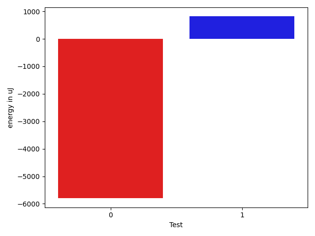

# gson a00c5f

https://github.com/google/gson/commit/a00c5f

## Delta Energy per test method

| ID | EnergyV1 | EnergyV2 | DeltaEnergy | σV1 | σV2 |
| --- | --- | --- | --- | --- | --- |
| 0 | 74659.91071428571 | 68860.58928571429 | -5799.32142857142 | 59829.2239563925 | 51310.64954616313 |
| 1 | 60522.56603773585 | 61337.295454545456 | 814.729416809605 | 48866.400880363144 | 46472.35370214481 |

## Delta Duration per test method

| ID | DurationV1 | DurationsV2 | DeltaDuration |
| --- | --- | --- | --- |
| 0 | 2743184.6428571427 | 2524921.5 | -218263.14285714272 |
| 1 | 2158009.830188679 | 2197619.840909091 | 39610.01072041178 |

## Misc.

| ID | Test Class | Test Method |
| --- | --- | --- |
| 0 | com.google.gson.LongSerializationPolicyTest | testStringLongSerialization |
| 1 | com.google.gson.LongSerializationPolicyTest | testDefaultLongSerialization |

| Test | IterationV1 | IterationV2 | DeltaIteration |
| --- | --- | --- | --- |
| 0 | 56 | 56 | 0 |
| 1 | 53 | 44 | -9 |

| Time Label | Time (s) |
| --- | --- |
| Selection | 28.152782201766968 |
| Injection | 10.05800199508667 |
| Total | 1096.1270160675049 |

