# gson d39158

https://github.com/google/gson/commit/d39158

## Delta Energy per test method

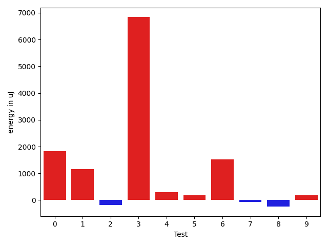

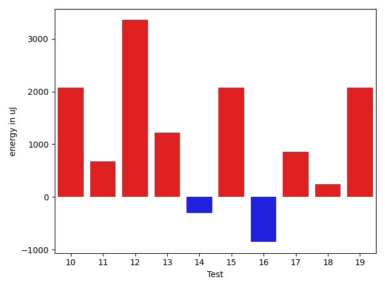

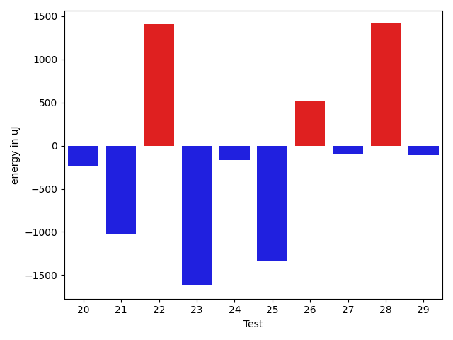

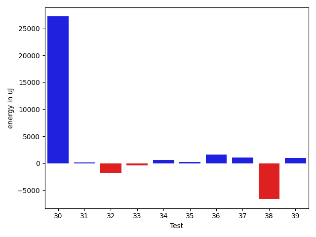

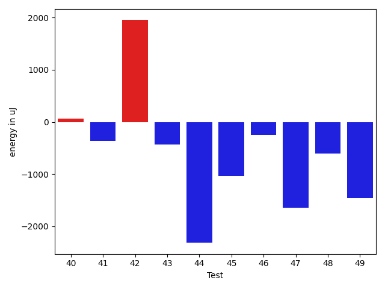

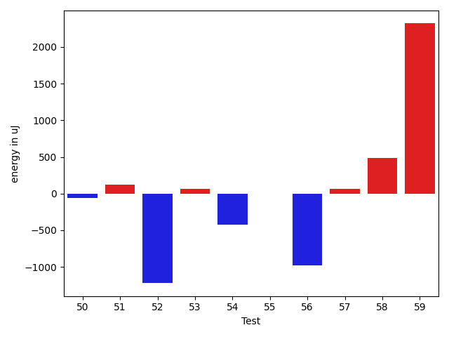

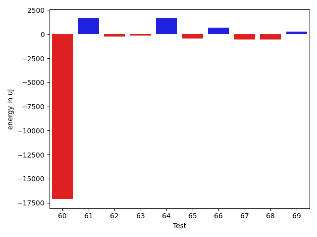

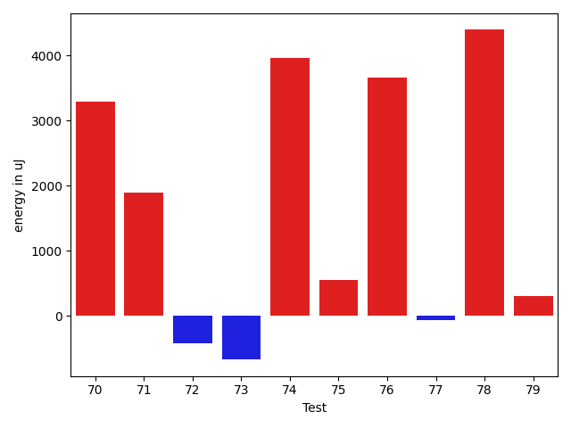

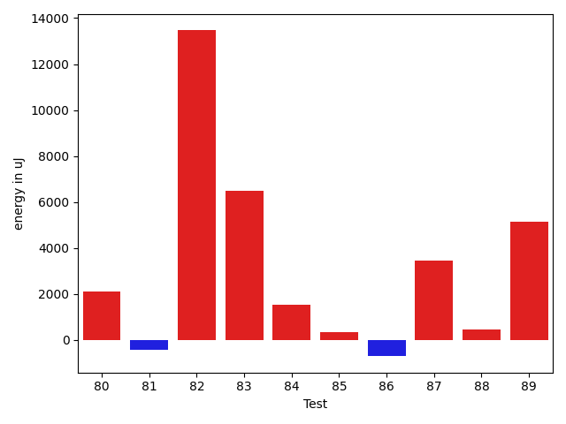

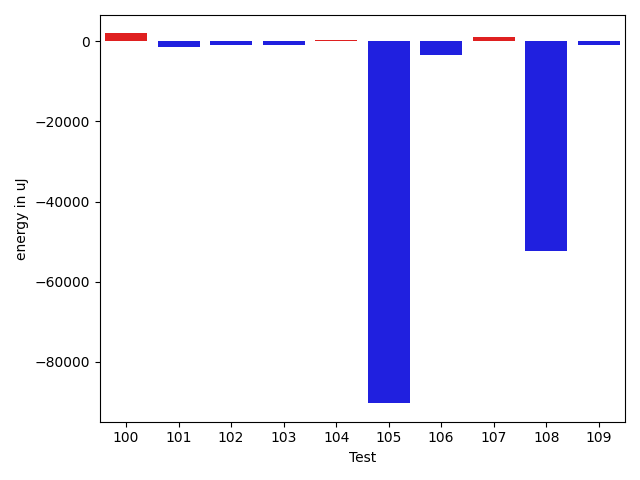

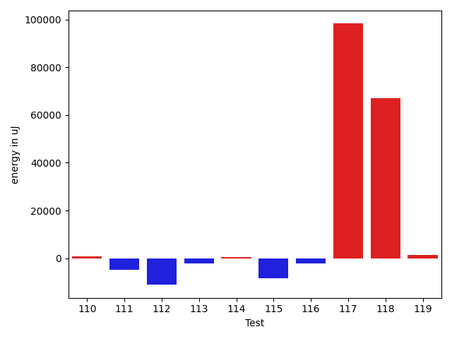

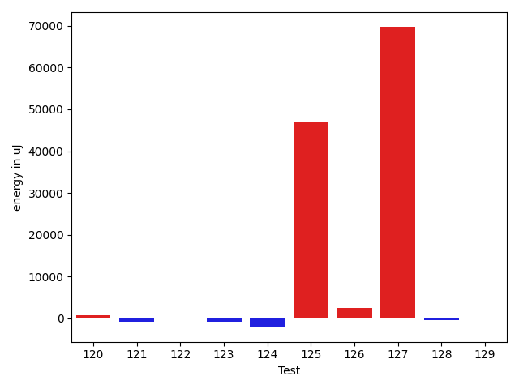

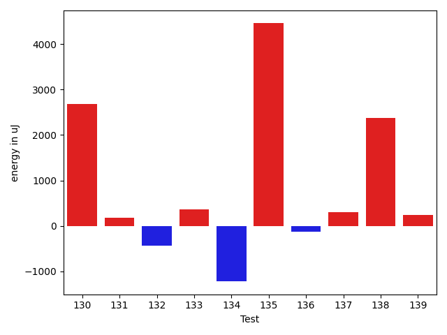

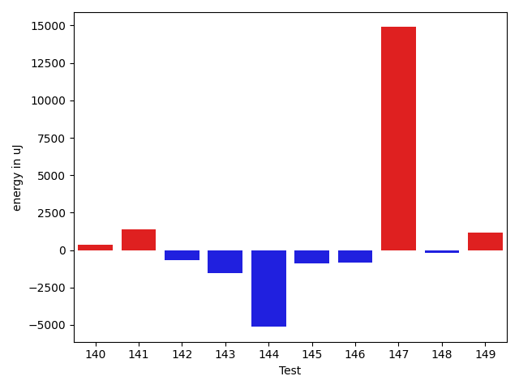

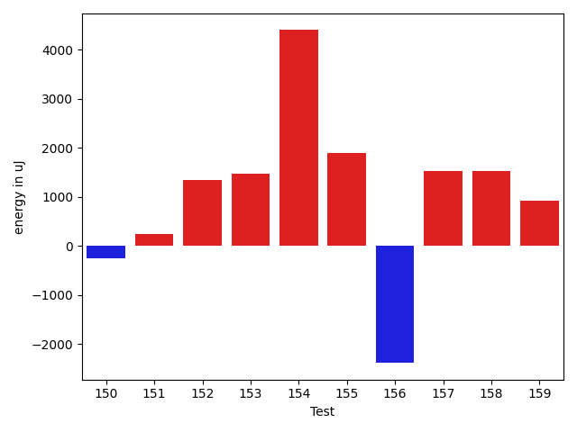

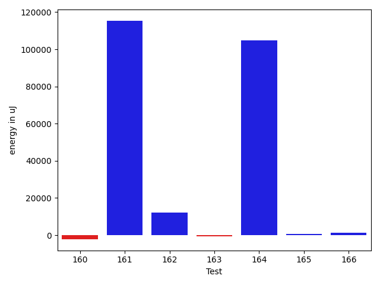

| ID | EnergyV1 | EnergyV2 | DeltaEnergy | σV1 | σV2 |
| --- | --- | --- | --- | --- | --- |
| 0 | 36316 | 38146 | 1830 | 4394.361626643482 | 3879.5888066419375 |
| 1 | 38208 | 39367 | 1159 | 26200.05953419869 | 34004.01581964464 |
| 2 | 40527 | 40344 | -183 | 158031.41348724152 | 212094.77606904556 |
| 3 | 74463 | 81298 | 6835 | 17852.365843929125 | 20311.734982562095 |
| 4 | 39123 | 39428 | 305 | 23785.024253692165 | 23694.41647695916 |
| 5 | 36682 | 36865 | 183 | 4278.57158702003 | 4604.108139251398 |
| 6 | 36926 | 38452 | 1526 | 4157.914396275395 | 4300.115727931051 |
| 7 | 37476 | 37414 | -62 | 3429.268195721076 | 4114.573587195207 |
| 8 | 38818 | 38574 | -244 | 15887.351807681405 | 17187.104483162868 |
| 9 | 37842 | 38025 | 183 | 9499.432279716671 | 7478.67626188176 |
| 10 | 35949 | 38025 | 2076 | 6032.405975281971 | 9450.302723515108 |
| 11 | 36743 | 37414 | 671 | 3603.247246967769 | 4068.4822775483008 |
| 12 | 34668 | 38025 | 3357 | 3446.09428866942 | 4126.433205355915 |
| 13 | 37109 | 38330 | 1221 | 4001.177874733345 | 4585.145551836894 |
| 14 | 38819 | 38513 | -306 | 11440.407563771783 | 14614.308525318693 |
| 15 | 37231 | 39306 | 2075 | 4059.9925759788734 | 5243.404848222848 |
| 16 | 36560 | 35706 | -854 | 4361.708107483054 | 4603.5375707996845 |
| 17 | 80933 | 81787 | 854 | 27036.73071027729 | 31440.3834711535 |
| 18 | 36926 | 37170 | 244 | 4279.366544196914 | 3732.313137586659 |
| 19 | 83618 | 85693 | 2075 | 128019.73202200599 | 162737.08128039996 |
| 20 | 36866 | 36499 | -367 | 4104.482424581875 | 3980.3929678976283 |
| 21 | 37659 | 36011 | -1648 | 3875.642740634201 | 4057.8666275985133 |
| 22 | 37476 | 37781 | 305 | 4872.247748328666 | 7504.41794584246 |
| 23 | 37537 | 36927 | -610 | 3640.718359768347 | 3649.6673579813187 |
| 24 | 36804 | 36010 | -794 | 5465.736065777485 | 6181.949271119088 |
| 25 | 38269 | 36316 | -1953 | 4274.67542285746 | 4365.317999029746 |
| 26 | 37353 | 37354 | 1 | 4011.7899249165644 | 3945.7497601058026 |
| 27 | 38513 | 37720 | -793 | 3713.1130233705953 | 3626.665951133396 |
| 28 | 36438 | 36133 | -305 | 3376.084471150642 | 8659.521501727962 |
| 29 | 35767 | 35827 | 60 | 3865.635468490932 | 3752.0546622354905 |
| 30 | 40466 | 40039 | -427 | 415454.72845543665 | 423908.23666886176 |
| 31 | 40283 | 41565 | 1282 | 4282.640427758252 | 5134.391116665041 |
| 32 | 39856 | 39917 | 61 | 17092.235678458026 | 13078.153174586829 |
| 33 | 63599 | 58044 | -5555 | 23186.657229414053 | 23258.300629579546 |
| 34 | 37780 | 37475 | -305 | 4891.615201389379 | 4012.8614432858512 |
| 35 | 37171 | 39367 | 2196 | 15341.096114328922 | 15676.203770298593 |
| 36 | 39124 | 39428 | 304 | 6760.992894107098 | 7656.95718964477 |
| 37 | 36621 | 38574 | 1953 | 6905.618558956612 | 6879.578262033442 |
| 38 | 68542 | 62988 | -5554 | 47837.08035051424 | 46628.688205413615 |
| 39 | 37598 | 38574 | 976 | 4179.04453308825 | 4221.164127050735 |
| 40 | 37658 | 37720 | 62 | 3426.909284483853 | 4122.96477929405 |
| 41 | 42236 | 41870 | -366 | 296403.1712115251 | 288401.5410123945 |
| 42 | 37232 | 39185 | 1953 | 3557.9688879889254 | 3952.325307471137 |
| 43 | 37354 | 36926 | -428 | 8933.034994156424 | 11743.607063018839 |
| 44 | 36071 | 33752 | -2319 | 3642.5347822635817 | 4082.2436388865244 |
| 45 | 36621 | 35583 | -1038 | 4306.294232774152 | 3743.097498838783 |
| 46 | 125855 | 125611 | -244 | 24879.172169737558 | 25409.355634964526 |
| 47 | 36743 | 35095 | -1648 | 3544.5744244064176 | 3511.5024691666017 |
| 48 | 35522 | 34912 | -610 | 3686.257969871816 | 3617.0515683173235 |
| 49 | 37293 | 35827 | -1466 | 3575.824006861034 | 4026.8007705318073 |
| 50 | 36743 | 36682 | -61 | 10659.654503881979 | 12488.384968811291 |
| 51 | 36011 | 36133 | 122 | 3549.992309757639 | 3983.1184002818745 |
| 52 | 35950 | 34729 | -1221 | 3952.981636708304 | 3659.4170515294913 |
| 53 | 35706 | 35766 | 60 | 4612.405315583722 | 3636.643573421753 |
| 54 | 36560 | 36133 | -427 | 6104.9885984424955 | 3541.0128465275243 |
| 55 | 35583 | 35584 | 1 | 3783.935896467452 | 4571.2752497658785 |
| 56 | 36560 | 35584 | -976 | 4077.0438539090333 | 4808.744050886757 |
| 57 | 35645 | 35706 | 61 | 3672.222796666663 | 3476.7596261018093 |
| 58 | 38636 | 39123 | 487 | 3366.8248575020575 | 4016.200541100031 |
| 59 | 38391 | 40711 | 2320 | 18146.0585497588 | 17835.920912935784 |
| 60 | 39490 | 40100 | 610 | 53345.831513788034 | 24170.85954717736 |
| 61 | 36743 | 38940 | 2197 | 3518.465324975586 | 4077.9984642512063 |
| 62 | 36499 | 36866 | 367 | 7785.486494754198 | 3779.8373512828593 |
| 63 | 37598 | 37476 | -122 | 3773.0241609548348 | 4358.532932900916 |
| 64 | 36987 | 39124 | 2137 | 3681.549916267479 | 4057.7614527353135 |
| 65 | 37475 | 37353 | -122 | 5151.216034688611 | 4412.562914719205 |
| 66 | 39978 | 39246 | -732 | 4257.055653328807 | 3331.1256301314756 |
| 67 | 37598 | 37476 | -122 | 3616.5830647232765 | 4358.334816956007 |
| 68 | 40039 | 41748 | 1709 | 11736.541363176384 | 15310.044292754144 |
| 69 | 37903 | 38208 | 305 | 4430.505848519514 | 3862.5616995470577 |
| 70 | 39185 | 42480 | 3295 | 185534.46419593375 | 152411.40146356795 |
| 71 | 36682 | 38574 | 1892 | 4196.826897332417 | 3740.5651061211743 |
| 72 | 37171 | 36743 | -428 | 3564.359420277797 | 4043.0111001029363 |
| 73 | 42053 | 41382 | -671 | 415963.90898615326 | 364170.4750306756 |
| 74 | 82275 | 86242 | 3967 | 30838.848827043577 | 33086.420901213234 |
| 75 | 38208 | 38757 | 549 | 10632.098750949448 | 8123.111090525714 |
| 76 | 36072 | 39734 | 3662 | 3022.03162466839 | 3653.5990529887104 |
| 77 | 37292 | 37232 | -60 | 3670.8358162472687 | 4036.5090253248736 |
| 78 | 172302 | 176697 | 4395 | 67733.58343992065 | 163635.5012756632 |
| 79 | 38025 | 38330 | 305 | 6523.818952648987 | 6496.440022775071 |
| 80 | 36804 | 37781 | 977 | 5617.945496345697 | 8071.022731657576 |
| 81 | 37476 | 36926 | -550 | 4284.409458617478 | 4576.488099684436 |
| 82 | 37903 | 39245 | 1342 | 3562.095534375904 | 33950.328117613644 |
| 83 | 36804 | 38757 | 1953 | 4550.80546351764 | 23827.174803861806 |
| 84 | 37292 | 36865 | -427 | 3741.0622909104145 | 8527.291322631143 |
| 85 | 36438 | 38208 | 1770 | 4011.1879885347034 | 4217.3395771949645 |
| 86 | 38391 | 38635 | 244 | 4212.583710198778 | 4705.9055234305915 |
| 87 | 39551 | 38818 | -733 | 9823.828841918606 | 16766.50417550333 |
| 88 | 38208 | 37354 | -854 | 4395.775284866291 | 7178.390055345317 |
| 89 | 40161 | 41870 | 1709 | 29238.745932448826 | 38074.14844534083 |
| 90 | 40710 | 39795 | -915 | 8861.753747309325 | 12235.157461583376 |
| 91 | 36865 | 37903 | 1038 | 4757.446324619829 | 4798.342225982538 |
| 92 | 40222 | 39551 | -671 | 50739.28889220555 | 24400.188471238762 |
| 93 | 38940 | 38269 | -671 | 10532.275733110802 | 8635.469464510892 |
| 94 | 38757 | 38696 | -61 | 9779.536628220905 | 11882.60144761068 |
| 95 | 85205 | 81482 | -3723 | 325071.8528419034 | 287078.79677107505 |
| 96 | 38086 | 39245 | 1159 | 11498.85842749764 | 12299.262544597925 |
| 97 | 40344 | 40161 | -183 | 22974.022323467514 | 16814.681148827713 |
| 98 | 74584 | 81664 | 7080 | 311692.2630477998 | 276814.48225391045 |
| 99 | 39184 | 41259 | 2075 | 17361.74048374446 | 18690.38489659588 |
| 100 | 37964 | 37964 | 0 | 4353.518261683513 | 6658.613596191816 |
| 101 | 38391 | 37964 | -427 | 6521.960442577289 | 5635.792171835925 |
| 102 | 39489 | 38268 | -1221 | 14344.50651041699 | 16725.718294571474 |
| 103 | 39855 | 39184 | -671 | 57460.87098738482 | 60460.74249099832 |
| 104 | 37780 | 37170 | -610 | 6675.490545126891 | 8564.159484355097 |
| 105 | 42358 | 42114 | -244 | 523168.86559307436 | 332196.4975918052 |
| 106 | 39246 | 40222 | 976 | 23766.733465016674 | 14996.424667006797 |
| 107 | 38635 | 39550 | 915 | 5697.467967925912 | 5442.629909540261 |
| 108 | 41992 | 39490 | -2502 | 282970.3189288719 | 215574.27065104604 |
| 109 | 38086 | 37415 | -671 | 4527.45554676036 | 3835.3134139641484 |
| 110 | 37720 | 38147 | 427 | 3948.319155774974 | 4186.588245583386 |
| 111 | 85632 | 59997 | -25635 | 47523.97401394796 | 41977.82037833259 |
| 112 | 40161 | 38330 | -1831 | 35236.70442680392 | 19179.72984346966 |
| 113 | 39795 | 37842 | -1953 | 3962.5903783530616 | 3693.161573544339 |
| 114 | 38391 | 39917 | 1526 | 4899.929206522091 | 4376.754234209029 |
| 115 | 40589 | 39123 | -1466 | 48935.256624420785 | 43721.76080045603 |
| 116 | 39124 | 38635 | -489 | 16999.157657866155 | 14879.778665370215 |
| 117 | 40466 | 40100 | -366 | 4966.772539626645 | 399998.1977707194 |
| 118 | 39795 | 40405 | 610 | 8938.5137281833 | 291769.82695439464 |
| 119 | 38513 | 39002 | 489 | 5933.545446831592 | 7263.280668617393 |
| 120 | 38696 | 38697 | 1 | 4159.749724968438 | 3906.454649001005 |
| 121 | 36072 | 35645 | -427 | 4069.3886695260867 | 4335.480174637085 |
| 122 | 38208 | 39245 | 1037 | 3962.349744078632 | 5579.708644947333 |
| 123 | 39307 | 38330 | -977 | 4684.640721749263 | 4250.401223414091 |
| 124 | 39001 | 36744 | -2257 | 5547.032911815443 | 4258.04556881625 |
| 125 | 40954 | 38574 | -2380 | 166710.6418678122 | 315509.25471971993 |
| 126 | 41198 | 40588 | -610 | 19372.289390328842 | 22261.323802732575 |
| 127 | 43396 | 45044 | 1648 | 48976.18199936611 | 346533.9170179174 |
| 128 | 38147 | 36926 | -1221 | 4108.313626515253 | 3814.080467272143 |
| 129 | 38513 | 38268 | -245 | 7295.375026584439 | 8193.181453598914 |
| 130 | 37781 | 40466 | 2685 | 4687.188963969547 | 4582.331413974768 |
| 131 | 38879 | 39062 | 183 | 3647.9294698889053 | 138459.9411497552 |
| 132 | 39550 | 39123 | -427 | 17409.628723335114 | 20281.606552662488 |
| 133 | 74584 | 74951 | 367 | 32809.47737236001 | 30216.351737779165 |
| 134 | 40710 | 39489 | -1221 | 6892.056100642246 | 3905.2115293339707 |
| 135 | 119690 | 124145 | 4455 | 67575.64863967303 | 86294.08550672457 |
| 136 | 39673 | 39551 | -122 | 3670.070874173043 | 3632.8061032201745 |
| 137 | 39246 | 39550 | 304 | 4088.5989134213123 | 3603.7114717652216 |
| 138 | 40405 | 42786 | 2381 | 4516.064254137667 | 9143.488306615978 |
| 139 | 40832 | 41076 | 244 | 13990.91272274881 | 16306.111432612051 |
| 140 | 39551 | 39917 | 366 | 12967.74023990215 | 18478.01242518806 |
| 141 | 39367 | 40772 | 1405 | 4983.567726570852 | 4171.150517197756 |
| 142 | 38757 | 38086 | -671 | 3942.809770924855 | 4183.241057926461 |
| 143 | 40344 | 38818 | -1526 | 4141.803703148804 | 4828.797347054709 |
| 144 | 91126 | 85998 | -5128 | 386442.66653695103 | 281779.93492742616 |
| 145 | 39917 | 39002 | -915 | 14667.61628050178 | 14012.877747812827 |
| 146 | 41443 | 40588 | -855 | 34886.81396431332 | 19613.441747545865 |
| 147 | 332885 | 347777 | 14892 | 174308.8737115624 | 167558.16571450714 |
| 148 | 42602 | 42419 | -183 | 20331.469152423335 | 18366.989367068018 |
| 149 | 37293 | 38452 | 1159 | 4347.040479866015 | 3496.9686226073 |
| 150 | 38818 | 38574 | -244 | 4476.164292829971 | 4257.776141790454 |
| 151 | 41015 | 41260 | 245 | 34216.426395353425 | 44324.32265698188 |
| 152 | 39246 | 40588 | 1342 | 3928.174396171165 | 4912.868101283549 |
| 153 | 38757 | 40222 | 1465 | 3406.725743387254 | 3558.2829691986117 |
| 154 | 37903 | 42298 | 4395 | 3987.312025305463 | 4698.25934682197 |
| 155 | 37780 | 39673 | 1893 | 5128.754406286189 | 4324.3690669853795 |
| 156 | 40466 | 38086 | -2380 | 3067.4029624840714 | 4199.997366441597 |
| 157 | 38818 | 40344 | 1526 | 3760.653433580393 | 3464.8666600927404 |
| 158 | 39367 | 40894 | 1527 | 344246.39632940193 | 9932.564653661757 |
| 159 | 39733 | 40649 | 916 | 3904.646164747198 | 3866.8992022032335 |
| 160 | 41687 | 38147 | -3540 | 6862.844446577571 | 8820.68340738078 |
| 161 | 43701 | 40467 | -3234 | 4457.893792109498 | 345027.3671531778 |
| 162 | 39185 | 40588 | 1403 | 402073.34540943796 | 371711.4949931672 |
| 163 | 39978 | 41504 | 1526 | 12346.571705898317 | 7291.299706480473 |
| 164 | 40832 | 39062 | -1770 | 258082.17974999096 | 417492.87321081583 |
| 165 | 40466 | 39490 | -976 | 4435.848058015699 | 4074.511982360588 |
| 166 | 37964 | 37903 | -61 | 4330.831346000443 | 4236.897784918082 |

## Delta Duration per test method

| ID | DurationV1 | DurationsV2 | DeltaDuration |
| --- | --- | --- | --- |
| 0 | 748011.8983050848 | 808011.081632653 | 59999.18332756823 |
| 1 | 1128160.3166666667 | 1334929.2741935484 | 206768.9575268817 |
| 2 | 1997383.7777777778 | 2890046.9850746267 | 892663.207296849 |
| 3 | 2331033.8484848486 | 2436179.6464646463 | 105145.7979797977 |
| 4 | 1123171.142857143 | 1123817.25 | 646.1071428570431 |
| 5 | 792127.3571428572 | 782950.0754716981 | -9177.281671159086 |
| 6 | 746489.340425532 | 758828.28 | 12338.939574468066 |
| 7 | 667351.3469387755 | 705510.5777777778 | 38159.230839002295 |
| 8 | 1092951.3188405796 | 1201898.8243243243 | 108947.50548374467 |
| 9 | 1005713.3076923077 | 1048347.690140845 | 42634.382448537275 |
| 10 | 862886.3389830509 | 898181.7741935484 | 35295.43521049747 |
| 11 | 806345.7457627119 | 822136.28125 | 15790.535487288143 |
| 12 | 455561.16 | 458429.75 | 2868.5900000000256 |
| 13 | 852066.6551724138 | 874321.6612903225 | 22255.00611790875 |
| 14 | 909056.4772727273 | 1050039.0784313725 | 140982.60115864524 |
| 15 | 524101.2068965517 | 637044.3461538461 | 112943.13925729442 |
| 16 | 764789.3888888889 | 734382.5918367347 | -30406.7970521542 |
| 17 | 2653668.9191919193 | 2720792.262626263 | 67123.34343434358 |
| 18 | 628335.7428571428 | 609287.0 | -19048.742857142817 |
| 19 | 3541468.5454545454 | 4025906.090909091 | 484437.5454545454 |
| 20 | 570936.641025641 | 580302.8666666667 | 9366.225641025696 |
| 21 | 883983.0 | 882134.5967741936 | -1848.4032258064253 |
| 22 | 696970.34375 | 779813.5882352941 | 82843.2444852941 |
| 23 | 542880.4722222222 | 562792.268292683 | 19911.796070460696 |
| 24 | 1070927.6666666667 | 1068538.4285714286 | -2389.2380952381063 |
| 25 | 512198.24324324325 | 615120.8857142857 | 102922.6424710424 |
| 26 | 689765.1315789474 | 645344.475 | -44420.65657894744 |
| 27 | 590721.3243243244 | 571631.1081081082 | -19090.216216216213 |
| 28 | 679936.282051282 | 722404.0555555555 | 42467.7735042735 |
| 29 | 945900.0178571428 | 926868.9589041095 | -19031.058953033295 |
| 30 | 3871506.1842105263 | 4805546.185185186 | 934040.0009746593 |
| 31 | 588513.6571428571 | 701373.1666666666 | 112859.50952380954 |
| 32 | 1277197.8214285714 | 1178913.96 | -98283.8614285714 |
| 33 | 1830451.7878787878 | 1826604.6464646466 | -3847.1414141412824 |
| 34 | 662458.925925926 | 629294.0357142857 | -33164.890211640275 |
| 35 | 1148755.1449275361 | 1074980.5882352942 | -73774.55669224192 |
| 36 | 1003229.7833333333 | 930715.46875 | -72514.31458333333 |
| 37 | 1011148.7540983607 | 966581.5370370371 | -44567.21706132358 |
| 38 | 2403333.709677419 | 2091920.175257732 | -311413.53441968723 |
| 39 | 784583.6470588235 | 751841.575 | -32742.07205882354 |
| 40 | 745495.0571428571 | 716345.1489361703 | -29149.908206686843 |
| 41 | 3214504.035714286 | 2980091.397727273 | -234412.63798701297 |
| 42 | 600264.1515151515 | 536819.4814814815 | -63444.67003367003 |
| 43 | 1316285.5670103093 | 1317964.1979166667 | 1678.63090635743 |
| 44 | 526245.425 | 518071.4482758621 | -8173.9767241379595 |
| 45 | 793975.1320754717 | 823226.5294117647 | 29251.397336293012 |
| 46 | 3743229.0404040404 | 3759922.4444444445 | 16693.40404040413 |
| 47 | 551285.7741935484 | 520643.724137931 | -30642.05005561735 |
| 48 | 573935.0465116279 | 571786.8064516129 | -2148.2400600149995 |
| 49 | 868522.2419354839 | 863474.25 | -5047.9919354838785 |
| 50 | 1309574.0760869565 | 1314982.0729166667 | 5407.996829710202 |
| 51 | 787601.4565217391 | 792726.3846153846 | 5124.928093645489 |
| 52 | 482979.21428571426 | 496143.7272727273 | 13164.512987013033 |
| 53 | 489882.54545454547 | 497543.6296296296 | 7661.0841750841355 |
| 54 | 838054.4528301887 | 870149.4464285715 | 32094.993598382804 |
| 55 | 786726.8947368421 | 788772.5370370371 | 2045.6423001949443 |
| 56 | 785150.0980392157 | 815776.387755102 | 30626.28971588635 |
| 57 | 778585.5490196078 | 798400.5614035088 | 19815.012383900932 |
| 58 | 686243.34375 | 632218.2941176471 | -54025.04963235289 |
| 59 | 1547696.4845360825 | 1479274.0 | -68422.48453608248 |
| 60 | 1571469.375 | 926507.725 | -644961.65 |
| 61 | 527155.1666666666 | 497565.0 | -29590.166666666628 |
| 62 | 891172.2 | 792357.3333333334 | -98814.86666666658 |
| 63 | 757539.1276595745 | 735205.9411764706 | -22333.1864831039 |
| 64 | 620936.8275862068 | 555247.9189189189 | -65688.9086672879 |
| 65 | 842492.6545454545 | 795216.6274509804 | -47276.02709447418 |
| 66 | 536844.304347826 | 495416.5714285714 | -41427.73291925463 |
| 67 | 612754.1944444445 | 634106.9677419355 | 21352.773297491018 |
| 68 | 770780.5882352941 | 579286.25 | -191494.3382352941 |
| 69 | 671871.4146341464 | 721155.8292682926 | 49284.41463414626 |
| 70 | 2299408.1666666665 | 2174841.0 | -124567.16666666651 |
| 71 | 674321.6388888889 | 646687.9393939395 | -27633.699494949426 |
| 72 | 518515.23076923075 | 530668.9666666667 | 12153.735897435923 |
| 73 | 4439657.568181818 | 3595616.794871795 | -844040.7733100234 |
| 74 | 2703503.8585858587 | 2740311.212121212 | 36807.353535353206 |
| 75 | 1114531.1384615384 | 1069603.4677419355 | -44927.670719602844 |
| 76 | 623781.7727272727 | 623286.15 | -495.6227272726828 |
| 77 | 867436.90625 | 961893.9016393443 | 94456.99538934429 |
| 78 | 5172966.545454546 | 6460904.373737373 | 1287937.8282828275 |
| 79 | 864876.9272727272 | 944965.4920634921 | 80088.56479076482 |
| 80 | 997573.5820895522 | 1041491.8133333334 | 43918.23124378116 |
| 81 | 639030.0909090909 | 690944.3846153846 | 51914.29370629368 |
| 82 | 697644.7647058824 | 1174587.1224489796 | 476942.35774309724 |
| 83 | 659354.7058823529 | 936731.1428571428 | 277376.43697478995 |
| 84 | 813490.2777777778 | 899115.7142857143 | 85625.43650793657 |
| 85 | 434308.5238095238 | 484325.875 | 50017.35119047621 |
| 86 | 602201.2777777778 | 604471.6818181818 | 2270.4040404040134 |
| 87 | 997061.4492753623 | 1104374.652173913 | 107313.20289855078 |
| 88 | 866680.8545454545 | 928418.1612903225 | 61737.30674486805 |
| 89 | 1283412.5192307692 | 1474397.6231884058 | 190985.10395763651 |
| 90 | 1222936.0684931506 | 1305735.2469135802 | 82799.17842042958 |
| 91 | 765983.1162790698 | 844225.2941176471 | 78242.1778385773 |
| 92 | 1557304.888888889 | 1441518.630952381 | -115786.25793650793 |
| 93 | 1167966.111111111 | 1105620.3625 | -62345.74861111096 |
| 94 | 1170739.5316455697 | 1138910.87012987 | -31828.6615156997 |
| 95 | 4414043.4949494945 | 4246857.5050505055 | -167185.98989898898 |
| 96 | 1218322.3902439023 | 1151875.1686746988 | -66447.22156920354 |
| 97 | 1194762.3 | 1131192.6379310344 | -63569.66206896561 |
| 98 | 3773818.3535353537 | 3608310.3535353537 | -165508.0 |
| 99 | 1426457.5625 | 1545713.875 | 119256.3125 |
| 100 | 903624.186440678 | 979672.9850746269 | 76048.7986339489 |
| 101 | 1050443.2368421052 | 1058599.4324324324 | 8156.195590327261 |
| 102 | 1409432.797752809 | 1371272.652631579 | -38160.145121230045 |
| 103 | 1813514.08045977 | 1872496.97752809 | 58982.89706831984 |
| 104 | 1195107.3068181819 | 1165507.857142857 | -29599.44967532484 |
| 105 | 6024909.638888889 | 3605036.9859154928 | -2419872.6529733962 |
| 106 | 1288719.4782608696 | 1104270.6944444445 | -184448.78381642513 |
| 107 | 907977.5925925926 | 872002.4833333333 | -35975.109259259305 |
| 108 | 4168245.4615384615 | 2443255.2972972975 | -1724990.164241164 |
| 109 | 663892.2142857143 | 688662.0666666667 | 24769.852380952332 |
| 110 | 683324.8780487805 | 750419.4054054054 | 67094.52735662495 |
| 111 | 2126393.94 | 2157243.1333333333 | 30849.193333333358 |
| 112 | 1290860.4324324324 | 899980.9285714285 | -390879.5038610039 |
| 113 | 540048.8695652174 | 516773.4705882353 | -23275.398976982106 |
| 114 | 626807.0645161291 | 674004.0 | 47196.93548387091 |
| 115 | 1952342.1860465116 | 1744897.0697674418 | -207445.1162790698 |
| 116 | 1199409.1323529412 | 1131722.8970588236 | -67686.23529411759 |
| 117 | 897203.7021276596 | 3391911.653846154 | 2494707.9517184943 |
| 118 | 871670.2641509434 | 2900746.3863636362 | 2029076.1222126929 |
| 119 | 856340.7777777778 | 927663.4 | 71322.62222222227 |
| 120 | 631758.7 | 733967.3333333334 | 102208.63333333342 |
| 121 | 480980.04347826086 | 608123.4285714285 | 127143.38509316766 |
| 122 | 585265.96 | 635941.125 | 50675.16500000004 |
| 123 | 490439.2173913043 | 452772.65 | -37666.5673913043 |
| 124 | 491233.7826086957 | 511118.8181818182 | 19885.0355731225 |
| 125 | 1816099.2452830188 | 3146658.2153846156 | 1330558.9701015968 |
| 126 | 1333182.988095238 | 1500740.0697674418 | 167557.08167220373 |
| 127 | 1736960.884057971 | 3598258.8833333333 | 1861297.9992753624 |
| 128 | 733366.918367347 | 829915.4146341464 | 96548.4962667994 |
| 129 | 888357.9491525424 | 961169.6041666666 | 72811.65501412423 |
| 130 | 642034.4871794871 | 659236.4375 | 17201.95032051287 |
| 131 | 684079.1777777778 | 2413105.472222222 | 1729026.2944444441 |
| 132 | 1285155.6 | 1191696.5 | -93459.1000000001 |
| 133 | 2150588.373737374 | 2160860.6565656564 | 10272.282828282565 |
| 134 | 804707.4 | 752221.25 | -52486.15000000002 |
| 135 | 3720695.303030303 | 4198738.373737373 | 478043.0707070702 |
| 136 | 413050.4117647059 | 435227.3125 | 22176.900735294097 |
| 137 | 837230.2063492064 | 838143.6271186441 | 913.4207694376819 |
| 138 | 585347.95 | 917868.7727272727 | 332520.82272727275 |
| 139 | 1089932.2658227847 | 1287460.3205128205 | 197528.05469003576 |
| 140 | 1123059.295774648 | 1348373.8461538462 | 225314.55037919828 |
| 141 | 419868.63157894736 | 521093.4736842105 | 101224.84210526315 |
| 142 | 721045.9459459459 | 668635.8918918918 | -52410.05405405408 |
| 143 | 853808.2352941176 | 833255.1914893617 | -20553.0438047559 |
| 144 | 6332021.676767677 | 4439317.474747474 | -1892704.2020202028 |
| 145 | 1077484.5892857143 | 1088076.7884615385 | 10592.199175824178 |
| 146 | 1412068.8536585367 | 1045015.8 | -367053.05365853664 |
| 147 | 9813961.989898989 | 10064380.151515152 | 250418.16161616333 |
| 148 | 1264933.0 | 1199615.2258064516 | -65317.774193548365 |
| 149 | 486488.25 | 422303.4 | -64184.84999999998 |
| 150 | 502955.3703703704 | 471904.64 | -31050.73037037038 |
| 151 | 1411965.1846153846 | 1840340.553846154 | 428375.36923076934 |
| 152 | 521853.4285714286 | 502558.5263157895 | -19294.902255639085 |
| 153 | 421075.0 | 453250.6 | 32175.599999999977 |
| 154 | 479890.04347826086 | 532930.3 | 53040.25652173918 |
| 155 | 467545.24 | 473892.5 | 6347.260000000009 |
| 156 | 406655.9411764706 | 449403.7368421053 | 42747.79566563468 |
| 157 | 410794.5 | 454315.4166666667 | 43520.916666666686 |
| 158 | 3576991.8225806453 | 876721.6428571428 | -2700270.1797235026 |
| 159 | 520029.375 | 520628.72 | 599.3449999999721 |
| 160 | 1018238.8695652174 | 1028782.6666666666 | 10543.797101449221 |
| 161 | 481245.77777777775 | 4182219.736842105 | 3700973.959064327 |
| 162 | 3754855.7391304346 | 4410942.411764706 | 656086.672634271 |
| 163 | 742947.9523809524 | 728521.9166666666 | -14426.035714285797 |
| 164 | 1941292.956521739 | 5289559.521739131 | 3348266.5652173916 |
| 165 | 508979.0 | 487363.16 | -21615.840000000026 |
| 166 | 484451.7 | 540620.1875 | 56168.48749999999 |

## Misc.

| ID | Test Class | Test Method |
| --- | --- | --- |
| 0 | com.google.gson.functional.CustomTypeAdaptersTest | testCustomTypeAdapterAppliesToSubClassesSerializedAsBaseClass |
| 1 | com.google.gson.functional.CustomTypeAdaptersTest | testCustomNestedSerializers |
| 2 | com.google.gson.functional.CustomTypeAdaptersTest | testCustomSerializers |
| 3 | com.google.gson.functional.CustomTypeAdaptersTest | testCustomTypeAdapterDoesNotAppliesToSubClasses |
| 4 | com.google.gson.functional.CustomTypeAdaptersTest | testCustomDeserializers |
| 5 | com.google.gson.functional.CustomTypeAdaptersTest | testCustomByteArrayDeserializerAndInstanceCreator |
| 6 | com.google.gson.functional.CustomTypeAdaptersTest | testCustomByteArraySerializer |
| 7 | com.google.gson.functional.CustomTypeAdaptersTest | testEnsureCustomDeserializerNotInvokedForNullValues |
| 8 | com.google.gson.functional.CustomTypeAdaptersTest | testCustomAdapterInvokedForCollectionElementSerializationWithType |
| 9 | com.google.gson.functional.CustomTypeAdaptersTest | testCustomAdapterInvokedForCollectionElementDeserialization |
| 10 | com.google.gson.functional.CustomTypeAdaptersTest | testCustomAdapterInvokedForMapElementDeserialization |
| 11 | com.google.gson.functional.CustomTypeAdaptersTest | testCustomAdapterInvokedForMapElementSerializationWithType |
| 12 | com.google.gson.functional.CustomTypeAdaptersTest | testCustomAdapterInvokedForMapElementSerialization |
| 13 | com.google.gson.functional.CustomTypeAdaptersTest | testCustomNestedDeserializers |
| 14 | com.google.gson.functional.CustomTypeAdaptersTest | testEnsureCustomSerializerNotInvokedForNullValues |
| 15 | com.google.gson.functional.CustomTypeAdaptersTest | testCustomAdapterInvokedForCollectionElementSerialization |
| 16 | com.google.gson.functional.NamingPolicyTest | testAtSignInSerializedName |
| 17 | com.google.gson.functional.NamingPolicyTest | testGsonWithNonDefaultFieldNamingPolicySerialization |
| 18 | com.google.gson.functional.NamingPolicyTest | testGsonWithLowerCaseDashPolicyDeserialiation |
| 19 | com.google.gson.functional.NamingPolicyTest | testGsonDuplicateNameUsingSerializedNameFieldNamingPolicySerialization |
| 20 | com.google.gson.functional.NamingPolicyTest | testGsonWithUpperCamelCaseSpacesPolicyDeserialiation |
| 21 | com.google.gson.functional.NamingPolicyTest | testGsonWithSerializedNameFieldNamingPolicySerialization |
| 22 | com.google.gson.functional.NamingPolicyTest | testGsonWithNonDefaultFieldNamingPolicyDeserialiation |
| 23 | com.google.gson.functional.NamingPolicyTest | testGsonWithLowerCaseUnderscorePolicySerialization |
| 24 | com.google.gson.functional.NamingPolicyTest | testDeprecatedNamingStrategy |
| 25 | com.google.gson.functional.NamingPolicyTest | testGsonWithUpperCamelCaseSpacesPolicySerialiation |
| 26 | com.google.gson.functional.NamingPolicyTest | testGsonWithLowerCaseDashPolicySerialization |
| 27 | com.google.gson.functional.NamingPolicyTest | testGsonWithLowerCaseUnderscorePolicyDeserialiation |
| 28 | com.google.gson.functional.NamingPolicyTest | testGsonWithSerializedNameFieldNamingPolicyDeserialization |
| 29 | com.google.gson.functional.NamingPolicyTest | testComplexFieldNameStrategy |
| 30 | com.google.gson.LongSerializationPolicyTest | testDefaultLongSerializationIntegration |
| 31 | com.google.gson.LongSerializationPolicyTest | testStringLongSerializationIntegration |
| 32 | com.google.gson.functional.MapTest | testSerializeMaps |
| 33 | com.google.gson.functional.MapTest | testInterfaceTypeMapWithSerializer |
| 34 | com.google.gson.functional.MapTest | testMapSerializationWithNullValuesSerialized |
| 35 | com.google.gson.functional.MapTest | testMapSubclassDeserialization |
| 36 | com.google.gson.functional.MapTest | testCustomSerializerForSpecificMapType |
| 37 | com.google.gson.functional.MapTest | testGeneralMapField |
| 38 | com.google.gson.functional.MapTest | testInterfaceTypeMap |
| 39 | com.google.gson.functional.MapTest | testMapSerializationWithNullValueButSerializeNulls |
| 40 | com.google.gson.functional.FieldExclusionTest | testDefaultNestedStaticClassIncluded |
| 41 | com.google.gson.functional.FieldExclusionTest | testDefaultInnerClassExclusion |
| 42 | com.google.gson.functional.FieldExclusionTest | testInnerClassExclusion |
| 43 | com.google.gson.functional.DefaultTypeAdaptersTest | testDateSerializationWithPattern |
| 44 | com.google.gson.functional.DefaultTypeAdaptersTest | testDefaultGregorianCalendarDeserialization |
| 45 | com.google.gson.functional.DefaultTypeAdaptersTest | testTimestampSerialization |
| 46 | com.google.gson.functional.DefaultTypeAdaptersTest | testDefaultDateDeserializationUsingBuilder |
| 47 | com.google.gson.functional.DefaultTypeAdaptersTest | testDefaultCalendarSerialization |
| 48 | com.google.gson.functional.DefaultTypeAdaptersTest | testDefaultCalendarDeserialization |
| 49 | com.google.gson.functional.DefaultTypeAdaptersTest | testDateDeserializationWithPattern |
| 50 | com.google.gson.functional.DefaultTypeAdaptersTest | testDateSerializationInCollection |
| 51 | com.google.gson.functional.DefaultTypeAdaptersTest | testSetSerialization |
| 52 | com.google.gson.functional.DefaultTypeAdaptersTest | testBitSetSerialization |
| 53 | com.google.gson.functional.DefaultTypeAdaptersTest | testDefaultGregorianCalendarSerialization |
| 54 | com.google.gson.functional.DefaultTypeAdaptersTest | testDateSerializationWithPatternNotOverridenByTypeAdapter |
| 55 | com.google.gson.functional.DefaultTypeAdaptersTest | testBitSetDeserialization |
| 56 | com.google.gson.functional.DefaultTypeAdaptersTest | testDefaultDateSerializationUsingBuilder |
| 57 | com.google.gson.functional.DefaultTypeAdaptersTest | testSqlDateSerialization |
| 58 | com.google.gson.functional.NullObjectAndFieldTest | testExplicitDeserializationOfNulls |
| 59 | com.google.gson.functional.NullObjectAndFieldTest | testExplicitSerializationOfNullArrayMembers |
| 60 | com.google.gson.functional.NullObjectAndFieldTest | testExplicitSerializationOfNulls |
| 61 | com.google.gson.functional.NullObjectAndFieldTest | testCustomTypeAdapterPassesNullSerialization |
| 62 | com.google.gson.functional.NullObjectAndFieldTest | testCustomTypeAdapterPassesNullDesrialization |
| 63 | com.google.gson.functional.NullObjectAndFieldTest | testNullWrappedPrimitiveMemberSerialization |
| 64 | com.google.gson.functional.NullObjectAndFieldTest | testExplicitNullSetsFieldToNullDuringDeserialization |
| 65 | com.google.gson.functional.NullObjectAndFieldTest | testPrintPrintingObjectWithNulls |
| 66 | com.google.gson.functional.NullObjectAndFieldTest | testPrintPrintingArraysWithNulls |
| 67 | com.google.gson.functional.NullObjectAndFieldTest | testExplicitSerializationOfNullStringMembers |
| 68 | com.google.gson.functional.NullObjectAndFieldTest | testTopLevelNullObjectDeserialization |
| 69 | com.google.gson.functional.NullObjectAndFieldTest | testCustomSerializationOfNulls |
| 70 | com.google.gson.functional.NullObjectAndFieldTest | testTopLevelNullObjectSerialization |
| 71 | com.google.gson.functional.NullObjectAndFieldTest | testExplicitSerializationOfNullCollectionMembers |
| 72 | com.google.gson.functional.NullObjectAndFieldTest | testNullWrappedPrimitiveMemberDeserialization |
| 73 | com.google.gson.JsonParserTest | testReadWriteTwoObjects |
| 74 | com.google.gson.functional.ObjectTest | testSingletonLists |
| 75 | com.google.gson.functional.ObjectTest | testInnerClassDeserialization |
| 76 | com.google.gson.functional.ObjectTest | testJsonObjectSerialization |
| 77 | com.google.gson.functional.VersioningTest | testVersionedGsonMixingSinceAndUntilDeserialization |
| 78 | com.google.gson.functional.VersioningTest | testVersionedUntilSerialization |
| 79 | com.google.gson.functional.VersioningTest | testVersionedClassesSerialization |
| 80 | com.google.gson.functional.VersioningTest | testVersionedGsonMixingSinceAndUntilSerialization |
| 81 | com.google.gson.functional.VersioningTest | testVersionedGsonWithUnversionedClassesDeserialization |
| 82 | com.google.gson.functional.VersioningTest | testVersionedGsonWithUnversionedClassesSerialization |
| 83 | com.google.gson.functional.VersioningTest | testVersionedUntilDeserialization |
| 84 | com.google.gson.functional.VersioningTest | testVersionedClassesDeserialization |
| 85 | com.google.gson.functional.VersioningTest | testIgnoreLaterVersionClassDeserialization |
| 86 | com.google.gson.functional.VersioningTest | testIgnoreLaterVersionClassSerialization |
| 87 | com.google.gson.functional.CustomDeserializerTest | testCustomDeserializerReturnsNull |
| 88 | com.google.gson.functional.CustomDeserializerTest | testCustomDeserializerReturnsNullForArrayElementsForArrayField |
| 89 | com.google.gson.functional.CustomDeserializerTest | testCustomDeserializerReturnsNullForTopLevelObject |
| 90 | com.google.gson.functional.CustomDeserializerTest | testJsonTypeFieldBasedDeserialization |
| 91 | com.google.gson.functional.CustomDeserializerTest | testCustomDeserializerReturnsNullForArrayElements |
| 92 | com.google.gson.functional.EnumTest | testEnumSubclassWithRegisteredTypeAdapter |
| 93 | com.google.gson.functional.MapAsArrayTypeAdapterTest | testMultipleEnableComplexKeyRegistrationHasNoEffect |
| 94 | com.google.gson.functional.MapAsArrayTypeAdapterTest | testMapWithTypeVariableDeserialization |
| 95 | com.google.gson.functional.MapAsArrayTypeAdapterTest | testSerializeComplexMapWithTypeAdapter |
| 96 | com.google.gson.functional.MapAsArrayTypeAdapterTest | testMapWithTypeVariableSerialization |
| 97 | com.google.gson.functional.MapAsArrayTypeAdapterTest | testTwoTypesCollapseToOneDeserialize |
| 98 | com.google.gson.functional.TypeVariableTest | testAdvancedTypeVariables |
| 99 | com.google.gson.functional.TypeVariableTest | testTypeVariablesViaTypeParameter |
| 100 | com.google.gson.functional.TypeVariableTest | testBasicTypeVariables |
| 101 | com.google.gson.functional.ParameterizedTypesTest | testParameterizedTypeWithReaderDeserialization |
| 102 | com.google.gson.functional.ParameterizedTypesTest | testParameterizedTypeWithCustomSerializer |
| 103 | com.google.gson.functional.ParameterizedTypesTest | testParameterizedTypeDeserialization |
| 104 | com.google.gson.functional.ParameterizedTypesTest | testParameterizedTypesWithCustomDeserializer |
| 105 | com.google.gson.functional.InstanceCreatorTest | testInstanceCreatorReturnsBaseType |
| 106 | com.google.gson.functional.InstanceCreatorTest | testInstanceCreatorReturnsSubTypeForField |
| 107 | com.google.gson.functional.InstanceCreatorTest | testInstanceCreatorReturnsSubTypeForTopLevelObject |
| 108 | com.google.gson.functional.SecurityTest | testNonExecutableJsonSerialization |
| 109 | com.google.gson.functional.SecurityTest | testJsonWithNonExectuableTokenWithConfiguredGsonDeserialization |
| 110 | com.google.gson.functional.SecurityTest | testJsonWithNonExectuableTokenWithRegularGsonDeserialization |
| 111 | com.google.gson.functional.SecurityTest | testJsonWithNonExectuableTokenSerialization |
| 112 | com.google.gson.functional.SecurityTest | testNonExecutableJsonDeserialization |
| 113 | com.google.gson.MixedStreamTest | testWriteClosed |
| 114 | com.google.gson.MixedStreamTest | testWriteDoesNotMutateState |
| 115 | com.google.gson.MixedStreamTest | testWriteHtmlSafe |
| 116 | com.google.gson.MixedStreamTest | testWriteLenient |
| 117 | com.google.gson.MixedStreamTest | testWriteMixedStreamed |
| 118 | com.google.gson.MixedStreamTest | testReadMixedStreamed |
| 119 | com.google.gson.MixedStreamTest | testReadClosed |
| 120 | com.google.gson.MixedStreamTest | testReaderDoesNotMutateState |
| 121 | com.google.gson.MixedStreamTest | testWriteNulls |
| 122 | com.google.gson.MixedStreamTest | testWriteInvalidState |
| 123 | com.google.gson.MixedStreamTest | testReadNulls |
| 124 | com.google.gson.MixedStreamTest | testReadInvalidState |
| 125 | com.google.gson.CommentsTest | testParseComments |
| 126 | com.google.gson.functional.EscapingTest | testGsonAcceptsEscapedAndNonEscapedJsonDeserialization |
| 127 | com.google.gson.functional.CustomSerializerTest | testSubClassSerializerInvokedForBaseClassFieldsHoldingSubClassInstances |
| 128 | com.google.gson.functional.CustomSerializerTest | testBaseClassSerializerInvokedForBaseClassFieldsHoldingSubClassInstances |
| 129 | com.google.gson.functional.CustomSerializerTest | testSubClassSerializerInvokedForBaseClassFieldsHoldingArrayOfSubClassInstances |
| 130 | com.google.gson.functional.CustomSerializerTest | testBaseClassSerializerInvokedForBaseClassFields |
| 131 | com.google.gson.functional.CustomSerializerTest | testSerializerReturnsNull |
| 132 | com.google.gson.functional.CollectionTest | testUserCollectionTypeAdapter |
| 133 | com.google.gson.functional.UncategorizedTest | testReturningDerivedClassesDuringDeserialization |
| 134 | com.google.gson.DefaultMapJsonSerializerTest | testNonEmptyMapSerialization |
| 135 | com.google.gson.functional.TypeHierarchyAdapterTest | testTypeHierarchy |
| 136 | com.google.gson.functional.TypeHierarchyAdapterTest | testRegisterSubTypeFirstNotAllowed |
| 137 | com.google.gson.functional.TypeHierarchyAdapterTest | testRegisterSuperTypeFirst |
| 138 | com.google.gson.functional.ReadersWritersTest | testTopLevelNullObjectSerializationWithWriterAndSerializeNulls |
| 139 | com.google.gson.functional.ReadersWritersTest | testReadWriteTwoStrings |
| 140 | com.google.gson.functional.ReadersWritersTest | testReadWriteTwoObjects |
| 141 | com.google.gson.functional.ReadersWritersTest | testTopLevelNullObjectDeserializationWithReaderAndSerializeNulls |
| 142 | com.google.gson.functional.StreamingTypeAdaptersTest | testDeserializeWithCustomTypeAdapter |
| 143 | com.google.gson.functional.StreamingTypeAdaptersTest | testSerializeWithCustomTypeAdapter |
| 144 | com.google.gson.functional.ExclusionStrategyFunctionalTest | testExclusionStrategySerialization |
| 145 | com.google.gson.functional.ExclusionStrategyFunctionalTest | testExclusionStrategyWithMode |
| 146 | com.google.gson.functional.ExclusionStrategyFunctionalTest | testExclusionStrategyDeserialization |
| 147 | com.google.gson.functional.CircularReferenceTest | testSelfReferenceCustomHandlerSerialization |
| 148 | com.google.gson.functional.PrimitiveTest | testMoreSpecificSerialization |
| 149 | com.google.gson.functional.PrimitiveTest | testDoubleInfinitySerialization |
| 150 | com.google.gson.functional.PrimitiveTest | testLongAsStringDeserialization |
| 151 | com.google.gson.functional.PrimitiveTest | testHtmlCharacterSerialization |
| 152 | com.google.gson.functional.PrimitiveTest | testLongAsStringSerialization |
| 153 | com.google.gson.functional.PrimitiveTest | testFloatInfinitySerialization |
| 154 | com.google.gson.functional.PrimitiveTest | testFloatNaNSerialization |
| 155 | com.google.gson.functional.PrimitiveTest | testDoubleNaNSerialization |
| 156 | com.google.gson.functional.PrimitiveTest | testNegativeInfinitySerialization |
| 157 | com.google.gson.functional.PrimitiveTest | testNegativeInfinityFloatSerialization |
| 158 | com.google.gson.FunctionWithInternalDependenciesTest | testAnonymousLocalClassesSerialization |
| 159 | com.google.gson.functional.ArrayTest | testArrayElementsAreArrays |
| 160 | com.google.gson.functional.ArrayTest | testNullsInArrayWithSerializeNullPropertySetSerialization |
| 161 | com.google.gson.JsonObjectTest | testPropertyWithQuotes |
| 162 | com.google.gson.JsonObjectTest | testWritePropertyWithEmptyStringName |
| 163 | com.google.gson.functional.PrintFormattingTest | testJsonObjectWithNullValuesSerialized |
| 164 | com.google.gson.GsonBuilderTest | testCreatingMoreThanOnce |
| 165 | com.google.gson.functional.TypeAdapterPrecedenceTest | testDeserializeStreamingTypeAdapterFollowedByNonstreamingTypeAdapter |
| 166 | com.google.gson.functional.TypeAdapterPrecedenceTest | testSerializeStreamingTypeAdapterFollowedByNonstreamingTypeAdapter |

| Test | IterationV1 | IterationV2 | DeltaIteration |
| --- | --- | --- | --- |
| 0 | 59 | 49 | -10 |
| 1 | 60 | 62 | 2 |
| 2 | 63 | 67 | 4 |
| 3 | 99 | 99 | 0 |
| 4 | 56 | 64 | 8 |
| 5 | 56 | 53 | -3 |
| 6 | 47 | 50 | 3 |
| 7 | 49 | 45 | -4 |
| 8 | 69 | 74 | 5 |
| 9 | 65 | 71 | 6 |
| 10 | 59 | 62 | 3 |
| 11 | 59 | 64 | 5 |
| 12 | 25 | 24 | -1 |
| 13 | 58 | 62 | 4 |
| 14 | 44 | 51 | 7 |
| 15 | 29 | 26 | -3 |
| 16 | 54 | 49 | -5 |
| 17 | 99 | 99 | 0 |
| 18 | 35 | 39 | 4 |
| 19 | 99 | 99 | 0 |
| 20 | 39 | 30 | -9 |
| 21 | 73 | 62 | -11 |
| 22 | 32 | 34 | 2 |
| 23 | 36 | 41 | 5 |
| 24 | 81 | 77 | -4 |
| 25 | 37 | 35 | -2 |
| 26 | 38 | 40 | 2 |
| 27 | 37 | 37 | 0 |
| 28 | 39 | 36 | -3 |
| 29 | 56 | 73 | 17 |
| 30 | 38 | 27 | -11 |
| 31 | 35 | 24 | -11 |
| 32 | 84 | 75 | -9 |
| 33 | 99 | 99 | 0 |
| 34 | 27 | 28 | 1 |
| 35 | 69 | 68 | -1 |
| 36 | 60 | 64 | 4 |
| 37 | 61 | 54 | -7 |
| 38 | 93 | 97 | 4 |
| 39 | 51 | 40 | -11 |
| 40 | 35 | 47 | 12 |
| 41 | 84 | 88 | 4 |
| 42 | 33 | 27 | -6 |
| 43 | 97 | 96 | -1 |
| 44 | 40 | 29 | -11 |
| 45 | 53 | 51 | -2 |
| 46 | 99 | 99 | 0 |
| 47 | 31 | 29 | -2 |
| 48 | 43 | 31 | -12 |
| 49 | 62 | 60 | -2 |
| 50 | 92 | 96 | 4 |
| 51 | 46 | 39 | -7 |
| 52 | 28 | 22 | -6 |
| 53 | 33 | 27 | -6 |
| 54 | 53 | 56 | 3 |
| 55 | 57 | 54 | -3 |
| 56 | 51 | 49 | -2 |
| 57 | 51 | 57 | 6 |
| 58 | 32 | 34 | 2 |
| 59 | 97 | 96 | -1 |
| 60 | 32 | 40 | 8 |
| 61 | 24 | 29 | 5 |
| 62 | 50 | 51 | 1 |
| 63 | 47 | 51 | 4 |
| 64 | 29 | 37 | 8 |
| 65 | 55 | 51 | -4 |
| 66 | 23 | 21 | -2 |
| 67 | 36 | 31 | -5 |
| 68 | 17 | 16 | -1 |
| 69 | 41 | 41 | 0 |
| 70 | 24 | 15 | -9 |
| 71 | 36 | 33 | -3 |
| 72 | 26 | 30 | 4 |
| 73 | 88 | 78 | -10 |
| 74 | 99 | 99 | 0 |
| 75 | 65 | 62 | -3 |
| 76 | 22 | 20 | -2 |
| 77 | 64 | 61 | -3 |
| 78 | 99 | 99 | 0 |
| 79 | 55 | 63 | 8 |
| 80 | 67 | 75 | 8 |
| 81 | 44 | 52 | 8 |
| 82 | 34 | 49 | 15 |
| 83 | 34 | 42 | 8 |
| 84 | 54 | 56 | 2 |
| 85 | 21 | 24 | 3 |
| 86 | 36 | 22 | -14 |
| 87 | 69 | 69 | 0 |
| 88 | 55 | 62 | 7 |
| 89 | 52 | 69 | 17 |
| 90 | 73 | 81 | 8 |
| 91 | 43 | 51 | 8 |
| 92 | 81 | 84 | 3 |
| 93 | 81 | 80 | -1 |
| 94 | 79 | 77 | -2 |
| 95 | 99 | 99 | 0 |
| 96 | 82 | 83 | 1 |
| 97 | 70 | 58 | -12 |
| 98 | 99 | 99 | 0 |
| 99 | 96 | 96 | 0 |
| 100 | 59 | 67 | 8 |
| 101 | 76 | 74 | -2 |
| 102 | 89 | 95 | 6 |
| 103 | 87 | 89 | 2 |
| 104 | 88 | 91 | 3 |
| 105 | 72 | 71 | -1 |
| 106 | 69 | 72 | 3 |
| 107 | 54 | 60 | 6 |
| 108 | 39 | 37 | -2 |
| 109 | 42 | 30 | -12 |
| 110 | 41 | 37 | -4 |
| 111 | 50 | 45 | -5 |
| 112 | 37 | 42 | 5 |
| 113 | 23 | 17 | -6 |
| 114 | 31 | 30 | -1 |
| 115 | 86 | 86 | 0 |
| 116 | 68 | 68 | 0 |
| 117 | 47 | 52 | 5 |
| 118 | 53 | 44 | -9 |
| 119 | 54 | 45 | -9 |
| 120 | 40 | 33 | -7 |
| 121 | 23 | 21 | -2 |
| 122 | 25 | 16 | -9 |
| 123 | 23 | 20 | -3 |
| 124 | 23 | 11 | -12 |
| 125 | 53 | 65 | 12 |
| 126 | 84 | 86 | 2 |
| 127 | 69 | 60 | -9 |
| 128 | 49 | 41 | -8 |
| 129 | 59 | 48 | -11 |
| 130 | 39 | 32 | -7 |
| 131 | 45 | 36 | -9 |
| 132 | 80 | 78 | -2 |
| 133 | 99 | 99 | 0 |
| 134 | 50 | 44 | -6 |
| 135 | 99 | 99 | 0 |
| 136 | 17 | 16 | -1 |
| 137 | 63 | 59 | -4 |
| 138 | 20 | 22 | 2 |
| 139 | 79 | 78 | -1 |
| 140 | 71 | 78 | 7 |
| 141 | 19 | 19 | 0 |
| 142 | 37 | 37 | 0 |
| 143 | 51 | 47 | -4 |
| 144 | 99 | 99 | 0 |
| 145 | 56 | 52 | -4 |
| 146 | 41 | 40 | -1 |
| 147 | 99 | 99 | 0 |
| 148 | 31 | 31 | 0 |
| 149 | 16 | 20 | 4 |
| 150 | 27 | 25 | -2 |
| 151 | 65 | 65 | 0 |
| 152 | 28 | 19 | -9 |
| 153 | 17 | 15 | -2 |
| 154 | 23 | 20 | -3 |
| 155 | 25 | 20 | -5 |
| 156 | 17 | 19 | 2 |
| 157 | 20 | 12 | -8 |
| 158 | 62 | 56 | -6 |
| 159 | 32 | 25 | -7 |
| 160 | 23 | 21 | -2 |
| 161 | 18 | 19 | 1 |
| 162 | 23 | 17 | -6 |
| 163 | 21 | 24 | 3 |
| 164 | 23 | 23 | 0 |
| 165 | 22 | 25 | 3 |
| 166 | 20 | 16 | -4 |

| Time Label | Time (s) |
| --- | --- |
| Selection | 28.935895681381226 |
| Injection | 15.714360237121582 |
| Total | 1222.4045174121857 |

